# Linux就该这么学：第4章：Vim编辑器与Shell命令脚本（上） 🚀

在本节课中，我们将要学习Linux系统中一个极其重要的文本编辑工具——Vim编辑器。我们将从理论到实践，彻底掌握Vim的基本操作模式、常用命令以及如何高效地编辑文件。通过本课的学习，你将能够在Linux系统中自信地使用Vim进行文本编辑。

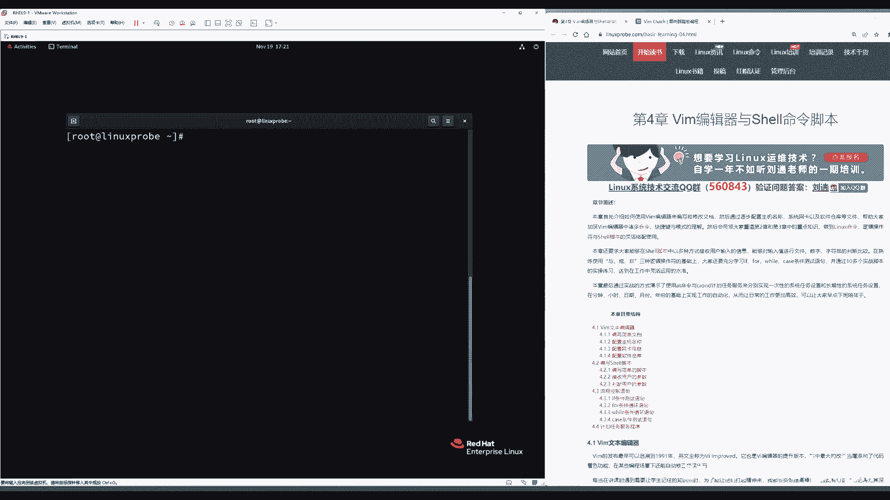

---

## 为什么学习Vim？ 🤔

上一节我们介绍了课程概述，本节中我们来看看为什么需要专门学习Vim编辑器。

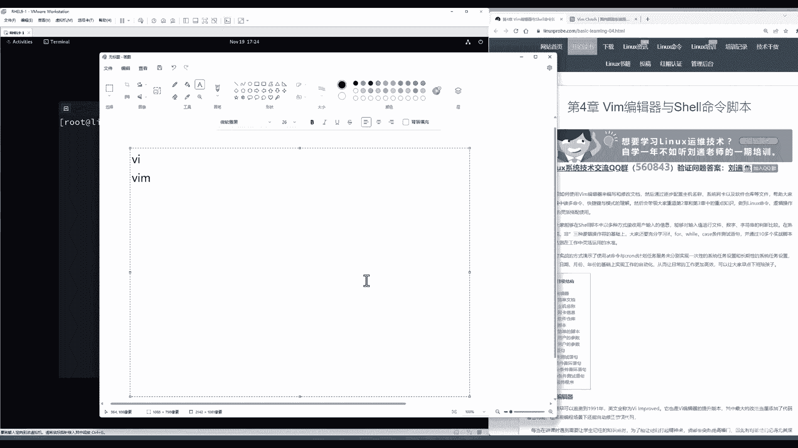

在早期的Linux版本中，编辑文件使用的是`vi`编辑器。从大约2012年的RHEL 6版本开始，默认的编辑器变成了`Vim`。`Vim`是`Vi IMproved`的缩写，意为“增强版的Vi”。

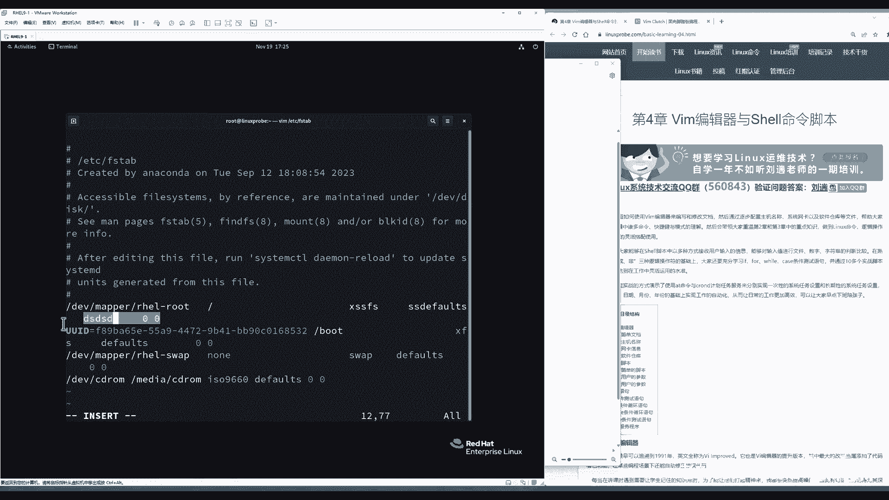

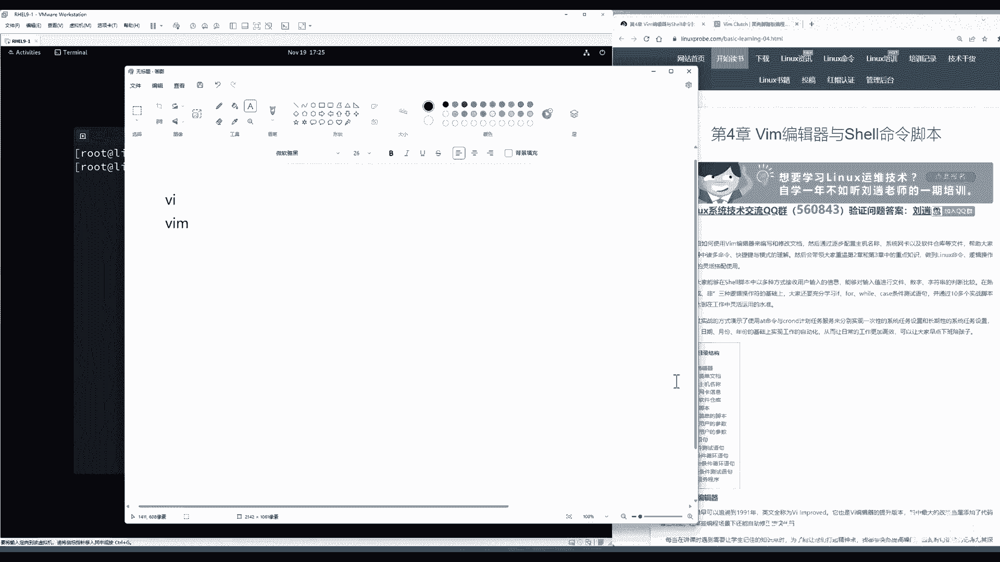

对于记事本这类工具的性能提升通常是抽象的，但Vim相对于Vi的核心提升在于**语法高亮（着色）功能**。Vi编辑器是纯黑底白字或白底黑字的界面，非常单调。在编辑配置文件或Shell脚本时，如果写错关键词，很难直观地发现错误。

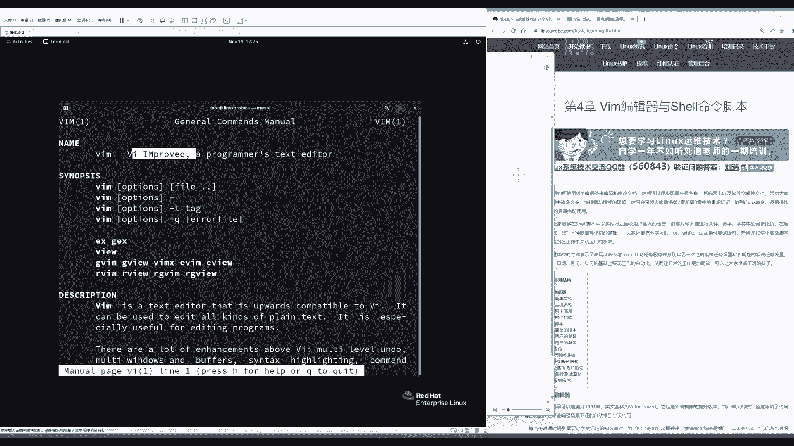

Vim编辑器则不同，它能为不同的关键词提供颜色标记。例如，在RHEL 9中打开`/etc/filesystems`文件，可以看到不同文件系统类型有不同的颜色。如果故意写错一个关键词，错误的文本会以醒目的颜色（如红底白字）显示，帮助用户快速定位问题。

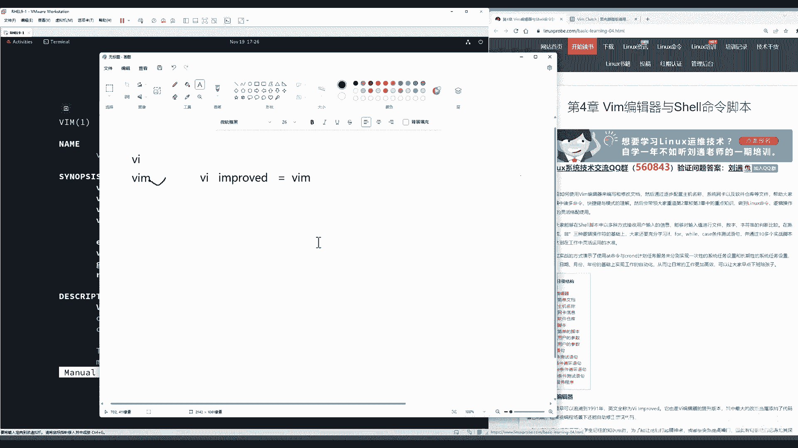

因此，只要条件允许，我们都推荐使用功能更强大、对用户更友好的Vim编辑器。

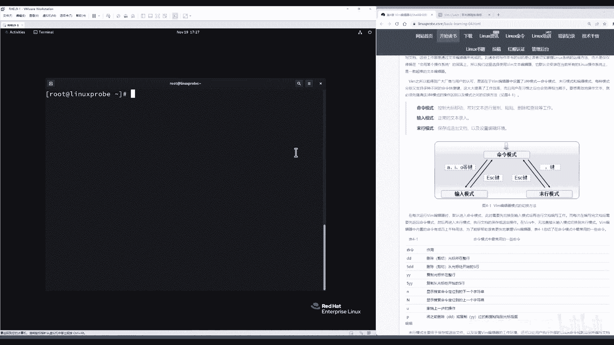

---

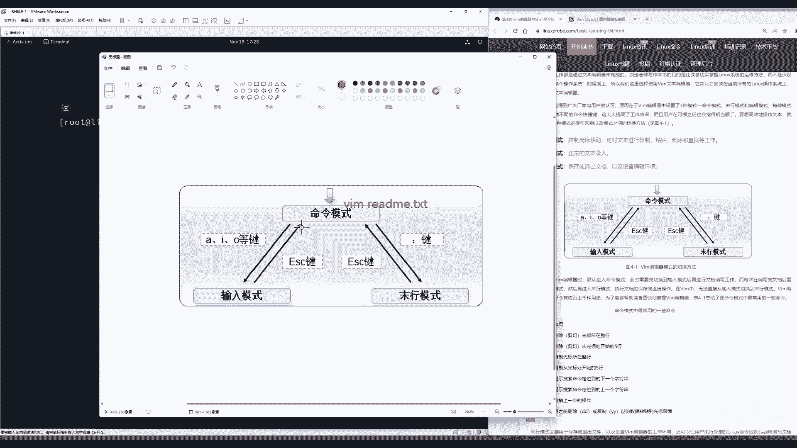

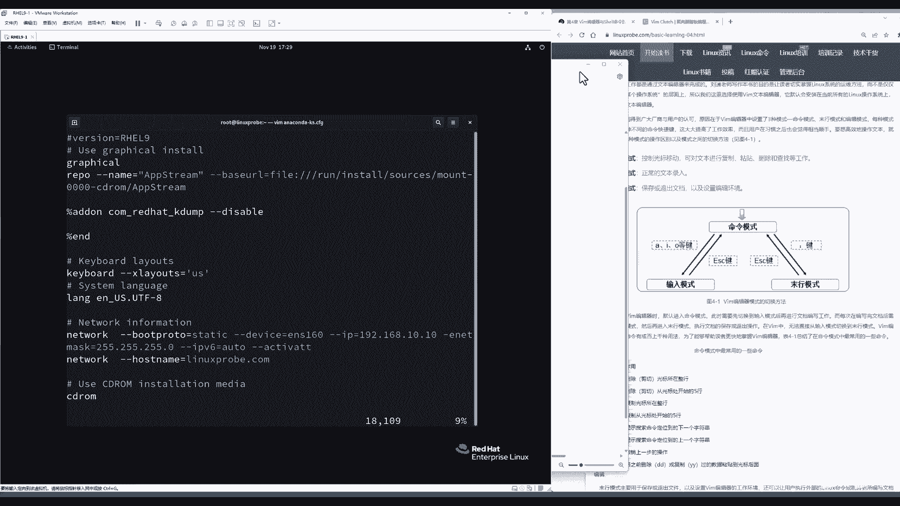

## Vim编辑器的三种工作模式 🔄

了解了学习Vim的必要性后，本节我们来深入探讨Vim的核心工作机制——它的三种工作模式。这与Windows记事本有本质区别，也是Vim功能强大的基础。

Vim编辑器拥有三种工作模式，这是其强大功能的基石：
1.  **命令模式**
2.  **输入模式**（也称插入模式或文本模式）
3.  **末行模式**（也称冒号模式）

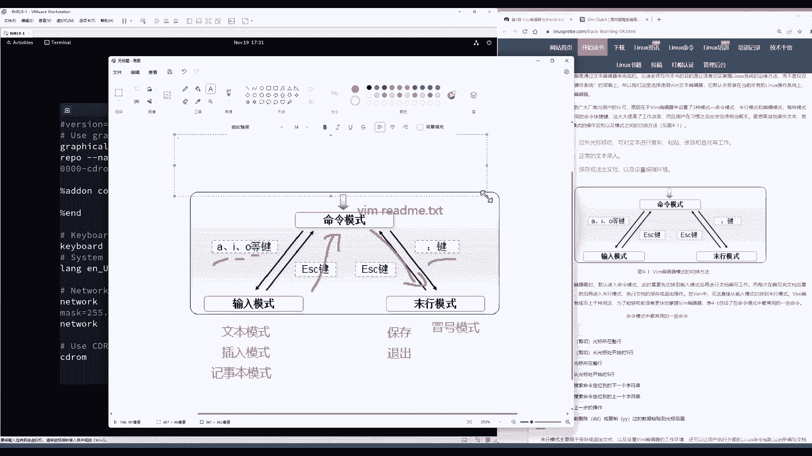

**命令模式**是启动Vim后默认进入的模式。在此模式下，用户可以执行一些快捷命令，例如删除、复制、查找等，但**不能直接输入或编辑文本内容**。

**输入模式**是用于自由编辑文本内容的模式。需要从命令模式切换进入。

**末行模式**主要用于保存文件、退出编辑器以及进行一些全局设置（如显示行号、替换文本）。需要从命令模式切换进入。

**重要规则**：
*   输入模式**不能直接**切换到末行模式。
*   命令模式是切换的中枢：从命令模式可进入输入或末行模式；从后两种模式需先返回命令模式，才能再切换到另一种模式。

---

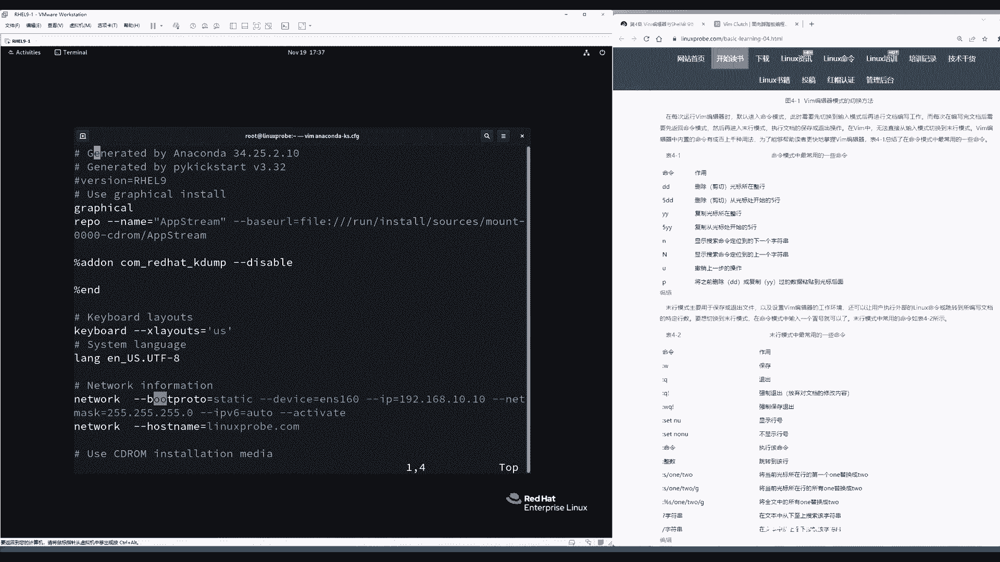

## 命令模式下的常用操作 ⚙️

上一节我们了解了Vim的三种模式及其关系，本节中我们重点看看在命令模式下能执行哪些高效操作。

在命令模式下，可以执行多种命令来快速处理文本，而不是逐字编辑。以下是常用命令列表：

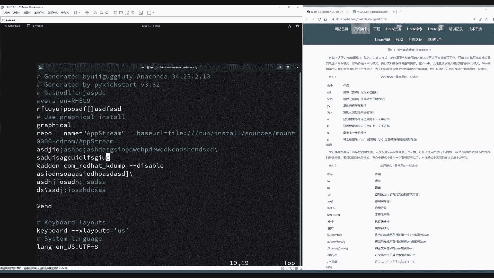

*   **删除/剪切行**：将光标移动到目标行，输入 `dd`。此操作会剪切该行，如果不粘贴，效果等同于删除。
*   **粘贴内容**：输入 `p`。每输入一次，会将剪切或复制的内容粘贴一次。
*   **复制行**：将光标移动到目标行，输入 `yy`。
*   **批量操作**：在 `dd` 或 `yy` 前加数字，可批量剪切或复制多行。例如，`3yy` 复制光标所在行及下面两行，共三行。
*   **查找文本**：输入 `/`，后接要查找的关键词，按回车。例如 `/linuxprobe`。
*   **查找下一个/上一个**：输入 `n` 跳转到下一个匹配项；输入 `N` 跳转到上一个匹配项。
*   **撤销操作**：输入 `u`。每输入一次，撤销上一次操作。

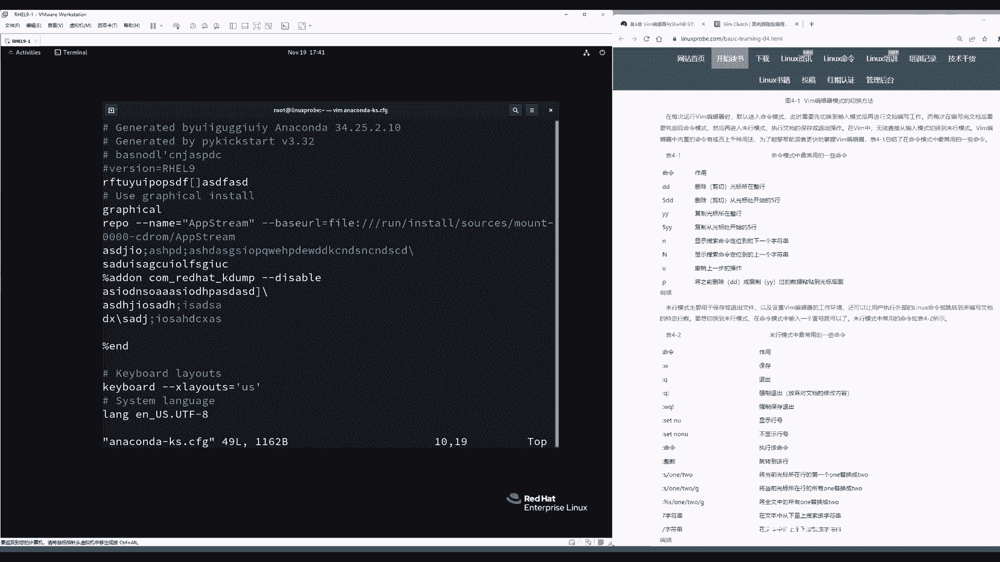

---

## 模式切换与文件保存 💾

掌握了命令模式下的高效操作后，我们来看看如何在三种模式间切换，并最终保存我们的工作成果。

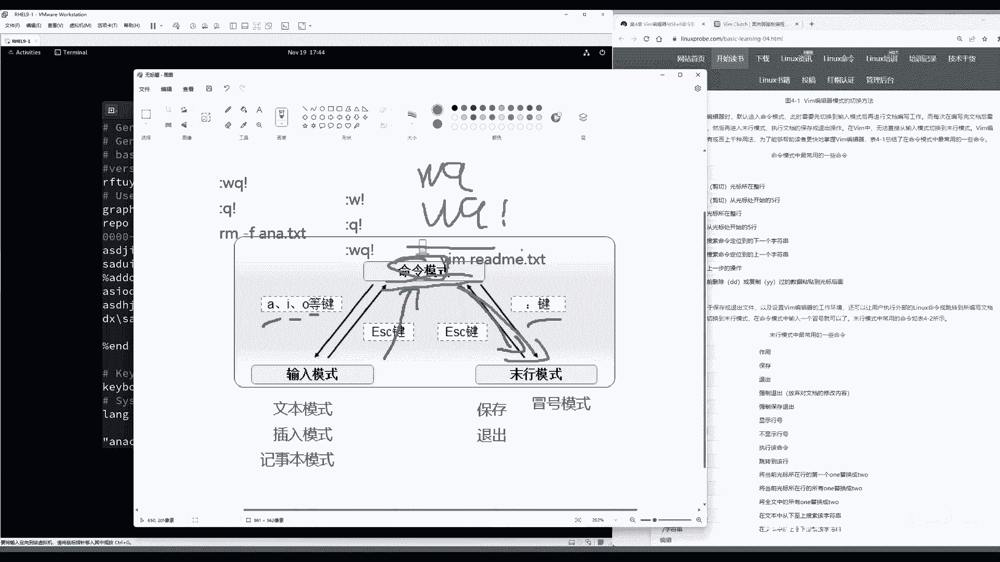

以下是切换模式与保存文件的关键步骤：

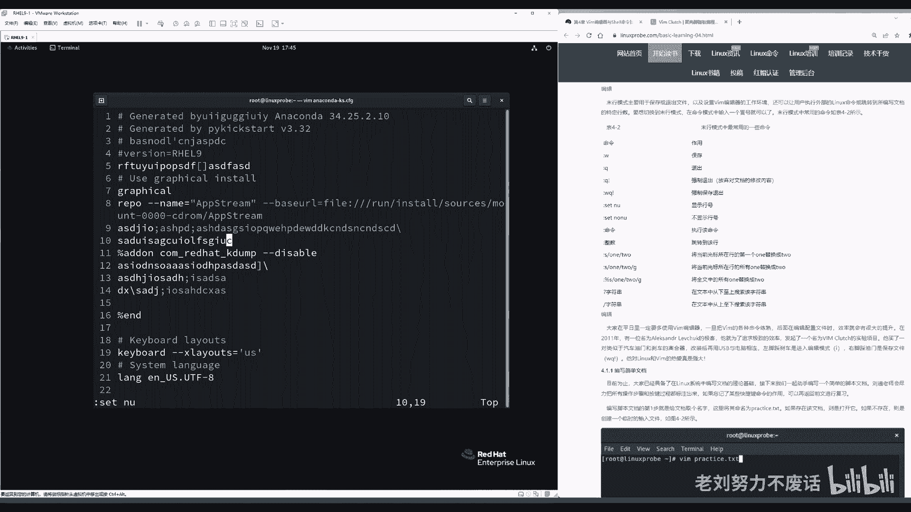

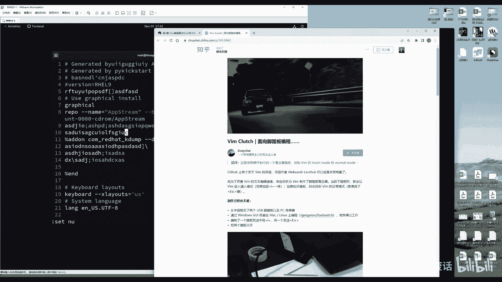

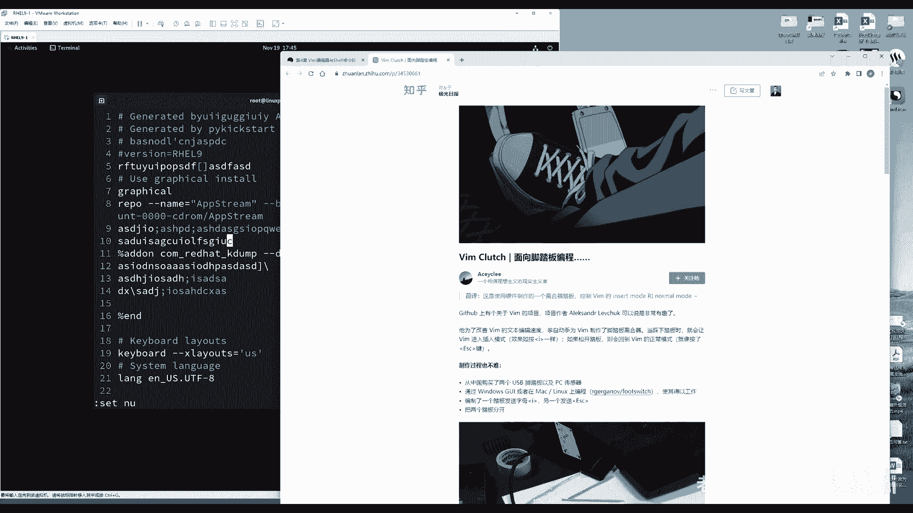

*   **进入输入模式**：在命令模式下，按 `a`、`i` 或 `o` 键。
    *   `a`：在光标**后**进入插入模式。
    *   `i`：在光标**前**进入插入模式。
    *   `o`：在光标所在行的**下一行**新建空行并进入插入模式。
    *   （`a`和`i`在实际编辑中区别不大，`o`键在需要换行输入时非常方便。）
*   **返回命令模式**：在输入模式下，按 `Esc` 键。
*   **进入末行模式**：在命令模式下，按 `:`（冒号）键。
*   **保存与退出（在末行模式下）**：
    *   `w`：保存文件。
    *   `q`：退出Vim。
    *   `wq` 或 `x`：保存并退出。
    *   `q!`：强制退出，不保存更改。
    *   `wq!`：强制保存并退出（常用于处理权限不足或跳过确认提示）。
*   **显示行号**：在末行模式下，输入 `set nu`。

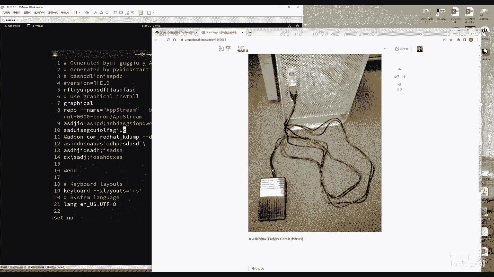

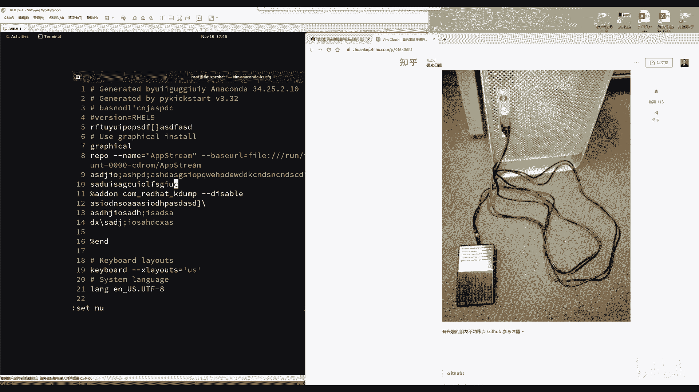

**操作习惯建议**：对于初学者，建议养成“编辑在输入模式，保存退出在末行模式”的习惯。虽然命令模式下也有快捷保存方式（如`ZZ`），但明确区分模式有助于理清思路。保存时使用 `wq!` 可以避免大多数二次确认提示。

---

## 动手实验：编辑你的第一个文件 🧪

理论需要实践来巩固。本节我们将通过一系列简单的实验，亲手操作Vim，完成文件的创建、编辑和保存。

以下是四个由浅入深的实验步骤，请跟随操作：

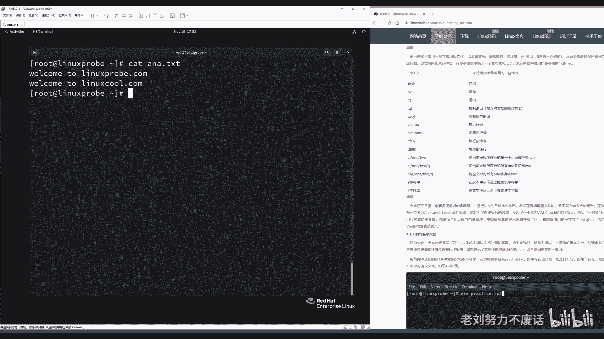

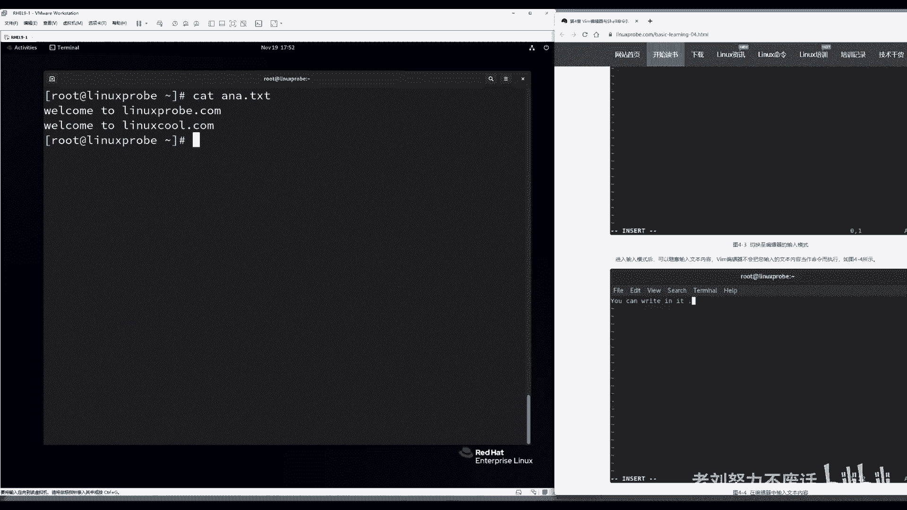

1.  **创建并编辑新文件**
    *   执行 `vim hello.txt`。文件不存在时会新建。
    *   默认进入**命令模式**。按 `a` 键进入**输入模式**，此时左下角出现 `-- INSERT --`。
    *   输入文本，例如 `Welcome to linuxprobe.com`。
    *   按 `Esc` 键返回**命令模式**。
    *   按 `:` 进入**末行模式**，输入 `wq!` 按回车，保存并退出。
    *   使用 `cat hello.txt` 查看文件内容。

2.  **编辑主机名配置文件**
    *   执行 `vim /etc/hostname`。
    *   在命令模式下，使用 `dd` 删除原有行。
    *   按 `i` 进入输入模式，输入新的主机名，如 `linuxcool`。
    *   按 `Esc` 返回命令模式，再按 `:` 进入末行模式，输入 `wq!` 保存退出。
    *   （主机名重启后生效，此处仅练习编辑操作。）

3.  **编辑网卡配置文件（了解路径）**
    *   在RHEL 9中，网卡配置文件路径可能为 `/etc/NetworkManager/system-connections/`。
    *   进入目录并使用 `vim` 编辑对应的连接文件（如 `ens160.nmconnection`），尝试修改一个参数（如IP地址）。**本实验重点在于使用Vim打开和编辑指定文件，无需关心网络配置的具体细节**。

4.  **创建YUM/DNF软件仓库配置文件**
    *   执行 `vim /etc/yum.repos.d/rhel9.repo`。
    *   在输入模式下，输入以下示例内容（无需理解具体参数）：
        ```ini
        [BaseOS]
        name=Red Hat Enterprise Linux 9 - BaseOS
        baseurl=file:///media/cdrom/BaseOS
        enabled=1
        gpgcheck=0

        [AppStream]
        name=Red Hat Enterprise Linux 9 - AppStream
        baseurl=file:///media/cdrom/AppStream
        enabled=1
        gpgcheck=0
        ```
    *   编辑完成后，按 `Esc` 返回命令模式，再按 `:` 输入 `wq!` 保存退出。
    *   使用 `cat` 命令验证文件内容。

**实验核心目标**：在这些实验中，请将注意力集中在 **Vim编辑器本身的操作流程**（模式切换、编辑、保存）上，暂时不必深究所编辑配置文件的具体功能。成功打开文件、修改内容并保存，就是本课最大的胜利。

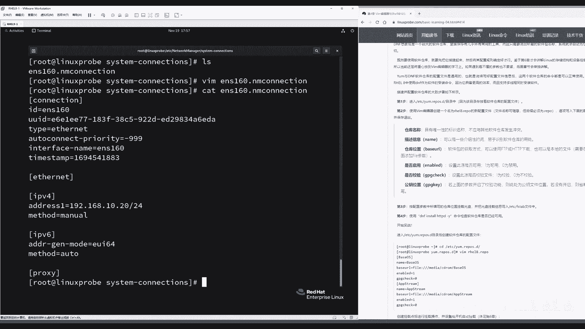

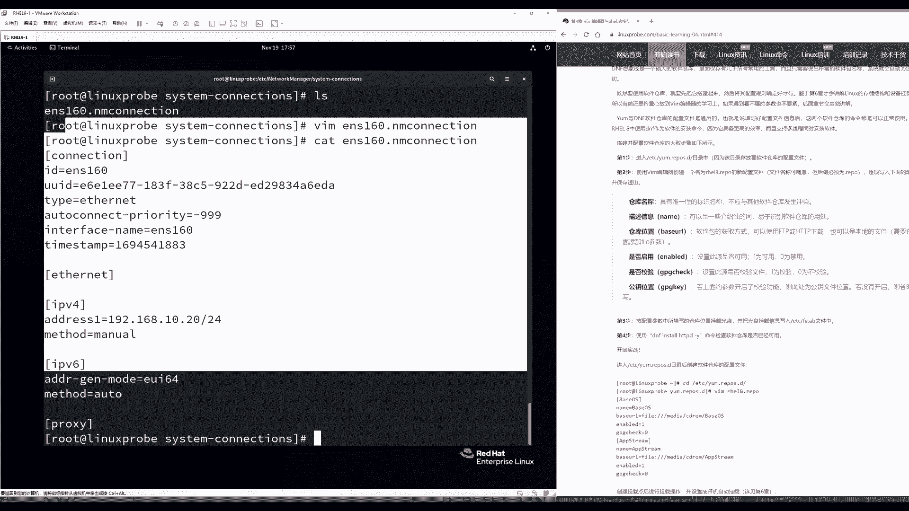

---

## 总结 📚

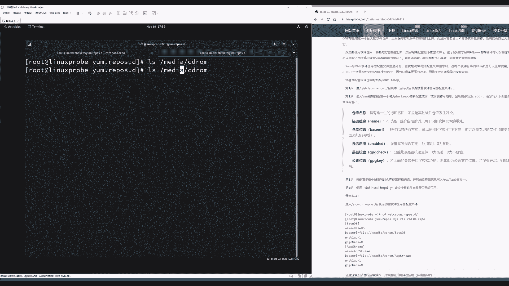

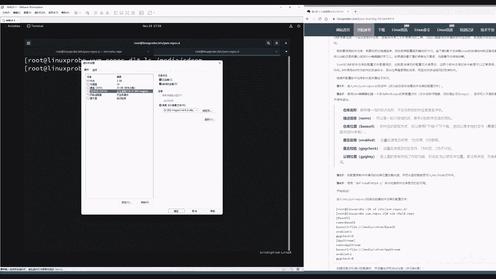

本节课中我们一起学习了Linux下强大的Vim文本编辑器。我们从学习Vim的必要性讲起，重点掌握了它的三种工作模式（命令模式、输入模式、末行模式）及其切换方法。我们详细列出了命令模式下的高效编辑命令，并完成了从创建、编辑到保存文件的完整实践。

记住核心流程：**打开文件（命令模式） -> 按 `a/i/o` 编辑（输入模式） -> 按 `Esc` 返回 -> 按 `:` 输入 `wq!` 保存退出（末行模式）**。多加练习，你一定能熟练驾驭这个Linux系统中的编辑利器。

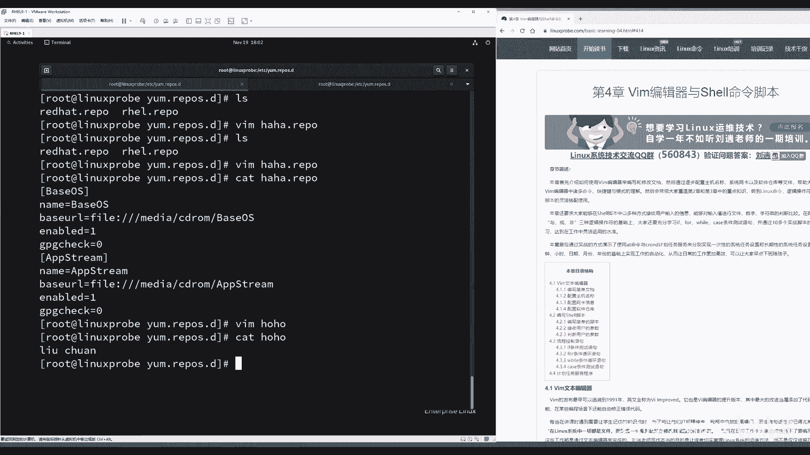

请务必完成课中的实验，巩固知识。下节课，我们将进入Shell脚本编程的世界。