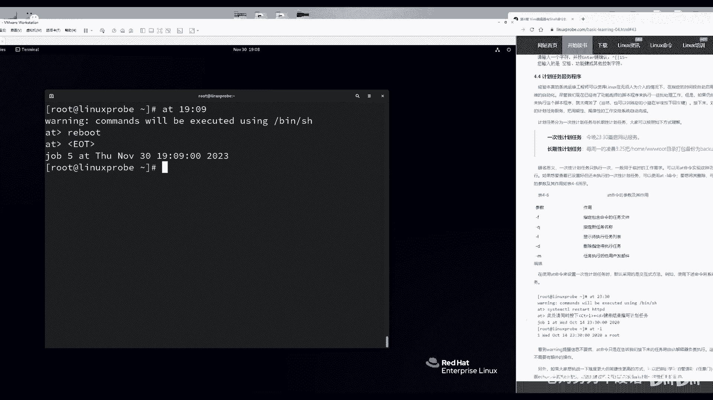
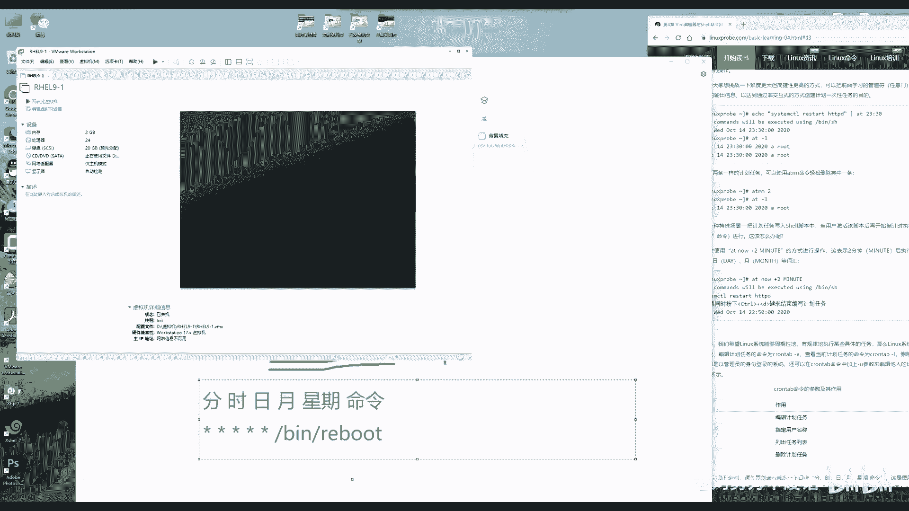

# 第4章 Vim编辑器与Shell命令脚本（下）（Linux就该这么学） - P1 - 老刘努力不废话 - BV1Be411U7ot

Hello，同学，欢迎来到咱们的红马HCE9版本的视频课程，今天是第11天了，继续来学习一下第四章节，讲两个小节，4。3小节，4。4小节，我们把第四章节下半部分给他收个尾，同学们先准备一下实验环境。

然后来开始咱们今天这个实验啊，就是我们上节课讲了什么呢，讲了我们的编辑编译器，以及在这个编译器里边去写一个简单的脚本，一个脚本是由三部分组成的，简单回忆一下是不是脚本的声明，脚本的注释。

脚本的命令啊对吧，那么我们要命令，这也是最核心的，但是我们上回也遇到了一个问题，就是我们的命令他都是按照这样的一个顺序的，这样的一个方式来去执行，它是一个命令的一个堆积体，如果说某一条命令它执行失败了。

那么它下面的一个命令也会继续去执行的话，就可能导致整个这个服务器出现问题，那我们给大家举一个，举一个生活上的一个例子啊，同学们一边准备着这个实验环境，一边我们来看一下这个小例子啊。

贾玲说今天想约一个女朋友啊，贾贾贾丁说今天想约一个女生，还没到女朋友这个呃这个程度啊，去吃个饭，那假设说我们之前这个命令，是按照这样的一个顺序关系，来进行一个叠加的对吧，那第一步先要见面。

第二步就下手机号码，第三步吃个饭，然后我们入按照顺序去执行，如果每一步都是呃，这个正常顺利的话也没有问题，但假定去约一个女生出来吃饭的第一步啊，见面啊，这个聊天没有问题，结果可能聊了之后感觉不是很合适。

第二步失败了，那么手机号没有要到，那么第三步，第四步，第五步，那么也就可以把票给退了，因为他也不会往下来去执行，同样的对于我们这个脚本一样的，那我们去新建一个目录，然后把目录。

然后我往目录里面去写入这个数据，再去开启，比如说网站功能，然后第四步让用户进行一个访问操作，那假设说我们去新建这个目录的这个操作，它都没有权限，那么后面这个所有的操作，如果要真的去执行的话。

就会导致权限不足啊，或者整个服务器的一个出问题，那么这个时候就要加入一些判断语句啊，总之就要加入一些判断语句了，原先去执行的命令，它既然是从上往下，大家看啊，假设说一条横线是一个命令的话。

需要大家脑补一下这个想象力啊，那么我们现在就要进行一个判断了，若某一条语句它是执行成功的话，那么才会去执行这个语句，若执行失败的话，他可能会去执行第二条语句，根据他的实际情况来去调整。

它要去执行的具体的操作，诶这个我们把它叫做条件测试语句，还有什么呢，就是叫做循环语句，如果一个事情需要反复去执行很多次啊，比如说像清理系统里面的垃圾啊等等等等等，它有这种周期性的，或者说它需要自动的啊。

再或者说它需要一直去清理，直到没有垃圾了为止，它可能不限于一次两次，也它也许是三次四次，它也有可能是一次两次，那么这种叫做循环语句，这就是我们第三章节4。3啊，这个啊我们这个第四章节第三小节。

要给同学们去深入去讲解的，大家可以来把我们这个今天这个课程，跟之前我们昨天所学习的内容融合到一起，来，进行一个搭配性的使用，然后我们会发现随着这个不断的学习。

在编写shell脚本的这个代码的话也会越来越长，命令会越来越多，越来越复杂，功能也会越来越准确的去满足工作需求。

好了说了很多废话，主要是主要的目的是让同学们只准备一下，实验环境，前面的课比较简单，所以您可以一边听课，一边去做这个实验，准备好了吗，还没准备好的视频暂停一下，那我就不再等了啊。

咱们每节课等2分钟就说就OK了，3分钟了，来我们现在去写这个shell脚本，使用编辑VM去打开它，这个文件名称是无所谓的，所以我就还用呢，哈哈点test啊，不，那我们就用拿啊哈哈点SH来去呃。

创建出来这个文件，这个文件首先要有一个脚本的声明，不论你干什么事，那这个起码的礼貌要有，就是病里面的by是要写上脚本的声明，谁可以去来去执行这个脚本，现在其实无所谓的。

因为但是我们如果要以路径的方式来去执行，这个脚本，这个你要是不写以后只吃亏啊，就信老刘就完了，那就先写上他接下脚本的注释，这也无所谓了啊，我就随便写一个，比如welcome to啊，随便写了啊。

就是linux probe co，大家老说老刘这个语速快啊，说这个语速减的快，就是有这个减速非常的快，结果我那天我还看了一下，为什么要写一个广告呢，后来我那天看了一下那个B站啊，就哔哩哔哩网站上面。

你说咱们的学员就是好啊，生怕其他同学看不到，然后我就我咱们这个课，视频已经录到第11天了，我看了一下前面的十天的课，都有人都有同学已经上传到哔哩哔哩上面了啊，这个其实哎呀这样行为也不太好。

但是的话呢咱也没办法了啊，咱就只能是全全凭我们同学们的自觉，但是就是我发现啊，我这个语速放到哔哩哔哩上面之后真合适啊，特别合适，而且这个同学们看视频的反馈都特别的好好了，我就继续保持了好。

那我们话不多说啊，然后开始去编写一下这个脚本，第一个条件测试语句的话呢，对所以我打个广告，所以打个广告啊，然后再去说一下，让同学们知道你看这个视频哪来的啊，我们这找一下它的根源啊。

来接下来因为你不仅能够看到视频，你访问这个网站，还能看到书呢，我们准备的资料还是挺齐全的，来我们现在是这样啊，我们先去写一个Python语句，就是如果要是满足一定的条件，那么就可以去执行这个。

我们叫做if条件测试语句，去使用一个if，如果您之前没有学习过编程语言的话，那么可能看这个有点复杂，那么好啊，您可以看一下这张图啊。

这张图会有一个简单的结构介绍，就是你可以一边听课一边看书啊，我只是给大家说一下，如果说您没有输没关系，我把这个图给它粘到屏幕上面，考虑的很周到啊，啊放在这个屏幕上面，您看一下大概的结构。

然后我去敲的时候，你就知道我敲的是什么了，如果要有书的话，要低头看书，嗯好首先一看啊，我们先去进行一个if条件测试语句，如果条件满足的情况下，那么则会去执行某一个语句，就是一个赞嘛，然后就啊。

当我们当我们结束掉这个判断语句之后，那么就会去结束掉这个判断语句，好了呃，翻回来去说一下啊，首先呢给大家一个条件测试语句。

如果什么什么什么这样一个情况，那么我们就那么怎么去做好，我现在可以这样啊，假设说定义一个变量啊，按照书上来讲吧，假设说我定义一个变量叫做DL，那他的话是一个目录名称，home目录里面的3w RT。

假设说是这样的一个路径，判断一下这个目录它是否是存在的一个杠小E，判断它是否是一个文件，它只要存在即可啊，那么我们如果判断为目录的话呢，它是一个杠D啊，判断出它是不是一个目录，然后写上变量的名称。

记住啊，有两点，第一点中括号的里边一定要有一个空格，那一定要有一个空格做间隔，第二点的话呢就是变量要想提取出来，里面的只需要加一个dollar符，哎这个一定要记住小细节小细节。

我们学习LINUX的同学呃，就总是会很痛苦，为什么呢，明明密都执行成功了，那他不啊，明明明都写对了，参数也写对了，对象也写对了，然后我们做这个所有的参数也都准备的很呃，正确的情况下。

结果发现一个空格怎么没这个，那这个没有解也会导致这个命令执行失败，所以一定要注意这种小细节，一定要注意小细节哦，我们现在这个操作就是有一个变量，变量里面对应的一个目录，然后判断一下这个目录是否是存在的。

如果要是存在的，我们怎么样，如果要是不存在怎么办呢，我们取一个反之前是存在的，判断它是否是存在的，现在判断它是否是不存在的，如果他要是不存在怎么办呢，那么则创建出来这个目录，这个很好理解。

同学们这个非常简单啊，然后我们就直接就把它给结束掉，它我现在提给大家提两个问题啊，如果说您认为已经明白了，那我们现在给大家提两个问题，没有明白就暂停视频再去琢磨一下来，第一个是啊，先提第一个问题。

请问我们现在判断的是这个目录，它是在还是不在，那么是不是就是判断他是不是不在的呀，为什么这个有点复杂，就是说首先它是一个目录名称，然后我们对它进行一个判断，判断它是否是存在的，但是我们取了一个反值。

等于说加了一个不哎负负为正，但它只有一个负，就是判断这个目录它是否是不存在的，好这是一次好，第二个问题，请问一下，如果说目录已经存在了，会去执行里面的操作命令吗，这是第二个问题，那么答案是否定的。

之前给大家讲到了。

我们的命令都是从上往下来去执行，这样大家看好了1234的命令，然后我们往下去执行，但是现在不一样了，我们进行了一次判断，只有条件满足的情况下，只有条件满足的情况下，才会去执行某条具体的命令。

所以当条件满足了才会去执行这条命令，如果要啊，如果条件不满足的话，则不会去执行里面的命令，好我现在给大家来保存一下，我这个脚本非常简单非常简单，然后来去查看一下这个目录是否已经存在了。

查看一下目录上面的权限，可以看到目录是不存在的，于是跑一下这个脚本，等你再查看一下，哎它就存在了，因为条件它满足了，那他对他会去执行这个语句，它不存在，把把它给创建出来，这就是一次判断吧。

如果说以后工作的时候，如果目录已经存在了，就没有必要再去创建一次这个目录了，或者说当这个用户已经存在的时候，那我们就诶这个很好一个小例子啊，同学会之后自己做一下，如果这个用户已经存在的情况下。

那我们就不去啊去创建出来，这个用户之间大家都用就好了，这个非常的简单，非常的灵活好，现在啊同学们是不是已经渐入佳境了呢，这种感觉非常的奇妙啊，原来我还能够判断，就是我原来我还能跟你这样的一个呃。

当前服务器的一个情况，来去调整语句的执行顺序好了，那我现在来给大家正式引出，咱们今天这个课程了，叫做if条件语句，是不是先勾起大家的这个学习，这么一个兴趣了呢，叫条件判断语句，根据条件来进行判断。

所以叫条件判断语句，它分为了三种，第一种叫单分支，第二种叫做双分支，第三叫做什么呢，叫做多分支，好，很好理解，单分支就是我们刚才做的这个实验，只判断一次，只判断成功和失败，你只要成功了，我就去执行。

你要是没有成功，我就不执行，就加个单分支，说分值就是判断怎么样呢，两次当你成功的时候，我们则会去执行这个语句，当你不成功的时候，我们还有一个最后兜底。

也就是说要么成，要么不成，两种情况，叫做这个双分支来，同样我们每一个例子啊，都给大家尽可能的举不同的这样的一个嗯，脚本的功能的这个实验，所以把这个刚才那个实验就抛就抛弃掉了。

我现在来给大家做第二个实验了，第二个实验有一个前置条件啊，前置的一个小知识啊，拼命你记得吗，拼音是用来去检查网络连通性的啊，看一下网络是否连通，如果说能够拼通，证明该主机是在线的啊。

由于我们现在没有学习网卡的配置，现在当前都以它为例啊，127。0。0。1啊，本地的环回地址测试一下网卡有没有成功啊，就是配置好就好了啊，驱动有没有启动就好了，来拼一下，可以看到这台主机的话呢。

当前是在线的，我们能够跟他产生一个互动嘛，我们进行了一次信息的传递，好判断一下这个呃呃主机是否是存在的，它不它是否是啊，它是否是存在并且在线的，那么我们可以用到拼命令，大家会发现啊。

windows跟拼音的区别是什么，第二章节提到过这个问题，就是它会无限的拼，它会拼很多很多次，那好这是它它是一种存在的情况下，第二个情况的话呢，就是拼一个不存在的一个IP地址。

比如说拼一个我当前不存在的IP地址，192。168。10。50，假设说啊随便来了，大家会发现拼一个不存在的不在线的主机，它会显示出来这样的一个呃，不错啊。

destination house and a racheable啊，目标主机不可达，那会有这样的一个报错，但也是无限的去拼下去，除非你按CTRLC把它结束掉，那好了，我现在讲这个shell脚本之前。

需要先给大家去讲几个参数，拼命令里面，希望要想在LINUX里面去限定它拼的次数，我们需要加杠C参数，拼几次，我们以三次为准，然后拼I0。2秒，说明每次拼的时候那个间隔是0。2秒，为什么。

因为有些时候它显示time out，他会说请求超时，这种情况下有两个可能性，第一就是说主机是不在线的，我们发送过去的数据包没有一个明确的回的，它就它就没有一个回血，所以让我们等很长时间。

第二个情况的话呢，是对方的这个防火墙把它设成deny模式了，它会把我们的所发送的出去的，这SNP的数据包直接丢弃掉啊，而不进行一个明确的拒绝，它并不像那个reject一样。

他会给我们一个呃返回来的什么来着的，就是一个呃这这样一个拒绝的一个数据包，所以的话呢他会让我们等很久，这个时候我们就把它限定一下，说每次拼就0。2秒，然后杠W3，我们每一个数据包最多就只能你三秒钟。

如果你三秒没有回来，不论你是在线还不在线，我们都告诉你，你这个没有访问啊，没有访问成功，就等最多等三秒的意思来，192。168。10呃，不不不，我们换一个本地的环回地址啊，大家都能做成功的一个IP地址。

我因为我自己配了，到时候我第八章的时候会加油台，怎么去配，拼一下，可以看到P3次，每次间隔0。2秒，最长不超过三秒钟，可以看到这个会加快了这个脚本的执行效率，非常的快啊，而且很有意思的一个命令好。

接下来去写一下这个脚本，哈哈点SH删掉已有的保留广告，然后开始做这个小实验，你看啊，既然咱们已经讲到了，它就是要有一个条件语句，条件语句是的，这个什么呢，是拼杠C3拼三拼三次，每次间隔0。2秒。

最大响应时间为三秒钟，拼谁呢，我们要拼的是dollar1，这个脚本接收到的第一个参数，直接追加在这个脚本的后面的，大家会另外会看到啊，在这个角呃，命令执行过程当中拼命令，它不论是在线还是不在线。

都会在屏幕上面产生出来大量的无用的信息，为了让屏幕更加的清爽，我们决定把这个所有的正确的或者错误的，标准的或者错误的这个信息，全都使用叫做输出重定向符，写入到一个文件里面，来保证屏幕是干净的。

我们不想看这些过程，只看结果来输出到什么呢，这个叫做DV目录里面的NULLL文件，这个叫做黑洞文件啊，相当于就相当于就是啊没有回收功能的windows，就是它啊。

这这啊这就是windows里面那个回收站，只不过没有了回收功能，我把它叫做没有回收功能的这个垃圾站嗯，就是找东西进去了就没了啊，然后呢它对应的一个文件叫DEV目录里面的zero，这个叫做零块文件。

可以从里面无穷多去提取出来数据啊，叫做这个零块数据嘛，可以信息的填充啊，什么等等等等的，好，这个先不说，记住这个东西吧，它就是一个它就是一个垃圾站，那所有信息进去之后就被消失掉了。

所以现在这个命令的效果就是，把所有要具备去输出到屏幕上面的这个信息，输出到回收站里面，这样的话呢输入到垃圾站里面，这样的话呢我们写的屏幕非常的清爽，不会有问题啊，只看结果，不看过程。

这样的话我们能够一眼就找到重点好。

接下来再来就是判断一下，上一条语句是否是执行成功的，当时我们讲了很多个参数，比如说叨叨井和叨叨星号，叨叨123456789，其中有一个比较关键的是dollar0。

dollar0代表的就是啊脚本的名称还有什么呢，dollar问号对吧，dollar问号代表的是上一个语句的返回值，那好了，dollar问号我们可以回忆一下是吧，代表的是上一个语句是否执行成功。

在这个LINUX里面，一般情况下执行成功为零，非零为情况维持僵尸吧，好我们就判断一下，说它是否等于零啊，是否是等于零啊，如果说他的上一个语句的返回值分值为零，证明该主机是存在的，那它是在线的。

我们则输出说到了一个主机的IP地址，Is online，这个主机也是啊，就是这个在线的状态，还有一个else双重分支的条件，测试语句就是若成功则怎么样，若失败的所有的情况全部属于else兜底嘛。

就所有的战绩不符合，就都把兜底来到dollar1is offline，它就是离线的状态，就看它是否等于零范围值，如果零为零，执行失败啊，执行成功为非零，执行失败好。

我们现在给大家都设置成dollar1了，没有问题，大家可以来看一下啊，非常简单的一个小区里没有什么太多可说的，保存并退出，有经验的同学一看这个就已经嗯很好理解了，没有经验的同学没关系。

我们还会有更多的实验反复的去看看，它后面更复杂了，前面的你也就自然就会了，那来我们去输入一下IP地址，后面因为拼的是dollar1嘛，dollar1就是指的是嗯，这个脚本接收到第一个参数。

dollar0指的是脚本名称本身，所以按一下回车告诉我们这个地址是在线的，好输入一个不存在的IP地址，返回值为非零值，一般为一，所以它是offline，你看这就是正反两方面，你要么成功了。

我会去执行哪条语句，你要是失败了，我也不退出这个脚本哦，我是会去执行下面一个语句。

双重分支啊，双重分支我们要不然成功，要不然失败，成功或失败都有对应的方案，就叫做双分支，条件测试语句多分支什么意思，多分支指的就是我会进行多次判断，直到成功了为止，我会进行很多次判断。

比如说呃让用户去输入一个数字，然后进行比较，知道我们匹配到了为止，然后我们会进行很多很多次这样的一个比较，待会会跟这个while语句结合到一起。

做这个小实验啊，先不讲循环，先讲一个判断判断嗯，比如说我们的红帽考试啊，他是300分满分啊，210分及格，我一般情况下啊，我们同学啊考二百七八啊，还是没问题的，于是我可以做这么一个小小的一个脚本。

让用户去输入自己考试的这样一个分值，如果要是考到210以下，我那我会告诉你你没有考虑呃，这个通过如果你输了210~280，那我会告诉你这个分值还是很一般啊，如果你输280~300分之间，那么我会告诉你。

你考的很不错啊，就这么一个小脚本好，也就是进行一个多次判断，如果说你要是愿意的话，你可以把它细分，那么你可以把它细分成几十个判断语句对吧，比如说你0~155呃，比如说那从0~200分吧。

啊会告诉你这个考的真的太差了，然后200分的一二，那么200分的210啊，告诉用户说啊，这个虽然很遗憾，但是你很快就会及格了对吧，如果你考299，或者290到二百三百分之间，然后可能会给你输出说啊。

你的这个成绩有可能冲一下满分哦，下回继续努力啊，就是啊，就这样你可以去细分啊，这叫做多重分支的条件测试语句，可以根据你的需求进行多次的无限的进行判断，我只做这三个就好了，不做太多，首先在这个实验之前。

先要有，先要有能力去接收用户输入的，这样一个数字数值，后来我想了一下啊，如果还用那个dollar1，是不是有点太糊弄大家了啊，是不是啊，因为现在我们不仅是我们的这个学员们在看，还有很多其他读者们也在看。

竟然还有哔哩哔哩的网友们也在看啊，我们讲课要稍微严谨一点，有点难度啊，就在用DOL一点说不过去了，好糊弄，所以我选择用一个叫做瑞的命令来去读取，使用瑞的命令去读取一个用户输入的值，诶把它复制啊。

然后把它赋值给一个变量，然后对这个变量来进行判断，你看这不就学了一个啊，让用户去输入的这么一个命令吗，很有意思啊，来我去read一下，读取用户输入的一个值，接下来的话呢赋值给一个变量。

比如说叫做grade，叫成绩，是这样的，同学们啊，如果你不给我提醒，我怎么知道要去输入信息了呢，所以要给他一个这样一个呃，杠小P指的就是让用户去输入一个值给，并且给他一个提醒的意思。

杠小P随便给他一个提醒啊，我就这样了，从1~300分，你去输入一个这样一个成绩的意思，300冒号啊，你看啊，这样的话呢我们不仅能够让用户输入一个值，赋值给这个变量。

并且还会在用户该输入的时候给他一个提醒，特别的人性化啊，感觉很温馨，来判断一下说如果说用户输入的这个值，这个值啊，一定要dollar符号提取出来，这个变量里面的值啊，不能说变量名称。

变量名称本身没有任何的含义了，是否大于等于a great，and这个呃就是我们进行一个判断语句，great and equal啊，就是这个大于和等于的意思，大于等于200嗯，一十分嗯。

我们这样我们判断一下说嗯这个值是否大于great，great equal是否大于等于210分，并且这个叫做并且了，我们这个值是否小于等于了嗯，grade great ul e li呃。

呃less equal是否小于等于300，好，我这样啊，因为我们跟书上不一样，所以我需要反应一下，判断一下用户所输入的值是否大于等于200，一，小于等于300，那好就是说及格的这个范围。

那我们就会去输出，说你的成绩是及格了的，则输出呃，呃最好他有空格啊，他有空格的话，引号给它括起来严谨规范，great is pass啊，就是它通过通过了嗯，这样接下来再来啊。

else if我们可以再缩写缩写成叫做ELF嗯，如果说这个前面一个语句没有判断成功，那么则要进行第二次判断，判断它是否是从零分great，Great equal，它是否是从零分到，等一下啊。

你看咱们就是主打一个手枪啊，它不能等于210了，因为210已经被匹配走了，所以就是一个t less than，就是小于的意思，小于210分，那么如果他这个输入的值是200，是从0~210。

最后许叔叔说你没有执行失败了啊，就说我就说你这个没有通过了啊，failure啊对吧，就是这样的一个报错，如果说这两个都没有满足的情况下的话，那么就是else如果既没有满足这两个，那么则是输出啊。

这个成绩的话呢，这个你输入有问题才会去输出一个报错，这样的一个字样好，最后把它结束掉，记住啊，我们只要开启了这个判断，或者开启了一个循环，最后一定要把它给F2，把它翻译过来，就是这样的啊。

这个真的可爱，我当时2015年的时候，第一次讲课，那有同学就问过这个问题，说说我们要继续在做，那我们再去写这个判断语句的时候，其实大家都有这个习惯，再去写这个HTML这样的一个语。

再去编写网页语言的时候，我们去写一个段落啊，或者怎么样，或者我们去写一个块，是不是都要有这个开头，还有结尾啊，就像写C语言一样，它都是这样的啊，再去写Python的时候，我们是不是都要有一个开始。

有一个结束啊，告诉我们这个语句，它是它们它已经被这个终止掉了，然后当时2015年的时候，同学问我这个问题，那这个呃那么如果说前面这个if后面的话，他后面写着FI好，可以看得出他是反写。

那么我们后面还有什么呢，比如说do结尾的就是down啊，然后还有一个语句，比较那个嗯比较这个好记啊，叫做kiss啊，就是呃kiss我们对它来进行一个判断吧，它相当于就是也是一个多分支的一个判断语句。

那么它翻译过来就是ESAC，同学们可以来记一下啊，再去写这个条件测试语句和循环语句的的时候，那么就是你的开头要有一个结尾，然后可以来记一下这三个结尾分别是什么，待会就直接用，就直接用就好了。

那我不再分别去介绍了，提高到时候点效率啊，来ESAC可以看到他就是把反写ESAC，2015同学们就问到我这个问题，后来我还真的是因为当时同学们是单独问的，我这个结束符啊，后来我还真翻译了一下。

我说这个一个E开头的单词怎么念啊，后来才发现他是一个反省的一个嗯，这样一个状态其实很好啊，其实这也算是程序员之间互相的一个嗯，小默契嘛。

会心一笑啊，那就是把它翻译过来啊，那么既然前面是IF前结尾就是啊就是F2，来点一下保存并退出，做好之后来拜一下，就不用再去DOTA1了，显得很没有水平，可以直接按一下回车用read来去读，我输入一个值。

假设说这个值是为二百五，我考了250分，按一下回车报错了啊，漂亮啊，看一下啊，嗯else哦你看我因为我这边我的else吧，我没有写那个字，你看他这个格式要求非常严格，保存并退出，当然了。

我这是一个录播视频，所以我就不怪大家没有提醒我了，来按一下回车好，现在再去数一下这个值啊，二百五，来按下回车嗯，他说我们还没有写那个字，我看一下啊，不好意思，同学们秀秀秀一下智商啊，不好意思啊。

秀的智商来，我们点一下保存并退出，刚才那个不是一个技术问题，这是一个态度问题啊，这个字是加了语气的，后面的，不好意思啊，真的是有时候一着急啊，该忘的全忘了，来点一下保存并退出，按一下回车来再跑一下。

第三次啊，当就当做前两次没有发生过，我也我也就不剪视频了啊，A1下回车，然后A1下二百五啊，A加回车，他说250分，这个分值是通过了啊，没那没毛病啊，非常简单，再来我出一个150。

告诉我说这个成绩没有及格啊，那下次再努力吧，如果说我现在输入一个零，那么它好了，它也是这个啊，换算是失败了啊，为什么呢，因为他等于说嗯怎么讲，他这个成绩是没有合格的，他但是他也符合第一个。

但是他但是他也符合第二个判断语句吗，因为第二个判断语句我发现有一个小问题啊，因为这个我们没有按照书上去讲，所以我这有点小问题，我这边判断语句是从0~210啊，于是我刚才这边应该写成0~210啊。

因为也有可能因为0~300，因为也有可能同学们没有去考试啊，直接拿零拿零分啊，毕竟能拿一分的啊，来A1下，回车继续来判断一下，如果说我现在再来重新判断一下啊，一个二百五通过了，一个150是没有通过。

如果一个零，那么它也是没有通过，因为它符合第二个判断语句，但如果说我现在给大家提个问题啊，如果说我现在输入的值是500分，那么他最后显示出来这个结果会是什么呢，有两个情况，第一个情况是程序崩溃了。

就像刚刚一样啊，程序崩溃了，虽然看起来好像不是老刘有意而有意而为之的。

但是如果说出现这样的一个情况，那同学们可以在屏幕上打一个一，就是你认为会不会报错啊。

会报还会崩溃成这个样子，第二个情况的话呢，就是它会输出通过或者失败，或者会有一个报错一个字样，于是我们会看到它输出的一个这个，我们想看到的错，这样的一个提示报错啊，这样的一个字样是不是为什么呀。

我们去想啊，为什么会做都变成这else呢。

是因为这个分值啊，我们就给大家画一个数轴去讲一下，这个分值的话呢，这个区间实际上都是人定的多重分支的if条件，测试语句判断到最后最后都是else，来给大家画一个数轴啊，假设说这个数轴是一个X轴。

那么好了啊，大家看好啊，如果这个轴是X轴，那么我们取一个原点为零分，那么从0~210分，这个是通过不，那么这是没有通过的，到300分的话呢，这是鸡哥的啊，到及格的，那么嗯还是这样的啊。

怎么就不知道哪来的口音啊，哎回来了，刚到家，顺便倒了个水，是这样的啊，我看一下210~300分之间就是通过了对吧，然后这是我们进行了第一次判断一句啊，就是这个通过了pass。

接下来的话呢判断第二次是0~210啊，就是没有及格，那么就是那个failure啊，就是这个失败了，就是一个F最后比较难理解的就是else吗，那else到底是指的是多少呢，是从0~300分以上吗。

那其实并不是的，只要没有被匹配成功的，那么全都是叫做else，可以看到从这边到这边，从负无穷到零啊，从零到正无穷，全都是这个呃else的范围啊，然后的话呢他这个虽然是个分值的判断。

但是我们可以输入100或1000。

最后得到的这个结果它会依然是呃这个error，我们所看到的这样的一个字样。

而不会程序直接崩溃啊，可以看到这个就是else的一个作用，可以输入一个1000，可以看到啊，他也是这样的，那他也会是一个error，他不会，他会程序不会崩溃。

好看大家可以来看一下啊，这就是进行多重判断语句的一个方式啊，最后的else就是一个兜底，只要大家可以记一下，就是else嘛，作用就是只要没有被前面匹配上的，这样的一个嗯嗯。

条件测试语句或者这样的一个情况，那么则最后都归属于else来进行一个管理好，最后接下来再来给大家说一下，接下来再给大家说一下这个for循环语句，再来说一下这个for循环语句，for循环语句的话呢。

就是根据一定的这个范围，来进行这样的一个循环，比如说我们月底要给同学们发工资啊，要给我们的这个组员们发工资，那么我就要设置设置一个用户的名单，然后以及收款的这个银行卡账户，然后进行批量的循环，每个人打。

那么这样的话呢，就是根据一定的这个范围来进行自动的循环，这叫做for循环语句，来大家看一下啊，for循环语句是根据范围来进行循环的范围循环，那我们同学们可能之前会跟while语句呃混淆。

因为while语句的话，它也是循环，只不过说for循环语句是根据范围，或者说一个根据一个清单嘛，根据一个文件进行循环，而while语句的话呢，则是根据一定的条件来进行循环。

只要条件为真则去进行一个执行，而for循环语句，它只是根据这个范围来进行一个循环啊，可能说的比较抽象啊，我来给大家看一下啊，首先新建一个文件叫做users in test啊，新建一个文件叫做用户。

接下来的话呢往里面去写一些账户名称，比如说张三李四王五赵六啊，就写了那么几个用户的名称，待会儿在系统当中批量的，那咱们创建出来，这个就是原先红毛瑞五和红毛日月流当中啊，是cs经常考到的一个题目啊。

来新建出来一个文件，这个文件里面有四个用户名，接下来要做的就是对这个四个用户，批量的创建出来，新建出来脚本文件，哈哈点SA是还用这个来为例，给大家去进行一个讲解，然后把下面的给它删除掉，你看这个效率。

我真的是这个记事本啊，windows里面记事本无法比拟的这个效率，就当你这个运用VM之后，就会当你两个深度的磨合了之后，会发现这个效率超级高，特别香啊，特别舒服，来我们去进行一个循环。

进行一个for循环，for循环的话呢定义一个变量，这个变量我们叫做you name，好吧，这个就是定义一个变量，这个变量里面的值的话呢，是从一个文件里面来去提取的。

这个文件的话呢要用cat命令去读users点test，然后两个翻译号给它括起来，第三章节最后讲到了，翻译号代表的就是去执行里面的命令，然后取其返回结果，这个返回结果会逐一的赋值给u name变量。

然后他作为一个U呃，它就会呃分别进行一个张三李四，王五赵六这样的一个赋值，那么当用户这个your name一定有的时候，那么当这个呃变量u name已经有了值的情况下。

那么我们就可以对它进行一个创建了UADD啊，创建出来这个用户的名称，然后后面写上用户的这么一个名称，Your name，他创建用户的话，也会显示出来很多信息到我们的屏幕上面。

为了让绑着我们的屏幕的话依然很清爽，所以我把这个信息同样写入到黑洞文件里面，DV目录里面NULLL啊，这样做完嗯，创建出来一个用户啊，并且把这个用户的这个信息写入到屏幕，写入到文件里面，保证屏幕的清爽。

下一步在干嘛呢，那新再去创建一个在为用户去设置一个密码吧，啊对用户去设置一下密码，那但是需要交互式的给他来去设置密码，这样脚本运行起来会很没有效率，于是我选择再加一个变量。

大家要跟上我这个思路其实并不难，对不对，其实并不难啊，来pass wd，我们给他啊，这样我们去使用red的去读吧，放P我们让用户去输入一个值，这样的话呢让这个值作为用户的密码诶，这个很好理解吧。

这样这个脚本的话，那不仅能够批量去新建出来，用户还能够为用户去出批量去重置密码啊，非常有意思的一个小实验嗯，那我们就去使用到echo，然后接下来用户输入的这个值作为的密码，Pass wd。

通过管道符将前面一个命的输出结果，作为后一个病的输入值交给后面命令进行处理，Pass wd，然后是这个标准输入的信息是啊，需要去使用的那个standard input来进行接收。

用户的名称叫做union，大家其实这个很这个就是这个其实很好理解啊，其实很好理解嗯，主要的难点就在于，你一定要记住这个每个变量的用处是什么，这个是用户的名，这是用户密码啊，没有啊，没有太多问题。

还有的话呢，就是嗯一定要在下面加一个dollar符啊，代表提取，你光写一个变量名称不好使，你需要提取出来，这个变量名称里面所对应的值诶，还有密码吗，还有这个用户名称都是保存在这个文。

它保存的这个变量里面的，我们需要做提取了，做提取才能够进行一个使用好，这样都做完了之后干嘛呢，我们最后去输出一个IP，你看书上面其实有点啊复杂了，这个书上还进行了一个判断，判断下一个语句是保持将成功啊。

如果要是成功的话，则会去输出一个，OK其实这个很难不成功，因为我们现在这个系统我自己清楚，但是如果说为了跟刚才那个小事件，融合在一起的话，我们再进行判断啊，判断一下说上面一个呃去重置密码。

这个命令是否执行成功的，如果要是执行成功了，那么则输出啊，那么则去输出说该用户已经被建立成功了，这样的一个字样，如果要是不成功啊，意思稍等一下，create被动语态，你看这老刘这个英语水平。

一下子就啊得到大家的见证了，Its create successful，Su cc e s successful，诶你看啊没有，这没有词啊，啊这没有词啊，自己拼出来的啊，然后下面干嘛呢。

呃这个呃else不作为一个else吧，不用再多重复判断语句了，只要没有成功，则不会去执行上面的语句，则会继续执行下面的语句，那也就是照抄一下your name is created啊。

这个这个unsuccessful是吧，如果拼错的话，大家不要揭穿我啊，OK最后我们把结束条判断语句结束掉，if结束掉就F2，然后的话呢这个for循环语句开始的是do，那么刚才讲过的就是down啊。

这样做完了之后，同学们在最后看他一眼啊，最后看他一眼，我们就来跑一下这个脚本了，首先是让用户去输入一个值，把这个值赋值给一个变量啊，它这个过程是通过瑞典命令来进行一个，接收的啊。

然后的话呢对于这个文件来进行一个读取，读取之后会出行的赋值给u name变量，作为用户名称，张三李四王五赵六去新建出来这个用户，并且把新建的过程写入到文件里面，目的是什么，让屏幕更加的清爽。

不加可不可以呀，可以好，接下来看一下呃，说把这个用户的密码，然后传递给他，作为他的这个密码来进行使用，然后这个要用这个pass wd命令，以及呃这个呃参数来进行接收啊，这样才能够接收。

由管道符重传递下来的这个信息，接下来dollar问好上一个语句是否执行成功，如果为零，那么代表执行成功了，则会输出该用户已经新建成功的，这样的一个字样，只要除此之外的所有的情况。

不论你视为123456789，那么你最后都是这个用户没有被新建成功的，一个怎样来保存并退出，我看见他啊非常的顺利，其实有些时候会想让同学们看到一些报错，以及排错了这样的一个过程啊。

但是的话呢实力不允许啊，这个成功率太高，来哈哈，点SH，我跑一下这个脚本不用去加dollar1什么的，它后面会让瑞德命令去读的，那输入一下，请输入一个用户的密码，嗯等一下同学们在敲密码之前。

我先来给大家去验证一下，张三李四王五赵六，这几个用户没有在上课之前新建出来，虽然老刘帅啊，但是嗯基本的信任还是要自己去证明一下，自己的清白的，来张三李四王五赵六，没有这几个用户来跑一下。

这个脚本位于用户设置一个密码叫做red hat，无所谓啊，来A1下，回车嗯，好看一下，说这个用户就已经创建成功了啊，然后这个的话呢，是因为嗯用户密码重置的过程当中，也会有一些信息的输出，那么这个时候。

如果说我们要想对这个脚本来进行一次，进一步的这个改进，那么我们就可以把这个唉再这样再这样，再这样，就把这个啊输出信息也都写入到很多文件里面，这样我们屏幕上面就只会有成功与否啊，这样的一个字样了。

好那最后看一下张三李四王五赵六，你看这个的bear解释器，它的好处就在于可以通过方向键来去调用，之前来调取之前执行我的命令，提高了效率啊啊去保护了我们的键盘，不是啊，很费手哦。

大家可以看到这样就就变成成功了，就这样的一个小实验啊，这就是红木是cc的考试难度了，所以大家可能对于胡麻ch cc备考之前，总是慢慢的担心啊，也很好理解啊，在向女神表白之前总是忐忑不安，一旦表白成功了。

一旦你考过了HCE的会发现哦其实也很简单，没有想象中那么可怕，那好大家看一下，这就是rh cc的难度了嗯，接下来举第二个实验，第二个实验的话呢还是新建了一个IP地啊。

先新建了一个IP地址的一个嗯数据库啊，在理就理解成是一个数据库吧，一个清单，刚刚那个实验室需要让用户去，把你要拼的IP地址放到这个脚本的后面，接下来调用dollar1参数进行一个拼的实验，做判断。

说盘啊拼的这个结果是否执行成功，现在的话呢，就是把我要拼的这个IP地址放到一个文件里面，然后我们根据这个文件里面已有的IP地址列表，批量去拼，你看这样效率嘎嘎高，这个我配了，你们没有配置没关系。

同学们呃，只看结果，不看过程，待会我们会第八章的时候，讲到怎么配置IP地址的，就先看，我就给大家做这个实验就好了，来要先克制一下自己做这个实验的这个冲动啊，那你看啊，我现在新建出来了啊，很多个啊。

但这个可以有很多个新建出来了很多个IP地址，我待会会对他们127，这个它能够拼通啊，本地的环回地址，我新建了几个IP地址的列表，保存并退出来，再去编写一下这个脚本，哈哈点SH按一下回车，清空已有内容。

同学们问到说哟，你怎么知道有多少行呢，说实话我不知道，你看这个其实就是一个小技巧，你看啊，UT小技巧我告诉大家啊，但是同学们不要笑话我，这是一个非常简单的方法，但是超级实用嗯。

第一个第一个第一个小技巧就是我再去呃，嗯这个想去删除掉，从当前光标往下所有的信息的时候，我不用去熟读的二行，我可以输入一个很大的数字，比如说800DD完了吗，对就他就删除掉往下的12行。

我们不需要关心它具体有多少行，这一下把它清平，那么就是输入一个很大的数字，比如800或者1000，然后滴滴把它给删干净，一个小技巧告诉大家，非常的实用，是不是很实用啊，虽然很啊，虽然你这么着写出来。

写到书上面肯定不雅，肯定那肯定是不太雅观，所以我不会，所以我在说里面绝对不会写这样的技巧的啊，因为很不雅，第二个是什么呢，大家看一下我们的这个书籍上面的四杠一啊，小节当中。

我们的去使用的命令模式里面的搜索功能，我是不是给大家讲过这个搜索呀对吧，然后我们一个斜杠后面加一个关键词，然后还可以通过这个关键词，这个然后小写N大写N来去找到下一处，但是这样搜完了之后，你有没有发现。

它就会在屏幕上面出现一个黄颜色的，这样一个背景啊，是不是看起来也很不舒服，如果我已经搜完了，那我怎么把它取消掉呢，在选择了四杠一诶，里面也讲到了如何在命令模式下取消到搜索，其实我从来不用这种方法的。

我会选择什么呢，一个斜杠，然后输入一大堆不可能存在的这样的字符，于是按下回车，就会把它已经搜索到了这样的一个提示的嗯，光标去就取消掉了，就是其实有些时候我也会用这种小技巧，但是很不雅观，但是真的很香啊。

但是真的很真的很方便，真的很方便啊，希望同学们以后再工作当中，也可以总结出来自己的小技巧，然后不断的分享吧，来我把它给删除掉，88dd就是把它删干净了，我没必要，我没有必要去数它具体有多少行啊。

接下来进行一个循环for啊，还是定义一个IP地址的一个变量的名称，来叫叫叫IP吧，那就叫IP，然后的话呢，它同样它也是要通过读取这个文件来去获取的，IP点test，嗯没有没有问题吧，嗯没有问题。

你看书里面是用了第二种，用另外一个方法是先把这个文件读取，读取复复制给一个变量，然后又把这个变量里面的信息，又传递给了这个IP地址，你看一下书上面是不是这么写的，这写的原因主要是怕买书的同学。

没有看到这个视频的同学吧，看不懂，所以才这么写的，实际上多此一举，你新建两个变量有啥意义也没意义，直接按照这样去写就好啊，转完账去写就好了，所以书上有些时候是为了保守啊，就是为了保守，并不是最高效。

也不是最有意思的，来拼一下，拼一下，那现在可不是拼到一了哟，好先写格式，PGC3拼三四杠I0。2秒杠W3，每次间隔啊，每次最大最多等待三秒钟，最后拼什么呢，拼的是这个IP地址的变量提取出来。

里面的值去拼，并且把拼的过程全部写入到黑洞文件里面，保证屏幕的清爽，你看就这么简单，最后判断一下上一个语句的返回值，如果他这个等于是零啊，equal0啊，那么就输出说该主题是在线的，就这么简单吧。

因为它返回值为零，说明他拼通了，他还是在线的，如果他要没拼通呢，驱动到多分支的条件测试语句吗，一个人要么男要么女啊，从这个生理上来说啊，但是我现在知道政治正确来讲的话，它分很多种，但是从生理上来讲。

要么男要么女没有第三种对吧，好一个IP地址同样的也是的，要么在线，要么离线就两种情况，所以else就够了，这个真的是人类社会要比机器要复杂的太多，那机器就只有说零和一是跟否，然后这种叫布尔值买。

特别喜欢这个人类社会，考虑到太多了啊，考虑到生理啊，到政治啊，搞得就是哎好啊，不多说不多说哎，真的是来我们去输出一下，反正这个非常简单吧，这要么带线，要么离线，没有第三种情况，没有第三种情况。

然后我们就把它结束掉，结束掉我们的判断语句，最后循环语句do完了就是什么呢，就是down好保存并退出，很简单吧，同学们说实话，我这个一点都不想多讲了，太简单了太简单了，来跑一下这个脚本。

bash IP点SHF不不不哈哈，点SH自己取的名字自己要记清，online第二个offline最多等三秒，最多等三秒，不会长时间等offline，Offline online。

你可以看到这个就是给它一个范围，它将给你一个不是奇迹，是循环，然后占一个小实验。

记住了for循环语句是循环语句，它是根据范围来进行，一般来说，它是通过一个读取文件的形式，来获取这个范围的好，接下来第三个叫做while循环语句，因为有些时候我们会发现，它无法根据范围来进行循环。

假如说我先写一个嗯什么呢，嗯啊写一个软件叫这个720啊，就是比360要强两倍这么一个小工具，它的话呢也可以去杀毒，也可以去清理系统里面的垃圾，嗯假设说我现在清理垃圾，我清理几个循环呢，我现在先去清一遍。

然后再清一遍，再清一遍，再清一遍，就直到清理为止的为准，大家都懂这个意思吗，有些情况这个循环的次数不取决于我们自己的，主观的这个课就是我们给他主观的设置多少次，三次五次什么的，它需要不断的进行循环。

直到条件为假的为止，举个再举一个很不好的一个例子啊，老刘生病了，那我需要吃药，我吃几次，那我吃几盒呢，有些时候是一盒两盒，但是这个并不是一个标准标准，是我好了为止，我可能是三盒，我可能是五盒。

我有可能是一盒或者说半盒，所以这个叫做while循环语句，它是根据条件来进行循环的，我觉得已经到位了，同学们啊，就这样啊，讲了很多了，while条件循环，它只要条件还存在，只要条件为真。

那么则会无条件的循环下去，直到条件为假的位置，叫做while循环语句，来可以看一下我们的书上面啊，会有这么一个小介绍，还会有这么一个小介绍，哪去了唉这嗯will的话，他这个修饰语句它也是一个do。

它也是一个done结束，然后的话呢，我们命令序列里面就想要去做的这个事情，while循环语句，看看这个结构啊，while循环语句，是不是它也需要加上一个条件测试语句，条件测试语句。

最后这个返回值进行判断，它条件为真，无限循环是这样的，我们这个实验的话很有意思啊，是当时我看这是我小的时候啊，不知道同学们小时候都在干嘛，我小时候比较喜欢看电视，然后啊从小就跟这个显示器比较有缘分啊。

就是从小就盯着显示器啊，可能就度过了自己这个长达了，这个十多年的青年时光，是这样的啊，我当时看过一个电视剧，当时是李咏主持人啊，一个嗯原先很火的一个主持人啊，大家可能现在不太熟悉了啊。

然后还有一个叫什么非常6+7是吧，我记得是有这么一个叫电视购物的一个环节，是什么呀，他会拿出一个东西来，然后让你去猜价格，你可以打电话啊，当然要通过打电话啊，然后那个电话费特别贵。

然后他会让你去猜那个价格，比如说拿出一个毛巾了，然后你去猜，然后我猜50，你猜100就会看一下这个价格啊，他可能是80后，那么谁猜的比较靠近就拿走啊，那么才100那一个人就可以拿，就可以花100块钱。

或者说可以免费就拿走这个小奖品啊，如果一个东西你猜中了，那么就会给你了，就是它有一个小节目啊，就这么一个玩的方式，就让你去猜价格，知道你猜中了，然后这个价格就给给你了，谁猜中我就给谁这么一个小节目好了。

我把这个小节目给他改成了一个抽奖。

是这么一回事啊，有一个变量叫做random，这个大家在第二章，第三章节，最后一个小节环境变量的时候简单介绍过啊，random它会从零到几万随机出来一个数字，我就想了一下啊，就把它做一个小节目什么的。

去他的一个范围，比如说从0~1000，然后让用户去输入一个值，这个用户值它无非就是三种情况，要么大，要么小，要么等于对吧，比如我现在判断出来这个语句，它等于说1736好，就比如说啊我输入一个1000。

他告诉我想了，我输了一个2000，他告诉我大了，我输入11736，他告诉我猜中了不就这么个情况吗，不仅是叫做多重分支的条件测试语句，使用的if来进行判断，并且我还要去使用一个while循环。

直到用户猜中了为止，三个条件只有条件猜中了那个啊，脚本才循环结束啊，我想我反正挺喜欢这个小节目了啊，啊一个小脚本给大家做这么一个小演示，来清屏嗯，很简单很简单很简单啊，为了增加趣味性啊，不现在这么着。

为了增加趣味性，我还得现在创建出来一个叫times的一个变量啊，等于零，这样的话呢最后当我们猜中的时候，它还会显示出来，我总共猜测的次数是多少，诶，很有意思吧，最后我们猜完之后告诉我哎，我七次猜中的。

我九次猜中的，很有意思啊，好接下来我们定义一下这个变量叫做price，大家看到啊，我们要想去执行一个命令，是不是有两个方法，第一个就是两个反引号，那去执行里面的命令，最后取其返回结果复制给一个变量。

还有第二个方式讲到过一个百分号，不一个dollar符号，一个小括号嗯呀，然后里面据说要去执行的命令，也是把取其范围结果复制给一个变量，我们要做一个什么呢，叫做EXPR的命令，它用来去做。

它是一个用来计算的一个命令，它用来去计算后面的数值，我们来random啊，random嗯，然后随机的一个变量，因为刚才讲到了这个变量的话呢，这个范围是从零到几万都有可能，反正我见过6万多的啊。

就是他这个数值是一个很飘忽不定的一个，这样的话，那可能就是啊讲完课都已经三个多小时的，这个视频录的太长了，因为老因为老猜不中嘛对吧，然后怎么办呢，我有一个想办法取余数一个百分号啊，写一个1000。

这个的作用叫做取这个操作叫取余数，这个作用是把这个范围限定在1000以内，同学们这个时候就举手了啊，隔着屏幕就举手了，说老六讲错了，为什么这叫除号啊，说这是除以的意思，你是把这个数除以1000呀。

不是的，同学们啊，不是同学们再仔细讲一讲。

为什么呢，在这个计算机里面加减乘之前，我就遇到过同学问这个问题，把我问愣了，一开始加减乘除是这个符号，同学们看清这个叫取余数啊，就是说取出一个范围，1000以内是这啊，所以大家一定要记住啊。

所以我第一次看的时候，我也愣了一下哈，好后来是这样的啊，既然有一个随机的数额，随机的数值，它每一次他最后计算完了之后，取出来一个0~1000的一个范围，那好了，我现在就可以进行判断了，条件永远为真。

Will true，这是什么意思啊，就是说条件永远为真，它会永远会去循环下去，待会我们直到把它猜中了，再把它强制退出这样的一个作用，但是一定要小心这么去写，因为你如果这样去写的话，他会无啊。

如果说你没有加入循环语句的话，就如果说你没有加入循环当中的这个啊，强制退出语句的话，它会无限的循环下去，如果说你又没有加入限定的时间，或者限定限定的这个执行条件的话，它会批量的无穷尽的去执行下去。

这个东西就叫做蠕虫病毒，哎我想很很很啊，就很神奇啊，一下就讲到如中病毒了，最简单的输出病毒吃掉你所有的消这个系统，资源，内存等等等等，就是这么去写的，当时我在上呃职高一年级啊，那会儿才十几岁。

当时我就写出了自己的主创名字，非常简单啊，就是在C语言啊，在这个C语言里面，但是不分很多种吗，比如说我们去划分内存啊，变量啊，还有指针等等的对吧，然后当时我就自己写了一个一个如虫病毒，很简单。

就是不断的去吃你系统的这个内存，每次啊每次啊我当时内存也比较小，可能两个G的这个内存每次吃去吃四兆，然后的话呢批量的无限循环下去，一般运行这个程序之后，2分钟你的就死机了，而且是无解。

而且基本上是无解的，非常简单啊，所以这个时候的话呢我们一定要记住，一定要在条件这个满足的情况下，及时退出掉这个循环好，我们接下来继续开始这个循环之前，先let times加加，这个的话呢。

就是让这个变量每一次都会再加上一啊，第一次是一，第二次是二，第三次是三，它用来呃，这怎么讲，它用来是设置呃，他用来去，最后显示出来总共猜测的这个次数，这有点像是什么呢，有点像是C语言里面你们怎么写。

你大家是不是大家说是不是这么写，times等于变量名称，然后times加加啊，times加一，就是我们也可以把shell语言里面，这两个语句效果是一样的，他每一次都会把这个自己的这个值加上一。

然后再重新进行赋值，同学们这两个可以随意自己去写啊，但是我喜欢给大家讲课的时候，用到普通的方式，多见识几种，不知道大家以后去写脚本的时候有多么的炫技，但是但是你要能够看懂别人怎么写。

因为你不知道别人是怎么做的，好，我们现在啊哦对，还让用户去输入一个值read，让用户输入一个值enter，请你输入一个值，把这个值赋值给一个变量，叫做NT啊，整数来，我们对这个值来进行判断。

如果说用户输入的这个值大于了，大于了什么来着，price大于了价格，也就是说这个是用户输入的值，这个是我们随机产生出来的值，这个千万不要混哦啊然后那么我们就去输出啊，不对，这个是等于啊。

如果说这两个等于的话呢，大于是这个greater than，那这个是等于equal来，他如果说这两个等于了，那我们说哦输不了中文，那么就是说equal equo l啊，我就是他的两个是相等的。

并且去输出总共猜测的这个次数，因为书上面是用的中文啊，我就用的这个英文了，来equal，然后没有拼错吧，然后是dollar times，调用一下总共猜测这个变量的次数，接下来else if它有三个情况。

缩写一下ERF那缩写一下，如果说我们没有相等，那么我们则是否大于我们这样子啊，安琪great than gt吧，我记得是刚gt还照词儿说啊，虽然说很熟练了，但是还要找词，不尽量不讲错。

但是讲错我们不怕讲错，不怕，嗯bigger吧，就这样它太大了，然后就else兜底则会输出啊，smaller太太太小了啊，这样的一个字样来这样做完之后嗯，看一下使用的if就要把它使用F2，其实我不怕出错。

出错之后正常给同学们讲一下如何排错，也是很有意思的啊，尽可能在上课的时候出错啊，等一下等一下书法变成大写了，稍等我调一下，OK了啊，FI结束掉if条件测试语句再结束掉，while循环命令比较长。

但是非常简单，并不难，刚才逐条给大家解释过了三个情况，大于小于等于来等一下保存并退出，跑一下这个脚本吧，还跑一下这个脚本诶，看一下啊，还说这个数字，出错了啊，random变量名称写错了。

R a n d o m，第13行，哦else if等一下啊，不好意思啊，这个也写了这个，这两个写反了来，然后另外给大家一个小技巧，就是如果说我们看起来比较乱，其实我为什么出错啊。

其实我也给自己找一个小接口，这太乱了，你看那个版式上也要也没有用table键补贴等等，有时候就就就乱了，这个时候怎么办呢，你看啊，其实这个阵加单占一行挺麻烦的是吧，挺没有意义的。

所以我们可以把它放到后面啊，直接把这个写到条件测试语，到后面写一个字，你看你这样去写了之后，这个字就直接放到了这个喷语句的后面，只要条件成功，则怎么怎么样，这样屏幕同学们有一说一，咱也不吹不黑。

你是不是感觉一下屏幕就干净多了啊，这样的话也非常的方便啊，一个小技巧保存并退出好，最后跑一下这个脚本，他说请诶等一下，他说还有一个小错误，今天的错误真的很多啊，但是同学们请相信我不是故意的给大家啊。

虽然说我想给大家讲一下排错，但是不是故意的啊，不是故意出错了，但是同学们如果啊，当然如果同学们要想以为，老刘故意给大家演示一下排错也可以好了，是为什么会有报错啊，因为random我听错了。

RANDAM这个不是我拼错了，真是太粗心了，太真太粗心了，不如不认识他，太粗心了，因为零可以乘以任何数，但是不能够让零除以任何数是零，不可数是做除法的，如果一个变量它是不存在的情况下。

它是不能够除以一个数的，零除以任何数不等于零，它是它它也不是啊，他这个零也不能够取余数，因为零是不能进行除法和取余数的，这是一个数学上的一个概念啊，我们点一下保存并退出来，按一下回车，我决定了啊。

我决定了，我下课之后去看看眼睛，RAN同学帮我一起看啊，R n d o m，等一下我再看一遍啊，R肯定就变魔术一样，R a n d o m r a n d o m r o n d o k，同学们看好了。

我现在保存了啊，看好了，要像赵本山那个小品一样了，看好了，咱们咱们不要再乱了啊，我现在就想看一下，保存好，没问题了，好奇怪啊，今天真的是太秀智商了啊，这段我非得一刀会剪啊。

待会儿最后下课之后剪视频把它给剪下去，太丢人了，好啊，开玩笑，我不减哎，法主要是不怕丢人，我去输入一个数字，然后他进行比较，我来给大家去执行一下这个脚本，同时会讲一下，它这个底层发生了什么样的一个事情。

来输入一个520分法嘛，先来取一个500，你看他有没有判断成功呢，他没有判断成功，为什么，因为判断成功只是说他会退出切，他会退出这个循环，EXIT等于零，如果他判断成功了，则会退出这个循环。

如果你不写这个的话，它会无限循环下去，好我们来跑一下这个脚本，另外啊从侧面印证了老刘给大家讲课的时候，真是脱稿，讲的我都没看这个书，太自信了啊，他这个所以有些时候一些难免的小错误，来去说一下，安全啊。

去说一下enter，真是有心想把这个视频删了，再重新给大家录一遍了，这个真的是犯错误，犯的有点过分了，来跑一下这个脚本，输入一下数字，500，按一下回车，他请问一下bigger，他什么意思呢。

就是说当我们第一次比较，他两个是否相等的时候，是不是没有匹配成功呢，最后匹配到了else if的时候，就会出现一个bigger，它因为它第二次匹配成功了，它是怎么样的，我们所输入的这个值。

大于了它所需产生出来的变量price，于是产生了bigger这样一个字样，好，既然大了，我再二分法，我来一个二百五，等一下回车，他说二百五还太还太大了，那么说明这个数值会更小好。

我再输入一个100看一下这个数值值太小了，因为它怎么样呢，匹配到最后的else他既没有if判断成功，他也没有else if匹配成功，叫做多重分支的条件测试语句，所以它是归属于else没有匹配上的。

你不信你出，那你输入一个-1000，也最后是呃这个small啊，因为它并不大于，那，所以它这个数字是只要没有匹配上的，只要没有大于等于的，那么则全部都是这个小于，那么就是else吗。

来再来我输入一个200看一下这个结果，他说也是太小了，看到这个范围已经锁定在了200跟500之间啊，不200跟二百五之间好，再来输入一个230，下回车，他说230太大了，12345。

我最好的记录我猜了七次，我猜中了，另外再给大家讲一下，这个我知道或者同学们，你们知道他随机产生出来这个数字是多少吗，说实话我是不知道的，那所以这就是一个非常简单的，但是非常公平的一个嗯抽奖小游戏。

如果以后大家公司搞年会的时候，没有必要再去啊，搞得特别复杂，你就玩这个啊，然后大家去猜数字，哪个哪个哪个同事猜中了，给10万块钱啊，就是人啊，最后开，但是开玩笑给给给给这种小机品，超级公正超级公正。

没有任何人知道啊，来它是范围到了200~210之间，来205按下回车啊，就是205，那也太大了，那么就是202按下回车，你看最后还是说我们猜中了啊，最后猜了八次，猜中了好，基本上跟我要跟我最好的记录啊。

持平好，这就是一个简单的小实验，可以进行一个while循环，只要条件为真，永远的可以循环下去的一个小脚本，供大家参考，很有意思吧，同学们是不是很有意思啊，看到没有发达斯啊，看了老刘犯了四次小错误啊。

非常非常非常有意思啊，好接着再给大家讲一个这个K4新闻预期吧，就是有些时候啊我们需要让用户去输入一个值，然后我们对这个值来进行判断，大家说这不就是叫做填词，叫做啊叫做这个啊。

这个叫做这个if才测试语句嘛，对吧，但如果说我们需要判断很多次呢，但是判断的时候又不是条件，它只是一个字符，就是我们再去使用if的时候，实际上是进行了一个叫做条件测试语句。

大家可以看到加加的是一个条件，如果说我看的不是条件，我判断是一个字符，我想判断他输入的是A还是B还是C，这个时候就要去使用的kiss啊，我们叫做什么呢，叫做也叫条件测试语句，但是这个条件的话。

它一定要加以区分，条件测试语句它并不是真正的条件，而是可以一些简单的小条件啊，比如说用户输入的值啊，一些字符什么的。

就比如说我给大家做一个演示啊，他并不是条件，按下回车，我输入一个A，你做一下比较，最后他给我来个崩溃，为什么，因为A不可能大于等于300或大于等于500，或小于等于20数字是不能够跟字母做比较的。

但是你永远无法知道用户会怎么样去使用，你的程序，这没有这没这这这没有毛病吧，那我们在做测试比较有感触，这个时候怎么办呢，我们做判断，我们判断用户输入的是不是一个，非数字的一个值。

这样的话呢如果是的情况下不要崩溃了，而是让用户啊，而是给用户一个提醒，让用户去输入正确的值，给用户一次机会，这个我就可以去使用的kiss来去啊，这个操作让啊就减少了程序崩溃的次数啊。

这个可能性一下子就把它降低了啊，非常有有非常有意思啊，很很实用，来哈哈点SH哈哈点SH，我现在还走在刚刚做啊，可能我现在还深陷在刚刚做实验唉，那个random那个发错了，这个非常深深的这么一个阴霾里面。

还没有走出来，怎么会犯这种低，这就这就这么低级的错误呢，来是先继续用优先让用户输入一个值吧，来线上用户输入一个值是什么值都无所谓，我们把它叫key呃，不对，用户输入的是什么啊。

我们都把它复制给这个变量叫做key里面，接下来判断一下这个key，调用那dollar符提取出来变量里面的值，是判断一下这个key等于是什么，他如果要这个范围啊，我们使用到第三章节里面学习的这个通配符。

如果他是一个小A到小Z，然后是一个或这个在case里面，它可不叫叫管道符了，它叫霍啊，如果说他是小A到小Z或大A到大Z，那么这个范围的话，那么我们则输出它是一个字母在一个字样啊，大家同学们记住啊。

它只有右边的一个小括号啊，然后同学问到说左边的去哪了啊，不要问，因为问问就是没有，他就是这么定义的，我们学我们既然作为运维，我们不作为开发程序作者，怎么去写，我们怎么去用它，就是呃这个只有右边没有左边。

记住了，这个只有右右边没有左边，然后如果说你一定能够生硬的解释出来，为什么只有这个右边没有左边，那我再问你，为什么最后结束在某一个判断的时候，每一个判断它需要使用到两个分号，为什么是三个分号。

或者说他为什么不去使用到down呢，这个没有太好的解释，我们在作为运维尊重作者的习惯就好了，除非我们自己去写程序来判断一下数字，如果说用户数的这个值是一个数字0~9，那么我们则输出它是一个数字。

数字的一个提示服务，如果说用户数的既不是数字，也不是字母，那么怎么办呢，使用到星号做通配胸的，星号代表的是通配符里面的最全能，它可以是零啊，它可以是空值，可以是单个，也可以是无穷多的信息。

全部归属于到星号，最后输出我们输入的是一个乱码，只要不是数字，不是字母，那么则是一个乱码，总之他不会给我们崩溃，他不会崩溃，最后结束掉这个循环，ESAAC最后一个判断是没有两个分号的，这个不用去解释。

不用解释，就是格式啊，为什么ABCDABCD啊，就是不用去解释，尊重他啊，然后去使用它啊，就理解他去超越他啊，然后点一下ESAC，然后保存并退出判断，你看很简单哈哈点SH输入一下一个字母。

比如说我输入A程序崩溃了吗，没崩溃，告诉我们说是个字母，输入一个数字，告诉我们说是个是个是个数字，我输入一大堆这个啊，按一下回车，他告诉我是个乱码，但是程序不崩溃。

这就是可以根据用户输入的信息来进行判断，去使用到case去完成，非常简单，那这样的话程序就不会崩溃了，我在做数据比较的时候，我就可以进行一次case，看它是不是字母，是字母的话提示用户请输入一个数字。

而程序不崩溃，这就是一个去使用case一个很好的案例，好呃我去喝口水，待会的话，那我们继续来说一下4。4小节，同学们，你们不用走，我一秒就回来好，继续来说一下这个4。4小节计划任务，计划任务啊。

它实际上就是把我们已经写好了，这个脚本也好，命令也好，我们要做的任何事情也好，定一个时间，拿定个闹钟自动去执行，大家看啊，我现在写出来这个脚本，其实你看循环语句，判断语句有些我都已经写出来了啊。

并且已经给大家讲了几个，我再去使用的这个运维小工具啊，小命令啊这些东西，那我们也假设说要想在晚上，比如说夜里两点去备份一下网站的服务器，里面的这个数据，是不是现在也能够去完成了。

就是基本的命令做网站备份什么的，同学们已经都会了啊，就是要把我们的命令就算你不会，你是不是也可以把这个命令放在一个脚本里面，来帮你自动去执行，这都可以去实践了，但是就来了。

我们需要每天晚上凌晨两点的时候去按一下，回车啊，然后去跑一下，我们这个脚本显得很没有啊，就是显得很没有效率，而且很影响到你的这个啊生活质量了啊，很多女朋友会给你啊，会很生气，会跟你打架。

这个时候怎么办呢，那我们就可以使用到计划任务了，计划任务可以定一个时间，到点了，自动来去执行，这个叫做at命令，它分为两种，第一种叫做这个单次有效的一次性计划任务，还有一个叫做有周期性的计划任务。

来给大家分别讲解一下，既然已经都有这么自动化的智能工具了啊。

那我们现在就可以来定时了，自动再去完成at命令，它是叫做一次性的计划任务，一次性的计划啊，任务顾名思义，它只能执行一次，执行过后它就会自动去删除掉已有的任务，只用它呃，它只用来去执行一次的一种工作。

第二的话呢叫crown，它是用来有周期性的去执行计划任务，假如说我现在需要每天去备份网站服务器，或者我需要有这周有周期性的去清理系统里面，那个垃圾啊，这些临时文件，那么我们叫做crown，可以走。

就有这个周期性的来去执行计划任务，这个是红马H3S必考的题目，我从2012年开始去讲，咱们这个红包讲解，然后开始去考红包嘛，那这个历史渊源到现在了十多年了啊，这是一道红麻针啊。

这是一道红马车cc必考题目，就是这个crown10多年了，那这个一直非常喜欢这道题。

就是喜欢这种类型的题目啊，好现在的话呢我来给大家说一下。

这个ATM怎么来基于一个使用啊，很简单，首先来查看一下系统当前的这个时间啊，可以看到现在是早上起来07：06分来使用的，art命令来去执行零七啊，然后就是比如说0708吧，那比如说来去执行这个计划任务。

我不太早了，我们这样07090710吧，好我现在设定一下，说07：10分来去执行我们这个计划任务，接下来他说我们这个计划任务，将使用使用到这个bean里面的SH来，在07：10分的时候去执行啊。

同学们不用心疼老刘啊，这个系统时间不准，它并不是早上起来07：10分诶，我看一下不对，同学们看一下啊，啊好吧，系统时间显示的是下午的7。10分，你看他写的是下午7。10分，所以我们去指定的时候。

一定要写上是24小时制的时间，19。10啊，来77：10分来去执行，所以我们一定要注意这一点小细节，差点把我给骗了以后，好底下还有一个pm的来，我们想去做什么事情呢啊。

还有什么事情能够比重启一下服务器更能够啊，有效果呢啊能让大家看到这样的一个效果，所以我写一个reboot，按下回车，待会待会就会在07：10分自动来去执行reboot，这个操作，想进行保存的话。

则是CTRL加D进行保存，于是我们也可以看到了，有一条计划任务就已经保存成功了，at gl查看一下这个计划任务的列表，可以看到一个编号为四的计划任务，将会在今天07：10分去执行。

我们可以具体来去查看一下这个任务的细节，杠C4，可以看到这条命令的作用就是用来去reboot，好再来如果想把这条语句给它删除掉，那么就是at RM，然后后面加上编码为四。

再去at跟ALO查看一下列表就为空，好，非常简单啊，来我现在再给大家做一下这个演示，at然后19：09分干嘛呢，去reboot服务器CTRL加D保存干嘛呢，接下来喝茶，静静等待，什么都不要去做啊。

让这个任务飞一会儿，到点之后大家可以看一下上面时间的啊，我手机开键盘可以看到重启了。

这就是单次有效的计划任务，超简单啊，假设说我今天需要去重启一下服务器，假设说我今天需要临时去开启一台新的这个嗯，服务器或怎么样的，或者说去启动一下服务或临时关闭一下，到准点啊，比如说今天晚上12点。

我们的游戏服务器上线好了，我就可以申请一下这个计划任务，我们就可以准时去完成啊。

非常简单，还有一个叫做有周期性的计划任务，我们叫做crowd。

那他的话呢有一个配置的工具，同学们总是分不清叫做crown tab啊，大家记住crown的话呢，它是服务名称，大家看一下crown，它是一个服务的名称，我们要想去配置一个服务，或者说去启动这个服务。

我们都使用的叫crown，而crown type的话呢则是配置工具的名称，所以要想去配置这个服务，我们有两个方法，第一就是crown tag，用配置这个配置工具来进行配置，第二的话呢则是vim编辑器。

去编辑crown tap这个文件来去完成，这两个都可以，但我极其的推荐大家使用第一个，crown time这个工具去完成，因为你去使用这个工具的话，如果要是有写错的地方，他会给我纠正啊。

就像那个vi编辑器一样，它会给我纠正，我们最后写错的时候，他甚至都不让我们保存，它必须要我们纠正之后才能够保存，而crown type则则没则，它是没有这样的一个嗯功能的。

我们最后都可以去使用的冒号WQ叹号，强制保存并退出，就可能写错了，所以强烈推荐大家都去使用的crown tab，来进行配置。

它是我们的配置工具，配置的服务叫做crowd，在做这个之前来做，做这个之前先去使用的管理员入群，用户登录到我们的服务器里面做一件事情。

同学们来一起稍等一下啊，一起来去做一件事情。

就是去检查crown的服务没有启动，有些情况下可能没有启动。

这个时候就需要手动去操作一下crowd，那看一下这个服务已经是active running，那这个才可以进行，如果说您的服务器crown time没有运行，因为他讲服务了吗，那么您需要做两步骤啊。

做两步骤，第一是start去启动一下这个crown的服务，第二步把这个服务加入到K启动项当中，保证下一次启动的时候依然能够运行两步，做完了好，做完了之后干嘛啊。

接下来再去查看一下这个服务的状态status，然后去查看一下，确认一下它有启动好，这个就是我们在做这个实验之前，您需要做的这个事情，第二步骤就是要知道编辑配置文件的一个格式。

可以去使用的crown time，编辑杠U指定要去编辑谁的文件，然后去设置啊，就是我们编辑自己的嘛，就是直接指定自己的这个用户名称，如果编辑自己的话，那么则可以把它省略掉，不写。

可以用杠U指令编辑谁的这个计划任务，在考试的时候，他要求我们编辑一个第三方的一个呃用户身份，那么就是比如说我想编辑一下这个LINUX，prob用户的这个计划任务，那么就这样去写好编辑自己的，不用去写。

需要加一个E叫做这个啊，编辑操作杠1edit，编辑一下自己的这个计划任务，按一下回车，你看啊，进到里面之后空白的，但是这个界面很熟悉啊，它就是调用的VM编译器，为什么我们强调大家一定要学好VM的。

因为它不仅是一个编辑器而已，比如说现在去使用的这个crown，后期还会讲的这个呃g hub，如果要是讲的这个GIT的话，如果壳里面有的话，我们叫做分布式版本控制系统，里面也是调用的VM。

还有很多的服务啊，我想一想啊，一时半会想不起来啊，就是很多的服务，它默认都使用的是调用的VM去完成的，所以今年VM学好了之后，再用到一些其他的服务哦，还有就是我们那个qua在做四盘配合的时候来。

再去做三配合的时候，也是使用的VM去完成的，它都默认的DIO的VM去完成，来它里面去这个参数怎么写呢，叫做分时日月星期命令小口诀来给大家说一下。

如果要想写这个有周周期性的计划任务，那么则是分十诶，空格做间隔啊，空格做间隔啊，我刚才不严谨了，我的问题，分时日月星期命令呃，你的这个日期跟你的信息不能同时去写，因为你无法保证说你5月18号是个礼拜三。

你到2024年的时候，还是5月18号是礼拜三，也有可能到2029年的时候，他可能变成礼拜四了对吧，这个，所以你的这个日期是不能跟你的这个星期，同时去写的啊，这一大大这一大家一定要注意。

然后还有就是如果说没有信息的时候，不要用空格做的站位，因为空格已经是间隔服了，用到的是星号做站位，分时日月星期命令好命令的话呢，还有一个小技巧，就是一定要去使用到完整路径来来去写。

就是不要去写了一个相对路径，比如说PWD呀，reboot不要这样去用，直接给我写完整路径，你不知道的话，用VIS去看bean里面的reboot，一定要写成一个完整路径，就叫做这个绝对路径，如果你不使用。

觉得啊路径来去执行的话，有些操作系统，比如说红毛瑞五或者红毛瑞五六老七的版本，老服务器啊，它就会逐渐崩溃，因为他会找不到，因为早期的这个crown的服务，它调用不了path变量，这个是很恶心的一件事情。

而不是这个是这个是一个很呃，这是一个很遗憾的事情啊，它无法根据Python变量找到所对应的命令，因此您需要指定一下它所对应的路径才可以，好了，废话不多说，我们来分时日分时日月星期命令。

哎呀我都快爱死这个红毛real9了，他这个每颗星星居然颜色不一样啊，太深得我心了，真的好，我们去说一下这个命令啊，假如说我还是这样想要去重启，为什么老是说去重启，因为重启的命令这个比较显眼吧。

一下就能看出来效果，也要我去打包一个文件什么的，同学们老说我提前准备好的好，有些reboot一下啊，看啊哦，reboot命令文件所对应的路径好，后面分时日月星期命令我我我我我我想试一下，多加几个信号。

颜色变吧，我不变啊，命令就是一个橙黄色来按一下回车，这个的话效果就是这是红帽的一个广告啊，红帽的意思就是说，你要不要去注册一下红毛儿的20，然后可以有一个收费啊，我把它点开了啊，但是这个有点弹窗了。

所以把它关闭一下。

他们能看清我们所执行的命令来看一下啊，分时日月星期用到信号做间隔，然后最后命令显示出来了，我给大家做几个演示，因为重启一次就挺费时间的啊，我就不那所以我就不每次都去重启了。

同学们知道这么一个效果就可以了，我现在我给大家举十个例子来，这个十个例子，分别对应的是十个可以去设定的计划，任务的类别啊，这样的一个方案，第一个代表就是每个小时的20分的时候，会去重启我们这个计划任务。

比如说现在是4。20分会重启到5。20分，会重启，06：20分会重启每个小时的20分，5。20分，6。20，07：20分会重启我们这个计划任务，他这是第一个实验，第二个实验写一个三代表的。

就是每天的凌晨3。20分，会去执行我们的计划任务啊，分时日好，我再去写这个代表的就是5号啊，每个月的5号的凌晨03：20分回去，重启我们的这个计划任务来，这个代表一个二代表的是一个月份。

代表的是每年的二月五号的凌晨3。20分，回去执行我们的计划任务来，这是第四个人的这个事例了，第五个实例，我们把这个给他改成一个三代表，就是每年的2月份，他每他他的每个礼拜三回到3。20分。

会去执行我的机会啊，会去执行我的计划任务，来把这个月份也给他删掉，代表就是每个礼拜三的凌晨3。20分，回去执行我的计划任务，第七个了啊，继续我把它也给它省略掉，然后的话呢我把它也给省略掉。

我把它也给他省略掉，但是这个时候我把它给它反写一个二代表，就是每隔2分钟会去执行我的这个计划任务，来我分时啊，这个时间的话也可以去写，但是你同学们一定要记住啊。

就是这个呃7000万不能跟这个星期同时去写，这个代表的，就是每隔两个小时的30分，会去执行我这个计划任务，最后一个也是我最常用的啊，就是我最常用的可能有点重复啊，就是什么呢。

我需要每天晚上去备份我的这个服务器，所以我会选择一个人最少的时候，比如说01：30分啊，凌晨01：30分会去执行我这个计划任务，但是我会选择一个呃，比如说135再来去进行备份，并不是246。

这个时候就是135，这样代表就是每周一每周三，每周五的晚上1。30分，会去执行我们这个计划任务，重启这个服务气或者打包，都可以再给大家赠送一个啊，还有什么呢，1-5，这个也同样的这个小时也可以这样去写。

代表就是每周一到每周五到凌晨1。30分，回去执行这个计划任务，同样我也可以把它写成这个样子，代表是每周五，每周五的凌晨一点到三点到03：30分啊，就是每周的5号呃，就是周五嘛，然后的话呢凌晨一点到3。

1。32。30，3。30会去执行我们这个重启的计划任务，他这样的一个效果来，为了让我们同学们能够看到，这样的一个实验效果，我来给大家做一个演示，就是每隔2分钟，这是疯了啊疯了啊。

每隔2分钟重启一下这个服务器，分时日月星期命令，每隔2分钟去重启一下啊，咱先先稍等一下啊，我先把它改成，我先把它给改掉，我现在改一个30，为什么呢，我还没有讲怎么去查看啊，当我们配置好了一个计划任务。

就使用的是VN编译器，所以我可以直接用到WQ叹号保存并退出，就写好了，如果说我现在写好的情况下，我怎么去查看呢，你可以继续打开它去查看，也可以去使用的crown ta，查看一下当前用户下有哪些任务列表。

同学们问到怎么删除，怎么删除，不讲了，自己去研究，因为就是VM编译器啊，开玩笑还是要讲crown tap删除保存并退出，很简单，做完了你看就是因为他去使用的编译器是V嘛，所以其实查看呀，编辑呀。

添加什么的，第四章节第一小节其实就已经讲过了，非常简单，来再来一遍啊，crown tab来给大家玩一个小游戏看，同学们可以看一下这个呃示例的效果吗，Crown tab，当我去不小心输错了情况下。

分时日月星期命令好，老刘教我的分是日月星期命令保存并退出，WQ走，你可以告诉我们说我输入的这个信息有误，你不能高技能保存好，我们需要点一下Y再返回，你看这就是这个crown tab工具的一个好呃功能。

它会帮助我们去校对所输入过的这个信息，来分啊，同学们刚才比较夸张啊，但是我这个稍微夸张一点的意思，就是有些想错了，他也会帮我们纠正过来，分时日月星期命令。

命令的话就是user艾滋病里面的什么reboot是吧，为了让这个实验最终收个尾，就别reboot了，最后一个小实验就power off吧，就关机，我也就结束，咱们今天这个课程下课了，有点伤感，略带伤感。

power off关机关机有很多个命令啊，关机有很多个命令，同学们可以呃总结一下有什么呢，Power of，还有的话呢呃hint，然后写一个零，还有什么呢，还有这个shut down也可以重启。

就是在这个再去使用到LINUX里面，等我关机的命令有挺多的，还有什么呢，还有这个这样也可以去做关机，同学们，如果你还知道什么关机的命令啊，可以啊，互动一下，发到公屏上面。

然后下面再来就是我去从去关机一下，user i s b那边的power off关机，我现在要做的事情就是每隔2分钟关一次机，的意思就是你只要服务器一起来，只要你服务器敢开机啊。

只要你服务器。

嗯好吧，关机了好，重新来一遍啊，同学们刚刚没有准备好，为什么刚刚关机了。

因为我刚才保存过一遍啊，稍等一下，他每个几分钟会重启一下吗。

来稍等一下啊，来这个冠军有点怪的，我措手不及，来crown tab，重新来crown tab，然后编辑自己的一个杠E按一下回车，要着急了啊，来分时日月星期命令，我多说几遍啊，多说几遍。

同学们听起来有点烦，但没关系啊，记得还更深刻的学习吧，不就是一个重复的过程吗，好脑子不如老刘的啊，多重复几遍，好嘴来保存并对啊，分时日月星期命令，然后接下来一个斜杠除以二的意思。

就是说我们我我我会隔2分钟重启一次，只要你这个服务器2分钟内没有从没有啊，没有起来，你没有机会把我这个计划任务给他删除。

那么你这个服务器一辈子都起不来了，但这个怎么破解呢，又有办法啊，就是在这个进入到grab引导的时候，可以在内核里面设置一个中断，他就不会去执行这个计划任务了，然后可以把这个删除掉之后。

就又可以进入到这个系统里面玩耍了。

好这个具体的同学们可以回去之后做这个实验，自己动手去尝试破解一下这个方法，反正我这台服务器如果要是不用，我刚才那个方法就算是废了，只要有2分钟没有起来，我没有建造桌面，有能力去啊。

删除掉这个计划任务的话，这台服务器永远都起不来了，但如果说对方不知道你的这个服务器，因为进入到服务器之后，我怎么能够知道这是计划任务的事呢，想不出来了，因为是程序问题吗，怎么自动就关机呢。

他他发现了是计划任务啊，估计一辈子没有机会了，因为他每进一这个服务器之后，一周只有他们只有不到一分钟时间就能排错啊，这个就是一个很可怕的一个情况，好就这样吧，同学们好，今天就第四章节就讲完了。

大家也很辛苦，我们下节课的话呢，继续第五章节，不断来给大家去提高对于LINUX的一个熟悉程度，讲解各种好玩的相关的服务，同学们也辛苦了。

