# 第4章 Vim编辑器与Shell命令脚本（中）（Linux就该这么学） - P1 - 老刘努力不废话 - BV1CK411x7mn

哈喽啊同学，欢迎来到咱们的红包HCE98版的视频课程，今天第十天了，来学习一下shell脚本，大家先准备一下实验环境，打开一下您的虚拟机啊，待会就可以一块同步去敲一下这个脚本，很有意思啊。

今天这个实验特别有意思。

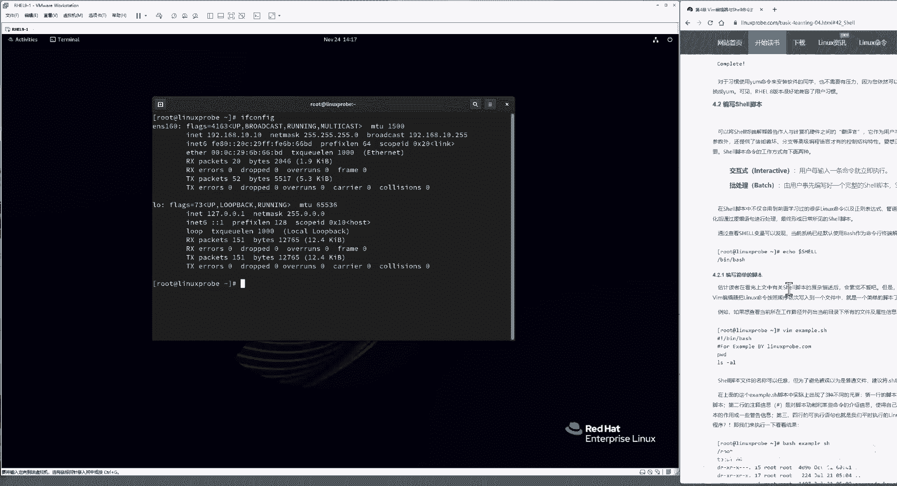

今天明天两天大概会敲五六个吧，这个shell脚本的啊不止啊。

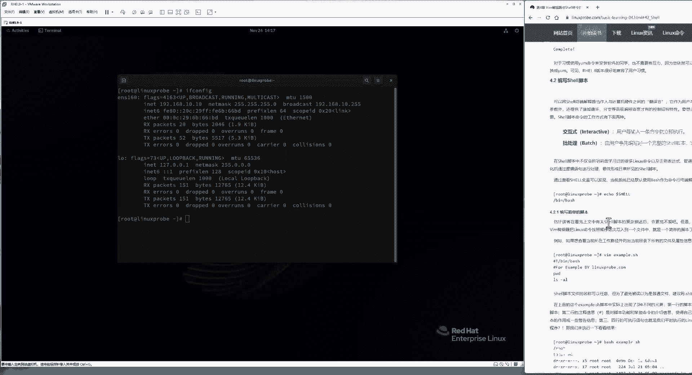

然后非常有意思啊，大家可以今天提前准备一下这个实验平台，还是啊用我们之前安装好的这个LINUX的红包，roll9系统来，我们打开这虚拟机啊，我们先简单回忆一下吧，十天了都学了什么呀。

大家会发现其实老刘这个合成是有套路的对吧，第一天我们学习了什么是操作系统，什么是LINUX操作系统，然后我们这个LINUX对比他们的windows有哪些优势，学习了常见的LINUX的开源许可，有哪些。

常见的LINUX系统有哪些，学习了什么是红帽公司啊，这简单科普嘛，那然后对于这个红包公司这个认证，进行简单的介绍，那这就是一天，我们第一天非常的简单啊，不知道大家吓跑了，主要学习一些理论基础。

第二天马上就开始去安装LINUX的操作系统了，红包ROO9实验平台，然后去学习一下如何在LINUX里边去来去这个啊，安装和管理软件，虽然我们没有具体实操啊，但是我们简单进行了一个简单的介绍。

然后第三天的话呢，就开始动手去执行LINUX的命令了，我们学习了几十个，但我们分为三天嘛，上中下三天去学习了几十个LINUX的命令，然后把一些常用的一些操作呀，对于文件系统管理呀，然后对于用户的等等的。

我们今天都进行了一个介绍，然后如何去查看系统复杂呀，网络情况什么的，这些我们都非常的熟练了，马上我们第三天又学习了第三章节，就是管道不重镜像环境变量，那我们对于这个三个操作符，进行了一个深入的讲解。

我们学习了命令和文件之间，进行有机的一个搭配使用，然后能够把文件里面的这个信息，导入到命令里面，叫做标准输入储存箱，又把我们的命令里面，原本要去被输出到屏幕上的信息，输出到文件里面。

我们叫做标准输出重定向，然后由学习的错误输出重定向等等等等，又学习的管道服，那又不将没啊，他又将第二章节里面学习的每个命令，然后通过道符进行搭配性的一个使用，它可以让前一个命令的输出结果。

当做后一个命令的输入结果进行一个嵌套使用，就像在等于他这样一个呃多次处理嘛，但最后让我们用户的所得到的处理结果，正是我们所需要的，最后的话呢学习的环境变量，那大概知道一下LINUX里面去执行一个命令。

它有哪些过程，然后我们的环境变量的话呢，它有哪些作用啊，简单做这么一个深入的讲解吧，也并不简单了，这样的话呢，大家会发现我们就能够让我们的命令和文件，命令和命令之间进行一个有机的搭配使用。

能够更好的去符合我们的工作需要，第四章节第一小节学习了VM编译器的编写，我们能够把我们要想去编写信息，写入到文件里面了，于是大家会发现啊，通过我们这个1234的学习。

是不是您就已经掌握了在LINUX里面去执行命令，以及去编写文件的这么一个基本技术呢，那那么我们接下来就可以把这个文件里面去写，具体的命令，就成为了一个shell脚本，就这么简单。

哪非常呃这么一个呃有阶级就是怎么讲呢，非常有这么一个结构性的一个课程呢，来那我们接下来大家都打开好这个虚拟机啊，正式开始咱们这个课程，老刘开始每一节课开始都有这么2分钟的时间。

是让大家准备一下商业环境的啊，打打打开它，大家去说一下这个shell脚本的编写，shell脚本的话呢实际上分为了两种，一种叫做这个交互式的，一种叫做批处理式的，交互式的话呢，顾名思义就是在这个过程当中。

它会需要让用户去输入一些信息，然后把这个参数填全，再去自动去跑后面的这个工作，然后我们大多数情况下的话呢，都使用的是批处理脚本，那它也可以实现自动化运维，我们把一些预设好的命令填充到文件里面。

然后根据一些结构语言，比如说if啊，kiss什么的，will这样的这个循环语句，然后或者说我们叫判断语句呃，根据实际情况自动来去完成，这个的话呢，把它叫做批处理式的好，大家可以记一下笔记啊。

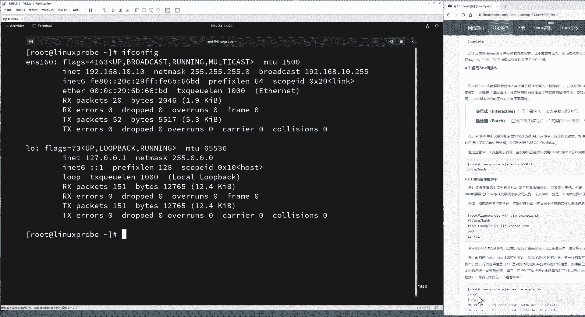

也就是说shell脚本分为了两种类型，第一种叫做批处理，第二种叫做这个交互式，我们大多数情况下使用的是一个批处理式，但是同学们不用着急，我们待会都给大家做实验。

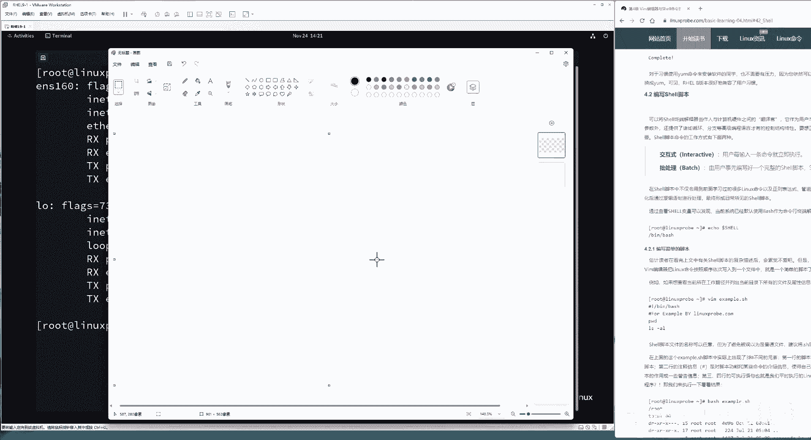

那批处理式和交互式都有具体的实验，让大家去看一下啊，那么接下来就要来讲一下，这个如何去编写一个shell脚本了，shell脚本的编写就直接用使用的VM，后面加上一个文件的名称就可以了，呃文件名称的话。

那无所谓的，我就用了哈哈，然后开头了啊，然后就是文件名称后缀的话呢是点SH，另外给大家讲一下，就是我们在接下来这个实验当中，只要这个文件，它但凡啊，这个文件名称或者某一个参数都无所谓。

那我们就用的哈哈哈哈，这样来做地毯，因为我之前先下井的时候吧，遇到一个问题，就是我们用到一些非常正式的啊，因为可能线下讲课，然后的话呢我们的穿着呀，那我们的这个打扮啊，我们这个讲课内容呢都偏正式一点。

然后的话呢就是我发现我在上课的时候，讲的那个脚本啊，我们还叫做这个script叫哎这就是我讲完了之后，发现所有同学做完这个实验之后，都他妈是script诶，这个就像当时我特别惊讶，然后我就问同学说。

为什么呀，就是你们没有一点，就是为什么这个可以随便去写的，后来同学们说因为怕写错，因为我以为这是一个必须要是这样的，一个名称的啊，就是会有这样的情况，甚至以后写参数的时候也会有这样的这个问题。

所以我们现在就给大家统一回答一下，就是如果说但凡这个参数和这个文件名称，它无所谓，那我们都用的哈哈来给大家做替代啊，大家一眼就可以看得出来，这个东西可以随便去改，没关系，来我们敲一下它。

接下来就进入到这个shell，脚本的编写过程当中了啊，大家可能听到这个有点杂音啊，擦擦的是我们家小猫在挠门，哎呀，好吧，一会他就应该会体内完了说起来也伤感，说起来也伤感，说点伤感，之前前段时间吧。

一个礼拜之前看了一个北美那边啊，讲红包REO9的一个介绍视频，然后的话呢那个讲师啊是一个美国人，他的话呢讲课过程中也有一些杂音啊，后来的话呢解释了一下，是他的邻居在修草坪啊，有那个除草机的声音。

有自己一个大院子，哎呀说起来也伤感啊，像老刘就只能是为了自己家小猫挣点小饼干钱，然后再努力地讲课，好了啊，我们继续啊，开始这个课程啊，他不挠了，哎呀可能我老啊，可能老刘也是成为了这个在整个it行业。

第一个拿自己家小猫卖惨的讲师，好不挠了，继续来给大家讲这个shell脚本的话呢，它分为了三个结构，你看啊，就是我们现在写这个脚本，他可能会写几十行啊，有他有可能会写几行，但是它的这个结构都是不变的啊。

也就是说这个结构是不变的。

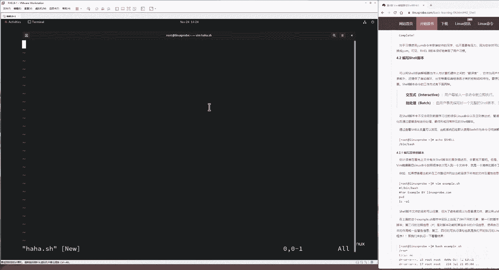

它都是由脚本的声明，脚本的注释，脚本的命令来组成的，我来给大家讲一下啊，不论这个shell脚本是几行有多长，它都是有一定结构的，第一来说就是脚本的声明，脚本的声明，指的是这个脚本能够被哪个解释器所执行。

大家知道在这个联合国170多个国家啊，它分很多种语言，不同的语言需要不同的翻译，那么我这个文件啊，虽然常用的这个英语，日语和中文，那么我们也要有一定的这么一个呃标识，告诉他，我们这个语言谁能够读得懂。

我们这个shell脚本可以被谁所执行，就是大多数情况下它都是通用的，但是最好告诉他我们是bean里面的by，是因为我们学习的就是by是解释器嘛，那我们学习的所有的语言和语法，都是基于这个去学习的。

大多数情况下都要去写了这么一个呃，脚本的声明，待会我们去执行这个shell脚本的时候，它就会自动帮我们去调用这个解释器，来去执行它，你用一个日语的翻译官，你去翻译英语的这个文章肯定是不太流利的。

那所以我们要先写一个脚本的声明，告诉系统它是由哪个解释器能够去运行，第二的话呢是脚本的注释，脚本的注释可以没有可以有，可以有很多行，那它主要是对于脚本的功能的介绍，或者对于一行参数这种解释或说明信息。

好比如说我想要对于这个脚本的功能进行，介绍说这个脚本太完美了啊，巴拉巴拉，我去写很多这样的一个信息，哈哈哈哈好，这样的话呢，我们对脚本的功能的介绍或者某一个参数，我自己写完了，怕下礼拜忘了，锁好了。

那我对于这个参数也可以来进行一个说明，所以脚本的注释可以没有也可以有，也可以有一行，也可以有很多行，这个根据自己的这个数据啊，这个实际需求来去啊来去决定，第三的话呢就是脚本的命令了，那既然一个结构嘛。

你看啊在这个清朝科考的时候，这个八股文你看就是一个架构非常臃肿，然后内容非常少的一个作文形式，你看如果说你光有一个，这也就是你啊，如果光一个脚本的声明，光一个脚本的注释，你没有内容，那也不行。

那么内容就是命令你要去做的这个事情，动作嘛对吧，这是一个动作，就是如果你要是不写这个命令了，我因为我之前看过的同学，就是光给我写一个结构出来，或者命令特别的少，就是跟你在去做数学题里面，你光在做。

在最后再做这个英语题的时候，你光写这么一个解，这个字光有格式没有这啊，那没有答案也不行，所以命令是里面的最核心最核心的，我们学习的就是这个命令，这个命令的话呢分为简单和复杂。

最简单的命令就是从上往下做叠加，就是命令A啊，命令一，命令二，命令三，从上往下去写，它就会从上往下去去执行，这个就是一个最简单的shell脚本了。

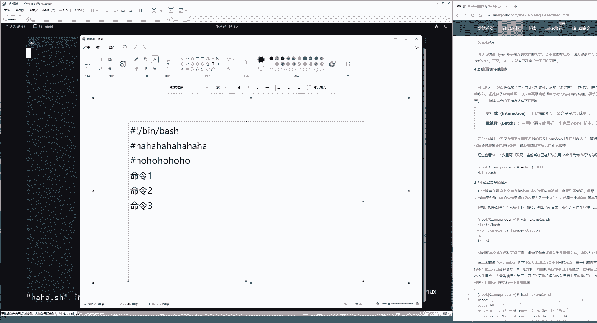

我来给大家做一个演示，首先脚本的声明啊，我说话稍微快一点啊，说话稍微的语速稍微快一点，主要是为了盖住小猫挠门的声音啊，来一个井号，一个叹号，being by by h解释器，谁能够读得懂。

但是由谁去翻译我的文件，再去对我这边进行进行解析啊，接下来接我们的注释，在我们的注释就是随便打一个广告吧，Welcome to linux prob dot com，反正是一个录播课程。

大家当我也没办法，我广告就打了啊，然后接下来的话呢就是脚本的命令了，那要是做什么样的一个事情，随便写，比如PPWD显示一下当前工作目录的名称啊，第二行啊，谢谢，这显示一下目录当中有哪些文件。

第三行sleep呃，然后等待15秒，接下来最后重启好，大家看啊，我做四个事儿，就是1234往下去写，谁也不敢说他不是个shell脚本，你敢说我敢，反正我不敢说他就是一个shell脚本。

只不过说shell脚本里面有难和简单哎，这就是简单是从上往下没有脑子去执行，记得啊，那如果要是复杂的话，可以加一些if啊，kiss啊，will啊，还有for循环语句或判断语句，这个从从易到难吧。

跟打就跟打怪一样啊，我们现在先写这么一个简单的，大家看啊，写好了文件之后保存并退出，看到文件里面的内容去执行shell脚本，同学们习惯性的会去使用一个点一个斜杠，且执行当前目录当中的哈哈点SH。

假设说这么一个文件名称的脚本现在不行，为什么，因为他没有赋予执行权限，虽然说一条命就可以把它搞定了，但是我不想讲，因为第五章节第一小节第十，今天第几天啊，今天第十节，我们第12天的时候会给同学们讲。

如何对于脚本来进行授权，给大家执行权限，所以我现在不用这种方式去执行，同学们也统一了去使用到BH哈哈点SH，现在把重心放到编写shell脚本上面，不要去管怎么去授予这个执行权限。

不管他第五章节的时候自然会学，第五章节又不会学shell脚本了，所以一步一步走啊，按下回车，你看啊，第一条去执行了，查看当前目录，第二条，查看当前有哪些文件，等待15秒大会自动重启，就这么简单。

非常的好玩，一个简单的shell脚本。

就是通过命令的堆积，这个词可能不太好听。

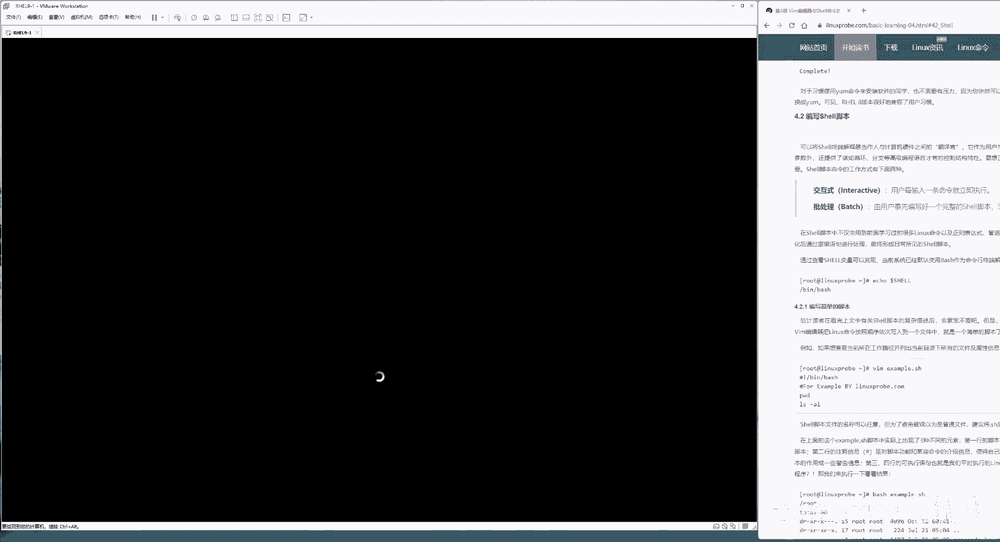

但是就是大家记住这个词，就是一个简单的最基础的shell脚本，就是通过命令的叠加堆积而形成的，后面可能会去学习一些对于判断呀，对于这个循环呀一些语句后啊，那就是后话诶，我鼠标怎么没了。

好好鼠标进去就出不来了，那咱等咱那就先等一下，我来给大家讲，继续讲啊，这个shell脚本的话呢又分为两种执行方式，第一种的话呢叫做交互式，第二种的话呢叫做这个批处理式，交互式的顾名思义。

就是在执行过程当中，需要让用户去输入一定的这样的一个信息，对于里面的参数进行补全，然后再根据用户所说的这个信息的不同，来进行了一个后面的处理，第二的话就叫批处理，是不是根据程序里面预设的一些功能来去呃。

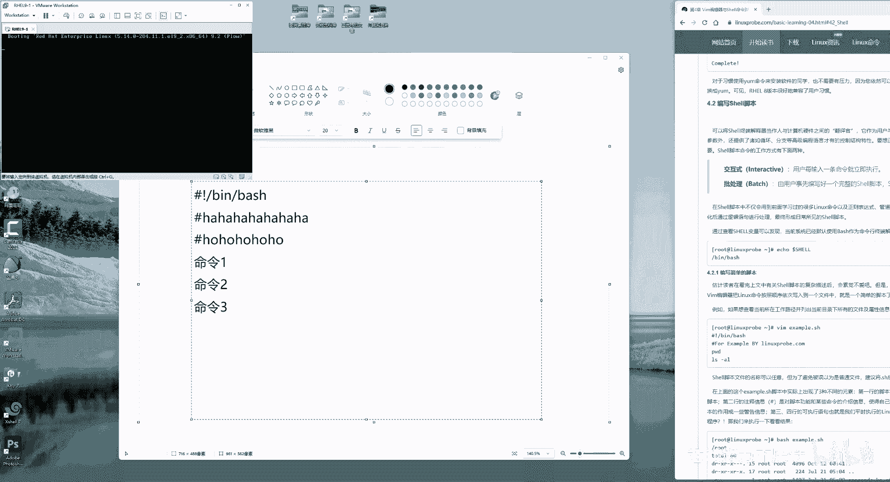

自动化来完成整个脚本的工作，一定要做这个也可以把它叫做自动化运维好，我们再给大家做一个演示啊，这个实验平台还没打开。

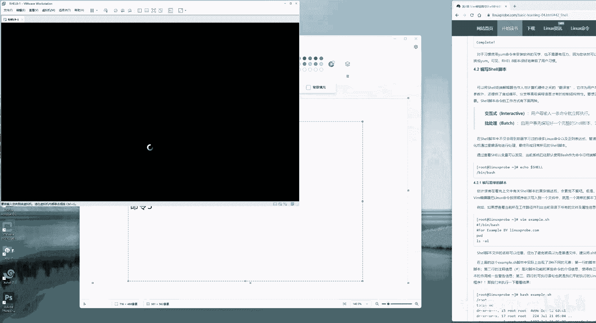

有点慢啊，稍等一下啊啊然后是有点慢哈，要不咱们下课吧。

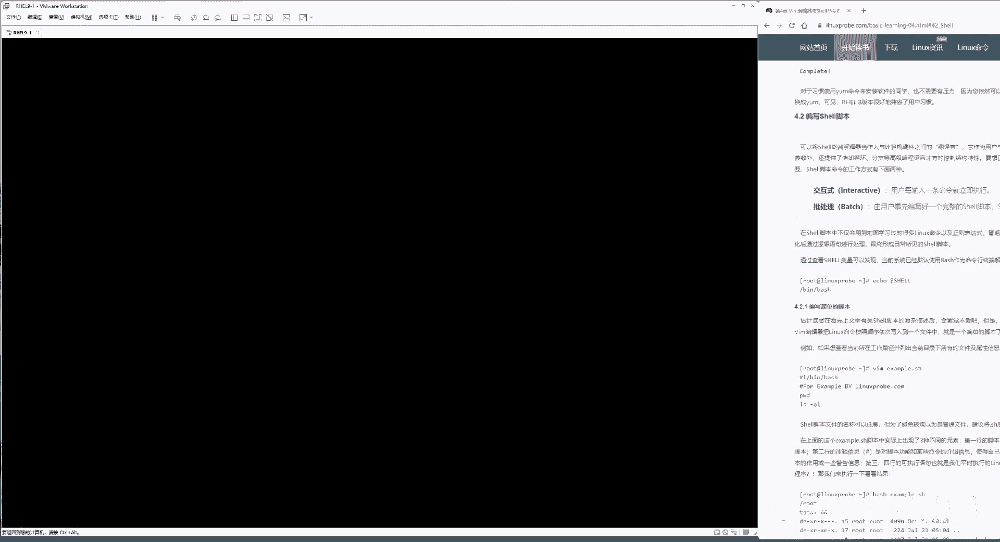

好好进去了，进去了啊，开玩笑啊，咱不能这样，因为我们老刘讲课嘛就是从15年开始讲到，其实到现在了，你算算多少年了啊，所以这个讲课嘛还是很有自信的啊，同学们放心。

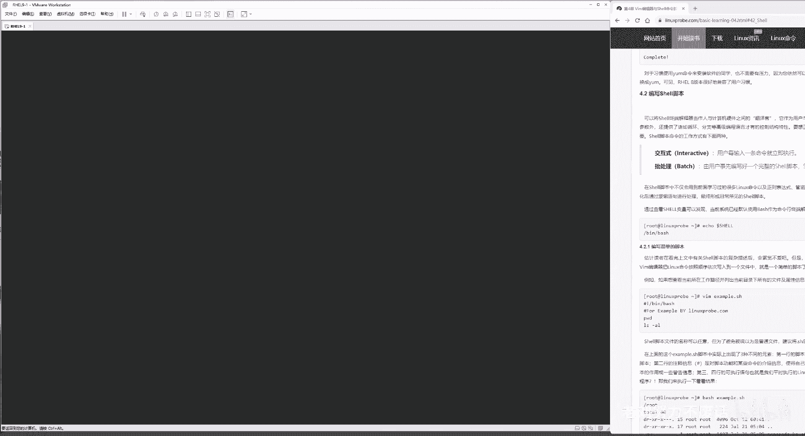

就先从委会常常聊聊啊，就是长老就是常常去说到，说听老刘讲课跟其他讲师讲课的区别，不就是不那么累呀。

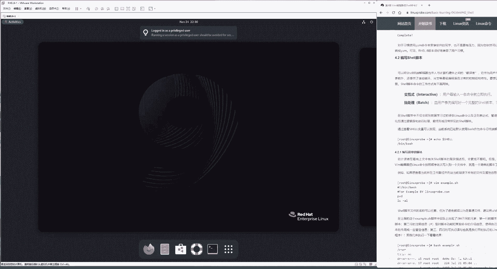

毕竟学习东西嘛，但是不是起码我来讲不是那么累啊，我们通过聊天啊，会开玩笑的方式就让大家把它学会了，而且这个在线培训嘛有一个好处，就是我们可以反复去看啊，如果有一个东西呃没有掌握清楚。

然后我们可以反复去看。

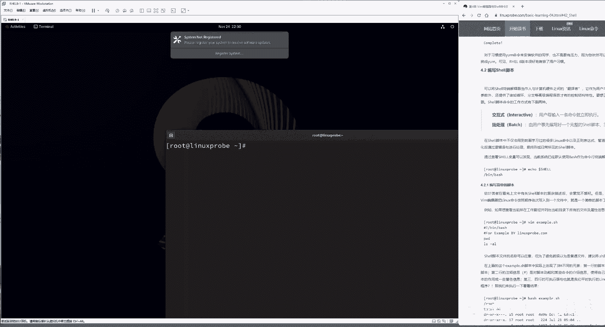

然后同时的话呢加一些开玩笑，或者怎么样的这种方式啊，同学们会喜闻乐见的去多去听几遍，不会那么的抵触啊，来这是老刘对于LINUX最大的贡献了，可能就是啊，然后继续进入到这个实验平台当中。

我们去给大家做一个演示，首先就去执行一个命令，大家看啊，我们不需要有任何的交互，直接去输入这个命令，它就会显示出来具体的信息了，你看这个就是叫做批处理式的，而我们叫做pass wd这样的命令。

为用户去重置一下密码，你看看呢就是我们必须要让用户去输入一个值，把这个值赋值给里面的参数，来为用户来进行一个密码的设定，这个就叫做交互式的，没有你输入的这个密码我可执行不下去了，这叫做交互式的好吧。

那么就是知道了，基本的摄像脚本是由哪三个结构组成的，那脚本声明脚本的注释，脚本的命令又知道了基本的这个，那么有知道是有脚本，它有两种类型，一种叫做批注理，是一种叫做这个呃交互式。

接下来我们就要给大家讲一个shell脚本，他要有能力去接收用户输入的参数，这个我们是必须要有的一个功能，例如说IOS查看一下目录当中有哪些文件，这个之前啊大家看到了嗯，非常简单的一个命令。

然后看了一下IOS杠A好像加了一个参数，看到内容是不是不一样了，显示出来的这个信息有所变化，再来ALOGUL好，我现在来给大家提两个问题，看到信息每一次都有变化对吧，我先来给大家提两个问题。

第一个问题为什么我们加了参数，它显示出来的信息跟之前不一样了，这是第一个问题，第二个问题为什么我们加了不同的参数，它显示出来的信息也是不一样的啊，大家可能说老刘疯了啊，这不是必须的吗。

加了不同的参数肯定显示出不同的信息啊，那不然呢啊，但是我们去从脚本的这个底层。

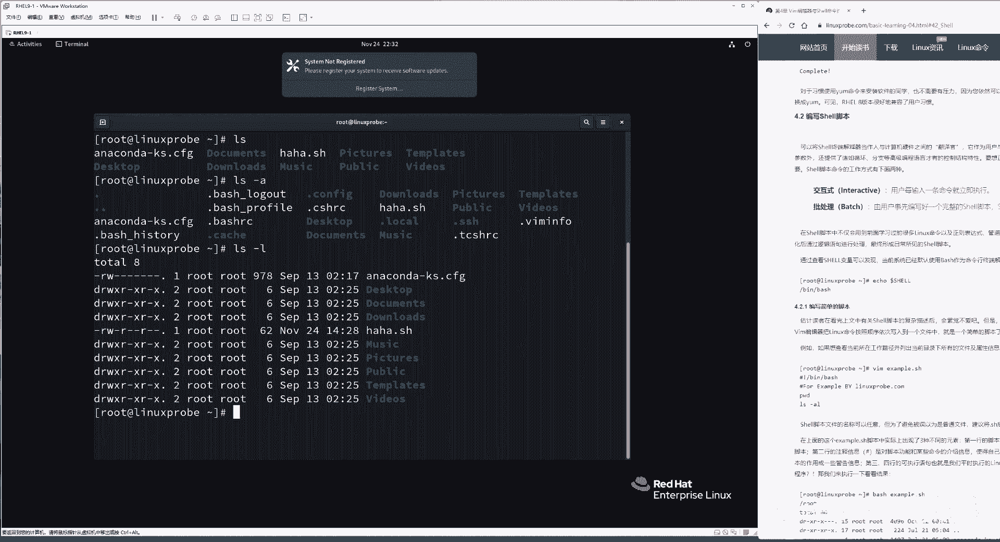

来进行一个思考啊，首先第一点就是为什么加了参数，它跟之前执行出来的这个信息不一样，首先他是不是要有能力，去接收用户所输入的参数呢，如果他有没有能力去接受用户的一个参数，他可能是一个聋哑人对吧。

他可能听不到，他可能也说不出来，那么你对他这个信息的交互传递过去之后，再没有响应，那也不行，所以要第一步进行接收接收，我们使用的是一个里边内置的参数，大家可以来看一下啊。

我们书上是有的一些内置的参数里面，默认就可以去接收用户所述的参数。

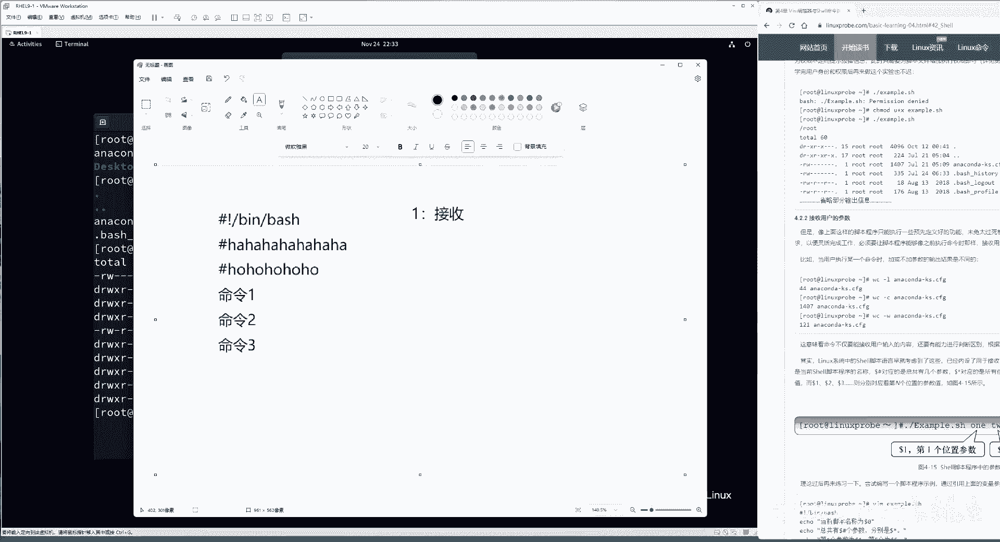

比如说里面叫dollar01234567，代表就是接收到的啊，代表就是我们U代表，就是我们这个脚本的本本身的名称，以及接收到了这个用户输入的参数，举个例子啊，因为我有一些参数，同学们。

你们这就是我现在一边做着实验啊，我就不给大家看书了，你们去看一下书，书里面是有这个介绍的啊，咱们也得照着词儿说啊，是有词的，咱们有书啊，不要说老刘张嘴就来，怎么就是怎么讲课，虽然我反正我不怎么看书啊。

讲就讲就讲了快10年了，但同学们你们可以看书，书上有的，所以我讲的稍微快一点了，就这个shell脚本里面内置的一些参数，这个参数就默认可以去调取，用户所输入一些信息，比如说dollar0。

你看我这就用到这个echo去输出，dollar0就代表是这个脚本，它本身的名称就是dollar，零代表的是脚本啊，本身的这个名称，那就是哈哈点SH吗，然后再去输出一下，比如说dollar1啊，逗号啊。

Dollar3，dollar5代表就是用呃这个脚本所接收到的，第一个第三个，第五个它的这个参数啊，第一个第三个第五个用户所输入的参数，还有的话呢就是一个dollar星号和dollar井号。

这个的话呢等一下啊，dollar星号和dollar井号，这个的话代表就是我们总共接收啊，到了这个参数的个数以及接收到有哪些参数，比如说我家dollar一个井号，总共呃呃呃呃对。

我们就第一dollar井号，代表就是总共接收到了参数的个数，以及记录到的参数有哪一些，dollar星号，你看就是一些内置的参数，就能够让我们去完成最基本的工作，当然还有dollar问号。

代表的就是上一条语句的返回值，或者说它它有没有执行成功，好这个的话呢我们就先不说哎，先按下不表，我们先来把它保存并退出，先来跑一下这个脚本，看一下效果，来查看一下这个哈哈，点SH看到里面的信息没有问题。

然后去跑一下它使用到BG解释器来进行调用，哈哈点SH后面加几个参数加什么呢，ABCDEFG好，我现在往里面加七个参数，同学们对照一下我们的这个参数啊，表您想象一下啊，您猜您做一个预测。

看看他的这个输出结果大概会是什么样子的啊，它的这个输出结果会是什么样子的，我来给大家举个例子。

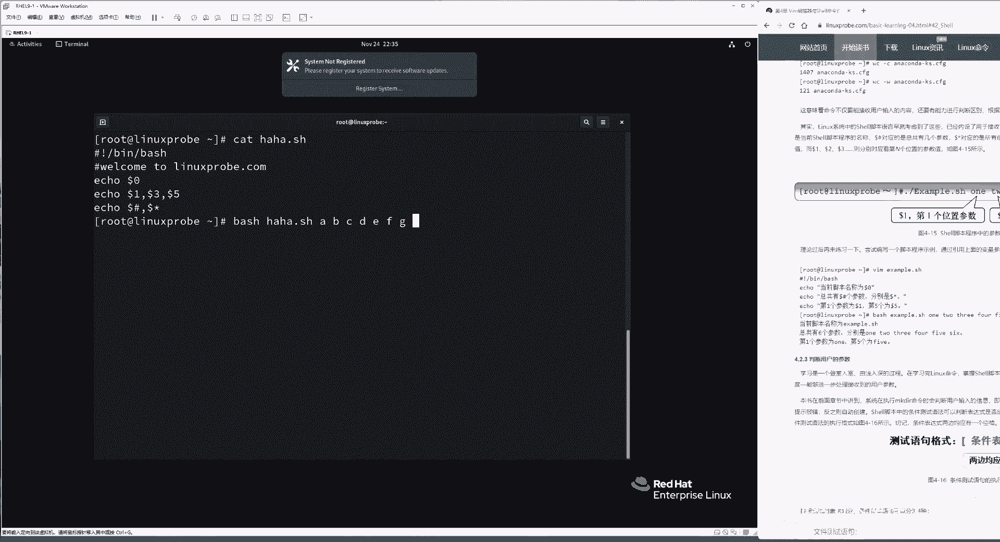

首先dollar0代表就是脚本的本身的名称，就叫做哈哈点SH没毛病吧啊，非常简单，然后是一个dollar135代表，就是第一个第三个第五个参数，并且通过逗号做间隔，就是A逗号C逗号E。

你看他这是他都不用我们自己去来去接收，他自己就能接收好了，就这玩意儿很方便啊，我们什么都不用做，躺着赚钱啊，然后呢我们就降低了工作难度嘛，接下来是dollar，井号代表就是总共接收到的这个参数的个数。

总共就是七个，然后间隔符是一个逗号，他总共接收到这个参数有哪一些，那不就是ABCDEFG，你看我总共找到了这三个参数，我预测待会儿的输出信息可能是这啊，具体准不准，不一定，我们下回车可以看一下。

大概是准的，像老刘啊，买彩票等这种啊水平啊，就这种这种稳定程度，这个输出就好了啊，你看这个猜测就很准确，但是我们的猜测是有依据的对吧，因为接收到的这个参数的不同啊，它使用的参数不同。

所调用的出来的这个信息也是不同的，就这样的玩法啊。

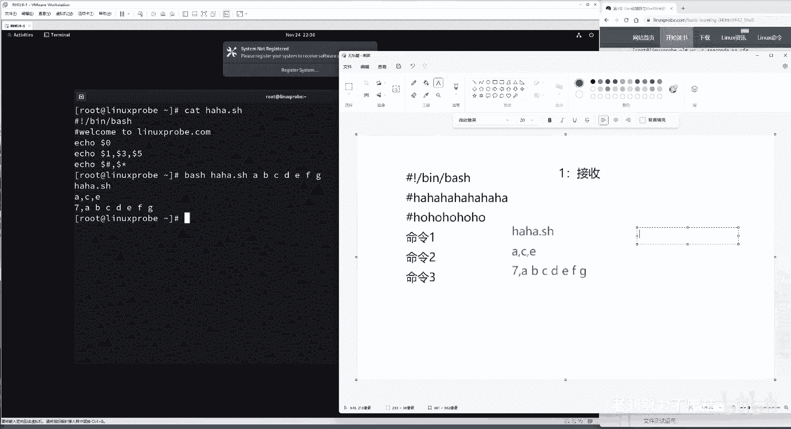

好那我们就知道了，我们一下就学习了六个参数，你看这不就会了吗，待会就可以通过调调，用这样的参数的方式对它进行判断啊，来接着回答第二个问题。

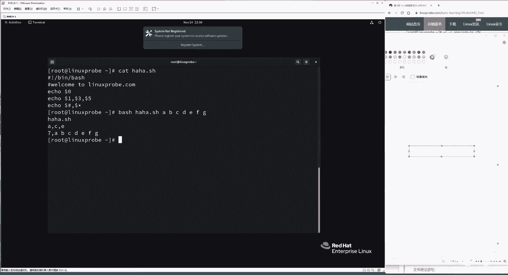

就是他要能够去接受用户所输入的参数之后，还要有能力将来进行判断他输啊，根据用户所输入的参数的不同。

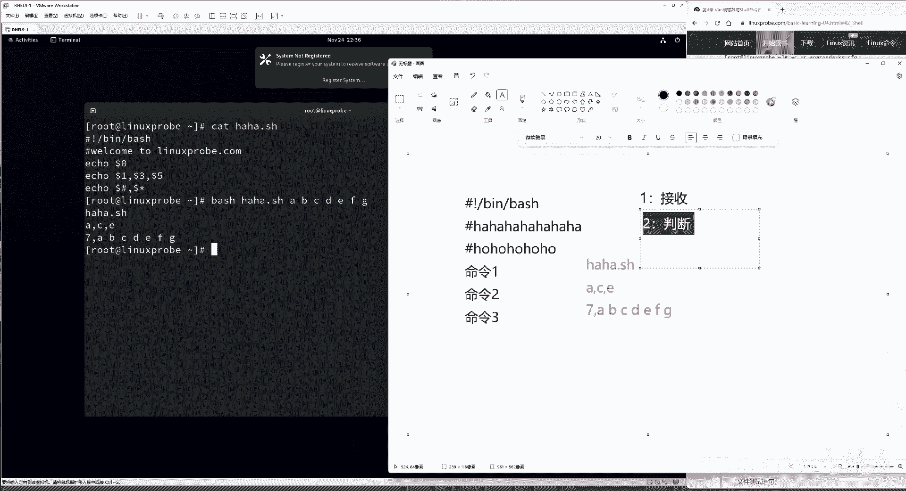

是不是要有不同的回响呢，也就是说要有不同的处理结果呢，你光有说一个杠A和杠L的接收不行，如果说这两个参数敲完了之后，显示出来这个信息是一模一样的，那你肯定会骂街了，这肯定是不对的，因为它不同的参数。

一定要有不同的这个处理的命令，它等于说它里面的这个啊要有一个判断语句啊，这样的话才能够去实现不同的输出，这个怎么去做呢，在这个里边我们的LINUX啊叫做判断语句，判断语句分为四种类型，叫做文件逻辑。

整数和字符串，好，我来给大家简单做一个介绍啊，它里边首先来讲的是对于文件的判断，使用的方式是一个大括号啊，它那我们使用的是一个中括号，里面写着我要想对于这个图片呃。

呃要想对于这个呃文件来进行判断一个语句，大家看一下我们的图片四杠三啊，然后的话呢我们以及四杠16的图片，46道图片里面就写清了。

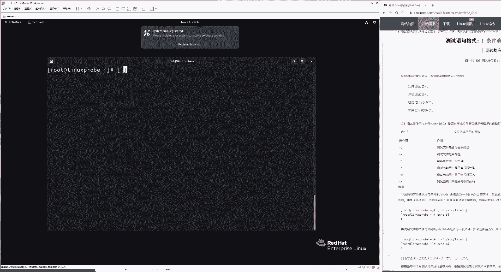

我们该怎么样来去做这个判断语句，在这个LINUX里去执行的方法，你看首先我们是把这个里边写一个中括号，中括号的话呢里边要写上我们的添加表达啊，再再写上我们的这个条件表达式，然后我们就按下回车。

就能够对于这个文件来进行判断了，它可以对于文件逻辑整数和字符串进行比较，我们先讲第一个文件，这个的话大家一定要记住啊，首先这个两边是一个中括号，然后的话呢，中括号里边跟这个条件表达式的话呢。

他一定要有一个空格做间隔的，我回想一下，我2017年11月份的时候，那个新书刚出版，第一版书啊，差不多一礼拜左右吧，我就收到了第一个差评啊，在当当网上我记得很深刻啊，就是说我这个书啊都是错的。

所以老刘不是一个讲技术的讲师啊，我是一个魔术师啊，就是在书上面我全对，就一做实验他全错啊，后来我一看怎么回事呢，就是因为那个书嘛，他这个因为排版的原因，他把这个空格给我省了啊。

于是的话打印出来的这个效果就直接去执行了，于是我从第二版开始加了这张图片，大家可以看一下啊，特意给大家强调了中括号的两边是一定要呃，这不啊，中括号的里边是一定要有一个空格，去做间隔的啊。

否则的话呢你这个啊，否则的话你这个天气表达式写对了，它也是错的。

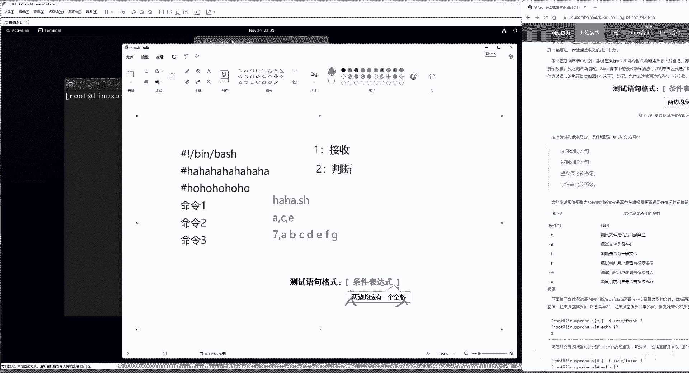

我们学习LINUX一定要严谨，好比如说我现在来判断一下，说某一个目录它是否是存在的，来杠D随便写一个目录名称啊，没啊没关系，随便敲，那我们或目录来以我这个为例，我判断一下说这个目录它是否是存在的。

并且它是必须要是一个目录，它且存在且是一个目录，那么它有没有成功呢，那我们可以用到输出dollar问号的方式，dollar问号指的是返回上一个语句的返回值，从而也可以判断说上一个语句，它是否执行成功的。

什么意思，如果说上一个语句的返回值在大多数的LINUX当中。

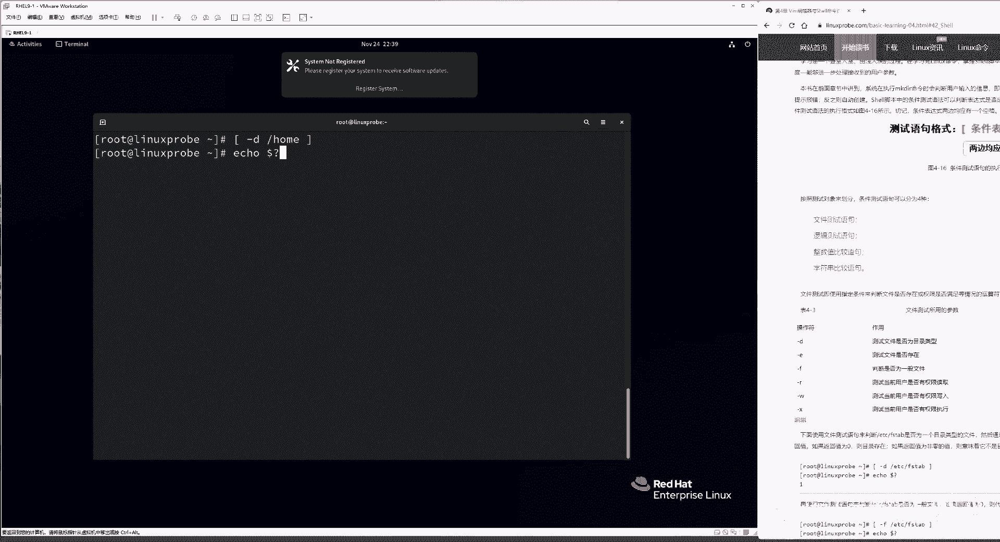

它如果返回值是为零的话，那么它代表说上一个语句是将成功的，如果说是一个非零值的话，代表说上一个语句才是执行失败的，非零代表就是1234啊，然后在一般的unit系统当中可能是二啊。

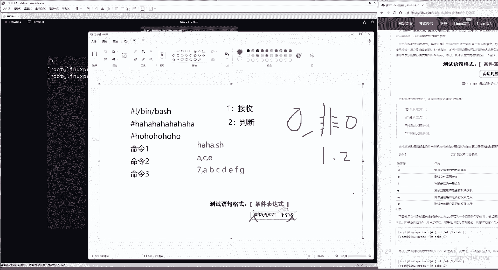

然后在这个LINUX里面一般是一好，我们给大家看一下效果，于是可以看到说这个目录的话呢，它是存在的，因为它返回值是零，判断成它它判断结果是成立的，所以它是一个零，如果说我要是不啊。

如果说我现在要去输入一个不存在的文件夹啊，哈哈点就是我们就这样啊，再来去输出，他会告诉我们是一，因为上一个语句是判断失败的，上一个目录不存在，于是它会出现错误，那比如说我现在想判断说某一个目录它是否啊。

比如说我现在想判断一个文件吗，判断一下这个文件它是否是存在的啊，然后看一下可以看到它是存在的，判断一下说这个文件它是否是一个目录文件，然后按下回车看到它不，它只是一个一般文件，而不是一个目录文件。

你可以通过这样的方式我们去判断，然后再去返回上一个语句的判断结果，能够知道判断语句有没有成功啊，非常的简单啊，那我们可以再来说，我不想区分说这个文件还是一个目录，它是什么样的一个类型，只要它exist。

它只要是在我们就显示出来它是存在的，好那好只判断它在不在，而不区分文件类型，就是这样可以看到啊，非常简单嘛，然后看一下表格，四杠三里面全都有啊，然后再来判断一下，说我有没有权限对于这个文件啊。

对于这个文件来进行嗯编写和编辑啊，然后于是加W看一下，我有权限对他进行编辑，因为毕竟我们现在是一个管理员的身份嘛，我们可以对于任何文件来进行编辑好，这就是我们对于文件的一个判断方式，于是同学们就举手了。

说到流哎呀，我觉得这个吧先别讲后面的了，那先别讲后面这个逻辑整数，还有这个字符，我就问你一件事太麻烦了，我判断一个文件他在不在，我需要去执行两条命令，这个效率太低了，我们能不能去使用一些什么方式啊。

这个的话叫叫叫做这个操作符，然后呃我们把它合并成一条语句呢，有是有的来。

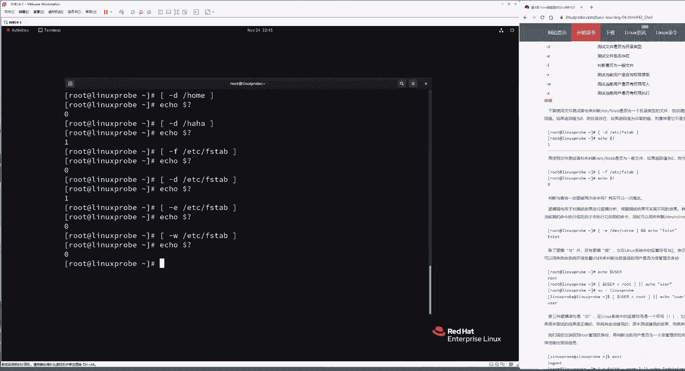

我先给大家写下这个思路啊，老刘不会乱啊，这课讲10年了都已经烂了啊，然后就是怕他，我是怕同学们乱啊，先讲一下判断语句，分析了四种文件逻辑整数，然后还有这个字符串，你看这个先不乱啊。

我们一个一个来去给大家讲，先讲到第一个文件了，然后这个时候我要给大家去插几句话，就是什么呢，它可以将两个条件表达式，或者说将一个条件啊，表达式跟一个命令进行一个有机的搭配，这个叫做逻辑操作服务。

它有两个呃，它有三个，第一个的啊，对它实际上是有两个，但是还有另外一个叫催反值来，第一个的话，那叫做逻辑的和或者叫逻辑的，与这个代表就是啊，若前面的一个语句或者叫条件表达式，执行是成立的。

那么则会去执行后面的语句，然后我给他写出来吧，若前面成功，则则执行，你看老刘讲课就是很严谨啊，而且很难对吧，我们不希望讲课的时候讲的特别简单啊，然后同学们一下课一工作的时候都都会出问题。

所以咱们讲的稍微难一点啊，第二的话那叫逻辑的，或它是弱，前面失败唉，才执行后面的语句，还有一句话叫做非一个叹号叫与或非嘛啊，这个的话呢是啊对于这个结果对结果取反值啊，我就知道这个输入反应会说取反值。

取反值，取反值原先是成功，现在就是失败，原先是成立，现在就是失败，原先是失败，原先是一，那么现在变成了一个成立，就是取反值啊，他跟这个嗯它可不等于不等于，因为有一些书里面的事件都是写错的。

我倒给大家举个例子啊，记住这个逻辑上来讲，三个逻辑操作符叫与或非啊。

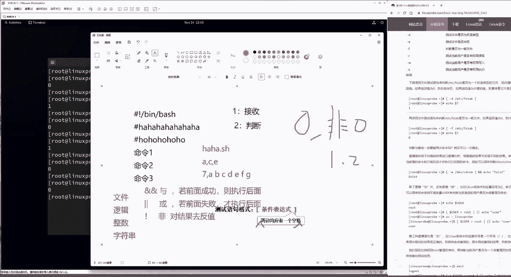

先来讲一下这个雨，把这两个命令再进行合并，可不可以啊，可以啊，看看好了啊，首先判断说我对这个文件来有没有写入权限，对吧，于是他我们先知道他也是成功的对吧，加一个雨，然后呢如果说前面语句执行成功。

它返回值为零的情况下，则输出OK这个字眼啊，就输出一个OK我能不能看得到，看一下啊，我能不能看得到呢，我能够看得到，因为前面一个语句只是它是执行成功的，那我再来，如果说我判断一个文件它是否存在。

它只要存在就显示出来OK啊，而不区分文件类型，看一下也OK，但如果说看一个不存在的一个目录，那于是会有这样的回响好，因为没有他，因为他是执行失败了，所以的话呢他没有我们显示出来啊。

这个OK这样的一个字样，那还有这个货或的话，就是说若前面一句是执行失败的，我们才会去执行后面的语句来写上两个，大家记住啊，这个可不是两个管道符，两个管道符碰在一起就变成了罗辑的货。

就像说两个dollar符，一个dollar符提取出来变量的值，两个dollar符碰在一起可不是提取两遍哦，那可不是赢麻了啊，这个是代表的是查看当前进程的，PID值的意思，所以两个货不是两个国道服。

是逻辑的货啊，来现在我们再来去输出一个就是呃吧，比如说我随便来了啊，老哥英语水平不太好，就输入一个错误的，输入一个差的，然后我们去看一下结果，它才会显示出来这样的一个字样，就是说若前面语句执行成功了。

我们才会去执行，如果前面语句执行失败了，他才会去执行这样的一个效果，来再给大家举一个呃，举一个小例子啊，比如说我们现在有一个变量，这个变量的话呢叫做这个user，代表代表的是当前登录用户名称的意思。

我可以去切换到另外一个用户身份下，大家闭眼啊，不要看，不要管我怎么切换的，我现在切换到另外一个用户身份下，你看啊，我同样的去执行查看变量的命令，可是看到这个结果是不是大相径庭诶，为什么呢。

就是因为第三章节，最后一个小节里面讲到了环境变量啊，我们的LINUX系统能够让我们能够实现多任务，对用户这样的一个工作模式，不就是让每个用户有一个独立的工作环境吗，于是有了一个root。

有一个LINUX，不同用户看肯定是不一样的，你要是一样，那才出事了对吧，那系统就乱玩了啊，好接下来我们要做的事情干嘛啊，是不是就要对它进行判断了，不同用户判断有不同的显示。

这不就是一个很好的一个小操作吗，来首先判断一下这个user的这个变量，呃是不是等于root，因为在这个LINUX里面只有root用户是管理员啊，那么如果他要是的话，那我们则输出啊，他是一个管理员啊。

element就输出这么一个字样，你是管理员，或者说你是一个manager，稍微正式一点啊，manager好，如果说你是root用户这个变量啊，如果这个变量它是这个root管理员。

那么则输出你是manager管理员，如果要是不适的情况下，你看谁说逻辑的与和或只能分开用的，逻辑的与货还能活啊，还能放一块儿用的，而且与或非还能放一块儿用，而且还能签到很多次啊，来manager啊。

如果说你是不是管理员，那你就是普通的这个职员，那么就是staff哦，你看老刘这个英语水平啊，一下就拔高了啊，这个还有这个哈，这个水平还是很高的，staff员工，你看我按一下回车。

当我在管理员的身份下去执行这个命令，同样的命令他说出我是manager管理员嗯，当我去在一个普通用户的身份下去，执行这个命令，他会去输出，他是一个step，他是一个普通用户，你看他是一个员工。

你看这个就是我们进行与货的一个执行方式，可以把命令的话呢放到一条去使用，还有没完，叫做非非是取反值哦，比如说我现在这样啊，判断用户是否它不是root用户，好了，我看一下啊，我们把它前面加一个叹号。

我们判断它是否它不是一个这个管理员root用户，他要不是的话，那他就一定是员工，那就是staff，如果他要是不是不是的话，那么他就是了嘛，说能否定，那就是肯定，那么它就是一个manager。

你这样去做同样的命令，你再去执行一遍，这个其实效果是一样的，但是这个同学不要乱啊，来按一下诶，等一下按一下回车，看到啊，他还是manager输出的一个字样，然后的话呢我们去在普通用户身份下。

再去执行一下这个命令，可以看到它还是staff，就是我们取了一个反值，然后对于这个语句进行一个调整啊，可以正确表达，也可以反序表达，都是他他他都可以去实现的，然后这个时候我们就要注意了啊，也不是黑。

就是也不是故意黑人家同行，就是有些时候吧一些小孩，有些小孩啊也可以去讲课，刚刚考完RHC给你们去讲HC嗯，好吧啊，可能大家都这样啊，然后就是常犯了一个错误啊，跟我这么去写，这些都是错误的，给他看好啊。

User，然后等哈有时候看着都可笑啊，就这样去执行，然后的话呢你看好像这个效果也一样，也没毛病啊，然后的话呢我们呃复制一下，同样的，在另外一个这个用户身份架也去执行一下，同样的结果输出了啊。

然后很开心的给大家讲课，后来我看笑了，这不是这个取反啊，这不是逻辑操作符啊，不等于啊，大家看一下，这个一定要注意一点啊，很多这个网上的这些资料不要一搜，就当做是正确的，当做真理就去用了，记住了。

虽然效果是一样的，但是第一个是叫做逻辑操作符，第二个叫做不等于同学们，那同学这个一定要注意啊，一个小细节小细节小细节学吧，就学那个呃，这就是相对来说比较正确的，这样的话呢当你以后工作的时候。

你可以对于这个每一个参数进行一个，精准的把控，别呃就是差不多就这样去执行也不好啊，这是我们对于文件的一个判断语句，顺便又来一个小插曲啊，讲了一些逻辑的与或非好，回归到我们的正题上，就是对于数字的比较。

数字比较啊，数字判断很简单更简单了，比如说五是否大于了三呢啊好我呃，五大于了三妈好，我我也不知道好没关系，叨叨问号诶，五不大于三嗯，五不大于三好，我再来，那五小于三吗，五小于三诶，这倒对了啊不啊。

这个倒是错了，我怎么会小于三呢，我记得你3万块钱我还了你5万块钱，我还小于你借给我的钱，我还没还清高利贷啊，我报警了啊，怎么回事，好再来，那么五等于三吗，我还你，我记得你3万，我还你5万。

咱俩现在平了吗啊大家有没有摆啊，咱家这个账有没有算明白呢，啊也互也互不相欠了吧，哎这倒是等号，这怎么回事啊，我要给大家讲一下啊，这就是我们在做数据判断当中常犯的一个错误，大家看啊，我如果说我这样去做了。

如果说您您呃，您第一次就这样去执行了，您是不是认为这个这样操作没有任何问题，没有问题吧，五小于三吗，五不小于三等于返回值一，然后您又做了一个五等于三吗，五等于三，于是有了这两个经验。

您是不是就认为肯定就没有问题了，数字判断结果会发现第三次的时候出错啊，他出错了，这就是经验跟理论的一个重要性，记住了啊，在对于数字比较的时候，千万不要用到大于号，小于号等号这样的这个操作符，为什么呢。

这个在LINUX当中，我们把它叫做输出重定向，这个叫做输入重定向，这个我们叫做赋值，同学们要这一定要注意啊，就是有些时候虽然说您这样去执行这两条命令，执行大多数情况下也能够执行成功。

但是底层逻辑全都是错的，在工作的时候就肯定会吃亏，一定要记，一定要记得注意啊，在对数字比较的时候，参考一下表格，四杠四，他一定要用到逻辑操作符，用到这样一个字母的方式来进行判断，比如说五是否等于三。

一定要用这个去使用到这样的方式来去判断，然后的话呢它是否等于是这个三，然后按一下问号，可以看到它不等于三，不要用到大于号，小于号等于号的这个原因，给大家讲清了五是否greater than。

就是大于三啊，然后上面它是这个不等于三啊，然后的话呢五大于三返回值是为零，五是否小于了3LAZON，然后来看一下，你看就是我们一定要用到这个操作服务去完成，虽然说大于号小于号等于号，有些时候也能够成功。

但是这个很严谨，所以我给大家讲对数字比较简单，但是有坑注意好，接下来对于我们这个逻辑来进行比较，这个逻辑嘛实际上就是刚刚我们讲到的，我们对于这个判断语句，也可以进行与或非的判断。

比如说我们也可以进行一个提取，给大家举一个例子，对于逻辑我们也可以进行一个判断，什么叫逻辑判断，就是我对于你这个逻辑来进行判断，你说的这个是不是在理，有没有跟我呃，用一个错误的一个理论或者说错误的判断。

我们比如说举一个例子啊，free gm什么意思呀，它代表的是以兆为单位，显示出来内存的使用心啊，来显示出来内存的使用量信息啊，按一下回车，它它总共是有两行，第一行的话呢这是我们物理内存的使用情况。

第二行是我们的这个交换分区使用的情况，这也不是重点啊，重点是我们主要是看这个值，如果说物理内存使用的不够了啊，如果说我们这个物理内存可用空间不够了，会导致我们会大量的消耗SPA分区，导致系统卡顿啊。

这样的这个情况，于是我们想提取出来这个值，然后的话对它进行比较，如果它小于某一个固定值，比如说小于两个G的话，那我们就给管理员发一封邮件，管理员上线去处理，对它进行扩容等等等。

这样的这个操作进行一个简单的自动报警，此时此刻老刘的服务器，我就在用这个脚本，我来给大家演示一下啊，就是我一般不太喜欢用那种第三方的软件呃，没必要，也不是说信不人家，也不是说花不起这钱，主要是没必要。

我用一些轻量级的命令就可以完成的事情，我就喜欢自己写脚本，所以我写的脚本挺多的，自己就能实现自动化运维，来我给大家举个例子啊，首先来说对于这个行业，对于这个值来进行提取，怎么提取呢，你看啊。

上下左右有哪些关键词是只出现过一次啊，你看这一行当中按行提取，是不是这个只出现了一次啊，这些值它都会发生变化的，每一次看内存值嘛啊它都是飘忽不定的，像女朋友的心情一样，他每一次都是不一样的，那好了。

这时候我们来提取出来第二行，那我们就是通过第三章节里面学习的管道服，然后第二章节里面学习的gram命令，按行做提取取一个关键词，这样就能够提取出来指定的行了，然后我们来继续提取，你看啊。

这个它间隔符是啥啊，你这么着捋着好像是一个一个的空格，但是你要整体看的话呢，他肯定是通过table键来进行一个呃间隔的，那到底是空格还是tab键呢，我不管我使用的AWK。

我们可以直接提取出来第四列的信息，这个工具我们叫做叫做这个正则表达式，我们虽然不会去深入的去讲解啊，不过我们会用到这个命令来提取出来，第四列的信息，我们可以去使用到这个命令print啊。

这个大家不啊并不重要，我们先讲的是逻辑判断语句嘛，你看啊，我先提取出来第四列的信息，1234，第四列，然后走，你我就把这个值给它提取出来了，提取出来之后啊，我们可以对它进行一个执行，什么意思呢。

之前第三章节学习过一些叫转义符，一个斜杠，一个双引号，单引号，反引号，反引号反起来翻起来，它代表的就是那去执行里面的命令，接下来只取其返回值啊，把他这个返回值括起来哎，把这个返回值给它括起来。

然后怎么办呢，给他等一下啊，命令很长中间空格把它做间隔，咱们书上面啊，是把这个变量，就是把这个处理出来的返回值赋值给一个变量，接下来对这个变量来进行的数字比较，实际上没有必要可以直接用到反引号。

比较高级的操作啊，就可以来进行判断了，当然了，我说了不敢那么去写，又怕有些小朋友们看不懂，又给我一个差评啊，感觉我也受不了，所以干脆赊账面都是一些比较保守的方案啊，我们就就就是我们比较激进啊。

就直接用一个命就可以完成了，省一个变量来less than啊，不用再去使用到这个echo，比较在这什么相等了，小于只要这个最后算出来的这个值，小于1024，就是一个GB的话。

那么就成立的情况下就会给我发一封邮件，当然我此时此刻我就不用发邮件了啊，我就说不足这样的一个字样，如果说他判断1024，它大于1024，他条件为失败的话，对于逻辑判断吗，那么我们就会去输出。

他说他是充足，这样的一个怎样按一下回车，可以看到当前输出的值是不足，因为它小于1024，它自动的去取了这个系统的这个操作系统当中，内存的值，然后对它来进行了比较，比较之后根据判断结果，逻辑上来讲。

给他输出的不足还是充足，如果说我修改一下这个值，它只要不小于100兆内存，它只要不宕机就行，那好了，我可以看到它输出的这个结果是重组，这个就是一个简单的数字解压逻辑，那判断语句的一个搭配性的一个使用。

这个的话呢，就是我此时此刻正在使用的一个脚本，给大家想要分享一下，当然我后面的语句不是输出信息到屏幕上的，我是给我发一封邮件啊，如果说这个CPU长期高于某一个值百分比，或者内存小于了某一个值。

那么我们就会上线去处理一下，看看啊，怎么回事，是不是流量太高了，那我们就花钱去扩容一下，就这么回事啊，好大家先喘口气，我去喝口水，是不是刚开始上课之前没有想到过，说今天这个课这么难说。

是没有想到没有心理准备，对不对啊，给大家一个下马威，没想到上课之前，我们昨天去致性命的时候啊，还是这么长，大概就这么长吧，结果到第四章一下变成这么长了，可能没有心理准备，没关系啊，消化一下，我去倒杯水。

学习这个LINUX它是一个很难的事情，他就很没有办法给他娱乐化，同学们，我已经尽量了尽力了，同学们他没有办法进行太多娱乐化，它很难的这种逻这种逻辑这种东西，一般人受不了这罪。

有时候一学就是你学习过C语言啊，或者学习过一些编程语言的话，可能还好，一说逻辑与或非，同学们直接右上角把这个窗口关闭了，我就是哎呀，很难讲很难讲，大家听着很痛苦，我讲这话也不轻松好。

我们继续来给大家去说文件整数，还有最后逻辑讲完了叫什么呢，字符串字符串给大家一个应用场景吧，就是LINUX里面有一个很不严谨的地方，变量不需要定义，直接拿来就用，这个我很不喜欢，你看啊。

我先定义一个价格为五块钱啊，这之前讲过这么一个小事例啊，价格为五块钱，没毛病吧，好我又来了一次，我就就比如说我定义它为五块钱，另外一个同事上线了，他跟你说价格为十块钱，最后这个值是多少呢。

最后等于是十块钱诶，涨价了，又来一个用户诶，怎么着呢，把这个价格都变成一块钱了啊，然后变成一块钱了，再去看，变成一块钱了，所有的变量的值都是取决于最后那个人，他给他是多少，那我这个比如说书卖五块钱。

后来我我觉得这个卖便宜了，变十块了，后来被人改成一块钱了，那我肯定要找他算账对吧，那个卖太便宜了，大家都大家都亏钱了，那怎么避免这样的情况呢，就是你在去定义这个变量的文，就是你再去使用这个变量之前。

你先对于这个变量来进行一个检查，判断一下这个变量有没有人已经使用了，若有人使用了，则换另外一个，不要跟人家冲动打架啊，影响这个邻里关系不好，那怎么办呢，还是一个中括号里面写上字符。

我们使用的是Z判断它是否是因为一个空值来，我直接后面写一个price，如果说要他已经被人定义了，那么它的返回值就会是个一，它已经不是空值了啊，那如果说这个呃，比如说再来啊，这个变量它没有被人使用。

那么它则返回值为零，于是我们是不是就可以把这个字符判断语句跟，逻辑判断语句加，让我们大家一起去使用呢，直接这样讲讲这样这样这样啊，如果说它这个值是为空值，我们才对它来进行定义，如果要他啊没有为空值。

则不进行任何的操作，于是你可以看到我也可以去使用这个变量，然后的话呢它也不会影响别人去使用大家，比如就再给大家举个例子啊，当前price是不是哎，等一下提取出来这个变量的值，提取出来变量的值它为一好。

我现在这样去做，判断一下这个变量它是否已经被人使用了，它如果被人使用了，我们则不要去使用这个变量，您可以加后面的判断语句，再换另外一个名称，如果他没有被人使用，它为空值，则定义说它是为十好不好啊。

这样子你可以看到并不影响它，还会唯一，因为它已经被人使用了，它并不是一个空值，同呃同这个同事之间有这么一个默契啊，非常好啊非常好，那我们现在呃就讲完了，对于一个基本的shell脚本是由哪几部分组成。

然后工作模式能够去接受用户输入的参数，并且能够基于这个参数来进行一个判断，这个完了吗，没完你看啊，现在讲了这么多，实际上它还是一个同一个流水线往下来去执行，它会把我们的每一个命令。

按照1234的顺序去执行它。

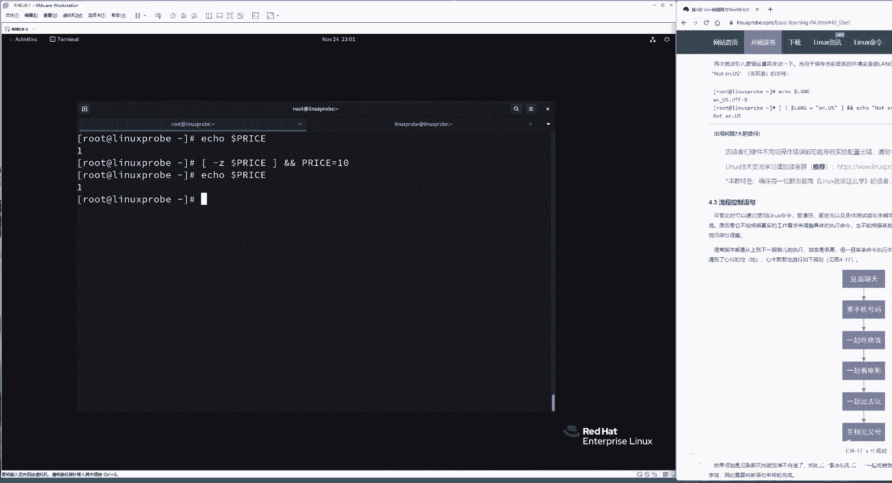

某一个命令执行失败了，不会影响到后面的命令，比如说我第一条命令是新建一个目录，第二个命令对于这个命令来进行呃，然后第二个命令对于这个目录来进行授权操作，给予他一定的更高级的权限。

第三我们对于这个文件去啊，对于这个文件夹里边写入信息啊，就是这么三步，假设说我第一步的时候新建这个目录，就新建失败了，权限不足，那么他还会继续往后去执行第二条，第三条的命令，那这就会有问题了，命令都难。

这个目录都不存在，你继续去执行，那命令都是错的啊，所以这个怎么办呢，我们叫做条件测试语句，以及叫做啊循环语句，总之把它叫做流程控制语句，接下来就要给大家讲到if for while和case语句了。

好今天的话呢课程有点长了，我就不太多啊，我就不再多讲了，同学们先把这个这节课反复的消化掌握好了，然后就再去打开下一节课，我们讲一下条件流程控制语句，好，同学们也辛苦了啊，好好休息一下。

然后把这个课消化好了，再点开下一节课。

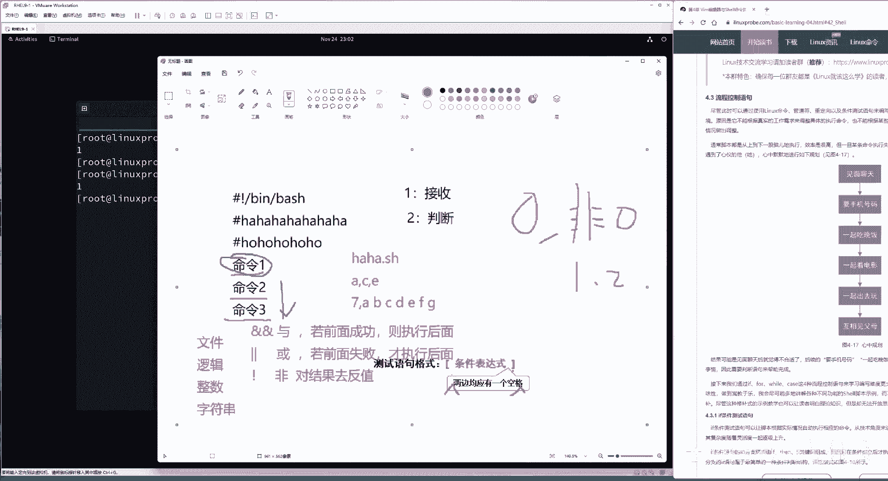