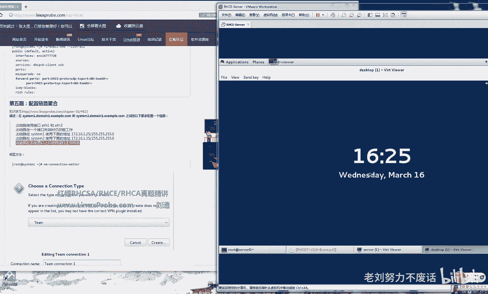

# 红帽RHCE 7考试真题精讲考前辅导（Linux就该这么学） - P1 - 老刘努力不废话 - BV1au4y1K7HB

来讲呢，我们都可以在任意一台REO7系统上面去做，因为它主要考察的是我们对于系统的管理，那么对于而是CE呢，它是考察了我们对系统的服务的管理，那么我们呢要考虑到相关的因素。

比如说我们在挂一个远程共享的时候，那么我们输入域名的同时，它是否已经被我们配置好DNS这样的相关的事情，所以呢，虽然说我们的课程都已经是讲得非常的充分了，这20这20个章节里面。

我们讲到了如何去配置DNS啊，配配置这个阿帕奇，这我们都讲过了，但是呢我们呃就是同学们完全可以自己去，模拟出来一个考试的环境，那不过呢因为我们为了苛求于说，我们啊跟考试的环境尽量的能够贴近一些。

这样的我们考试的时候起码心里有底，所以我找来一个，就是我们从从五菱之场上面提供的，这么一个考试环境啊，是跟我我这个完全做了一遍之后，发现跟考试的环境是非常非常相似的啊，几乎是一样的，并且呢是这样的。

我们的培训呢会是以这个啊，百分百的这个精题讲解，就是我们这个介绍都是考试中啊，考试中会百分之百是一样的描述的，所以说呢你在看考研辅导的时候，一定要先去把这些描述都给他看一遍。

这样的节省你在考试中这个花费的时间，同时你需要注意的就是我们的这个考题的提纲，就是我们这个题型呢是win跟考试是完全一样的，并且呢RGCE它总共是22道题，就是跟我们的考试是完全相同的。

并且呢我们这边介绍到了这个反馈来讲，题的难度是在下降的，这个是最难的一份题，就是最全的一份，包含了所有考过的题，那么真正考试的时候呢，可能也就18道或19道，这就根据自己的情况去做。

但是这个题型就放在这里，不可能会出这个圈了，我们就是把这个题型给它完全练一遍，所以呢我们这个RHCE，听起来可能会有一些难度，或者难度是很大的难度，实际上你练会了之后，考试的时候就会发现。

其实考试的难度还是比较小的好，那我们这个考试这个页面里面，讲述的全都是RHC的考试原题，一点参数都没有变的原题，那么你考试的时候呢只会发生变化，是哪里是变它这个IP地址，还有他这个主机名。

这个我们早就是cs里面我们就讲过了，如果你是做到第一个位置，那么你的话那就是system一一个点DMAN一点啊，倒霉一点，example点com，如果你说第二个位置的话，那你则是DM2啊。

第三个位置DOM3，你的IP地址呢会相应的发生改变，一个是172。24。1好，或者说点2。3。4，指挥IP地址发生变化，还有主机名发生变化，其他的呢我们都按照正常的这个啊，这个流程去做好。

然后呢我们现在是这样呃，我们的这个考题呢放到这里了，我们呢还准备一份考试的环境，我从五应职场里面拿到的，那么我们现在先去配置一下这个环境，对于有一些题目来讲，比如说比如说这些题目啊。

就是跟我们的这个相关的服务没有依赖关系的，比如说SSH端口转发，这些跟我们其他实验没有冲突的这些实验，那我们呢就按照我们的真题原题，百分之百这个真题来去做，但是呢比如说这个用到了KBS加密。

或者说这些帮这个网卡绑定我们的虚拟机里面，原始的话没有的情况下，我们就按照他这个考题来做，他们的模拟题来做，我再来说一遍，就是我们呢原则上是按照真实的考题来做，但是因为有些事后呢。

我们因为实现环境的原因，我们必须要把这个主机名给它修改一下，比如说这个主机名修改一下，这样的话，那我们就以这个虚拟机里面的这个模拟题，提供的这个名称为啊为准，但是实际上我们所有的题目。

都会给大家去过一遍，能够去啊，让大家去看一下我们怎么去做的，并且呢我们希望说大家RGCE，如果你要是没有这个这个视频，如果没有完整看三遍以上，你不要去考试，因为呃RRC它这个变数会有的。

就是你在考试的时候，万一出现个报错什么的，不这个不熟练啊，可能会导致你的实验失败，很重要的啊，所以这个视频一定要多看几遍，一定要多看几遍好，我们先来配置一下我们的这个考试环境。

考试环境的虚拟机拿到了之后，要求的配置比较高，因为那RHCE说一遍是有两台主机，就是你做到了你的这个物理机前面了之后，你的真实机里面装了两台虚拟机，真实机里面装了两台虚拟机，比较绕口对吧。

就是我们的真实机是用来看题目的，还有这个选择环境的，而考试的时候是两台虚拟机，待会会看到这个图标，那么这两台虚拟机RHCE为什么难，会为什么花费时间多，就是因为他需要去配置两台机器。

而HCSH配置一台机器，所以呢我们我们在这个真题的下面精讲，我们写上了分别是对谁来做的，是对system1还是system2，那好我们先给大家先去一个呃定制一个规则，就是我们对于第一台虚拟主机。

我们统一叫做system1，对于第二台主机我们叫做system2，好能够理解吧，而system一般来说它是用来当做服务器的，而system2呢它一般是用来做我们的虚拟机，好，那我们先来做啊。

现在配置一下考试的这个环境，考试环境呢，你需要先去配置一下你的虚拟机设置啊，这个不需要去做的，首先啊能内存，假设说你的物理机的内存呢，比如说有八个G好，你给他五个G就差不多，我们的建议来说啊。

不要太小于了三个G啊，或者说四个G这样就可以了，三四个G差不多，如果你的物理机内存比较大的话，可以给他尽量再给它大一些，没有关系，我这里呢把它给到五个G就足够了啊，但是不要太小。

因为里面呢这个模拟的是我们的真实环境，这里面还有两台虚拟机，并且加上考试环境有三台虚拟机啊，也就是说我们现在同时开启了之后，里面要跑起来四台虚拟机，所以这个内存必须要给他大一些。

处理器呢根据你的这个实际情况来讲，就是你的CPU里面有多少核心，我这是123456788核，那就是C啊，CPU数量是一，核心是八，这个呢我给我会给你们的时候啊，呃你们会看到的是。

我跟我现在实验环境一模一样的这个设置，如果你的内存比较小，把内存给我调小一些，那这个CPU核心数比较少的话，把这个改小一些啊，否则会出现问题，你们看到这个实验环境，会跟我现在是一模一样的。

但是它适用的是我的机器好，OK然后呢是硬盘的大小，不用动CDROM，不用动两块网卡呃，两块网卡的话，我建议来说也不要动，那也不要动好，这些都不用动，就是改一下你的内存，如果需要的话，改一下内存大小。

改一下CPU的核心数，OK这两项一定要开启虚拟机的虚拟化功能。

点击确定，这时候点击开机四虚拟机，你的实验环境就要开启了。

实验实验环境开启的时候呢，这个速度还是比较慢的，我们需要等一下啊，今天我们有个同学刚考完，已经拿到这个证书，而是C呢，按照咱们这份题目来做的话，是做了290分的啊。

这个证书我们就拿到了啊，考了290分还比较不错啊。

就是CIC还是CE，所以呢我们这道题是非常靠谱的啊，题型完全的覆盖了，并且我们这个超出了这个考试范围很多，就是你们真正考试的时候，会超出你们的考试范围很多，好一定要去练熟练，练到那种不用看我这个精讲啊。

看一眼题目就知道他做一件什么事情，要熟练到这个地步啊，必须的啊，这必须的啊，我自己来讲的话，准备TRC的考前辅导。

我们建议来说是要两周左右的，就是你两周之内每天都在练，每天都在练啊，好现在呢我们打开你的这个虚拟机的终端，你看看这是你的真实机，当你考试的时候也会见到这样的一个界面，然后呢它有三个图标。

分别呢这个desktop代表的是system1，我来改一下名字哦，这是system2，the serv呃，survey呢这个呢它代表的是system1，我们就以这样来做。

那我们大部分呢我们都会以这个考试真题，百分百的按照我们的考试真题来做，同时我们呢如果遇到了游戏啊，依赖关系的那种考题，那我们就按照他的这个考题来做，它的RHCIC的题目，在这里，HCE在这里，也就是说。

大家不光可以去练我提供的这个红帽原题，也可以去练一下他这个模拟题，它的模拟题给大家提供了，这也是人家收费的一部题目啊，不要往外传好，那么HC的考题呢在这里，这是一份他们的模拟题。

那我们到了这个考试环境里面呢，我们怎么去做它的主机呢啊system1的话是幺七，记一下，一定要记在那张你的纸出来，它的system1的话呢，IP地址是172。25。0点，幺幺必须要记下，这很重要。

system1冒号172。25。0点，11system2的话呢是172。25。0。10，好记一下，密码呢都是red hat，密码都是red hat，好，我们现在另外这个考试，他这个模拟环境呢啊。

坦白来讲也有一定的这个问题在里面，比如说YM仓库配置有什么呢，有些问题，不过这个没有关系，因为呢我们在考试的时候，是一定不会有这样的问题的，而我们在练习的时候遇到了的话。

反而能够提高我们的这个做题的这个排错能力，但是考试的时候你不用去考虑这些，他都会帮你去把这个DNS啊，DHCP都配置的很好很好了啊，如果有问题的话，随时随时可以问老师。

那我们先来打开这个system1啊，system1它开启之后啊啊让你按一下回车，或者不不用点它自己就会开机。

这是system e就是server system2呢是一个desktop，你需要先去开启它好这个classroom啊，这个你不用去看它，就默认已经是给你启动好的一个老师的这边端，给他挂机就可以了。

挂机就可以了，不要给我把它关了啊，挂机就可以了，然后唉我们来看这个题目，首先第一道题是不是跟S23S是一样的，他要求我们去配置SLINUX，so easy啊，这个呢我们的考试里这个时候是这样的。

考试的时候应该已经是默认是启动模式了，你只需要去看一眼，这是一道送分题，送分题好，只需要去看一眼，如果要是考试的时候，他是被禁用的话，把它改启用就可以了，这是送分题，好，我们登录他账号是root。

密码是red hat，密码是red hat，好，我们稍等一下它。

登录这个主机之后啊，我们现在呢去看一下我们的SDI的设置好。

另外呢如果说你不太喜欢说呃，来回来去切这个虚拟机，你实际上呢也可以把这个都给关上，在你的真实机上面呢，用远程连接SSH root呃，172。25。0。11诶，S h 172。25。0。11，他配置好了。

这个S给的key验证了，直接登录进去，这就是server0，也就是system1system1是server0，然后呢再去远程这个呃，172。25。0。10，老师没有给你变魔术，老师怎么样去做的。

你这样你去练习的时候，环境和题目都是一模一样的，你也你也能做出来，但是一定要观察仔细了，有的时候你去执行命令失败了，原因就是你没有观察仔细老师的步骤，首先我们来看一下SLINUX的配置有没有被启动啊。

看一下它是INFORCING好，强制开启第二道题啊，第2system2左边这个标签是单desktop0，右边是top啊啊不这个左边是server0，右边是desktop0。

分别代表的是system1和system2，能够理解吧，好看一下这台的SDOS的配置，是不是也是enforcing好，这道题拿分搞定了，就这么简单好，但是我不建议你考试的时候跳过去。

因为考试的环境可能还会给你下一些瓣对吧，下半的意思就是给你啊，给你想一下幺蛾子对吧，他这个万一要是给你改成disable了，这道题没分了好，然后呢我们去配置一下SSH SSH，它要求看。

要求说用户呢能够从遇到门一点example，当中的客户去访问你两台的虚拟机在，但是在这个卖133T点ORG的域的客户端，不能够去访问，其实就是个废话，能够理解吗，这句是个废话。

他说来自这个域的客户端可以去访问，而这个玉不可以，那我们是不是就可以指定一下，仅是指定一下拒绝的预，这样除此之外的所有的用户都可以去访问了，有的同学非常较真啊，说老师呃，比如说你去这道题。

他说允许这个玉的人，这个用户来访问，而这个玉呢不能去访问，那其他的玉呢，除此之外的其他域呢，其他与他没有说的话，就是默认的按照默认的情况来做，那么我们去访问一台虚拟主机，是不是默认的情况下。

它是怎么样被允许的，OK那么这句话就是个废话，我们不用去做，直接去写什么禁止的就可以了，去写禁止禁止的规则好，我们进入到这个里面，看它要求它是在什么，它是要从我们这个呃没有指他没有。

他没有指定说对于system1来做还是system2来做，所以我们要对两台机器全都去做啊，我们先来写一下这个允许规则，就是我们在工作的时候呢，我们可以把它写成这个决定的，但是他这个呃他既然要求了。

我们要允许的话，就给他写上吧，这个因为我们考试的时候做过没有太大的关系，好我们先写一个允许规则，这时候你会老说，这时候你会说老师他这个明明给的是这个，咱们一点example点com。

你们没有变成一个IP地址的呢，考试的时候记住了一个技巧，就是如果说考题当中给你的是一个域名，一定要够拼他一下，如果说考试的时候给你是一个域名，比如说叫做这个呃，server0点example点com。

你一定要给我拼一下，它拼出来之后，给我们怎么样把这个IP地址复制进去，不要写域名，不要写域名，SH的允许规则，SHD冒号允许谁呢，倒霉一点，example点com就去拼了一下，拼出来的值是172。25。

0。11对吧好，那我们取一个域的，它是从一个域内的话，那我们就是这个172。25。0。0，这个网段，然后255。255。255。0，而这个呢我们看一下，从买133T这个域名过来的这个客户。

实际上它并不是一个玉了对吧，它是一个客户端呃，我们指定的话呢是指定一个拒绝的语好，那我们对于两台机器都要去做，都要去做，对system和system都要去做，都要去做，写入同样的数据就可以了。

S s h d172。25，如果你要是只做了一台机器的话，那你能拿到的分值应该是只有一半了，所以必须要让让你去做几台的时候，就要去做几台，一定要去做好，我们现在这样去做呢。

是不是使用的是TCP weapons，对吧好，因为我们的培训呢就已经非常讲的，非常的详细了，所以呢我们的考前辅导就会是以考试啊，这个模拟来讲解，如果说我我去修改这个文件的时候。

你根本就没有印象它是干嘛用的，那你就可以点一下我们的知识学习，点击到这个帖子里面，看看我们之前是怎么样学的，去回忆一下，如果还是想不起来的话，完整的再去看一遍咱们的录播课程好，然后写上拒绝。

那你就去拼一下嘛，133T去看一下有谁不能够登录在IP地址，我们拼出来的话呢，是假设说是172。25。0。30，就这样去写就可以了，保存并退出啊，这边也是SHD172。25。0。30，保存并退出好。

这个时候呢你的TCP weapons就做好了，并且就两台机器都做好了，那我们的第二道题拿分，第三道题他说啊在system1和system2上，他这个描述很清楚啊，去定义出来一个命令的别名。

当我们去执行这个命令的时候，则会出现，这相当于去执行这一个东西，我们讲过一个东西叫做ALICE对吧，就是我们去执行一个很短的命令的时候，相当于执行了一个很长的命令。

而但是说此命令对系统当中的所有用户都生效，我们就要去修改一下我们的呃系统的配置文件，这叫做etc里面的profile，它代表的是对所有用户都生效的配置文件，我们去编辑一下它。

然后呢我们在他这个文件的最后面吧，我就随便找一行写上ALICE，然后他写的是，当我们去去执行QSTAP的时候，QSTAP的时候相当于怎么样去执行了啊，这么一大串的东西好，那我们就来给它写上。

如果是考试的时候，你可以去复制的，考试的时候是可以去复制的啊，PSBGAO呃对，然后p i d tt are user，好保存它保存之后你去执行a qs stat，他还报错了，他告诉你并没有找到。

我们怎么样去加载一下这个配置文件，重新加载，哦bean里面的PS杠ao pad，逗号TT，User f n m s，我们先去执行这个命令啊，看看他有没有错误，命令是没有错误的话。

我们应该是少了一个双引号对吧，双引号引起来，单引号双引号无所谓啊，我们再来去加载一下JPG文件，然后再去执行一下QSTAT没有问题，当我们再去执行QSTAT的时候，相当于执行了这么一大长串的命令。

这边system2的时候再来做QSTAT，还没有这个命令，怎么样去修改这个PUPF在里面任意的地方，我们建议来说放到最底下啊，好吧，就到最底下应该去写入相同的内容，ALLIZE啊。

q s t a t bean里面的PS啊，杠AO一定要给他大小写，要区分啊，人家怎么写的，你怎么去写，实在不行的话，就复制一下它，不要瞎改啊，不要瞎改，我们现在是在考试，不是要按照你的这个想法来做好。

然后呢我们去执行QSAT还是不行对吧，我们就要去重新加载一下配置文件，来验证它执行QSAT，发现没有问题，这道题做完拿分，第四道题做一下端口转发，so easy啊。

使用我们的firework config这个图形化工具去来配置，哦因为呢现在我们是在这个远程连接，它会告诉我们不可以对吧，那好我们就进入到我们的虚拟主机里面去做，你看他的要求是在哪做的。

system一上去做的，所以system2上你用去做吗，不用去做对吧，system2上不用去做，要求将5323端口转发到八零端口，他告诉你是什么协议了吗，是TCP还是UDP吗，没告诉你怎么办，全都去做。

全都去将他的5323端口转发到八零端口好，并且说指定到这个域，这个不用不用去做，打开图形化工具之后，我们点击永久生效啊，我们那个考前辅导又会讲的比较快啊，如果你要是没有这个跟好的话，那你可以往回看一下。

咱们录这个录播课程，这里呢我们选择这个永久生效模式，选择端口转发啊啊point for a forwarding是吧，将这个5423端口写进去，然后写上本地转发，本地转发到哪里呢。

转发到八零端口都写的很清楚啊，看题写转发到八零端口，点击OK再添加一条，添加一条叫做UDP的转发，转发啊，5423端口转发到八零，好写上，OK这个时候呢我们去点击一下option里面的reload。

Farewell，将它这个配置文件立即生效一下，没有问题好，这道题拿分做完好，就这么简单，然后呢我们来做看啊，它要求是在system一下去做，也就是四这个呃实验环境里面是server啊。

就这样去做就可以了，记住了下面的这个呃要求对哪个主题去做就做，那就去对哪个主题去做，比如说要求在这个system一上去做端口的这个转发，就要在system一上去做，千万不要去做两个啊。

不要在两台机上去做，那么这个要求在system1和system2上都去做配啊，system1和system2之间去配置这个链路，也就是说这两个主机都要去做，对不对，好。

我们在这个server上面就是3system1，首先打开我们的这个网卡的配置文件，他说啊此链路使用的是ETHE和ETH2，好点击一下添加，实际上它它就它就是在做一个什么配置，一个链路的聚合。

就是在配置一个网卡的绑定，如果忘记的话，点怎么链接去看这里呢，我们选择网卡的绑定，选择什么team啊，team点击创建，然后呢这个名称呃其实无所谓，但是你们要说啊，想改的话，改的更整齐一些。

我们就去改一下，叫做team啊，好，然后呢我们这里呢点击添加谁为我们来服务的，然后选择一下网卡，将这个ETH他他写着的啊，看到这里写着的ETH1和ETHR，比如我选ETH0好吗。

人家都写着题目的选择ETH1好，然后呢把这个名称呢给它改成ETH1，人家要求什么就去做什么，然后将这个勾给他勾选上，让它开机自动连接好，添加好了之后点击保存，这就添加ETH2，添加ETH2啊。

E t h2，按他的要求来做要求，看要求点击保存下面这个JSONCONFIG呢，我们需要给他指定一下它的这个启动模式，我们需要去复制这么一段话啊，这么一段话要去写到里面，在这里啊。

一个大括号必须要去写的很准确，A name mahal，什么ACTIVE，实际上他就指定了一个网卡绑定的一个模式，能够理解吧，这个我们学过016对吧，好点击保存，这个时候哎你这才做完了一半。

我们还要再回去编辑它，看它的要求，他要求在system一上面怎么样去，使用的是这个IP地址，system2上是这个IP地址，并且他告诉你，当一个接口失败了，第二个仍在工作。

也就是说做了一个背圆的一个动作，所以呢我们这里必须要加上这么一个参数，而后面在重启之后保持正常状态，所以呢你就必须将你的网卡的这个链接给它，勾选上，这个每一个步骤实际上是在提醒你呢，能够理解吗。

它在提醒着你每一步再怎么去做，system1的IP地址呢，是这样去设置啊，改成手动设置，改成172点啊，根据根据他的实际情况来做啊，因为这道题我们的没有这个相关的依赖环境。

所以呢我们就直接按照咱们的真题来做的好吧，172。16。1。25，然后IP地址是子网的，是25。25，5。25，5。2。0KDNS跟这个网关崩去写，点击保存，你怎么去测试，怎么去测试，把它关闭掉。

然后拼一下172。16。1。25，你去拼它一下，发现网络不可达，怎么办呢，重新启动一下你的网卡，重新启动一下你的网络，好重启好之后呢，再去拼能不能拼啊，刚才是不是拼不通，看前面前面是不是拼不通。

重启网卡之后拼通了代表什么，咱们的配置是生效了，考试的时候我建议你们啊练习的时候无所谓，该怎么配怎么配，考试的时候你千万别，你这个配置肯定是没有错误的，即便是你配置错了，你知道怎么去改正吗。

你也没有办法对吧，考试的时候别跟我说啊，看这个题目要求呃，这个重启无所谓啊，当一个接口失败之后仍可以工作，你别到这个机箱里面勾扒网线去，然后测试拔这个网线之后能不能去启动，有可能你把网线。

你的教师机看不到你台客户机了，算你作弊好吗，考试的时候按照正常的步骤去做，测试的时候有do的去测试，别太过分的去测试好吗，不要太过分的去测试，有度的测试就可以了，这样的话配置出来就没问题了。

没问题，OK做一下system2这个desktop。

同样的步骤去绑定他的这个，去绑定一下他的这个网卡，另外老师在做这个演示的时候没有偷懒。

desktop1做了，Desktop，它的server0也做了，system1做了system2也做了，你在练习的时候不要偷懒啊，你感觉好像都是一样的东西，我做一遍不就得了吗，一到考试的时候可麻烦了。

你习惯说你绑定完了之后就看下一道题了，你结果你考试的时候也绑定完了之后，看下一道题少了一部分分呢对吧，一定要细心啊，一定要细心添加网卡，第二遍呢我们就做起来比较熟练了对吧，我就快一些了，添加啊。

还是ETH1和ETH2，看要求要求都是一样的啊，ETH1好，ETH1勾选上保存，然后这里选择ETH2，我没有动的地方，你不要动，比如说克隆Mac地址什么的，你改它干嘛，你不要动，我没有动的地方。

你也不要去动，好点击保存，下面呢我们的这个启动，它要求由于它有一块网卡失效了之后自动备圆，所以呢我们就一定要把它写上它的这个激活，Active backup，激活它的自动备源功能。

你说这老师这个怎么背啊，这个没有办法，你就必须给他背下来，考试要考试吗，考试你就必须把这个这段话给他背下来，好点击保存好，然后呢配置一下你的IP地址是多少，17system2的话呢，是这个172。16。

1。35好，155。25。2，5。25。0，好保存，保存并退出，重新启动一下你的网络，当然了，你可以先测测试一下，你拼着172点点16。135。1。35，我们拼他拼不通对吧，拼不通好重启你的网络。

重启网络，这样这样的动作重启机器，这样的问题不会有，但是你不要去拔网线好吧，拼通了我们的网卡的绑定都做好了。

没问题，第五道题做完拿分好。

并且呢我们每一步骤都给大家去截图，并且精讲了一下，你们要去测试的话，也可以这样去测试，除了拼测试以外，拼显得很low对吧，我们要可以用这个呃team，C t r l team。

我们的网卡名称叫做team对吧，state看它的状态啊，team不存在嗯，team不存在的话哦，Team0，你看到现在是不是一这个一和二都被加进去了，Eth1，ETH2被加到这个网卡绑定里面了。

并且状态是up，现在用的是谁，现在用的是这个ETHE啊，就OK了，最好先拿分，第二呃，第第六道题说配置一下IPV6是在哪啊，system一上和system2上都要去配置好。

首先还是打开我们这个网卡的配置工具，你说IPV6老师我没有学过呀，你学它干嘛，那你们考试的时候不需要去学，完全领，这要去理解它有没有选择IPV6，选择到我们的网卡，选择IPV6，点击手动设置。

你说这老师这IPV6它代表什么意思，我们不用去管它，抄进去，别抄错就行，好然后下面这个写上64，点击一下保存，点击关闭，怎么去测试，你去拼它的话肯定会报错，因为拼命令呢对应的是这个，IPV4协议的。

你拼他一下报错，他告诉你是为机地址，你去输入拼六没有空格啊，拼六怎么样，唉他告诉你网络不可达是吧，我们来重启一下网络，拼通了看到没IPV6的地址，拼通了，返回值，OK这道题做完拿分。

第二个你来做system2了，你来想一下怎么去做，考试简单不简单，很简单的，其实这不就是玩一样吗，你不想抄的话，给它复制进来，考试的时候是可以复制的，so easy对吧，只要你细心点，别把它给我抄错。

这64别给写成60就没问题，好重启网络，同样的步骤，是不是只要你细心，只要你别慌，老师都把这个题目给你精讲的这么细了，又有考前的这个辅导啊，包括咱们的考试，包括咱们的学习怎么讲的这么细。

你考试的时候是完全没有问题的，只要能够啊，不只要不紧张，然后正常发挥，你210分嘛，这个及格的话，你考到二百八二百九都是很正常的，拼通没问题，system1和C2都做完了。

拿分下一道题配置一下本地的这个邮件，本地邮件呢因为环境的依赖关系呢，我们就呃实际上这个虚拟环境呢也是有问题，不过呢我们就按照我们的考题来做，但是没有最后，但是没有办法最后去验证啊，不过没有关系。

他要求在system1和SISTM上面都去做这个邮件，那我们就来去做，说这个系统啊，不允许接收到外部来的邮件系统当中呢，所有的邮件都会被转发到这个RHGLS点，倒霉一点。

example点com这个主机上面，并且呢所有的邮件都显示来自于倒霉一点，example点com，什么意思，他每一句话实际上都在讲一个参数，这个参数就代表我们的POSTFIX里面的，什么来源的邮件。

一定要有印象啊，我们讲过之后一定要有印象，他讲每一个参数的这个含义，然后呢你做完了之后，可以用这个DAVID这个用户来测试你的配置啊，他们会把这个收到邮件放到这个链接里面，因为我们实验环境的原因。

你可能没有系统当中没有DAVID这个用户，你也没有办法去访问这个网站，不过没有关系，我把这个配置方法告诉你，考试之后这样去做保准是万无一失了，首先去编辑etc里面的POSTFIX里面的men点cf。

在日期当中，post face是默认被安装的，直接去进，然后呢加入一行参数叫做local啊，稍等我去加一下啊，随便加在哪里都可以了，我们去搜索一下，我们就随便找一个地方吧，因为如果不是讲的很详细的话。

可能大家心里没有底，对吧啊，我们就给它加到第100行，100行的上面呢，我们写上一个local transport，代表转发的意思，转发啊，转发的这个规则是错误本地啊，OK然后呢，我们这里呢。

选择把这个第99行给它注释去掉，它是它的来源地址，看一下你的呃，题目的第三行，要求它是不是所有的来源邮件都显示，来自于倒霉一点，example点com这个参数就是做这个事情的，然后还有一个转发。

看第二个描述，看第二个描述来的，所有的邮件都被转发到哪里对吧好，我们呢去修改一下第313行，把这行号都记清楚啊，313行，我们去开启这个转发功能，将这个邮件的转发，转发到这个地址。

RHGL倒霉一点一个example，点com练的时候按照我老师给你的题目去练，你真正考试的时候的时候，也许你是倒霉二或倒霉三，就按照实际，但看着你的实际情况去做，实际情况去做。

然后重新启动一下你的post fix a restar，重新启动一下你的post FX，如果遇见报错了别慌，看老师哪里讲过的，自己再去啊，回忆一下考试的时候，千万别慌，千万别慌，然后启动它啊。

加入到开启动项，红帽考试要求重启之后还要生效，否则成绩是没有的，必须要保证它的这个是开启的，必须要保证它是开启的永久生效，然后呢，打开你的这个图形化工具防火墙，去来配置一下你的SMTP的允许规则。

如果你愿意的话，你可以去执行这个文字界面呢，因为老师已经把这个每个命令都给写出来了，所以呢我们这个考前辅导呢，我们就按照另外一种不同的方法来去做好吧，希望给大家多几种这个选择的这个选择的途径。

选择的这个OK这样呢我们选择永久生效，选择SMTB吧，打勾打勾之后点击加载，这样的这道题你就做完了拿分，如果你愿意去测试的话，如果你愿意的话，可以发一封邮件给这个DAVID，你给他发完邮件之后。

我这个时候呢我们就不去模拟，但是我告诉你怎么去做，你发一封邮件给这个DAVID，你不用去塑造这个用户里面去mail去看，你直接用你的浏览器打开，打开你的浏览器，然后去访问这个地址。

如果你给他这个DAVID用户发了一封邮件，他收到的话，这个这个地址里面就会出现了这个你给他发件，发送邮件的内容，发送研究的内容，所以呢你就可以去访问这个去测试下面这些，我们就不去测试。

因为这样配置是没有问题的，好top，desktop好，我们desktop呢同样啊去配置一样的东西，首先去修改POSTFIX里面的主配置文件，然后呢在大概100行的时候，我们去加上这么一个本地转发的参数。

然后呢将第99行诶，它的这个来源于哪个域，看第三个要求，第三个要求倒霉一点，example点com，修改第313行，将这个转发的路由转发到哪里呢，给他写上这个RHGLIS点，倒霉一点。

example点com，OK改好之后保存并退出，重新启动一下你的POSTFIX，咱们是不是讲过很详细的，所以这样做是非常简单的，你们看起来之后应该也是觉得非常的简单，因为我们都是学过的。

培训呢是完全覆盖他们的这个考试好，然后呢配置一下桑巴，桑巴so easy，看题目要求呃，你先不用去看题目先，既然他要说去配置的话，你就先先把安装上吧，安装上桑巴，顺便为了测试的话。

安装一下桑巴这个客户端去测试它，安装一下他，他要求啊，SMB服务器必须是属于STAFF，工作组的一个成员，并且你去看对谁去做，对system2吗，不对，只对于只对于system1去做。

如果说考试的时候他题目没有写清楚，按照你的想法去做，如果你不能够保准的话，你就要去问一下老师也是可以的，当然问的方法，按照我们之前rh cr h cc的视频里面，这个方法去问就没有问题。

好编辑它的配置文件，然后呢我们往下去看它默认的工作组叫做什么，叫做work group，还记得吗，我们讲SAMA的时候里面有的啊啊叫my group，这个函数呢是在第89行，我们将它修改。

有的参数别给我去新家，一定要去修改STAFF，看第一个第一个要求STAFF，然后创建一个共享目录好，我们到最下面，我们这个写共享的话啊，有一个好的习惯，就是放到最下面去写，放到最下面去写。

第321行去写他的共享名称，还共享名称，command好，共享的目录是什么，共享是这个目录，我们首先要先去创建一下它对吧，打开另外一个终端去创建一下这个目录好，然后呢这个名称就写好了。

共享的目录是command桑巴的配置参数呢，参数跟这个值之间要空格，只有掌门一点example，点com域的客户可以去访问好，那就是这样，Host alone1720，你拼他一下，你去拼，你去拼他。

千万别跟我说写一个域名啊，根据实际情况来说，因为我们这样要用两台机器去测试，它有一些相互的依赖关系，所以呢我们按照这个实验环境里面去做的话，就是172。25。0点这个网段好。

然后是否可见他他他他这是要求的，必须是可以浏览的，这个是一个新加坡人翻译的对吧，新加坡人翻译的，他有一些问题，实际上他要求的就是在网络邻居当中可见，所以我们写上这个网络的邻居，可见这个参数保存并退出。

重新启动一下我们的SMTP，不是我们写重新启动一下，我们的SMB和NMP这个服务重启，并且没有报错的话，加入到开机启动项当中，这样呢我们就可以拿分，拿分好了之后，我们去修改一下我们的防火墙让怎么样。

让他允许我们的桑巴服务，允许我们的桑巴服务永久生效模式搜索啊，桑巴嗯，没有什么啊，有啊肯定在下面啊，这勾选上好，还有一个叫做mount也必须要去给它允许呃，我找一下哪里啊，OK这样OK修好它之后呢。

去加载这道题，拿分看最后一道题，最后一个小题啊，他说安迪这个用户呢可以去读取共享中的内容，如果需要的话，密码是这个，也就是说用来测试的对吧，用来测试的，本地的话呢。

考试环境当中应该已经有这个安利这个用户了，但是我们的实验环境好像没有，所以呢我们自己去创建一个，并且把它加入到我们的桑巴这个数据库当中，密码呢给他一个他要求的，给好了之后，哎我密码给错了是吧。

密码是FILCTRLG，看清啊，看清看题目，不知道瞎想的，嘶好稍等啊，好做好了之后呢，我们去打开desktop去测试，他说可以用安利呢去远程访问好，我们就亚明道安装一下桑巴的客户端。

再安装一下CFS这个挂载的服务支持啊，去安装一下它，要么在RHC里面已经是配置好的，你直接去用就可以了，然后sm b client写上复端IP地址，就是你的system1的IP地址，172。25。0。

11啊，使用谁去看呢，使用ANDY去看，然后输入ANDY的密码，密码输错了密码应该是FSTTRGK，当你看到这个信息了之后就没问题了，说明你的共享是OK的。

因为你看到这里有一个共享出去的叫做command，没问题了，不用再去多做这道题，做完拿分，第九道题就是我们要去配置一个多用户的桑巴，挂载，他要求的是有些用户他的权限会比较大，有些权限呢比较小。

我们现在一步一步来做啊，在服务端system一上来做的，看清楚，system一上来做的去编辑一下他的这个配置文件，桑巴啊，它的主配置文件去创建一个共享，这个共享的名称要求是什么，MIS啊，看要求啊。

一步一步看M呃，CELLANEOUS好，共享呢必须能够被这个用户断去访问到，那我们就是pass他的，他通过我们的这个桑巴共享，将这个目录共享出去对吧，那我们就要先去创建一下这个目录。

也要有在我们的本地去创建这个MCELLL，ONEOUIS好，创建好它之后回去看，他要求只能够被挡门一这个域去访问，那我们再去写，稍等啊，呃MSELLENEOUS，只能被他去访问的话。

就是HOLO拼它一下，拼出来它是172。25。0点这个网段了，本地呢是这个可以被浏览的，就是说我们的这个网络邻居当中是可以可见的，所以改成yes，要求我们的其他用户呢是不能够去写入数据的。

只有谁能够去写入，只有这个AKIRA用户可以去写入，那么这句话它就是个废话，这句话是废话，因为我们可以指定它，只有它可以去写入就可以了，那我们去加入啊，RABLE就是说允许去写入数据吗，改成NO。

不允许任何人去写入数据，而谁可以去写入呢，RELESS仅允许谁写上一个允许的名单，写上这个用户的名字，等于AKIRA这个用户还不存在对吧，那怎么办呢，去创建一下他考试的时候，你去D去看一下用户。

如果不存在的话，手工创建，稍等啊，杠AAKIRA，没问题，做好了，他告诉你这个用户已经被添加进去了，并且你去看DSLLENE，看这个用户在不在，如果不在的话，手工去添加，因为老师呢。

希望你们把这个考试做的非常的完美，所以呢我们把每一个步骤都要讲到密码，他告诉你了，看后面是不是LFECTRAG好，添加好这个用户，那我们这个用户呢是不能够去访问这个呃，去写入数据的。

而这个AKIRA用户是可以去访问，去访问我们的，去写入我们的数据的，好重启这个服务，SMB跟NMP重启这个服务没有问题，因为我们刚才已经做过了，这个加入到开机启动项当中，此这个步骤可以忽略掉，不做好。

然后呢我们在我们的system2上去测试，去测试SULGL，直接涨172。25。0。11呃，杠又是谁去测试，用这个AKIRA去测试，显示它的密码，能不能看到他这个共享出去的东西了。

这一条是不是能够看到了吧，好那就可以了，我们去创建一个挂载目录，它要求我们看这个题目啊，永久的对不对，挂载到哪里呢，这台主机system2上面，并且挂载的目录是这一个通过谁来做验证。

每一步骤都是有用处的对吧好，我们那个可以去验证的时候，使用到这个用户去做验证都是可以的，我们去测试啊，输入密码没问题对吧，按照老师的方法来去做的话是没有问题的，首先来去创建一下你的挂载点。

system2上去做挂载点，system2上去做挂载点，创建好了之后，安装一下这个CFS的这个远程挂载的服务，CFS应该已经安装好了对吧，已经有了，但是考试的时候你尽量还是去按一下，万无一失嘛。

万一样没有呢，然后呢O加W，因为呢我们要让它能够去获得临时的写权限，O就要加上W写权限，NMT里面的MULTI没问题，然后去写上你的配置文件，写到etc里面的FSTAB，为什么。

因为你的这个永久的这个生效，必须要怎么样永久生效，挂载必须永久生效，必须要写到这个挂载信息里面写上它，然后呢我们想要挂载信息，挂载信息我们要去写哪里过来的呢，是172。25。0。11。

写上我们的system1的IP地址，共享出的是什么服务啊，这个名称是MCELLANEOUS，挂载到本地的哪里，挂载到本地的n mt里面的，MUTLTI使用的是cc fs格式权限，Default。

它要求你怎么样去使用SILENE，这个用户去做验证，所以呢我们的权限后面必须要写上多用户，看到配置多用户去挂载，配置多用户的挂载，支持username的用户名，写上SILENE。

看这里啊都要求着不要去瞎写，然后密码是什么，password等于密码是什么，是这个密码，你去指定的，对不对，好写上这个密码，FLECTREG好，都写好了之后，写上sec等于nt l mp开机自检改成零。

都做好了之后，mt杠A如果没有报错，看一下你的DNF杠H挂载过来了，这道题做完拿分，如果一旦出错，检查你的配置有没有出现问题，好第九道题，做完第十道题，第十道题呢是配置一个NFS的共享。

但是它这个有一定的依赖关系，因为它超过了我们的这个呃NFS的服务，而是讲到了叫做KBS加密，就是NFS他在共享服务的时候，他是不加密的，不安全，我们现在可以用cos这密钥去加密，它的步骤呢。

就只用去加载一个配置文件就可以了，很简单，跟正常步骤是一样的，看清题目，首先来说在system底上来去做，system一上去做，那我们就打开这个server，在system一上去做。

然后呢来看共享的是什么public，看到了吗，这个目录先给他创建出来public，第二道题啊，PUBLIC是吧，Pub c public，然后去创建一个小protect对吧。

保受保护的这么一个出现这两个目录，并且这个目录当中还有另外一个子目录，一鼓作气全都给创建出来，全都先给创建出来，然后再来看NFS题目，public这个共享啊只能被倒霉一这个运存去访问。

而这个呢啊能够被他去访问，也就是说我们再去配置的时候，我们要去配置的时候要拼一下，他要拼，他把这个域名给我转换成IP地址，NFS的配置文件是在etc目录当中的啊，explore这个文件记得吧，好编辑。

它首先写上要共享出去的目录，这个因为我们在做考前辅导的时候，节奏比较快啊，如果哪里忘的，如果忘了的话，就看一下咱们录播课程，专门去讲这个服务的录播课程，说只能够被这个玉去访问，那就是172呃，172。

25点多少点0。0这个网段，这个网段你也可以这样直接24这个网段，他说权限还没有去说对吧，不过我们往下去看，说另外一个目录叫做product，能够别被这个欲去访问，要瞎，点25。0。0这样去写就可以了。

啊访问这个目录的时候呢，需要使用的是加密的方式，看第三个参数要使用加密的方式，那么就是RW既可写也可读对吧，呃SEC等于叫做KRB，5P代表的是KBS加密的密钥的信息，加密的这种认证的方式，然后呢。

我们这个因为他没有指定说可读可写对吧，我们现在把它改成RO就可以了，改成RO，因为他说没有说明他到底这个目录，能不能去读写，所以呢我们就给他一个权限比较小的话，RO就可以了，保存并退出。

然后重启你的NFS的时候会报错，看好报错是这样的，好我没报错啊，我们再去启动一下nfs security cure，S e c o r e server，OK报错了。

因为我们指定了使用K二B5PJ来加密它，但是我们的密钥是不是还没有呢，那好，那我们就用它的题目来去做他这个HC的题目，告诉我们NFS的密钥哪里去拿，哪里去拿了，你看一下啊，在这儿啊，打开你的浏览器。

打开浏览器，在这个system一上，大家浏览器它告诉你有一个网址，你去拿这个叉代表是你的主机号，而我现在主机号是零，主机号是零，所以呢他拿的应该是零的主机号啊，PUB这个目录叫做KIB对吧，我们拿走。

我们现在是在server0上面，就拿server0的密钥点击一下，下载到本地，点击OK然后呢我们再去把它点击一下啊，不对啊，它下载到哪里，能下载到了这个download这个目录里面了，这个目录好。

我们看一下有这个文件了，将它怎么样移动移动到etc目录当中，改名叫做KB5点takey tab，好，这个时候你再去重启，诶诶诶诶诶诶犯了个错对吧，咱们这个server应该是在server上面去下载的。

我结果我也写成了这个desktop了啊，好没关系，我们再来在这个server上面去做，server0下载，so easy对吧啊so easy，如果你愿意的话啊，使用这个get啊。

w get也是没有关系的，老师都是支持你的好，KB5点key tab再来去重启这两个服务，再来去重启，谁也不拦你了，好还有谁是吧，你看重启这个服务的时候，没有任何的问题加入到开机启动项当中。

同时呢为了你能够去使用这个curbs加密，你还要去配置一下sy etc里面的SCONFIG，里面的NFS这个配置文件，将它的版本号给他指定出来，版本号呢指定的话是这个参数，给它写成一个杠啊，大V4。

21个版本号，然后呢再去启动一项，重新启动这两个服务，没有问题，不会有任何的报错，如果有报错的话，去检查你刚刚我这个配置你哪里有做错的，包括说密钥放置的位置都做好之后。

将防火墙呢加入到这个允许我们是由这里面呢，我们再用这个文字界面上，我们去做一遍好吧，什么都给他玩到了啊，图形化的也去做一遍，这个文字的也去做一遍，这样你在考试的时候，一旦有一个忘了的话。

他起码还不会有扣分的点对吧，然后reload让他立即生效，reload立即生效，将你的共享再给他共享出去，好杠FS对吧，欧好，这个时候呢我们就可以进入到我们的客户端了。

客户端使用show mt命令收mount命令，看它远程的主机有哪些共享的东西，172。25。0。11，共享出去什么了，看到了这两个共享的数据了吗，看到了，然后看他的要求，public目录被挂载到哪里。

而这个目录被挂在哪里，先去创建挂载点好吗，看清题目，一步一步做挂载点，先去充电挂载点，要么没有挂载点的话，你这个配置再好也没有办法对吧，也是会报错了，先说它的挂载点，挂载点创建好了之后。

我们再来看下面一个题目，说要求我们去下载一下的客户端，客户端的密钥很简单啊，还是在这个里面去下载一下，叫做desktop0，下载到自己的本地，同样啊同样将这个desktop0啊，给它复制到etc里面。

也叫做KB5，也叫做KRB5点key tap，因为现在已经有了，他会被他会问你是否覆盖好，是的覆盖没问题，然后做好了之后啊，然后做好了之后，我们就等他去重新启动一下你的NFSICQ啊。

这个服务叫做安全的NFS服务，然后挂载点创建好对吧，我们来编写一下你的永久生效配置文件，etc里面的f tab看的要求，这些文件系统会在系统启动时自动挂载，所以呢我们就要给他怎么样写入到fs tab。

这个文件当中，好这个呢我们去写上它的服务器的IP地址，172。25。0。11啊对吧，写上共享出去的目录是public，忘记的话怎么办，show mt刚1172。25。1。0点幺幺，忘，忘了的话。

看这个忘不了吧，好然后呢，我们来你的本地挂载点是NMT，忘了的话怎么办，看题目public被挂载到了什么，到这里看题目，一步一步来做，不要慌，挂载的文件类型，NFS权限default，默认就可以了。

零零完美没毛病，172。25。0。11，共享出去的目录叫做protect，好挂载的本地点是什么，mount mt里面的NFSSECORE，然后呢因为它是使用的是加密的。

看它要求它是使用的curbs的加密方式，所以呢要给他指定上，他是加密的default啊，首首首先是NFS是吧，文件夹文件类型，然后是权限default，并且SEC等于KB5P。

它是使用的加密方式进行的验证，版本号V4。200，开机不自动挂载，不开机不自去自检，mount杠A呃，他说稍等我看一下啊，配置文件这里面有问题要切的，I will protect。

啊这里defaults是吧，default权限DFAULTS保存并退出，再去挂载，他说访问被拒绝啊，是这样的，因为呢我们这个考试考试的环境，绝对不会出现这样的问题，但是因为你是在一个虚拟机的环境里面。

这个模拟环境我们坦白来讲它是有问题的，你需要去执行一下l l i b lab，Nfs k r b5 set up，原因就是curbs验证，必须要要求你怎么样时间同步，并且有些密钥的。

它这个验证时间必须要同步的，如果你这个没有命令没有去做的话呢，他这个KPOS即便你配置对的话，你服务环境没有配对的话，他也是不可以的啊，但是对于KBS我们的基础班里面是没有的。

需要在更高的进阶课程里面才去学习到，所以你就现在只要知道你这个命令，需要在这个实验环境里面去执行，而考试的时候不需要就可以了，好这边可以了，这边再等一下啊，mt杠A再来一次。

可以了对吧啊这啊这是服务端是吧，客户端这边mt杠A，等他一下，哦这个lab n f s k r b5吧，Set up，这个应该是最好是先做的，如果你要是后做的话，他可能会有一些问题。

我们看到这个public这个目录已经挂载上去了，现在验证的是这个cubs kbs，好像遇到一个卡的地方啊，所以他在等待在等待，不过只要我们配置确定自己没有配置错的话。

我们这样一会儿会去给大家没有任何问题的，C o r e protect，好是它报错的原因呢，我们去可以这样啊，重新启动一下他这个的NFSSQRE，这个服务，重启一下它，然后再来去挂载，怎么样挂载上了。

因为这个命令刚才我说的命令叫做lab，然后是NFSKRB5set up，这个命令是用来对校验一下这个时间啊什么的，一些事情的，最好是先做好吧，最好是先做，不过咱们后做了之后呢，你就重启一下你的客户端。

这个NFSSQUIT这个服务就OK了，然后呢你看到挂载上去了之后没有任何的问题，他要求说啊，第一批用户能够在上面呢去啊，创建文件，这个呢我们给他一个，实际上我们看到这个考题来讲的话呢，是没有让你去做的。

所以呢默认的情况下应该来讲，应该来讲他就是已经支持了，这个只是用来测试一下，已经是支持了的，哦不对，最好还是给他一下权限吧，好我们切到这个目录里面啊，切到这个目录里面嗯，切到这个叫什么来着。

N把FS里面的MNT里面的，他说能够对这个目录进行一个创建文件呃，实际上我们最好还是给他一个SFS吧，这样保证咱们的万无一失对吧，万无一失，gm对mod来讲，一个大RMU哪个用户呢。

DEEPAKRWX权限无所谓，给他大一些也没有关系对吧，毕竟考完试之后也不会有任何问题呃，他说杠，他说，sf co杠儿，哦他这个应该是，这个用户不存在，我应该是要看你的用户是不是不存在。

这个实验环境跟咱们的考题，它这个差别还是有的，所以遇到问题了，你就学会解决它就可以了，他说这个动作并不被支持哦，再给他写上一个，excel重启就可以了，Mt guo，Remnfs sq r e。

哦他这个说我们的权限没有被允许，应该是要动作没有被没有被允许，应该是要重启一下服务器才能生效，不过我们看到考题里面没有要求说去做这个，应该这个用户已经能够去里面去创建文件的。

因为它对于这个目录我们共享的时候，本身就写的是这个RW，你看一下上面cos这个本身就是RW，任何人都可以去写入东西的，这个不应该就是一个验证，我们不用去做，放心，这样肯定没有问题的。

因为我们在做了FA salo的话，应该是应该反而是跟他这个题目，是不是这么要求的好吧，然后呢，我们看第12题上面一道题拿分了啊，第12道题配置一个啊，web服务器在哪去做system，一上去做。

配置一个站点，然后实现这样的功能好先打开你的server，说配置一个你的站点，首先你去给我把IPAD安装上好吗，第一下把那阿帕奇给它安装上，然后再看题计算时间，说这个题目呢。

你要从这个网址上面去下载一个文件，并且重命名为index点test对吧，点T啊，点HTML我们就可以w get下载这个文件，然后将它放到word目录里面的3W里面的，叫做desktop。

叫做index里面的点HTML哦，那我们就不去下载了，直接这样去写，但是考试的时候一定一定要去给我写，一定要去给我写，不一定什么呀，不好意思，我因为在做这个实验的时候，脑子脑子乱了，一定要去给我下载。

别给我去写，因为我们的实验环境里面没有这个文件，所以呢我们就自己去模拟了一下好吧，然后呢来重启一下你的HTTD，好把它开启到开机启动项当中，好编辑一下它的配置文件，这个配置文件呢我们要做虚拟机的话呢。

CP啊将它的一个模板，虚拟机的模板文件给他复制过来，在我们学习的时候，都写到这个配置文件的里边是吧，写到这个主配置文件里面了，在我们这个配置的时候呢，去拷贝一份模板，在这里啊，我们去给他拷贝到哪里呢。

拷贝到这个etc里面的HTTPD里面的CONFIG，DK好到这个目录里面，然后我们切到这个目录里面去看有这个文件了，我们去编辑它，创建一个目录啊，创建一个虚拟机，看他的要求。

看要求这个后面会有一些默认的东西全删掉，全部的删掉，放心，没有任何问题，把都给删掉，然后呢这个前面实际上也都是废话，全部删掉，还挺不好意思啊，那也就是说我们其实不需要去复制这个文件。

这个我这个写这个真题的时候呢，是怕大家把这个格式给他忘记，这样能够提醒到你，因为它在最底下呢是有一些提这个算是模板吧，但实际上我们不需要它完全删掉，就是说去创建这么一个新文件就可以了。

创建一个新文件就可以了，里面写什么呢，看要求他要求我们去共享一个做一个网站，域名是什么，是这一个看好你的域名，首先我们要去写它的默认的参数，VRTYL定义一个虚拟主机，从八零端口默认的啊，DO啊。

DOCOMENT它的家目录是在哪里啊，war目录里面的3WHTML默认的对吧，然后写它的主机名，主机名别瞎写，看它的主机名是什么，再去写怎么去看，在你的主机上面点击新端口。

新的窗口house the name，去站给复制过来，咱们就以实验环境为准了，好吧，我就不按照咱们的这个真题来走了，也就是说我们看着真题来，按照实这个实验环境来做题，这样能够更加锻炼大家。

因为如果要是只是一个做一个题目，这样来敲出来的话，毫无意义，因为你根本就不理解，而我们这样做完了之后呢，你就能知道每一步骤它是干嘛用的，因为你在思考了，你在对应着这个实验环境里面。

按照咱们的真题套入到实验环境这个之中，你也去思考了，然后呢，这个时候我们去打开你的防火墙图形化工具，将这HTTP啊给它开启到允许，找一下这里面选择永久生效啊，Http http h h h。

当然我也不反对，你用这个图形化这个文字界面啊，OK选上它，两个都选上，点击什么加载这道题怎么样做完拿分啊，同时他要他要求了啊，这个域的用户不能够去访问嗯，他说我们这个崩溃了，OK现在好了。

因为他这个开了四台虚拟机里面，相当于是吧，所以呢我这个内存给的比较小，它有一个响应的时间，他说这个域的用户禁止去访问，那我们再来开启它，咱们的防火墙，说这个玉不能去访问，怎么办，做一个负规则。

做一个负规则，将这个预购拼出一个域名来，拼出一个域名来匹配这个服务呢，我们叫做HTP对吧，HTTP选上匹配上拒绝这个域的话，拒绝来源的IP段呢拼一下它，比如说是172。25点比他不。

他不会是点二五啊啊他一定会是点二三，或者说其他的，然后我们写上点击OK点击OK写好了，不规则加载这道题做完拿分，然后呢他要求你去配置一个第13道题，要求配置一个HTTPS，HTTPS能默认是不支持的。

你看一下你的浏览器啊，此时你就可以去访问了，你需要访问这个HTTP冒号server0点example com，此时你就可以去访问这个网站了，测试一下上面一道题，同时呢你可以去试试HTTPS。

冒号双斜杠告诉你是不可访问的，因为默认的HTTPS是不支持的，那我们就要去做HDPS怎么办，我们呢就在你的这个看的真题，看真题里面要求了，他会给你几个密钥，分别对应着这几个文件。

考试的时候直接从这里这个文件，这个这个这个网址里面就可以去找到了，考试的时候直接从它的对应的网址里面去找，而我们这个实验环境呢是要从这里面去下载的，一个一个来说啊，现在这个哪儿去做啊。

是不是system一上面去做好，system1打开你的这个浏览器，分别给我去下载，千万不要瞎乱了，Classroom，OK他告诉你去哪去下载这个密钥呃，T i l t i o s。

它这个公钥呢是在PUB目录里面的，TILS文件里面的CRT目录里面的，我看一下啊，3WX那我们这个主机的话就是3W0对吧，因为我这个叉代表的是主机的一个编号，3W0点CRT对吧，点CRT吧。

OK点击下载保存，考试的时候他只会给你一个，你就下载就好了，下载好了之后，我们打开一个终端，打开终端，将这个呃这个把它关上就可以了，然后呢将我们下载好这个文件，你看一下这个是我们下载好的这个文件对吧。

我们将这个文件每个文件的用处是不一样的，将这个文件，将这个文件给我复制到word目录里面的，3W里面的HTML里面的叫做什么，叫做这个，server0点CRT好，考试的时候直接要他按照他的要求去做。

就不用去更名的，考试的时候不用去更名，而我现在因为是练习环境，需要把这个3W给它改成一个system0server0，然后就在他的那个私钥，私钥呢是在哪里去下载，私钥啊去下载它私钥私钥啊。

私钥是在哪个目录，你看一眼啊，在这儿对不对，这个目录名称叫做3W也是3W0点，什么点key对吧，他说他撕咬HTTPS，它就是一个加密的好，我们点它一下，点击右键保存链接，然后点击保存。

嗯这个窗口比较小啊，K点击保存，再来打开我们的终端，又看到了一个文件，稍等啊，看这个文件，将这个文件呢给它复制到VR目录里面的，3W里面的HTML，同样的把它改名叫做system0点key。

system0点key好，这时候再去下载，还有一个C的公钥啊，还有C的一个证书，他是在，Example，点com去下载它，PUB目录里面的根目录就有好，那那那还交出这个文件对吧，下载它，点击保存。

保存啊，然后你打开一个终端，将这个文件呢给他看一下，刚才表都乱掉了，server0啊，OK这将这个文件呢也是给它复制到VR目录里面，里面的3W里面的HTML里面的叫做呃倒霉一点，CRT好。

然后呢我们去编辑一下我们刚刚这个配置文件，刚才我们的虚拟机的配置文件，添加上我们的HTPS它的支持的一些参数，HTTPSS呢参这个端口号是443端口，好写上一些SS的，它的这个加密的参数。

对于这个IPAD这个服务来讲，好处就是它不区分大小写，就有些时候吧大大多数情况下它是不支持，他是不会区分大小写的，所以我们这样输起来速度也是比较快，考试的时候尽量来讲吧。

按照我们的精讲的步骤来去做就没问题，不区分大小写，只要你的这个参数写对了就可以，并且写对了之后呢，它会有一个反色，啊这个参数写就写错了，h o n honor啊。

C i p h e r order on，好对谁进行操作呢，网站的主目录，然后主机名称啊，主机名称是server0。1example，点com好S的这个各种的信息，就是我们对应的这个文件要给他写上。

首先是一个我们的SSL的公钥信息，是放到3war目录里面的，3WHTML里面叫做server0点CRT还记得吗，我们刚做完，这边给他复制过去了，如果忘记的话，看一下咱们的复制记录啊。

然后呢是SS他的这个私钥信息，私钥信息，叫做，server0点key是吧，好还有一个文件是我们的ca的证书要加密码，就不要去指定很多的SEL的信息，到一点CRT好，最后把这个结尾掉。

同时呢我们让他去SIDUS呢，去支持我们的SSL加密，SC不是大杠，P代表的是永久生效，这样的开机之后你还能拿分服务呢，还能够去使用等于on，啊写错了吗，User contact，啊写错了。

我拿来ok get s布尔值，我看它过滤出来有什么，哦跟他有相关的有这么多是吧，再给它过滤出来一遍，过滤出来跟所有context相关的哦，这么一条，实际上他应该就是这么一个，好这样呢。

我们先来重启一下HDPS啊，重启下HTP，看有没有报错，应该是有报错对吧，好把它关上，哦看他的报错信息，先开启SLINUX，刚才哪里可能敲的比较快好吧，看一下，他说我们配置文件的第六行写错了。

好，我们看一下第六行是什么东西呢，第六行第六行，另外呢，如果你这个SLINUX像老师一样对吧，我忘记了怎么办，没关系，我会告诉你怎么办啊，第六行SSL呃，这行哪里写错了。

SSL e n g i n e on啊，没错啊，这个，A vtul host，这样这样这样我们要把这个大小写给他打成，标准的，因为万一他想去没打消息呢对吧，让我给他一下，再来看它有没有报错。

是不是还是这一条啊，看他还是这条报错，好看这个报错，哦还是第六行对吧，看看这个文件第六行出现错误，哦是这样的，他刚才告诉你的是这个没有支持这个SS。

它可能啊purpose可能没有支持这个modern模块，我们需要去安装一下这个modern sl，就是IPAD它对于SSL加密的这个模块啊，我们需要去安装一下，因为刚才我没有，我没有看。

这边只是凭自己的记忆再去做的啊，好我们再来啊，去重新启动一下这个服务，看看还是没报错啊，还有报错没关系，我们一条条来看啊，现在报错是什，报错，好这个他没有告诉我们具体的报错信息。

我们就可以执行下一条命令，这条命令来看有什么，我比较喜欢这条命令，因为他比较说报错的时候比较详细哦，他说你这个SLINUX呃，拦他拦截你了，你需要去开启一下它，好执行这条命令，就是刚才我说了。

跟老师说过的啊，如果你忘记了SLINUX怎么办，没关系，这个，帮助帮助这个排错的时候，他就会告诉你怎么去做好，我们把这个记下来啊，我去网页，怎么去做呢，他告诉你了，直接去复制再粘贴，直接复制再粘贴。

把它调大一些，并且已经加了杠P参数，有生效的，我们等他一下啊，看来就是这个参数啊，其实热火器的帮助信息，做的还是比较到位的是吧，然后我们来重启一下，还有报错没有关系，一点点来看啊，考试的时候不要慌。

一点点来看，好这边呢还是看不出来有什么问题对吧，缩小一点，还是看不出来问题好，我们呢把他这个，这个命令看一下，哦现在看起来的话呢被谁拒绝了啊，不不不，这个是我先把SNEWS给它关上试试呢，看来还报错吗。

啊不是LINUX的事情，那应该就是我们的这个配置文件啊，有点小问题怎么办，好不用着急啊，我们来进入到VR目录里面的3WHTML，看这三个文件都在不在，好的都在对吧，嗯都在好很好。

然后呢我们来看一下这个配置文件，这个每回讲考前辅导就要出一身汗，啊啊这C真的比较多，好我先把它关一下，我找一下问题好吧，关于小顺便。

我也喝口水。

啊现在在录吗，看一下这两天吃了一杯水，一杯水越喝越甜，喝完嗓子都不舒服，真受不了，是这样的问题，找到了，就是我们可能是因为我比较懒吧，我们刚才那个配置文件嘛，它这个大小写也是要区分的。

再来看一下我现在这个配置文件啊，现在重启就没有任何问题了，而且我这个SLINUX没有给它关了，都开着呢，呃我配置文件是改了一下，我改的这个位置呢可能是比较关键的，我觉得可能也是问题所在吧。

就大小写它不区分，但是我们这一部分必须要给他打，这个大小写要区分了，好像是一个指纹验证的这么一个匹配项，所以这个部分给它写上一个大小写，区分了就可以了，而且我把这个这个文件名称呢，我试了一下。

就是不改它行不行，我试了一下，不改它也是行的，就是说你默认从那个实验环境里面去下载，下来之后就能用，OK我们就这样做完了之后啊，我们来，重新启动一下patch就没问题了，刚才我们看到这个网页呃。

是打不开的是吧，HTTPS打不开的，现在呢try again，它提示说我们这有一个链接，让我们去验证一下，我们点击这个呃，I understand the risk，我们明白这个风险。

点击一下添加一个意外，然后点击一下这个确定，就能够看到网站的数据了，这就是实践来看，它有一个小锁，HTTPS就已经被加密了啊，一个加密这道题就做了，拿分，这个特甜的东西真的受不了了。

喝完之后嗓子比较都挺难受的，越喝越渴，而且好，然后呢我们来看一下配置虚拟主机啊，这个我们so so so easy对吧，我们学习过基于端口的，基于主机名的，基于IP的三种主机的啊，配置方法。

那你仔细看一下他的这个要求的配置是什么，它配置的是一个什么，基于主机名的虚拟主机功能，这个你不用看老师这个题了，自己就能做出来了，对不对，好，首先一步一步来看看这个网站的家目录在哪里，在这是吧，怎么办。

先去创建一个，每一个题目都是对应的某些步骤对吧，VRTOAI了好，然后说从这个里面去下载一个文件，下载好之后改名为index点什么，并且不要做修改啊，咱们就不去做，不去从哪下载了。

直接咱们自己去新写入这么一个文件，文件内容就随便写啊，写一个主机名称就好了，3W点倒慢一点，example点com，但是应该按照实验环境来做的话。

应该叫做3W点server0点example点com对吧，写到index HTML里面，这只是一个给用户看的东西，无所谓啊，然后看第三个第第四句话啊，这个前面看见没，前面四句话都是说的同一件事情。

我们这样一步做完，然后呢说呃，安迪用户可以在这个下面去创建这个文件，就设置一个FASL给他权限比较大是吧，get首先去创建这个安迪用户，因为我们前面好像有一个ANDY用户，在做桑巴的时候有这个用户。

所以就直接出来用sf1slo gm u，对ANDY的用户来做RWX给他权限比较大，他要求说可以去让他去写入东西了对吧，他既然已经要求了，我们这样去做这道题，拿分满分啊，然后呢我们来去编辑一下这个网啊。

他的这个配置文件，还是刚刚我们去配置它这个文件啊，他要求说我们要去怎么样，在system一上面去做一个网站，这个网站对应的网站目录呢是这个，也就是说我们可以去访问这个域名，来访问到这个数据。

而且是在system一上来去做，于是在它的后面写上一个啊，Where are your host，基于主机名的虚拟主机，这个太简单了对吧，只要听过刘老师，这个听过刘老师课的话。

这个这个还是没有任何问题的，而且你说老师你发现一件事情都没有，阿帕考几道题了，你们想一想考几道题了，难度是不是非常的高，因为咱们这道题跟大家说了，这只红毛最开始那套最全的那道题，最全的那道题。

现在红帽考RHCE不会考这么多道题了，但是为了学习吗，所以呢我还给大家都讲到的，所以说考试的时候只会比这个少，并不会比这个多，请大家放心好，保存并退出它，重新启动一下你的呃HTTPD。

考试的时候也会觉得就像咱们的学习一样，学得特别难，但是考试的时候非常非常的简单，前提100老师题都练会了啊，所有的所有的题全都练会，这是最全的一道题，23道题好，拼这个主意的时候，域名的时候拼错了。

拼出问题来了，因为我们的这里没有给他解析，给他解析到我们的本地啊，172。25，因为我们这杆是自己想出了一个主机名啊，172。25。0。11就是也告诉大家，你这个实验嘛。

我们的学习学了这么多这么详细的东西，你这个实验和考试应该是用玩的心态来考的，用玩的心态来做这个实验，可以自己给自己增加点难度，对不对，好去访问，没问题诶，看一下这个内容，我们去修改一下。

因为我忘记是不是这个内容了啊，我忘记了，我把它改成，假如说改成啊，考试的时候你可别这样啊，人家要求了说不要做任何修改，不要做任何修改，但是我是以玩的心态来做的吧，给大家多讲几种方法，然后去刷新。

唉看到有问题对吧，他这个并没有跳转过来，幸亏我做了一下，否则看不出来这个问题好，我们现在再去看一下这个配置文件，网站的配置文件呃，VR t o l l house基于主机名的哦。

你看我这个网站的数据目录写错了是吧，应该是叫做看题目啊，看题目在这要求着呢对吧，好保存并重启服务，其实我想过，因为IPAD这个考核内容比较多，你看已经是第几道题了，配置文件都这么长了，我想给大家烤一遍。

后来发现还是别考了，因为一考的话你们该偷懒了，该复制我的这个了，所以呢自己再去敲一遍好吧，这道题拿分没问题，下面说哎，你看这个还有两道阿帕奇的题，太难了太难了对吧，你已经感觉到难度了。

但是说实话这个是红毛最难的一道题，如果这道题你都能练回来的话，考试不光说考试，你在工作的时候都没问题的，现在红帽的考试啊，啊帕好像就两道两三道题非常简单，但是我还想去讲，还是想去把它讲出来好。

现在呢我们再让他去做一个虚拟主机对吧啊，以其中有一个目叫做security，他那个动作呢是仅允许本地去访问，因为老师已经看过题目比较熟悉，所以呢我就自己来说了啊，他是说你在这个网站的目录里面啊。

创建一个叫做security啊，怎么一个目录完事儿呢，你这个目录啊只能让你的本地去访问，其他的主机是不能去访问的，做的是一个什么，你告诉我这个事情做的是什么，IPAD他的一个访问控制列表啊，对吧好。

我们先去在这个网站目录里面去做一个啊，他要求的是做到哪里啊，做到这个默认的网站里面对吧，这个有点问题，应该是先进入到这个VR目录里面对吧，3WHTML里面呢，我们去创建一个目录，叫做secret。

啊其实这几个单词看着很眼熟，secret是吧啊，刚才一下看这个单词就念成就跑偏了，好进入到这个目录里面去，给他写入一个文件啊，s e r secret秘秘密的意思，然后写上几个叹号。

写到这个index HTML里面，考试的时候怎么样，考试的时候，从他那里去下载，千万别自己去写好吧，别自己去写，就写成这么一行，随便吧，他那个叹号被转移了，既能够让本地去访问，怎么办。

去编辑你的网卡配置文件，去编辑你的配置文件，下面去写，首先对谁进行的权限设置，其实我完全没有必要跟你们去讲这些题目了，因为考试的时候已经是没有这个了，但是为了说以后大家碰到了说。

而且说万一红包两天心情好，又把这个题目给你改回来了，你应该怪老师了对吧，所以呢老师干脆给你都给他讲到了红包，最全的一套，最难的一套给你讲会了，这样你碰到什么都能自己去解决了。

当然老师啊也希望大家能够赶紧考过吧对吧，毕竟学习了这么长时间都比较辛苦了，老师有的时候跟你们啊开玩笑啊什么的，实际上也能够感觉到你们其实已经很呃，也比较辛苦，真的能感觉到，比如说每天六七点多才上课。

上到十点多呃，你们跟老师一样，老师老师在讲课，你们也在努力去吸收，你们也怕哪里没有听懂，好OK啊，看看一下我们刚才配置参数，就说我们这儿有一个呃拒绝的规则，拒绝全部，但是呢仅允许本地去访问保存并退出他。

保存并退出他啊，然后呢你再从本地去访问一下，肯定是没有问题的，SEVER里面的SECR，ETCRET目录好，能够去访问对吧好呃，然后呢我们进入到这个其他一台主机上面，就是其他的主机不是你本机啊。

去访问他server，我不知道这有没有做这个house的转译，应该已经做了secret，你看他告诉你是什么，你被拒绝了，为什么被拒绝了，因为你不是我们的本地，做完了这道题怎么样拿分，第17第16道题。

哎感觉要吐了是吧，快都快都快吐血了，这是最后一道题了啊，坚持住动态网站呢，它需要去安装一个包，这个包叫做WSGI，它是实现了你去每次去刷新网站的时候，都给你不同的数据哦，这个叫什么modern。

这也是一个IPAD的一个模块，叫WSGI，好，完事了，他这个要求有一个脚本，这个脚本哪里去找啊，我们再来看，首先你的主机名是什么，主机名是这个，对不对啊，记住你的主机名，然后再看端口号。

每一个他告诉你的话，身上对应的都是一个参数，现在能够去理解了吗，红帽的每一句话对应都是一道参数，它在考你，你这他在说这句话的时候，你能不能给它翻译成参数好，然后呢说从这个网站里面去下载一个脚本呃。

这个实验环境有问题，因为我找了半天没有找到，后来一搜索，发现就在桌面上的桌面上有一个文件夹，叫做RHCE，里面有这么一个叫做呃，哪里去了啊，web对吧，这几个文件刚才这个文件东西在这里面去找到。

但是我就随便自己瞎写了，这个文件呢我们需要传到这个server里面，怎么去传，如果你现在脑子里面还没有想法，那你的这套那你这个培训就白交钱了，各种各样的方法怎么传都行，学以致用。

不能说老师这里面没有去写，遇到突发情况了，不会去用，那钱就白交了对吧，你只能是说报老师书里面的看会了，那我们的这个就白雪了啊，他说我们的传送失败了哦，传送失败，因为我没有指定他这个传送到哪里对吧。

传送到home目录好，传完了之后，你进入到你的server里面，进入到你的server来看这个哪里去了，home目录对吧，有没有这个文件了，有这个文件传过来了，放到哪里呢啊。

给我放到这个w s g r w a web app，OK给我放到web目录里面的3W目录里面，然后你再接切到这个目录里面，看下面的题目要求里面呢有一个啊，这个没有要求，不过我们自己创建一个目录。

叫做WS放我们的脚本使的专门放脚本使，然后呢将它放到这个目录里面，然后去编辑你的这个配置信息，啧都快吐血了对吧，听见阿怕是恨死他了，以后再也不用了，以后以后能用就不用了是吧。

好端口号listen8998，哪来的，看题目，一步一步来做端口号多少脚本下没下完，下完好，看主机名，主机名写上啊，一步一步来啊，别着急，首先啊是how这是什么，实际上这是基于端口号的群主机功能啊。

不能说我们这个给他想了一个名字，比如说什么实现动态web这个内容，你就觉得很高大上啊，实际上也都是咱们讲过的，上面那个这个是基于主机名的虚拟主机功能，下面这个是基于端口号的虚拟主机功能。

这些我们都是学过的，而且我们还学习过基于IP地址的虚拟主机功能，但是红帽怕乱，他也怕乱，所以呢他不敢考你，实际上我们什么时候敢学啊，哦哦这我们都学习过啊。

A w s g i c r i p t alliance，他没有转变成这个颜色，我就心里打鼓，所以呢我们按照他的要求这样去写，保证他的万无一失吧，Ji，好我们这样去写，没有变色，没有变色很正常。

然后写成一个斜杠，写上我们的这有一个斜杠啊，前面有一个斜杠，不知道瞎打错了，这样呢我们写上我们的脚本放置的目录，是不是创建一个目录叫WS里面叫做web app啊，w s g i app对吧。

然后呢我们的主机名哪来的，看题目主机名是什么，主机名是DYNAMIC对吧，这个按照实验环境里面套的话呢，应该叫做呃server0。1example点com对吧，你看一下他这个题目无所谓啊。

这个没有相互的依赖关系，如果说这个考试里面要求的话，就这样去写的，没问题，好保存并退出，重新启动一下这个服务，I服务，然后他报错好错好啊，报错了之后我们就可以知道为什么报错了好。

因为这样起码你们考试的时候少报错，这样老师比较高兴对吧，老师现在我自己报错，难为我，但是你们考试的时候希望是顺顺利利的，高高兴兴的，赶紧考完，赶紧去吃饭好，他说的什么呀，SLINUX哎呦。

SDOS太可恨了，他告但是他又告诉你怎么去解决它，于是你把sb news给你提供的这个命令给他放进去，这需要改一下这个PTAP就是你的端口类型是这，什么是这个，下划线point哪里去找的。

我来说一下哪里去找，是不是叫做s e manager里面的这个point杠，ELO去过滤出来跟你做HTP相关的，能不能找出来复制它，于是套进去，开启允许它8998端口的虚拟主机功能，让它允许我们。

到了T的端口，基于端口号的虚拟主机功能，诶，打脸啊，你看我说话的时候总是一心不可二用是吧，老是啊，这一个日线你说讲课外就是这样，心眼口水嘛都要想到了，一边给大家讲着，还一边看着这边套这个实验环境。

我们稍等一下，好咱们好，那我重启一下，看看它好不好好不好啊，好对吧，因为他没有任何报错，那可不就好吗，拼一下这个域名，因为他这个主机名呢是我们自己瞎写出来啊，对吧，是真这个真实情况啊。

考试的时候他就会告诉你给他一个主机名，这会写上主机名，看到这写上主机名，因为我是为了给大家增加难度，所以呢我就自己瞎想，那里面这个真题，里面这一个模拟题我也没看对吧，我也我也一直没看，你们练的时候。

如果是脑子啊，如果是因为大家可能熟练程度不一样对吧，怕费精力，就按他的模拟题去做也是可以的，这样给它添加到这个解析记录里面，强制解析好，然后哎怎么好啊，是不是我们都可以去访问一下试试，如果能够去访问。

那就是真好点什么点server0。1example，点com好，他说不能访问，那也好，这样呢我们能够给大家多几种排错方法好，他这个访问了之后，怎么出现的是这个页面啊，是因为我们的主机名没有写，对对吧。

每一个报错，他对他对，他后面每一个报错的后面，实际上都蕴含着我们的一个参数，写错了对吧，好果然，这里呢我们看一下diy Mac，我们应该是没有指定他的，诶这个我没有指定他的家目录吧，瓦尔目录3W。

刚才这个模块我们安装了吗，看到的东西跟我们预想的是不一样的，怎么办，没关系，唉我们就来排错，好安装了好没有关系，一定要冷静啊，冷静看待问题，哪里会出现错误，可能会哪里呢，放没放对地放对地儿了。

然后再看你的配置文件，按照老师的方法方法去写了吗，我看一下啊，listen啊，listen8998没问题啊，8998没问题，W s g s cr ip t alliance，我们王者没访问错呢。

唉来试一下，什么可能性都可能有，我们就来，这个可能性啊都是有的，所以呢我们就冷静看待问题，每一样呢我们都去试一试，用排除法排，用排除法去做哦，你看他看到的是这个网站，它的这个，看到它是一个主页面。

应该是我们没有指定上他的网站的目录，这样我再去喝口水，然后把排错了告诉大家好吧，好我们接下来排错，呃他这个访问到的是网站的主目录，可能是因为WSWSGI文件需要匹配一下，需要跟他实验环境配对了。

这个应该是有相互依赖关系的，所以呢我们看一下这道题啊，呃想这道题是在在这儿对吧，好叫做web app点叉，OK好，主机名给他写错了啊，我们自己擅作主散啊，擅作主张了，应该是叫做，叫做web app，0。

1个example，好保存并退出，直接复制一下，然后去尝试访问，保存，然后再拼一下这个能不能拼通啊，你看看人家这个想的多，这个实验环境写的多好啊，都是我们的可以去解析好了，因为刚才我们自己去啊。

想了一个主机名，可能是没有匹配上他的依赖关系的问题啊，好我们现在再重新启动一下，然后刷新啊，这个页面，哎你看还是访问到的是这个啊。

OK今天真的是越喝嗓子越难受啊，是这样的，我来说一下原因吧，是这样的啊，这应该可能是我在讲课这个生涯当中，遇过最傻的一件事情啊，就是我们刚才一直在配，一直在配，人家都告诉你了，是8998端口。

我这还一个劲的去访问，应该是冒号，8998忘了，OK然后他告诉我们现在是被拒绝拒绝，原因呢是因为我们的SEVIS啊，因为你看到这个文件的权限，你看看这个权限，这个文件的权限是什么。

是home目录里面为什么，因为它是从呃远程传递过来的，那我们需要把它修改成跟网站一样的，怎么办，现在看一下跟网站，这个我们在讲阿帕是第九章的时候，讲的是非常非常的详细。

所以呢大家应该呃现在去改的话应该很熟练啊，你看下它默认的是什么网站，默认是这个是S1manager f c a t是吧，把它改过来，不把它改成什么，改成这个是吧，好，然后是我们要对应谁的进行操作的。

叫做web app，application uk对它进行操作，做完了之后让他立即生效一下，让他立即生效，立即生效，好在大家刷新这个页面，我们就看到了是什么一个动态页面，你每次去刷新。

你看这里面有啊这个最后的数值，你每次去刷新的时候，它都是怎么样它变化的，这就是一个WSGI，它脚本达到一个效果，每次刷新都有一个动态的效果，实现一个动态的web内容好，然后呢我们这道题拿分，拿分之后。

我们来继续啊，已经快两个小时了，大家坚持住啊，坚持住写一个脚本，这就是我们在第四章的时候查过的一件事情啊，就是说红帽啊啊这个蟹脚本身很无聊，他说让你去执行这个脚本的for命令的时候啊。

输出bar bar的时候呢，输出for，这个不是老师瞎给你讲的，这是真的一道考题，我也说过对吧，那么既不是for，也不是bar的时候呢，输出报错信息so so easy。

但是看好了在哪去做system e上去做，并且名称是什么，必须完全去匹配，差一点这个文件都一点事都没有，好在自己的家目录创建一个脚本，叫做SCRIPTS，必须要在指定的目录里面的指定文件名。

然后写上你这个脚本的注释，脚本的信息，你爱写不写，无所谓，我们就直接来写上他这个脚本的功能，输入bar的时候输出for，输出for的话呃，负的话呢输出B就先指定一下你的脚本声明，用谁去写的。

这个脚本用bug去写的对吧，然后cs1为什么是dollar1，我就快点去说了，dollar1就是你这个脚本接收到第一个参数，所以是dollar1接收到了，如果是for的话呢，则equal这个bar对吧。

然后分好结束，如果要接受到的是bar的话呢，怎么样叫输出for好结束，如果都不是的话呢，怎么样输出这段报错信息，这段报错信息叫什么呀，叫做呃root目录SCRIPTISHPL。

就是告诉你这个输入的方法对吧，很有意思，我们来试一下这个跟老师讲的那个课，是不是就敢对比一下，你们感觉到so easy了吗，虽然我们的这个内容量比较大吧，就是我们的这个考题，因为讲的比较难的。

这份脚本比这个这套考题，但是你们终归感觉起来真的是比较简单的对吧，好给他权限之后呢，我们来输入一个for，它告诉我们一个什么，看着输入一个for，它告诉我们bar输入bar的时候。

他告诉我们付他我我我输入一个，比如说输入一个下输入啊JKL的时候，他告诉我们一个脚本该怎么去使用，就这么简单，就这么简单，这道题拿分搞定，然后呢，去创建一个批量去创建用户的这么一个脚本。

然后呢他是在system一上去做脚本，名称必须是这个好去写下这个名字，一步一步来啊，一步一步来看清题目，在system一上出现这么一个文件，叫做mk users，创建用户，然后呢，它里面呢是会给你一个。

让你去下载一个用户的列表，这个列表呢我们就不去创建了，这个我们就不去下载了，自己去创建一个列表，这个列表比如说叫做useless，假设说这是我们刚才下载下来的一个脚本啊，假设说是下载下来的脚本。

实际上这个虚拟主机里面，实验环境里面也有，这么看，没有这个user诶，有吧，user test对吧，你看下这个文件都是一些用户名，考试的时候，你也会收到一个用，这个文件里面都是这些用户名，好OK啊。

这个我们就随便自己去写好吧，只猪猪对吧，jack啊，啊DESMOND啊，就这样三个用户，你可以来测试一下，你的考试环境里面有一个叫猪猪的用户吗，没有对吧，没有那么可爱的jack，有没有jack也没有。

OKDESMOND呢也是没有对吧，好，我们来去写这个脚本批量创建，首先来判断，啊如果要是说判断百分号一个井号，我先不说这是什么，你去想一下是什么来着，我先不说是什么，你先想着想着这是什么啊。

就是说接收到的参数，如果接收到的参数是零，什么意思，就是说用户没忘了给你参数了，则提示说啊，他这个使用格式，不对，他这应该是，对就是接收到用户如果看到没，如果没有参数的话，则会提示这个考试的时候。

你就给他复制一下就行了对吧，咱们省自己的键盘成了打东西了，提示这么一条，而且这个你看到啊，我这个脚本里面写的有点不太一样，就是它提示要求的是这个，可是我的脚本里面写的是这个，这个我回头改过了啊。

一定要跟考试题目是一样的，然后退出，如果没有任何参数，那还说个什么呀是吧，把它给退出了，但是啊如果要是有参数的话，则去判断判断说这个文件，是否存在判断说这个文件是否存在，如果要是不存在的话，则怎么样呢。

说啊兄弟你input啊，兄弟你忘了给我这个用户名的列表了，对不对，Feel not found，没找到，我找了一圈没找到，都不是老瞎讲的，这都是一句一句的，这个要匹配上来，要完全匹配的。

不能说自己瞎写啊，提示信息都是这个匹配的，然后呢如果要是既有参数，又有这个用户的这个，这个这个文件的名称列表的话，用户名的这个表的话，那我们就再来will refly去读这个文件，然后做什么呢。

去添加这个用户，并且这个用户登录脚本都必须是bin里面的false，哈杠S，这什么啊，稍等，然后获得了用户名LI，好保存这个脚本，实际上我看一下哈，没有必要给他做这么一个百分号导入一。

这个文件叫做mk user对吧，好去创建，去执行它，报错了，第一行就报错了，第一行报错，说我们这个大括号右边忘了，给他一个空格了是吧，他说哦，我们忘了给他一个文件的名字，应该叫useless对吧。

Useless usellist list，保存它啊，看一下啊，useless对吧，好第五行有错没关系啊，我看第五行哪里有错，第五行第五行是这里啊，这忘了一个空格，你看这个小问题，老师也会犯，好再来。

他说这三个用户已经存在了啊，因为刚才我们去执行的时候，他已经是OK了，你再来看一下这三个用户存在吗，存在吗，jack存在吗，稍等存在吧对吧，DESMOND存在吗，存在不存在，现在存在了。

这个脚本实现了一个功能好，这功能就实现了啊，如果你愿意的话，可以再去创建一些其他用户试一试，但是脚本就没有问题了，拿拿分，第19题，老师已经快吐血了，第19题啊，创建一个GI的共享，先配置服务端。

服务端呢，我们这边实验环境跟这个虚拟，这个真题有点区别，真题的话呢是格式化的，叫做VDA对吧，这个文件DV里面的VDA，而这个虚拟环境里面叫做VDB啊，就是第二块磁盘好，F disk。

我们先来格式化它啊，它格式化它先来VDB这个文件啊，V d b，然后你看它要求大小是多大的，是三个G2，二话不说，现在格式化成一个三个G空间创建，一定要给我算成扩展空间里面的逻辑空间。

因为那因为你不太确定以后会不会有啊，再有这个磁盘的题，所以呢把它给它加3G创建一个三个G的空间。

看到没，三个G已经设置好了，3G加3G已经设置好了保存，然后呢你去看一下有没有一个，哦我刚创建的是一个空，是扩展的空间吧，再来创建一个逻辑空间啊，啊扩展里面的逻辑，然后就回车回车回车3G全给了。

然后呢再来part prop，看一下有没有叫做DV里面的，VDB5的一个文件。

好有了有了之后，我们就可以来安装我们的sci sci的这个服务端了，另外你看到老师今天其实很少的去讲，我们为什么要这样去做，而是全都在去做啊，再去做题，原因呢就是我们的考试。

一定要跟你的这个学习是区分开的，如果你的技术点，比如说我说EGI，你都不知道是个什么那个事情，太太那可就太大了啊，如果你说我说sci，然后你就能够知道我们学习过，你的基础已经打好了。

因为我们用了20天的时间，两个月去学习这个课程，我当我再去说sci的时候，你就应该去反映出来，SCARI告诉我它是什么干什么用的，怎么去配置，大致有个印象了，然后老师再去配置的时候，你再去回忆就可以了。

是在复习的过程，如果你看这个考前辅导是在预习，那可就完蛋了，那你就被吓跑了是吧，好创建这个SGC的设备，首先我们去创建它，把这个硬盘给它加载进去啊，我们要让他去创建这个名称呢。

我们叫做block1名称叫做block1，它上面说一句废话，SGC的端口当然是3260了，默认的意思他就怕你瞎改对吧，如果你不改的话，这道题送分题啊，第一啊，VDB五一定要根据自己的实际情况来写。

别啪啪啪给我敲这个啊，按照自己的实际情况来做EGI啊，创建出来我们一个叫什么，我们的一个可显示的名字，这个名字他应该给了啊，他这个来去做啊，他因为这有一个相互关系啊，我看一下啊，有没有提供呢。

有没有提供，其实这个无所谓，因为我们在讲没有没有一个实力培训，没有一个老师会跟你在进阶这个基础篇里面，近期RHC里面去讲GI的配置，open l d a p的配置，但是我给大家都讲过了。

所以你去做这个的时候应该是so easy的啊，应该是so easy的，但是我没有看到看到了，在这好好，我们把这个名称给他指定一下，叫做IQN，按照他这个要求去写，考试的时候也会告诉你的，看到没。

考试的时候也会告诉你的，只不过咱们的实验环境按照实验环境里面去写，把这个呃每一个题目都要渗透，我理解好了，这样你再去执行的时候就能够没有问题对吧，因为你看到我按照这个实验步骤里面。

这个参数都能对应到里边的这个真题，是不是我能够理解出来，每道题它干它干什么用的对吧，你首先能够理解它干嘛用的，然后你才能够去做这件事情，好才能去做一些事情呃，创建好了吗，IQN啊，Ok。

TCPACLASL创建什么的访问控制列表，谁可以去访问，谁可以去访问，那么我看一下这里面是谁呃，应该是叫做LT对吧，考试的时候他会告诉你允许被谁去访问。

那么你就这样去做，考试的时候呢，你就哦QN还是QN啊，写上点，这是客户端的名称，如果忘记的话，就去看一下咱们当天那个课程去回忆一下，给他class，主机名，是这个的用户才能够去访问这定义的主机名。

对方的主机名是谁好，然后呢，我们再来写上我们本地从哪里去共享出去。

共享出来什么设备，好block1被创建出去了，被提把它，它呢就被变成了一块可以共享出去的设备啊，At u n s，然后呢，我们怎么样去创建出来，我们对外访问的这个IP地址。

我们本地的IP地址172点R5。0。11，输入自己当时服务器的IP地址，此时对方就可以从这个IP地址和这个端口里面，获取到我们的存储空间了，好保存，然后RESTAR去重启一下我们的target。

也就是我们的EGI的共享，重启没问题，就是我们最喜欢看到的同时呢，设置一下防火墙，将防火墙的这个3260端口，给它开到允许的状态，你们凸显了吗，已经红帽RHCE，你们听了一个最难的这个题以后。

回去可以通刷掉他们所有的考试的啊，这是最难的一道题，好我们呢还要去呃，他说近只能被这个域去访问，于是你要去添加一个规则什么呀，啊负规则只能够被这个域访问，那我们就3260端口，其实坦白来讲。

我们不应该这样去做，还有更好有更有意思的啊，那你就来一个允许诶，负规则的话，我们就我们现在已经添加了一个允许是吧，36的端口已经被允许了，那我们应该写拒绝规则，应该把这个360给它删除诶。

把这230给它删除，然后呢，我们，添加一个负规则，然后仅允许谁去访问对吧，只允许这个预去访问，那我们就写上这个域的IP地址，端口号是3260，那么仅允许他去访问对吧，3263260TCP对吧。

好点击OK允许匹配上谁去允许呢，这个域那就是172。25。0。24，这个诶没写上是吧，172。25。0。0，点击OK点击OK，这个时候呢我们再重新加载一下，对方就可以去访问了，你说老师你怎么知道的呀。

啊你可以实践嘛对吧，你在你的客户端上面去来挂载上它，那你就首先举起来怎么样先去安装一下你的GI，它的客户端默认是已经安装好的诶，安装好的，我们直接来来去启用这个客户端工具，启动它。

然后呢去编辑一下它的主机名，这个是X加C，它的这个挂载名称，我们之前上课的时候讲过的啊，这个名称别给我瞎写，别给我瞎写，写哪啊，是不是我们刚才去创建的这个GC设备的时候，有一个ACL啊。

想一想想一想有没有有没有这一段，朱金明必须是这个完全匹配上，好匹配上啊，IQN点，2014杠幺幺点com点啊，client好，考试的时候根据实际情况来说好，做完了之后呢，我们来发现一下。

首先啊再来重启一下吧，再来重启一下客户端，然后呢首先呢我们来发现，那看一下这个共享有没有出去，你知道我现在最担心什么，你们猜我最最担心什么，老老老师吐不吐血无所谓啊，你知道老师最担心什么，现在。

我老师最担心现在录屏软件突然打我，给我个报错，告诉我没有录上，我就要吐血了，好你们看啊，现在这个共享已经出来了，它的共享名称是这个，我们先来登录它，粘贴就好了，刚ELLOW好，挂载上去了之后。

你的本地叫个什么呢，我告诉你考试的时候应该是叫做SDC啊，反正就这样来看，考试的时候应该就叫做SDC，但是呢因为我们的实验环境里面是用的VDA，V d b，所以呢我们直接这个获取到的话。

它是DV里面的SDA有这个文件了，刚才没有这个不可能，这个这个我们不瞎说啊，因为你不信你可以来for disk来看这个呃，文件它的大小是多大啊，SDA是不是三个，这两个来看啊，是不是三个G，3220兆。

是不是三个G，我告诉你，这个就是我们刚刚才共享出去的，那三个G的空间，三个G的空间好，我们去挂载一下它看的要求啊，啊包含一个自动自动加载，那我们就怎么着GI对吧，哦不是什么FSTAB。

然后这里面就有一个呃，一千零一千七百兆的空间去分区，它分区才不会，那就完蛋了对吧，你说你X自己都会，你分区不会，那可就完蛋了，DEV里面的SDA，然后去新建一个分区就P就好了，呃1700兆是吧。

1700M保存并退出格式化成XFS，你说这不都玩一样嘛对吧，听着老师这节课做这些题都是so so so easy，好SDA1做完格式化挂载到哪里呢，挂载到mount m n t里面的d date目录。

现在有没有去创建，挂载上永久生效，那么我们先用mount命令是不是就显得很low了，我们要给他用这个写到配置文件里面，设备名称，DV里面的SDA1像本地的设备一样去使用它，这就是EGI。

它有如此强大的好处，据啊这个ex cai这个摆脱了物理的限制，像本地一样去使用磁盘存储空间零零好，然后呢，我们MD杠A挂载上来，他，1700兆1。7G挂载上了远程的空间，没有任何问题，第20题拿分已经。

第24，21题，21题，走着啊，坚持住，兄弟们，坚持住，同学们，我们胜利在望，21题，这个数据库呢是在这个桌面上有叫做，HCE呃，叫做这个文件，将它传到服务器里面，将它传送到服务器里面。

OK传送到服务器，172。02。25。0点幺幺，传送到home目录里面，他要做什么事情，你自己来看，他说首先要把这个数据库给他恢复，库名是什么，库名叫做CONTACTS，有同学做一道题，错的啊，非常惨。

你说为什么错呀，因为啊你配置这个mary dB maria dB没有问题，你这个数据库的名称，你给我大小写要区分开啊，有同学一顺手夸夸CONTACON啊，TACT联系是吧，我打上去了，创建出一个数据库。

你大小写不区分，你是方便了，考试的时候没分啊，好先把这个数据库给我安装上啊，大小姐要严格区分，客户端没有没关系，etc里面的mid，像他这个这是应该是啊，跳过网络的一个不用管网络管理，这没意思。

跳过网络的意思，然后呢来启动你的maria DB，报错了报错了不用慌，我们哪里报错了，配置文件是不是写错了啊，s k IP networking1没错呀，哦我们来group install试试。

他可能还有其他的包没有安装上，M a i a，哦是这样，它要用组的安装的话，它有一些相关的依赖关系，比如说MYSQL里面的Python支持什么的，这样我们安装好了之后，再来重启就不会有问题了。

DB嗯还是不错，这打脸了，刚说完不会有问题，还是打脸了，不过呢我们既然是在讲课嘛，就不怕被打脸打打脸越多越好，这样我们见到了报错，大家回去去考试的时候，尽量少的报错。

诶他说没有这个服务，他为什么没有这个服务呢，我们再来装一遍，哎我的印象里面好像是买SL吧，在现在录吗，OK我看一下这个这个不可能出错啊，数据库应该是比较简单的呀，我看一下啊，咱们这套课程你看非常非常的。

哦安的包不对哦，还有安一个包叫做maria dB conserver，啊这个包装了AD b server啊，有这么一个包，我们没装，回头不要着急啊，我把这个精讲了，咱们这个题啊，我再给他改过来。

保证大家能够去练到最正确的，好吧好再来再次报错，可就太打脸了，唉现在看来应该不会报错了，安好就不会报错了，刚才少安了一个包啊，好现在呢我们来，那他说让我们将这个数据库下载下来，已经下载好了对吧。

只不过后缀也无所谓啊，后缀是maria点当下载好了吗，好啊，然后说只能被本本地local去访问，这个我们就让他去拒绝远程这个链接就可以了，这个是在这个初始化的时候去做的，我们稍等会去做。

然后呢我们先将这个数据库的恢复回来，好吧，先呢去登录它，先把这个数据库给他恢复回来，首先去先看一下我们的数据库有哪些，然后呢去创建一个correct database，database叫什么啊。

CONTACTACONTACTS好，最后一要以分号结尾啊，然后呢我们又进入到这个数据库当中，看一下有哪些表，TACTS看一下哪些表没问题啊，没有什么什么没有任何东西，我们将我们的数据库呢。

刚才下载下来的这个给它导入进去，dB点DOMP根据实际情况来做，千万别给我啊，他这个老师他写的是这个，我也要这样去写，跟自己的实际情况来说，你这个数据库传到哪里了，home对吧，就这样去做好。

然后show tab再看一下，刚才什么都没有对吧，现在再看有没有吧，有一个叫department，一个叫做employee好，那我们现在要去授权用户，叫做LUCY是吧，他能够去查询。

并且密码是叫做FLECTREG，授权这个用户，同时这个用户就被生成了，因为你会说老师你没有去创建这个用户啊，啊那你就一定没有听过老师讲课，我们去创建授权的时候，那个同时是不是他自己就被创建出来了。

对哪个表里面的哪些哪个数据库里面哪个表，用户名是什么，叫做L是吧，LUCA是吧，本地的一个用户数据库的一个管理员，密码是什么，叫做FLECTRAG回车回车没问题，创建好了，然后呢我们就可以退出它了。

去对MYSQL进行一个初始化。

因为它要求我们去初始化的这儿看到没，数据库只能被本地local去访问，于是我们去初始化，并且呢我们的数root用户的密码也没有去设置，去设置成FLECTRAG。

他没有提我们要这样去做，当前root密码没有直接回车呃，设置一下root密码吗，哦ok yes，Y密码FLECTRAG，这个不是root在系统当中的密码是什么啊，数据库里面的密码移除匿名用户吗，移除呃。

是否允许root从远程登录，人家都说了，不允许，只能从本地去访问，当然是拒绝，是否移除测试数据库，无所谓，移除是否加载，立即加载呢，加载好，做完了。

他说thank you for using maria dB，看到这一条，我们就很高兴了，做完了这道题是一道啊，填空题，你们可能不知道什么叫填空题啊，给大家看一眼啊，我这边还没有了，这样还没有呢。

我这边没有这个现在这台机器上没有，就是我们rh cs的时候看过一个页面吗，就是红帽那个考题黄，就是淡黄色那个页面，它最后这道题是一个填空题，需要你帮你去填的，因为你要去导入这个数据库对吧。

它要求你查询所有密码，叫做这个的人的名字以及用户id，是这个它的名字，就是用户id是这个让他把他的名字查出来，怎么看怎么怎么看，你就这样来搜，首先呢进入到这个MYSQL当中。

用户的登录密码是FLECTRAG登录，进入到这个你刚才新建出来的这个表里面，这个数据库里面看一下表有吧，然后呢，slide去搜索SLECT所有from department，有这些数据。

这个表里面有这些数据，再看一下这个employee里面有哪些数据，但是考试的时候啊，肯定会比这些数据要多，我的印象里面这个值应该是有几百项，那比如说你想要去匹配一下所有名，这个名称叫做呃这个的用户。

比如说比如比如比如说jack吧，你想看看他的信息怎么办呢，你就这样来去搜SELECT啊，搜索EMP他的这个列的名字对吧，from哪里呢，from employee这个表，Where are，嗯不对是啊。

这是搜索他所有的信息，这个要写一个星号，where啊，emp name等于等于什么呢，Jack，怎么样搜索他的信息了，这就是考试的方法，比如说他告你密码是这个，你把密码这个列给它写在这，密码等于什么。

然后你回车告诉你搜索出来了，把他名字给他填个这个填空题一样，给他写进去就可以了，用户id你可以去匹配，比如说这个呃input e id是六的用户信息，那你就去搜索啊，EMPID等于六的信息给他搜索出来。

学以致用嘛，就是我们现在我们的模拟环境只能去呃，举出这么多例子来，但是考试的时候这样去看就可以了，其实如果你要时间多的话，由这些命令突然忘记的话，怎么办呢，唉别着急，一个一个看也是可以的啊。

这个因为红帽呢注重的是考试的这个结果，而不是看你的这个过程，如果过程差呃，你可以用你可以用各种方法去完成这个实验，只要你完成它就可以了，OK那么这个呢就是红帽的RHC的考前辅导，吐血了是吧。

OK那么希望大家呢在咱们的以后学习啊，还有说以后的工作里面多去积累，多去写笔记，因为当你听完这套课程了之后，听到这里听到这句话的时候，我相信你已经，那你一定已经听完了咱们的培训课程。

并且呢已经正在准备考试了，那么老师在祝你以后在工作的时候，包括这次RHCERHCAC的考试，都能够非常顺利的通过，并且呢在考试完以后，在工作的时候，我们也可以去交流，有任何问题可以来问老师。

平时呢注意自己的积累，多去学习好，另外呢我们这个进阶篇呢就告一段落了，如果大家以后对于更高级的课程，比如说OPENSTACK，Hadoop docker，如果公司里面用到了，你们可以来进一步来去学习啊。

因为我们的进阶课程呢，肯定会面向的是更高级的，你们拿到了这个薪水，可能现在是能拿到1万多就已经比较不错了，但是进阶课程呢我们会啊开一些云家啊，这个语音计算呀，架构师这样的课程会更高级。

你可以生成更高级的这个工作，比如说到了主管，到了技术总监这样的一个级别，你这个工资不光说会高，而且这个你的这个不用辛苦，比如说上机架呀，或者说调服务器这些事情你不用去做了。

你只需要拿出一个方案来就可以了，我们希望同学们都能够往更高的层面去走，而不是说满足于这个1万多块钱这样的工资好，最后吧就希望大家能够顺利通过考试。

