# RHCE 7 考前辅导：P1：真题精讲与环境配置 🚀

在本节课中，我们将学习如何搭建RHCE 7的模拟考试环境，并精讲部分核心真题。课程将涵盖从环境配置到具体考题的详细步骤，确保您能充分理解考试要求和操作流程。

## 概述

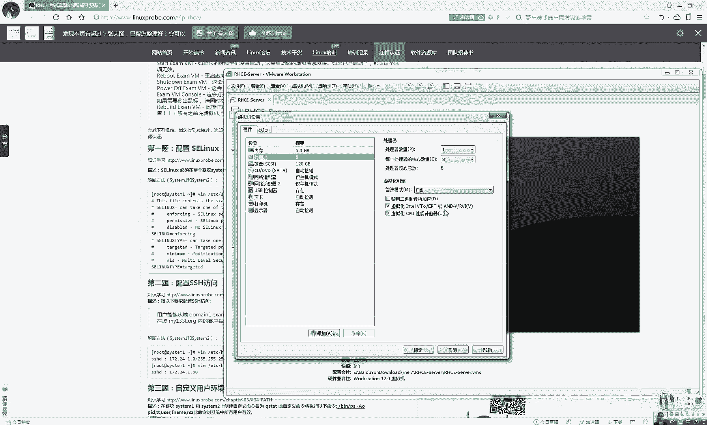

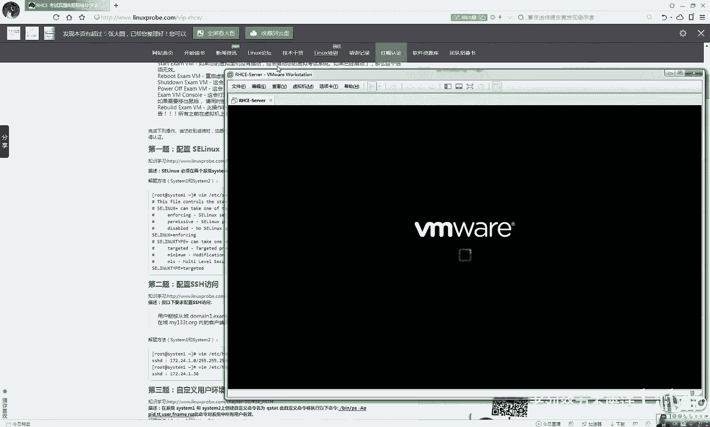

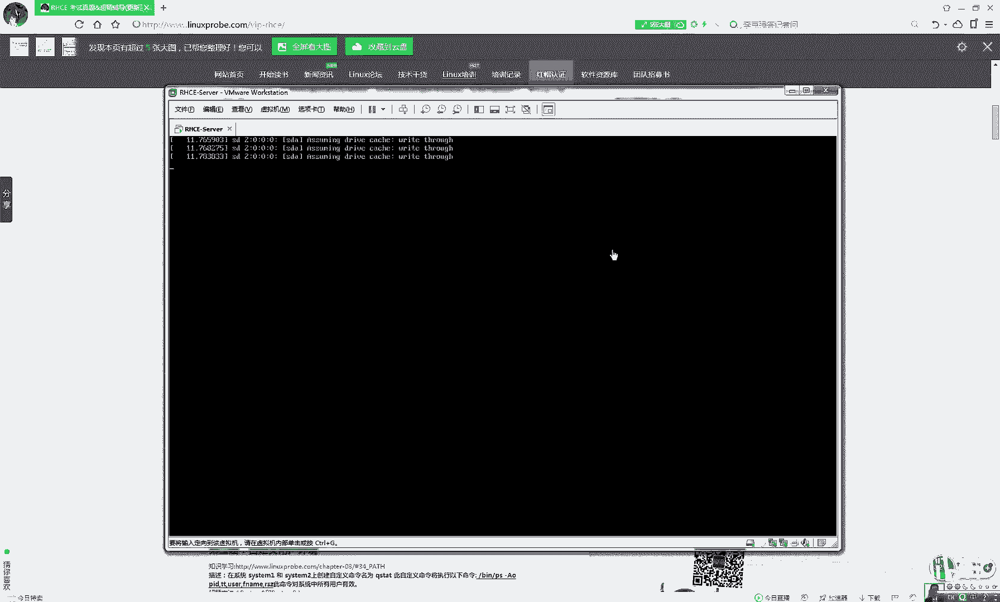

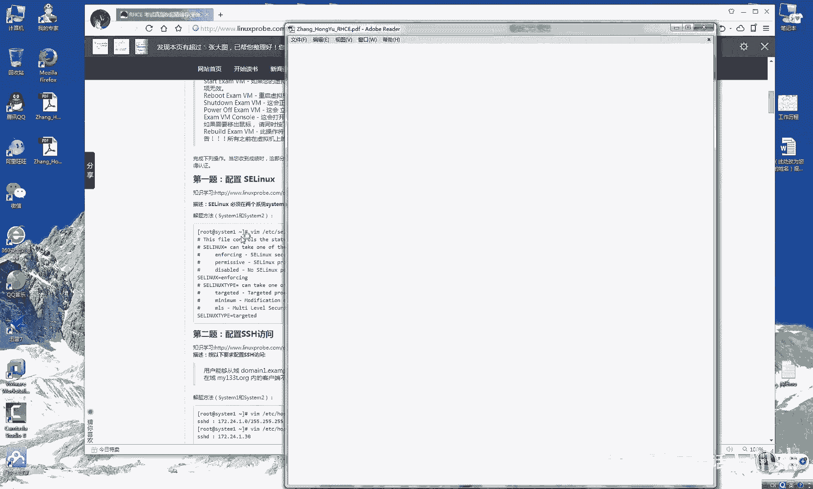

本节课程旨在帮助您熟悉RHCE 7的考试环境与真题。我们将使用一个高度模拟真实考试环境的虚拟机，并按照考试原题进行讲解。请注意，虽然部分题目因环境依赖关系会略有调整，但核心考点和解题思路完全一致。

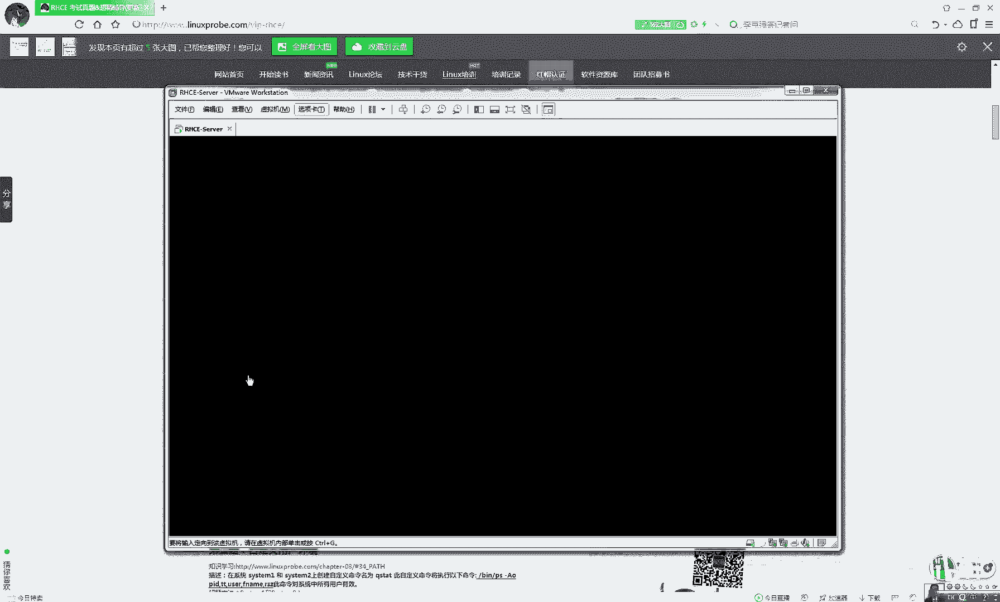

---

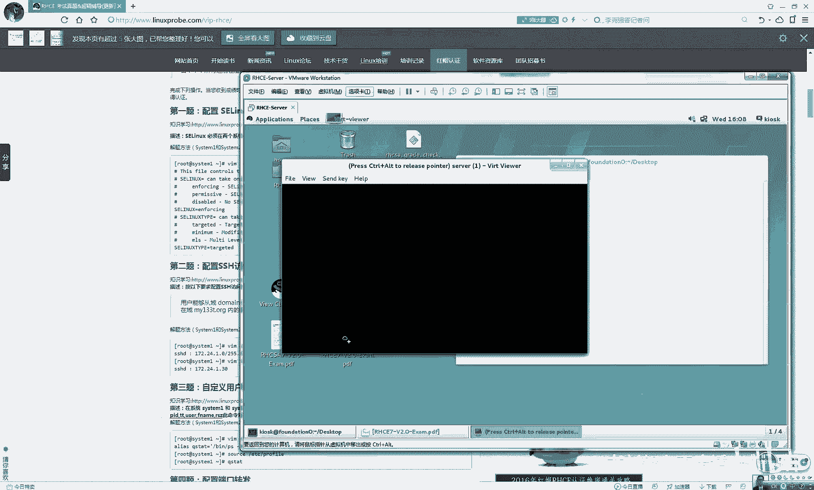

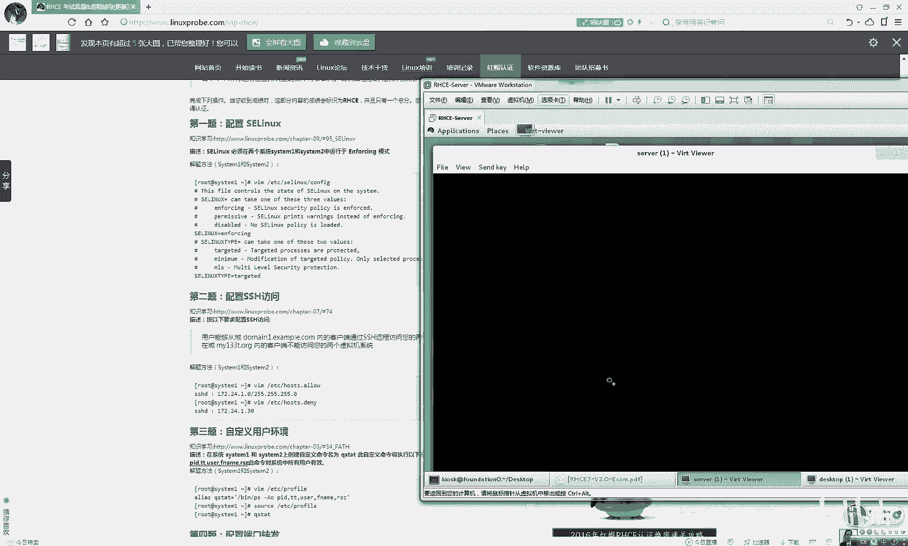

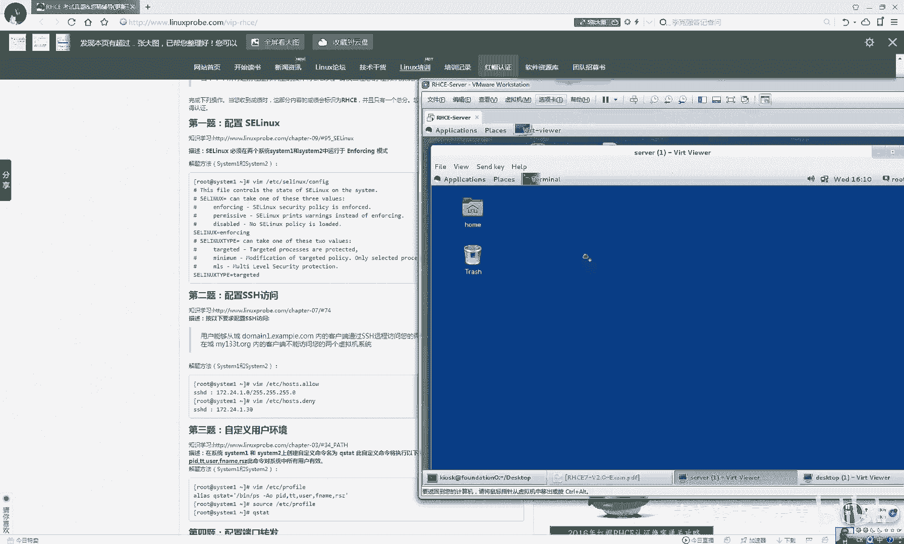

## 考试环境与真题说明

我们的课程可以在任意一台RHEL 7系统上进行，因为它主要考察的是系统管理能力。RHCE则进一步考察对系统服务的管理能力。因此，我们需要考虑相关因素。

例如，在挂载远程共享时，输入域名的同时，需要确认DNS是否已配置好。虽然我们的课程内容已经非常充分，在20个章节中涵盖了DNS、Apache等服务的配置，但同学们完全可以自己模拟出一个考试环境。

为了尽量贴近真实考试环境，我们使用了一个从“五菱职场”提供的考试环境。经过完整测试，该环境与真实考试环境非常相似，几乎一致。

我们的培训将以100%精题讲解为基础，所有题目描述与考试中完全一致。因此，在看考前辅导时，请务必先仔细阅读题目描述，以节省考试中的时间。

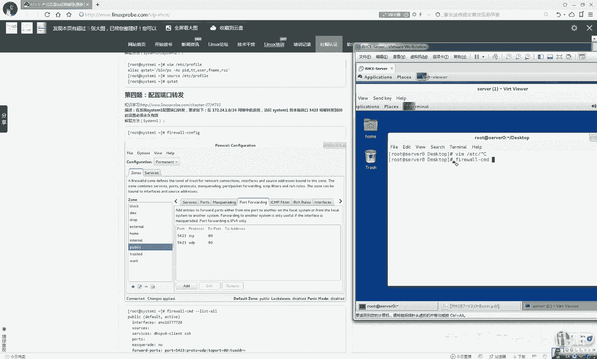

同时，您需要注意我们的考题提纲与考试题型完全一致。RHCE考试总共有22道题，与我们的课程数量相同。根据反馈，目前考题难度在下降，我们讲解的是最全、最难的一份题目，包含了所有考过的题型。真实考试时可能只有18或19道题，但题型不会超出这个范围。

RHCE听起来可能难度很大，但实际练习熟练后，会发现考试难度相对较小。本页面讲述的全都是RHCE考试原题，参数没有任何变化。考试时唯一会变化的是IP地址和主机名。

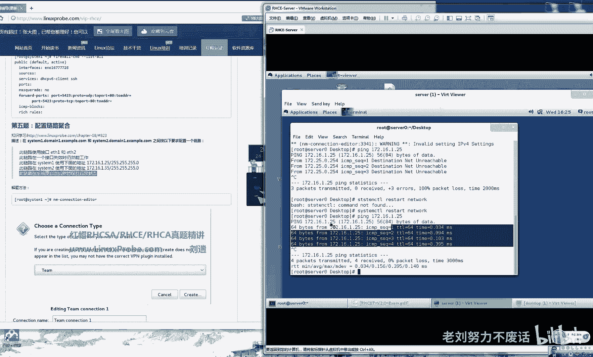

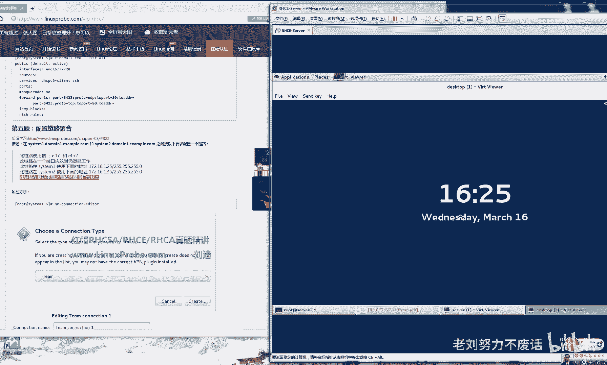

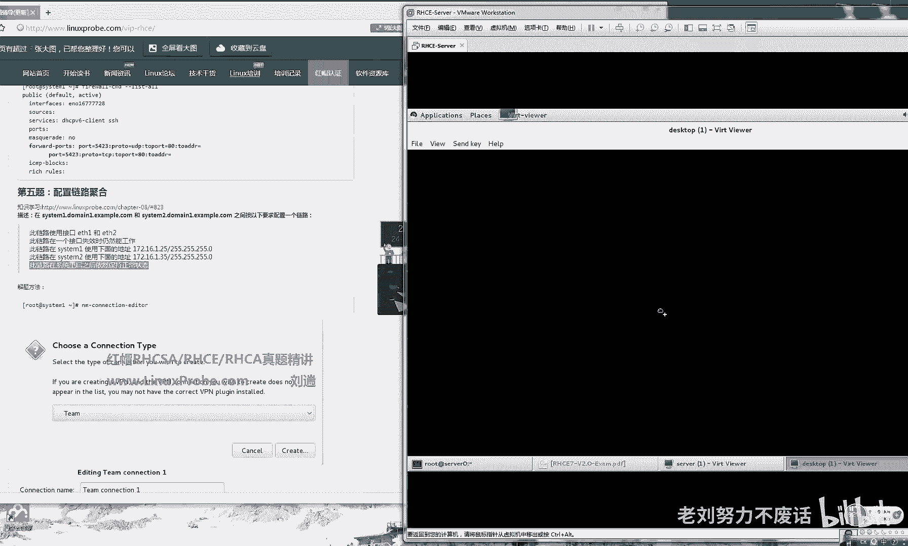

正如我们在课程中讲过的，如果您是第一个座位，您的主机名是 `system1.example.com`，IP地址是 `172.24.1.x`。第二个座位则是 `system2`，IP地址相应变为 `172.24.2.x`。只有IP地址和主机名会发生变化，其他流程都按正常进行。

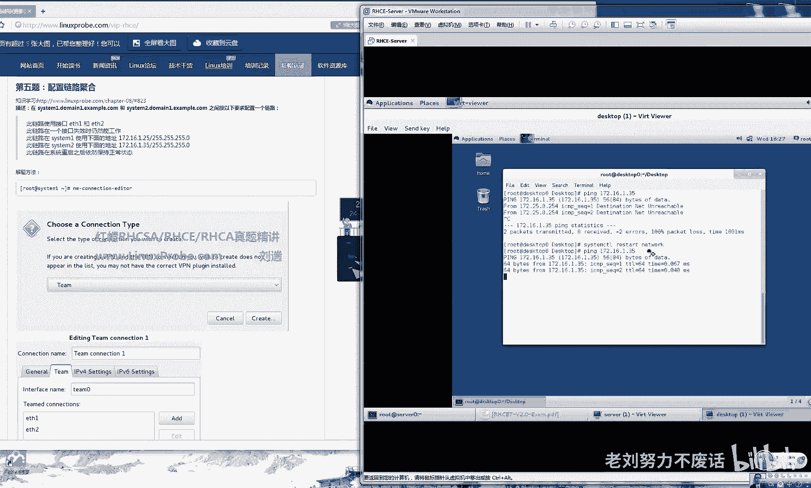

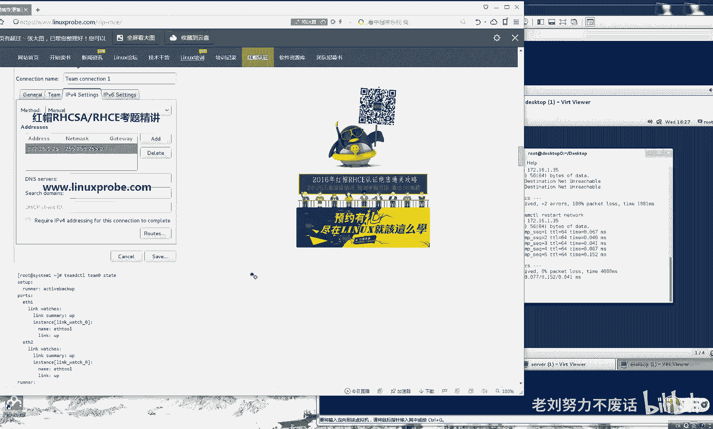

---

## 配置考试环境 💻

上一节我们介绍了考试的整体情况，本节中我们来看看如何配置考试环境。

我们的考题已经准备就绪，同时还准备了一份考试环境。现在我们先去配置一下这个环境。

对于某些题目，例如SSH端口转发，这些与其他实验没有依赖关系，我们就按照真题原题100%来操作。但对于某些题目，例如使用了Krb5加密或网卡绑定，而我们的虚拟机原始环境没有的情况下，我们就按照模拟题来做。

再强调一遍，原则上我们按照真实考题操作。但因为实现环境的原因，有时必须修改主机名。这时就以虚拟机模拟题提供的名称为准。但所有题目我们都会带大家过一遍，让大家了解如何操作。

我们希望，如果RHCE的视频没有完整看三遍以上，请不要去考试。因为RHCE考试可能会有变数，如果在考试时不熟练，可能会导致实验失败。所以这个视频一定要多看几遍。

### 虚拟机配置要求

考试环境对虚拟机配置要求较高。RHCE考试有两台主机，即您的物理机前面有两台虚拟机。物理机用于查看题目和选择环境，而考试时操作的是两台虚拟机。

RHCE之所以难度大、耗时多，就是因为需要配置两台机器，而RHCSA只需配置一台。在我们的真题精讲中，会写明每道题是针对 `system1` 还是 `system2` 操作。

我们定一个规则：第一台虚拟主机统一称为 `system1`，第二台称为 `system2`。`system1` 通常用作服务器，`system2` 通常用作客户端。

以下是配置考试环境的步骤：

1.  **内存**：假设物理机内存有8GB，分配给虚拟机5GB左右即可。建议不要小于3GB或4GB。如果物理机内存较大，可以分配更多。因为模拟的是真实环境，里面还有两台虚拟机，加上考试环境共有三台虚拟机。同时开启后，需要运行四台虚拟机，所以内存必须给足。
2.  **处理器**：根据实际情况设置。例如，如果CPU有8个核心，可以设置数量为1，核心数为8。您拿到的实验环境设置会与我的演示环境一模一样。如果您的内存或CPU核心数较少，请相应调小配置，否则会出现问题。
3.  **硬盘与网卡**：硬盘大小和CDROM无需改动。两块网卡也建议不要改动。
4.  **虚拟化**：必须开启虚拟机的虚拟化功能。

配置完成后，点击确定并启动虚拟机。实验环境开启速度较慢，需要等待。

**注意**：我们提供的实验环境与我的演示环境设置完全一致，但它适用于我的机器。您需要根据自己机器的实际情况调整内存和CPU核心数。

---

## 登录与初步检查 🔍

环境启动后，打开虚拟机终端。考试时您也会见到类似的界面。有三个图标：
*   `desktop` 代表 `system2`。
*   `server` 代表 `system1`。
*   `classroom` 是教师端，保持挂起状态即可，不要关闭。

大部分操作我们会100%按照考试真题进行。如果遇到有依赖关系的考题，则按照模拟题操作。RHCSA和RHCE的模拟题都已提供。

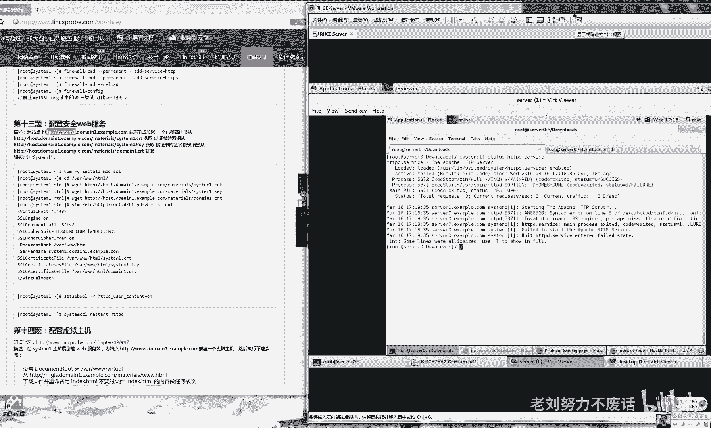

在考试环境中，主机信息如下：
*   `system1` IP地址：`172.25.0.11`
*   `system2` IP地址：`172.25.0.10`
*   密码均为：`redhat`

请务必记下这些信息。

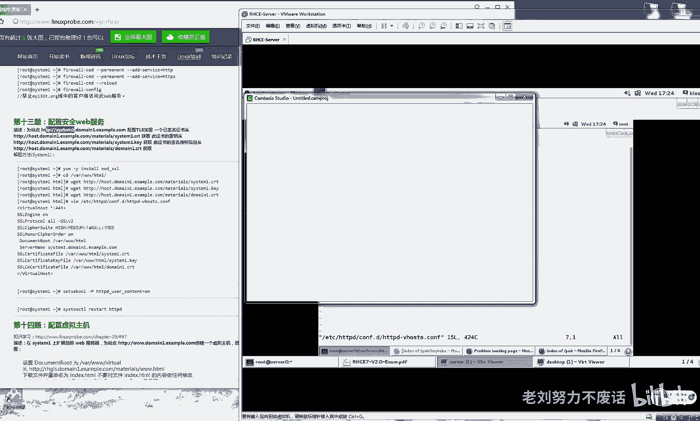

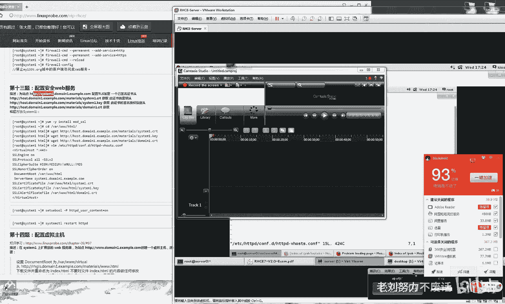

现在，我们先登录 `system1`。账号是 `root`，密码是 `redhat`。

如果您不喜欢来回切换虚拟机，也可以在真实机上使用SSH远程连接：
*   连接 `system1`：`ssh root@172.25.0.11`
*   连接 `system2`：`ssh root@172.25.0.10`

---

## 真题精讲开始 🎯

上一节我们完成了环境登录，本节中我们开始逐题精讲。

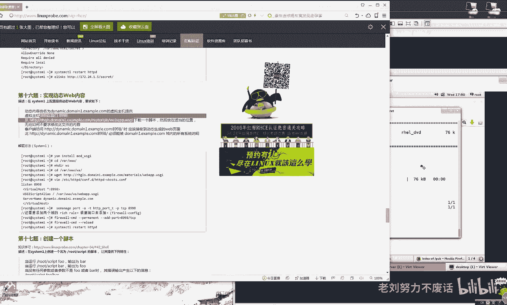

### 第1题：配置SELinux

这是一道送分题。考试时SELinux应该默认是强制模式，您只需要确认一眼。如果考试时被禁用了，将其改为启用即可。

在 `system1` 和 `system2` 上分别执行：
```bash
getenforce
```
确认输出为 `Enforcing`。如果是 `Disabled`，则需要编辑 `/etc/selinux/config` 文件，将 `SELINUX=` 的值改为 `enforcing`，然后重启系统。

**注意**：不建议在考试时跳过此题，因为考试环境可能会设置一些障碍。

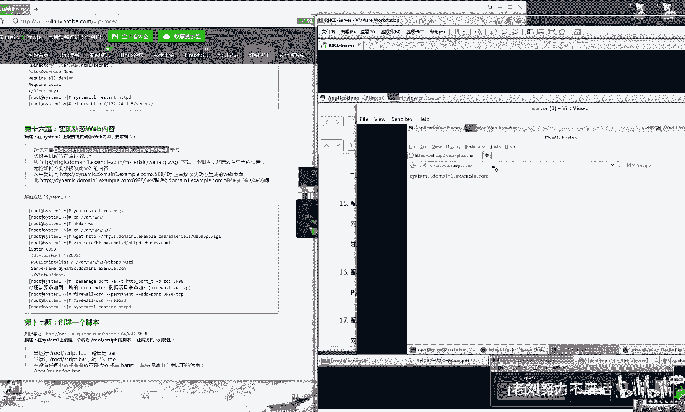

### 第2题：配置SSH访问控制

题目要求：允许来自 `example.com` 域的客户端访问两台虚拟机，但拒绝来自 `my133t.org` 域的客户端访问。

这相当于设置一个拒绝规则，除此之外的所有访问默认是允许的。因此，我们只需配置拒绝规则即可。题目没有指定针对哪台机器，所以需要对 `system1` 和 `system2` 都进行操作。

**重要技巧**：如果考题中给出的是域名，一定要先 `ping` 一下，获取其IP地址或网段。在SSH配置中，应使用IP地址或网段，而不是域名。

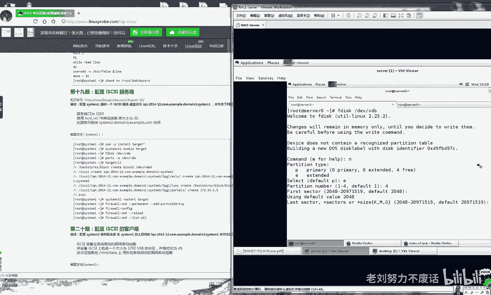

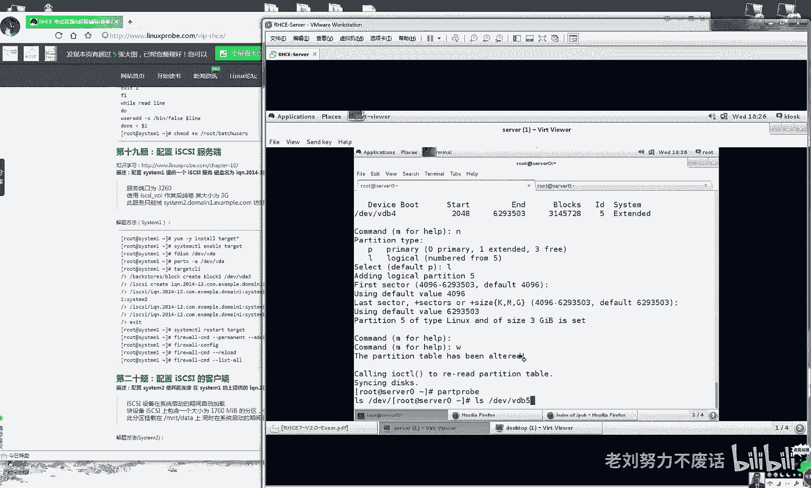

操作步骤如下（以 `system1` 为例，`system2` 同理）：
1.  编辑SSH配置文件：`vi /etc/hosts.allow`
2.  添加允许规则（根据题目要求，但非必需）：`sshd: 172.25.0.0/255.255.255.0`
3.  编辑SSH拒绝配置文件：`vi /etc/hosts.deny`
4.  添加拒绝规则。假设 `ping my133t.org` 得到的IP是 `172.25.0.30`，则添加：`sshd: 172.25.0.30`
5.  保存并退出。

对 `system2` 执行相同的操作。如果只配置了一台机器，只能拿到一半的分数。

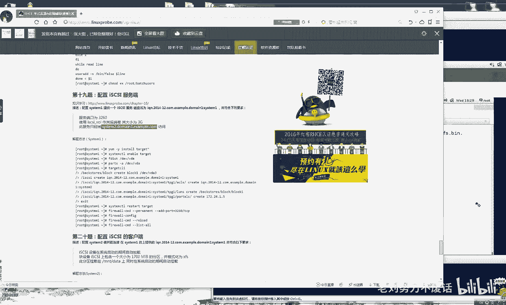

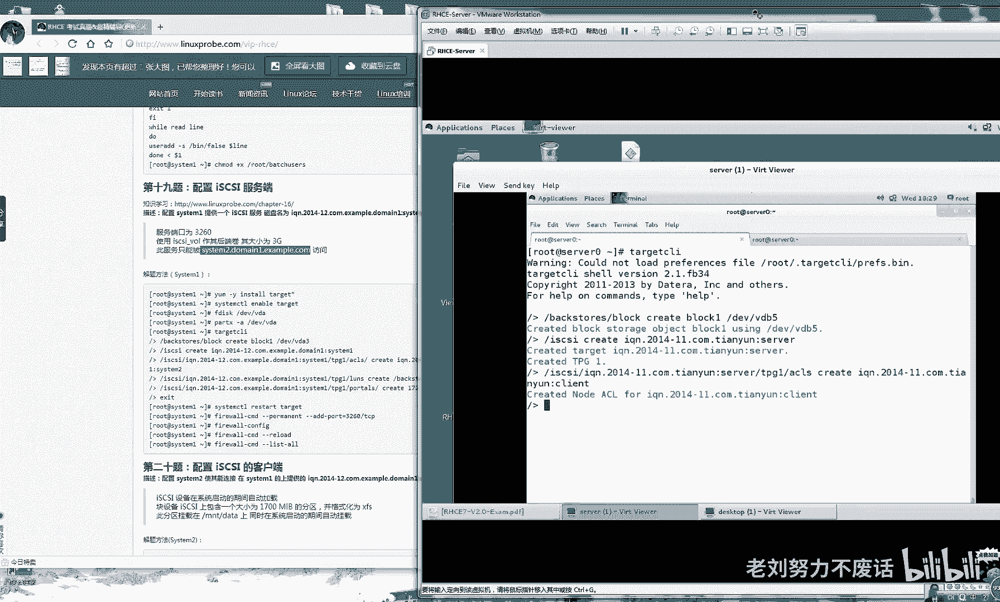

### 第3题：创建命令别名

题目要求：在 `system1` 和 `system2` 上定义一个命令别名 `qstat`，当执行 `qstat` 时，相当于执行 `ps -ao pid,tt,user,fname,rsz`。此别名应对所有用户生效。

这需要修改系统配置文件 `/etc/profile`，该文件对所有用户生效。

操作步骤如下（以 `system1` 为例）：
1.  编辑配置文件：`vi /etc/profile`
2.  在文件末尾添加：`alias qstat='ps -ao pid,tt,user,fname,rsz'`
3.  保存并退出。
4.  使配置立即生效：`source /etc/profile`
5.  测试：执行 `qstat`，应能正常输出。

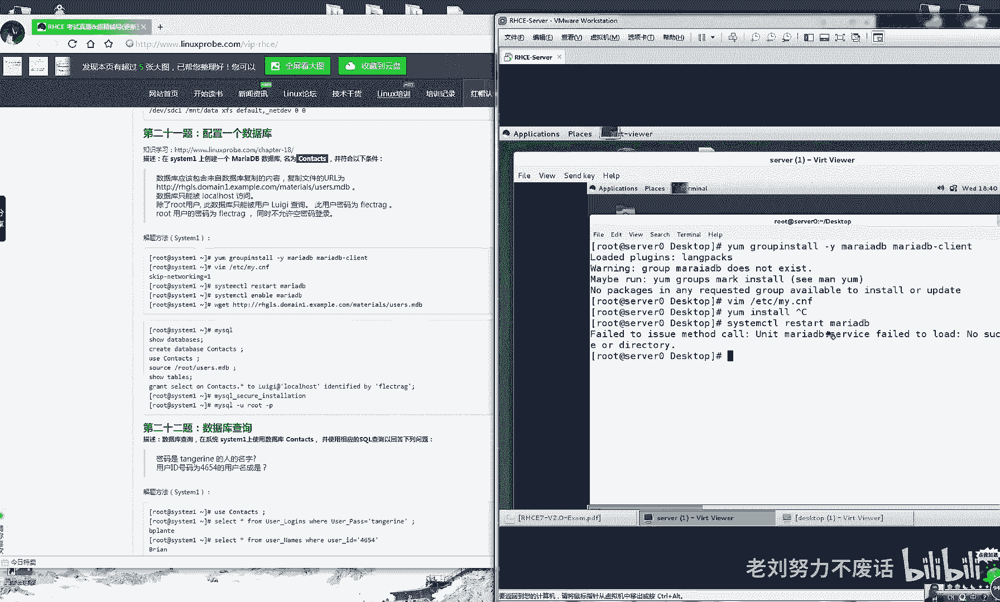

在 `system2` 上重复相同步骤。注意，别名定义必须严格按题目要求的大小写和格式书写，不要随意更改。

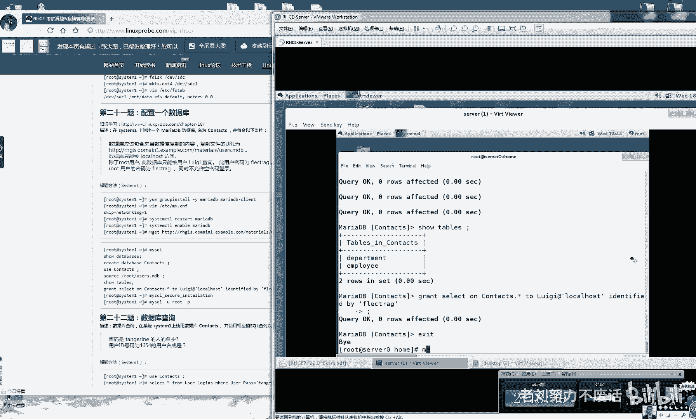

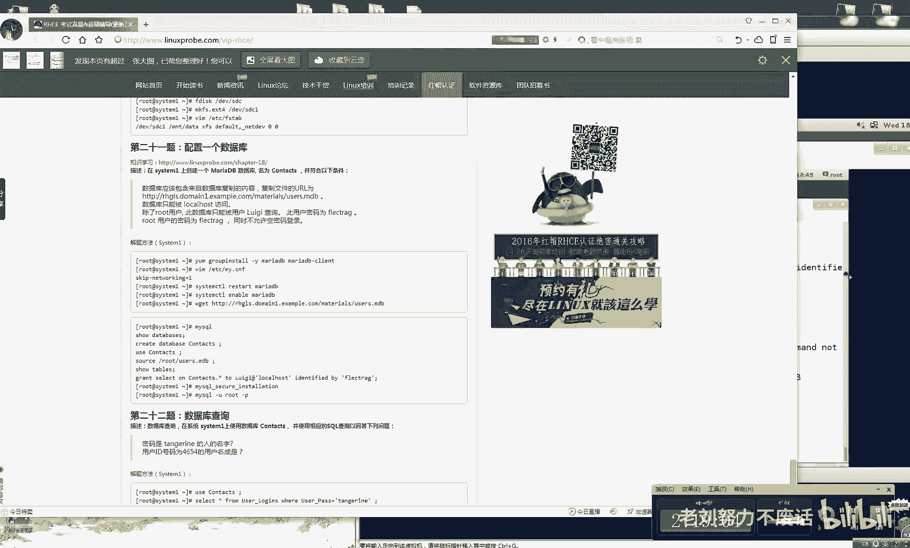

---

## 总结

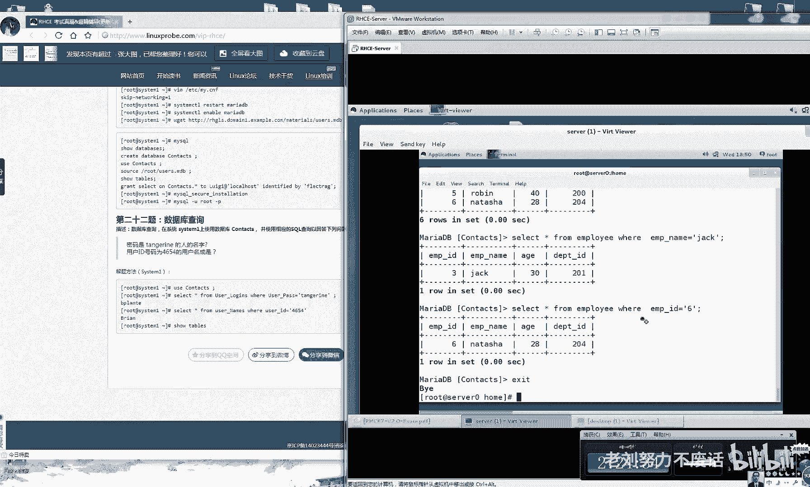

本节课我们一起学习了RHCE 7考试环境的搭建方法，并精讲了前三道真题：SELinux配置、SSH访问控制和命令别名创建。这些题目涵盖了基础的系统安全、服务访问和效率工具配置，是考试中的常见考点。请务必在模拟环境中反复练习，确保每一步都理解透彻、操作熟练。