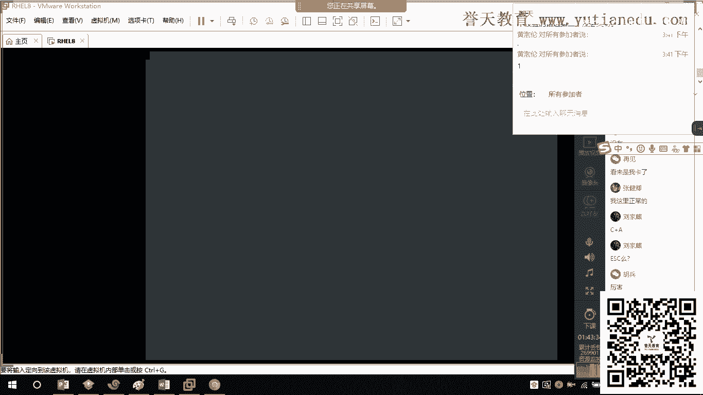
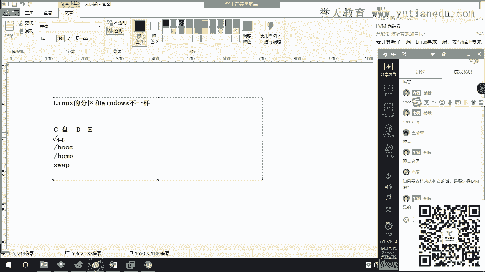

# 红帽RHCE 8.0培训学习视频-02.红帽认证和RHEL8系统安装 - P1 - 誉天云计算 - BV1vX4y1f73F

嗯，还有我们这个问题的一些处理啊，以及上线变更等等这样子的一些操作啊一些操作。那么最重要的呢也就是我们的这一块啊，就是要根据什么呀？我们的实际情况来撰写我们的什么呀技术文档啊，撰写技术文档，哇塞。

这是一个让人很头痛的事情啊，对吧？你所有的技术，你的要什么呀，都要形成文档啊，养成习惯，这也是一个工程师的一个思路，对吧？好，那么说到薪资了，大家说哎在前面今天上午我们跟大家说到。

我们这个年薪百万好像不可能哦，对吧？那到底怎么样呢？有没有搞头呢？好，大家可以看一下啊，这个是在17年啊证明招聘上的一个数据一个数据。这个大家可以看一下啊，呃我们大致看一下，应该还是非常非常不错的吧。

对吧？相对于同类的ID行业来讲，lin运维一直是一个非常什么呀？非常火热的一个话题啊一个话题。在乌鲁木齐，我们能够达到什么呀？哇，接近8K的啊，接近8K的我们在成都有7K啊，成都有7K。那么北上广的。

你看到8K以上左的吧？8K以上左了。啊，那么这个地方残生的这个地方会低一点啊会低一点。好。那么为什么标这几个地方说唉，怎么没有武汉的价格呀啊，这几个地方为什么呢？这几个地方大家可以看一下啊。

他们沿海的这一方，他们沿海。再一个呢，这个是在我们什么在我们的较为偏远的地区啊，较为偏远的地区，他们比较具有代表性啊，这些地区比较具有代表性，好吧。这个我们大家可以看一下啊。

这个是我们linux系统方面的一些这个薪资啊，一些薪资。那么系统管理员呢，比如说我们CCE里面啊，就有一个叫CSA啊，CSACSA这个方面呢，我们可以达到3K左右啊，达到3K左右，初级的运维的5K嘛。

初级的运维5K嘛，对吧？像我们大家出去的话，一般就是中高级的一个运维啊，中高级的运维就是在唉7K到12000左右对吧？7K到12000左右啊，你在武汉系统运维是5K对吧？

那么你只能达到什么达到这个级别哦，施语啊，你还在这个级别哦哈对吧？像我们的这个高级运维啊，自动化运维啊，对吧？我们选安er就属于自动化运维这一方面啊，这一方面能够达到什么呀？达到12000。

这个非常不错了，对吧？像我们的lininux架构师呀，这个在2万以上嘛，对吧？2万以上啊。嗯。腾讯课堂没开聊天，看不见。哦，我看一下啊。这个是吧。声音比上午小了吗？没有啊，我这个开大了呀。🤧嗯。不是。

因为我这个一全屏这个腾讯课堂就不见了，看到了吗？🤧那这个就不能全屏啊。这个就不能签名了。因为前面的话我们一直都是用web啊，因为现在T要上课，所以我们要结入腾讯课产。对吧。声音可以吗？现在可以吗？

我们现在声音。好小啊。🤧没有吧。好啊，那么在我们的一些大型互联网公司啊，一些大型互联网公司对linux来讲的话是非常缺口非常大的非常大的。这个我去年啊我去年在那个5一job上看到哦。我就把它看懂。

在未来的话，我们的缺口啊，linux缺口达到多少呢？达到多少？达到50万啊达到50万啊。因为随着云计算和大数据的发展啊，越来越多的底层架构需要linux的运维公司来进行支持。

而现在linux入门来讲的话，还是一个比较怎么样，还是一个比较门槛比较高的。表然所以现在入门的话还是人数不是非常非常多啊不是非常非常多，缺口依然很大。所以大家的这个就业呢也是不用慌的啊，也是不用慌的嗯。

对，也是不用还的。所以大家学好了过后，在企业想找到一个比较理想的工作，问题是不大的啊问题不大。这是我们的一些技能啊一些技能。这个在上上面的我们的考核方式里面，我就跟大家说了，已跟大家说了。好。

然后我们来说一下我们红帽公司的一个认证啊一个认证。我们红帽的认证呢分为三个等级啊，分为三个等级。第一个叫什么呢？第一个叫CSA啊，叫CSA。这个我全屏光就看不到，大家这个聊天方案，只能看到wordex。

对。这里啊大家看一下啊，我们红包的认证呢一共有三个等级啊，一共有三个等级，一个呢叫RHCSA。RHCSA是什么呢？它是红帽的系统管理员。是红帽的系统管理员啊，像我们安装linux呀，调试linux呀。

对吧？对linux的网络进行设置呀，进行配置呀，对安全性进行设置呀等等啊，就是这一个层级所干的活，这一个层级所干的活啊，红帽的系统管理员RHCSA啊。好，那么我们大家考的是哪一个级别呢？

我们大家考的是RHCE啊RHCE这个级别。那么RHCE这个级别的主要是负责什么呀？负责linux服务器、网络设备、网络安全以及实际的业务故障进行处理。也就是说，工程师这一类级别的人主要来负责什么呀？

负责系统的维护啊，负责系统的维护。而我们的CSA这一类级别的人主要负责什么呀？负责系统的商家啊，负责系统的商家，对吧？所以大家一定要什么呀？一定要对得住这个称号RHCE我不想你考完了。

仅仅只是拿了个证啊。然后别人一问哇塞什么问题都解决不了，对吧？那就没用了啊，对吧？这就失去了意义，对吧？所以大家在要看啊看一下啊，是要负责能历史当中实际问题的一个解决诊断和解决啊，你要知道哎，今天对吧？

有个家伙那一上来RM杠RF了，你要知道怎么回事了，对吧？如果抢救啊，你知道吗？我们RHCE到RHC这个级别啊，就是往上面升的RHC这个级别RHC这个级别大家知道把它称作为什么吗？嗯。嗯。啊。

我们把它称之为抢救工程师啊，因为他有个两字看不懂。把它称之为抢救工程师。这个福胜辉怎么了呀？你没有声音吗？可以吗？福胜辉可以吗？因为在RHCA这个级别。按钮点一下就能锁定那个那个呀。这个吗？

是这个吗？我看一下啊能不能锁定啊，唉，真的可以锁定。

对，真的可以手印啊。那么RHC这个级别呢，我们把它称之为抢救工程师。因为在这个级别更多的情况下，我们是去负责什么呀？就样有些家伙啊这个一下子啊服务搞崩溃了是吧？一下子系统起不来了，各种抢救啊，各种抢救。

那么在前一段时间呢，我又抢救了两对小伙伴啊，有一个没有救回来，有一个这个伤害太大了，伤害太大了，都是在生产环境下，比如说有一个是公安局的，有个公安局的有个家伙这个中毒了。公安局的有个叫伙中毒了啊。

这个开不了机。他们的声度S啊开不了机了。还有一个是这个华为的一个项目啊，华为的一个项目，他们有一台这个泰3的服务器，也是起不来了啊，也是起不来了。所以每天都是和各种各样的疑难杂症打交道啊。

所以在RHC这个领域这个领域啊，需要你什么呀？需要你有比较全面的系统知识啊，比较全面全面系统知识。在红帽的官方是这样介绍的啊，他说是什么在linux和开源方面的技术和架构理军人物啊。它是主要负责什么呀？

从数据中心到桌面终端的lininux的系统的设计计划部署以及全面的管理啊，以及全面的管理。也就是说达到什么架构师这个领域，对吧？你要来步道，对吧？你要负责服务的步道啊，你要知道哎，今天公司要有这个业务。

你怎么来规划，对吧？这个业务需要多少台机器啊，需要有哪些这个技术点，你都要想得到，对吧？要给他负责什么呀，负责撰写我们整么的整个架构的什么架构的一个流程一个流程。好。

那么大家说红帽的这个金字塔式的这样子的一个一个认证的一个这个模型啊一个模型。那么我们考的RHCE就属于中间这一层工程师的这个模型。红帽的考试非常非常什么呢？有什么？有讲究啊。如果你要考取。

我们大家要考取RHCE对吧？我们大家来的这个目的都是为了考取RCE。那么我们考取RHCE就首先要考什么呀？要搞什么？各位首先要考什么呀？这个知道吗？能看出来吗？😡，就首先要考什么呀？

RHCSA对它是一个层级架构。首先你要考取RHCSA。你才能够怎么样嗯。来考取什么呀？RHCE。当你考取了RHCE过后。第想人怎么样嗯。考取RHC。所以这是一个什么？一个层级架构啊一个层级架构。

那么大家考到RHCE呢，需要考两门。需要考两门。这两门考试是什么样啊？这两门考试。一天完成。一点完成考试的时间啊是5。5个小时。我不知道八有没有更新时间啊，这个没有下去了解过。

到时候肖老师会去把这个具体的考试时间告诉你。不能直接考CA，必须先考RHCSA。那么考两门一天怎么完成呢？上午。🤧靠。RHCSA。下午靠。😡，RHCE下午考RCE，也就是说你必须要考过了RHCA。

你才能够拿才能够有什么有考试拿到RHCE的资格。成绩考完不会出来。上午的IHCC是2。5个小时。听我讲完啊，2。5个小时，下午的C一呢是3个小时。3个小时所有的考试。所有的考试都是上机测试。

实操啊实操不是选择填空题啊。不是选择题啊。成绩你的成绩考完了过后，考完了过后啊，由红帽的考官给你发往哪里了？给你。给你发到哪里啊？发的红包。成绩一般啊是这个。是在三个工作日。是这三个工作日啊。

往后啊往后。也就是说，所谓的三分数日以后。上个工作日。呃，7个。10天内。一般是在3个工作日我发给你，最晚不会超过7天。嗯，这个小沙可以吗？不是现场出审绩，以邮件的方式发给你啊。以邮件的方式发给你。

当然也有好的情况。如果说这个考官传成绩传过去比较早啊，很有可能当天就出成绩。当天出成绩的情况也有也有啊，一般不会晚于7天啊不会晚于7天，一般是在3个通作日过后7天以内发给你。这个大家明白吗？

明白的小伙伴敲个一。你们考C1要考两门，上午考RHCSA下午考RHC1。上午是2。5个小时，下午是3个小时，整个考试都是上机操作，不是选择题啊，要做实验的，全部都是实验。那如何确保上午通过了。

下午能继续考？是这样子的，不管你上午和下午是否有没有通过，你都能考，你都能考，你交了钱，你都能考。😡，那么这里我要跟大家说一下，如果说有个价构说唉。你上午的CSA考过了。😡，你下午的C一考过了。😡。

你下午的CA考过了，那么你就会拿到两个证书，一个叫CSA的证书系统管理员。另外一个就是我们的RHCE系统工程师，一共有两个证书啊，各位你们有两个证书啊，有两个证书。好，那么接来我们来情况反推。

如果说你上午没考过。这种情况不存在啊，没考过，就不是我教的啊。如果你上午没考过，你下午考过了。😡，🤧嗯。😊，你看啊你下午考过了，上午没考过。那么各位你一个证书都没有。😡，因为你没有RHCSA。

你C一考过了也拿不到证。😡，也拿不到证书。😡，这个明白吗？也拿不到证书。😡，好，现在来看第三种情况，万一你上午考过了。你你上午考过了，你下午没考过啊。😡，🤧嗯。😊，你下午没考过。

那么各位你会拿到哪一个证书？😡，你会拿到哪一个证书？啊。你就会拿到CSA的证书。对你就会拿到系统管理员证书，你就有一个证就有一个证。好，那么这个地方刚刚我讲的，如果CSA没考过，你C一考过了。

你也没有证书，那怎么办呢？那么你下次就要补考CSACACA补考通过了，就会给你发两张。明白吗？CC给你补考通过了，就可以发两个字。😡，好，这个是关于我们的这个呃考试啊，我还有一点，考试的语言是中文。

这个特别重要。这个忘记跟他说了，考试的语言是中文。关于考试大家还有什么问题吗？CSA没过C一过了，存在啊存在。留下这个是0吧。🤧是不是有点奇呀，这个存在啊我遇到过这样的人啊。😡，是奇啊旗对。

我约过这样的人啊，他上午怎么样没考过而，这个运气教会这个教伙运气特别好，怎么样？他考过了，下午考过了。嗯。😊，实操的时候不存在系统使基本故障吧？不存在。红帽的考试可以吃口香糖等等一些小零食。全是实验。

还有其他问题吗？😡，🤧没办你思的小伙伴。总分多少啊？对。总分是300。210分通过。总分是300分，210分钟过，大家有问题的都可以讲。对我怕我遗忘啊。因为这个真的。太多细节了。有效期。有效期是3年。

有效期是三年有效。题目啊不一定CSA的话一般是18题，一般是18题。啊，这个是CS。C一的话7就七来讲的话，一般是21题。啊，一般是21题。红帽的。有效期是3年，三年过后重新搞生意。一。😊。

重新搞声音再来一遍。可以吗？如果实验没做好，可以重做吗？可以重做。红帽的考官，如果你这个问题做出做错问题了，你可以举手让考官帮你把整个实验环境清空，然后你重新来做一遍。小沙可以吗？

如果三年三年过了你的C意就没有了。啊，三年过了，你的C一就没有了，要重新考。不管是CSA还是C1，都要考，重新参加两次考试。考一次各多少钱，没过中间需要隔多久，这个不确定谢之勋这个不确定。

这个要根据美元的汇率来算的，各个时期的考试费都不一样。但是一般来讲的话，差距不是很大。这个你要问一下肖老师，因为红帽的报名缴费这一部分是他来负责。可以吗？谢之星。对。😡，🤧嗯。中间需要隔多久啊？

你这个如果你今天没考过，你明天就可以补考，明天就可以补考啊。但是一般来讲的话，要跟要跟到下一班一起补考啊。因为红帽的考试是统一组织的。红包的考试是统一组织的，红包的证书有效期是3年。我跟大家说一下。

重点说一下怎么区证啊，重点说一下怎么区证。比如说有很多小伙伴问我这个问题啊，私私下问我这个问题，他说我的C一。呃，比如说是2020年考的，那么我在20什么呀？2023年的23年过期。

如果在2023年过期了，那么你的CE和CC都要重新考试。在红包的系统上面也就不承认你的资格证了。不承认你资格证了啊。那么。怎么办呢？是这样子。在2023年。2023年啊，我刚我告我教你个办法啊。

非常省钱的办法。2023年之前。😡，你参加。红帽的CA的考试。就会怎么样？自动虚请。啊。就会是什么呀？😡，就会去聚动自动识P齐。也就是说，在2023年之前，你只要参加CA的一门考试。

你就可以把你的C一去掉，你就把你C一去掉。你的C一去掉的话，如果是你完全来续C一的话，可能是要3000多块钱啊，3K左右对吧？或者是4K啊，应该是4K左右。具体价格我记得不是很清楚了啊，好像是4K左右。

但是如果你来参加红帽的一门CA的考试。那么你可能因为每一门的考试费都不一样，你可能需要花个3K左右，你就把你的C一的证书刷新了。好，那有些家伙说老师我要考CC怎么办？CA的考试。

我单独拿出来说啊RHCA的考试。需要考5门。考试周期是半年。也如这这半年里面，6个月里面，你每一次考试都参加，那么你需要考半年才能考过。每一场考试啊都要参加5场考试，一共要考半年。然后做无昌考试啊。

这亩场的考试。无差考试是5个证书啊。五个证书。这5个证书每一个。😡，每一个都是独立的每一个独立的。也就是说你5个证书都拿到了啊，你5个证书都拿到了，你就会怎么样合成1个C哇，就有点像游戏里面打怪升级啊。

对不对？这样合成装备啊，你拿到了5个证书就会合成C。就会合成冯贸架构师。也就是说当你考完了5个证，你拿的是6个。你拿到的是六个证书。😡，可以吗？开心吗？各位。啊。开不开心就会拿到6个证书。😡。

拿到6个分数啊，那么这五场考试呢都是英文考试，没有中文啊，都是英文考试。不管是考试的题目，还是你的答题的操作，都是群英文啊，都是群英文。呃，我建议大家还是用英文考试吧。因为C的语言考试语言有两个。

一个叫英语。啊，一个叫英语，一个叫日语啊，我当时选择了英语啊，尽管英语不咋地的，还是选择英语吧，对吧？这个。为什么？因为日语完全看不懂哈是不是这样子哈，我总不可以选择个日文吧，下去考试啊。😊。

CSAE系统条虚化集群的5个字吗？C一不在里面。啊，C一不在里面可以吗？这个小三C一不在里面啊。😡，那么你要想考到你要想能够来考RHCC或RCA啊，你必须要先通过CE。你必须啊。😡，先通过。C。😊。

并且。RHC它的维护费老着了，你要想长期持有这个证，那你不得了，你每每一次都要每隔三年都要花钱，为什么呢？什么意思？比如说现在我有5个证。老不容易了，你以为我保持这5个这么容易吗？😡。

这我要拿好久的工资来养这个。🤧来，你看。我教你啊教你一个省钱的方法啊，教你一个省钱的方法。这5个字啊，比如说我第一个证啊是2023年过期。😡，然后我在2021年又考了一个证，第二个证是在2021年考的。

那么我就在2024年过期对吧？就在2024年过期。好，那么也就是说我在2023年之前必须要把这一个证更新，这个地方有点绕啊有点绕啊。我在2023年之前必须要把这一个证更新。我在2024年之前。

我必须要把第二个证更新。😡，也就说我每我的五场考试，我每一场是不是都要重新考三年三年之内，我的五场考试，每一场我都要重新考次。因为CA。不能刷新。😡，记住啊，刚刚我说的C可以刷新C1CA自己不能刷新。

😡，有点绕啊。什么意思呢？也就是说5个镇。😡，必须都在三年内。😡，你才是CA。😡，只要有一个证过超过了有效期，你有5个证，你第五个证已经超过了有效期失效了，那么你的CA就没有了。😡，你的CA就没有了。

😡，所以和HCIE不一样。有像SIE过一定年份就终身有效吗？没有没有啊。这个是正源，这个这个正面什么呀？哇塞，你们这个名字好复杂呀嗯。没有啊，这个郑同学这个没有。坤啊。考CA续期是过了。

考过了才会自动试级，也续期也是3年有效。对。续期也是3年有效，明白吗？也就是说在这里啊看好啊，在这里啊可以这样子。😡，我我教你个方法，你不需要每一门都重复的去考。😡，你不需要每一门都重复的去考。

什么意思呢？😡，因为CN有100多人。😡，CA有100多门啊，100多门考试。😡，也就是说，比如说今天我五个字。有第五个字啊，我的第五个字。😡，失效了。那么我现在想要得到1个CA，我就必须要再考一次。

😡，我就到CNA的这100多门里面再选一门考。😡，我再选一个新的发现卡，然后我又得到了6个字。😡，我又得到了6个证，那么我就是什么？我就是CA1级。我这是CA1级CA有100多门啊，100多门。

你这穷尽一生。呃，我算一下啊，你从20岁考到50岁应该没问题。啊，各位，从你20岁考到50岁应该没问题。😡，好吧，你一直都可以考，一直都有考试的你考学不完啊，所以如果你不想你的第五个证失效了。

你不想重新去考原来的那个证，你就可以考个新的证来刷新CA。😡，明白吗？来刷新CA，所以周老师已经考了10多门。😡，他一直要刷新了，否则就失效了呀。😡，对吧我都要搞CADM了，马上要重新刷新。

我的好像是明年就要过期了。明年就要过期了，这后换的要死，我要重新刷新了，是吧？可以吧。CA的考试啊是无场考试，机器5个证就可以合成神农化招报RGCA。好，大家关于红猫的考试，还有什么问题吗？

但家关于红包的考试还有什么问题吗？续期这一块还有问题吗？我都我都刷了两门了。😡，ex小伙伴有问题吗？声A的考试费啊，考试费啊，这个一般来讲的话是17000啊。17000。🤧嗯。😊，是17000。

5个字是从100多里显是的。🤧嗯。😊，选择你感兴趣的5个方向。17000啊。对。这个只是考试费啊，培训费培训的话是19000，好像是19000吧。反正加起来，如果你有C1的话，加起来应该在3万左右。

加起来应该是3万左右啊，红猫有一本很牛的课程叫鸿猫卫星啊，我一直想学，但是这么个课程现在好像中国没有人没有人做了。红猫卫星服务啊。这高到上顶的，至今我都没搞懂这门课到底是搞什么？红包卫星服务。

你们听说过吗啊。😊，这个这个好像是做一个什么服务的，不是卫星服务啊，不是真实的卫星服务啊。至今我都没搞懂啊，这个上面找查不到资料了，这个已经好像被淘汰了，还是怎么回事？这个个程。好。

我们Yex小伙伴还有什么问题吗？😡，🤧嗯。😊，这个王大神，你这都考了这么久了，你还还要来这上是吧？肖胜瑞，他说我是不是应该快毕业了再去改？不是的啊不是的。所以这个。是自动化对。

是自动化的一个服务一个服务啊，不是不是真实的卫星服务啊，这个课程高得上啊。我在那个红猫的论坛上面看了很久都没有看到这个40千万的消息了，已已经很早了这个好很早了。这个服务考的很早了。

现中国没有没有考虑的。被下架了还是怎么回事？被淘汰了吧。好，大家关于这一块还有什么问题吗？😡，🤧这个王乐士的CA也要续集啊。可以吧？啊，这个是关于大家续集啊，那大家还有可能还有一个疑问啊。

他说我C一失效了怎么办呢？我失效了，我又不想再考了。对吧我不想花钱了啊，生意失效了是不是就没用了？😡，这一失下的是不是就没用了呀啊，不是的啊。😡，所谓的C事项的只是什么呀？

只是在查询啊在查询你的ID的时候。ID的时候显示显示是过期啊。显示是过期。可以吧？在查询你ID的时候啊，除非你们公司有投标红贸相关的一些这个业务，才需要你来保持你这个RHCE身份的有效期。

如果你们公司不投标这一块的业务，你什么呀？你是你是不是什么？😡，不需要你不需要续息。😡，明白吗？😡，明白的小伙伴敲个一啊，不是说你没考啊，对吧？C一失效的不是代表你没有了。😡，怎么样代表我曾经拥有嘛啊。

可以吧？对。😊，这个意思啊。好，所以这个大家注意啊这个要注意啊。啊，我看一下啊，完了时有个疑问。我的C17。0还在有效期考C1。8。0的CC还要考吗？要考。这个要考啊马达成这个要考。这个好像是他的。

你的C你的CE考的很早了啊，应该现在啊就是你们大家知道吗？在那个叫什么呀？就是在前几个月啊，就是过渡期，这几个月是过渡期啊。前几个月如果是前几个月，大家如果早一点考红帽期啊，现在搞红帽期。

你的红包区的CSA。😡，会有两个版本。会有两个版本啊，分别是肉7和ro8两个版本啊，不得了。因为现在处于过渡期啊，你现在考的CSA会有两个版本，但是你们好像不会了，因为你们9月份考嘛。

8月底红包期就下线了，所以你们的CSA应该不会再有期了，应该只有妈。应该只有8好吧。可以吧。考题每年会编码肯定的。🤧嗯。不用担心考试啊。好吧，红帽的考试，你学完了过后顺便去考试，对吧？

不需要你专专门去考试。可以吧，这个我们的李建斌。下线之后之前呢就不算了，不是的。😡，不是的。😡，下线了过后是什么意思呢？下线了过后就说七不开放考试了。😡，你就只能烤包了。😡，明白吗？谢之新。

你就只能考8了，7不再开放考试了。好吧。对，好，所以大家可以看一下啊，红帽的一些历史啊，成立于这个我们的93年，对吧？它上面有一句话。

它的官网上面有一句话不知道大家有没有访问过它的官网叫rehead点com。叫rehead点抗。那么它的官网上面有句话叫什么呀？叫全球。这句话老装逼了，叫什么？叫全球开源领导者。

是吧叫全球开源领导者啊领导者。那么大家可以看一下，红帽是一个纯粹做我们开源软件这个发家的一个公司啊，发家的一个公司。那么大家可看到现在呢我们整个红帽呢可以说遍布业务线啊，遍布全球各地啊？遍布全球各地。

在服务器linux这块领域里面啊，更是什么呀？龙头老大更是龙头老大啊，所以红帽的认证，在整个linux里面，只要是关于和lininux接触的一些互联网的业务和应用都会怎么样啊？嗯。

都会怎么样都会认可红报。认个红帽，所以红帽的证书含金量。含金量啊。还是什么呀？还是非常高的。还是非常高的。所以大家可以怎么样？大家可以放心的去考我们红包的工程师啊，这个是没有问题的。

你看啊那么红帽作为linux认证这个领域里面的龙头老大，是不是只有红包呢？不是的啊，在linux认证里面，除了红包之外，还有其他的啊，还有其他的一些认证啊，其他的一些认证。

只是说红帽这个认证在整个linux行业里面是最被认可的，最受到大众认可的。它所有的他之所以受到这些互联网公司认可，就是因为红帽考试培培养出来的学生，他的什么呀？他的动手能力非常强，为什么呢？

因为红帽认证，他的整个考试全部采用上机操作的形式。也就不像其他的这个华为啊、诗科呀这样子的一些这个厂商，他们培训中级工程师怎么样，一直都是怎么样选择题，对吧？不是让你背背题目就能过的对吧？你的记忆再好。

怎么样？你这个人动手能力不行，你还是考过。对吧你还是搞不过，所以红帽就会怎么样得到了这些互联网大脑的一些认可，一些认可。它主要是考察这个学员的动手能力以及排错能力，这个特别重要啊，以及排错能力。

这个是它的三个方向。CC1和CA啊和CA。🤧嗯。好，大家看一下啊这证书长得什么鬼样呢？我们来看一下第一个。还有一个问题。去年考的CC今年还需要重新考8的吗？黄考员，你是考过了吗？你的你的C1考过了吗？

C18考过了没有？😡，生意8已经讨过了是吧？😡，那你还考什么呀，你就不用考了吗？😡，你CSA考的是哪两个版本？如果你去看一下你CSA的那个证书啊。好，大家先看一下我CSA的这个证书好吧。

我这个是7的啊，大家看一下，在这里啊，看到没有个re enterpriseprimin7。如果你的下面有个under brightlin8。怎么样呢？那么你就可以去考8C1。黄可云明白吗？

你就可以去考8的1。😡，CC47的那就不行。😡，那就不行，那你必须要去搞齐。😡，可以吗？黄可源，你要去搞漆啊，问一下肖老师，看红包订单能不能够改成8，这个应该是不行的。还有一个问题。

证书出去能挂出来回血吗？啊，这个怎么说呢？C一好像现在不需要关于挂靠这个问题，对？我们就不在这里讨论了，不在这里讨论了啊。C一现在一般的公司。因为他的考试费就这么一点钱，对吧？就这么一点钱。

他的培训也也也就这也就这么点。所以现在越来越多的公司都会选择什么？让自己的公司的员工去考一个啊去学习一个。所以现在CE的报告几乎没有市场。可以吧嗯，张岩。CE的挂靠没有市场啊没有市场，C还是有的。好。

那么再看一下，这个就是CSA的一个证书啊。CSA的一个证书。

呃，我看腾讯课啥没有盯住呢。

🤧嗯。

这个是我们CCA的证书，然后这一个呢是我们的CE的证书啊，这个是我们CE的证书。这个这个就是我们这个CA的支数啊，我们CA的支数。所以大家如果考完了红帽的C一的话，会拿到两个证啊。

一个就是CC这一个证啊这一个证。另外一个呢就是C一，所有的证书都是电子证书，没有实体。啊，电子证书。电子证书啊。没有实力啊没有实体。所以大家不要去想到啊不要去想什么实力分数啊，这个电子书需要到。

红包的官网申请。🤧B。需要大家自己到红帽的官网申请啊，这个到时候肖老师会教你们如何来申请啊，以及为你约考试的时候，需要用到你的红帽的ID好吧。

这个肖老师到时候会教大家如何申请啊，所以大家会得到这两个证啊，这两个证现在新版的帽子这一个了，不是这个红啊，这个是老版的了，这个是原来老版的啊。好，那么关于红猫以及linux的介绍，我就说这么多。

大家现在还有什么问题吗？还，老板的帅点。😊，好，关于红帽的认证啊。那不是可以批的，有ID可以查的呀。有ID可以查询的，但官网上可以验证中伪啊，可以验证中伪的啊，这个不要想着P一个，你批一个别人查不到啊。

嗯。好，关于我们认证这一块，大家还有什么问题吗？我妈的认真。还什么问题啊？没有问题的小伙伴敲个明白可以吧啊。好，那接下来的时间接下来的时间我们将开始什么呀？我们将要开始今天的大家非常感兴趣的啊，我们。

😊，红帽巴的什么呀？😡，红冒爸的安装啊安装。开干了啊要开干了，对吧？理论已经给你补及完了啊，给你补习完了，以及考试怎么搞，对吧？我们的再术怎么续啊？🤧这个我你看我最廉价的方法都告诉你了啊。

怎么用最少的钱来换最多的证，对吧？好，那么关于我们这个前面的环境啊，实验环境，我跟大家说一下。我们大家的实验环境呢，在手里面呢有两个ISO。有2个SO啊，一个叫做RHEL8。0。这个叉86。W6的SO。

另外一个叫s up，对吧？还有一个就是我们15级的文件。还有个叫瑞田lebel。点VMDK。这个是15级的文件。好，我分别跟大家讲一下啊，这三个是干嘛的，这三个是干嘛的。

以及我们后面如何来安装红帽着这个企业版的lininux操作系统啊。这一个。RHEL8。0，这个是干嘛的呢？这个是。好慢的。企业级操作系统。安装镜像。安装这效文件啊。特别是我们的小白啊。

这个地方啊有问题的，一定要及时给我提出来啊，你不知道他是干嘛的。然后这一个呢。这个是。好帽的。练习环境。练习环境的什么呀？嗯安装工具啊。这是个工具，它不是个操作系统。😡，s up的这个SO它是一个工具。

它不是一个操作系统。这个预定lebel点bMDK是个什么？它是红帽的什么呀？练习环境文件。练习环境文件。好。现在。😡，这两个s up点SO和预定level点VMDK这两个文件我们这一个月都用不到。啊。

这两个文件我们大概这一个月都用不到。在需要用到这个文件的这这个红帽的练习环境的时候，我会跟大家讲大家如何来安装，我会给大家演示如何来安装，以及教会大家一些基本的管理操作啊。比如今年我这个实验做了一遍。

我想做第二点，怎么样把实验环境还原呢？怎么样重置实验环境呢，对吧？怎么样这个。这里有个问题啊。是不区分32和64的吗？那有没有差64的说法？现持64位。红帽从7个0开始。760开始啊。都不在什么样。😡。

不再发布上市了。😡，可以吗？张岩。🤧嗯。😊，可以吗？他已经不再发布32位了，因为现在服务器的配置完全够了完全够了。这我们大概一个月用用表用到的时候，我会告诉大家，所以这两个文件对叉86加格。

所以这两个文件怎么样？大家不用慌这两个文件你慢慢下，下一个月都可以，好不好？不要你去开什么会员，你慢点下就okK了，可以吗？😡，有好用的官网下tpho没有。乔永红没有。这个如此妥断的告诉你，没有。

是因为你在晚上也晓不到阿里云没有。没有啊，这个福胜辉阿里云也没有肉。因为这个是什么呀？这个是要订阅的啊，这个是要订阅的，必须到红包的官网上下。其他的一些网购都下不到。

除非是一些个人把它传到百度网盘里面的，分享给大家的，大家可以去下载。🤧好可以吧。好，所以这个你们大家不用想啊，这个你慢一点来就ok了，慢一点就OK了。那么我们这一个月所要用到的就是这个就是我们的什么8。

0的这个SO啊，就是。🤧这个。😊，来。😊，我们大家用的就是什么？这个re8。0叉8664杠DVD啊，杠DVD这样子一个文件啊这样子一个文件这个文件就是我们安装操作系统。

安装红帽的企业级操作系统所需要用到的文件，这个明白吗？明白了吗？明白的小伙伴敲个一。对，还是需要的。后面我们要装软件也用到啊也要用到这个SO。这个IO不要删掉了啊，不要把系统装完就删掉了啊。

这个非常重要啊，要一直保留着它啊。😡，并且你把它删了过后，你后面很可能就下载不到了，对吧？我不分享给你，你也下载不到了。好吧，wiY上面的可以吧。对，所以今天我们来学习如何安装红帽的企业级操作系统。8。

0。好，那么我们学习安装操作系统呢，我们首先得有什么呀？首先得有机器，对吧？我们的系统装在哪里呢？因为我们将近有有20多个小伙伴是零基础啊，是从来没有接触过的，以前从来没有接触过的啊。

所以大家一定要空杯信态，把自己放空啊归零啊。从零小白开始，我们如何来理解？那么这个系统端在哪里呢？我们已经有了这个操作系统的安装文件。我们把系统装到哪里呢？首先我们得要知道装系统，对吧？

我们是不是需要硬件呢？我们是不是需要硬件对吧？需要硬件。那么我问大家，一个操作系统需要运行，它需要哪些硬件？需要哪些硬件？😡，拿新件呢？今天我们运行一个top系统。好，来了来了，各位来了，你们玲件来了。

第一个CPU。第二个内存。第三个硬盘。第三个硬盘。还有吗？😡，就完了吗？CPU内存和硬盘就完了吗？哦，还有网卡。😡，还有网卡。好，那么像这样子。不要扯复杂了，还扯到LON啊。🤧不要扯复杂了啊。好。

那么大家看啊，像这样子，我们具备这四个因数啊，这四个要素我们是不是就可以在这个硬件上。在这个硬件上安装操作系统。安装到系统。因为我们是来学习linux操作系统，所以不可能怎么样。不可能让什么呀？

不可能把我们现在的windows给摧毁，然后拿什么拿我们的这个SO来给windows，把我们的这个笔记本电脑，我们的台式机给它装成一个linux啊，这样子么样？这样子不现实，对吧？不现实。

大家的学习难度也会很高。所以呢今天呢我们需要借助一个软件啊，需要借助一个软件。来怎么样来虚拟出我们的CPU啊等等。这样子是吗？这样的一些硬件。一些硬件用来欺骗用来欺骗我们这个操作系统的这个镜效文件。

告诉他唉，你的这个硬件都是真实的哦，然后使得我们可以什么呀，可以把这个操作系统装到这个软件里面啊，使得。我们可以什么呀？我们可以把这个SO。装到这个软件里。这个软件里面啊。

那么这个软件呢它虚拟出来的这些硬件呢啊虚拟出来的硬件。这个软件虚拟出来的这些硬件呢，我们把它称之为什么呀啊，称之为虚拟计算机。讯拟计算机，也就是大家所常常讲到的叫做虚拟机。哇塞，我真的不容易啊。

我为了给你把虚拟机这个概念给你引露出来，对吧？让我们云基组的小白能够听懂。这个余为，我们这些这个潘同学搞懂了吗？明白吗？明白什么是虚拟机吗？因为等一下我要把它装到虚拟机里面。

首先我得让你明白什么是个虚拟机。😡，对吧我们通过这个软件虚拟出来的这些硬件，然后我们把这个操作系统装到这个硬件上面。啊，这是迅捷干。可以吗？他是阳可以吗？😡，余维可以吗？

我们还有一些零基础的小伙伴可以吗？张建清可以吗？可以是吧？其他人呢可以的小伙伴敲个一。Yeah。🤧嗯。刘涛说的主板啊。对吧所以你看你零基础完全不用换换什么呢？对吧？我们有20多个零基础啊。好。

来大家看一下啊，在这里啊虚拟出来的这个叫虚拟计机啊，虚拟机。那么我们这个软件叫什么呢？啊。这个软件。就什么呀？😡，为 one。Box station。对吧pro还是pro版哦，对吧？

我发给大家的是pro版呢，应该是15。0的版本吧啊发给大家应该是15的版本啊，15。0的版本，对吧？叫什么我们这个软件叫vivo works pro啊，它是一个仿真的计算机软件。

也就是我们的一个虚拟计算机软件啊，它会为我们虚拟出来CPU内存硬盘网卡等等。然后使得我们可以把操作系统装到这个软件里面装到这个软件里面啊，我们把虚拟出来的这些硬件称之为虚拟计算机啊，虚拟计算机。

也就是我们大家所讲的虚拟机。然后在这个虚拟机当中去安装一个操作系统啊，去安装一个操作系统。好，那么这个vimo works pro这个软件怎么装呢。这个软件怎么装呢？好，我给大家看一下。😡，🤧嗯。😊。

在这里啊对吧大家首先拿的是拿的是这个版本啊。这个软件的安装呢比较简单啊，因为我这里装过了。他可能打开的时候不是安装，而是什么修复啊，卸载啊什么。🤧一大堆啊一大堆。好，我打开来看一下。哦，对。

那个叫什么叫Vture box啊。😡，这个是吧，张岩，你是说这个吧，wachture box。好，大等一下啊。那么我们vi默这个work station pro这个版本啊，这个版本是要收费的啊。

这个版本是要收费的。但是有什么。😡，有30天的。试用期啊。对吧所以你用30天应该够了。🤧可以吧？呃vo box不要搞复杂了不要搞复了。因为我们有很多这个零基础的小伙伴啊，给他讲到V box。

他就搞不清楚了。可以吧，周生田对mod box是完全免费的啊。啊，我没有说什么注册机，没有说什么注册码，可以吧？我也没说序列号啊，反正你这个30天试用完了，你下载再装一遍。😡，好吧。🤧。我没说啊，张雄。

我没说吧。😡，这个刘佳琪对吧？我没说注册码，什么都没说，我说让你们试用啊，对吧？你们都是试用的啊，可以吧？😡，🤧嗯。😊，好，你看我打开了啊，我说的是试用啊，你们是自己搞的什么各种纠准码，我一个都没说啊。

😡，🤧嗯。😊，啊，这个谁知道你们把这个录屏发给谁？哇，这微m看到了，我们完蛋了啊。好，所以在这里也大家看啊这里啊是不是有个安装向导啊，打开过就像这样子啊，打开过去像这样子，然后点一下下一步。完上完蛋了。

为什么？我装过了啊，你们下一步不是这样子啊，你们下一步不这样子，我下一步是不是这样子啊？如果你看到这个界面表示已经装过了啊，你已经装过了，那怎么装的呢？不慌不慌好不好？我来带你看一遍啊。

我写了个老厉害的实验手册。😡，🤧win word怎么安装，我一步一步的告诉你。😡，哦，在哪里啊？想不想要各位想要吗？嗯。这个不给，我觉得你自己可以装出来。🤧嗯。看一下啊文末早端啊。好。

我先给大家过一遍啊，shift全套资料你想要。🤧嗯。好，来资疗打了过就这个这样子啊，打过就是这样子。咦我这个怎么没有说微末安装呢？我有另外一个实验手册里面有啊，云计算的里面有。

因为我们有些小伙伴安装出了问题啊。一。

这个安装实际上比较简单啊，都下一步的操作。这个是我写的这个云计算的时间手册嗯。啊，这这里我记得是有的。缩小一点啊。🤧嗯。😊，这个进来过后就这样子一个界面，对吧？点下一步点下一步啊，我觉得这个我快点说啊。

然后你选择这个许可协议的，同意就可以了，同意就可以。然后下一步这个地方的安装位置啊，注意啊，我们很多小伙伴这里又接着下一步了，不要接着下一步，他是这个地方改成你想要安装的位置。

我给大家的建议是放到固态硬盘里面啊。我给大家建议。可以装，这个是我原创啊，扎新唱。这个经过我讲这个云计绍小伙伴应该就有这个实验手续。这个这个时间手则我写了6个月。😡，还是接近6个月啊。

才把它完善3个月才成型。我做了很多实验来验证了，到底怎么把它做出来。这个是我写的呀，这个你们桃子阿姨都是我发给他的。😡，🤧黄渤人看到了吗？我有很多版本，现在更新到已经更新到V5了吧，还是哪一个版本？

这个。你们想都一点几了是吧？😀哈哈哈哈。😊，🤧啊，这个费了我脑袋的功夫啊，大家不要把这个传出去啊，这个其他的公司的小伙伴都不知道这个怎么玩的。我验证了很久啊，我验证了很久才把它做出来。这个实验啊。

千万不要发出去好不好？好，回归正题啊回归正题啊，我们讲规模的安装啊。来，大家看啊，这个地方请你把它放到固态硬盘里面，把它放到固态硬盘里面。😡，这个地方请你把微mo这个虚拟机放到固态硬盘里面啊。

可以提高什么提高它的性能啊，提高它的性能，然后一直就下一步了嘛，对吧？一直下一步了嘛，下一步。下一步点安装，下一步完成就装完了，完成就装完了。这个软件非常简单啊，这个软件安装非常简单。

你只需要把这个安装的位置改成你所想要存放的位置，就OK了。明白吗？你把它放在固态硬盘里面，因为你跑虚拟机对我们的存储的性能要求还是要稍微高一点的，稍微高一点。对。😡。

好。🤧嗯。什么东西啊？我自己的笔记本电脑配置，你想买一个新的开区一模拟器CD这个有没有建议啊，呃推荐1个CPU吧。好吧，如果你要学到CA的话，要32G内存。32G内存现在用I7，有一款叫I79750。

9750这款是呃六核十二线程。这款啊这款还可以。🤧好吧，这款应该是够用的，可以吗？杨东鹏这款可以吗？就256。容量不太够啊，各位不要慌不要慌不要慌，慌什么呢？😡，80G就够了。😡，可以吗？这个刘佳琪。

小沙，这个大大家的这个空间啊，你的硬盘空间预留80个G就够了。随便说就一万了嘛，没有没有没有。😡，嗯。😊，啊，不要上战神，不推荐战神啊，某什不建议上。🤧嗯。好，那么现在呢我们就需要来创建一个虚拟件啊。

我们这个软件装完了过后，就会在桌面上啊，在你的桌面上就会有一个我桌面没有，我把它删掉了。我拉拉出来，发到桌面。

嗯。但在那的桌面上就会有这样子一个图标啊。😡，就会有这样的一个图标叫什么？叫rem works stationation对吧？叫rem works stationation啊。好，大家打开这个图标。

打开这个图标啊，我来教你怎么建虚拟机啊，先把虚拟计算机给我虚拟出来，把硬件虚拟出来，对吧？好，你们大打开过应该是这个样子。你们在打开过后应该是这个样子啊，对吧？是不是这样子的一个一个界面，对吧？

大家打开你们的微末work过是这样子的一个界面。那么我们如何来创建一个续拟知呢？啊，你可以点这个地方创建新的虚拟啊，我不建议这样做，你点什么点文件，点文件，这里有个新建虚拟。这里有个新建熏集。

点一下新建虚拟机，出现we more works station这个软件的安装向导。这个软件的安装向导在安装向导这里，请你选择自定义高级。请你选择自定义高级。不要选典型啊，典型太过简单了。

不符合你这个工程师的身份，可以吧？不要给我选这个这个不符合你工程师的身份啊。给我选高级自定义高级下一步。这里第一步啊大家看啊，他说选择虚拟机硬件的兼容性啊。

我们大家刚刚不是小伙伴们有没有注意你们都漏掉了一个东西？不管是你说完的CPU还是我们的这个不管是你说完的CPU啊内存呢、网卡呀、硬盘呢，你多少了一个东西。啊。你都少了一个东西。😡，什么东西啊？各位。😡。

你找了一个什么东西啊，你的CPU硬盘、网卡内存都需要放到哪里啊？是不是都需要放在一个东西叫主板上面。那我们刚有个小伙伴说了啊。😡，对不对？各位，你们的这些硬件是不是都要放到什么呀？放到主板上面。😡。

对吧都要放在主板上面啊。😡，好，那么你要放到主板上面呢，我们的主板怎么来的呢？第一步虚拟化这个地方，这个软件第一步虚拟出来的就是一个主板。在这里你选择你硬件的兼容性，有非常非常多的版本选择。

这个地方请你听我讲，选择we more workst15这个版本。请你选择15这个版本啊。选择了15这个版本，你就会看到这个地方它的限制64G内存。比如说我们大家的笔记本。

你的笔记本怎么只能够插32G内存呢？别人的笔记本怎么能插64G内存呢？😡，这个是什么样的因素啊，是不是你的主板限制了呀？😡，你的主板最多只支持这么大的内存啊。😡，对不对？你的板子只支持这么大内存。

你没有办法啊，所以这个地方就是我们的什么呀？这个地方就在现在什么选择我们的虚拟化的一个主板啊，选择我们虚拟计算机的一个主板啊，一个主板。好，所以这一步就是选择了我们主板。

你看它可以选择15点X就最多能支持64G的内存，最多支持16个处理器，你看最多支持什么呀？10个网络适配器，也就是什么呀？你的这台电脑能够添加10个虚拟网卡。😡，能够插10张网卡。

能够同时说的通通俗一点，直白一点，小白的舒服一点就是能够什么接十根网线，哇塞，你这笔记本不得了啊，你能够连十根网线。啊。可以吧？这个大家明白吗？明白的小伙伴敲个一。😡，🤧特别是我们这些小白的选手啊。

可以吧，这个苹果的味道可以吗？原来有接触吗？哔命。对，这个你看理解的老厉害了，对吧？特别轻松啊。好，然后选择下一步。选择下一步。在这里啊。大家选择稍后安装操作系统。稍后安装操作系统啊，虚拟机怎么卸载啊？

等一下我说好吧，等一下我说你这个叫还还是叫在建者，名字没改过来啊。来，你看啊，这里啊请大家选择稍后安装操作系统，不要给我选择安装程序官方文件。哇塞，你一看到这里有一个安装程序官网文件，你就马上选择了。

咦老师不是发了个SO给我吗？对吧？发了1个SO给我吗？这个SO不就是在这个地方来使用的吗？不是的，这个地方的SO不是让你到这个地方来使用的，明白吗？不是让你到这个方来使用的。请你选择骚安装的系统。

如果你在这个地方选择了安装程序官网文件，那么当你的虚拟机下一步下一步创建完的时候，你的操作系统就装完了，因此你就不能够去手动安装操作系统，去理解宏帽的企业级操作系统是怎么安装的。

所以这个地方请大家跟我选择最后一项。这样稍后安装操作系统。下一步。好，那么这个地方他说安装的客户机操作系统，你要安装什么样的操作系统呢？啊，你要安装windows吗？你看你要安装lins吗？

还是安装winow的这个它的虚拟化主机呀？😡，好，那么这个地方大家选择linux啊，选择linux。在lin这里版本这里来。往下面拉哦。看到了什么呀？😡。

redhead enterpriseprilinux86视为。来，刚刚张岩不是问了我一个问题吗？张岩你看到了吗？从红帽7。0开始，是不是就没有32位的版本了？😡，张眼看到了吗？😡，对，所以啊从红帽7。

0开始，你看红帽六是有的，红帽六是有32位的，红帽七开始就没有32位的版本的，只做64位的版本啊，只做64位的版本。所以这个地方选择reheadmin864位。选择这个啊啊，没关系。

等一下我来帮你看个人中金。好，然后点下一步。你的虚拟集的名字叫什么呀？😡，来，比如说我们叫。叫肉8对吧？肉8。好，重点在这里。有啊有深6S8呀。😡，A。67唉，这个没有8，我这个版本可能没有更新啊。

我这个没有更新，这个可能是5。0，那为5。6应该是有的，15。6应该有嗯，小唐，你可以看一下15。6应该有。对。现在没有升到S8吗？😡，那么在这里啊大家注意啊，这个地方这个地方啊。😡，你的没有吗？

你看一下最新版的规模啊，为什么我发给大家？我发给大家的是。😡，微末的这个15的版本。为什么发十5的给他？😡，为什么发十5的给他呢？就是因为1五你才看得到肉8啊。😡，15以下的版本是没有红包叭的。😡。

15以下的版本是没有红包包的，这就是为什么我给大家发的这个软件是我们的workt15pro这个版本啊。可以吧。好，这里选择红帽包下一步。🤧嗯。装过生的什8，没有八的选项吗？你看一下更新呢。

如果没有八的话，你就选择红帽8可以吧？你就选择红帽包啊，这个不影响这个标签有没有作用啊？等一下，我告诉你在这个地方的选择是有用的啊是有用的。下一步。然后这个地方输入你虚拟机的名字。

你的虚拟机要取什么样的名字呀，对吧？我取个什么rob对吧？rob好，然后这个位置这个地方大家注意啊，这个位置你一定要注意。😡，这个位置请点击浏览。选择什么呀？😡，选择你这个虚拟性的硬盘。嗯。

我也装了好几个800啊，我就吹了。这个地方大家把它装到你虚拟机的什么呀？固态硬盘里面去。哇塞，这我的空间不足了，我要删掉一个，等一下免得安装失败了。在这个地方大家一定要把它放到你的固态硬盘里面啊。

放到你的固态硬盘里面。😡，这样子可以什么可以更加快啊，性能更好。下一步。这里要选择看。😡，是不是马上就来到了什么选择你的CPU的数量呢？你有几个处理器呀，对吧？好，你看啊这里啊我保持默认一个就可以了啊。

保持默认一个就可以了。😡，然后这个地方要选择你的虚拟机的内存呢，你的虚拟机要几千内存呢？大家看到没有？是不是两个G。你看是不是两个G。😡，好，我问你。这个地方。为什么默认是两G？😡，啊。

这个地方为什么默认是两级？他怎么知道我这个地方给两G最好呢？😡，各位。啊，张岩、张志强、杨柳。这个为什么这个地方要给两G呢？这个两级怎么来的？😡，嗯。😊，选两个和。这里啊你看啊这个是处理器的数量啊。

处理器数量这个是插槽来，小曹，我告诉你啊，这个地方这个是插槽，这个是代表这一个插槽里面的CPU啊，CPU的数量就CPU有几个核。😡，明白吗？这里是代表CPU有几个核。😡，比如说你有一个插槽。

你的一个插槽是两是我们双格的CPU，那么就是2个CPU就是一个插槽里面装了一个处理器。这个处理器有2个CPU。可以吗？小沙。😡，这个地方可以吗？😡，还有一个问题，就是你这个如果你要模拟服务器。

你有模拟服务器的话，你选择你有4个插槽，你每个插槽里面就有一个处理器。😡，就一个冲器。可以吧？就这个意思啊。😡，不同的选法有什么样的区别？就是重和。重和与轻和的关系。就是在智能计算里面有讲到。嗯。😊。

亲合的关系，你是使使用多个处理器来完成同样一个任务，还是使用我们单个处理器来它这个它的主频更高。可以吧？小沙，那么如如果非得说他有什么样区别？就在你做实验的时候，比如说我们有这个我们有这个牛马实验啊。

在云计算里面对，就刷入CPU的意思。在云计算里面我们有牛马实验，你就可以思么？可以在这里选择多个CPU啊，有多个插槽，有多个插槽，你就可以看到什么？看到我们的牛码数量。😡，可以吗？这个说多了。

小到这个可以吗？😡，明白吗？这个地方啊，数处理器的数量和内核数量的关系可以吧？一个是插槽啊，一个是处理器。能明白吗？怎么不懂呢嗯。这个一般是你你的就是你的那个板上面是不是有有几录几度CPU。

有几多几度的CPU就是你能够采这个装几个CPU，那么这个就是代表你CPU的合数。CPU的合数啊，好吧，好，这个你不懂，你下来过后可以跟我留言啊，可以交流好吧，这个地方不要搞复杂了啊，不要搞复杂了啊。

对于小白啊，这个地方你不要搞复杂了，你这样保持内核总数，一个内核就可以了啊，单核就okK了，好吧，单核就OK了。这个去看一下CPU的基手。你给8级，不用给这么多。😡，64G我才给了8G内存是吧。

不用给那么多啊，不用给这么多。😡，好，下一步这里，那么这个地方为什么是两G呢？这个两G是怎么来的呢？这个两G是怎么来的呢？对，有佳琪这个特别棒，就是你1个CPU有4核，对吧？就是你只有一个插槽。

只能够装一个CPU，但是你这个处理器是不是4个核。对，就这个意思啊。好。这个地方的两G就来源于我们这个地方选择了这个版本啊，选择这个版本。你看minux啊，这个不是规格。啊，咱先这这个不是规格。😡，啊。

你看我选择另外一个呃，比如说我选择一个红帽五或更早的版本，你看啊它的内存是多少，我什么都不变啊，都一直下一步啊一直下一步啊。你看哎这个地方怎么是一级呀？😡，这个地方怎么是一击啊？😡，有看到吗？

看到的小伙伴敲个一，刚刚明明我选择红帽八是两级嘛，现在我选择升高S5，总么是一级了呀？😡，所以各位我跟你讲，我为了研究清楚。研究清楚这个标签啊，因为很多小伙伴都给我反映。

他说老师我在这里选择了linux，将来我在这个虚拟器里装个windows，它也能不用。那我这个地方选linux时候选windows有什么区别啊？😡，哇塞，就是在大学啊，有个学生问我。

这当时让我头痛了半天，我说对啊，你说的这很正确啊。我说我曾经也这么干过，在这个地方我选个lininux，结果我在里面装个windows也抓成功了。那这个标签到底有什么作用呢？这个标签。😡，啊。

后来我就知道了。为 more。独门秘方啊。we more根据什么呀？操作系统的版本。😡，问你。😡，推荐制定的量身定做了制定了一套虚拟硬件。问你制定了一套虚拟解，所以你这个地方选择了红帽8。

它就会为你推荐2GB内存。张岩，你明白了吗？对，就是推荐被子专用。可以吧？所以你看如果你这个地方选择了红帽八，你是不是就不会去选择就不会去什么，不会去选择8G内存啊。因为它推荐的是最优的。😡。

他推荐的就是最优的。🤧可以吧。好，并且我会告诉你后面呢还给你推荐个什么呢？推荐个磁盘，它告诉你是20G啊，是20G。好，然后紧接着他让你添加网络啊，添加网络，你的这台虚拟机将来要不要上网呢？对吧？

你想怎么样的一个形式来上网呢？好，我们这里有上网的方式啊，有好几个看啊，有好几个啊。第一个是桥接网络啊，第二个是网络地址转换。第三个是。仅用主题网络。第四个是什么？

不使用网络连接这个地方大家选择NATD啊，使用网络地址转换，也就是说可以上网。选择NAT啊，可以上网啊，可以上网。好吧，后面这个条件模式和紧储机模式，我们在讲到网络配置的时候，我会给大家讲到啊。

我会给大家讲到这是怎么回事嗯。好，下一步。然后这里有个什么有个I控制器，scars控制器啊，就是我们总线控制器啊，这个地方保持默认啊保持默认。下一步在这个地方你选择你的虚拟磁盘练习。

也是你的这个硬盘是什么样的硬盘呢？你是ID硬盘吗？IDE是什么硬盘呢？啊，ID硬盘是什么硬盘？😡，各位。这个计算机基术里面都有啊。😡，对，并口硬盘啊，并口硬盘，我们的scars和ster呢就创口硬盘啊。

就创口硬盘。大家有没有看过，大家想看吗？想看的话，这个敲个一，我看有多少小伙伴是不知道这个硬盘的，我给你找几个图，让你看一下这个硬盘长得什么样。好不好？不想看就敲2，少数服从多数啊，想看就敲一。

因为我们有些小伙伴是零基础。🤧哇，塞这么多一。好，那我找一下啊。等我15秒。分管双一，不能这样子啊不能这样子啊。🤧嗯。啊。来。😡，让你看一下这个图啊。这个就是我们并盘的这个并口的硬盘数据线。

这个一大串插在那个主板上很难拔得住那个线。哦，这里啊。大家看到没有？刚刚那个很长的这一个线啊，这个线一线呢我在这里来看到没有？这个数据线，这个叫并轨硬盘的数据线。对，这个都是被淘汰了。

这个这个被淘汰的意思。来就插在这个鬼地方。😡，这个很难拔。当时我去做维护的时候，还有有一些企业有并口硬盘，特别难拔是吧？搞半天啊，搞半天并且性能比较低啊，性能比较低。像这样的这个是什么？

这个叫并口硬盘啊，这个就是并口硬盘。啊，创口怎么回事呢？B。现在我们大家这个你的笔记本，现在你的笔记本。台式机。就是使用的。创过一秒。来大家看一下啊，有什么不一样。哎，这这样子很好。来。😡。

大家看看到没有？这个地方我们插线的这个地方是不是不一样呢？我找一下那个数线给大家看啊。😡，哎，看到没有？😡，这什么？这是我们的什么啊，我们的创口音版本出线啊出线。有没有明显一点的接在上面的呀？

我在这里啊看到了吗？这个就是我们的这个数据线，这一根啊这个是电源，这个是数据线，看到没有？就接在主板的这个地方。接在主板的这个地方啊啊有兴趣的小伙伴可以把你的台式机拆了看一下。

如果原来从来没有理解过的啊，从来没有了解过，你可以拆了看一下，笔记本就不要拆了，笔记本拆了，你不一定装的好，好吧，在这里啊。好，那么我们这个地方我们这个地方为末说的并口IDE就是我们上面的那主硬盘。

如果你选择ID就是我们前面第一种看的那种老式硬盘啊，老式硬盘，这个都已经是历史了啊，这个都已经是历史了。现在很少有人用了。然后这个地方的scars和s塔，scars和s塔就是什么呀？

就是我们刚刚看到的这种硬盘。就是我们刚刚看到的创口硬盘。串口硬盘。还有一种NVMENVME就是我们的什么呀嗯。什么东西啊？固单的。就是我们的固障岗，哎，不能说是SSD。啊，周正天不能够严谨的意义来讲。

不能够说置为SSD。因为沙塔也有什么呀？也有SSD啊，我们一般来讲把它称之为卡。可以吗？周春天以后这个你看以后你就更加专业了啊，对吧？这个把它称之为是卡，我们把它称之为是M。2。M点2的接口啊。

接口NVME。所以这个地方我需要大家知道的NVME是什么呢？就是我们的固态硬盘，就是我们大家所说的固态硬盘，它长的什么样子的？就这个样子啊。爷爷。来。😊，这个就是我们M点2的什么呀？固态硬盘啊。

一般来讲我们把它称之为固态卡啊，或者叫SSD卡。刚刚好多遍景啊，这个地方叫SSD卡SSD卡我们一般把它称之为卡，大家明白吗？这个就插在我们主板上的那个。我看一下MDR的这个接口，看到了吗？

这个地方有我们MDR的这个接口。🤧这个硬盘速度老快了啊，对吧？

好，所以这个地方推荐看到没有？😡，他推荐你使用固态硬盘，使用固态硬盘。所以张岩，你觉得还会做32倍的to什吗？不会的啊，像硬件老高了，对吧？配置老高了，所以你看它默认选择NME，请你保持默认，好吧。

就用固态硬盘啊，就用固态硬盘。虽然你的这个真实的硬盘可能不是个固态啊，但是怎样？你这里保持固态就可以了。好，然后这个地方请你选择他说选择你要使用的哪一个磁盘，你的磁盘类型是什么？创建新的虚拟磁盘啊。

这个地方请你选择第一项，第一项就是从无到有，它会创建一个空白的一个硬盘啊，创建一个空白的一个硬盘，一个新的硬盘。如果你有硬盘了，你就选择什么？第二个啊，如果你要选择物理磁盘啊，要选择你真正的固来磁盘。

你就可以选什么？第三个啊，选择第三个。那么咱们这个地方选择第一个，选择第一个。然后点下一步。好，大家看刚刚我是不是说了呀，你看建议大小是20个G，对吧？建议大小是20个G。

这是因为和你刚刚选择的红帽八的那个标签有关系，所以这个地方是20G啊，是20G。好，那么这个地方呢下面有三个选项。是这样子。这三个选项老难解释了。第一个选项呢叫什么呢？第一个选项叫立即分配所有磁盘空间。

这个勾大家千万千万千万切记不要勾这个高。各位，你千万千万切记不要给我勾这个勾。😡，为什么说你不要勾这个勾呢？原因很简单。😡，如果你勾了这个勾，它就会马上把你的硬盘直接用掉20G啊。如果你勾了这个勾。😡。

就会把你的硬盘哇，这我怎么全部爆红了呀？这太小了啊。那就是把什么把你的硬盘20个G全部给他什么呀？😡，全部给它占占完，占用20个G啊，就会占用20个G。如果你不勾这个勾，也就是说你的这个文件你用一G。

它就到你密码上面占一G，你用2G就占2G啊，所以是用多少算多少，对吧？好，那么这个地方大家请你千万不要勾这么多啊，不要够这么多。好，下面还有两个选项，第一个是将虚拟磁盘存储为单个文件，这个是什么意思？

也就是说我的虚拟机，我的虚拟机只有一个什么呀？只有一个文件由一个文件组成啊，我一般选择单个文件，我给大家看一下。🤧嗯。我给大家看一下啊，我一般只选择一个文件，你看。这个地方我是不是就选择了一个文件呢？

😡，你看在这里啊，我就选择一个文件，那么像这样子的一个文件，它就会怎么样呢？它就会一直往这个文件里面写，这个文件就会很大很大很大，对吧？很大很大很大。😡，石板这里有没有跟VLVM相关的。

关于后面没有小超没有。可以，后面还可以编辑虚拟机扩容。对，扩容是这样子的。哦，这个地方我先不说扩容啊，不说扩容啊。这个后面我们讲到LBM会说的，小查可以吗？这个地方和LBM没有关系，这个是硬件层。

LBM是软件程。这个是硬件层啊，硬件层LBM是软件层的技术。可以吧？这跟他们没有关系啊。好，然后大家看一下，这个地方如果你选择了单个文件，那么你的虚拟器里面的文件呢就会全部往这里面存存存。

这个文件就很大很大很大很大啊。所以以后你如果是用U盘拷贝的话，就可能不方便，对吧？比如说有些大于4G的文件，这个你不能够传输啊。所以这个地方啊如果你想要更加轻松的去到把这个虚拟机的文件拷贝到各个虚拟机。

拷拷贝到各个计算机上面啊，要复制给别人。那么你就选择第二个，将磁盘拆分成多个文件，但是这样子会降低磁盘的性能啊，磁盘的性能。然后如果是你个人的笔记本电脑的话。

我建议啊我推荐你选择第一个啊再虚拟磁盘存储为单个文件。我一般选择为单个文件啊。如果是在你们公司的电脑上面啊，那你就选择第二个吧，对吧？性能也会好一点啊，也会方便一点，对吧？如果你的个人笔记本。

我推荐你就选择第一个啊，我推荐你就选择第一个就okK了。好吧，这个地方20G够用，我们前面的课程20个G完全够用啊完全够用。好，点下一步。这个是虚拟磁盘的名字啊，虚拟磁盘的名字。然后下一步。在这个地方。

完成。你就得到了一台虚拟机叫肉8。假入8，这是整个虚拟机的创建流程，大家O吗？🤧虚拟机的创建流程大家OK吗？对，不用改再元不用改单核就OK了。可以吗？单核就okK了啊单核就OK了嗯。好吧。

V的其他小伙伴可以吗？😡，对。好，那么有了虚拟机。有了虚拟机，我们如何来安装操作系统呢？对吧？我们如何来给这个虚拟机安装操作系统呢？啊，我先删掉一遍。我要摧毁一个虚章，这个损失老大了。

这今天摧毁了一个虚泥。🤧嗯。好，得到了这个虚拟机构，我们怎么给这个虚拟机呢安装一个红帽八的操作系统呢？好，大家点一下这个地方有一个编辑虚拟机设置啊。有一个编辑虚拟设置。等下这个地方有一点卡啊有一点点卡。

请问什么时候把镜像文件发出来，发了很久了，发了半个月了啊，这个小伙伴低调，这个小伙伴，你的名字也没改过来。🤧嗯。😊，可以吧。这个发了半个月的呀，绩效文件。你在群里面吗？😡，这这完蛋了完蛋了。好。

然后再家选择什么呢？哦，你今天刚来是吧？好，你联系肖老师，让肖老师发给你，可以吧？低调这个小伙伴。你联系肖老师吧，让肖老师发给你。好。😊，在这里啊大家看这里啊，选择我们的什么呢？CD杠DVD啊。

选择这个第4个CD杠DVD自动解在这里。然后选择使用ISO意向文件，选择使用ISO意向文件。留了。找到我发给他家的这个SO。😡，因为不在这里。选择我发给大家这个SO肉8。

0餐8664杠DVD杠DVD不要记错了啊，不要给我选择设了up啊，设了up是制作工具啊，选择这个啊DVD点SO。打开。然后请你检查一下设备状态，启动时连接这个勾勾上没有啊，这个钩一定要勾上。

一定要勾上啊，勾上，然后选择确定。选择确定。选择完了确定后点这个地方开启此虚拟机。

那么此时这个虚拟机这个虚拟计算机就会运行。他就会从光盘启动。进入到我们的这个光盘里面啊，大家看现在它就已经进进入到光盘这个里面了。进入到斑马里面了过后，大家把鼠标放到这个黑色的屏幕上，然后单击点一下。

点一下啊，鼠标就进去了，然后你就可以使用方向键，你就可以使用方向键来上下选择我们进来的这个菜单啊，这个菜单，这个菜单是什么呀？请你看一下这个菜单叫redhead under pluslinux0。0。

0。哦，8。0啊8。0。0啊，这个是红帽八的一个什么安装界面。今天我们现在已经正式来到了红帽八的安装界面啊，红帽八的安装界面。谢之星什么叫未能启动啊？你的虚拟界没有启动吗？啊，但大现在不要慌啊不要慌。

你先看我装完好不好？等一下我给时间，你来做，可以吧？我给时间你来做，你有问题，我一个个远程过去给你解决。可以吧？各位，你有问题的小伙伴，09的小伙伴不用担心，我有全道时间手册。哇塞，这你还搞不了。

我都不相信了啊，我都怀疑我自己了，对吧？每一步怎么搞，我都给你写了文档。😡。

你慌什么，你不用慌可以吧？叫什么名字，放到哪里，我都给你写。😡，对吧。以及这个虚拟机要怎么要怎么写，要怎么选择CPU选择内存，我都这里写了啊。所以现在你不要不要慌，不要我做一步，你跟着点一步。

这样就失去了意义啊。你有没有听懂好吧，你先看我搞完，先看我搞完啊。好，这个地方现在啊我的鼠标放进来过后，我可以用方向键上下选择。这里有三个菜单。第一个叫什么？

第一个叫inststore redhead and price08。0。😡。

这个是什么呀？安装。安装红帽的什么呀？企业子lininux8。0对吧？第二个选项啊，你看我的菜我的发现键向下选中叫什么呀？pa的什么呀？的没o什么呀？测试媒体，对吧？也就测试这个镜像。

测试按的这个符号是什么呀？连接符号嘛，就是测试并安装红包包。测试并安装红包吗。这个选员有什么用啊？😡，今天大家选择。第一个。大家选择第一个，明天去公司选择第二个。选择第二个啊。好。

我来告诉你这两个选项有什么用？第一个选项是直接进入到红帽八的安装环境，安装的操作环境。

第二个选项是什么呀？就是首先啊第二个安全选项什么意思啊？第二个安装选项的意思指的是。首先他要怎么样呢？他要测试。测试你的ISO是否。完整。不是我们很多小伙伴的ISO装不了系统吗？😡。

有些小伙有些小伙伴在群里面说，唉，老师，我下个操作系统那个SO怎么只有4个G啊，别的小伙伴都有6个G，他说我只有4个G。那说明什么呀？😡，说明什么样？说明你的SO是不有问题，没有下载完。各位。😡。

所以第二个阶是测试你的ISO是否完整啊是否完整。测试完整过后再什么再安装。再安装，而第一个选项是直接安装。第一个选项是直接安装。如果你是到公司里面的服务器上面去装，我推荐你使用。第二个啊第二个。

如果你是自己实验啊自己实验在实验环境中在安装，选择第一个就OK了啊，选择第一个就OK。好。😊，那么第三个哇塞，我希望大家这一辈子都不要用上第三个。我希望大家这一辈子都不要用它第三个。

但是作为一个成熟的linux工程师，第三个你永远都避免不了。第三个叫traub shooting是干嘛的呀？traub shooting是干嘛？对，救援。救援啊。哪一天当你用上了第三个。

这个我相信你一定是什么呀？🤧你一定是比较痛苦的在干活，对吧？在基房上比较痛苦的干活是吧？第三个不需要破解密码，还要进。第三个，不用啊不用。好，那么第三个它这第三个选项我再跟大家说一下啊。

我还再跟大家说一下啊，0基础的小伙伴认真拎啊，零基础的小伙伴认真听。第三个tra shooting是干嘛呢？它是一个救援模式。说到救援模式，大家都不熟悉，我再换个说法windows P1，大家知道。😡。

啊。windows P知道吗？😡，所谓的救援模式啊，这个地方所谓救援模式就是进去后运行我们光盘里面的迷你操作系统。迷你操作系统在迷你操作系统里面可以挂载硬盘上的数据来进行维护。来进行维护。

这是在系统已经开不了机的情况下，已经受到了比较破坏的一原破坏的情况下啊，我们进去紧急维护，紧急维护。😡，可以吗？😡，不是安全模式不是安全模式啊，叫做迷你维护的操作系统啊。

tra部修理你的就援模式进去过后，它会运行一个光盘里面的操作系统，然后帮助你把我们原来的你原来操作系统的数据挂载挂载过来，连过来，然后让你去修修复你原来已经损坏的数据。明白吗？明白的小伙伴敲个明白。

这就是第三个选项。第三个选项我们会教的，我们有一台叫做newux系统排照。故障怎断啊。这个估计在8月份你就要学，我就教你怎么样把系统干掉，机都开不了，你给我进去救援，给我进去修，各种修。好吧。

这个后面我们要修要学的啊。所以这个地方我先简单提一下这个选项是干嘛的，这个选项是干嘛的。好，那么在这个地方我们来安装操作系统，我们选择哪一个呢？好，我们这个地方选择什么呢？第二个啊，选择第二个。

因为大家将来更多的是面临企业的环境啊，所以我选择第二个，一般来讲的话呃，有些老师选喜欢选择第一个，但是我一般来讲我选择第二个测试并安装你的操作系统。好吧，然后回车唉，卡了吗？没有吧，这个如果。

如果我们所有的人都没卡，你一个人卡，那说明老裂了呀啊。😡，啊，再见这个小伙伴。对吧你看你这个名字改不过来。好，然后啊我选择第二个。我选的第二个回车。回去了回去了。这个鼠标怎么拿出来啊，我跟大家说一下。

😡，你把你的鼠标点一下，你的鼠标点一下就进去了，对吧？那怎么拿出来呢？有些初学者说，哎，老师妈呀，这个我鼠标不见了，对吧？我这鼠标不见了呀，你这让我怎么搞啊，对吧？好，你按一下ctrl加艾啊。

按一下ctrl加艾就可以打开啊，就可以把鼠标打出来。😡，谁说要等呢？这个地方要等是吧？来，张岩，我教你一个绝招。😡，我教你一个抉色啊，这个地方我是要让大家看到这个地方它在校验光盘里面的文件是否有损坏。

😡，是否有损坏啊，这一等可能要等个20分钟，等个15分钟啊，我们不等，我是为了让大家看到这个界面啊，我是为了让大家看到这个界面，那怎么办呢？把鼠标给我放进去，按一下ESC跳过。对。

按一下ESC跳过。可以吗？对。🤧对，刘佳琪。暗夜直接跳过，那么此时我们就来到了什么呀？来到了咱们红ma八的。安装环境啊，我是为了让你看到啊防波轮，我是为了让你看到那个检测的过程。当然你到服务器上面装。

肯定要检测，对吧？

🤧嗯。如果你刚如果你刚刚选择第一个，那么它直接就来到了什么？来到了我们这个这个安装的环境，就不会有检测的一步了。刚刚是不是有个check？对吧刚刚是不有个che叫cheING嘛。

加在ING进型中正在检测。🤧对吧嗯。跳过了就没检测，张志强跳过就是没有检测。😡，没有警示，我直接跳过来。😡，明白吗？张志强，我是为了让你以后在工作当中，你要选择第二个，让他检测。因为我们上课时间很宝贵。

对吧？我就肯定不会让他都里检测半个小时那，完蛋了，然搞到晚上了，对吧？可以吧，这一不大家有问题吗？😡。

这个应该还好啊，来恭喜大家。今天我们现在终于来到了什么呀？怎么呀红ma八的安装界面，红ma八的安装界面。那么大家点一下这个地方啊，有一个。

有一个什么就有个全屏啊，有个全屏点一下就会进入到全屏模式，进入到全屏模式。那么接下来的两分钟，我先不看大家的聊天框，请大家认真的听我讲，认真听我讲。那么我们现在进来的看所看到的这个界面。

这个界面叫什么呢？这个界面叫做语言，看到没有？语言，两个小知对吧？语言，这个是什么语言呢？这个语言是你在安装的过程当中所看到的语言。手开到这一边。好，那么有没有中文呢？有些小伙伴说，唉，老师。

我英文不好，能不能选中文呢？🤧能不能这样子选中文呢？你看选中文是不是有中文啊？你在安装的过程中想使用哪种语言？好。各位，那么这个地方很遗憾的告诉你，不能选中文，我今天偏偏就不让你选中文，你给我选英文啊。

给我选英文。为什么让你选英文？😡，因为什么呀？因为你后面越来越多的会跟我们的英文打交道啊，跟我们超系统的英文打交道啊。所以这个地方你选择英文给我选择使用英文来安装。记住了。

我这个地方所说的语言是安装过程中的语言，也就是我们在装系统的过程当中，你所看到的文字是英文还是中文，明白吗？是在安装的过程当中，因为等一下还有一个语言，等一下还有一个语言啊。好。

然后点击什么cantin6，点击cantin6啊，记住这个单词，你在考试的时候也要点的cantin6，继续继续啊。我点了有点卡。🤧嗯。

有点卡。命令行变的时候会乱了？不会张志强，这个是安装过程中的语言，怎么可能会怎么可能会。好，那么现在我们正式的来到了红猫巴的安装的这样的一个界面。第一个叫keyboard叫什么呀？嗯，键盘布局对吧？

键盘布局啊，美式英语美式英语键盘。但这个保持默认就可以了，这个是键盘布局。好，第二个是什么呀？😡，你是做什么source安装源安装源我们的安装源来自于哪里呀？来自于光盘看见没有？SR0deice啊。

这个地方初学者不清楚，不要紧啊，你只要知道我们是通过光盘来安装的就可以了。因为这个在后面才能够讲清楚啊，这个SR0是什么，后面我们才能够讲清楚啊。这里啊。这一步保持默认就可以了啊。

我是带你看一下logomedia是本地什么呀？本地介指吧，本地介指啊，也就是光盘来安装的对吧？来安装的。好，我们第三个选项啊第三个选项是什么呢？哎，熟悉吗？大家看到这个选案，你知道应该是什么呀？😡。

嗯是硬盘分区。对吧硬盘分区它的分区呢有两个。怎么样？有两个模式啊，有两个配置模式，你看使多级什吗？confi configurefi这里啊你是首先要选中这个20G的硬盘。选中这个20G的硬盘。

这个就是我们刚刚创建出来的虚拟磁盘，对吧？创建出来的虚拟磁盘，这里有两个选项，分区。第一个是自动分区凹凸自动分区。第二个是什么呀？手动分区。这里请大家选择手动分区。请大家选择手动分区啊。

第二个选点一下当。好，那么此时我们就来到了什么呀？我们就来到了我们的分区的这个界面。那么第一步首先呢让你选择你的分区是什么呀？嗯，类型是什么呀？是stan什么呀？stan party吗？标准分区吗？

还是LVM呀，还是什么呀？我们的经典的逻辑卷呢？这个地方请大家选择什么呀？标准分区。请大家选择标准分区啊，选择标准分区。好，然后点一下这个地方的加号来开始分区。分区啊。分区的时候，这里有个什么呀？

有一个慢的什么呀？挂载点，有一个慢的挂载点啊。我跟大家说一下分区，linux的分区和windows不一样。

🤧为什么说linux的分区和windows不一样呢？如果要支持动态扩种扩容的话，应该选择LBM4的。🤧是的对。分区模式估计需要普及一下标准分区和LBM啊，可能很多人并不太清楚啊。对，张岩。

这个LBM我们要讲的，我们有专门的一章讲这个可以吗？张张岩，我们有专门的一张要讲的面膜。对，所以现在你只需要选择就可以了。所以零取的小伙伴啊，你有问题一定要给我讲出来。哎。

比如说这里老师说这个LVM是什么呀？LVM叫逻辑券啊。LBM叫模剧啊，因为我们后面有一章要专门讲这个专门讲这个，所以这个地方我就不可能跟你讲的卷了吧。我就要讲一整天还不给你讲完模具什么扩容啊，迁移啊。

各种操作，什么PV呢危机啊LV啊，对吧？这一会就解释不清楚啊，可以吧？所以大家现在你有问题你跟我讲啊，你不要憋到心里，对吧？憋到心里说唉，这LBM是什么，那你不知道对吧？所以这个没关系啊。

大家有问题要跟我讲，这个后面我们会专门讲LBM。那么linux的分区和winds的分区为什么不一样呢？比如说windows是这样子的，它一般分个什么呢？分为什么C盘呢。分个什么D盘呢，分个什么E盘呢？

是不是这样子呀，你们大家是不是都这样分的呀，对吧？都是这样子来分的。😡，那么我们的 list史就不一样了。我们历史分居是什么呢？我们linux是什么根呢，对吧？什么不呢。😡，还有什么呀？ho呢？😡。

还有sb呢。😡，对吧这样子的一些分区啊这样子的一些分区。好。那么。😡，等一下我跟大家讲这些分区有什么作用啊有什么作用，好吧。

来在这里。首先第一个先大家先给我分一个分区叫不。

不是什么意思呢？不是我们的启动引导分区。或者是我们的其中引导分区啊，其中引导分区。

好，我先放到这里。那么不要分多大呢？各位bo分多大呢？😡，200兆啊。200兆够了，还有10兆什么呀，缩水了啊，还有10兆缩水了。好，然后分第二个分区，有哪几个分区是必须要分的？我告诉你啊。😡。

第二个是分我们的s。分我们的smarve啊，smar是什么呢？叫做交换分区。😡。

smarp是我们的交换分区啊我们的交换分区。他是用来干嘛的？你知道不的是用来引导情操性。😡，不是用来启动操作性能的，引导操作性能驱能。那么swab是用来干嘛的呢？嗯。😡，是用来什么？

和内存进行什么呀进行交换的。swipe是和内存用来进行交换的啊进行交换的啊，在windows里面，我们把它称之为虚拟内存。在lindux里面，我们把它称之为swape交换分区，没有。🤧没有小三没有没有。

一般来讲，第一个分库的可以吗？第一个分库能啊。

好。那么swape分多大呢啊？swape这里我们分两G，分两G啊。然后再点下加号，我们还有哪一个要分呢？我们还有个根要分。那么在分根之前呢，分根之前呢，我们就选择什么呢？home啊，分一个我们的用户。

home是什么？😡，我们。😊，系统的。用户的目录。用户的目录啊，也就是用户数据所存储的空间。简单点说啊，用户的数据。存储的空间。号目目录啊号目目录。

好吧，这个呢我们分呃5级吧。这个我们分5G啊，这个你根据你的需要来给这个你根据你的需要来给啊，5G。然后点一下加号，最后选择必分的一个。跟分区下面保持空白，保持空白，保持空白是什么意思呢？

就是把剩下所有的空间都给到跟。把剩下所有的空间都给到跟。均。😊，你看根有多大，根是不是有12。81个G啊？对吧根有12。81个级，可以吧？🤧好，那么这个分区我们就分完了。分区大家有什么疑问吗？

有疑问的小伙伴赶快讲啊赶快讲啊。根据大家有疑问吗？没有问题的小伙伴敲个一。🤧嗯。099的小伙伴要勇敢点说啊。没有关系，我又不说你的。有些是非必须的。不可以修改大小生效不可以修改。对。

这个地方我除了除了home是。是非必须的之外，其他都是必须的。小超可以吗？跟布的s都是必须的。可以吗？生效不可以修改啊不可以修改啊。😡，这个不是必须的。小唐明白吗？哇不是必须的啊。😡，🤧嗯。😊。

不是必须的。🤧对。E生这个不需要单独分不需要单独分。李建斌他是主要存配置文件，不需要单独分了，分区分好区后还能修改吗？不能修改杨柳不能修改啊。不能修改啊。home的5G不应该属于一个目录吗？

我单独分出来了就不属于一个目录了。陈月。磁盘变大的话，其他图片更扩大吗？不扩大。现实心跟扩不大。😡，无法扩大。除非。是LVMM。除非是逻辑卷。因为我们这个地方使用的是标准分区。所以它不能扩大。

在你安装的时候，就已经么就已经把它决定好了。限制性可以吗？在你安装的时候就已经决定了它的大小，就只能用这么多根扩弧大。除非你在刚刚我们选择standing by的时候。

那个哦那个哦standing partition的时候，stand partition的时候，你选择你选择了那个LVM就可以了。标准分区是对，小沙是这个意思，标准分区你就不能够修改了。现字金。

你的这个问题啊有有解决方法啊，就是说磁盘变大了根能不能扩大是可以扩大的。但是你的这个硬盘，你的这个根，它一定要是LVM的。可以吧？这个后面我们会讲怎么把它扩大。薛之一，这个红包的考试里面要考啊。

这是一道考试题啊，要把这个文件这个拉大啊，把这个分区拉大。那EDC都跟里面，所以不需要这样子。是的，李建平可以吗？为什么我分的5G后面显示的是4。66G，你看一下是不是有缩水啊，是不是有缩水。

5G不应该不属于啊成员不属于。对。好，那么大家没什么问题啊，我这个地方就选择down了确定了确定了。生产环境中什么情况要应用到标准分区模式，这里的缩水是文件系统占用了一部分空间。再见这个地这个地方啊。

你这个名字没改过来，这个地方是指的。文件系统占用了一部分东间。这一部分空间可能用来存放我们的ilo的呀。啊，各种。这个语言数据信息。可以吗？这个在见的个小伙伴可以吗？

这个地方所选的这一部分是用来存储的稳定系统的这个它一些自带的一些信息。好吧。😊，感觉现在都是用LVM啊。对，现在用LVM的比较多啊比较多。LVM也是我们考试的重点啊，也是我们考试的重点。

因为现在为什么要你用用这个标准分区呢？就是因为后面我们要自己做LVM。小叉可以吗？后面我们要自己做LVM，而不是现在让它自动做出来了。😡，嗯，叉S那里不需要修改。😡，不需要修改这个叉FS是什么呢？

我们的文件系统类型啊。这个为什么不讲呢？是因为我们这里有非常多的新手啊，所以讲到这个他可能就搞蒙了就搞懵了，对吧？我先教他怎么简单分区。后面我教他怎么格式化的时候，教他怎么用硬盘来分区的时候。

在系统里面啊，这个地方会给大家讲到。可以吧。那我直接全给根不是更好吗？我看一下啊。直接全给根不是更好吗？都是跟下面用多少，他们自己去抢，不是更好吗？不是的，李建斌，不是的，如果你全部给了根。

那么根分区的这个文件系统万一它故障了，那你是不是所有都完蛋了？我问你，如果我这个姓里面，我单独把这个home分分出来了。😡，如果我的home的这个分区故障了，会不会影响到整个系统的正常运行，就不会。

并且更加方便我来怎么样来分类管理，可以吗？李建斌。😡，可以吗？这个意思。对。这个意思啊。好，这个地方的叉S是文件系统的类型啊，文件系统类型。这个我们现在红帽7和红帽八默认的都是最新的叉FS啊。

这个文系统的优势。后面我们讲分区会讲的，这个地方请大家保持默认就可以了啊，然后点一下灯确定。好，要点两项，点一下或，他有警告啊，他因为你对此盘进行的分区，他是他要问你对吧？你确认吗？对吧？你确定改变吗？

对吧？确定改变。接受改变。🤧好，那么你的分区就分完了。你的分区就分完了。好，然后我们来看到第二排啊，第一排都搞定了吧？第一个是建盘布局。第二个是安装的介指，对吧？属用光盘安装，所以是本地介指。

第三个是硬盘分区。你的操作系统要装到硬盘上的哪个地方去啊，对吧？一共有三个分区啊，一个叫boot，一个叫跟，一个叫spa，对吧？是必要的分区，然后非必要的，有一个叫什么叫做home，叫做home啊。

不用慌，我这里都写怎么分区。

我给你看一下，分区应该在这里。🤧所以我怕讲一讲这新手又懵了啊，所以我就脑头痛了。呃，在。哎，在这里。来，大家看到了吗？这地方我们布置是不是分了500G500兆对吧？s万是分了两G。可以吧。

所以啊大家现在不要不要做此操作，等一下你我发给你，你就跟着做啊，你哪里不知道，你就跟着做，你不要完全跟着做啊，你先要凭你的记忆把它做出来，可以吧？这个汤胜良可以吗？可以吧？

等下你先凭你自己的记己的理解把它做出来啊，不要一来就给我抄答案了，对吧？那没有意义啊。

好。那么紧接着我们来看第二排，第二排又来了一个语言哦。来，你看第二排这里又有一个语言，这个语言是什么呢？这个地方是不是让你选择英文呢？😡，对吧选择因文呢导什么。😡，不要给我选中文。

这个地方有没有中文选的，也有。😡，也有啊往下面翻翻翻翻翻来，这是不是中文？

给我保持默认啊，选择英文。这个语言和刚刚的语言有什么区别呢？这个语言是系统的语言。这个语言是系统内部的语。也就是说你装好了过后，这里应该需要选择支持中文吧，不用。不用啊，小曹不用在生长环节下面。

我们不需要，可以吧？这个地方你选择英文，这个是你装完了过后，系统的语言啊，你装完了过后是英文操作系统还是中文操作系统啊，这个地方就在这里选择保持默认就可以了。它默认就是英文，默认就是英文。对对。

不选字是中文。可以吗？不需要你选知质中文。你保持默认就可以。😡，然后这个地方软件s软件，你选择service with GI是什么呀？图形化的意思啊，是图形化的意思。也就是说你装出来的操作系统。

不再是一个什么呀？黑咕隆东的一个界面，而是有什么呀带有桌面的图形化的一个操作系统啊，选择service withGI。那么在这里你还可以选择一些软件，你可以选择你需要安装的一些软件。

比如说唉公司说我们要做个FTPU。对吧比如说公司说我们要做个FDP，那你把FDPserv这个勾勾勾上。这个勾给我勾上，然后点当你是不是装好了这个招系统过后，里面就自动给你装上了FDP这个服务，对吧？

这个服务啊，好，我们这个地方不需要装啊，点下蛋确定。选择servicemissGI。好，你选择完了过后，你看啊这个地方会变成两个感叹号，这两个感叹号是在干嘛呢？就是你选的这个软件。

它要到你的这个安装介指里面去找这个软件是否在安装介指当中。哪个最大化呀嗯。这个叉MB。什么最大化？🤧什么东西最大化呀？好，这个地方啊他就会去找这个安装机子上找这个软件是否存在啊。如果存在。

你看现在是不是就最大存在了。你是说看不到是吧，看不到是吧？

🤧这样子吗？那我就看不到你们发言啊。好，这个是选择你安装的软件。然后第六个。第六个叫Kd，叫Kd。我们有个小伙伴知道Kd是什么吗？对，GYI四代四代土径花疗。我刚刚不是讲了吗？刘佳琪。GS带图形化的。

Kd姆是什么呀？黄博人，谁说是内核领导啊嗯。他问。GUI是不是最大化？GUI最大化什么意思？没有理解你这个问题是什么意思？这个蔡彦斌。GUI最大化。我没有理解这个最大化是个是什么意思啊？

你是指呃它安装的图形挂构，这个占略的空间很大很大吗？他刚才问。只有最小化安装，是不是最小化安装，不是。不是。也就是装不装字不界面嘛，叫min里意。你们这专业一点啊，当然专业也不用找我了啊。

这个叫mining store啊。😡，有最小化安装，有没有最大化安装，没有。可以吗？蔡斌没有。我没有听说过G于S最大化这个意思啊。😡，可以吧？好，那么大家现在来看这个地方Kd是什么呢？来。

我要考下大家啊，有技术的小伙伴啊，来Kd是什么？刚刚我们不是有个小伙伴说他在云计算里面听了一遍哦，我看啊是哪个小伙伴来张岩，是你吗？给我接接发那个小伙伴。😡，不知道可以的G源安装就算你有推进化。

最想安装是黑以的。我错，那叫字符界面，我叫黑的啊，刘佳琪是黄渤仁是吧？好，把这个人给我查出来了，我来看一下黄渤伦啊，来站这里有啊，他是站这里，黄渤仁来了啊，他说启动的时候，可朗放在这里引导还是啥的。

有点慢。🤧我看啊两本伦刚刚讲的提交错误信息不是啊。好，K弹幕是什么呢？哎，我说个东西你就知道，黑匣子知道吗？啊。😡，黑匣子知不知道？😡，Kd幕就是我们linux里面的黑匣子。黑匣子啊。

如果你学过这个CA里面有一有一堂课，42啊，叫做你那个是系统性能调优。🤧如果你有学过这门课啊，我们有几个小伙伴是吧？我们这里还有几个小伙伴啊学过的那个。有个有个有几个小伙伴学过这个那个性调的的。

如果你学过，你就知道在CNA的考试里面有一道题就系统诊断啊，就给一个Pd的文件给你来给我。各位来诊断一下这个系统为什么故涨了，老痛苦了啊，那KW姆是干嘛的呢？😡，🤧黑弹姆是干嘛的呢？😡。

我来给大家看一下。

最大话的个区域意是大家想知道左边这几个选择service GYserv workstation这个不同的选择区别。好，等一下可以啊，等一下我们回去了回去了再讲好吧，回去了再讲，不是沙香，叫什么沙香啊。

你这脑洞大开啊。

🤧Kd是什么？不是系统快照。K弹姆是一个文件啊。Kd是什么呢？是内核崩溃的。一种保护机制。一种保护机制是内核崩溃的一种保护机制。对，你看刘威来了，小吴。这特别强啊，张先战啊。

你有点讲到了有点讲到他确实是个日子文件。啊，它是我们内核崩溃的一种保护机制，一种保护机制。它是怎么样的呢？如果你开启来Kdown，在你系统启动的时候就会运行。两个礼合，哇塞。两个内核，一个叫什么主内核。

😡，一个叫辅助内核。一个叫辅助内合。如果你的主内核崩溃了。😡，你的主内核崩溃了Kd就是这个辅助内核，这个辅助内核就会把什么呢？就会把主内核里面的在你的内核崩溃的时候啊。

它就会怎么样把内核里面的内存中的数据。😡，内核崩溃。😡，之前。之前的数据转成。转停到哪里了？😡，转存到我们的呃one下面有一个CRASH吧，是这个吧，就刚刚我们那个小伙伴说的啊CRAH对。

就会转存到这个文件里面。😡，就会展成到这个文件里面。😡，用来就是把内核崩溃之前，它所发生的一些数据啊，就有一些应用在运行呢，它的整个系统运行的状态都会记录到这个文件里。然后怎么样，然后再崩溃。

然后再崩溃。明白吗？刘佳琪可以吗？就在工会之前会把系统里面的这个运行的数据记录成一个文件。所以我们把它称之为黑匣子。距离吧啊，这我自己发明的啊啊，我自己我经常来讲把它称之为黑匣子。杨柳可以吗？

郭松觉得我给他起这个名字怎么样啊，我觉得他就是这个不管是什么是吧？这个我们的那个那个叫什么马寒，对吧？马寒失踪了，是不是到处找黑匣子呀？啊，到处找黑瞎子啊，我自己发明的黑瞎子，这不是我在网上看到吧。

我一直把它称之为黑瞎子，是吧？😡，这个我为什么这个它一坏了，我们就能够判断出来到底是什么鬼啊，什么故障。就是因为它怎么样，它可以把这个内核崩位之前的一些数据记录成这个文件。辅助裂合起什么作用？

对你看苹果的味道，这个来了一个文件，小叉是一个文件啊，看好了啊。不是备份，杨钮，它仅仅只是记录系统运行的一个状态和数据，就是一个日志。对，可以这样理解，张言可以理解，就是把系统运行对运行当中的一个状态。

把它怎么样，记录到这个文件里面。😡，是一个文件。对，小超，它是一个文件啊，它是一个文件。好，来，刚刚啊我们这个苹果的未来问你问题，辅助内核起什么作用呢？😡，对对对，刘佳琪就这个意思，就是让你知道病因嘛。

不然怎么叫黑匣疵，对吧？好，这个别友都问来问了啊，他说辅助内核起什么作用？辅助内核老有用的来看好了。😡。

这个地方辅助内核你看啊它怎么样？如果你开启了K弹，这个K弹不是随电开的，如果你开了K弹就怎么样呢？它就会占用160兆内存。哎，在现在红包八占用160了吗？红包7占用128兆啊，红包6红包八占用160了。

现在。

🤧嗯。来在这里啊，如果。开启了K大。如果你开启了Kd就会占用。😡，那个苹果有味道，这个小伙伴听一下啊，占用160兆内存。唉，那你就有疑问了，你刚刚不是想知道对吧？

你刚刚不是想知道为什么这个辅助内核起什么作用吗？这160道就是为辅助内核服务的，为辅助内核服务的啊。那么这个地方呢就要说一点点深产啊，我简单提一下啊简单提一下，在内核崩溃的时候，辅助内核用来什么呢？

用来挂起。挂住我们的ra disk文件。ra disk文件就相当于因为这个内核已经崩溃了，那个已经崩溃了，操作系统已经用不了了。那么你想一下操作系统都用不了啊，苹果的味道听一下，这个如果主内核的崩溃了。

操作系统都用不了了，那么那么我们怎么还能够收集文件呢？难道辅助任何就这么聪明吗？他就知道哦。😡，两分钟后主内核要崩溃了，我现在要把文件赶紧收集一下，对吧？我们前面一段时间运行了什么东西，对吧？

这个叫伙这个工程师之间的什么命令，对吧？我们都把它记录下来，进进行了什么操作。那辅助内核他就知道吗？对吧？它这个算的这么准吗？不会的啊，不会的，他算不了，他也没有办法提前感知。

那么也就是说我们必须等这个内核崩溃了，我们才能够去收集前面的信息，那么此时辅助内核，它的作用就是监控监控到主内核主内核，对对，完成坤。它是在崩溃的时候啊，在他崩溃的那一瞬间一瞬间会挂几张m文件啊。

到时候我们讲这个lininux系统启用的时候，我们会讲到啊这个文件有什么用？把这个文件挂起来过后就可以去读。在内存中挂起。😡，为什么要占用内存啊？就在内存中挂起原来的内核。你简单理解就是挂起原来的内核。

然后去收集信息。😡，然后去收集信息，这个可以吗？明白吗？😡，这个苹果的味道，这个小伙伴可以吗？知它的作用吗？辅助内核就是要去监控主内合是否故障。当它故障的时候，在内存中挂起它，然后去收集主内核的信息。

可以吧？张岩可以吧，这个今天让你搞懂了吧啊，张岩。😡，🤧。我这自己发明的花木轮还可以吧，是不是黑瞎子啊，所以以后你们面试，别人问你Kdown是干嘛的，我记都不要你记，我让你记什么主内核啊。

记什么辅助内核啊，不用紧。😡，你只要想唉，曾经对吧？有个老师说过什么呀，这就是个黑匣子，你就明白了。对不对？这是不是很好搞？嗯，不是的不是的。Okay。多米不是。

这个在我们这个检操系统启动的时候会讲到啊。好，所以这个地方你要不要开呢？我们做实验就不要开了，你内存这么宝贵，你还给它占用100160兆，这160兆占用了过后就用不了啊，就只会给KW来使用了。

你的系统就用不了，其他应用程序都用不了。所以你把这个勾给我去掉。😡。

把这个勾给我去掉，明白吗？我们做实验就不需要启啊，就不需要启好，点一下当行。好。🤧嗯。然后在这里啊，我们第二排已经搞完了，对吧？第一个是系统语言设置，第二个是系统软件设置啊。我我刚刚张言说了这个最大化。

来来来，我看一下。张也师刚刚在这里说的吧，说这这个小伙伴说这个。可以。🤧可以关闭啊，李建明可以关闭啊。这个是刚刚是哪一个小伙伴说的最大话？😡，啊，我还刚刚是哪一个小伙伴说的句道话，是这个意思吗？

是张岩刚刚讲的那个意思吗？张岩。就是你说这个地方这些按钮是什么意思吗？这个是最小化安装min install store。😡，看到了吗？明你意思度。你的右面的全选就全部安装了。完胜。😡，完身。😊。

可以吗？这个地方啊它有光服务啊，以及明叫光伏，还有一些文件要设置啊。在这里啊选择serviceiceG安。如果你的右面全选了，它就会全部安装。对，右边就相当于你要装的是哪些指定的软件包，这个意思啊。

这我疏忽了啊，我以为大家这个知道只是选几个软件安装啊。如果你装了这个就有图形框。会，如果你把这个地方装软件，肯定会占空间呢，怎么不会呢？😡，对吧这肯定会的这个地方啊，如果你是在企业里面做服务器的话。

你可以选这个serv啊，对吧？如果你是最小安装，你选这个啊，如果你是做测试机工作站啊，可以选择worktation，对吧？如果你是做虚拟化，将来你的这个服务器要跑虚拟化，跑这个KBM红帽的虚拟化。

你就选这个啊叫什么what虚拟化主机。虚拟化主机明白吗？这个意思啊。😡，可以吧，这里大家可以吗？可以的小伙伴敲个一。啊，这个刚刚有小伙伴问到最大化安装，我搞蒙了，这个什么是最大化，没有听过。🤧嗯。

lchho的是虚拟化主机。roticho的是虚拟化主机啊。也就是将来这个虚拟机啊，将来你这个系统是跑虚拟化的，可以吗？哪个小伙伴呢？小沙，这个可以吗？😡，不是个人用企业。要把虚拟化的。他要跑虚拟化的。

你有用过虚拟化吗？没有用的话，后面给大家扩展啊。对，就跑KM的学的云上的小伙伴应该知道啊，这个选项是用来跑KM的。嗯。😊，虚拟化主机是什么意思？完了，我尽量少说专业名字啊，虚拟化主机就是就是什么样呢？

就这样子啊。

比如说这是台服务器。这是台服务器啊，我自己把自己坑了一下啊，话不能说。来这个地方这是台服务器，将来在这台服务上面要运行很多很多个虚拟机。很多很都是虚拟机，那么我们把这台服务器就称之为虚拟化主机。可以吗？

王振坤。因为这台机器上面要跑很多虚拟机。😡，所以我们就把它称之为这个什么我们的。虚拟化主机。可以吗？这个王振坤。可以吧。这个不慌虚拟机理的虚拟啊，不不，你不能这样理解，你现在假设它装在物理机上面。

是不是这台物理服务器上面将来要运行很多很多个虚拟。啊，你这样再讲就把西手讲蒙了啊。😡，可以吗？王成文可以了吗？好，这个你再不理解，下来跟我交流可以吧？没有关系啊。

我带你去虚拟机上面看一下那个服务下面到底有多少个虚拟机。🤧好吧，好回来回来回来回来。😊。

好，那我点赞了啊，你们没有问题，我点赞了啊，确定了。😡，好，这是我们的第第二排啊，第二排就搞定了。好，然后第三排第三排时区啊时区。时区这里选择什么呢？这里选择我们的什么呀？我们的亚洲上海啊。

亚洲上海看到没有？选择这里啊？SI这个知道吧？亚洲上海啊就中国时区嘛，中国时区啊选择这里鼠标点一下啊，如果你鼠标点不到，怎么样了，那你就在这里来选啊，就这里选，首先选择亚洲啊，然后这够你选的。

这个是吧选到什么时候啊，那是一般。来我告诉你啊，我一下点中了啊，就点这个地方，中国地图你应该知道吧，在世界地图上面找不到中国地图，然后我要打人了，对吧？这个地方选择什么呀？选择亚洲、上海、中国市区啊。

然后这里你的时间系统里面的时间，也就是这个时间。也就是你的windows的这个时间来，在这里对吧？你不知道可以在系统上地图上点吗？你只是选的呀，你这你这。😡，太什么呀，太细心了啊，对吧？

然后这个地方大家看一下。😡，这个时不你是24小时还是12小时制啊，对吧？就在这个地方选择啊时间系统里的时间。在这个地方选24小时制还是12个小时制样啊，选24小时制，保持默认啊，保持默认24小时制。

然后这个地方呢就是你的月份呢，对吧？你的月份呢、年份呢，天呢对吧？好，选择段确定。好，然后这里有一个什么呀有个network。😡，有个lawork这个ho name主机名啊。

网络这个地方是我们系统里面的网络。点开这个网络，哇塞。这是个什么鬼呢？啊，这个地方首先你在左边看到的是你的网卡。看到的是你的网卡可以吧？这个是网卡啊。杨柳说的越多越明圈。对，所以也很简单点说啊。

杨柳可以吗？啊，那个虚拟化主机什么的，你不用听啊，你不用听那上面鬼扯。可以吗？杨柳，那是他们鬼扯啊。😡，在在涉及到这些基础名词的下来和我交流，好吧，杨柳。这个没有关系啊。

在腾讯这场这些这些家伙在鬼扯的下来让你把你自的服帖。这周时间服务器。需要。😡，需要小说需要你自己的时间不准，你怎么做服务器提供给别人使用啊，需要。好，这个地方啊右边左边这里是我们服务器的网卡。

服务器的网卡在网卡这里呢。你可以看到这个网卡的名字叫ENS160，可以看到是已太网，对吧？现在什么没有连接，看到没有？iscon对吧？没有连没有连接，没有连接。然后你打开选中这个开关，打开它，哎。

你会发现什么呀？看到你的mark地址啊，看到你网改的地址，可以看到什么你这个网络是不是千兆啊。还可以看到你的IP地址哦，可以看到你的IP地址。原来这个地方你要点一下配置。你要点一下配置。

你就可以设置你的网络模式啊。比如说设置IPV4怎么显示的千兆，因为我是15的版本，we more workstation15的版本，它默认是千兆啊。🤧嗯。可以吧。是万兆吗？显示是万兆吗？不可能的。

你你又唬我啊。😡，诶。😊，是万兆啊。对，现在十5的版本更新了，真的1万兆，以前是签到了，以前我让让让我少看给你啊，对吧？好，点下配置啊，在这个地方点下配置。这个时这个速速率你就不用纠结了啊。好。

我告诉你怎么设置IP例址，这个地方有个IPV4啊，新手不用提等我等我15秒，我把这这帮这个是吧？这帮这个有技术的小伙伴把它制的服服帖帖。我们再来讲一下我们最简单的新手模式啊。好。

这个地方你看它是默认是DACCP的。如果你要把它改成手动的，怎么样呢嗯？你可以这里啊添加1个IP地址，添加你的这个掩码，添加你的网关啊。它默认是DHCD自动获取，自动获取IV地址。

然后在原来老板的红帽七里面，这个地方要勾一个勾，要勾一个勾。勾这个勾是什么意思呢？也就是说你系统装完了过后，你一进去你的网络就是连接的。如果你不勾这个勾就不连接。现在红帽八已经不需要你勾了。红帽八。

你不需要勾，直接一键把这个开关给我打开。😡，把这个开关给我一键打开。你就怎么样啊，你就会怎么样？你就会在下一次进入系统的时候就有网络了，就有网络了啊。好，这个是关于我们的网络。所以我们的新手小伙伴啊。

我们的新朋友这个地方你只需要把这个开关给我打开就可以了。打开这个开关的目的就是启用网络，启动这个网卡啊，启用这个网卡。好，后面是这个主机名。这个主机名啊主机名你可能不知道是什么。

但是我说到一个另外的概念，你就可能知道叫做计算机名。这个曹彦斌这个这个要打人了，你这个这个时候让我讲半斗，我们第一堂课啊，你就要讲半斗啊，内网环境。后面我们会讲，我们讲网日的时候会讲可以吧？满足你啊。

没有关系，你现在讲半斗，那我们这二三十个小伙伴就懵了啊，可以吗？曹彦斌可以吗？后面我们讲网络时候会专门讲，不该不单给你讲半斗还给你讲到T。可以吧。🤧嗯。怕你是个大坑啊。张金灿很宽吗？办得很宽是吧？

没关系啊。好，那么说到主机名，你可能不知道我说到这个主机名，你可能不知道。但是我说到一个东西叫计算机名，你可能知道对吧？计算机名你是不是就知道啊？这个地方的主主机名啊就有点类似于windows的计算机。

也就是你这台计算机叫什么名字啊，你这个计算机叫什么名字啊？好，我这里比如说给他取个名字吧，叫example点com。点一下应用，点下应用啊，叫一个张报点com。好。这里啊我们的网络就配置完了。

我们要设置一个主机名，要启动一个网卡啊，要启动一个网卡，设置一个主机名，然后点下到。好，然后在这里啊，这下面两个选项是红帽八专有的，红帽七没有的红帽七没有的。这个叫什么呢？这个叫系统的安全策略策略啊。

sity，这个是系统的安全策略。那么这个安全策略是什么呢？它这里啊有两个类置的策略啊，这是模板，这个是模板。那么这两个是干嘛的？这个内置的策略就是你可以为你的企业制定一类策略。

比如说你要开放防火墙的什么端口啊，你要给我们的这个系统的安全加固啊，要加固啊，要制定一些策略。作为一个策略文件啊，你看你这里要选择一个策略文件。哇，我点一下完蛋了。在这里啊。

你要选择一个你的这样子的一个策略文件，它就会为你去系统去指定一个安全的策略啊，指定一个安全的策略。这个要你自己来指定啊，要你自己来指定。如果是企业版的话，一般选择第一个啊。第一个是什么？

是一个基础的安全策略啊，是一个基础的安全策略。好，这个地方我把它关掉，我把它关掉，我们不需要开启安全策略。这个是现在新加的啊新加的。😡，第二个是什么呢？系统用途。第二个是s什是系统用途。

你的这个操作系统用来干嘛？我觉得这一步有一点多余啊，有点多余。我去问了很多做红猫8的小伙伴，这个这一步为什么要存在？因为这一步和s6实际上冲突了？为什么说它冲突呢？

如果说我们我在这个地方把它选择为moency cost选择虚拟化主机，选择虚拟化主机。然后这个地方。😡，这个地方他又让我选择，你看啊他选择你的角色，你的角色是什么呀？你看第一个是什么呀？是服务器，对吧？

是服务器。你第二个是计算节点，看到没有？computer node是专门在云里面做计算节点的，在云里面做计算节点，computer node。第二个是什么？专门做测试的我做测试的。😡。

那么你的这个角色是什么呢？很显然嘛，我这个肯定是个服务器嘛，肯定是个服务器嘛。好，然后呢选择你什么？选择你的级别啊，你是标准呢还是其他呀，对吧？然后在这个地方，比如说我选择的computer node。

😡，然后它在这个地方就一个什么你的用途啊，你于舌一讲，使用是开发呀，还是这个我们的这个普通用途啊，在这里啊，看到没有？这个是开发嘛或者测试。好，那这个有什么关系呢？我搞了很久啊，我终于把它搞懂了。

从红八八开始，我就关注这个选项。到今天大家上课之前，我去认真的查了文档，终于把它搞懂了。你们知道这个是干嘛的吗？😡，嗯。😊，你猜一下，我就跟你讲，这个是系统用途啊，你觉得这个是干嘛的呀？😡。

看看没有邓志鹏可以讲啊。哪个160是怎么来的呀？不是的。😡，没搞懂这个吧，今天我要教你搞懂它。😡，我终于明白这个没用，不是啊。😊，啊，这个是网卡的命名规则。后面我会讲啊网卡的命名规则，嗯，不要纠结好吧。

好，这个怎么来的呢？这个实际上。是调优选项。这个实际上是调优选项。我刚刚前面不是说了吗？如果我这里选择computer node和前面选择虚拟化主机，功能应该是一样的，不一样，不一样。终于我搞了很久。

终于发现这个地方不一样了。来看好了，揭密了啊揭秘了这个系统用途到底是干嘛的？

很多老师这个地方讲不清楚。😡，系统用途是干嘛的？我们前面有个软件安装。我给你举个例子啊，你明白了软件安装。如果我们安装了虚拟化软件。如果我们选择了虚拟化，他就会为我们安装虚拟化软件。记住了。

它仅仅是安装，仅仅只是安装。而如果在系统用途这里选择了什么呀？选择了计算节点。那么他就会怎么样？会为我们怎么样？会为我们。😡，做系统。虚拟化的优化。😡，优化比如说做内存的优化，做CPU的一些优化。

明白吗？😡，明白的小伙伴敲个一，我有这明白吗？麻了完了，这不知道你听明白没，我我也听明白了啊。其他小伙伴听明白了吗？前面的软件安装仅仅只是为你抓这个软件，而下面的这个系统用途就是为你优化这个软件。😡。

可以吧啊，这个孟同学前面这个字我不认识啊，张凯可以是吧？那是不是就就不是相当于不M推荐配置嘛？对，可以这样理解。对，理解为优化就行。😡，可以吧？这是一个策略这是一个策略啊，它会有一些默认的配置。😡。

word配置我去社区查了文档。😡，这是吴梦是吧？我去社区查了文档可以吗？😡，这个学员老痛苦了啊，很多老师都没搞懂，这个红包包出来太新了啊，对吧？好，第一声啊。呃，如果是我做数据库集群的话。

选择servver在用途那里。再选相对应的啊，你就选择sle对踩刷可以吗？

因为他现在没有做服务器的，做那个数据库的一个角策，对不对？这里角色里面没有没有那个做那个数据库的角色，可以吗？小张，这个可以吗？对你前面选择把这个数据库安装过，在这个地方选择对应的这个角色就可以了。对。

数据库也会有自己对应的呀，它是为你系统调优。它是为你的系统进行调用。数据库是怎么呀？是为软件。😡，也就是它是为你这个提供一个平台。

你的系你的系统不是你的输出库软件是不是要装到我们的这个装到我们的这个这个系统上面，它是调系统的用啊，不是调你的软件。可以吗？小张。这个可以吗？😡，对。但眼长默认就这个。选择标准选择标准。

他现在模板很少啊，模板还很少，可以吗？小吴同学。可以吧。好，但确定。现在模板很少啊，这个在红包包上面还没有多少模板。

这个我没有看啊，没有看它具体有没有调内核参数，应该我感觉有啊他调系统的话，应该一般是要调内核的。刘位可以吗？这个我没有看啊，它是不是具体去调内核参数，这个是我去找的文章啊。可以吗？

刘伟这个选项啊新出来的这个选项大家都搞不清楚。今天我相信这两个选项搞定了吧，今天系统把它搞得妥妥的啊。好，点，终于我们要开始完工了。点最右下角的什么呀，开始安装确定安装。

哇塞，终于看到了什么久违的进度条。好，看到进度条后，在这个地方第一个选选择什么呀？设置root密码，设置root密码。点一下。点开。设置root密码。🤧嗯。我把密码设为rehead。R孩。咦好。

输完了过点一下蛋确定。😡，唉，大家发生什么？下面是不是有个黄色的感叹号？😡，他说什么呀，他说你的密码什么呀？😡，里干什么呀？过于简单，说你的密码过于简单，那么是不是rehead这个密码就不能用呢？😡。

啊，如果你把它设置为了简单的密码，那么你就要点两项。你看我第二下是不是就可以了，第二下就可以了。😡，怎么设置密码的复杂度啊？这个在系统的文件里面设置啊，在密码策略里。在密码测评里面，你系统都没装好。

设不了的啊，查海斌可以吗？系统都没装好，设置不了的啊，来进去进去设置。可以吧。好，第二个选项在这里你要创建一个普通用户。创建一个普通用户。用户名输入user一。密码我同样把它设置为re。😡。

这里有两个勾，你的这个用户是管理员用户还是普通用户呀？好，我推荐大家保持默认这个地方啊保持它的默认设置成为普通用户就可以了。因为root就是我们的超级用户嘛，对吧？好，第下蛋确定。那么在这个地方呢。

大家就要设置一个root的密码和一个用户的密码，一个root密码和一个用户密码啊。

好，那么此时呢我们唯一要做的就是等待就是等待。

好，那现在问一下大家啊，大家关于安装这一块还有什么问题吗？特别是我们的这个这个新新朋友啊，可以吗？大家关于安装这一块还有什么问题吗？service和GY没有了，是吧？🤧嗯。😊，可以吗？

一个两个小伙伴可以吗？😡，关于安装这一块，还有什么问题吗？我们的这个一些这个。小白同学。🤧还有没有？要实操才知道有没有啊，没有是吧？好，王老师，这4点33了，这个我们休息15分钟吧，好吧，我们等一下啊。

一般用户在初始安装时必须选择推荐选择。推荐选择。小超，如果你装的图形画，如果你装了。图形画。如果你做的出去话，你这个地方没有创建普通用户到系统里面去，他会强制要求你创建。😡，可以吗？小超。

所以我推荐你在装系统的时候，你就设置一个普通用户。如果你不设置一个普通用户，你进去过后，系统里面会弹一个框出来，让你强制设置啊，这个是为了安全。这个是不是了安全啊？因为红包期以后不推荐不推荐直接使用。

行式就在你一定要创建个普通用户。好吧。其他小伙伴还有问题吗？😡，啊，上个月。S me do。这个还不还不是要在这里说的。😡，要f word了有这个干啥？一个是网络局面。一个是系统层面。诶。😊。

一个是系统层面，他们两个管的东西不一样。😡，啊，他们两个管的东西不一样啊。这个不到这里说啊，在这一步不设置路的密码的话，发生什么？这个不设置root密码，我想一下，我还真的没有不设置过root密码。

这一步不设置录的密码，好像是在呃在红帽五的时候。好像是登录不进去，还是怎么回事？陈月，这个你要测一下，好吧。我还真的没有不设置过root密码，你是不是想知道唉它如果不设置的话。

你登录的时候是不是直接就可以登录了，是这个意思吗？😡，线网中公司用途信话可以的，完身可以。你不装 userer的话，系统在进入界面的时候强制你设置。对。对对对，张岩，就是刚刚我回答小仓那个问题。

如果他如果他这个不是他会安装完成。会安装完成的。你可以这样子嘛，你可以等到它安装的时候，你再设置路人密码，好像是不设置路密码，是不是这个地方点字点不了重启。😡。

你进到系统的时候会设置在红包骑士会让你设置强制设置后的密码。不设置过不了。😡，可以待会试试。就是系统条的选项嘛。对。被称为什么呀？称为系统的角色啊。角色叫系统用途，可以吗？刘超。简单意义上来讲啊。

它的系统用途。对我在社计上查了文章，说它有调优的这个作用啊。因为我一直都没搞没搞这个明白为什么红猫把这个弦放到这里，因为放到这里，它应该是有它实质性的作用的，否则它不会放，它不会放。😡。

LVM和标准分的区别，生长环境推荐装哪种啊？呃，这个根据你的业务来吧，根据你的业务来哦，我觉得你如果你的业务量。比较大的话，你就装LVM啊，如果是一般就装标准分区，可以吧？XMB。对。孙翘是的。🤧嗯。

😊，角色啊有它推荐的一个配置。好，这个我相信大家今天这个安装应该不会再有任何问题了。要二不放在。🤧对，因为它仅仅只是个系统的嘛，它就不再存在业务是吧？所以这个模观请量啊。好，那么我们休息一下吧。嗯。

我今天忘记下课了，你们大家提醒我。就否则是吧，这一干。

