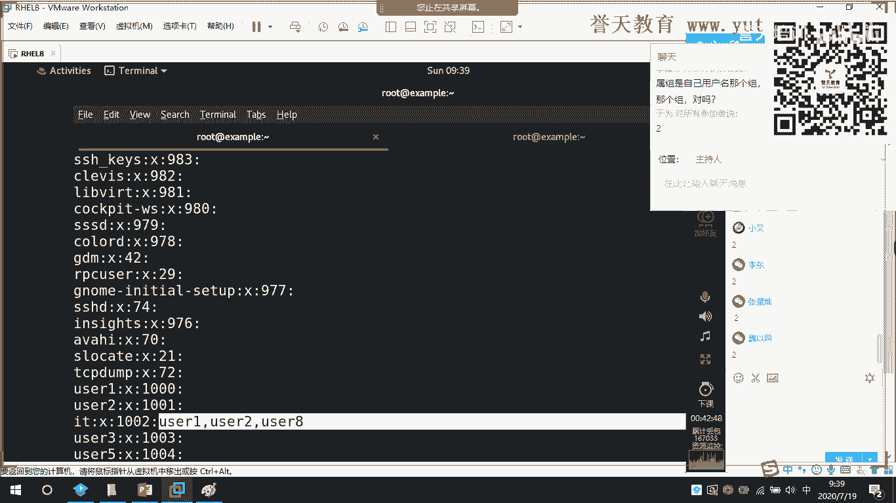
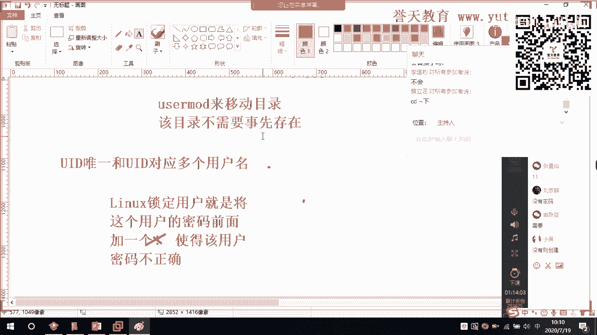
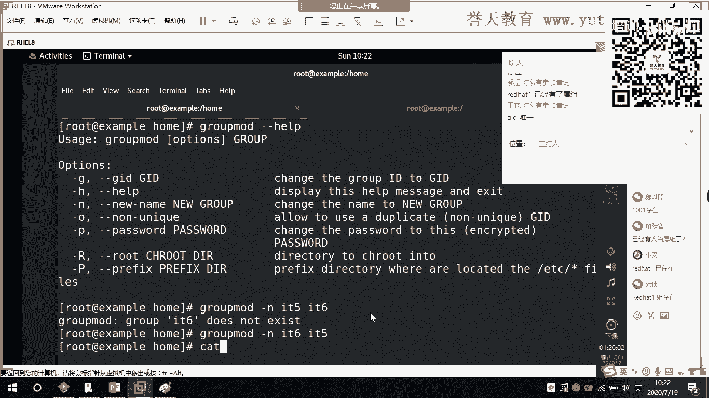
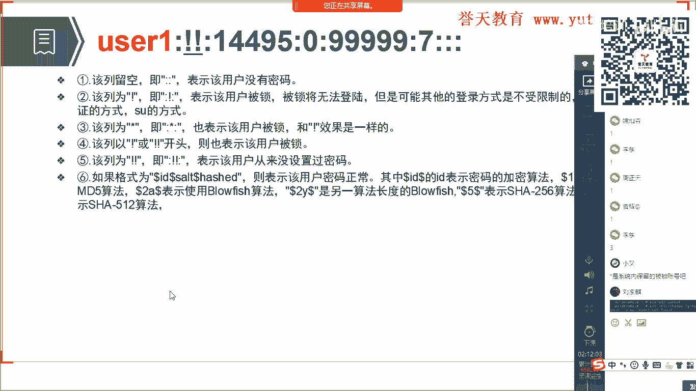
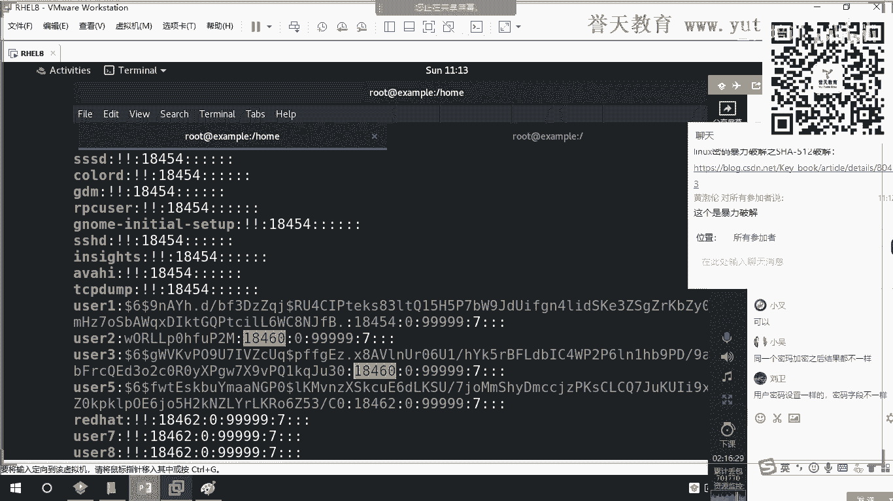
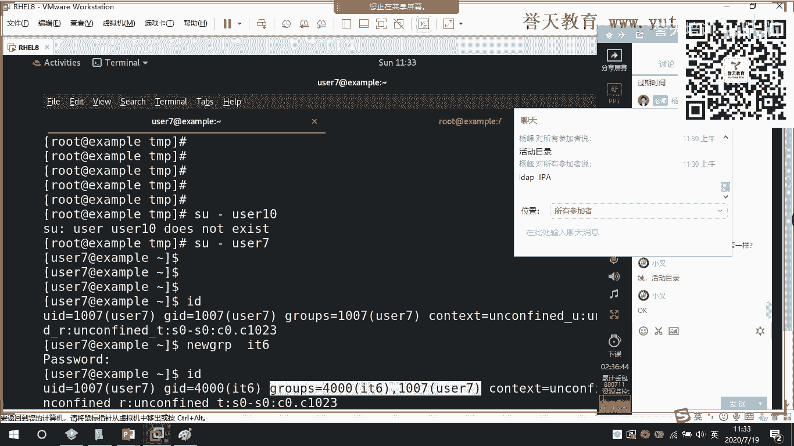

# 红帽RHCE 8.0培训学习视频-07.Linux用户和用户组 - P1 - 誉天云计算 - BV1sP411o7Y2

好，那么我们接着昨天的继续啊，昨天呢我们把这个我们的用户文件啊大致的认识了一下。然后呢，有些小伙伴呢晚上呢就迫不及待的去做实验了啊，然后各种问题对吧？这个还有需要急救的啊。那么我正在跟他家说一下啊。

这个实验呢大家后面呢不要慌，为什么呢？因为我们在这个嗯我们在系统里面有一个章节啊，有一个章节是专门来讲Nux是如何做救援的啊。我之所以跟大家说到这一点呢，是为了说明啊这个叉在我们系统当中的一个应用啊。

它在我们系统上的一个应用，我们在什么时候可能会用到它啊，可能会用到它。那么这里呢还有一个问题啊，就是这个昨天没有跟大家补充的，就是我们这个叉在这里啊。嗯。我们这个插在这里啊，它的这个密码占位符呢。

对于普通用户而言啊，对于普通用户而言，呃，这个我试了一下，普通用户他是好像还是要密码登录的啊，对普通用户而言是没有效的啊是没有效的。我在3月份做测试的时候，对root用户而言。

他也好像是要这个要密码登录的啊。我记得我明确的记得我当时把这个叉去掉过后，他也是需要密码的啊。但是在昨天啊我们现场给大家一起做演示的时候啊，把这个叉去掉，但是不需要密码，这是在吧里面啊正在8里面。

那么可能在吧里面呢，对于普通用户而言，他还是需要用来验证密码啊，而对于root用户而言，不再需要啊，对于对于root用户不而言，不再需要。而在红猫七及以下的版本里面啊，这个叉去掉对所有用户都是要的。

对所有用户都是要的。但是一般而言的话，我们只用来针对于root用户。为什么我们只会针对于root用户呢？原因很简单，就是因为root是这个里面的老大，对不对？root是这个里面老大。

如果root用户不需要密码，可以登录进去了，那么我们就能够为我们所有的小伙伴都可以怎么样。都可以来重置密码，对不对？这样子都可以来重置密码啊。所以这个密码在为辅人。

我们更多的时候是要针对于root用户来进行一个使用。好，大家把消息发给所有人啊，杨柳之月。那么在这样子一个地方啊，我们在使用的时候呢，更多的侧重于是我要去验证密码啊，而不是它不需要密码。

不是它啊大家注意啊，这个密码占位符去掉了过后，不是这个用户不需要密码，而是什么呀嗯。不再去验证它的密码不再去验证它的密码。所以你把这个X一加，那么这个密码又回来了，这个密码又回来了啊。

进去的时候仍然需要验证它的密码。这个X去掉过后呢，不管你是在我们的字符界面登录，还是在我们的这个图形画控制台登录啊，它都是怎么呀？嗯，不需要输密码的啊。这个wib控制台大家可以去看一下啊。

weber控制台我还没有测试啊。好。这是关于我们这个地方的X啊，关于我们这个地方的X。那么还有一点呢，就是我们这个地方第六点啊，第六点，昨天有几小伙伴晚上这个瞎改是吧，改出问题来了，他改成什么呢？

他把它改成了并霸系啊，改成了并霸系。然后说唉老师我这怎么登不进去呀？我告诉你，兵大使和我们的home user你是两个概念。后面的冰b它是一个程序，而home user一是一个目录，是一个目录。我问你。

你这个程序放到了6的这个栏位，那么我们用户进去的时候，有一个初始目录，它会得到吗？它不会得到，因为两者属性都不一致。各位明白吗？两者之间属性都不一致，所以我们是不可能会得到啊不可能会得的。好。

所以关于后面这个登录的 shell啊，登录的需是个什么东西呢？登录的需就是我们系统里面运行的这个用户登录进来过后，运行的第一个程序。如果它运行的第一个程序叫并b。

那么我们这个用户像这样子的一个user101的这样的用户，他就是可以登录我们操作系统的啊，如果运行的是S并怎么样，它就无法登录。记住了，这个无法登录不是代表用户无法使用，而是怎么样。

用户无法登录我们的操作系统，不代表不能够使用系统的服务。我昨天给大家举了一个很鲜明的例子，叫做FTP对吧？好，这个密码占位符呢，大家不用像这个群里的消防啊，对吧？这个他们去做的这这的如此复杂啊。

昨天我是给大家演示啊，在我不知道用户系统的密码的情况下，我怎么样进去啊，大家需要知道唉我把X去。加过后怎么样你就不需要验证密码了啊，后面我们会教大家怎么进去，对吧？以及我们进入了什么模式，对吧？

我们在这个我们那个在开机的那个菜单那里加了1个RD点BREAK这个是什么意思，对吧？我们为什么要这样加，我们为什么要挂载s rootot，对吧？挂载sroot是为了干嘛啊？好。所以这个大家要注意啊。好。

我们来看一下这个我们的第二点啊，我们的第二点主啊，有用户呢就会有主。这是两个什么这个千古不变的话题。那么组呢在我们的系统里面，每一个组的诞生都与用户有着强关联性。什么叫强关联性呢？昨天我跟大家讲到。

在系统里面。我们只要创建一个用户，就会发生什么样的事情。嗯。😊，各位。😊，加密后的密码加了倍还没到啊，还没到讲密码的时候，等一下我们再要讲。那么在系统里面，为什么我们说用户与主有强关联性？

昨天我讲了一句话，昨天我讲了一句话叫什么呀？对，余为特别棒。李建斌创建一个用户，就会产生一个主。对，并且是和用户名相同的组啊。所以我给大家讲到，在linux操系统里面，我们的用户与主有强关联性。

而在windows里面不一定，而在windows里面不一定啊。好，那么在这里呢NXL基本里面呢，我们的每一个用户啊每一个用户他必须要有一个主，必须要有一个属主啊，这个属主就是他的私有组，就是他的私有组。

那么每一个组和用户一样，都会分配到一个独特的组的ID这ID叫做GID啊，这个组的ID叫做GID。那么我们所有的GID的信息呢都保存在我们EDCgroup中，保存在这里。大家看。😊，好。

那么我们可以呢将用户添加到别的组，这个用该组就成为用户的附加组。所以我们在系统里面的组有两个类型。一个叫做私有组啊，一个叫做附加组，我们要把它称之为公共组。一个叫做。这个是室有主。再一个就是附加族。

我们要把它称之为公共组。在这里啊，这两个加法是一样的啊，这两个加法是一样的，大家注意啊。我们有时候把它称之为私有主啊，或者把它叫做属主，对吧？在一些文档上面也把它叫做属主啊。

好，我们来看一下。它在我们系统的EDCg这个地方。来，大家看在这个地方，比如说root，你看。比如说root是不是就有个主叫root呀，看到了吗？比如说这里有个ususer一，你看。

我们这里是不是就有个user一呀，有个主叫user一呀，有看到吗？好，那么在前面你看的EDC password word这样子一个文件。今天我来问你啊，我来问你。首先第一个root毋庸置疑。

这个叫做主名，对不对？这个叫主名。好，我问你第二个X是干嘛的。各位，第二个X是干嘛的呀？嗯。😊，第2个X。完蛋了完蛋了，这不知道了吗？什么账位符啊。这是什么占位符啊？对，C月赛特别棒。

这个是主的密码的账位符啊，蔡立组把消息发给所有人。这个地方的X啊。🤧嗯。

这个地方的X是主的密码。是的，今天要颠覆你的观念，主还有密码。完蛋了吧，不知道吗嗯。嗯，听一讲，您那个是博大心深啊，这个X是主的密码验证。主的密码验证。

为什么我们把lininux称之为是一个安全的操作系统？比如说今天你在公司里面操作你的权限不足了。比如说深乐赛这个家伙在公司里面操作，他现在是这个我们的运维这个终级工程师，对吧？

他要涉及到对某个文件进行进行这个删除。那么这个删除的这个文件呢，是开发工程师才有的权限。那么现在很显然，深乐赛就没有办法删除这个文件或者修改这个文件。此时，如果要让C约善来修改这个文件。

传统的做法是把开发人员账号密码告诉C约赛，让他去进行操作，对吧？让他去进行一个操作。但是这样子。别人是不是担心他的账号的安全性？因为深源赛如果拿着他的账号密码怎么样，就可能什么对系统造成一系列的破坏。

那么此时为了能够让深乐赛又能够修改这个文件的权限。此时怎么样，我们就可以把我们组的密码啊，把开发人员这个组的密码告诉深乐赛，使得深源赛切换，临时切换到这个组使用开发人员。

让深源赛的用户身份得到这个组的权限，以这个组的身份去修改这个文件。但是这一切都是临时的这一切都是临时的，明白吗？明白的小伙伴敲个一，这就是为什么要给主设个密码的原因。

就是为了让别人能够临时的得到这个主的权限。这个特别棒，windows做不到啊。据我所知，这个windows是做不到。🤧嗯。所以啊X叫做主的密码啊叫做主的密码。好。后面这个零是什么呢？

后面的我们的这个零是我们组的ID啊，这个零是主的ID好，后面这个空白的一个栏位是什么呢？主的密码的作用是临时授权的意思。对对，刘佳提示的。所以后面这个空白的这个栏位啊，空白的这个栏位是我们主的用户。

我们主的用户啊。

好，来，我给你举个例啊，我给你举个例。呃，我用V打开啊。🤧嗯。😊。

好，我们大家可以看到在我的序里面呢有个主。有一个组叫IT有个组叫IT。那么我们IT这个组呢，它的GID是1002。在IT这个组里面有一个用户叫做user一。好，我们来看一下啊。

大家还知道怎么查看这个用户吗？ID user一回车。诶。😊，怎么样？你们看user一这个用户，他的什么呀？主是什么呀？它的主是IT哦它的主是IT哦。

所以你看在这里我们是不是可以拿到什么拿到user一user一。所以后面的这个空白的栏位啊。后面的这个空白的栏位就是我们的用户啊，就是我们的用户。好，那有些家伙就有疑问。

老师为什么上面user2后面没有user2这个用户呢？好，与用户组相同的用户名啊，相同的用户名。因为你这个用户主user2是在创建user2这个用户的时候，把这个组串出来的。

所以作为user2默认的属主，它的用户名不会在后面出现。也就是与这个什么与我们这个。比如说二相同主名的用户以及相同ID的用户不会在这里出现。也就是他作为优势2的属组，U势2这个用户不会在这里出现。

也就是他的私有组。这个可以明白吗？有一点点绕啊，你要明白是什么意思。为什么这个地方能够看到UC一，而这个地方看不到user2也看不到Uer一，对吧？你看后面怎么都是空白呢？你不是说后面是他的用户吗？

对吧？这里啊，要是你新加进来的用户新加进来用户啊，也就是说要将IT作为他的附属组啊，做他的附加组啊，或者公共组这个地方用户名才会出现。🤧可以吧。

🤧拿掉。最后一为什么呀？不是优所历史吗？是用户名的。是的呀，肖鹏。可以把别的组的用户加入到这个组嘛？肯定可以啊。肯定可以啊。对。对，后面这个这个列表啊，它可以有多个用户，能明白吗？它可以有多个用户啊。

我是我举的例子是这里，因为我是只有一个用户。

能明白吗？这里只有一个用户叫USCE啊，后面可以有多个用户，就这个在主内的用户啊，后面这一栏是在主内的用户，好吧。好，这是关于我们主的这样子的一个文件。

后面是不是跟对用逗号隔开嗯，用逗号隔开，等一下你做实验，你就能看得到。好。

然后在这里啊。在这里啊大家看到同一个组中所有的用户都能共享属于这个组的文件。这一句话的意思就是在这个组中的用户就能够得到这个组的权限啊，在这个组中的用户就能够得到这个组的权限。

有一个地方例外有一个地方例外啊，这个不知道红帽的这个PPT和教材上为什么没有写。我做了实验啊，有一个地方例外。比如说大家可定很好奇。如果我把user一加入到root这个组，这个主标奇怪。

加入到root这个组，大家想一下此时会发生什么样的情况。嗯。😊，此时，U选E是不是就能够得到root的所有权限？对不对？各位，你们认为是这样子的吗？我当时认为也是这样子的。后来在实验当中，我发现。

即使我把U水E加入到路上这个组啊，U水E也并不会。U水E也并不会去得到落ot权限。去得到录ot权限。但是如果我把user一。加入到我们的user二的组。那么此时user一可以得到user2的组的权限。

能明白吗？所以啊如果是普通的组啊，如果是普通的组，它是可以拿到对与之对应的组的权限。但是如果这个组是root，那么他只拿不到他只拿不到。实质上，经过我的研究发现。

我也发现usZ一确实拿到了root这个组的权限。但是root这个组在系统里面没有权限。路这个组在系统里面的权限微乎其微。为什么我昨天跟大家说了一句话，在系统里面并不是root，就是超级管理员。

而是因为root这个人怎么样？大家还记得吗？而顺路的这个人怎么样？张志祥把消息发给所有人。对你弄特别棒，而是因为路的这个家伙的用户身份，他的UID为0，所以他是超级管理员。

所以即使我把UCE加到root这个组。比如说你是跟下面建文件，创建文件是只有root能够干到普遍用户做不到的。所以我把右侧一加入到root这个组合后，它仍然没有与之对应的权限。但是加到普通用户组就会有。

就会有啊这个地方比较奇怪啊，大家注意啊，这个地方比较奇怪。所以有些家伙就说唉，那么如果我想把UerE设为系统的管理员。那么是不是应该这样子？我把UCE加入到路成这个组。

就像我们在windows里面啊，为什么我要讲这个地方啊？因为windows里面就这样子。😡。

那。你看啊在windows套作系统里面，我们通常设置管理员是怎么设的啊，设置管理用户。好，比如说现在我要设置用户。那么我想设置用户的，我想比如说我想把一个什么样的用户把它设成管理员。

那么我们通常是这样子做的。我们通常是不是把什么？把它什么呀？你看比如说我的电脑，我当前登录的用户叫做jos对吧？那么我的这个jocks要得到管理员的身份，那么我是不是要怎么呀？我在这添加把它加入什么呀？

addminist这个组啊，对吧？addminist这个组，如果我把它加入到这个组，那么我这个用户就是管理员了，但是在linux里面不这样子。在linice里面不这样子啊。这是很多人的误区啊。换句话说。

就想获取了录的权限，唯一的办法就是改成UID位。对，是的，就用军用正解啊。所以大家不要做这样的事啊，不要说唉，我把UCE加都入了住来，他就是管理员了，不是。😡，他不是的啊。

在我们系统里面要使得这个普通用户成为管理员啊，我们要做权限委派。还没学啊，我们要做权线尾拍。要做全线尾判，对，就十度承认。如果要使得这个普通用户成为管理员，我们要做权限委派，也就做实路啊。

后面我们要学的。所以大家不要以为把它加入入ot组就完事了啊。就唉我这个就是管理员了，我是这样子啊，给你掰过来啊，这个误区啊。

好，所以你要记得加入到啊UCE加入到普通用户的组，它毋庸置疑可以得到普通用户组权限，但是加入路程不会得到这个还没有看到任何具体的文章的解释啊。这个我是自己做实验发现的。好吧，如果大家做实验的时候。

发现有什么区别或者异样啊，也请跟我联系。

好，那么在这里啊，大家有几点要记住啊，有几点要记住，虽然有这么多，但是你有几点要记住。第一点就是每个用户他必须有一个什么呀？必须有一个主组啊，也就必须有一个组，对吧？与之对应的组啊。

每个组会有一个独特的ID这个的ID是独一无二的，独一无二的啊，那么我们所有的组的信息都保存在EDC对吧？我们昨天学了EDC这个目录是用来承办什么呀？系统的配置文件，对吧？好。

那么再一个就是我们可以将用户添加到别的组，这个组呢就成为附加组或者叫做公共组。好，那么同一个组中所有的用户都能够共享这个组的权组组的文件，也就是在同一个组类的用户都有与之对应的这个组的权限。

都有与之对应的这个组的权限笔记记好啊，我要查的啊。好，那么这个呢就是我们主信息啊，你看这个刚刚夏鹏我不是问了吗？他说后面这个user一user2user3是怎么样做的呢？这个列表使用逗号隔开。

使用逗号隔开啊，后面这个主名，后面处于这个主用户不仅只有一个啊，可以有多个可以有多个啊，每个用户之间使用逗号隔开，这个是我们主的密码占位符主的ID主的名字啊，你看哇塞，这个好简单吧。

比EDCpas word简单多了啊，好，那么我们来创建用户。创建用户的时候呢，通常呢有这样子一些需求啊，有这样子一些需求。好，创建用户的时候呢，我们最简单的命令是使用user aid啊。

使用user aid来创建用户。如果我们不跟啊，什么东西都不跟，比如说。

我们user aid。刚刚 have。在这里你看啊我们什么都不跟，我直接us egg。大家认为他会报错吗？😡，他会不会报错，你看语法啊。会报错吗？啊。不会吗？肖鹏，你觉得不会吗？完蛋了完蛋了这。😡。

有啥聚会。啊，到底会不会？回去了。谁说不会呀？对你看后面是大写嘛，所以肯定要有嘛？必选你的参数要必选。你的参数要必选啊，你看这个家伙这个语法就没有学会，你这要重新修炼啊。🤧嗯。中括号是可选的意思。

所以是选项可选。所以我们在新建用户的时候，直接用user aid。比如说user aid叫做redhead这样去用作快车。你看我们就建成功了，所以我们中间是不是漏了一个东西，叫做选项，对吧？

为什么选项我没有写啊，是因为选项怎么样？可选。对不对？是因为选项可选。好，那么这样子呢我们就建好了一个用户叫做re。你来看一下。不样，这个时是不是就有rot呀。好。那么。

我们在这个地方，比如说要建立一个啊要建立一个指定的组，要建立一个指定的组，指定用户所属的一个组啊所属的一个组。

那么就这样子。比如说。呃，user aid。我来建个组啊，剪基，我们刚刚不是有个组叫IT吗？IT后面跟上主的名字，剪基啊，跟上组的名字。你要看一下剪基是什么意思，在这里啊，你可以看。剪积是什么呀？

跟上这个名字或者是。ID看到没有？或者是ID能够将啊你要习惯看这吧。在这里。讲什么呀？😡，添加一个什么呀？新的什么用账户添加一个新的账户啊，把这个账户添加到这个组里面啊，给这个组添加一个新的账户。

点击后面有两个形式。对，后面有两个形式，你可以跟主的名字或者或者或者主的ID看好了，我带你认啊。嗱。后面我们创一个用户叫做user6，好吧？来，我回去了啊。诶。看IDus6。怎么样？😡。

现在IDus6这个用户是不是就得到在我们1002这个组里面有看到吗？有看到吗？好，来，我们看一下ID这个组里面是不是多了一个用户。

嘿，完了完了，怎么没有多呀？为什么没有多呀？各位。啊。快点告诉我为什么他们没有做。😡，在这里，为什么他没有多？😡，嗯。😊。

本来啊在这个地方是不是应该多一个组的多一个用户，为什么现在没有多？😡，哎，深渊赛也没有上当啊。对，因为它是我们user6的鼠主。属主的用户不会在这里出现。能明白吗？能明白吗？如果你默认创建的属主的用户。

他不会在这个地方出现啊不会在这个地方出现。那你看所以在这里啊没有这个用户。为什么我的这个IDuserE也是属主啊，为什么就出现了呢？啊，userE是被我改了的啊。😡，来，你看U手一为什么出现了呢？😡。

user一是因为被我手工改过来的啊。好，后面怎么用命令把它加到里面来，等一下我带你来做啊。所以各位你要知道，如果在指定的这个组啊，我把这个用这个组作为这个用户的属主。那么这个用户则不会在这个组内出现啊。

不会在这个组流出现，换一句话而言，也就是说user又是我们IT这个组的什么呀啊，这个主用户啊，这个主用户，不能够把它称之为这个组的管理员用户啊，不能这样叫啊，不能这样叫，因为这里没有管理这个概念啊。

没有管理这个概念好吧。うん。主的ID有范围限制，没有它和用户一样。刘位，他和用户一样，从一000开始，你看在这里。阁路。你好，在这里啊嗯。

它是从1000开始，看到没有？你看UE的主的ID是不是1000？它是从1000开始啊，0到999保留了，为什么呢？因为你要想一下刘位。

我们每一个用户系里面每个用户都有个ID，那么系永的保留用户的ID在0到999。那么这每个用户是不是都应该有主啊，刘位。系统里面每个保留的用户。都应该有一个。啊。嗯。😊，都应该有个主啊。那晕射期是的。

因为是它的属主啊。每一个用户都有一个保留的主，所以你有多少个用户，这个地方就应该会有多少个组，能明白吗？你的用户的ID保留了主的ID是不是也得保留？可以吗？这个刘位。能明白吗？这个意思啊。不会有录得住。

不会。不过有录的组组的权限啊。我要知道某个组里面有哪些用户如何知道。这里有一个有一条命令叫做哎，我看一下啊，有的这个文件。哎，现在没有了。

那么你要知道这个组的用户的话，只能够。对啊，我想一下。嗯，在这个地方只能够看到它附加进来的用户啊，只能够看到这个主附加进来的用户，他看不到这个主所有的用户。如果你想要知道这个组类有哪些用户嗯。

我看一下有一条命令，好像是有一条关于主的命令啊。过路。呃， user。有是看着啊，我看一下。这里有一条关于主运。因他尔在这个组里。他不能够跟主啊，我看能不能跟主。原来有一条叫做list。

这是往组里面加用户。呃，好像是这样。这是改主啊。点L。哦。这个后面有一条。杠杠的历史。

🤧我看一下啊，后面这里应该是有一条。是这条吗？要接主是吧？对。

这条线在那新版的狙击衫还是没有了，原来在老板上面是有的，我试一下啊。点击跟上主的名字。IT减L能出来吗？只能够有user一你看它这个地方只能够看到附加组。只能够看到附加组。

还无法看到它的这个主类的所有网。一般来讲的话，除非啊。是这样子啊，除非你在这个地方。你在这里啊看到的后都是他后面的所有的属主啊，哇这个附加附加进来的用户只能看到它附加进来的用户。

但是一般这样的情况比较少见，就是因为你创建这个用户的时候，就会有与之对应的一个主出现。那么这个用户名就对应这个主。也就是说一般来讲的话，比如说你看user一这个组，你就能够看到什么呀？

你就能够很显而知道这里有个用户叫做userE。能明白吗？如果你非得要看到这个用户所有的组额，那么你只能够跟上用户。比如说跟上用户就可以看到他所有的主。这是表。我找一个有多个组的，好吧。

我把这里还加一条进来。哦，在这里啊。比如说加个66。哦，我看一下。咦我这个本来就有16。我加一个没有的啊没有的用户待遇。加个U小二吧。U叉2啊。爱的有说。能看到吗？嗯，夏鹏。

所以如果你非得要看你看到主内的用户的话。这个好像是无法做到，但是原来的话是有运营可以做到的。

好吧，现在新版上面没有写啊，将用户添加到别的组。那么在该组中。会的会看见啊。如果你是作为属主的话，他是看不见的。但是作为附加组是可以看见的，我还没有讲到用命令怎么来加啊。现在U选E的GID是1002。

说明U选E的数值，为什么附加组还显示U选E啊。在哪里啊？在。哦，在这里是吧，在这里啊。这是它本身的啊这个是主的ID啊这个是主的ID这个地方才能够看到它所属的主，能明白吗？硅造这个地方是它的属主的ID。

这个是它的ID主的ID啊，就是它的主ID啊。这个是主的主ID。我把它拿出来啊。

在这里啊。这一部分是它的UID和它的用户名，这一部分是主的ID啊。这个GID。是主的主ID。是主的主ID啊，后面才是他所拥有的主，可以吗？魏宇兆，这个可以吗？在这里啊它有IT。

那么此时IT这个组就是我们的user二的附加组啊，us手2的附加组可以吧？对。😊。

user一你看它就只有一个组嘛，就只有一个数组，它没有附加图啊，还没有讲到附加组的概念呢。说明减I减7ITU手6这样的组流创建用户还是少用。对，一般不会这样子。一般不会这样走，除非有一些特殊的情况。

也就是说这个用户必须要在某一个特殊的组类。可以吧。🤧B。属主的概念。也就是说这个用户的主要的主啊能明白吗？李建斌。可以吗？grouplobe是主名不能看到啊。不能看到，我记得以前好像可以看到。

你看能看到吗？ID之，他都看不到ID里面有用户。看到了吗？他都看不到啊。好。李建平可以吗？属主啊，就这个用户主要的主，就他原始的主。能够明白吗？这样可以明白吗？🤧嗯。😊，就是中国，不叫祖是湖北。

湖北中国是一个主，湖北也是一个主，主主是中国，副教授是湖北。不是的不是的，你这个概念有歧义，你这个概念有歧义啊有歧义。哪个第四个栏位是副角组呀？你说这里吗？😡，来。😊，这个这个难位是用户名。

这个难位是用户主页的用户，明白吗？嗯。好。所以啊各位在这里啊要注意啊。这个你的这个概念有误啊。你的这个概念有误，能明白吗？😡，这个地方比较简单，也就是说如果我给这个用户指定的ID。就是user aid。

减G。指定的主啊指定的组的ID比如说叫华为。对吧那么这个华为这个用户它的属主啊，主要的主就是IT。也就是说，此时系统就不会去为我们创建一个与华为用户名相同的用户主叫华为，能明白吗？

而是将华为这个用户作为IT这个组的作作为什么将IT这个组作为华为这个用户的属主。可以明白吗？李建明这个可以明白吗？😡，🤧嗯。属组是自己用户名那个主，附加属是我给强制加进去的个组。对，是的。好。

这是第一条啊，这是第一条，这一条还用的比较少，在一些特殊情况下会用。也就是说会将这个组啊，将我们默认的这个用户的这个组改成其他的组啊，改成其他的组userAD能够执行起的多个其他的组吗。这个好像不行。

因为减积的话减积的话是它的属组只能有一个。能明吗？也就是说不管它的附加组有多少个，它的属组只能有一个。可以吗？肖鹏属主只能有一个啊，这个地方不能加。

好，这是我们的这个剪积这个啊，然后这里有一个减C减C这个是干嘛呢？减C就是更改我们用户那个什么呀描述信息啊，描述信息。比如说在这个地方。

user aid减C嗯，比如说叫hello。呃，user7。回车。😊，好，然后我们来看一下啊，EDCpa word。

user7。啊，这个全。来，大家看在这个地方是不是叫什么hello。所以减C是用来指定用户的描述信息啊。减C用来指定用户的描述信息。

系吧。

好，除了减C之外啊，我们还有减积，看见没有？附加组来了，减G用户组指定用户所属的附加组啊，减G可以指定用户所属的附加组。

来你看我们刚刚是捡的那个小鸡啊，我们现在捡大鸡。呃，比如说我指定它的附加主是IT好吧，然后user8。看好了，US什8。IDuser8。那么我现问你现在user8有几个局？各位user8现在有几个组。

几个。看好了，是不是有两个。那么此时你先来看一下，在ADCg。主的文件里面。ID这里就不多了一个用户叫做有什么。所以只有附加组的用户才会出现在这里，属主的不会出现。能明白吗？那么蜀主怎么看呢？

这个我还真的比较少关注啊，所以在这个地方，如果你非得要看它的属主啊，一般而言，我讲一般而言，属主是与主名相同的用户比。

相同的用户名好吧。那么如果你非得要查这个用户的属主，用ID来查，用ID来查。那么在这个地方你就可以看到它的手主。所以你看不管它有多少个附加组，它的主要的主是不是只有一个，也就是他私有的主啊。

不要再加什么属主了。这个念的不通讯的，这个叫私有的主。好吧，我这样来说是私有的主，这个你应该就可以明白，这个就是它的公共组，能明白吗？附加组，这个叫做附加组啊，附加进来的，这个就是它的什么呀私有组。

可以吧，这样你就不会混淆概念了啊。好，余伟这个地方可以吗？所以你要知道啊，我给它添加了减G，那么它就会得到一个什么呀，就会得到我们这样子一个什么呀附加的组啊。好。

所以这个地方大家应该明白啊。好，那么这里还有一个叫减S啊，减S就指定它的登录效指定它的登录效啊。

所以呢你看。user AD。减S，比如个叫。S，B。罗罗给对吧？叫做。右手机有回车。好，你来看一下user9能不能登录啊，我直接测试好吧，看能不能登录user9回测怎么样。现在是不是不能登录？

那在实际的生产环境里，使用的员工工号越多，主的文件就越大。每个员工。账号就会产生一个主要的主。对，是的是的。好。那么你来看啊，我现在看一下us色9。ADC咦pasword。user9啊。嗯。

这样走个全屏。好，大家看在user9这个用户这里，它就有一个什么呀？登录的ll是什么呀？叫SB load loging啊，SB load loging好，那么有些家伙就说老师。

我学了这个user A的有什么用呢？对吧你为什么要我用来减C减G呢？对吧？减U呢哦，这里落掉一个减U啊，减U是指定指定的UID比如说user egg减U2000。然后更上一个用户名叫做嗯我们的这个。

user1。回车。好，然后你看一下ID。user时0。怎么样是不是就2000？😡，减U啊是指定它的UID。

减U是指定它的UID好吧。

好，这个是关于我们的用户啊，使用user aid如何来创建用户。那么与usCA的相关的命令呢，相关的命令呢。在这里啊与USA的相关的命令最多的用的最多的一条叫做。userADD减U998。

就是指定GID对对。不一定指定他的GID呀，指定他的组啊指定他的私有组刘佳琪。😡，能明白吗？减G谁说是指定它的GID了，也就指定它的主。简U998user998会报错吗？不会。不会。😡，减入0可以吗？

不可以生翘，不可以ID为一啊，我已经被用了。零已经备用了，你怎么可能会指定呢？好，来，你看啊夏逢这里有一句啊，他说998啊，你看啊我减ID减0，好吧。

你们老有些稍操作啊，减优。0，然后我来试一个useruser11吧。你看。😊，怎么样零怎么样已经备用了，看到没有？😡，您已经备用了啊，不能用。好。然后在这里啊，他说998能不能用啊。

你看一下998有没有用啊。😡。

我们看下998啊，998没有用。996995998已用了，998已用了。我明白肖鹏的意思。肖鹏的意思就是说，如果在0到99。0到999内。如果有1个ID没有用被保留了。如果有1个ID没有用被保留了。

比如说35。35没有用。在这个地方。35没有用，因为35是另外一个用户。如下步的意思就是，如果35被保留了，我能不能够在减U的时候接上35。是这个意思吧。也就不能新建具有管理员权限的用户。不是张金灿。

是因为这个用户ID已经被用了，所以你就不能再用了。因为它唯一啊。可以吗？张先灿。可以吗？嗯。相同的意思就是减U35，现在这个35在0到999之内，35没有用。那么我在这里给他搞个35能不能成功。

可以成功。来，比如说我给你制定一下啊，你看能不能成功，可以成功。

Uer a的。减U35。右侧12。看好啊，有个小12。好，可以成功，你看到了吗？user12可以成功。你看到这UID是35GID是20012001。看一下IDU6，看U6干嘛呀？一。😊，看US6干嘛？

不要打断啊，先听我讲完。😡，听我讲完在这个地方啊，如果说这个用户30呃，这个UID35。如果你给了U2，会发生什么样的情况？如果你给了U2，那么这台服务器就不能做虚拟化。

如果你把ID35。给了有说说。这台服务器就无法做虚拟化，因为ID35。ID35是为。KVM的用户。导游的ID。也就是将来如果你要在红帽的系统里面运行KZM的虚拟化。

它会默认用35这个ID去给你怎么样创建一个label boss的用户。他会去给你创建一个label was的用户。这个用户的ID默认就是35。那么现在有用有小伙伴就有疑问。

为什么这个ID35我给了其他用户，那么我的虚拟化就运行不了呢？因为KVM里面的文件。🎼它的权限必须是UID为345这个人才能打开。所以你把35给了其他人，laor watch就得不到这个ID。

因此就没有办法来运行与KVM相关的文件。夏朋友可以明白吗？这就是为什么不让你把35把它赋予给其他的用户。所以在系统里面0到999以内的用户，请大家不要使用啊，这个ID数请大家不要使用。

前面我已经跟大家说了，为什么在这个地方UID是零的，这个人他的权限就最大，而并非root，只是root这个人凑巧他的ID为0。系统并不是以啊最后一句话，linux操作系统。并不是以。用户名。来标识权限。

它的安全性啊并不是以用户名来标识他的权限，而是以。通过什么呀？通过UID。能明白吗？那系统如何保留这0到90时？如果系统内其他保留用户需要创建时创建不了，如何处理。

那么这个就需要涉及到程序设计的相关问题。如果在安装KVM的时候，他创建不了lagoW这个用户呢就报错了，这就是软件开发者他们所讲到的可以吗？肖童。对，如果系统内其他保留用户需要创建创建不了。

那么这个时候程序创建安装这个用户的程序，去创建这个用户的程序，就应该由他去报错来提醒用户。这个ID已经被占用了。可以吗？能明白吗？肖鹏。好，我们的郑同学说这里减U的同时使用减O这个选项。

但它的GID就是1602，说明剪机是指定GID，但是U手6不是ID的管理。所以不显示在grouplo里面。我的userAD点击user7啊，你user7的GID就是7。对呀。或刘佳琪。

如果你将user7设为了and me这个人的用户主。那么它的组和它的ID是不是对应的呀？它都能够在U手机这个组里面呢，它的ID就是这个嘛。

能明白吗？你就不要绕进去了呀，我们使用URAA的。😡，完了完了，这在。不敢跟你唠了，你看啊剪辑，比如说我现在加加IT。user实物，那么。点击是指定GIGID就是怎么呀？将怎么样？将US15的这个用户。

它的主释为IT。那么也是不是就是说我将US15的这个这个用户的GID设置为了IT的GID。能明白吗？刘佳琪。可以吗？好，我们看上面一个小伙伴的啊，他说如果减U的同时使用了减O。

是不是可以重复使用其他的用户的UID是的，来，你看啊。减U啊，比如说我使用这个。我使用1006好吧。使用全用的UID啊1006。然后减O。这个。🎼我看一下啊减O的减U的同时使用减O。9。

然后我们创一个用户叫user13。好，你看啊。创业成功了。优势时尚。来，你看。这两个用户都是同1个UID。同1个UID好，那么各位。别现在就有疑问了。唉，老师，你刚刚不是说我们的UID是唯一的吗？

这个地方为什么会出现这样的情况呢？嗯。😊，大家有没有想过为什么会出现这样的情况呢？在系统里面，多个用户可以使用同1个UID。嗯。😊，但是UID是唯一的。有没有？谁能给我解释清楚，我刚刚给已经解释了啊。

有没令让用户不允许用win使用的UID吗？有命令让用户不许使用。未什的案例，这个好像没有。对，他们不在一个组里面，各位。我刚刚说了UID唯一唯一啊，你看现在是不唯一。😡，啊。对，参级组特别吧。

用户名不同，但实际上是一个用户。因为用UID来标识这个用户。所以你看我前面刚说了一句话，并不是用用户名来标识权限，而是用过UID。

可以吗？啊，我们的正同学可以吗？邮其他可以吗？能明白吗？只是给这个就有点类似于用户的别名啊。有点类似于。用户的别名。所以你要记住啊，我刚刚说了一句话，是用UID来标识权限，并不是用你的用户名啊。

系统不认识用户名，linux不认识用户名。😡。

来，我给你举个例，给你举个很强大的例子，好吧。看好啊，要动手了啊，危险操作。应该还没学啊，枪解欧了，与user时。呃，我十3吧，好吧。有色时场。我这里给一个文件附个全。这里有哪些文件呢？我看一下。

你看我做个操作啊，你就明白了。😡，IFC机落。好，大家看啊，现在IFCF机是。logg这个用这个文件，它的这个用户啊，你们现在不管这叫什么，这个你一看就知道，哎，这个是他用户这个主。看到没有？

现在是这个是它65，这个是它的组啊，看好了啊，我干个事情啊。时尚。回车。危险操作啊。咦，怎么是1006？哦，在这里对。来，你看到了什么呀？😡，你看到什么呀？现在我再来一我再来一步。😡，优选6。

看到了什么呀？😡，啊，蔡丽足，你看的什么呀？😡，看到了什么？系统并不是用用户名在标识这个文件的权限，而是用UID和JID看到没有？重点是UID。对，所以这就是为什么我刚刚跟肖鹏说了。

你不要用系统保留的ID。如果用了系统保留的ID，那么与之对应的文件权限就得到。就得不到啊，可以吧？啊，对，可以理解为身份证的名字不一样，这个叫别名，就像你的邮箱一样，你可以有什么呀，有多个别名啊。

有多个别名好吧，对，现在能明白吗？这句话可以明白吗？不是通过用户名，而是通过UID来标识这个文件的权限。即使这个用户不存在了。😊。

如果现在这个用户已经不存在了，谁能够打开这个文件呢？你看谁可以写这个文件呢？就仅仅只有ID106。比如说来我给你做个绝招啊，这一般不告诉别人的啊。106。让他死灰复燃。比如说read一。来，你看SU杠。

有色食物。啊，没有失误。哦，十五不能登录啊哦，十5被删了是吧？没有15啊，16连16也没有1313被删了吧，14。11要。咦，11也没有。10。😊，啊，石有啊。好，你看我进来。

同样是刚刚那个文件IFCFG点loggo啊。你看。😊，现在。IFCVG点loggo。

我往里面写文件啊，写不了啊，你看。怎么样read only只读看到没有？read only只读。好，然后你看啊我再切换到repe一。来，我往里面写A选下。

能明白吗？各位。可以看明白吗？所以在这个地方。怎么我一我一操作它就卡了了，现在可以吗？现在可以了吗？😡，现在可以了吗？😡，嗯，还考吗？还考吗？还好了吗好了吗？好了吗？各位。😊，关键时刻要去考啊。好。

所以各位你在这里你看啊，我readhead一这个用户是不是就对这个文件有编辑的权限？看到了吗？他刚刚是1006，我现在把1006这个ID给了rehead一，因此rehead一就得了这个文件的权限。

可以吧。可以吗？这个大家可以看明白吗？😡，好，所以啊大家知要大家知道啊，我们是用UID来标识身份的权限啊，标识这个我们系统里面文件的权限啊，不是用用户名不是用户名。

我刚刚说了一句话叫做UID唯一和UID对应多个用户名不矛盾啊不矛盾啊。UID为一。和UID对应。多个用户名。不矛盾啊，为什么说不矛盾？是因为多个用户名，你只是多个名字，实质上仍然是对应的一个用户。

仍然是对应的一个用户，可以吧？这个就有点类似于别名啊，类似于别名。好，这个大家知道啊。好，那么这里呢我们有一条命令叫user mode，对吧？

就是user modifyuser modifyuser mode是用来干嘛的呢？user mode这条命令是用来修改用户的啊，是用来修改用户的。

比如说减AG它可以追加一个附加组减AG它可以追加一个附加组啊。

来，你看。user mode减A。减进。哦，我先看一下语法，好吧。来，大家告诉我怎么写啊，不然我直接照着写出来没有意义啊，减A啊，我们先来看下减A。在这里吧，减A。

全民。减A和减G。他们两个他们俩的意思什么呀？😡，这两句话的意思是什么呀？😡，嗯。😊，这个是什么呀？😡，要添加嘛对吧？添加嘛添加某一个用户到剪计是什么呀？某一个组啊，减计是某一个组。好。来，你来看啊。

比如说 mode减AA是小写啊，减G为什么A和G可以写到一起啊？因为都是。短格式对不对？因为都是短格式啊啊，我系统里面有哪些用户啊，看一下啊。啊，有U选12。user时啊好。user12user1。来。

我问你，我现在是把user十这个组呢加到user12，加加到us手12这个用户呢，还是把us手12这个组加到us手1这个用户，到底谁是组还谁是用户？啊，谁是主，谁是用户。我看看语法有没有学好啊。😡，来。

在这里啊看清楚啊看清楚啊。

谁是主，谁是用户？优者实时用户是吧？把12这个主加到10这个用户回车。来IDus1。咦怎么样啊，真的是把什么12这个组加到US1的用户啊，说明大家什么语法还可以啊。你看因为选项后面是什么呀？是什么呀？

是参数啊，但是这个参数是优先对选项来什么呀来负责的啊。好，所以这个是我们的附加组啊，然后你可以看到在user12这个附这个组里面就多了一个用户叫做user10。我们看一下EDC glue。

来一0 second room。看user12这里是不是多了一个用户叫做user1。所以啊所以现在user12就是user10的。附加族附加族啊。也就说只有新增加进来的用户才能够看得到啊。

在这个地方后面这个地方才能够看得到，好吧。

好，来，今天继续。好，在这里呢有一条命令叫做减L啊，减L锁定用户。

这个很多小伙伴在做作业的时候都做了这个命密减L啊，手定用户叫做user词。好，然后你来看一下。us势时。嗯。你不锁定用户了吗？😡，啊。为什么我说大家做的不对？现在你能明白吗？😡，哎，你锁定用户了呀。

我怎么还可以登录啊？😡，嗯。😊，各位。为什么我可以登录啊？😡，为什么我说大家这个这个做法是错误的，现在大家可明白吗？能明白的小伙伴敲一，我是不是给你批了批改了，说你做一做的是错的，你用简L。

我说限制登录，这还可以登录啊。😡，啊，现在应该明白吧。😡，所以我告诉你，你这个锁对于路ot而言是无效的。root而言是无效的啊，root可以藐视系统的一切权限。可以藐视系统的一切策略。

但是root并不是无所不能的啊，后面我们会讲到root也有些限制啊。好，所以这个地方减L去锁的这个用户。好。他怎么去锁的这个用户呢？等一下我来跟大家揭秘啊，先放一个悬帘在这里。

实质上锁定这个用户。我告诉你，他做到锁定用户啊，你是比较奇怪。在linux里面锁定用户。就是将。这个用户的密码。密码。前面。加一个。感叹号。使得。使得该用户。密码不正确。所以你就登录不了了。

所以此时我用root以切到这个用户的身份。

因为root不受到用户密码限制，因此就可以直接切换到user时的身份，而不需要去验证密码，因此能够登录成功。

所以这个锁就失效了。所以这个锁就失效了。所以你看你那个设计特别奇怪，原来让这个用户不能登录，锁定它，就是把这个用户的密码一修改，改的不正确。但是我还可以解锁。解锁是怎么回事呢？解锁就是把这个用户名前。

用户密码前面加的这个改叹号给它去掉。那么就把这个锁解开了，哇塞啊。当时我知道了这个这个今天大消息，我乐的我乐的好几天，这个高兴的要死。我说你那个是怎么原来是这样设计的？我说原来把这个用户锁定。

就是把它的密码改的不正确，这个用户就登录不了了，这样子就锁定了吗？对吧后来把它改正确，就是把他原来加的那一部分东西把它去掉。那么这个用户的密码就正确了，然后他又可以登录了。

所以很多小伙伴给我做作业的时候，各种演示。他说老师，你看我现在图形化界面上登录不了啊。

登录不了，他说你看因为登录不了啊，已经满足你的效果了。

所以我跟他说，我说这个不是我要的效果，你这个仍然可以登录。明白吗？那在密码前面加个感叹号，是不是有人上去了？不，你民法权面价格赶叹号，他就不能上去了呀。陈月。😡，密码就不正确了呀，能明白吗？陈月。

我在密码的前面加个感叹号，那就不正确了，密码就不正确了，所以就上不去了，把感叹号去掉，它就可以登录了。可以吗？陈月。好，所以啊各位我在这里给你留了一个悬念啊，等一下记得提醒我，我来给你放个大招。

带你去看这个user mode是如何把用户的密码改成不正确的。记得提醒我啊，我带你去看user mode是这条命令，怎么样把那个用户的密码改成不正确。

来减U就是解锁。user mode就是user modify修改用户嘛，对吧？减us解锁user解啊user1吧，没错。是有所时吗？US是减小于啊。这个是没有锁定吗？我刚刚锁的是user几啊啊。

是简大于啊。

我看一下啊，我切到普通用户。因为我很少用这个来锁用户嗯，优9给优8。哦，我明白了，大家看啊。他在这个地方。😡，解锁的时候，他报了一个东西，你看到没有？你看啊他报了一个东西啊。😡。

是因为什么呀啊。😡，因为你这个用户怎么样没有设置密码啊，你右手时这个用户没有设置密码。😡，所以它还是接锁成功了啊还是接锁成功了，它只有个提醒，看到没有？有个提醒，看到没有？嗯，未能锁定了，你看到没有？

未能锁定的这个用户怎么样？没有密码啊，没有密码，没有给他设密码啊。好，等一下，我带你去看啊，我带你去看他怎么说的。

好，来。对它没有密码啊，没有密码，所以有这个提示，因为它没有密码啊，没有给用户使这个密这个用户设个密码。

所以我一般不这样啊，这两条命令我敲的非常少，因为我都直接去修改那个文件，我知道它可以锁定，对吧？它可以锁定。好，然后减M啊，减M移动它的加目录与减D一起使用减D呢就是指定到的一个加目录啊。

减D指定到的一个加目录。

于是。user mode减amp减低。呃，比如说把它放到哦这个跟下面的date这个目录里面来。然后后面跟上用户名user时。好，我问你，现在我回车能不能成功，也就是说。

跟下面的对的这个目录需不需要事先存在？跟下面对的这个目录需不需要事先存在。我们看下现在有没有这个目录啊。嗯。😊，跟箱冰箱没有没有d头，有有d头啊，d3dta4啊，我把它改成dta4。我把它改内色。

我问他，现在我回车能不能成功？这个目录需不需要事先存在？😡，啊。需要吗？回车。鱼。怎么回事啊啊，深边赛。😡，怎么回事啊？我现在进去，你说这个目录到底有没有？😡，他到底成功了没有这条命令？😡。

这个地方很奇怪啊，来回车。怎么样啊，大家看啊。dtad一dta2dta3就是没有d1d4对吧？所以移动这个目录的时候，该目录不需要事件存在。记住了，你说如果它事件存在。没有这串件，哇塞，小吴。

你这我还没说完，你就暴露了我的目标啊。好，如果说这个目录存在了。你觉得会报错吗？啊，如果这个目录存在了呢，比如说我这个magDRd头。来啊，套了给。你觉得会报错吗？😡，会不会报错？😡，回车。怎么样？😡。

啊，小吴。没有这创建吗？嗯，如果这创建的呢，提前创建的呢。所以啊各位请你记住了。请你记住了啊，如果说你看我现在切换过来。user10。us侧时。d头5，你看。我好像是成功了呀。

但这里我汇报了一个提示是什么鬼呢？啊。报了个提示什么鬼啊？报了个提示是告诉你date5这个目录存在了存在了啊。因为如果他使用date5这个目录。会可能会对什么呢？可能会对这个目录里面原来的文件。

因为它要修改这个目录的权限，要修改这个目录的权限啊。如果你d里面原来有文件，可能就会把原来里面的文件的权限给修改了。所以它会有一个提示。这里移动目录的时候，特别要注意。

Useer mode。来移动录入的时候。该目录不需要事先存在。该目录不需要事前存在。这是官方给你的建议。这个目录你最好是不要事先去创钱。不要出现计算件，让这个user mode这条命令来自动办理完成。

可以吧，来自动帮你完成。当然你也可以什么呀，你也可以事先建立啊，也可以事先建立。但是如果你事先建立了，那么这个文件，请你这个文件夹里面不要放任何与这个用户没有关系的文件。

以免导致你这个里面的文件不能使用，可以吧？不能使用啊。

好，所以这个地方大家注意。来后面删除用户就是user deleteele，对吧？user delete啊，它删除了什么呢？我们很多用户是这样删除的啊，而叫user delete。比如说删除user1。

回车。好，然后你们又干了一个事情，哇，老师说要用user时去给user师创建一个密码，这以后没做，所以你们马上就这样子user a的user时。我问你现在报不报错？😡，现在报错吗？啊。现在这个报不报错？

😡，现在报不报税啊？报错，张晶英都报错，你们这都试了呀啊，你们这个都都已经报过错了，是吧？好，来来来，你们都重新见过了是吧？来看好了吗？回撤了啊好，蔡季足说补报。😊，一。😊，怎么样？😊，他报了一个错用。

他就创建了一个什么mailbox。😡，他说这个文件已经存在。这个文件就存在。好，然后你来看啊。嗯。这里。我的user十有没有被我删过，没被我删过是吧？好，然后大家看啊。我来带你看。U损失。

这个是他的江木路的？这个是他江木路啊，他这里报了一个错施，为什么呢？😡，哇。没有。叫做user时。

这是文件啊。他刚刚去创建user时这个文件的时候。怎么样说这个文件已经存在了。这个文件是干嘛的？😡，这个文件是该用户的邮箱，是该用户的邮箱。可以把它理解为这个用户的邮箱。

也就是说将来这个用户所收到的文件都会在users时这个文件里面这个文件里面。所以他去创建这个用户的时候，说这个文件已经存在了。还有一种情况，这里我需要建两个全新的用户。加UCA的UC20。一个叫。

我现在把它删了啊，user deleteuser20。然后你来看我再创建user20。你看他怎包这样的说。😡，刚刚这个错报的和刚刚这个刚刚这个错和，现在这个错报的不一样，是因为刚刚user时。

你被我做了很多实验，我把它的目录呀，各种都已经改了，我把它的目录都已经改了啊，所以它不会报错。现在这是一个全新的用户，你把它建了过后删了再见就会报错。他报的是一个什么意思呢？它有一个running。

看到没有？举告。😡，警告在homedirect这个目录下面已经存在了这个用户user20的文件夹。🎼所以我来带你看。Home。这里面有个优厂20。看到没有？😡，是不是有个US2。

他说这个文件夹已经存在了，但是不影响使用，所以它只是一个警告。所以它只是一个警告。😡，好，在后面这里你来看他说创建邮箱失败。好，那么各位问题来了，创建一个用户到底需要。

创建一个用户。到底需要创建哪些文件？与用户相关的到底有哪些文件？第一个。用户的加目录。第二个，用户的邮箱邮件。第3个还有什么呀？这两个这是创建啊。然后是修改，就是修改的文件有哪些？第一个。EDC。

password这个文件。第二个group这个文件。第3个销蛋这个文件。这三个文件里面都要修改，因为它增加了很多和用户相关的配置信息。而这两个文件，用户的加目录。和邮箱用户的邮邮件。用户的邮件。

这两个目录是要创建。是要创建啊。所以如果你单单只使用user delete。

来删除这个用户。比如说删除user时。好，现在users已经被删掉了。那么你来看。哪些文件没有被删掉？怎么样？user时的加目录没有被删掉，它的邮件也没有被删掉。你看user时的邮件。也没有被删掉。

所以各位能明白吗？但是如果你加上了减R啊减R，那就不一样了。你看我来算一下user20。user delete减Ruser20回车。CD。ho好，我们现在在邮箱下面啊，我们先看一下邮箱有没有被删掉。

怎么样？😡，各位邮箱已经被删掉了，邮箱已经被删掉了啊，邮件已经被删掉了。home下面。来怎么样也没有优势20。所以减。

他会删掉与用户相关的文件。减而会删掉与用户相关的文件啊。这是删除用户的加目录以及他的邮箱啊以及他的邮箱。好，group AD添加一个新的什么呀用户，向组里面添加一个新的用户，对吧？来，我们来看一下。

🤧嗯。

来剪辑。后面要跟上的是什么呀？它的GIDGID啊。呃，我们这个GID有哪些呢？Yeah。EDCg。啊，1001吧。我往里面添加一个red hat一。诶。😊，他报错哟，他报什么错呀嗯。😡，他报了什么错呀？

😡，怎么回事？

啊，这个说什么问题？😡，黄渤兰是存在吗？啊。看清楚看清楚。这个是不存在语法有没有写错，你先告诉我语法有没有写错。😡，啊。语法有没有写错呀？😡，1001存在。

好，那换成多少呢？😡，你看啊。对，re已经有了鼠主。对，已经有了鼠主啊，有了鼠主。

好。来。😊，1009。呃，2002002吧，这个这个应该没没有啊。哎。😊，不对哦不对哦。😡，啊。怎么回事啊？你们没有看到他报错的精髓哦。😡，看清楚看清楚。怎么了？嗯。😊，我这里如果换成它的R怎么样？😡。

啊，换成时叉。2怎么样？😡，完了完了，你们这经不起考验。是因为瑞泰的一这个组已经存在了。这个组已经存在了。好，我告诉你这个地方你们被PPT误导了。

这个地方是添加新的主。并非用户。并非用户什么你们还在讲什么属主私有组啊，这两命令很简单，就是建个组给他指定个ID。

group AD是建个组，指定1个ID，比如给他指定个3000叫IT5。来看一下EDChel。ID5ID是3000，接ID是3000。有看到吗？来。😊，有没有看到？

能明白吗？所以啊PPT上面是错的啊，你们看。能看到吗？这是添加一个新的组啊，不是往主类添加用户啊。😡，可以吧。这你们再加油啊啊。好，然后这里有个group mode，group mode就是什么呀？

减N指定一个新的组啊。

我们不是有一条命令叫做user mode吗？这是与用户相关的命令。那么与主相关的命令呢叫做group mode。来group mode，比如说给你的组改个名字啊，对吧？改个新的名字啊。

比如说g mode减N。减N，然后跟上后面这个地方。你的主名。你的这个原来的主名叫做IT5，想把它改成IT6。这个语法正确吗？回车。怎么样？啊。应该是IT6在IT5。再来一小。咦。😊。

鼠标出来了啊，不用。来。😊，现是变成IT6了。😡，看到了吗？Global mode。它可以修改我们的什么呀GID。比如说。剪击。修改的ID改成4000好不好？刚刚是刚刚是几千呢？刚刚是300。

我把它改成4000。IT6。回车。来看一下。你看现在是不是就变成4000了？😡。

好，来各位我给你总结一下，我给你总结一下。用户相关的命令。优说。A的。添加用户。诶。😊，user mode修改用户。Global aid。添加煮。Gloop mode。修改什。可以吧？😊。

这是与用户相关的命令啊，与主相关的命令。嗯。用户相关的文件。我们已经学了两个，还有一个没学，还有一个密码没学，一个叫pa斯 word。对吧我们就选了一个叫pasword啊。主相关的文件叫做g。不啊。好。

我们来看一下啊。好，新版啊，这里还有唉删除组啊，删除组就是group delete，对吧？group delete。这个威胁下。哇，现在写写不了了。叫user delete。删除用户。叫做g定。删除主。

39组啊。好。来，我们接着看这两个什么不什么？😡，管理组内的成员组内的成员减G是指定组。这个我看了好像在8里面没有这么大的效果。

闷死。剪辑。我看下剪辑后面跟的是什么，是IT还是是ID啊，是GID啊，还是名字啊，跟名字。剪击IT。ID这里面已经没有用户了。IT6。一、我们有ID6这个组了，不是看看哦，2D6这个组里面没有用户啊。

我看下。user7。

user7里面没有。因为优手期你看。user区只有他一个什么，只有user区，这一个用户是没有？呃，那么我们给它加一个。user mode我要附加组，各位，我要添一加附加组命令是什么？😡。

我要添加一个附加组。命律是什么？减A。GAG。然后给它加上呃，我们把这个user挤压。我看有手机啊。U十一。有2来看一下ID有啥2。那IDU2是不是就有U1了？U选一了对吧？我们来看一下U神一这个组。

咦。😊，你看这个里面查不出来用户啊。现在这个命令到8里面好像是失效了。你看他看IT看不出来。要简要把它列出来吗？哦要简要把它列出来。对，要简要把它列出来啊。这是我忘了吗，我看一下他的关注啊。

高这两明因为很少。

Inows view of the globe。要到这里把它列出来才可以啊。来。😊，呃，剪击后面跟上组啊，跟上组。比如说跟上user一。然后减L。用简L来查看啊。

可以吧，哎，来看肖红，这个可以满足你哦，这个可以满足你哦，肖红可以吗？这个可以满足你哦，他能够看到你面的所有用户啊。可以吧，比如说我找个鼠主看一下。比如说U2啊。

我们来看一下U2这个组里面能不能看到它的这个这个它的这个私有组的用户讲。哦，还是不行，那还是满满足不了你这个命令还是满足不了你。U手二还是看不到这个主要的那个私有的私有组里面的这个私有的用户看不到。

附加组的可以看到附加组的可以看到啊。好，这个we back seven的小伙伴能明白吗？能否把主命名的时候，前面加个G，这样就知道这个是主了。不是的，汹涌，你看这里啊，我看的g这个文件它就是主啊。哦。

EDC个。完了，按照截图键。可以吗？熊勇，我看的是EDCgroup这个文件，它就是个主。能明白吗？熊勇。对。

好，这是我们的这个管理组的这些命令啊，你看这个还可以删除用户。删除用户。比如说这个把我们刚刚的某个组删掉。

组内的用户删掉。我们来试一下这个命令我挑的很少。朋。呃，剪击。IT减低。嗯，我们删掉哪一个用户呢？

ID这个面。删掉U审E。好，然后你来看。现在啊可我来看一下啊ID这里还有没有U水E。我一般看这个文件，你看是没有没有预审机的呀，你也可以通过命令它。😡，啊，剪GIT减L。现在你要删掉user8。

就这样子。8、回车。再看。对不对？这个用来管理主啊。

所以我一般来讲的话。主命名做个记号，这样我们看起来清晰一点是吧？

好的好的。好。这个是关于我们的主啊关于我们的主。🤧管理组啊。好，终于到了密码的这个地方来了。在密码这个地方呢，我们呢。在我们系统里面，所有用户的密码都存在一个文件里面，这个文件叫什么？叫EDC灯啊。

好，我打开看一下，看一下这个文件里面到底是什么东西啊。好，我打开了这个文件购，大家可以看到在这个文件里面呢有很多很多的难位啊，有很多很多的难位。第一个毋庸置疑是什么呀？第一个难位是什么呀嗯。

啊，这里有。第一个难位是什么呀？是我们的用户名啊，用户名也就是我们的账号对吧？我们的账号啊，比如说这是user03，对吧？user03。第二个难位是什么呢？第二个栏位是加密的密码信息。

这个难位就是用户的密码。这个两位就是用户的密码。这个栏位翻译过来就是readdhead这个密码。就是redhead这个密码啊，你看rehead加密过后的字符串，就是这一串啊就是这一串。

如果这个地方你们想知道它是用什么东西来加密的吗？如果这个地方多了6啊，如果它是多了6。那么表示它是什么样的加密方式，如果是多了5，表示是什么样的加密方式？如果是多了一表示是什么样的加密方式。

等一下来给你揭秘啊。

好，所以你现在要知道这个是我们用户的密码信息。第三个栏位是最近一次修改密码的时间的天数。

最近一次修改密码的时间的天数啊，在这里。

在这里啊，最近一次修改密码的时间的天数啊，我们这里我给大家找一个天数。

啊，比如说USer一到这里是1800呃，18460天。18460天，这个地方是一个神奇的数字。表示的是什么呢？我们大家都知道修改密码应该是具体的某一天。那么在这个地方为什么会是一个数字呢？好。

大家知道吗？这和我们计算机里面的时间有关系。计算机里面的时间有关系。不知道大家有没有。😡，你们的台式机发生过这样的现象。比如说你们的台式机的这个时间不准确了过后，大家都应该看到过一个日期叫1970年。

1月1号。叫1970年1月1号。这在算机史上面是一个非常重要的日子。在这一天，我们把它称之为计算机的初始年。

初始年份什么意思呢？也就是说后面所有的时间我们都是根据1970年。1月1号往后面来进行推算的。如果你发现你的计机的时间不准确了过后，你的计算机时间一定会被设置为一个固定的时间。

这个时间叫1970年1月1号。在这一天，我们unux4上面。正式标志了我们unux1上面时间的诞生啊，在卷机里面啊，时间的诞生。可以吧。好。

那么为什么我们计算机会将1970年1月1号作为我们的初始化的年份啊？它被称之为计算机里面的第一年，也就是有了计算机的第一年啊。这个年份怎么来的？大家下去购可以查一下啊。

可以查一下这个和我们计算机计算这个时间的方式有关啊，时间的方式有关。有一个在百科上面啊，在维基百科上面有一个很大的说明啊，大家可以去看一下，可以去看一下，我们大家都只只要知道。

就是我们计算机的一个初始年份就okK了。那么这个地方的。这个地方的118460天是什么意思呢？也就是说，从1970年开始过了18460天的那一天，就是我们修改user2密码的那一天。

就是我们修改user2密码的那一天，这个可以明白吗？明白的小伙伴敲个一，也就是说你需要去计算，从1970年1月1号到18460天。

过了18460天是哪一年哪一天哪一日？啊，他会给你精确到哪一天哪一年哪一天啊哪一天哪一年哪一月哪一日啊，哪一日。好，这是我布置给大家的作业。今天结束过后，大家需要去用d的给我算。

我们不是学了时间吗？用这个去帮我把这个1970年1月1号过了18460天，是哪一年哪一月哪一日，要用这个帮我把它算出来。这是布置给大家的作业啊，布置给大家的作业。你算出来过后。

你就知道哎你这个U2的密码是在哪一年哪一月哪一日被修改了啊，被修改了。所以这个地方是最近一次密码被修改时间啊，被修改的时间，也就是我们的第三个字段是从1970年1月1号到你修改上一次修改密码天数。

密码的天数啊，不是至今的天数啊，是你上一次修改密码的天数。

这里PPT很多错误啊。好，然后大家看一下第四个字段是密码最短的使用天数，也就是密码最少什么时候有效啊，最少的时候什么时候有效。也就是说，如果是为零表示永久，对吧？表示不失效啊表示不失效也是永久有效啊。

也就是永久有效。那么。

这个地方。这个5个9啊6个5个9啊，5个9表示的是密码最长的有效期。如果你这个地方设成了7，那么你的密码最长能够用7天。如果你这个地方密码设为了3，那么你的密码最少可以用3天，能明白吗？

这个地方设为了3，密码最少可以用3天，这是密码最短的有效期，这个是密码最长的有效期。😡，也就是说，在公司里面，我们的运维管理员为了使得系统的账号更加安全，他会为我们用户来设定什么呢？

设定你的密码的这个这个有效期，比如说我们设定30天有效。那么就在这个地方将5个9设为30天，设为30天后那么你的密码一个月后就必须要修改，否则就登录不了。这个可以明白吗？否则就登录不了。哦。

我的时间不是7月19号，对我的时间不是7月19，我的时间改了。好，那么在这里啊，大家要注意这里的5个9是最长的有效期。如果是5个9表示是永久有效嘛，对吧？永久有效期不失效吗？不失效嘛？

如果是零表示什么呀？不限制啊，不限制最短的有效期，不限制最长的有效期。好，这个地方是什么呢？这个7是密码的警告天数。密码的警告天数啊。鸿帽8的usai的用户默日是90天，你确定吗？你确定吗？啊。

你看这个这个redhead是不是我们刚刚建的。你看这什么呀？5个9一直有效啊，它是一直有效的，可以吧？好。这个是密码的警告天数，也就是说在密码还有7天就要到期了，在7天的时间里面给他提醒一下。

给他提醒一下。每次登录的时候，他就会提醒你开个窗提醒你，让你修改密码。如果有个教长说我就不修改，对吧？到了第30天，我就不修改，不好意思，第30天会强制要求你改密码才能登录系统。才能登录系统啊。

你登录进的时候，他会强制要求你改密码，可以吧？好，后面这里啊还有几个栏位，后面这里啊还有几个栏位。

第七个两位啊是在密码过期之后，账号保持活动的天数，保持活动的天数，什么意思呢？这第七个栏位，也就是说在账号被你过期了，你的密码过期了过后，你这个账号仍然可用，只是你不能登录了。记住了啊。

活跃的天数是什么意思？😡，活跃的因素指的是账号仍然可以使用。仍然可以使用啊。但是怎么样？不能怎么样登录。但是它不能登录啊，所以大家注意活跃的天数。那么在活跃的天数过了过后，来，你们就明白了，就会被锁定。

所以你们在原原来我让你们登录的时候，你们把它改成锁定，所以这个是错误的那账号就不能用了。能明白吗？所以啊这个地方你们要知道不能够怎么样改成锁定啊，改成锁定。所以在账号到达指定的天数过后，密码就会怎么样。

就会被锁定啊，就被锁定，成为一个无效的账号成为一个无效的账号，再一个就是失效时间，失效时间，失效时间是什么呢？你看就是从1970年1月1号过后，你的账号一直能够用多少天，一直能够用多少天。

所以你看这个栏位是空白的，所以表示没有限制。

表示没有限制。第九个栏位至今还不知道如何使用啊，第九个栏位保留未使用，目前还没有被使用啊。好吧，那么我们在这个地方所要关注的信息，作为一个安全运维的工程师，首要来关注的信息。第一个。

密码的有效期最长有效期，密码上一次被修改的时间，密码的警告天数，密码的失效时间以及我们密码的活跃时间。这几点你必须要记住，你必须要记住，第一个是我们账号的密码。第二个是密码的什么呀？上一次被修改的时间。

第四个是什么呀？第四个是什么？最短有效期，最长有效期，警标的天数，对不对？所以啊这一些默认这些字段，你一定要记住，后面这两栏用的比较少啊，后面这两栏用的比较少，活跃的天数和失效的天数，这个用的比较少啊。

好。😊，那么重点我们来看一下我们用户的这个密码啊，用户的这个密码是怎么回事？

这个PPT没有啊，红包这个PPT没有密码。我的PPT有。

🤧嗯。😊，好，我来大家看一下这个地方多了6是什么意思？下面这个感叹号是什么意思？为什么它有三个感叹号，它有两个感叹号啊，都是两个，它有两个感叹号，它只有一个感叹号啊，它有一个感叹号。😡，哦，还有新。

你看到没有？还有新，这些是什么意思？

啊，这个PPT上面官方的PPT都没有解释啊。来，我给你补充。好，在这里啊。如果该列留空，即表示该用户没有密码，表示该用户没有密码。如果该列为一个感叹号，为一个感叹号，表示该用户被锁，被锁将无法登录。

但是可能其他的登录方式不受限，比如使用SH公钥认证或者SU的方式切换。所以你们锁定账号是不能够限制用户登录的，明白吗？所以大家看如果是一个感叹号表示这个用户被锁，来，我们锁一下，可以吧？来。

我们来给它锁一下啊。

说哪进话了？US3好不好？来，我把优3锁一下啊。User mode。减L。user3。回车。😊，好，来你来看一下啊。😊，我再来看。你看到了什么呀？😡，啊。😮，你看到了什么呀？😡，各位，你们看到的什么？

😡，US势3，你开出了什么呀？😡，在user三的前面。在U3的前面就有一个什么呀？感叹号对不对啊，就有一个感叹号，这个能看到吗？😡，有看到吗？嗯。在这里啊就有一个感叹号，那么有了这个感叹号。

他的密码就因此不正确了。各位。因为在它的密码前面加了一个感叹号，它的密码就什么呀？就不再正确了啊，就不再正确了。所以现在你应该知道锁定账户是怎么一回事啊，是怎么一回事。来。😡，我再来给你解锁一把。😡。

减UU13。你看他是不是不报这个信息啊，因为U3有密码啊，所以它不会有提示信息。来再来看啊再来看这个文件。😊，怎么样？感叹号是不是又去掉了，所以怎么样密码又什么呀又生效了啊，密码又生效了。

好，这是第一个。如果说这个地方有感叹号表示用户被锁用户被锁。如果是新号也表示用户被锁，也表示用户被锁。那么我很纳闷，在什么样的情况下，它会是星号呢？我探索了很久，后来我发现在系统里面。

我们系统默认所创建出来的这些用户，他们就是型号来。

我给你看一下，就是星号，你看你的什么ssuitdown呢，你的mail啊，对吧？你的jas啊、FTP呢是不是都被限制了，都被锁了呀，看见没有？他们就都是星号，就都是信号啊，都是信号。

好。如果你的这里是以什么呀？😡，以感叹号或者两个感叹号开头也表示用户为损。也表示用户被锁，所以锁定用户有几个方式呀。各位锁定用户有几个方式呀。啊。你看一下，这里一这里从二开始三开始四开始啊，有几个方式。

对，李东特别棒。有三个方式对不对？锁定用户有三个方式啊，有三个方式。对，是系统内保留的账号被锁。我刚跟你说了呀，新号是系统内保留的账号被锁了啊。好，如果这个地方是两个感叹号啊，两个感叹号。

你看啊看清楚啊，这里有两个感叹号，所以两个感叹号有两种有两种意思。两个感号有两种意思啊。

来。😊，在这里。两个感叹号，第一种这个用户。第一种，这个用户在这里是什么意思呢？是我们的表示这个用户没有设置过密码。没有设置过密码。第二种是什么意思呢？😡，啊。😮，第二种表示这个用户被锁。

表示这个用户被锁了啊。好。

然后你再来看一下。如果格式啊看一下密码的格式。如果这个地方的格式多了ID。在多的ID这里啊，如果表示的是我们密码的一个加密的算法，如果多了一表示的是MD5的算法，如果是多了2A表示的是什么呀？

这是个什么鬼算法啊，如果是多了2V2Y啊，又是另外一个算法，如果是多了5表示的就是什么呀？哈需256位算法，如果是多了6，表示的是哈需512位算法。

所以我们在给系统的用户设置密码的时候，默认使用的就是哈希512位的算法，默认使用的就是哈西512位算法。比如说我给us手五设的密码，你看一下。password右手5。回车。Red hand。

rod hat，我把它的密码设为rehead，你再来看一下。来。😊，看到了是什么呀？是不是多了6看到了吗？所以红帽系啊，不管是红帽7，不管是红帽7，还是我们的红帽啊默认使用的都是哈西。512位的算榜。

所以有些家伙说所以有些家伙说老师，这个我能立项把它解开吗？我能得到这一串加密的字符，是什么意思吗？😡，大家想知道怎么把这一串密码解开吗？想不想啊，想的小伙伴敲个响嗯。😡，可以吗？

你们想知道这个怎么把这个密码解开吗？知道这个密文是什么意思吗？是什么铭文吗？😡，啊。好的好的好的，我告诉你。我也想，可惜解不开。可惜解不开啊，完蛋了完的上套了吧啊，我也想我也想把它解开，可惜就是解不开。

哈好，那有没有办法能够把这个密文造出来呢啊？这个手动算不出来，嗯，吴梦这个手动算不出来啊，算不出来，他是512个算榜，你算不出来的，不可能算出来。好吧，好。

在这里你算你这估计你这要跑那个那个那个我们在网上面有很多那个做MD5解密的那个网站啊，它像这样子，512位置好像是不支持的啊，没有什么在线的可以解。这个你是算不出来的，几乎是算不出来啊。

当然你可以用这个我们用暴力破解啊，去随机生成来来算，这个是几乎是可以这个非常难解开的啊，非常难解开的。好吧。🤧好，这个家伙还找到还找到512倍，怎么来破解呢？😊，你用用户的密码设置一样，密码。

它的这个加密的密文都不一样。刘位用户的密码加密的最后结果都不一样。对小吴退别吧，加密过的结果都不一样。😡，好，那么这个密码解不开，我能不能够来改呢？暴力破解这个效率太低了啊。😡，这个效率太低了。

黄渤伦这个你可能解几年都解不开，解几年都解不开啊，这个效率太低了。所以哈西512位现在几乎已经没有人去做这样的事情来把它怎么呀，把它解开了，来把它解开了。那么今天呢我会教大家如何来。

你想知道这个密文手动怎么把它生成出来吗？想知道这个密码怎么手动把它生出来吗？😡，比如说我今天我要将我要将我们。

user9的密码或者user8的密码设置为re。我想把它设置为readdhead啊，那么我会怎么样来做呢？那么这里我会这样来做啊，看好了。哈希512位上榜是减6。减6。Red hat。回车哎。

这个密码就生成出来了。来看好了。ETC消灯回车。user几呀，user7吧，好吧。诶。我这个方向键是坏的，我的右上右方向键，所以只能我只能用左方向键。好，我把它贴到这里。来优色7啊。然后我来切换。

我首先切到user一AAuser一user别锁了，user2也别锁了。如选6。你U35。好，我再切到我刚刚是user7吧，我再切到user7啊，你看我用密码登录啊。user7。SU杠user机。

我又是77，是不是？哦，可以啊，来，你看啊我先在登到右手7red hat。哎，各位，你看我刚才输入的密码，read登不成功了。😡。

看到了吗？我刚刚输入到redhead，登录成功了啊，登录成功了，这个没有钱换电脑啊啊。看到没有？我刚才输入到road啊，登录有审机成功了。所以我今天会教大家如何来生成这个密码，以及如何来加密文本。

比如说我今天我写一个文本啊。我先把这个目录清楚。VIM1。TXD。回车。好，然后写个helloread hand。保存。来加密啊，open SSL。啊。减1。嗯。

我看一下啊。减1。干我用base64来加密啊。base64。刚刚 help。大家看啊，我没有记命令啊。😡，干干汉。硬。是。短格是硬1点TXT。然后是杠out输出杠alt加密的密文与变成2点TXT回车。

好，大家看一下。原文是这样子的，加密后的文字是这样子的。这就把redheadhello  redhead加密了，把hello redhead加密了。好，大家想知道这个怎么解开吗啊。😡，各位。

你们想不想知道我怎么把2点TSC解开？😡。

想不想知道2点TXC怎么解开？😡，如果你要解开它。嗯，解不了吗？你确定吗？😡，啊，确定解不了吗？我今天解开了怎么办？我今天万一把这个账号解开了怎么办？把它解成了软态了怎么办？😡。

啊。😮，好，看好了。还真不一定是吧？你们还在想这不算账啊。呃，这个。来给我看帮助啊，看帮助。减一是加密，减D是解密。减低。指令你的上导。啊。算老师干贝64。杠贝ase64。64。杠硬是2点BSD密文。

干out。输出3点TXT回车解密成功。来三点天心。诶。啊，各位能不能解开？😡，我能不能解开？😡。

这是什么意思呢？啊。😡。

能解开吗？啊，各位。😡，🤧这条命令是什么意思呢？😡，这条命令减D啊，ENC指定你的什么呀？指定你你的你的密码的类型啊，你的密文啊，你的密文是加密还是减密减D指定你的加密类型是贝64啊。

我这有很多加密方法，比如说。在。这里啊。在这里。你看我用贝64加密啊，我还可以用随机制符加密。哇塞，这个老厉害了，减SALT你看我可以用随机制符。这个别人猜都猜不出来。Pass what。杠SALT。

随机支付给我填充，比如说123什么AD。给我加密一个read。看到没有？我用2132这个随机字符来填充的一个密码字纹叫rehead，这就是我生成的加密过后的随机字符加密过后的rehead的密码。

像这样的随机字符加密，你是不可解，你是不可解的。尽管你可以把我rehead这个密码解开，那可能过了几十年300年过去了。😡。

可以吗？各位随机制服是不能解开的啊。😡，差点的你新级太新店了。😊，はん。可以吗？把word的随机加密了就只能破解。😡，可以吧？把路的随机加密了，就只能破解啊。😡，那这加密有啥意义？

在一个系统里面都能操作啊，刘佳琪在一个系统里面，我把它加密了过后，到另外一个系统里面是可以解开的啊，是可以解开的，明白吗？base64是能解开的啊，是可以匿的。

好，那么我们怎么样手动生成密码呢？好，我教大家这个方式的密码也能用。比如说我把这个密码复制出来。EDC相当来。我把redhead7的哦把us7的密码改掉啊，用我刚刚自己做的密码随机密码。😡，来随机密码。

你看我能不能登录成功。😡，这个要强制保存啊，WQ感叹号强制保存。因为这个密码文件受到系统保护啊，只有路了有权限编辑。SU杠U6。A右手舞。好，来。😊，我签到有审批。不害。怎么样？😡。

你看我用随机制服也给他加密成功了。😡。

能明白吗？可以吗？各位。不能解密的话，加密的意义是什么？就是为了更安全了。陈悦，你这你这问的这顿时就让我搞懵了，你加密能够解开那密码就不安全了啊，陈月能明白吗？我用哈西512位算法。

就是为了不让他怎么解出来呀，就是为了让别人解不出来呀。😡，好，那么你看我同样一个密码。😡，我同样一个密码生成的。😡，生成的密文是不一样的。😡，password就是加密。呃，比如说我用这个减6对吧？

用512位来算，然后他。你看这是我生上的命文，我再来一次。😡，怎么样？各位，你们发现了什么？我同样一个redhead加密，是不是两次加密生成的裂位不一样，你还要暴力破解，怎么可能啊？😡。

你看我这同样rehead这两个命文的解密过后都是readhead。你看他们加密的命文一样吗？😡，命文是不是一样的呀？😡，都一样啊。😡，不一样，所以这个是解不开的。😡，这个是解不开的啊。

所以我刚刚教了那两种方式，第一种给文本加密。

给文本加密。这个大家需要我把命令敲出来吗？😡，啊，各位你们需要我把命令敲出来吗？😡，需不需要需要我就给你们记下来，不需要我就不记啊。😡。

你东已经记下来了是吧？好，来。在这里啊。这个是解密。这个是加密啊。

这是对文本进行加密啊。那么我们的open SSL是个什么东西呢？

大家用word的一纸查一下，这个我就不再说了啊。咦急着了。我在这里。

好，我给你复制出来啊。🤧嗯。😊，解密啊怎么做？手工生成密码。手工设成密码。password。减6。R hand。这个是加密。这个是加密的类型。这个是要加密的字符，你要对什么进行加密啊。好，可以吧？

这个就可以生成一个readdhead的密码啊，readhead密码。啊，这两条命令哦这两条命令我都已经我都已经搞好了我都已经搞好了啊。😡，好，大家需要需要的小伙伴就自己记一下，就自己记一下。好吧。嗯。

😊，好，这个呢是关于我们的密码的一个加密啊，关于我们密码的一个加密。好，大然这个PPT你们需要的就可以截图一下。因为这个我们官方的红帽的官方的PPT上面没有啊，官方的PPT上面没有。

所以大家知道这个地方的密文啊，这两个感叹号是什么意思啊，是什么意思？

所以现在大家先知道我们使这个密码啊，它使用的加密的类型是什么样子啊？

好，接下来继续。那么我们如何来改变我们密码的一个期限呢？对吧？我们如何来改变密码的期限以及密码的一个这个有效期的策略呢？好，使用呛体治疗命令啊，使用强级治疗命令。

回车哦，恰几方面加用户。也就说user一。嗯。😊，啊，这个多打了一个Nuser1来，你看密码的最短有效期是多久啊，默认是不是零，看到没有？回车，它默认就是零，密码的最大有效期是多久啊，来默认5个9，来。

上一次修改密码的时间是什么时候啊？2020年7月11号，对吧？来，这个是什么呀？密码的警告提限数是多久啊，7天对不对？这个是密码的什么呀？账号的什么呀？活动。

YY什吗？对，你看陈月这个价位已经记完了啊。好，那么这个是正好的活动天数，对吧？活动天数。你看这个是造的什么呀啊。😡，这个是道的什么天数嗯。😡，你们看这对应哪个日期？😡。

ADC瞎等。现在这个对应哪个日期？😡，这是账户的什么呀？这个单子是什么？😡，对账号的过期时间过期时间啊，也就什么时候要把它销毁，什么时候要把这个账户销毁啊销毁。哪一年哪一天哪一日啊。好。

所以这里我们可以使用呛级这条命令啊，来对账户的密码属性进行设置啊，使用呛级。啊，没有N。后面跟上用户。对向用户啊可以对用户的策略来进行设置，好吧，进行设置啊。当然你可以这里比如说可以查看单助啊。

对指定的项目进行设置。

呃。来在这里对吧？减一设置它的过期时间，设置它的不活动的天数，对吧？设置到最短的这个有效期对吧？比如说最短的有效期是30天，那么这里在这里就是呛级。AGE减M减M30，后面跟上用户user一。

你看那么这样子user一的这个最最短的有效期就会变成30。ADC嚣当。那。user一。你看在这里啊，最短的时间是不是变成30，比如最长的有效期把它变成100。那么在这里就是大M嘛。

大MCHAGE减大M100。有点一。回车。EDC侠到。来，这个就是100。可以吧。🤧啊，你们还在加密。好，这个这景啊用来设置密码的这个我们的有效期以及密码的一些策略啊，一些策略。

linux有类似于数据库profi那种概要文件，可以生成一个文本。对多个用户可以用吗？你这个是什么意思？嗯。😊，生成一个策略文本。也就是说写一个变量吗？啊，石晓东是这个意思吗？好。

这个啊是我们的密码策略。

好，这里呢是我们的一个。一个哎马上到权限了。好，这里我给他补充一下，它漏掉了1个PPT上面没有啊，有一个没有叫做用户的主啊，用户的主就是组装用户统一的一个密码策略是吧，可以设置。可以设置啊。

用来批量设置我们的策略文本。用来批量设置密码策略，一般不会在另历程系统里面，不会用系统自带的策略去设置。这个一般我们会用ld。或者用IPA。这想都明白吗？或者用IPA啊，我们会用预。去进行管理。

不会用你那个实质带的这个线目管理的策略去管理用户的。我们一般会接入域接入域期管理啊，就是活动目录啊，在linkux里面叫活动目录，在微软里面叫入域，对吧？对，在那个事情面，我们会进入预控去进行管理。

好吧，叫活动目录ld啊ld或者是IPA或者是IPA去进行管理，不会使用系统自带的密码设略进行管理。因为这个太弱了啊。🤧嗯。😊，好，那么在这里的官网PP上面有一张漏掉了，它没有。不是我跟大家说了吗？

有一个地方叫做主。给主设了密码，你们还记得吗？😡，在这里，你们是不是很好奇这个里面有主啊？微软里面有这些对微软的活动目录和AD和我们的ldap是一样的啊，效鹏可以吗？微软的活动目录就是AD的预谋。

和我们的ald是一样的啊，是一样的对。好，那我么们大家看在这里很好奇说，唉这个X对吧？给它加了一个密码，这个密码到底去哪里了呢？好，来，我们来看一个文件，我们来看一个文件啊。

这个文件叫做。EDC鸡下蛋。

这个文件叫做ADC均下蛋。好，我重点给你讲一下这个地方怎么设密码。我刚刚建了一个主叫IT6，还记得吗？我建了一个主叫做IT6。你看我给IT6设个密码。怎么给主设密码呢？叫Gpaword。

后面跟上IT6回车，你看。他是让你给主设置一个什么newpassword设置一个新的密码，对吧？好，我们给它设置密码叫red hat。回车re hat。好，大家来看一下我们这个主有没有得到密码呢？

来现在在这里。😡，看到没有？是不是使用哈需512位加密的呀，多伦6看到没有？😡，所以主也是可以设置密码。好，那么主设置的密码怎么用呢？啊，优时是哎优时是。我老忘记有哪些用户啊，7。好。

我现到右手器里面来了。ID。😡，哇塞。来，你看一下这里有一个。107user71007user7。所以现在user7的用户组就是user7。那么user7要想得到IP6的用户组怎么办呢？叫6。不录。

IT6推车哎，神奇的一幕发生了，现在让你输入IT6这个组的密码，IT6这个组的密码好，什么事呢？啊，这么你输啊你输。好，说完了ID。看到了什么呀？各位。啊。请问你看到了什么？😡。

看到了什么呀嗯。😡，大家看到的什么呀？😡，有没有看明白？😡，我给主设了一个密码。😡，后来我就使用look loop可以切换到这个组。现在user7它是不是就多了一个主加IT6？它多了一个组叫做IT6。

使得user7得到了这个组。

这个是临时有效来给你看一下，这个是临时有效，我退出。我退出啊。好，我退出了勾再来看。😡，再来看，你看这什么。😡，我想用excel退出，我退出的居然不是用户，是什么呀？😡，啊。

我退出的是主。我退出的是主。成员迷你加入成员user区需要密码吗？不需要这个是不需要的。肖鹏，这版不需要，我没有测这个密码的话是用来给用户临时访问的，它是不是用来管理主的。我是用来管理主的啊，可以吗？

不是要管理组的。他的。😡，用户的ID你看到没有？它的主的ID都变了。😡，为什么呢？他因因为你现在切换的这个组，他会默认啊，将这个组设为你的室有组。因为你现在用这个权限去访问。😡，刘佳琪，能明白吗？

现在你切换到了ID6这个组的它，你为什么要切换到这个组？就是为了你使用到这个组的权限，所以他会默认将这个组设置为你的私有组。现在。😡，可以吧，大家注意啊。😡，这个在PPT上面没有，大家记一下，好吧。

我把命密告诉你，再来一遍再来一遍啊，再来一遍，我们建一个组从零开始。😡，建个组可。你刚才操作的是以用户的身份申请加他。对对对对，是的，这是临时的啊。肖红，这个是临时有效的，你看我再进去就没有了。

我再进去就没有了。比如说我说到优er7。来，你看现在就没有了。😡，这个只是临时的啊这个只是临时的。管理员录的加入到组，不需要密码。能明白吗？夏鹏root加入到主不需要密码。

在root里面没有密码这一说法这一说法啊。😡，所以只有用户自己申请加入到组，怎么可能管理员加入到组，还要设密码，你还要输密码呢？😡，可以吗？不会，我们来试一下好不好？伪造好不好？我们来试一下可以吧？

我们来试一下啊。😡，管理员怎么可能要密码呢？见鬼了啊，看好。😡，Useer8。减AG。IT6有手7。哎，你不叫错呀。减AG。啊，不是有什 mode。U双 mode减A。GIT6有手机。好，ID右手7。

你看我要密码了吗？啊，这个伪造我要我要不要密码。😡，临时生效。对。我没有要密码吧，各位。😡，在路的这个事界里面不可能有密码。在路的事界里面不可能有密码。😡，有没有组的管组的管理员一说，这我要打人了。

肖峰，我上午就说了，我刚刚一来就跟你说了，在组的里面没有管理员一说。😡，可以吧，因为现在是附家组呀，刘佳琪现在他是附家组呀。😡，他不是私有主。只是他去临时切换到这个组，是用事前这个组的权限。

所以会将它默认到这里来作为事情0。可以吗？刘佳琪。不要带上的小伙伴可以吗？来，我从头来啊，我新建一个组啊。😡，Goppe egg。Glo8。用小鸡用小鸡是改它的主了。来，你看。😡，Useode剪击。呃。

IT6。刘小七。完了完了，你这你这。用小技时改了它的组差力组。😡，刚刚我们演示的时候不说了吗？这是改了他的什么，改良他的属主，就是他私有组。😡，可以吧？到。Glo 8。

如果用user11去添加一个组的成员，12呢添加不了user11不是管理员，他怎么可能添加成员夏不。在录的身份里面，他才可以添加普通用户添加不了其他人，因为他没有管理员了，他又不能管理这个组。😡。

groupop8。IT8回车。然后我给阿里帮。狗噜果。G盘是word的给他设个密码。IT8回车。是个rehead。go看G pass word用来给主设密码啊，G pass word用来给主设密码。

如果用user11去添加一个组的成员到user12，也就是说把12添加到user11的组，你是这个意思吗？你是这个意思吗？😡，把右手12添加不了啊，组里面没有管理员，他自己不能管理这个组。😡，能明白吗？

因为这实际就是个普通用户，和他所在的组没有半毛钱关系。😡，他只是能够得到这个组的权限，仅此而已。可以明白吗？肖同，所以你觉得他怎么可能能够把英ote12加进来呢？他没有权限。😡，好。

那么现在我们切换到其他的用户来获得这个主。有所期。6啊，我们先看一下啊，它。先看一下它的。接下来的组是不是这个ID6了，对吧？刚刚我们用G改啊，我们用G把它改。好，现在我们再来6。呃，IT8回车。

Red hat。ID。怎么样？😡，他现在赎主，他的私有组是不是变成了4001。4001如果一开始USer3就是IT组IT6组的成员给ID6设置密码切换到us3。肯定的玩家帅。😡，啊。

这个六我感觉我这里没有说明白，这个六是为了让这个用户临时得到这个组的权限。也就是说6个ro是干嘛呢？就是为了让user7临时得到IT8这个组的权限。😡，因为现在他要操作的这个文件可能属于另外的一个组。

属于另外的一个组。那么现在如果我不给他与之对应的权限，那么user期就操作不了这个文件。所以我必须要让它得到IT8这个组的身份，才能够使用us手器来操作这个文件。

这样子我说明白了吗？我给你画个图啊。来。😊，我们这里有个文件，比如说原来叫。叫loggo。点CFG。叫logg点CFG。那么这个log点CFG呢，它是我们另外一个用户键的。这个用户叫做UE。

那么这个用户的主页是U审移也是U神移。因为这个用这个文件是这个用户键的，所以只有这个用户来这来进行读写操作。其他人都不能操作啊，我们假设理想化状态，其他人都不能够操作这个文件。好。

那么现在我们的另外一个人user二登录到了系统里面来。😡，有啥2这么多系统呢。😡，登录到系统后，U厂2要去操作这个文件。我问你他能不能操作。😡，能不能操作？各位。😡，如手二能不能操作log点Cft？😡。

可以吗？😡，可以吗？😡，不能对不对？好，正因为它不能，所以我们怎么样。😡，我们就6group，我们切换到user一的组。也就是让我们62这个用户申请他临时申请啊临时申请。他临时完了完了，临时这完蛋了。

🤧嗯。他临时申请。申请加入到U审一这个组，成为U审一这个组当中的成员成员。所以。它能够得到user一的主的权限。所以他就能够对这个文件进行操作。现在这个明白吗？😡，对，这个就像你去华为考试一样的对吧？

给你发个通行证，参考完了就证件回收，只是为了让你临时能够去修改这个文件。所以叫临时啊，它是临时得到这个权限的。一旦你用excel退出过后，你就没有了。

你就现在又退出了这个组，所以你看。😡，我现在在这里啊。😡，张眼这个地方我是举个例啊，我是举个例，能明白吗？😡，可以明白吗？我已经刚刚已经加入到ID8了呀。😡，来，所以你看我现在在退出。😡。

你看我退出勾。😡，怎么样？我还是在雨水区的身份。😡，我还是在有省区的身份。😡，只是什么呀？只是怎么样？我退出了这个组。有没有看到啊，我的室有主从什么呀？从4001变成了4000。

所以excel退出并没有退出登录，而是退出了这个。而是这出了这个组。

可以吗？啊。这个可以吗？如果这样一个场景。用户A是财务科，管理员录的进了一堆用户，但管理员并不清楚哪些人是科室的。但用户A知道啊A能否将他的用户添加到财务科的主，不需要用户去管理，可以，A必须是管理员。

A必须是管理员才可以，能明白吗？夏鹏这个地方A要是系统管理员，它并不是某个组的管理员，要是系统管理员，也是要给A做尺度，做权限委派。可以吗？

我明白你的意思啊，我把你的话付出来跟大家说啊。😡，来，大家看一下，他的意思就是。😡，在这里，如果这个用户管理员不知道这个用户，其他普通人知道他的一些用户能不能够加到一个组里面。😡，对对。

后面要讲权限委派就会讲到如何把普通用户变成我们弱的用户的权限。好，来各位来看啊，像我们说的这样一个场景。那说如果A是财务科的，比如说A是财务科的科长，那么管理员root他是1个IT的科室的。

他是1个IT部门的。那么只有财务科的科长知道这个他的下面有哪些员工是要到财务科这个组里面的。所以管理员并不能够为这些一大堆用户把它设到一个组里面，因为他根本就不知道哪些人是财务科的。我慢你啊慢你啊。😡。

A他是财务科的老大，对吧？在A的这里，A的下面有很多员工，有很多员工啊，比如说有有A1对吧？有A2，他会见很多用户，比如A3。有A3。那么现在财务科的老大知道这些账户是我们财务科的。

那么路着呢这个管理账号呢可能是ID部门的。管理账号是IT部门的。那么现在问题来了。ID部门根本就不知道这个地方A1A2A3是财务科的，所以现在只有财务科的老大能够将A1A2A3加入到财务科的部门里面来。

所以A此时就有一个问题，那么A就必须要有什么呀？各位有没有听清楚哎，必须要有什么什么权限？😡，啊。A必须要有什么权限？😡，什么权限？各位没看出来吗？😡，这个地方A就必须要有。😡，管理组的权限。

也就是他必须要能够把A1A2A3加入到一个组里面，而A又不具备这个权限。所以现在A必须要是系统管理员。实际上这个消毒说的这个场景是不存在的，你知道为什么吗？因为财务科的老大根本就不会敲命令加入到。

所以他还他会把A1A2做一个表格甩给甩给root，让root去交。这就是现实当中的工作啊，下头。是不是这样子A是不是搞个用户名列表给你，然后让你自己去讲。啊。对，所以此时A必须要是系统管理员啊。

后面我们会讲如何给A做权限委派。也就是赋予一部分啊赋予一部分录的权限给他。给这个用户。可以吧，这个意思啊，A要做权限委派，就是把录ot的一部分权限委派给A，使得A具备了管理员的功能，对吧？

有了管理员的能力，所以他就可以把A1123加入到我们这样子的一个什么我们这样子的一个组里面来啊，个组面来。病。1000个人ID部门就累死，这算什么？这不算什么啊。😡，各位夏鹏，这个不算什么。

这个你知道吗？我在这个东莞去做的时候，他们5个分公司就我一个人。他们五个分公司啊。就我一个人这个给他们所有的人做预管理。那个他们员工特别恨我，你知道吗？我在我的大学毕业了过后，我去东莞去了一个感知企业。

在这个感知企业里面，他在干嘛呢？那个老板特别变态，他希望我管理到每一个员工，他们公司用了一个东西叫做windows的AD啊。windows的AD专门用来做用户管理的。😡，御空，这是玉啊。做用户管理。😡。

还要做行为管理。😡，你知道那个老板有多变态吗？😡，你们知道这个老板有多变态吗？所有人都怕育，只要是上过班的人，基本基本上都怕育。😡，我告诉你，已经我已经把运做到了什么样的程度。😡，哇塞，这你都不敢想象。

简直就是噩梦啊，这些人的噩梦。😡，他们每一个员工能够硬盘里面能够存的文件的空间只有100兆。并且每周五的晚上每周五的晚上12点。我会把他们这一周来所有的办公文件全部给它RM杠F干掉，全部给它干掉。😡。

为为了吃什么？为的就是让这些人保持保持一个良好的存储文件的习惯。每天的办公文件都必须给我存好。😡，都必须都我存好。然后他们公司的打印机。全部接入监控。全部接入监控。他们公司的U盘。

他们公司的U盘插到电脑上面，一插进去了，只有特定的用户能够把你们的文件复制出来。😡，其他的用户文件既不能够放在U盘里面带走，也拿不出来文件。所以U盘插在那们电脑上面是废的是废的，根本就没有用。😡。

他们公司每一个员工有3个账号。有三个账户，每一个账户在45天内。必须改密码。😡，在45天内必须改密码，所以他们的员工都是怎么样呢？搞个小本子，把自己的密码抄到本子上面哦，这个是登录系统A的密码。

这个是登录文件这个共享服务器的密码，这个是登录微信服务器的密码，这个是登录网吧服务器的密码。啊。他们公司有一台电脑叫做网吧。有一台电脑搞一台服务器，叫做微信服务器。

他们公司所有的人的微信全部登在一台服务器上面。😡，这台微信服务器所有的员工的聊天记录受到我的严格监控。受到我的严格监控，除了跟上班的有关的话题之外，任何话题都会触发敏感词。😡，都会触乏敏感质。

所以你知道吗？他们公司的员工坐在公司里面都不敢讲老板的坏话。这个声音都不敢讲到。😡，一个工位有5个摄像头对着你。这个我真的害怕，所以我走的时候是吧，这个他们那个小姐姐可高兴了，这个是吧？🤧嗯。

😀はははは。😊，所以你看他们所有的员工微信都在一台电脑上面，网吧他们公司有个网吧电脑，因为他们公司所有的电脑都不能上网，只有一台电脑可以上网。所以所有的员工必须要远程到这台电脑上来上网。

并且只能上什么网呢？像什么网盘之类的，什么娱乐视频呢都看不了。😡，都干不了，只能干嘛呢？只能登录航空公司的系统。只能登录航空公司的系统，因为他们是国外的，他们是做国外的业务。

只能登录航空公司的系统去发货呀，做一些什么样的事情。所以你看这个。特别怎么样？我这个当时被他们员工喷的要死，这个他们一个网站打不开，就把我教警员说哎。昨天我能访问百度，今天怎么访问不了百度呀？

我要搜个资料，我说不行，这个是吧？我总结说了，你不能收资料，这个电脑已经不允许收资料了，百度已经被我干掉了，打不开百度。所以是吧他们的账号管理的特别严，所以他们经常他们要写邮件申请。

比如说今天我的密码忘记了，突然之间或者45天了，登录不上去了，你没有改密码。那么你要给那个你的你的总经理写个邮件，要申请总经理给你改密码啊。他们公司的总经理会登录到预控上面，给你改密码，特别厉害。😡。

🤧嗯。😊，所以这个后来是吧，后来我就离开了，这个我太害怕了。我坐的那个工位有5个摄像头对着我比你摄像头还能录音，你说见鬼吧，还好那些摄摄像头归我管啊，是吧？那个对我不利的延迟我都删掉了啊。

嗯。好，所以啊这个大家进来。😊，来。😊。

在这里啊。所以大家知道6个 group。😡，这里只能够去怎么样呢？😡，临时的去切换到这个组，已得到这个组的权限。已得到这个处理权限。好，关于这一点，大家OK吗？好，接下来就是我们今天的重头大戏。

今天如果某一天如果某一天你去了一个公司，在这个公司里面你敲user AD，你敲我们的password。

你抢我们的password。😡，都怎么样。😡，都没有命令，这些命令都被删掉了。😡，这些命令都被删掉了。我问你老板让你这个用户叫user100。😡，今天你怎么给我建出来？😡，🤧各位，今天你怎么给我建出来？

😡，啊。

如果这些命令都没有，你在系统上面一敲，这个用户U是A的。😡，都没有。😡，啊，怎么进出来？😡，可以吧，怎么建出来呀？😡。

好，今天我们要学习一个非常重要的东西，叫做手工接力用户。哪怕在未来，不管大家面对的是红帽的linux。😡，还是我们无斑图的lininux，还是我们深度的linux，还是什么华为的欧拉，还是什么麒麟。

对吧？😡，各种各的linux。再将来我不知道大家在沟通当中会遇到什么样的linux，所以我能够教会你的只有通用的方法。今天我会教会你在系统里面一条命令都没有，所有与用户相关的命令全部失效。

你如何给我建立一个用户出来。这个用户叫做user100啊，我们来说一下需求，完成这个我们今天上午的任务就可以ok了啊，需求就是建立一个用户啊，这是我们的作业啊，建立一个用户。😡，优er100。🤧该用户。

该用户的主围。U水100。该用户的目录为用户的加目录。加目录为我们的。啊，date8date100好吧，date100。那么该用户的登录设为。单路笑。为并b。没兵bo。这个用户。主要用来。做数据库。啊。

来C口好吧？买这个啊。设置。My circle。为该用户的。描述信息。描述一些。该用户的密码。😡，设置为揽r口。设置没买车狗。好，那么今天完成了，我们就收工。好吧，这是我们的需求一条命令。要求啊。

一条命令都不能使用。与用户相关的啊，当然不能不能所有的命令都不用的，与用户相关的命令啊。与用户相关的命令一条都给我不能用来给我把这个任务完成。😡，把这个任务完成。好。对。

不能用us aidpassword什么group aid都不能用。张志强所有的命令都不能敲，你给我把这个任务完成。来，6个6不是理解这个组这主临时组变成为了ID8原主ID6成为附加组。

同时ID8也增加到附加组，等退出后，ID8的临时组实际效I6位成为猪组。是的是的对，就是为了临时得到这个组嘛，这个还不好理解吗？😡，可以吧？😡，这还不好理解吗？庞博伦，你如果不用VM我就做不到吗？

告诉你还真可以做到。后面我们学会了其他的字部处理，VM都都不用给我给我硬干出来，好不好？😡，好，来，我们今天来。😊，开始开始啊开始了。对，所以你要了解这些用户的文件在哪里以及密码怎么去设，好吧。😡，来。

😊，好，各位现在来啊开始啊。怎么做？首先第一步我们先分析一下，我们要分析一下啊，先把思路理一下好吧，特别是小白，我是带你总结上午的啊，你这个学会了上午的基本就OK了。分析一下。

那么我们首先需要改哪个文件。啊，需要改哪个文件？😡，第一个首先需要用。我们的password对不对？😡，在password里面增加用户。😡，第一步啊，增加用户。好，来，我们来增加用户。😊。

VIMEDCpaword回车。来，我们跳到末尾。B。好。我把这一行复制一下，比它的一这一行复制一下。那么来到这里把read仪改成。我这个方向机失灵啊，特别不好用，我的键盘放到。上到武汉啊，我现在在广州。

在这里啊我把它改成user100。然后。这个ID要不要改掉，改掉吧，好不好？😡，ID改成多少啊？改成5000好不好？5000啊。5000。还有我们的。这个目录要改掉，改成。da100。

描述信息叫my circle，对吧？好，所以第一步就完成了。我们建立了一个用户user100的用户，这个用户需要密码登录，他的ID为5000，主的ID为5000，描述信息是mycircle。

它的加目都是d着100，它的这个登录的需是并霸，对吧？好，保存。保存再来看一遍啊，保存。来在这里。再来看一遍啊，特别是我们的新朋友啊，看好了。好，所以现在来IDuser100。怎么样？

你看这里是不是就可以看到我们的用户了呀，用户的ID以及用户名了呀，但是主还看不到。你看主是不是只有一个数字，仍然看不到。所以我们再把主给它建出来，用VMEDC搞入。😡，推车。来。😊，把这一行复制一下。

好。🤧嗯。😊，5000。这是主的ID嘛，接ID对吧？这是主叫user100。可以啊，降于是100。来。😊，然后。再来优色100。此时发生的怎么样？大家看是不是我们用户已经显示正常了。好，我们来切换一下。

优势100。乱警告。为什么警告啊？没有date100这个目录，所以我们要把date100这个目录给它建出来MKDERdate100。😡，回车再来。怎么样？现在优势100已经成功了。😡。

已经满足了题目的需求。

那么最后一点。

在哪里啊？最后一点。😡，grouplo增加组。增加组好。然后。这是我们的增加。讲目住。在这里啊增加加目录。😡，然后说在这个地方，其他的还可以用。

只是说不能够增加我们的对不能够用us aid和pa word。我说与用户相关的命令呢，wo们可以吗？与用户相关的命令，然后是。增加密码。好哇，增加密码。所以。这个应该是修改EDC什么东西？

修改EDC什么东西？嗯，下蛋。

好，来密码叫mysrqcle生成mysqcleopen sL passwordword减6。My circle。来密码出来了。ETC。下单。

来把这行复制下来。user100。好，我看一下密码是什么啊。强制保存啊，加感叹号。把这量个然后去掉。哇，我这个健态。🤧嗯。好，密码拍进来了啊。😊，然后我接到U审旗。然后我再切到UC1002。

它密码是不是正确？来买ci烤。怎么样登录成功了。登录成功了，并且我还在我的加目录里面，你看到没有？我还在我的家目录里面带着100。😡。

还在我这着100的加工里面。好，各位还有一步没做，我看你们想出来没有？我还有一步没做。😡。

这个用户还是有问题的，还有一点问题，还有一步做了过后，他就没有问题。😡，对，熊勇特别棒，还有邮箱。对对对，还有邮箱。是的，还有邮箱。

并且邮箱在我们今天下午学了权限过后，学完了权限过后，大家才能够去更好的掌握邮箱啊，掌握邮箱。好，我们还是去给它设一下。今天我们就给它设一下啊。CD忘没有。这里创建一个邮件。啊，比如说CP。

这里就不用复制权限了，一叫user100。枪就饿了。你看啊。

这个地方是有要求的啊。看到没有？这个地方有要求的。所以还要改他的权限，否则这个用户也不能用。叫做mail。主优色100。叫做优势10。来，所以现在user100才能够被称之为是一个健全的一个用户啊。

一个用户哦，这个组还要加一个加一个写啊，加一个写群。好，在这里啊，今天下午我们学要全研购，大家就会明白啊。不加不加这个权限的话，那是没有办法往这个里面存邮件的啊，存邮件的。

好，所以到这里，我们的一个手工兼用户就完成了。包括怎么样手工给它设密码，整个全程我们没有不用 touch起，不用 touch气复制就可以了，你也可以 touch起了，也可以 touch起。

所以整个全程各位我们看到。不需要复制他的权限了，因为他的人都不一样，黄渤能明白吗？如果你复制了U选一的权限，那么是不是U选一这个人？😡，我们都要改的，所以你不需要复制是吧？只用改CP就可以了。

所以今天上午大家还有什么疑问吗？关于我们的用户和主啊。今天上午关于我们的用户和主大还有什么疑问吗？主要是有几个文件，大家一定要明白一个叫password。一个叫做g，一个叫销dom。嗯，可以吗？

这个明白的小伙伴敲个6。好吧。😊，这也可能有一些新的小伙伴接受不了啊，因为这个里面很多内容，所以大家这个周一到周三可以来找我好不好？从明天开始啊，这个我们的周一到周三的下午我都有时间。嗯，可以吧？好。

其他小伙伴可以吗？权限有啥区别，还是没搞懂，我们还没有讲到权限。我们还没有讲到权限啊。是密码文件呢？密码文件我们密码不是在这里吗？😡。

ADC下档。

哦，DO没有N哦。可以吗？对，没有N啊，这个是密码文件。😡，这个是主文件啊，主的配置文件。这个是用户的配置文件，它说我的是用户的配置文件。🤧可以吧。对。😡，🤧能明白吗？各位。😡。

多个用户可以属于同一个组啊，我们刚刚不是做了吗？伪造我们ID这个里面ID这个私有组里面不是有很多个用户吗？😡，不哦，不是多个用户可以属于同一个私有主吗？可以可以可以，我们刚刚做了呀。可以啊。

为一下这个可以啊。好，其他小伙伴还有吗？可以的。🤧嗯。好，其他小伙伴还有问题吗？如何查看某个用户组中包含哪些用户指定的使用图，在组中不显示该用户这是唯一的问题是吧？在组动不显示该用户对吧？好。

这个现在我看一下啊，到社区来看一下。嗯。😊，不是他是说我们有没有多个用户可以设置，就是室有组能不能有多个用户。差力足的是这个意思啊，你看。😡。

这里啊比如说user mode剪辑呃，ITuser100。IID优C100。然后IDus2。IDU2嗯，又选一个。所以你看IT这个这个组是不是多个用户的这个私有组。能明白吗？

所以这个室业组里面可以有这个用户，下立足可以吗？😡，🤧猜图可以吗？这个可以吗？能明白吗？对我给你演示了啊。属组是他私有组，有管理员，有管理权限。然后又说除了root，其他不存在管理权限，这个不明白。

什么意思？啊，你说我上午说的我上午说的是，如果你把这个用户加入到其他的组里面，也就是说user一。

你把user一加到user100这个组里面，那么user一就会有user100的权限。不管它是私有组。还是我们的附加族。可以吗？刘佳琪可以吗？😡，不管U水一USC100是U水一的附债组还是私有组。

它都能够得到U水100的权限。可以吧？但是如果是把root。改的有手一就不行，因为录了另外。😡，这个能明白吗？😡，可以吗？这个可以明白吗？😡。

