# 红帽RHCE 8.0培训学习视频-10.vim和字符处理 - P1 - 誉天云计算 - BV1GM4y1z78E

没有声音吗？这个腾这个YY上的小伙伴们有声音吗？有没有龙坤有没有吴梦？有声音吗？有吧。有啊，你看一下呢，这个这个这个这个这个刚刚是哪个小伙伴蔡立竹，你看一下你有没有那个把那个你的静音打开啊。

如果打开了的话就没有声音了。好，那么在上午呢我们就给大家看了一下我们这个VM的一些简单的一些操作啊，一些操作。VM的操作呢是比较复杂的啊比较复杂的。你对它来讲的话，应该是有一个磨合期的啊。

你要真正的完全的好去掌握好它，这是有一个磨合期的。在你的工作当中，你将会不断的去熟悉它啊，去熟练它，对吧？好，我们在重点的时候讲了一下我们的行号的显示啊，以及我们的行间这个快速跳转，对吧？

比如说大家在这里刚看到我打开了有it这个文件啊。

来打开了盈利的这个文件。我在我打开了这个文件过后呢，我是不可以快速跳到末尾啊，看到了吗？我按一个大G就跳到了行尾，看到没有？在这里吧，对吧？最后一行啊，最后一行文件的最后一行啊，末尾对吧？文件的末尾啊。

按两个小G就回到了第一行。就回到了第一行。那么这个重不重要呢？各位这个非常重要，这个非常重要。因为我们在一些场景下面需要去修改一下我们某个配置文件，这个它的末尾的一个内容啊，往里面追加一些内容。

那么这个这个时候呢，我们就会用到这个快捷键啊，按一个大G就跳到最后一行，按两个小G就跳到第一行啊，就是跳到第一行，所以这个呢非常有用啊，非常有用。那么这里我们还可以跳到哪里啊？还可以跳到第十行。

在这里啊。比如说我们在这里可以按一下十这个数字，然后按一个什么按两个什么呀，按两个小G啊，按两个小G就可以什么就可以快速的跳到什么呀？快速的跳到我们当中指定的一行啊，指定的一行。

那么这个地方的这个操作的需要大家自己下去过后啊，多加熟练啊，多加熟练。

好，那么重点在这里啊重点在这里，我们命令模式下面的复制粘贴，对吧？复制粘贴以及剪签啊以及剪切。我们来看一下。第一个，看一下第一个这个第一个呢叫X啊，X或者delete对吧？它是干嘛的呢？

它是用来删除光标处的某个字符啊，某个字符。比如说我现在打开呃，我到这一行的末尾啊，我到这一行的末尾，比如说到。

点com这里对吧？点com这里好，大家看啊，我按一个X，我按一个X键，唉，怎么样？没有了，对不对？没有了吧？我按个deelete键怎么样，是不是也没有了呀？那么它是用来干嘛呢？它是用来删除某个字符啊。

光标做的字符。你看现在光标在一这里，我按一下X它就删掉了一啊，删掉了M删掉了A，对吧？这是用来删掉某一个字符。那么相对于这种这样的这个上出的方式，我更喜欢另外一种啊，我更喜欢利用另外一种。

我个人的话我一般会用S啊，用S。那么你看啊我用S它会有什么个效果，我按一下S。怎么样？各位，它是我删掉了单前这个字符，并且怎么样，我还可以修改呀，对吧？我把S改成A，是不是可以。再看啊。

你看我现在光标在A上面，光标在A上面，我按一下S键。他就把A删掉了，对不对？我还可以来接着接着增加，接着增加啊。我个人比较喜欢这样一个方式啊，X这个选项我用的比较少啊，它用来删除某个单个的字符啊。

在命令模式下用来删掉单个的字符。

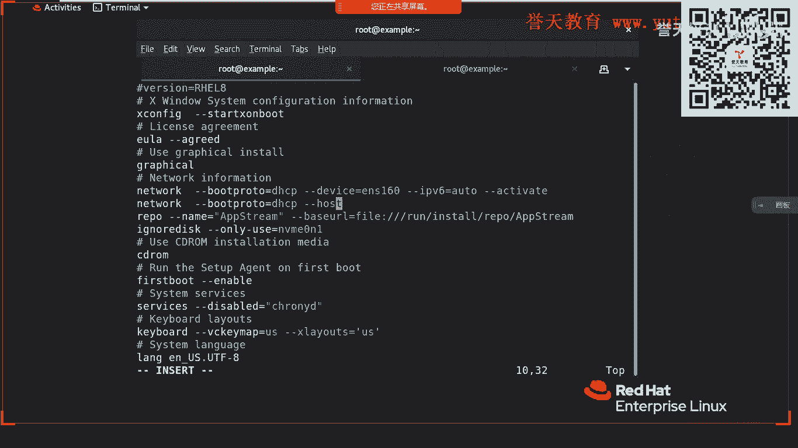

好。这个是我们的删除。那么除了这个之外呢，我们还有一个特殊的场景，就是要删除掉某一行，对吧？某一行啊，像这样子删掉某一行，比如说删掉network这个一直到HO这里这一行，那么可以怎么做呢？

就按两下滴滴。

怎么样？你看滴滴滴滴滴滴。是不按行怎么样？按行来删除啊，对吧？我们一行一行的来删除啊，就这样子一行一行的删除，这个效率是比较高的啊比较高的。那么还有另外一个场景。还有另外一个什么样的场品呢？

这个产品呢比较呃比较极端啊比较极端。对对对，这些你要用的多了就容易记住，否则的话你光告你死记硬背是记不住的啊。

还有一个是什么呢？比如说我要删掉十行，对吧？我要删掉十行，那怎么办呢？你看啊。哦，把行搞出来。好，我要删掉十行1滴滴。你看。😊，我按下U车厢。十滴滴，如果你要删掉十行或者删掉这个光标啊，往下面数啊。

就是你光光标往下面数，比如说我要删掉三行，然后就是删。第一。😊，你看是不是光标往下面数了三行，从光标这一行开始。那三行就被删掉了呀，它是往下面删啊，往下面删转以。如果你要删掉多行啊，要删掉多行。

你看可以在这里什么？输入一个数字啊，输入一个数字，然后按一下滴滴啊，按一下滴滴。那么我们这里还有一个什么，还有一个C，还有一个C是干嘛的？它是来用来什么呀？用来替换改行的，替换改行啊。

我们看一下啊用来干嘛，这个C啊。

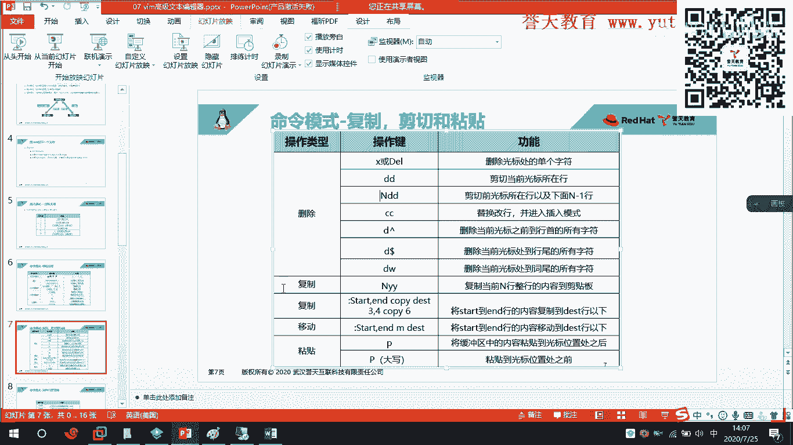

比如我这里IC。怎么样？你看到了吗？看到了什么样的效果呀？😡，我刚刚按S是什么呀？😡。

我刚刚按S是不是删掉了，好吧，全名。😡，我刚刚按S的时候，比如说我在T这里，我按一下S。它是3热7。但是如果按一下CC。怎么样是不是删掉一整行，并且进入了编辑模式。看到了吗？看了吗？

所以啊在这里啊我们按一下CC可以快速的删掉这一行，并且在这一行可以什么进行重新编辑啊，进行重新编辑，对吧？这一个用的场景还是比较少的，没有我们S用的广泛。因为用S的话。

它可能只需要改这个当中某几个字对吧？这一行当中某几个字符啊，比如说把A改成B对吧？把B改成C啊，这样的一些场景有使用到。好，这是我们的CC啊，这是我们的CC。那么你还可以看一下，这里还有个什么？

第一删除当前光标之前到函首的所有字符来，你看一下。

我往后面来啊，我这个右盘键坏了，所以我得跳到最后一行，最后一个支符啊。啊，我把它放到Z这里，好吧，我把它放到J这里。第一。看到吗？

来再看啊再看刚好。它是从光标前面的都删掉，我把光标放到G上面，放到G上面，然后我按下D，然后按下上箭头。怎么样？光标前面的一直上到了寒首吧，对不对？现在是不是一直上到了寒手？类似这样的还有非常非常多啊。

就是删除这里啊，删除这里删的行伪呀，对吧？你看什么W啊多了呀，对不对？好，这个大家下去过后自己测啊，我就帮你测几个啊。好，重点来了，在这里复制叫YY复制叫YYYY是复制整行啊，复制整行。

比如说在我们大家去做实验的时候，是不是有这样的场景，对吧？我们大家都是这样复制的，你们在做实验的时候啊。今天早上我在做实验的时候，大家看我是不是很快速的把那一行复制出来了。好。

那这个呢就是我去使用了什么呢？就是我去使用了YY来进行的一个复制啊，进行的一个复制。嗯。😊，这么久。好，大家看啊。我在上午在这里做实验的时候。

VMETCpassword对吧？我们按一下大G回到末尾最后一行对吧？最后一行好，在这里比如说我要复制对吧？我要复制这个这样一行啊，这个是张彦斌的张彦斌这个小伙伴们，我要复制这一行，那我怎么做呢？

你看我按一下YY，然后按一下P。皮皮皮皮，你看。一个两个、三个、4个、5个，我是不是就复制了5个，看到没有？张子表。按一下U就撤销按一下U就撤销啊。所以你看我是复制一行，对吧？YY啊。

使用YY来进行复制，这个一定要记住，这个马上就要用的啊。使用YY来进行复制啊。YY啊YY进行复制YY是复制一整行。如果有些教伙说老师，我就想复制多行怎么办呢？对吧？我就想复制多行怎么办呢？来，有办法。

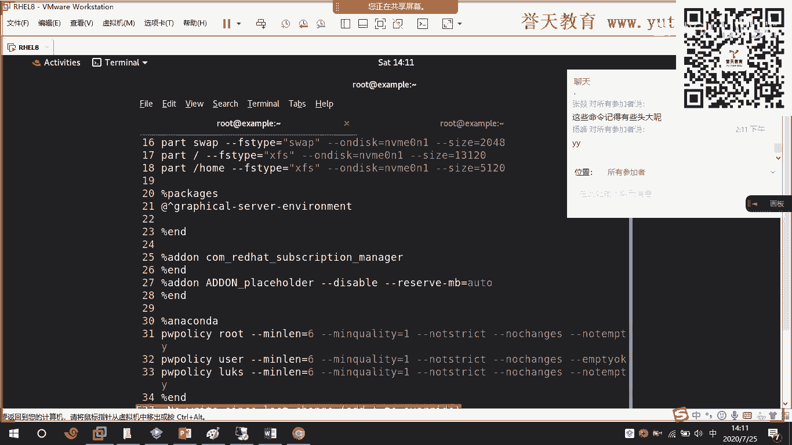

比如说我们今天上午的1点TXT。那么在这里我们看一下有多少行。有十二行对吧？有十2行，那么就12YY，你看它已经复制了什么，复制了12行，这个意思什么呢？这个意思说从当前光标往下面数十2行。

十二行的内容都复制。好，然后我按下P，你看。就是二十四行，看到没有？我再按一下P，是不是就粘贴，我按一下P，它就粘贴。看到了吗？你看我就把这十2行内容复制了两次，对吧？复制了两次啊哦，粘贴了两次对吧？

复制了一次，粘贴了两次。所以我要复制12行内容，就是12YY12YY啊，记住了。

好。那么这个场景呢是用的非常非常多啊用的非常非常多。当然我们还可以什么还可以在我们的这个这个退出模式下啊，也来进行复制啊，进行复制。比如说把某一行复制到某一行的下面，对吧？复制到某一行的下面来。

这个怎么做呢？在这里啊。

这个前面的序号怎么出来的？你是上午没有听呢，设置n啊。

完了完了，这你没听到你就上网啊，是不是？

好，来在这里啊。

我把它取消啊，韩航，你看啊，no number。看到了吗？Certaintain number。看到没有？就可以显示行号啊，显示行号。好，我现在要把我们这个第一到第六行的整个内容复制到第七行。

复制到第七行。那我怎么做呢？来一。逗号6copy。7。看到了吗？我现在把它复制过来，在这里啊。1到6行把它复制到了什么？我们7的下面。有看到吗？在这里啊。我复制了1到6行，把它复制到7的下面。

所以我就想占这条。这样子条啊，这是从第一行把第一行到第六行的内容复制到第七行下面，下面copy啊，复制到某一行的下面来。

这个非常有用。这里啊在这里啊非常有用啊。你这上午还加班呢。

好，所以啊这一条的话这条是便于什么呢？是便于你进行一些这个呃指定函的复制啊，指定函的复制好吧，但是这个操作的比较少啊，我更加喜欢用YY来复制，对吧？我可以直接往下面复制多少啊啊，用YY来进行复制啊。

进行复制。好，再一个移动啊，移动和刚刚的效果是一样的，我就不来演示了啊，在这里啊只是把什么把刚才的copy改成什么，改成M啊，改成改成MM，对吧？好，那么粘贴啊粘贴呢就是我们的P啊。

粘贴的就是我们的P啊。如果粘贴到前面啊，粘贴到光标之前就是大型默认的话就是粘贴到光标后面。

就这样子我来复制一下。嗯嗯。2点TXT吧。

生产担保。好，那么比如说我今天把这个二0行21行就是2YY对吧？我现在要把它复制到第十，它的前面，我就按一下大P。你看它是不是就把它复制到S的前面了，我把它复制到S的后面，我就按下小P。

对吧一个是向上扶子，一个是向上粘贴，一个是向下粘贴啊。一般来讲的话，我们直接按P啊，直接按P这个键的话就是往下面粘贴啊，往下面粘贴。

这个是关于我们的一个复制粘贴啊，一个复制粘贴以及删除。大家关于这一部分还有问题吗？大家关于这一部分还有问题吗？有没有问题？各位嗯。我们等一各两个小伙伴有问题吗？关于这一部分有问题吗？

我今我今天讲完了过后以后就不要看到大家这样操作啊。

以后啊你看啊这个唉老师说这行业删掉，你还在哎，一个一个删哇，一个一个删，好，好不容易删完了，对吧？W保存。是这样子。以后就不能这样子啊，就直接给我删掉一行，对吧？一行一行删来三四行十滴滴对吧？

删完之八行就是八滴滴删完了。可以吧。😡，以后就不要这样子，还给我一个字母，一个字母删啊，那删半天对吧？这个效率不高啊，所以这样的问题以后都不能有啊，都不能有，要强迫自己啊。虽然VM的这个件非常多。

你要强迫自己去经营。

尽可能就是。我我可以说啊，每个小白从刚刚的初学的开始，每个小白在我们的VM的世界里面，最早他肯定是在一个一个字母一个字母上。一个字母一个字母这样上啊，你你能够删掉，你也不要再样删，你给我用快捷把它删掉。

滴滴一整行删掉啊，删掉。

好。下面呢我们来说一下我们命令模式下面的文件的查找啊，这个是复制粘贴啊。文件的查找这个就是关键字的查找啊，关键字的查找。找观研测呢我们有几个方式啊我们有几个方式，一个是从上往下找，一个是从下往上涨啊。

从下往上找。

呃，我先把它退出，不要那容，不要掉了。VM2。TXD好，现在啊我用斜杠，我用斜杠，我找一个S啊，我找一个S，我找一个S。那么大家可以看到现在我是从哪里往哪里找？

啊，我用斜杠的方式找一个S的字母。我是从哪里往哪里找啊啊，各位。完了完了，这个不记得了吗？我刚给你看了。从来往来找。对，是不是从上往下面找啊，从上往下面找对吧？是从上往下找啊，如果是问号。

那就是从下往上找啊，从下往上走。

你看对吧？好，那么在这个地方。在这个地方啊你要注意啊，就是在查找关键字的时候，这个你查找到的关键字它会有多个啊会有多个。比如说AS对吧？S有多个，那么你此时呢。按一下N按一下N啊，它就会跳到下一个。

看见没有？防到。分辨率是被我调了。那么你看啊我按一下N，基本上的小N。看到没有？它就跳转跳转到下一个关键字，我按下大N就上一个啊就上一个。看了吗？往下面找关键字啊。按小恩是找下一个观理者。啊。

这个我给你看个具体的场景啊，我给你看个具体的场景，好吧，你这样子看着没有感觉。你这看没感觉啊，我打开一个配置文件，让你看一下。呃，我看我想要啊。

我想要这个我找个。好，来，我到这里来找啊，比如说我找个Slin啊，刚好在这个地方好多个Sin关键字啊。

来，我来这里找。我先按一个斜杠，按一个斜杠啊。我这个东方退出一下，他是不是。ED。看证明。S06。好，大家看啊，我先按个斜杠，在这个文件卷末尾啊，我按个斜杠。嗯，这个体育课堂的小伙伴看不到这个写账啊。

他那个。那个屏幕太大了，就是那个刚好录制的这个地方，就是共享屏幕，这个地方没有放出来啊，我把这个宽缩小一。下一个可以啊，能看到吗？可以吧，在这里啊在这里啊，你看我按你一个杠，按你一个杠。

然后我输个SN6。怎么样啊。没有吧。按照规则要稍等。在这里啊好，那么你看我按下N小N。再按一下小N，到时就来来到了第3个S一律师啊，按一下小N。第四个按大N就是往上面走。这样子啊往下面找上下找啊。

记住了。你在找的时候啊在找的时候。在找的时候，你要按一下回车键啊，在这个地方斜杠这里输入了关键之后，要按一下回车键。按一下回车键啊，它才会跳转到什么我们下面的字符里面去啊，否则你如果关按会怎么样呢？

我给你示示范一下啊。如果你关按，那么你就接着往后面再输，你要确定啊，你查到的是这个关键字，对吧？N它是往下面走往下面走。一般来讲的话，往下面找这个用的多一点啊，大N就是往上面走，小N就是往下面走。

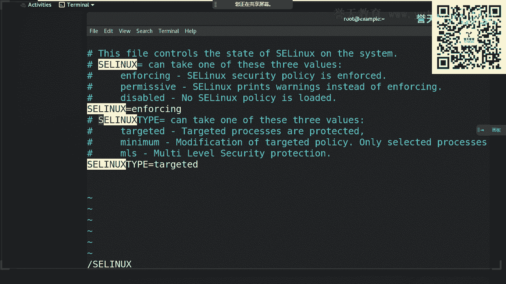

这个就不跟大家多说了啊，这个你用的场景多了就知道就明白。好，那么这个是我们的文件内容的查作啊，这个是在学服务的时候是非常有用的。这个我相信大家在今后一定会用的非常熟练啊，用的很熟练。好。

然后后面呢是我们的退出模式啊，我们的退出模式。我们的退出模式是怎么样的呢？退出模式呢要通过冒号进来，对不对？通过冒号进来，那么用的最多的就是什么？就是保存文件和退出。

所以我们在我们的退出模式下面是不是都是敲的WQ啊，W就是什么呀？s保存的意思对吧？保存的意思啊，我们的Q呢就退出啊，Q是退出的意思。所以现常来讲的话，我们敲的最多的就是WQ保存并退出啊，保存并退出。

对吧？啊，这个没有什么说的啊。那我这里还有一个另存为文件啊，另存为其他文件。我来给大家看一下啊，这个是在你按了W过后啊。

比如说2点TXT。然后在这里我们进入到什么？进入到我们的退出模式对吧？按一下W，比如将它保存到路ot下面的3点TXE，没有这个问题吧，应该。好，可以了，然后你就退出。退除后，你再来看一下，在这里啊。

在这里有没有3点电视，大家看。现在是不是就有3点TXT啊嗯。现在就有3点TXD。那么刚刚呢我们就通过W这个选项是吧，将我们2点TXD另存为了3点TSD啊。这是一种另存围的方式啊，另存围的方式。

好，其他的这个我就不用来多讲了啊，这个Q是退出嘛，然会保存对吧？那么我们还有一个就是感叹号啊，感叹号要放在后面，记住了，各位感叹号要放在后面，感叹号表示强制的意思。感叹号表示强制的意思啊。

比如说我们编辑我们的ETC销 down这个文件对吧？不知道大家有没有看到过ETC下单档这个文件，其实它是很奇怪的一个文件啊。

在这里，其实它是一个很奇怪的文件，ADC相当。大家有没有看到过EDC下了档这个文件怎么样？什么权限都没有，对不对？

为什么EDC下了档这个文件它的权限很奇怪的原因就是EDC下了档这个文件里面都是存储的我们用户的密码，所以如果有有任何人任何人能够有这个文件的权限，怎么样？那么我们系统里面的密码是不是就都不安全了呀。

对吧？就都不安全了，对吧？所有的人都可以拿到密码，所以我们在编辑EDC下了档这个文件的时候。我们在编辑EDC下拉单这个文件的时候，给它做了一个什么呀？是不是做了一个这样的操作，不知道你还记不记得嗯。

在这里啊做了这样子一个操作，什么样的一个操作呢？叫做WQ感号，这个叫。保存并且强制退出对不对？保存并且强制退出。好，那么还有一种场景啊还有一种场景。还有一种什么样的场景呢？

就是我们当我们写某个文件写错了，写错了。比如说我写了个2。TXD。哇里面写写了很多内容，但是呢我现在怎么样呢？我现在不想去保存这个文件了，我也不想撤销，对吧？我可能也撤销不了啊，有可能撤销不了。

那么现在怎么办呢？嗯，我肯定也撤销不了，那怎么办呢？那么我就可以使用Q账叹号强制退出不保存，强制退出。你现在看啊，你Q的话怎么样？他说这个文件已经什么，已经被写了，对吧？已经被改变了啊，已经被改变了。

它不允许你退出，对吧？好，那么其实你这得可以使用强制退出啊。在这里。嗯。哎，中文说入法。就可以使用强制退出来退出这个文件，而达到不保存文件目的啊，反证目的这个是保存和退出啊。我们来讲啊。

有感叹号就是强制的意思。

好，那么退出模式的查找和替换呢，我们这里也有啊，我们这里也有，就是我们大家知道在我们的这个word里面是不是有一个查找和替换呢，对不对？我们word里面有个查找和替换啊，这个在我们VM里面也有。

在我们VM里面也有啊。比如说我们要把某个字符串啊替换到。

替换成我们的一个就是新的字符。好，我们给来做一下。这个2。TXT。那么2。TXD呢，现在我们的光标呢在我们的这个第一个第一个上面，比如说我把这个第一个这个G替换成我们的这个呃Z好吧，怎么做啊。

你看啊我来做啊，我把G替换成Z，首先进入到退出模式，S是查找，你要找什么呀？我要找G，对吧？把它替换成什么呀？替换成大Z回车了，回车。什么呀？啊，各位。

现在我是不是把这个刚刚我们在光标这里的这个G替换成了Z啊，那很多人都有疑问，老师后面的G怎么没有替换成Z呢？怎么仅仅只替换了第一个？嗯。😊，怎么仅仅只替换第一个，因为如果你是直接用S来查找的话。

它默认是什么呀？

在当前行中查找的第一个字符，将它替换为什么？替换为我们要这个替换的字符啊，也就是说它只会查找当前行，在当前这一行中的第一个字符。对吧如果你加了基因，它就是在这一行所有的制度。

在末尾啊。来你看我重按同是替换。呃，我现在把它撤销啊把它撤销。好，然后来看S查找我查找什么呀，查找G，我要把它G替换成什么，替换成大Z，然后后面跟上G。现在刚才的这个G表示的是什么意思啊？现在这个G。

表示的是。我，还没想表田课长那位小伙伴没有写出来。后面这个G表示的是将我们当前这第一行当中全部利用。不是的，是当前这一行当前这一行乌梦看好了，我回车了，回车。好，然后你进来看。

你看是不是只有第一行的G被替换成了这样，第二行的G第三行、第四行的G都没有都没有被用完。都没有被提换。是不是？所以这条功能的话是这个比较什么呀？比较用处比较小的，比较小的，它没有做到一个全局替换，对吧？

全局替换啊，就像我们查找和替换的时候，是不是有全局替换了，对吧？所有的全部要替换，全部要替换啊。那么如果所有的你这个全部要替换怎么办呢？在这里啊，百分号表示全局对吧？百分号表示全局啊。

这个前面你是在指定的行啊，这大家下去过后可以试一下，这在指定行，我就不说了，一样的效果，那么我说一下全局这里啊，全局在前面加个百分号，后面加个I，后面加一个I啊，加一个I。

好。那这个怎么做呢？来，你看啊。我现在全局都要替换。打符号对吧？这个S查找查找什么呀，查找小G对吧？把替换成大Z，后面跟成一个G，跟成一个I全局开车。怎么样？现在看到了吗？

现在是不是所有的字符都已经变成了什么呀？都已经变成了大Z，对吧？现在我们所有的字符都变成了大Z啊，那么这个。这里啊也支持方向键啊，向上可以查找你上一次输度的命密。看到了吗？摆分后表示全局啊。

后面要接个I啊，后面要接个I表示全局替换。我们把全局这个文件里面所有的G都替换成了大写Z大写的Z啊。

好，那么这个呢是我们的这个在命令模式下面啊，在我们呃在我们的墨涵模式啊，墨涵模式下面做了一些什么呀？做的一些关于我们的文件的查找啊，就个字符段的查找替换啊等等这样子的一些操作啊。

这个查找将来大家在工作当中这个是一定用得上的啊一定用得上的。所以大家今天下去过后，一定要针对于这个文件啊，这个PPT大家要自己多练啊要多练。好，那么后面呢还有一些我们这个大家不是经常用的一些命令啊。

也是用的一些比较少的命令啊，比较少的命令。那么你你怎么做的呀？维护indux服务器，然后复制到windows的基术本做这些操作。这个你是你不是一个第一个这样干的人啊，你也不是最后一个啊，可以吧？

绝对不是的，这个地方这里又可以撤回。U可以撤回啊。是不是系统文件都是00，不是的不是的啊，肖红不是的，这里又可以撤回啊，刘佳琪。好，那么我们来看一下啊我们的这个可视化模式啊，就是对文本的一个选择模式啊。

文本的一个选择模式来，你看一下，我们使用V可以来选择字符啊，就给它做个标记，高亮标记。

比如说2点GXE。你看我们可以使着选择V。看到了吗？我按一下V就可以对这些字把进行标记啊，然后标记过后，我可以对这进行删除，是吧？你看OK。看到了吗？我刚刚把标记的全部给删掉了，我再来啊再来这小啊这下。

来，我在这里啊，我给它标记啊。我把行号导出来好吧，我把行号导出来，太快了啊。😊，这两个段线标记第一行啊，按下V标记一行、两行、三行、四行、五行、六行6，看到没有？我直接按滴滴啊，滴滴。

这么样前面六行不见了，我把标记的给删掉了。我把标志给删掉了啊。对吧。来，你看。刚刚我标记的是字符，现在标记的是行啊。你看我现在标记的是一行一行的啊。一行一行的，我是按下滴滴。全部干掉了，对吧？

按下义务撤回。来撤回。好。这个是标记啊，按V啊可以进入到标记我们可视化啊可视化。

这个没怎么用啊，这个用的比较少，它可以对列进行选定，看到没有？弹制加V，对列可以进行选定啊。比如说我们要选择这个低列，弹式叫V。

来。😊，看到了吗？还是加V。我说选择群的最低列。你看。😊，第列。😊，滴滴。😊，怎么样？哇塞，不得了，把前面第一列删掉了，看见没有？看到了吗？我把前面第一列删掉了，所以我们可以对列和行进行标记。

也可以对字符啊，也以对字符。那么小V是对字符大V啊大V是对我们的这个行，然后ctl加V是对一个列啊，是对列。

可以吧，在这里啊高量显示文档就是标记啊，标记出来的文本可以被滴滴拷贝，也可以被替换，也可以被搜索。也就对这一部分把它单独标记出来啊，把它单独标记出来。说到可视化的话，我这个一般来讲的话。

我还是更多的去把它选择叫做一个标记啊，叫做个标记。好，这里呢我们还有多行注释啊，多行注释，这一个老厉害了，这个特别牛，这一个特别牛啊。你看啊我们按一下我们的ctr加V进入我们的列边辑模式过后。

大家知道在我们的linning start系统里面，我们有很多这样的文件啊。

我们有很多这样的文件，什么样的文件呢？比如说刚刚大家看到的就是我们的EDC啊，我们的ss confirm啊，我们的SE啊，像这样子的一些文件里面是不是有很多井号啊，前面。这个井号表示什么意思呀？啊。

各位。这个井号表示什么意思啊嗯。有没有想过？我来看一下啊。对，这个井号是不是注释的意思呀？对吧？这个井号是注释的意思。对，是注释的意思。那么在将来我们大家可能自己也要写程序，对吧？要写脚本。

我们也需要去注释啊，也需要去注释。好，那我们怎么样做到一个快速注释呢？哇我研究了很久，终于发现了一个很好的方法啊，很好的方法。来，我们大家可以看一下，在这里啊，首先。

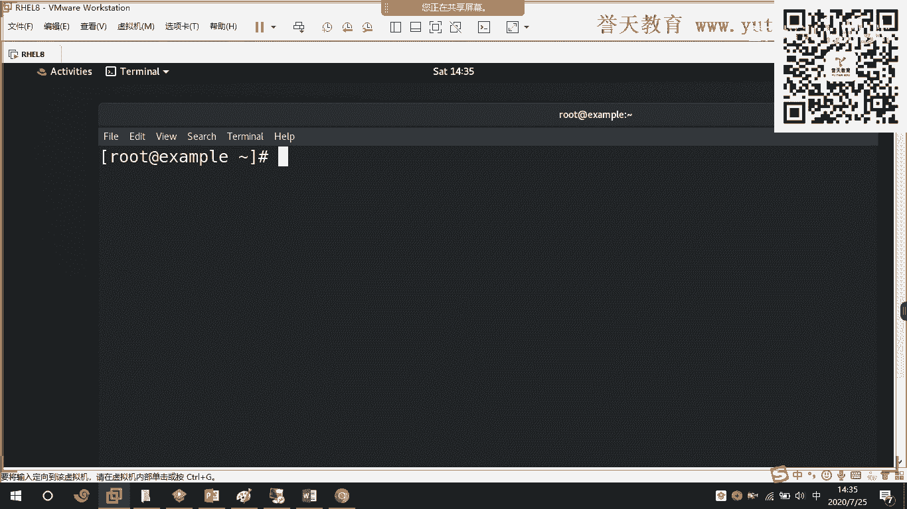

首先啊你按一下ctrt加V进入列编界模式，选中低列，选中低列啊，把低列给我标记出来，给我标记出来，标记出来后按一下大写的字母I进入插入进入插入啊，然后它就会你按个井号，它就会把这个列全部插入。

哇塞，老厉害了，我们来试一下啊。我们来试一下，特别厉害，看啊，我按下ctrl加V，然后我选中这一这一列啊。你看啊我选中这一列看到没有？是不是这一列我都选中了，然后我按下大写的I此时进入了插作模式。

然后我按一个井号。然后回车。怎么样？啊。有看到吗？有没有看到？那么在这一列里面，我把这一列前面所有的字符都给加上了什么？加上了一个井号，加上井号，我撤下啊，再来啊，再来看好啊，看好我是怎么做到的哦。

我怎么做到，我的光标现在在第一个啊第一个我按下ctrl加V进入可视化模式。进入可视化模式，然后往下面当翻翻翻翻当。对啊我把这一列标记出来，我把这一列标出来，然后按一下大写的I进入编辑模式，进入编辑模式。

你看我也可以把它放到G的前面，到这里按一个井号。然后看好啊看好，我按一下ESC。哦，不行，但他必须要在第一行，因为我记得是可以到第二行也可以的。因为第一行是空行，这样子我把第一行删掉，我把第一行删掉。

台就加V来，我给他标记。我的标记，然后我按一下I，你看那默认是不是来到第一行呢，还不能够随便选一行啊。来，你看我按一下井号，然后ESC。怎么样？是不是这个标记了啊，这个要到第一行。

就把它跳把它跳转那一行啊，它默认是调到第一行，可以吧？这个用来批量注释。哇塞，这个特别牛特别牛啊特别牛，这个我特别喜欢。这个我特别喜欢，真的这个特别喜欢，特别好用，这条特别好用啊。

今天又教了你的绝招是吧？这个以前我的PPT上面都没有，这个是我后来自己教的。这你看我把这个步骤都给你写出来了。

看见没有？我把步骤给你写出来。😡，这个你必须要学会将来你写什么笑，写什么拍呢？老厉害了，可以吧？颜色看不出来怎么都是摆设啊，因为没有语法，没有语法。那你看啊如果我写个语法进来，它就不一样，它就变色了嗯。

嗯，这个样子。你看我这里啊，我写个余码它就变设进感叹号。诶。😊，我看一下啊。对你是在windows下面做的是吧？可能是这个我们后面这些制符啊，还没有语法。

来我全名啊。请感叹号。你让它变颜色哦，我关了，然后重新打开。看到了吗？嗯。看到了吗？现在是不是就有颜色了呀？因为它没有语法啊，第一次打开的时候，它没有识别到那个语法，没有格式。

就是我们系统里面匹配的这个默认的一些语言的格式啊，它没有找到，它没有找到啊，所以就没有颜色啊。就认为你是默认的一个文本，就直接是白色，对吧？你看这下面就直接说是白色的啊，就是白色，默认它是个文本。

可以吧？所以啊这个叫批量注释，这个叫批量注释啊。

特别好用啊，可以吧？截图了吗？这个要保存下来啊，这以后我跟你讲，我给你拿100行给我注释，给我注释掉100行，那你完蛋了，你自己想这我每一行对吧？如果不教你这招，你要注释100行，那么你就这样子啊。

来老师说第二行注释来光标。到前面来给我加个井号。啊，来加个井号加个井号。还好，今天这只有几行，明天给我来个100行，200行，我看你还加不交。😡，啊，这周我就出这个作业啊，我看有没有小伙伴是这样子干的。

给我把500行标记出来，全部给我井号注射掉。我看你是不是一行一行注释啊，是不是你手工来注释？可以吧。😊，啊，这个很有用啊，所以将来你这一定要什么呀，你这一定要养成这的习惯啊。

🤧嗯。好。那么除了这个之外呢，除了这个之外呢，我们还有一个多窗口模式。还有一个多窗口模式啊，这个是VVM的几个几个绝招啊，几个绝招。这个网上一般都找不到的这是VM的几个绝招啊，很有用的几个绝招。

那么你来看啊。这个是。在这里啊多参考的模式在这里啊怎么做啊怎么做分割屏幕啊，横向分割怎么回事啊？横向分割怎么回事？这里一定要按正确，否则的话这个VM就会好，结果呢它就会那个镜子就会挂起啊。

就hold住了，它就不动了，那个文件就不动了。来，你来看我我来怎么做啊。比如说我打开二点TX图。

比如说我现在要横向分割屏幕，横向分割屏幕，我就按一下cttrorl加W，然后再按一下S。怎么样嗯。可以吧，那么在上面是不是就出现了？下面是不是也出现了，对吧？😡。

那么下面呢就是我们刚刚前面刚刚前面出现的什么呀？我们的第几个文本呢，第一个文本的一个副本，一个对照的一个副本啊，一个副本。所以你看这个地方可以对屏幕进行分割，进行分割啊，可以用来对照。

你们不是这样子干吗？你们在修改这个配置文件的时候，有一个疑问，很多人都跟老师讲，老修我这样一个疑问。如果我现在把这个地方的A或者F把它改掉了啊，说哎这个我手这个一抖，完了，把F改成了V。把F改成了V。

等一下，张志涵听我讲，把F改成了V。那么他说老师我忘了，我不知道原来改的是什么。我现在好像好像觉得这个地方改错了，我要把它改回去，但是我已经不知道是什么，对吧？我说我已经不知道是什么，那怎么办呢？😡。

那么你看啊我首先按一下ctrl加W，首先啊先按啊先按cttrol加W，然后再按S。

记录下来这个地方。这张不是我写的，这张是我后来加的，你们的PPT跟我不一样啊，可能跟我不一样。这个是我后来自己加的啊，先按ctrl加W再按S啊，再按S看到没有？看有看到吧啊。在这里啊有看到。好。

那么这个呢就可以通过文件来进行什么呀？进行对比。进行对比啊，这个特别厉害，可以吧？来，我今天把F改成什么呀？把钥给改掉，对吧？你看都会有啊。😡，好。那么除了这个横向分割之外呢，我还有什么？还有纵向分割。

还有纵向分割啊，比如说VM2点TSD，然后我按一下ctrl加W，按按一下V。对呀，是不是左右啊，看到了吗？😡，是不是将它分割成了两个屏？可以吧，这它分隔成了两个屏啊，这个用的很少很少。

这个在我的职业生涯当中几乎没有用到过。除了我上课给大家讲到过这个例子之外啊，在我的职业生涯当中，我几乎没有用到过用VM去分割屏幕啊去分割屏幕。这个用的很少很少。

但是这个如果在一些这个修改一些比较重要的文件的时候啊，你可以用到，你可以用到，好吧。好，那么如果仅仅今天如果仅仅只去教你这个啊，仅仅只是去教你这个，我觉得这个怎么样呢？

还是怎么样？还是不够让你去对VM去有崇拜，有崇拜之心啊。那么今天呢我还会教你一个什么呢？还会教你一个在同一个窗口怎么打开其他的文件。哇塞，这个老厉害了。对，可以可以混用可以混用啊，一个是横向。

一个是纵向分割屏幕啊。好，那么这个打开文件怎么做呢？来，你看好了啊。

VAM1。TXD我现在在1。TX里面，我要打开2点TXD冒号进入退出模式SP跟上root下面的2。TXD。回车。怎么样？😡，你看到了什么呀？😡，有没有看到屏幕分割效果？看到了吗？在上面是不是我们2。

TD这个文件。😡，啊，在下面是不是硬件TSC这个文件？😡，你们看到唉，我又跑到下面来了，我又跑到下面来了。😡，有看到吗？我又跑到上面去了哟。😡。

这一切都是我按快捷键做到的这一切都是我通过按快捷键来做到的。我怎么做到的呢？来，我现在打开了两个文件，使用VIM打开了两个文件，上面的2点TXD我可以对它进行编辑，下面同样也可以啊也可以。

比如说下面这一行。那么我现在想把这个一。6X里面的第一行的这个一给删掉，可是鼠标下不来，不光标下不来。你看我方向键一直在往下面按啊，往下面按，因为我们大家都是远程，大家看不到我的键盘操作。

所以这个只能够通过我通过我的讲述来来理解啊。你看我现在键盘往下面再按啊，怎么样，我的下方间键是好的。来动不了吧，不能下来吧。那么你现在需要按一下cttrol加W。然后再向下发现键向下。

你就可以来到下面一个文件进行编辑。进行编辑。你看这里同样要退出两次哦。要推出两次可以吧？好，这个啊是我们的VIM里面，如何在里面打开另外一个文件作为参照。作为参照，比如说你在某一个配置文件做了备份。

做了备份，那么你改制改的的时候改觉改错了，你就可以打开另外一个备份的文件去参考。去参考。所以我说屏幕分割的时候，在这个地方用处非常大，用处非常大啊。可以吧。这个地方可以用相对数径。

只要你能够找到这个文件啊，刘佳琪只要可以找到这个文件，就是没有问题的，好吧。对。好，那么今天只交这个给你啊，今天只交这个给你，我觉得这个我太不够意思了。

这个我还想叫一个其他的绝招啊。这个已经没有了，对吧？PPT已经没有了，我而且我还有其他的绝招，你们想知道吗？啊，想不想知道想知道的小伙伴敲个一。😡，嗯。😊，如果只交PPT上面这个内容。

我觉得这个太没意思了，对吧？你看一下PPT就可以自己多多的去练习啊，去练习。你看这个PPT就没有了啊。

那么今天呢我们还要教大家一个举招。我们来一起看一下，好不好？2分钟的时间来一起掌握一下。我使用VIM打开1。TX1，打开2。TX1。我问大家现在报不报错。报不报出，我问你我回车能不能打开这两个文件？嗯。

😊，各位。😊，你觉得我回车能打开这两个文件吗？😡，好，其他小伙伴呢？不怕错是吧，其他小伙伴呢？😡。

好，来家看好了。那我你我打开的是哪一个文件，我回撤了啊，回撤了啊，控制不住了啊，回撤开车。😡，怎么样？😡，我打开的是不是第一个呀，你看我第二个文件呢，我看都没看到。😡，对吧我第二个文件我看都没看到。😡。

那是不是一个没有？😡，一个没有来，我退出。😡，我在进行做了编辑嘛，我就出好，你看。两个文件什么呀？编辑完了呀，编辑完了，我根本就没有对第二个文件编辑。😡。

那么各位VIM能不能同时打开两个文件？我想问一下大家，VIM能不能同时打开两个文件？好，今天我交给你。C边在说不能见鬼了，不能呢，看好了吗。😡，减O减O看好啊，一点TX12点1X1回车。

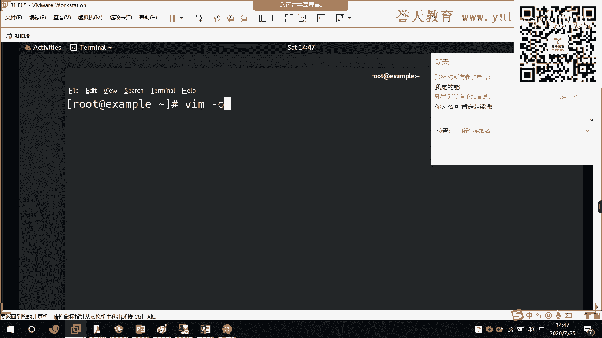

怎么样？😡，竞证奇迹。为什么我刚刚要教你分割屏幕啊？😡，我给你补充一个知识点啊，来。我是不是打了两个文件？😡，看好了再看哦再看哦，不要眨眼哦不要眨眼哦，VM捡到哦。😊，1。T1。2点TXC回球。

咦什么鬼呀？😡，左边是1。6个1来右边走。完了完了，我的右发译器是个坏的，这我我过不去啊，不是我的操作过不去啊，是我的键盘过不去啊，它不配合。哎，我好像过来了。这个哎，我过来了我过来了。来在这里哦。

可以吧？来我按一下砍住一下WA一回来。可以吗？😊，那我问你，我们把这我把这个箭筑给抠了啊，我把我的右方向键给抠了，等下拍个照给你们看好不好啊。来退出小写啊。

可以吧。啊，现在明白了吗？减O是什么意思啊？😡，嗯。😊，现在减欧是什么意思呀？😡，减O是分隔屏幕啊，减大O是横向对吧？对吧？减小O是横向，减大O是纵向。减大O是纵向啊是纵向。可以吧。好。

VM可以打开多个文件啊，可以打开多个文件，没有问题。你可以看一下它的帮助啊。

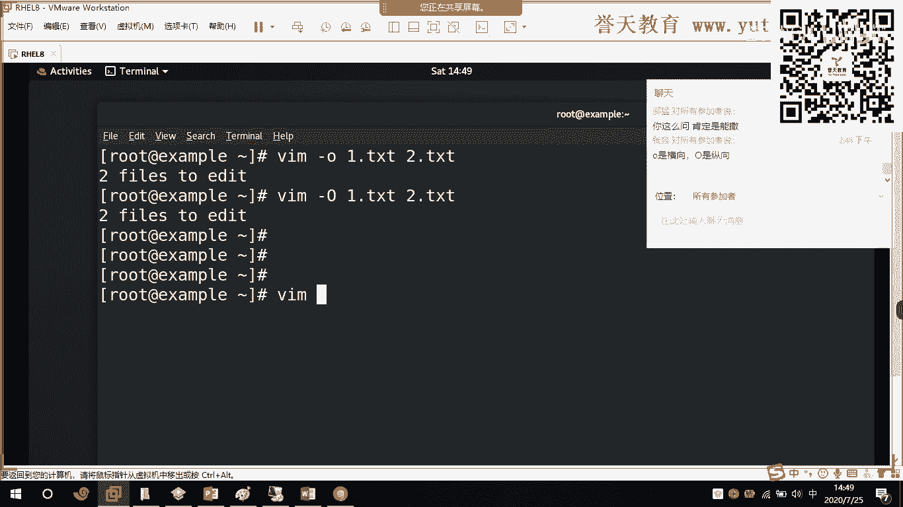

你可以看下的帮助。来这聊哦。我倒的慢慢做啊，我说翻翻页子没用啊，对吧？这是你可以看到的帮助啊，特别特别多。特别特别多啊。好，那么这个呢是关于我们VIM的全部内容啊，全部内容好吧。

这个是关于我们VM的全部内容啊。一般减欧的话，它会跟另外一个选项就是。

减O后面会跟上我们的N啊会跟跟上N。比如说一点TXB2点TXC3点TX你觉得这样子可以吗？啊，各位。对，张志霞，你觉得这样可以吗？你们觉得可以吗？我打开三个文件可以吗？N代表的是后面跟着文件啊。

你跟哪几个，这个可以不写啊，默认可以缺省，所以一般减O直接减O就可以了，来打开。你看这不123呢。这个我目前还没有测试到文件的上限啊。这个我没有去测出来文件的上角，你看多打几个。应该可以。这个还有吗？

来一看我现在打开了几个文件了，我打开了。

一个、两个、三个、4个，大概有5个，大概有5个都没问题。那再退出5次。看到了吗？减N啊，这个地方如果你接多个文件的话，你看能不能不用减N啊，好吧。可以啊，可以不用剪，检验是缺损的啊。

我这个是可以不用剪的。好，在这里啊减O啊，好吧，至于是大O还是小O，就看你们个人的使用习惯。

好，这个以上呢就是我们的这个。有没有对比两个文件的不同？乔永红马上讲这个马上就要讲这个。可以吧？马上就要讲这个啊。好。那么这个呢以上呢就是我们的VM啊，关于我们的VM的一些这个使用啊一些使用。啊。

稍微我把这个PPT发给大家，我这个PPT上面有些改动啊，和原来的那个你们拿的可能不一样啊。好，那么接下来时间呢我们来看一下下面一章。我们来看下面一张。这个。处理工具这一张是非常重要的啊，也是比较难的。

这一张是我们linux比较难的啊，可以说是linux的精华。这个制符处理啊。制服处理啊可以说是我们link的精华啊，这个是精华所在。好，那么今天呢我们会学到这个这样子的几个文本的几个处理工具啊。

几个处理工具。然后有我们的这个文本的提取啊、分析啊以及操作工具啊，操作工具。好，首先我们看一下我们文本的这个提取的工具啊，提取工具，比如说我们的cat对吧？我们的more还有和什么和我们什么和我们的。

这个head呀t啊，gra啊ca呀等等，这样子啊，一些都有。那么这是我们的文本的提取工具啊，提取工具。好，我们来看一下我们的第一个cat对吧？第一个cat啊，它可以怎么样呢？

它可以将我们的这个文件的内容啊，可以全部怎么样，可以全部看到，对吧？可以全部输出啊，可以全部输出到屏幕上。你看它可以打印一个或者多个文件到标准输出到标准输出啊，什么意思呢？我们来看一下。

来在这里比如说cap1点TXT2点TXT回车。那么你看啊我们这个地方是不是除了一。0习内容之外？你看我们除了1点T应用之外，还会有2级T要。我把这两个文件呃给删一下，比如说一个是1点T。第二个是2。

TXD。好，来看。看一呢就是二点就是一回车。你看我们是不是可以同时查看到这一个或者多个文件的内容啊，对，一个或者多个文件内容啊。好，那么同时呢我们的ca呢一般来讲呢。

会在我们这个系统里面用的频率是比较高的，它主要是用来查看这个文件的内容啊，用来查看文件的全部内容啊，全部内容记住了，它是用来查看全部内容啊，拿到还有其他的工具可以查看部分内容吗？当然是有的。

我们就来一个一个看嗯。

好，我们还有一个默啊，我们一个默，我们的默是用来干什么的呢？叫分页浏览，还有我们什么我们的list史啊，我们的list和什么，它也是用来什么呀？用来分页浏览啊，分页浏览。那么它用来怎么分页浏览呢？

就每次只看一页。比如说我们的慢帮助啊，我们的慢帮助。

来这个里。呃，我们慢一下LS。那么大家现在可以看到，我们在这里呢在屏幕上面的当前呢就是一页啊，就是一页。比如说我按一下空格键对吧？按下空格键可以往上面什么，往下面去看下一页，看下一个部分你下。

你看是不是可以看下一个部分呢，我是一页一页翻读，看好了哟，我是一页一页翻读。有看到吗？我翻页了哦，我先翻页哦我在翻页哦。你看到吗？这个不是翻页的，这就是我在往下往上放啊，往上放啊。

我们的配置up和配置蛋对吧配置蛋下一页配置up是上一页，看到没有？我是翻页哦，我是一页一页看的，一页一页看的。那么我们的这个more和我们的什么和我们的list进在干嘛呢？就是来分页查看文件。

比如说一个文件的内容过多，我们一次性看不完，我们使用cat可能看不完。比如说我们的历史记录，对吧？我们今天这个地方历史记录啊，今天挑这么多应该有很多历史记录，在这里。

我们使用cat看一下点bus下划线history。那么你看。像现在这里我们这个是不是已经远远的超出了屏幕呀？你看我们现在是在文件的末尾啊，那么这个文件的第一行是什么内容呢？我们大家就不知道对吧？

就不知道。那么此时呢我们就可以使用什么呀？使用我们的末来查看末点buss。History。

回车，那么你看。现在默展示给我们的是不是指么样？一页呀，你有没有看到默现在给我们的是什么？是一页，对不对？是一页啊，你看啊。😡。

来，我翻页了，我刚我刚按了一下空格键哦，往下翻了一页啊，你看我发到了27%。我发到了27%，我按一下配件啊。好，那么我再如果往下面翻的话。起来。😊，是不是意直到这个文件要放完呢？😡，要发完了。

所以我们通过默可以来分页查看文件的内容啊，一页一页的它查看啊，一页一页的形式。

大家有，通过默来分页查看啊，我们的历史什么？是一样的啊是一样的啊。

好，这两个大家一定要注意，这两个用的频率比较多啊比较多。对，t还可以这个来对文件进行这个追加啊，也是可以的。可以合并多个文件，把多个文件合并成一个文件啊，也是可以的。好，这个呢是我们的分页查看啊。

我们的分页查看啊每次只浏览一页内容啊，同时它也支持我们VIM的一些命令啊，一些命令。比如说搜索呀对吧？比如说搜索你看。

默不行啊，默好像是不能够用文来直接编辑的。

因为我很少在默下面去直接编辑内容啊。好，我看一下。Pトル。我看一下。他能不能够进入VM啊？我觉得历史是可以的。可以啊可以啊。大家看啊，我现在在墨前面啊，我也可以起到编辑文件的内容。

你看我现在按一下V进入VM的编辑模式，看到没有？进入VM的编辑模式。那么在这里按下I，我就可以进行编辑了。看到了吗？各位。我就可以进行编辑了啊进行编辑了。还可以端进什么进行保存，看到没有？

还可以端进行保存啊，都是可以的。还可以搜索关键字。Buss。History。还可以搜索关键字啊，比如说索P对吧？搜索SE。你看都是可以搜索啊，都是可以搜索的。它支持关键的搜索。嗯，可以按Q退出啊。

好，这个呢是我们的文本啊，是我们的文本的一个查看的工具啊，一个查案的工具，一个叫mo一个叫list史，一个can对吧？有个cap。好，那么我们文本的过滤工具了，对吧？我刚刚已经说了。

使用ca可以查看到文件的全部内容。那么我们还可以查看文件的部分内容啊，使用head和什么hotelhead和tel来查看文件的部分内容。好，我们现在使用head来查看一下。

使用hat来查看一下啊。Havead。点buhistory回撤一。什么意思呀？各位，你们看这是什么一个情况呢？嗯。😊，这是一个什么样的情况呢？啊。什么情况？完了完了，真没看出来。这是什么情况呢？

我们现在只看到一行、两行、三行、四行、五行、六行、七行、八行、九横、十行。对不对？只能够看到前十行。对，只能够看到前十行。那么我要想看到前二十行怎办呢？啊。各位我想要看到前二十行怎么？

我只是拿这个文件来举例啊。嗯。我想看到前二十行怎么办？😡，好，来，我们来看一下啊我们来看一下。Have。减N20。跟上点buspasr。回车。来，你看一下。是不是？啊。

是不是20啊？好，我们不是学了一个命令叫cat吗？我们来看一下cat有个东西可以显示行号。我们看一下开了有个东西可以显示行号。啊，叫减N啊减N。比如说cat减N。点bus。hory维车。

你看这个文件一共有136条命令的这hory这个文件一共有136条。那么今天来我们使用。管道还记得吗？各位。😡，我们学了管道吧。Had。买车。怎么样？我是不通过ca输出了这个文件的所有内容。

并且在前面给它加上了一个行号，然后把这个输出的结果丢为了什么head来什么呀？来过滤来过滤的时候，head默认过滤的是多少呀？

是不倒数的不不是不是正数啊，正数的前十条对不对？那么你看啊我想看到第20条怎么办呢？减N20可以吗？回车。

这是不是这个文件的前二十行？

可以吧？那么现在我们的管道用上了，各位管道来了，管道用上了。在这里啊。可以吧，管道给你用上了啊。😡，现在聚精会神了啊，各位越来越复杂了，我越来越复杂了，等一下你就又开始哇塞，这怎么搞的呀。

真的谈一条命令，什么鬼都不知道。现在聚精会神啊，看好了看好了，越来越重要了。那么这个是pad这条命令是用来查看文件的前十哈默认啊默认。那么我说了授人以渔，不如授人以渔对吧？来，所以你的单注来看啊。

它有很多很多的作用。你看减N是不是查看多少行呢，看到没有？减N是不是可以查看多少行，还可以查看字节，有看到吗？还可以打印出字节，看到没有？很多很多啊，对吧？很多很多啊，你一定要学会查看班助。

因为我只能够把最常用的交给你。好，所以通我们通过head这条命令，head这条命令来查看文件的前多少行，默认是死行啊，默认是1行，可以吧？好，那么学会了查看从文件前面往后面看。

那么我还得教你从后面怎么往前面看。来回来同样这两个命令cap。点bush我们的历史记录这个文件啊，history对吧？好，我们先接上我们的这个这个行号，减N啊，接上行号回车。好。

大家看这个文件有136行。那么这136行。

来，你看啊。我如果仅仅只想查看到末尾的时行，那么我可以使用tll，使用t这条命你管道啊。你看是不是127到136啊，刚好是我们末尾十行呢。那么我想要查看到末尾的二十行呢？你觉得可以吗？

你觉得这样子可以吗？各位。😡。

和我们的head是不是一样的效果呢？是不一样的格式命令呢？可以吗？这个可以吗？可以的小伙伴敲个一，感觉可以吗？嗯。😊，感觉行不行？感觉可以啊，你们感觉可以啊。好，来了来了来了，传车咦。

嗯。😊，可以吧。你看。😊，说20行。好，那么这个我除了交给你之外喽，我还要交给你一个绝招。

这个真的是绝招啊，看好了啊。都要会别人所不会，对吧？你出去责任你才能够更厉害啊更厉害。来，今天我要教你一个绝招是干嘛的呢？今天你已经知道了，tll必须tll是什么？可以查看啊，我给你请一下啊。

这两个这两个比较好用的啊，一个叫汉，对吧？是查看文件的前十行啊。对吧前十行，那么我们的t呢是查看文件的后十行。后十行最后啊最后十行。默认了默认了是这样子的。😡，好。那么今天呢我还要教你一个绝招。

这个绝招招叫tell减F。这个绝招用来干嘛呢？用来实时查看。文件末尾追加的。🤧内容。😡，用来实时查看文件末尾追加的一个内容。那么这个有什么用呢？对吧？盲木连机知道了啊，这个用来干嘛呀？用来查看日志啊。

这条命令用来干嘛呢？用来查看日志，查看系统的日志。查看系统的认识。好，来，我来给你做个实验，我来给你做个实验啊，它是怎么样去实时的去查看文件末尾最加的一个内容。

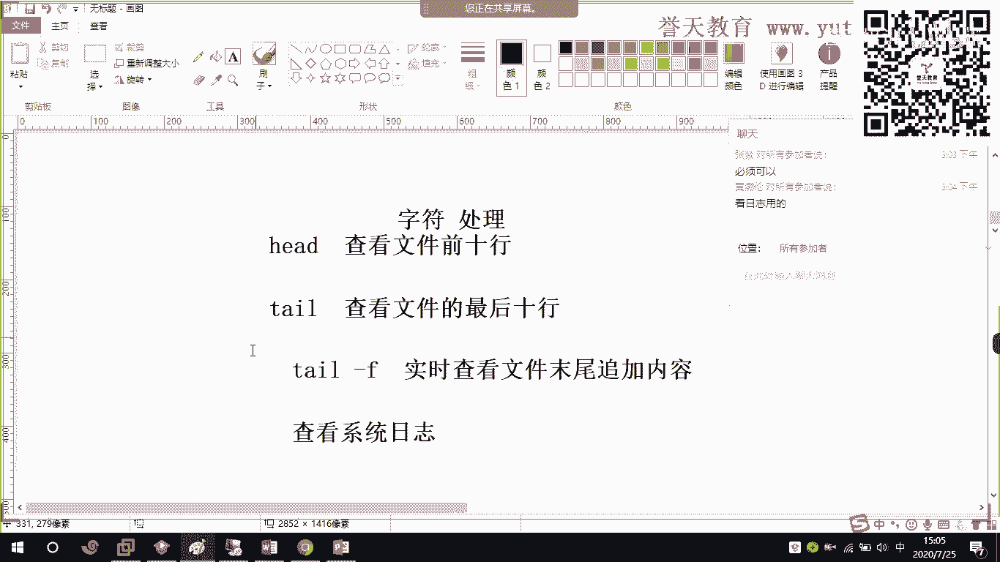

今天我用tll打开1点TST。减F啊。减F1点TXE回车，你也可以看到啊，各位你们大家可以看到啊，屏幕并没有结束，看到没有？屏幕并没有结束，我还可以往里面输。

来，我切换到另外一个这个虚拟控制台。好，那么在这个工程栏里面，我使用一口管里面输一我追加啊我追加。1。天C还车。看好了。🎼什么鬼呀什么鬼呀，你再一看啊11111。😡，什么回事啊？

我这个地方怎么会实时看到这个文件发生的变化呢？我怎么看到这个文件里面正在写什么内容呢？😡，所以tll减F，它可以实时查看到文件内容所发生变化，也就是最后新增加进来的内容。能明白吗？

所以我们用它来通常用它来查看日志。通常用它来查看日志。所以现在你应该明白为什么在网上面你们看到很多这样的命令，对吧？你们在网上面应该看到很多这样的命令来，我给你敲一把。tll减F对吧？今天上午我也敲了。

给大家看啊one log message。来，大家是不是再往上面看到很多这样的内容啊。😊，哇塞，这个内容你们头痛吗？这个千万不能头痛，这个一头痛就完蛋了啊。这个后面我们有一专专门讲日志，我会告诉大家。

为什么这个地方是我们的这个日志级别啊。啊，这里还没有出啊。还没有出啊，因为这个是警告嘛。好，那么后面我们会专门有一章来讲日志，这些是什么鬼啊？这些为什么在3点06分发生了什么样的事情，对吧？

这个今天我们发生了什么样的事情，对吧？它发生了一个警告好。那么这个就是我们系统日志，它可以接受到系统服务的一个这个情况啊一个情况。比如说我现在几个网卡带掉一个网卡，比如说if doneENS160回车。

来，你看。你现在应该知道为什么我在这里画条线了吧，各位。😡。

我在这个地方画一条线，是为了干嘛？😡，啊，各。我为什么要在这地方画条线呢？😡，我为什么要在这个地方换条线？😡，我需要你告诉我为什么我在这个地方换条线。😡，嗯。😊。

我是不是为了看接下来这个文件新增加的这一部分内容，也就是说这个线以前面的内容都是系统这个输出的信息已经输出了的，后面的是不是都是我想要看到的信息？对吧，都是我想要看到的信息。

所以我们tll减F通常用来查看我们的日志。通常用来查看我们的日志啊，现在应该知道为什么他可以看日志了，就是因为它可以实时看到这个文件的变化，你看这个文件的变化，我完面写了2。第一点T心。没事。哎，你看。

二是不是么就进来了呀，又进来了呀，看到了吗？所以啊我们可以通过什么通过我们的pa减F来实时查看到我们这个文件的变化啊。这条记住了以后你天天都会用到，只要做lininux这条命令你肯定是会用的100%啊。

除非你这个账伙。这个不是散进啊，不是进取，对吧？每次遇到问题都去找别人解决啊，你自己不想解决问题，那就永远都用不到。

嗯。😊，好，那么这个呢就是我们的head和thead是常在起始的时场，看到没有？在这里啊。可以吗？可以显示指定显示的行，对吧？比如说指定显示20行，显示50行都是可以的啊。好，在这里啊。

t要减F啊减F和减N啊。好，来这个就来了啊，这个就非常有意思了，叫grab对吧？grab用来干嘛呢？grab用来提取文本。grarab是按含过率啊，按照文件的含过率，它说打印匹配的文件的含或者标准输入。

什么鬼意思呢？来。

比如说今天我要过滤一下我们系统里面这个用户名是root的这个用户到底有多少个？大9多个。啊，比如说我过滤一下我们系统里面这个关于root的这个关键字的这个用户或者这个文件啊。就这样子个re。

g位 rootot后面跟上ADCpassword回车。那么大家可以看在EDCpasword这样子一个文件里面，以root包含root的这个行，一共有两行，一个是这行，一个是这行。各位看到了吗？

所以grape它是以含过滤，请你记住，它是以含来过滤。也就是说，如果这一行里面包含它的关键字，那么它会把这一行的内容全部输出。全部输出。来，举个例子。2点DC。嗯，好。啊，我想一想啊，比如说。

这个123。这个。135对吧，26。啊，这个147啊，我随便输个。我现在过滤一下gpe。过滤一下啊。这个关键字是我们的2点TSC这个文件。你看。😊，所有包含二这个关键字行是不是都被列出来了？

12326和2点TC。多不列手啊，它是以寒来过滤啊，以含来过滤。

好，那么。还有一个就是过滤的时候，如果像我们现在这里，我们不是刚刚里面有个文件叫SElinux吗？比如过滤一下linSElinux。

S你的那个手啊是我们的EDCs。看风格S Linuxux这个文件回车咦，没有啊，见鬼了，S Linux没有啊。那么此时你先看一个选项叫减I。

来。😊，你发现了什么呀？怎么样减I用来忽略你要过滤的大小写。这一条非常非常有用。😡，各位。😡，为什么我说这一条非常非常有用呢？因为在我们很多时候去修改文件的配置文，修改我们服务的配置文件的时候。

我们根本就不知道在我们的这个文件里面。这个我们需要的这个修改的这个配置项，到底这一行是大写还是小写还是小写。所以我一般去过滤，我要修改配置文件的时候，我都会接减挨这个选项。因为不管它是大小写。

我都会知道的，我都会知道的，可以吧？所以减挨这个选项是你一定要记住的，一定要记住的，可以吗？所以对黄渤人特别棒，所以groupre这个过滤关键字的工具，它是区分大小写的。

区分大小写啊，你看我们刚刚小写就没有收到，对吧？因为这里面都是大型，这个里面都是大型。你看我现在忽略大小写是不是就收到了呀？

可以吧？为什么我把它放到第一条啊？各位为什么我把它放到第一条是有原因的是有原因的，可以吧？😡，好。那么除了这个之外啊，我们还可以什么？还可以这个用来显示这个匹配的内容，并且把这个我们匹配的函数打印出来。

好，我们看一下可以看一下减N哪，减O啊减C这些选项啊，我这里来看一下减C图选。呃，我过滤出来看它是多少行啊。

在这里。健身。怎么样？这个是什么意思呀？嗯。😡，这个八什么意思？😡，这个包含这个关键字函数，一共有8行。一共有八行一共有八行啊，这个比较鸡肋啊这个比较鸡肋。呃，你可以看一下前面这两个。

只显示匹配内容和打印匹配的行号减N。

来。😊，它就会这里啊，帮你把这个行号显示出来，行号显示出来啊，这个行号显示有什么用哦，我刚刚在VM中里忘记讲了一点啊，忘记讲了一点，就是那个指定行跳卷。这个这里啊在这里跳跳转的时候啊。

呃。对呀，比如说我想改第七行，我想改第七行啊，我用BM打开过后按一下，退到墨行模式，退出模式，在这里按个7。回车，你看它就可以精准的跳到低吸哈。来。😊，一。😊，哦，已引跳过来了，这是里，看见没有？

第七行啊，第七行我是可以把它改掉，对吧？比如说改它改成disable。把它改成besable，那么就关掉了S news啊，就关掉了S list。所以啊这个是比较有用的啊，但是我这个用的很少。

一般用减挨的频率和这个概率啊都会大很多都会大很多。

好。这个我这个没有讲吗？嗯。😊，就是刚才那个跳转那个指令的行没有讲是吧？黄渤文给你补充啊，在这表可以按一下那个冒号，然后按一下指令的行号，就可以跳到那一行就可以跳动那一行跳动那一行。好。

那么除了这个之外呢，我还跟大家讲一下啊，考试里面啊，我们考试里面要考到的。我们考试里面要考到的。哇塞，四句啊，我们考试里面要考到的是怎么做呢？😡。

这里啊在这里。打印哪些不匹配的行，不匹配的行啊，减V啊，你看是什么意思？

来。简微这个选项特别有用。如果你考过红帽7，你就知道这个选项是红帽7里面RHCC考试当中考到了。他考到了啊怎么做啊，gra减V2。2。TX1。我先让你看一下啊。cut2。TX1回车。他一共有这几行。

我想问你，我现在使用这条命令，它会打印出来哪几个。cut2点TXDgrade减VR。2比0C。怎么样？这叫反选啊这个叫反选。也就是所有包含二这个关键字的都不要。包含二这个关字的含都不要，就叫反选。

这个叫反选。那么这条命令呢，我特别的怎么样呢？我特别的这个受用受用啊，我来带你看一下啊。

为什么我说这个这个选项特别受用？它的应用场景在哪里啊？😡，应用场景在哪里啊？看好了，聚精会什啊？现在啊我跟你讲企业的应用场景啊，已及我们考试当中考到了的红帽八好像没有考到这选。红帽八好像现在不考了。

但你一定要学啊。

来啊，我告诉你啊，在企业当中啊，我怎么用到这个脸的？😡，有。咦没有装吗？

不是这点机器。嗯。

嗯，这个也没装。嗯。好，等一下啊，我装一个包啊，我来告诉你啊，为什么说这个减微特别有用。我进到一个文件里面叫EDCHABD这是做完了的一个工具。那么它这里有个配置文件叫。

HDDPD点com负这样子一个文件，我用VM打开给你看这个文件有多少啊。st number回车，大致调整到末尾一行。这个文件一共有353行。这个文件一共有353行，有这么多配置文件。

你看这么多地方让你修改。哇噻，你看到这个文件都懵了，对吧？都懵了，哇，这个好复杂呀。以前在学红帽器的时候，我们要学这个文件啊，现在红帽吧已经没有这个文件了，不学了。那么大家看啊。往下面翻对吧？

我积极跳到第一行，我已经回来了。好，那么大概这里有这么多文件。那么我想要知道这个里面的有效行啊，在红包区里面以前有这样一道题啊，我做这样一道题。我想知道HDTPD点com复这个里面有效函到底有多少内容。

怎么办？也就是所有。是注四开头的，以及是空格的，是空行的文件，我都不要。我都不要怎么办？😡，来，刚刚我们学了啊grara对不对？减V，你不要空档，不要空档是吧？不要紧，对吧？不要紧。HDP眼康复。回说。

你看啊现在这个里面的内容。😡，现在这个里面内容啊，我们可以接上行号减N啊。你看。😊，353吧。从这里开始啊，20。对吧中间还有很多空盘，你已紧开头的都没有了。那么现在怎么办呢？各位，我这还有啊。啊。

我这还有怎么办？我还有空行。啊，我教过你们的，我前面教过你们的控盘怎么办？我控是不也不想要。😡，对不对？我的空也不想要啊，那我该如何思好呢？😡，对，刘涛特别棒。来各位减微。跟上我们什么呀嗯。我们的。咦。

还有啊。呃，V。上上天国好多了啊。他没有减掉。三情话多了。咦。😊，来，我在这个试小啊。上情过后多了。这个说入法不行啊。HEVD。难道在红帽八里面，他不支持选了吗？转。我看下没空行啊。我建个文件试一下。

二点进去这个应该是要支持的，不可能不支持啊。更新不可能更新到这里来。一。2。3。三控有4。ge减V啊。呃，上进号多了。给他2点TSD。啊，可以啊，是支持的，在这里看见到没有？在这里啊它是支持的啊。

它支持。呃，他在后面。没有知道来啊，我再来啊grape减V。呃，我们的善前过后。多了。跟上HDAVD。点康复。你看现在它已经没有什么没空好了，我就把颈行过滤掉。Great。减杯。进特殊字符啊。

我用引号把它引起来啊。进。看到了吗？有看到吗？各位。在这里啊。他现在是不止吗？没有什么呀。😡，没有空寒，也没有井号了。那么这个题做出来就是它的有效了。可以。我看到了吗？等一下。

在这里啊在这里啊对这个题做出来的知疗的有效啊，就这个文件有效啊，这些内容是有效的，其他的都是注释和空格和空格啊，可以吧？所以啊在这个地方大家注意。

嗯。这个是打配打印哪些不匹配的行啊，就反选，这个用来反选啊，用来反选。好，那么还一个就是根据文本的内容来搜索文件啊，来搜索文件。这里要根据文本的内容来搜索文件减R啊和re减R，这一条真的是神气。

这一条真的是神器。来。😊。

为什么说gra减R这疗是神器呢？😡，呃，比如说我想搜索一下我们EDC这个目录里面，关于我们SE list啊，这个re。减RSSAlinux。然后跟上NEC。买车。哇塞，你知道吗？各位你知道吗？

我以前用grape减R这条命令来改作业来改作业。我以前的时候特别难，我用这条命令来改作业，我让学生呢把我们把我布置的作业呢写成TXT，然后交到交到哪里来呢？教到我的这个lin系统里面来。

我用gra来改作业，老厉害了，这个怎么改呢？比如说今天我讲了云计算这个事情，我就会给它出几个题，比如说什么是云计算，然后云计算里面有一句话叫这个这个这个云计算是一种商业模式，它不是个技术。

那么我就会在这里用gra减R。去过滤一下云计算是一种商业模式这一句话这一句话，然后把学生的作业不管是几百人，是200人还是300人，我都把学生的作业放到这个目录里面，放到这个目录里面。

然后我到这个目录里面去过滤一下，过滤一下这个学生的这个关键字。如果有的学生，如果有学生里面包含了这一句话，那就说明这个学生的第一题做的是正确。做的正确的，没有的，我就减V啊。

我就这里把这个减R勾再加个减V，如果不包含的没有包含的怎么呀，就什么？就是没有就是没有做对的，就做错的那个名单就出来了，做错的那个名单就出来了。所以当时这个改作业的时候，别的老师都改的要死，对吧？

这个我两下就改完了，我两下就把学生作业来个200至300一点都不慌，两下就改完了。所以那个学生我只让他交文本文档，叫TST进来交给我，所以后来我觉得还是要一题题看大家做的，对吧？

这个有时候这样做做出来效果不准确啊。所以这是在以前的时候，我经常用这个。那么这个在对应我们的商业场景是怎么样的？在工作当中，我们有什么样的情况下会去用这个用这个命令呢？大家知道吗？在我们的工作场景当中。

我们会在什么样的情况下去用re减2呀。啊。大有没有想过什么样情况下会去用？会去用啊？原因很简单，在我们大家工作当中需要去修改。不是不是修要改下你的日志。比如说你们今天公司上线了一个新的业务啊。

战略性的业务。比如说大家都知道这个。

这个大家知道啊，你们做的这套程序的这个做题用的这套程序是这样子。

这个这套程序呢是我搭在容器里面的啊，搭在容器里面的。我这个原原来这个名字不叫这个名字啊，原来网上的标题不叫这个标题，叫一个英文的标题啊，翻译过来叫鳄鱼啊，翻译过来叫鳄鱼。那么这个英文的标题我怎么改的呢？

这个网站的源码是怎么样的，你们想知道吗？想知道的敲个一，你们想知道这个网站的源码是怎么样的吗？😡，我是怎么样把它改成这个中文的吗？我就了gra减2去改的。我根本就不知道这个网站程序。

它的这个网站的标题在哪里改。但是我知道一定是改这个地方就对了。可以吗？想知道吗？想知道我就花两分钟来给你讲一下。这个地方到底是怎么做到的？我怎么把这个网站的标题改成这个实验室的？好，来。

我告诉你这个特别简单。这这个网站在我的这个百度云的服务器上面是个容器。

它这个容器啊，在这里。

嗯。😊，哦，叫做。352AB。来，下啊。他不是PIP是，他们开始是交往。呃，在。你在芦程。就是logo。他们看t。萝卜。A片。好，各位，这个就是网站的源代码，这个就是网站的源代码。

你们现在看到的这个网站的源代码就在这里就在这里。那么我怎么知道我的网站的标题是这个呢？来，我今天教会你。今天这一招学会了，所有人你都可以去盗版网站啊，当然我不支持你去盗版，拿到一个源代码。

你根本就不需要知道这个网站的结构是什么样的，我教你分分钟把网站的标题和名字改掉，把网站的标题和名字改掉。来看好了，各瑞讲。

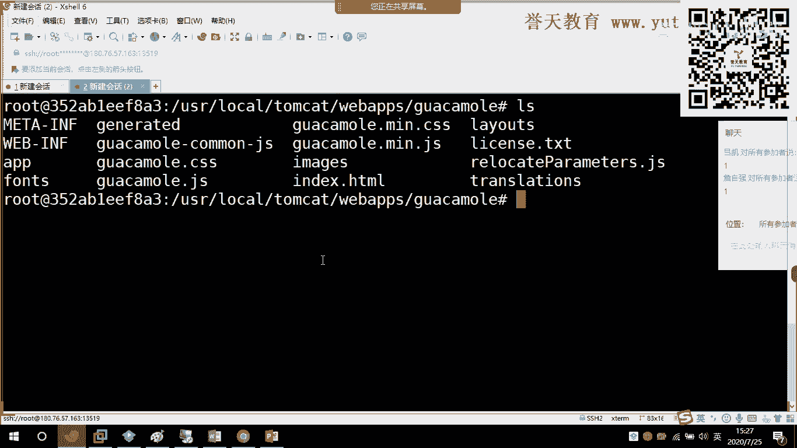

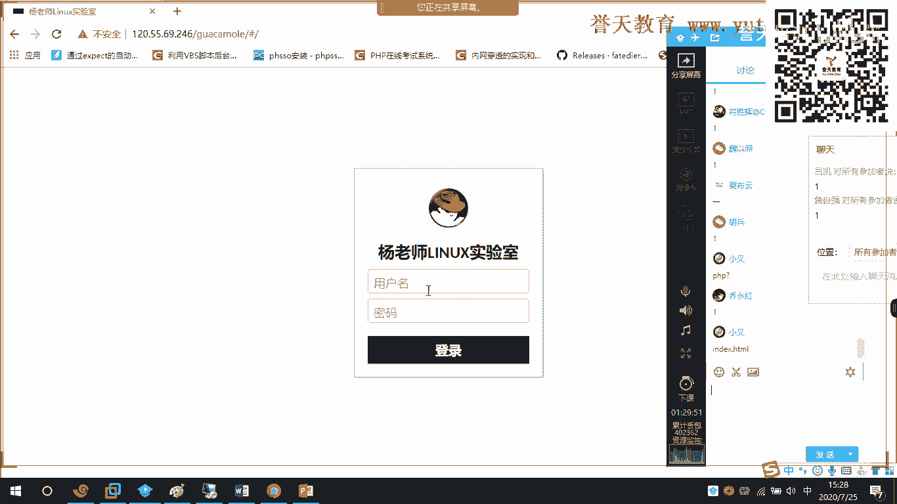

我在这里啊bl减2后面跟上这个我要查的字符串，比如说这个实验室。然后跟上。后面的目录。是。哪一个目录呀，是这样子一个目录吧。唉，他这个中文没有说出来。啊，我看一下啊。换成点。咦，我这个。

我是不是不在这台机上啊，我有我有两套啊，这台环境有两套，一套是在生产。你们在用的这套现在是在生产。

120哎。哦，我这个是180，不在这套上面啊，它过滤不出来啊，不在这套上面，在另外一套上面。我来到哦，在这套上面10在这套上面啊。在这一套上面。T055。在这个上面。低龄服务。我说怎么过滤不出来了？

U选 local。他们看。好，来看啊。在这里啊在这种上面啊。呃，我们把刚刚那条复制过来。回车。看到了吗？看好看好。来。😊，你看到了什么呀？😡，也就是说，如果我需要去把我们的这个标题改掉。

我只改这个文件就可以了，对吧？这个什么什么ZH中文的这个点加准这个文件就可以了。所以来。回来VMZH点接上。来两个小区跳到第一行。333。打的Q保存。

来刷新。好，可能是另外一个。

还有一个是英文的。XXX看到没有？白两女的吧。

来刷新。哎，他这个是不是要要重启啊？它这没有出到效果。

我看一下啊还有没有其他的，应该是没有其他的。这个好像是要把那个他开的重启才可以啊。还是。你看就能够过滤出来吧，这个这个玩意要把他们看到重启啊才行。我看一下是不是有缓存啊，应该是实时生效的呀。

嗯，这样子啊，我退出来啊。

他现在在转，还没启动过里。这鬼又缓存了。

登进来看行。这种进情了。这应该有缓存啊。

要等到那个time cut啊，把它重启过后才行。我直接重启了那个那个容器，它也没有改变啊。所以大家看在这里我可以使用grab减R，看到没样？

在这里什么操作可以直接看到有多少个关键字是在哪几个文件里面都可以看到。这个学会了吗啊，这个学会的小伙伴敲个一。在今后不管你们遇到什么样的这个工作场景当中啊，不管你们遇到什么样的工作场景。

你都可以说吧轻松搞定它。

可以吧。对，这个都可以啊。所以大家以后这个工作当中去改某找某些文件，对吧？去查找关键字的时候，就可以用这个就可用这个。好，后面还有什么这个给它加颜色呀，加高亮吗？好，这个大家下去过后啊。

在这己来对到这里来找一下来做一下。好，那么接下来首先呢我们来看一下我们的正则表达式啊，我们的正则表达式。在我们这里头有很多的这个智的表达式啊，有很多字的表达式。在前面我们大去学习的时候。

我是不是跟大家讲了呀？这个我们比如说我们的这个多了呀，是在每一行的末尾。进行什么呀？进行匹配对不对？进行匹配。那么这个上面的这个经过号啊，对吧？向上的经过号，这个经过号箭头向上的这个箭头是干嘛的呀？

是在每一行的开始进行匹配。所以我们如果要匹配每一行的开始啊。

就应该是这样子。比如说我们想知道在我们系统里面以R开头的这个这个用户名啊有多少，这可以是我们的。这个看EDC pass word对吧。那么ER开头的用户名ER开头的用户名啊。你们就可以找到。Greek。

减。凭什么呀？嗯。😊，接什么减I对吧？减I，然后跟上什么呀？我们的三进括号。来。😊，这说忽略大小写，我们大写也没有。看到了吗？各位是不是以R开头以N结尾的。🎼如果是以N结尾的，是N，后面跟上多了。

是N多了还是多了N？我想问一下老阳是N多了还是多了N？啊。是N多了还是多了N呢？最后一个以N结尾，以N结尾多的是以某某结尾。确定吗？完蛋了。嗯。😊，完了到底是多了N还是N多呢，N多了行不行？N多的行品。

啊。是N多了啊是N多了呀。对哈，是N多了，我都说出来了，你就不信。嗯。😊，以N结尾啊以N结尾是N多了啊，N多了，看到没有？都是以N结尾对吧？对看？那么很显然，如果这个地方它以N结尾的话。

我们这个用户肯定是不能登录的嘛，你看都是loload顶，对吧？并bu的话是什么呀嗯。是什么？我们的B大是BASH是以H结尾吧。你看我们以H结尾的。以H结尾的。

你看我们在系统里面这四个用户是不是可以登录的呀，都是什么Bbu并bu并 bus。可以吧，都是BbBbu啊。

好，这个呢是我们的一些这个政治表达式啊，是一些正治表达式啊。所以大家下一个我可以看一下。这个比如说我们有什么有点呢，对吧？我们还有A到B啊，到A到B之间的任何字符进行匹配啊，任何字符进行匹配。

这个是什么意思呢？任何字符。

来，比如说我输出。比如说我在这里输出。A口这个。A。哦，A到D好吧，A到D，那我回车，你们说是输出哪几个数？嗯。😊，如果我现在回车是输出哪几个数？将会输出哪几个数？啊。完了完了，这不知道吗？

完了怎么回事呀，怎么一个没有输出呀嗯。

怎么一个没有输出呀？不是在这里吗？要对任何字符进行匹配吗？为什么呀？因为前面没有字符啊，我们前面没有字符，我们加字符的话就会不一样。

没有一口。sell我们的A到D。咦。😊，他直接输出了。呃，fillA到D。哦，我看一下啊。它这个地方匹配的时候，将A到D直接作为了制符输出。哇，这个还把我绕进来了啊。

A到D，我有写错吗？任意一个制符进行匹配。好，我换一下啊。

呃，比如说我来创建一个。看一个ABC。这样子一个文件啊。呃，饭。fi ABC。你想范围范B和fi。我用LS来看一下，任意匹配一个我们的这个。A到D。可以吧你看是不是匹配到了ABC匹配到了ABC啊。

一口支持输出啊，还支持不了，它还支持不了。在这里啊看到没有？它就可以匹配到ABC啊，是匹配到这个什么匹配到这个之间的吧，对吧？这个区间之间的是匹配到这个区间之间的ABC都输出了。

好，这个是我们的正则表达式啊，这个是我们正则表达式。这里还有一个叫。咦这个地方应该不是在这里啊，这个地方在效里出现这个房子转移啊和星号和星号啊，这个就是这个重复匹配，或者说单次匹配啊，匹配所有。好。

那么下面呢我们还有一些这个扩展的一些表达词啊。好，我们休息一下过后再来，好吧。

好，这个这是我们的关于正的表达式啊。正的表达式在这里呢，我们这里呢有这个什么上经括号呢，就在开始行进行匹配，对吧？我们又多了这个符号啊，就在每一行的末尾来进行匹配，对吧？比如说我们刚刚大家举了个例啊。

如果是以H结尾的，在EDC password这个文件里面的话，那么它就什么呀？就是能够登录的吧，叫什么bebu嘛，对吧？就这样子一个文件啊，好，那么我们这里还有一个星号啊，还有一个星号。

一个星号是什么意思呢？这个星号呢就是匹配所有意思啊，匹配所有的意思。匹配所有是什么意思了？是这样子。呃，在这里的话匹配所有。我们在前面的删除文件的时候啊。

好了啊。在pa这控里面，比如说RM减RF星对吧？完达通过星号来清空这个文件。那么各位我问你，你这个星号的话，它清空这个文件的时候，这个文件的时候是匹配的是什么呢？是一个或者多个字符，一个或者多个字符啊。

所以它能够把我们这个里面的文件给它清空清掉，清干净，就是这个原因啊。

好，这个呢是我们这个buel里面，它自带了一些基本的这个正则表达式啊。这个正则表达式大家在工作当中去用的时候，你的这个随着你使用的熟练度越来越高，那么它也会怎么样？它也会这个帮助你完成更好的工作。好。

那么除了这个之外呢，我们还有一些扩展的表达式啊，还有一些扩展的表达式。这个扩展的表达式呢，我们大家知道这个grab对吧？它支持一些正则，它支持一些正则。

比如说我们刚刚在这个系统里面过滤了以R开头的这个用户名的用户名。好，那么我们一个扩展的表达式呢，就是除了我们这个基本的表达式之外的，它支持更多的这个字符的啊一些表达式。那么这个表达式呢。

我们支持的扩展表达式的这个命令呢有Egra，看到没有？有一gra啊，那么Egra用来干嘛呢？它可以用来过滤什么？过滤我们的多个字符啊，过滤我们的多个字符可以匹配其中的什么呀。

其中的一项或者什么或者多项或者多项或者任意一项。那么一个gra在我们哪一个场景当中有应用呢？它实际上应用也比较大啊，也比较大。比如说我现在经常使用一条一条命叫grape减一。

减一后面跟上什么呢？比如说跟上running警告对吧？警告，然后过上跟上什么L错误。那么这条我们用在哪里呢？这条我们一般用在日志里面，比如说ta减F one log message。后面用管道隔开。

你看大概现在一个字符都没有，对吧？我先拉一条线在这里，然后我们到这里来可以给它制造一个错误啊。呃。看能不能成功啊，这两。一スた。ES160。你看。😊，现在这个就怎么样就报错了，对吧？这个就报错了。

但是日志这里没有出来没有出来啊，这是为什么呢？是因为我们现在没有过滤到running或者什么或者错误这个关键字。如果我们换一个。啊，比如说。我想想。看换一个的话，我们可以过滤哪些支付。我先看一下啊。

这里有什么。有running啊这个地方啊，然后。减1。好，再看啊。这个产品呢我排错的时候，计算运走。因为当我们系统发生报错的时候，一般就什么就是警告或者是错误，对吧？或者是错误。

那比如在这里我们可以把它起起来。Before up。你们在日志名写点东西啊，还要加点东西，日志名。那么你看这个地方是不是有个警告running呢？

你看那么除了running之外的这个字符的函数就不会出现了，就只会出现包含running的这个什么这个字段，为什么呢？因为我们过滤的时候是不是只过滤的什么呀？

你看我们过滤的时候是不是只过一个running或者是错误啊，对吧？或者是错误，先找它running了。那么你来看这里面是不是警告报了一个什么IP地址错误，对吧？我这个IP地址不是写错了，是不是写错了。

对吧？所以在这个地方，我们running这个场景使用的非常的广泛啊，非常的广泛。那么我们通常用grape减一这个扩展的表达式来去从事我们这个日志里面的一些这个排错啊，一些这个排错。

好，这个大家在今后啊去管理日志的时候就会发现啊就会发现。好，这地方我刚才给大家用了问号，对吧？用了问号就是对什么对单个字符进行匹配啊，对单个字符进行匹配。啊，这个PPT好像写的有一点点这个。

这个比较绕口啊比较绕口。问号就是对单个字符啊进行了要对前线进行零次过一次的重复语约。嗯。😊，好，我们这里呢有一些案例啊有一些案例我们大家来看一下。第一个就是什么？这个我们已经看了吧，对吧？用什么？

用我们的这个经过号，上经过号来扩来开头搜索于什么以word开头的内容或者搜索以word结尾的内容，对吧？那么我们的上经过经过号和多人的表示什么过滤空盘，就是不要空行啊，就不要空行。

这个前面我给大家演示啊。好，这里有个点啊，点的话是代表什么代表任意一个字符啊，只能代表任意一个字符。好，这里还有一个什么呢？这里还有一个叫转移符。还有一个叫转移符啊，这个转移符的话特别重要。

比如说我们在这里呃，今天我在这里创建一个文件。

今天我让你创一个文叫touch新。我问大家，我能不能够使用新作为文件名？大家觉得可以吗？我可不可以使用新来作为文件名？觉得可以吗？可以的小伙伴敲个6，不行，敲个2。

我现在回车能不能够创建出来一个已新开头的文件里？文件名的文件。应该不行吧。好，我回车啊，你看LS。怎么样啊。好像又行了哟，这个在七里面啊这个在七里面是不行的。在八里面啊在八里面的话，它是什么呀？

是可以的啊是可以的。好，他是不个有些小伙伴说是不是下面没有文件呢？我们来创建一些文件啊。🎼好，再来我把这个。我把这个心删掉。🎼好，下月吧，我再来啊touch。怎么样？因为你上面没有文件。

它会重给你加一个。它会自动给你加一个，认为你是要创建一个文件，而不是要去更新时间戳。所以你看我现在创建完了过后。怎么样？他说没有新呢？看到吗？没有新这个文件对吧？没有新这个文件。好。

那么如果我们要想创建出来新这个文件怎么办呢？首先呢你得搞清楚为什么系统认为新不能够来作为一个文件名。为什么系统不让新来作为一个文件名？啊。因为新具有特殊含义的，它是我们的正则表达式。

也就是我们8字效的规则。对不对？发现的规则叫烘配不队。那么我今天非得要让新来作为文件名怎么办？对吧我就要反其道而行之，非得让新作为文件名，那应该怎么做呢？

好，那么今天我们将涉及到一个新的概念，这个概念叫转移。这个概念叫转移啊。转移是什么意思呢？就是我们在系统里面有时候会遇到一些特殊制符。特殊制符，而这些特殊制符具有特殊意义。

这些字符具有特殊意义啊特殊意义。比如说我们的新就是匹配一个或多个，就所有嘛，对吧？那么此时新就有特殊的意义。那么转意的意思就是什么？去掉。去掉特殊意义。去掉这是意义啊。

就是要让他什么要让他把它的特殊行义给它去掉啊，给它去掉。一一般来讲，我们是为了什么？为了叫做繁止转移。啊，有时候这样讲啊，你要知道这房子转移是什么意思。就是为了防止让它作为特殊意义去执行啊。好。

那么此时我们就可以通过什么一个斜杠来做到，一个斜杠来做到好，斜杠行。

诶。你看这里是不是有了，看到没有？我单独来啊，我刚安错了一个那个我们的案子那个时候。看到了吗？如果我在新的这个前面加了一个像什么嗯。像我们左导斜杠，那么此时就去掉了新这个字符的特殊意义。

那么这个叫繁子转移。可以吧，这个叫房子转移啊，你该知道我以后说的转移是什么意思。可以吧？好，那么今天我们就创建了一个什么关于新以新的名字来命名的文件，对吧？文件，那么删面呢也是同么样？就是斜杠新。

你看是不是删掉了呀，对不对？就删掉了啊。好。更新是不一样的嘛？不是的，乌梦是这样子。这两者是一回事。呃，转印我们有两个方式啊有两个方式可以让用来防止它转移。啊，比如说我这里一个单引号，记住啊。

我敲的是单引号，然后新单引号回车LS你看一下。有没有看到？如果你想让这个符号，这个特殊的符号作为普通字符出现啊，除了加斜杠之外，你还可以用单引号将它引起来。

使用单引号将它引起来。能明白吗？将它作为一个普通制服。吴梦这个可以理解吗？能够理解吗？将它作为普通字符啊，所以这两者是一回事啊，这两者是一回事，可以吧嗯。好。

所以大家不要被我敲这个算单引号的时候误导了啊，你这个是在干嘛呀，对不对啊，这个也是为了防止它转移，将心作为我们的一个同字符啊，一个不同字符。

三件的手候仍然可以用啊。来，这个不断。嗯。😊。

好。这个是我们的转翼符啊，转翼符啊就是像这个左导的一个什么一个斜杠啊，一个斜杠可以了。好，心的话我就不用说了。好，那么这里还有一个什么呢？这里还有一个点心，还有一个点心是什么意思呢？

来，我们大家在删除TMP这个目的时候，他说用RM减F星，我把这个目的给清空。然后有些小伙伴说老师咦好像没有清空。唉，你这下面不是有很多已点开头的吗？比如说点叉1024干什么logo，对吧？

那么这些已点开头的文件。我们把它称作为什么文件呢？叫做隐藏文件，对吧？叫做隐藏文件。那么我们的心没有删掉以点开头的文件。这是为什么呢？因为它没有匹配的是么？没有匹配到点啊，对吧？没有匹配到点。好。

那么今天如果我要想删掉我们的隐藏文件，各位我应该怎么敲？我要想删掉我们的隐藏文件，我应该用哪一条命令来？今天我RM减RF，我要真真切切的把time这个目录给它清空。那么我应该怎么做？应该用。用什么呀？

用哪一个？什么用典心能不能做到？啊。用心能做到吗？😡，我用心能做到吗？我刚刚不是试了吗？😡，是不是做不到啊？😡，我现在用心是不是删不了隐藏文件？那应该怎么做？对，梦梦是不是应该用点心呢？好。

我们试一下啊RM减RF点心。回车。怎么样？😊，喂，这里是不是报错了呀？我问大家这个地方是不是报错了，skip干嘛？跳过吧，这单词翻译过来，是不是叫跳过？你看现在在time姆这个目录下面。

所有以点开头的文件都被干掉了。都被干掉了，全部被删掉了。那么为什么这两个文件删不掉啊？啊，因为点表是当前目录。点点点表示上一级目录，因为它两个是特殊的文件，对吧？它两个是特殊的文件文件夹啊。好。

所以一点开到的就都删掉了啊，所以使用点心可以清空我们什么呀？可以可以清空我们的这个隐藏文件的目录，隐藏文件的目录啊。好，那么今天我想问大家，我要想把所有的文件包含隐藏文件全部删掉，我应该怎么做？

我要想把所有的文件包含隐藏文件都给删掉，全部给干掉。我应该怎么来做？怎么做？完了完了，这个不知道吗？啊。这个不知道吗？深月赛你觉得这个可以吗？😡，这个肯定不行啊。我说包含隐藏，包括隐藏文件都删掉。来。

你们又说这个可以了是吧？我这白讲了呀。嗯。😊，来啊，做实验啊，你看啊。好，我再建文件夹，好吧。呃，DR1到5。1。5。然后这里有5个目录，对吧？有10个隐藏文件。好，那么各位我问你。

我现在一条命令把这所有文件包含隐藏文件都删掉，怎么做？我要一条命令，把这所有的文件，包括隐藏文件都给删掉，我应该怎么做？

政策怎么匹配？嗯。😊，这个地方我的正则应该如何来匹配？

怎么匹配的怎么匹配？啊，有小朋友来了，心点心。竖线显示不出来。你是说这样子吗？你说这样子吗？行，然后怎么样。然后跟上跟上什么呀？是这样子吗？然后后面跟上点心。是这个意思吧。是不是这个意思？完了完了。

是是吧？好，我回去了。一。😊，有删掉吗？我们看一下啊。没有删掉。肖鹏，你这个命令隐藏文件没有删掉。隐藏文件没有删掉。吴梦乌梦这个要用结过号开头，这个到8字线里面是不适用的。来。😊，到这里来是吧？

你点开头的都删掉。这个我们看一下啊。好像也没有删掉。对，菜一组啊，来吧，我把刚刚那个我们丢失的文件夹把它建出来DR。第10。-5。好，再来啊。再来上啊。新点心。没车。心点心啊，看好了看好了。减A。

没有变化。没有变化啊，没有删掉，也没有删掉。能不能杀他。中间有空格，哪个中间有空格？哪个中间有空格？RM减RF心空格点心。这个意思吧。😡，拆与足是这个意思吗？😡，这个肯定能不能删掉，肯定可以删掉。

为什么呀？为什么呀？各们，为什么这个可以删掉啊？为什么呀？因为是不是先删掉所有啊，对吧？先删掉所有匹匹配一个或单或多个，再来匹配什么点心开头两个条件。两个条件啊。所以这个蔡立足还是在我的这个意想之内的。

我以为我以为你们会这样想啊。我刚刚出这个题，我以为大家会这样想会RM减RF新点心。结果你们不上当，蔡一组没有上当，他说他星要空格里。我们我以为你们会说这个点这个条件啊。我以为你们会说这个条件。

就唉这前面不匹配了吗？后面也匹配了，这肯定能上。

啊，这个删不掉这个删不掉啊。好，这个是我们的命令啊，我们的命令它所自带的一些表达式啊表达式嗯。好，这个是一些案例啊一些案例，我们大家下去过后要多加练习，这里面要多加练习。好吧。😊，在这里啊。好。

我们下面呢来学习一下我们的字符处理啊，我们的字符处理。字符处理的话呢，我们这个地方呢。第一个学到的命字叫cat叫cat是干嘛的？我们cat是用来提取链或者字端。用来提取链或者是说。

那么它用来提取列或者字段怎么提取呢？怎么提取呢？好，我们来看一下啊。

What的 is。Cat。用了什么呀提取我们的略啊。提取文件的链，它怎么提取的呢？它这样子啊。我们刚刚help可以看一下它的帮助。

在这里。刚刚ha查看文件的帮助呢。我们有两个经常用的选项，一个叫减D啊，减D是什么意思呢？是使用什么来分割啊，使用什么来分割。减F呢是你要它的多少列，要它的多少链。

比如说我们的这个ca ADCpaword。那么今天我只想要这个文件的。用户名怎么办？各位，我只想要这个文件里面的用户名怎么办？那么我就可以使用ca来什么呀？使用ca来进行提取啊进行提取。

叫ca减低冒号使用冒号作为分隔符。然后我要它的用户名，你看一下第一列，第一列ADCpassword回车。那么你看。第一行第一行的第一个是就root。对吧第二个是不是病，第三个叫demon啊。

第三个叫demon。

好，那么ca呢我们就是用来提取一列一列的数据，用来提取一列一列的数据啊。

减F啊减F是用来指定你要打印的列，你要打印哪一列啊？减D是用来指定分隔符，用来指定分隔符。

好，那么我们在这样的一个文件里面，我们是使用的这个这个冒号作为分隔符对吧？作为分格符。好，那么今天我想问一下大家。我如果要我如果要过滤一下这个我们的IPV6的这个这个地址啊，这个地址呢。

IPV6的这个例子呢，我要这个例子呢，F180我应该怎么做？我需要地址上的F180这个字段我应该怎么做？嗯。😊，使用这个字段，我应该怎么做呀？😡，我应该如何来做？应该是怎么样？首先。

if看份的ENS160。然后我们过滤什么呀？嗯，是不是过滤IPV6。grape， grape， inlet。6。对吧。是不是在这里？好，那么今天我要这个F180，我应该怎么做呢？嗯。😊，各位。

我要F180，我应该怎么做？😡，完了完了，这个考虑不到了吗？这个谁说让你你的管杖斧打不出来的吧？😡，好，F2好来了啊，夏鹏来了，他说capt。F2。咦。好像没有啊嗯。好像没有啊。有吗？各位。

我们YY上的小伙伴有吗？这个应该怎么来做？我就要F180怎么办？😡，非得要他。嗯，下波这个现在怎么办？

好，我们来看一下啊，它的语法它的语法。这个地方我们用来干嘛呀？减D用来选择指定的分隔符。指定的分割符。

我们是不是要指定分割符啊？😡，啊。😮，这个分隔符怎么指定？分割服是什么呀？这个地方分隔服是什么？😡，你首先得告诉我这个分隔符是什么。😡，啊。😮，完了这个分割服不知道吗？要指定为空格。对吧。😡。

要指定为空格。好，到底是伪造这个行不行，还是我在这里这样子。我看了过后直接空个格。好像也不行哎。对吧。那我到底应该如何来做这个空格，怎么来表示？嗯。😊，我减低啊我减低空格好吧。哦报错了。

你看你这里要指定空格。黄埔仁说用来斜杠也不行。也不行，到底怎么样？😡，用引号好用引号啊。来，我用引号啊。用引号。一。😊，好像有效果哎，对吧？但是什么东西都没有。😡，什么东西都没有。来，我们先看一下啊。

ENS160。呃，grape。light6。回车。好，那么我问你。现在这个地方用空格的话。用空格的话。你的这个第二个字段。没有出来没有出来。还有吗？确定吗？还有吗？第个知料没有出来啊，这是怎么回事啊？

😡，因为前面有很多个什么呀？有很多个空格。前面这有很多空格。好，那我来多多来几个。比如说F10有没有？都没有哎，我F10好像就可以了。对，这个是吧我们郑同学一语道破天机啊。我们郑同学一语大爆天机啊。

因为有很多很多的空格，伪伪造啊，你这个空格是吧？好。因为你的前面有很多个空格，你具体是多少根，你不知道，所以你得一个一个4啊，这是第一列、第二列、第三列、第十列、第五列，这是第九列是吧？第九列哇。

到这里才是第十列。但是我现在只要F180呢。😡，怎么办呢？各位。还是不行。叫看。减D使用冒号来作为分隔符减F减。F1。那么我就拿到了F180。我就拿到了F180。好，那么在这里啊。

在这里啊我们拿到F180，我们是不是使用了两次啊，对吧？使了两次，一次使用空格作为分隔符。另外一次使用了冒号来作为分隔符。大家记住啊，我们空空格这里为什么要用单引号引起来，就是为了防止。转移对不对？

还记得吗？如果单纯的空格是不是就不行，对吧？单纯的空格就不行啊。好，所以大家这个现在可以吗？对，这样是因为我知道前面有多少个空格，是因为我知道啊。那么这个地方为什么说你要一个一个试啊。

因为你不知道前面到底有多少个空格。到底有多少个空格？比如说你这个地方如果变成F11。那它又是空对吧？那说明他现在来到了什么，来到了这里啊，来这里你变成F13。看这个地方有几个空。那么它变成了64F12。

那说明这个地方只有一个空。啊。说明这个地方只有什么只有一个空啊，只有一个空。嗯。😊，所以这个你要试你要试的时候，你才能发现哇塞，因为你这个地方不知道到底有多少空格，到底不有空格。

所以空格这个场景使用F什么呀？使用我们的这个这个cat啊来过滤的话，它效率就比较低啊，效率比较低。因为你不知道到底有多少空格。好，等一下我给大家补充，我们还有另外一种绝招，另外一种绝招啊。

好，这是我们的第一个使用t来什么来分割啊，使用t来分割。好，那么除了这个之外呢，我们还可以按照指定的案子吗来指定按置符来提取啊，按字符来提取。比如说减C2到5啊。2到5个字符。

上面你看。这种场景下面我们提取的是。哪几个政服呀？😡，这提出来的是什么呀？有没看出来这个是什么？

我翻到啊。这个提取出来的是什么呀？对吧。提取的是我们的制符的。列表对吧？字符的列表啊，你要提取从第二个开始一直到第五个字符到第五个字符。所以你看在这里。第二个字符设备S。那么第一个root的话。

第一个root的话，它应该就是OK的。如果是我们提取第一个到第我要提取用户名啊，我现在要提取用户名，cutEDC passwordword。各位，我想提取用户名，我想问大家。我要提取多少个字符。

我才能够提取到用户名root。

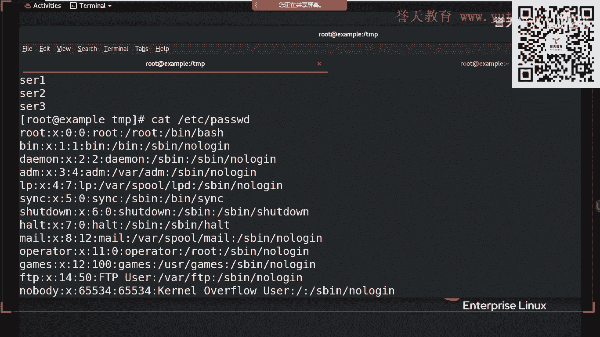

我要提取多少个制符，我才能够提取到root这个运户。嗯，它是以列分割啊，以列分割啊，以列来为单位分割。按照四个字符。还有吗？还有吗？还有没有？我只要录成这个用户名，我只需要我这一一个里面有录的就够了。

只要有入的就够了啊，其他的不强求，好吧。几到几到几啊。2到4吗？2到4肯定不行的，2到4哪有root呀？你看2到4有root吗？cat减C。来2到4个字符。EBC他是我。hand查看前十行。

你看你这不有录的吗？是不OOT啊，我是不是ROT才可以。😡，下果明白吗？我是不是要ROOT才可以？😡，对不对？😡，才可以吧，我要ROT才可以啊。好，那么应该就是1到4。好。

那么各位我现在问你我只要录的怎么办？现在这个产品下面，我只要录的怎么办？😡，我什么都不要，下面这些东西我都不想要，我只要路。😡，结合前面学的啊，要结合前面学的对，刘佳琪特别棒，各位。来。😊。

你看现在我们是不是只拿到root这个字符。对吧，只拿到这个root这个字符啊，这个就是我们的管道，对吧？好，所以啊我们ca啊有最常用的两个两个用法，一个叫做减D，一个叫减C啊，减C是按字符来提取啊。

按字符的长度来提取，对吧？你要提取这一列的这一行的多少多少个单位啊，对吧？从第一个到多少个字符啊，对吧？按照列啊，它是以列的形式啊，它是来按列提取啊，按列提取，好，那么再一个就减D各位减D的话。

这个地方的分隔符，你要记一下啊，这个PPT上没有记这个分隔符叫制表符。

这个分隔符啊默认的话，它是制表符可以吗？它是制表符啊，F呢就是让你打印的列，对吧？如果你用简D来分割的话，那你打印第几列呢，对吧？打印第几列啊，这样子通过列来打印。

举一个简单的例子，那么在这里呢就是这样子。你点TSD。比如说。这个123。1YY10P我我复制了十行。好，那么现在我来过滤的话，如果我只要二应该就是cad减减什么呀？减D对不对？

减D使用冒号来作为分隔符减F。如果是F1，我想问一下大家是多少？如果是F1，我下面的结果是多少，是一还是2？我看你有没有搞懂啊，这个仓数有没有搞懂啊。减低。默认如果没有的话，它是不是用空格来断断开的。

默认的话好像是空格。我来看一下，好吧。这个我还没有测啊，现在。啊，减DF1。那这里要有些空格才可以。来个2。TXD啊，你看它默认是不是空格。我记得这个他好像不是那个AWK才是啊。AWK是默认式空格。来。

你看啊比如说123。YY。😊，10批。好，再来啊cat减F1。2点天C。看到没有？嗯。😊，我如果是用空格来分隔的话，它应该就是什么呀？就是一吧，黄渤轮可以吗？可以吗？我记得他我记得不是很清楚啊。

它好像不是默认是用空格的AWK式的啊，AWK是空格。好，那么再来回到我们刚刚这个例子里面来。如果我今天cad减D，使用这两幅这个我们的这个冒号，对吧？减F1，然后后面跟上一点TS1。我问大家。

现在出来的是一还是2还是3。现在出来这个结果是哪一个？嗯。😊，可以吧。那你table一下后，用引号引起来效果。是一是吧，确定吗？哇塞，真的是一吧。好。那么这说明减F一是打印的第一列，对不对？

打印我们的第一列，以冒号来作为分隔符打印第一列。好，那么如果是二呢，如果是F2呢？它是不是就是第二列呀，打印我们的第二列，如果是商呢？F3呢，那么它打印的就是第三列，打印就是第三列啊。

所以减D指定分隔符减F指定你要打印的列，后面跟上你的文件，跟上你的文件就okK了。这个就是cat这两命令，可以吧？这个是cat这两命令啊。

好。来，我们继续。这个咦我们文本的提取工具只有这么点吗。🤧嗯。😊，我看一下，我刚刚看了一下，这个地方好像没有AWK啊，等一下我单独给大家补充好吧。🤧这个PPT上面没有啊，我单独给大家补充啊。好。

那么接下来呢我们看一下文本的分析工具啊，文本的分析工具。第一个工具叫WCWC这个工具干嘛的呢？它是我们的文本的一个统计工具啊，一个统计工具。这个工具呢主要是用来对文本进行统计，怎么统计呢？来。

各位你来看一下。

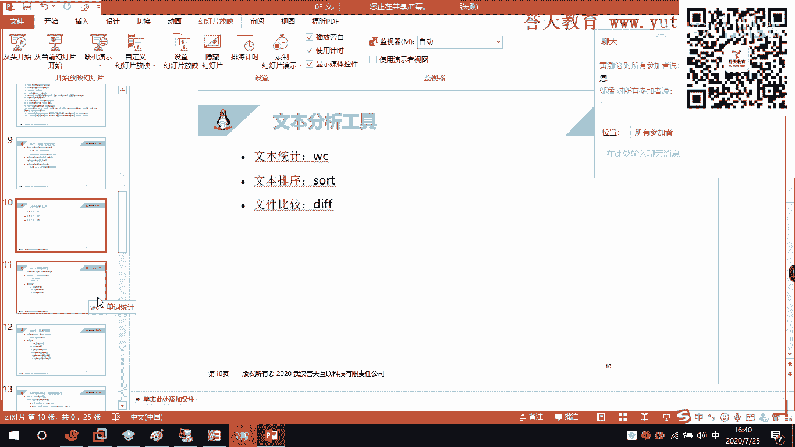

WCEDCpassword。回车。那么这里有1个48，有1个106，有1个2612，这是干嘛的呢？好，WC杠刚haapp来看一下。来看一下。那么。这个地方我们WC用来统计它可以统计什么呢？唉。

它可以统计文件的什么东西啊。函数吧，是不文件的函数对吧？字节大小字符数看到没有？字符数，还有我们的什么呀？单词数对不对？还有我们的单词数。好，那WC。WC这几个出来的这几个结果，到底哪一个是函数。

哪一个是单指单指数呢？嗯，各。WCA出来的是哪一个是单指数啊，哪一个是函数啊？你们猜想一下，哪一个是函数？首先告诉我哪一个是函数。没有AWK不要慌，我再给你补充刘佳7可以吗？我单独给你补充好吧。

PPT上面没有的，我给你补啊。现在这个到底484是什么意思？是字节数啊，还是我们的单词数还是函数啊，这三个的这三个的三个数字的意思，我告诉你啊，你给我在里面选好不好？一个叫函数。

一个叫质结束。一个叫单词数。单词数这个是字节数吧，有看一下，对是字节数啊，没记住啊。好，那么现在我问大家，481062612谁是函数？

4法次函数吗？感觉是吗？48行有有问题吗？各位其他赞同吗？都赞同48行是吧？好，来，那么我们看一下WC统计这个文本怎么统计。那么。我们看啊减L是不是统计它的什么呀？它的函数啊对不对？统计它的函数啊好。

我们来看一下WC减LEDCpas word。回车函数啊，这个不是数学里面函数，一行一行的行啊。你看现在看是不是4八行。😡，对吧一共有48行。好，我们用VIT去验证一下，好不好，看到底是不是48行。

买车来。看好了，怎么验证函数怎么怎么把它这个显示出来，叫sd number，对吧？s N回车来，怎么看到最后一行大写字母G。怎么样？是不是48行呢？按两些小记回到第一行。按一个大吉回到最后一行。

所以这个文件一共是。48含48含啊好，那么我们先来看单词数，单词数叫减W。单指数是减W啊减W。怎么看WC减W，那们看看EDCpass word回出。怎么样？所以我们的106它是一个。是一个什么呀？

一个单词数啊是一个单词数。好，那最后的2012不用讲，你就知道了这什么叫字节数嘛，字节数啊。对吧是不是在这的字结束啊？好，那么。WC这个工具啊这个工具我们更多的时候用来统计这个文件一共有多少行啊。

这个文件一共有多少行，可以吗？吴默现在可以吗？

我们腾讯课展的小伙伴可以吗？关于WC这个工具可以吗？对，我们更多的情况下使用WC减L减L这个选项来查看我们这个EDC它是word它的一个什么呀，它的一个函数啊，它的一个函数。

你看这个不就是它的字节大小吗？有看到吗？我都给你验证了，这个里面有做少个单词的话，我还真的没有办法来给你验证啊。

这个你们看这个里面有多少个单词了啊，有多少个单词。这个我VM应该是有办法可以把它这个搜索出来的啊，这个大家下去购后可以找一下，其他的两个我都可以给你验证啊。第一个它有48行。

第二个它有2602062612个字节，对吧？字节，那么它是多大呀？好，我知这。是不是2。6K，这就它大小嘛，质检对吧？这就它大小2。6K可以吧？所以我们可以使用WC这个工具来进行文本统计啊。

进行文本统计。

好，we back下的其他小伙伴可以吗？我们不back上面的其小小伙伴可以吗？甄俊兰、蔡立竹。这个陈愿可以吗？嗯。这个郭俊成、蒋闯、刘涛。吕凯、诗雨、王博洋可以吗？🤧对，WC啊。

它用来统计我们的什么这个文件啊，它是一个统计工具，文本的统计工具啊。

好，这个在将来的工作的场景当中啊，我们用L减L这个选项用的是最多的，就这个文件有多少行啊，它有多行。好，那么接下来一个s是干嘛呢？是我们的文本的一个排序工具啊，那么文本的一个排序工具。

比如说你要排这个降序啊，对吧？或者说这个按照数字来排序啊，怎么来排序啊，或者说去虫啊，对吧？或者去虫啊，怎么样来做啊，对吧？或者忽略这个字符串中的大小写啊，比如说我们要对它进行一个排序啊，进行一个排序。

怎么排呢？我们来做一个文件线。

呃，比如说1点TXD。我先把它删掉啊，这个是。呃，我们来断线排序啊，比如说第一。CA。C。第一。A。然后比如说43。67。19。好，它是我们的一个排序工具啊，这个s是我们的一个排序工具。

那么它排序呢它排序呢，你看一下，如果我什么都没接，它是怎么排序的啊。嗯。一点T11回撤。那么你看。它默认是不是从什么从小到大，看到没有？数字是不是从小到大？看到了吗？都是小写字母，然后再是大写字母啊。

然后再大写字母吧。好，我们来这来啊。如果接上减R啊，它是不是反序啊，接上减R是不是反序？st角。减R，然后跟上一点TX1回车。嗱。😊，你看它现在是什么，从什么呀，从大到小的顺序，有看到吗？

它现在是从什么？从大到小的顺序排的反序。

拍个返去吧。这一条排返序的这个选项大家一定要记住，为什么让你记住排返序的选项呢？原因很简单，因为在将来我们这个后面要学的个东叫进程，叫进程啊，我们可能去这个进程里面去查找哪一个程序，用CPU用的比较大。

占用CPU占用的比较高。那么这个时候我们就用用排返序的形式去查找这个占用进程在这个某一个进程占用CPU资源最多的是哪一个进程啊，是哪个进程，可以吧？所以排返序这个大家记住啊，如果是N呢。so的减N呢。

减N呢1点TXD呢。那么你看它就是根据什么呀？根据数字的方式来看啊，根据数字的方式来看。这个是根据数字的方式来进行一个排序啊，进行一个排序。好，那么今天我想让大家给我们的这个用户名。

我们EDCpasword里面这个文件里面的用户名做一个这个做一个排序，做一个排序。那么我们应该怎么做呢？应该就是。cut EDCpassword。后面跟上cardt键第一。我们的什么呀？

这个什么什么符号，制表符冒号对吧？减F1指是这个用户名。好，然后跟上我们的管道，跟上管道st。好。再来看。那么此时它就是根据我们首字母的顺序来进行的排序，看到没有？你看是不是ABC有看到啊，你有看到。

看啊它排序啊，它默认是按照字母的字母表顺序来进行排序啊。嗯。不是这个。在这里啊，你看它是不是AAABCCCCDDF看到吗？G有没有看到？好，如果我没有排序之前，那是怎么样的？我没有排序之前。回车。

那么你看它第一个就是什么？一个叫root嘛，它是不是根据我们文件里面的顺序来的呀，对吧？它是根据我们文件里面这个每一行的顺序来的。所以我在他进行排序过后，那么它第一个什么？第一个就一定会是。我们怎样。

以我们的A开头啊以是我们的A开头。好，那么如果你以为st它只能够用来排序，那你就太低估它了太低估它了，它还可以干嘛呢？它还可以用来去从。

它还可以用来去虫。怎么样叫去虫呢？它可以用来去掉我们的重复的去掉我们重复的。好，减U啊，它可以删掉重复的。

好，来，我们让它删一下，让它删一下怎么样删掉重复的。st number啊，看一下行号一共有十一行，对吧？11。Y歪。😊，P粘贴对吧？是吧22行了，现在应该有22行，对吧？应看22行。

好，那么我们现在用哨帚来去除。st句虫减U减U去虫。好，你看我们现在和原来的做个对比啊，和原来做个对比。那么大家发现了什么问题啊？嗯，各位你们有没有发现什么样的问题啊？它这个去虫好像有问题啊。

你看有没有问题啊？他这个驱虫有问题吗？

你们发现什么问题？啊。有没有发现什么问题？好，先区分大要求是吧？我减I好不好？不区分大要求。我简哀好不好？可以吗？我解压了呀，我没有区面大小写啊。嗯。😊，对不对？那这怎这怎么回事呢？

他好像还是没有去这个彻底的去什么去掉重复。大小写不去，顺序变了，不是顺序变了，下不匀是因为我已经怎么样，我已经去掉了重复的，减于我我去重了啊我去重了。嗯，这句重会有什么问题啊？有什么样问题啊？

那区分大小写啊，这个地方区分大小写。对。对它大概写敏感。对大小写是区分的是区分的。所以啊你不要以为它没有去成。明白吗？明白的小伙伴敲个一，不要以为它没有去容啊，它区分大小写了。它区分大小写。

C和C不一样啊。不一样，我还以为你们会说唉，是怎么有两个声啊。啊，能明白吗？明白的小伙伴敲个一，它区分大小写可以吗？这是两个不一样的啊。对。这两个不一样啊，好吧，所以大家这个一定要注意啊。

这个一定要注意。好。那么这个啊它去掉重复的已经去掉了。你看啊，因为它这个我用ca减给你看一下。1点TXTst减U。啊，我这个太大了，我要全屏。

我要全屏啊。那么在这个地方，我直接去减U的时候。我直接去减忧的时候。哦，这个地方有那个行号了，他把行号识别进来。他把行号识别进来了。好，那么我就减U的时候啊，它实际上是去了虫的，去了虫的。

因为你现在看这个它现在只有。只有这个设的应该可以显示行号，我看一下。可以显示行号的。我记得没错的话，它应该显示行号是没有问题的啊。我们可以看一下它哪一个选项可以显示我们的行号。这言。H减R。

number有 numberumb吗？有没有number啊？减T减U啊减U是去重句要重复啊，这里只有减U。没有我们的检N呢这个检N这个血案的话。在。这里吧既然是按照数字的顺序来排序。咦他这个没有。

现在没有我们的行号吗？

这个我用的比较少啊，这个还是用的比较少。减N不是的，减N是去干嘛？减N是去去掉我们那个重复的。这是话减设按照那个速度的顺序来排序环渤轮可以吗？减N是按照数字的顺序来进行排序啊，进行排序可以吧？对。

这个他没有啊，他这里没有写那个可以看到行号的。啊，大下去过后可以来查一下啊，可以来查一下嗯。我是我这个地方不能够用用cat减码。因为如果检验的话，它会把我们什么呀？

会把我们的这个结果通过管道丢给下一个命令啊，所以它就不能够正常的来排序了，好吧。

好，这个是减U啊，它会删掉重复的哈，它会删掉重复的行。那么除了这个之外呢。除了这个之外呢，我们还有一个还有一个什么呢？还有个叫做UIQ啊，UIQUIQ是干嘛的呢？它用来什么呀？

它用来删除相邻的行相邻的函。那么为什么说它用相邻的函呢？那你看。

我在这里给您看一下。VM。1点TXD。我在这里B这里啊，我再写一个B，写一个B。啊，一共写了3个B，对不对？好，保存来，你看一下啊。Cat。1。60。UIQ去宠。你看一下它的取重效果。

你看一下它的去虫效果，我问你它的去虫效果达到了怎么样的一个效果？它的聚虫效果怎么样？😡，是不不行，你看它只有BBB与B30的重复的函子去掉了。也就是说要如果要使用UNIQ驱重，必须有一个前提条件。

如果要使用移问。IQ驱虫。去重复啊去重复。必须要有一个前提条件，就是什么呀？是。连续的重复函。不知道你没看清楚啊，再来啊。你必须是连续的重复函，你才能够把它去重。

嗱。😊。

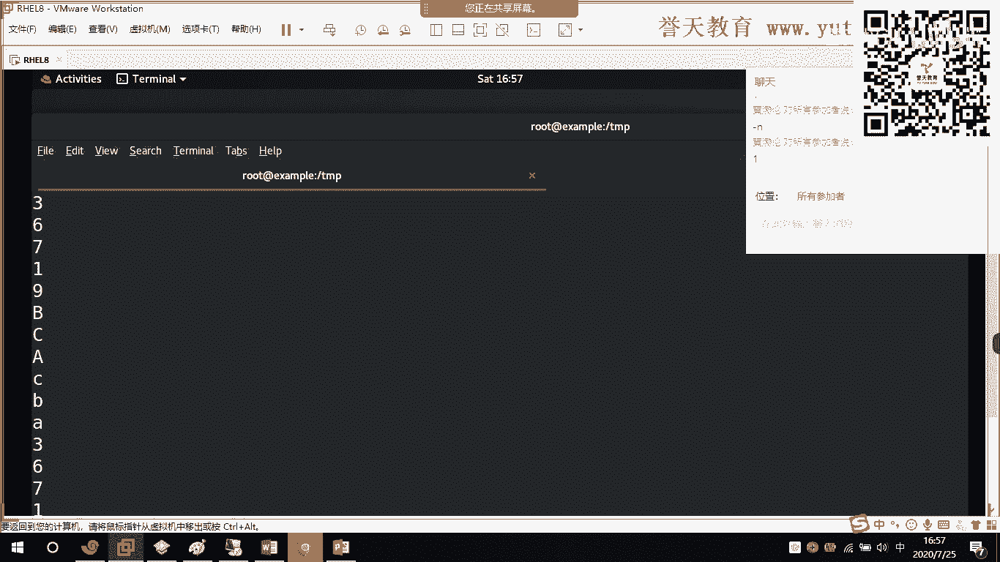

你看啊这是我们去总化的效果。这里有个B吧。😡，你看这里是不是也有个B啊，看到没有？这里有个7吧，这上面是不是也有个7。好，那么我问你，我今天就想用UI勾驱虫怎么办？它只能够去掉连续重复的行。如果不连续。

如果有一个有一个一在第一行出现了，还有一个一在最后一行出现了。那么这两个一他认为是两个什么是两个不一样的一不一样的一，所以他认为不是重复的。好，那么各位我想问你，我如果要想让它必须用UIQ驱重怎么办？

好，效果来了，微道来了，先要什么排序？先排序。对吧，先来序好来。Soalt。😡，排序。好。你看现在是不是排到一起了呀，AA999是不是都排到一起了，然后我再来去成。再来去什用IQ。哇塞。可以吧，来。

你看现在还有重复吗？看清楚啊看清楚，现在还有重复吗？😡，没有了吧，它默认是按照字母啊，按照字母顺序来给你排序。看到了吧。所以一问IQ它只能够去掉重复的。

而不能够去什么。而不能够去用来用作什么呀？用作去去掉这个你的这己不连续的啊不连续的重复啊，不连续的重复。那么我们UIQ呢还有一个选项叫做减C啊叫减C。你看。😊。

他可以看到什么B这个单词在这个文件里面出现了3次。出院三次。第二次。来往上走。第一次。第二次。我们往下找啊。三出现了一次哦。还有两个还有两个被他这个。呃，它去重的时候去掉了。

我们是不是有三个B是连续在一起？是连在一起的，看到没有？它去掉了。在这里啊应该他可以看到这个连续。来在这里大家看清楚啊，这个地方容易误解啊，有误区啊。因为IQ减C这个三是怎么来的？为什么这个B有3字。

是下面还有两个B，它已经把它去重去掉了。他已经把它去虫给去掉了。你看这个地方这个A是不是有一次？这个地方A是不是也有一次，你看啊，我让A变成三次，那我就这样子。他必须是连续的啊，他就会认为有几个。OA。

AA那么这个地方A就应该是4。你看啊。😊，减C。往下面走。在这里吧，你看这个A44，说明A这个字这个字连续出现了什么40，连续啊连续出现了40啊。这个可以理解吗？能明白吗？各位。

这个可以统计重复的这个字，这个字符出现的次数。吴梦可以吗？黄博伦。这个减C这个选啊用来统计它连续出现的次数。可以吧。对对对，是的，三个B重叠了。对。可以吧。在这里啊它可以统计啊，对。

这个特别厉害这个特别厉害啊。

好，这个呢是关于我们的去虫啊，关于我们的去虫。这个我们的s一般和UIQ的话连用啊一般和UIQ连用。先将它排序全部排到一起，然后用UIQ怎么样去统去统。所以一般来讲我很少记s和UNIQ的选项。

因为他们两个用命令来讲，已经够用了。我将他们两个用命令联合到一起，完全够用。像刚刚这个场景，我会我会对来进行排序啊，我根本就不会去使用UNIQ box用st减U啊，我不会去使用st减U来去重。

我会再进行排序。

我会对这个文件进行排序啊。排序过后再去重，效果特别好。いや。对吧我断进排序，然后去重用UIQ去掉重复的。因为所有什么呀，所有重复的函是不是都排到一起来了，所以它可以去掉连续重复函。

它会对这个我们这个文件进行排序。所以这两个命令联用是非常好用的，根本就不用记他们的选项，连用已经非常好用了。

这个可以吗？腾击个人的小伙伴可以吗？小吴这个能够明白的小伙伴敲个6。好吧，s和UIQ啊。一个排序，一个用来驱虫，好不？这是它的重点功能啊，一个是排序驱虫。对吧这个应该好记啊。

所以我我不会教你去怎么样去记什么各种选项减入啊，减二啊，排倒序啊，减2你要当然要记住这个我们后面讲进程的时候用的减二啊，排倒序减N呢，对吧？按照数字的大小来排序。可以吧。好。

所以这个地方是关于我们的这个排序以及驱虫啊以及驱虫。

好，那么今天的内容呢我们大致的就这么多。

