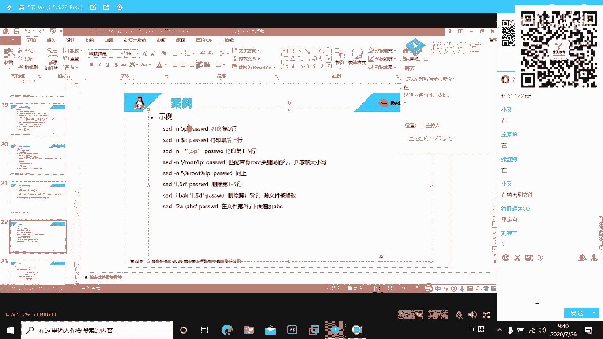
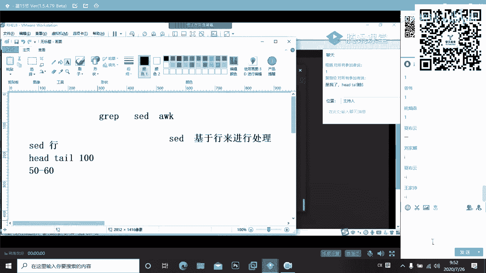
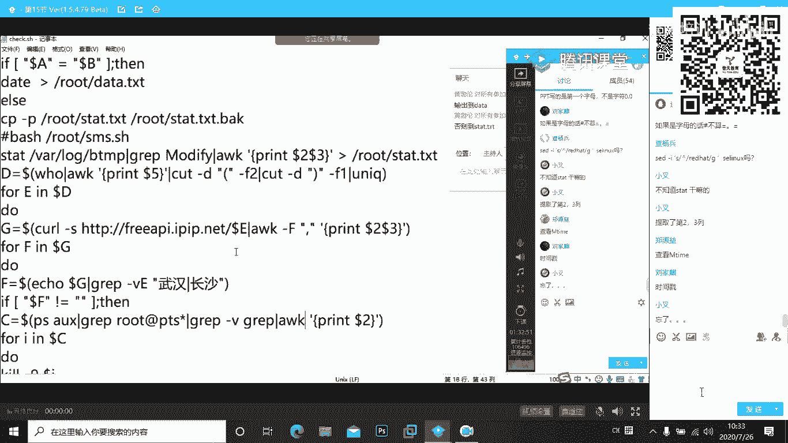
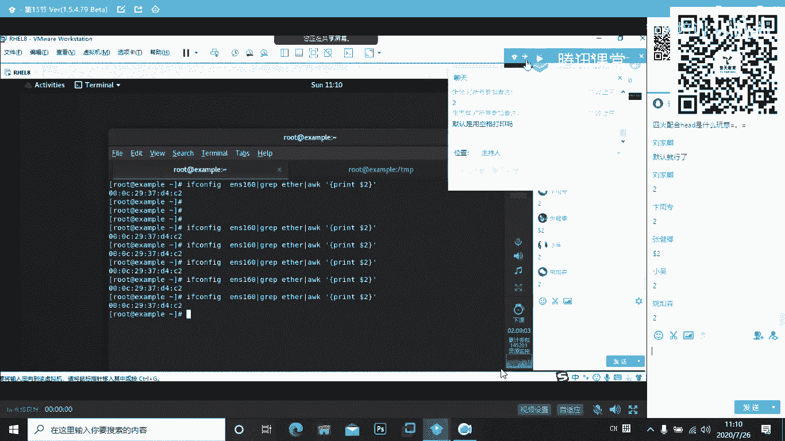

# 红帽RHCE 8.0培训学习视频-11.高级字符处理和shell简介 - P1 - 誉天云计算 - BV19M411T7qb

嗯。好的啊。好。酒店打堂是吧。有声音吗？我没有讲话。可以啊可以啊，我没有讲话啊。好，准备开始了啊。嗯。好，那么昨天呢，我们对这个。我们的这个嗯。一些制付处理啊的工具啊，主要是这个重点啊这个重点。

然后就是我们VIM的一个应用啊，VM的一个应用。那么VM的编制器呢，大家下去过后呢，自己一定要这个去多加练习。这个如果你如果你VM的这个练习的话，没有这个。如果是没有这个验的比较熟练的话啊。

这个你后面这个工作当中啊会比较麻烦，对吧？就是很多重复的处理啊。那么我们的这个文本提取的工具有哪一些呀？各位昨天我们学了有一共有三个文本的提取工具啊，海带还记得吗？第一个叫做什么呀？

第一个叫做我们的这个。呃，叫做。cat对不对，是不是叫cat呀？好，第二个是什么呀嗯。第二个是什么呀？对，不不文本的提取工具啊，这个是排序。这个是排序提取工具，就是我们使用哪些方式来查看文本啊？

使用哪一些方式来查看文本？还有吗？还有什么，我们的墨对不对？还有我们的墨啊，你看。还有我们什么我们类似的。哎，在这里啊。好，那么我们的墨盒历史呢，它是两个什么呀？两个分页工具啊，两个分页工具。

那么墨合历史呢，他们用的场景呢会比较多啊，他们主要是在哪些场景下进行利用呢？就是在我们这个文件的这个行比较大，对吧？比如说我们的这个命令行的一个窗口啊，它这个放不下了，他就会有这样的一些应用场景，对吧？

比如说我们这个大家最常见的我们的慢班助对吧？慢帮助，比如说我们慢S哎，它就什么？它就是用历史来打开的吧？为什么呀？因为它的一个内容比较长啊，它一页放不下，所以什么他用来分的什么分了多页啊，分了多页。好。

那么这是我们的文本查看工具啊，查看工具这三个啊是我们用的最广泛啊用的最广泛的。好，那么我们除了这个之外呢，还有我们的筛选的一些工具啊，摘选的一些工具就是我们用来怎么样，用来过滤的一些工具，对吧？

我们用来选取文本的一些工具。第一个就是ha啊，第一个就hadhead呢它是过滤文件的什么呀？嗯，填多少行呢？

这只有一行啊，过滤文件的钱。十行对不对？文件的前十行啊，那么我们的pe人就刚好和他相反，他是过滤文件的。末尾的十行对不对？过滤我们文件末尾的十行，就是文件这个最后的十行。对。

最后的十行一个是最前面的十行啊，一个是最后面的十行。

好，这个呢是我们的这个文本的一些这个摘取的一些工具啊，一些用来过滤的一些工具的。好，还有我们按关键字提取过滤的工具，就是我们的格瑞普的，就是我们格瑞普啊。这个可以说博大精深。

他支持正则表达式和扩展的正则表达式啊，他支表达式有哪些啊？他自己的表达是在这里。你看啊。有什么多了呀，对吧？有什么我们的新号呢，我们在采用的这个这个斜线呢，对吧？还有我们的问号啦等等啊，你看。

就是他指使我们正觉表达式啊，所以我们gra瑞和和我们将要学到的圣和这个。以及我们的AWK称之为什么呀？我们的笑的三剑客啊。在这里啊。要想你那个是学的好，要想把秀语音编程能够学的精通啊，学到精通。

而不仅仅只是能用。那么你这两这三个啊。你一定要怎么样，你一定要多去使用啊，要多去使用在我们C一的里面的大致的介绍的这三个工具啊，介绍两个AWK还没有涉及到了啊。在以原来去的时候，这个教程里面就没有啊。

他在，这个是涉及的比较多的。这个是虹帽的考试也是经常考到的，经常考的他考的都比较奇怪啊，考的都比较奇怪，他的需求比较奇怪，比如说今天上次昨天我给大家举了个例子，对吧？

比如说今天这个地方以包含root的对吧？包含的我都不要，那怎么办？

对不对？在红包里面就这些奇怪的学校啊，说这个关键字。本来我们格瑞普是来这个选取关键字啊，对吧？是来用来搜索关键字，选取关键字。结果他让你把这个选出来的关键字，但你不要不要使用，他说我不要这个关键字。

不包含这个关键字的内容给我显示出来。对吧，所以我们考试的时候有很多反其道而行之的这个这个需求啊，所以你一定要怎么样，你一定要这个对这个工具要比较熟练啊要比较熟练。而这几个工具如果你不熟练的话。

还真不好还真不好做，为什么呢？因为你可以看一下啊。你可以看一下他们的帮助啊，这个是我们和瑞普的帮助，他比较多啊他比较多。并且他的帮助信息的话啊，里面没有很多例子啊，没有很多例子，要你一个个的去尝试啊。

去尝试，那么这样子就非常浪费时间了。如果你考试的时候不熟练怎么样，那就完蛋了。所以后面集训的时候，你一定要怎么样？一定要去认真的去操作啊。那么的设的这个里面它就有很多，看来还支持什么呀，还支持脚本。

看到没有？他还支持脚本啊，为什么说它很强大，因为他可以用去执行命令啊，用来去执行命令。好，那么再一个就是我们的AWK。你看一下啊，这些都是什么呀，都是非常什么呀，非常多的一些学校。

它的功能非常非常复杂啊，非常非常复杂。

所以这个单下去过后，在将来你的运维工作当中，我相信你一定能够接触到，一定可以接触到。啊，所以我们大家看一下，我们这个地方啊，它是按照关键字来进行一个提取啊，这个提取的话呢，还是呃比较什么呀。

比较这个好用的，比较好用。就是你直接按照后面什么他的不，你可以跟上一个什么，跟上一个关键字，那么它就可以什么按照你的指定的这个这个关键字来进行过滤啊，进行过滤。在这个地方呢，我们有很多很多的案例啊。

还有一个就是我们的card，我们的card他干嘛呢？他是用来什么这个单词翻译过来就是切。就是签啊，它用来切割分割，它用来分割什么的，用来分割我们指定文件的列啊。

指定文件的列我们的gra我们的我们的t它都是以行的方式来进行什么呀，进行过滤对吧？进行过滤或者进行截取啊，进行截取。那么我们的这个地方有一个这个它用来干嘛呢？就是用来按照列来进行分割啊。

按照列来进行分割。那么同时我们还有一个工具叫种AWK，它也是按照列来进行分割的啊，来进行分割的。好，那么他按照列来进行分割了，我们更多的时候呢，用它来什么用它来截取字段啊，用来截取字段，对吧？

我们可以根据他这个所说什呢所支持的分隔符这个分割。符务就是我们的制表符啊，就是我们的制表符务。它会以根据我们的分格符务来怎么样来去选取这个文件当中的某一列的一个数据啊，某一个数据。好。

再一个呢就是我们的这个文本分析工具啊。第一个叫做WC啊，第一个叫WC。这个WC呢是专门用来统计文本的啊，他默认是从三个方向去统计一个叫做什么呀？一个叫做我们的什么函数，对不对？函数啊，每行每行。

这个文件一共有多少行，对吧？一共有多少行内容。那么再一个呢，就是这个文件的单词数啊，文件的单词数以及我们文件的字节大小对吧？字节大小字节数。好，那么第二个shott呢，它是用来我们系统里面进行排序的啊。

进行排序的。那么它排序的时候呢，它会怎么样呢？它会对我们的这个这个字母呀，这个大小啊都可以怎么样，都可以来进行一个排序，对吧？都可以来进行一个排序啊。那么同时呢他还可以排什么样，排正序或者反序啊。

如果结算起R的话，那么它就是什么呀？这样减R的话，它就是反序，对，就是一个反序啊。好，那么这里还有一个这个减T和减K，这个没有跟大家说的。这个为什么呢？因为这个今天的作业里面就会出现到。

比如说如果我要按照我们的这个呃ADC pass word这个文件啊。

比如说我要按照ED pass word这个文件。按照这个文件的什么东西呢？按照这个文件当中，我们所有用户的这样子的1个UID来进行一个排序，你该如何来做，对吧？那么这里应该就是什么呀？

这个地方应该就是呃我们的st。

郑 k。嗯嗯。是。

叫减减T啊减T指令分隔服是制表服。那么减K是我们的UID是第三列啊第三列。B d c pass死我。那么大家可以看来现在看到这里。往上面翻。应愿。

这个就是对他的一个这个我们的一个这个大小啊来进行一个排序，进行一个排序。那么这就是按照我们指定的列来进行排序啊，列来进行排序。

好，所以这个排序的过程当中呢，他会对我们的这个制服类也会做一些处理。比如说有这个驱虫啊，有驱虫对吧？它是去掉什么呀？他是需了什么呀嗯。可以去掉我们文件里面什么不连续的重，对吧？不连续的重复哈。

而我们的另外一个工具叫做UIQ这个工具，它就只能够消除什么呀，消除重复的哈。消除重复的。好，那么这个连续的重复的函，我们就用用IQ来消除。所以这个地方我跟大家讲了啊。

我们大家可以不需要去记忆我们的这两个呃我们的这两个命令的选项。因为他们两个一般用来连用，对吧？你们用来进行排序，用UIQ来进行什么呀？去重啊，这两个命令我们一般会直接连用。这样子的效果怎么样更加明显了。

好，那么接下来我们看到昨天我们在这个地方讲完了过后，还没有讲到的啊，一个叫if。地这个工具呢用的比较少。第一个呢，它不是呃怎么说呢？它不是直接的，非常直观啊，它是我们的一个文本的一个比较工具啊。

文本的一个比较工具。好，我们来比较一下啊，我们来比较一下这两者之间到底有什么不同。

嗯，我们看一下第一点天审。比如说这里啊，我输个。1234。说个二点TST。哎，123。是。我把四改成6。我把四改成6啊，你看有什么样的一个变化。If。1点TXD2点TXD。好。那么我们大家可以看到啊。

在这个地方，它有一个什么呀？有1个4C4。是谁是是什么意思？他在这个地方跟我们讲到啊，4C4在这里是指的是在我们这个文件的这个第四个栏位啊，就是第四行。第四行我们的文件有什么呀，有变化。二级建设。

看到了吗？在我们这里啊，我们这个文件它有什么呀？有变化，在第四个栏位啊，第四个栏位有变化。那么他会通过这样的什么这样的显示的格式来告诉你你的文件。如果是C啊，这个地方如果是C的话，那么表示是被修改了。

如果是D啊，如果是D表示是被删除了。这大你可以看一下他的帮助啊。

这个地方啊如果是C的话，它就是被修改了，表示这一行被修改。然后这行被修改了，如果是D的话，那么他就是被删掉了，我们可以试一下，好吧。我要佢你困啊。If。嗯。我直接把它删掉。他现认为空行也识别到。

你看到没有？相对于来这里来讲的话，他是不是少一行了，看到没有？变成D了，被删掉了，对吧？被删掉了。好，所以地这个工具呢，它并不是很好用啊，他并不能直接的告诉你他并不能直接的去告诉你。

他只能告诉你某一行发生了变化，对吧？某一行发生了变化，这个地方发生了变化就是从第一个文件第四行到第二个文件的第三行这里往后面来找的话啊，他这文件的数据被删掉了。好，那么我们除了地之外呢。

我们还有一个工具可以更加直观的去比较啊，更加直观的去比较两个文件发生了变化叫做。VIMD1点TXD2点TXD。来看这个比较的方式就特别特别的直观啊特别特别直观。这个呢适用于我们的小众文件的比较啊。

就是这个文件的内容不是非常多的情况下。如果他这个文件的内容有个好几页，你也不用慌，往下面翻页的时候啊，他会明确的告诉你啊。第一个文件相对于第二个文件哪里发生了变化。你看这是什么呀？

这是我们第二个文件所缺失的部分，有看到吗？有看到了吗？在这里啊，这是我们第二个文件，他所要缺失到的一个部分。

那么除了这个方式之外，我们还需要什么呢？我们还可以对这个里面的文件来进行编辑。看到没有？你看啊，比如说我把这第四行删掉。第四行删掉，你看他第四行里面就没了啊，就没有了。看到了吗？这没有了。

比如说我把它给改掉。这个你看。我是不是还可以调进操作呀？对他进整个进行操作啊，也是没有问题的。好。那么在这个地方呢，主要是对于我们的文件的内容的一个比较啊，这个比较方式是非常非常直观的。

我通常用它去比较什么呢？用它去比较我们这个系统里面的两个配置文件之间的一个差异，一个差异。那么大家要在我们的工作当中去修改服务器的配置文件的时候，因为有些配置你改错了啊，或者你不知道这个配置文件。

相对于原始的配置文件，它修改了哪些内容，它改了哪些内容啊，改了哪些行，对吧？你不知道那么你就可以使用这个工具去进行比较啊，和原来的默认的那个初始化的服务器的那个配置文件，对它进行一个比较。

那么你就可以很明显的发掘。这个人他到底改了多少行。可以吧，这个人他到底改了多少行，并且你还可以在这里对我们这个文件进行编辑啊，右边也可以，我只是那个翻件过不来啊。

就是使用VIM地的方式去对我们这两个文件来进行一个比较。这个比较的话，它是这个非常非常直观的，相对于地来讲啊，好吧。好，这个方式大家记住啊，这是我们GVM提供的一个功能。

看到吗？在这里啊。嗯。好，那么接下来我们看一下我们的文本操作工具。我们的文本操作工具第一个叫TR啊，叫文本转换工具。文本转换工具用来干嘛呢？主要是用来对这个我们的字符进行一个处理啊进行一个处理。

比如说大写转小写啊，或者说对某一些字符进行剔除啊，进行剔除啊，这个功能是非常非常强大的啊，这个功能我非常非常喜欢，不要看它只有两个字母啊，它的功能很强大，特别特别强大，不要看它这里只有什么只有一条命令。

对吧？那么今天我还会教另外一条。

还会教你的另外一条。来看好了。呃，比如说我们这里有一个。有1个2点T的机。好，我往里面写点东西啊。嗯，这个。我往你写啊，写束好。好，那么今天呢我们来看一下我们如何把2点TXD呢？比如说它现在都是数字。

对吧？现在都是数字，我们要把这个数字转换成字母怎么做啊，怎么做。那么这个很简单，TR。你要把什么转换成什么呀？你要把这个一到什么呀？1到9。1到9，比如说把它转换成这个我们的这个这个A到Z。

A调有字母A到Z。来从怎么样，从我们的文件读取吧。标准收入。呃，我们的2。TX回车。那么大家看在这里我们是不是就把这个我们的数字编成了。看到没有，一书辨认了A。在这里一变成了A2就变成了B，看到没有？

三就变成了C。有看到吗？对吧，CBC看到没有？那么通过这样的方式啊，通过这样的方式，这个我们可以怎么样，我们可以来对这个文本进行什么呀？对这个我们的这个这个文本啊，这个文本来进行一个转换啊。

进行一个质符转换啊。那么这个最早的TR这个工具呢，还有还有被有一些人用在特殊的一个用途啊，用在特殊的一个用途。提RG工具，别人用它来干嘛了？用它来进行一个简单的一个加密一个加密啊。

比如说他这里存了一串电话，存了一串这个电话号码，11位。那么本来这11位应该是数字，然后他通过TR把它转换成字母，把它转换成字母啊，就是一串随机的乱码字母，对吧？那么如果你要得了这张这这一串号码。

你就什么？你就必须要使用什么呀？要使用TR又把它转换成把字母转换成数字啊。那么除了这个数字转换成字母之外呢，我们还可以将将它进行一个大小写的转换啊，大小写的转换。

比如说我们昨天转换一个叫做我们的S那个文件对吧？比如说我们把这个里面的。所有的这个字母啊，这个大这个大写字母转换成小写。嗯。就是A到Z。不把大写转换成小写A到这。好，然后跟他后面的EDCs看分。S。

没有跟上我们的这个输入啊。好，那么大家看现在在这个文件里面，我们看到的是不是都是小写，都是小写，而他自己。大写吧。原始啊他原始的这个样子啊，文件的这个样子啊，它是大小。b d c。

This come let work。S呢。你看。在这里是不是大写，看到没有？S那个是大写啊，现在把它转换成了什么，转换成了小写啊，转换成了小写。好。那么这个如果他仅仅只是用来转换的话。

仅仅只是用来转换的话，这个我可能相信你永远都不会记住的，对吧？你永远都不会记住。因为这样的场景大家能不能够想出来有在什么样的场景下，我们会去使用这样的方式来进行一个字符的转换呢嗯。有没有想到过各位。

在什么样的场景上，我们会去对制符进行这样的一个转换处理啊嗯。各位，你们有没有想到过？至少在我的这个工作生涯当中啊，我还是用的比较少，在那残疾用的比较少啊。

除非是一些这个一些这个文件里面有一些这个大小写字母的转换，这个有用到对吧？但是在一般的情况下，我们很少去用用来进行转换。

那么TR还有什么功能呢？对吧？TR还有什么功能呢？

后面已经没有关于提的。好，TR这个功能呢，还有一个功能非常强大，我非常非常喜欢的一个功能。这个功能叫做删除。这个功能叫做删除。好，来，你看一下杠不干害。来这有个减低这个选项看到没有？

有一个减低这样子的一个选项。哇塞这个。特别什么呀？特别想用对吧？特别想用啊，那么TR怎么删除呢？啊，比如说我们看一下2点TSE这个文件。在2。TXD里面这个文件，比如说我想让这个我们的小伙伴，对吧？

让我们的小伙伴把我们这个给他删掉。把五给他删掉。那怎么办呢？就不能要5这个文件里面就不能有5啊，把这个文件里面所有包含5的都给我删掉。嗯，那我们怎么做呢？TR。TR减D5。EDC哦2点TSD。好，那。

各位，你们发现了什么呀？在这个文件里面，是不是我们的五都不见了，因为五都怎么样被删掉了。好，那么各位我现在问你，我打开2点TX。我问你，我还在不在里面？我还在里面吗嗯。我还在不在里面了？到底在还是不在？

嗯。啊，真的在吗？你们确定吗？啊，那万一不在了？其他小伙伴呢？好，我现在打开了啊，我现在打开了，你看一下在不在里面啊，回车咦怎么样？我还在哦我还在哦，那有些家伙就说老师这不很鸡肋吗？这有什么用啊。

你这都没有被被保存，对不对？你都没有保存到原文件里面来啊。那怎么样才能够让他保存下来呢？怎么样我才能够让他这个。到里面这个去直接修改成功了嗯。直接修改成功呢？怎么做呀啊。各位，这个怎么做？嗯。

TR简D去对付胜辉这个一语刀破天机啊。对肖鹏只能够让他重定向到文件。好，那我今天他的重庆项，你看行不行？你看行不行啊？哦，我把它重新向到我们的。5点TXC好吧，刚好把5删掉。回车。来，你来看一下啊，5。

70厘米有没有？怎么样？5点TX里面是不是就没有5呀？就没有5梁，所以TR减D这个选项我经常使用。因为在很多文件里面，我们可能要删除某一些字符的时候。可能要删除某一些字符的时候，我不可能一个一个来删吧。

对不对？我不可能一个一个删嘛。嗯，所以我就使用什么使用TR去对它进行一个处理啊，进行一个处理。所以我用的最多的就是TR减D啊，减D删掉我指定的内容。删掉我指定的内容啊。好。

那么再一个呢就是大家要注意的就是TR这个工具，它并不会对语言文件产生根本性的修改。记住了TR仅仅是一个我们制符的一个转换工具啊，一个转换工具简D是剔除的意思。不管你是用简D还是用它来进行一个字补转换。

对吧？比如说大写转小写这个数字转字母啊等等你能够想到的一些组合啊，你能够想到的一些组合。好，那么在这个地方，不管你是使用这个哪一个组合，它都不会对语言文件进行保存的操作。啊。

它仅仅只是输出到我们的标准输出，它仅仅只是输出到我们的标准输出，也就是屏幕啊也就是屏幕啊。

所以这个TR制付转换工具大家一定要注意啊。嗯。好。那么我们除了这个文本的转换工具啊，这个改编支符对吧？支付转换工具TR之外啊，我们还有更改字符串的工具叫我们什么叫我们设对吧？叫我们设好设它是一个什么呢？

它是一个流媒体编辑器啊，它是一个流编辑器啊，不是媒体编辑器啊，它是一个流编辑器，那么这个流编辑器是什么样的意思呢？对吧？这个流编辑器啊，这个我曾经去搞了很久，我想去研究清楚哎。

这个流它到底是什么样的一个意思啊，为什么我们要使用设这个工具来对这个我们的文件进行处理。我相信大家在网上面去查找一些很多的这个的资料的时候啊，我们这样子的一个操作，什么样的一个操作呢？

就是在网上面会看到很多什么这个呃你们会看到这样子的一些操作，叫做。

谢艾。什么S呃，查找一个某某某，然后替换成一个某某某对吧，替换成S。好，然后跟上我们的文件，对吧？跟上我们的文件，然后一回车是不是这样子，有没有这样查找过的小伙伴有没有？有吗？嗯，有的小伙伴敲个一。

你们有没有去网上找资料的时候，有没有看到这样的命令呢？应该有吧。这个我想起我相信在网上面是出现的最多的，出现的最多的，对不对？这个几乎你们很多人去查找这个linux的一些配置文件的时候啊。

他们都会有这样的一些命令给你，这样的一些命令给到你。好，那么今天我们就会揭开这些神秘命令的这个面纱啊。那么设的这条命令它主要是干嘛呢？它作为流编辑器，它是怎么来编辑的呢？好，首先第一个解决第一个问题。

它作为流编辑器是怎么来编辑的。

好，我们设的啊，它是按照函来进行编辑。所以你看这里叫更改字符窗，而这个叫更改字符。有没有看到两之间的区别。为什么要把它放到这一张照片里面？因为TR它是更改字符，而这是更改字符串。

因为设的是基于行来进行处理。开始啊基于涵。来进行处理进行处理。所以它是一行一行的处理啊，一行一行的处理。所以我们把它称之为流边器啊，把它称之为流边器。它是按照行一行一行来处理。好。

那么他会执行文本上的哪一些操作流呢？哪一些操作流呢主要是什么呀？主要是我们的查找和替换，主要是两个啊查找和替换的操作流，查找和替换的操作流。那么我们的设的和我们的TR1样。通常意义上来讲。

它不会去改变原文件啊，不会去改变原文件。它只是将我们所需要的这一部分内容将它输出到标准输出之上啊，将它输出到我们的标准输出之上。好，但是如果你想让它改变原文件，也不是没有方式。你可以跟上一个什么呀。

减I的一个选项。在这里跟上我们的一个减I的选项，你就可以看得到。

在这里看见没有？它会在什么？在我们语言文件的基础上进行什么呀？进行编辑啊，进行编辑，减挨的选项，也就会它就会将你的操作直接保存到语言文件，也就会对语言文件进行一个修改进行一个修改。

嗯。好，这个呢是我们的这个设的啊，它的这个它的一个应用场景啊，就是用来查找和替换，以及当查找和替换过后，能不能够对语言文件产生直接作用啊。也就是说它是默认是不产生作用，对吧？默认就输出到屏幕上。

但是如果你现上减I这个选项，那么它就不一样了啊，它就不一样了。好。那么我们的流变器的一个这个语法的格式是怎么样的呢，是怎么样的？我们大家可以看一下啊，哇塞他这个就比较复杂了啊。

好，我们大家可以看到在这里啊，它的UA这里的使用的用法啊，使用的一个用法。好，我们大家可以看到什么呀？在这里是不是命令呢，op是不是选项呢，对吧？选项是可选的呀，并且能够接多个呀。有没有看到。

并且能够接多个啊。好，那么我们后面这个地方还可以什么呀？重点就在这里，它的重点就在这一段也是最难的一段啊，也是最难的一段。那么在这里他是不是能够去执行什么呀？脚本啊有没有看到他是不是能够去执行脚本的。

那么后面就是什么呀？你输入的一个文件，对吧？input啊，你要去对哪一个文件去进行操作，进行操作。

好。那么它采用的选项呢，第一个呢就减N啊，减N就不输出你这个文件里面模式空间里面的一个内容啊一个内容。好，第二个就减I减I啊，它会去直接编辑原文件啊，原文件也就是将你的操作保存到原文件。

将你的操作保存到原文件啊。然后是减一啊，减一可以使用多个我们设置自带的一些命令啊来对它进行操作啊，进行操作。好，那么这个地方还有一个减R啊，减R就是它扩展的一个正则表的4啊。

就是我们上面扩展的一些这个正则表的4啊，正则表的4。这个啊扩展的字个表示他也支持，所以他的用法用法是非常非常强大的。好，那么我们来看一下，这里有个东西叫做地址定金。地址定件是什么东西呢？地址定件。

也就是你要操作的到底是哪一行。你要操作的到底是哪一行啊是哪一行？好，这个地方的仅呢表示数字啊，就是指定你要操作的行这个地址定界啊，你要知道地址定界是干嘛啊，就是你要操作的这一段啊。

在文件里面可以理解为是这一段的范围啊，这一段的范围。好，那么这个地方紧呢是我们的一个数字啊，就是你要对哪行进行操作。那么多了呢表示的是我们的最后一行啊。

最后一行这个地方呢是他的一些这个可以说是他的一些这个政策表达式里面的这个比较什么呀，比较用的比较多啊，用的比较多的。那么这个地方的后面的这些呢用的还是这个相对于来讲的话，相对于来讲的话是比较少。

用到的最多的还是我们的这个地方的这个紧和多了啊，紧和多了，是用的比较多的。好，这个大家下去过后啊，要看一下这地方真的表达式。等一下我们会有案例来给大家演示到啊。好。

那么我们看一下我们的这个设置它所知持的一些这个编辑的命令啊，编辑的命令。第一个呢就是P啊就是P它会打印什么呀？打印我们模式空间中的内容啊，这个地方的模式空间，你可以把它看作是我们的文本。

也就是你要操作的这一部分内容，也就是你要操作的这一部分内容啊。那么剪到D了，减到D了，就是删除匹配到的行啊，删除匹配到的行。比如说你要删除到删除掉某一行啊，请你记住啊，它是对行来进行操作的。

所以它不能够像TR一样，对某个字符去进行操作。进行操作。当然他也可以通过间接的命令来做到对字符进行操作，好吧。好，那么这个地方呢还有什么呀？还可以在匹配到函之后去追加内容啊。

之间内容就是我们的I可能就是我们的A啊，就是我们的A啊，就是函之后还有函之前就是I，对吧？含之前就追加内容就是I好。那么还可以对指定的这个文本啊，别的文本的含和来进行什么进行交换啊，进行交换。

它的这个命令呢非常非常非常多啊非常非常多。好，那么除了这个之外。除了这个之外啊，我们还会用到的一些其他的编辑命令呢，在这里有我们的简挨啊，它不会区分我们的这个大小写对吧，就忽略大小写，忽略大小写。

就是不管是你的这个是呃大写还是小写啊，他通通都什么，通通都给你查找出来啊，后面是G啊，这个是剪G啊，表方是全局替换，默认只替换。第一个，这就是为什么我们在晚上的时候去看到的这些命令啊。

就是刚刚我给他这个。

这里有敲了一条命令叫设的，对吧？然后是跟上我们的。S啊查找某某某对吧？把它替换成S啊。好，那么在这个地方呢，在这个地方呢，我们通常只会去什么呀？只会去替换掉我们的第一行，我们的第一行。

但是在后面如果你加上一个简G啊，如果你在这里加上一个G啊，那么就什么呀，它就会替换掉你这个文本里面所有的行。所有的行啊，所有包含这个XX的关键字的行，否则他只会替换掉这个文件里面。

第一行啊就是第一个包含第一个包含XX的行。

可以吧？好，等一下我们来看根据案例来看啊，这个地方给大家准备了非常非常多的案例啊。这个地方因为没有这么多的案例的话，你等下理解的时候就特别的什么特别痛苦啊。当然这么多，你今天这个一天可能是记不住的啊。

所以你下去过后要对照这个里这个地方的案例啊。你看啊这给他做了非常非常多的案例，对吧？怎么样去替换掉我们每一行的什么东西，对吧？怎么样做全局替换。你看刚刚我这个方式不是就做了全局替换了，对吧？全局替换啊。

在这里。好，那么你看这个是不是就替换掉第一行呢，有没看到。有没有看到我们是不是对这个地址地址定件来进行操作呀，地址定界为一行，看到没有？地址定界为一行。这里有很多很多的案例。好，那么这个地方呢。

这个还有一个批啊，这个批呢也是用的比较多的啊，用的比较多的。他就是打印什么呀？打印我们这个指定的函啊，打印我们指定的函。那么同时呢他还可以怎么？

还可以将匹配到的这个文件可以另存为到指定的文件当中吗就是另存为一个新的文件，一个新的文件啊，这个是非常非常强大的这个可以说非常非常强大。嗯。好，那么这个地方啊如果没有地址定件，命令将应用于每一行。

也就是应用于什么？应用于我们的全局啊，应用于我们的全局，没有地址定件啊，就是你没有指定范围，对吧？没有指定范围，它就会应用于全局。那么如果只有一个例子啊，只有一个例址，命令就是什么，就按这个地址匹配行。

如果你这个地址是第一行，那么就只会按照第一行去进行匹配。对，进行匹配啊。好，那么后面还有一些啊，这个如果指定了用逗号分隔的两个地子啊，用逗号来分隔两个例子。比如说从某一行到某一行对吧？

第一个地址到第二个地址对吧，就会应用于这两个地址之间啊，这两个地子之间包括这两个这两行啊，就是包括这两个地址，可以吧？包括这两个地址啊。好，那么如果地址子后面跟着有感叹号啊。

跟着有感叹号表示命令和应用什么呀？不会匹配该地址的所有行，该地址的所一行啊。好，我们来看一下啊，我们来看一下这个这里的一些案例啊。比如说我们要打印第五行，我建议大家是记案例，记案例啊。

为什么要给你搞这么多案例出来，就是为了让你去记案例啊，为了让你记案例，因为你这个地方你如果是单纯的记这些选项，你可能记不住，对吧？比如说P打印哇塞，你现在一看打印第五第五行对吧？你马上就记住了，好。

那么简N，你看简N后面跟上你要打印的函数，对吧？打印的函数，那么在这里啊，后面这个是你地址件，对吧？这个就是你的地子病件，你打的是第几行了，五行对吧？第五行，好，我们来看一下啊。

哦，我先把这个paword给他复制出来到TMP下面。C p。嗯。好，比如说我们要打印第五行，就是色的减N减N，我们打印第一行吧。好吧，这个第一行是路程嘛，是吧？他家熟悉一点啊，他是我。来，你看。

这个是不是就第一行呢，对吧？第一行呢来减N第五行。你看这个是不是第五行呢，我们可以看一下啊。好。他行浩对吧，昨天学过的，还记得吗？来嗯跳转到第五行。这样是不是LP呀，看到没有，是不是LP呀？

所以P这个选项啊P这个选项它用来我们可以查看到我们指定的行啊，我们指定的行。

好。来继续。那么在这个地方打印最后一行呢，就是我们的do了，就是我们的do了。

这个是我们的一个表示了吧。多了。嗯，诶我没有敲错呀。我把它引起来啊。我看一下嗯，这个文件。我们的最后一行是空行。跟单银行是一样。哦，可以啊，他被转移了。来在这里啊，要不它赢钱啊，他默认的话。

他有特殊的含义，对吧？因为多了有特殊的含义啊，在校里面啊，在我们的班校里面，他有特殊含义，表示最后一行，对吧？所以啊你要把它引起来作为一个整体，好吧，作为一个整体啊，用单引号赢起来，好吧。

单引号是什么意思呀，还记得吗嗯？单引豪是什么意思啊？昨天我有说啊。昨天我有说单引号是什么意思啊？去掉了是么呀？啊。打然后。完蛋了这忘记了吗？去掉了特殊的含义，对不对啊。

是不去掉了他在8字线里特殊的含义对吧？但是他在我们的对转移啊，去掉了转移对吧？🎼你把它的特殊含义给它去掉了，使得他做过了一个什么做为了一个制符啊，作为了一个制符，然后在设里面啊，它又有特殊的含义，对吧？

它又有特殊的含义啊，它表示末尾的一行对吧？末尾的一行啊，所以再看现在末尾的末尾的一行就什么，就过滤出来就是我们的user啊，就是user。

好，那么除了这些之外呢，就是根据我们指定的地址定件来查看我们指定的函，对吧？那么你要看多行怎么办呢？来多行来了，多行来了。所以如果你这个设的学好了过后，你这个你的hel had和你 tell啊。

你几乎可以不用怎么去记了，对吧？你看这样嗯。

嗯。还有，比如说1到10行。PP是显示吧啊，P是显示吧，你要知道我为什么要带上这个这个P啊。你看如果我不带P行不行？对吧是不不行的，他说不识别，怎么不识别减一，你看。简易怎么不识别嗯。

他没有识别到什么呀，识别到他的表达式。识别不到它的表达式啊，所以他就会怎么样就报错啊，就报错。你看这是不是显示的1到10行，我们可以看一下第十行是不是这个OP开头。AT c。熄 number。

冒号是跳转。调转是不是再开了啊OPER吧。哎，怎么样，是不欧皮洋？好，请你记住啊。这个案例这个是我用的非常非常多的。这个是我用的非常非常多。我一般的话我很少用什么had去看。我觉得这个这个命令怎么样呢？

这个命令。比较什么呀？比较鸡肋啊比较鸡肋啊，这个命令他怎他虽然很方便，很方便，但是真正的你学习起来的话，还是不要用它，为什么呢？因为它太简单了，不符合你这个RHCE的身份，对吧？你还是以后用这个吧。

好吧，以后用这个可以吗啊？好。那么你知道吗？在虹茂的考试里面啊，他还有一个题目的比较奇怪，还有一个题目比较奇怪啊。比如说这个文件，我为什么让你一定要用来来查找这个函啊，查这个行，原因很简单。

用是不是也可以查看行用太是不是也可以查看函。那么我现在问你如果这个文件有100行，这个文件有100行，但是呢考试的时候，他哪个这样的需求啊，这个我一般如果是啊这个湖北赛区的红贸大赛，我一般会参与出题啊。

那么我就会出一些这样的题目去是吧，去考验这些这个大学生和在职的一些小伙伴啊，这么去这么出这个题呢，我这样出我这个文件有100行对吧？我要他的是多少行呢，我要他的6十行。

我要他的这个5十行到60行之间的内容。

我就要死啊。请你用ha和t给我过滤出来。啊，各位这个怎么过滤啊？嗯。这个怎么过滤啊？啊，怎么过虑，我只要第五十行到第六十行。可以吗？这个怎么过滤了嗯。有没有想到过，我们不是学了管道吗？

用haide和t怎么过滤啊？完蛋了，这个不知道吗？嗯，你是不是首先你要一定要查看到第60行。对吧查看到第6十行，然后你再用tll去什么查看十行。对不对啊，是不长山死航呢？完蛋了，你们这你们这想这么久啊。

这我出个体考试，你们这都要考过啊。先签多先要去掉多少？对对，蔡立足，这个特别棒啊特别棒。是不是首先你要到过滤到60呀，就你前60行一定要有，对不对？然后你们他要去查看末尾的1行。

那么也就是我的50到60之间的行，对不对？50到60之间的行哇塞，这样麻不麻烦？这样麻烦吧。所以我一般来讲的话，我会出这个题，我会出这样题，我就要这指定的行，就要十行。

就把别人是吧这个大学生投都想不想半天，这到底哪些命令可以用来做这个事情呢？啊，那么这个这个在公司里面有哪个应用产品呢？比如说我们要抓取某一段指定的日志啊，抓取某一定质量的日志。比如说今天这个是吧。

这个李导要我们分析一下，他说今天我们公司网站在哪一个时间段流量暴增。流量报存啊，那么你是不要把访问时间段频率最高的这一段这个这个这个日志的这个记录把它截取出来，对吧？把它截出来。所以你肯定一看的时候啊。

在我们的第七行到第八十行，这个是这个是日志比较多的啊，日志比较多的，那么你就把它抓取出来。所以你这个时候去抓取的时候，你用ha和ha和 tell是不是就不是那么方便了，对吧？

那么我现在我今天告诉你一个绝招，在这里告诉你一个绝招。来，你要多少行，你要第十第一行到第十行是吧，你要第十行到第十一行是吧，来。

所以我一般会用色的去做这个事情。哇塞，我觉得这个哇太简单了，对不对啊，就是逗好逗好来，你看。你要两行就来两行，对吧？你要两行就来两行。所以每年啊我去参与出题的时候，我都会去出一些这样的题目。

不限制用什么命令来做。但是我发现很多大学生都是用这个pa和tel去做的啊，包括一些在职的小伙伴啊，我在他们的工作当中，竟然发现他们用这两个命令去过滤一些指定的函啊，指定的函。哇塞，这个真的很头痛，对吧？

所以今天我教你一个绝招，我还重点强调了，在你的工工作当中啊，你将来可能会碰到你要去抓抓取这个日志的情况。那么用这条命令就够了。能记住吗？居组的小伙伴敲个一。可以吗？什么前面的减NEP啊。

里面记住打印第一行呢，减5啊，减5P啊，打印第五行呢，那都不是重要重点。在这里记住这一行命令，你就知了，哇塞，这是过于从哪一行到哪一行把它显示出来，对吧？是吧黄博伦，你这个害的和太要贼6是吧？

所以啊以后不要用这个命令了，好吧，这个你还去想半天啊。嗯。好，以后就用这两啊，用这条特别方便。我每次都用这条。

好，来，除了这些之外，还带给你的哪些金验呢？好，我们接下来往下面看啊，往下面看，在这里啊匹配带有root关键字的行，并忽略大小写啊，并忽略大小写。来，你看一下。嗯。好，我们在这里啊。

简N先去怎么样，过滤路ot吧，过滤路ot啊，这是他的语法格式。嗯。

呃，root。他要替换成什么呀？

哦，不要替换，他不要替换。然后是我们的pass word。嗯。搭起来。好，搭起来啊，你看。他这个地方啊忽略我们的什么呀，忽略我们的大小写啊，忽略我们的大小写。啊，这个文件里面好像只有小写，没有大写。

这个测试不严格。嗯，我把它改成大写，好不好？我把后面这个路的给他改成大写。我们还有一句是录ot的呀。算了，我加一个吧，我直接到文件末尾加一个大写的路ot。否则这看不出来效果。文件里面没有路程，对。

没有大写的路程，那你过滤个鬼啊。啊，我们来过滤一下，看能不能够。呃，这个狐狸大小姐是什么呀？gra瑞的。忽略大小写是什么呀？啊，昨天我们学了的忽略大小写，我还给你演示了的。是什么呀？哪一个？对。

刘佳琪特别棒简哀。Ro。你看大写是不出来了。好，我们用色载试小，用色载试小减N。指听你电子听见呃。Root。我们然后IP对吧。脾小写。然后是password。你看现在这个是不是忽略大小写了呀。

我们这个地方真的有什么大写的root啊，有大写的root啊，这个我用的还不是很多，这个用的不是很多。一般我去查大小写的话，我一般用gra减了啊，这个更加方便的更加方便。你还不用记这么复杂的格式啊。

记这么复杂的格式。

好，那么除了这些之外呢，还有什么呢？还有我们的这个你看啊他有怎么样，还有其他的写法，还有其他的写法。好，我们看一下删除啊，看一下删除这个大家特别关心的啊。比如说我要删除某一段，对吧？

我要删除某一段这个这个字符啊，某一段的字符串。怎么样呢？减D对吧，还记得吗？D是不是就删除啊，看到没有？D就删除啊，比如删除1到5行。

啊，我删除第一行好不好，我删除第一行，那就是这个。s减N。然后是呃，第一行EDEDpassword。维车。咦怎么样有没有啊？啊，是没有啊。我把它引起来。一定。

咦。我的格式写错了吗？删除第一道5行。哦，我试一下3到3到5行啊，因为我记得可以这样写的。

哦，他没有在这里地址件里面显示出来。怕死我。好等一下。我让他显示出来。嗯，1到5。哦，不行。他不能再连用。好，但是这里为什么显示不出来？因为你这这已经什么这个函已经被什么呀，被删掉了，被删掉了。

那么我们可以加一个选项，它现在没有保存到我们的pass word里面啊，password里面删掉看不到啊，他没有显示出来，对吧？已经删掉了，不会被显示出来。那么在pass word里面呢。

我们去看一下有没有修改的，他也没有修改。那么各位我们要想让它修改成功，我们应该怎么办？嗯，你看。我们删掉1到5行，对不对？1到5行还在吧。1到武还是不是还在？如果我想让它删掉过后没有。

怎么干怎么干？嗯。PP里是没有N吗？

哦，对啊，美文啊。我看一下，因为它显示不出来。1到5。见。他收我的。哦，可以啊。哦，对，没有N啊，没有减N这个选项。没有检N这个选项啊。好，那么大家看啊在这个地方1到5行都没有什么，都没有了吧，对不对？

都没有了啊。你看第一行边的SYC。好，那么如果我想让他这个保存到这个文件里面，你看他现在还没有保存到文件里面吧。文件里面1到5行仍然在啊仍然在。那么如果我想让他保存到文件里面，那怎么办呢？嗯。

保存到文件里面怎么办？简挨是吧，于伟来看一下啊哦，我对这个文件做个备份，好吧。他说我。哦，把它改成1。BIK。好，来，我们来试一下啊。简I简安1到5哦，删掉第一行好吧，第一行。他说开车。看一下还在不在。

怎么样？这是第一行哦，第一行已经是并了，看到没有？第一行已经是并了，已经是并了。好，那么在这个地方啊，如果你接了减I这个选项，那就不会在屏幕上去给你显示，给你打印出来了，给你打印出来了啊。

减I它会对原文件直接进行操作，也就是会保存到什么呀？原文件啊，保存到原文件。好，你看一下我们这个地方的原来的1点BIK。1点BIK啊，他的第一行是。入的对吧？第二行是并，你看我们把第一行已经删掉了。

把第一行删掉过后，它就是我们的。这个病呢看到没有？第一行就是病的对吧？路的已经被删掉了。好，那么我们来看一下，我们要删除掉指定的哈。比如说删掉第这个15行到第二十行啊，到第二0行15到第20啊。

这是两SY。和这个PU啊。好，那么删掉我们的第十五行。到第20行。好，我们看一下啊。啊，这个。要按他的函数，我按他函数出来啊。Ct。password减N。对吧这个有函数减N。是。第15到第二0行。

D对吧？第十删除啊第1删除，这个是前面你要操作的地址定件，对吧？后面是你要操作的选项啊，你你要操作对他进行什么样的操作，对吧？好，然后是。啊，没有了。第十五行到第二十行。哇。没有了吧，你看。从。

那你看这这里啊十4是不是直接变成了21呀，有看到吗？有没有看到？这是两4直接变成了21。可以吧。在这里啊。14直接变成21，那么就15到20是不是就被删掉了？书不记被删掉了呀。哇，这个特别清晰吧。

你用管道来做的话，这个就特别清晰了。嗯。好，这个是删除掉我们指定的行啊，删除掉我们指定的行。好，那么这里呢还可以叫什么在下面进行追加这个操作地接是第二行，对吧？在第二行的下面追加ABC这个呢也非常好用。

这个真的非常好用啊，这个在你编辑配置文件的时候，用的什么？用的非常多啊，用的非常多。

好，我们来加一个，比如说我设的。啊，我们在第一行的下面。加1个AADD嘛，A是添加啊，A是添加。大概在这来看一下。好。嗯。因他这个hp里面没有啊，要到慢里面去干。A4添加，我们在第一行的下面添加一个。

hello，rehead好不好？Hello， red hat。然后password。诶呢一行。看到吗？这个第一行是不是变成这个呀？变成病了嘛，对吧，那个原来D还被我们删掉了啊。好。

所以你看在这里是变了hellore hat。有没有看到变成了hello red hat。在这里啊。

好。那么在这里呢，他可以对我们的这个文件去进行一个指定的一个什么指定的一个添加啊，指定的一个添加。

好，所以你看这是对我们的这个第一行啊去做了一个添加啊，做了一个添加哦，我这个我我这个被他直接被他直接显示为了内容啊，这个杠啊应该是向左导的斜杠对吧？所以这里有个杠啊，这里有杠啊，你看一下。来这个。

第二行对吧？这个账不要应该也是可以的。你看这个应该是可以不要的。开了吗，各位。是不是就这两，这是历史军件你操作的第一行的对吧？A第一行的A啊，A是添加，现在再到下面添加一行hello red hat啊。

在这里。好，这个呢在我们且配置文件的时候，用的会较多一点啊，用的会较多一点。

嗯。好，那么这些常用的场景啊，一个是删除，一个是增加，再一个就是查找，再一个就是查找啊，删除增加和查找，这个是最基本的操作，这个还没有复杂啊。删除。增加和查找。可查到啊，这个是我们。设最基本的食物。

这个是你一定要去掌握的啊，强烈建议和要求你去掌握的。因为这个不掌握你的一些这个我刚刚举了个例子啊，比如说hat tell，那么你就很复杂啊，所以一定要什么下去过后一定要去多掌握它。好。

那么后面困难的来了。

后面困难的来了，哇塞，这个案例让你头皮发麻，对吧？好，那么我们来试一下啊，我们来试一下。他说第一行是替换每行的每一行的第一个什么呀，这个什么NORTH。好，那么这里呢我们要做一个写一个文件啊。

因为我们不是每一行都有吧。

我们不是每一行都有了，我们要写一个文件，pa word。嗯。就这个我是不要写一个文件呢？呃，然后我在每一行的上面前面加一个这个rehead好吧，我到每一行的前面加一个rehead啊，怎么加呀，各位啊。

怎么讲？有看到吗？还记得吗？我们昨天学了的。你看我是不是在每一个文每一行的前面加了一个ret呀？加了一个reat。

对吧。好保称。来，我们来看一下啊，他说替换每一行的第一个啊NORTH。

好，我在这里我还到其他的行搞一个。是不是看到只替换第一个啊。我在这里把它的末尾也搞成rehead，好吧。来，这里这个字段也改成re。

看他到底替换了几个啊。好，我们来看一下啊，我们来看一下S我教你啊，这个地方有诀窍啊，不是让你死记硬背的啊，不是让你死记硬背啊。S表示什么上几去搜索。去搜索搜索的是什么字。替换成什么字，用什么呀？

用斜线结尾，用斜线结尾啊来来了啊。

S。跟上你要查找什么字，我要查找为redhead。我要把它替换成ZZZZZ。吓，个 j好。然后跟上password。开错。怎么样都是这的吧，有没有看到是不是每一行的前面都是这的呀？😡，重点在第一行。

我们是不是加了一个rehead。我们家里有人害他咦。怎么样说明这一句替换有什么问题啊，各位。这一句替换。有什么问题啊？嗯。有什么样的问题啊？啊。各位。我用这句替换，你看后面的re没有变。

也就是说他去执行留处理的时候，在每一行只要发现一个。我问你这个一定是不是。只要发现了一个rehead，他就不会对后面这一行进行操作，不不不会对这这一行的下面进行操作。也就说在这一行里面。

不管你这一行有多长，他只要发现你这一行里面有一个re。只要发现你一个瑞ad啊，对他进行了操作。不管你后面还有多少个瑞head，他都不会去怎么。他都不会去操作。他都不会去操作。好。那么吴梦说。

这个不是全局的。这个不是全局。好，那么如果我想让他回到全局怎么办呢？我想让他回到全局来讲怎么办呢嗯。可以吗？怎么回到全局啊，我要加个什么呀？对，只替换第一个对肖鹏，这个是正确的。刘佳琪，你这个是错的。

不是替换美韩的首一个是美替换美韩的第一个。可以吗？刘佳琪可以吗？啊，刘佳琪要纠正啊，不是替换首个，是替换美韩的最先发行的第一个。

可吧。美含最先发现的第一个啊不是首个。好，来加上减G啊，加上我们后面的这个Z啊，那么它是不是就可以做到呢？

是不是叫全局了呢？回车。哇，重点是看第一行段。我们来看一下第一行。Ha减N1。怎么样？是不是都变成ZZZ。可以吧，都变成真实啊，全部变成了真实。好，这个是替换掉我们的全局替换啊。这条命令记住，全局替换。

这条你一定会用到工作一定会用到啊S表示是搜索。搜索啊去这个文件里面搜索什么呀？搜索red hat。后面这个斜杠表示你要后面要替换的部分，你要把替换成什么呀？我要替换成ZZZ啊。好。

那么后面加G呢表示是全局替换，对吧？也就是在这个文件里面，所有关于的，我全部把它替换成ZZZ啊，我全部对吧？一次性搞定，全部给它替换成ZZ。可以吧。这个特别强大啊。对对，是的。好。

那么这个单啊我教你怎么记了啊，我教你怎么记啊，你一定要记住了啊。好，那么我们能不能够仅仅对第一行进行一个操作呢？来地址硬界啊，地址并界。你要对哪行进行操作。第一行你要对他进行什么操作。

查找查找到什么查找read替换成my喂Y，对吧？好，然后你的文件是哪一个password回撤。来。你看。在这里。是不是改成了YY。看到没有，只对第一行进行什么进行了操作。地址链接对第一行进行了操作。好。

那么你看第一行是不是只改了一个re。不是首个啊。刘佳琪不是手购来，我把瑞害给你换个位置。我把它给你换个位置。呃，在这里。我把一判准re害好吧。来。退出。有看到吗？刘秀琪可以吗？是在这一行。

他只要找到第一个。首个跟第一个不是一个意思。我以为你说是美韩的首费呀，美行的含首啊，明白吗？刘佳琴。可以吗？啊，那可能是我理解错了啊，是美涵的第一个啊，找到你只要找到一个就可OK了，好吧。好。

如果是鸡的话，那效果就不一样了啊。如果这里是G，那么就是这一行的什么这一行的所有的热态的全部替换，对吧？来，你看这行所有的这句话啊，所以在前面你可以给他加上地址令件。我们刚刚没有加地址令件。

是表示的是什么地址啊？啊，前面有张PPT讲了啊，我们刚刚在前面没有加这个一的时候，表示是什么地址定件。啊。什么你子听解。完了完了，这个想不起来吗？对。

所有行就这个文件的所有行业就是张建清和黄渤仁寿讲到的全局对吧？就全局啊，就这个文件里面所有的行对吧？如果没有加上历址拼件地址拼件啊，对哪一行进行操作，那么就是所有的行对吧？所有的行啊。好。

这个大家特别棒啊，这一招学会了吧，这招应该学会了吧，一招一招来啊，一招一招来。

嗯。好。那么这里啊是什么第一个第二个后面还可以加什么，就算你这个后面要替换的选项啊。如果这一行里面有多个啊，这一行里面有多个，你可以替换掉第几个，他找到了第几个，哇塞，这个很厉害啊。

这个我还没怎么用，这个后面加上，比如加2啊，他只会去替换掉我们。第二个re看到没有？这个我还没有见到过应用场景啊，还没有见到应用场景。一般来讲的话是全局替换啊，或者某一行去替换。或者某一行去替换。

我们是不是有这样的场景啊？呃，今天算了，跟他家讲个应用场景啊，后来你也会遇到。比如说我们有个文件叫ADC conSElinux。那么S那个呢这里有三个模式，一个叫inf。

这个infor表示是强制开启SE律师。那么如果把它改成第是AD，那么SE Linuxux在下次重启的时候就不开启了。好，那么今天我想要把这个文件。把这个文件里面的inf替换成我们的DcableD。各位。

我问你怎么办？我其他的in都不能替换成第三部定。比如这两个inf。不能够替换成dece地，只替换这一行。怎么办？说一下你们的这个解决方法啊，我们刚刚已经学了啊。我们刚刚经学了。说一下你的解决方法。

怎么来做？啊。对。你们怎么做啊？如果要把这个in省替换成底谁我替，只替换这一个，其他的关键词都不能弄。好，来说先让我查看第几行是吧？啊，可以哦，第七行。第七行，我把这个文件备份一下，好吧。

备份到我们的这个呃探补目录里面来啊。好，来了，这个文件一来了，IC音少。对第七行。那么应该怎么做？SED。怎么样啊七。S搜索in对吧？是不是搜索这个关键字？来。听下。这个你们要用到的这个你们要用到的啊。

dci 啲。然后跟上S106手。没车。来。你看一下。是不我仅仅折压了这里一个参数啊。一个参数啊看到没有？所以将来大家改配置文件的时候，这一条是用的比较多的。像这样一条用的比较多啊。好。

那么这里如果万一有两个dice呢哦，有两个infction呢。好，我们来看一下。所以还会遇到这样的一些场景啊，我们有时候这个里面的关键字可能在某一行出现的多个，我们只需要替换掉一个是吧？好，来。

我们替换掉一个啊。再来一个。好，一共有3个吧。一共有3个啊。嗯。好。来看好了。嗯，有3个啊，我们来替换啊。呃，是第七行对吧，第七行。S搜索。替换成第sible。我们替换成第三个，好吧，我替换第三个啊。

好。S零。怎么样？各位，你看啊，前面都是一是吗？都是infl啊，没有变没有变啊没有变，后面是不diable病。dise啊，你看只改了第三个啊。所以大家在今后的工作产品当中，我们这一行可能写了多个配置。

写了多个配置啊，我们只需要改掉某一个。我们只需要改掉某一个。所以我跟你讲，这就是运维十年和运维一年。这个这个公司为什么要招十年的人，不招一年的人？原因很简单啊，做linux年纪越大越自相。

年纪越大越吃香，公司宁可招1个30岁的人，他不愿招个20岁的人。因为30岁的人有经验有经验，就这个原因。明白吗？所以各位小伙伴，我们年轻的小伙伴，这个你一定要怎么样？你一定要去这个把这些知识把它怎么样。

把它补起来啊，否则你去面试的时候，这别人一看经验不足啊。好，你这是明确知道第几行的情况。是的。可以匹配不带紧的内行吗？什么意思？刘晓琴。刘佳琪不知道这行，你打开看呢。你要打开看呢。可以吗？

这个好像可以用A用S来搜索。来搜索好像是可以的。可以用S来搜索。来，我们试一下好吧。啊，你们老想些这样的一些骚操作。可以吗？这个我们的下文小伙吧用S来搜索。搜索的这个关键字。

不过你看啊这个不仅这个准确吗？传出啊。有没有看到。啊。🤧嗯。可以不匹配匹配不带注释那一行吗？可以啊，可以啊，你不要过滤就可以了嘛。你不要过滤就可以了。

啊，你把井去掉，把井的踢出去啊，踢出去。好，这个是可以匹配到我们的这个呃另外的应用场家啊。就是在一行里面啊，我们可能有多个可能有多个这样的关键字啊，有多个这样的关键字啊。如果你要替换掉指定的几个就可以。

好吧，指定的几个啊，你可以看你要指定哪一个，替换掉哪一个。

这个应用场景呢就是在我们改配置文件的时候，肯定有多个关键字的重复了啊，你要改的是某一个啊，不是所有是某一个啊，就可以用到这样的应用场景，好吧。这个可以说非常实用啊。

嗯。好，来，我们下面来了啊。😊，你看啊删除内容不是删除函，对吧？为什么前面我刚才大家不是讲了吗？我们是不是用地来删除啊？😡，啊。刚刚我们是不是用地来删除啊，我们用地来删除的时候就是什么呀？

就是删掉这一整行吧，还记得吗？删掉这一整行。那么我们用TR删除TR是不是也有减T这个选项来删除，那么它删除的是某一个字符，对吧？好，所以很多小伙伴这个他特别骚脑啊，他说老师。

我就想知道用SED我们能不能够用设的我们能不能够删掉某一个字符啊，对吧？删掉某一个字符。好，来，我们来看一下啊。好。那么要删掉某一个字符呢，我们第一个方式就替换。替换啊，我告诉你。

删掉某一个字符在SE在SED里面，我们的设备里面做到了。删掉字符啊。实际上他用了一种特别巧妙的方式叫替换。就是把关键字替换为空。把关键字替换为空。那么这个关键字已就被删掉了，也就被删掉了啊。

就像我们在这个word里面去查找替换的时候，对吧？我们也这样这样干过啊，我们要把某一个关键字给它删掉，我们是不是把它替换成空格呀，对吧？好，那么我们怎么来做呢？好，来看一下啊。

今天我们刚刚不是学了查找和替换吗？对吧？我们学了查找和替换。呃，我今天想把这个。SE next里面的这个我们的这个invo都给他这个替换成空。怎么做啊怎么做替换成空啊。好。那么这个怎么做呢？SED。

后面跟上S色来查找啊，查找我们的in。听晚上空。啊，S好，我问你现在。🎼我这个里面是哪一个imvo被替换掉了？是哪一个infction被替换掉了？啊。是不这个。对吧这个。回车。

怎么样？你看啊这个是呃，我们的新文件。我们看一下语言文件啊。嗯，我要翻大一点。来，你看。在这里啊有一个衣付损对吧？有没有看到？他是把这个地方替换成了空格。替换成了一个空格。

有看到吧。可以吗？这里啊，所以他的查找和替换都是怎么样的呀，都是这个将它替换的是吧，替换成的空格，以达到删除关键字的一个目的啊。他为了达到一个删除关键字的目的，所以怎么样呢？

所以就用来对我们的这个这个什么呀，对我们的这个字符进行替换为空啊，替换为空。

就这样做的。好，继续。那么这个替换全部为控啊，替换全部为控，这个你应该可以了啊。我们看一下下面几个特殊的。好吧，我们看一下下面几个特殊的，这个是查找指令的函，对吧？这个我们刚刚都已经做了啊。

只是他首先是查找过后，然后再么再次替换替换为控。好，这里我们来看一下啊。给每一行加上注释。给每一行加上注释。呃，我们好像昨天是有哪一个小伙伴在群里面问到了，他说使用VIM加注释好像不是很方便哦，对吧？

他说我这还不是要选中吗？要选中最前面这一列。不是很方便。好，那么今天我们来给你给你怎么呀，给你带来一个更厉害的哦更厉害的哦。我们用色的来什么来给他。

加上注释。呃，我们看一下我们的password这个文件啊。我们给他说过的这个文件将注是。好，怎么做的？s d 。来，我们来查找。上千过号表示以某某开头，对吧？这个是以所有的开头吧。好，然后跟上井号。

替换成井，替换成井。好，跟上G。然后。哦，没有没有音炮啊。进。鸡啊。打印好。他是我我去。哇塞。你有没发现什么？哇，这个太方便了吧，你看。

Bing。学。那么如果你是想给我们指定的啊。

能不能够给指定的函去加上注释呢？比如说1到5行，我们来试一下啊，1到5行给他加一个地址定件，好吧，地址定界1到5行。来，我们看一下1到5。怎么样？可以吧，这是昨天哪一个小伙伴在群里面问的呀。

他说你还让我用VM选选一列，对吧？给他加个，我给我只想注释掉这五行，对吧？可能我只想注册掉第25到第50行，对吧？或者我想注册掉第300行到第500行。

那么你让我用VM去选，那我选第300行到第500行，这个量太大了，还是很大，对吧？对我来讲仍然不方便。对吧哦，是这个我们的张小伙伴问的哦。好，所以今天你可以吗？今天这个可以吗？啊。今天这个可以吧？好。

今天设着来成就你的梦想啊，来成就你的梦想。好，所以啊你可以给指定的函加上注释，这个我用的比较多。

这个特别好用，我觉得这个真的特别方便啊，比VM要方便多了。这个比VIM要方便多了。我要把没有注释函都注释掉，可以啊。可以啊，肖红，那你们那你怎么样，你就要换个方式，你就要去查找，你要查找什么呀。

你要查找不是以井号开头的。不是一家二开楼的。那么这个你可以借助gra减微减微，对吧？你警察牌的都不要嘛。来这个肖鹏这个很有很有思想，我们来帮他完成一下，好吧嗯。我先保存到这个文件里面啊。

我给他加几个已井开头的。嗱我家我。这个你们的工作场景我们都来。然后我在这里加几个警泡。

可以。我是刚刚按动的键啊。变多了了。X删掉它看到没有？所以你的VM一定要熟悉啊，不然你又要回去一个一个再来，对吧？转学。好，三个啊，你看我保存到文件里面呢，我这里有三个是呃注释函开头的呃，在这里啊。

进进进对吧？好，来看啊，我们怎么样把它，我要除了这个没有注释的函都注释啊，注释的就不要再注释了，注释的就不要再注释了。好，那我问他讲，我就这样子来做，我就按按这条命令来做。1到5行。

我问你我的前面三行是不是会有两个井号？嗯，对你觉得会不会有两个井号？

会不会？啊，会的小伙伴敲个6可以吗？小宝我觉得会。啊，觉得会是吧？好，我回车了啊，回车了，看好了，来包力出奇迹啊，回车。系，我们往上面走啊。你看这里是不两个井号啊。是不是有两个井号，昨天我交了你一招。

还记得吗？今天的招和昨天招都要连着用啊，都是连招，对吧？这一套就带走一个人啊，来减V，凡是以井开头的都不要。嗯，凡是已井开到的都不要。但你来看。你看到没有，是不是这里已经没有井了呀？

对吧一井开头灯我都没有取出来。然后再来。再来。是的。查找对吧。以任意支付开头。S操作啊，以任意支符开头。然后跟上什么呀，跟上井后。跟上井号跟上G全局替换，对吧？所有来。没错。夏鹏可以吗？

我已经满足你的梦想啊。可以吧，肖红。可以吗？这条可以吧，这里还不可以啊，你减微先过掉，过掉它，然后再重一下就可以了啊。好。这个就可以在这里给我们所有的这个含啊，这个含加上什么呀，加上注释啊，加上注释。

这个应用场景的话比较少。但是如果你是全部加注册比较少，你对指定的行假注释这个就比较多，这个就比较多，对吧？比如说我想注释掉文件的一道款，就这个方式啊。好，我们来看一下其他的一些特殊的方式啊。

好，在这里还有这是给我们的每一行加上注释，对吧？以及删除每行的第一个字母啊第一个字母啊。

来，我们看下删除第一个字母怎么做。十。S。来，查找的时候。点点为什么要是点呢？我问一下，你为什么要是点？😡，啊，昨天我们说正则表的事的时候，我跟你提到了啊，为什么要是点在这个地方？嗯。😊。

我是过滤掉了前三个呀。我不过你的前三个人不还是会有井号吗？能明白吗？可以吗？肖鹏。在这里啊为什么要有点？嗯。😊，这个是哪一个正则哪一个正则？哪一个匹配的证脚？啊。是哪一个匹配的症者？匹配所有啊，刘佳琪。

你确定吗？对。对，是不匹配单个字符啊，他只要匹配到一个字符就OK了呀。😡，对吧这个点他匹配到一个字符就OK了呀。😡，好，那你看呃在每一行的第一个字母给它删掉啊，替换为空对吧？

替换为空password回车。你看是不R不见呀。😡，你看。是不是R都不见了。看到了吗？前面为什么这前面怎么啊还在啊？因为前面的一个字符是井号，对不对？是井号啊，所以就没有了吧。那。

都有啊。好。呃，第一个字母有什么异议？没有异议，没有异议啊，没有应用场景。可以吗？啊，这这个没有应用场景，我至今还没有想到在什么样的情况下会删掉第一个字母。可以吧，也没有用到过，也没用到过。

但是有这个有这个做法。k啊嗯。这个是在红猫的教材上面写的这个做法啊，写的这个做法啊，可以吧？大家记一下啊，这个好像是没有考到的，这个没有考到。我们设置在红猫的考试里面非常少。在红贸的考试里面用的非常少。

几乎没怎么用。几乎没什么用啊，因为这个出题的人估计也很难出到这样的题。啊，这个在教材里面有，所以我们在教材里面摘取出来的，这个都是没有应用场景啊，这个没有想到应用场景。好吧，大家想到可以告诉我啊。

这个我我这么久来，我还是没有想到在什么样的场景下会把第一个字母删掉啊。可以吧，他只是教教你有这个正则啊，有这个正则可以用点来匹配单个字符，用点啊。好，大家注意啊，看这个地方R都被干掉了啊。好。

后面还有两个特殊的用法，两个特殊的用法。你看这个好复杂，这个就比较复杂了。好有这里啊删除第三个字母啊，第三个字母。还有什么删除美行的第一个单词，美行的第一个单词啊。

这个大家下去过后要对照着这个地方的正则来做来做。好吧，做的有问题就来找我聊啊呃，在哪里。行，哦，在这里啊在这里啊。要基于这个地方的正则来做。正着来做。哎，对。方渤伦可以。

比如说哎这有呃我想的个应用场景哦，有这样的应用场景。比如说你要把某一行的句注释给它去掉，可以吧啊。这个把某一行的这个注释给他去掉。你是不是就可以这样子啊，把井号去掉，你看。

这个我刚刚是把这三案的井号去掉就可以用啊。对黄博仁，你讲到前缀的时候，我想起来了，我把某行注释去掉，我是不是就可以做？

但这个没有没有多大的意义啊，因为一般的话那这样的话，你要改那一行一般都去掉注释了啊。好，所以这个大家下去过后啊，要去。到这里操作练习一下。这个地方我给大家准备了很多很多的作业啊。

这这一个周估计要把你做到做到懵啊，估计要把你做到蒙。这一周的作业非常非常多啊非常非常多。嗯。哪里啊，PPT写的是第一个字母是吧？好，那么一没有AWK啊，那我给大家补充1个AWK啊，字不处理来。

还有1个AWK啊，我们需的三剑客，对吧？这个不掌握还是不行啊。好。那么在这里我给大家补充1个AWK这个我们的这个AWK呢，是用来干嘛呢？主要是用来按列提取啊，给他补充1个AWK啊。AWK也很复杂。

有一本书啊，大家如果想把这个正则和表达式学的更好，把这个我们的三0个学的更好啊。我有本书等一下发到那个我们的群里面，大家可以去看一下。这个书写的非常非常经典啊，这个里面有非常非多的案例啊。

能够达到上百例啊，上百个例子啊。AWK呢回来啊，AWK是干嘛呢？AWK是按列来提取。按列来提取啊。这个在教材上面没有涉及到，我跟大家提一下啊，AWK怎么按列来提取呢？

呃，比如说我写脚本的时候，我就我就很喜欢用AWK啊，大家可以看到我的脚本当中一般都会出现AWK。我很少用什么ca去提取。我觉得效率跟效效率低了，效率低了，不是很高啊。啊，比如说我在这里啊。好。

大家看我在这里是不是提取了一个哇，刚好这里有个例子啊，我把这个例子拿出来啊，你看。这个例子呢，我想问一下大家，你看我是用这个例子来干嘛，好不？这里刚好有个例子啊，有个例子啊。

好，我把它放进来啊。一。好，大家看啊，我这里有个例子，我这样一条下来是什么呢？我先把AWK给它去掉，让大家来看一下我这个是什么。我这个是什么呀？我再来啊，把摩的板去掉。好，我想请问一下大家。

我这条命令我是去看了什么东西啊？啊。我这条命令我是去看了一个什么样的东西啊？你看啊来，我给你一两分钟思考。首先。这个命令是看什么呀？STAT是去查看什么呀？

查看文件的时间戳肖鹏，你不知道STAT干嘛？啊，我第二天就讲了STAT是去查看文件的时间戳。对不对？还记得吗？他是去查看文件的时间戳。我还跟你讲了，为什么文件还有时间戳呀？是不是为了安全。

你看我这个脚本就是写的是什么？写的就是这个脚本的作用啊，我跟大家讲一下这个脚本的作用。这个脚本的作用就是别人来这个暴力破解我账我的电脑的账号的这个root密码。root密码，我会去检测这样的一个行为。

如果检测了这样的一个行为了啊，我跟他说一下这个脚本的逻辑。首先定义了一个文本文件。定了一个文本文件啊，去查看这个文本文件。查看这个文们件过后啊，我定了一个变量叫B。😡，B一这个变量呢。

他会去把一个这个文件的时间戳，就是把BDMP。BTMP这个文件，我们系统所有登录失败的账号都会记录在这个里面。如果记录到检测到这个文件的这个时间错，有修改，modify有修改。摸底法已经有修改。

如果有修改了过后怎么样呢？我们就会去怎么样去对比啊，我会对比多了A和多了B。多了A和多了B如果相等。怎么样啊。如果相等，说明怎么样，说明这个文件的时间戳是没有变化的，没有变化的。如果他们两个相等。

我会把它定义到d点TXE这个文件表示最后一次检查系统有没有被暴力破解的时间。所以你看功用好强大，一行两行三行四行，我四行代码，我就知道我的系统有没有被暴力破解。我通过文件的时间冲。

我试函代码就知道我的系统有没有被暴力破解。所以你看功能是不是很强大，命令写的很简短，对吧？就可以知道到底有没有被暴力破解。好，后面都是啊，如果被暴力破解了，我会采取一系列的做法啊，怎么样去定义对吧？

我会去检测这个暴力破解我的这个IP。如果破解我的这个IP是武汉的或者是长沙的啊，我会对他进行什么样的处理啊，对他进行什样处理。如果不是，我会对对他进行什么处理。

我会去检测来攻击我的这个人他的IP地址是多少啊，是哪个省市的啊？

好，所以你看我这个STAT是用来干嘛呢？就是用来检测这个文件的时间戳有没有发生变化。有没有发生变化啊？好，那么再看一下。我到这里来检测的时候。我检测这个文件发生了变化，这个文件如果发生了变化。

那么应该是modify。文件最后一次被修改的时间将要改变。将要改变。如果文件这个时间被改变了，说明有人登录了我的系统或者登录失败了。对不对？登录失败了。好，那么在这个场景下，我需要拿一个时间去对比啊。

我需要哪个时间去对比。我这里有个多了二和多了3。多了二和多了3。这个是多了2，这个是多少3。这个是多少3？好，那么怎么提取到呢？就是。首先我是不是要拿到这一一行？各位，我是不是拿了这一行。

所以我首先g过滤一下modify，对吧？M o d。来，我先过滤一下。我现在要拿到这行，那么问你用cat我们的用cat能不能做到？那我看看能不能做到。减低吧。怎么样？昨天我们学了的来各位。来呀。

快点快点，但到你们敲的时候了。怎么样简定用什么作为分割符？用什么作为分割服？嗯。在这个场景下，我们应该用怎么来作为分割符吧？为什么呀？这看不出来吗？对，刘佳琪张建琴特别棒，是不是用空格？

对吧用空格啊用空格。好，我直接空行不行？不行吧，FG。F2吗？你确定吗？F2吗？😡，好，那还有呢。还有一还有音量。F几啊F3。诶。咦，他这个。不支持，我记得他知识多列了哦，是逗号吗？不是啊。

他这个不支持多练。他只能提取到这一列，这一列是不是不精准？这一列不仅准吧。好，那么今天教你用另外一个方法，另外一个方法用AWK来做。AWK怎么来做啊？AWK和ca很相似，但是他比ca要强的。

因为它支持脚文语言。他支持加文语言，支持命令扩展，支持我们的政策表达式。支持政策表达式。好，今天教里怎么来做呢？我要提取到这一列。我要提交到这一点啊。空格。空格。那么就是多了二和多了3，这是多了一啊。

我把它拆分啊，我把它拆分成三个部分。多了一。多了2。多了3，把它拆分成这三个部分看好了怎么做啊。A w k。printnt打印。printnt打印啊打印。打印。多少2。多了3。这呀多少3。有没有看到？

我是在这里可以逗号把它隔开，都是可以的，看到了吗？你看我这里是不是有空了？我用了正则表的是。看到了吗？在这里我是不是逗号给他隔开了呀？留了一个空。好，那么AWK它的语法是怎么样的呢？好。

我们再来一起看一下啊。这是他最常用的一个用法，也是最好用的一个用法。回车。嗱，我哋继上。在这里啊，由谁讲，他的用法，你看他支持我们的什么呀，正则表达式，支持我们的正则表达式或者是选项看到没有？

或者是选项。

好，我这里教大家一个最常用的用法。AWK。AWK这常用的用法就是。和ca一样啊，ca码是简D。指定分隔服。然后呃，减F。指定查案的列。练对吧？这个是他的一个语法格式。AWK呢？AWK了，那就更加抢到了。

😡，好，他这里呢叫减F减大写的F指定分割符。指定分隔符。然后是。引号啊引起来。英为。花括号printend打印。打印啊打印指定的列。多了指定的列。打印指令的列发括号。好。

那么我们今天来一起来闯关啊闯观啊。

昨天我们用ca来提取到了我们系统里面的用户名，对不对？还记得吗？我们查看了呃，使用ca查看了我们的这个EDC password，对不对？还记不记得？这个看EDC password。怎么查看的呀？

减D指定什么来分隔？冒号对不对？减F1回车。

来，你看。这个是不是我们系统里面所有的什么呀用户名？好，今天同样一个效果，用AWK怎么做到啊，用AWK怎么做到？诶开好啦。看 EDC password。AWK更简单。AWK减F。冒号以冒号作为分隔符。

来。华括号printend打印打印第一列叫多了一，打印第一列叫多了一，打印第二列叫多了2。嗯。这个是单银行。多了一。减FAWK减F哦，画过号头。好，大家看啊。在这里啊。看到它的格式啊。

减F指定分隔符用双引号引起来引起来啊。后面这一部分用单引号引起来，发括号里面，用单引号引起来planend来打印多了一啊。如果你要打印他的加目录和用户名，那么你看一下啊，打印加目录和用户名怎么办？

我要知道每个用户的加目录和用户名。江璐在多了一多了2多了3多了4多了5多了6。多了6吧，那么这里就是。我们每一个用户以及他的加目录就是多了一，对吧？你可以给他空出来多了6。有没看到？你看前面是用户名。

后面是他的加目录。有看到吗？各位有没有看到走路的路的江路？跟下面的路。好，所以这个。但是刚刚我在敲这条的时候，不知道家有没有发现。有没有发现这里是不是没有减F呀？没有减F说明他有个缺省的。

各位，他的缺损是什么呀？他的缺损是什么呀？减F的缺损。对，默认是空格特别棒。对，默认是空格啊，是空格，可以吧？好，所以这个地方大家注意啊，这个是我给大家补充的AWK好，我这里有一本那个我们。

那个校里面的这个呃证对表达式的和这几个字符处理的这个命令的扩展的书啊，等一下我发到群里面。好，那么我们现在先休息一下啊。

啊，我们十。1。02开始啊。休息啊。那么这个地方啊啊，我们这个AWK呢是给大家补充的。然后刚刚我在那个群里面发了一本那个资料啊，发了一本那个相关的这个书籍啊，大家可以下去看一下。这个这个命令来用的话呢。

他是比较复杂的，他比较复杂的好吧。他下去过后啊，可以去尝试着用一下。那么。

那么刚刚呢我们大家学了这么多呢，学了这么久了，我们还是来这个。

给他来出个题啊，出个题啊。我们这两天啊，这个昨天一天啊，加今天我们这大概已经有了半天的时间啊。啊，我们在第一天的时候呢，有一个作业啊哦，是第二天，对吧？第二天的时候我们出了一个作业啊，就是让大家来。

提取我们这个ENS160的这样子的1个IP地址，对吧？提取了这样的1个IB地址啊。你他说没有这个文件。这样子吧，那就不提取IP了吧，我们就提取他的物理地址吧，好吧。就提取我们这个ENS160的物理地址。

这个ETH这个地址啊，这个000C2937D4C2。好，那么我想问一下大家怎么提取嗯。现在你看到这个我想提取到这个地址怎么提取？不管这个地址变成多少，我都只要这一个地址啊，我都只要这一个地址。

要他的哪个地址啊，物理地址。

这个粘。用 a w k 之后啊。怎么来做怎么来做？

嗯。好，我们来试一下好不，我们来试一下啊。那么首先我们得有一个分析的一个过程。如果我们今天要拿到这样子的一个地址的话，这样子的一个地址的话，我们会使用。首先我们得要使用IF风格来查看我们的IP地址的。

查看我们的这个地址啊。好，那么我下面跟上ENS160。我们这不就可以看到指定网卡的地址呀。

那么紧接着我们是不是要先要先怎么样？要先过滤吧，对不对？是不是要先过滤呀啊。

过滤啊，那么我们过滤什么呢？大家觉得我们在这个地方过滤什么最好呢？是不ETH啊，对吧？过滤。ETH最好啊。好，我们过滤ETH grape。BTH1。好，那么紧接着我们是不是就要用到什么？

将用到我们的这个ca或者AWK啊嗯。是不是要用ca或者AWK。

啊。怎么来用？用ca是用AWK。用冒号是分隔符。好，来来，我来了，AWK减F，冒号作为分隔符哦。好呢，你说怎么办？打印多了几。啊。打印多了几啊。打印多少几次？多了2是吧？好，多了2来了来了一个多了2。

嗯，多了啊。可以了吧。这只有连C。我要的是这一串地址。多了二不行的，张建清。多了二不行。我要的是0003。用用什么作为分割服？好，这个交易书多了3，你多了3还不是不行。啊，你多了3也不行。

那我今天就要用冒号行不行？我问你，我叫用冒号行不行？我不用空格，我今天就要用挖好，对吧？你们已经错了，我今天就错到底，就必须要问好。必须用冒号怎么办？啊。完了完了，这个不知道吗？嗯。可多了一。

多少2多少3。多了4行不行？多了5行不行？多了6行不行？啊，哇塞，又都出来了。那怎么办呢？还是全出来，对吧？快点快点，那怎么办嗯。还带着一天去养。对啊。你看。看清楚。他是不不行呢？好。

所以在这个地方只能够用什么，用空格啊，用空格啊。对我就知道有些家伙要说哎，多了二多了3嘛，你看这个地方多了二不是0C吗？那你多了一肯定就是00呢，你确定吗？多了1的00就是ETHER00，我告诉你。

对吧。你看因为冒号作为风割符，前面这一这一部分是不是多了一？0C是不是就多了2多了3，多了4，多了5。多了6。能明白吗？可以吧？haide配合head怎么做？那配配合害的，你你跟我讲怎么做？😡，啊。

所以。不是整体就不能用冒号，是因为你的分隔符不明确，你用冒号来分隔，那么这个就多了一，这个就是多了6。可以吗？我就知道有些家伙要说来多了一道多了6123456。是吧你们就这样想对吧，这肯定不行的。好。

来用空格作为分隔符。空格作为分格符，后面可以怎么样，不用接F，对吧？不用指令默认就是的。好，那么他是多了几呢？plan的打印打印多了几。对，打印都是几啊？多了2啊，对吧，卞于桩说是多了2。开出。可以吧。

有没有看到？现在是不拿着了，我们的拿个地址？可以吗？对，这个就拿到了我们的m克地址啊，拿到我们的mag地址啊。这个在写脚本的时候经常用到的。这个写脚本的时候经常要用到经常要用到。

呃，比如说我们这个地方有一体啊。这个红猫的第一题考试的第一题叫RHCCCAC考试的第一题。

嗯。

来我们再看一下。CSA考试的第一题IB地址。来。在这里。啊，这个是另外一个老师写的。哇塞，这个他写的。不是很。精准来大家看他的这里是不是。过滤了172呀。这个我还没看啊，他交给我的有问题。

他这一据写出来有问题啊。大家看一下这一据有什么问题啊？我根据他证一据能不能拿到IP地址？

我能不能拿到他的IP地址，大家看一下这句有问题啊。今天你学完了，你应该知道这句有问题。

这个是另外一个小伙子写的啊，来，我们看一下他这一句能不能拿到IP地址，好不好？是不拿不到IP地址呀？😡，你没看到这据有什么问题？

这一句无论如何，只要这个人把IP地址配错了，他是拿不到的。😡，只要这个人把IP地址给我配错了，他是不可能拿到IP地址的。为什么呀？😡，大家分析一下。他这个是不是有这个是不是有个前提条件？

就是一定这个IP地址要是172的，要包含172。对，黄渤伦这个特别棒。对吧这一句是有问题的，这一句写的语法是有问题的。哦，语法没有问题啊，这个他的逻辑有问题啊，逻辑有问题。你好不是172开的，我这行。

只要包含172就可以了。你说是172开头的行，是吧？对我没看懂啊，这个我下去过要找他聊天啊。这个要找他重新聊天啊，这个家伙没搞好。好，所以在这个地方啊，你看他这这句下去是有问题的啊。

这个问题还比较大啊还比较大。所以在这里我们有很多场景会用到AWK对吧？会用到AWK。啊，你看这里是不是用AWK啊。对，这个是判断路由对吧？判断你的网关有没有正确，判断DNS有没有做正确。

要么有有没有做正确，对吧？Sin有没有做正确？你看判断用户有没有创业成功，失败，对吧？李事有没有创业成功。🤧啊，这个要下去过后找他聊天啊，这个他没有写好，我还没没看啊，这个脚本我还没看呢。

我今天只是想来干一下啊，里面有AWK啊。

好，所以像我们这样子做，是不是不管他的m地址是多少，我们都能够拿到。今天他是000C，明天是010C，是不是都可以拿到？因为我们是不是在这个里面没有什么呀，没有特定的关键字。你看到没有？

我们是不是可以精准的拿到没有特定的关键字？对不对？可以吧。所以啊这个AWK在我们的工作场景当中。完蛋了，我今天没开录音了，这个时候。我从。好，这个AWK啊在我们的工作当中，这个场景就会用得到就会用得到。

就是我们再去过滤我们的这个mark地址啊或者物理地址啊，就是要你去精准的拿到某一个字段的时候。好，比如这里我只要我只要29用ca怎么做得到，我只要29怎么做到。再来再管道。看着用29怎么做的。

怎么提怎么提取这个字段，29这个字段减低吧。下是不是减低呀，指定分格符为冒号，对不对？减F几。FG。29是F几啊，F3对吧？F3回车29。可以吧，是不是这样子？

所以啊这个AWK和cat他们都是呢用来按照列来提取啊，一列一列的，他们是按列分割，而grape是按行对吧？一行一行的分割，这一行里面包含这个关键字，它就全部出来了。依家。这一行里面包含这个关键字。

那么与之对应的这一行内容都会出来都会出来啊。所以在以后在用的时候，肯定是这些都是要连着用啊。所以为什么前面我也跟你讲管道，对吧？为什么要跟你讲管道？可以吧。这个就是我们的一个应用场景啊，应用场景。

好，关于AWK和我们的这个呃我们的这个。cat等等这样子的一些制服处理工具。这里呢我准备了一些实验啊，准备了一些实验用来给大家做啊。还准备了一些大量的立体。这个投条想破啊。Yeah。好。

等一下我就把这个发给大家，这个今天晚上呢就可以开始做了。这个怎么样来查看文本，对吧？这几行是怎么做出来的？怎么样来摘选文本？这个。看到没有？在格瑞怎么按关键字来提取啊，提取。对，怎么样来分隔。好。

这里都有啊，所以在下去过后，今天的东西作业一定要做。今天的作业一定要做啊，AWK这里你看设的我准备了很多准备了很多事例啊，这么多啊。这估计你要做的头痛。🤧嗯。好。那么这是关于我们的制服处理啊。

关于我们制服处理这一段就到这里了。那么接下来呢我们来看一下我们的新的内容啊，叫做巴士秀啊，搞了这么久，终于我们来到了巴士秀啊。好，那么巴呢也是我们的这个呃秀里面，对吧？也是我们里面啊最重要的精华部分啊。

对吧？最重要的精华部分。那么在巴里面呢，我们首先要再搞清楚一个东西就是什么叫对吧？什么叫到底有什么用，对吧？他到底是用来干嘛的，我们每天都说说我们这个叫巴吧？我们打开这个终端叫。

我们用户登录的时候在我们的这个地方哎word后面这个叫登录的，登录的在当时我跟大家讲登录的就是我们用户登录到整个操系统来，他所能够使用并得到的第一个应用程序对吧？所能够运行的第一个程序。

如果这个用户登录到系统里面来，它运行的是S怎么样那么这用户就登录不了系统，对吧？如果这个用户是并对吧？样子像这样子的并那么它就可以登录好，那么今天我们来搞清楚第一个什么叫做。

什么叫做秀啊？好，来，我们大家花两分钟的时间跟着我一起来学习一篇文章，学习一篇文章。这篇文章呢会有这个对你的秀要的学习，会有一个很大的启发啊。咦。咦我把它丢到哪里去了？我找一下啊。嗯。

我当时有一篇文章的，我放在这里，有一篇文章的。文章去哪里呀？嗯。见鬼哦。我有一篇文章放在这里，这篇文章讲笑的特别好啊，我们大来看一下啊。这个不是，这个是笔记，我记得。这个是。笔具有。这个是笑的笔记啊。

我放到哪里去了呀？我记得我曾经收藏过一篇文章，我就放在这里了啊。嗯。哦，算了吧，这个我后面找到这个大家看啊。这个讲的是从那个计巨型计算机时代，然后一直到今天的这个危机，为什么就微型计算机啊。

为什么会有87这个东西？从当时的斗s时代到只有键盘啊，就大家很纳闷的。

就大家很纳闷的，为什么能那个时要设计一个这样的这样的一个黑不黑不溜秋的这样的一个字符界面。在那篇文章里面都有讲到，讲的特别的这个人性化，就特别通俗易懂啊。

我记得我收藏了一篇这样的文章特别特别长。哦。好，后面我找到再给大家分享吧。好吧，找到再给大家分享啊。那么PPT上面呢就没有这么通俗易懂啊，PPT上面就写的非常非常的简单啊，非常非常简单。

那PPT就这一页就完了，一段这个就完了啊。不是的，这个我。不是那个。可能不叫这个名字了，叫叫另外的名字哦，我看我看下等一分钟。好，我到这里来看一下，我是不是把它放到明计算里面去了。那个文章写的非常好。

嗯。😊，真没有了，这个我后面再找吧，我后面找到了，再分享给大家，好吧。我一般看到那个很好的文章，我都会把它这个摘取下来，放到word里面啊。因为这个网页不靠谱，对吧？哪天有那个网站不干的人跑路的人。

对吧？那文章没有了呀，没有记住啊，是不是？好，来，大家回来回来回来跟我来一起看一下什么叫做巴秀啊，巴秀啊。那么秀是什么东西呢？首先我们得知道秀它是一个命令解释器啊，命令解释器。那么它用来干嘛呢？

它的作用比较简单。他的作用表简呢，就是用户输入的命令给到笑，笑给到内核，由内核来负责执行，对吧？由内核来负责执行。所以笑有一句话，我们是这样讲的，他是用户就是人与机器的桥梁啊。

在这梁是有一句话叫做人与机械的桥梁。人与机械的桥梁。人与鸡的桥梁是什么意思呢？也就是说人也就是我们说的用户。用户来输入指令，对吧？用户输入指令。好，那么笑他干嘛呢？翻译指令。翻译指令内核执行指令。

内核用来执行指令。好。那么用户他输入指令的时候，他输的指令被谁用来接收呢？用户的输入指令会被秀给接收到，那么秀给接收到了过后，就会翻译成内核所能够识别到的指令，然后交给内核。

交由内核去进行一个什么进行一个执行啊，进行一个执行。所以内核的。内核它是无法识别到用户所输入的指令的。因为内核只认识我们的0101啊，对吧？像类似于这样的一些的这个机器语员对吧？机器语员0101啊。

它只认是这样的一些机器语，他没有办法认识到用户所输的一些命名。比如说我们用户今天要想新建一个用户。那么他就会输入userA的。那么它就会输入userA。那么UCA的内核认不认识UCA的呢？不好意思。

内核不认识UCA的。内核不认识UCA的，那么UA的被给接收了过后，那么就会把这个指令指令翻译给内核，翻译给内核交给内核来进行执行。那么也就是说用户和内核之间必须要有一个桥梁，这个桥梁就是巴啊，就是秀啊。

不能够说是巴巴是的一种啊，等一下我来跟大家说啊，就是所以用户与内核之间通过来进行沟通。因此我们把称之为人与机械的桥梁。人与机器沟通的桥梁啊，你该这样讲啊，对吧？是人与机器沟通的桥梁，这个可以理解吗？

现在能不能够理解？能不能够理解？那么今天不管我们写的是这个我们的这个需要的脚本呢，还是这样子一系列的命令啊，一系列的命令，我们都是把它放在需要里面来进行执行啊进行执行。

所以由秀尔来翻译给机器来认识什么呀，来认识这个命令啊。好。所以大家看我们在linkux中啊，sell既是我们用户的一个交互界面，用户的一个交互界面啊，也是控制系统的一个脚本语言。

所以我们要把它称之为sell编程，对不对？在我们的IT这个圈子里面在这个领域里面，我们又会把sell称之为叫做sell脚本，对吧？sell脚本sell编程啊。好，那么大家可以看在这个图当中。

就是用户用来输入命令，对吧？我们的se用来解释命令啊，解释命令，然后传递给什么内核可来执行这个命令啊，来执行这个命令。所以sell成为了用户与机器之间的一个桥梁。可以吧，这个应该理解吧。好。

那么我们有没有使用过笑呢？我们使用过笑。那么在笑的事件里面需要有很多个种类啊，需要有很多个种类。这个这个PPT太坑了，他只会讲到洪帽的这些这些知识啊，关于洪帽之外的都不会讲了。所以这个没有办法。

红帽之外的就我来给大家补充啊。那么我们需要里面呢有很多种类。有很多种类啊，这个种类。当中比较著明的有哪些呢？第一个叫做巴士秀。巴西秀是比较有名的，也是应用非常广泛的啊。应用最广的最广的可以说就是它。

今天不管你是redhead的系统。还是我们的乌班图的系统是吧？还是我们的这个这个深度的系统，对吧？还是我们的麒麟等等。以至于我们今天国产的欧拉。这些这个发行版本的操作系统。

他们所自带的默认的秀都是80秀，默认的秀都是80秀。所以为什么我说今天你掌握了红帽的操作系统，明天你回到无版图，你也不怕。

明天你回到乌班图也不怕，回到深度也不怕，甚至于未来国产的linuxopen online，你仍然不怕。因为秀里面它是通用的，明白吗？今天为什么你在LS在我们红帽的操作系统里面敲了个LS。

能够看到这个所有的文件以及文件夹，在乌班图里面，你敲个LS也可以看得到。然后你在深度里面敲个LS也可以看得到，之所以看得到，就是因为他们使用的都是巴字秀。😡，之所以看得到就是他们写的是巴。

而LS作为巴的内置命令是默认就知道的，能明白吗？这个明白的小伙伴敲个一。明白的小伙伴敲个一，可意吗？巴斯是我们se的一种，也是使用最广泛的一种。这就是为什么我跟你讲，今天你学了红猫。

明天你不管是其他的操作系统，你都能搞得定，你都搞得定。就这个原因啊。好，那么除了巴斯之外，我们se还有哪一些呢？哇塞，那有那就多了啊，那这个让你匪夷所思。我今天说几个事，你匪夷所思啊。

那么第一个我们有K小。啊，还有什么C校啊，这个大家可以去查一下它的全称啊。还有什么什么T恤。来，我给你找一个，我给你找一个我们的那个什么呃。几小。

还是T啊，到系统里面给你找一个出来，好吧。我给你找一个出来，可以吧？呃，在。看一下啊有没有啊，这个我很少找这个。没有这SB。我不知道他那个是什么样的一个命名的开头啊。就 k。找K的话还没有啊嗯。

有一个这个。

我给他找一个，我给你找一个其他的秀出来啊，然后运行个命令，那个命令在校里面没有啊，这是为什么你执行命令的时候，他这个有时候这个如果这个被没有自带这个命令，那么你就运行不了啊。

因为他没有办法解释给机器厅啊。

我来给你找一下啊。好，在这里user并K show看到没有？在这里啊user并K show啊。

就 k s h 这个。user b kS h。咦在红2八里面没有了吗？

红包包里面没有啊。user边 k s h。

我看一下C需有没有。你是频CSH。

哇，也没有我给你找个红包旗看一下。现在红猫的这些不是他。

这个内置的一些都被干掉了，妈把我把很多东西都精简了。优秀。有食 been开小。咦，这个也没有。哦，C设有啊C设有啊。同胞区名有生效啊。那么这样子，我今天。我们不是一直在使用什么S这个并霸型吗？

我现天把它改改成user并效，好不，你看啊，我来看一下有没有哪几个用户。62啊。user b。s shop。6几啊，刚刚是62吧。是不是有啥呀？呃，我看一下，刚才是62吗？看。是一是嗯好来看我切过来啊。

一十二。一口多了笑。你看啊我现在是不是使用C系啊？你看我现在不是并霸型。😡，我不是并霸型。😡，在前面不是有很多小伙伴，我在讲用户的时候，很多小伙伴问到我，他说哎，老师这个地方不是并棒，不是SB梗可以吗？

是其他的可不可以来，你看我现在使用C耳机来了啊，你看啊我有些命令，我可能没有呃，usA的，有没有这个命令比较通用啊。ch有吗？黑色也有。我想一下他有哪些命令啊，他不支持的。哪些命令。这些都比较通用的。

内核命令上一般都支持。啊，我们想一下有哪些病例，他可能没有在。嗯。你们大家想到哪些命令都可以敲出来啊，你们想到哪些命令可以敲出来。😡，这个有是的，有啊。呃，他有有一些命令他是没有的。

C秀尔和巴斯秀尔是不一样的。有这个有这个有你看还可以补全，看到没有，还可以补全。好，这个大家下去过后自己试一下是吧，这个时候我就不一个一个给你试了啊，浪费时间。好吧。今天我想告诉你的就是在这里。

你看我可以怎么样？使用C效啊使用C效进到系统里面来，看到没有？那么我现在运行的是C效啊，你看我在前面运行的就是我们的8秀。A口。查看你当前运的笑，就是一口多了，表示变量。回车。

你看你现在是不在并 bus室下面了是吧，你现在执行的校舍并 bus室。那么你看这里执行的是不是us并C效啊，对吧？这样子啊这样子的一个效啊。所以在我们的IT世界里面，我们拥有非常非常多的秀啊。

比如说你看这里有很多啊，比如说这个这个是我们的这个巴士秀啊。

加这两八笑，还有什么C笑，看到没有？K笑啊。这个啊特别特别多，种类特别多啊。

好，但是在红帽吧里面，我们已经没有C锈了，看到没有？已经被阉割了，C锈已经被阉割了。好，所以大家如果要测试的话，你去找个红帽七啊。红帽七里面还有C锈，看到没有？

嗯。好。这个呢是关于我们se的种类，所以se的种类非常非常多。但是应用最广泛的最实用的最常用的就是我们的巴士秀啊，我们的巴士秀。

好，这个是关于孝啊关于秀。那么我们在八字孝里面呢，我们执行过这样的一些命令啊，这样的一些命令。比如说我们可以执行这个减C啊，对吧？清功历史命令呢，对吧？我们还可以执行简W啊，大家有没有执行过简W啊？

好，那么再看啊你执行减W啊。比如说我刚刚敲了这个history。

有时候啊如果我们的命令在这里出现了，你看是不是有K秀和C秀啊。但是大家看一下VIM点。大喜。下划线history对吧？我们这第一天上课就跟他讲到了啊，回车。你看我按一个大旗调到最末尾。怎么样。

最末伟是不是没有啊，还没有刚刚我们开的这命令呢？也就是说我们现在敲的这个命令都保存在内存当中，还没有写入到点bus下划线 historyistory这个文件里面去，是吧？你看我执行一个W。然后你再来看。

没车。大机。可以吧，他是不是就立马写到文件了呀？所以这个简W是立马写了文件。

那么像我们这样子来执行这个命令的时候，我们的这些功能和特性都是由谁来提供的呢？都是由我们的8来提供的啊，8来提供的，包括我们能够调用历史命令呢，我们能够用table键补齐呀，对吧？比如说有一些效里面啊。

我们table键就没有办法补齐，他就不支持啊，不支持table你们知道吗？在我在前面不是说了吗？我们命令是不是有格式啊，对吧？我们命令的格式是这样子的。

我们命令的格式，首先是命令选项对吧？参数。参数。好，那么我跟大家说，在linux里面，我们是不是可以把选项放到参数的后面，有大部分命令也是支持的对吧？但是在unux操作系统里面，在小型机大型机里面。

我们是不是必须要按照这样的严格的写法来遵守啊？为什么呀？因为我们的unux里面啊，它所运行的一些se的命令和我们不一样，就是它运行的sell不一样。就是它运行的效不一样啊，部分小型机里面啊。

它运行的效不一样，所以导致什么导致它不支持我们选项放到后面的，放到参数后面这样的一些格式。所以像我们命令的这样的格式，以及我们的这个命令的一些功能特性啊，一些基本的功能特性。

这些功能特性都是由我们的8来提供的，都是由8来提供的，以及我们的输入输出重电项和管道对吧？这些都是8来提供的。那么我们班校的功能的快捷键对吧？哇塞，这个好多呀，这个大家不要求大家记啊。

不要求大家记这个记多了，对你来讲是个负担啊，是个负担。你自己个采用的就可以了。比如说我们在这里是不是用过什么呀？用过了我们的cch加什么呀？cch加L是不是清屏对吧？相当于我们的这个命令啊。

可以快速的清屏，对吧？好，那么我们还有什么呀？我们还有我们的复制，我们的复制，我以前教过大家是干嘛的呀，复制是干嘛的呀？嗯，各位。复制是干嘛的呀？我们是用的哪一组快捷键？啊，我们的复制完了完了。

复制不知道的。复制是用的哪组快捷键？还记得吗？汤曲叫什么呀？不是。复制啊用快捷键复制。比如说你看我今天啊。

我我随便敲敲这么多来。怎么是NYY呢？完蛋了，你这你这己经学。这学的懵了啊。是不是啊，这个我们的小伙伴都学懵了啊，你看我们复制什么 country加系的加C啊。咱你就是cch加shift加V。

我当时不是教教了你我说在windows里面，你复制叫cch加C对吧？那么在我们的linice里面复制就加个shift就可以了。c加shift加C。对不对？我就我就跟你讲，我说诶复制粘0。

你加个ship就可以了，对吧？没有问题。好，那么除了这些快捷键，我今天还要教你一组最常用的快捷键。

最常用的快捷键巴ci所提供的最常用的一组快捷键，这组快捷键叫做counttrl加C。叫做country加C。counttry加A是什么呀？counttry加是我们的。打断的命令叫终止，叫终止的命令。好。

我们来看一下开加C怎么终止啊。

比如说我们用。他减F减F查看的日志。对吧比如说骂loggo。ng message。message回车。好，那么现在你来看啊，在这个地方我们有很多很多内容。那有些小伙伴就问我，老师咦我们怎么退出去呢。

对吧？他说我现在怎么退出去呢，对吧？我这我这能够我这输键盘上一输，我这怎么样，我就输到输到怎么样输到这个屏幕上面来了，输出到。对吧那么现在我应该怎么做呢？好，我教你我教你can加C打断它。

看举加C打断啊打断。如果在linux里面，你要终止某个程序去运行。

在能力里面。啊，准确点下是在87里面啊，不能够讲到linux里面。因为linux还有其他的事啊。如果在87里面，我们通常会讲到在linux里面啊，在我们的linux里面，如果你要打断某个程序的运行。

打断了，记住啊。打断某个程序的运行。或者某条命令啊某条命令。某条命令的执行。那么你可以使用cch加C。你使用c加C来终止啊来终止这个程序。来终止这个程序可以吗？将它打断啊，将它打断，好吧。好。

这个是今天在这个地方，在前面我们讲快计键的时候没跟大家讲到的啊，因为到8里面我才能跟你讲哇，原来这个是8所提供的功能，对吧？所提供的功能啊，所以今天你就应该知道为什么加R可以在在历史命令当中去搜索呀。

对吧？我们的c加声能够强行终止啊，是强制啊强制终止这个当前的一个命令啊，一个命令对吧？或者程序啊。好，那么在我们的8效里面有很多很多的通配符。在昨天我们在这个学习我们的那个这个gra。

我们的这个gra里面有很多正则表达式的时候，就有一些这个通配符对吧？有一些这个我们的这个表达式的一些这个这个格式。那么今天在这里我们要学到文件里面的通配符。我们8也有通配符，对，也有通配符啊。

我昨天已经跟大家实际上已经跟大家讲到了我们8两个通配符，一个叫做什么呀？一个叫什么呀？一个叫做星号，对吧？匹配零个或者多个字符啊，零个或多个字符，这个和gra里面有点像啊。好，你看一个是问号。

是不是匹配单个字符啊，对吧？首先我在这个地方进到探补这个目录。

C d come。在time这个目录里面，我创建文件，我是不是使用这两条命语叫做一点点10。那么我后面这个花工二括起来的这一部分1。点10是什么意思呢？

我后面括起来的这个花括号，大家经常看到我这样子来建文件夹或者文件啊，我这样建是什么意思呢？这表范围啊表示的一个范围。一个什么样的范围呢？嗯。😊，这个范围比较简单，就是1到10这个范围。1到10这个范围。

好，所以在我的这里，我会拿fi去匹配一，然后去匹配2，然后去匹配3，然后去匹配四匹配5，一直到匹配1，对吧？所以我回车来10个文件就出来了。10个文件就出来了啊，所以这个是我们把项里面通配符的一种啊。

逐次啊逐次啊一项逐次匹配可以吗？逐次匹配啊，这表示的是一个范围啊一个范围。好，那么除了这个点点之外的写法，我还有另外一个写法啊，你看比如说我要创建目录叫MKDIR我创建一个目录DIR来，你看。

划括号一逗号2，逗号3，逗号6。来。包括后，我回车，请问现在建几个目录？请问现在会创建几个目录？嗯。啊，会串建几个，我已经暗示的很明显了，我这暗示的如此明显，对吧？你这还猜不出来回车。啊。几个目录啊。

是不是124啊，对吧？我以为你们会说456啊啊，结果没有456这个目录是吧？好，所以你看在这里啊，只有什么呀？王成坤昨天敲了啊，所以在这里你看D221是不是1个2个3个4个好。

那么这个是主次啊主向来进行匹配。进行匹配啊，每一项之间用逗号隔开，每一项之间用逗号隔开啊，这个也是我们把下面的这是大家在创建文件的时候批量创建文件的时候啊，比如说。

我不知道我在这个我们的这个windows里面做不做得到啊。

比如说我们创建一个。这个我经常要对大家这个这个分班啊，分组啊。比如说我要对大家的这个名单进行分班。比如说我会这样子建，我会经常建一些这样的目录啊。嗯，比如说我会建一个目录，他说你新建对吧？

你知道我怎么干的吗？你们肯定都猜不到。😡，我等一下跟你说啊，这是我工作这么多年，你那个是给我带来的好处啊，我是这样干的。😡，这个叫做。一般啊如果我去大学啊，我去到大学去教他们大学生的话。

比如说我去教网络这个专业，他们网络一个专业很多个班。那么是不是有网络一班，对吧？网络一班。什么网络二班。马路二班这样子。啊，这样据啊。啊师，这个太慢了。这个。这个电脑下周就砸了他。这个家伙太不得意了。

这等新电脑到了。嗯，好，我就说一下吧。这个你看用这个资源管理系重启了。这个太卡了。好，那么。在我的这个教育生涯当中呢，我会去建一些这样的目录。我建这样目录啊，比如说网上一班。

网上二班网上上班在windows里面呢叫一个一个目录去建，对不对？就在windows里面要一个一个目录去建很麻烦。比如我交7个班啊，加8个班，那完蛋了对吧？我每周去上节课完蛋了，这怎么样，8个文件夹。

我一个一个建搞半天搞半天对不对？那么我一般怎么来做呢？我一般就会这样子来做。😡。

就我这样子来做。我就会在这里诶，通过这样的方式，网络对吧？这是网络一班、两班、三班、六班对吧？你看全部就出来了一条命令。然后我通过插校把目录拉到windows里面来。我在linux里面把学的作业创建好。

然后把它拿到windows里面来。哇塞。可以吧？所以这个8它的通配符给我带来了很多的便利啊，很多的便利。好，这个是我们创建目录的时候的两个方式以及创建文件的方式啊。我教大家了。好。

这个是匹配范围内的数字啊，匹配范围内的数字，一般来讲的话，我不会用这个括号，我一般用花括号，用花括号。好，那么大家看一下0到9，我们可以来试一下。

匹配数字。啊，我们先把这个屋的清空。信号鬼出。来。啊，touch新建文件对吧？fill0到9啊。0到9。匹边这个范围内的。一怎么样，他有匹配吗？嗯，他有没有匹配啊，创建的时候是不是不行？他是什么呀？

他是用来什么呀？用来这个去提取啊去提取。所以我想跟大家说的就是这样子的一些通配服，不是在任意的场景上，你都能够去使用。

你都能够去使用，你看到吗？他匹配他是去提取啊，是去提取，所以你必须得给他建出来才可以。

fi1点点10。好，然后再来啊再来。LS。放。嗯。1到5好吧，那么在这个地方我就只能够提取出来1到5这个范围啊，它是用来匹配数据提取啊，是去提取，可以吧？所以啊通佩符啊，你用的多了，你就自然而然的熟练。

就自然而然的熟练啊。所以在大家在里面去批量创建文件或者批量进行某些操作的时候，我建议大家使用批配通配符。

使用通脉虎。今天哎我创建文件使用0到9发现没有成功。哇塞，怎么样，原来这个东西是匹配啊，设去匹配对吧？它是去匹配0到9这个里面的啊，它不是怎么呀，他不会拿前面的去匹配出来啊，去匹配出来。

所以你看这个地方我是不是拿到了？

1到5拿到1到5啊，这个是主项的依次来匹配。好，那么这里还匹配这个列表来的任意字符啊，列表的任意字符字符列表来的ABC啊，是A也匹配，是B也匹配，是C也匹配。好，我们来看一下啊。

那么我们得建几个目录出来。

啊，同样我建几个目录吧。好吧，刚刚是文件，现在是目录啊，MKDR这两个方式大家应该学会了。比如说我匹配一下A到D。A到F吧，A到F啊。呃，DR。对吧DRDRA一直到DIRF好，那么。如果我要拿字符啊。

拿字母的话怎么办呢？就是LS。DIR。啊，比如说我要A到A到D啊，A到D，你看这样行不行？我问你这样子我能够看到哪几个目录？是ABCD还是AD？是ABCD还是AD？对。黄某仁。

这就是我刚刚说的那个网络那个场景嘛。几个呀，是AD吗？确定吗？确定哦，回车的啊回车了，诶，回车怎么样？啊，真的是AD吧，对吧？真的是AD啊。你看啊如果我这个地方接的是简D的话，查看目录啊。

是不是DRAA和DRD啊这两个呀。是吧好。你们大家都不上当啊，他是匹配这个括号里面的对吧？这括号里面的，如果是A去匹配D匹配啊，一个字母，一个字母来匹配，可以吧？好，那么再来。

那下面来啊，下面是匹配除列表内字符外的所有字符。好，那么如果我加了一个这个散件括号，对吧？散箭头，那么现在我的是匹配哪几个目录？现在匹配哪几个目录回收啊。啊。BCEF嘛是不是差力组特别棒。

受匹配BCEF啊。好，那么这个呢就是通配符啊，这就通佩符。好，如果是新呢。这个我早就说了吧。就所有嘛，对不对啊，如果是新的，就是所有嘛。如果是问号了。你看啊我这里有。1个范1到饭时。fi问号。

我问一下大家啊，我如果是犯问号，我能够看到几个文件，你直接告诉我是几个文件就可以了。😡，9个吗？9个吗？确定吗？吴梦，你觉得是一个。啊，其他人呢，我们等一个两的小伙伴呢是多少个？现在应该是多少个文件？

鬼出啊。回车。怎么样？9个吧，123456789。

来。为什么是9月啊？重点在这里单个对不对？他不管你。

你这个有多少个fi开头的，他都会去匹配你的后面只有一位的啊，只有一位的，所以fill1就匹配不出来。那么我这样子行不行？我这样子行不行？各位，你觉得这样能成功吗？我两个问号可以吗？我没有范有林的。

我都没串，怎么有范有林。我两个问号可以吗？你觉得可以看到fi0吗？😡，你觉得是1到10还是1到9？啊。现在是1到10还是1到9？1到10。确定吗？1到10哦10个啊。好。1来，你跟我说一下事实。嗯。

不行吧。是不是一个呀，对吧？只有一个啊，不是1到10啊，只有一个。因为它是两位。现在是不是匹配两位？可以吧，没有啥没有啥，现在是两会吧，对不对？现在是两位啊。好，所以这个在我们的这个通面服里面啊。

大家一定要下去多练手。多练手啊。他是不匹配两位啊？

他现在是匹配两位啊。嗯。这个现在我都不敢这个来让你做了，这怕打击你啊。好，哇塞，这还多一点啊，这个后面还多一点，什么大写呀，小写呀，空格呢。好，这个大家下去过后自己练啊，这个大家下去过后自己练。

如果有99f99也会出来吧。可以啊，那肯定的呀。对，来，我串一个啊。fi99。可以吗？你看是不范有1和99，因为他匹配是两位啊。现在是匹配两位。对不对？如果是范心呢？啊。😮，如果是范心呢？

那就所以非要开头都出来。看到吗？这个叫一个或多个嘛？零个啊，这个叫零个或者多个所有，对吧？先是所有。

好，这个大家下去过后要自己多练啊。这里我们还有什么大写字母啦、小写字母啦、数字啦等等啊。这里啊很多。好，我们来看一下8的另外的功能。除了扩展的这个我们的这个通配符之外啊，我们还有一些扩展的一些符号。

一些符号。比如说这个我们的这个波浪号，对吧？这个我们的波兰号，为什么说我们的波浪号？

呃，在这个里面没有啊。为什么我们说波浪啊会回到我们的家目录？嗯，等一下，我看一下啊，因为我记得在原来脑版本里面有个地方有拨兰号。

关于博兰浩这疗命的。我看一秒啊。好，没有，已经看完了，红包吧。那么在这个地方。我们用拨浪号能够回到我们用户的加目录啊。这个是我们巴西尔内置的一个扩展符号。这个拨单号就是表示当前用户的加入。

记住了是当前用户的加入啊，用户的加入。如果CD拨兰号登上user一。你觉得这样子可以吗？

你觉得这样子可以吗？嗯。😊，啊，这个是我们第二天上课的时候跟他讲过了。这样这样子会回到UCE的江目路吗？会不会？会不会？完了完了，这不知道了吗？不会吧啊。这样子才会它是一个整体它是一个整体。

对它是一个整体啊，使用我们的拨浪号。加上用户名可以回到任意用户的加目录。但是如果拨浪号不加用户名表示当前用户的加目录啊，这个是当前用户的一个加目录。

好，那么你看啊这个拨波兰号是我们的一个命令函的一个扩展符号，一个扩展符号。好，那么除了这个之外呢，我们还有一个什么呢？我们还有一个多了括号。还有一个多的括号，比如说我们这个在我们的系统里面。

我们的主机名使用hos name来查看啊，我们主机名用hos name。

来查看啊，比如说我这台主机名叫什么？叫example点com对吧？ex example点com。比如说我要输出。我们有时候需要这样子一口输出，对吧？hot the name。hos name是什么呢？

ho name是我们的这个主机名啊，我们要输出我们的主机名。那么怎么来做呢？就是。多啦， hows the name 。多la whoses name。有没有看到？那么在这里。

我们是不是将他作为了命令去执行？

引用啊，所以在你的命令里面，你要引用另外一条命令啊，你在命令里面要引用另外一条命令，这个打起12份精神很重要，这一个很重要，不要看他不起眼啊，在这里啊不要看他不起眼啊，很重要很重要。来。

我告诉你为什么呢很重要。他输出一个命令作为命令，另外一个命令的参数在我们这个地方，我们的命令是不是一口输出啊？

一口输出呀，然后我们输出了主机名cos name，后面是不是接上了我们。这个什么主机名呢，对吧？实上我们主机名主机名的命令。

好，那么为什么我跟大家讲这个非常非常重要，原因就在于我们在写脚本的时候，需要大量的去引用命令。去大量的引用命令。大家看我在这里。我的这里我定义了一个变量B，我是不是引用了一条命令？😡。

你看我引了一条命令哦，我把这条命令复制出来哦，来。😡。

E。回车。你看。我是不把这一个部分引用出来了呀，那么一口输出的就是什么呀？这个结果他输出的就是这个结果。就这样子一个结果。可以吧，对不对？输出的就这样子一个结果啊，所以大家一定要什么一定要明白对。

一定要明白。对，这个向红刚刚讲到的，他说比如说我们在能力系统里面要做备份，要做备份啊。呃，我们要把我们的这个5点TXT。把它备份成当天的日期对，当天的日期，那么我们可以怎么做啊？

CP5点TXT把它备份到探补这个目录下面呃，我们的呃5点TXT后面跟上我们的什么呀，跟上我们的日期d对吧？跟上我们的日期d。哦，这个还不行。要2020是不是有啊？这个我把它引起来啊，我把它引起来。

可以啊。然后我们回到time部下面。你看。在这里啊是不是就有5点TXE这样子的一个什么呀文件呢，后面会跟上这个日期呀，对吧？你带的还可以给他定一个格式，定一个格式呃，比如说来给大家举个例子。嗯。啊。

我们给他定一个格式啊，比如说叫加百分号。R对加版编号R。CP5。咦，他说没有这个5点接视器这个文件哦，我们在录的目录下啊。好，来在这里。橡皮。你看。我们是不可以对他进行什么呀？进行时间的一个定义啊。

对吧？进行时间的一个定义啊，所以这个非常有用。

这个非常有用啊。好，另外一个就是我们大括号的一个过程。大括号的一个过程是用来干嘛的呢？用来匹配重复匹配括号类的字符串，对吧？这个我就跟大家讲了啊，这个我就跟大家讲了，你看在这里啊。可以吧，135和1。

1是什么意思啊？嗯。好，那么以上呢就是我们对80效的一个简单的认识啊，一个简单的认识。用来。完蛋的这录制录制不足啊，这个今天上午录的小伙伴等下发一个给我，好吧。这空间爆满。

那么今天上午呢这个呢就是我们8号的一些这个简单的认识啊，以及8是干嘛的对吧？8来干嘛，他提供了哪一些功能，对吧？哪一些简单的功能是由他来提供的啊，然后今天上午我们的这个重点呢。

我们的这个重点呢就在于把我们的这个设的啊要用好，可以吧？要用好，把我们的设的和这个我们的制符处理这一部分要搞定好吧，大家下去过后这一部分作业这个最个最好的情况是周二就发给我啊，周二就发给我。

因为这个作业你不能拖的，你一拖就搞忘记了，明白吗？我今天布置的作业大家都不能拖啊，然后今天下午的话，我会抽个这个这个5到10分钟啊。5到10分钟出来。这个我们的班长已经有人选了啊，已经有人选了啊。

这个我们有两个人选，一个叫黄博伦啊，一个叫这个我们的郑前凤。好吧，一个男孩子，一个女孩子啊，这个今天下午给你们这个5到10分钟的时间，两个小伙伴啊，今天下午课程结束啊，就是5点钟啊，5点钟后啊。

给你们5到10分钟的时间，这个来来说一下你们的竞选的这个演讲啊，好吧，每个人准备2到3分钟就OK了。你们每个人准备2到3分钟就OK了。然后我们到群里面投票啊，到群里面投票。

如果你们两个的票数这个都比较高啊，那就一个做学委，一个做班长，好不好？可以吧？大家同意吗？同意的小伙伴敲个一。可以吧。这个同意吗？好。嗯。好的，那今天上午呢，我们就到这里啊。

今天下午中午你们两个准备一下啊。好吧，上午的课我们就到这里啊。好，大家现在下去休息啊。

