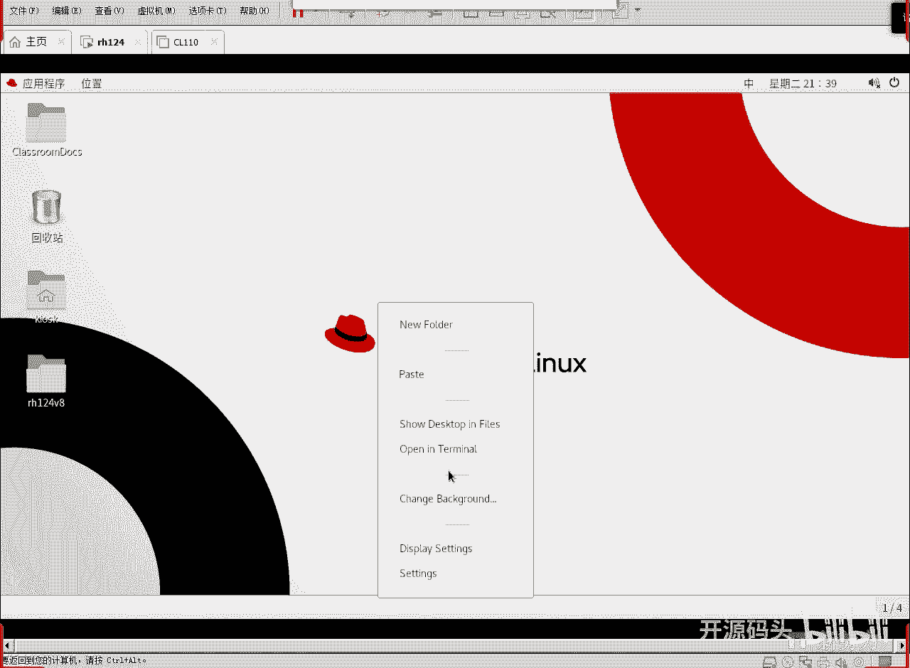
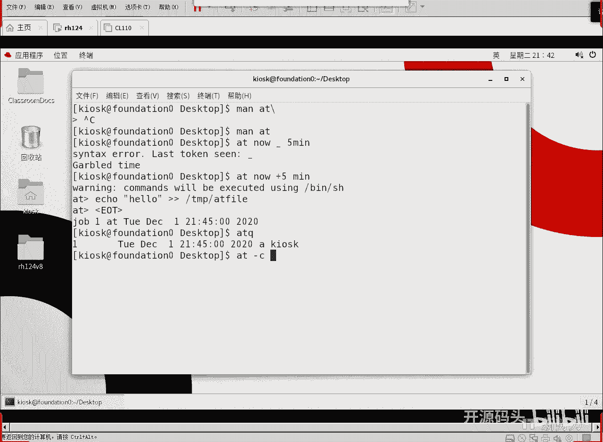
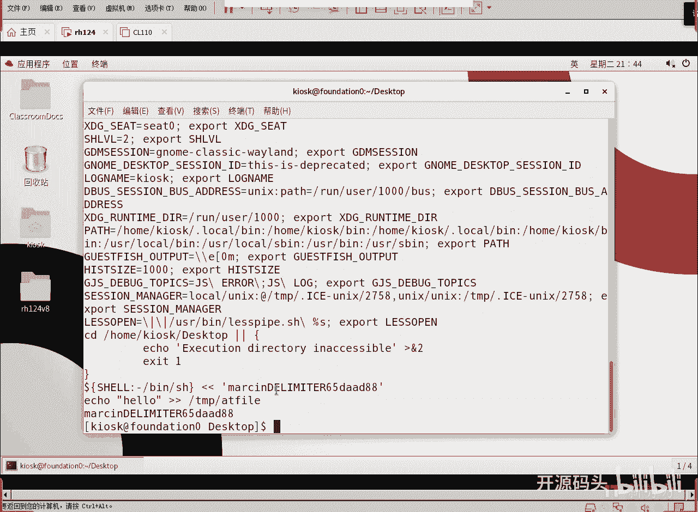
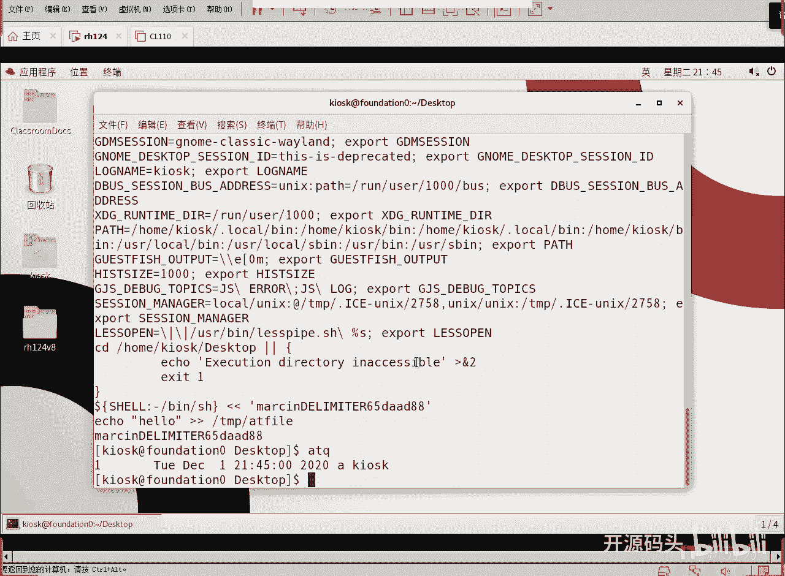

# 红帽RHCE RH134  2 计划任务与临时文件管理(1) - P1 - 开源码头 - BV1he4y1C7fB

我们今天呢来聊这个计划任务啊，呃计划任务呢呃指的就是呃我们有一些工作，或者有一些命令需要在特定的时间去执行啊，呃有些任务呢是有些命令呢是一次性的，而有些人又需要是周期性的，还有呢我们的系统本身的运行。

它也需要做一些周期性的这些整理整理性的操作，所以说呢呃我们还有系统的计划计划任务啊，或者叫计划周期啊，周期性的作业啊，还有呢临时性文件呢啊，我们也也有一个这个呃，就是相当于就说定期的进行。

对这个超时的或者超大的这种临时文件进行删除的这种操作啊，或者是呢还要创建一些结构啊，创建一些目录结构，有些临时性的东西呢，我们需要一些目录结构去存储，那我们还需这个临时文件，大部分是到时间点去清除。

也有一部分就是先把这个目录结构先创建好，因为没有目录结构的话，它里面它直接成文件，有可能成成不了，就是临时文件的这种管理，那这个其实呢也是周期性的。

所以我们今天呢其实这个计划任务的计划就呃我们有四个方面的内呃，四个方向的东西啊，那其中的第一个是一次性的人物，而后面这三个呢其实都是周期性的人物啊，周期性任务其实应该归一类是吧。

但实际上呢呃因为什么主体不太一样，正常情况下我们的计划任务呢可能是用户来做啊，这是第二个，那还有呢系统的任务啊，系统每到一定的时间呢去做一些维护性的这种操作，或者是状态检测的这种操作，这是系统性的作业。

说白了就是root用户，他所创建的规范就是由root身份来做的一些操作，呃临时性文件是吧，总共四个好，我们先来看第一个啊，第一个就是at任务啊，就是这个命令就叫艾艾特任务啊。

这个at任务呢其实就是呃一次性的啊，就是让你我们先at在在什么时间啊，在什么时间做一个什么样的任务，我们可以把一些命令写到一个呃就是脚本里面，然后直接写一个运行那个脚本的名字对吧。

或者是呢干脆就直接现场呢写啊，现场写命令啊，呃你比如说呃我们举个例子啊，at at啊，now就是现在加上五分钟，从现在起加五分钟后运行运行的内容是什么呢，mascript对吧，这就是。

我们的脚本我们可以直接把这个脚本的内容，通过什么向左的这种重定向啊，这个应该叫什么标准的输入是吧，呃向左的这种操作呢，把这些脚本内容传给艾特命令啊，传给这个艾特，然后艾特呢在从现在起加五分钟之后。

就开始把mascp里面的语句就开始依次执行啊，或者是呢我们直接写个at now加五分钟回撤，然后我们自己往里写内容也可以啊，写完之后ctrl d啊，打开ctrl d的这个快捷键就可以保存退出，好嗯。

你看啊，艾特tea time tomorrow，明天的下午茶，明天的下午茶时间啊，诶这个查时间啊，t太，这个时间应该是应该就是下午四点吧，应该是啊，下午茶应该是啊或者什么，四天以后，四days。

四天以后的下午，或者是什么呢，诶2016年的啊，呃几几月几日几点几分啊，这是没有写几分，就是个几点下午五点对吧，哎就说我们按照at所能识别的这种时间，让他去执行一个任务就可以了，这个实践呢形式多样化。

当然我们需要艾特命令能够识别出它才可以是吧，那我们这个时间呢呃在具体操作的时候，通过at的一个提示。

这里有很多方法啊，很多方法几点几分嗯，还有什么上午下午啊，这是下午四点钟是吧，就是喝茶时间，还有月和日以及什么年啊，各种写法都可以嗯，好那么呃要想做操作的话，直接去写，比如at now。

加上五分钟回车啊，加号啊，加上五分钟，他说这个命令行将被bn下面的shell去执行，是s h不是bus，是bs之前的那个版本啊，然后呢我们可以这样去做eq，哈喽，然后把它追加到一个文件。

比如说追加到这个tp下面的，at file，啊control d，结束符啊，ctrl d你可以写很多行命令啊，可以写很多行命令啊，这样的话呢ctrl d打了之后呢，这个命令就会保存下来。

我们可以用s q去查询一下当前这个用户呢有一个任务，任务号是11号任务艾特，我们也可以去看一下这个命令的内容啊，如果要看命令内容就是杠c啊，a杠c gl和eq是一样的，做一样的功能啊。

就是显示现有的任务，艾特一个job，然后呢杠c就是显示这个任务的什么呢，具体内容是什么啊，它不像我们想象那样，我们看一下at gc。

然后1号任务回车啊，你会发现我们其实当时只打了这么一行，对不对，这是只打了这么一喊而已啊，那前面这些东西呢其实都是环境变量，就是我们运行这个命令之前的一些环境变量。

那艾特命令的意思是不管这个环境变成什么样子，它的参数是总是不变的，所以说其实我们打的只是这么这么一条命令啊，就是从这个shell边下面的bus开始啊，然后遇到这个字符呢就结束啊。

遇到这个字这个字符就在这里啊，这是它自动生成的啊，自动生成的，然后这就里面的就我们就写了一句命令而已是吧，过上五分钟之后呢，我们的一个hello就会写到tm下的at file这个文件里面。

我们是呃就是所谓的那个后台运行啊，或者是什么没有终端式的运行啊，这种呃计划任务呢，因为操作的时候不见得这个当前用户就在登录啊，不见得当前用户就在这个界面上，所以说它不会出现终端，他也不会在前前台运行。

所有的计划任务基本上都是在后台运行，所以我们是你说哎我想把它显示屏幕上，那不可能啊，我们一定要把它显示什么显示到一个文件，就是重定向的一个文件里面啊，除非什么呢。

我们使用脚本技术去测出来现在有有没有啊活动的终端，然后我们确定的用eq呢把这个命令发到那个终端上啊，发的那个终端文件里，其实终端上就会显示出来啊，就终端设备文件里面啊，发到我们的dv下的终端设备的。

上面我们的终端上也会显出来啊，那一般情况下，如果我们不刻意这样去做的话，所有的计划任务都是什么呢，都是后台运行啊，它不会自动的出现在屏幕上啊。

ok好这是那个at啊，at c那如果要删除一个job，那就at remove啊，at remove就是删除rm啊，i rm把这个任务号删除，当然如果说这个任务已经做过了。

那自然他就不用就a的q就显示不出来了，显示不出来就没有工作了，ok我们如果说，sq这个时间点到了以后啊，它就会运行，如果呃运行完了，这个任务就没了啊，我也不不计划删了，如果想删的话，怎么删。

艾特rm一号回车就可以了，把这个任务就算删掉了啊，ok我们为了看到这个效果，我们就是等他吧。

