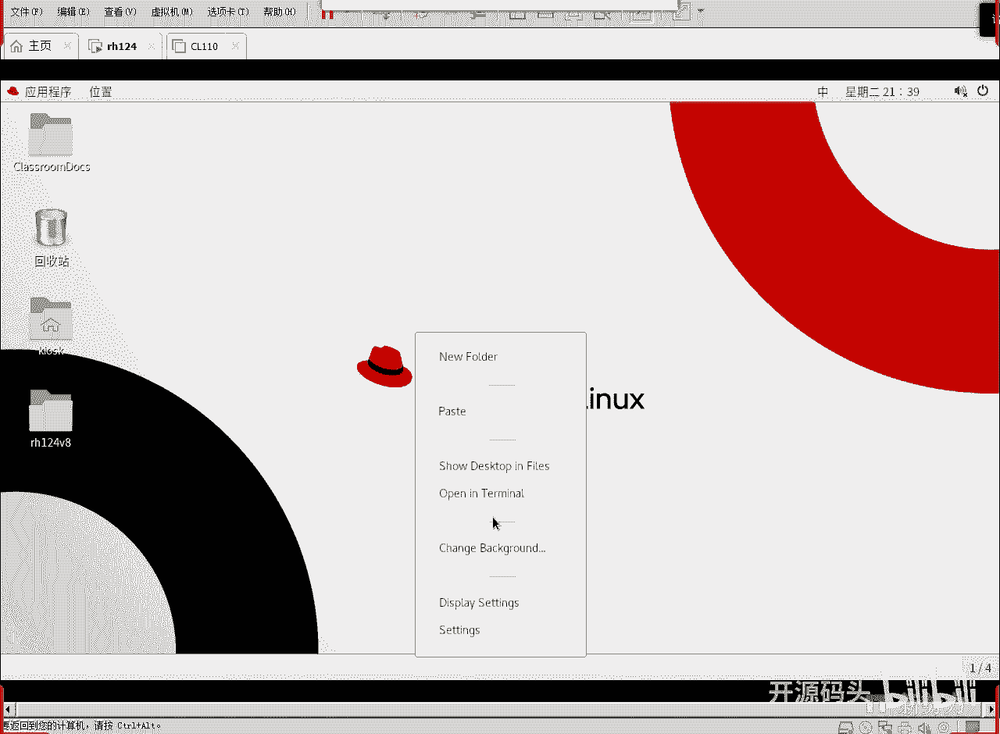
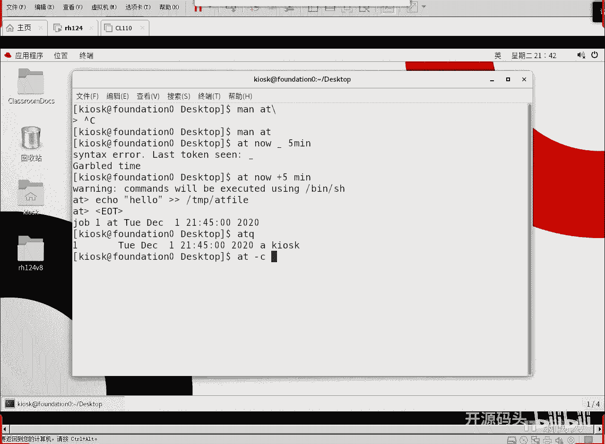
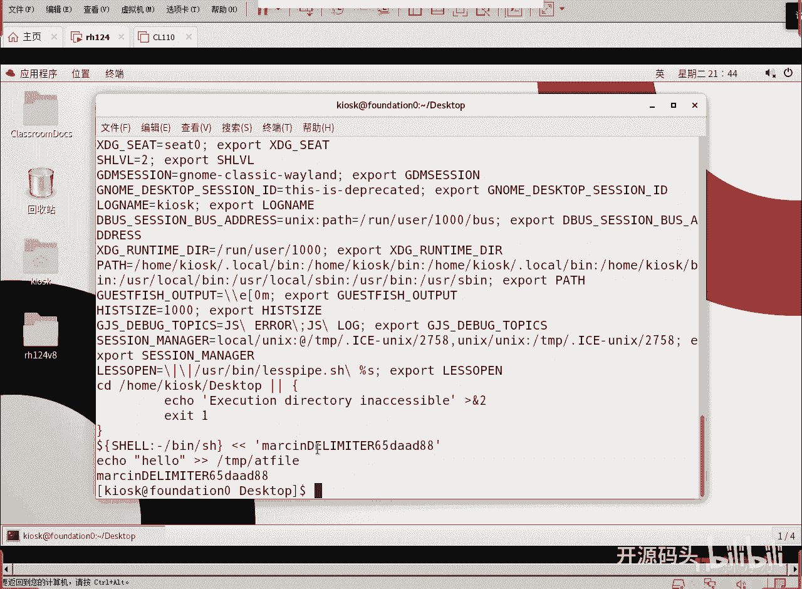
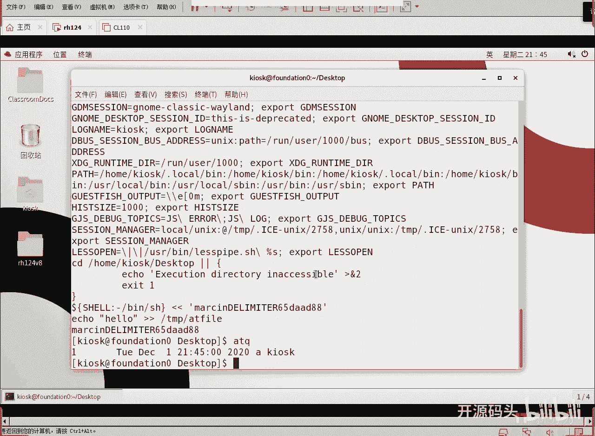

# 红帽RHCE RH134：2：计划任务与临时文件管理(1) 📅

在本节课中，我们将要学习Linux系统中的计划任务与临时文件管理。计划任务允许我们在特定时间自动执行命令或脚本，这对于系统维护和自动化工作至关重要。我们将从一次性任务开始，逐步深入到周期性任务和系统维护作业。

## 一次性任务：at命令

上一节我们介绍了计划任务的基本概念，本节中我们来看看如何使用`at`命令创建一次性任务。`at`命令用于在指定的未来时间点执行一次性的任务。

`at`命令的基本语法是：`at [时间]`。执行此命令后，会进入一个交互式界面，我们可以输入要执行的命令，最后按 `Ctrl+D` 保存并退出。

以下是`at`命令支持的一些时间格式示例：
*   `at now + 5 minutes`：5分钟后执行。
*   `at teatime tomorrow`：明天下午（通常为16:00）执行。
*   `at 5pm 2024-12-01`：在2024年12月1日下午5点执行。

### 管理at任务

创建任务后，我们需要知道如何查看和管理它们。



使用 `atq` 或 `at -l` 命令可以列出当前用户所有等待执行的`at`任务。

```
atq
```

使用 `atrm [任务编号]` 或 `at -r [任务编号]` 命令可以删除一个尚未执行的`at`任务。



```
atrm 11
```

如果想查看某个`at`任务的具体内容（包括执行时的环境变量），可以使用 `at -c [任务编号]` 命令。

```
at -c 1
```

**重要提示**：`at`任务在后台运行，不会在用户当前终端显示输出。如果希望看到命令执行的结果，必须在命令中明确使用输出重定向（例如 `echo “Hello” > /tmp/at_file`）将结果保存到文件。



## 总结



本节课中我们一起学习了Linux计划任务的基础部分——一次性任务的管理。我们掌握了使用`at`命令在指定时间安排任务，以及使用`atq`和`atrm`命令来查看和删除这些任务。理解`at`任务是掌握系统自动化的第一步。在接下来的课程中，我们将探讨更强大的周期性任务工具。