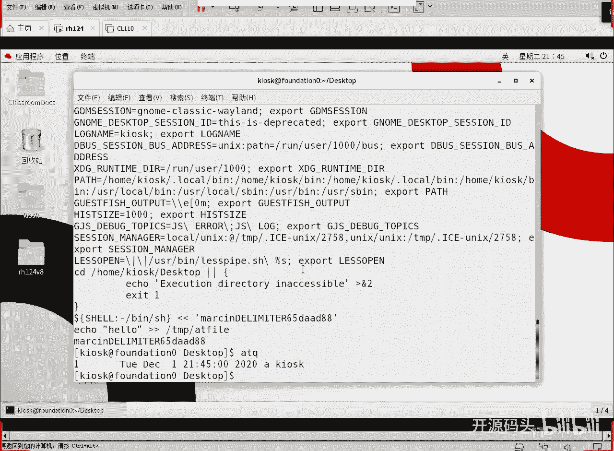
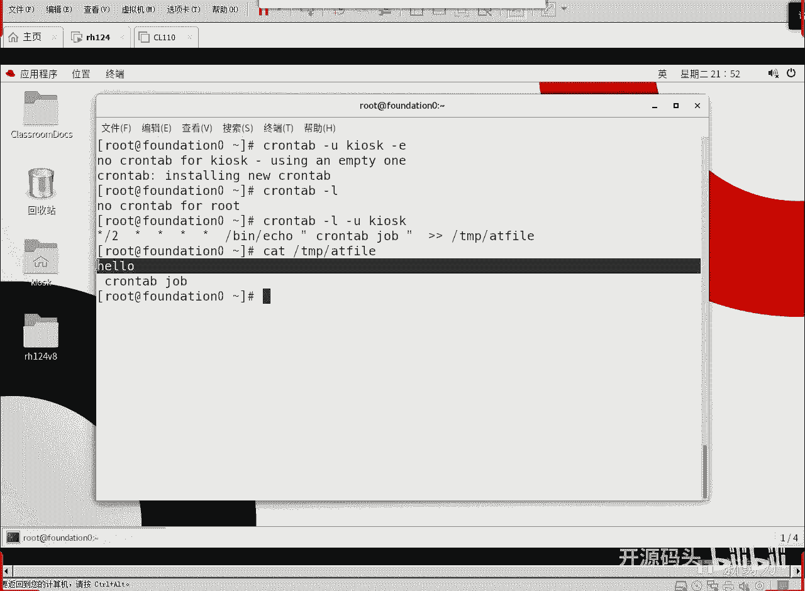
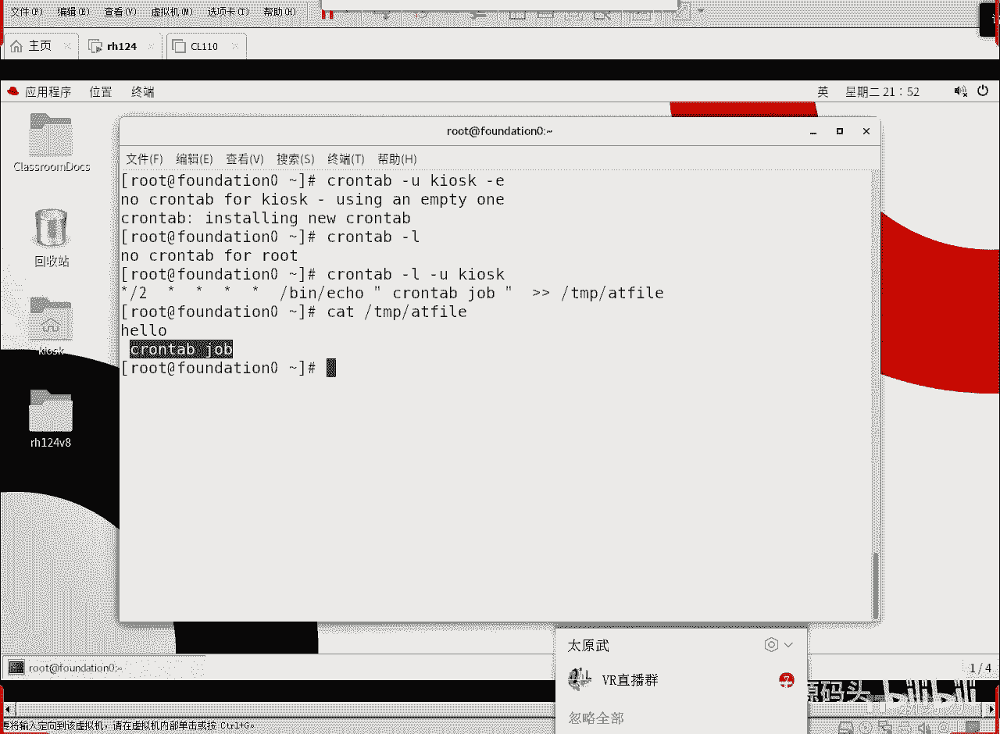
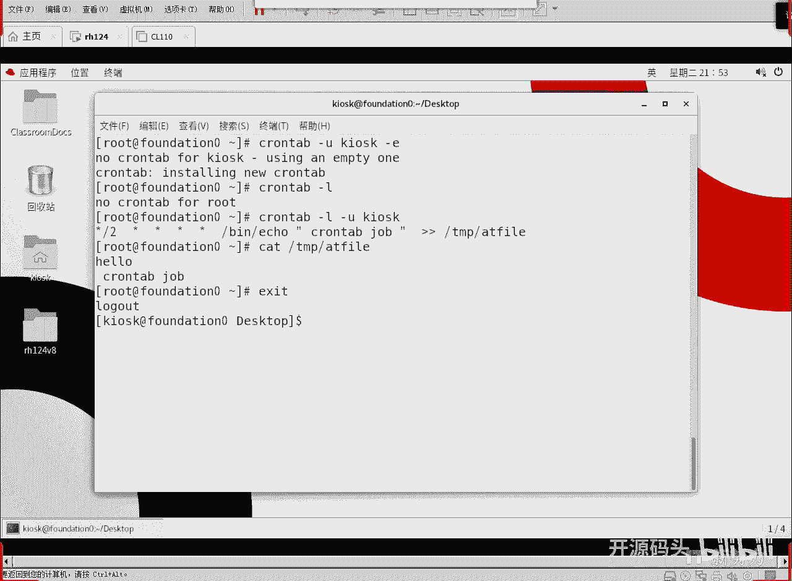
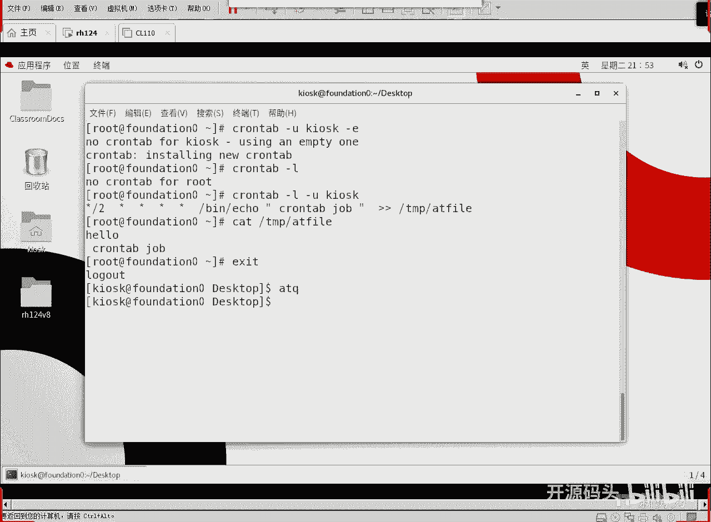
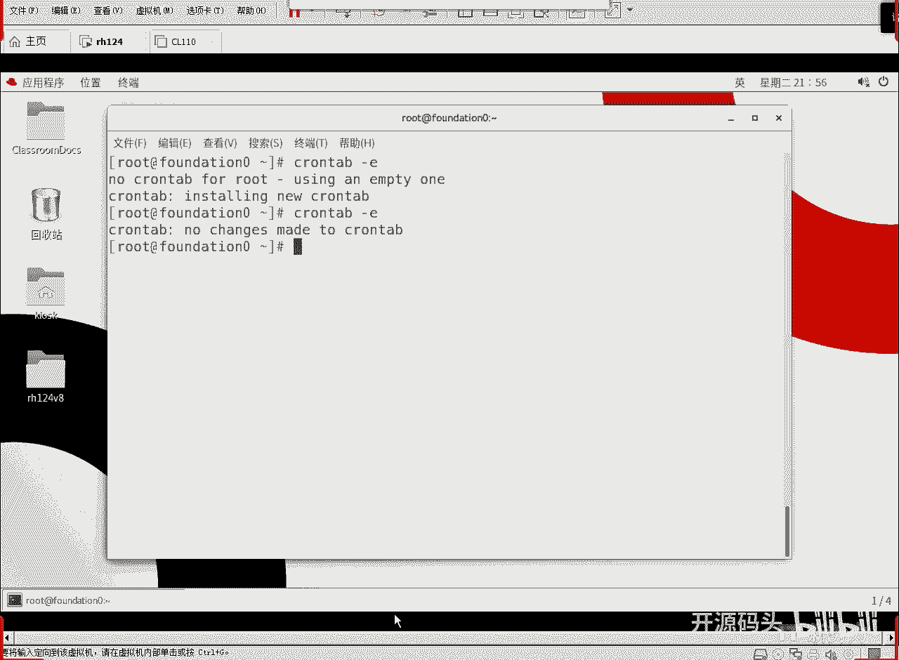

# 红帽RHCE RH134  2 计划任务与临时文件管理(2) - P1 - 开源码头 - BV1i14y1e7aa

ok那现在我们来继续看第二个，第二个知识点就是周期性的作业啊，相对于at这种情况来讲，at只做一次，你写这个时间啊，你写现在过去五分钟啊，如果是这个点呢已经跳过了，那这个任务就算没了。

比如说你现在写一个下午四点钟，比如呃，这是四天一下午的，四天以后，四天以后的下午啊，你要直接写一个，就是说比如说几点几分啊，比如说你现在写一个1211：50，那么它就涨近21：50，如果今天的21：

50，你正好关机了，那么他明天的21：50，他会再做一次啊，但是一旦说那次做过之后，他就不会再做了，这个任务就算过去了啊，有艾特任务呢相对来讲是一次性的，你写的这个时间，只要他在这个时间。

他就认为他是离现在最近的那个未来的时间啊，你写个21：50啊，如果今天的21：50他没做，那他明天21：50会做啊，他总是在看离现在最近的那个唯一的那次事件啊，他不会每天都做啊，也不会说是这个。

当然你要写上日期的话，你说是今天啊，比如说今天是12月1号，你写12月1号的啊，2020年12月1号的21点，那那肯定那明天他也不会执行了，因为这个时间点已经过了啊，明确的时间也得过了，如果你不写。

明天不写，天只写一个节点几分啊，那么他今天都没做，那明天到了那个时间点，他也会做一次，反正他得做一次啊，艾特是一次性任务，那么相对于爱情来讲，周期性任务呢就是每天都要做的事情啊。

甚至于每分钟都要做的事情啊，那这个东西呢就是credible，用cortable这个命令来操作这个任务，写下来写下来的那个命令的啊，或者写下了那个计划，计划作业呢它是周期性的啊，你给他定一个时间点。

他到了每一个大周期里面的这个小时间点的话，它都会执行呃，我们直接看一下就明白了啊，唱成a啊，credible，杠u是用户啊，我们是普通，我现在是普通用户，不是root，所以说我我是不能指定的啊。

我们切换到root好吧，数，看出来啊，cnt b我们写个杠u啊，kiosk是吧，我给k sk这个用户指派，用这个人的身份来给他指派一个任务，什么任务呢，杠一编辑开始编辑啊。

杠优杠e当然你杠u也可以省略不写啊，杠u如果省略不写，那就是当前用户好吧好回车了啊，那么这个任务呢其实很简单啊，我们直接写时间点啊，第一个时间点是分，第二个是十日月啊，分时日月周。

你要记住这个顺口溜的话，基本上这个cortable就没有什么要做的事情了啊，啊比如说呃呃bn下面的e c h o这个命令啊，显示什么呢，显示c r o n t a b空格啊，或者前面加空格。

db cdb cooper job，然后呢把它追加到tp下面的at file里面，我们还是往这个fl里面放是吧好，那么这个是什么概念呢，我们是不是全用新代替了，这个是分时日月周啊。

就是几月几日几点几分啊，星期几啊，几月几日星期几，几点几分啊，你只要写上，如果说不确定这东西就是星号代替就可以了啊，不确定是什么时间点，星号代替，如果确定了，比如说我每隔每隔三分钟想做一次这个操作。

那么你得那个芯片三，因为第一个参数是不是就是分对吧，我们用这个分啊，用这个所有是整整整点的那个就是分的那个整点，到了以后啊，零一分到了零二分到了零三分到了啊，每一分钟每个分钟时间除以一个三啊。

然后呢意思就是说什么呢，就是每三分钟做一次啊，每三分钟做一次或者什么呢啊我们这里写个新撇什么，12这是什么意思，是不是第二个参数是时间，就是小时的意思，那么小时所有的小时里面出一个12。

那就是每隔12个小时做一次啊，每隔12小时做一次这个事情，那我们为了让他快一点，你要是都是星星星这个位置什么呀，每分钟做一次，因为他最小的时间就是一分钟啊，好我们每隔两分钟做一次吧，性除以二啊。

每隔两分钟做一下这个命令好，w库存盘退出啊，如果想看呢啊如果是艾特命令是不是eq啊，那crotable呢啊，credible最直接的就是你在杠e对吧，再杠一杠一去看一下，或者什么我，们用杠l也可以看啊。

root没有cortable，那我加个杠u是什么k i s k啊，这是不是我们刚刚写的每两分钟啊，分钟除以二，就是每两分钟做一下这个操作啊，我们这个计划任务呢最小的时间点就是分钟，没有秒啊，没有秒啊。

分时月中记住这个顺口溜啊，记或者记住这个字段，基本上就没事，后面就是你要做的任务是什么啊，我还是写了一条命令对吧啊，你也可以写一个剧本啊，写个脚本自己编好的脚本，那脚本里面多复杂，那就无所谓了。

反正我的脚本到点去执行对吧，跟艾特一样，所有的这个计，划任务都是什么后台运行啊，它默认情况下是不会显示到屏幕上的，除非你刻意的让他一定要显示到屏幕设备上，那没办法是吧，那正常情况下所有的任务一到运行点。

它是后台运行好了，我们cut一下tp下面的，那个艾特fire看哈鲁已经进来了。

hello。

进进来，而且已经进了一个什么，进了一个cortable啊，一个cortable应该一个cortable已经进来了啊。

好了啊，呃我们再过两分钟之后呢啊，第二个cortable就又会出来啊，因为这个这个是周期性的啊，这个hello是不是一次性的啊，如果现在艾特q啊，当时我们是k sk吧。

退回k s k i d q是不是没有任务了啊。

因为任务已经执行过了是吧。

at命令只是一次性的，它过了就没了啊，cortable不是core table呢，一直按照按照这个啊周期你设定好的周期去运行啊，所以说它难吧也不难是吧，你只要记住，这个时间点的一个规范字段啊。

时间点的规范字段就可以了，记住这个顺口溜，分时日月周，记住这个参数的话，按照你的时间参数自己去写就可以了啊，或者是什么呢，我们可以去这样去做是吧，比如说呃每每天的啊凌晨零点钟啊，或者是凌晨一点钟。

凌晨一点零一点整开始的做我们的备份操作对吧，那你应该怎么写，应该这么写，是不是零啊，凌晨的一点整是吧啊cro就用root做吧，因为备份任务往往是比较重要的是吧。

好用root身份在做c l n t b刚毅不写用户，就是当前用户回车，然后凌，晨一点钟做备份怎么做，零分一是吧，凌晨一点钟一点分啊，然后呢，日月不说了对吧，热周不定，热搜就是通配符啊。

或者叫什么任意的到这个点的时间都要做啊，然后我们可以写什么啊，自己的备份，嗯你做一个备份脚本嘛，啊bn下面的bn下面的这个back up s h z编一个备份脚本是吧，到了晚上就是说凌晨凌晨一点分。

那就会自动的开始执行备份脚本，那备份工作呢就开始了是吧，当然备份脚本你得自己去编对啊，你也可以直接调用那个dump，就调用那个dump音，就是真正的用大部命令来做一下备份，也可以退出，跟vm一样啊。

冒号wq存盘退出对吧，ok有人说你没有这个脚本啊，你没有这个边上没有back up这个脚本啊对吧，没有呢，他顶多到时候时间点到了以后，他会什么报错，他会报错，当，然凌晨一点钟我的机器肯定是关的。

关了过去了就过去了啊，他不会纠结于以前没有做的概念啊，因为只有在机器开机的情况下，他才能做这些操作，对不对，如果说机器不开机，他怎么操作，对吧啊，下一次再起来，他会确定，如果说时间点确定是已经过去了啊。

那就上次任务就算不做啊，我下次点到了再做啊，如果说每次到了点，你都是关机，那每次都做不了，这肯定的对吧啊，ok cortable，杠一啊，或者杠一ok好。

这个就是周期性的任务啊，杠优杠啊，还有如果要删除的话，是杠r remove啊，gr啊，cortbgl是看看到之。

