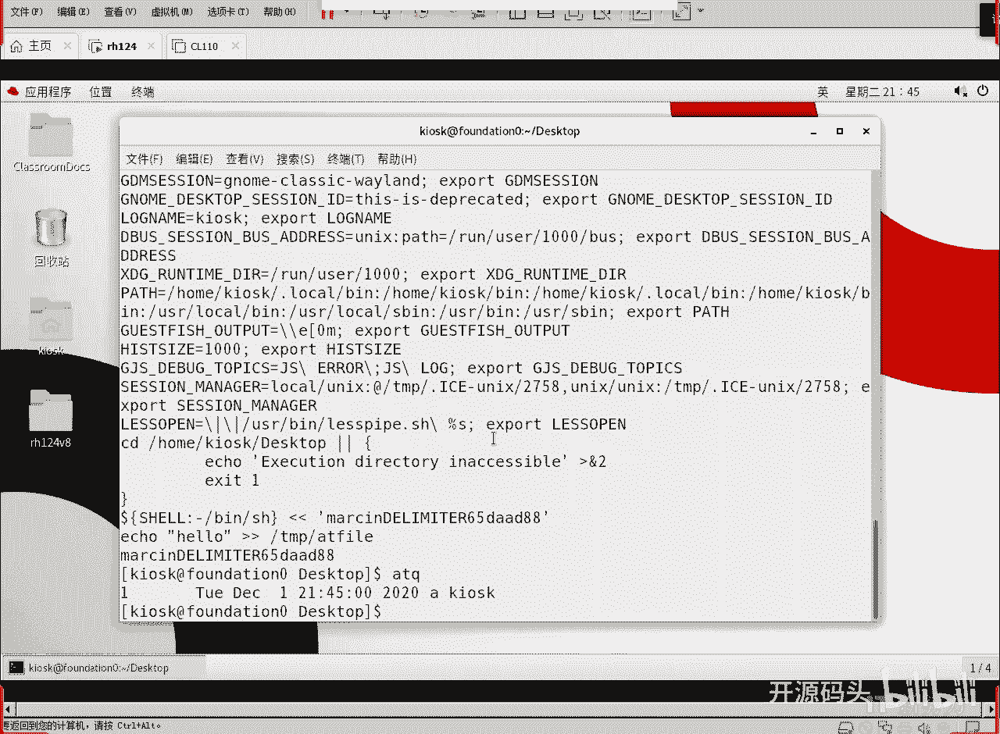
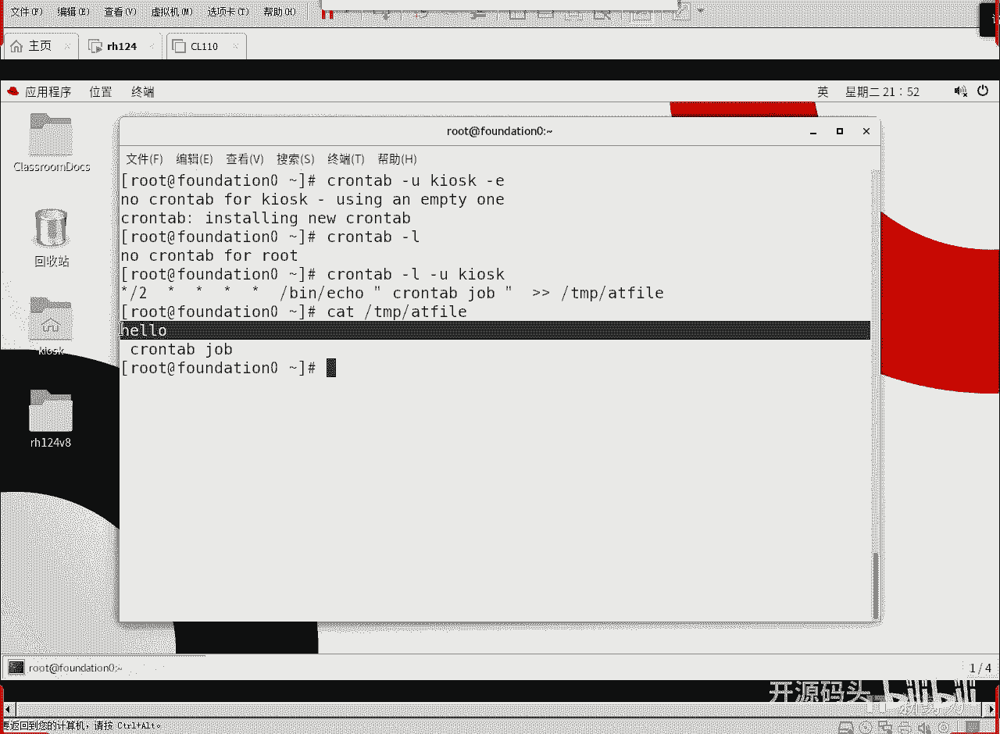
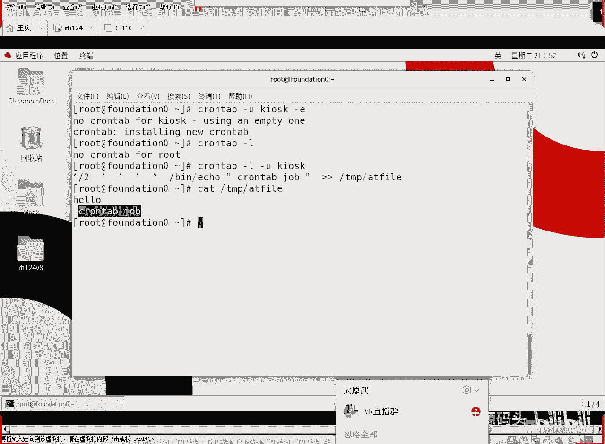
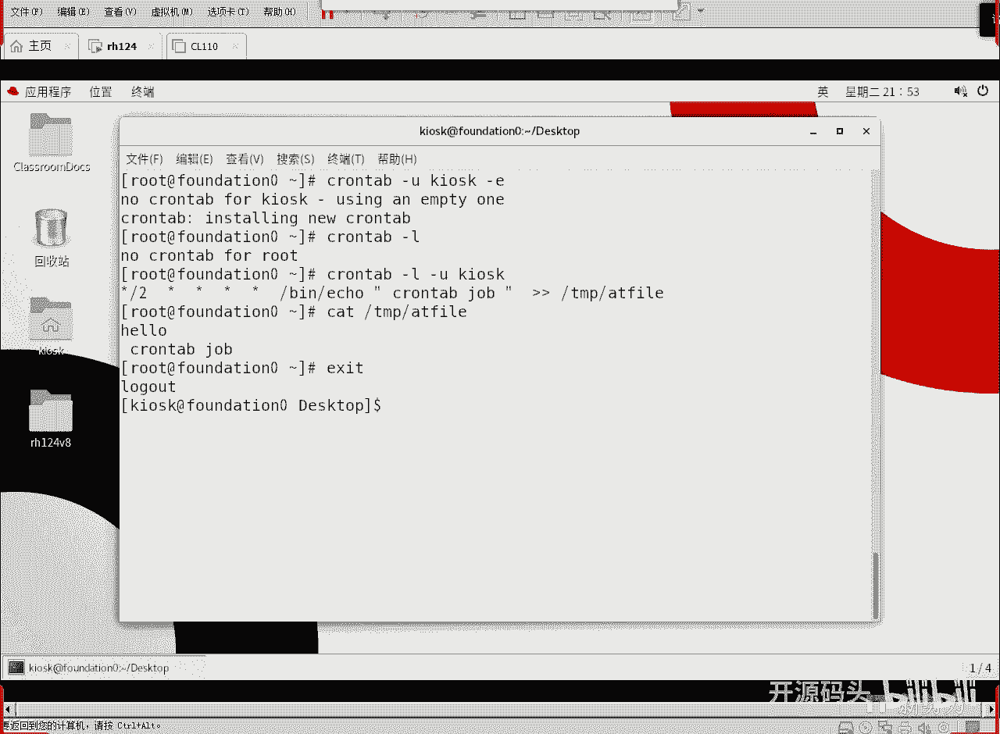
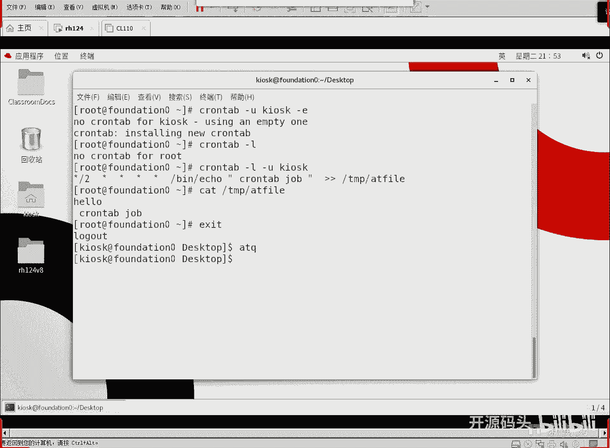
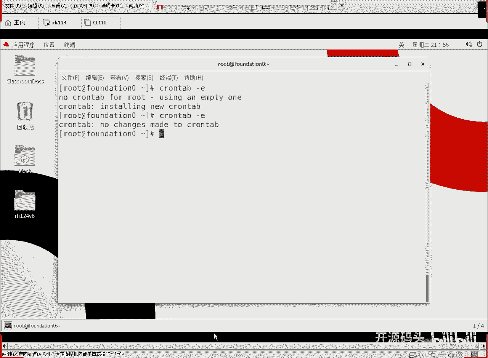

# 红帽RHCE RH134：2：计划任务与临时文件管理(2) - P1



## 概述

在本节课程中，我们将学习周期性计划任务的管理。上一节我们介绍了一次性任务`at`命令，本节中我们来看看如何使用`crontab`命令来设置和管理需要定期重复执行的任务。

## 一次性任务与周期性任务的区别

`at`命令用于安排一次性任务。它只会在指定的未来时间点执行一次。如果指定的时间点已经过去，该任务将不会被执行。

例如，如果你设置一个任务在今天21:50执行，但此时计算机关机了，那么系统会在明天21:50执行该任务。一旦执行完成，这个任务就结束了，不会再次运行。

`at`任务总是寻找离当前时间最近的那个未来时间点。如果你只指定了时间（如21:50）而未指定日期，且今天的该时间点已错过，系统会在明天的同一时间执行。如果你指定了具体的日期和时间（如2020年12月1日21:00），并且该时间点已过，则任务永远不会执行。

与`at`的一次性不同，`crontab`用于设置周期性任务。这些任务可以每天、每小时甚至每分钟执行，适用于需要定期重复的操作。

## 使用`crontab`设置周期性任务

`crontab`命令用于操作周期性任务计划。用户可以为特定用户或自己创建、编辑、列出和删除周期性任务。

以下是`crontab`命令的基本用法：

```bash
crontab -u [用户名] -e
```

*   `-u`：指定任务所属的用户。如果省略，则默认为当前用户。
*   `-e`：编辑该用户的crontab任务列表。

### 时间字段格式

crontab任务的时间设定由五个字段组成，顺序为：**分 时 日 月 周**。

为了方便记忆，可以记住这个顺口溜：**分时日月周**。

*   **分**：分钟 (0-59)
*   **时**：小时 (0-23)
*   **日**：一个月中的第几天 (1-31)
*   **月**：月份 (1-12)
*   **周**：一周中的第几天 (0-7，其中0和7都代表星期日)

每个字段可以使用以下符号：
*   `*`：代表所有有效值（例如，在“分”字段使用`*`表示每分钟）。
*   `*/n`：代表每隔n个单位时间（例如，在“分”字段使用`*/2`表示每两分钟）。
*   具体数字：指定确切的时间点。

### 任务设置示例

我们通过一个例子来理解如何设置。


假设我们要为`kiosk`用户设置一个任务，每两分钟执行一次，将字符串“crontab job”追加到文件`/tmp/atfile`中。



操作步骤如下：
1.  切换到`root`用户，以便为其他用户设置任务。
2.  使用命令`crontab -u kiosk -e`开始编辑`kiosk`用户的crontab。
3.  在编辑器中，输入以下行：
    ```
    */2 * * * * /bin/echo "crontab job" >> /tmp/atfile
    ```
    *   `*/2`：在“分”字段，表示每两分钟。
    *   `*`：在“时”、“日”、“月”、“周”字段，表示不限制，即每天每小时的每两分钟都执行。
    *   `/bin/echo "crontab job" >> /tmp/atfile`：要执行的命令。
4.  保存并退出编辑器（在vim中按`Esc`键，然后输入`:wq`）。



### 查看与管理任务

设置完成后，你可以查看或管理这些任务。





以下是相关的命令操作：

*   **查看任务**：使用`crontab -l`命令可以列出当前用户的任务。如果要查看其他用户的任务，需要root权限并使用`-u`选项，例如`crontab -u kiosk -l`。
*   **删除所有任务**：使用`crontab -r`命令可以删除当前用户的所有crontab任务。

### 任务执行与日志

crontab任务会在后台静默运行，除非命令本身指定了输出到终端。你可以通过查看目标文件（如示例中的`/tmp/atfile`）来验证任务是否按计划执行。

例如，等待几分钟后，使用`cat /tmp/atfile`命令，可以看到文件中已经追加了多行“crontab job”文本。

## 实际应用场景示例

一个常见的应用是设置系统自动备份。例如，你希望每天凌晨1点整自动执行一个备份脚本。

你可以这样设置（以root用户身份）：
1.  运行`crontab -e`。
2.  添加以下行：
    ```
    0 1 * * * /bin/bash /path/to/your/backup.sh
    ```
    *   `0 1`：表示在每天1点0分执行。
    *   `/bin/bash /path/to/your/backup.sh`：指定要执行的备份脚本的完整路径。

**重要提示**：如果到了计划执行时间，但计算机关机了，那么该次任务将被跳过，不会在开机后补执行。cron服务只会在系统运行时检查并执行到达时间点的任务。



## 总结

本节课中我们一起学习了周期性计划任务的管理。我们了解了`crontab`与`at`命令的核心区别：`at`用于一次性任务，而`crontab`用于周期性任务。我们重点掌握了`crontab`命令的用法，包括如何使用`-e`编辑、`-l`查看、`-r`删除任务。最关键的是，我们学会了**分 时 日 月 周**这五个时间字段的配置方法，通过使用`*`、`*/n`和具体数字，可以灵活地设定任何复杂的任务执行周期。合理使用`crontab`可以自动化许多日常系统维护工作，如定期备份、清理日志等。