# 红帽RHCE RH134  2 计划任务与临时文件管理(3) - P1 - 开源码头 - BV1GW4y1i7tE

你看这个任务这个实验是个什么东西，以spt的用户身份登录的计算机是吧，然后quit down杠e开始编辑星除以二，星除以二，是不是每两分钟，然后九到16点，九点到16点就是朝九晚四是吧，朝九晚四啊。

呃中午不吃饭的话，朝九晚四也够了是吧啊，呃那么从九点到14点每隔两分钟啊，分是每隔两分钟，然后呃几月几日不管啊，几月几日不管啊，周一到周五看到一杠五，周一到周五啊，就这样去写，那这句话怎么理解。

周一到周五每一天的九点至16点，每隔两分钟就做一次任务，做什么任务呢，把日期追加到home下的student下面的my first critic job，这个文件里面，就这个文件叫my下滑杠。

first下滑杠crow，下滑杠drop对吧，就是每一周一到周五的上午九点到下午16点，然后分钟是每隔两分钟啊，去做一个，把这个日期输出到my first rod job这个文件里。

然后cortp gl可以看是吧，退出大冒号wq退出啊，退出以后呢，cortp gl看啊，你也可以去呃检验啊，看这个文件里面是否有东西了，那么要删除query gr，删掉删掉人物就可以了是吧。

我就不演示了，我们发发图再看一下刚才我们那个每隔两分钟做的事情，啊每隔两分钟做了个往那里面放东西是吧啊。

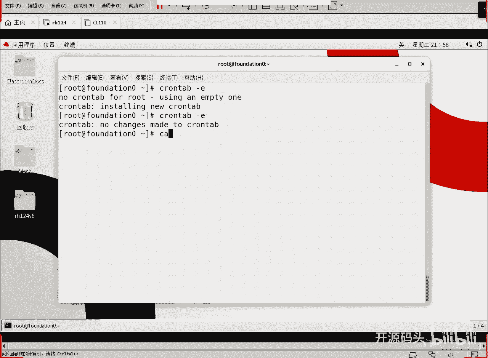

tp下载at fire里放东西，是不是从我做一下计划任务到现在已经几个几次，几个周期了，四个周期过去了是吧，或者table每隔两分钟一次，不会乱成这次啊，已经四个周期过去了啊，这个四个周期呢。

我讲了基本上把这个coc讲完了是吧，每隔两分钟吧，删不删删也可以啊，杠二杠二删除，然后你不是删root的啊，删的是kosk的任务回车，那再去看那个k2 sk的时候。

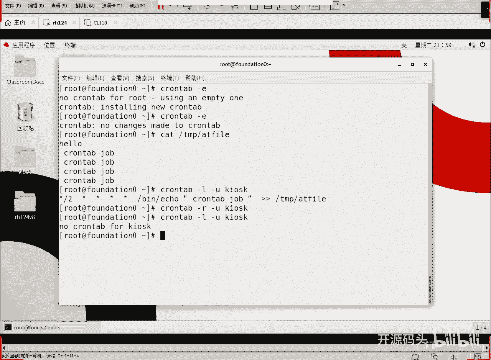

他就没有任务了，那这以后这个东西就不会再生再生成了啊。

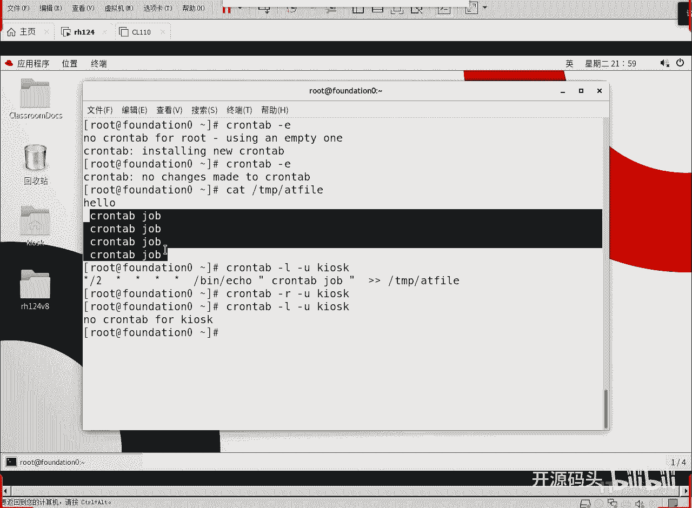

因为计划任务已经什么被删掉了啊，就被删掉了，好这是周期性的计划任务啊。

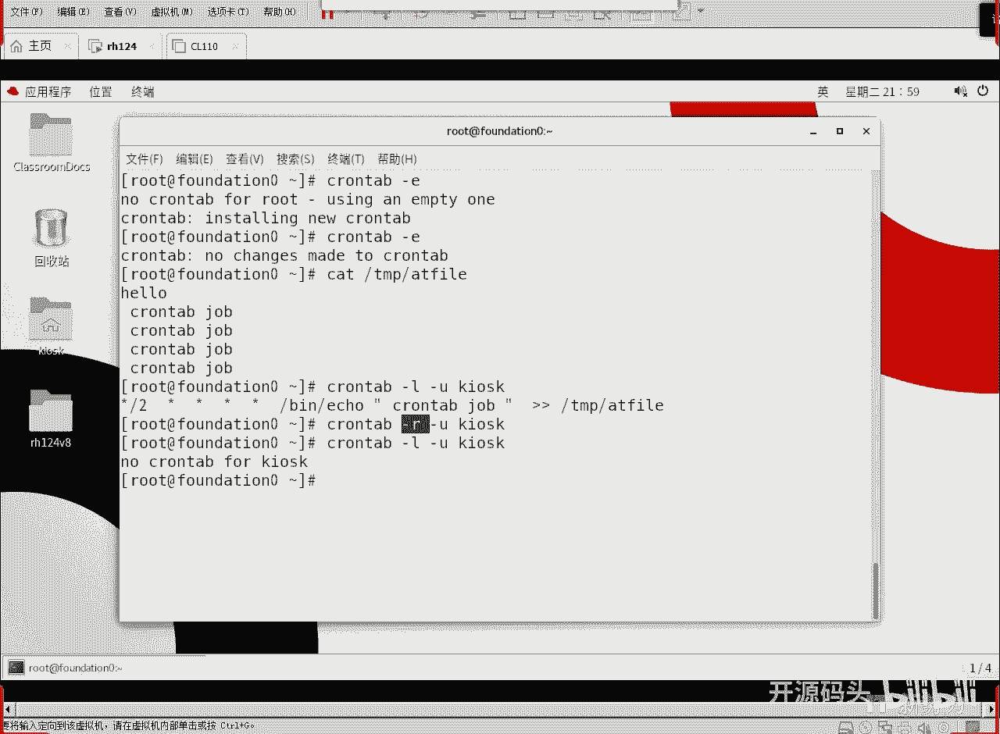

那这是一个考点啊，这个是一个考点，考试的时候肯定会考啊，就是说呃他会这么说啊，呃让你在每天的啊14：20啊，然后往某某文件里面输出一个内容叫啊empower或者是i am superman啊。

你看这是你你把一个内容每隔而不是每天，的14：20把这个i am superman输出到一个文件里面啊，然后就是怎么写分析解分析20嘛啊14。20嘛对吧，然后时间写14，然后星星星，那就是日月周。

不管啊，星星好，14：20，然后eq ec之后是吧，eq双引号m superman，然后双尖括号到那个文件就可以了啊，具体任务是啥，自己根据实际情况去写啊，提交要求啥就是啥，这是一个考点啊。

这是周期性的计划任务啊，好呃，第三个知识点，系统的计划任务，其实呢系统的计划任务和这个和我们那个呃用户的计划任务呢，其实是语法是非常非常接近的啊，语法是非常非常接近的啊。

只不过就是说我们在这个机制上来解决的时候呢，它是利用啊另外一套机制来解决的啊，用另外一套机制来解决这个问题也是周期性的啊。

我们可以查找这个ett的cortable etc下的cortable这个文件或者是什么呢，e t t crow。d这个下面的所有的文件啊，这里面的东西呢都是计划任务的定义，它的定义呢也是分时日月周。

然后呢多了一个参数叫usu啊，多了一个参数叫ur，所以说这种计系统计划任务啊啊这我们把它叫做系统的扣作业是吧，系统的q作业呢其实思路和我们的用户思路几乎是一模一样，并且还可以，就是说也是分时日月周。

然后加上什么加上命令，但是命令和分时日月和时间的中间还得写一下用户名，也就是说这个命令到时候是以哪个用户的身份来调用的，周期到了以后对吧，可以将可执行作业脚本放置于啊，就是我们还有一种办法啊。

这是一种办法，这个分时日月周是不是跟我们那个用户那个写法是比较类似的啊，除了这种方法之外呢，系统更热衷于用下第二种方法，第二种方法是什么呢，就是在ett下有个crow点，honey cro点。

daily co。weekly，还有crow。mony啊，就是每小时的作业，每天的作业，每周的作业，每月的作业对吧，诶他会有一个什么有一个专门的目录，你只要把你的脚本。

就是把你的可执行的脚本放在这个目录下就可以了啊，所以这种办法呢呃就是说我们的系统任务呢做得更好，或者是更喜欢用这种方法，而不是用这种啊，虽然说我们也可以用这种方法啊。

就用嗯e t h的quality bo或者是什么e t c core。d下面的任意文件啊，在里面写上分时日月周，哪个用户做什么命令，虽然我们以计划任务，系统的计划任务也可以这么去做。

但是其实大多数情况下是这样的，因为系统的任务一般周期性比较长，就是它的间隔比较长啊，周期间隔比较长，所以说呢一般我们会给它专门做什么呢，专门做一些对应的目录，然后把我们的需要在每小时运行的任务。

或者需要每天的需要每周的需要每月的这个任务，分别放到不同的目录下就可以了啊，你只要把你的那个脚本设置为可执行的，直接把它拷到这些目录里面，那么他到了一点，他就回头。

我把这个目录里底下所有的可执行脚本都运行一遍啊，这种机制叫什么呢，叫run parts啊，有这pass呢，它的命令呢直接就要的是目录名，然后他会想把这个目录里所有的可执行文件都执行一下。

那么你把脚本放在每小时里面啊，他就是每小时做一次对吧，每小时做一，次每天呢那自然就是每天做一次，因为它是用run pass命令来运行的啊，run pass命令就是给他一个目录。

它就会把目录所有的可执行文件全部都运行一遍，所以说我们这种美食任务啊，由run pass命令去执行啊，rpd命令我们可以看一下这个已经约好的这些命令啊，crow。d，crow。

d是不是刚才说的这个目录啊，对吧啊，这个目录这是传统的和我们的用户那个计划任务类似的，那个方式的那种格式吧，唉我们来看一下啊，我们来看一下已经存在的这个文件帮我们做了一些什么东西。

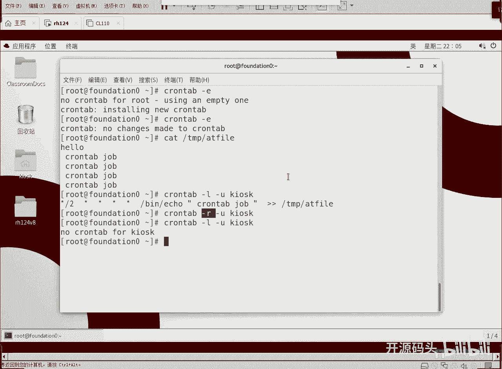

下面有个什么零零是它的执行顺序号。

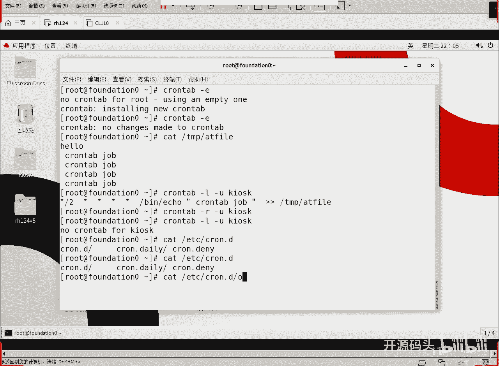

你看，重开啊，你看shell是什么，bus，有pass you pass的话就没必要去写绝对路径了，是吧好，你看一下这是什么，这是分吧，分时日月周，对不对，那么零一分啊，每一个小时的零一分。

任何一个小时的零一分开始做做什么，做rpd a cohy就这么简单啊，就是说这个命令就是运行，就是这个后它后面所跟的这个目录里的所有的脚本啊，rpx的作用就是这个样子啊。

所以说我们只要你看每个小时的零一分钟开始运行。

也就是说你把那个你的脚本直接放在这个目录下。

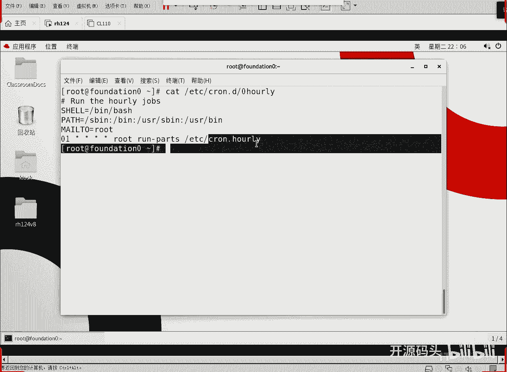

直接放在ez的rome holiday这个目录下就可以了，rpd就会把这里面的东西每在在每个小时的零一分钟开始依次执行，这是不是就是g系统在每隔一个小时就运行这个目录下所有的脚本。

那么这个目录下所有的脚本是不是就是每小时的脚本，ok他就这么个道理啊，就这么道理，ok那我们再再来看一下这个文件。

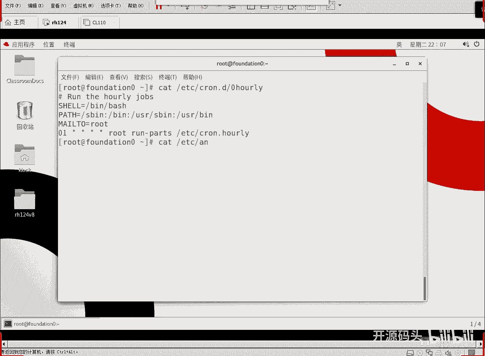

uncle table。

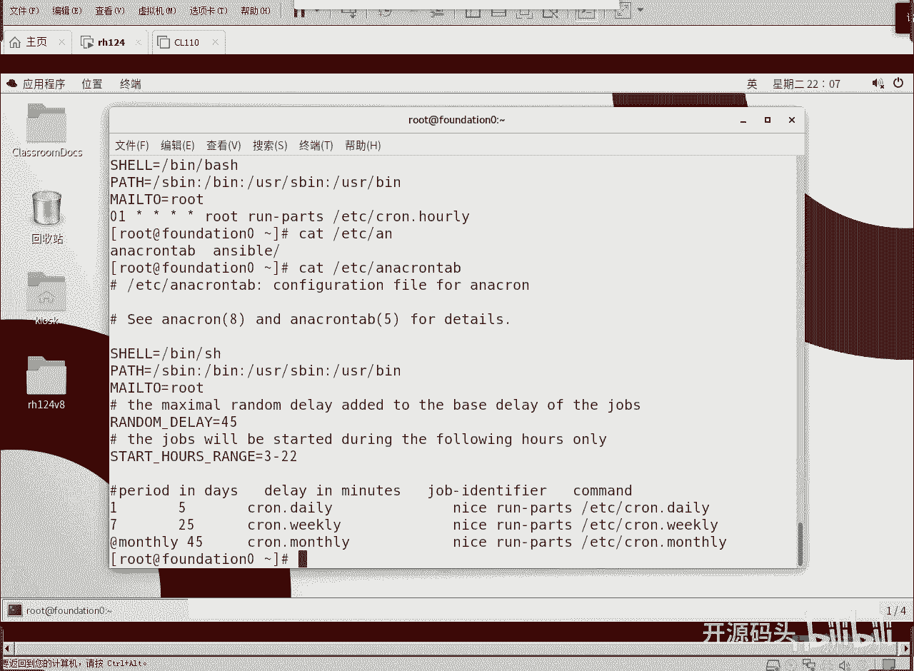

哎哟这个还蛮大的是吧，看一下uncle table呢是长周期的啊，那么长周期就是每天每周每月的这种，每天每周每月的是属于长周期，长周期是由uncle table来实现啊，来去相当于由他来维持啊。

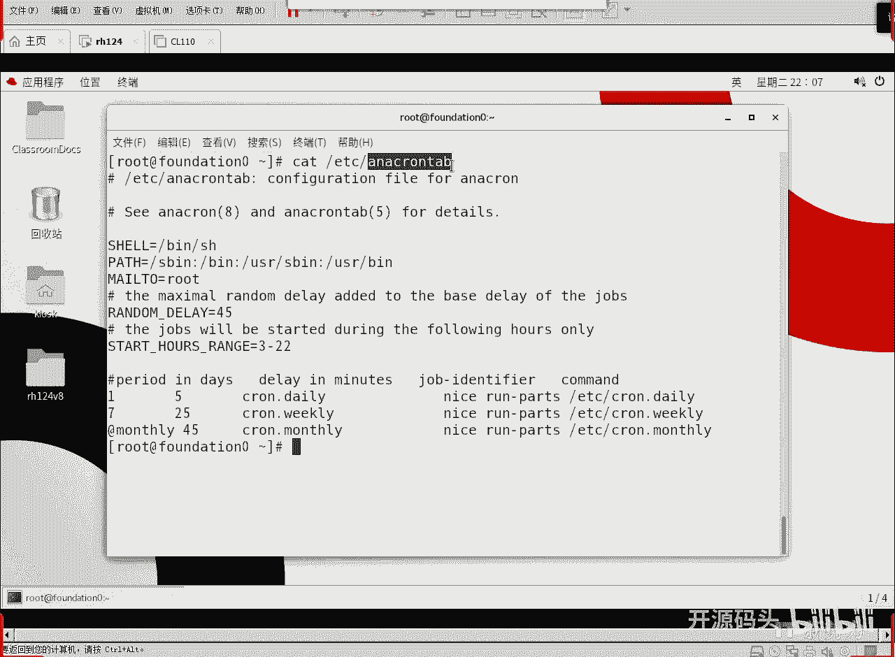

维护执行啊，这还是那个什么环境啊。

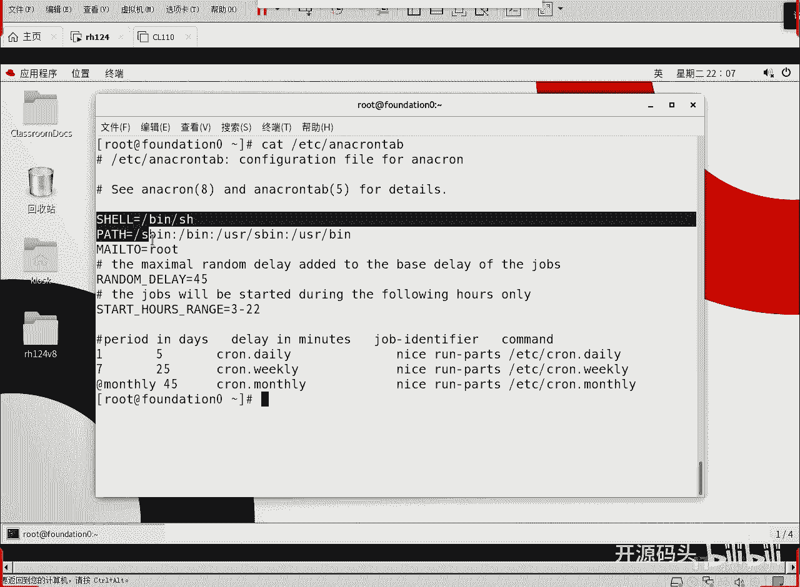

shell呀，pass啊，这些东西是吧，ok好这还有一个呃随机的等待45是吧，45我记得这么做没写啊，应该是45分钟啊，就是如果说这我们规定的时间点到了，实际上到了以后呢，它机器正在忙特别忙啊。

那我们就可以在啊等一个随机的这时间呢再去运行啊，等一个随机的，时间再去去运行它啊，这个随机延迟最大是45分钟啊，最大你看这这里后面没有写，我记得原来解释里面还有的啊。

就是45分钟在随机的延长0~45分钟才开始执行这些任务啊，因为这个周期足够长了，每天是吧，每天做啊，ok，还有一个是启动的时间周期是啊，三点到22点，就凌晨三点到晚上十点它才会执行。

那么在这个区间以外呢，它是不执行的啊，在区间以外的任务是不执行的啊，然后我们看一下下面这个，间隔对吧，间隔啊，间隔每隔一天，每隔七天，这个是一个变量啊，monthly。

这其实就是每隔30天或者是什么每月的，有的月是31天，有的月是30天对吧，那么它直接引用变量，这个变量呢根据元素不同，它们的那个30还是31就不一样，每隔多少，这是周期间隔周期。

每以天数为单位的千个周期，那每隔一天呢就是每天任务了，每隔七天呢就是每周任务了，每隔一个月呢就是每月任务了对吧，然后紧接着daily in minutes，就是延长的时间，你看每天任务延长什么。

可以延长五分钟，延长五分钟之后，呢再去执行我们的任务，每周任务是到点允许啊，延长25分钟，这个是允许延长45分钟，周期越长，给它可以延长的时间呢会越长对吧，然后这些任务啊，这是那个任务标识嘛。

每日任务每月任务，每周任务，每日任务是吧，这任务表示，然后要运行的命令是什么，要运行的命令就是以低优先级，nice，nice，这个命令呢就是给你一个低的优先级啊，让你比普通的那个程序的优先级低一些。

如果有前台或者正常的服务正在运行啊，那么我呢要低于它啊，leon是它的优先级值，你不写的话，他按那个，默认值去做啊，他没写是吧，以比较低的优先级还是运行这个rp，rpx就是运行一个目录里的内容对吧。

运行每周里的内容，运行每天里的内容，运行每月里的内容，对不对，所以说你只要把你的脚本放在相应的目录下就可以了，那么它呢专门有相应的什么配置文件，这个配置文件里面呢就规定了每隔多长时间，如果时间到了很忙。

等一个水，最多等多长时间就可以去运行这个目录下相应的脚本对吧，到了一定的周期，它就去运行相应目录下的所有的脚本，这时候我们的相应的什么每日每。

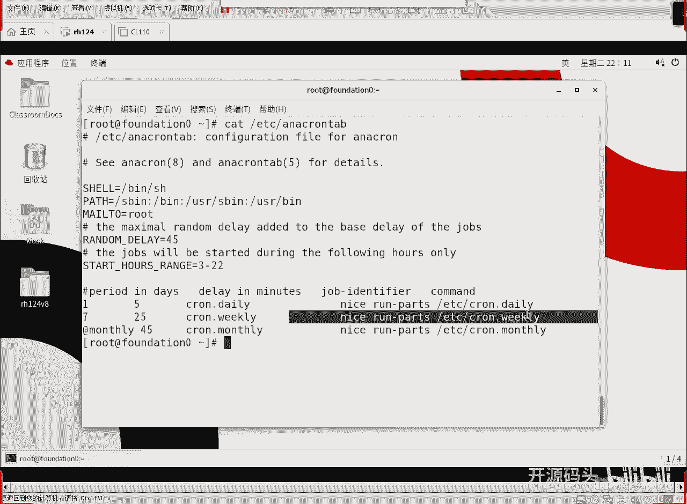

月每周的任务就出来了，ok好。

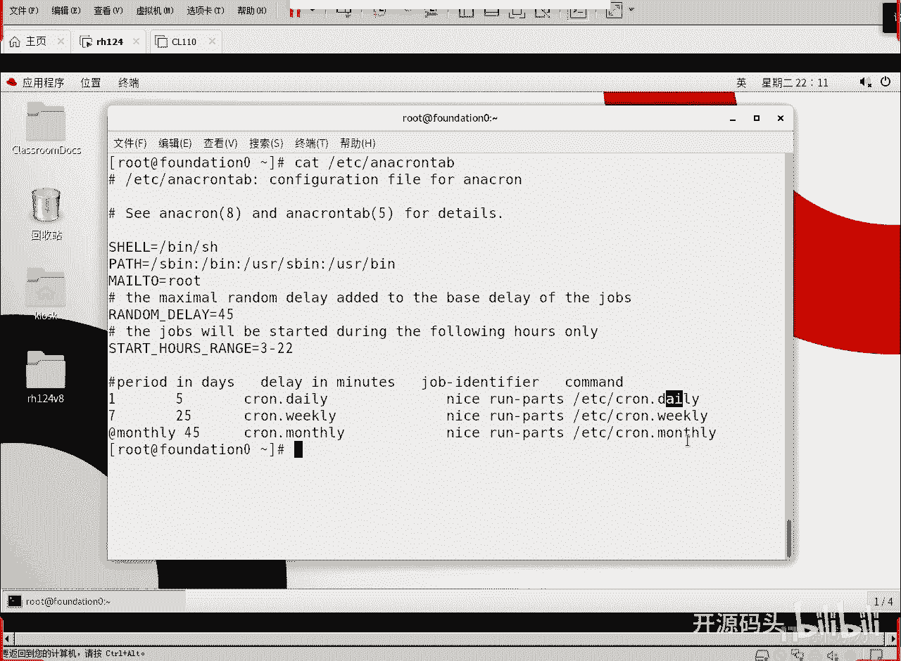