# 红帽RHCE RH134：2：计划任务与临时文件管理(3) - P1

## 概述
在本节课中，我们将学习如何配置和管理Linux系统中的周期性计划任务。我们将重点讲解用户级计划任务的创建、验证与删除，并介绍系统级计划任务的不同实现方式，特别是通过`run-parts`机制来管理每小时、每天、每周和每月的任务。

---

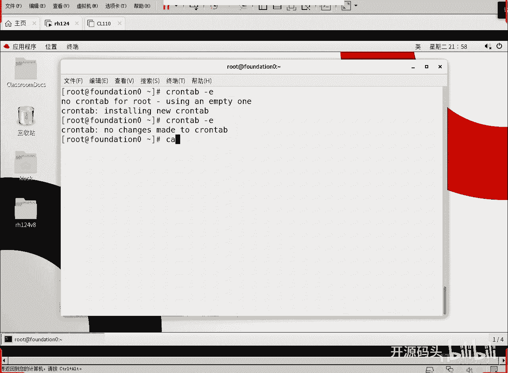

## 用户周期性计划任务配置

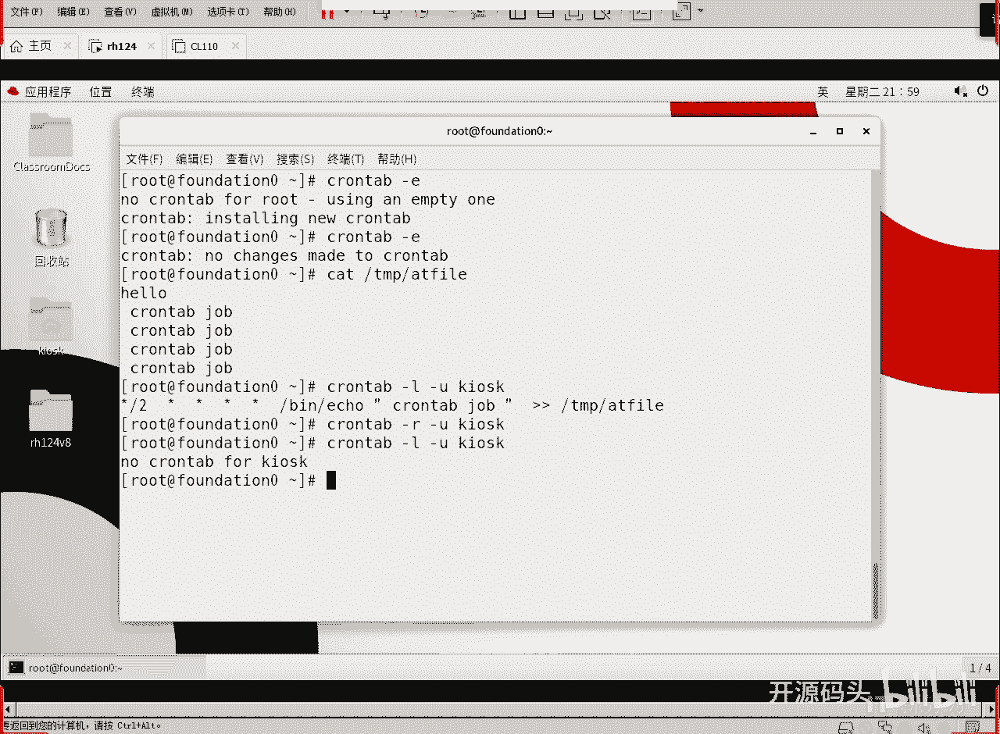

上一节我们介绍了计划任务的基本概念，本节中我们来看看如何为一个特定用户配置一个复杂的周期性任务。

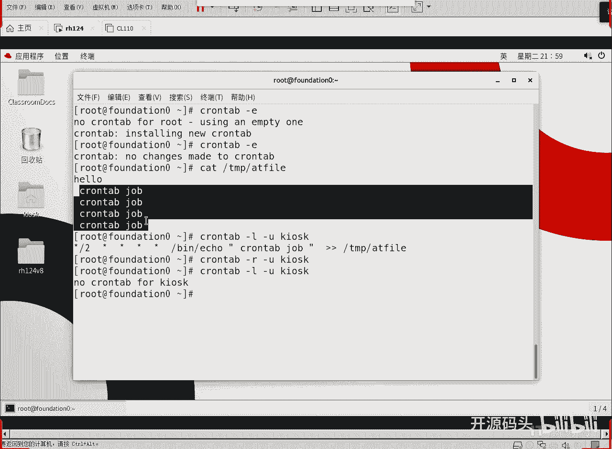

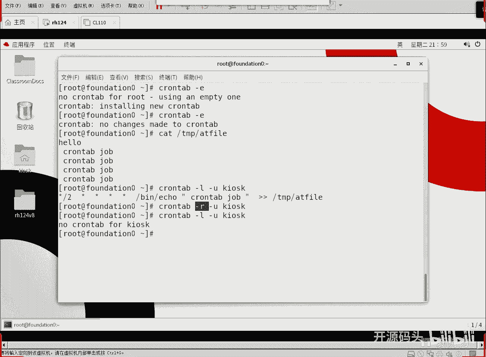

任务要求是：以用户`student`的身份，在每周一到周五的上午9点到下午4点之间，每隔两分钟执行一次命令，将当前日期追加到其家目录下的文件`my_first_cron_job`中。

以下是具体的配置步骤：

1.  使用`crontab -e`命令为`student`用户编辑计划任务。
2.  在编辑器中，添加以下任务行：
    ```
    */2 9-16 * * 1-5 date >> /home/student/my_first_cron_job
    ```
    *   **`*/2`**：分钟字段，表示每隔两分钟。
    *   **`9-16`**：小时字段，表示从9点到16点（包含）。
    *   **`*`**：日字段，表示每天。
    *   **`*`**：月字段，表示每月。
    *   **`1-5`**：星期字段，表示周一到周五。
    *   **`date >> /home/student/my_first_cron_job`**：要执行的命令，将`date`命令的输出追加到指定文件。

3.  保存并退出编辑器（例如，在vim中使用`:wq`）。
4.  使用`crontab -l`命令可以列出当前用户的所有计划任务，以进行验证。
5.  可以检查目标文件`/home/student/my_first_cron_job`，确认是否有新的日期内容被写入。
6.  若要删除此任务，使用`crontab -r`命令即可删除`student`用户的所有计划任务。

> **考点提示**：考试中可能会出现类似题目，例如“在每天14:20，将‘I am superman’输出到指定文件”。其任务行可写为：`20 14 * * * echo "I am superman" >> /path/to/file`。请根据具体题目要求调整时间和命令。

---

## 系统级计划任务

系统级的计划任务与用户级的语法非常接近，但执行机制和配置位置不同。系统任务通常周期较长，管理方式也更灵活。

### 方法一：直接编辑系统crontab文件
系统计划任务可以通过编辑`/etc/crontab`文件或`/etc/cron.d/`目录下的文件来定义。其格式比用户任务多了一个“执行用户”字段。

基本格式如下：
```
分钟 小时 日 月 星期 用户名 要执行的命令
```
例如，一个在每天凌晨3点以`root`身份运行备份脚本的任务：
```
0 3 * * * root /usr/local/bin/backup.sh
```

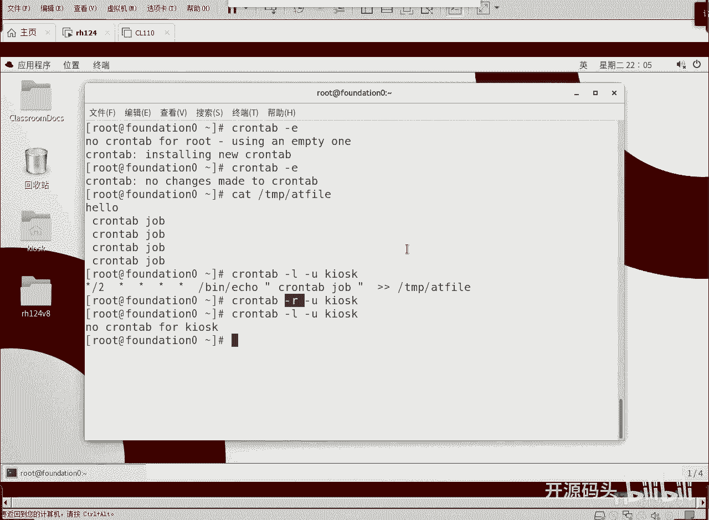

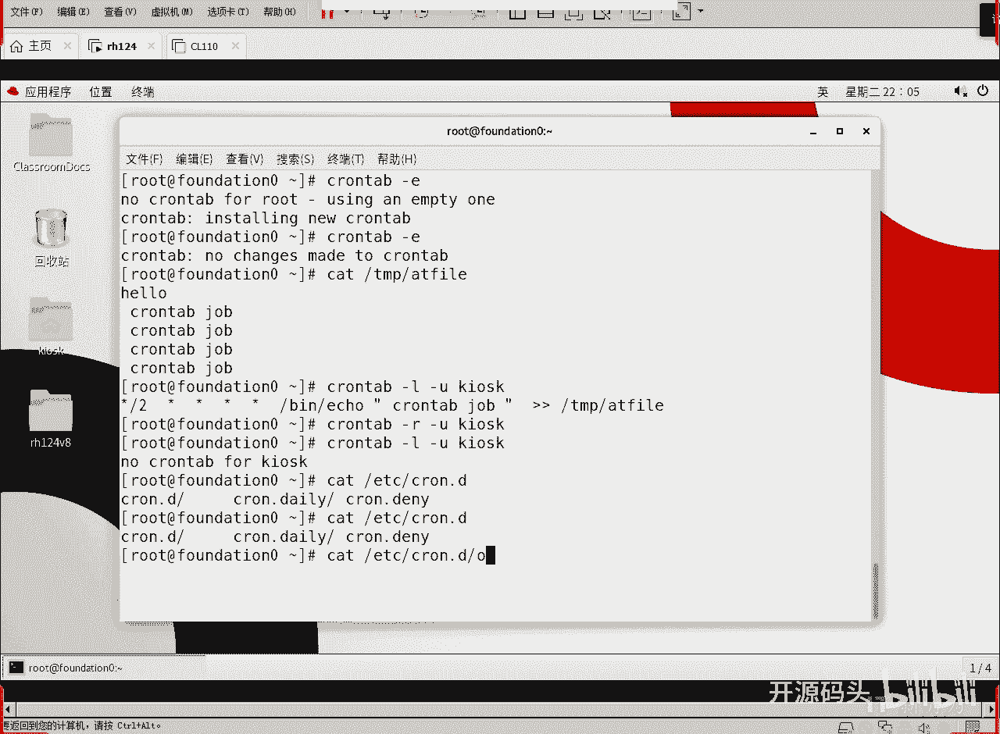

### 方法二：使用`run-parts`目录（推荐）
系统更倾向于使用第二种方法，即通过预定义的目录来管理周期性任务。这种方法更为清晰和模块化。

以下是相关的目录及其作用：


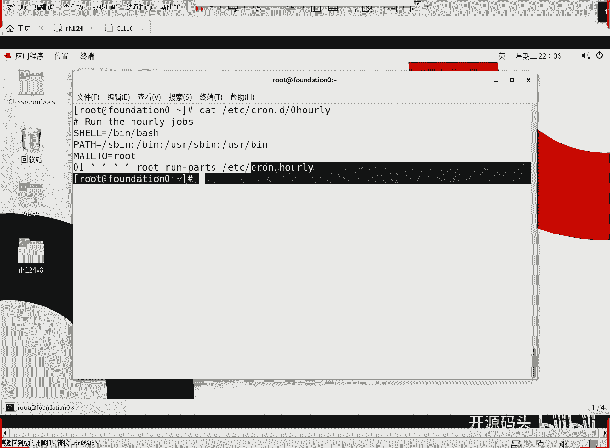

*   `/etc/cron.hourly/`：存放需要每小时运行一次的脚本。
*   `/etc/cron.daily/`：存放需要每天运行一次的脚本。
*   `/etc/cron.weekly/`：存放需要每周运行一次的脚本。
*   `/etc/cron.monthly/`：存放需要每月运行一次的脚本。

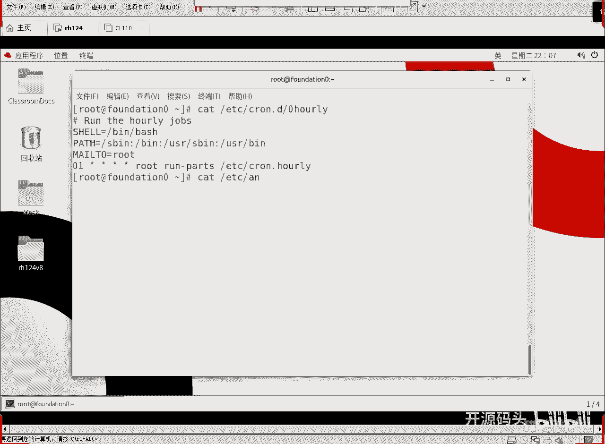

你只需要将**可执行脚本**放入对应的目录，系统就会在预定时间自动运行该目录下的所有脚本。这是通过`run-parts`命令实现的，该命令的作用就是运行指定目录内的所有可执行程序。

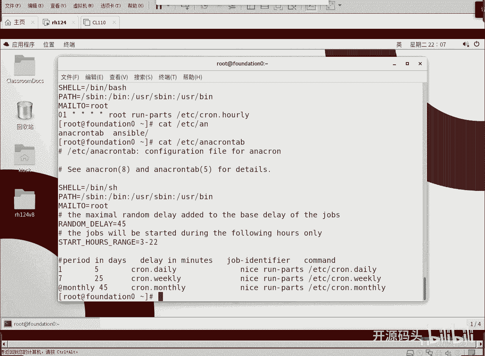

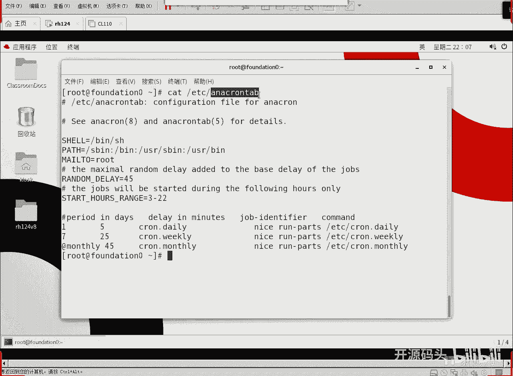

系统通过自身的计划任务来调用`run-parts`。例如，查看`/etc/cron.d/0hourly`文件，可以看到类似以下内容：
```
01 * * * * root run-parts /etc/cron.hourly
```
这表示在每小时的**第1分钟**，以`root`身份运行`/etc/cron.hourly/`目录下的所有脚本。

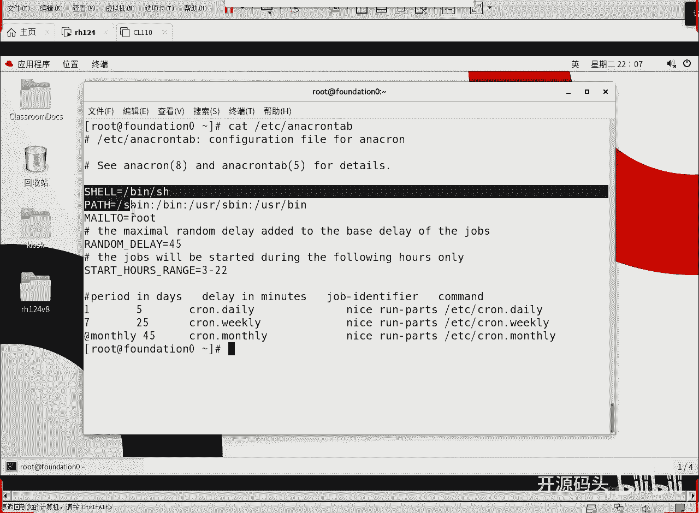

对于每日、每周、每月的任务，则由`/etc/anacrontab`文件管理。`anacron`的设计目的是为了确保在系统关机期间错过的周期性任务，在系统再次开机后能够得到执行。

查看`/etc/anacrontab`文件，可以看到类似以下配置：
```
# 周期（天） 延迟时间（分钟） 任务标识符 要执行的命令
1       5       cron.daily      nice run-parts /etc/cron.daily
7       25      cron.weekly     nice run-parts /etc/cron.weekly
@monthly 45     cron.monthly    nice run-parts /etc/cron.monthly
```
*   **周期**：`1`代表每天，`7`代表每周，`@monthly`代表每月。
*   **延迟时间**：任务到达预定时间后，允许随机延迟的最大分钟数（例如5分钟）。这可以避免所有任务同时启动，减少系统负载。
*   **`nice`命令**：以较低的优先级运行任务，避免影响系统关键进程。

因此，系统级计划任务的核心逻辑是：将脚本放入`/etc/cron.{hourly,daily,weekly,monthly}/`目录，系统通过`cron`或`anacron`在预定时间使用`run-parts`命令自动执行它们。

---

## 总结
本节课中我们一起学习了Linux计划任务的核心管理方法。

1.  我们掌握了如何为用户配置复杂的周期性计划任务，使用`crontab -e`编辑、`crontab -l`查看、`crontab -r`删除。
2.  我们了解了系统级计划任务的两种配置方式：直接编辑`/etc/crontab`或`/etc/cron.d/`文件，以及更推荐的将可执行脚本放入`cron.hourly/daily/weekly/monthly`目录的方法。
3.  我们明白了`run-parts`命令的作用是执行目录内所有脚本，而`anacron`服务则确保了长周期任务在系统停机后仍能补执行。

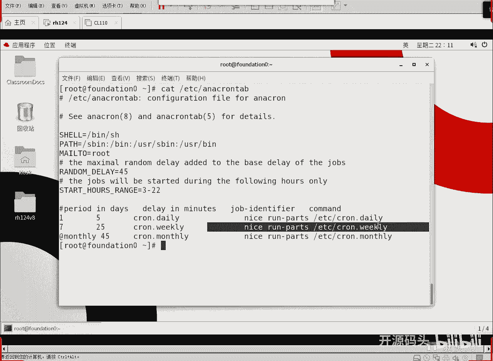

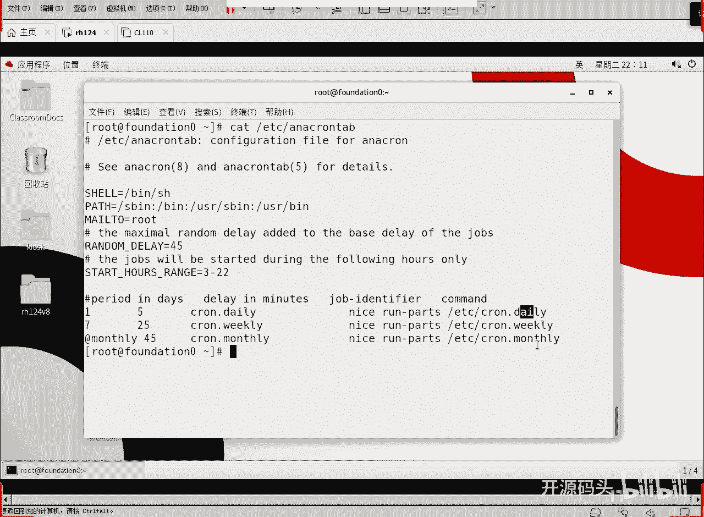

理解并熟练运用这些机制，是自动化系统管理任务的基础。