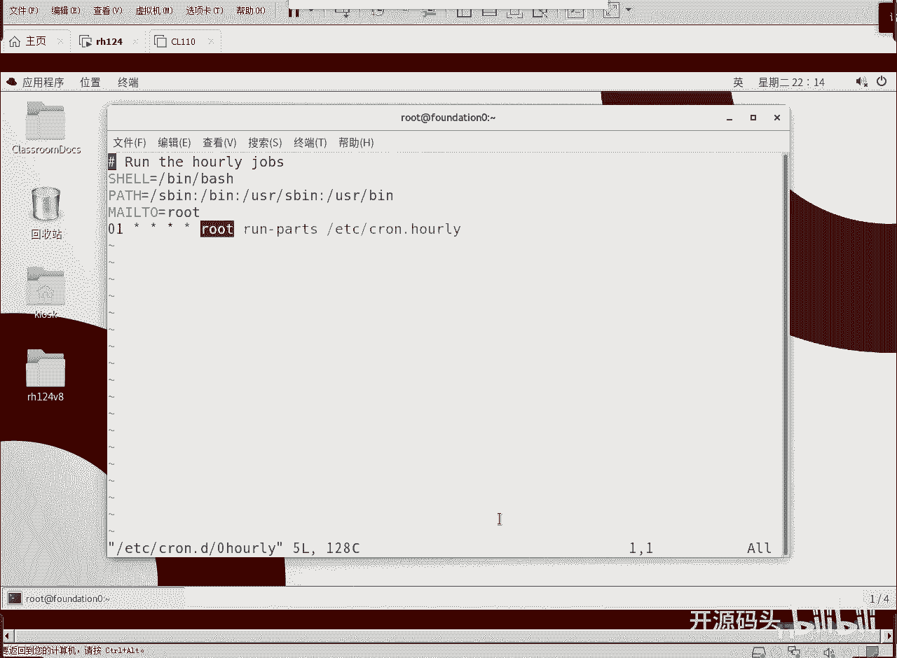
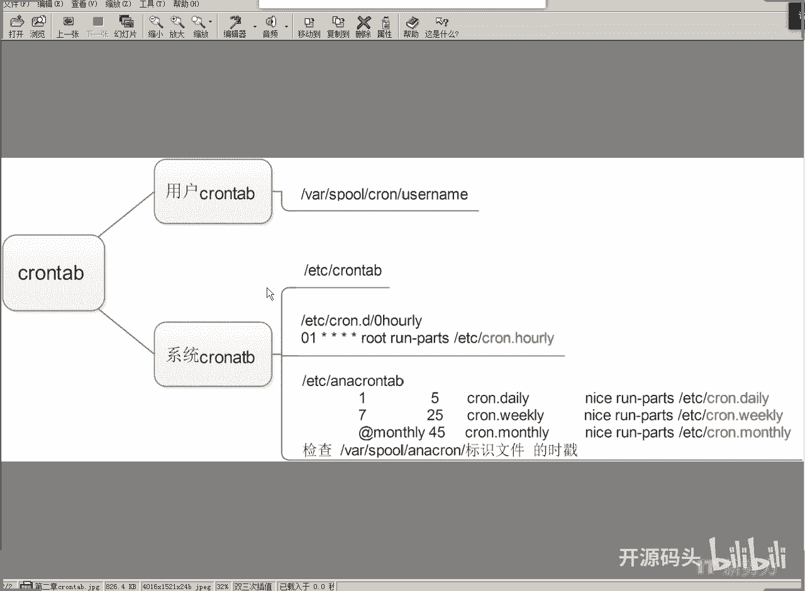
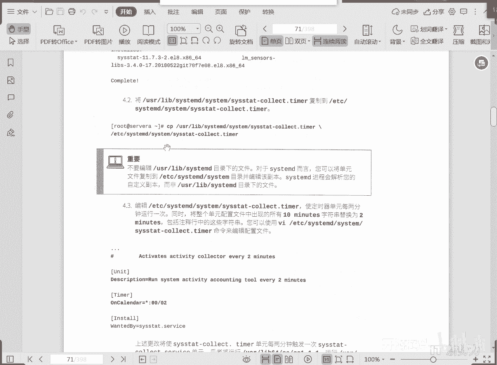

# 红帽RHCE RH134  2 计划任务与临时文件管理(4).mp4 - P1 - 开源码头 - BV1gW4y1i7qC

我们发回头再来看一下系统计划，任务是不是，根本上来讲是由edg的cortable，以及cor。d目录下的一个相关配置文件，决定的，它呢其实是就是分时日，月周，用户，以哪个用户的身份去运行什么命令是吧。

那么我们来利用这个机制，我们来实现一个所谓的啊，每小时运行一次的任务啊，但是每呃每天每周每月的这种啊，是由uncle table来做的，所以上面是由cortable来做。

下面是由uncle table来做，就是长比较长的这种间隔的那种任务啊，放在这有uncle table来负责维持啊，那么呃每隔多少天是吧，每隔多少天，然后启动前，呢呃可以最长等待多少分钟。

背的in minutes是吧，然后呃相应的这个任务文件啊，我们的任务任务标识嘛对吧，后面是他的命令，这就是我们的那个所谓的系统交换作业啊，新闻交完作业呢，机制我们也聊了是吧，他就是有两套机制来决定的。

你想每小时的是由cortable这个机制来决定，然后呃周期比较长的，每天每周，每月的是由uncle table这个配置文件来决定，所以说两套机制来决定的啊，各就是短周期和长周期的计划任务的操作。

但是无一例外的，我们的计划任务推荐你把它写到什么地方，写到每小，时，每天每周每月的那个目录下就可以了是吧，直接把你要运行的脚本系，扔到那个目录下就可以执行了，当然有些时候我不我就想写。

那你也可以用这种在vm的一些cortb，这个文件里面分时日月制作方式对吧，我们每小时的这种操作，是不是，就是也是以这种就cortable，这种方式来实现的是吧，就零一分是吧，零一分心。

就是任何时小时的零一分钟就开始啊，以root身份吧啊运行什么命令对吧，我们刚刚是不是没有没有强调那个命，以及一下的，下面有个零是吧，你是不是它是不是以root身份来运行，对不对。

一路的身份运行每小时的任务啊。

这种短周期的任务呢是由core table来做，周期太长的话有uncle table，uncle table呢它的间隔比较长，它里面的语法呢跟这个不一样，是跟这个不太一样啊，但是呢他们共同组合起来。

构成了我们的每小时，每天每周每月的这种系统计划任务，ok好，那么标识文件就是说呃，我们在启动了这个cortable之后啊，呃就是呃我们的计划任务之后啊，啊他的在哪个时间点做了操作了。

他或者把这个实戳留到什么，流到这个y的ort下的uncor，下面的一个范围文件里，这时候我们可以看到哦，就是我在这个那个时间点上做过了，那我这个十说就会写到这个文件里面啊。

这样的话我们就能保证哎我也知道啊，那个时间点是我做过了，可以检查它啊，ok好看一下这是干啥啊啊修改啊，每日作业里面的usual count用户账号对吧，用户技术啊，用户记住好，那我们做个脚本啊。

这个用用户基数的脚本，就是b n下面的80，然后用户的这个数量等于什么呢啊，是who who，就是查看当前当前登录的本机的用户有谁，就是看现在有没有谁在这个机器上，正在登录的这个机箱正在操作是吧。

who杠h就是不要标头是吧，就杠h就是去掉标头，只看那个内容，只看内容的话，你算一下wc统计一下它的行，是不是就知道有几个用户了是吧，因为一个用户是一行嘛对吧，一个用户是一行，ok去掉标题行。

不显示标题行的话，那自然就是一个用户一行的，就是算一下函数，就知道当前有多少个用户在线吧，当然有多少用户在线啊，然后呢记一下嗯，log即时制吧，把这个变量啊，就是把这个当前他这个任务是什么。

他这个任务是每天每小时，每天daily是吧，每天做一次啊，每天做一次啊，有多少个用户，因为我已经算出来了是吧，有多少个用户呢是活动的啊，他其实每天就是那天到了之后，最初的几分钟之内延迟了几分钟之内。

就要统计一下当前在线用户有几个，他把这个信息呢记录到日志里面了啊，log是不是寄到日志里面了对吧，ok好就是这么一套脚本，这个脚本在美daily，因为我把它写到daily底下。

所以说每daily时间呢每天就会运行一次，它会运它运行的时候呢，就是统计当时它运行的那个，当时有多少个用户在在线啊，有多少用户的who啊，w就是查看当前在线用户有谁，不管你从哪登录过来的，我都能看到啊。

ok然后把这个脚本赋予执行权就可以了，因为我们一开始就是在daily底下编辑的是吧，所以它到点就运行实时的啊，ok总结一下rutal这个东西呢，呃我们把它分成两大块是吧。

一块是crt用户的cortable啊，一块是系统的cortb用户，que tal，普通用户都可以创建呃cotable杠u用户名，然后杠一开始针对这个用户的创建，相应的这个呃计划任务啊。

那么所有用户的corta，都都会保存在这个位置，y下的spoke下面，crown下面的用户名，就是以哪个用户的身份创建的那个任务，就在挖下的pose下面的core下面，用户名命名的这个任务是吧。

那么如果是系统cortable呢啊，首先系统的ktv的一个配置文件呢，是处是edg的ktv是吧，那我们也可以在地下的口号点d目录下，创建不同的呃文件内容，这些文件内容呢最后都会被调用到quitable。

这个配置文件里面去处理啊，那么这里面的内容呢，和我们这个用户的cortp，基本上是一样的是吧，多了一，个什么多了一个用户字段，还是分时日月周，然后呢哪个用户啊，一般我们系统账户当然是写root了。

然后run parts什么什么，那这个命令呢就是执行一个目录下，所有的可执行文件啊，你只要给他一个目录，那他就会从这个目录下执行所有的可，可执行的配置文件啊，可执行的这个脚本啊，或者是执行文件对吧。

rpx就执行一个目录，然后呢呃这就是我们每小时的啊，每小时的那个计划任务呢，它的一个实现机制啊，就是通过可点d下面的配置文件零奥里啊，规定了每个小时的第一分钟运行cn点，奥里目录下的所有可执行文件啊。

因为我们有这个驱动，所以说呢它每小时都会执行这个目录下，所有的脚本啊，那么对于那些呃时周期比较间隔比较长的，每天每周每月，那这些的话呢啊，我们是由呃uncortable这个配置文件啊，来进行配置的。

但它这个配置呢也是啊也是间隔几天啊，然后呢延长几分钟对吧，就是说因为间隔比较长嘛，不要说到点了，马上就要执行啊，它有一个什么缓冲的时间，等到系统不忙了，我们再用一个比较低的优先级啊。

比较低的优先级去运行这个呃，这个目录运行，每天，的目录运行，每周的目录运行每月的目录啊，这样的话呢，我们就可以把这个系统的任务呢，就分别实现了，那么嗯还有一个呢就是实戳是吧，嗯像这些执行过的实戳呢。

都会保留在外下的poke下面的uncle table，下面的相关的标识文件当中啊，这个标准文件里面就写的哎，我这个时间点做过了，我这个时间点就在写上了啊，最起码我还能查出来那个时间点上。

他到底做了没有对吧，他到底做了些事了没有啊，ok这是那个系统的计划任务啊，系统计划任务，我们呃是由这个两个配置文件来驱动的一，个配置文件是t加的cortable啊，这个主要是周期比较短的啊。

就是每小时以内的啊，那还有一个就是追比较长的，大于一天的这种啊，大于一天的这种一天一周1月的这种，它是由按考试退保，这个配置文件来决定的啊，这个配置文件里面的项目呢，和上面的这个分时日月周不一样啊。

因为我已经确定出以天为单位了，那所以说隔一天还是隔七天还是隔一个月，是不是用这个方式就可以定义，间隔比较长的这种周期性人物，那这些东西呢都是由和地点service守护进程啊，在进行相应的这个刷新。

操作啊。

比如这个实验三呃，这是一个s s states的这么一个工具啊，安装上这个工具之后呢，我们的系统里就会自动地创建一个啊，系统的计划任务，每隔十分钟啊，或者是每隔五分钟啊，这个可以改的是吧。

就去收集系统状态信息到日志对吧，那这个配置呢，是一个典型的cd计划人物对吧，但是呢从企业版八的一个课本开始，我们有一种新的机制来代替原来的那种，cord。service的这种计划人物。

那就是c t m d自带的那个timo啊，计数器这个单元，所以呢我们去修改计数器的配置文件，也可以达到，相同的目标啊，在这usr下，label下的c d d c c tm这个目录下啊。

大概的记一下这个位置啊，usr这是资源目录吧，label库目录是吧，然后关于c c m d下面的系统的某某某点，timer这个计数器，这个计数器呢是由c tmd，这个进程来进行刷新的。

所以他就不用call了啊，不用我们的原来的这套机制了啊，我们原来这套机制，你看是不是用的是core rotable的这个机制，来实现的对吧，cordial的机制呢，就是由cord。

service这个服务呢，来周期性的刷新，我们的cortable的这个配置文件，现在我们不需要了，我们直接用什么呢，直接用cmd，的这个计数器来做，所以说呢我们利用这个系统，它给我们带来的那个计数器。

这么一个配置文件来解决，但是由于我们的那个系统运行，它里面有很多任务，很有可能对c tm d下面的，关于系统的很多属性呢进行更改啊，所以说呢我们呢，如果说改到这个地方的话呢。

很有可能会被系统的自动改掉啊，所以说我们应该把这个东西呢，放到一个比它比这个优先级更高的一个地，方，比比比他这个优先级更高的一个位置，哪个位置呢，etc下面的cmd下面c啊。

因为e t下载呢就是我们人工的配，置文件，对不对啊，我们不要去理会，这个系统本身所带的配置文件，我们把他的那个计数器的配置文件，拷到etc下，那么etc下的c tmd下的c tm，这个目录下的计数器呢。

优先级高于我们的u s下的lib，下面的这个优先级，所以说我们把这个相同的计数器的，拷到etc的目录下，然后呢我们去改它，改了之后呢，唉这个的为准，如果这里没有，那当然以系统里的为准了。

当然以u s下的label下面的为准了对吧，这就相当于默认值，而这个相当于我们自己确定的值，自定义的值，那么自定义的值放在etc下，而系统默认值呢都是在u s下的label下，对吧。

这样的话呢目录不一样啊，优先级有个高低，那这个时候我们把这个相同的计数器的，这么一个刷新的配置文件，我们把它拷到edg，从而呢使得我们我们的操作起作用啊，有人说我直接改这个u s下面，这个可不可以。

当然可以，但是呢这个东西是由什么，是由我们的那个系统自动维护的，就是你改了之后，很有可能又被系统自动的改回去了，那么最好就是我们用一个比他优先级高的，就是把它自定义放在自定义的位置。

那么自定义的话就放在，etc下就是自定义的好吧，放过来以后呢，我们再去改它，改了之后呢啊，有这个就系统就不会调用默认的啊，我们就不会调用usr下来，直接调用e t下来就可以了。

所以说我们这里的优先级高。