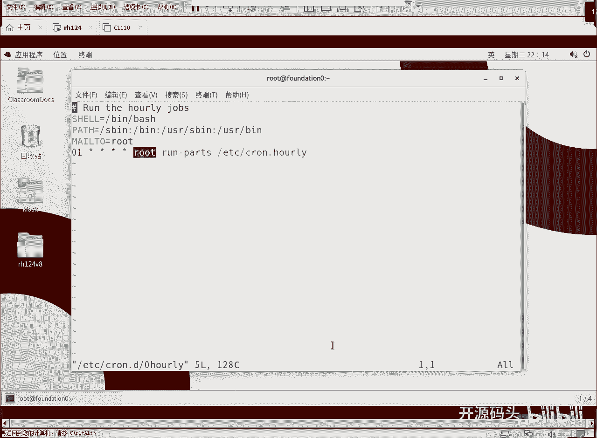
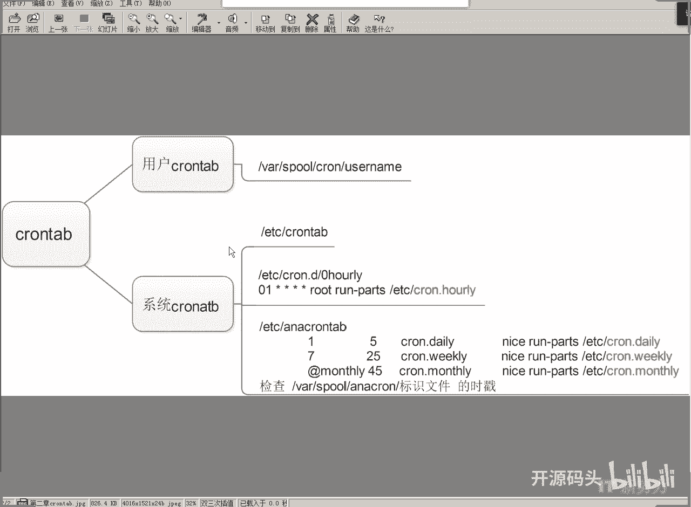
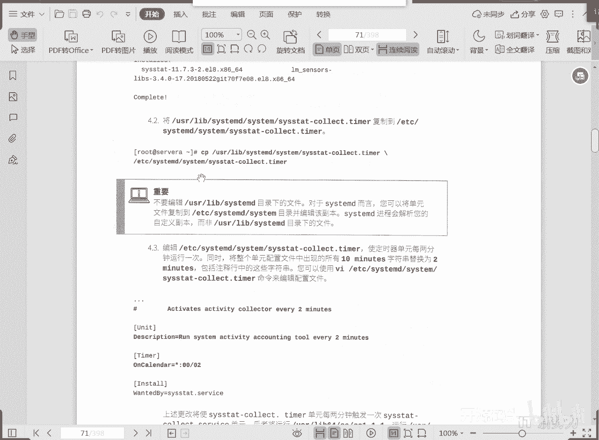

# 红帽RHCE RH134：2：计划任务与临时文件管理

在本节课中，我们将学习Linux系统中计划任务的管理机制，包括`cron`和`anacron`两种工具，以及如何配置定时任务。我们还将了解如何通过`systemd`计时器来实现更现代的计划任务管理。

## 系统计划任务机制

上一节我们介绍了计划任务的基本概念，本节中我们来看看其核心机制。从根本上讲，系统计划任务由`/etc/crontab`文件以及`/etc/cron.d/`目录下的相关配置文件决定。其基本格式定义了**分、时、日、月、周**以及执行任务的**用户身份**和要运行的**命令**。

我们利用这个机制来实现一个每小时运行一次的任务。而每天、每周、每月的长周期任务则由`anacron`工具负责。

## 短周期与长周期任务



以下是两种计划任务机制的分工：

*   **短周期任务**：由`cron`机制（`crontab`）处理，例如每小时的任务。
*   **长周期任务**：由`anacron`机制处理，适用于间隔较长的任务，如每天、每周或每月执行一次。

`anacron`的配置语法与`cron`不同，它允许定义任务间隔的天数，以及在启动后最长等待多少分钟执行（`RANDOM_DELAY`）。其任务标识和命令定义在相应的任务文件中。

## 计划任务的推荐配置方式

无论使用哪种机制，推荐将计划任务脚本直接放置到对应的周期目录下。以下是这些目录：

*   `/etc/cron.hourly/` - 每小时
*   `/etc/cron.daily/` - 每天
*   `/etc/cron.weekly/` - 每周
*   `/etc/cron.monthly/` - 每月

直接将可执行脚本放入这些目录即可自动运行。当然，你也可以通过编辑`crontab`文件，使用“分时日月周”的格式来定义更精确的任务。

例如，一个每小时在**第1分钟**以**root**身份运行的任务，在`crontab`中配置如下：
```bash
1 * * * * root /path/to/command
```

## 任务执行标识文件

启动计划任务后，系统会在任务执行的时间点将时间戳记录到`/var/spool/anacron/`目录下的对应文件中。这用于记录任务在哪个时间点已经执行过，便于检查和追踪。

## 实践：创建每日用户统计任务

我们来创建一个脚本，用于每日统计当前在线的用户数量。

这个脚本的功能是：使用`who -H`命令查看当前登录用户（`-H`选项用于去掉标题行），然后通过`wc -l`统计行数，即在线用户数。最后，将这个数量记录到日志中。

脚本内容示例（假设保存为`/etc/cron.daily/user_count`）：
```bash
#!/bin/bash
# 统计当前在线用户数
user_count=$(who -H | wc -l)
# 记录到日志
logger "当前在线用户数：$user_count"
```

创建脚本后，需要赋予其执行权限：
```bash
chmod +x /etc/cron.daily/user_count
```
这样，系统每天就会自动运行此脚本并记录日志。

## 计划任务配置详解

`cron`任务分为两大类：

1.  **用户`crontab`**：使用`crontab -u username -e`为指定用户创建。所有用户的`crontab`文件都保存在`/var/spool/cron/`目录下，以用户名命名。
2.  **系统`crontab`**：主配置文件是`/etc/crontab`。也可以在`/etc/cron.d/`目录下创建独立的配置文件。系统`crontab`的格式比用户的多一个“用户”字段，用于指定执行身份。



系统每小时任务的实现机制，通常是通过`/etc/cron.d/0hourly`配置文件，规定在每个小时的第1分钟运行`/etc/cron.hourly/`目录下的所有可执行文件。

对于每天、每周、每月这些长周期任务，则由`/etc/anacrontab`配置文件管理。它允许设置间隔天数、随机延迟时间，并以较低的优先级在系统空闲时运行对应目录（`cron.daily`, `cron.weekly`, `cron.monthly`）下的任务。

## 现代计划任务：systemd计时器

从RHEL 8开始，引入了一种新的机制来补充或替代传统的`cron`服务，即`systemd`计时器单元。

例如，系统工具`sar`（系统活动报告器）需要定期收集数据。传统方式是通过`cron`任务实现。而现在，我们可以通过修改`systemd`计时器的配置文件来达到相同目的。

系统自带的计时器单元文件位于`/usr/lib/systemd/system/`目录下（例如`sysstat-collect.timer`）。直接修改这些文件可能会被系统更新覆盖。

推荐的做法是，将需要自定义的计时器单元文件复制到优先级更高的`/etc/systemd/system/`目录下，然后进行修改。

操作步骤如下：
1.  将计时器文件从`/usr/lib/systemd/system/`复制到`/etc/systemd/system/`。
2.  修改`/etc/systemd/system/`下的副本文件。
3.  重新加载`systemd`配置：`systemctl daemon-reload`
4.  启用并启动计时器：`systemctl enable --now <timer-name>.timer`

这样，系统会优先使用`/etc/`下的自定义配置，而不会影响`/usr/lib/`下的默认文件。

## 总结



本节课中我们一起学习了Linux计划任务的管理。核心内容包括：
1.  系统计划任务由`cron`（处理短周期任务）和`anacron`（处理长周期任务）两套机制共同决定。
2.  推荐将可执行脚本放入`/etc/cron.{hourly,daily,weekly,monthly}/`目录来配置周期任务。
3.  任务执行的时间戳会记录在`/var/spool/anacron/`目录下，用于审计。
4.  在RHEL 8及更高版本中，可以使用`systemd`计时器单元来实现更灵活、更集成的定时任务管理，自定义配置应放在`/etc/systemd/system/`目录下。