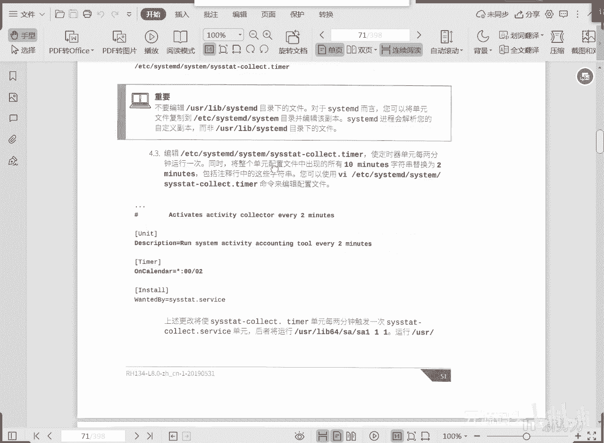
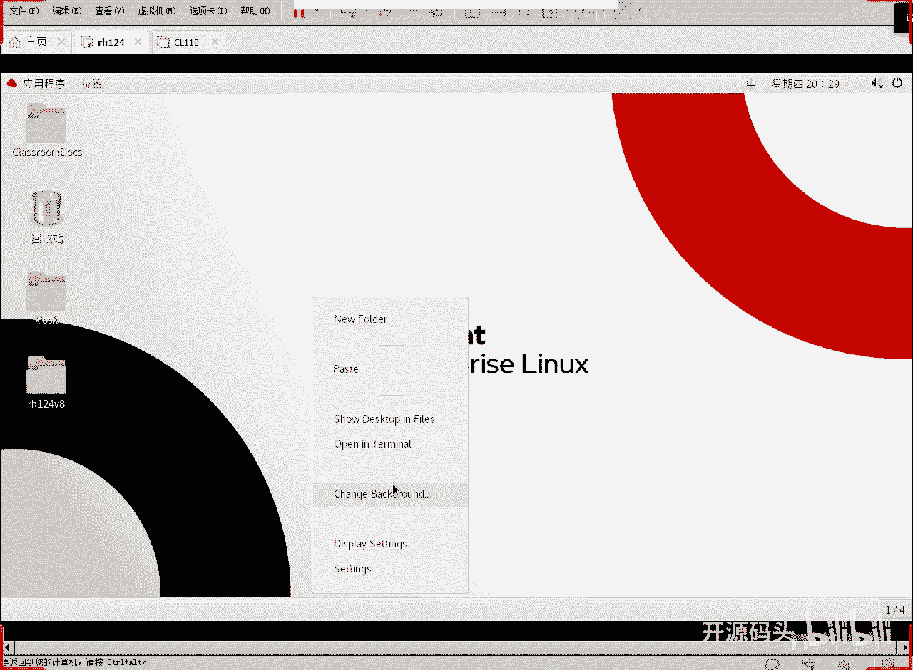
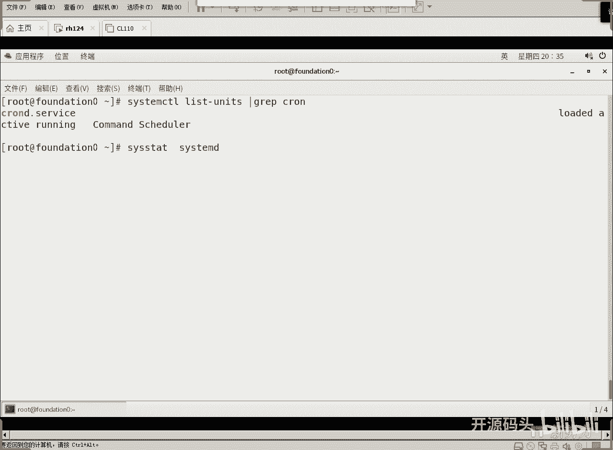
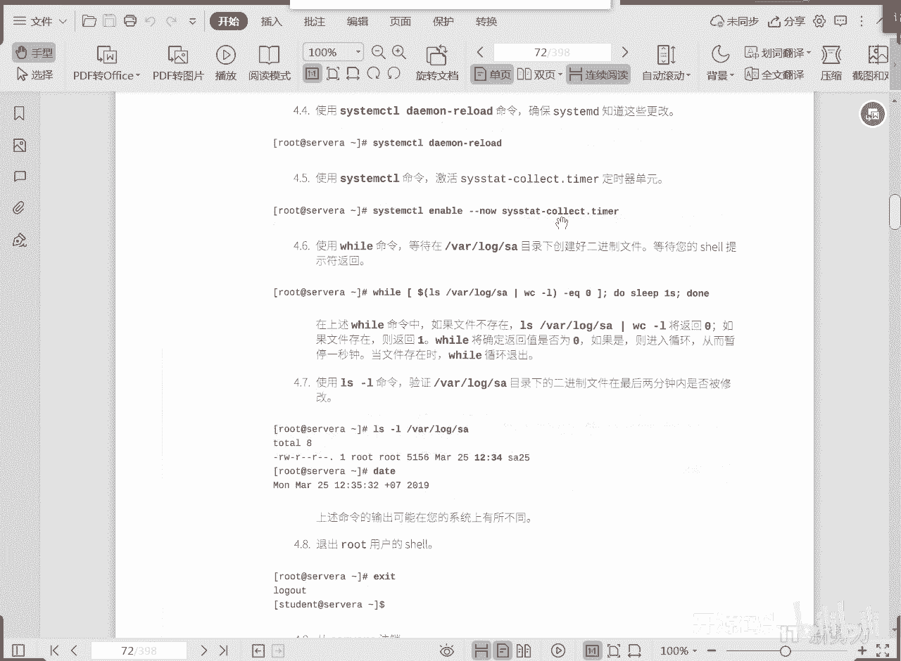
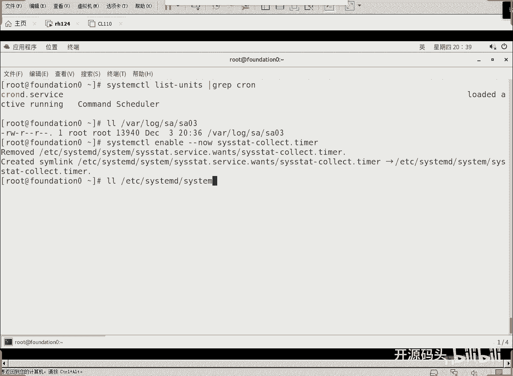
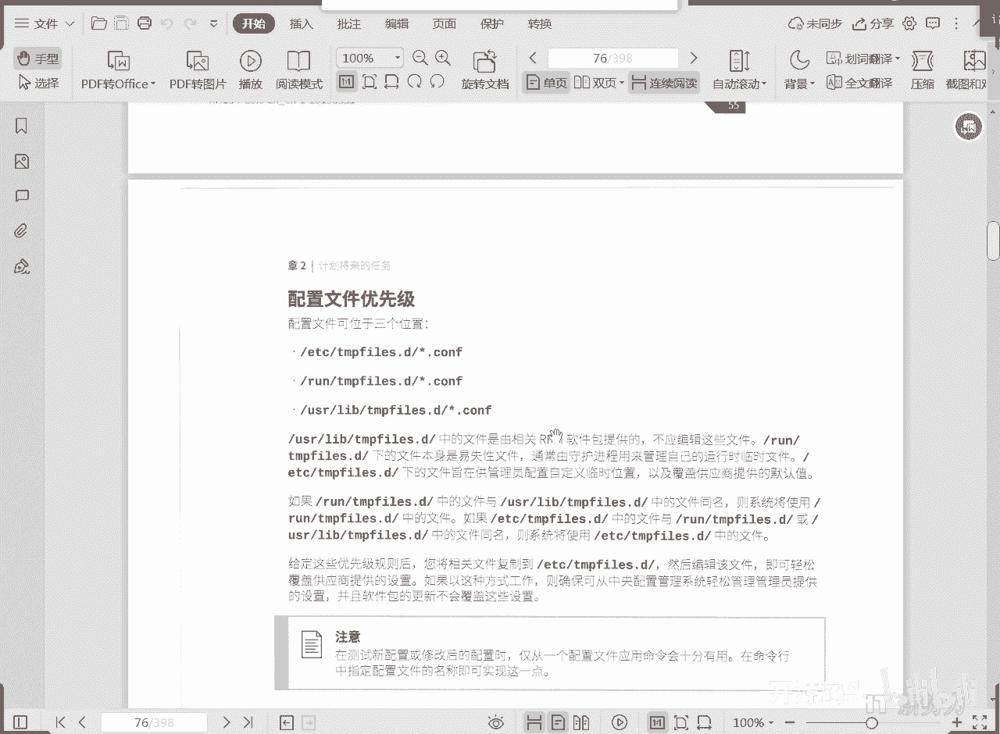

# 红帽RHCE RH134  2 计划任务与临时文件管理(5).mp4 - P1 - 开源码头 - BV1zd4y137kU

好我们就以这个sos states这个计数器为例来看一下，打开一个终端窗口啊。

然后呃竖杠的root是吧，s，速办法root，em in store s y s t a t对吧，already installed已经安装上了，然后呢，level啊，下面的s s t m啊。

然后这个目录下面有一个什么呢，s s s t a t的这么一个收集吧，collect呃，点tao这么一个计数器的配置文件，直接考到这个目录下，然后呢我们修改这个目录下面的相同名字的配置文件，对吧。

这个配置文件啊，打开之后呢，其实这里面就有三个字段，第一个说明啊，第二个字段呢就是计数器描述time，新冒号零零出一个十分钟，我们现在要把它改成什么，改成两分钟是吧，改成两分钟。

那呃上面这个注释是不是也应该把它写成两分钟，对不对，好，它会自动的启动什么，启动这个这个s s s t t。service，而这个service服务呢就是收集一下当前活动的账户的数量。

给它发到外下的log项目sa这个文件上是吧，好w q啊，这个计数器改完之后，我们想要这个计数器马上起作用，怎么办呢，s y s t e m control，第一集my reload啊。

就是我们要把这个cmd呢所有的这个守护的配置文件重新reload一下，回车，这个时候呢我们这个计数器就已经可以起作用了是吧，y下的log，下面的sa，20：32，我们看一下续集的当前时间，对吧啊。

就是刚刚创建的，对不对，那是零三，能不能看一下，二进制的吧啊不太好看，是不是二进制的，ok好，所以说在我们的linux里头啊，我们要解决这个周期性的计划任务啊，我们第一种可能性是什么。

直接用cortable对吧，直接用cortbo这个机制来做，那第二种可能性是什么呢，唉就是让我们cmd的计数器去做，就是我们的那个最先启动机器，最先拿拿到机器的管理权，掌控整个机器资源以及启动顺序。

以及工作环境的这么一个守护进程是吧，那么这个进程的话呢，我们让他来做这个周期性任务的一个刷新啊，这个时候他认的，是谁，他认的是usr下面的那些计数器对吧啊，u s下的lib下的相关的计数器啊。

那我们把这个接收器呢给它里头的时间周期稍微改一下啊，然后重新加载一下cmd的一个demand是吧，demn reload啊，对完日料了之后呢，这个新的配置就会起作用，每隔两分钟做一次刷新就可以了啊。

那这个实验里面还是用的是什么core table是吧，那我们列出cm ccm d所管理的所有的这个单元是吧，从这个单元里面呢，我们输入一下cor是不是有个cod cod。service啊。

这个东西呢就是一个周期性计划任务的一个守护进程啊，但是我们现在呢关于这个xy s t a t啊，是继承了我们不让用它来做了啊，不要用它来做守护了，而用谁来做。

也就是说我们中心任务一方面可以由传统的cod来做，另一方面可以直接用cmd的什么计数器来做啊。

cdmc里面的timer计数器这个单元来做好c tmo demand load啊，这个作用是什么呢，确保cd刷新了这个更改是吧，知道这些更改，然后呃使用cm control命令的激活这个计数器啊。

这个计数器还需要我们像一个服务一样，unning able，并且呢现在就启动它。

还需要做这个是吧，还要做这个，那做也可以啊，其实我们刚才已经验证了一下，啊啊啊路看下，你看他其实32分，34分，36分，他其实已经在做了是吧，嗯如果说我们还要去呃，在就是强制刷新一下的话呢。

那我们就可以用这个a呢able对吧，嗯然后刚刚now啊，这个呢是八喜欢用的七，其实这个面积在七上就可以用，但是七的教材里面很少用这个机制啊，就是他直接利用的就是传统的那个思路，就是六转七的时候。

那个过渡化思路到了八以后呢，彻彻底底就喜欢用这些命令了啊，unable就是许可一个计数器，然后呢now是现在就执行这个计数器，78年出不来，许可代表下次开机这个计数器就会一直运行啊。

然后now就现在就开始运行啊，这个计算机其实我们已经在操作了是吧。

这里面有很多，是不是s y s t e t这个我们就启用它这个名字作为计数器的名字，嗯，在一定程度上呢呃替代传统意义上的呃cord。service，稍微获得计划人物，第四部分啊，管理临时文件。

平常呢我们对临时文件的管理啊，除了传统意义上的这种删除超时的文件以外，还有一个很重要的功能呢，就是要创建临时文件的目录结构，在cmd启动之后啊，杠杠create去创建需要的目录结构，杠杠remove。

去删除已经到期或者是已经满足删除条件的那些文件或者目录啊，也就是说啊在我们的系统启动的时候呢，它默认的就会把临时文件目录框架该创建的创建，然后该删除的删除，那么什么该创建什么，该删是由谁来决定的呢。

啊是由ui下的label下面的t t m p f2 点d，然后新config以及run tm下的新config，以及edg下载新卡那个配置文件来共同决定的，那么毫无疑问优先级最高的肯定是什么。

etc下面的是吧，t下面的系统会删除这些配置文件中标记要删除的各种啊，这还是要做这些操作对吧好，那么cmd的话，有一个关于cmd的临时文件的一个清楚的一个计数器啊，这个的话是除了启动这个关口。

还可以定义一些其他的关口啊，其他的时间点为了确保长期运行的系统，不会因为成就的数据填满磁盘啊，file clean的这么一个计数器的这么一个单元，它会定期触发啊，来执行什么呢，来执行清除的这个命令。

这个清楚的这个人物，那么关于这个计数器单元跟我们之前说的还是一个的还是一样的啊，还是一样的啊，件啊，有一个叫胎梦部分啊，有一个时间计数器部分是吧，它只是个启动同名服务的频率啊。

我们可以使用这个catm cut，catm time fire clean tao，这个命令来查看我们那个所谓的这叫临时文件的，清楚的这个计数器的状态啊，其实我们已经前面已经看看到了。

大部分都在什么u s r下载lab下c c c c t m对吧，以我们的那个计数器同名的那个文件吧，是不是啊，其实你用cm cut的方式就可以看，当然你是不是可以也可以修改这个文件。

v i m直接编辑这个文件，u s下面的lab下面cd是吧，是可以直接编，辑这个文件的，那编辑这个文件的时候呢，这里边跟我们刚才看到的那个啊，就是c c s s s states。

这个计数器的格式是一样的，第一个unit啊，unit其实就是什么说明吧啊说明以及帮助文档啊，然后紧接着就是什么tam计数器接收器，我们刚刚那个sos states里面呢，它是什么，college对吧。

就是在日历上，那这个呢是是是on boot on boot啊，什么意思呢，就是在启动后15分钟啊，在启动以后15分钟啊，下面有解释啊，然后on unity active啊，这个的话呢是什么呢。

是每隔多长时间就刷一下系统，启动15分钟后就做一次，然后再每隔多长时间再激活一次啊，下面有描述这两个啊，和我们刚才那个我们这里最起码计数器的这个间隔，是不是有很多种语法格式吧。

你看我们刚刚在讲那个这个文件的时候啊，是不是这个talent是吧，在这个呃日历啊，我们用的是什么啊，星冒号零零就是写这前面是十小时，后面是分钟啊，分钟零零就不限制星冒号00p值零二啊。

每隔两分钟做一次是吧，这是可怜啊，同样的道理我们还可以用什么呢，哎就是现在我们聊过这个话题啊，什么on bota second和on unity active啊，这个啊这个是代表什么。

从上次活动单元24小时后出发一次啊，他写的是一对嘛，一天对不对啊，那这样的话呢，我们这个计数器呢啊刚才我们说你直接修vm修改这个配置文件就可以，现在我们说用cm cut，也可以啊。

反正看到的东西是正常的，对不对好，那么如果说我们确认就是这样去做了，那么经长久时间不关机的这种系统，它也不会说，因为啊没有系统启动的这个机会，从而呢不会清除那些相关的临时文件是吧。

他是每天就是刷新清除一次吧，在上述配置中啊，这几个15分钟啊，启动15分钟后就开始刷新触发一次呀，或者是每个从上次活动之后再隔一天再冲动一次啊，啊这样就保证了我们那个清除计数器啊，就会激活清除的服务啊。

激活这个template clean service这个清除的服务是吧，如果你，根据您的要求呢，你可以更改这个计数器单元是吧啊，你可以设置为每30分钟就触发一次这个清除单元。

更改了定时器的配置文件之后呢，用cm control demand reload这个命令呢去确保cmd知道这些更改好重新加载啊，这个部分的内容好像跟我们气不一样，所以说我们还是会费点时间说一下是吧。

然后重新加载这个配置以后，我们使用这个命令呢在啊就相当于双保险是吧啊，配置文件我们刷新了，然后呢我们要重新启动并激活这个clean计数器，相当于双保险的操作啊，但是，根据我们刚刚所操作概念。

是不是底盘是热的，操作之后是不是他就开始就开始工作了啊，这个呢只不过是再次强调下次开机也是许可的，并且呢现在立即启动这个计数器的计数器的刷新对吧，o那么这个c tm time fire杠杠clean啊。

他要解析的是呃解析的配置文件与杠杠create命运是相同的啊，那么clean的话是不会创建文件和目录，而只会清除，而create当然就是不会清除，只会什么创建。

有些人说诶创建新的目录竟然是临时文件的管理嘛，对吧，哎就是什么意思，就是说临时文件不光光是为了删除，或者清除一些东西，还有可能做什么呢，还有可能因为临时文件呢，我们需要一个目录结构啊，需要一些空文件。

我们用刚刚create也可以去创建必要的这些文件和目录，ok好，那么tm fire。d这个menu的页面中详细地描述了我们的这些配置格式啊，那我们现在来简单看一下，那么，它的语法结构由七列构成啊。

语法结构系列构成，第一列是类型，第二类是路径，第三类是模式类型，你是文件还是目录，路径是在什么位置啊，是哪个位置的那个文件或者目录模式就是你的权限，然后呢呃所属的uid和主啊。

这是不是就是创建一个新东西的这个一个文件或者目录，它必须的几个项目啊，还有什么期限，还有什么其他的参数，ok那比如说这句话啊，这句话d表示创建还不存在的目录啊。

这个d就是刚刚create的时候就会激活啊，当我们调用这个命令的时候，他就会按照这一下，这，一行的去创建一个目录啊，当然说是如果这个目录不存在，它会创建啊，已经存在就不做了。

run下面的cp下面state是吧，创建这个这个目录啊，d代表目录创建一个目录，目录的权限是什么，0755，然后目录的所有者是root组呢是root横杠后面的期限和参数。

那么当我们调用杠杠create这个命令的时候呢，它就会为我们创建临时目录啊，创建临时目录，在创建文件和目录时，如果这个还不存在，就创建啊，所有者为之才是权限为这个这个是吧，ok这是一个大地啊。

如果目录还不存，在就创建，如果存在则清空大d是吧啊，运行刚刚clean的时候呢，删除这后面有一个一day嘛对吧，前面后面有个期限是吧，期限是什么，期限是一对一天，那么他就会在调用杠杠clean的时候呢。

针对这个目录呢，就是一天之内没有被访问过的更改，修改过的文件将会被清除掉，杠杠颗粒，ok好，还有个杠大l，杠大l代表着什么呢，是一些呃，这个应该是链接是吧啊，这是一个符号链接。

符号链接呢run下的f s table link指向什么，指向这个e t t下的fs t b啊，在这个run目录下，创建一个和指向fs t e t加f tb的一个链接文件是吧，那这个。

它的权限就不说了是吧，后面有一个什么呃有效期啊，期限期限是什么，这是参数，这是链接文件的参数，这个是期限是吧，手指后面是不是期限，期限不限制的话，那就不会清除啊，ok好，那么这些配置啊。

这些配置呢更多的一些例子，我们可以从menu tm p f2 点d这个，帮助文件里得到更多的内容啊，我在这就不展开了啊，好那么这些内容如果定义到相关的配置文件里之后呢。

当我们去调用香就是什么杠杆clean杠杠create或者刚刚remove的时候，它就会按照我们这些前面所定制定义的特殊含义的东西，就开始对我们的目录进行相应的清除工作，或者是创建工作或者删除工作啊。

这取决于我们的这个操作符啊，就是我们第一行的这个操作类型符号，这个时候我们就会它就会根据我们的定义来去进行相应的清除对吧，相应的操作创建清除和删除，那么这些，配置文件呢位于这三个位置。

123这三个位置下呢，毫无疑问哪个优先级最高啊，看着啊，如果wrong下的文件与u s下的文件透明，则系统使用run下的，如果e d g下的和run下的透明，那这使用什么etc下的。

所以说这个优先级就是这个最高第一行最高，第二行次指第三行最低说usr下面这种东西的话，一般都是默认值，就是说前面如果人为的这个配置文件都没有明确定义的情况下啊，我们的系统自定义好的，在这里。

之所以说我们是系统自定义的，就是它很有可能被系统自动更改啊，我们要想改的话，不要改这里面的，你要改这里面的话，很可能系统在某个特殊的配置环境下，改走是改成系统认为的正确的方式。

所以说我们要想超过它的优先级，我们直接写uc下对吧，写到e t t下就可以了啊，所以说这个关于我们刚才讲的这些配置文件创建目录也好，或者删清除目录也好，或者是创建什么链接文件。

或者是做一些很多其他的哈啊，恢复ec link context等等这些操作都可以去做啊，那么这些操作都可以配置文件的方式写到这个相关的目录下啊，当然扩展名一定要是config，ok这样的话呢我们。

的临时文件呢就有了一个规范啊。

