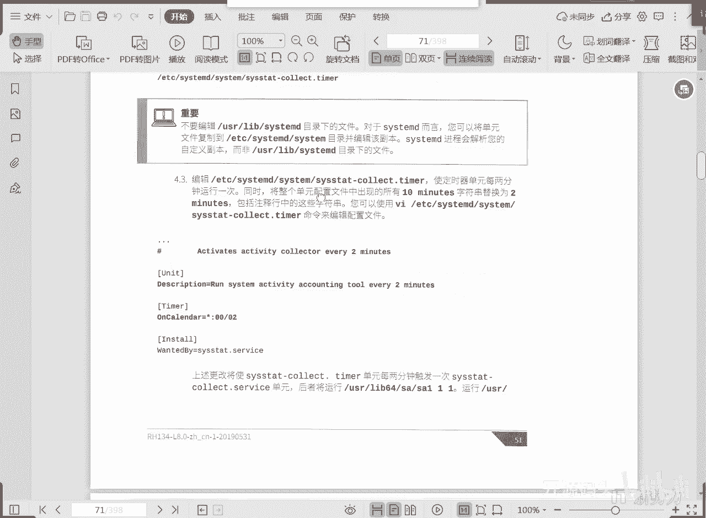
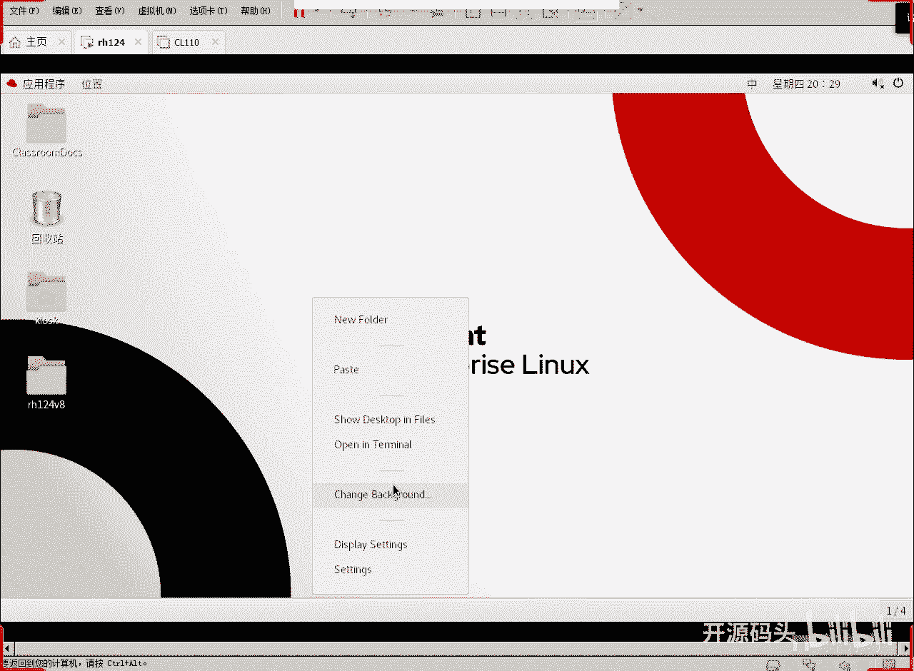
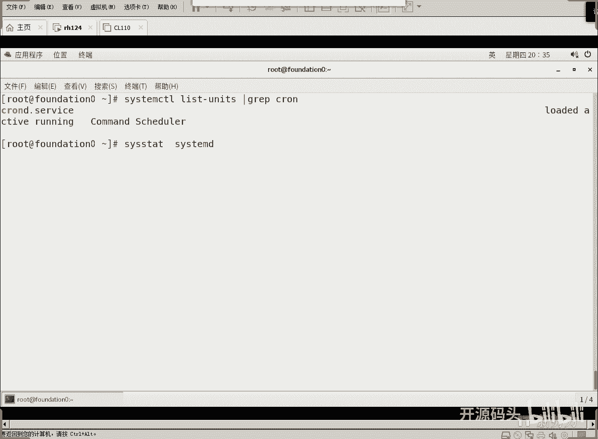
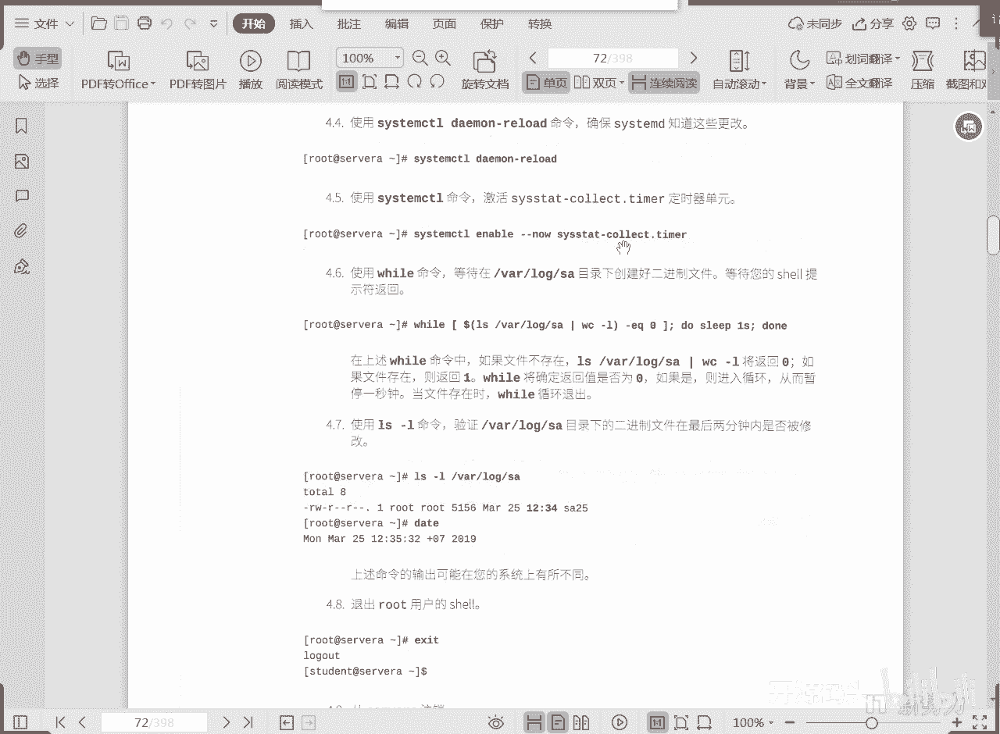
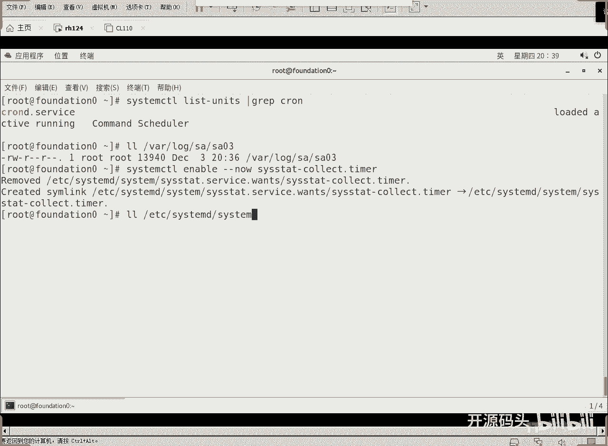
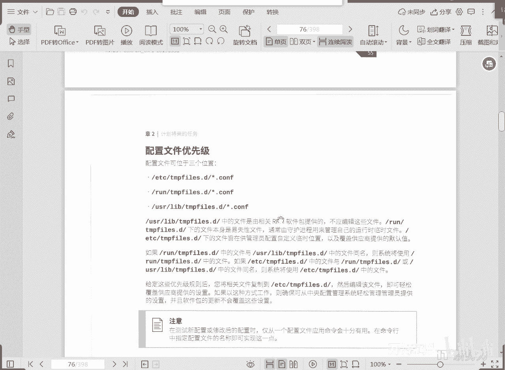

# 红帽RHCE RH134：2：计划任务与临时文件管理





在本节课中，我们将学习如何在RHEL 8系统中使用systemd的计时器（Timer）单元来管理周期性任务，以及如何使用systemd的临时文件管理机制来创建和清理临时文件。我们将通过具体的配置文件示例和操作命令，帮助你理解这些核心概念。

## 使用systemd计时器管理周期性任务

上一节我们介绍了传统的`cron`服务。本节中我们来看看如何使用systemd的计时器单元来实现类似的功能。

systemd的计时器单元（.timer文件）可以替代传统的`cron`服务来执行周期性任务。它由systemd守护进程管理，具有更高的集成度和灵活性。

我们以`sosstates`计时器为例进行说明。首先，打开一个终端窗口。


执行以下命令，确认`sosstates`计时器已安装。

```
systemctl status sosstates.timer
```

输出显示“already installed”，表示已安装。


`sosstates.timer`的配置文件位于`/usr/lib/systemd/system/`目录下。我们可以直接修改此目录下的同名配置文件。

打开配置文件后，可以看到三个主要字段。第一个是说明。第二个字段是计时器描述，例如`OnCalendar=*:00`表示每小时执行一次。现在我们需要将其改为每两分钟执行一次。



将`OnCalendar`的值修改为`*:00/2`。同时，建议将上方的注释也相应改为两分钟。这个计时器关联的服务`sosstates.service`会收集当前活动账户的数量，并记录到`/var/log/sa/sa`文件中。

修改完成后，保存并退出。



为了让修改后的计时器立即生效，需要重新加载systemd的守护进程配置。

```
systemctl daemon-reload
```

执行此命令后，计时器的新配置就会生效。可以检查`/var/log/sa/`目录下的文件，确认新的日志记录已开始按两分钟间隔生成。



在Linux中，管理周期性任务有两种主要方式：
1.  直接使用`crontab`机制。
2.  使用systemd的计时器单元。systemd作为系统的第一个进程，掌控整个系统的资源和启动顺序。我们可以通过修改`/usr/lib/systemd/system/`下的计时器配置文件，并重新加载systemd配置（`daemon-reload`）来管理周期性任务。

本实验虽然使用了`cron`的概念，但实际是通过systemd实现的。列出systemd管理的所有单元，可以找到`crond.service`，这是一个传统的周期性任务守护进程。但在当前上下文中，我们不再用它，而是使用systemd的计时器单元。

也就是说，周期性任务一方面可以由传统的`crond`处理，另一方面可以直接由systemd的计时器单元处理。


执行`systemctl daemon-reload`的作用是确保systemd刷新并知晓这些更改。然后，需要使用`systemctl`命令激活并启动这个计时器。

计时器需要像服务一样被启用（enable）并立即启动（start）。


还需要执行以下操作。当然，我们之前已经验证过它是否在运行。查看日志，可以看到在32分、34分、36分等时间点已有记录生成。

如果还需要强制刷新一下，可以使用`systemctl enable --now`命令。

```
systemctl enable --now sosstates.timer
```

在RHEL 7中，这个机制已经可用，但教材中较少提及，更多是沿用从RHEL 6过渡的传统思路。到了RHEL 8，则彻底倾向于使用这些systemd命令。`enable`表示许可一个计时器在下次开机时自动运行，`--now`表示现在就启动它。这个计时器其实已经在运行了。


systemd管理着许多计时器，例如`sysstat`。启用以`.timer`结尾的计时器单元，可以在一定程度上替代传统的`crond.service`。

## 管理临时文件

接下来是第四部分：管理临时文件。

通常，对临时文件的管理除了删除超时的文件外，还有一个重要功能：创建临时文件的目录结构。在systemd启动后，可以使用`--create`选项创建需要的目录结构，使用`--remove`选项删除已到期或满足删除条件的文件和目录。

在系统启动时，systemd默认会创建临时文件目录框架，并删除该删除的文件。那么，创建和删除的依据是什么呢？是由以下位置的配置文件共同决定的：
*   `/usr/lib/tmpfiles.d/*.conf`
*   `/run/tmpfiles.d/*.conf`
*   `/etc/tmpfiles.d/*.conf`

毫无疑问，优先级最高的是`/etc/`下的配置文件。systemd会根据这些配置文件中标记的规则，执行创建、清理或删除操作。

systemd有一个专门用于清理临时文件的计时器单元`systemd-tmpfiles-clean.timer`。除了在启动时执行清理，它还可以在其他定义的时间点触发，以确保长期运行的系统不会因为陈旧数据填满磁盘。这个计时器单元会定期触发，执行清理命令。

这个计时器单元的结构与我们之前讨论的类似，包含一个`[Timer]`部分来定义触发频率。我们可以使用`systemctl cat systemd-tmpfiles-clean.timer`命令来查看这个计时器的状态。

大部分计时器配置文件位于`/usr/lib/systemd/system/`目录下，以`.timer`结尾。你也可以直接编辑这个文件。

编辑时，文件格式与我们之前看到的`sosstates.timer`类似。第一部分是`[Unit]`，包含说明和文档。紧接着是`[Timer]`部分，定义计时器行为。

在我们之前的`sosstates`例子中，使用的是`OnCalendar`（基于日历）。而在`systemd-tmpfiles-clean.timer`中，我们看到的是`OnBootSec`和`OnUnitActiveSec`。
*   `OnBootSec=15min` 表示系统启动15分钟后执行一次。
*   `OnUnitActiveSec=1d` 表示从上一次活动结束后24小时再触发一次。

这样配置保证了清理计时器会定期激活清理服务`systemd-tmpfiles-clean.service`。你可以根据需要更改计时器单元，例如设置为每30分钟触发一次。

更改定时器的配置文件后，使用`systemctl daemon-reload`命令确保systemd知晓这些更改。这部分内容与RHEL 7有所不同，因此需要特别注意。

重新加载配置后，使用`systemctl enable --now`命令重新启用并激活这个清理计时器，相当于双保险操作。根据我们之前的操作概念，执行`daemon-reload`后它就会开始工作。`enable --now`则是确保下次开机也允许运行，并且立即启动计时器。

`systemd-tmpfiles-clean`命令解析的配置文件与`systemd-tmpfiles --create`命令相同。`clean`操作不会创建文件和目录，只会清除。而`--create`操作则不会清除，只会创建。这意味着临时文件管理不仅涉及清除，还可能因为需要特定的目录结构或空文件而进行创建。

`tmpfiles.d`的man页面详细描述了配置格式。其语法结构由七列构成：
1.  类型
2.  路径
3.  模式（权限）
4.  所有者UID
5.  所属组GID
6.  期限
7.  其他参数

这定义了创建一个新文件或目录所需的几个项目。

例如，下面这行配置：
```
d /run/console 0755 root root -
```
*   `d` 表示创建尚不存在的目录（仅在调用`--create`时激活）。
*   `/run/console` 是目录路径。
*   `0755` 是目录权限。
*   `root root` 是所有者和所属组。
*   `-` 表示无期限/参数。

当调用`--create`命令时，它会按照这行配置创建目录（如果不存在）。如果目录已存在，则不执行操作。

另一个例子：
```
D /tmp/.X11-unix 0755 root root 1d
```
*   `D` 表示如果目录不存在则创建，如果存在则清空。
*   `1d` 是期限（一天）。当调用`--clean`时，会删除此目录中一天内未被访问或修改过的文件。

还有一个例子：
```
L /run/fstab - - - - ../etc/fstab
```
*   `L` 表示创建符号链接。
*   `/run/fstab` 是链接路径，指向`../etc/fstab`。
*   权限部分为`-`，表示使用默认值。
*   未指定期限，表示不会清除此链接。

更多配置示例可以从`man tmpfiles.d`的帮助文档中获得。

这些配置定义在相关的配置文件中后，当我们调用`--clean`、`--create`或`--remove`命令时，systemd就会根据第一列定义的操作符类型，对指定的路径执行相应的清除、创建或删除操作。

这些配置文件位于三个位置，优先级从高到低依次是：
1.  `/etc/tmpfiles.d/*.conf`
2.  `/run/tmpfiles.d/*.conf`
3.  `/usr/lib/tmpfiles.d/*.conf`

如果`/run/`下的文件与`/usr/lib/`下的文件同名，系统使用`/run/`下的。如果`/etc/`下的和`/run/`下的同名，则使用`/etc/`下的。因此，`/usr/lib/`下的通常是默认值，可能会被系统自动更改。要自定义配置，应优先将文件创建在`/etc/tmpfiles.d/`目录下，且扩展名必须为`.conf`。这样，我们的临时文件管理就有了一个规范的机制。



## 总结


本节课中我们一起学习了在RHEL 8中管理计划任务和临时文件的核心方法。我们了解到可以使用systemd计时器（.timer单元）来替代传统的cron，通过编辑配置文件并执行`systemctl daemon-reload`和`systemctl enable --now`来管理周期性任务。同时，我们也学习了systemd的临时文件管理机制，通过`/etc/tmpfiles.d/`目录下的.conf配置文件，可以定义临时目录和文件的创建、清理规则，并由`systemd-tmpfiles-clean.timer`定期执行清理，从而有效管理系统临时文件。