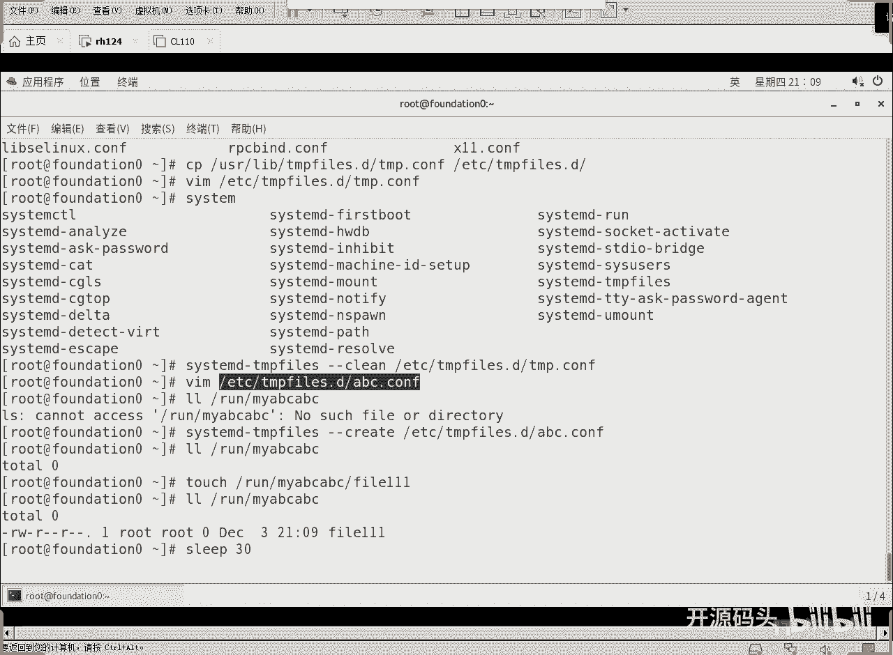
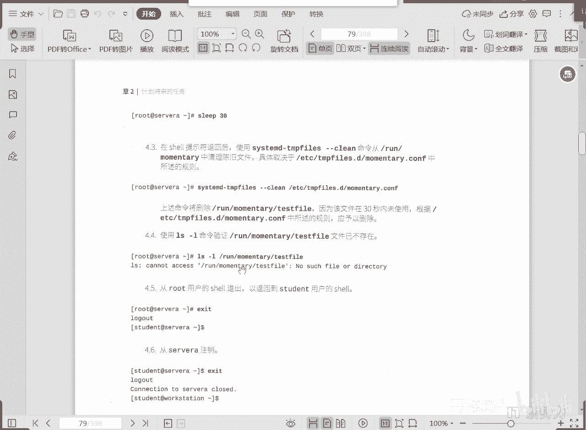
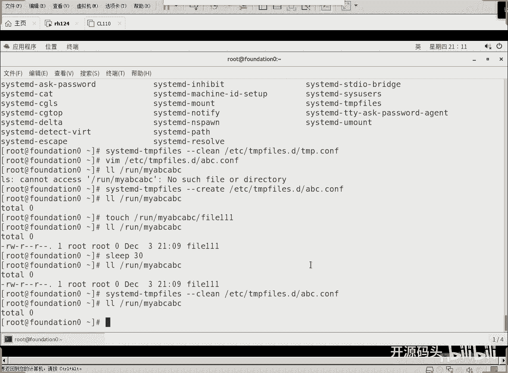

# 红帽RHCE RH134  2 计划任务与临时文件管理(6).mp4 - P1 - 开源码头 - BV1Md4y197PP

在系统启动的时候，cmd开机时调用刚刚create和刚刚remove，那么就会根据我们这三个目录下u s下，run下t下三个目录下所有的配置文件啊，进行什么呢。

进行相关的create和remove的操作，该创建目录结构或者创建文件，就开始创建该删除的删除对吧，那么这些创建和删除都是在配这四个配置文，这三个配置文件里面，这三个配置文件里。

这三个目录下的配置文件里面去进行定义的啊，然后呢为了防止我们机器常开的机器呢，它一直不开机了是吧，他只要开一次机，他一直开啊，为了防止这些机器的那个临时文件都积累了太多啊，他们发clean的计数器。

这个计数器呢跟我们之前聊的话题一样，它默认情况下配置文件是在u s i下面对吧，那ui下面的呢我们呢如果不用的话，我们可以把它拷到etc项啊，那不管在哪里，反正里面的就是规定啊。

刚开机多长时间就做一次clean的操作，然后呃上次活动之后再隔多长时间再做一次啊，每天都做是吧，一对的话就是每天都做啊，这样的话呢我们就会呃在常开的这种机器啊，没有启动的这种环节的情况下啊。

每隔一天也会自动的去清除一次我们的临时文件，ok好，那，关于这个配置文件的更改啊，就是呃依靠什么，依据什么配置来决定create的东西或者remove的东西或者clean东西，那就看配置文件里的东西啊。

看这三个地方的配置文件，这个配置文件里面呢就是这个样子的啊，就这个样子就是七列，第一列呢代表的是操作类型，第二类代表的是被操作的对象啊，第三个就是权限，第四个就是用户id和阻i d，第五个是这个东西。

它保留的期限是多长，修改时间和创建时间啊，不不不好意思，就是改变权限的这种操作是称职啊，change model这个操作啊就是访问access时间啊，modify时间以及什么，以及这个停止时间啊。

就是用state s t e t的命令，然后看一下文件，这个文件呢三个技术，三个这个日期如果都是旧的话，才会被清除啊，就是如果有一个是新的，也不会被清除啊，一个文件它会有三个时间，一个是访问时间。

一个是修改内容的时间，一个是改变权限的时间，所以这三个时间如果都是旧的了，才会被清除，好吧，可以用stat命令来查看一个文件的这些参数，ok好，那么这里面就是规定了啊，小d是创建不存在的目录啊。

大z是递归还原s0 x和权限所有者，大地呢是代表的是目录，如果不存在就创建，存在则清空，也就是说我只保证这个目录结构是存在的是吧，l是创建符号链接，但这些都可以啊，啊这些操作我们看后面这是有期限。

像这个横杠就代表什么无期限，这个目录架构一直得在啊，一直都在啊，那这个的话是也是无期限是吧，啊这个试验啊，我们来看一下这个实验的作用是什么，先把u s lab。

上的tf 2点d向的tp点是configure啊，考到e t t下铁美分点d目录下啊，然后呢我们在这里你看ss这个命令是查找替换的一个功能啊，啊它呢呃查找呃开头是d。tp的，早间这一行收十地啊。

这我们说十币收建十天啊，十地改成什么五帝啊，把它改成五帝，从这一行上修建十10d改成5d，然后把它改了之后呢，我们重新根据这个配置文件做一下临时文件的clean操作啊，临时文件的clean操作是吧。

还有啊修改一个自己的自定义好的这个配置文件d什么意思啊，如果目录啊不存在，在创建相应，的目录啊，这个目录让下的这个目录是吧，权限所有者所有者，然后期限只只要多长时间，30秒啊，30秒过后呢。

他就应该被就是它的有效期就过了啊，就应该为什么清空里面所有的东西吧对吧，这个目录每隔30秒去做一次，就它的生命周期也就30秒啊，超过三秒以后呢就可能被清除掉，然后这个是create，create。

是创建了，对不对啊，然后呢我们就可以用l i d l l l l的方式呢，可以看到相应的目录被创建，对不对，然后在这个目录下创建一个什么，创建一个文件，touch一个文件出来强制休，息30秒钟时间。

休息完30秒钟之后呢，我们就开始再重新调用一下什么，刚刚clean的操作是不是他的时间超出30秒，超出30秒的清楚清楚以后，我们再去看的时候，它就没有了，像这种临时性文件的操作，就是这个机制，好吧啊啊。

我们可以去尝试着去操作一下好吧，拷贝什么拷贝u usr下面的，这个目录下有一个tp的这个配文件，把它拷到d一下tm p的范围，这个目录下，然后修改这个目录下的tp啊，打开以后呢，找见这个tp这这一行啊。

原来写的是几天，十天是吧，我们给它改成五天就可以了啊，每五天做一次清除的操作啊，克里尔目录清除临时目录，还有执行一些名称空间里的挂载点啊，这是x代表执行是吧，呃我们刚才说的那个七列的概念是吧。

七列最后这一列呢是有效期限，这个是30天啊，这个tm p这个瓦下的tm p是30天才做一次，清楚好，这个方式做好了以后呢，d杠tp啊，清除杠杠啊，我们可以明确指定一下哪个配置文件好吧。

指定这个这个配置文件，我们只要它按这个配置文件去做一次清除啊，这个是可以的是吧，超过五天的就清楚了啊，然后我们自己也可以自己自定义一个配置文件，听不下去啊，a b c abc嘛，哈哈哈。

点config配置文件，在这个配置文件中啊，我们写这么一行目录是run目录下的my abc a abc这个目录啊，然后属于root，属于root组啊，权限在前面是吧，权限是07000700啊。

然后呢它的期限是30秒，l l l run目录下my a b c a b c是吧，a b c a b c，没有的，对不对，那我们开始呢做一下啊，尴尬create啊，根据这个配置文件来做啊。

根据这个配置文件走，然后我们来看一下这个目录创建了没有，是不是目录已经创建好了，然后touch往这个目录下创建一个touch，一个随便touch，一个fire 111。

再来聊聊看一下是不是这里面就有东西了，有的东西之后呢，我们现在是这样，因为30秒有个游戏机嘛，所以说我们l e a sleep什么30就是强制等上30秒吧，好。

30秒之后呢就超期了是吧，超期之后我们再次调用杠杆clean的时候呢，就会清除超期的东西，这是肛门科学讲啊，然后我们也可以看到相关的这种东西对吧，而且权限什么都是我们跟跟我们预期的那个是一样的啊。

然后我们还touch一个文件进去啊，进去之后呢，强制休息30秒，30秒，休息完之后再次调用杠杆clean啊，然后呢它就会根据这个配置文件的删除我们抄袭的东西，然后我们再次去找这个目录的时候呢。

啊这里面已经放不到了啊。

已经翻不到了呀，出来了出来了是吧，好我们先来看一下还在是不是我们在调用一下清楚的操作啊，还是相同的配置文件，清除一下，再次看一下是不是这个目录，这个目录是框架是吧，目录里的文件是不是就没有了。

这里面这是toto，是它的字节数是吧，好那这个这个文件就没有了，就被清除了，因为超出30秒的全部清除啊，好了，这是临时文件的操作啊，呃计划任务与临时文件的管理就这么多内容。

