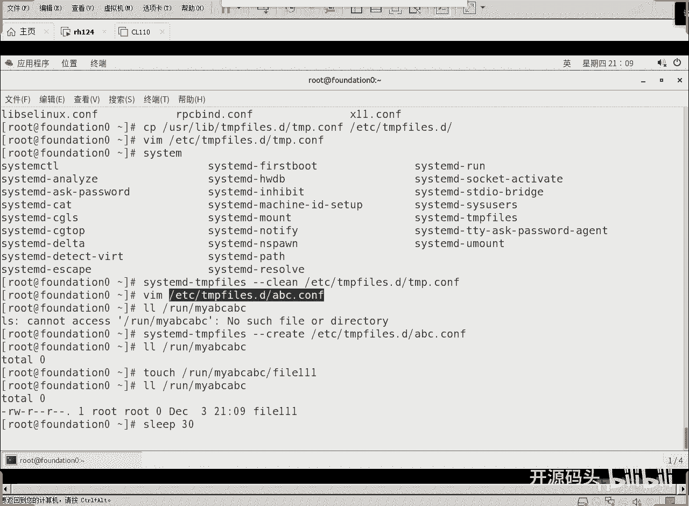
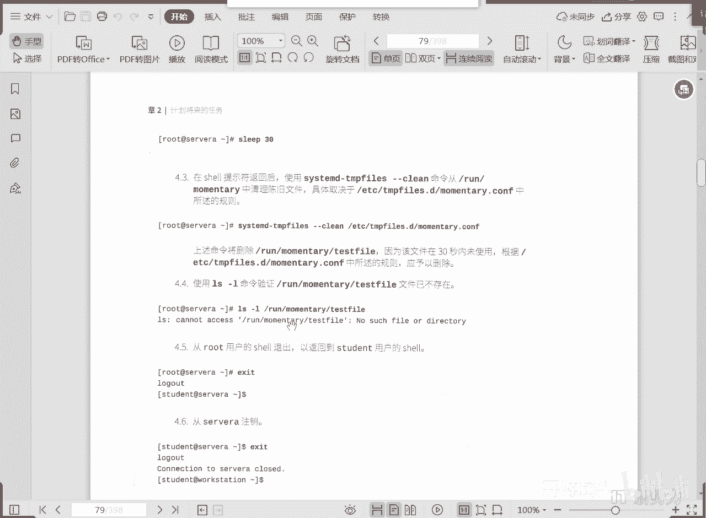
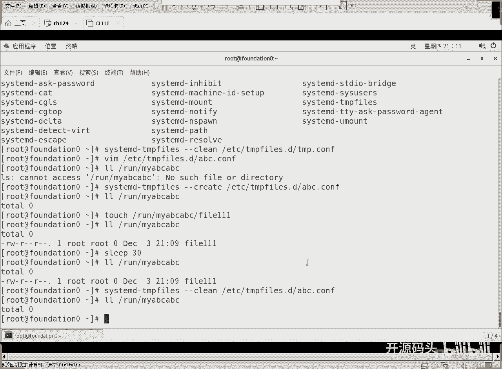

# 红帽RHCE RH134：2：计划任务与临时文件管理 🗂️⏰

在本节课中，我们将要学习Linux系统中临时文件的管理机制。我们将了解系统如何自动创建、清理临时文件，以及如何通过配置文件自定义这些行为。这对于维护系统整洁和性能至关重要。

## 系统启动时的临时文件管理

在系统启动时，系统会调用`create`和`remove`操作。这些操作依据`/usr/lib/tmpfiles.d/`、`/run/tmpfiles.d/`和`/etc/tmpfiles.d/`这三个目录下的所有配置文件来执行。系统会根据配置创建指定的目录结构或文件，并删除应被移除的项目。所有创建和删除操作的定义都存储在这三个目录的配置文件中。

为了防止长期运行的服务器积累过多临时文件，系统引入了`clean`计数器。这个计数器的默认配置文件位于`/usr/lib/tmpfiles.d/`目录下。如果需要自定义，可以将其复制到`/etc/tmpfiles.d/`目录。无论配置文件位于何处，其内容都规定了清理操作的频率，例如开机后多久执行一次清理，或者上次活动后隔多久再次清理。例如，设置为每天清理一次，可以确保即使机器不重启，也能定期自动清除临时文件。

## 配置文件格式详解

关于配置文件的更改，即依据什么来决定`create`、`remove`或`clean`的内容，完全取决于配置文件本身。

配置文件通常包含七列，其含义如下：
*   **第一列**：操作类型。
*   **第二列**：被操作的对象（路径）。
*   **第三列**：权限。
*   **第四列**：用户ID和组ID。
*   **第五列**：文件或目录的保留期限。
*   **第六列**：基于哪些时间戳判断文件是否“陈旧”。
*   **第七列**：年龄参数（与第六列配合使用）。

一个文件拥有三个时间戳：访问时间（access）、修改时间（modify）和状态改变时间（change）。只有当这三个时间都超过设定的期限时，文件才会被判定为“陈旧”并被清理。可以使用`stat`命令查看文件的这些时间参数。

以下是常见的操作类型符号：
*   **`d`**：创建不存在的目录。
*   **`D`**：确保目录存在。如果不存在则创建；如果存在，则清空目录内的内容。
*   **`z`**：递归地恢复SELinux上下文和权限、所有者。
*   **`L`**：创建符号链接。

在期限列，`-` 代表无期限，意味着该目录结构必须一直存在。

## 实验：自定义临时文件清理

上一节我们介绍了配置文件的格式，本节我们通过一个实验来看看如何应用它。

首先，将系统自带的清理配置文件复制到`/etc`目录并进行修改。

```bash
# 1. 复制配置文件
cp /usr/lib/tmpfiles.d/tmp.conf /etc/tmpfiles.d/

# 2. 修改清理周期（例如，将10天改为5天）
sed -i '/^d.*tmp/s/10d/5d/' /etc/tmpfiles.d/tmp.conf
```
`sed`命令用于查找和替换文本。这里它找到以`d`开头且包含`tmp`的行，并将其中的`10d`替换为`5d`。

修改后，可以手动触发一次清理操作，让系统立即应用新配置清理超过5天的临时文件。

```bash
systemd-tmpfiles --clean --prefix=/tmp
```

接下来，我们创建一个完全自定义的配置文件，来管理一个生命周期极短（30秒）的临时目录。

```bash
# 3. 创建自定义配置文件
cat > /etc/tmpfiles.d/myabc.conf << EOF
d /run/myabc 0700 root root 30s
EOF
```
这行配置的意思是：在`/run`目录下确保存在`myabc`目录（`d`），权限为`0700`，所有者和组均为`root`，其有效期为30秒。

现在，我们根据这个配置文件创建目录。

```bash
# 4. 根据配置文件创建目录
systemd-tmpfiles --create /etc/tmpfiles.d/myabc.conf

# 5. 验证目录是否创建
ls -ld /run/myabc
```
可以看到`/run/myabc`目录已被创建。

然后，在该目录下创建一个文件，并等待30秒使其“过期”。

```bash
# 6. 在目录中创建测试文件
touch /run/myabc/file111



# 7. 等待30秒
sleep 30
```
30秒后，该目录及其内容已超过配置文件中设定的有效期。

最后，执行清理操作，清除所有过期的项目。

```bash
# 8. 执行清理操作
systemd-tmpfiles --clean /etc/tmpfiles.d/myabc.conf



# 9. 再次检查目录和文件
ls -l /run/myabc/
```
执行清理后，`/run/myabc`目录下的`file111`文件因为已超过30秒有效期而被自动删除。目录本身由于配置类型为`d`（需确保存在）而被保留。

## 总结



本节课中我们一起学习了Linux系统通过`systemd-tmpfiles`机制管理临时文件的方法。我们了解了系统如何在启动时依据配置文件创建和删除临时结构，以及如何通过`clean`计数器定期清理陈旧文件。通过分析配置文件的七列格式和常见操作符，我们掌握了自定义临时文件生命周期的方法。最后，通过动手实验，我们实践了修改系统默认配置以及创建完全自定义的临时文件管理规则，从而确保系统环境的整洁与高效。