# 红帽RHCE8认证课程：03-2：命令行管理文件 📂

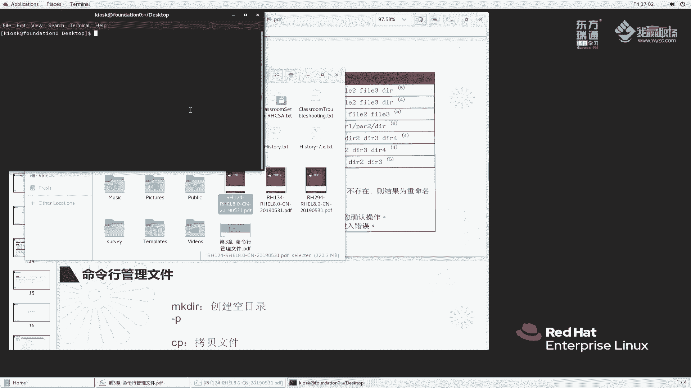

在本节课中，我们将学习如何在命令行下管理文件和目录。我们将掌握几个核心操作：复制（copy）、移动（move）、删除（remove）以及创建目录。这些是日常系统管理中最基础且频繁使用的命令。

上一节我们介绍了路径导航和`touch`命令。本节中，我们来看看如何对文件和目录进行更复杂的操作。

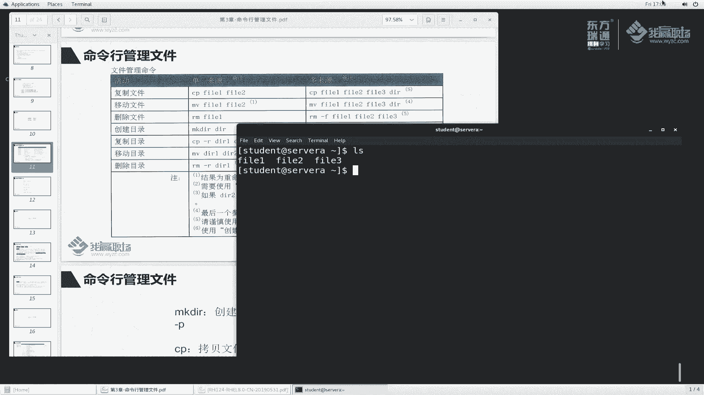

## 复制文件 📋

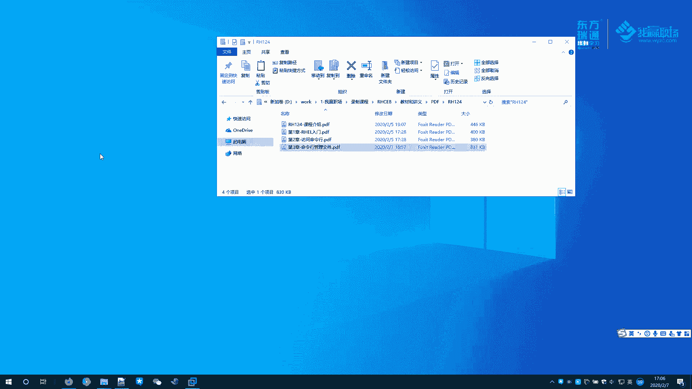

`cp`命令用于复制文件。其基本语法是：
```bash
cp [选项] 源文件 目标文件
```
或复制多个文件到一个目录：
```bash
cp [选项] 源文件1 源文件2 ... 目标目录
```

以下是`cp`命令的常见用法和注意事项：

*   **基本复制**：`cp file1 file2` 会将`file1`的内容复制到`file2`。如果`file2`不存在，则创建它；如果存在，则默认**静默覆盖**。
*   **交互式覆盖提示**：使用 `-i` 选项可以在覆盖前进行提示。例如：`cp -i file1 file2`。
*   **复制到目录**：可以将文件复制到指定目录，并保持原名或重命名。例如：
    *   `cp file1 /tmp/` 将`file1`复制到`/tmp`目录下，名称仍为`file1`。
    *   `cp file1 /tmp/file3` 将`file1`复制到`/tmp`目录下，并重命名为`file3`。
*   **复制多个文件**：可以同时复制多个文件，但**目标必须是一个目录**。例如：`cp file1 file2 file3 /tmp/`。
*   **管理员提示**：在`root`用户下执行`cp`命令时，系统通常会通过别名自动添加`-i`选项，因此经常会出现覆盖提示。这是为了防止管理员误操作。

## 移动与重命名文件 🚚

`mv`命令用于移动或重命名文件和目录。其基本语法是：
```bash
mv [选项] 源 目标
```

以下是`mv`命令的关键点：

*   **重命名文件**：`mv file1 file4` 将`file1`重命名为`file4`。
*   **移动文件**：`mv file4 /tmp/` 将`file4`移动到`/tmp`目录。
*   **交互式提示**：与`cp`命令类似，可以使用`-i`选项在覆盖前提示。
*   **移动多个文件**：移动多个文件时，目标也必须是一个目录。例如：`mv file2 file3 /tmp/`。

## 删除文件 🗑️

`rm`命令用于删除文件或目录。**使用需谨慎**。其基本语法是：
```bash
rm [选项] 文件或目录
```

以下是删除操作的重要说明：

*   **删除文件**：`rm file1` 直接删除`file1`。
*   **交互式删除**：使用 `-i` 选项会在删除每个文件前提示确认。
*   **强制删除**：使用 `-f` 选项可以强制删除，忽略不存在的文件和不提示确认。
*   **管理员提示**：`root`用户执行`rm`时，通常也会自动启用`-i`提示，以防止灾难性误删。

## 目录操作 📁

上一节我们操作的都是文件，本节中我们来看看如何管理目录。

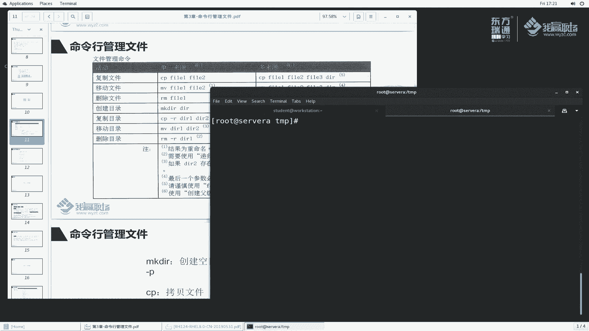

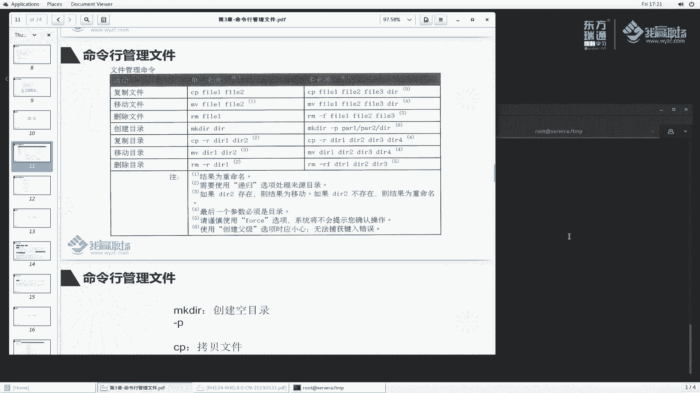

### 创建目录

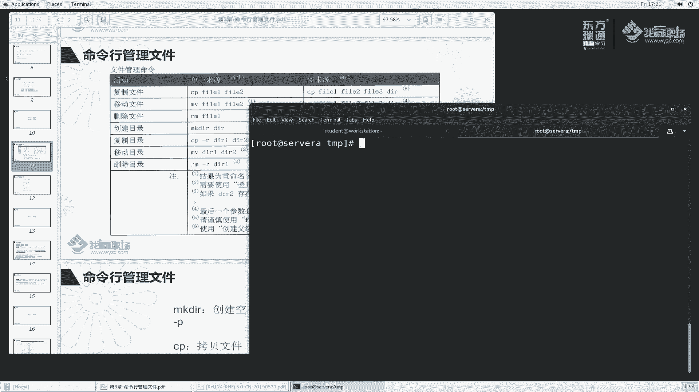

`mkdir`命令用于创建目录。
```bash
mkdir 目录名
```
*   **创建单个目录**：`mkdir laoma` 创建名为`laoma`的目录。
*   **递归创建目录**：使用 `-p` 选项可以创建多级目录。例如：`mkdir -p laoma/dir1/dir2` 会同时创建`laoma`、`dir1`和`dir2`。

### 复制目录

复制目录需要使用 `-r`（或 `-R`）选项，表示递归复制。
```bash
cp -r 源目录 目标目录
```
例如：`cp -r laoma /tmp/` 将`laoma`目录及其内部所有内容复制到`/tmp`下。

### 移动目录

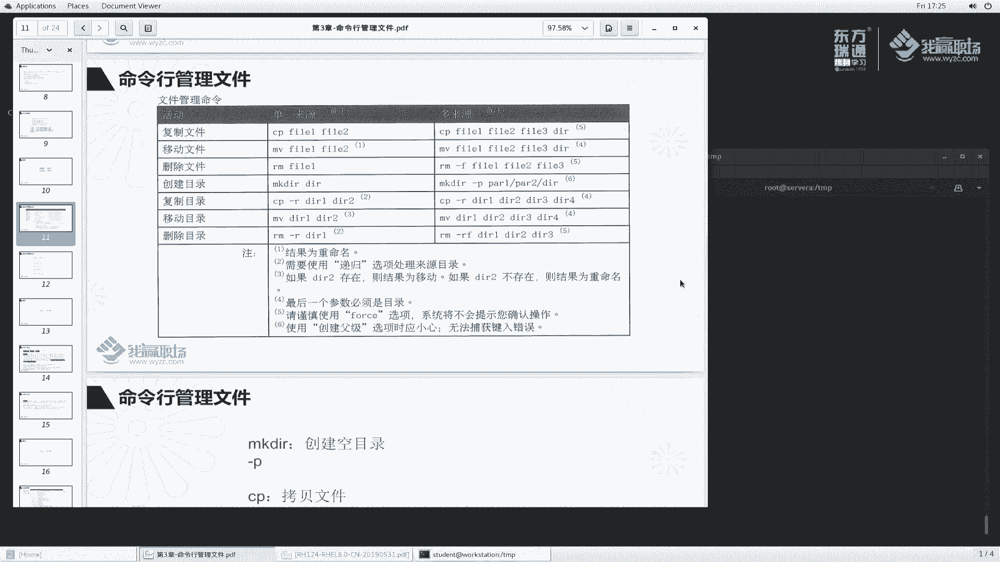

移动目录与移动文件命令相同，无需特殊选项。
```bash
mv 源目录 目标路径
```
例如：`mv laoma /tmp/`。注意，如果目标路径已存在同名目录，`mv`命令会拒绝移动。

### 删除目录

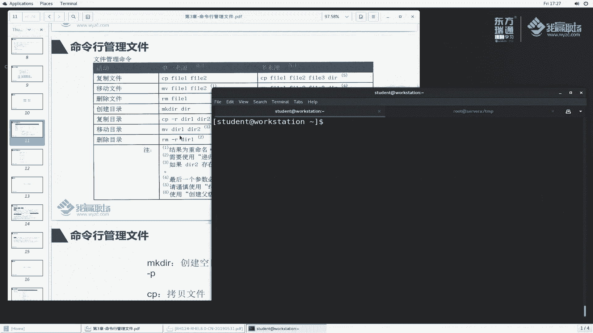

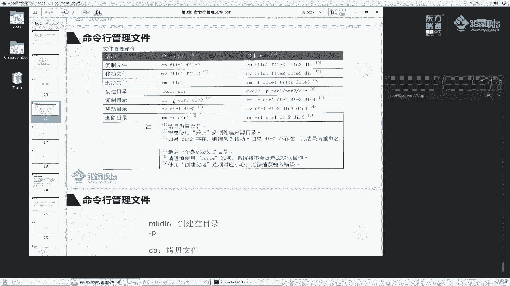

删除目录也需要使用递归选项 `-r`。
```bash
rm -r 目录名
```
*   **递归删除**：`rm -r laoma` 会删除`laoma`目录及其下的所有内容。系统会提示确认进入子目录和删除文件。
*   **强制递归删除**：`rm -rf laoma` 会**强制、递归地删除**`laoma`目录及其所有内容，**没有任何确认提示**。此命令非常危险，请谨慎使用。
*   **删除空目录**：`rmdir`命令专门用于删除**空目录**。如果目录非空，该命令会报错。例如：`rmdir laoma`。

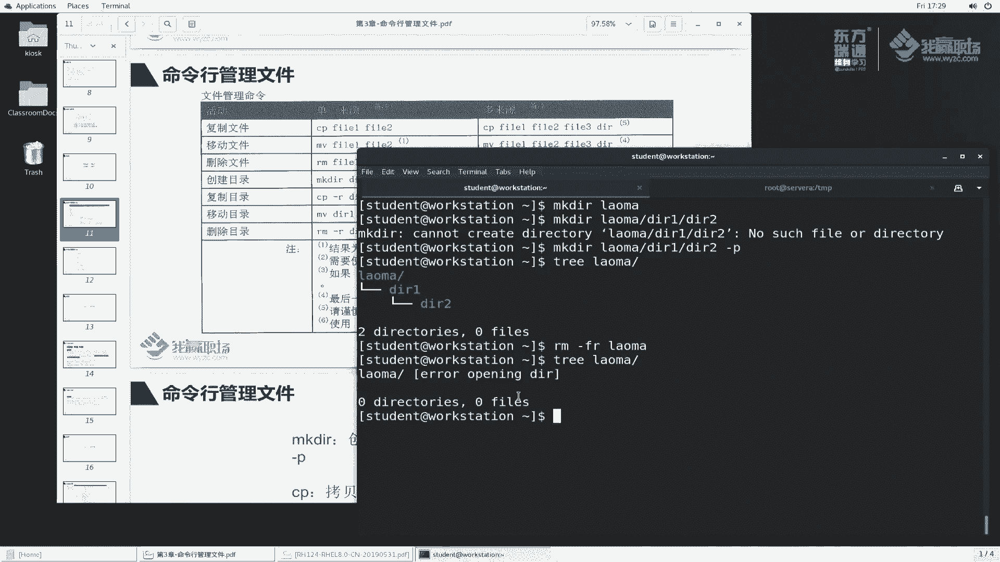

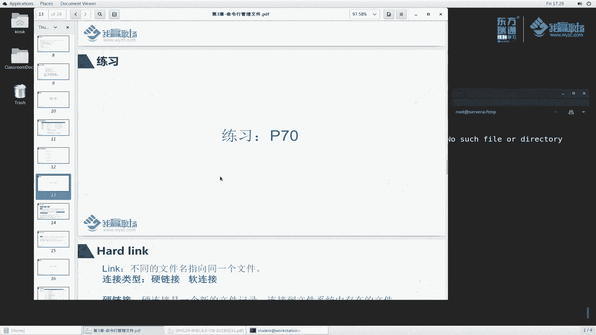

本节课中我们一起学习了在命令行中管理文件和目录的核心命令：`cp`、`mv`、`rm`、`mkdir`和`rmdir`。我们了解了如何复制、移动、重命名、删除文件与目录，并特别强调了`-r`（递归）和`-i`（交互）选项的用法，以及`root`用户下的安全提示机制。请务必谨慎使用`rm -rf`这样的强力删除命令。