# Linux文件系统管理：03-3：硬链接与软链接 📚

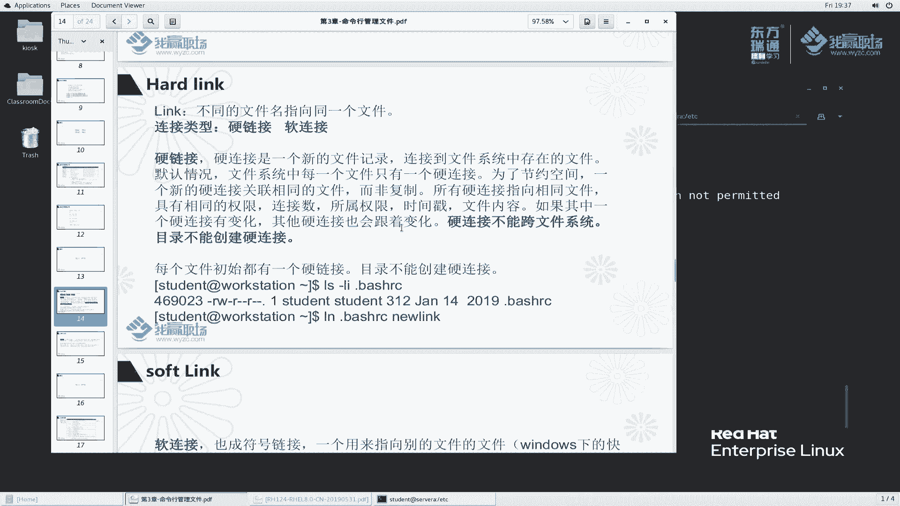

在本节课中，我们将学习Linux文件系统中的两个重要概念：硬链接和软链接。理解它们的工作原理和区别，对于高效管理文件至关重要。

## 概述：文件在系统中的存储方式

在深入链接之前，我们需要了解操作系统如何存储文件。一个文件在文件系统（如XFS或EXT4）中存储时，主要分为两部分：

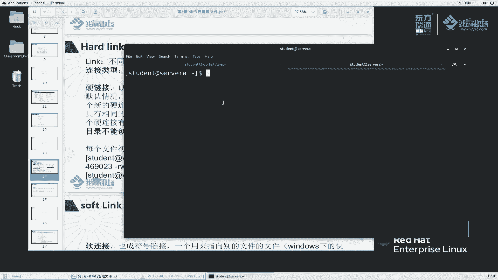

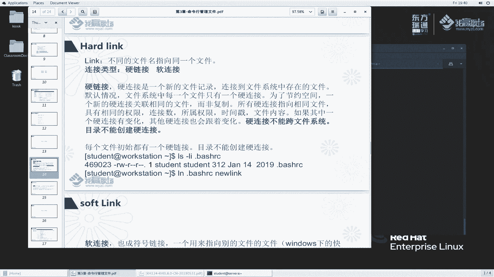

1.  **元数据**：用于描述文件属性的信息，例如文件所有者、所属组、权限、大小、修改时间以及一个关键的索引节点号。
2.  **数据**：文件的实际内容，例如文本文件中的文字。

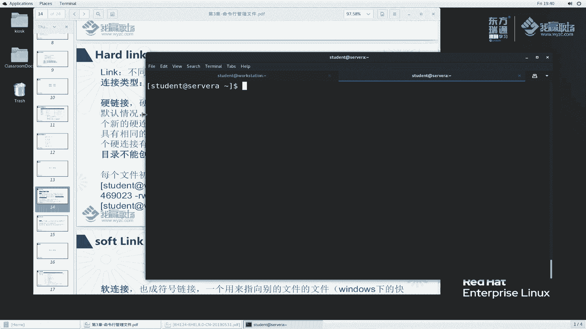

当我们执行 `ls -l` 命令时，显示的大部分信息都属于元数据。而文件的真实内容则存储在数据块中。

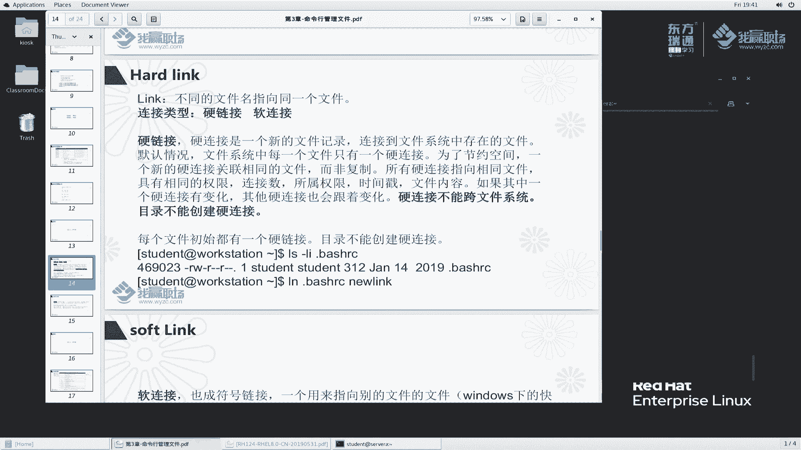

## 硬链接详解 🔗

上一节我们介绍了文件存储的基本结构，本节中我们来看看硬链接是什么。

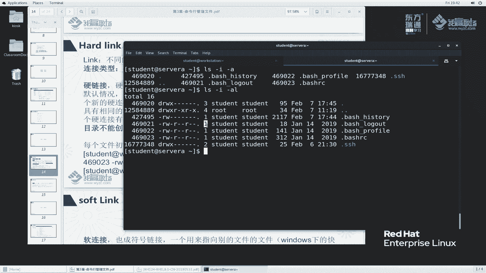

硬链接是一个新的文件记录，它指向文件系统中已存在的某个文件的**数据块**。默认情况下，每个文件只有一个硬链接，即文件本身。创建硬链接并不会复制数据，而是增加一个指向相同数据块的“入口”。

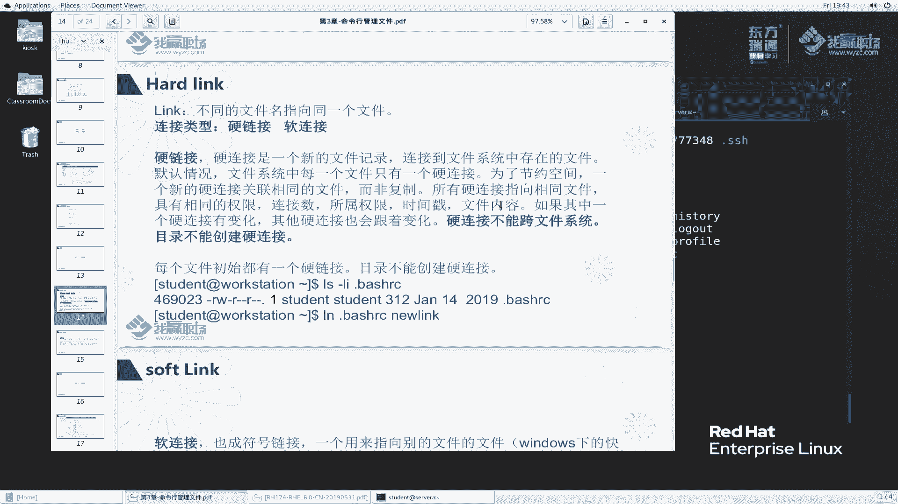

### 核心概念：索引节点

每个文件的元数据中都包含一个唯一的**索引节点号**。系统通过这个号码来定位文件的数据块。判断两个文件是否为同一个文件（即指向相同数据），可以看它们的索引节点号是否一致。

创建硬链接的命令格式如下：
```bash
ln <源文件> <新链接名>
```

以下是硬链接的关键特性演示：

1.  **创建与验证**：创建一个文件 `file1`，然后为其创建硬链接 `newfile`。
    ```bash
    touch file1
    ln file1 newfile
    ls -li file1 newfile
    ```
    观察输出，你会发现 `file1` 和 `newfile` 的索引节点号相同，且 `file1` 的链接数从1变成了2。

2.  **数据同步**：向 `file1` 写入内容。
    ```bash
    echo "Hello World" > file1
    cat file1
    cat newfile
    ```
    你会发现 `newfile` 的内容也同步更新了，因为它们访问的是同一份数据。

3.  **删除的影响**：删除原始文件 `file1`。
    ```bash
    rm file1
    cat newfile
    ```
    此时 `newfile` 仍然存在且内容完好。删除操作只是减少了该数据块的硬链接计数，当计数为0时，数据块才会被真正释放。

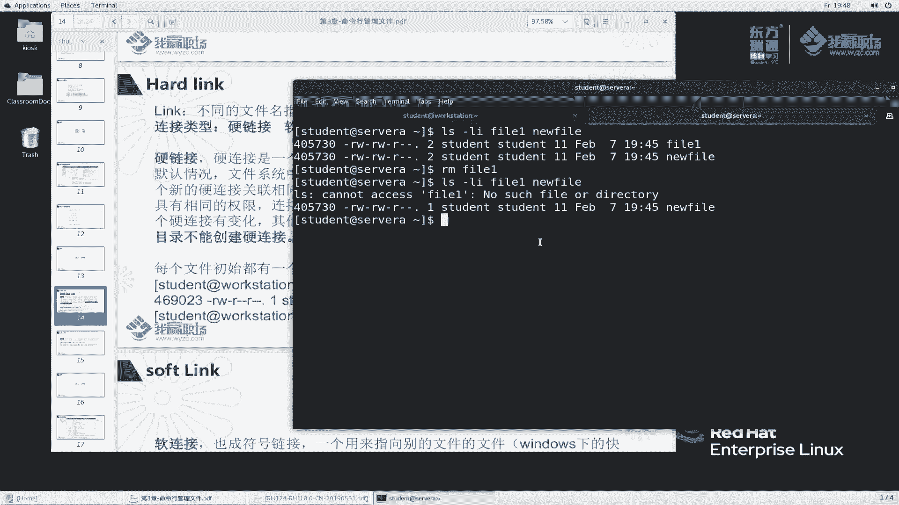

**硬链接的特点总结**：
*   所有硬链接地位平等，指向相同的索引节点和数据块。
*   修改任一硬链接，其他链接看到的内容都会改变。
*   删除一个硬链接，只要链接数不为0，数据就不会丢失。
*   **硬链接不能跨文件系统（分区）创建**，也不能为目录创建（系统为目录维护的硬链接除外）。

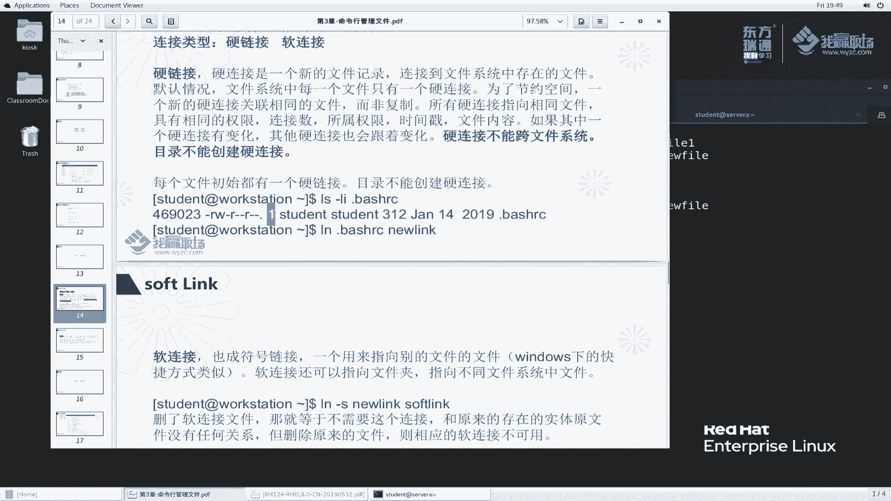

## 软链接详解 🔗

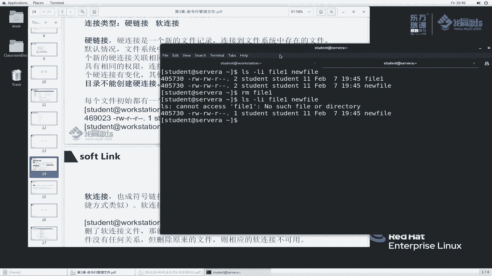

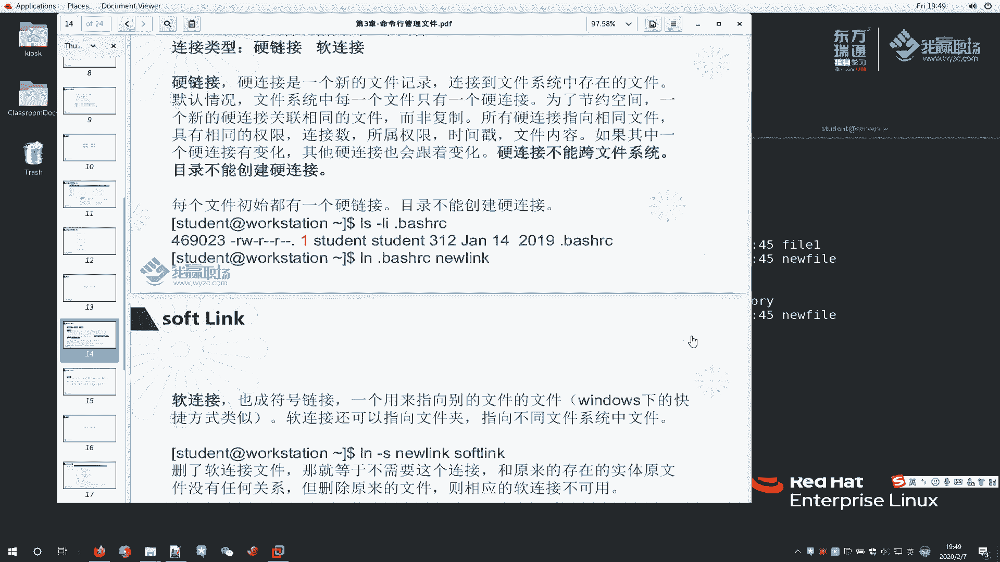

理解了硬链接是指向数据的“别名”后，本节我们来看看另一种更灵活的链接方式——软链接。

软链接，也称为符号链接，类似于Windows系统中的“快捷方式”。它是一个独立的文件，这个文件的内容是**目标文件的路径**。当你访问软链接时，系统会自动重定向到该路径所指向的文件。

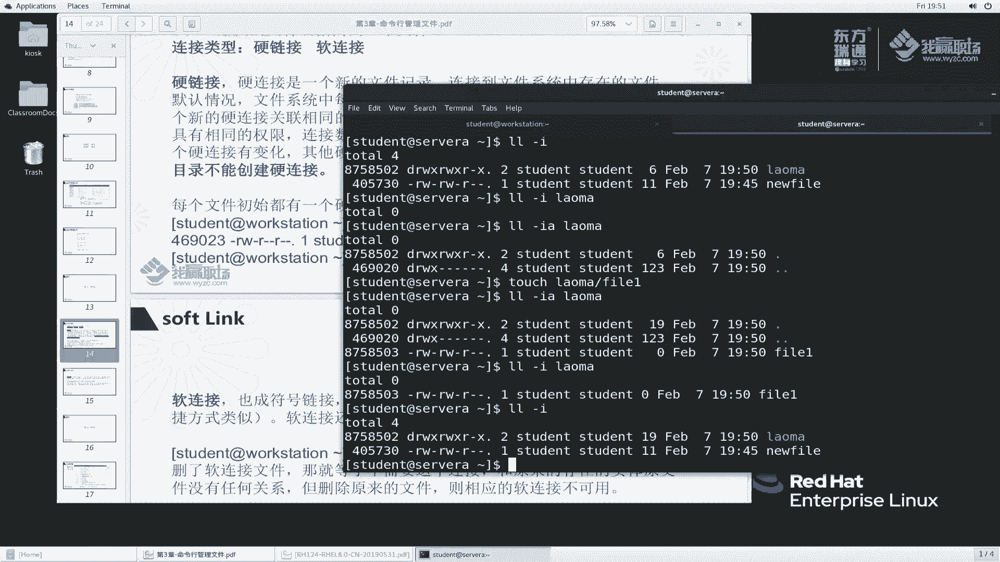

创建软链接需要加上 `-s` 选项，命令格式如下：
```bash
ln -s <目标文件路径> <软链接名称>
```

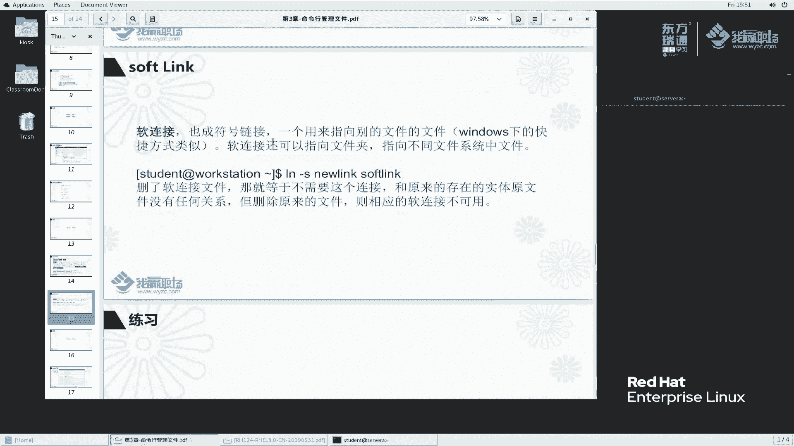

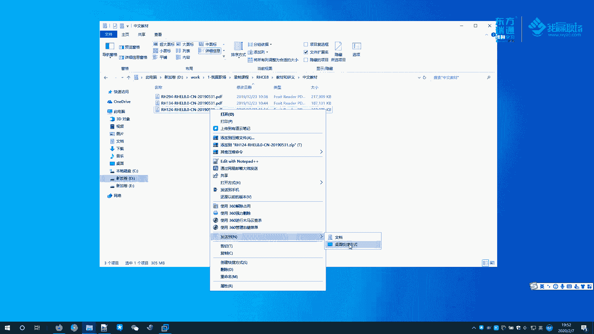

以下是软链接的操作演示：

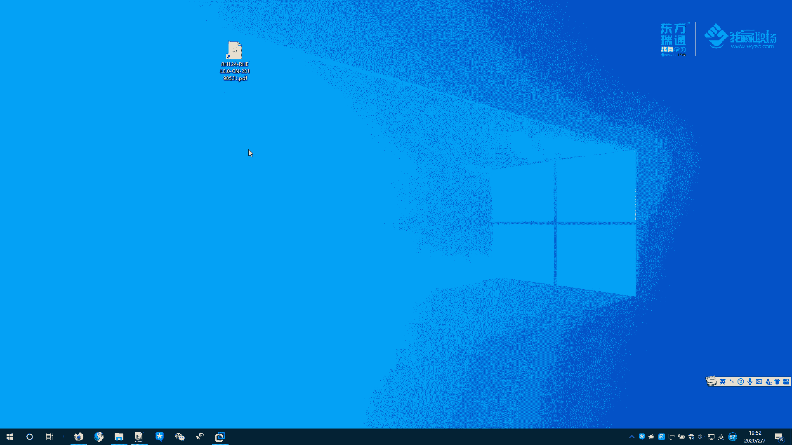

1.  **创建软链接**：为 `newfile` 创建一个软链接 `softlink`。
    ```bash
    ln -s /home/student/newfile softlink
    ls -l softlink
    ```
    使用 `ls -l` 查看时，软链接文件会明确显示其指向的目标路径，并且文件类型标识为 `l`。

2.  **访问与同步**：通过软链接访问和修改文件。
    ```bash
    cat softlink
    echo "New Content" >> softlink
    cat newfile
    ```
    通过软链接读写文件，效果与直接操作目标文件一致。

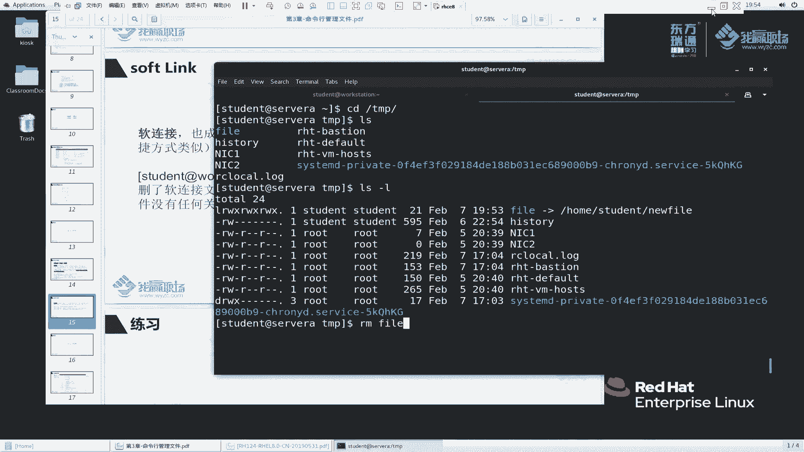

3.  **删除的影响**：
    *   删除软链接本身，不影响目标文件。
        ```bash
        rm softlink
        cat /home/student/newfile  # 文件依然存在
        ```
    *   如果删除目标文件，软链接就会变成“断链”（通常显示为闪烁），访问它将报错。
        ```bash
        rm /home/student/newfile
        ls -l softlink  # 链接存在但指向无效
        cat softlink    # 会提示文件不存在
        ```

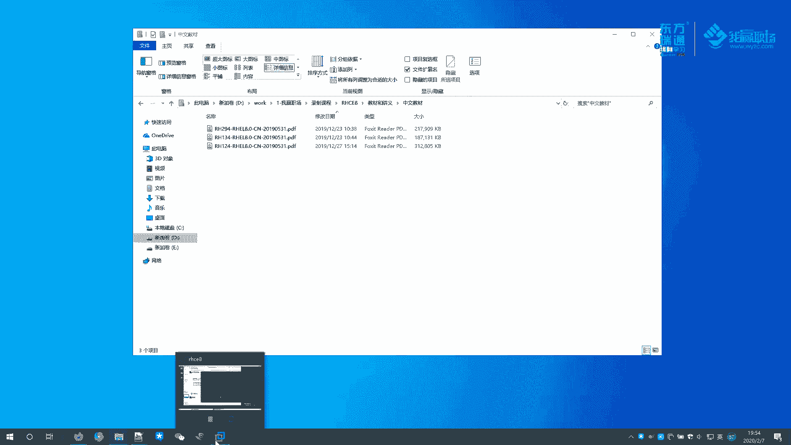

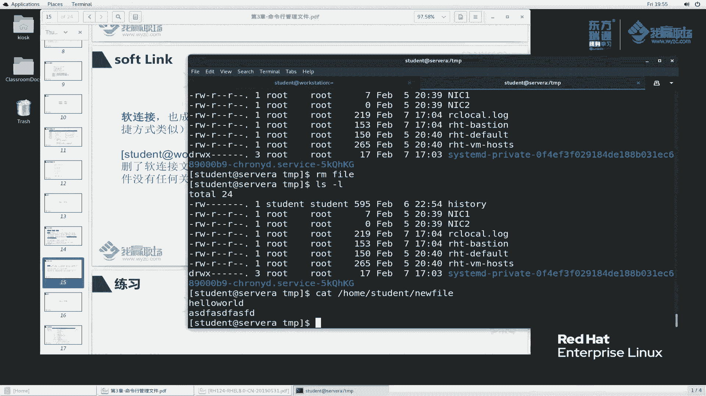

**软链接的特点总结**：
*   软链接是一个包含路径信息的独立文件。
*   可以跨文件系统（分区）创建。
*   可以为目录创建软链接。
*   删除目标文件会导致软链接失效（悬空链接）。
*   创建时建议使用**绝对路径**，以避免因工作目录变化导致链接失效。

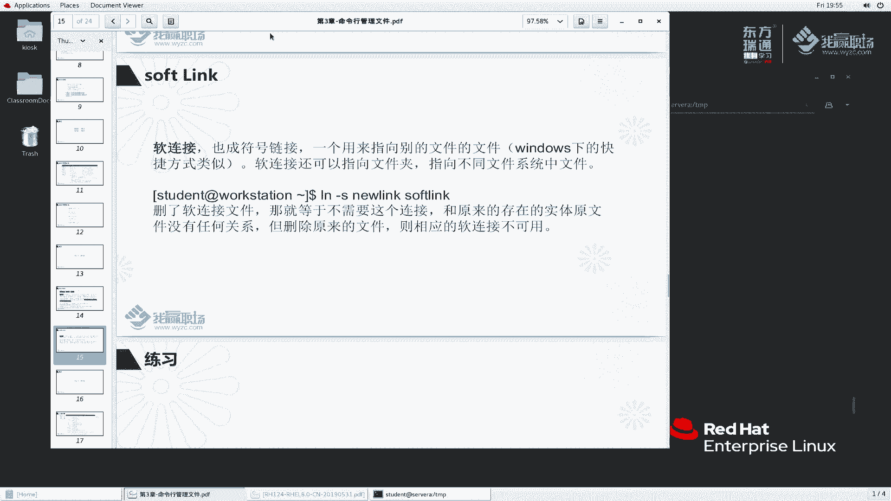

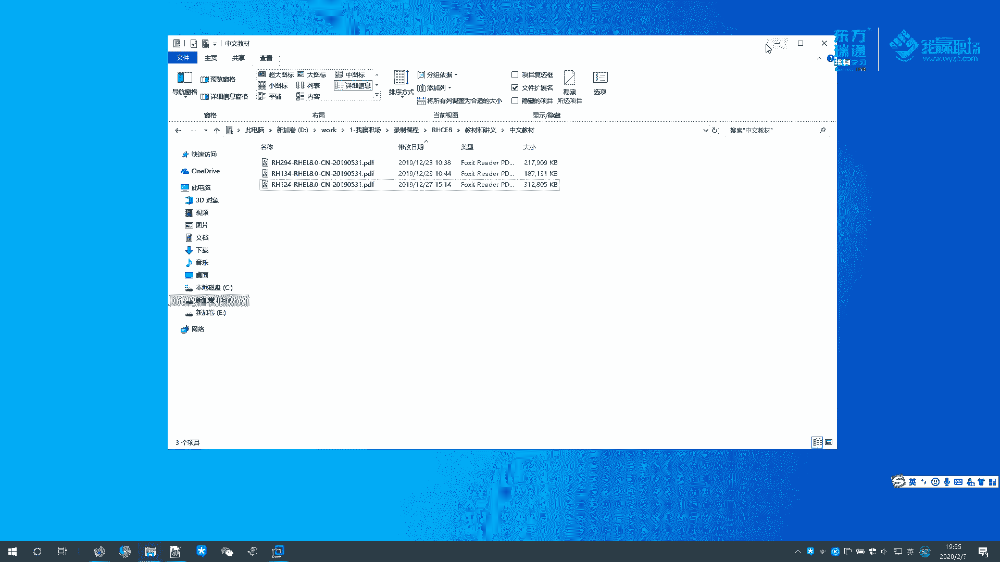

## 硬链接与软链接对比 📊


为了更清晰地理解两者的区别，以下是核心对比：

| 特性 | 硬链接 | 软链接 |
| :--- | :--- | :--- |
| **本质** | 同一数据块的多个目录入口 | 存储目标路径的独立文件 |
| **索引节点号** | 与源文件相同 | 与源文件不同 |
| **跨分区/文件系统** | **不支持** | **支持** |
| **链接目录** | 通常不允许（系统目录除外） | **支持** |
| **原始文件删除后** | 只要链接数>0，数据仍可访问 | 链接失效（悬空） |
| **文件大小** | 与源文件相同（共享数据） | 很小（仅存储路径信息） |
| **`ls -l` 显示** | 看起来像普通文件，链接数增加 | 显示为 `l` 类型，并列出指向路径 |

## 创建链接的注意事项 ⚠️

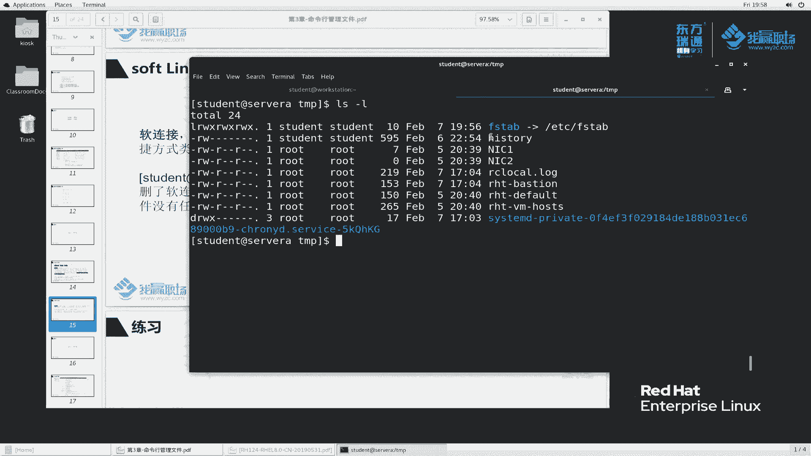

在创建链接，尤其是软链接时，需要注意路径问题。

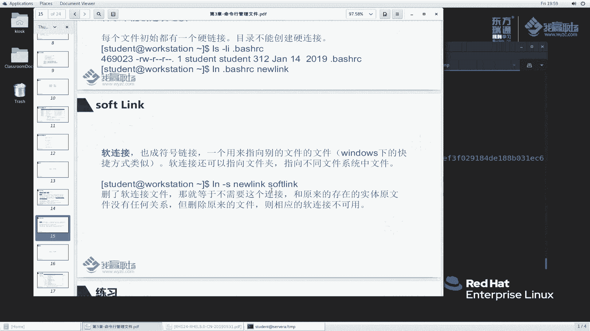

*   **使用相对路径的风险**：如果在不同目录下创建和使用软链接，相对路径可能导致链接指向错误。例如，在 `/tmp` 目录下创建指向 `file1` 的软链接，如果 `file1` 位于当前目录，使用相对路径 `./file1` 是可行的。但如果你移动了软链接文件，这个相对路径就可能失效。
*   **最佳实践**：为了确保链接的可靠性，**在创建软链接时，尽量使用绝对路径**。
    ```bash
    # 推荐：使用绝对路径
    ln -s /home/student/documents/report.txt /tmp/report_link

    # 谨慎：使用相对路径（需确保上下文不变）
    cd /home/student/documents
    ln -s ./report.txt /tmp/report_link
    ```

## 总结

本节课中我们一起学习了Linux中的硬链接和软链接。

*   **硬链接**是同一个文件数据块的多个名称，它们共享相同的索引节点。它节省空间，效率高，但限制较多（不能跨分区、不能链接目录）。
*   **软链接**则是一个指向另一个文件或目录路径的“快捷方式”。它非常灵活，可以跨分区、链接目录，但依赖于目标路径的有效性。

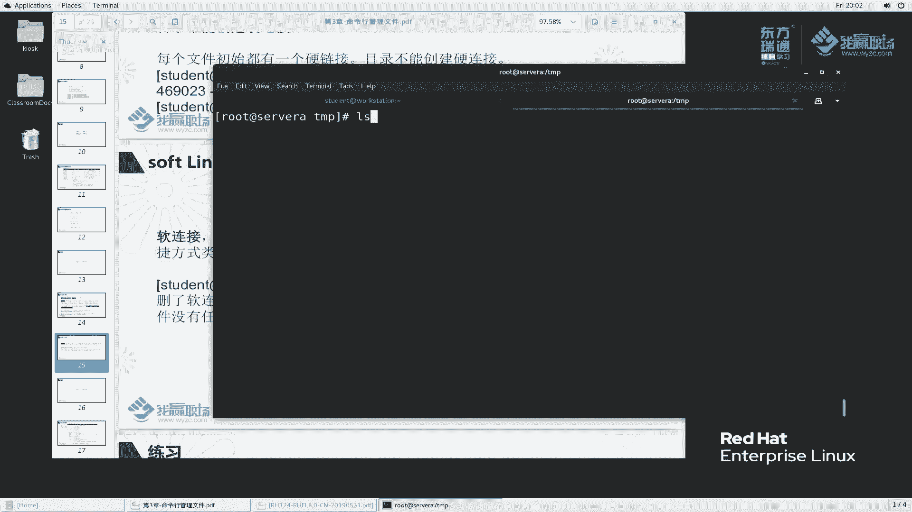

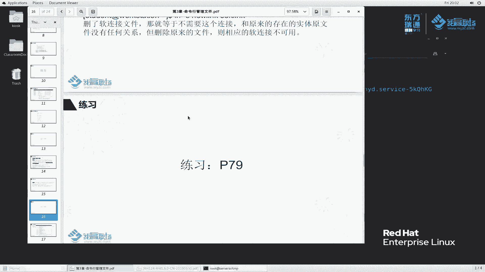

理解并熟练运用 `ln`（创建硬链接）和 `ln -s`（创建软链接）命令，能够帮助你在文件组织、脚本编写和系统管理中更加得心应手。对于初学者，多进行创建、查看和删除链接的练习，是巩固理解的最佳方式。