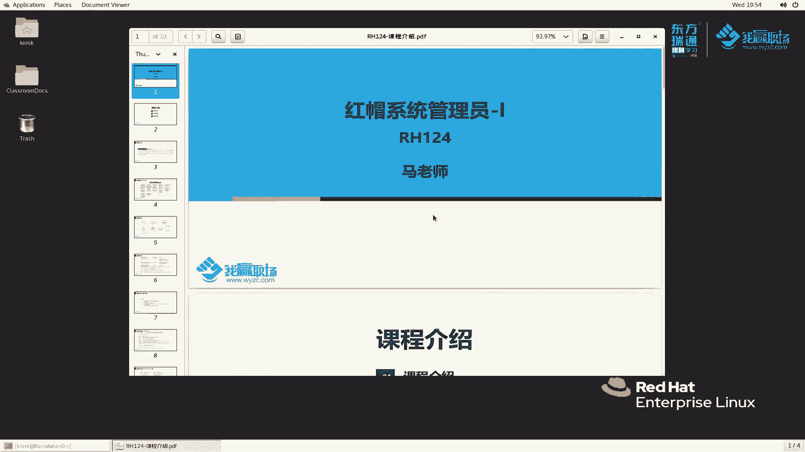
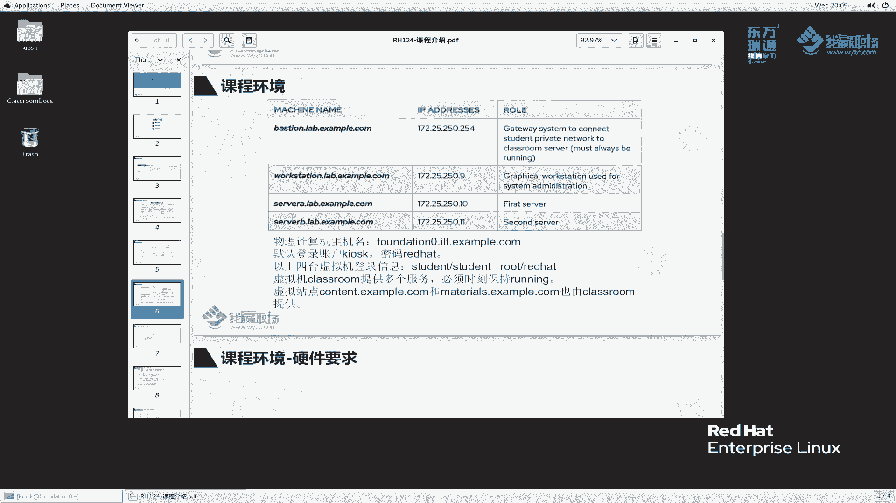
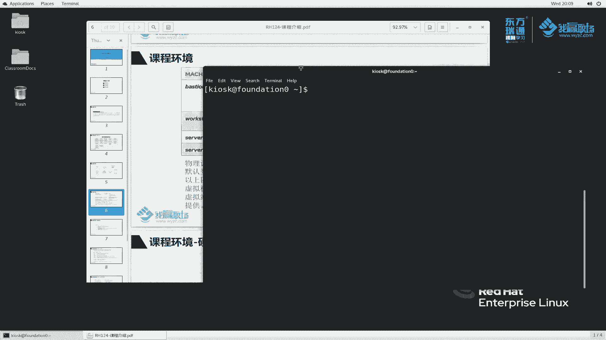
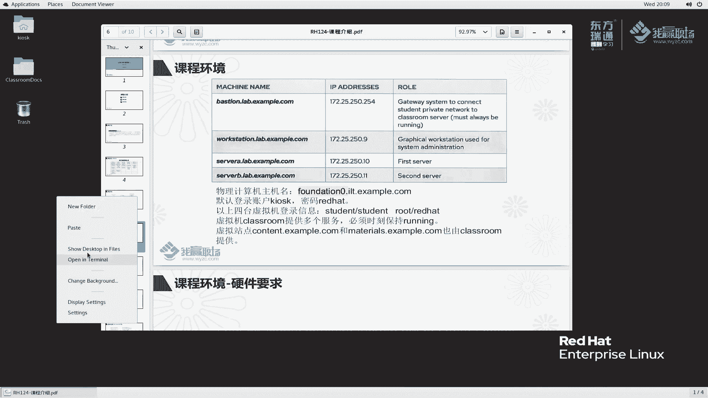
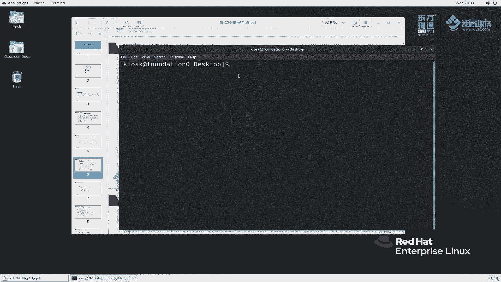
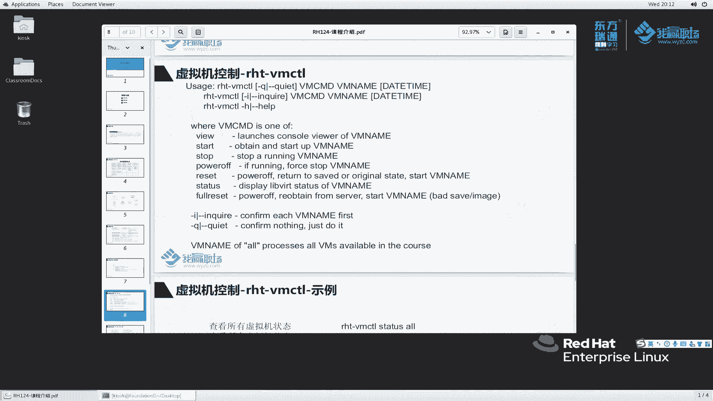

# 红帽RHCE8认证课程：1：RH124课程介绍与学习环境概览

在本节课中，我们将学习红帽系统管理员RH124课程的总体介绍、课程大纲结构以及学习所需的实验环境配置。

## 课程概述

红帽系统管理员RH124课程专为没有Linux系统维护经验的IT专业人员设计。本课程聚焦于Linux的核心管理任务，为学员提供Linux管理的生存技能。课程通过引入关键命令行概念和企业级工具，为学员成为全职Linux系统管理员奠定基础。

## 课程大纲详解

RH124课程内容非常丰富且基础，共分为五天，涵盖约15个章节。

### 第一天内容

第一天主要介绍Linux与红帽的基础概念，并开始接触命令行操作。

**第一章：红帽企业Linux入门**
本章将了解什么是红帽企业Linux，以及Linux与红帽的关系、Linux发行版本等基础概念。

**第二章：访问命令行**
在操作系统维护中，我们主要使用命令行。本章将介绍命令行的基本使用方法。

**第三章：在命令行中管理文件**
上一节我们介绍了命令行的基本概念，本节中我们来看看如何在命令行里管理文件。

**第四章：在RHEL系统中获取帮助**
在生产环境或日常学习中遇到问题时，我们常会寻求帮助。互联网信息复杂，而系统本身提供了许多官方文档。本章将详细讲解如何获取这些帮助。

**第五章：管理文本文件**
服务器运行中的配置文件大多以文本文件形式保存。更改服务器配置时，我们需要查看和编辑这些文件。本章主要讲解相关操作。

### 第二天内容

第二天将继续深入学习系统管理的基础操作。

**第六章：管理本地用户和组**
学习操作系统，用户管理是核心。与个人Windows电脑不同，服务器（如Web服务器、数据库服务器）需要创建许多用户来保障服务正常运行。本章将详细讲解用户和组的管理。

**第七章：管理文件权限**
服务器上有许多文件和用户。本章将讲解如何控制用户对文件的读、写、执行权限。

**第八章：监控和管理Linux进程**
我们需要了解操作系统运行了哪些进程，以及它们占用的CPU、内存和网络端口等资源。本章讲解如何监控和管理进程。

### 第三天内容

第三天将学习系统服务和远程管理。

**第九章：控制服务和守护进程**
这可以类比Windows中的服务管理。每个服务关联着许多守护进程（daemons）。本章将讲解相关管理。

**第十章：配置SSH服务**
维护服务器通常通过网络进行。SSH服务是实现远程管理的关键服务。本章将讲解如何配置和加固SSH服务器。

**第十一章：分析和存储日志**
如何查看服务器的运行状况？通常我们会记录和分析日志。本章讲解日志的保存、记录和分析方法，这在运维管理中非常重要。

### 第四天内容

第四天聚焦于网络管理和文件传输。

**第十二章：网络管理**
系统安装后必须配置网络，才能进行远程管理。网络不仅指IP地址，在虚拟化环境中还涉及虚拟网桥、路由等。本章包含网卡配置、DNS解析、网络故障排除等核心知识点。

**第十三章：归档和传输文件**
服务器运行会产生重要文件。我们需要定期归档这些文件，并可能传输到远端服务器。本章讲解归档和传输的工具及方法。

**第十四章：安装和更新软件包**
Linux系统由各个模块组装而成。若缺少功能则需要安装，若功能过时则需要升级。本章讲解软件包维护，包括YUM仓库配置、RPM工具使用，以及红帽8版本引入的AppStream概念。

### 第五天内容

第五天学习文件系统和故障分析。

**第十五章：访问Linux文件系统**
操作系统运行会产生许多文件。本章讲解文件如何保存在文件系统中，包括文件系统的创建、挂载和访问。这类似于Windows中对磁盘分区进行格式化（如NTFS文件系统）。

**第十六章：分析服务器和获取帮助**
本章讲解如何分析服务器的运行状态，以及出现问题后如何从红帽获取帮助，包括系统内的自助服务和红帽官方门户网站。

## 实验环境介绍

在课程学习过程中，我们会使用一个特定的实验环境。该环境主要包含以下机器：

*   **workstation**：具有图形界面，供管理员使用，许多实验将在此完成。
*   **servera** 与 **serverb**：仅具有字符界面的服务器。
*   **bastion**：作为网关，并为其他机器提供DHCP服务。
*   **classroom**：提供实验所需的ISO文件、实验脚本（lab文件）和材料文件，通常以Web服务器形式存在，此机器通常不需要我们操作。

这些机器位于 `172.25.250.0/24` 网络中。`bastion` 还有另一块网卡用于与 `classroom` 通信。我们的物理主机通过“仅主机模式”与这个环境通信。

### 登录信息

以下是各机器的默认登录账户信息：

*   **物理主机（foundation）**：
    *   默认用户：`kiosk`
    *   密码：`redhat`
*   **实验虚拟机（workstation, servera, serverb, bastion）**：
    *   普通用户：`student`
    *   密码：`student`
    *   超级管理员：`root`
    *   密码：`redhat`

> 提示：在整个RHCE系列课程中，若遇到需要密码的情况，可尝试使用 `redhat`。

### 硬件配置要求

运行该实验环境，对物理机有以下最低和建议配置：

**最低配置要求：**
*   CPU：支持虚拟化的 Intel i3 或同级 AMD 处理器
*   内存：8 GB
*   硬盘：100 GB
*   其他：千兆网卡，1280x1024分辨率

**建议配置：**
*   CPU：Intel i5 或更高
*   内存：12 GB - 16 GB（最佳）
*   硬盘：256 GB 固态硬盘（SSD），以提升多虚拟机运行的磁盘IO性能

## 总结

本节课我们一起学习了RH124课程的定位、详细的大纲结构以及实验环境的组成与配置要求。本课程从Linux最基础的概念和命令行操作讲起，逐步深入到用户、权限、进程、网络、软件包和文件系统等核心管理任务，为后续的Linux系统管理学习打下坚实基础。下节课，我们将具体讲解如何搭建和控制这个实验环境。