# 红帽RHCE8认证课程：06-1：用户和组介绍 👥

在本节课中，我们将要学习Linux系统中用户和组的基本概念、它们在操作系统中的角色，以及相关的配置文件。理解这些是进行系统管理和安全控制的基础。

## 用户与组的概念与角色

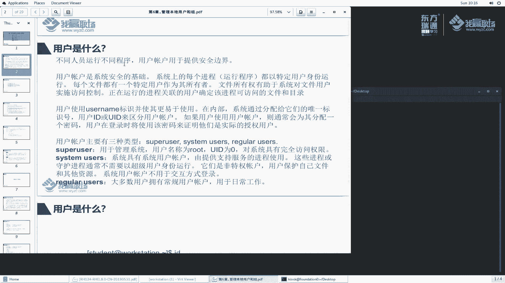

上一节我们介绍了课程的整体结构，本节中我们来看看用户和组的具体概念。

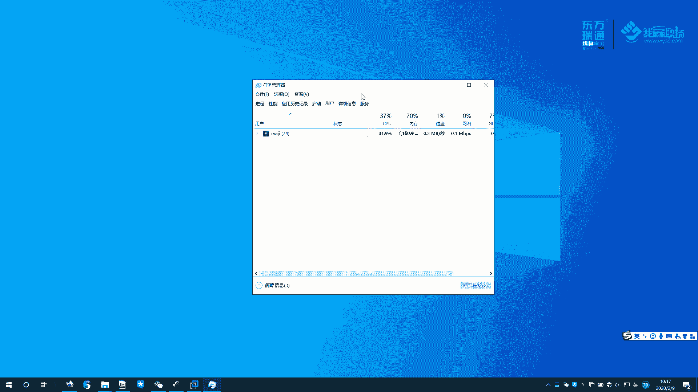

用户是操作系统安全的基础。系统上的每一个进程都以特定用户身份运行，每一个文件也由特定的用户和组拥有。文件所有权有助于系统对文件实施访问控制。用户账户为不同任务提供了安全边界。例如，使用不同的用户账户执行日常操作和系统维护任务，可以明确责任归属。

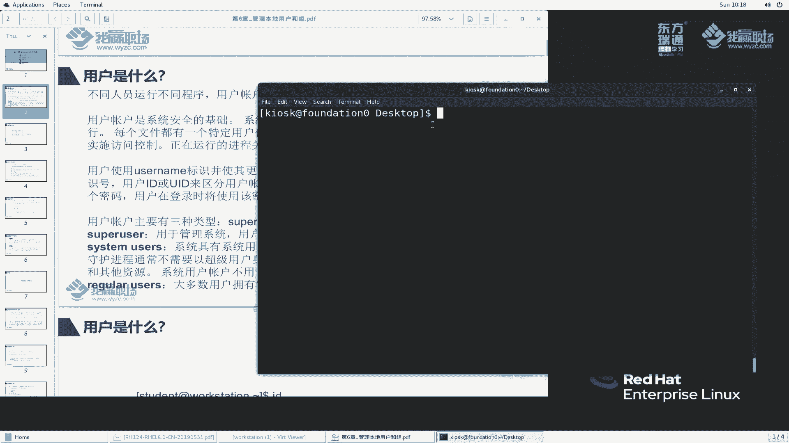

在Linux中，可以使用 `ps -ef` 命令查看运行进程及其对应的用户。用户的身份标识是UID，而用户名是方便人类记忆的别名。

## 用户的类型

Linux系统中的用户主要分为三类：

以下是用户的主要类型及其说明：

*   **超级用户 (root)**：系统管理员，用于执行所有系统管理任务。其用户名是 `root`，UID 固定为 `0`。系统中只有一个root账户。
*   **系统用户 (System User)**：用于运行系统服务或进程的账户（例如 `apache` 用户用于运行Web服务）。这类账户通常不允许以交互方式登录系统，以实现权限隔离，增强安全性。
*   **普通用户 (Regular User)**：用于日常工作的账户（例如 `student`， `kiosk`）。我们通常使用这类账户登录系统。

## 相关命令与文件示例

了解概念后，我们通过一些命令和文件来具体观察用户和组的信息。

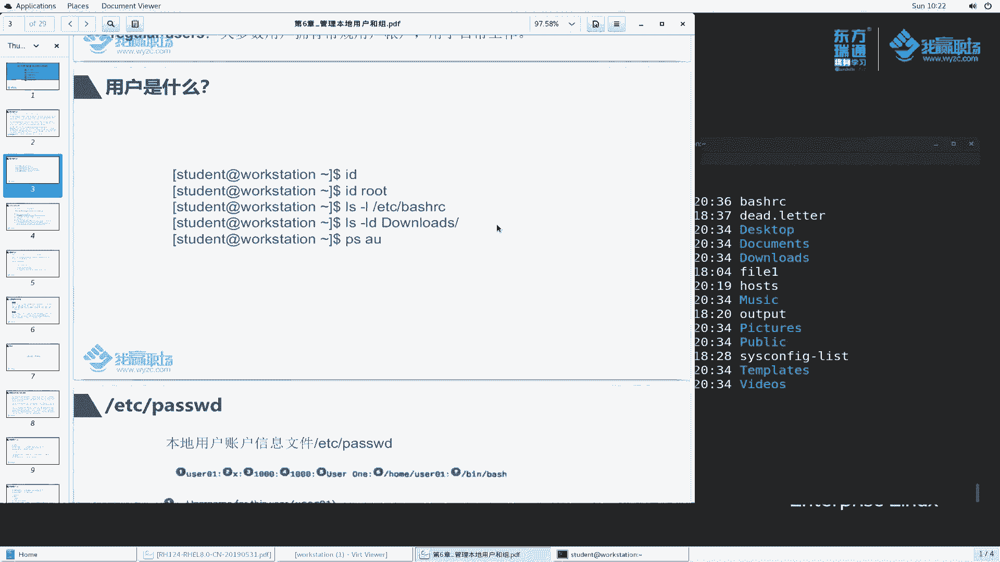

使用 `id` 命令可以查看指定用户的身份信息，包括UID、主组GID以及所属的补充组。

```bash
id student
```

使用 `ls -l` 命令可以查看文件的所属用户和组。

```bash
ls -l
```

## 用户账户配置文件 `/etc/passwd`

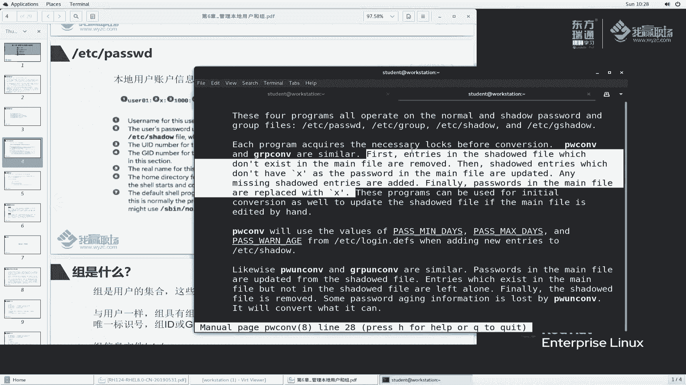

操作系统中的用户账户信息保存在 `/etc/passwd` 文件中。所有用户都可以读取此文件。

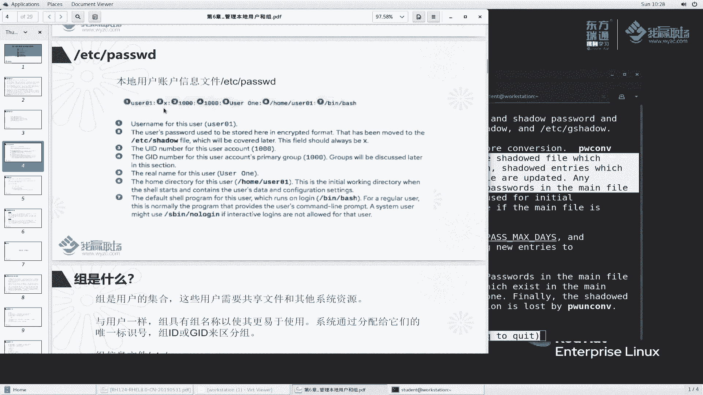

使用 `head` 命令可以查看该文件的前几行内容。

```bash
head /etc/passwd
```

该文件的每一行代表一个用户，包含7个由冒号分隔的字段。

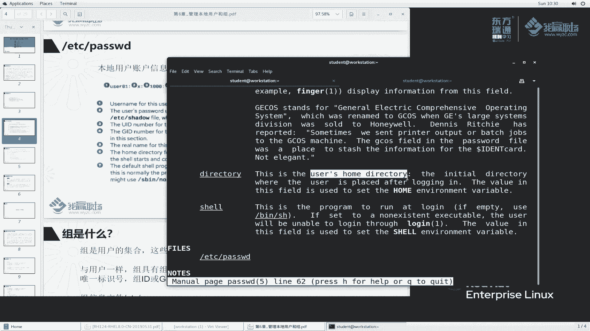


以下是每个字段的具体含义：

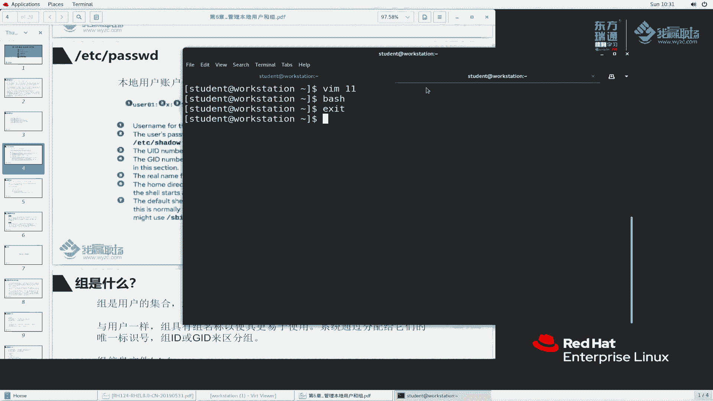

1.  **登录名**：用户的用户名。
2.  **密码占位符**：通常为 `x`，表示加密后的密码实际存储在 `/etc/shadow` 文件中。
3.  **用户ID**：用户的UID。
4.  **主组ID**：用户所属主组的GID。
5.  **描述信息**：用户的注释或全名。
6.  **家目录**：用户登录后的初始工作目录。
7.  **登录Shell**：用户登录后启动的Shell程序。普通用户通常是 `/bin/bash`，而系统用户通常是 `/sbin/nologin`，表示禁止登录。

## 组配置文件 `/etc/group`

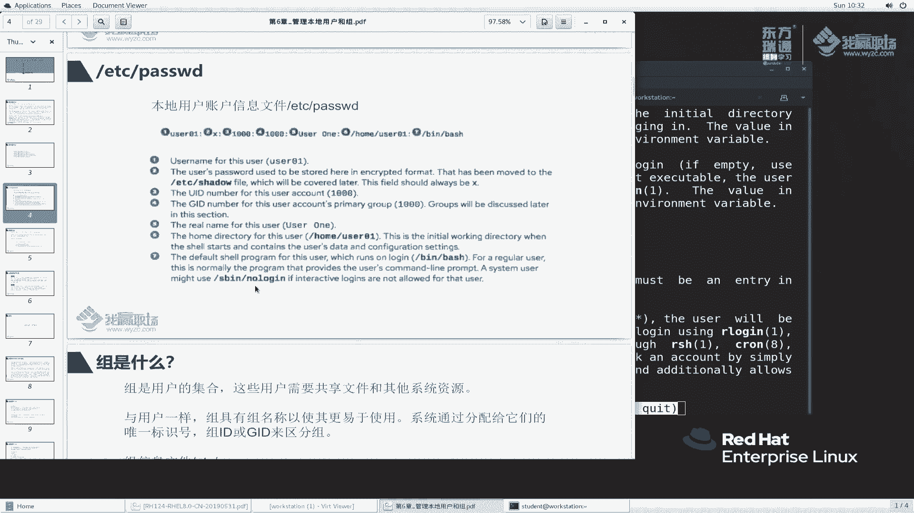

组是用户的集合，用于简化权限管理。将权限赋予一个组，该组的所有成员都会自动获得相应权限，这比单独为每个用户授权更高效。组信息保存在 `/etc/group` 文件中。

使用 `cat` 命令可以查看指定组的信息。

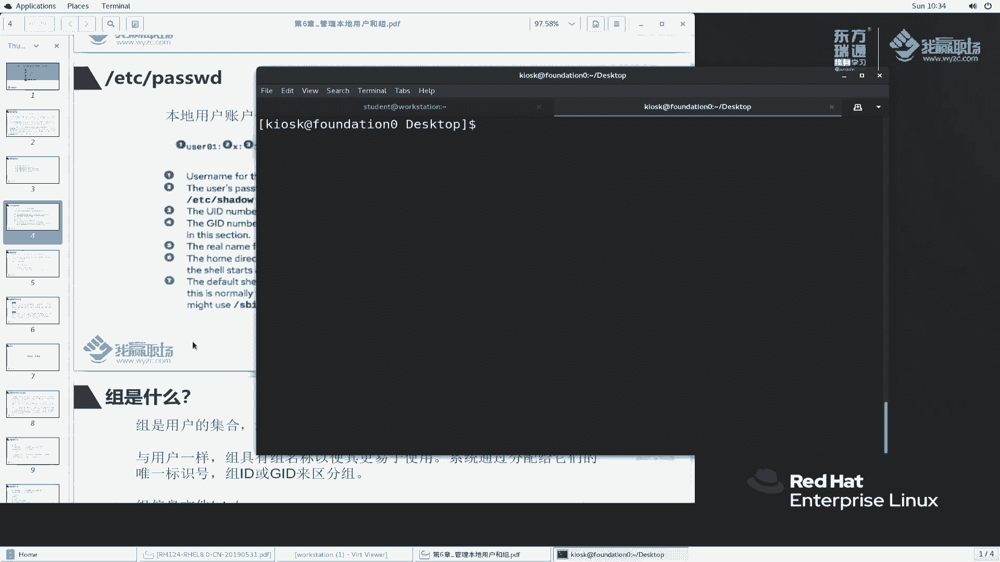

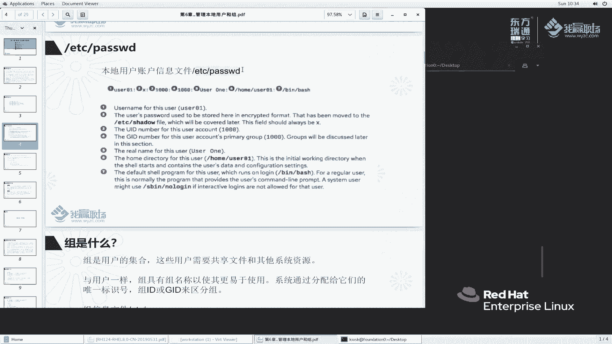

```bash
cat /etc/group | grep wheel
```

该文件的每一行代表一个组，包含4个由冒号分隔的字段。

以下是每个字段的具体含义：

1.  **组名**：组的名称。
2.  **组密码占位符**：通常为 `x`，组密码较少使用。
3.  **组ID**：组的GID。
4.  **组成员列表**：属于该**补充组**的用户名列表，以逗号分隔。需要注意的是，如果某个用户以此组作为其**主组**，则其用户名**不会**出现在此列表中。

## 主组与补充组

用户必须属于一个主组，同时可以属于零个或多个补充组。主组信息记录在 `/etc/passwd` 文件的第四个字段，而补充组成员资格由 `/etc/group` 文件的第四个字段确定。

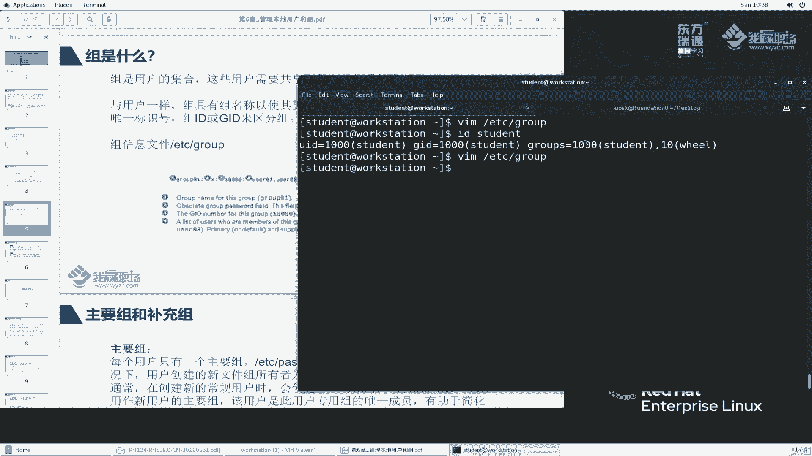

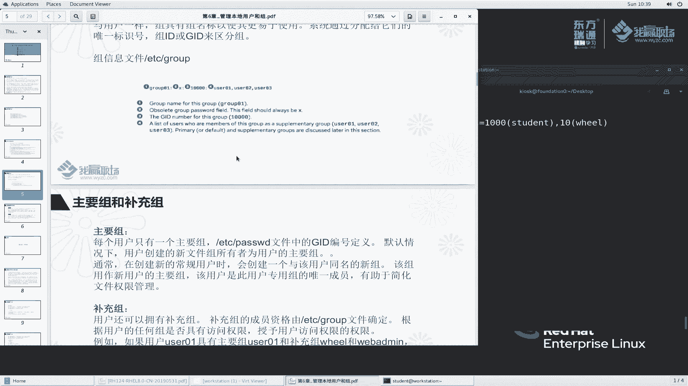

本节课中我们一起学习了Linux用户和组的核心概念、三种用户类型、以及存储账户信息的两个关键配置文件 `/etc/passwd` 和 `/etc/group`。理解主组与补充组的区别是进行有效权限管理的关键。