# 红帽RHCE8认证课程：06-3-1：管理本地用户1-添加用户 👤

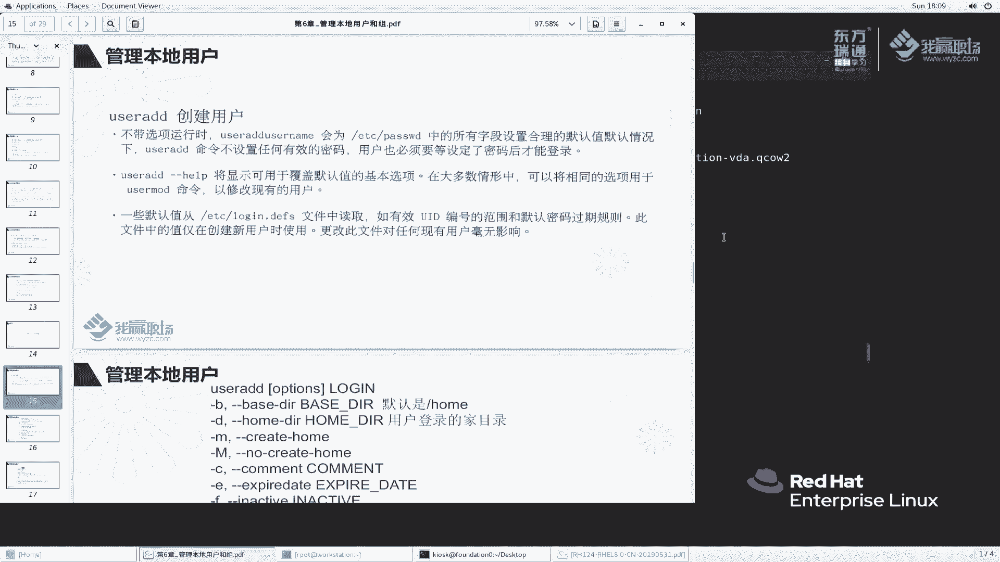

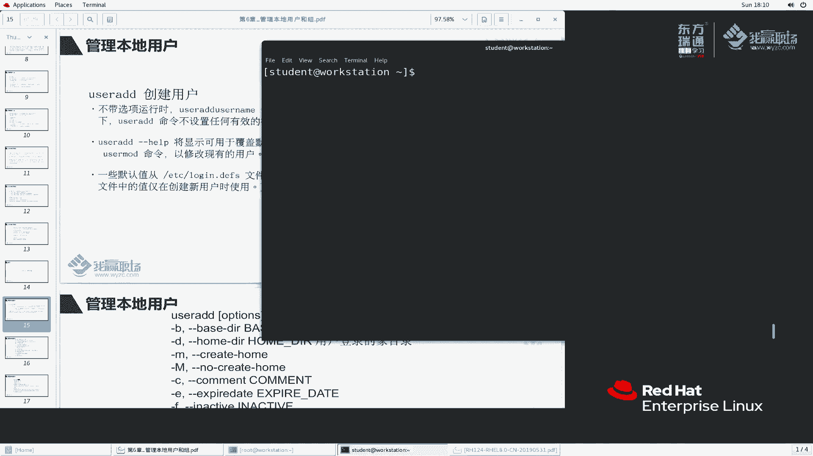

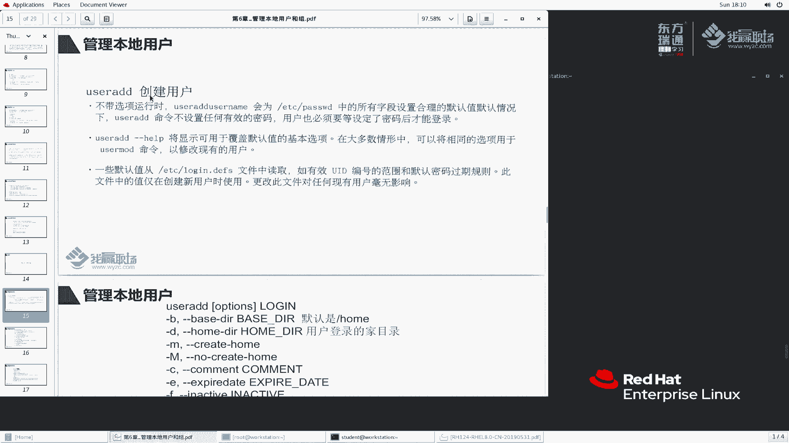

在本节课中，我们将要学习如何在Linux系统中添加本地用户。我们将了解`useradd`命令的用法，探索其各项参数的作用，并理解用户创建时系统读取的默认配置文件。

## 概述

用户信息保存在`/etc/passwd`文件中。该文件包含7个字段，例如用户ID、主目录和登录shell等。我们将学习如何使用命令行工具添加用户，并了解此过程中涉及的配置文件。

## 用户管理命令

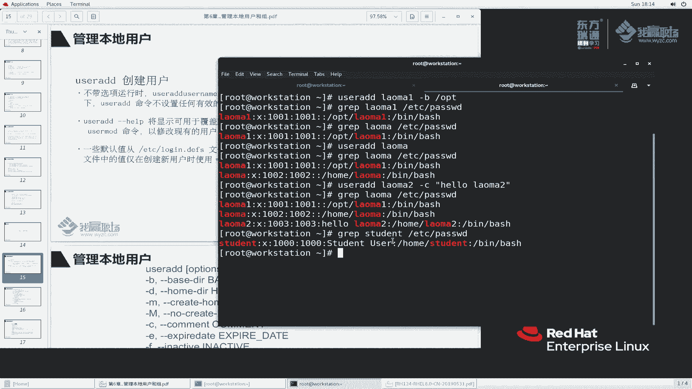

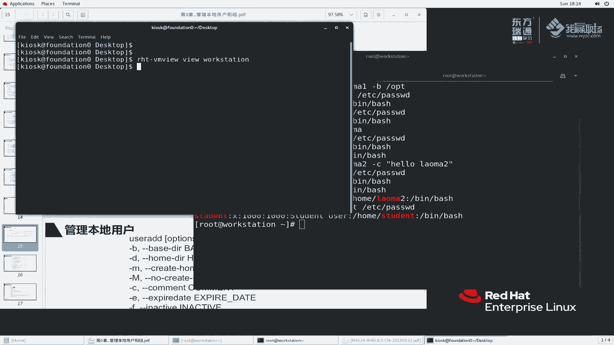

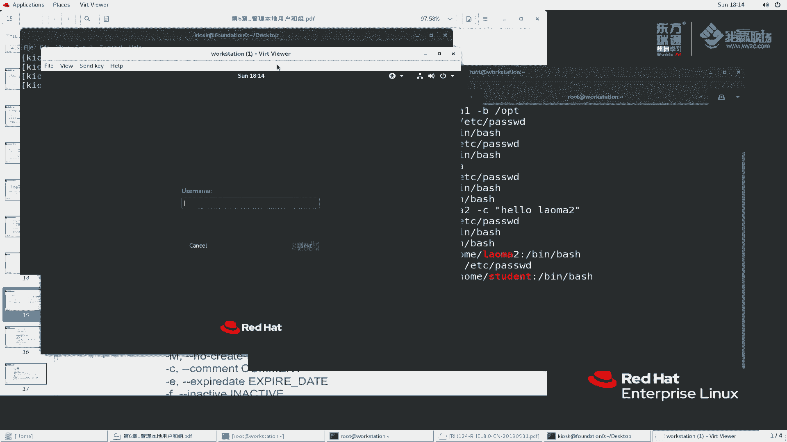

用户管理相关的命令以`user`开头，例如`useradd`、`userdel`、`usermod`。执行这些命令通常需要切换到`root`用户权限。

以下是主要的用户管理命令：
*   `useradd`：添加新用户。
*   `userdel`：删除用户。
*   `usermod`：修改用户属性。

## 使用 `useradd` 命令添加用户

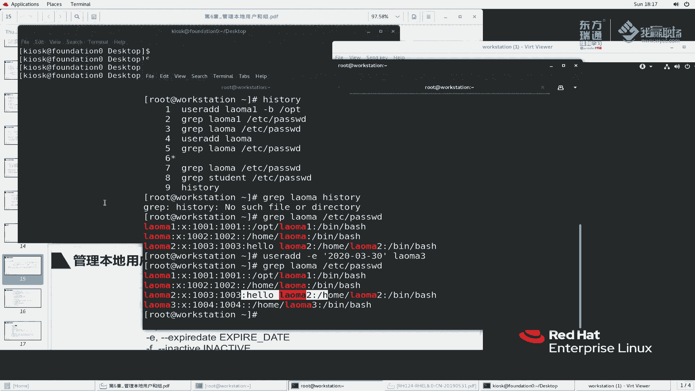

`useradd`命令用于创建新用户。其基本语法为：
```bash
useradd [选项] 登录名
```

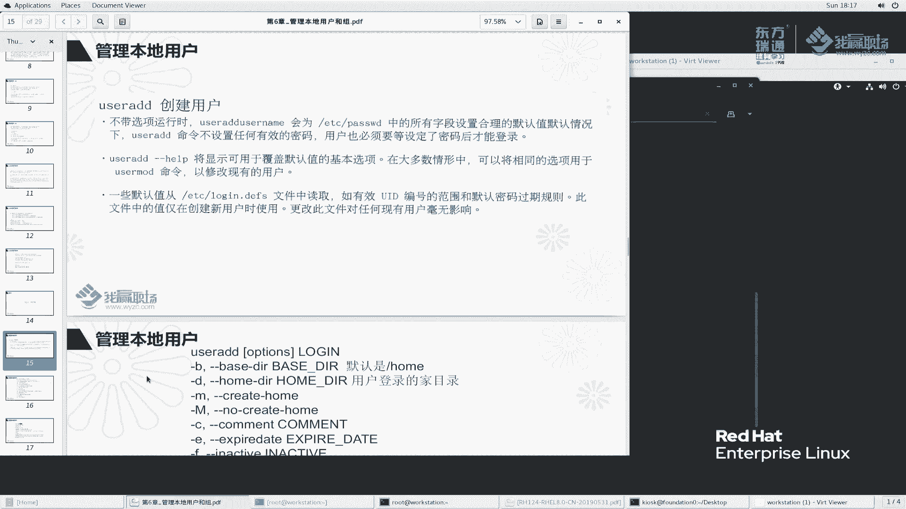

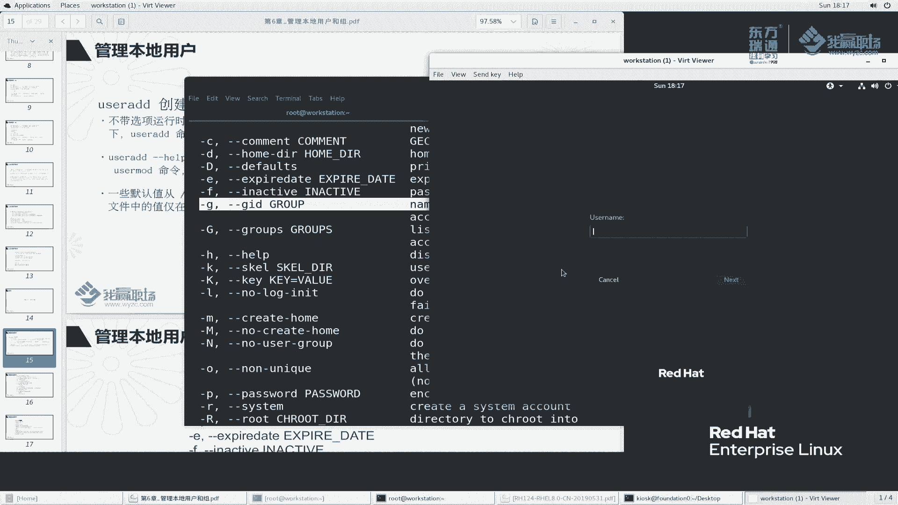

### 常用选项详解

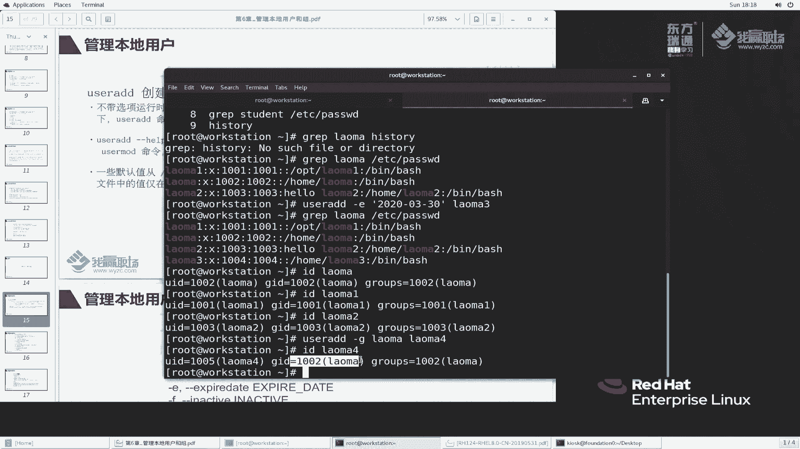

以下是`useradd`命令的一些常用选项及其作用。

*   **`-b` 指定家目录基路径**
    默认情况下，用户家目录创建在`/home`下。使用`-b`可以指定其他路径。
    ```bash
    useradd -b /opt laoma1
    ```
    此命令创建用户`laoma1`，其家目录为`/opt/laoma1`。

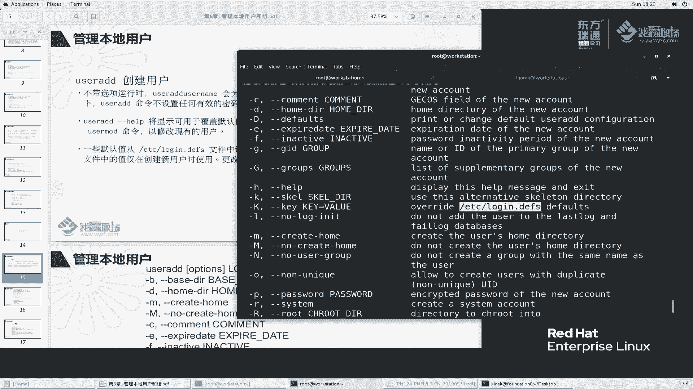

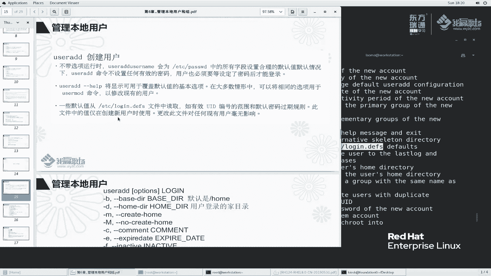

*   **`-c` 添加用户描述信息**
    描述信息会显示在`/etc/passwd`文件的第五个字段，有时也用于图形登录界面。
    ```bash
    useradd -c “Hello laoma2” laoma2
    ```

*   **`-e` 设置账户过期日期**
    可以指定账户在某个具体日期后失效。格式为`YYYY-MM-DD`。
    ```bash
    useradd -e 2020-03-30 laoma3
    ```

*   **`-g` 指定主组**
    默认会创建一个与用户名同名的组作为用户的主组。使用`-g`可以指定一个已存在的组作为其主组。
    ```bash
    useradd -g laoma2 laoma4
    ```
    用户`laoma4`的主组将被设置为`laoma2`。

*   **`-G` 指定附加组**
    用户除了主组，还可以属于多个附加组。
    ```bash
    useradd -G laoma2 laoma5
    ```
    用户`laoma5`将同时属于其默认主组和`laoma2`组。

*   **`-k` 指定骨架目录**
    创建用户时，系统会从`/etc/skel`目录复制文件到用户的家目录。`-k`可以指定其他源目录。
    ```bash
    ls -la /etc/skel/
    ```

*   **`-m` 与 `-M` 创建或不创建家目录**
    `-m`（默认行为）会创建家目录，`-M`则不创建。

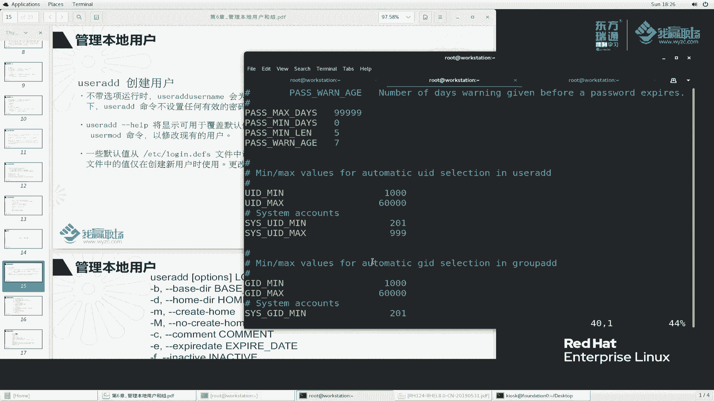

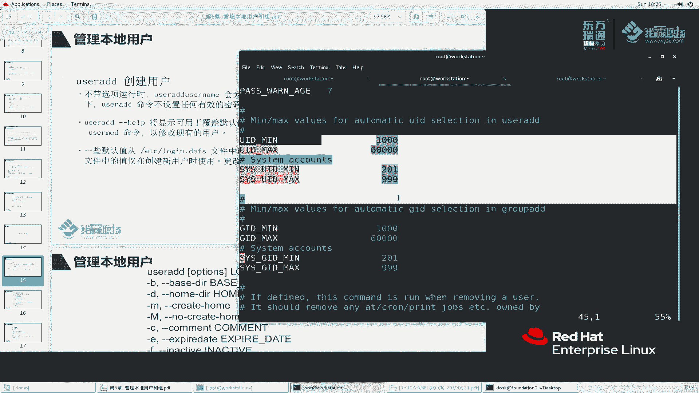

*   **`-o` 允许重复的UID**
    允许创建与现有用户UID相同的新用户。这实际上是为同一UID创建了一个别名。
    ```bash
    useradd -o -u 1002 laoma6
    ```
    用户`laoma6`将与UID为1002的用户（例如`laoma`）共享相同的权限。

*   **`-p` 设置加密后的密码**
    此选项后必须接**已加密**的密码字符串，而不是明文密码。加密密码可以从`/etc/shadow`文件中获取。
    ```bash
    useradd -p ‘$6$xxx...xxx’ laoma7
    ```

*   **`-r` 创建系统用户**
    创建UID在特定范围（如201-999）内的系统用户，通常用于运行服务。
    ```bash
    useradd -r laoma8
    ```

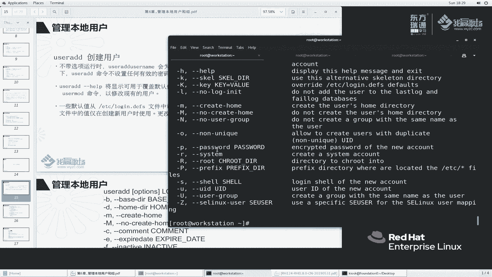

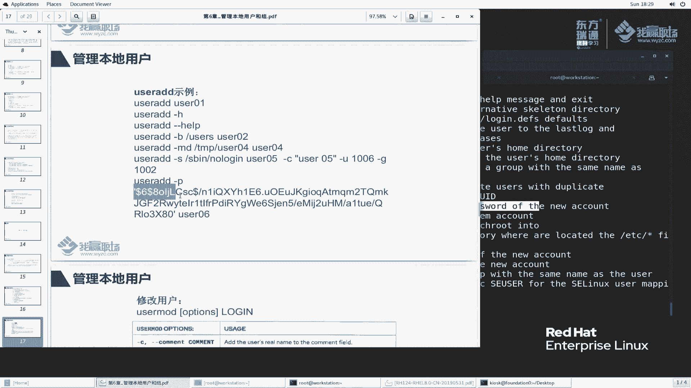

*   **`-s` 指定登录shell**
    默认为`/bin/bash`，可以指定其他shell，如`/sbin/nologin`。

*   **`-u` 指定用户UID**
    手动为用户分配一个特定的UID。这在多台服务器间需要保持用户UID一致时非常有用。
    ```bash
    useradd -u 1500 laoma9
    ```

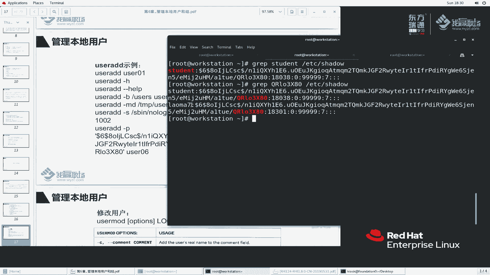

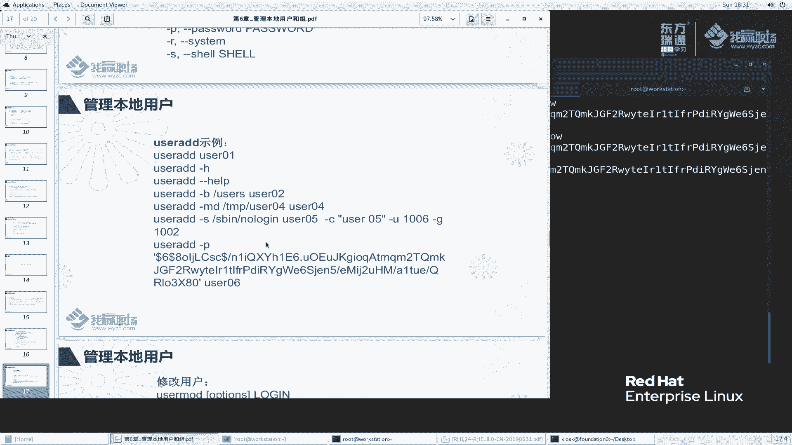

## 用户创建的默认配置

`useradd`命令在创建用户时会从`/etc/login.defs`配置文件中读取默认值。该文件定义了诸如：
*   邮件存储目录（`MAIL_DIR`）
*   密码最大/最小有效期（`PASS_MAX_DAYS`, `PASS_MIN_DAYS`）
*   密码最小长度（`PASS_MIN_LEN`）
*   密码过期前警告天数（`PASS_WARN_AGE`）
*   普通用户UID范围（`UID_MIN`, `UID_MAX`）
*   系统用户UID范围（`SYS_UID_MIN`, `SYS_UID_MAX`）
*   是否创建家目录（`CREATE_HOME`）
*   用户密码的加密算法（如`SHA512`）

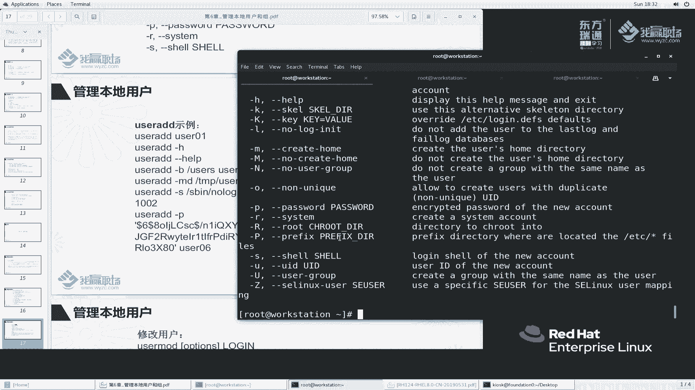

查看此文件可以了解系统的默认用户策略：
```bash
cat /etc/login.defs
```

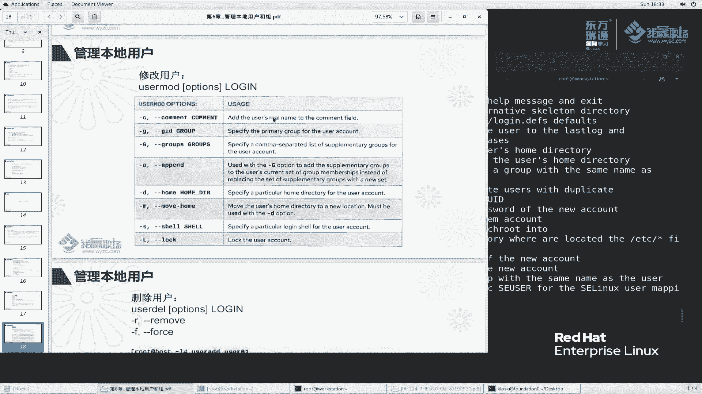

## 总结

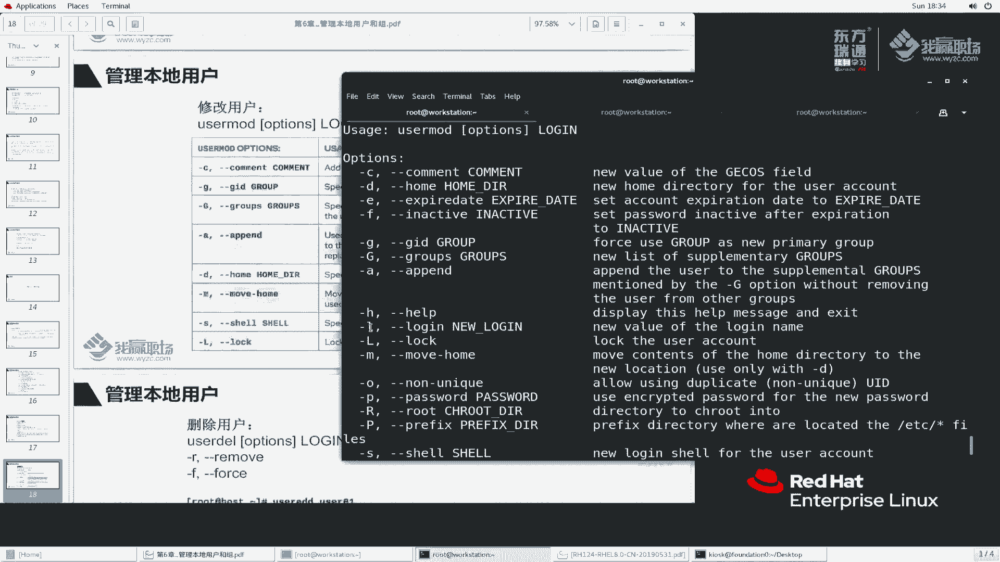

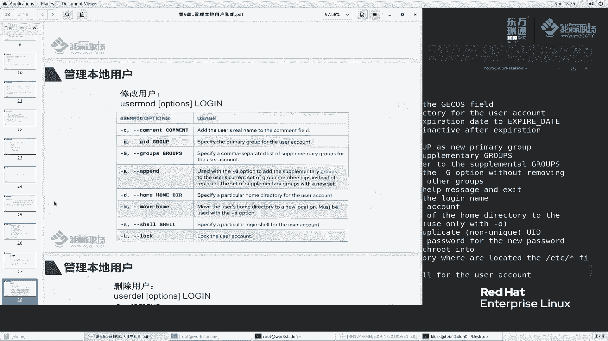

本节课我们一起学习了如何使用`useradd`命令在Linux系统中添加本地用户。我们详细探讨了命令的各个选项，包括指定家目录、描述信息、组关系、UID以及账户有效期等。同时，我们也了解到用户创建的默认行为由`/etc/login.defs`文件控制。掌握这些是进行有效用户管理的基础。在下一节中，我们将学习如何使用`usermod`命令来修改已存在用户的属性。