# 红帽RHCE8认证课程：P3：01-RHEL入门1-什么让Linux变得伟大-开源软件介绍-Linux发行版本

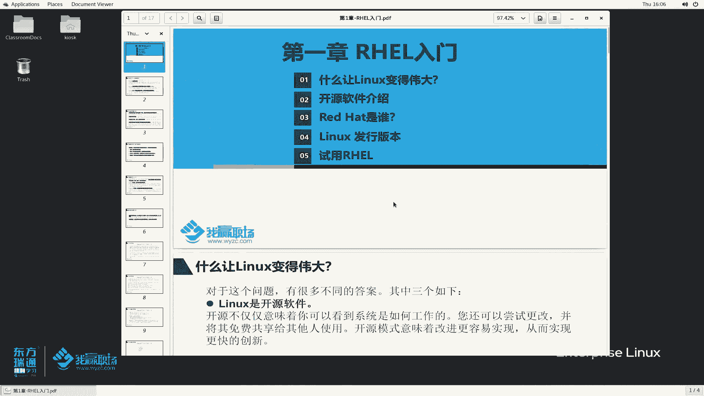

在本节课中，我们将要学习Linux操作系统的基础知识，包括其核心优势、开源软件的概念以及不同的Linux发行版本。我们将从三个主要角度探讨Linux为何如此成功，并理解开源生态系统的运作方式。

## 是什么让Linux变得伟大？ 🚀

Linux之所以能发展到今天如此重要的地位，主要归功于以下三个核心特性。

### 1. 开源软件
Linux自诞生之初就是一个开源软件。开源不仅仅意味着我们可以看到系统是如何工作的，更重要的是，我们可以获取、研究、修改其源代码，并将修改后的版本免费分享给他人。这种多人协作的模式极大地促进了软件的快速创新和进步。

### 2. 服务器优先的设计
Linux系统从创建之初就围绕着命令行界面（CLI）来构建和设计。只要获得一个终端或命令行接口，管理员就能实现服务器的全部管理功能。例如，我们可以使用Shell脚本执行自动化任务，简化本地和远程系统的部署与资源调配。通过SSH等工具，我们可以远程获取命令行对机器进行配置。命令行界面功能非常齐全，图形界面能完成的操作，命令行几乎都能完成，反之则不一定。

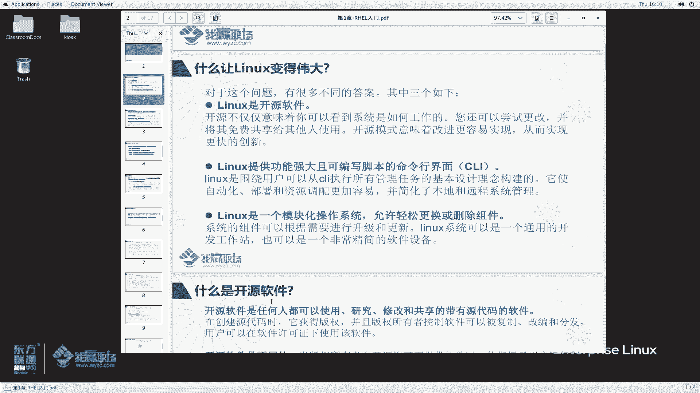

### 3. 模块化操作系统
Linux本质上是一个内核（Kernel）。用户可以根据自己的需求，在内核之外添加或移除各种功能模块，例如图形化界面或第三方工具软件。这种模块化的设计允许用户对系统进行高度个性化的定制和组装。

## 什么是开源软件？ 🔓

开源软件是指任何人都可以**使用、研究、修改和共享**的软件，其最重要的特征是附带**源代码**。

以下是开源软件的核心要点：
*   **版权与分发**：软件作者拥有版权，但可以在开源许可证的条款下，允许软件被复制、修改和分发。
*   **遵循许可证**：软件必须遵循特定的开源许可证，才能被称为开源软件。许可证授予用户查看、修改、编译源代码的权利，并允许用户将自己修改后的版本重新分发给他人。
*   **促进创新**：开源促进了协作、共享、透明和快速的创新。它鼓励开发者和社区成员共同改进软件。
*   **商业化可能**：开源并不意味着不能商业化。许多组织将开源代码用于商业产品。一些开源许可证允许在闭源产品中重用代码，但通常要求遵守特定的许可条款（例如保留版权声明）。红帽公司就是成功将开源产品商业化的典范。

## 开源软件对用户的好处 💡

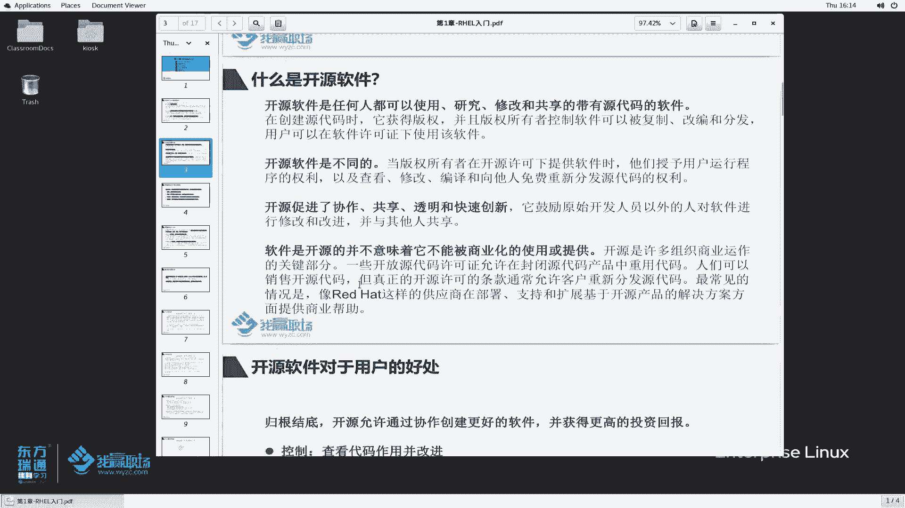

开源软件为用户带来了多方面的益处，主要体现在以下四个方面：
*   **控制**：用户可以查看代码如何运作，理解软件的内部机制。
*   **培训**：优秀的开源代码可以作为学习材料，帮助开发者提升技能，并基于此开发更好的产品。
*   **安全**：源代码公开意味着安全漏洞更容易被社区发现和修复，即使原始开发者不再维护，其他人也可以接手。
*   **可持续性**：即使原开发团队停止支持，开源软件也能在社区的维护下继续生存和发展。

## 开源软件的许可证 📜

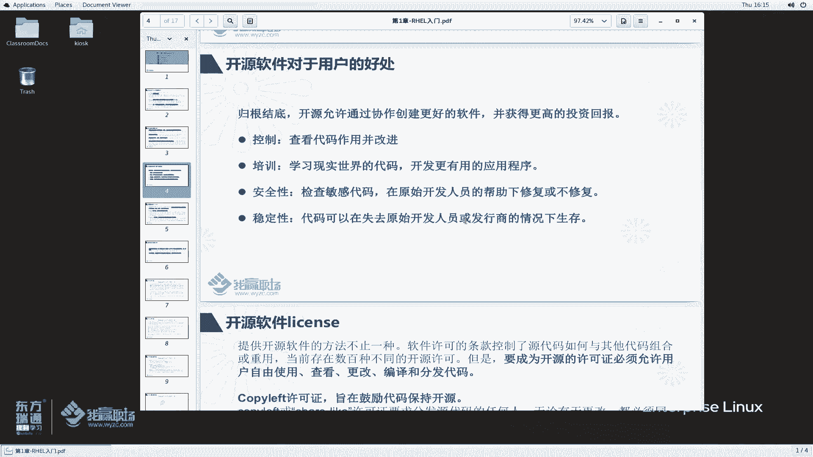

开源软件必须遵循特定的许可证（License），目前存在数百种不同的开源许可证。它们的共同点是都允许用户**自由使用、查看、更改、编译和分发代码**。

开源许可证主要分为两大类：

**1. Copyleft许可证**
这类许可证的目的是**鼓励代码保持开源**。如果你使用了基于此类许可证的代码，那么你对代码的改进也必须以开源的形式分享出去。这保证了源代码的持续开放和社区贡献的增长。
*   **典型代表**：`GPL` (GNU通用公共许可证), `LGPL`

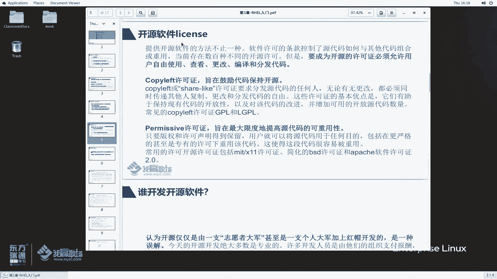

**2. 宽松许可证 (Permissive License)**
这类许可证的目的是**最大化源代码的可重用性**。只要保留原始的版权和许可声明，用户可以将源代码用于任何目的，包括在更严格甚至专有的许可证下进行重用。
*   **典型代表**：`MIT`许可证, `BSD`许可证, `Apache`许可证

## 谁在开发开源软件？ 👥

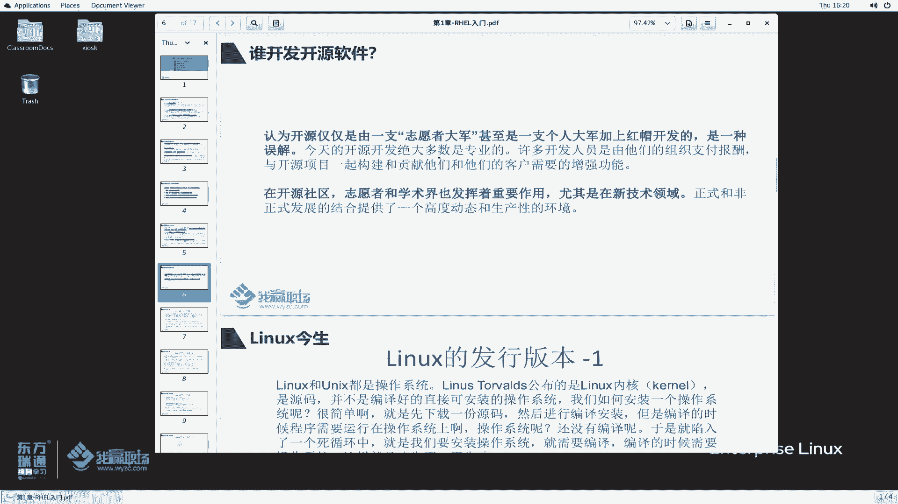

开源软件的开发并非仅靠志愿者，其主力是**由组织支付报酬的专业人士**。例如，英特尔、AMD、红帽等公司会资助开发人员为开源社区做贡献。此外，社区志愿者和学术界（尤其是在新兴技术领域）也发挥着重要作用。这种正式与非正式开发的结合，创造了一个高度动态且高效的生态环境。

## Linux的“今生”与发行版本 📦

上一节我们介绍了Linux的核心优势，本节中我们来看看Linux如何从一个内核变成我们可用的操作系统。

Linux内核和早期的Unix一样，发布的是**源代码**。要将其变成可安装的操作系统，需要将源代码编译成二进制文件。这就引出了“先有鸡还是先有蛋”的问题：在没有操作系统的情况下，如何编译第一个操作系统？早期可以通过在其他机器上交叉编译来解决，但这对于普通用户来说过于复杂。

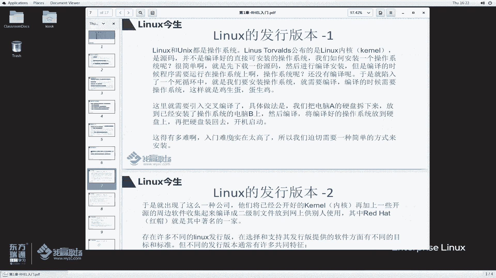

因此，出现了**Linux发行商**。这些公司或社区将Linux内核与一系列周边软件（如工具、库、桌面环境）整合起来，编译打包成一个完整的、可直接安装的**操作系统**，这就是**Linux发行版**。

### Linux发行版的共同特征
一个典型的Linux发行版通常包含以下部分：
*   **内核 + 用户空间软件**：由Linux内核和外围的应用程序、工具集合组成。
*   **灵活的规模**：发行版可以非常精简（如嵌入式系统），也可以包含数千种软件包。
*   **包管理系统**：必须提供安装和更新系统及其组件的方法（如YUM/DNF, APT）。
*   **支持渠道**：发行商需要为该软件提供支持，最好是能直接参与上游开源社区的开发。

**注意**：当人们谈论“Linux版本”时，通常指的是**发行版版本**（如Red Hat Enterprise Linux 8.5），而不是**内核版本**（如Linux Kernel 5.14）。后者更多是开发人员关注的焦点。

### 主要的Linux发行版分类
Linux发行版主要分为两大类：

**1. 商业公司维护的发行版**
以**红帽（Red Hat）**为代表。红帽提供的企业级操作系统称为 **RHEL**。这类发行版提供专业的技术支持，但通常是**有偿的**。
*   **RHEL**：Red Hat Enterprise Linux，服务器版本。
*   **Fedora**：红帽赞助的社区项目，更侧重于前沿技术，可视为RHEL的“试验场”。
*   **CentOS**：曾是RHEL的**社区克隆版**，它将RHEL的源代码重新编译成免费可用的版本。但请注意，CentOS项目战略已发生重大变化。

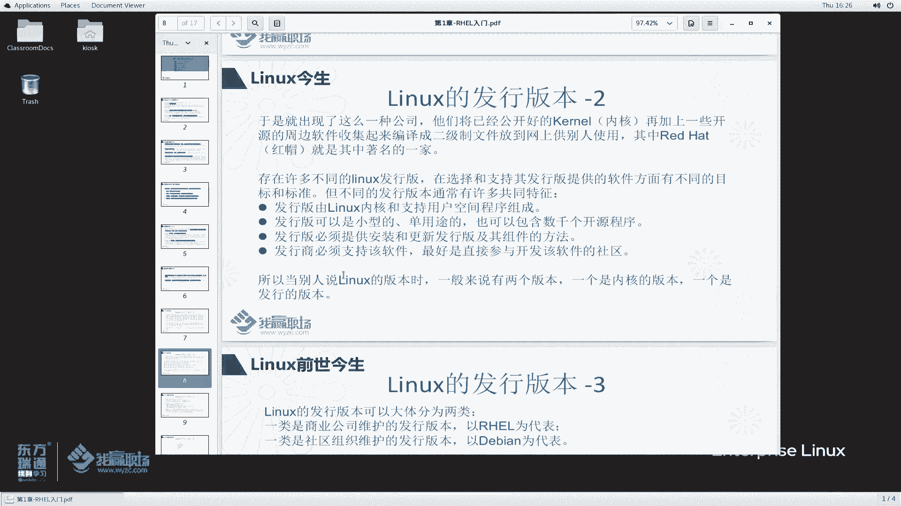

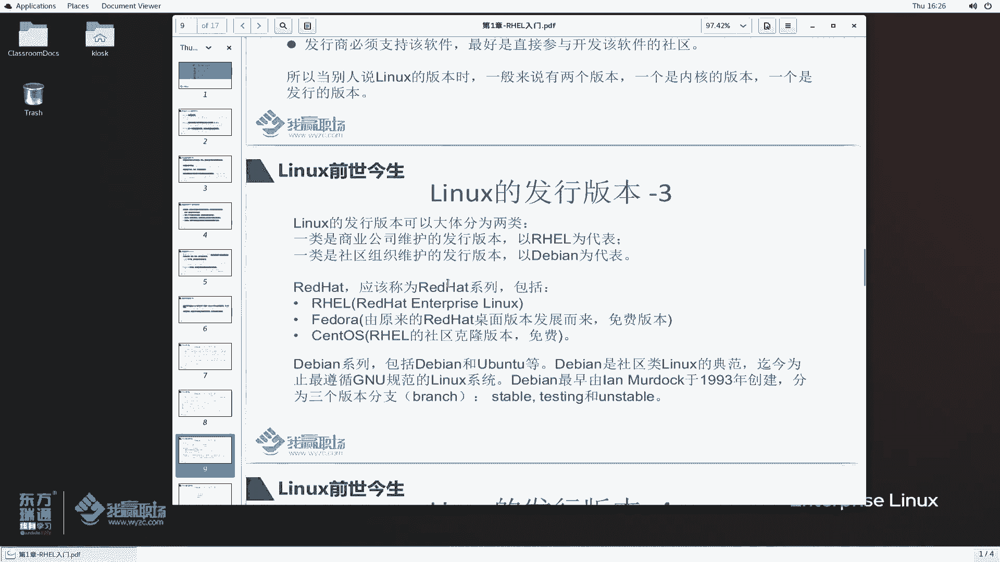

**2. 社区组织维护的发行版**
以**Debian**为代表。这类发行版由社区维护，提供免费的技术支持（主要通过社区论坛和文档）。
*   **Debian**：以其稳定性和对GNU精神的严格遵循而闻名。
*   **Ubuntu**：基于Debian，拥有庞大的用户社区和更友好的用户体验。
*   Debian系列通常有三个分支：`稳定版`、`测试版`和`不稳定版`。

市场上还存在许多其他优秀的发行版，如SUSE、Arch Linux等，它们各有其特点和目标用户。

## 总结 📝

本节课中我们一起学习了：
1.  Linux成功的三大支柱：**开源本质**、**服务器优先的命令行设计**和**模块化架构**。
2.  **开源软件**的定义、其对用户的好处（控制、学习、安全、可持续）以及主要的许可证类型（Copyleft和宽松许可证）。
3.  Linux从内核到发行版的演变过程，了解了**商业发行版**（如RHEL）和**社区发行版**（如Debian）的区别与特点。

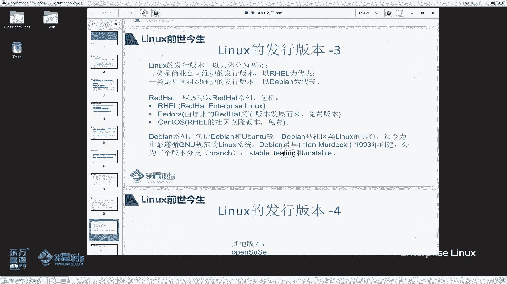

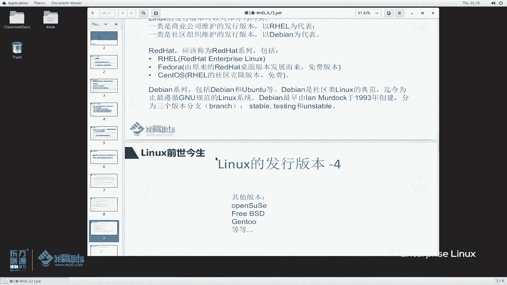

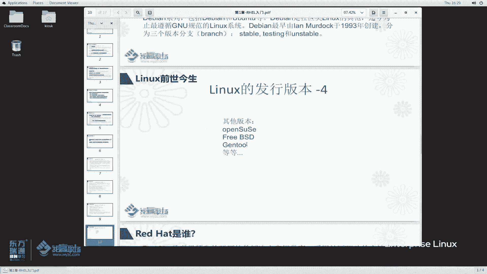

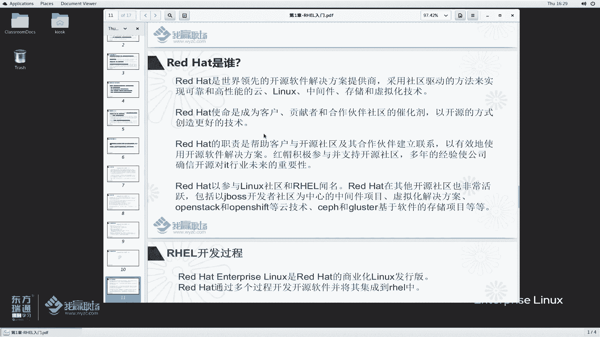

理解这些基础概念，是成为一名合格的Linux系统管理员的第一步。下节课我们将更深入地了解红帽公司及其产品体系。