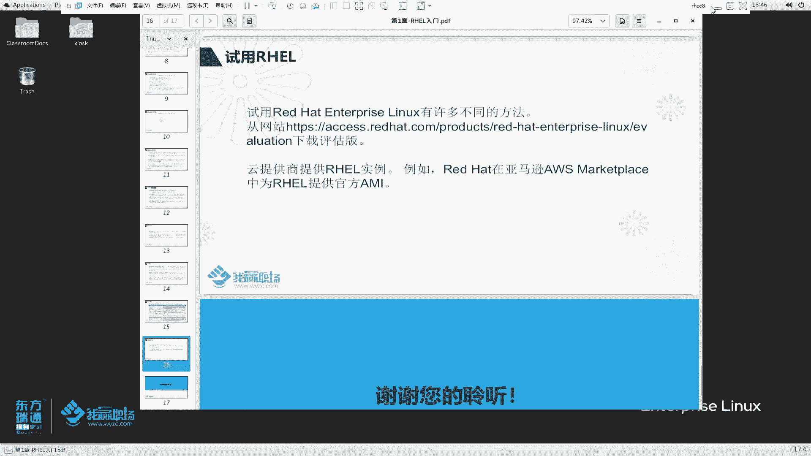
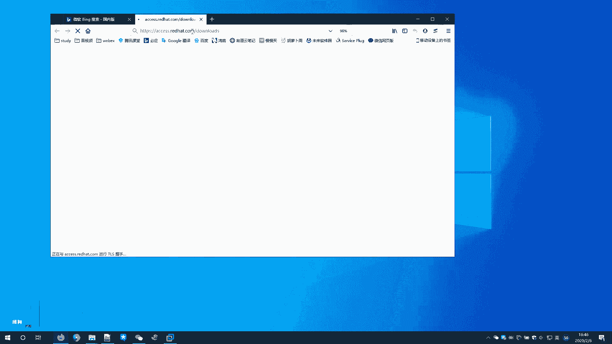
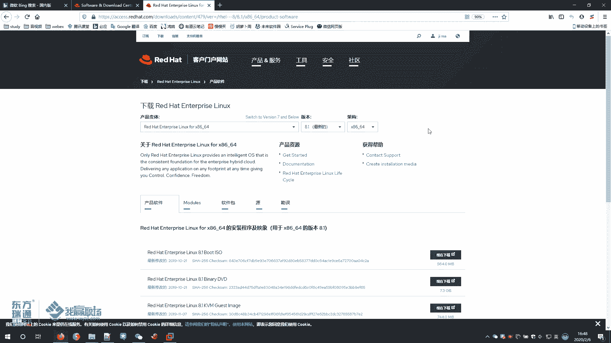
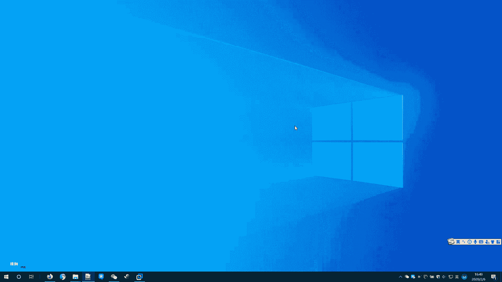
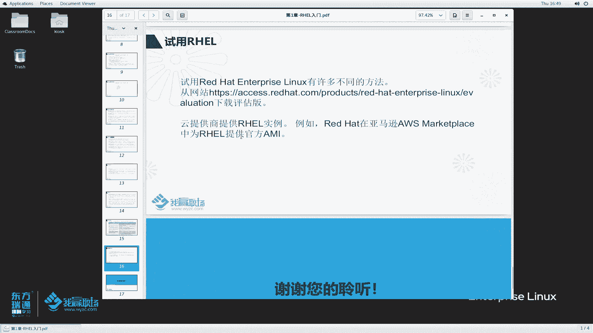
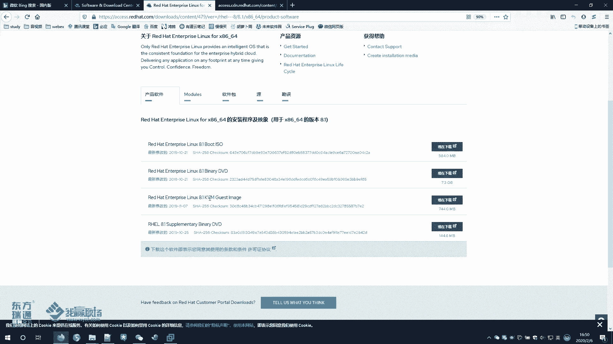
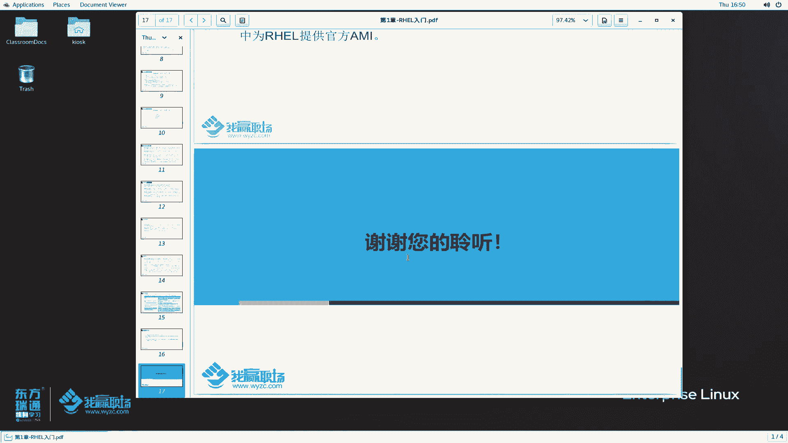

# 红帽RHCE8认证课程：P4：01-RHEL入门2-RedHat是谁与试用RHEL 🚀

在本节课中，我们将要学习红帽公司（Red Hat）的背景、其核心商业模式，以及其企业级操作系统RHEL与相关社区项目（如Fedora和CentOS）之间的关系。我们还将了解如何获取和试用RHEL系统。

---

## 概述：红帽公司是谁？🤔

红帽是世界领先的开源软件解决方案提供商。它采用**社区驱动的方法**来提供可靠、高性能的云、Linux、中间件、存储和虚拟化技术。

上一节我们介绍了开源软件的基本概念，本节中我们来看看红帽公司如何具体运作。

### 社区驱动与商业模式

“社区驱动的方法”意味着软件的开发由全球各地的组织及专业工程师共同参与。这些工程师通常由所属组织支付薪酬。红帽公司积极参与这些开源社区，投入大量资源。当社区中的某个软件项目成熟并具备商业价值时，红帽可能会将其“收编”。

红帽的核心商业模式是**销售服务和支持，而非单纯销售产品**。其许多产品本身是开源的，可以免费使用。但若用户需要官方提供的更新、补丁和技术支持，则需购买红帽的订阅服务。

红帽的使命是成为客户、贡献者、合作伙伴和社区之间的催化剂，共同以开源方式创造更好的技术。它帮助客户与开源社区及合作伙伴建立联系，从而更有效地使用开源软件解决方案。

### 红帽与开源社区

红帽的许多产品都基于社区软件进行二次开发或封装。同时，红帽也自行开发软件，并积极向开源社区贡献代码和经验。红帽坚信开源对IT行业的未来至关重要。

红帽的操作系统RHEL可以免费下载和使用。同时，红帽在其他众多社区也非常活跃，例如在**中间件**、**虚拟化解决方案**（如OpenStack, OpenShift）、存储等领域。

---

## RHEL的开发过程：Fedora的作用 🔄

要理解红帽企业Linux（RHEL）的诞生，需要了解以红帽为代表的Linux发行版的开发流程。这主要涉及三个关键部分：上游社区、Fedora和RHEL本身。

以下是RHEL的开发流程：

1.  **参与与贡献**：红帽公司积极参与上游开源社区，贡献代码、开发者时间和技术知识，并与其它Linux发行版工作者协作，共同提升软件质量。
2.  **集成与测试**：红帽将成熟的开源软件集成到**社区驱动的Linux桌面发行版——Fedora**中。Fedora相当于RHEL的“试验场”或“实验室”。
3.  **稳定与发布**：新软件在Fedora中经过约2-3年的实际使用和测试，被验证为稳定可靠后，才会被集成到**RHEL**系统中，最终提供给企业用户使用。

因此，Fedora是RHEL系统的前沿和测试平台。

---

## 详解Fedora与CentOS 📚

上一节我们介绍了RHEL的开发流程，本节中我们来看看其中的两个关键角色：Fedora和CentOS。

### Fedora项目

Fedora是一个社区项目，它发布一个完整的、免费的、基于Linux的桌面操作系统。其桌面环境美观、动感且功能丰富，适合日常办公使用。

Fedora项目完全由自由和开源软件构成，任何人都可以参与。它注重创新，但更新节奏快（每6个月有一次重大更新），每个版本的支持周期较短（约1年）。这种不追求长期稳定的特性使其**不适合企业直接部署**，但它是RHEL重要的创新来源和过渡阶段。

### CentOS项目

CentOS是一个社区驱动的Linux发行版，其绝大部分源代码来源于红帽公开的RHEL源代码。它是一个免费的操作系统，由活跃的志愿者和社区成员提供支持，并独立于红帽运营（尽管现已被红帽收购）。

简单来说，CentOS可以看作是**去除红帽商标和商业支持的RHEL复刻版**。它旨在提供一个与RHEL高度兼容的免费企业级操作系统。

---

## RHEL vs. CentOS：核心区别 ⚖️

了解RHEL和CentOS的区别对于选择企业操作系统至关重要。

以下是两者的主要区别对比：

*   **技术支持**：
    *   **RHEL**：提供多级别商业支持（如5x8小时、7x24小时、上门服务等），具体取决于购买的订阅等级。由红帽专业团队快速响应问题。
    *   **CentOS**：依赖社区支持和用户自助。没有官方的商业技术支持。
*   **更新与修复**：
    *   **RHEL**：红帽内部开发团队会快速为订阅用户提供问题修复和补丁。对旧版本提供长期更新支持（EUS）。
    *   **CentOS**：需等待红帽发布RHEL的源码后，由社区重新编译打包，发布周期存在延迟。
*   **软件认证**：
    *   **RHEL**：获得数百家软硬件厂商（如SAP、Oracle）的官方认证，确保兼容性和稳定性。
    *   **CentOS**：通常未经过大型商业软件的官方认证，兼容性保障较低。
*   **附加工具与服务**：
    *   **RHEL**：订阅用户可访问红帽客户门户，获取专属文档、知识库及性能分析工具（如Insights）。
    *   **CentOS**：依赖公开的社区文档和论坛。

对于不缺钱且追求稳定服务的企业，RHEL是首选。若考虑成本，可选择CentOS，但需具备更强的自主运维能力或寻求第三方支持。许多学习RHCE认证的工程师，在实际工作中也可能维护CentOS系统。

---

## 如何获取与试用RHEL 💻

红帽为其产品提供了试用途径。我们可以访问红帽官方网站下载评估版。

以下是访问和下载RHEL的步骤：

1.  访问红帽下载中心（例如 `access.redhat.com/downloads`）。部分页面无需登录即可浏览。
2.  在产品列表中找到“Red Hat Enterprise Linux”。
3.  点击进入后，网站通常会提示登录。你需要注册一个红帽开发者账户（免费）才能下载。
4.  登录后，选择你需要的RHEL版本（建议选择稳定的偶数版本，如8.0）。
5.  页面会提供多个镜像文件供下载：
    *   `Boot ISO`：用于系统修复的启动镜像。
    *   `Binary DVD`：完整的操作系统安装镜像（约7.3GB）。
    *   `KVM Guest Image`：预配置好的虚拟机镜像，可直接在KVM虚拟化环境中导入使用。
    *   `Supplementary`：额外的软件包集合。
6.  此外，主流云服务商（如AWS, Azure, GCP）也提供预装RHEL的云服务器镜像，可供试用。

---

## 总结 📝

本节课中我们一起学习了：
1.  **红帽公司**是一家以**社区驱动**和**订阅服务**为核心商业模式的开源解决方案领导者。
2.  RHEL的开发遵循“上游社区 -> **Fedora**（测试平台） -> **RHEL**（企业版）”的流程。
3.  **CentOS**是RHEL的免费社区复刻版，两者在**技术支持、更新时效、软件认证和附加服务**上存在关键区别。
4.  可以通过红帽官方网站或云平台获取RHEL的评估版本进行试用。

理解红帽的生态和产品线，是深入学习其技术认证的第一步。