# Linux文件系统管理：03-1：文件系统层次结构与命名规范 📂

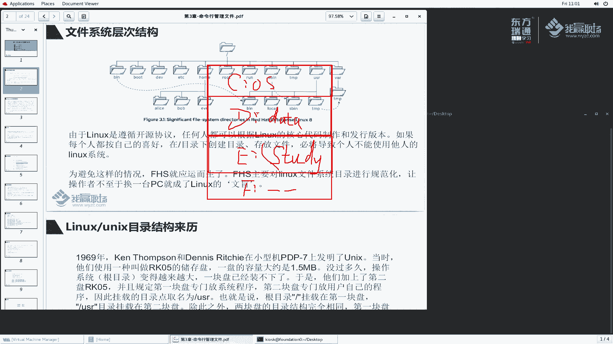

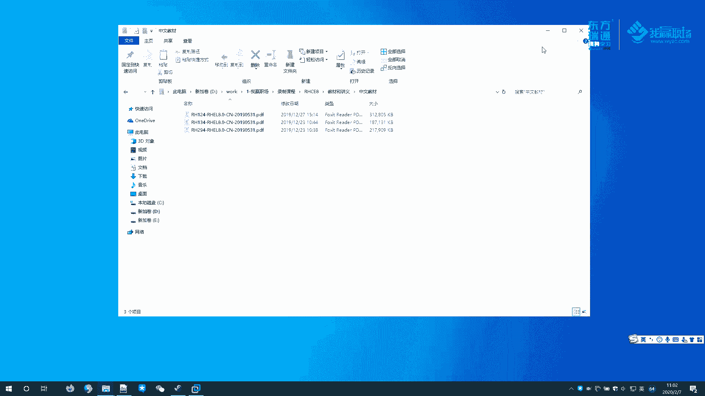

在本节课中，我们将学习Linux文件系统的基础知识，包括其独特的树形层次结构、目录规范以及文件命名的规则。理解这些内容是高效管理Linux文件的第一步。

## 文件系统的层次结构 🌳

上一节我们介绍了课程的整体框架，本节中我们来看看Linux文件系统的核心结构。Linux的文件系统结构与Windows有显著不同。Windows使用盘符（如C:、D:）来组织不同的分区。

而Linux采用一个反向的树形结构，所有一切都从根目录（`/`）开始。在根目录下，有诸如 `/bin`、`/boot`、`/dev`、`/home` 等子目录，每个目录都有其特定用途。

为了避免不同Linux发行版目录结构混乱，业界制定了 **FHS**（Filesystem Hierarchy Standard，文件系统层次结构标准）。FHS规范了根目录下各个子目录应存放的数据类型，确保了系统文件组织的一致性。

## 关键目录详解 📁

以下是FHS标准中定义的一些核心目录及其用途：

*   **`/usr`**：存放系统软件资源。其名称源于 **Unix System Resource**。
    *   `/usr/bin`：普通用户使用的程序。
    *   `/usr/sbin`：系统管理相关的程序。
    *   `/usr/local`：用户自行安装的软件。
    *   `/usr/lib` 与 `/usr/lib64`：32位和64位的系统库文件。

*   **`/etc`**：存放系统的配置文件。例如，`/etc/ssh/sshd_config` 是SSH服务的配置文件。

*   **`/var`**：存放经常变化的（Variable）数据，但会永久保存。例如日志文件（`/var/log`）、邮件、网站数据等。

*   **`/run`**：存放系统本次启动后，进程运行产生的临时数据。这些数据通常位于内存中，系统重启后会丢失。

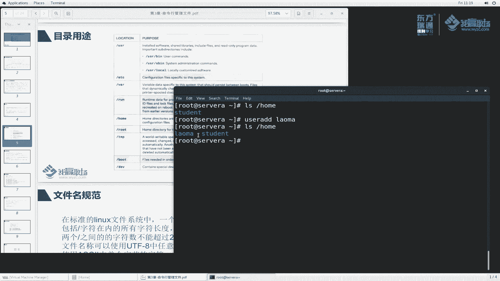

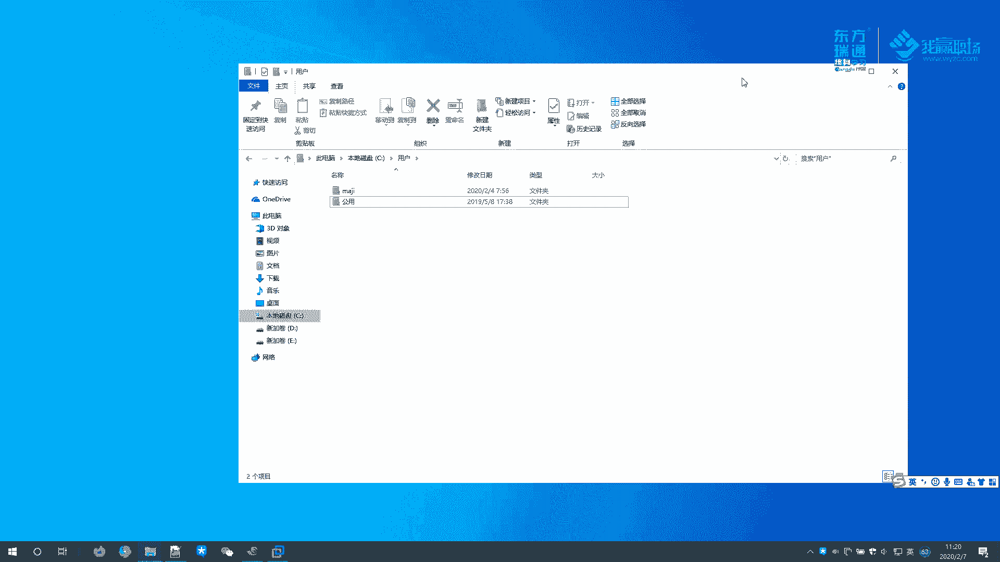

*   **`/home`**：普通用户的家目录。每个用户在此拥有一个以自己用户名命名的子目录（如 `/home/student`），用于存放个人文件。

*   **`/root`**：超级管理员（root用户）的家目录，与普通用户的家目录分离。

*   **`/tmp`** 与 **`/var/tmp`**：全局可写的临时文件目录。其中文件若长时间（如10天或30天）未被访问或修改，可能会被系统自动删除。

*   **`/boot`**：存放系统启动所需的文件，如内核（`vmlinuz`）、引导程序（GRUB）配置文件等。

*   **`/dev`**：存放设备文件。Linux将硬件设备（如硬盘、终端、光驱）抽象为文件在此管理。

## 文件命名规范 📝

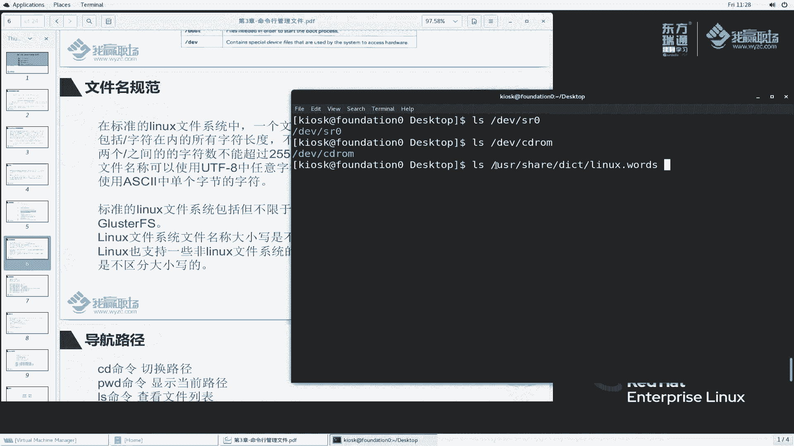

了解了目录结构后，我们来看看在Linux中为文件命名的规则。

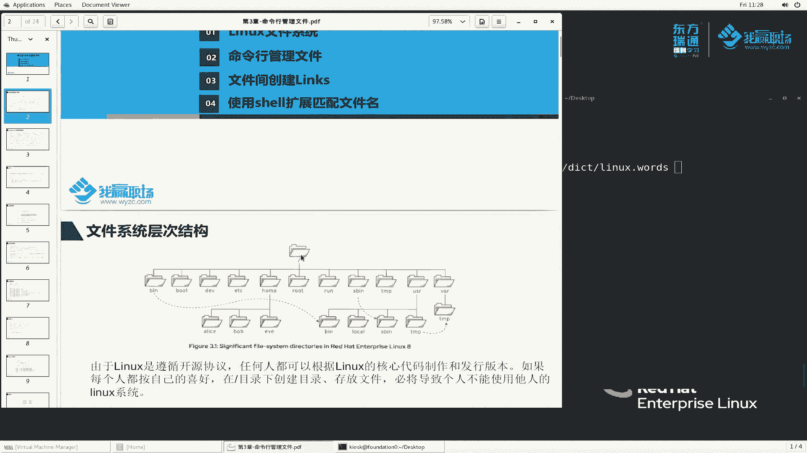

*   **路径长度**：包含斜杠在内的完整路径名，总字符数不能超过 **4095** 个字节。
*   **名称长度**：两个斜杠之间的文件名（或目录名），其字符数不能超过 **255** 个字节。
*   **可用字符**：文件名可以使用除斜杠（`/`）和空字符（`null`）以外的任意字符，包括ASCII字符和UTF-8编码的中文字符。
*   **大小写敏感**：Linux文件系统是 **大小写敏感** 的。这意味着 `File.txt`、`file.txt` 和 `FILE.TXT` 会被视为三个不同的文件。

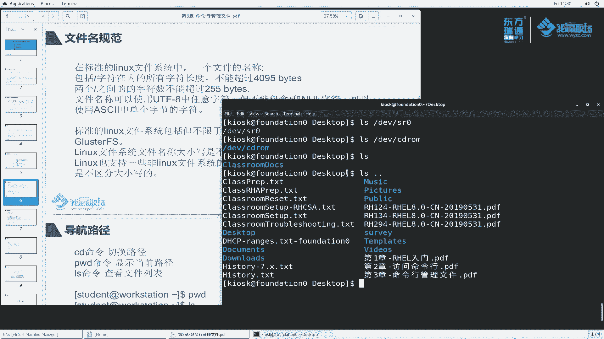

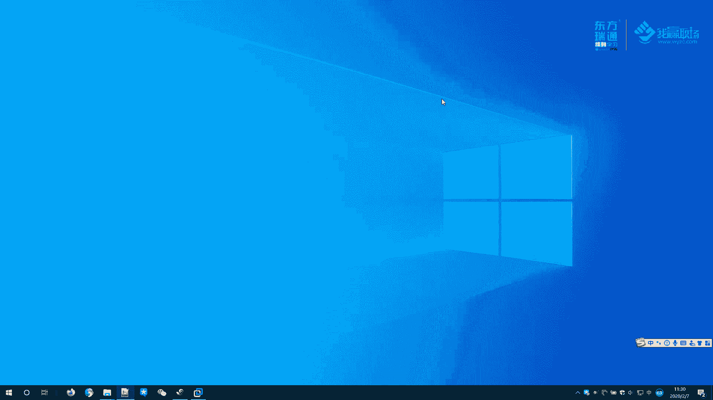

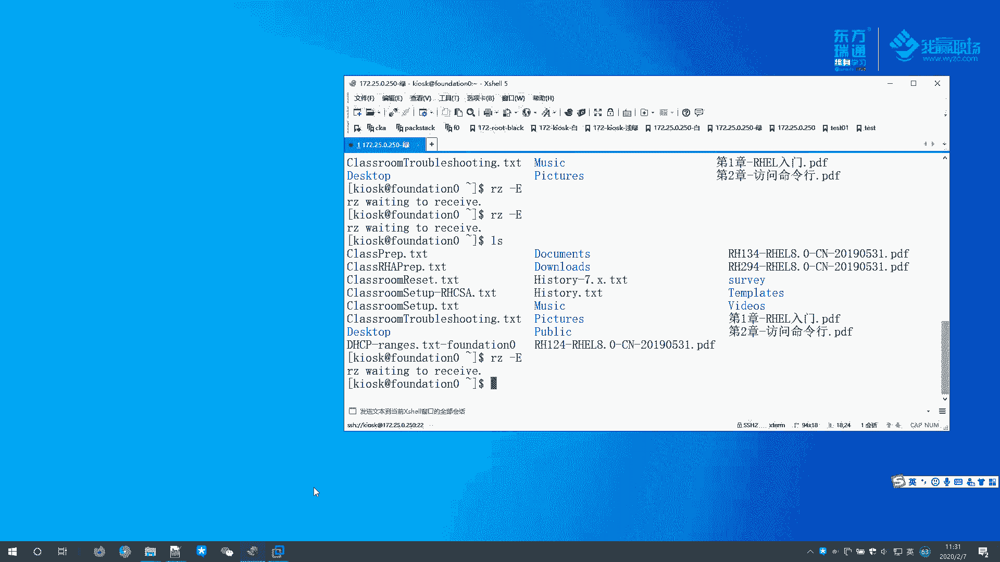

## 常见的Linux文件系统 💾

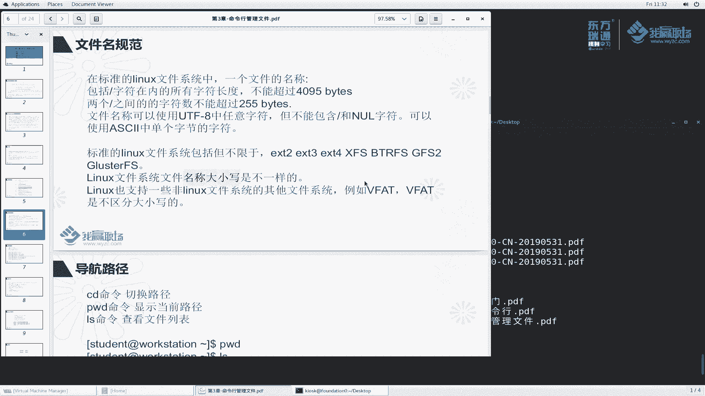

就像Windows主要使用NTFS一样，Linux也有多种文件系统。目前最常见的是 **ext4** 和 **XFS**。早期的ext2、ext3现已较少使用。此外，Linux也支持读写Windows的FAT32（在Linux中常识别为 `vfat`）和NTFS文件系统，方便数据交换。

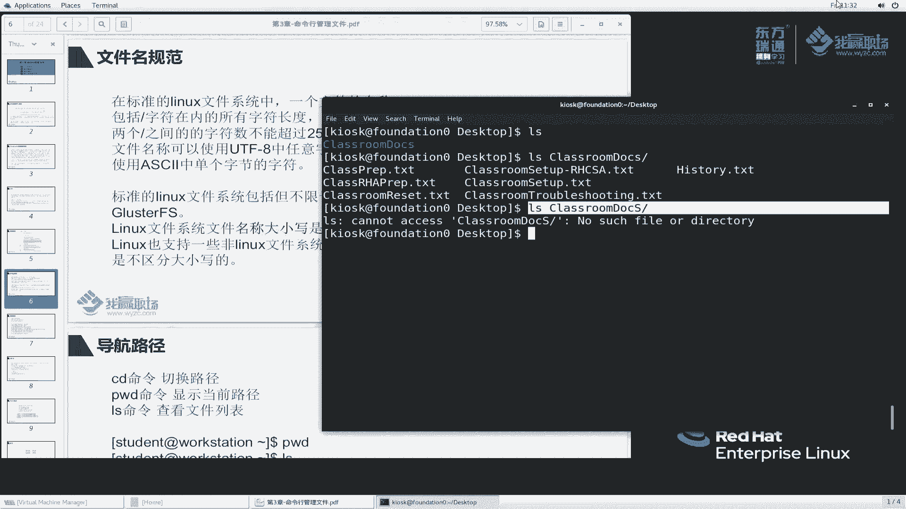

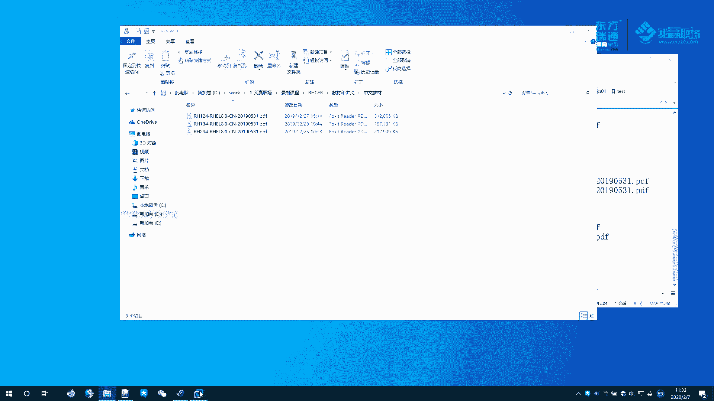

## 总结与回顾 🎯

本节课中我们一起学习了：
1.  Linux采用从根目录（`/`）开始的树形文件系统结构。
2.  **FHS标准** 规范了各目录的用途，如 `/etc` 放配置、`/home` 放用户数据等。
3.  文件命名有长度限制，且系统**大小写敏感**。
4.  认识了常见的Linux文件系统，如ext4和XFS。

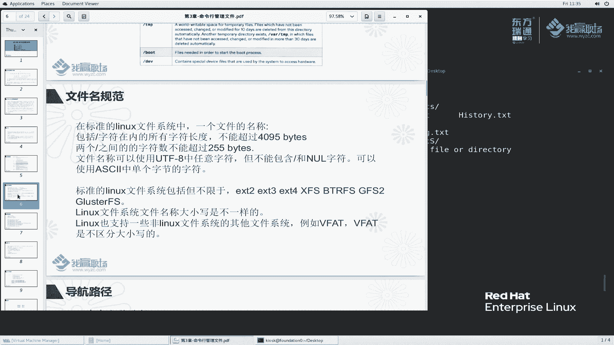

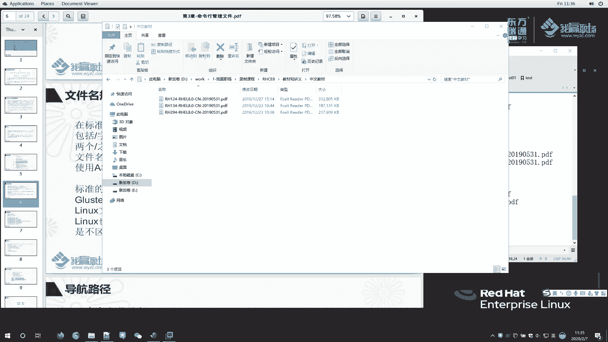

理解文件系统的层次和规范，是后续使用命令行高效管理文件的基础。下一节，我们将开始学习用于管理文件的具体命令。