# 红帽RHCE8红帽认证RH124认证课程【全】 - P10：03-2-命令行管理文件 - 北京东方瑞通 - BV1KM4y1M71q

同学们好，欢迎来到我职场HC8课堂，我是马老师。上一节课呢我们给大家介绍了一些啊导航路径。那么LSPWDCD啊3个命令。那么又给大家讲了一个touch命令。touch呢是用于更新文件的时间戳。

同时呢可以创建一个空文件。那么这节课呢，我们给大家讲一下，在命令行下面去管理文件常见的这么几个操作。例如说拷贝啊移动啊删除以及呢创建一个目录啊，那么还可以呢去拷贝我们的复制目录啊。

以及移动目录以及删除目录这么一些操作。那么简单来看一下这几个命令啊。copy copypy COPY是copy的意思。copy一个文件啊，变成另外一个文件。同样呢我们也可以把copy一个文件啊。

两个3个，我们可以copy多个文件。那么然后再加一个目录。好，来看一下这个里面的一个效果。

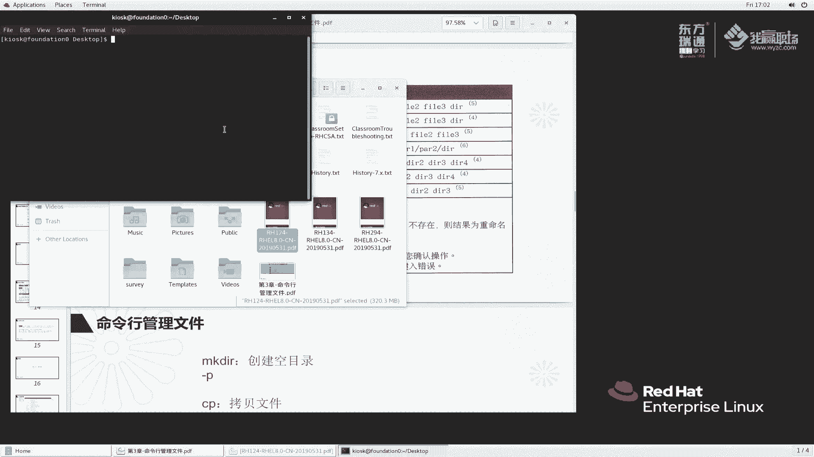

那么第一个一个那么来看一下我们当前环境里面，这样啊，我们嗯GT港BMCT啊tus2。7杠VMCTLstar2。我们先把我们的环境给它启动一下。待会儿呢我们到work station上面去操作，好吧。

等一下我们机器启动好一下。稍等一会儿啊。我们还是登录到servVA上面来处理吧。Student at so， a。好。登录上来之后呢，大家看一下这个copy文件一和文件2。

那么我们当前目录下面是有没有文件呢？发11发12好，当前目录下面这两个文件其实都不存在。那么我们怎么办呢？我们。学过一个命字叫touch，对吧？来touch，我们把这个文件创建一下。

touch file2，大家再来看一下，我目录下面就有两个文件了。那么我们做一个事情啊，他说copy file1到 file2，我们先把这样做啊，嗯，我们先把文件I给它删掉。这样吧啊。

我们就直接copy吧copy file1到co file2，看一下什么效果。诶，好像没有什么反应吧。好，这样啊。当前的时间哎，我刚刚 touch起文件的时候，大家有没有发现一个问题啊。

我 touchuch是同时 touch起的吧。但是现在我执行了copy的动作之后，导致一个问题。那么文件二的时间变成了1705。变成了170，我意味着这个文件二发生了变化。对吧。

那么我们再来换一个copy file一到fi3。那么再来看一下。此时大家发现我又产生了一个文件3。由于当前的时间是05，对吧？所以说这个文件3。是属于新生成的。那形成。

那么copy的结果就相当于我创建一个副板。哎，那问题来了。我copy file一的时候生成方2，那么方2已经存在了，它为什么不提示我们说提示去覆盖有这么一个动作呢？我们都知道在windows里面啊。

例如说我们干一个事情啊，例如说我们去我们找一个目录啊。

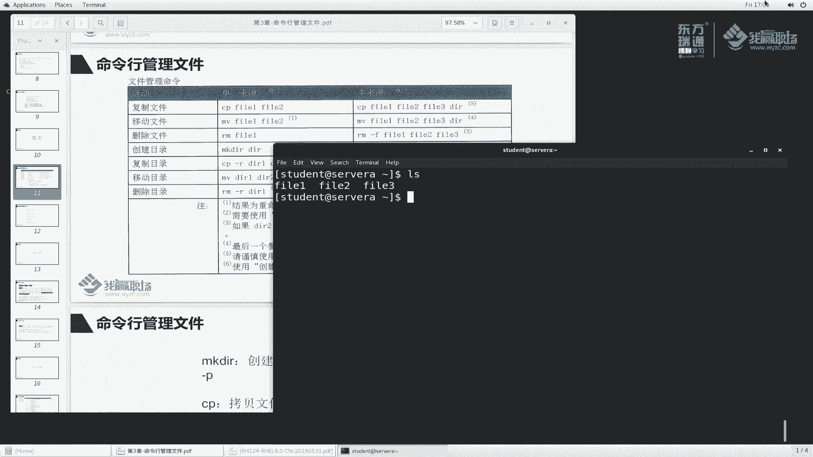

打个比方啊，我们在这个位置。在这个位置里面呢，我们有一个文件啊，那么就说我们这样copy次。copy过来了，我再copy一次啊，conttrol C到这个地方再ctrol位。

它就会提示我们是否要替换目标中的文件，对吧？那么我们linkux里面为什么不给我们提示呢？那么要回到这边来。

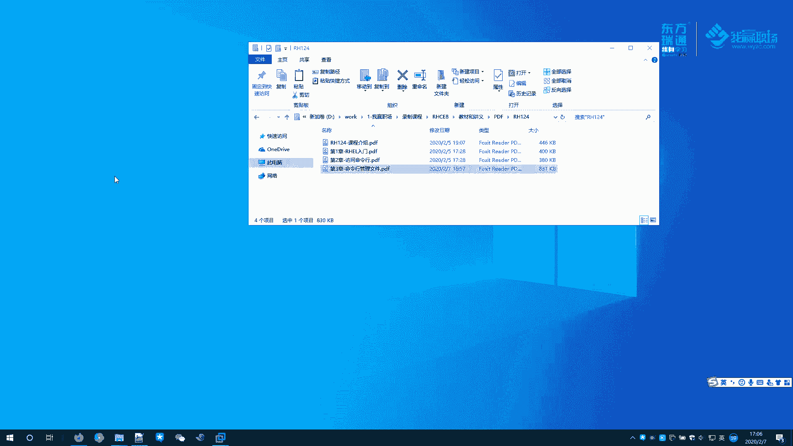

copy这个命令刚刚help默认情况下它是不会提示的啊。来找一下，这里面有一个参数啊。说如果说有一个文件，目标的文件杠F这个选项啊，说如果存在一个现有的目标文件不能够打开，那么它会强制给它删除。

并且呢努力的去啊try，并且再次尝试呢然后忽略啊忽略。也就是什么意思呢？也就是说我们强制的去给你创建给覆盖掉啊，覆盖掉啊。哎，这里面应该还有一个参数叫no啊，说杠N呢是表示什么不覆盖吧。啊。

不覆盖和现有的这么一个文件，对不对啊？那么杠I是什么意思呢？说的杠I找一下interinter是吧，说提示我们啊在你这个执行这个or right之前呢，我们提示一下。好，我们来再来次试一次啊。

copy file一，那么fi2，我们杠2了一次。大家此时看到我们这里面I选项告诉我们说你呢要不要覆盖呢？啊，覆盖呢比如说我们敲个yes，那么它就执行覆盖了。来看一看它的时间。

fi2的时间是不是变成了1707了，是不是被覆盖了？好，说明我们这个地方有一个杠2选项，提示我们要不要覆盖啊，这么一个作用啊。那么copy是用于生成一个新的一个副本。那么我还可以这样啊。

我们来确保这个位置有一个time目录。t目录下面是没有文件的发U2的，没有吧，我们copy一下发一，我们给答copy到哪里面，tamp发拷到t里面去。好，回车。

此时我们来看一下time来S一下time们里边是不是有一个发一的文件。我把这个文件啊拷贝到这个位置了。那么拷贝到这个位置的时候，我没有写文件名，它只是把它放到这个目录里面。所以说文件名就是fa一。

那如果说我copy file一的时候，我这方写一个fi you3。那么看一下这里边是不是给我们多了呢？是不是给我们多了一个发13，相当于拷贝到目标位置啊，又给他加了个名字，叫发13，那这是拷贝啊。那么。

除了这个如果说我拷贝多个目标发11对吧？好，发12发2。那么大家想一想，我把这个文件发还有一个发13，对吧？啊，这样啊，我们先Lctl C一下，我copy file一发12发13，我把它拷贝成发14。

很多同学是不是会产生这种想法，说把发一发22发13这三个文件当中的内容啊，把它拷贝到发14里面去。你把文件的内容拷贝到方式，相当于把四个三个文件整合成一个这种方式是不行的啊，copy不支持。啊。

copy它支持的动作是将三个文件。如果说有多个文件，那么它最终是支持一个叫目录。你把多个文件拷贝的，只能拷贝到一个目录里面去。好，这是它的固定的语法啊。你不要说把三个文件拷贝成一个文件，对不起。

这个命令呢，它无法实现这个需求好，L一下。那么当然发14没有对吧？好，看一下，看一下，123全部拷贝过来了，而且没有提示，他就给我们卡直接覆盖了。这是我们讲的这个copy啊copy命令啊。

那么我们再换一个用户，换一个ro用户。re太啊。我们他这个发一。touch个发药一啊，copy file一往探er里面去放。大家看到没有？哎，为什么我入住用户去copy的时候。

那么这个命令就会给我们提示呢？啊，这个地方呢我先给大家卖个关子啊，卖个关子啊。后面呢我会告诉家，告诉大家这个到底是怎么回事啊。来，这是我们讲copy文件啊。

copy单个文件和copy多个文件的这个使用方法。那么再来看一下。移动文件。啊，移动copy相当于文件windows里面contrl C是吧？那么copy那么移动文件呢相当于windows里面的个剪切。

来看一下剪切。首先呢我们还是一样的啊，我们再来L一下啊嗯。木好吧，木范一，我现在。做一个什判讲？木发一木乘发14。好华是来回车。此时大家觉得是这样实现一个什么效果，来看一下。

那么我就相当于将这个文件一呀重命成文件4了。叫重命名的操作。那么我能不能说将这个发药一。来看一下，现在当前目录只有发12发13、发144个文件了三个文件。那么我想这个将这个发14啊。移动到哪里去。

移动到t们里面去。那移动之前，我们再确认一下t里边有没有法小4123啊没有发小4。那么我们目一下发14。放到我们的t里面去。来看一下t下面有没有发14。啊，t一下啊。他给我们补全的时候是不是出来了呀。

说明有法咬4吧。那么同样的t里面有发24，那我当前目录里边有发14了吗？没有了吧，没有说明我文件被移走了，是不是啊？好，这是讲的一个移动的命令啊。那么同样呢，我再来踏起一个范药4。

那么再来木法是给我们放到什么，放到我们这个探步目录下面去。诶。他覆盖的时候他没有提示吗？是不是啊？那么我们是不是说这个地方像面copy一样，对吧？我目录的时候有一个杠I呢给我们提示一下呢。哎。

确实是这样，对吧？其实你呢是否覆盖？好，覆盖你可以说敲个y给他覆盖一下。好，此时呢我们就把它覆盖掉了。啊，这是移动单个文件。那么我想移动多个文件呢，发12发13，我把这个文件呢去移动时候。

我想移动成发14。来看一下效果。他说什么，他说这个发14不是一个目录吧啊，你不能移过去。同样呢我callpy发12发13，那么发14。他也说这个不是一个目录了。所以说对copy和目命令来说呢。

你把多个文件去copy到一个目标位置的时候，或者说目到一个位置的时候，那么这个目标位置必须是一个目录。好吧，那么目 file2 file3，那么放到我们t目录里面去。此时我们再看t目录。

大家发现这个四个文件就都有了。啊，都有了，对吧？好，那么四个文件你放在t目录里面太占用空间了，我不想要了，不想要我们就给它删掉呗啊，删掉叫RM命令。2Mt下面的fi一删掉一下，删掉了吗？

L temp下面的fi一。有没有没有了吧，这样看看们下面有没有发一。没有了。没有了啊，那么我们再来一次啊，把其他也给他删掉发12。对吧813。啊，8214都给他删掉来看一下。那么诶我们删的时候看见哎。

好像都在嘛，对吧？好像没删掉，好像没删掉啊。来，我们到CD的探腐目录下面去啊。我再来删除一下2M2M812。提示。删掉了吗？哎，刚刚为啥删没删掉呢？看一下。好，我刚刚是LS，不是RM啊，刚刚说错了啊。

表述错误，再来一次啊。M发13。2M814。看一下。好，1234这个四个文件呢就全部被我们删掉了。诶，那么嗯文件删除呢，我一次性能不能强制删除多个文件呢？可以呀。那么这样啊，我们开两个窗口。SSH。

root at还是我们的servA。大家看到啊，我们CAD到他们里面去。我踏几个翻译。我文件我RM来删发21。发一个问题，哎，我删除文件的时候，你给我提示了吧，我copy的时候目的时候。

只要涉及到这种啊覆盖的时候，它提示了。那么这种移除的时候也涉及到了这么一个提示操作。哎，我 still好像没有任何提示就覆盖了吗。啊，大家想一想为什么这么设计呢？管理员用户是超级账户，他的权限太大了。

那么你做一个操作，很可能把系统搞的一些做为了一些破坏性的操作。所以说在你执行这个操作之前呢，他会提示你啊，提示你是否要继续有一个再次确认。如果说你再次确认还是把它删除掉，那就表明啊你确实想删除的。啊。

他设计的时候就是这么一个思想啊，我们敲个yes。删掉了，看一下。没有了吧啊，没有这么一个法有义了。好了，文件的操作呢基本上就这么明些啊。当然我们之前给大家讲踏uch是创建，对吧？啊，除了这个踏创建呢。

其实还有很多种方法，后续呢会给大家展开来说。😊，那么对于文件操作是这样的那对于目录操作呢，对吧？我们说创建一个文件是touch，那我创建一个目录能不能touch呢？对吧？创建一个目录DIRE好。

那这这是文件吗？啊，LS对吧？LLLL相当于LS杠L啊。那么看一下这个DRRE，它其实是文件，并不是目录。那么给它删掉2MDIRE。好，删掉了啊。那么现在我们再回到家目录里面来。

我现在呢想创建目录MKDIR为了为了去管理方面呢，我们要去准组织一些目录啊目录啊，就像我们stud用户加目录里面，他给我们哎他这个没有是吧？呃，soA里面没有啊，那是workt上没有对吧？看一下啊。

那么我退出来。啊，大家来看一下他这个目录上面是有很多吧。啊，那么我们来创建一个目录MKDRR例如说我就创建一个老马目录。哎，提示说什么呀？不能创建，因为有这个老马文件存在，那删一下。啊，RM啊RM老吗。

看掉了吗？看一下没有了吧。老马。目录存在了吗？存在了啊，那么老马存在之后呢，这个目录呢，此时我就可以copy一些文件过来。说我copy eZFS type，把这个文件放到我们老马这个目录里面来啊。

大家看到的话，那么我们去表述文件的时候，可以使用绝对路径，也可以使用相对路径。我把这个绝对路径里面的一个文件拷贝到老马这里面来。这样啊，我要多写几个。他这一个他这个方案一。啊，我们来L下。

我copy file一copy，然后ETCFSt把这两个文件都放到老马目录里面去。看一下老马里边有吗？其实大家可以看到我这个地方操作，一个是绝对路径，那么还有两个是相对路径。那最后一个老马是目录。对吧。

是目录啊，我们看一下是不是老马这么一个目录放到这里面来了，回车啊，看一下。是不是啊1个FSt，一个FE都拷贝过来了。啊，拷贝过来了啊，这讲目录创建，然后呢把文件放到目录里面去了。

当然如果说我去拷贝目录啊，复制目录怎么能不能做呢？一样呢copy老马，那么把这个老马放到t里面去。回车。诶。他提示我们说啊你这个刚还没有被指定啊，忽略了你这个目录什么意思呢？

也就是说啊你你要拷贝目录的话，必须加这个R参数。你不加呢，我就不给你复制目录来试一试。他们里边有没有老马，没有吧。尝一下。或者说我们这样看time里边一个老马。如果说没有的话，那么说明他报错了，对吗？

那么我们再来一次上啊copy老马，我们加一个参数叫杠R参数。放在这个位置。回车。他此时没有给我们提示吧，没有报错吧。那么我们再来看一下老马这个目录有没有。有了吧，那Ltime下面有没有老马这个目录？

目录有了这个目录里面的文件也拷贝过来了。那对于文件的拷贝呢，我们使用杠R。按对于目录的拷贝呢，要杠啊去实现啊，递归的拷贝。好吧。😊，那么同样的，对于root用户来说呢，我们要注意一点啊。

这样我们还是再以ro图为例，我copy1个ETCFS tab，我copy到我们time目录下面去。我再copy一次，它就提示我们覆盖了。那么这个覆盖呢，我们可以使用杠F选项。杠F是强制的意思，强制就哎。

它还是提示，对吧？哎呀，我们还是敲给y吧。其实这个地方啊哎有有一个啊我们copy的时候头，这样我给他还是给大家说一下吧，以免大家去误会啊。als里边是用于看我这个命令别名的。当我执行copy的时候。

它其实执行的是copy杠2。对吧他其实是执行杠copy杠I。所以说我们每次执行的时候，他总是提示你。好，提示你就出现了这么一个恶心的东西啊恶心的东西啊，所以说比较麻烦。问你是否去覆盖啊覆盖啊。

那么我退出出来了啊，不覆盖了啊，这个copy呢，有时候是杠F呢是强制的事，强制的，有时候会出现这么一个错误。他问你是否做这个事情啊，你杠F呢去强制去做这个事啊，就会比较用啊。

我们呃也不太经常用啊不太经常用啊。

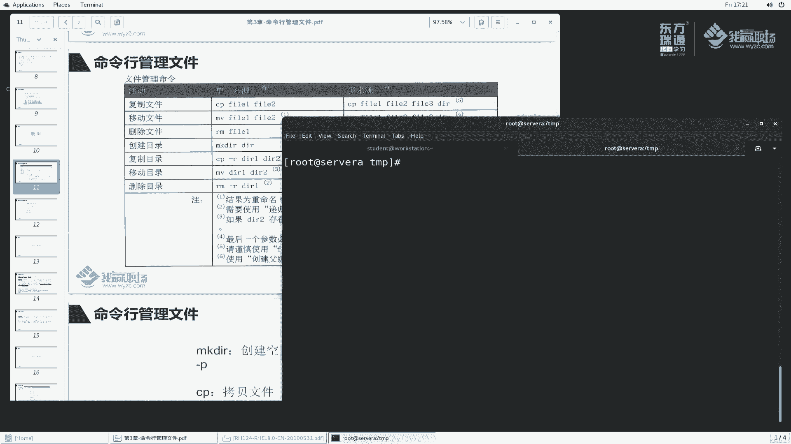

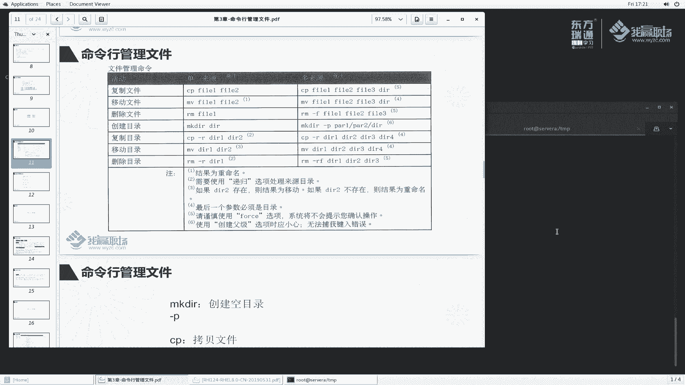

那么这个RM会用到啊RM会用到。那么刚刚我给大家讲copy的时候是copy目录，用刚啊参数，当然也可以copy多个目录放到里面去啊。那么我们再来试一下啊，还是到这个机上面来copy老马。

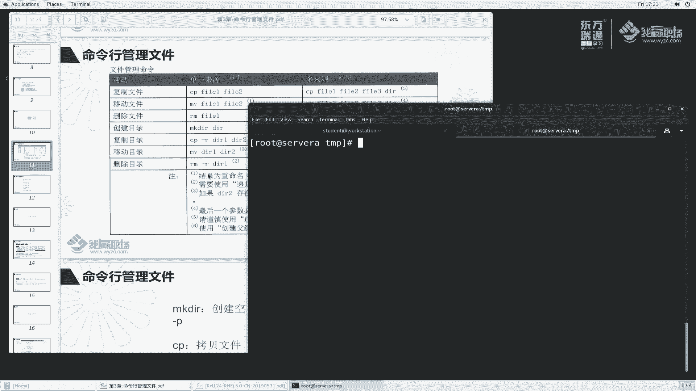

老马这个目录呢，然后copy到哪里去呢？然后再来一个music这个目录copy到我们time下面去。他说我们需要加杠啊，杠啊，放到最后行不行呢？也可以吧，看一下。

t里边的目录里面是不是有一个老马和music，两个也可以拷贝过来。好的。这个copy呢就给大家讲完了啊，我们再来讲一下这个目目是移动。刚刚说是移动文件，那我能不能把目录目录也移动呢？可以呀。穆老马。

来吧，L木老马老马到t里面去。诶，他提示说这个文件存在了吧，不能够目啊不能够目。强制。看行不行。哎，提示这个说不能够移动啊，这个文件已经存在了啊。嗯，老马这个往里边移啊来看一下LSt里边。

time里边是有一个目录呢，当前这个位置呢也是有一个老马的啊，这个F也不行，对吧？F也不行。那么我们看一下到底怎么呢？F行吗？啊哎，木里边好像没有哎啊这个吧。目移动的时，我不管你是目录还是文件的。

它都是直接去移动，是不不用存在的啊，没有没有说这这么一个呃啊的这么一个选项，只有copy啊啊，这个要注意一下啊。那么我们再来试一次啊，他说目的时候提示这个文件不存存在了是吧，不给移动。那么我们怎么办呢？

这样哈，我们可以这样做，首先把这个t目录里边的一个老马，我给你改个名字，t里边的一个老马ode。可以吧，穆老马再给你放到t里面去。那此时看一下t里面是不是有两个，一个是老马，一个是老马or的。

那么这个木移动的时候，好像是不能够覆盖吧。我们加了一个杠F，好像也不能够覆盖啊，不敢覆盖这个稍微留意一点啊，留意一点啊，我们当然也可以把多个目录移动到里面去。这个方法也是一样的，好吧，一样的啊。

那么再来看一下这个删除，删除是RM。RM我们这样啊，我们先给大家看一下，我删除文件哈这个发一，我来执行个RM发一不要了，我就给它删除掉。看一下有没有。没有了啊，节省硬盘的空间。那么我能不能删除目录呢？

CD到t里面去。2M老马这个O的这个我不要了。不给删不给删怎么办呢？2M杠R。删掉了吗？杠R参数大家以后杠啊咱就知道啊，是针对针对什么针对递归的这谁有递归呀，你文件你没有递归嘛。

那目录有子目录有子文件啊，那么针对目录你删除的时候使用杠R参数啊，杠R。OK那么这样就给它删掉了啊。同样呢我们在这个位置来试一下，我想我想做一个事情，我m DIR一个老马目录。

那么目下FS tab给放到老马里面去。然后呢，我RM。8M杠R老马试一下。他提示什么这个第三是into是否到这个子目录里面强制子目录去删除，我敲个试。啊，他是大家看到了，是不是一步一步啊。

每次就都要你敲y吧？是不是啊说把是否要把目录删掉好，目录删，把目录里面这个文件删吧，是的，都要删，一步一步太烦了。那么其实我们可以再干这么一个事情，杠F。一次性嘛强制给他删除。

就不用提示我里边东西太多了，每次都给我提示。好，杠F去删除啊，这样呢比较方便啊，强制去删除。那同样的同样的啊，在删除目录多个文件的时候，我们需要用到杠F。啊，杠F就不用每步去提示了。O啊。😊，删除啊。

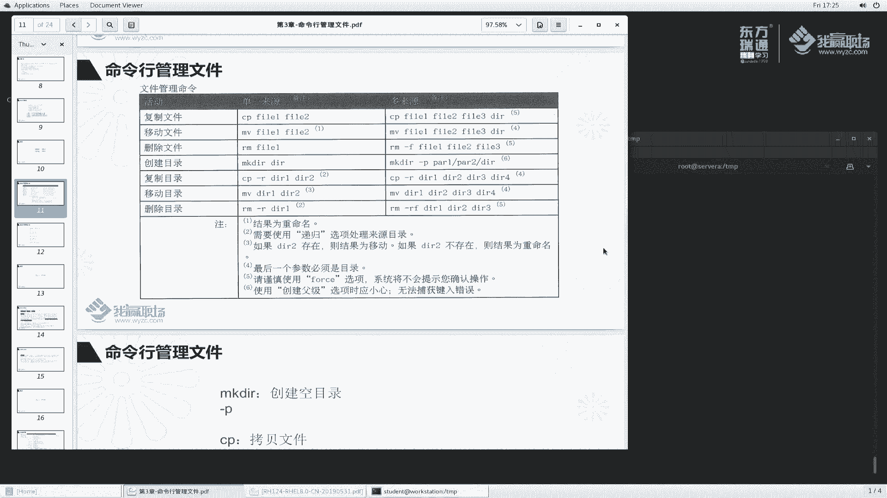

那在这里面我给大家补充一个，就是删除空目录MK啊，我先把这个删掉RM啊杠FR老马删掉music删掉。那么我们再来创建一个目录，要老马的一个目录。RMDRM好了吗？不给删啊，它是目录啊，杠啊可以删掉。

对吧？那么能不能说有一个单独用来删除空目录的呢？可以呀。老板RMDIR。大家看到了我RMD啊是专门用来删除空目录的。那么如果说目录下面有文件，他就不给你删了啊。ETC。2MDR2看一下。

他说呃现在是没没权限是吧？我们重新创建1个MKDIR老马啊，然后。MKDIR老马这边一个账户，然目录啊，然后目啊copy吧，copy Nick一copy到老马里面去。然后再按MDIR。那么。

那么老马说这个目录不是空的那对于非空的目录，我们要删除怎么办呢？2M杠什么杠R杠FRF是。如果有文件，那强制的不要不要回答了啊，全部删掉啊。那针对这个目录再来一次。啊，这个呢删除了就比较方便一点了。

所以说这个RM命令啊太暴力了。好，大家使用的时候要注意一下啊，普通用户你删删自己的文件还行。那么对于管理员呢去去删这个文件的时候，要特别注意，你可不能随便删错了，一不小心把操作系统的文件给删除了。

那问题就大了啊，恢复起来特别麻烦。啊，因为权限大，所以说呢他责任大，那么责任大，权力大，那么他也可能会造成一个很大的破坏。所以说这个作为管理员账户呢。一定要小心好一定要小心。

那么这个小节呢就给大家讲完成了，主要是给大家讲这个命令行里面的管理哈，常规的copy木RM makeDR。然后针对目录的copy杠啊目还有RM杠R啊，再补充一个啊。

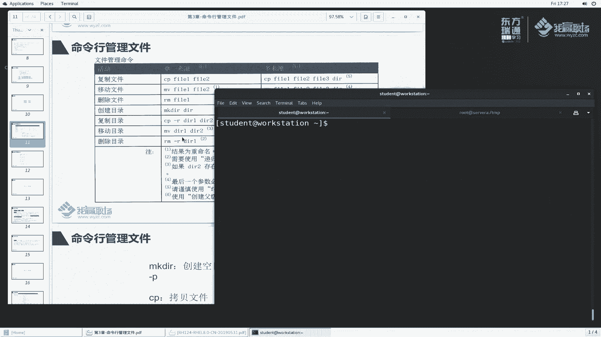

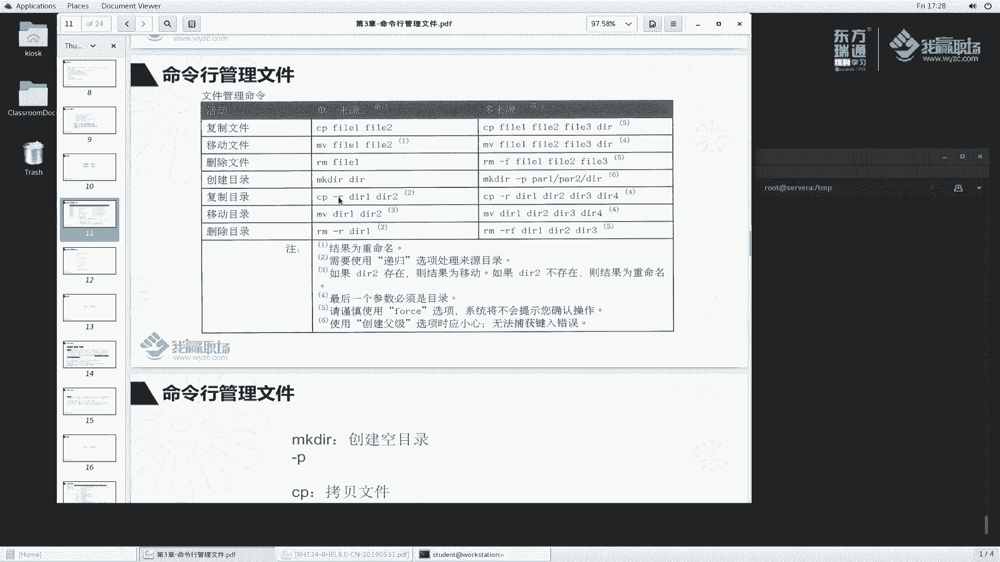

我们刚刚创建目录的时候是这样么做的啊，老马。老马这样做。然后如果说我这样创建MKDRR呃。老马这么一个目录里边我再创建一个目录叫DIRE在DE我们创建DIR2来看一下。当我们去创建这个目录的时候。

大家应该注意一个问题。就是老马目录存在，但是这个老马一这个目录它不存在。你想要想让我们在一个不存在的目录下面去创建DR2这个目录，对不起，不给你创建。那怎么办呢？哎，有一个选项杠P。

杠P杠P表示机连的情形创建啊，来看一看te。吹老马看有没有？好，老马下面有个DRDRE下面有个DR2。此时呢我们就创建成功了啊，那么对于这个不要了，我们给它清理一下M杠FI老马把它删掉。出来看一下。

此时呢说这个没有没有啊。

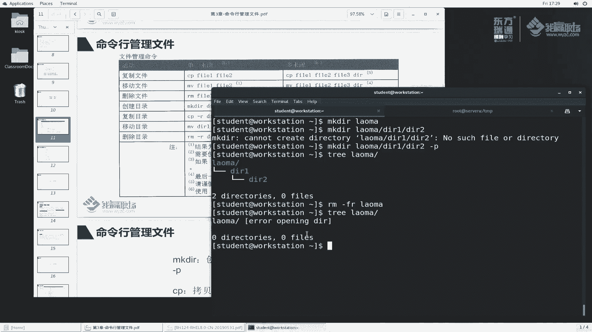

那么这节课呢，我们就给大家讲了一下啊，这个命令行这个管理文件这么常见的这么一个操作。OK啊，我们先到这里。

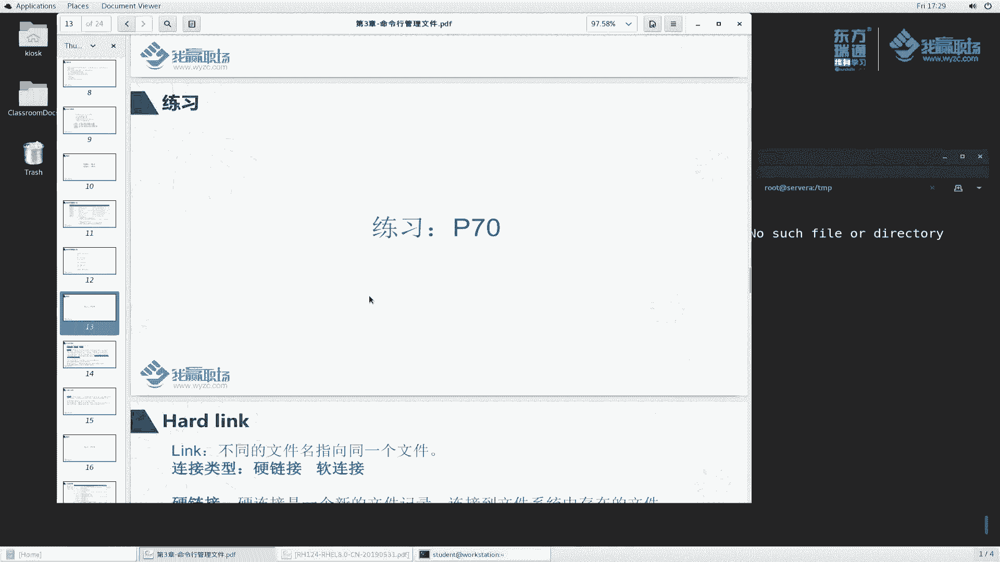