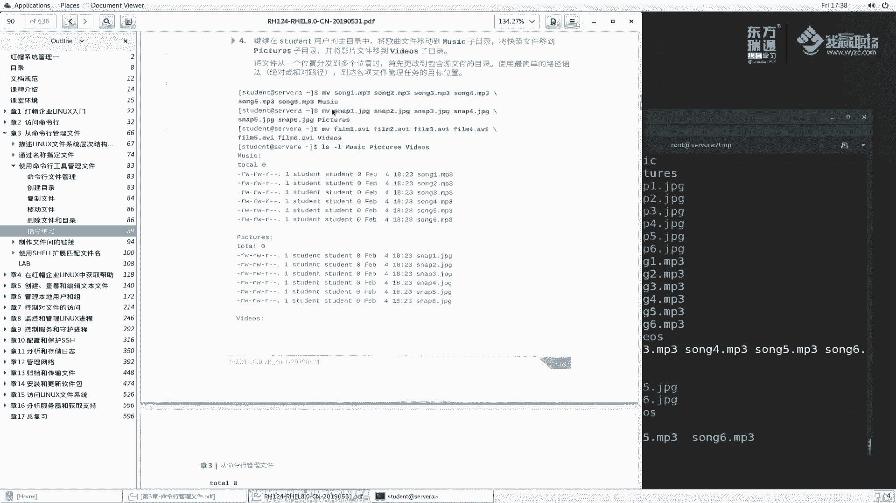

# 红帽RHCE8红帽认证RH124认证课程【全】 - P11：03-2-命令行管理文件-练习指导 - 北京东方瑞通 - BV1KM4y1M71q

好。同学们好，欢迎来到我赢职场HC8课堂，我是马老师。那么刚刚呢我给大家讲了一个命令行管理文件。那然后呢，我这边呢再花一点时间啊，给大家讲一下这个练习。

啊，在我们这个第一本教材的89页啊，可以看到这个地方给大家讲一下啊。因为对于大家来说啊呃新手啊，所以说有些东西呢我还是要给大家讲的详细一点，以免大家在拿到这本书的时候不会做练习啊，仔细看啊。

这个练习呢说你最终要能够实现什么呀？创建组织复制和删除文件以及目录。那么开始之前呢，说我们要在这个机器上面以student的身份啊登录，并且呢使用这个sdent的密码去登录。那么然后呢。

在work station上运行这么一个命令啊，此命令呢将跑一个脚本，确保A上面是否可以从网络访问。那么这样做啊，我们呢为了达到这样一个真实的效果，我们这样敲一下啊，IT杠VMCTL啊，去view一下。

view我们的worktation。

使用这个页面，好吧。

登录一下。STUDENT。啊，继续登录呢稍微有点慢啊，我们稍等片刻。

登录进来之后呢，他说啊我们要在这个在这个里边啊要运行一个命令，来打开一个终端。

跑这么一个终端。Lab。fi杠 manager manager start把这个命令执行一下，好吧。

看清楚了，student worktation上面执行这么一个命令，lab files杠man start啊，回车就可以了。

当然喽。很多同学喜喜欢起这种这种模式啊，其实我我教了教了这么这么多年的课啊，很多同学都喜欢这种方式啊，但是我不喜欢这种方式啊。因为你要你要费了一圈的麻烦才打开这个中端才到这里面来。

其实我们完全的可以这样在这里面，对不对？你说你直接SSH student艾 worktation，那不就完了吗？

对吧现在我跟这个是我们远程登录之前给大家讲过，那语音你这个地方登录好像没什么区别吧，对吧？确实是这样啊，那么例如说啊我们刚刚那个命令执行过了，那么这个命令呢，就不需要执行了啊。

我们也可以再执行一次也没有关系。这个命令只要执行一次就可以了啊。确保确保什么确保我们这个检测我们的思维检测成功了吗？成功了，说明我们这个实验的条件给我们准备好了。

那么来看一下他到底需要我们做哪些事情。说这个第一个。那么使用SSH命令啊，以tudent身份来登录到servA上面来。

他说怎么登录啊？SHH studentdent at so ASSH student atsoA。登录上来了吧，登录到这个位置了啊。如果说需要输密码的话，那么你就输入一个suddent密码啊。

它提示你说系统呢已经为他配置了这么一个身份认证，不需要提供密码，那就更好啊。在student的用户的主目录当中，也就是用户的加目录当前这个位置。

使用使用MKDI命令创建三个子目录来创建一下MKDIR那大已给已经给我们提示了，注意大小写MU。

music啊pic chair TURES然后VIDEOS videos啊，不要错啊，V music pictures videos。

创建好之后呢，说继续在这个主目录当中啊，使用touch命令，创建本实验中使要的一套空白文件啊，创建一个空白文件，创建6个，并且以这个名面命名啊等等等啊，sap，然后film。那么具体的命令操作如下。

他去。上1点MP3。32。点MP3。3上3点MP3。上市点MP3。上5点MP3。啊，这个地方大家看一下啊，我们这里边练习给的是什么呀？是空格再加。回车火吧这个反斜杠吗？上一上2上3。上4点MP3。好。

回去。此时大家给我们弹出的是这么一个界面啊，继续输上5点MP3。36。6点MP3。回去，那么这个呢。6个文件创建好了吗？看一下，123456创建完成了。同样的道理，我再去创建这么一个6个文件。

他大家刚开始做这个练习啊，不要不要投机取巧啊，我们慢慢做好慢慢做s1点JPG。几笔几啊。Step一。这样吧啊嗯还写一下吧，点接PG啊PG。然后我来复制一下吧啊，这样我们来复制一下。我们复制几份。

复制6份。如果说大家这样做呢，一份对吧？两份。三份。🎼1234526啊，我们复制6个。那么到这里面去写啊。这个是snap一对吧？snap2。3。4。5。6啊t6。那么这个呢6个文件也创建完成了啊。

同样的道理，我们在创建film touchuchfilm。film点AVI好，我们再来复制一下。copy一。嗯。3。4。5啊，6个产生了啊。同样呢我们再来123456写一下一。嗯。3。4。5。6好。

那么这个文件来验证一下是不是生成了啊LS那么多啊那么多。那么你可以LS杠1去看。film123456AVR啊nap123456，然后呢，上1啊上一当然你LS杠L也是可以看的啊，根据自己的习惯啊。

我喜欢使用杠一，看起来更简洁一点。

那么再看第4个。继续在这个主目录当中啊，我们做一个事情说将歌曲文件啊移动到music字目录，将快照文件移动到Pick，将影片呢移动到video里边去。具体的命令操作如下。

来，我们默录一下啊。木将上13233上4啊一直到上6移动到music里面去。咦，我们把这个刚刚那个命令啊复制过来啊，这这一串啊，否则你这地方敲的时候，有的你敲了是吧？好。好。删除一下粘贴一下。

然后再来上5点MP3。上6点MP3。好，然后放到music里面去补全回去。那么看一下这个上的工具，上有没有呢？filmn上6没有了。那么Lmusic里边。

是不是123456全部过来了吧。同样的道理，将这个snap一演绎过来啊，film一也绎过来来移动一下。

摸一下。我们找到这个啊，将这个啊。123456。copy一下。粘贴一下。移动到哪里面啊，这个有一点video啊，看看是不是videos，对吧？没，然后再来目录下里边有一个snap是吧？啊。

找一下我们的snap。

啊，mon变过来了，移动到哪里面去啊？看一下他这里面说移动到我们的pic。

P券好，最后这个斜杠呢要不要无所谓啊，我们不要也行，要也行。那么此时我们来看一下TREE里边有一个music。同样的TREE里边我当前目录来看啊，点号。是不是music里边PI video。

那么我们就成功的把它移动到相应的位置里面去了。

再看第五题。继续在这个主目录当中啊去创建三个子目录，然后呢，便以便将文件整理到项目当中去。那么创建三个目录。

目录的名称是MKDIR叫fance。f friendriend是吧，FRIENDS friendsend啊朋友，family。然后work。看一下。

又多了三个子目录啊，然后他又说了是吧，说我们到这个什么在在将选定的文件复制到项目这个里边来。根据需要使用多个命令，不必像设立当中仅使用一个命令啊等等等等等。说将含有数字EI的所有复制到fance里边。

将所有三4的复制到family里边，将文件从多个位置复制到一个位置啊，什么什么之类的啊。来看一下他这个命令给我们看的啊。

首先我们CD到fance里边来。然后copy copypy什么copymusic music里边什么music里边的上一点MP3，然后呢还有一个music里边的上2吧。上2。MP3给我们移动到哪里去啊。

移动到fance里面吧。对不对啊？那么当然还有什么，还有我们所说的波浪线这个用户的加目录，对吧？然后移动呢或者说我们点点点点哪一个啊，这个叫video videode里边的一个film是吧？film一。

同样的再来点点，你根据自己的习惯去写它的方法，film2，然后放到还有一个什么，还有一个我们讲的picture吧，啊，波浪线picture。picture里边的一个snap一快照一同样的波浪线。

picture里边的一个snap2。移动到我们的当前目录。是不是啊叫当前目录啊，是用点代替，或者说呢你给它写一下啊，加目录下面有一个叫friends目录，回车看一下有不是这样子。

film一film2snap一snap啊，上一上2都移动过来了。

啊，达到这么一个要求啊，这个命令写的有点长啊，有点累。那么我是我是写在一行里边的啊，但是说这个行比较长，你看我拉动的时候啊，大家看到我拉动的时候，它也跟着去变化。

特别是这个结尾房如果说你使用这种符号的话，那么就显示效果就不一样了啊，那根据题目要求说，将我们这个三和四也放到这个里边来放到family里边去，对吧？好，CD点点啊。

上一级目录的family里面去。那么我们同样呢去目。去去copy的还目的。

他这里边。刚刚是copy对吧？啊，上面是copy，这个也是copy啊copy啊。这个我就不操作了啊，大家应该会了。然后呢，将56移动到什么work里边去啊，同样的方式我就不移动了啊，再往下看。

那么你的项目完成之后就要该再来做一个清理的操作。什么呢？RMDR将之前的这些目录呢给它删掉啊，family friends啊，试一下。我们首先把。

啊，TCD点点。TRE1啊，我们吹一下，看一下。我们清理什么呢？我们例如说我想清理这个fends目录，清理family目录是吧？那么此时我们去删除使用RMDIR这个命令删除。

那么RMDM我给大家讲过，删除的时候是确保什么呀？

再再来一点啊。那么你删除之前首先CD回车的时候变成什么，变成加目录了吧。也就是我当前这个波浪线目录，然后LS你再去删除，对吧？你说你当前目录下面有你才能删除吗？

删除familyMDIR删除friends。fs里边有文件，他不给你删，你要想删呢，是用RM。杠F。到R去上看一下franance。这个就删掉了吧。那么RMDR。去删我们的family 。

family是空的，是可以删的。

啊，这是我们讲的删除啊删除啊。然后其他的啊其他的基本上就没有了啊，大部分我们都讲过了啊，最后呢。去完成这个实验是吧，这个脚本呢会删除我们练习单当中产生的所有的文件啊，删除一下。

注意哈，我们所在的位置是student work station上去删除，退出来。然后lab files。manage manager什么finish回去。把这些文件都删除了。那真的删除了吗？看一下啊。

我们刚刚是以以student的身份来登录到servA上面来的，再来一次student atserv a。那么看一下当前目录里边哎，有个work work没有删除是吧？那么自己删RMDRRwork。

也没有了。没有了啊。好了，我刚刚花了一点时间给大家又讲了一下这个。综合练习啊，后续的一些练习呢，基本上我就不会再花时间给大家讲了啊，除非一些比较难的，需要单独提出来讲的啊。如果说常规的练习啊。

大家就按照我这个步骤自己呢一步一步的去做就可以了。OK那么这节课呢，我就给大家讲了这么一个练习啊。

