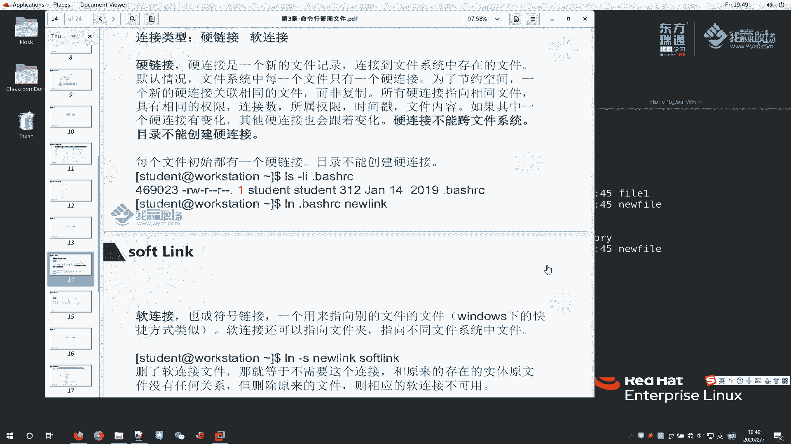

# 红帽RHCE8红帽认证RH124认证课程【全】 - P12：03-3-硬链接和软连接 - 北京东方瑞通 - BV1KM4y1M71q

同学们好，我是马老师，欢迎来到我营职场HC18课程。这节课呢我们给大家讲两个东西，一个呢是hard link，第二个呢是oft link啊翻译过来就是硬链接和软链接。

我们首先来看一下这个硬链接是什么东西。其实讲硬链接之前呢，我们有必要给有必要给大家讲一个东西，就是操作系统里面，它文件存储的时候是怎么存的？

啊，例如说。这样子啊，我们这个文件存的时候，首先是存在一个文件系统里面的。之前我给大家讲过啊，6是NTFS文件系统。那么对于linkux来说呢，我们打个比方，现在呢有一个文件系统。

那文件系统呢去存文件的时候，例如说这个我不管你是XFS文件系统呢，还是说是EXT4。这个都不是重要的啊。那么重要的是是什么呢？我一个文件存的时候，存到这个文件系统里面来的时候，它会分成两部分啊。

什么两部分呢？第一部分啊。第一啊第一部分指的是叫metal data。 metalal data。也就是我们讲的原数据信息。第二部分呢，我们争之为真实的数据是叫data啊。例如说我们这个地方有一个文件。

那么叫文件1F1。F1这么一个文件呢，它这里面为了保存这个文件呢，它会里面分2块。刚刚说的叫metal data和实际的da，它到底是什么意思呢？这个实际的data是用于保存文件的内容的。

例如说我文件是一个文本文件，那么文件里面有数字123，那么123呢就是存在这个地方啊，我们data所存的东西就是存123的。那么这个metal data是什么呀？啊指的是。

指的是这个文件的一个当前是所属者是谁呀，对吧？这个文件呢呃什么时候更改的啊，文件的大小啊啊等等等哈，大概会保存的这么一些原数据信息。其实呢我们之前给大家执行LS命令的时候，大家看到了一些东西。

例如说LS杠L。嗯，现在没有一任何一个文件是吧，S杠L杠A。大家此时看到的这些信息啊，我们都理解为叫原数据信息。啊，这个文件呢拥有者啊拥有组。那么这个文件呢，它的一个拥有者对应的权限啊。

这里边它的一个链接的数量哈等等等啊等等等。那这些呢是代表文件的大小，是不是啊？都是代表这个文，但这个是日期了哈，不是大小啊，这个是大小代表这个文件的一个原数据信息。简单一点讲。

就是用于描述这个文件的这么一个属性的这么一个信息，叫原数据信息啊。那么文件的内容是代表真实的数据存存在这里面的。好了，那么我们再来看一下叫硬链件和软链件。

硬链接呢是一个新的文件记录，连接到该文件系统中存在的文件。那默认情况下，每个系统当中系统中每一个文件啊只有一个硬链接。你想一想啊，我们刚刚给大家画图的时候，有一个metal data。

还有一个真正的data。

那么metal data里边是用于描述这个文件，它这里面有一个有一个信息啊，叫no。这个n叫io啊。In是表明这个文件的数据真正存储在硬盘的哪一个扇区里面的。

那么我们就会根据这个i know去找到这个文件所在的位置。啊，所在位置，然后去读取这个文件的内容啊。那么在这里面默认情况下，每一个文件呢，它记录这个文件的I know呢，它只有数字一。

啊，只有一个硬件件，这个一个硬件一个硬件件就是代表这个文件所在的位置。说为了节约空间呢，一个新的硬链件啊。关联相同的文件I非复制。

啊，那么什么意思呢？打个比方啊，是这样意思啊。再来刚刚那个说这是我的一个文件。发ll一啊发一。那么这是我们讲的metal data啊，metal data里边它这里边有一个信息，打开我就这样表示啊。

metal里边它会记录一个信息叫i knowi know它的i note正常达的数量是一。是一啊，那么这个Io的数量是一，它会记录在哪？记录说这个文件呢存在存在打个比方，存在我们的硬盘里边的某一个位置。

好，这再讲啊，我们将一个链接数指向它的。如果说我针对这个文件啊，这样我给大家看一看啊，LS杠I啊杠I杠A。来看一下啊，这样我们杠A杠L吧。AL。此时大家来看一下，前面多了一个东西。

这个就是指的文件的i know，所有的i know就是指的文件存储的位置。你存储在系统当中的哪一个位置？好吧啊，存储位置啊，如果说这个地方大家还是不理解的话，也没有关系啊。只要发现这个文件啊。

这个i know，我们找文件，找这两者文件是否相同。我们可以看一下这两者文件的i know是否一样。如果一样，说明这两个文件就是同一个文件。好吧，那么同时还有一个大家可以看我们这个地方是有一个数字。

数字一对于普通文件来说，目录这个位置有2，我们暂且不管对于普通文件来说，它这个只有是一啊，一就是代表它自己有只有一个啊，一个是指向它数据的位置，好吧。

那既然硬链接是代表这个文件的这么一个，只有这么一个，然后指向它数据的位置，说所有硬链接都指向相同的文件，那具有相同的权限啊，连接数所属属性等一等啊等等等。那么这样啊，我们来给大家看一看。

如果说我这个文件硬链接有两个，它到底是一终是什么一个样子。啊，简单来看一下啊。

首先呢我们找一个文件，例如说我他起个发药一。发一我们看一下啊，发一里面杠一个I好。那此时这个文件的I know是这个东西啊，我们来创建一个硬链件。创建的方法是这么一个方式创建的叫LN啊LN硬链件。

那么这个前面是代表原文件。文文件一是代表原文件new是代表新的文件。也就是说，我现在创建一个文件啊，叫哎new file这个new file呢指向fa一。来看一下他的效果。再来LL发 you一啊。

然后还有我们的new发 you。再来杠I。我们发一个东西啊，就是说fi有一第一次我看见的时候，它这个硬链接数量只有一。那么此时我在执行了这个命令之后呢，再次去看到时候，它的硬链接数量哈就变成了2。

说明什么呀？说明指向我这个数据块的这个文件啊，这个文件所在的数据块，同时还有另外一个文件名也指向他。那么我们通过这个I know呢也可以鉴证出来。也就是说你是fi一还是fi有这两个啊这两个。

里边的文件名指向的都是同一个数据块。啊，那么我们来做一个事情啊，首先ca一下发一，它里边东西是空的，ca下 new file它东里边也是空的。我们做一个事情。什么事情呢？

例如说啊呃我们去编辑一下这么一个文件吧。啊我们叫G嗯，这样我先给大家简单写一下啊，ecle一下，ele一下hello word。啊，这个命令如果大家不理解没有关系啊。811。大家记住啊。

记住我这个命令是对在这个文件里面写这么一个字符串就行啊。ca下发一。大家此时发现一个问题啊，我这个文件一的内容是发生变化了吧。啊，我对这个文件写了吗？那我们再来看一下new file。哎。

你这个文件也变了吗？说明什么呀？说明当我们访问fi一的时候，他其实就访问hello world。这样啊我给大家再来画一幅图啊。打个比方，这是我们讲的一个文件。F1啊。

那么这个地方呢是我们讲的它它这个metal data啊，叫metal data啊，原数据蓝色看的有点不清楚啊。我退一下。绿色么啊，这是我们讲的metal data啊。嗯，放到上面来metal data。

下面呢实际我们真正的数据叫data。data数据。那么在这个metal data里边，它会有一个硬链接的数量啊，刚开始是一，那么后来变成了二了是吧？那么我们刚刚执行了这条命令之后，就新创建了一个。

new file这个new file呢，其实打个比方，原来的这这个应该叫I know直线这个位置。那么此时我们执行了这个命令之后啊，他又给我们新在我们的原数据里边又加了一个东西。那么加这个数量变成2。

而且呢也指向这个他。虽然说大家看到的是两个文件，但是这两个文件指向的数据块。这因为你这个文件最终存在硬盘里面都是存在我们讲这个数据块里边的。啊，大家好好想一下啊想一下。

说白了说白了就是说我在操作系统里面有两个有两个字符串，有有两个文件名，这两个文件名啊全部指向一个数据块啊，就是这么一个意思。操在linux文件系统里面去存数据的时候，它就是这么一个存的。好吧。

我就给大家先讲那么多啊，如果大家不理解，呢也没有关系啊，以后慢慢去误会啊，慢慢去。反正刚刚我执行了这条命令就能达到一个效果。执行了这么一条命令啊，这个LN这个命令，那么它会创建一个文件。

这个文件会指向这个文件所在的数据块。好了，明白了这一点之后，我们再来看一下LS杠LI，然后是发一和new file。再来看一下啊，当我在这个文件里面输入一个内容的时候，这个内容也发生了变化。

那么例如说我2M杠F发1。我做这么一个事情。大家来看一下，我删除了这个文件。那么我这个你有方言还存在吗？再往上翻。这个fi一不存在了是吧？那么我的new file还存在。那说明什么问题啊。

说明我们这里面删除文件的操作是什么删除的啊，这打个比方，还是这个文件啊，那么这是我们讲的metal data，这是我们的实际的da。

这是我们的F1F1里面这个地方metal data里面它会干这么一个事情啊，原先不是二吗？你现在你现在删除这么一个文件一这个名称，那么我把你这个数量变成一就行了。啊，把你这个硬链接的数量变成一。然后呢。

你这个实际数据位置还在这里面，还是指向它。也就是说我们这个new file这个字符啊还指向我这个data没有任何变化。只不过呢这个数量减少了。啊，就达到这么一个好处。楚啊。两个字符同时指向一个位置。

那么更改一个另外一个自动发生变化。因为它两个所指向的是同一个数据块，所以说变化肯定是一样的。

啊，这里面一定要注意哈，所有的硬连接指向的是文件是相同的，而且呢硬连接处所属权限时件等等的这些属性都一样的。如果说一个发生变化，那其他也发生发生变化。😊，而且大家一定要注意一点。

这个文件肯定是只能存在一个分区吧。例如说你是C盘或D盘windows里面一样的对吧？那么例如说你是我们在linux里边存储在我们的根分区，或者说某一个分区里边，那么它只能存在一个里边去。

所以说它是不能够什么不能够跨硬盘去存储的。好吧，是否是同一个取决于它这个i note是否一样啊，以及看一下这个它的数量啊数量啊。那么这个硬链接呢，我就给大家讲到这里面。

再来看一下。应链接里边有一个非常重要的一个东西是什么呢？

这样我还是给大家说一下吧啊。来看一个目录吧。例如说啊我们这样MKDIR一个叫。这么一个目录来看一下LL杠I哈杠I了回车。只时我们看一下这个老马这个目录，哎，我一创建一个目录，他这个地方默认怎么是按了呀？

为啥是二呢？好吧，那么我这样给大家看啊，其实这个二啊我们如果说这个地方听不懂的话，也没有关系啊，我给大家简单的解释一下啊。刚老马来看一下。RA。什么意思啊？啊。

那么我们这个目录里面有一个两个在吗我 touch几个问题啊。他起一个老马。老马里面我创建一个发要一，我们再来看一下。他这个地方123啊123啊，然后我们再来看它的一个数量。呃，不是这个啊。呃，看一下啊。

我们的刚刚我看到是。这个是老马的数量是2啊，这样写啊。他这个数量是2，虽然说我在这里面目录在你当前的老马目录里面创立一个文件，其实还是还是2。说白了啊，就是这个意思。

我当前里边有这个文件代表我当前目录啊。那么还有一个就是我老马本身这个名称也指向我这个目录。啊，就这两个。好吧，就这两个其实。这个数字案是怎么来的啊，大家就暂且来记住我的意思就可以了。

其实呢这个这个对于目录来说，这个硬链接数量呢，其实大家也不用不用考虑啊。其实对于他来说，我们暂时理解没有太多的意义。好吧，没有太多的意义。

OK这是硬面键。再来看一下软链接。软链接相对来说就比较好理解了啊。例如说我们windows里边呢打个比方。

我们去找一个文件。随便找一个啊，找一个中。那么我们做一个事情说创建一个快捷方式。把它什么为桌面快捷方式。那么此时我们就产生了这么一个快捷方式。在lininux里面，软链接也就是跟windows一样。

是一个软链接快捷方式。好吧，那么我们再来看一下给大家创建这么一个快捷方式，怎么创建呢？

那么现在呢，我这边有一个叫new file啊，ca一下new file。我现在要创建一个软链接啊。例如说我们创建1个LN。杠S软链接要加一个S表示是soft啊soft。

那么在我们这个tamp目录下面去创建1个11。或者说fi。按。这是要找一下我们的原文件啊，原文件是在我们的home目录下面student。stuton的下面里边一个new file。

然后我们这个文件呢指向他回车。此时我们来做一个事情，ca一下他。看看能不能给我们显示。是不是显示这个我们看一下，你有发有。就如说我再艾cle一下叉叉叉叉叉，我们追加个符号到6方里面来。

看一看刘方刘范的内容变成了这么一个吗。那么此时我们看一下这个我这个软链接文件变没变。发一个问题啊，软链接也变了。因为你是快捷方式嘛，对吧？好，这是我们讲的软链件。那么如果说我做这么一个事情啊。

t我删除这个发要，而且大家看一下LS杠L你看。这个软链接它这里边已经告诉你我这个文件呢，只江谁呀，只阳这个文件了吧，而且前面还有一个LL是代表link，也就是链接啊，软链接文件啊已经给我们标示出来。

还是非常明显的啊。那现在问题来了，例如说我RM，我去删除删除fi。当我执行这么一个动作的时候，那么他是做了什么事情啊？是删除我们这个文件的本身吗？还是说删除我这个软链接呢？那就像我刚刚呢。

在windows界面里面，我做了一个什么事情啊，我删除这个链接符号了吗？我刚刚做了这么一个事情。

发送桌面快捷方式。那我对这个我执行删除操作。那么这个原文件肯定不受影响吧。啊，那是肯定的啊，在这里面也是一样的啊，一样的啊，我们来删除file这个软链接L1下。

杠L。文件没有了，但是我这个文件还能看吗？ca home里边那个student你有 file。Student， student。home student，然后六方，那么这个文件当然存在了。

好，这是讲软链接的啊。你软链接跟这个硬链接，他们所在的位置是没有任何区别的。

那么再刚再讲一下啊，在windows里边，我这个是C盘，C盘里边跟我们的这是D盘啊，我刚刚创建了一个桌面快捷方式。那么这个桌面快捷方式存在哪个盘面啊，我们都知道桌面里边的文件是存在C盘的。

所以说这两个是跨的。因为这两个是是不同的文件啊，简单一点，这两个是不同的文件啊，完全不同啊。只不过呢当你访问它的它有一个。指向他啊，他做了这么一个链接指向。

那，我给大家画一幅图啊。大概是这样子啊，例如说这是我原生了圆边的硬链接啊，这是硬链接里边的一个data啊，data这是硬链接里边的一个metal啊，我们讲的这个文件发号一啊发号一。

好，这是范一啊。那么我们给它做一个软链件，例如说我们叫soft的 file。sof的 file啊，那soft file它指向这个位置。啊，指向这个位置，然后呢指向它的一个metal啊。

然后这个这个metal呢，它本身指向data数据。如果说我们把这个文件删掉啊，把这个文件删掉，那么这个软链接就没有意义了吧。同样如果说我把软链接删掉，那么我原文件啊是不影响的。好。

此时呢我们来给大家做一个测试。那同样呢我们再来创建一个软链接哈LN啊杠S找下我们原来的文件。那么这样嘛，我们就找1个ATCFS type。写一个什么呢？

写个FS type我当前的FS type呢去指向它cat一下FS type。好，确实找到我们原来的文件。那么我们RM。FS type刚刚我们给大家演示过了是吧？呃，现在只要他这个文件比较重要。

我们不能删啊。这个普通用户呢也没有没有权利去删这样吧啊。我们去。去找一个可以删除的这么一个文件啊。这样啊，我们copy一个hos， copypy1个ETChos文件啊，copy到当前目录里边来。

然后我们去LN去创建杠Sho，然后new host。来ca一下new host。此时我们这个new hosts跟hosts应该是一样的。来ca一下host。啊，两者一样的吗？我们LS杠L来看一下。

此时new后4次指向的是后4次。啊，这两个文件大家看到属性完全不一样。new后s次是软链件啊，什么什么各种权限是吧？哎，我们的后s次是student的拷贝过来这么一个权限。那我现在做一个使用。

把这个文件删掉。Im。后事次。此时我们再来看一下杠L。大家就发现一个问题，我们这个new host里边有一个什么一直闪一直闪。这个闪就说明我们这个目标文件不存在了。好吧，目标文件不存在了啊。

那么我们给它删掉啊。你好是。好，删掉了。再来看一下。就没有了吧。好，不存在了。

好，到这里面呢，我给大家稍微总结一下啊。硬链接是。代表一个文件啊，通过多个硬链接去访问同一个数据块的位置，你删除了硬链接的数量啊，它是文件的数据并没有删除，它还可以通过其他链接去访问。

那么多个硬链接之间是完全一模一样的。因为它访问的是同一个文件。OK软链接呢相当于windows里面的快捷方式与。它的目标位置，它的之间，这两者文件是没有任何没有任何关系的。只不过当你访问的时候。

他有做了一个跳转啊跳。其实转链接可以理解为是一个独立的文件。

OK啊。那么再给大家讲一个啊。在我们去。去创立一个软链接或硬链接的时候，我们一定要注意啊，注意。例如说我给大家演示一下啊，我们先现在想创建一个例如说CDETC目录。

那么我们都知道ETC下面有个FS type文件。我想创建一个什么，创建一个硬链件。硬链接是什么呢？叫FSt，这是原文件吧。然后目标文件t下面一个老马老马的FSt来看一下。提示提示什么？提示。

我们现在不能创建是吧，这样我们换一个吧。嗯，换一个root账户。还是涉D到ETC里边来。LNFS time我们的t里边一个老马的FSt。此时大家来看一看啊。我们LS杠L去看t下面的一个老马FSt。

大家看到我这个是存在的，它指向的同一个数据块没有问题啊。如果说我再来创建个LILN杠SFS tab啊。那么再来一个tap里边一个叫嗯soft啊。

叫SFS type SFS type这个是软链接的意思是吧？soft再来回去。我们再来看一下。LS啊杠Lt目录里边的回车。那么我刚刚明明是创建了1个SF type啊。指向我当前目录下面这个FS。

为什么为什么给我们报错呢？此时大家发现了一个问题啊。那么此时这个SFSt是因为你当时是处在这个目录下面的。如果说我现在处在t目录下面，那么想一想。那t普目录下面，你这个SFS指向的是这个。

那么此时它代表的是这个文件指向我相同的目录里边的这个FS type。所以说啊它就会报这个错什么错啊，这个文件不存在。那么我们创建软链接的时候，大家尽量使用。绝对位置或者说相对位置这个相对位置的时候啊。

一定要以点开头的，或者说点点开头的。啊，最好写清楚了啊。当然为了避免出现问题了，最好一步到位就写直接路径，那么就会不就不会出现我刚刚出现的这么一个问题了。好吧，那么把这个文件给它删掉。

杠杠什么杠SF type。是移除这个软链你吧，移除。LS看一下。没有了好，没有了，再来嗯RMFS type。连接也删掉。

那么就没有这些文件了。好吧，软链接和硬链接呢就给大家讲到这里面啊。软链接估计好理解，就是硬链接这个地方大家理解起来呢相对可能有点复杂一点。那么多做几次练习，多去感受一下OK啊。关于这个练习呢也不是太难。

大家自己参照课后练习去做就行了。那这节课呢我们就讲到这里。

