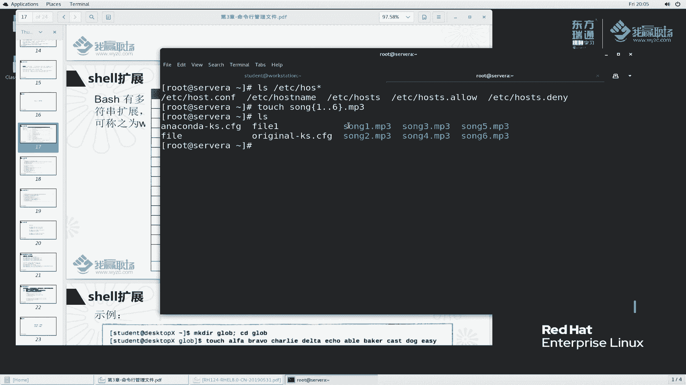
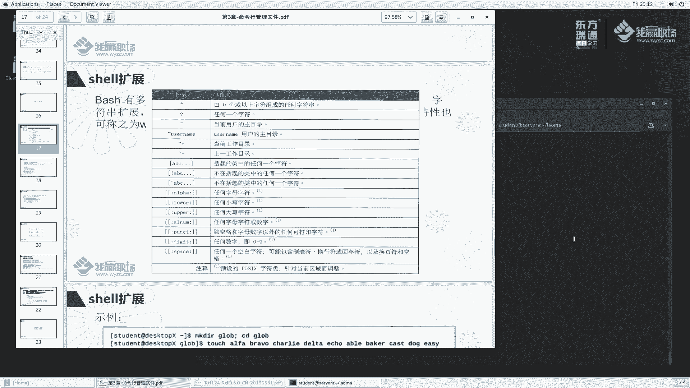

# 红帽RHCE8红帽认证RH124认证课程【全】 - P13：03-4-shell扩展字符 - 北京东方瑞通 - BV1KM4y1M71q

同学们好，欢迎来到我营职场HC8课堂。我是马老师。这节课呢我们来给大家讲一下sll的扩展。那么在之前我们解的课堂当中，大家应该会看到一个练习啊，我给大家演示了这个命令行下面去管理文件的这么一个练习。

在这个练习里面，我们去创建了很多文件，上一上二上三啊，以及啊去 move的时候等等等啊。那对于这个touch的过程当中，我能不能说有一个非常简单的方法吗？你看非常有规律。

上一MP3上按MP3中间除了这个数字变化，其他好像没什么变化嘛？那么我们这个s程序里面啊，他们能不能给我们一个非常简单的这么一个书写的方法呢？

啊，可以啊可以啊。那么在这里面，例如说我给大家简单的演示一下。

LS啊L你就说ETC里边开头的后s字开头，我加个星。来看一下。此时，我们hoss的心就匹配到了这么多个文件。是不是啊啊，例如说我们之前创建的文件，例如说touch一个啊，再给大家演示一下。

touch一个上啊，括号里边1。6，然后我们再来点MP3。好，此时我们来看一下效果。哎，是不是非常方便就给我们创建出来了。那像这种符号，还有这种符号，我们都称之为它叫shall的扩展符号。

也称为shall的通配符啊，通配符。那么来看一下sell里边常见的通配符到底有哪些呢？

嗯，第一个新符号。代表有0个或以上字符组成的任何字符。

诶，我们刚刚说了，我L后好像确实有过匹配出来了吧。啊待会呢我们再去给大家演示。

任意单个字符，注意哈，有且只有一个字符。哎，它是零个或零个以上的，可以是零个啊，它是呢任何一个字符波浪线用户加目录。这个我们说过了啊，波浪线加用户的名称代表某一个特定用户的加目录啊。这个是当前目录。

其实我们用点代体更好一点啊。波浪线加减号上一次工作目录啊，上一次我们执行命令的时候所在的一个工作目录啊，其实我们用中横杠就够了啊。这个当前目录这个撇示有点怪怪的啊，建议大家这个用点，这个用减号就够了。

然后。括号括起来中的任何一个字符，你这个地方代表任一个字符是吧？那么如果说我只想表示ABC这么三个字符呢，可以用中括号代替，只能使用其中一个啊，这这之间是或者的关系啊或者的关系。不在括号内的任意字符啊。

排除中括号里边加上感当符号，表示不是其中的任意一个字符。那同样与间括号一样，表示也是取反啊取反。阿尔法阿尔法是字母吧，ABCD啊。

然后这种大小小小写的这个任意字母lower小写apple大写阿尔法 number字母加上数字啊。huunt是吧，除了空格和字母数字以外的任何可打印字符。空格字母数字以外的可打印字符。

空格是不可打印的对吧？好，字母和数字啊都是可打印的。但是呢排除之外，低级头数字0到90到9啊，space空白字符空白字符有很多，我们简单理解空白字就是我们看不到的字符肉眼。那么可能包含制表符t键是吧？

那换行符回车符换页符空格啊等等等这些。那么下面呢，我们给大家一个一个来演示啊。那开始之前呢，我们首先做一些准备的动作啊，那么还是一样的。

我们首先到。Yeah。这怎么回事啊？退都不给退了是吧，卡住了啊，这样啊。那么首先看一下我们这里边把这个文件呢都给它删掉。啊，就杠R杠R老马老马，还有一个妞发。看一下还有没有了。没有了是吧，没有了。

我们来操作一下。

首先呢我们就创建这个目录，到这个目录里面来。根据自己需要你去创建啊。那到这目录里边呢，我们去创建一些文件，ta取1个AL阿法阿尔法BRAVOCHARE啊data。A口A的贝壳。cast多。意对。Ey好。

这个文件呢基本上我给大家创建完成了啊。那么可能有几个别错的，没有关系啊，没有关系，来看一下到底怎么匹配。

回到上面来。他说我们去匹配的时候，匹配零个或以上的看一下啊，我想匹配A型。

那是不是A开头的？只有A开头都给我匹配到了，大家去找一下LS杠1来看一下。A开头是否是只有这两个？对吧找到了啊，那么A问号呢？有没有A问号这个地方至少有4个字符，对吧？那么我这样哦ta1个AA。

来看一下艾文豪有没有。给我们匹配到了，说明你这个A呀，这个匹配任何一个字符吧，那么我们就可以查看了啊，非常方便。同样呢，我他个ABC那么再来LA问号问号。啊，加几个呢ABC啊，当然我这个地方加三个是吧。

那么加两个呢？任意单个字符啊，这是第一个问号。那么星号呢，我们刚刚也给大家匹配到了啊，再来LS。啊，AB来个型号。AB个型号。那么大家看到有两个是吧，有两个。同样呢，我LS新A新。

那么只要你这个字母当中有A的，就全被给全部给我匹配到了。就说我tauch一个。touch个TU touchuchBB。那么我们看一下这个BB能匹配到吗？没有说这个BB吧，还是原先的。任意自服。啊。

任意走向AA这个地方是吧？那他它是在我们后面的，也可以。那么你A在最前面的也可以，A在后面的也可以。

新啊行，这个优化。同样呢我们还有一个中括号啊，中括号这个上一节目录和那个呃当前目录，这个我们就不演示了。这几块之前呢我们都给大家讲过了啊，我们讲后面的中括号ABC来看一下。

那么我再来匹配一下LSA开头的里边是。B或者C的对吧？然后呢。看看直接回车没有是吧，你这样写。有ABC匹配到了吗？你是B或者C。那同样呢我再来touch一个touch个A嗯ACC啊。

再来touch个ADCABC。好，我们来LS新啊A新C。那么我们匹配到3个，中间呢是BCD好，我这样匹配啊。那么中括号里边一个我们就匹配一个A或者D。啊，A或者D大家看一下，这里面是BCD嘛。

那么匹配的时候任意的其中一个啊其中一个如果有你就显示，没有就不显示。

这是中括号的用法啊，那么中括号里面它其实是可以加什么加中横杠。

对吧中横杠是代表范围ABCD。那例如说我们这个地方给大家写一个啊，之前给大家看到一个说这里面有一个第一级导是代表数字，是不是啊？那其实就是这个啊，例如说我们他uch个A1呃C啊，那么A4C啊是C。

那么我们再来比较一下。

12。那么现在只有匹配到一，因为我这里面只有1C是吧，还有4C。那么如果这样写呢，1-9呢。1-9是不是1到9都匹配到了，那么0-9呢？是不是啊？

匹配数字通过这种方式写起来呢更简洁。你要是说通过这种写呢太繁琐了，不建议大家去这么用。

好吗？好，这是我们讲的中括号。那么当然我们也可以加一个不匹配。我现在有1个A1A4C。比如说我现在再来给大家准备一个touch1个A5C。那么我想匹配什么呢？A，中括号不是啊，中间里面不是一的啊。

不是一的。

来找一下。不是一的里边有多少，有这么多。有数四和五数字的，那么有BCD的。好，此是都给我们匹配出来。那例如说我不要一不要A的呢。那么A好像这个地方是有BCD啊，没有A是吧？那么我们换一个嗯BC。

那么这个BCC没有了，是不是啊，这个地方啊B也没有了，C没有，只有D。

啊，不是不匹配的这个软件。如果说通过这个方式，我们去管理文件的时候，就超级的快了。通过这种通配服务去管理文件的时候，就是一次性可以表示多个文件。非常的方便。好吧，非常的方便。

OK那么刚刚那个列表里边其实有几个没还有一个没有讲到，那么是这个符号，大括号大括号呢我们用的。也比较多来看一看吧。

那么我们这样做啊，例说我踏几个文件。啊，那么这样啊，我们把这个文件都给它删掉啊，杠F。杠R。就行吧。没有了吧，是不是这样非常方便啊，别导我删除的时候也方便。你L是查看的是吧？你RM也可以做这么一个事情。

😊，OK啊。那么我们再来做一个事情。ele一个上衣。不要上一了啊。上括号1。5。来看一下结果。他就给我们显示是这个样子，也就是说上1到5呢，它代表的是这么一个字符。

如果说我们此时执行的是touch命令的话，大家来看一下touch后面加这个符号。那么他给我们产生的文件是不是这么几个？对不对？回去。出现了吧。啊，好，我们再给大家看一下我LS。加上什么呢？加上这个。嗯。

这样啊。我IS1到几啊，我1到6。看一下。你1到6应该或者说2到6啊。2到62到6应该是上2上3上4上5上6。那么这个他应该会提示我们这个上6文件不存在。OK。242345提示6不存在。

确实是我们的需求啊，对吧？好，这样一个结果。啊，他其是由于创建的L看呢，他就看不到，因为没有啊，没有注意大括号的用法。刚刚我大括号使用点号的吧，点点点点是代表范围。

中括号里边它的范围是中横杠1-9是代表范它的范围。哎，我们大括号里面用的是什么呀？用的是点点代表范围。啊，老师，你给我讲那么多我又蒙了啊，糊涂了。没有办法记呗啊，linux里边确实是这样干的啊。

只能这么一个记了啊。

那么如果说大家这个大括号里面这个范围记不住啊，我记不住，我教大家一个简单的啊。那么我们再来ele一个ele显示自证信息的啊，e一个music。叫MP嗯music musicic括号。

一、逗号2逗号3逗号4这样写。此时大家也看到了吧，那么这个是使用逗号风格的，也可以实现。那么简写就是一点点4了。0。4。达到相同的效果啊，如果说是比较临近的一个范围。

我们这样那东当然这个地方我们再尝试一下呃，五逗号8看一下。啊，11点点是此时这样写不行了。是不是啊这样写不行的吗啊，就是这个地方他就不理解了啊。哎，我们来看一下1-4呢。也不行吧。

所以说你这个两种话不能整合在一块写，要么是逗号，要么是点。

啊，这个要稍微注意一下啊。当然，大括号里边还支持嵌套。好，你看大括号里边有1个A1，我们可以组合成什么？A1A2，然后B和C看一下A1A2，然后B和C。同样的这两者可以都都用啊。例如说A1A2B1B2。

那么1234组合成这个样子。就像我们之前学数学的时候，有一个叫排列组合啊，达到这么一个效果。大括号啊要自己呢勤加的练习，自己呢多用啊，一边用呢一边去感受。你不用的话，否则比对有的你烦了啊。

一定要自己去多用啊。再来看一下这两者的一个对比。挨le一下啊，我们来看一下。

挨口一下，以这个例子啊，那么就看这个吧。

他给我们提供的是。括号A点点1123。

A123B123C123D1啊是这么一个东西。那么此时如果说我们来ecle这个东西来看一下。

A到G写123。他给我们打印的是什么呀？打印的是这么一个东西。那师我懵了，你这个地方不是说A或者B或者C或者D或者E吗？

对吧，那么怎么显示是这样子啊？所以说啊大家要搞清楚了，这个东西是在我们L里面比较好用，它是代表或者的关系。

在L或者说RM去管理文件的时候，它比较好用。那你这ic是打印字符串了，对于我们这个e命令来说，你就是一个普通字符，没有什么特殊含义。好，没有特殊含义。OK一定要搞清楚啊搞清楚啊。好了。

我们给大家讲到这里面啊。那么我们再来看这个touch一下。

你不管怎么说啊，我们这个符号A点点E，它就是这么一个代表这个。但是呢你它可是不代表它啊，你这等字符A到一确实是这个范围，但是呢你是用于匹配文件的，并不是说给你展开来，它是用于展开的，代表必须是这样子。

它是代表或者的关系。所谓的或者的关系，我怎么知道你是其中哪一个呢？你存在也行，不存在也拉倒。那么对于I这个命令来说，它就当成普通字符了。

那么对于LS来看一下LS这个地方，我们叫A杠1，然后123。对吧提示什么提示没有这么一个文件，这样啊，我们来touch1个A123来再来看一下。那么就有了吧。啊，对吧一个文件都没有，确实没有匹配到嘛。

所以他提示没有。对吧其实没有匹配到任何一个文件。那么当我创建了这么一个，他就匹配到了。

啊，注意这里面我们讲的一个道理啊。这个地方啊大家会非常的懵啊非常的懵啊，自己呢用心去体会一下，要取决你这个命令好，取决个命令。但是大括号里面表示是必定存在啊必定存在的啊。

好吧，我们再来看看下面一个东西。变量替换和命令替换啊。

在这个地方我们给大家看一个，首先讲这个变量替换。啊，这个变量提换，其实我在之前已经给大家讲过一个啊叫eco dollar PSE。PSE是一个变量啊，那么这个do for呢是取变量的值啊。

这个地方最终效果呢我们就叫变量的替换。好吧，那我们写一个简单的一个，就是说Y一。Y一是代表变量，或者说写一个叫user name。啊，等于什么？等于老马。此时ecle一下user name。

那么它是打印我们字符字面意思，e下dollus name。此时它就是打印了我们这个变量里边的值。那么这个叫变量替换，好吧，变量替换啊。那么我们再给大家看一个东西啊。还是user name。等这样啊。嗯。

user name等于老马，我们再写一次啊，user name下划线forrst啊forrst等于jack。这么写，那么我们ecle一下啊，dollar。把这个拿过来复制过来。

大家看一下我们这个地方能够打显示的是什么东西。哎，确实显示的是这样子是吧？其实其实你这个地方有的人可能想说，我用于我想其实我想的是把这个名称显示出来，然后呢，跟这个fors的组合起来。

那么他把它当做一个整体了嘛，那我如何限定这个变量的范围呢？来看一下，我加一个大括号，大括号。再加一个大括号。再来看一下。那么我输出变量的时候，这个符号就代表限定你变量的范围，那么替换成老马。

然后变成fort。

，大括号的用法啊用法大家一定要记住这一块啊，否则你这地方就容易蒙掉了哈，出错了。

这是对于变量的替换。那那除了变量的替换呢，我们这个地方还可以对于。

命令的替换这个地方啊，大家又可能会蒙掉了。

那么一样多用熟悉了就行。OK啊。

我们做一个事情。例如说啊例如说啊ecle一下doller括号，刚刚说的一个user name。是这样子啊这样子啊。我们来做一个事情，我叫user AD我创建一个啊，我们叫增加一个用户ID。

我们看一下系统里面有没有老马这个用户。啊，老马已经有了是吧？那么我们换一个吧啊。🎼user name等于。等于J接ACK。这样啊算了吧，我还是这样说吧啊，IOS。

当前目录下面有一个老马这么一个目录啊目录啊，那们做这么一个事情啊。哎口算了啊，我还是给大家看这个例子吧啊。艾cle一下LS。大家看到了我ecle L的时候，他给我打印这么一个字符。

ele命令是用于打印的。LS呢是打印这个字符。如果说我到了括号。Ele L。大家此时我们都知道应该是这个吧，icic给我打印这么一个字符。那么这个地方是什么一个意思呢？

其实说白了就是给我执行这么一个命令。也就是说这个符号。这个符号里边存的东西是代表一个命令，它会把它当做一个命令来解释。啊，这个命令解释完成之后生成一个结果LS这么结果。

这个LS结果呢要当成一个命令来继续做解释。相当于啊命令执行了两次，里边是一个命令。外面呢执行里边这个命令执行完成的时候输输输出1个LS对吧？然后呢，他把这个LS再当成一个命令呢，继续去执行啊。

这叫命令替换啊命令替换啊。

那么我给大家再来看一个啊，比如说date加上百分号大A。D。加上本文号大A。那么今天是星期五啊，来。挨cle一下啊 echo一下。today today is is是什么呢？到了符号小括号再来小括号。

那么今天是星期几呀？是不是啊今天是星期五嘛？你看这个得出一个字符放在这个位置啊，把这个friday啊，把这个friday替换替换到这个位置。就得出这个样子了。哎，我们刚刚这个地方什么？

我刚刚执行的这个命令是相当于我获得了这里边执行的是LS啊，里边执行出来的是LS。那么LS这样子，那么你再多了一个回撤，那么此时他就相当于把这个当成一个命令。哎，此时呢。

此时这个执行完成之后是friday。对吧那么e today is fri，那么就照常显示了。

两者呢稍微有点区别啊，区别稍微注意一下。OK啊。那么这个到底有什么用呢？是不是啊老师，你为什么用这个东西搞得给我们讲的那么复杂。前面这个地方我觉得还有可能有理解，对不对哈？

你这个通费符是我管理文件方便使用。那么这个命令这个变量替换我是用于保存一个字符串啊，字符串的啊，保存一个字符串值。

这样我给大家再讲一下这个为什么用这个这么一个变量啊。比如说我们写一个东西叫。没。叫一个啊data pass。等于叫USRDOC里边一个打开我就写这么一个。那么我想这一点，这样其实这样换一个吧。

大家要做过oracle维护就知道哈，oracle维护它这个叫叫什么U01。什么APP然后什么什么acle什么什么等等等，非常长的这么一个路径。例如说啊我叫O1O2啊，就这么一个路径。那么关于这个路径。

我们每次去访问的时候，我要去手动敲太麻烦了。其实我要访问的时候，我怎么访问，我直接L dollar啊，括号。Data pass。就可以了吧。但是问题什么，这个目录不存在，虽然不存在。

但是我这个命我这个变量替换是不是正常替换了呀？对吧非常的方便啊非常方便。第一，这是我们讲的这个方面啊。第二个还有一个问题。那么如果说这个目录我们在写sll脚本的时候，这个目录它会经常用。

那么我只要写这个都是引用这个变量名，变量的值就行了。那么万一这个目录发生的变化，例如说啊我给大家比打个比方，我们写了一ex个cel程序，那么。

这个命令他用到了这个命令也用了这个命令也用到了这个命令也用到了。那么如果说我们没有用变量的话，那么去把这个命令四个命令全部写过来啊，全部写过来，非常的麻烦啊非常的麻烦。我写这个变量名确实简单了啊。

还有一个问题。如果说我哪一天这个路径变了。那么此时我要做的事情是不是每一个都要替换啊，你每一个都要替换。啊。如果说我们现在只是引用的是这个变量名称。对吧你原先的是引用变量名，我现在还是引用变量名称。

我只要改原来原先的这个地方，我只需要改一次就可以了。

此时呢就方便的多了啊，变量的用途。那么再来看这个。叫命令的替换。

好，命令的提换主要是这样子啊，因为有时候我们想要获取一个结果。那就像刚刚我们讲的。这个结果呢，你是通过命令获取到的。这个界略是实时的动态的变化的，是通过命令获取的。那么我们只能执行命令去获取。哎。

并不是说你是一个固定的，固定的，你手动敲下就行了。但是对于这个来说，你你你无法看到啊，这样我给大家再敲一个date杠date杠S。对。嗯，对的加百分号S。小S啊。这个是什么呀？我再来加一个。

他总是变化的哈。这个时间指的是1970年1月1号0。0分0秒，到现在过去了多少秒，那这个值总是变化的。那么我要想获取这个值，你怎么去获得，是不是只能通过这个命令去获得呀？啊，就是这么一个意思啊。

有时候我们需要通过命令去执行，才能获得我们想要的值，并不是一个固定的值。好，那么这个地方还有一个比较有意思的例子，我们也会经常用啊。

打个比方，我们要现在要去创建一个文件。作为一个开发人员。他呢嗯他每天呢要生成一个日志，每天都会生成一个日志。这个日志呢用于记录我们这个应用程序啊，它运行的状况。那么我如何每天都要生成一个日志文件呢？

日志文件的名称还要不同。对不对？啊，日志文件不同，那我怎么去生成呢？我就可以根据date命令来看嘛。date啊我们date加上一个百分号X来看一下。对吧，是这么一个啊，这样的啊，我们重新换一个啊。

叫大Y啊，然后斜杠啊，这样我们中横杠在百文号mos再杠一下啊，我不要杠了啊。再来百文号D百分号D来看一下。2020年2月7号，例如说我 touch气一个啊。

创建个文件APP杠log啊啊杠我们的这个到了括号括号把它拿过来。那么我们再加一个点log。我每天都给你创建一个来LS看一下，我每天都会创建一个，那么这个文件名就不会重复。

好吧，这个不这个我们用的还是非常的多。8。好，这个是我们给大家讲的这个命令替换啊，大家呢好好去消化一下。再来看一个保留字面意思。

那什么叫保留字面意思的啊？老师刚刚给我们讲了好多叫LS这个括号里边有1个A杠1123，对吧？那么还刚我们讲了大括号里个点点啊等等等这些东西。那么这些字符对于sll来说，它都有特殊的含义。也就是说。

我们sll程序去去拿到这个字符的时候，它都有一些特殊含义，并不是它的字面意思。那我如何去。代表这个字面意思呢。例如说我想创建一个文件，这个文件名啊，它就是这么一个东西。

对吧我这个文件名就是这么一个东西啊。打个比方，我们来 touch一个。他其一个这个东西。看看能不能生成这么邮件。哎，好像能生成吧。啊，确实能生成这么一个文件啊。那如果说我tauch一个中括号A。

点点1那么123，他给我生成的是什么文件？其实其实如果说我打个比方啊，自然这个有点绝对，我就要生成一个字面，就是这么一个文件。那怎么办呢？我就要屏蔽这个字符的特殊含义。

怎么屏蔽呢？好，这里面给大家讲的有三种方法。首先第一个。这个换行符是不是之前讲过的啊，换行符。那么他只能取消后面单个字符的特殊含义。

来给大家演示一下啊，我们说echo dollar user name。那么他给我们取出来值了，就说ic之后，我加这么一个符号。此时大家发现呢，这个do了 for就是他的字命意思。啊，没有任何的特殊含义。

啊，非常重要啊非常重要啊。

那么。对于双引号，它能够达到什么效果呢？双引号啊是压缩sha扩展含义。那之前我们给大家讲了很多，这些都是属于shall扩展，这也是shall扩展啊。那么这些sll扩展呢，我要让它保留字命意思。

好后来看一看啊，那么LS。

这里面有好多LS这个地方啊，我们叫中括号啊。这样吧啊，我们这里边有一个。我们麦匹配一下啊。这个是A啊，我们到A到C里边1个123，它给我匹配的是这么三个文件啊，这么三个文件。那么其实说我不想匹配的。

我看看就有没有，就是就是叫这个文件名本身的这么一个文件。来看一下。他提示什么呀，说这个文件找不到了吧。好，这个文件找那它保留的就是字面意思。他这里面就没有说有特殊含义。特殊含义啊，记住了啊，记住了。

当你加了双引号之后，那么这个就保留了它的字面意思。那么你sell里边这些特殊含义呢就被它屏蔽掉了。

啊，但是呢他是无法屏蔽什么呢？无法屏蔽这个命令替换和变量替换。好，来看一下什么叫命令替换，变量替换呢？

你有说。挨口一下。Dollar use the name。看一下诶，我好像还是圆远意思吧。也就是这个符号呢是不能够屏蔽这个doller符号的啊，你想屏蔽怎么办呢？再来一个。啊，这样屏蔽掉啊。

当然了你也不能屏蔽，比如说我来执行一个。我们到了括号啊。到了括号LS。好，大家此时发现一个问题，我X是打印一个字符嘛，打印这个字符，但是实际情况打印什么了？打印成这个东西了吧。😊。

说明我这个LS执行了吧。

打印的是这么一个东西啊，OK啊。那还有一个比较牛的单引号。单引号可以压缩单引。

可以压缩单引号里边的所有支付含义。也就是说我不管你是这个shall的扩展字符，还是说你是doll for，我都给你压缩掉了。艾cle一下单引号，这样啊，我们用单引号代替。那你这里边原先是什么。

我就照常输出吧。那不管你命令替换，还是说什么字符，我都原原本本的给你打印出来。

啊，这个地方啊大家要仔细去理会一下啊理会一下啊。好的，那么这一小节呢我们就给大家讲了这个sll的扩展啊，以及如何去屏蔽sll的扩展。这个呢在以后的呃大家去编写脚本的时候，会经常用到，一定要搞清楚啊。

到底是什么情况下用C扩展，什么情况下去屏蔽，怎么去屏蔽。好吧。嗯，这一小节呢啊这一章啊这一章的最后一小节我们就给大家讲完了。好的啊，今天呢我们就讲到这儿，谢谢大家的一个收听啊。😊。

