# 红帽RHCE8红帽认证RH124认证课程【全】 - P14：04-1-man手册 - 北京东方瑞通 - BV1KM4y1M71q

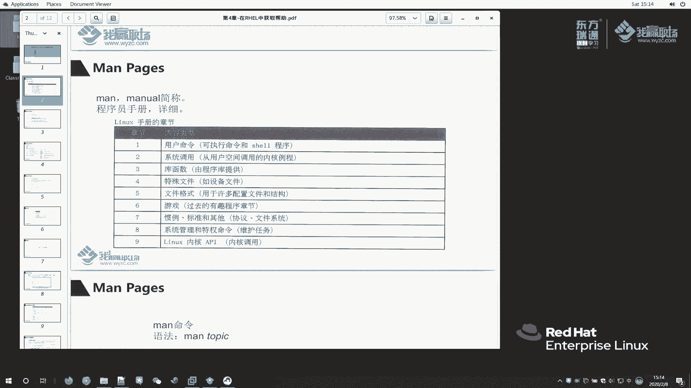

同学们好，欢迎来到我赢职场HCE8课堂。我是马老师。今天呢我们来给大家讲一下第四章在HEL系统当中去获取帮助。那么我们主要从三个方面给大家说，首先呢给大家讲的是menu啊，也就是man page。

第二个呢是inform啊in information是吧？慢的是代表manual手册的意思啊，infer文档的查看。第三个是作为补充，那么讲的是USR do啊，那么一些软件安装的时候呢。

也会在这个目录下面去存放相关的一些文档。

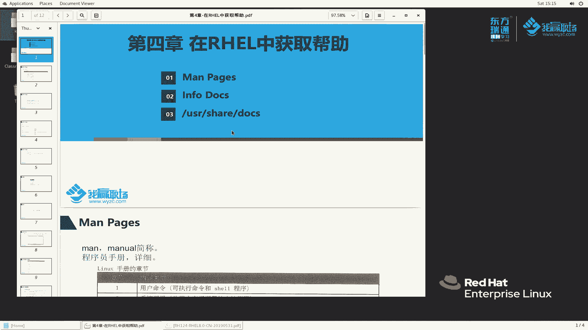

首先呢我们来看第一个部分。慢它的一个完成完整的写法叫manu，是这个单词的一个缩写。那就像我们家里面买一个产品一样，那产品呢总是附带产品手册，在links里边也不例外。linkux那个里面的程序员呢。

在他他开发产品完成之后啊，他都会配一个产品手册啊，与这个软件一起去发行给我们的客户啊，客户。那么我们的这个呃我们的用户啊去拿到这个历操作系统呢，就可以去查看这些手册了啊，知道这个软件怎么用。

那么这个man page到底在哪，我们怎么去用呢？首先呢我们给大家简单解释一下，曼佩吉它这里边有几个类型。link里边它有很多文件类型的对吧？那么我们去看帮助文档的时候，它也会有一些说明。

例如说哎这个是用户命令相关的对吧？那么还有可能是配置文件相关的。第五个是配置文件。第一个是用户命令什么意思呢？什么意思呢？也就是说啊我们这个man配啊，它会对半配置种类比较多，我们呢对它进行一个分类。

方便我们去查看，因为在所有的man配都放到一个linux系统当中的。所以说如果存在相同的一个man配。例如说pasword。pass word我们可以理解他我们之前给大家执行过叫password命令。

那么好也给大家看到过有1个ATC passwordssword的这么一个文件。那么我想看这个password这个文件的格式语法，还是说看password这个命令行这个使用方法呢。

那么我们就要去指明这个man配的这么一个类型。好，这里面我们刚刚给大家讲到了哈。第一呢是。什么是我们讲用户命令。也就是说啊并普通的一个程序，它的一个章节说明。那么系统所系统调用是什么？

是从用户空间调用的内核进程。这个大家用的不是太多，叫什么sss lab call啊，ss call系统调用。那么紧接着还有一些库函数有程序提供，也就是说你软件安装好之后呢，也提供一些附提供一些库函数。

那么这个库函数呢，便于其他程序进行一个引用啊。第四个特殊文件，例说设备文件。我们有时候想看这个设备文件。那这个设备文件什么意思呢？好，我们通过这个慢四去查看啊，看它的到底一个什么个含义。

说白了就提供手册，我们去找5呢，是针对于我们的配置文件。那么这样啊，我们先给大家简单的演示一下。

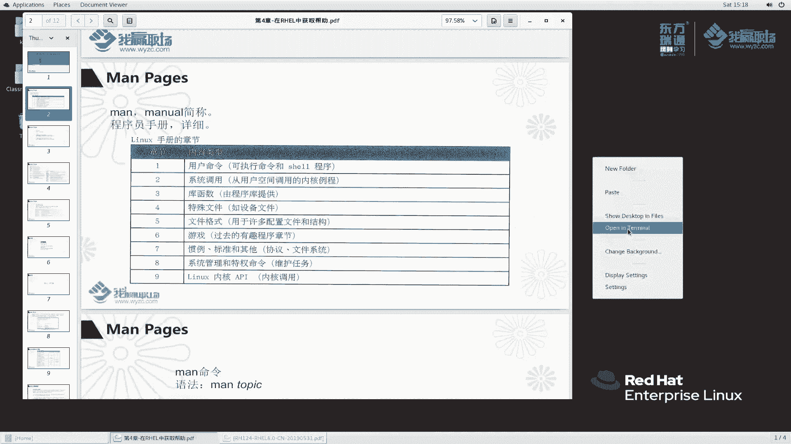

例如说我们来慢一个啊，慢的命令，刚刚help看看怎么用呢。啊，我们刚刚讲过，以前就给大家讲过杠H或者杠杠ha找一下，翻到最上面man选项，我们不提section指的是什么？这个它的一个章节从哪一开始看。

对吧。那么我们来搜一下啊，往下找，看看有没有section能说明。啊，格式的输出对吧？你再往上翻控制格式的输出，然后说这个。找我们的这个配。啊，模式是吧，模式。似乎这里面没提到嘛。没提到啊。😔。

再找一下啊，这个地方是选项，选项后面一个selection。selection应该是由某一个选项来承担啊。那么我来找一下啊。那么我刚刚在这个刚刚help这个说明文档里面找了一下啊。

似乎没找到这么一个部分。哎 sectionction在这是吧说使用冒号风格的这么一个section列表。那么这个地方我给大家解释一下什么意思呢？就是说我们提供一个man page手册啊，一个说明文档。

那这个说明文档肯定分章节，也就是说我加了这个section就意味着我从哪一个章节开始看啊，但是一般来说我们这个选项用的不是太多，好吧，不是太多啊。我们换一种用法啊，换一种写法叫man啊，慢什么呢？慢。

我自己。对吧这个我们刚刚看到这个是代表我们的这个配置。慢后面是代表配景这首慢命令，那么我看自己的行不行呢，也可以呀，慢慢。那么在这个地方，我们刚刚有一个section哎，搜一下啊，section啊。

斜杠注意哈，按的是斜杠之后敲字符回车。那么我们看到这里面有很多的section，其中有一条，它是这么说的，是吧？section是什么呢？section啊说如果你要提供的么？

那么它会将我们的这个慢命令啊去限定在指定的章节当中。说明什么呀？说明我们去看的时候啊，只给你提供特定的章节就可以了啊，是这么一个意思啊，那么我们再往上翻。还是往下翻吧啊。

按这个上下箭头一行一行的翻是按一行一行一行的翻啊。那么这个慢他自己本身呢也给我们提供了一个说明，说对一呀也许很多同学说老师我这弄不懂我记不得，记不得。那我至少我可以在我们的操作系统里面去找到这么一块吧。

好，他这里提到一个说慢一说是一个可执行的这么一个程序，或者说是一个sll命令。那么我们中文翻译过来是什么，是用户命令啊，也就是这个东西。

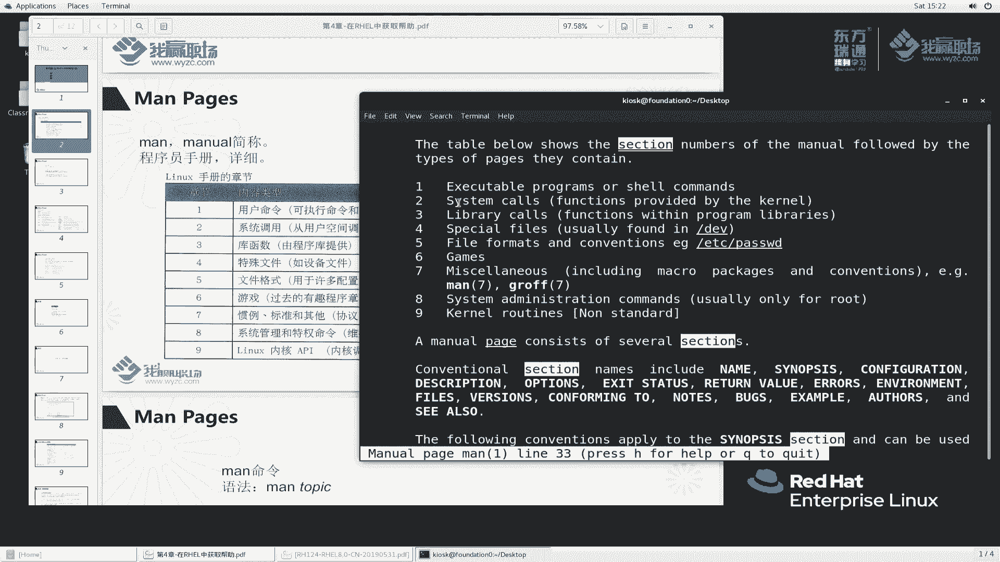

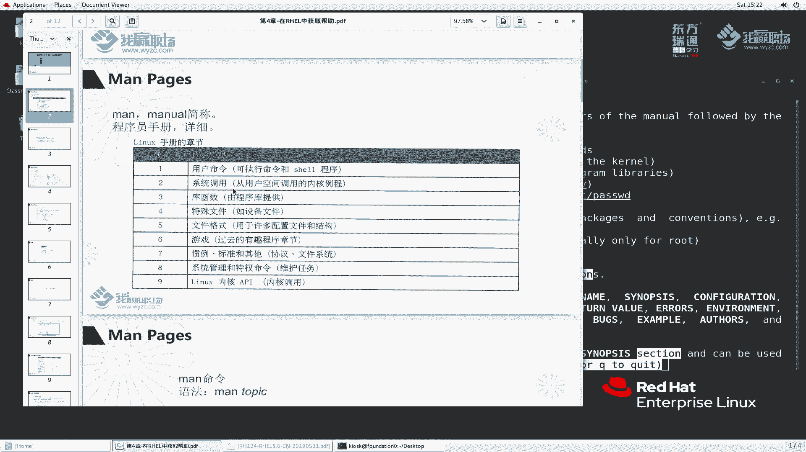

同样呢还有23说ss call系统调用啊，库调用lab cost库函数提供的酷函的。其实这个lab cost指的是我们讲用户的一些程序啊，用户空间的一个应用程序去调用的啊，这是操作系统提供的一些库函数。

由内核调用的这是什么？程序已经调用了。那么特殊文件，还有说文件的格式，例如说这个password这么一个文件games基本上games，还有说第七条这个music什么什么之类，这两者啊基本上都不用啊。

不用系统管理的命令这个会用到啊专门是为root用户使用的普通用户他没权限去做这个系统管理看不到第九个呢说linux内什么的rooting啊内核相关的一个API调用，非标准的，是不是啊？

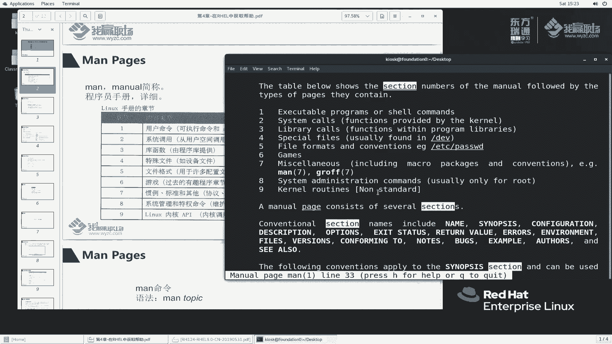

大家暂且记住就可以了。好吧，那么我们再来给大家解释一下啊。

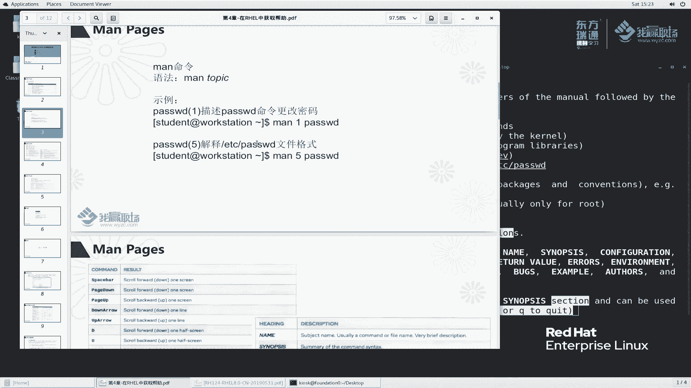

这里面例如说我们刚刚给大家提到一个叫慢什么慢pa嗦的。好，慢pasor的，我回车慢一pass word啊，我们家慢个一。在这个里边，我首先呢给大家解释一下我们这个慢配置的一个操作方法啊。

以及它的一个界面。

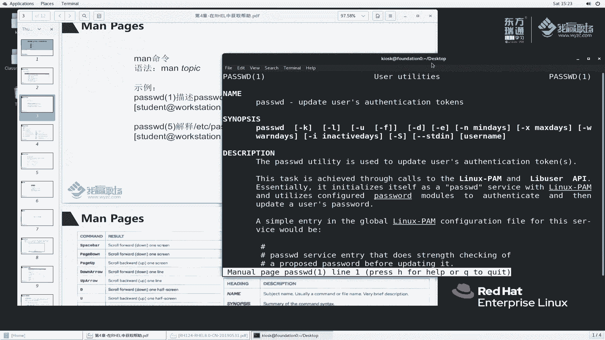

左上角呢是代表你查看的是哪一个配置啊，这个是代表我们的section一个一个section，对吧？然后这是代表什么用户的这么一个什么工具是吧？用户的一个单元啊，那么password是代表密码是吧？啊。

纠正一下，刚刚说这个单词，这个单词指的是用户的一个程序啊，用户的使用程序说白了就是用户工具，好吧。那么再往下看password，这个是什么用的呢？注意这里面我们看到的是一啊，是应用程序。

而且我们刚刚是按了一个叫慢一password，对吧？好，回来再来一次。这个命令是干什么用啊？说是用于更新我们用户的这么一个认证的一个token。什么叫认证的？token？

说白了就是更新我们用户的认证是是通过什么方式啊，通过密码吧，那就是更新我们用户的密码的啊。那么他的一个语法，那password的语法，它这里面支持了这么多选项。啊，这个正确。

那么最后呢我们看一下说有一个user name啊，pasword可以什么针对某一个用户设置密码吧。好，这是语法的一个说明。再往下看description描述信息。描述信息他说明说说这个密码。

他做的这个工具呢是用于更新用户的这么一个token刚刚说过了啊，那么这个工这个任务呢是由通过什么通过调用什么through cost to通过调用模块和b这么1个API来实现的等等等。

反正呢这个说明就在这里面啊一些描述简短的一个描述信息啊，他说简单的 simple说一个简单的条目在我们的配置文件里面的一个简单的条目，对于某个用户，那可能是这么一个样子。

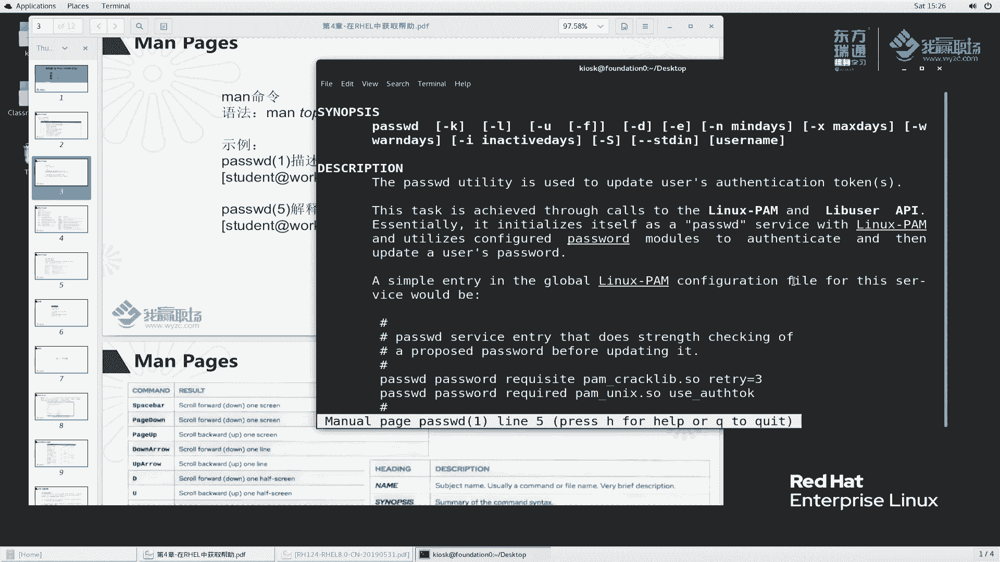

啊，也是一个说明的啊，这个地方呢详细的我们不不说了啊，这里面涉及到pam模块的配置文件，对吧？啊，我们讲以后有机会给大家讲pam模块的时候再来看这个东西。😊。

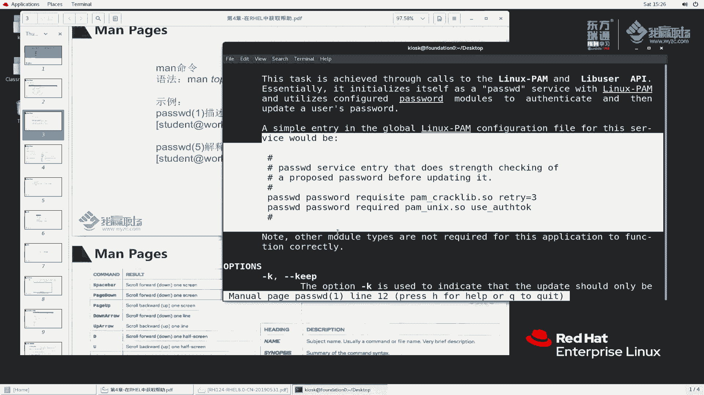

然后这个部分他给我们说的是选项option。那老师你说这个有很多选项，我不知道选项什么意思，那不是给你了吗？杠K啊告诉你杠K或者说杠杠K是同一个意思。那么代表什么呢？

说这个选项是用于表明或者或者指明说指明什么更新，那更新应该只能在对于什么对于过期的这么一个token。😊，是吧 be only for对过期的一个token。这个用户呢希望什么？

如用户希望去保证非过期的token。作为以前。说白了，如果说你用户过期了，那我就更新。如果说这个用户的密码没有过期，那你就不要更新了，就保持成以前的啊，就是这么一个意思。

同样的其他的这个选项也是一样的啊，那么我们再按下往下看，每个选项呢自己去翻啊。当然如果说单词不懂的话，还是啊去自己去查找，好吧。那么再往下翻。说记住以下两个规则啊规则原则说呢要保护你的密码。

说不要把你的密码写到什么，写到这个呃，不要把你的密码写下来啊，你自己记住就行了，是吧？记住一了，这是我们讲的一个国原则。那第二个呢，说你选择一个。比较难猜的这么一个密码，对吧？

你你我们讲sdent刚开始教大家去pasword设置密码的时候，stdent密码就改了一个非比较复杂，很难记。那默认如果你是stdent，像root的密码是read那这个密码就相对好猜了。

那只是在我们的平时练习环境当中，我们这么做方便我们演示。那么大家在生产环境下面去用的时候，那肯定不能这么干了。密码呢尽可能你给他设的复杂一点，对吧？好，然后还有一个你这个程序啊去运行去执行。

那么程序执行完成之后，那么。都有一个叫返回值啊很多同学如果说学过那个开发的，然就知道啊，那么程序退出的时候要有一个退出码。然后呢，我们的开发人员就可以根据你这个程序的退出码去判定你这个程序的执行的情况。

例如说我程序执行成功，那我的退出码是0。如果说我执行出现状况呢啊，状况一代表什么意思啊，状况2又嗯返回码返回码二又代表什么意思等等等啊等等。那么我们password这个程序呢也是一样的。说零啊代表成功。

如果是一呢说这个操作失败了是吧？然后二呢on no on no on no啊，这这么一个意思啊，这个了解一下。还有什么，还有说这里面提到的啊，说什么文件，对吧？

说这个嗯这个文件说linux palm的配置文件，然后什么bug什么s also参考对吧？参考证明一些东西，作者啊，也就是提到证明哎。

还有一说什么叫conform conforming to lease palm模块，这个pm模块是用于linux啊，也就是说给大家提示这么一个东西。好，在这里面呢。

我们给大家简单的过了一下这个pas man page。也就是说嗯一个软件啊提供的一个手册，它大概有哪些选项啊，哪些有哪些章节section啊，name啊，这这这么一个S语法是吧。

ion等等等这么一些东西啊。在这里面，我刚刚给大家用的是上下上下一行一行翻的。其实在这里面还有很多的这个快捷键帮助我们去浏览这个文件。例如说我们按空格键，大家来看一下效果啊。

password现在在这个位置，我按一下空格键。而且此时大家也可以看到一个呢，我们这里面说有一个manu page passwordsword line我光标目前在第几行啊，在在第一行。

也就是在这个位置，然后呢，一共一共194行。我当前这个页面显示了10%。那么可以按H用于帮助或按Q按Q quit。好，我按一个Q，大家看一下效果按Q。那么这个慢配置的文档我们就退出了，又返回我个命令行。

我就可以继续去操作了。好，继续回来。如果说我按个H看一下什么效果呢？H它提示说我们一些帮助的一些命令。

对吧帮助的命说这个刚刚说按小H啊或者大H容易显示这个帮助Q呢或者说冒号Q呢是容易退出什么大Q小Q啊等等等。那么当然我们查看文档呢，还需要一个什么呀？还需要一个移动光标。那光标怎么移动呢？

他说你一行一行的移动，对不对啊，是这么这么字符都是用一行一行移动。那么这个什么啊往往回的一行一行的移动啊，基本上我们什么是往上啊往上上箭头用的习惯一点。当然大家也可以用接合ca是吧，或者ER都是这样啊。

那么在这里面呢，我给大家讲几个常用的啊。

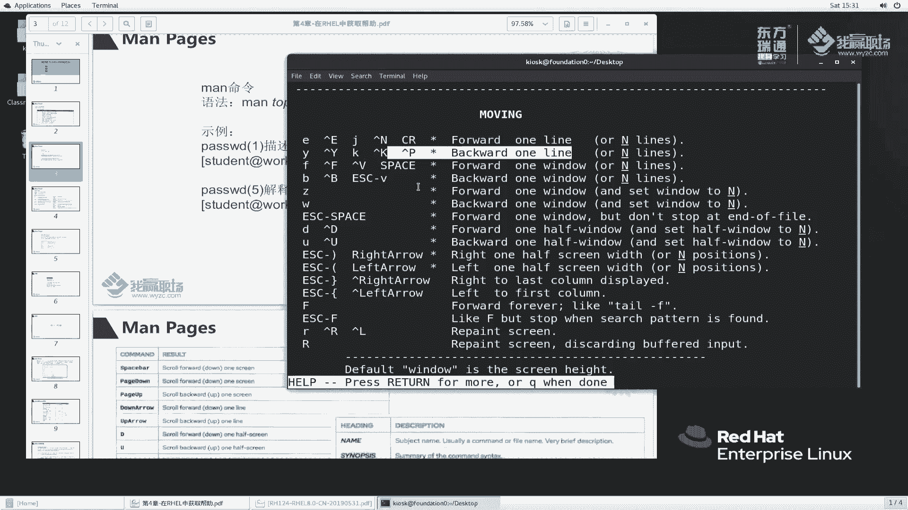

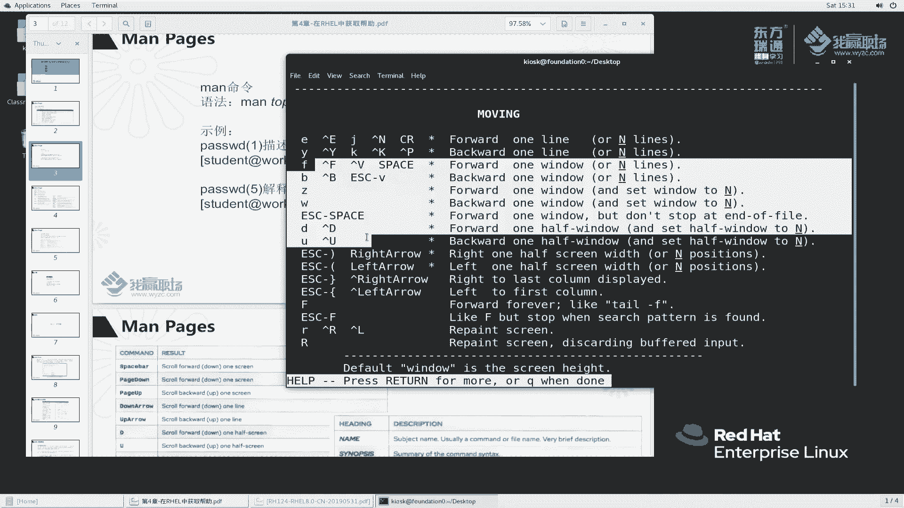

上下上下是用于看这个，那么还有左和右。大家看到我按左的时候，那么是最这个是在左边能看到。如果说啊我按右的时候，大家看我我光标啊，你看我们现在能够看到杠W，我按右一下，大家再来看效果。按右的时候。

它这个位置它后面有一些空白，它都给我们显示了。有时候这个页页面显示的是不完整的啊，那么按需要我们去按右，把右边也全部给我们展示出来。啊，这是我们讲一个小技巧啊。那你这个一一行一行翻呢。

我可以空格就一页一页的翻，也可以空格啊，空格是吧？空格一页一页的翻。那么这个翻的效果呢，可能说呃翻的比较多一点好多一点啊。嗯，同样的，那么空格是往下翻，那么能不能说往上翻呢？那有啊。

这里边有什么p up page up是吧？ page down，这个也可以翻页页一页的翻，这样呢就方便我们去查找文件的内容。例如说前面内容不是我想看的对吧？那么往下翻页页一页去找找我想看的选项。

那这是一种我们需要用的时候会是会这么干这么干啊。

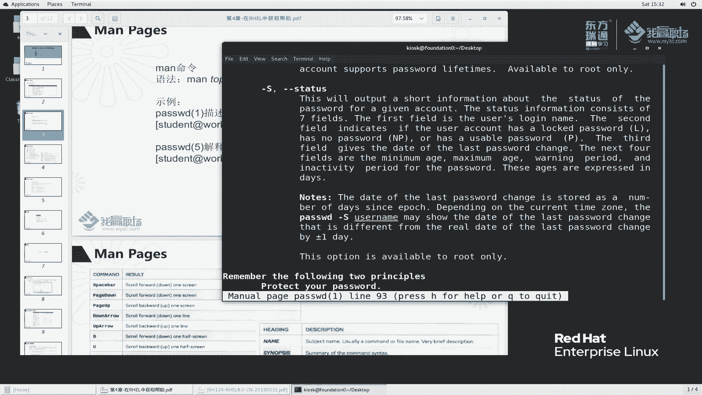

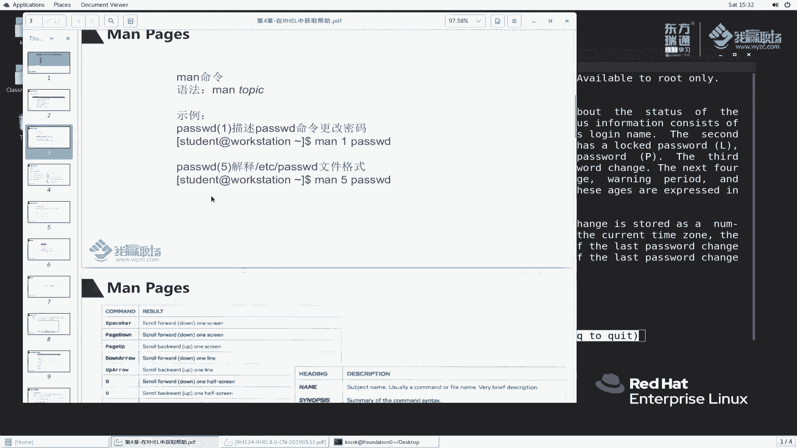

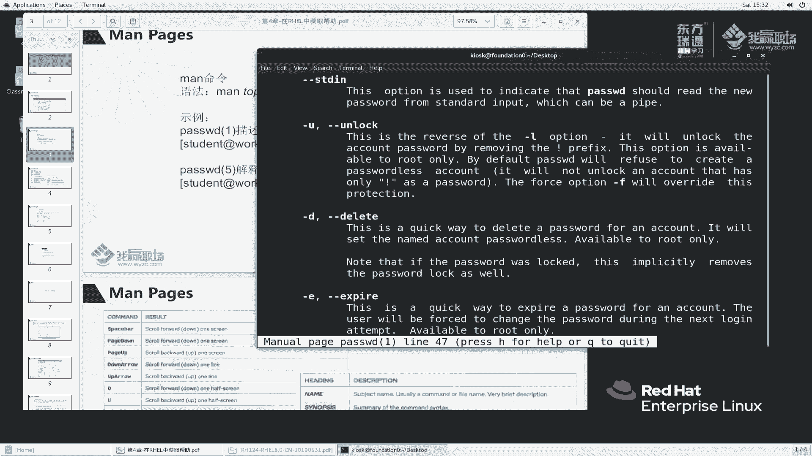

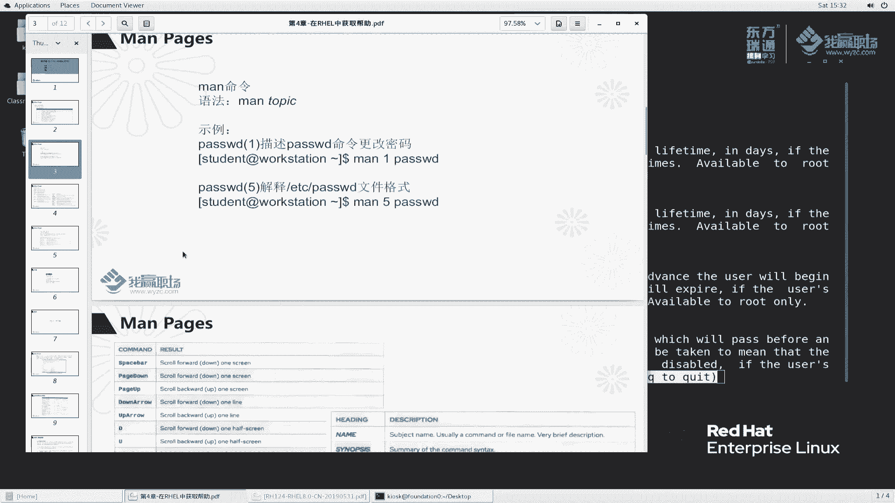

那么除了这个按页翻呢，其实我们还可以我们打个比方，我现在再给大家演示一个啊，我们按一个什么呢？按一个。😊，并。按小B好像没反应吗？哎，没反应就算了啊。那么按这个按钮什么呢？按大G大写的G啊。

也就是光荣的光荣那个G啊大G。他就会看到最后一行。有时候我们查看这个命令是为了干什么？为了看我们最后给我们提供的一些参考Cee also。有可能呢还要看一些example示例啊，那么我们就会跳到最后。

那么有时候呢，我们还要回到行首，小计按两次。此时呢我们就回到杭首看第一行，再去看他的语法。啊，非常的灵活。也就是说我们怎么样在这种不借助。鼠标的情况下去快速的定位到我想看到的信息。好。

到这里面呢基本上给大家讲完了。那么还有一个非常重要的，之前也给大家演示过啊，演示过，就是斜杠斜杠是代表搜索。例如说我这里面搜索一个选项杠L选项。对吧回车。此时大家可以看到，他给我们展示出来第一个杠L。

那么这个杠L是不是我想要找的东西呢？不是不是不是，那我就按一个N按钮，也就是next的首字母N。那么他就会往下找。好，找到这个，发现这个确实是我想要的。

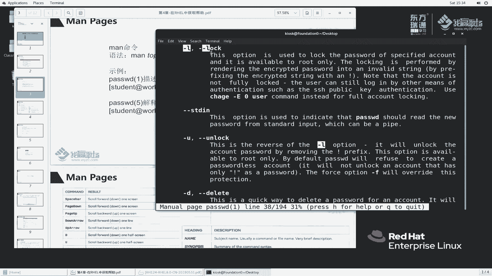

啊，搜索用的是超级多的超级多的，也是最实用的这么一个。啊，那么找到好之后发现呢哎，那确实是有这个。如果不说不是杠要还不是，那么继续按小写的N往下找啊，往下找，一直找到为止。

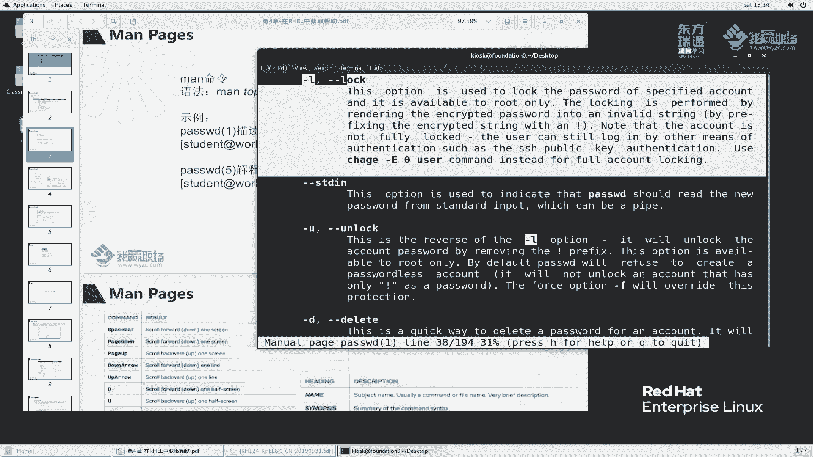

啊，这是讲搜索从上往下的正向查找。那么除了这个正向查找，我们还可以按一个问号问号，我们再去找一下。例如说我找一个use啊，问号use回车。此时呢它就是往上面去查找。好，我们按大家看一下。

我光标目前大概这里面有几个是吧，我按一个小N，你看它怎么翻的啊，小N。哎，到这里面，小恩是吧？往上找，你看一个一个是不是一个一个的，一个一个往上找的，是不是哎，是这么一个意思，叫反向查找。😊，啊。

当然在这里面，我们去无论你是小N还是大N的时候，你看我们现是还是以这个为例啊，查这个我按一个小N，大家看一下效果。好，其实呢它就跳到什么，再往上再往上。😊，啊，就是按照这种方。

我们还可以在这个地面按大写的N，大写的N正好与小写的N相反。好，大写的N与小写的N相反，那就是正向查找。啊，取决你自己啊。在我们这个方向使用这个去查找的时候，小N是正向查找大N是反向查找。

如果说我们通过问号去查找的话，那么问号是代表反向查找。此时你按小N是代表反向，大N呢就是代表正向了。要灵活的去用啊，用了几次，大家呢对这块就会熟悉一些了。

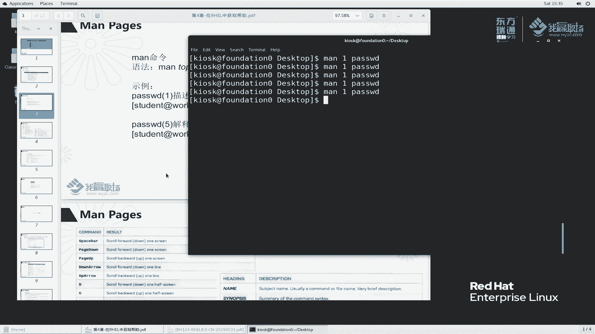

嗯，这是我们讲的这个慢页面的操作。诶，刚刚我慢的是慢一，对吧？那我直接慢pass的看一下效果。

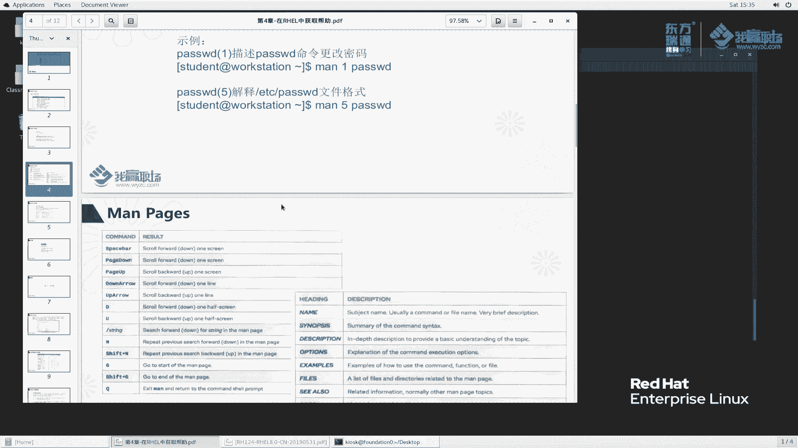

他也给我显示一，对吧？其实我想看的是什么？我想看这个有一个文件，这个文件呢叫ATTC password了。我想看一下这个文件，它的一个语法配置是什么个意思？来看一下曼无pa。嘿，我们说过你这个。

半配置要分类型吗？我想看这个五的类型。哎，大家发现有一个他是代表什么意思啊？他说你这个是password的文件。那这个文描述信息里面指明了说这个文件呢是一个文本文件。

那么用于描述用户登录账户的啊一个操作系统用户登登录账户的这么一个描述文件。那么他应该。有读权限是吧？所有用户呢都有一个读权啊等等等。反正你scribe是用于我们的描述信息啊，还有这么一些信息好吧。

这么一些信息啊，这个我也给大推出了啊，这个我们讲数字怎么用呢？😊，啊，因为同一个字符啊，同一个pasword的这个手册里边有是一类型的普通用户的这个用户执行是程序的。那么还有一个针对它的一个配置文件的。

一定要会用啊会用。

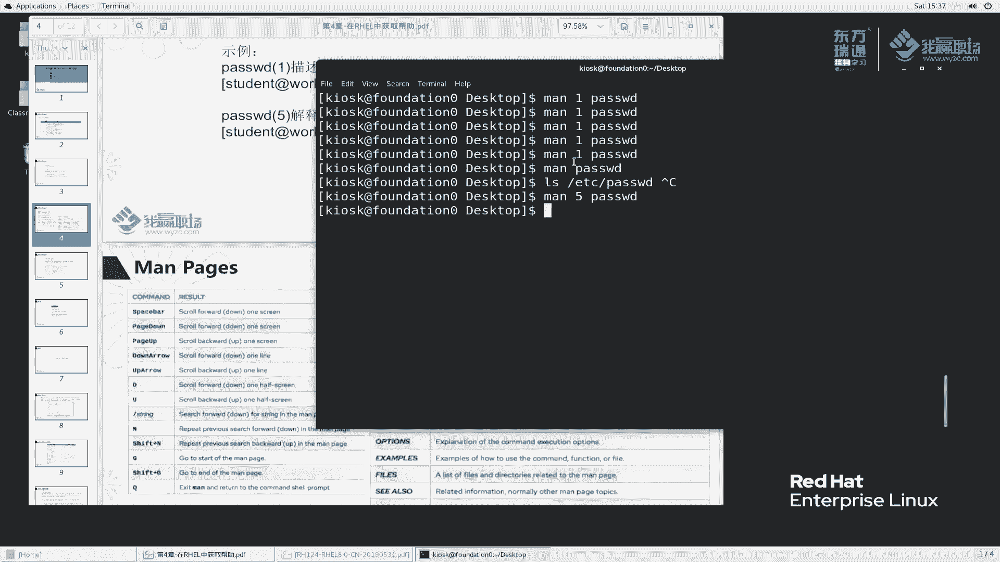

OK那么除了这些之外呢，我们还有一些东西要去给大家讲述一下，就是要做这么一个事情啊。那么我先把我们的机器先给它启动起来啊。

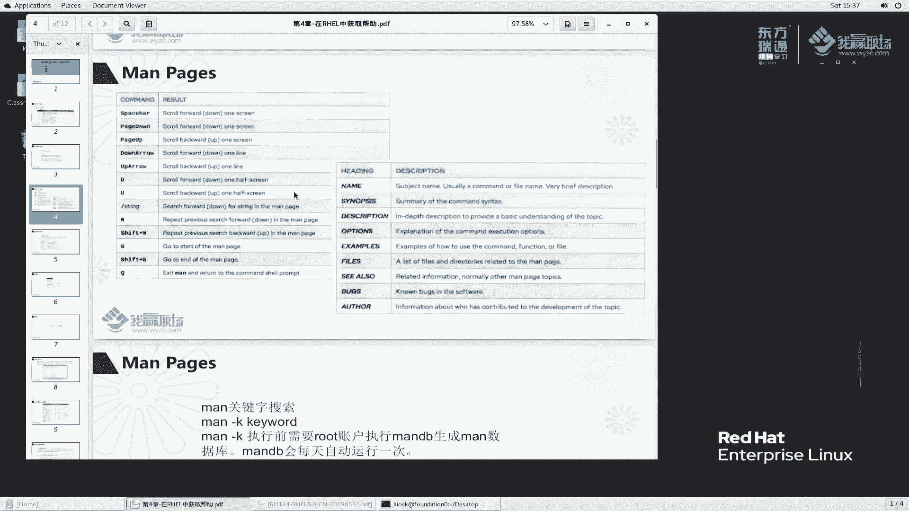

Start。啊，state是吧，state哦。这 is classroom。好，卡拉是我们启动起来了，我们把这个二起一下。那么在这个out的启动过程当中呢，我就以物理机为例吧，也是一样的啊。

首先我要切成root账户。你们呢就用我虚拟机做就行了啊。因为我虚拟机呢没有启动起来。这个物理机的密码暂时不告诉大家啊，后面再大家再说啊，遇到遇需要用到的时候再说啊。那么我们来执行一个命令叫manDB。

这个慢DB是什么意思啊？主要是这么一个作用啊，我们安装了一个软件包，那么这个软件包提供的慢配置文件，它是要放到慢数据库里面去的。也就是放到曼DB数据库里面去。那如果说你不放到慢数据库里面去的话。

那么我们去查的时候是查不到的。怎么什么意思啊，打个比方啊，我们慢杠KHTTPD。😊，好，他现在有是吧？嗯，这样啊，我们去找一个他不存在的。找一个慢VSFTPD。他现在去查啊，是没有这么一个东西啊。

那么我们做这么一个事情啊，我首先把这个软件包安装一下啊，杠YVSFTPD我装这么一个东西吧。好，我装这么一个软件啊。慢 VSFT。这样这个软件包装好之后呢，我用一个命令叫杠K去查什么VSFTPD。

他给我们提示了这么两个啊，看一下啊。然后往上面找一下啊，这个确实是我刚安装的。这个包。嗯，刚安装的，但这个已经存在了啊。这个是我们的服务器啊，我刚刚想装的，不是没有达到我们预期的效果，这样吧啊。

我们换一台机器，好吧，换一台机器啊。😊，看一下我们这个客户端有没有启动，好吧。P works station。啊，通了。啊，稍微也通啊，我们以稍A为例。登上来。那么我去慢杠KVSFTPD。去查一下。

现在是没有的啊，我们yint杠Y。VSFTPD。去装一下我们的软件包。那再来卖一次杠KVSFTPD。提示还没有是吧，我们这样慢DB。去更一下数据库。啊，必须更新数据库啊，你不更新数据库的话。

我肯定这个杠K指的是根据关键字去搜索我们的慢手册，看看我们系统里面到底有哪些慢手册。他说呢增加了这么多，是不是啊，增加这么多。此时我们再来慢杠K看一下。是不是找到了呀？什么意思啊？

如果说你不执行慢DB的话，虽然说你这个慢配置文件已经放到我系统的相关目录里面去了，但是呢你这个数据库没有更新。我通过慢杠K去找的时候，它是其实去数据库里面去匹配的。

并不是到我们真正的文件系统里面去找相关的一个慢配置手册。那我执行man配置的时候，就相当于在我们的数据库里面去更新当前的man配的文档。所以说呢我要执行manDB，然后才能有这么一个东西。

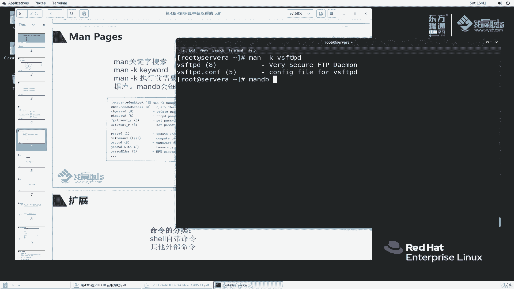

好吧啊，这个这个切记啊，大家一定要执行man地 B啊。那么在这里面需要给大家说明的一点就是什么呢？慢DB啊，这个命令它每天都会运行一次。注意在你系统开机的情况下，它每天会自动运行一次。

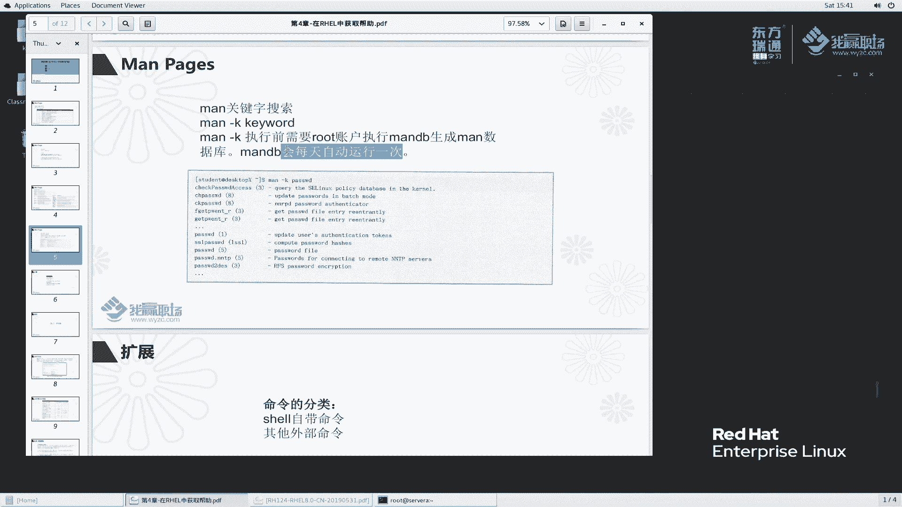

啊，但是我我这个软件我是刚刚装的吧，这个软件刚刚装的，我刚刚执行的这个命令啊，给大家看一下啊。黑队。这个是用于安装软件包的啊，大家站起来，如果搞不清楚，没关系。

反正你就知道我刚刚做了一个安装软件包这么一个动作。安装完成之后，那么这个软件包带的一些man配文件。虽然说在系统里面，但是呢我杠可去查询的时候，它是在慢的数据库里面去查询的，但是数慢数据库没有没有更新。

那么此时我使用这个命令去更新一下数据库。好了，那么我们再来man杠K passport。

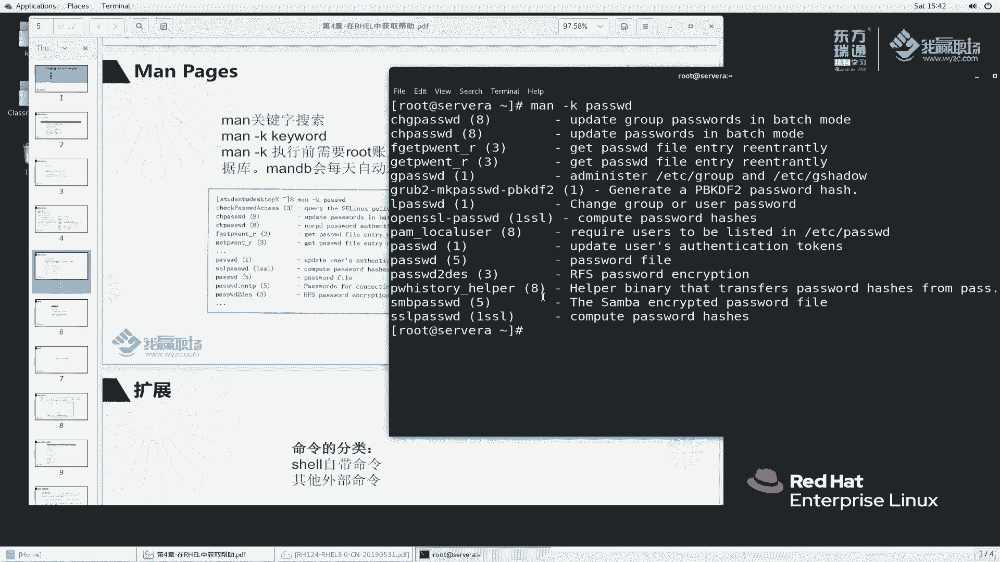

此时大家发现那个是吧，发现我们这个好与pass的相关的好像有很多。

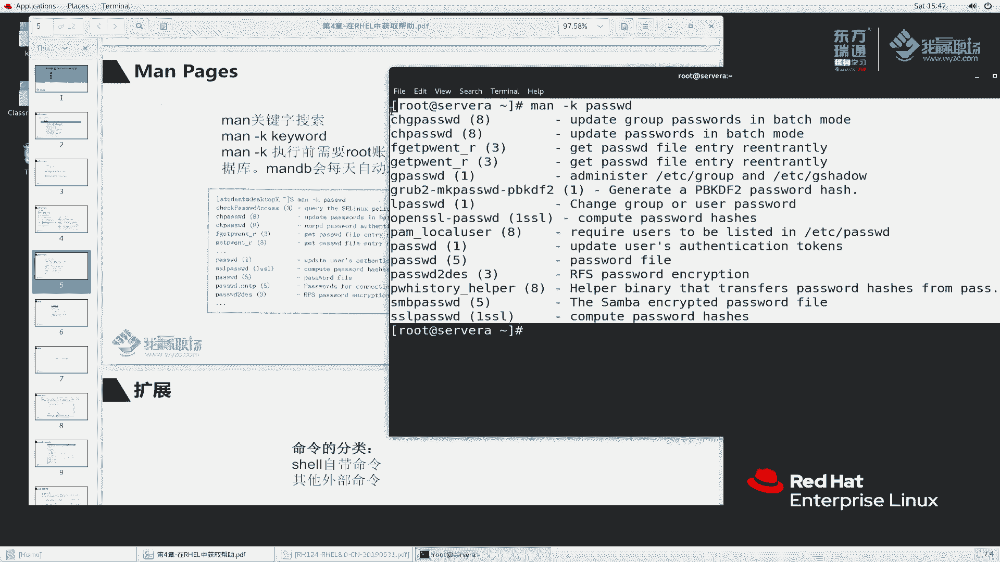

那这个是什么呢？这个又是什么呢？我们再拿一个man passport来看。其实刚刚那个说明好像就是名称和这个。啊，就是password和这个试一下，是是找一下啊，找一下password，哎。

是不是更新这个pasword这个token的呀？password这个5是不是用password文件啊，再来慢5。怕是我的。也就是说，当你执行了这个杠K password的时候。

他会在我们的慢配置这个数据库里面去找数据库里面哪些找。第一，这个这个半配置里面这个名称里面有没有？第二，这个他的这个说明里面有没有如果有就给我们显示，如果没有，那就不显示。啊。

这个杠K呀大家一定要会用啊，而且要经常用啊，以后呢，我也会给大家经常去演示啊。

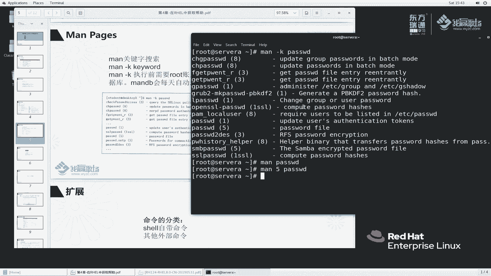

好，慢DB啊。

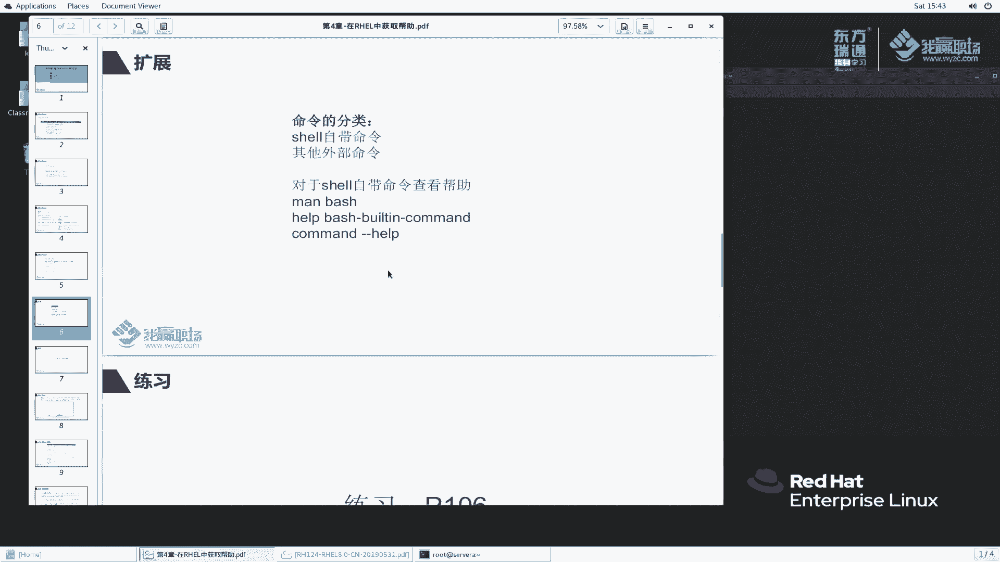

那么我们再给大家去扩展一下啊。需要说明一点啊，慢是用于查找查找操作系统面安装的软件包，给我们提供的这么一些慢配置手册。如果说如果说安装的这个软件包里边没有这么一个man配置文档呢。

其实呢曼配9我们可以深入的给大家讲一下LS。或者说大家刚刚来看那个命令啊，manDB。所以大家来看一下，这个有一个目录啊，叫USR晒曼好，那么我们到这里边来。现麦CD进来L。

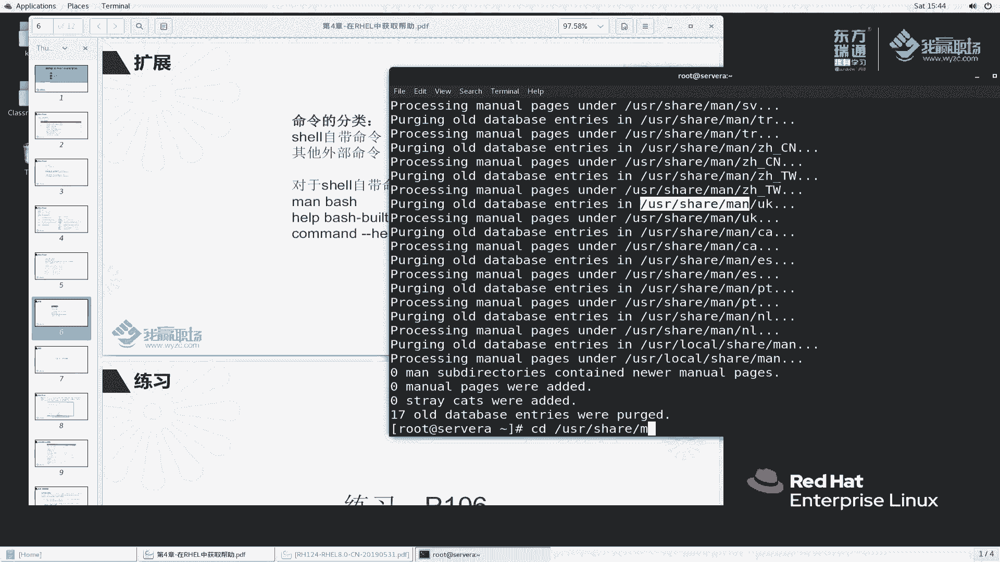

大家此时会发现这里面有什么慢一慢二是吧啊，慢三慢四等等等。说明什么呀？说明我们这些软件包你安装完成之后啊，都会把自己的相关的慢手册放到我们对应的目录里面去。这个是由开发人员来做的。

那么所以才是我们执行办DB的时候，那么这个数据库会就会从这里面去检索啊，去去检索，生成这么一些慢配慢配置文档给我们去用。好吧。那如果说这个软件包里面不没有这个慢手册，我们怎么办呢？正常情况都有啊。

正常都有。但是有一个问题啊，这个慢的文档好像有点有点繁琐，太长了是吧？太冗余了。那么我为了只是看这个命令password这个命令的简写的方法，杠H。是不是啊我经常给大家演示叫刚刚help，对吧？

刚刚help就看他的简单的这么一个usC以及它的选项。我就看这个啊，其他不用看。所以说呢我们也可以通过刚刚ha去看。啊，当然有些命令是支持一个杠H的。因为我们经常看到有一个杠H，有时候还有杠杠help。

他们这两者啊当然取决于你这个命令了。那对于我们这个password的命令，它只支持杠杠have杠H不支持。那有的命令是支持杠H啊支持杠H的。那么我们来找一下啊，例如说我们找一个命令叫dta。DAT。

date里面有个杠H试一下。哎，date杠Hd也不支持杠H是吧？那么LV这个命令呢，L we create。干啥去。好，这个命令好像支持港安区吧。往上翻。比较长是吧？哇塞，真的比较长。这样啊。

我给大家这样翻一下啊，那么这样来看。这次就有很明显的分界线给他分隔开了。哇，这么长呀。

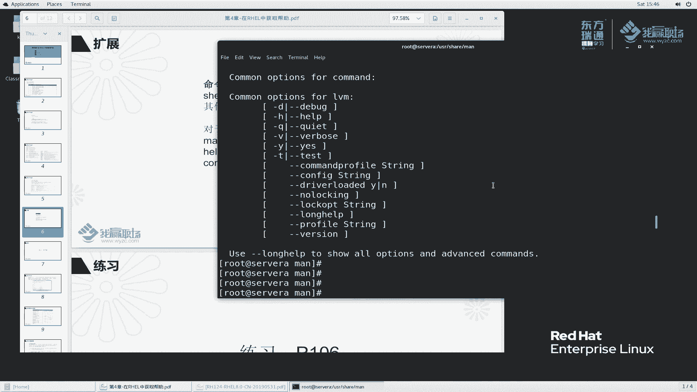

好，到这里面来有一个杠H选项啊，杠杠杠help杠H根据自己的需要去加啊需要加啊。

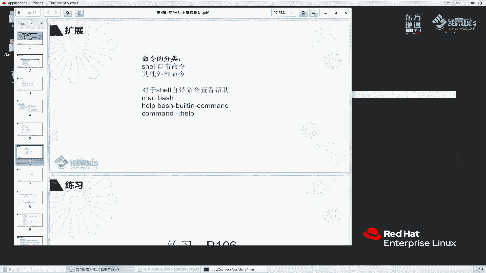

那么在这里面我还要说明一点，LV create这个命令。是我们外部命令。所谓的外部命令是指的与我们的sll相对的。啊，什么叫赡命令啊？例如说我们以前执行的命令啊，打个比方。History。

history是历史命令。这个历史命令是我们单独的软件包给我们提供的呢，不是。它是sll程序里面啊，它是sll里边自带的一个工具。sll是整个程序啊，它里面自带的一些好小命令啊。

那么我们如果说想对这个man historyory去查看的话，那么。

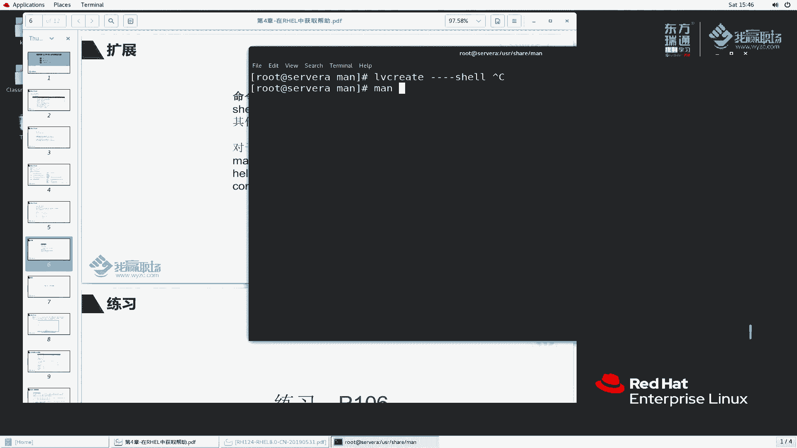

来找一下。当我执行慢history，他给我变成什么了，盘到这里面来了。那这个地方有没有写说是history这个命令啊，没有吧，那他说明是什么？说他这个是bes的自带的内建的这么一个命令。好。

我们来搜一下history。斜杠松啊，这个也是慢配置啊，只不过呢它是它是什么是通用什么comd menu啊。来回车。找到了。找到了这个好像只是给我们列出来说你这个。bs这个内建的命令行有哪些，对吧？

给我们列了，他也说明啊bs是一个命令，对吧？然后呢，中间证券使用逗号隔开冒号也是由特殊含义点特殊含义，对吧？封号特殊含义alas都是特殊。像这里面以逗号风格的这些命令呢都是属于bash自带的命令。好。

我们再按个N去下一步去找。好，找到在这个位置再看嗯哎找多找找，我们要找的是什么呢？哎，其实我要想找的是给大家找的是这个东西。

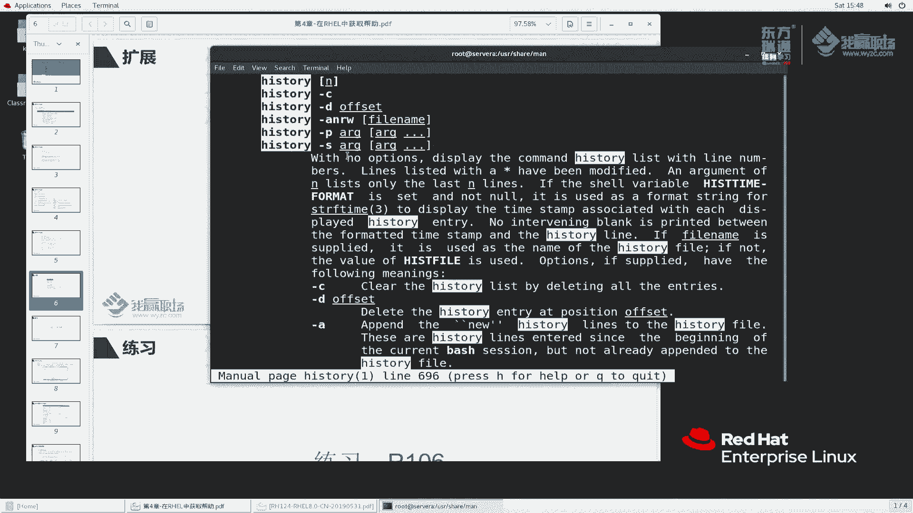

history他的命令啊他的命令主要是在这块。

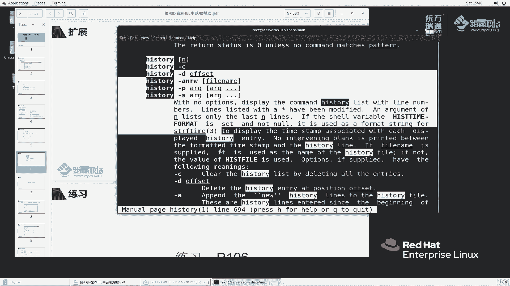

我们是怎么做的？我们是通过曼 historyory去找出来的。那这个地方好像看的找了半天才找到，而且要搜索，那能不能说有一个比较快捷的呢？help his，看看行不行。哎，王少翻。

help history给我们显示的就比较好吧。是不是啊我只显示了黑队。啊，那么这个对于shall自带的这个命令，那么我们使用help去看啊，这个一定要注意啊，manbsh是属于内外部的命令啊。

help呢是属于besh里边自带的某一个命令。那么有对于一些外部的命令呢，我们可以使用杠H或者杠杠help。

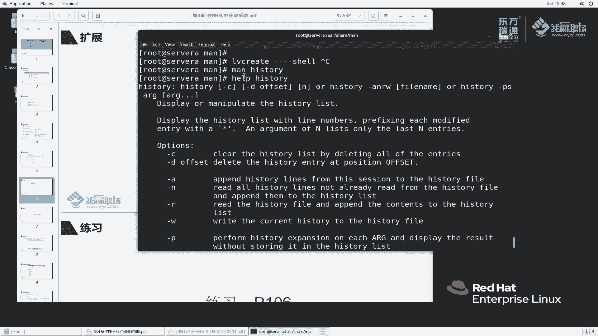

去查看。好的啊，那到这里呢，我就给大家讲了一个慢配置的手册的使用啊，注意这里面慢DB要自己去更新啊，否则每天让它自己更新太慢了。那么又给大家扩展了这里面讲到的叫两类的命令。

一个是shall内部自带的命令啊，一个是呢与与他相对的，是由其他的软件包提供的这么一个命令。啊，当然了，你说你作为开发人员，除反正除了晒有自带里面，其他都是属于外部命令啊，外部命令三种查看方法。OK啊。

我们暂时给大家讲到这啊。😊。

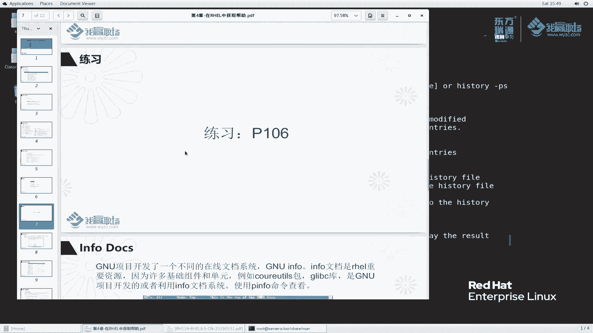