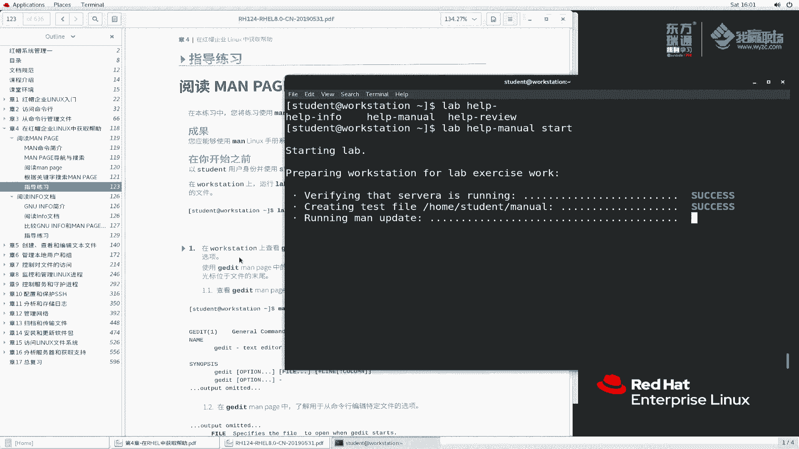
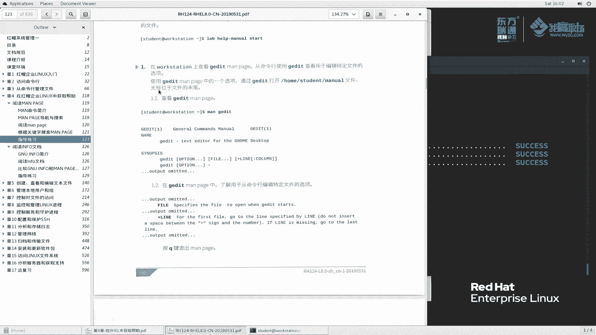
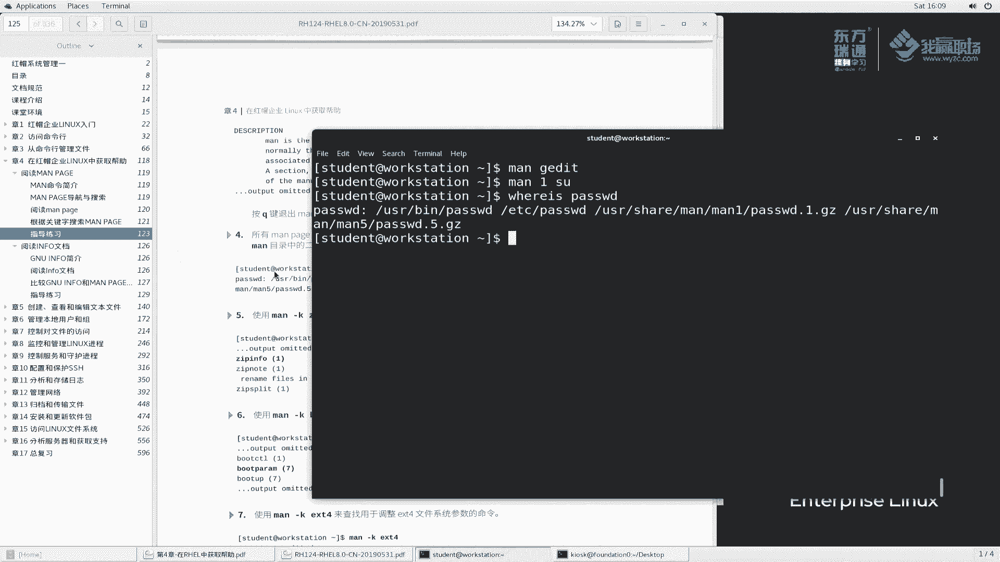

# 红帽RHCE8红帽认证RH124认证课程【全】 - P15：04-1-man手册-练习指导 - 北京东方瑞通 - BV1KM4y1M71q

好，刚刚我们给大家讲了一下这个man page的帮助文档。那么我再给大家来讲一下这个man page的指导练习啊。因为大家首次去看这个文档哈，好像没有说鼠标去帮助我们去看的，浏览起来特别的繁琐。

那么这个练习呢，我也花几分钟的时间给大家一起来过一下啊，来体验一下这个man page到底怎么用。呃，打开你的PDF文档到123页。那在这一页里面呢，我们可以看到说在你开始之前呢啊。

我们要以这个身份student用户呢要登录到worktation上面来。那么我们登录过来。

SSH student。大家养成一个习惯啊，就是我们还是以这个远程方式来登录上来worktation。

ctrolL清个屏。那在这个界面呢，我们说首先要执行一个命令啊，去创他会创建一个menu这么一个文件来，我们执行一下。

Lb。help什么。help里面一个menu，然后它执行的是start。呃验证soA是否运行，那么创建文档，然后执行慢的更新，对吧？哎，刚刚我给大家演示的时候，是是自己手动执行manD币了吧。

那这个地方呢，他他他再来执行一次manDB。等他执行完成，我们再进行下一步。

那么我们首先看这个题目吧。在work station上查看这个G editit man page。那从命令行里面使用啊，ge edit查看编辑特定文件查看用于编辑特定文件的选项什么意思呢？

我我我我要编辑特定文件，那使用哪一个选项是这个意思，对吧？那么使用G艾 man一个选项通过G艾打开这个文件是光标位于文件的尾部。那么哎我们来看一下到底怎么去做这个事情啊。

首先呢我们慢G editit。啊，这里面给我们提示的对吧？那么在这里面我们去找是，例如说他是要看文件的尾部呃，文件的尾部是不是说有关键词，我首先按个斜杠搜一个按的，我最喜欢按斜杠去搜啊，回去。

好像没收到是吧。没收到的话，那么还是老实一点，一个一个往下翻吧。它是一个什么，我们看一下，说是一个官方的这么一个文本编辑器，对吧？然后目标什么什么simple为了目它的目标是为了我们简化跟他使用啊。

那么是一个超那什么功能非常强大的这么一个通用的编辑器，对吧？然后去嗯。它的一个是吧，它的功能是一个弹性的一个什么什么一个pgging是吧，这么一个插件的么一个系统。那可用于动态的和去增加一些高级功能啊。

也就是说它是一个弹性的一个可插可也是可可增加插件的这么一个编辑软件。好，我们再往下找啊，反正你一直往下找，一直往下总是能够找到的。呃，大概是在哪一行呢？那么我们来看一下这个啊。这个说对于第一行，你。

对于这个forst文件，对于第一个文件啊，说首先呢你会默认呢是根据这个行，根据这个行去定位文件的这个行数，对吧？啊后加上加号啊，说如果你这个行呢没有加，那么它就会变成最后一行，那是不是这样子呢？

验证一下。

首先我们还是呃ge edit啊G edit，然后我们加上一个加上一个，我们什么都不加，好吧，G艾ETC host。打开了吧，光标是在这个位置吧。好，我们给它加一个啊，GI的加几呢加2。

看一下光标在哪儿，是不是变在变成了这个位置。啊，刚刚我点了一下，在这个位置啊，那么我光标，然后加后面不加这个数字。

大家看一下光标在哪，是不是变成这个行，最后一行了。所以说呢我们要仔细去查。但是我刚刚查案没查到，结果他是使用last line这么一个意思。那么此时呢，我们就查到了这个它的用法。

同样的我们再往上炒啊。说在这个man配当中啊，这个了解用于命令行编辑特定文件的选项啊。好，文件是吧，文件是指定这么一个文件，打开哪一个文件，那么往上翻。

那么这个fi说指定这个文件去open，你要指定这个文件名是用于打开的啊。当我这个GI启动的时候，要指定文件名去打开。那么首先回到我们最前前面啊，这里面说有一个fi对吧？fi点点点，你可以打开多个嘛。

也可以打开一个，然后呢加上这个行选项呢可以放在前面也可以放在后面，啊，还可以冒号是不是冒号col？这一行的哪一列，哎，有意思，我们再来试一下。

是不是这样子呢？我们加一个2看一下效果，二是在这个位置。那么我们再加一个2冒号，中间是冒号，对吧？2冒号，我们加一个5吧。

看一下效果。哎冒号5光标是不是在第五个？

12345好，在第五个位置第五列。啊，所以说这个它的一个使用方法还是非常明确的啊。只不过呢我们有对于我们初学者来说去找的时候，可能或确实有点繁琐一点，好吧，繁琐一点啊。

按Q退出文档啊，那么再往下看啊。这个阅读SU这个man page。来看一下，说如请注意，如果省略了用户s命令，假定是root用户。如果s命令跟一个短划线将启动一个子sell程序，不使用短划线。

则会创建与用户当年环境匹配的分飞登录式的sell。好，这个地方大家读的会会有点懵啊。那么我们来看man配景啊，我们的目的是为了查找这一段说明啊。

那么我们来卖SU。它这个地方让我们秀一的，所以我们加个一啊一。

这里面是让我们让我们攒们哪个机器啊，student workstation上面吧啊卖一。

去找啊找他是里面说有一个秀会假定是root，找吧。呃，s用户去执行命令为一个用户。当我们调用的时候，你看这里面说了啊，当这个命令被调用的时候，哎，不具有任何参数。

那么s它默认是只运行一个什么运行一个交互式的sell引入的身份，好，查到了，就是这么一个意思，对吧？这么一个意思啊，那么再往下找啊，我们说里面右体跟我们让我们去找一个说这个带中横杠短划线的，它将启动。

如果不带短划线的呢，那么往下面来翻一翻。

好，这里面有一个杠C是吧，A杠L唉，在这里面有了。明了哈。说将会启动一个sll作为一个登录的s，哎，不具有一个环境变量。啊，不仅有个环境变量啊，带中横杠的时候，带中横杠的时候，它会启动一个sll。

那么这个登录shall呢会具有一个环境变量，与下面的一个环境变量相同也就是说啊我们这里面提到的，如果你带中横杠的话，那么它就会使用一个全新的环境变量啊，如果不使用的话。

那么当然它就会继承我当前的这么一个环境变量啊，就是这么一个意思啊，当然什么叫登录式shall和非登录式shall呢？哎，这个要在我们后面再给大家讲啊。

反正呢大家是通过我们这个man配确实找到了这么一段话就可以了。

好，这是第二个给大家讲完了啊，同样的按Q退出。OK我们再来看一下。😊，他说所有的man配置呢都位于这个USMM确实是这样，我刚刚给大家也演示过什么？

可以使用VIE命令查找位于这个目录当中二进制文件源代码和man配。啊，什么意思啊？来找一下啊。😊，首先where is password来找一下where is password。

这个VIis我之前没有给大家提过啊，VIis它也是用于查找这个字符串。它查找出来的结果是什么呢？首先给我们查找到一个password命令，对吧？查找一个password文件。

还有查找password一password5咦大家发现了。一是对应这个吧。那么pas所的配置文件是是不是对应这个？这是他们的曼配集对应的真实的文件，是曼配的原文件。哎。

这个呢是与曼配集相关联的这么一个文件。

好，他是这么一个是吧？说使用VIE命令呢，查找位于这个目录中当目录中的二进制文件，语言代码和man page啊，这是man page，这是我们的二进程序，这是我们讲的一个配置文件，有这么一意思啊。

VI意我们正常情况用的不是太多啊。

再接着查。man杠K zip用来列出zip存档的相关信息。man杠K。

你这吧。只要你这个命令和这个位置，它的说明包含了zip，那么它就会都给列出来。man杠Kbo也是一样的吧。man杠KEXT4也是一样的吧啊。啊，但是有一点要注意的哈。

我们这个zip是查找这个zip相关的。那么刚keybo boat在这面找一下，有这个位置，有这个位置。EXT4呢，他就是这个位置没有了吧。好，此时EXG我们看说使用曼杠KEX来查找。

用于调整EXG文件系统的参数来看一下。

其实我我们这个题目的意思就是大家根据根据你这个关键字来查找。就是说我现在这个EXT文件系统啊，它这个地方怎么调整的呢？那么它这个里面相应的文件描述性里面应该会有那找找找找找找啊，我们找一下A。

找到了说用于调整这么一个文件系统的参数，针对这几个文件系统是容于调整的。好，找到是这个工具。那么此时我们就可以慢它了去查看的，对不对。漫霸找出来了。调整文件系统，那并不是普通用户就有这就有这个权限嘛。

所以说我们讲这个八是代表什么系统管理员的一些手册啊手册。

好，万配景呢我们就给大家简单的讲到这里面了。那么这个实验做完成之后呢，我们要执行一个脚板，对它做一个简单的清理来执行一下。

Lab help。

杠什么的杠manu，然后。他的叫fin尼ish。

Finish。完成。好，那么这个实验呢我们就完成了。

好的，这个练习呢我就给大家讲到这里面。下一节课呢我们给大家讲infer文档。

