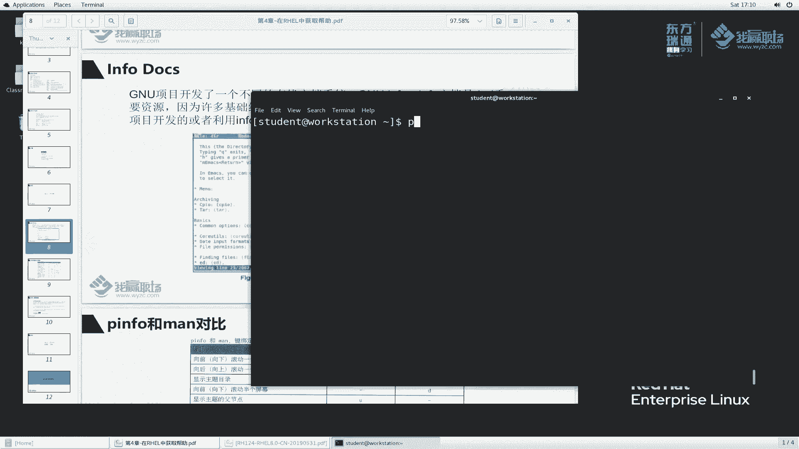
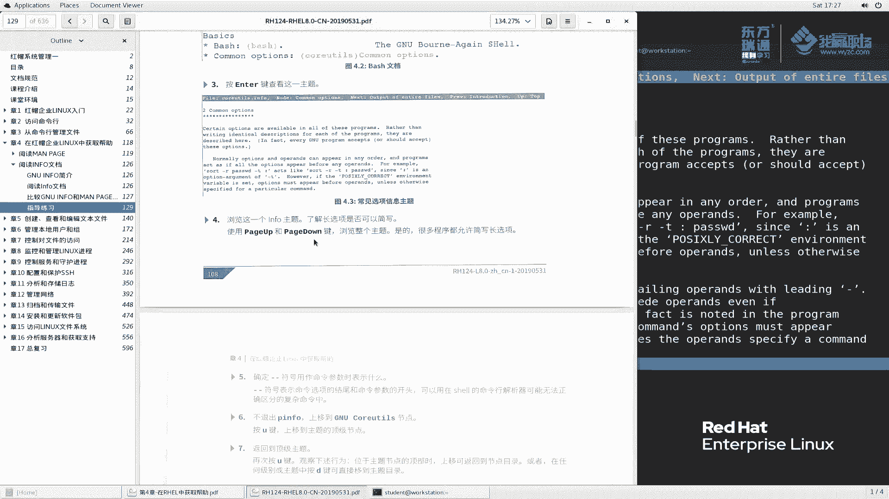
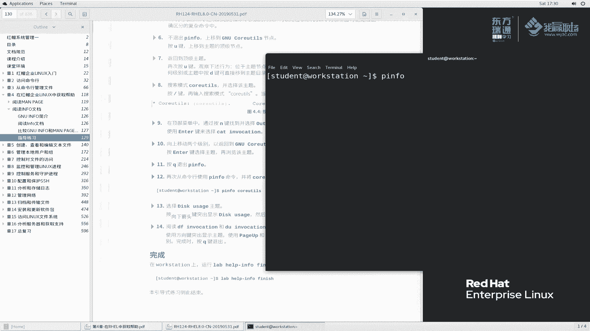

# 红帽RHCE8红帽认证RH124认证课程【全】 - P16：04-2-pinfo和usr_share_doc文档 - 北京东方瑞通 - BV1KM4y1M71q

同学们好，欢迎来到我赢职场HHC8课堂，我是马老师。那么上一节课呢，我们给大家讲了man配。这节课呢我们再给大家讲一讲，就是infer do。其实在linkux里边有很多一些软件啊。

它是遵循GPL协议的。那么既然遵循着这种开源的GPL协议，那么GNU项目啊，它会针对这种啊这一类的软件呢，它会开发一个在线的文档系统。那么这个文档系统呢，我们称之为GNU英er。

那英火文档呢在HEL当中啊占的比例还是比较大的啊，例如说。那么这里面叫call units啊，这个地方写错了，多了个U啊，ca units啊G left啊都是兼用项目开发的这种文档库啊。

那么对于这一类文档呢，我们使用P音或命令来查看。

那么我们来简单给大家看一看啊。拼音fer。嗯，还是在这个work stationation上，其实哪一个机象都是一样的啊，P infer。

大家可以看到这里边啊，给我们展示的是什么一个东西呢啊，你看啊最顶层说是什么目录，对吧？也就是我们现在所处的目是目录top呢是在属于最顶层，大家可以理解为是这样子啊。那么我们的。

P in呢它也是用于查看一个手册的，它跟慢派景类似啊。嗯，因符命令，例如说我们给它比成一个数，这是最顶层的啊，这是下面分支那分支分支。那么某一个分支下面呢，还可能有一些更具体的分支。

例如说哎它里面有很多一个分支。那么这个分支下面还有可能很多分支，就像我们常规的是个数形一样的结构。好。那么或者说可以类似于可以类比什么，类似于我们这里边啊，我之前给大家看的这个文档也是一样，对吧？好。

这是数结构，这个章节里边有哪一个部分，哪一个部分下面还有子项目，就是这么一个意思好，那么我们接着看。

在这里面呢，我们首先看第一个项目里面的第一个。他给我们提供的叫CPIO归道相关的。你看这是A开头的吧，这是我们的菜单。A开头叫归档，什么B开头basical。在这里面啊，我们通过上下键去浏览。

还是上和下啊，大家看到了哈，我每按一个这个光标，就是这个地方这个地方被我们点亮的这个地方，我们称之为什么？称之为infer，或者说可以跳动的这么一个链接。

好，我们在这个地方我们可以按一个回车，大家来看一下效果，call un回车。那么此时我们就进入到了这个call units点 info这么一个文档里面去查看它了。那么关于这个地方呢。

它又给我们下分了几个小小小的部分，对吧？说哎，第一个是介绍，第二个是com option，那么等等等这么一些，我们当然还可以具体看某一个章节，例如说我们再去选中一个direct listen回车。

那关于这个呢，他又给我们展示出来了，大概他呢是这么一个方式组织的。哎，与我们的man配置对比一下，大家知道啊，man配是完完整整的全部显示在一页上面的。哎。

这个地方呢就像我们之前讲的一个网络上面一个超网站上面超链接一样，点一下进到一个子项目，点一下进到一个子项目。那么最后它才最到最最底层，它才给我们展示它具体的好，它通过这种竖屏结果给我们组织。

那么在info里边呢，它这里边啊还有很多些操作按钮，我们可以呢把它与曼佩吉对比一下。M景呢跟它操作这个差别呢还是比较大的啊，因为它这里面通过这种链接的方式给进入到子项目。哎。

我们man配景呢全部显示在一页，所以看起来呢会呃大家有点区别啊，有点区别。那么我们来看一看，刚刚我给大家演示是上下和回撤。那么如果说我想退回到上一层呢？那就像我们讲这个目录，我现在在当前这个位置。

那退回到上一目录，我们点这个就可以了，是不是啊？那么在这里边我如何返回到上一级目录呢。

是不是呢嗯。那么我们来看一下他的说明啊。说这里面呢滚动屏幕的时候是什么？后右边是慢配置啊，左面是拼音火。那么滚动屏幕是配置2配置档，这个没什么变化。显示主题目录。

哎，我们来看一下，当前我们是call in，我们按一个D，大家看一下下果按个D。此时就变成什么了，变成我这个上一季了吧，返回到上一季啊这么一个目录啊目录哎是显示主目录呢。

还是他说啊他说又是上刚刚我说错了，要纠正一下D是返回到最顶层。那U呢是返回上一层来我们继续啊，比如说我们以CPIO为例，我进一次CPIO那么在CPI里边呢我再去进一次啊，这个地方3。

1给我们显示了这么一个文档归档的是吧？CPIO这么一个工具，那这个地方呢如果我按D的话，那么他就直接回滚到我们最顶层的拼音那个文档了。如果说我们按一个U的话，那么它返回的是什么呀？

大家来看返回的是CPIO吧。

好，我们如果说回来，我们按一个D，它返回到什么？返回到最顶层了。

就是这么一个意思啊。那么说这个向下滚动半个屏幕，中横杠，其实这个我们用的比较少啊，我们最关心的就是呃这个链接节点啊节点啊，那么大家也可以根据就像我们慢配置里面的那个半屏半屏滚可能用的不是太多。

我们更多的是用搜索查找啊多一些。

显示主题的顶部上部啊，那么这个地方显示什么呀？哎，是我们讲的一个主页啊，主页啊嗯其实这个用的也不多，好吧，也不多啊。那么再往看向后或向上滚动半屏，这里边是没有中横杠指的是没有这么一个按钮，好吧。

纵横杠是没有这个按钮的意思啊，大家不要说我去按一个这个中横杠啊，不是这个意思。显示滚动到下一个超连件啊，向上是上一个超连件啊，这么一个意思。回车打开光标的这个我们说过了是吧？

那么搜索模式也是斜杠搜索来搜一下，例如说我们就搜一个搜一个什么呢？搜一个我们讲这个Z，看一下行不行。

好，他这边给我们搜到了这么一个zip，再往再按一个，我们按一个N，看看能不能搜按一个N。

🎼好像没反应吧，再上手啊，zip啊再来zip它是自己每次都要自己去敲啊。所以说这个要想继续搜索的话，那就比较麻烦啊。哎，我们这个man配置里面，你直接按个N就可以了。好吧，直接按个N啊。

那这个地方说是可怎么样，说斜杠逗号是吧？斜杠逗号啊，做这么一个事情啊。

P是返回上一个节点。啊，这个地方也给大家说明一点啊，这个P到底什么意思啊？这样我们先回到最顶层啊，按个G还不好使了是吧，退出。现在我所在的位置是他这个选项，我按一个P啊，回车回车之后。

我们按一个P看一下啊。哎，我们按一个P，好像有没有反应啊？啊，回回退出来吧，再来一次啊。我现在是在踏这个位置，我按了个回车，然后我按一个P，大家看一下这个位置的有没有变化哈，按个P。

哎，好像没变化吗？哎，我在我印象当中，他应该会显示我们上一个章节的，显示主题中的上一个上一节点啊。那么看样子应该不是这么操作啊，我们再给大家演示一下，我们到这个塔里边来。

它里边呢我们到这个mer里边来，好吧，Med的上一个是form mate，下一个是relaable回车。再来看一下我们的P好吧，P，大家看一下是不是变成了formate了。对吧下一个是卖点了吧。哎。

我们刚刚是在哪一个？这样我们返回到上一个词啊，按个U返回来。再来看一下，刚刚我们是针对是这个medy。那么我进去麦点之后按了一个P，它返回了我们的formit好，按一个P，此时变成了formit好。

是这么一个变化啊，是我们在我们这个t里边的一个上一个章节。

好，当然Q退出。啊，这个大家也仅供参考吧。其实在我们整个使用过程当中啊，这个反正至少对于我来说，我很少使用拼音符去看大家自己也根据自己需要，好吧，偶尔呢可能会用一下啊。好，拼音活呢就给大家讲到这啊。

我们再来看一下其他的。除了man page，还有P infer。那么在我们系统安装的过程当中啊，软件包啊，还还会在USR shy当中去存放相关的这么一个说明文档。

那么我们到这个目录下面去找一找USR shy do啊，在这个地方我们去L。

好多是吧好多，哎，大家可以看到啊，这是关于XORG1的啊这么一个init，还有这个我记得我之前刚刚好在这里装了1个VSFTPT呢。没有是吧，DHCP呢。DHCP里边有一个cl。看一下。诶。嗯。

CD啊DHCP client啊。那么到这里边呢，大家可以看到这里边似乎给我们提供了一个什么呢？这样看清楚一点啊。DHCDHcl6点com。什么意思啊？

点 example点 example大家都知道是示例的意思。也就是说，对于我们这个客户端的软件啊，他给我们提供了这么一个示例文件。

嗯，视例文件啊，就是这么一个意思啊。其实除了视例文件呢，它这里面还可能会提供一些脚本文件，还可能提供一些说明文件，用户手册都有可能。那对于这个来说，这样啊，因为由于当前这个目录里面好像没有啊。

那么我给大家装一下吧，SU来装一次。

然后yminstore把这个软件包装一下杠YVSFTPD。好，安装完成之后，我们还是到这个目录里面来USRsh do里面1个VSFTP开头的回车。那么大家可以看到，这里面给我们提供的文档还是蛮多的。

这里面是事例是吧，还有copyright，还有什么change，是不是啊？还有什么bus啊，size securityVSFTPT点X in啊等等等。大家记住这一点啊。

反正我们到时候如果说man佩拼音火都找不到相关文档的，我们就到这里面去找，这是最下下层啊下下层。但这里边有一个example，我们经常会用。如果说我们配置1个VSFTB服务器。这样我进来给大家看一下啊。

例如说我们想配置一个什么样的VSFTPD服务器呢？我们找一个，他说这个internet。那我这个FTP服务器呢是给internet用的。那么到这里面来看一下啊，根据你的用途啊。

它可能会分配这么一个配置文件。好，123。啊，这是都是他的事例。哎，我们可以打开来，其中一个看一下点com。那么这个配置文件呢，就是针对于如果说我们搭了1个FTP服务器FTP服务器啊。

那么我们可以把这个视力文件直接拿过去改就行了。

好的啊，那么这个USS帅dos我就给大家讲到这儿啊，大家作为也是仅仅作为一个参考吧，用的也不是太多。最后1个SOS report。这个要说明一下啊，是什么意思呢？

哦，这样我给大家执行一下SOS report这个命令啊，后续我会还会还有有后续有机会的话再还还会给大家再说一次啊，回车。当我们执行了SOS report，以root身份去执行啊，他会干一个事情。

他会将操作系统里面的一些信息啊收集起来，并且生成一个ta文件压缩包。把这个压缩包呢，我们可以发给相关的技术人员去处理。还例如说我系统现在是洪茂用的。那么呃洪茂说你这个处理问题之前啊。

你先把那个操作系统里面这个SOS report命令啊执行一下，将相关的信息收集给我。😊，因为你想想别人要对你这个系统里面去处理问题，那么肯定要收集你这个系统里面当前的环境。

例如说你当前运环境里面运行了哪些服务，是不是服务导致的，安装了哪些软件包。当前呢这个每每个目录里面存在哪些文件啊等等等啊等等的这些环境问题。哎，我们SOS report这个命令，他就会干这么一个事情。

好的，我们回车。关于这个地方这信息啊，我就不说了，反正我最终想生成这么一个文档啊。我们要稍等片刻。🎼好，我们经过了两分钟的时间的等待啊。那么大家可以看到刚刚是设置归档。

那么它执行一些插件或者说执行一些程序块。那么这些程序块呢会收集系统里面的一些相关信息。好，大家可以看到等等的这些状态，收集完成之后呢，它就会给我们生成一个文件这个文件呢放在哪里啊？这么一个位置。

它是一个压XZ格式的压缩的这么一个包啊，也就说是独立的单个压缩包文件，然后呢，这个文件的这个MD5值是它你想一想啊，我们把这个文件传递给别人传递给。给对方。那么在通过网络传递的过程当中。

或者说不管你通过什么介质去传。那么传递过程当中很可能这个文件会有损坏。那么如何确保这个文件与我们原来文件内容没有发生变化呢？那么通过MD物值来算，我给你的时候是一个什么样MD物值。

你拿到这个文件再去做一个计算MD物值，那么质量一样，那就说明文件没有问题了啊，这是它的作用。这个文件里面是一个压缩包，等我们后期啊讲完了这个压缩包的管理之后呢，我们也可再来做一个事件啊。

把它打开来看一下里面到底存放了哪些东西，好吧。

那么下面呢我再花一点时间啊，给大家讲一下我们这个lab实验啊。

找到我们这个指导练习。来看一下这个地方。那么针阅读info文档，我们来阅读啊。首先呢还是在work station上面执行这么一个命令。

嗯，以student的身份来执行。

Lve。help infer啊。info里边的一个start。

很快是吧，他就是确认A是否运行。那在我们的work上不带参数去执行它，然后找到comment这么一个主题。好，P infer。

然后去找common这个主题往下翻，对吧？我们说按按这个下按钮是找到common。那么大家看到了是basic下面这个从上往下数，应该是第4个。

那么找到这个主题之后呢，他说啊他是按让你按上下箭头去翻是吧？直到找到这个突出显示，确实是红色的高亮显示了吧，然后按回车去查看。

那么根据需要去浏达你的内容。他使用配置app配置档去浏览。好吧，我们也可以是配置app配置档啊，配置app配置档去翻这么一些记录啊，翻这么记录啊。

OK然后我们再往下找。

浏览info之后呢，了解长选项是否可以简写啊，配价配账。那么杠杠符号用作命令参数是表示什么？杠符号表示命令结尾和命令参数的开头，可以在sell命令的分析器，可能无法正确区分复杂命令当中。

那说确定这个杠杠符号用作命令参数是表示什么？

那么我们看一下能不能找到呢？哦，这里面我们来找一下啊。这样我们在最上面就往下翻啊。嗯，有一个杠R的是吧？我们看这个关键字啊。杠杠是吧，杠杠H。刚刚help。哎，看这里面。

这里面给我们看到说杠杠啊dlimit什么的option list later什么if any啊，当做什么什么什么好，找到了这一段我们的说明的文档啊。

不退出皮音符上一道基因U靠的节点，按什么按U返回上一个节点。对吧我们此时又返回到什么？刚刚我们看的是看的什么，看的大大家在这里面看啊，in introductiontro介绍是吧，那么top是当前的啊。

当前的，那么我们又返回到这个地方了，好吧，intro变成这个位置。😊。

那么再往下来啊，再么了。

呃，返回到这个顶级节点了啊，看一下啊，我刚刚按了U有没有返回到啊。是不是我刚刚按多了呀，按U啊，我按了两次U对吧？我们这样再来一次啊，首先按common的。敲门这个位置我们之前按了一个P按钮。

然后呢再按一个U按钮返回到我们这个上面来。哎，好像还是在这个位置吗？来，我们仔细看一下啊。

嗯。首先common。然后在这里面找到这个按回车，在common里面看。配加配机到找到这个位置，不退有in符上移到GNU call节点上按U上移到主题的顶级节点，对吧？这两个好像不太匹配是吧，匹配的啊。

那么无所谓了啊无所谓了啊，我们再按U一下，我觉得题目的意思应该是让我们返回到这个顶级的主题啊，再次按U啊，又返回来啊，刚刚是返回到应该是类似于父母录是吧，再按一次U返回来了吧。😊。

观察下属行为。然后呢，这个地方又告诉我们尝试什么呀？尝试按这个键去搜索call youtu啊，那么我们可以再来试一下啊。

那么搜一下嗯，他的一个大小写区分吗？

搜小写的是吧。Call。UTS。

他给我们搜到什么了？callUTS是这个啊这个这个我们搜出来它它变红色了，是不是啊，变红色是不是搜到这个节点了啊，确实是这样子好吗？callUT啊。

然后我们再往下看啊，向上移动两个级别怎么移呢？按回车键选择主题再浏览该主题啊，比较麻烦是吧？按按这个按回车键选择这么一个什么主题啊等等等啊。后来有什么按Q退出了对吧？

然后再次按这个直接去拼 for查看啊，我们退出来拼直接查看callCOREUT那这个方式呢也比较也可以方方便啊，但是但前提条件你必须要什么必须知道知道我们后面的这么一个东西啊，它的一个节点名称才可以。

😊。

选择disc主题，向下键头去找啊，然后呢阅读d这么一个子主题啊，最后呢完成这么一个实验。那么这个地方呢也带着大家啊简单的看一下就行了。OK啊。那么关于这个第四章我们就给大家讲到这里了。好吧，好。

谢谢大家的一个收看。

