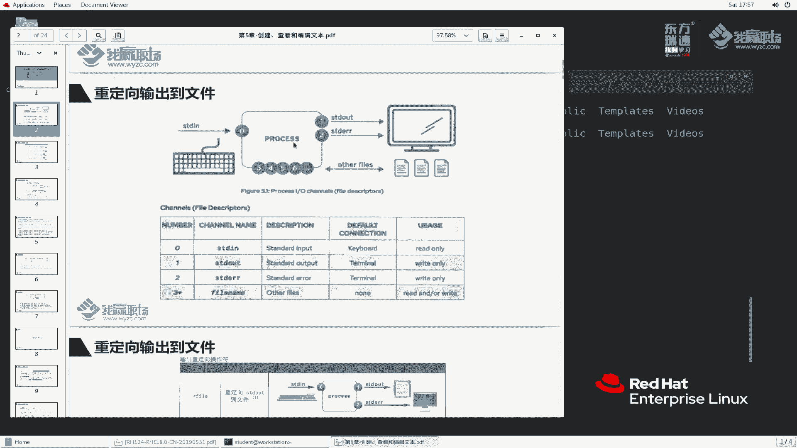
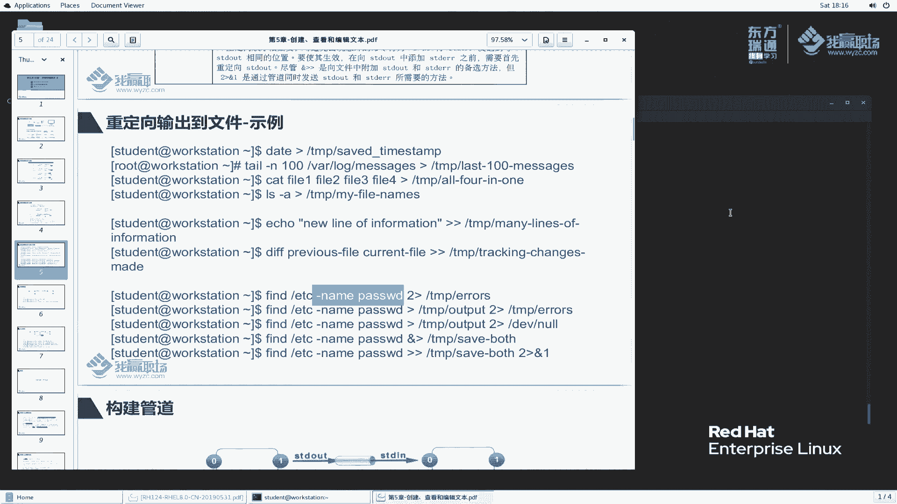
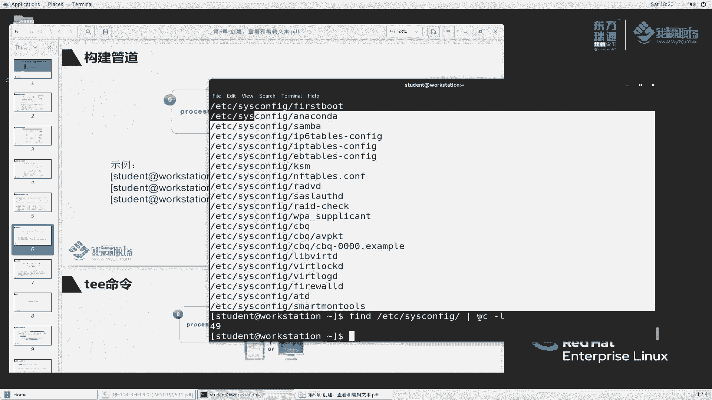
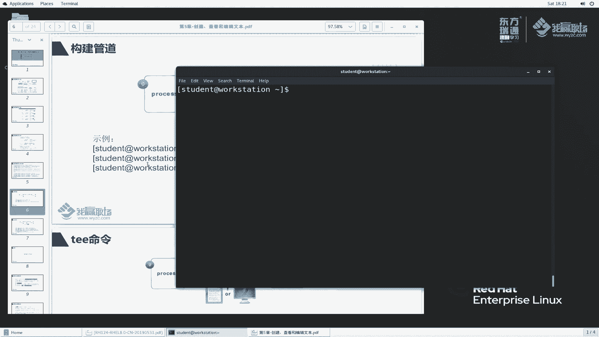
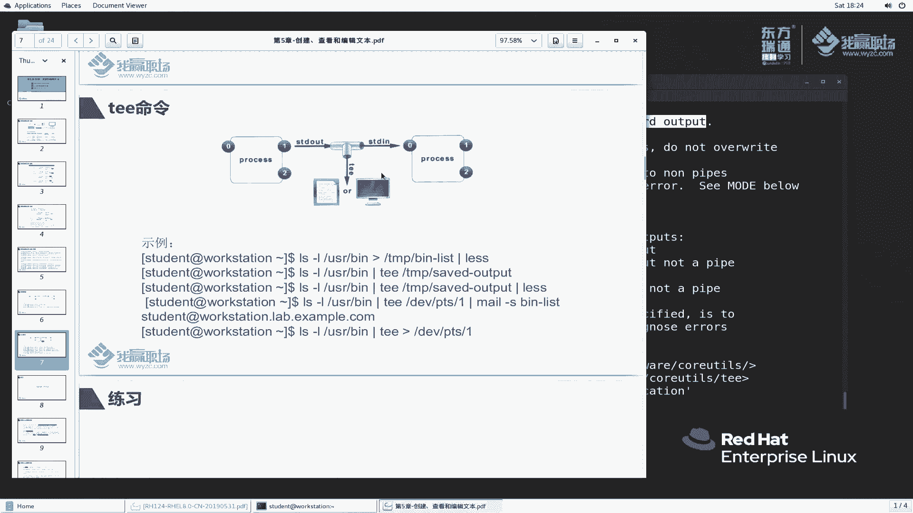
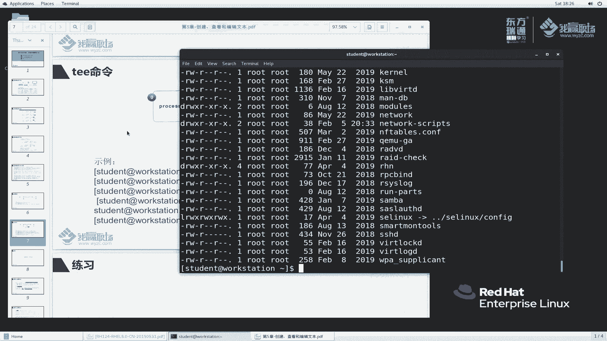
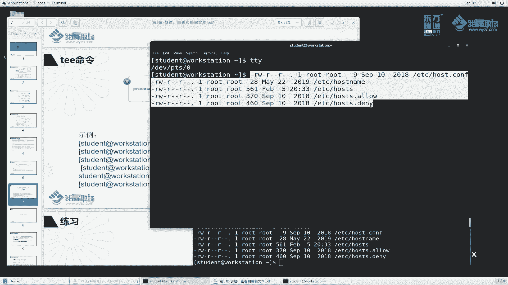

# 红帽RHCE8红帽认证RH124认证课程【全】 - P17：05-1-重定向和管道 - 北京东方瑞通 - BV1KM4y1M71q

同学们好，欢迎来到我云职场HCE8课堂，我是马老师。嗯，今天呢我们给大家讲第五章创建查看和编辑文本啊。那在这一章呢，我们分三个部分，首先给大家讲一下。从定向输出到文件或者程序啊。第二个呢。

shall提示符当中呢去编辑文本文件。也就是说在命令行当中去编辑文本文件。第三个，更改shall环境啊，s环境啊。首先呢我们来看第一个啊。

从定向输出到文件是什么意思呢？我们都知道在我们正常执行命令的时候，它都会有各种输出。那这些输出默认都是显示在我们的屏幕上面的。那么linux里面到底是怎么去管理这些东西呢？啊，其实呢我们可以放在屏幕上。

也可以放到文件里面去。

那我们来看一下这里面有一幅图。linux里面是这么玩的，那么这个提供的我们称之为终端。之前我们讲过了啊，终端里面的信息，例如说我现在L或者说随便出一个啊ATTC passports。

那这些字符串都是代表输入，这个字符串呢是交给我们这个终端来处理的啊，那么回车完成之后显显示出来这个东西呢，表示输出在我们的屏幕上面。

那么如何去控制输入和输出呢？这里面有这么一个约定啊。首先。那么对于一个应用程序来说啊，它这个输入信息，我们用数字零啊，数字零表示，也就是说你这个信息啊对应的后台啊，我们如果想控制时是用零来控制。

同样那么这个输入信息进来之后呢，我们要把它控制产出。产出之后呢，那么出产出为一和2一是代表标准的输出。I呢是代表错误的输出。那一和二正常情况都是打印在屏幕上面。什么意思呢？我给大们我给大家打个比方啊。

例如说我们现在有个工厂，那工厂里边你要进原材料吧，啊，这叫输入。那么此时呢我们可以使用零说第一道工序，我们可以理解第一道工序，零工序。好吧，那么生产出了产品呢，我们称之为一。那么这个是合格的产品。

当然我们生产出来的产品，也有可能是有问题的产品，那就称称为2。那一和二的产品呢，我们默认情况下，反正生产出来了。如果说我们人工的不对它做的分类，那么它就放到一块。是不是啊？当然我们正常情况。

你企业里面生产环境肯定要对它进行一个分类。合格的产品去用，那不合格的呢，那么当然我们要给他想办法处理掉，肯定要分开的。

那对于我们这个sll程序也是一样的。好，我给大家画一幅图，这是我的sll程序。那么我们刚刚输的这么一个字符串呢，作为输入，例如说哎交给他此时呢我们用零符号来代替。那么这个输入完成之后呢。

我们会把它显示到什么？打个比方，我们显示到叫显示器上面，给它放到这个上面来。那么此时显示器虽然说我们讲的是显示器，其实它就给放到哪了？其实就放在我们的这个终端里面吧我们在终端里面看到了嘛？

所以说这个地方我们用什么用显示器来代替。

那么有时候呢，这个信息呢也可能是错误的。我们用数字二来代替啊，大概是这么一个意思啊。那么当然你这个程序过程当中，那么3456我能不能额外的定义呢？例如说你输入信息，我用三来三来代表你的输入信息。

或者说你的正正标准的输出信息呢，我们使用四来代替，可以都可以定制。好吧，当然你这些信息输出的时候，我还可以怎怎么办呢？给你输出到我们的文件里面去。嗯，我打个比方举个例子啊，在我们运行的过程当中。

我执行个程序，比如说我运行个外部服务器。那么这个外部服务器运行过程当中总是会产生各种日志。那这个日志我如果说仅仅是打印在屏幕上面。那万一天我这个机器要断电了。那么这个屏幕没有保存，屏幕日志没有保存。

那么我怎么去看我这个服务器的运行日志呢？所以说它就会把这些运行的日志啊，哎，保存到我们的文件里面去啊，大概是这么一个意思来看一下这个表啊。对于一个程序来说，它的一个输入啊。

我们用零代替称之为标准输入standard input啊。这个呃标准输入地方它是从键盘里面去提供的啊。我们输执行完命令回车，是从键盘里面输入的吧啊，但你说我用鼠标也可以输入鼠标是用来定位的。

它好像没有执行回车的功能吧啊，是这么一个意思啊。那么输入的信息是作为我们的应用程序是只读的。我们应用程序呢从这个标准输入里面去读取这么一个信息啊，叫只读。第二个呢叫要输出啊，输出你程序执行完成之后。

那么我们就要输出输出输出在哪儿呢？啊，输出在我们的终端里边去默认呢我们通过终端去连接，对吧？通过终端里接给我们输出。那输出是写的，对外写的，写出来的，我们称之为仅能够写的这么一个东西。第二。

标错误的输出哎，错误的输出跟我们这个标准的这个输出其实是一样啊，叫stand error。那只不过此时我们输智星是一个程序运行过程当出错的信息啊，一个是正确的输出，一个是错误的输出。3以上3以上呢。

他说用于什么，用于文件啊文件啊。那也就是说我们这些输出信息呢，它其实三也是输出信象啊，我们这把这个信息啊网可以往文件里面输出作为输出输，那么也可以作为我们的输入网交给这个应用程序去处理，都可以啊。

自可以作为应用程序的输入，也可以作为这个应用程序的一个输出存到文件里面去，都可以啊。后面我们给大家展示一下啊，例如说我看要看一个文件的内容，对吧？啊，可以多种方式。好，这个表呢简单给大家说一下说一下。

那么我们接下来来执行一下到底是什么个意思啊。那么你这里面输入和输入信息，我们刚刚给大家执行的时候都是打印在屏幕上面的。哎，老师，你不是说一和二能控制吗？包括零能控制呢，那么这个零我们用的非常少。

基本不用。那么这个位置我就不给大家演示了啊，我主要给大家演示一和2这两个块啊。3三呢三呢是属于啊属于什么呢？属于开发人员去自己去定制的。那么这个内容呢也不属于我们这一张内容啊，我们也不讲。

那么在我们平时工作当中用的最多的也是一和2三是开发人员用的多。好吧，一呢基本上不用啊，包括开发人员这个地方用的也非常少啊，只不过一个符号代表这么一个含义而已。那么来看一下这里面的例子。

说我们执行命令的时候啊，如果说加上这个大于符号，再加上一个文件名，那么它得出来的结果是什么呢？然后看一下。程序执行输入信息有输出信息。那么默认情况下，这个一和二的信息都是打印在我们的屏幕上面，对吧？

那么此时大家来看这个一当我们加上这个符号的时候，此时它做了一个事情啊，将我们这个标准输出存到某一个文件里面去的。这个fa是是是代表一个文件啊，文件来看一下啊。

例如说我们做这么一个事情，LS。首先我们这样做啊，touch一个 touchuch个发一。好，那么我们L file一来看一下。LS方一和方22再来看一下。此时他给我们提什么信息啊。

他说你这个你这个信息啊，说没有这么一个文件或目录。但是呢我S这个时候他就给我正常显示了吧。这样我为了显示的更效果更好一点，我们加一个杠L。那是不是这个地方给我们展示出来了呀，这是正确的输出。

那这个是报错信息，我们称之为错误的输出。那么我们把这个命令翻上来之后呢，作为一个简单的处理，加上一个大于符号。我们把这个信息输出啊放到一个文件里面去，发有是代表文件，我们取写一个文件名啊。

例如说我们给它放到tamp目录里边有一个叫。因为这个是正确的输出啊，看到了是一一是正确的输出，我们写一个，那么写一个叫正确的输出，我们就写STD。out就这样写吧啊，STD out回车。😊，哎。

大家发现一个问题，我对比一下。这个命令输出的时候，他给我们输出两行错误的和正确的都输出了。那么当我执行这个命令加加了这么一个参数的时候，大家发现一个问题啊，哎，只错误的是打印在屏幕上面的。

那么这个正确的跑哪里面去呢？我们刚刚讲你正确的会把它放到这里面来呀？来ca一下，是不是？tamp里边的1个STD out。那么这个正确的就给我们显示在这里边了吧。好，我们文件的内容是什么呀？

是变成了这个吧。好，这就是我们达到的一个效果啊。老师，你这个就是大于符号，你不是说一吗？为什么一没有写呢？一不写就代表省略。当这个位置不写的话，那么就是代表一啊是默认行为啊。

那么例如说我们给大家再来看一个啊。😊，那么这个地方我来写一啊，那么这个位置呢，我们标一个叫SDD out2。好吧，那么再来看一下我们这个文件的内容，cat一下。STD outI这个文件里面内容。

来发现一下。好像这个内容跟我们刚刚执行的这个命令啊，这个什么这个不加的，现在和加一的这两个输出的文件内容是什么样子啊？这是输出的是这么一行。那么加了一之后，那么这个文件内容输出内容还是什么呀？

好像还是一模一样的嘛。

对吧啊，所以说这个加和不加都没有关系。如果不加的时候就代表一你加了之后，那么你加了之后，就根据你自己加的这个参数来定义它的行为。那么加一和不加都是代表一好吧。

这是第一个啊。那么除了刚刚那个问题，大家也发现了啊，我们再给大家执行一次啊。那么回到上面来，我执行一次，我再执行一次，我再执行一次，我执行了三次。大家发现这个文件的内容有什么变化？

是不是这个文件的内容还是还是同一个内容啊，还是一行吗？哎，其实我能不能说这样做这么一个事情啊，你想一想啊，我们操作系统在执行过程当中，或者是某一个应用程序执行过程当中，它总是会生成新的日志。

那么这个系新的日志生成生成之后能不能说直接把原来的覆盖掉呢？不能吧，不能那我们这个日志内容应该是怎么办？应该叫追加吧？好，我们来看一看追加。😊，啊哦这追加我们换一个嘛，换一种方法啊。

ele一个啊line1。啊，line一我们写这个啊叫line。嗯。Hello hello word world。how的 word一，我们这样写好吧。加进来。叫tamp里边一个叫hello。再来。

大家看一下这个文件。现在。cat一下这么一个文件，这个文件你再怎么看，还是还是证明一行。好，我们换一种方式。😊，这个大于符号啊大于符号呢，我们给他加两个符号。啊，两个符号此时呢我这个地方写个二。

表示第二行，对吧？啊，第二行，那么这个地方我们换成第三行，再来看一下这个文件内容。

此时大家大家发现一个什么问题啊？好，之前是由于我这个地方一个大于符号，所以说你文件内容总是这么一行。那么我现在变成两个大于符号。此时文件内容啊就是往里面追加，并没有把原先的内容进行覆盖掉。原先是这个好。

我便再说一个大于符号，表示把这一行追加进来了。那么再说一次，又追加进来了。那我们再来一次，再验证一下，我加个4。😊。

那么再来看一下内容是不是有追加进来呢？确实是这样。

好吧，确实是这样啊，那么这个位置一我也没加啊，之后以后我就不提了啊，反正你没写就代表一。

那么我能不能对爱进行一个重定向呢？

也可以呀好，可以，我把错误的不显示。好，刚刚以那个为例啊。我们刚刚有1个L命令。LS命令里面是这样子啊，这是正确的输出。那么其实呢关于这个错误的输出，我不想看，我就想看正确的输出，对吧？来。

我们STDERRarrow好吧，然后这个位置呢我们变成2来对比一下。这个正确的信息是否是正常输出了吧。那么错误的信息呢，ca一下。哎，错误的信息显示到这个文件里面去了吧。好，什么情况下我们去这么用的啊。

但然要取取决你企业里面的环境了啊，有时候我们就会干这么一个事情。说我想看一下这个文件里面内容啊，打个比方，我就这样，我不加我不加杠L了啊。不加杠L了啊。哎，如果说你文件存在的话，你就给我显示。

如果说你不存在，虽然说我这里面给你指定了，如果你不存在，你不要显示了。😡，🎼啊，就是这么一个意思啊，我们经常执行命令可能会有一些报错，但是我不关心这个报错，我只想关心正确的结果。

那么你可以把这个错误的结果给它扔掉啊，扔到某一个文件里面去啊，是这么一个意思。好的，一和2。那么二这个地方呢也支持啊也支持这个追加的动作。再来一次，我们ca一下。

那么他就有两个错误了。好吧，两个错误了啊。那有时候我们想做一个事情，说你这个一和二呀，我都不想放在屏幕上面了，能不能说把这两者都放到同一个文件里面去呢？

对吧或者说我们这样写啊。二放里面一个去啊，那么一呢我也放到追加一个里面去叫什么还是放到t里边那个STD。out。这样看好，再来一次。那么我们看一下。看看这里面有没有增加进来。t里边的STDarrow。

还有一个他先看他第一个啊。好，又增加两个，对不对？那么同样呢，我们看一个alt输出。奥的输出是不是增加了这两个名字啊？好，也增加了两个。啊，那么他两者分别重定向不同的位置。啊，可以可以放在一行里边啊。

那如果说我把正确的和错误都放到同一个文件里面，那我怎么写呢？可以呀啊可以呀，那我再给大家演示一下啊，还是这个文件为例啊。😊，那么这个位置我们这样写啊，哎回车。到这里面来，我们加这个符号。

我们写一个这样啊这样写，比如说还是放到t里面一个哦。看一下桌面上面这个显示器上面没有任何显示。而，我们这个文件呢写成是什么了哦，里面看一下。是不是该正常显示都显示了，来对比一下。

那是不是这个内容啊，不论是正确的还是错误的，都放到这个文件里面来的啊，这些基础知识啊，大家一定要学好啊，那这个不学好以后有的你烦了，好吧，好吧。

那么同样的同样的，你这个地方可以这种方式呢，我是否是也可以进行个追加呢？看看这个操作能不能执行。哎，我们再来一次看一下这个文件内容是不是变成六行了。啊，确实就是这样好吧，就是这样啊。

那么在以前老的写法当中，他可能会这样子做啊，说呃我想把一的内容放到某一个文件里面去。同时呢把二的内容也放到这里面来。那这种写法是这样子啊。相当于他我建议大家使这种方法，这种方法更简洁一点。

那么第二种方法呢，啰里八嗦的哈，首先我把正确的内容放到这个文件里面来，然后把错误的这个内容2，然后呢也放到我们这个一里面去。好，这个符号就是代表放给一里面去的。啊，同样这个地方也是啊。

大家呢根据自己的需要去用啊。那么我建议大家使用前者。好，前这。

好，回头来我们再看一个。我刚刚是给他放到文件里面去的。啊，有时候有时候我们的用户啊会有这这么一种需求。说。你这个错误的信息我不想看，我也不想打印在屏幕上，也不想保存在这个文件里面去。那我现在要怎么做呢？

😡，可以这样，我们能不能说类似于有这么一个东西，把它扔到什么垃圾桶里面去是吧？我不看，是不是啊？可以啊，那么到这个位置来。有正确的有错误的啊，我们再来看一下。

我现在把想只想把这个错误的啊错误的放到一个位置去。来看一下。我把这个错误的信息放到这个东西里面去。我们讲DV目录下面放的是设备，那这个n设备是什么呀？n设备是一个空设备。

就是没有你把这个错误的信息放到一个nun里面去，就相当于给你处理掉了，给你扔掉了，不要了。是不是这样呢？啊，确实没有。好雪并不是说把错误的内容交给他了。其实其实我们这个地方的作用确实是交给他了。

但是呢这个设备比较特殊。当你把错误的交给他，就意味着你这个东西就扔掉，不要的意思。啊，就是不要的意思，n设备是空设备，也就是说把这个二给他交给空设备，就相当于不要了。

好，不要了好，这个设备比较特殊，我们也可以理解为什么？这里面我们图片上给我们显示的是一个垃圾桶，我们就可以理解为叫时间黑黑洞是吧？把理解为黑洞，你扔进去就没有了。😊，OK啊，这是给大家讲的这么一个例子。

那么在这里面呢，书本上也给大家提了一个例子，我带着大家呢简单的再来看一下好吗？date是用于显示时间的那时间显示完成给之后呢，给他放到这个里边来，再来看一下。

date回车，那么date回车之后，我们再加这个叫t里边，我们就写个date好吧，date file。时间文件来ca一下。

那是不是说这个时间呢？对吧？同样我们t杠N看什么看100行，将这个文件的100行呢放到放到哪里去啊，放到这个地方去。好，cat1234，把这个四个文件的内容呢啊放到这个里面去。

说all in one是吧，四个文件放到一个里面去。之前大家还记得我给大家讲了一个错误的例子，说copy file一 file2，然后fi3说然后再fi4。

啊，说想把这个三个文件的内容啊拷贝到一个四里面去，不可以啊。我们可以通过这个K的方式，然后呢通过这个符号重定向啊叫重定向生成一个新的文件。

好吧，那这么一个意思啊。😊，Ecle啊，打印这么一个字符转往这里面放D比较两个文件不同的地方，然后呢放到里面文这个这个文件里面去。同样，犯的。犯的是查找的意思啊。

这个命令呢咱家但是大家暂时不学也没有关系啊。反正就是说这个命令查找的时候有可能有错误的，有可能有正确的。那么给大家演示一下啊。

fin杠ETC。在这个ETC目录下面去查找啊，犯的是查找吧，查找什么呢？查找名称是pa嗦的文件名。

name啊是pasword这么这么一个文件回车。大家可以看到我找到几个这两个是我正常找到的吧。那么其他的是不是提示我们没有权限，对吧？你说这种没有权限，对于我用户来说，那我就不看对不对？

那么此时我们就可以怎么办呢？把这种错误的信息给你扔掉DV闹。是不是可以这样看啊，那此时这才是我想要的吧，想要查找到的文件好，是这么一个意思啊。

OK当然你可以把查找的查找到的文件呢，也可以保存到相应的目录里面去。这样呢也方便啊方便啊。OK这个事例呢，我就带着大家简单的过一下了。好吧，这个重定项啊，错误的重定项和正确的重定项。

以及这个ns倍在大家以后的工作当中会用的非常的多啊，一定要练熟了好吗？再来看一个滚道。

刚刚我们给大家讲的这些东西啊，这些都是属于程序的输出结果啊，我们不论是运行哪个，打个比方，还是以这个为例。这个程序输出结果我们都是交给谁处理的？交给这个输出到显示器上，要么显示到文件上。

我能不能把这个输出结果再交给别人去处理呢？啊，交给别人处理呢，可以呀可以啊，我们这样来做啊。😊，例如说例如说我们刚刚是这么一个东西啊。啊，获取了这么一个这样啊。大家可以看到我们获取的是这么一个东西。

例如说我想对这两个字符称呢再进一步处理。那进一步处理我们就要需要一个管道符了，好吗？管道符来看一下啊。

这样啊我们加一个滚道符，滚道符里边他给我输出的是这么一个两行字符串。两行字符串里边呢，我做这么一个事情啊，例如说我来g up，打个比方啊，大家这个命令没学呢，我先给大家讲一下啊，PASSWD。

来看这个东西。那么此时我去过滤的时候，他会把我们。gra命令指的是过滤的意思啊，过滤什么呢？过滤这个字符。也就是说在上一个命令的输出结果当中，这个输出结果当中交给谁呀，交给这个命令来处理。

这个命令呢会在输出的结果当中去过滤，过滤出每一行当中的这么一个字符，并且把它高量显示出来。那你本身就两行，你输出好没有什么意义吗？那么我给大家换一种方式，我说PAM的pm呢？是不是？

带有这个PM的行给我显示了，那么与他不相关的，我就不显示了吧。好，那么此时我们看到的效果就是将前一个命令的输出结果。这个结果然后交给后一个命令去处理。那后一个命令呢，这个gra命令对它进行过滤。

过滤出我们想要的东西。啊，是这么一个意思。那么我们再给大家换一种方式。办的ETC里边一个。S can飞。回车。那么当我们执行这个命令的时候，大家应该发现一个问题啊，这个命令给我们输出的文件超级多。

超级多。比如说我现在我想做一个事情，我想统计统计这里边的行数。对吧也就是说我想查找到我想确定我查找到文件的个数是不是啊，不管说文件还是说目录房间，我想查找到结果的个数怎么办呢？好，WC杠L。😡。

是不是啊回车。找到多少个，找到49个。

好，这是我们的输出结果。然后把这个输出结果呢，由我们这个命令来处理。WC杠I是怎么处理的，是统计这个这个目录的行数啊，或者大家想间接一点啊，我们犯的我可以怎么办呢？大家又不确定，我们可以这样啊。

我们就叫我们就叫叫叫output，好吧，然后WC杠L来看一下这个output回车。

是不是统计49行？也统计出来了，但是他给我们文件名显示了吧。啊，是这么一个做过。因为你想一想，我这个输出的时候，仅仅是输出这么一个字符串，它并不是属于某一个文件里边的。哎。

此时我们这个这种方式统计的时候，那么给我们把文件名也显示出来了。

好，这么一个意思。OK当然了，例如说我们刚刚查到的文件名，他一次性给我们全全部显出来49个，全部在打印一页了。那么我不想我不想这么干啊，例如说我想分页查看。😊。

啊，我们交过lesss。SS婚页查看。好，这是第一页，这是第二页第三页啊等等等，叫分页查看。那这个符号我们称之为滚道符，滚道符前面可以有空格，也可以不有空格。那包括后面也是一般来说，我们为了好看呢。

滚道符两边都加个空格啊，用于界定它的范围，也不加也没有关系。好吧，不这也没有关系。好，这是我们讲的管道符的作用，将上一个命令的输出啊作为下一个命令的输入。也就是我们讲的这个0。

哎，老师，你这个地方是属于标准输出，那你这个错误输出能不能通过管道去传过去呢？这个问题非常好，但是呢这个问题呢我。我们用的不多，也就是说把错误的场景交给去别人去处理，这个用的不多啊。

当然大家可以自己去想一想啊，自己去查一查。那么在这个地方呢，我就不给大家介绍了，好吗。好，这是管道的讲解。那么我给大家再来看另外一个。哎，刚刚的输出是信息是交给文件，交给我们的显示器。

那么交给文交给我们的下一个命令做处理。那在这里边还有一个命令叫T命令。T命令比较好玩，你刚刚不是一个管道嘛，单向的是吧，一个进一个出。此时如果说你使用T命令的话，那么它就是一个进两个出。

你上一个命令输出结果同时会交给这个命令处理。同时呢我们这个T命令也会去处理。来看一下啊，看一下他的证明给我们提供的一个例子啊，我们呢还是以实际演示为效果为为为为证啊，来验证一下。

那么这里面给我们提供的是1个LS杠LUSB。好，我们再给他加这么一个东西啊。输出信息是这样子很多很多。那么把这个输出信息呢，我们去加一个滚道符号，然后做一个处理啊，处理它是直接的是吧，直接保存到这里。

那我们这样吧，我们也来直接保存。

t里边写的一个是病 list。你是把这个信息呢放到我们的兵历室里面去ca一下。显示出来了吧，那正常情况肯定是一样的啊。大家不用怀疑，除了颜色。啊再来一次啊。啊，除了颜色不一样啊，其他都是一样的啊。

找一下啊，这个命令太多了，我们就不找了，好吧，不找了啊。

那么我们加这么一个滚道符来看一看。LESS。回车给我们显示的是这个样子。啊，分页显示了哎，此时如果加这么一个意思啊，叫T。T好吧，T里边我们做一个事情，T是用于这样，我们单独来看这个T明令。

T刚刚help。往上翻。T呢他所以他说啊将这个标准的输入信息啊给它拷贝到文件里面去，注意下，将标准的输入，把它把它什么copy这个标准的这个输入信息，把它放到某一个文件。而且呢also是吧？

而且把我们这个输入信息呢继续把它输出来，其实这个地方画的不怎么好啊，画的不怎么好。我觉得标准的画法应该是这样子啊，我来给大家画一幅图。

好，这是呢我们讲的一个管道啊。这我们首先来画一个圆，这是我的入口。那么呢当然这个是我们的出口，这是我们的管道。那么这个地方呢有一个出口。啊出口啊。此时呢我们这个地方相当于什么？我们这个地方加了一个T。

好，此时这个地方是T。你每一个数据过来之后呢，我这个T里面都会过滤一次。虽然过滤完成之后，但是我会继续下传。好，你数据来了，那么我这个T命令会拿出一个副本。那么你这个副本呢会继续往下传。好吧。

就是这么一个意思啊，这么一个意思。那么我这个T命令到底对应你这个副本怎么处理呢？他说哎我们刚刚去慢配置了，大家看到他是将这个输出信息啊放到文件里面去的。那这是文件名。啊，这是文件名来看一看。

那么还是一样的啊，我们做这么一个输出L杠USR这个里面文件太多了啊，我们找一个简短一点s confi回车就这么一些啊，我们杠L来看。这么一些，然后我们做一个事情，首先加一个T。T里面写什么呢？

写ss confi。历史的。此时大家发现一个问题啊，我把这个命令的输出信息交给T命令来处理了。T命令呢会把这个信息呢保存在这里边。好，保存在这里面回车。最终的结果是什么？最终的结果是屏幕上显示了吧。😡。

那么你这个文件里面保存了吗？来ca一下我们刚刚说那个呃s confi命令。看一下。哎，好像一模一样的嘛，cat文件这个文件里边也是显示的那同样这个标准输出这个屏幕上也显示了。

所以说大家看到一个东西就是屏幕上显示了啊，那么这个位置也显示了。

哎，老师，你这个地方好像还少了一道是吧？哎，我们再来一次。那么我如何验证呢，它又传递给下一个了呢？例如说我就g up给大家看啊，我过滤过滤什么呢？过滤这一行呢？看看能不能过滤到。这样。似乎是过滤到了吧。

啊，或者我给这样给大家看啊，那么我们加一个叫。WC杠L来一次。40行，那么我们再来换一个啊。WC杠L。此时大家看到一个什么效果啊？它已经保存了文件内容。那同时WC杠L去统计的时候。

与这个地方不加的时候是不是一模一样？说明什么问题啊，说明T把这个。文件确实拿了一个副本，也保存在这个位位置里面去了。但是同时又干了一个事情啊，把这个标准输出继续往外输出啊。

输出输出到什么输出到WC杠L给他去统统计了。如果说你不统计的话，那么默认情况就作为标准输出了吧？标准输出放在哪，放在屏幕上面嘛啊就是这样子。当然你此时也可以做一个事情啊。加这个方号，我不想放在屏幕上面。

那么我再做一事情，我把你放到某一个文件里面去。也就是说t里边1个11。那么我们来看一下，首先cat ci里面有吗？有cat11里面有吗？有。开t。哎，看一下。ktt11了，是不是我的history呢？

太平洋药啊。t11。是这么一个。同样呢，我们说有一个cat那个也是一模一样。

好，T命令呢在我们以后工作当中呢，用的也是非常非常的多的。啊，大家稍微注意一下啊。那么在这里呢，我给大家再讲一个例子，非常有意思的例子啊。

敲一个命令TTY。大家可以看到我当前所在的终端所用的终端是这个符号，我们再来开一个窗口。这个窗口呢我们仍然去连到这个。student登录，然后登录到worktation上面来。那达到一个什么效果啊？

我们还是LS嗯ETC加我们后s字啊，后视星少写一点啊，杠L。此时我们显我们显示的标准输出是这么一个信息啊。那我么我们来做一个事情。T命0啊T命令我们写一个叫hos词。好吧，后四次，然后再加一个。

这样我不加的时候再来看一效果啊，不加的时候是我这个文件里面保存的吗？保存了，同时在屏幕上打印了。那么对于屏幕上这个打印呢，我可以怎么办呢？对吧我能不能说把这个打印的信息，我给他放到某一个设备里面去呢？

好，放到哪里去啊，放到我们这个设备里面来。看一下啊。粘贴一次回车。大家有没有觉得很很好玩？就是我ca的时候啊，ca host host文件是保存了。那么这个输标准信息我给它放到哪里去了。

放到这个终端上面去了，终端是不是给我们正常显示了？

诶，非常有意思的这么一个事情啊，当然了，大家也可以根据自己需要去灵活的去用啊，去用啊，可以放到终端，放到屏幕，放到文件，还可以教一个下一个程序去处理。好，这个呢就是我们给大家讲的这么一个。

从定向啊标准输入输出。那么在我们的练习里边，大家可以发一个东西啊，就是这个没有命令啊，是新增的命令。这个没有命令呢，我也给大家解释一下，这个命令比较长来看一下。

首先我们第一个命令啊，当大家去执行这么一长寸的命令的时候，如果说你搞不清楚这个命令的顺序，那么我就一步一步去分析。首先LS杠LUS啊，并他给我显示的这么一个目录下面的一个文件的详细信息。

然后我们又做了一件事情。T命令DVPTS。PTS斜杠1。好，PTS斜杠一是哪一个啊？这样我给大家TTY啊，看一下这是零是吧？TTY这是一吧。好，这是一啊，回来。那么我们们给您放到一里面去。还是的啊。

T第一位的PTS斜杠一放到这个里面来。好，回车。这个文件里面显示的吗？是不是也显示了这个窗口。那么同样我这个窗口里边。从我这个窗口里面干了一个什么事情啊？是不是在标准输出啊？

一个我把这个文件的内容放到这个里边来。第二个呢，我这个标准输都放到屏幕上面了。那此时我做一个事情。我不你这个这个标准输出，你正常去显示啊，我不管你，你正常输出吧。好吧，然后你然后这个输放放到设备里面去。

你继续放设备。然后这个标准输出呢，我想给你存到文件里面去。是不是可以啊，你存到文件就这样子吧。哎，其实我还可以进一步处理嘛？好，就了，我可以这样做啊，mail有跟S比如出t。

然后再写什么tudent at我们的work stationation。Workk station。我将这个标准输出信息，也就是刚刚界面上这些输出信息。我以邮件的方式作为邮件的内容。好，我们写一个邮件。

邮件的主题叫subject叫test。邮件的主题是test，然后呢，发送给这个这个什么发发送给workt上这么tudent用户。然后呢，这个student的用户给他邮件的内容是什么呢？邮件的内容是这个。

来回去看一下效果。哦，说一个是吧，说我们这个没有命令不存在，对吧？那么我们先把这个装一下。觉要的害的啊。谁的害的。然后我们yint杠Y。没有命令。嗯，找一下啊。没有找到是吧？是没有X吗？好啊，好。

少加了一个X啊，再来看一下有没有没有命令。好，有这个没有命令的啊，再来一次啊。啊，先退出来。看一下我当前用户下面有没有邮件，没有是查看当前用户有没有邮件的啊，没有没有之后，我再来一次。来没有一下。

没有意下。还没有啊，他刚刚说这个message note3的这个没有发出去是吧？no such写错了吗？好，马上往上翻。嗯，Stent at work station。好，我们这个没有服务器，没有哈。

我们这个没有这个没有服务器，导致没有发出来啊，没有发出来啊。嗯，没有发出来算了吧啊，算了吧啊。😊，啊，这个mail有是由于我们的邮件服务器有问题啊，没有发出来，这个不影响我们这次讲课的问题，好吧。

好，关于这个实验呢，我就给大家讲到这里面。大家呢回去之后啊，仔细的看我们这练习，多练练。特别是我们讲的输入输出重定向、滚道斧和T这三个命令。好的，这个呢这节课我们就讲到这里。😊。

