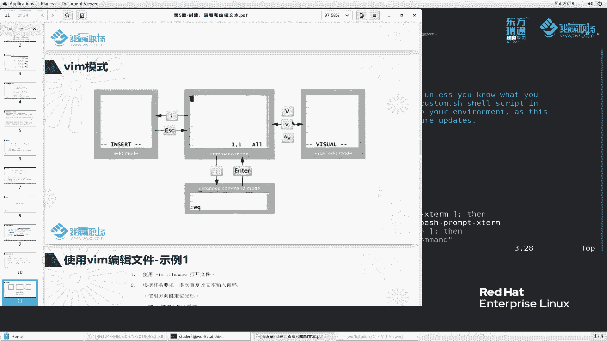

# 红帽RHCE8红帽认证RH124认证课程【全】 - P18：05-2-vim入门 - 北京东方瑞通 - BV1KM4y1M71q

同学们好，欢迎来到我赢职场HCE8课堂。我是马老师。这节课呢我们来给大家讲一下VRM编辑器。嗯，其实啊为什么要讲这个单独来讲呢？哈，是这样啊，就是说在我们。

生产环境的服务器里边啊，我们经常会改一些配置文件啊，也就是说我们服务器运行到运行过程当中的一些文件呢，都是以文本文件来保存的那这种文件呢，我们要去修改。之前我也给大家提过一个问题。

那么服务器经常是没有重新界面的那对于这种文件，我们要去编辑怎么办呢？那由于是没有同新界面的，那么大家去编辑的时候，相对来说就比较麻烦。那有的人说老师我可以把这个文件从服务器上下载下来之后。

然后编写完成再传上去。好，这是一个方法。但是呢大家有没有想到，就是说这个文件呢我下载下来，然后传上去，结果可能会存在一些乱码问题。因为windows里边和linkux里边它的一些编码编码是不一样的好。

就会存在乱码，这是第一个方面。第二个呢就是服务器你去传到服务器，万一这个仅仅是一个微小的错误。例如说你一个字母A的字母变成B，你比方写错了。那么对于这种非常小的这种修改呢。

你还要下载下来再去上传是非常麻烦的。那么我们有必要学习一个在命令行下面去编辑文件的这么一个工具。

OK那么既然。要选择这么一个工具，那历史里面有很多工具，我们选择哪一个呢？啊，那这是一个问题。第二个呢，linux里边它的设计的思想就是。大部分的功能都是围绕这个终端来的。

所以说呢我们要在命令行下面去解决这么一个问题啊。那么还有一个问题就是服务器里边的配置文件，大部分都是可。编辑的可查看的这这么一些文本文件XMLy文啊等等等这种文本文件。好，那么我们来看一下。

那这种文本文件我们编辑的时候使用什么样的工具。在linux里边，工具非常比非常多啊。例如说这里面给我们提到的啊图形界面的geedit。当然我们刚刚要把它抛除掉了啊。那么在命令行界面里边。

例如说nano和nano，例如说eax啊，那么还有说SED啊等等等这种工具。那么。呃，从学习的角度来说呢，我们建议大家啊优先去学习这个VRM。VRM呢第一这里面给我们提出了啊。他是非常简单的。

应该说非常好用的这么一个入门非常快的。而且啊他说啊所有的操作系统基本上默认情况下啊，它都会有这么1个VI的工具。VI和VRM这里边我要给大家说明一点啊，为什么我刚刚说VIM工具一会儿又设成VI呢？嗯。

来看一下VRM这个工具呢，它有三个版本。首先。这个版本叫VIM minimum，这是软件包的名称啊，我们这里面只提供一个VI的工具。VI的工具呢是最精简版的功能非常少。一般来说呢不够我们用了啊。

那么我们正常安装的是安装这种加强版本。这种加强版本呢，它提供一个VRM工具。哎，VRM工具它就非常的棒了。提供语法高量检查啊文件类型的插入拼写检查。那么它还支持很多一些插件的功能。

也就是说VRM这个工具啊，如果说你想扩展它的功能，可以啊，你只需要安装一些插件，把它集成到VRM里边去去提高它的功能。而且VRM这个工具呢可以提就是他提供了一个呃提供了给用户啊提供一个自助的一个接口。

什么意思呢？就是说这个VRM工具啊在运行过程嗯，你在使用之前我们可以定制这VRM如何去工作。例如说高量检查我可以不要也可以要。那例如说我们这里面的文件类型这个插入，还有一些例如说显示行号呢啊等等等等。

很多一些功能，这些功能呢是作为一个。可选项，我们可以根据自己的需要去设置。也就是说它自动缩进啊等等等啊这些方面。好吧，那么再来看第三个VRM呢，它提供1个GVRM。那对于初学者来说。

我我学VRM这个同命令行工具呢，刚开始呢有点有点不太熟练是吧？那么呢能不能说在我们这个学习之前呢，在命令在同形界面上给我提供这么一个工具，帮助我们去熟悉这个VRM呢，可以啊。

那么GVRM就是这么一个工具。好吗？那么我们来看一下这个工具到底怎么用啊。来，首先呢我们切到root用户下面来看一下这里面的软件包。

y list VRM新看一下里面有哪些。VRM enhanced它现在是当前安装的，那么这个minim呢也是安装的VRM叉11，它是什么？它是这种带图化界面的，那么默认没有装。

这样呢这个地方啊嗯这样我给大家还是装一下吧啊。这个装一点呃，我们在这个物理机上面装给大家看一下啊，SU杠。算了，还是在work stationation上面吧啊，H杠VM。

They have a view。没有啊。

vi这个worktation。

我们登录一下啊，由于这个GVRM是需要在图形界面上打开的，所以说呢我们到在t本机上面去登录吧。A student， student。当然这个软件包的安装啊工具啊，大家就先记一下吧啊。

机机器启动呢要稍微等一会儿。好，我们打开一个终端。切到管理员账户去装个软件包。我们给它稍微放大一点啊。嗯，SU。yins杠外。然后是VRM杠X11。这个同一化界面呢啊，我待会呢再给大家演示好吗？

是X大写啊大小写比较敏感。啊，这个ym工具我再给大家说一下啊，ym是代表这个安装的工具。insstore呢是代表安装，有可能是安装，有可能卸载，有可能升级等等等。Y呢表示我确定去安装安装哪个软件包呢？

装这个包OK那三个软件包我们就给它全部安装完成了。

那么我首先给大家讲一下，我这个命令航行模式这个使用的方法。那么我们打开来。

嗯，这样还是登录到我们这个。workt上面来。那么。VRM我们直接执行或者VR直接去执行。那么我们如果说要打开文件的话，建议这样子啊，我们后面加一个文件名。那么我们拷贝一个文件过来。

后是此这么一个文文件，拷贝到当前目录。那么我们直接去VIhoss哈hoss。这个地方大家看到好像没有什么高亮显示的对吧？这样啊，我们换一个copy个ATC baRC把这个文件拷贝到当前目录里边来。

然后呢，我们我去VI这个文件。VI我们刚刚拷贝过来的这个白石RC文件。好，大家可以看到我此示这个文件啊，哎，似乎是高亮显示的对吧？这样还是给大家这样做吧啊。USR并里边有一个VI工具。好，然后呢82岁。

大家看到这个是没有做高亮显示的啊，没有高量显示的啊。哎，我刚刚为什么执行VI它就会高亮显示呢？啊，那么给大家看执行这个命alas。al莱指的是别名。当我执行VI的时候，它就相当于执行VIM。

所以说这个VI是假的，是一个别名啊，别名。那真正的VI在这里面好吧，就所以说我通过这种方式给大家执行的时候，大家看到一个问题啊，就是它的颜色好像全是白色，没有什么高亮语法显示。

如果说我单独去执行VIM看这个文件，那么它就有非常明显的。就如说哎这里面看到好像是if是吧，L，然后FI分号以及这个蓝色的，然后等于符号单引符号里边的颜色等等等，这叫高亮的显示啊。

这样这里面几个工具的一个区别啊。

然后我再给大家演示一下VRM我们怎么去编辑文件，好吧。首先看这里面的说明。VI呢里边呢这里边我们只是给大家介绍常见的1234。

四个模式啊。当我们首先去打开文件的时候，那么这个模式。

这个所在的模式我们称之为什么命令模式。

什么叫命令模式？就是说在这里面我去按一些按钮，大家还记得我之前给大家讲man配置的时候，我们按了一个什么按钮啊？按了一个大G，他会跳到最后一行。那么在这里面也同用按两个记小写的记记记。

那么他就跳到了第一行。好，你看我们做这样做的操作，记还记得我们慢配置里面按Q是退出的是吧？那么这个地方你要按Q就无法退出了啊，无法退出了。每一个工具，它的一个快捷方式不一样。好。

此时呢我们知道啊这个地方叫命令行模式。

命令航模式。那如果说我要对这个里边的文件，相当于我现在只是查看文件，对吧？我们也可以按上下左右啊，上下左右去去移动光标，上下左右去移动光标啊。你看我们还可以按单词的移动。例如说我现在在这个位置。

我按一个W啊W word这个W的首字母看它是按照这个单词单词的移动，对吧？非常的方便啊。但我们再按写一个大写W大写的W好像怎么好像跟小写W差不多是吧？来试一下。😊，哎，好像差不多啊。

其实这个地方还有很多一些快捷方式。但是呢对于初学者来说啊，我暂时不给大家讲那么多。好吧，我们就知道上下左右去移动光标就行了，暂时啊。那此时大家看到我我我想删除，比如说我想删除这个字。能删除吗？

按回车按这个backagspace退格键，它好像是光标往后移，没有删除，那怎么删除呢？那么如果说你要想删除，我们就要进入一个叫编辑模式。

编辑模式怎么进入呢？按一个I好按一个I好，大家看一下我们这个呃，文件当前的一个说明哈，看我什么呢？看这个位置。

我当前的光标是在第十行，第十行的第一列啊第十行的第一列啊，那么我往下移一下啊，大家看看看我们的光标。在哪一个位置？现在是在在第十一行的第九个位，123456789哎，在这个第九个位置。

显示的还是非常准的啊，top是什么？top是我当前光标所在的这个文件的整体的位置。我现在是在你看这个是代表什么开头的吧。那如果按大写的记，是不是在到最后呢，我们按一个大写的记，大家来看一看啊。大写的G。

那就变成什么bottom是吧？最后而且显示的是98，一共98行，最最八行第一列啊，光标所在的位置。好，我们再回到杭首。那么在一打个比方，我光标已就就放在这个位置。

我们再来按下一个R小写的RR是代表什么？代表inser插入的意思。

大家来看一下这个位置有没有变化啊，看这个位置的变化，我按一个按来看一下。哎，变成什么了？变成了插入。此时，如果说我来敲ABCD，你看。再敲个W出来了吧。ABCD那么你敲什么，他就给你写什么。😡，同样。

如果说你敲错了，我就可以删除都可以。那此时就像我们随便打开一个文本文件一样的去编辑。哎，老师，我其实我想要的就是这种方式是吧？很多同学其实学到最后学VM学了什么，就会学会了一个I插入，然后去删。

不要的就删掉。然后要的话，那就给它留着，然后编辑完成，然后保存一下就行了。😊，也可以啊，这是最基本的这个编辑方法。好，这我们讲的这个叫插入啊。其实这个插入的时候呢，有好几种插入。

例如说我们刚刚呢是小写的I是吧？大家看一下我光标现在定位在G这个位置，我按一个大写的I。有没有看到？跑到哪去了？跑到这个文件的行首，而且变成了叉入模式。我这样说。对吧哎，这样也可以啊也可以啊。

那么除了小写的I，大写的I，其实还有很多。那这个地方我暂时不给大家扩展了，就写记住一个小I大I就可以了。小A跟大A啊，小I跟大I啊，小I跟大I，那么大小写也是敏感的啊。那么现在我想我想干嘛呢？

我想退出继续去浏览这个文件。好，大家看这个位置啊，insert我此是按1个ESC。

又回到了按ES又返回到我们的命令行模式。

好吧，命令行模式啊。OK那么。😊，我想退出怎么办呢？我按Q我能退出吗？按Q能退出吗？按了好几次都退出不来，那怎么办呢？

好，此时我们要做一个事情。

首先按一个冒号好，冒号呢是在键盘的上面，所以要按一个shift。

在shiftft里边呢，我们可以好，首先我们讲进入按了一个冒号之后之后变成了什么模式啊？此时我们专业术语叫扩展模式，扩展命令行模式，这是命令行模式啊，我们首次进入的叫命令行模式。那么这个叫扩展命令模式。

叫冒号。

哎，这个里面比较有意思，例如说我执行感杠啊感叹号LS。看一下。感叹S相当于什么？相当于在我当前目录下面执行了1个L命令。L命令就是做了这么一些事情。好吧，回车继续回来。这叫命令行扩展的命令行模式。

那么我想保存退出怎么办呢？对吧？这个文件编辑完成了，我想保存退出，我们敲一个W。W是代表right的意思啊，Q是代表保存。好。保存退出来来看一下是不是。这个地方多一多了这么一些东西了吧。好，再来一次啊。

我们再来删一些文件啊，按一个I删删删删删删删，再来把这个删掉。那么按ESC再来冒号一下W。好，W叫保存，我只做了保存，没有退出。好，那么同样的，我再来删一些东删一些东西。删反钟之后呢，我再退出。

我按一个冒号QW，大家来看一下QWQ是退出，W是保存，能不能这么操作。我都退出了，我还怎么保存啊？😡，啊，是一样。他说not an added command说不识别这个命令啊，对不起啊，不识别的是吧。

还是一样，这样才能做。好吧，那么当然我们直接退出，我不想保存了，我直接退出。😊，他说什么，说没有写是吧，没有写。自从我上一次变化过来呢，你是没有写的啊，没有写的。也就是说啊你做了一些写操作呢。

但是你没有保存。好吧，你上次发生变化了，但是呢你没有把它写保存。那么如果说你要强制退出的话，可以加个感叹号。退出强制退出。好，这是我们讲的这个保存退出。WQ是保存退出，Q是退出Q加感叹号是强制退出。

是在扩展命令行下面给大家讲的这么一个东西。

OK我们再来看另外一个叫visio video翻译过来是什么？可视化哎，叫可视化的一个视图。那么这个什么vio啊，叫视图编辑模式。我们来看一看吧，还是以这个文件打开来。

那这个文件我们按一个V。好，按一个V小写的V，大写的V还以及control位看一下效果吧。首先我们按一个小写的V啊，我把光标定位在这个位置，定位在W这个位置，看到了吧？在这个位置。

然后呢我按一个小写的V。

此时相当于我来选，你看我再来移动光标，我移动到哪，他是不是开始对对这个文件进行选中了？小魏指的是当前开始，然后呢，根据你的范围进行一个选定。那么此时我们选中这么多，也可以选中这么多。选中完成之后。

我要做一个什么事情呢？例如说选中的部分，我做一个删除的动作。啊，我对选中的文件，我按一个D啊，打个比方，我选中了啊，按一个字母DD是代表delete。大家看到了吧。非常方便嘛啊，选中中按个delete。

那么就把选中的给删除了。OK我再回回退一下啊。😊，那么除了这个。这个小位的这个给我们选择，那么还有其他的啊，那么我们再来按一个大写的V。大写的位比较明显。我都是整行整行的选啊，选行整行整行整行啊，对吧？

选的那么多好。好，此时我按一个D。那全全部删除了。好，有时候我们经常会干这么一个事情。对一些文档里面有些很多一些不需要的东西，我批量的去把它删掉。好，删掉啊。好，删除完成了是吧？那么我们再来看一下。

还有一个叫conttrol位。control位是怎么选择的呢？那么这个地方不明显不明显，我们退出不保存退出不保存。我们编辑另外一个文件VM后s次这个文件。来比较一下。对于这个文件。

我们按一个contrl位来看一下。往右旋好像跟那个小V没什么区别吗？那么我来把光标往下面按。

大家发现了吧？他是根据block方式来选的，也就是说我乘一块1块的选的。

好，1块一块的选的，并不说要么行，要么根据字符这样选，我是按列来选的。啊，例如说这个我不要了，我删掉，哎，也是这样的操作，对吧？啊，这么一个操作啊，哎，那你这个回退什么意思啊？

这样我再给大家选段cttrol V controlttrol v选择之后按个D删掉。😊，老师，你这个地方这个是什么操作啊，按了一个字母U。好，按了一个字母是么，你就又表示回退上一次操作好吧。

好，这里面我们又给大家讲了这个可视化模式。那么123这三个模式两两之间就要切换，必须要返回到必须返回到我们这个命令行模式才能互相切换。你看啊你看我这个地方去选中的时候啊，选中之后好。

此时此时我现在都是visable模式啊，我做了一个删除操作。

好，做了删除操作之后，那就此时已经自动变成了这个命令模式了啊。选择D之后，它已经自动变成命令模式。也就是说，我们刚刚这个可视化模式是用于帮我们选中的。那么你可以对选中的部分内容啊进行相关的操作。

操作啊操作完成直接直接回到这里面了。好，那么我们有插入模式，说能不能直接进行保存呢？大家想一想插入模式里面你输入任何字母啊，输入任何字母，它都给我们直接显示，你还怎么执行这个冒号WQ啊，肯定不行吧。

那按一个I好，我们来一个冒号WQ那你敲什么就显示嘛，对吧？那怎么办呢？按一个什么，这样我们先回退一下啊。按一个插入模式，按1个ESC返回到命令行模式，然后呢，再冒号WQ去保存。啊。好，大家注意了。

我们讲这个这两者之间切换的时候，必定要按ESC这个也是一样的。按ESC啊。它扩展模式切到它里面怎么切的啊，我们将执行命令，对吧？你冒号执行命令执行完成之后，你按个回车，它就切回来了。

回车此时就变成这个模式了。嗯，这是按ESA这个是按回车。这个呢这个基本上你你选中的部分执行完成之后，它自动返回到我们这个命令号模式了。好，那么刚刚我给大家演示了一个，就是对文件呢进行一些常规的编辑。

在编辑模式下面进行一个编辑，然后保存退出的对不对？然后可视化模式。那么下面呢，我们给大家简单的看几个例子啊。第一个例子。VRM中打开这么一个文件。好吧，我们还是以VRM白岁为例啊。说根据任务要求呢。

多次重复此文本输入循环，使用方向键定位光标，按R键进行插入。好，方向键定位光标，它没有要求我们定位哪定位到哪里，我们就随便定位打个比方就定位在这个位置。按R键。好，我按了一个R键。然后在这个地方呢。

你要想输入你的东西，可以。对吧再按上去定位个们6你要删除的东西你就删。都可以是吧，然后按ESC。此时变成了命令行模式。如果有需要按右键撤销当前行当中出错的编辑操作啊，按一个U。再按个U啊。

一步一步往回退。那么这个就像什么啊？我们给大家简单解释一下。例如说我打开一个文档啊。

嗯，我们随便打开个文档嘛，就就就就就以这个文档嘛哈，这个文档里边例如说我们做一个操作啊。好，我们做了一个操作，又做了一个操作，又做了一个操作。那么我去回推回退是不是啊每次再来回退，推到三次吧。

那么有一个反向呢，叫这样操作，继续我把刚刚那个做的操作再redo一下是吧？当度和锐do啊，redo。

那么在这里面其实也是有的啊。刚刚我们按了一个U，其实我们再按一个ctrl啊，看一下看一下。是不是又回来了呀？好，那么还是非常方便的。当然你你你要记得是吧？在命令行模式，在字符界面下面。

你要记得这些快捷键还是非常方便的啊。根据任务消求，根据任务要求呢，多次重复此文本删除循环。啊，使用方向键定位光定位光标。好，我们一样的定位光标。那么我们来怎么删除呢？按X键删除选定的文本来。

我现在光标选中的是F这个光标，这个字符X删除X删除啊，X删除，我按大写的X呢，大家来看一下啊，我光标放在这个F这个地方，我按了一个小X，把F删掉了。那么如果按一个大X，它是把光标这个位置呢。

还是说把前面的删呢？看一下。前面那个D被删掉了吧，前面的S被删掉了吧。好，这是大X啊。那么说如果有需要呢，按右撤退，来，我们再撤退一下，删错了，删错了，是不是最后呢保存退出啊，可以保存。

然后呢也可以保存退出，也可以退出，不保存。根据自己的需要。例如说我们这里边就选择退出不保存。也可以。啊，也可以啊。那么这个地方呢，我再来试一个啊，试一个命令啊。好，我们按一个。这里面我们用一个什么。

用一个X来试一下。大家看到了，我X好像也可以保存退出嘛，WQ啊WQ这个操作等于X这个操作。好嘛X也是保存退出。其实按X更简单一点啊。这是给大家讲的这么第一个例子。再来看一下第二个例子。一样的打开文件。

根据要求呢多次重复这个文本的一个循环，怎么办呢？使用方向键将光位光标定位到一个文件啊，一个字符，然后呢按V键进入可视化模式。好，打开这个我们就放在这个位置按一个V，然后呢去移动移动啊。

移动移动到最后一个字符好，移动到最后一个字符。

移动到最后一个字符之后，他说呢呃按一个Y键，按Y键进行一个拖拉复制。好，我们敲一个Y。那么还是在命令行模式下面，然后用光使用方向键在定位定位到插入位置哈。比如说我把这个放到这个位置。

我们此时呢此时说挨个P啊，来挨一个P。变成什么了？我刚刚去选中了那么多之后，我按了一个Y，那么光标到新的位置了之后，我按了一个P，那么就把它相当于把它这是做复制。那么这个是做粘贴。对吧方便吧啊方便啊。

那么若要保存退出还是一样的啊，当然这里边。功能很多，我给大家演示一下，刘如说你这不是复制一行吗？我能不说复制四行呢，Y4Y是不是复制四行呢？大家看一下。😊，样那么我到某一个位置去粘贴，打个比方。

我就在这个位置给大家粘贴一下，P一下。看看是不是我们刚刚讲的那个四行，从这执行的四行。方便吗啊方便啊，好了。关于VRM这个工具呢，其实呢东西非常的多啊，我我觉得首次给大家讲那么多，大家脑袋肯定炸了啊。

那么最后呢，还有这么一个VRM1个。什么键盘图这个键盘图呢，我觉得蛮好的，我就从网上找来的，给大家用一下啊CSDN这么一个地方的。刚刚我给大家讲了什么呀？说了一个V啊，找一下我们的胃。😊。

V可视模式大V啊，然后呢小V也是可视模式啊，它是行模式，这是可视模式。那么刚刚还给大家讲到U撤销命令是吧？啊，还有说我们呢还还有说我们刚刚讲到的一个I插入，小写的I插入大写的I的插数。是不是？好。

这里面还分颜色是吧？这是代表什么动作是吧？那么黄色的是代表命令啊，这是什么命令呢？在命令行模式下面执行的这命个。大家我们刚刚看的都是命令啊，都是在命令行模式下执行的啊。😊，那么还有一些扩展的模式啊。

这里面提到的，你看啊，我们找一下啊哎EXT模式的主要命令保存啊，还有什么EF打开文件是吧？那还有很多一些呃比较比较比较大，大家很难懂的这么一些东西啊，也记用不用记那么多，好吧，那随着大家去深入的时候。

慢慢的去用啊。慢慢的用那大家就会熟悉了，好吗？

然后我再给大家讲一个，其实即使大家不看这个东西啊，我们这里面也有自带的一个手册VRMtuto。看一下。好，大家再来看一下啊，VRMQ筒啊这个工具回车。他说，欢迎欢迎什么？

欢迎来到我们的VMtoto这么一个这么一个手册。他说呢说白了啊，这个就是VRM的一个手册啊，他通过VM工具给我们打开的。他给我们做个介绍，说VRM呢是这么一个工具。它呢包含很多命令。

什么很多的一个什么扩展呢是吧？嗯，too many to explain in a tutorial，例如说什么什么之类的等等的啊。那么我们来看手册啊。第一个。光标的移动，上下左右方向键。

还有可以吗HLKGH左翼leftL右翼啊，这个L你不要不要理解成left了是吧？往右移的K是往上啊，介是往下。这是光标的移动啊，当然呢再来看什么退出怎么退出呢？啊，退出之前我们按ESC。

然后呢冒号Q回车去退出。好，那么当然还有说什么我们文本的编辑怎么编辑呢？好说X呢是用于删除的，是不是啊啊，这是第一个。同样的还有很多啊很多啊。那么还有说这个文本编辑说插入的按I进行一个插入。啊，那1。

5按A进行一个什么append等等等啊等等等。

那么关于VRM这个工具的深物性的一个学习呢，我暂且呢就给大家讲这么多，好吧，这么多啊。

大家课后啊把我们这个练习做一下啊，多练习几次。嗯，时间长了，大家就会用的比较顺手了啊，插入模式命令行模式可视化模式、命令行扩展模式保存退出啊，大家自己多练习这些。OK这节课呢我们就讲到这里。

