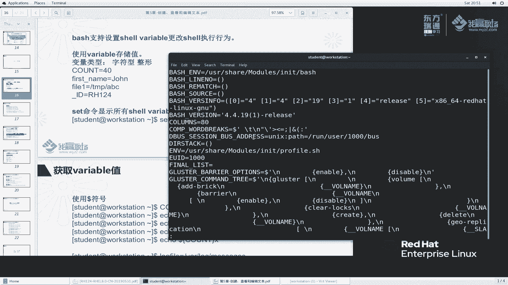
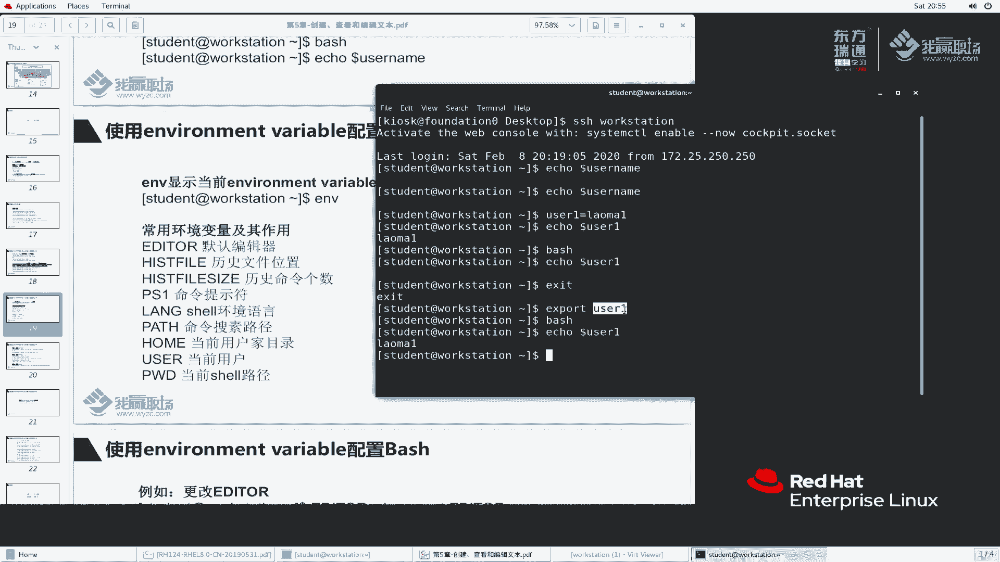
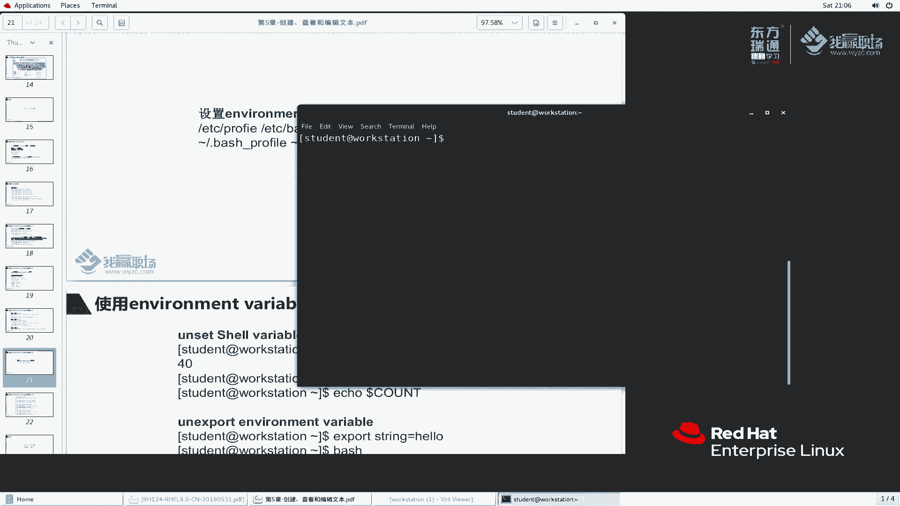
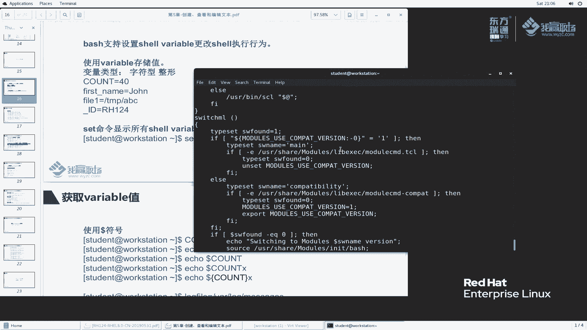
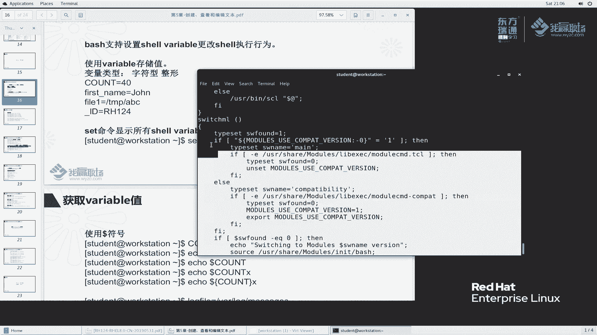

# 红帽RHCE8红帽认证RH124认证课程【全】 - P19：05-3-更改SHELL环境 - 北京东方瑞通 - BV1KM4y1M71q

同学们好，欢迎来到我赢职场HCE8课堂，我是马老师。这节课呢我们来给大家讲一下sll里边的一个环境变量。啊，这个是到底是什么一个东西呢？在我们之前给大家讲这个命令提示佛的时候，给大家提到了一个什么？

PSE不知道大家是否还记得了。那么我们再来给大家详细的展开来讲一下这个叫变量，好吧。

说bss呢支持设置shall变量，以更改bs的一个执行的行为到底什么个意思呢？啊，那么说使用sll呢来存储值，哎，使用变量啊，使用变量。我们之前说例如说我们给大家举个例子，user是吧。

user name等于例如说我叫老马，这样吗？我们说等于一个老马这个用户我们来看一下，看一下到底说echo一下doll了这么一个user。

user啊user name。他给我显示这么一个名称。其实我想做一个什么事情啊，我们给大家看一个ID。ID我们加这个。这样我先I student大家来看一看。

此时大家可以看到我执行这个ID加上这个stuil字符串，他给我显示什么，显示这个t的用户的信息了吧。然后我们来换一个。关于这个。那么来看一下。好，给我们显示什么？显示我们说这个值是代表老马。那么。

ID到了这个用户，就相当于ID老板。他给我们显示了这么一个结果。啊，那么这里边这个这个表达式呢，我们称之为对这个变量进行赋值，是这么一个语法。啊。这里面并不是命令啊并不是命令。

它是shall里边一个特殊的一个语法。将某一个变量赋予一个值，好吧，负一个值啊。OK那么这个系统里面到底当前有多少个变量，具有哪些值呢？我们有一个命令啊，用于显示它的一个变量set。回去。这么多是吧。

这么多啊赛的回车，我加上1个LSS。然后我们搜一下，刚刚我们配置的叫user name回车。找没找到。说user name等于老马是不是啊？哎，找到了这么一个变量，这个是我自定义的。

他他给我们放在这里面的。那你这个地方这么多，到底是从第一个开始来看，那么这里面到底给我们定义了哪些变量呢？bs啊b事代表什么？代表我们当前运行的be事程序是哪一个程序啊？Bb。

那么这个blash运行过程当中呢，它这里边会有一些选项好，blash option对吧？字面意思啊。那么还有一些bechRC songs。那么我们用户登录8RC的时候。

这个这个bass的配置文件RC文件我们要不要去让它生效呢？啊，要生效好吧，要生效。那么等等等等，我们定义了变量，当你程序去执行的时候，我会根据你的变量是什么样的一个值。那么我来执行相应的操作。

说白了就是你sel程序怎么去运行，那么这个由我们的变量来确定。

好吧，由我们的变量确定啊，那么再往下看。这里面还有好多啊，当然这个地方显示的有点怪怪的啊。那么也不管他，即使你这个显示怪怪也没有关系，反正你是代表一个值，对吧？😊，那么再往下看啊。

这个我们看到都能理解是吧？哎，这个等于什么这个等于什么，这个地方还要带有括号的，就感觉有点怪怪的是吧？这样啊，我们找几个大家比较常见的这几个啊来看一看。嗯。histt hist control啊。

说忽略什么什么之类的，对吧？呃，ht file size唉，这个地方我们会用啊啊，看这个吧。He is the size。大家还记得我们在命令行里面执行命令的时候啊，总是给我们弹出总是把这个记录啊。

总是写到我们的配置点b historyory这个文件里面去默认的对吧？那么这个命令里边到底能够记录多少行历史记录呢？有我们这个变量定义。如果说我们这地方写了11000。那么你你最多这个配置文件啊。

最多就记录1000个啊，不可能超过的，好吧。像这种home，hos name和ho type它都是自动生成。你说我主机名是什么呀？就是这个对吧？这样我们再给大家看一下。

ecle一下dollarho name。是什么呀？是这个吗？哎，我执心host name呢大家来看，好像是一样的嘛，确实是一样的啊，就是一样。

但是你不要认为我这个命令等同于他两码事啊两码事虽然说得到相同的结果，但并不代表这两个就是同一个命令，好吗？那么继续回头回头回到我们刚刚那个地方来说。

我当前用户优是代表user啊ID我当前用户生效的用户的UID是什么？是这个东西。啊，还有很多一些东西很多一些东西啊，哎，我这个呃这这个终端的行这多少列啊，collums，我这个bch终端多少列啊。

多少列啊，大概有80啊80啊。好，这是我们讲的这个变量用于控制bsch的这么一个行为啊行为啊。

那么他的查看的方法给大家写过了，以及它怎么负与值的啊，负予值的啊。好，我们再来看啊。但是这个sell变量呢是有一个生效的范围的，它呢只能在当前sll当中生效。什么一个意思啊？我们ele一下什么？

ele一下do user name。

use the name这个是我自己定义的啊。那么我们再来新开一个窗口。

还是登录上来SH worktation上面来。

大家来看一下啊，我再来艾一下这个。挨le一下刀了。Dollar user name。看看有没有这个值了。user name没有了吧。所以说你定义的这个值啊，跟我们这个地方是完全不同的两个程序。

你是A拜事成，你是B拜事成这两之间的环境变量啊，这个这两个之间的这个变量值啊是不互同的。然后就个说我再来定一个useruser一等于老马一，那么一下啊，user一。好，他有，那么这个地方有吗？

艾 call一下do了us the e它是没有的。好吗，注意它的生效范围只是针对我当前的这个sll程序去生效。

那么我们再给大家看书本上这个例子啊。那么我执行一个办事程序。在be事程序里面，我在ele下do了us E。哎，老师，你这个是在excel程序，我这个地方好像也是在excel程序里，根本没有开两个端口啊。

那为什么这个还没有这个值呢？那么我们要给大家讲一个啊，我之前之前我执行命令的时候，在我们这个sll里边程序。那么后来我又开了一个sll，我给大家画一幅图啊。这个是我当前的sll程序啊。

当前的sll程序啊，此时呢你在我这个里边，你在这个我这个sll里边又执行了一个sll，我给大家画大一点啊，这是我当前的sell啊。那么此时呢我又执行了一个子sell，在这里边又又开启了子sll程序。

你原先的user is在我外面的啊，你又。嗯。你原先的这个是在我们的外面user一它的范围是在哪？是在这个范围里边的。所以说你新起的拜事程序是我这个拜事。那么你这个环境变量呢，生效的范围就是在我外面的。

与我新生称出来的这个办事这个子程序啊，与我新执行的这个子程序就没有任何关系了。好吧，没有这个，它是一个独立的程序啊，好吧，是一个独立的商要程序。所以说你环境变量不生效了。

那如果说我想让这个环境变量也生效，那怎么办呢？

可以呀可以啊，我们需要做这么一个事情啊，把它导出。好，我首先推出来。再执行1个EXport。Export user E。好，我把这个变量导出来，导出来之后呢，我再来执行一个b。然后呢。

再来ecle一下do了UZ。此时大家发现了啊，我在这个紫禁城拜事里边也能够看到。说明什么呀？说明我们这个变量它的一个有效范围放大了。是不是啊放大了吧。那既然这个范围放大了，那是什么命令导致的？

是这个命令。这个命令意味着将我们这个变量啊，我们这个变量我们之前说叫就叫变量，我们可以理解就叫普通变量。那么当我们执行了这个命令之后，意味着把这个变量放大了。此时这个变量就变成了叫环境变量。

专业术语叫环境面料，它的有效范围要变大了。

好，变大了。那么你这个有效范围变大了，那么这个窗口里面会不会影响呢？来试一下，哎口下有没有那当然没有了，你这两个程序还是独立的程序。那么当你执行了这个命令，它只会让我们这个。

当前的sll程序里边的一个子sll程序也会继承，只是让我的子进程会继成这个变量。那么你其他程序他当然不会通知了。对吧啊就是这么一个意思好吧，这么一个意思啊，这是两者不同的程序。

那么你你只会让子程序里面去继承，其他不继承。

那么对于系统当中这个。inventory environment的环境变量，这个列表我们怎么看呢？ENV来查看。

来放大一下啊，ENV。

ENV里面给我们显示了有这么一些，相对来说还也也是蛮多的哈，也是蛮多的。来看一看吧。好，EMA给我们显示了一个说LS color好，什么意思啊？LS。杠L啊，就LS吧。还，好像有很多一些颜色嘛？

蓝色是代表好代表什么？代表目录，这个白色是代表代表普通文件。那么你为什么给我着色呢？好，说明我们有这么一个变量导致的这个变量呢定义的时候，帮我们生成这么一个东西，好吧。那例如我我们我们我们。

当然这里面还有其他一些变量啊，我们也会经常用到的啊。书本上给我们提到了说默认编辑器。

那你你应用程序执行的时候，有时候会生成一些系会会调自动的调用调用一个编辑器来去打开一些文件。那么你默认调用哪一个编辑器呢？它由我们这个edit变量去调出来啊，history历史文件的位置是吧？

历史history file size历史文件的命令的个数啊，history file size。那么PSE命令提示符我们给大家用过了，对吧？

longungry shellll我们这个sell环境里面的啊，你执行这个sell里面用的一个语言啊，sell环境的一个语言，它啊是sll环境的环境语言。那么这个比较有意思，我们待会给大家演示几个啊。

pass。

命令搜索路径。当我们执行一个，例如说PAS我按t键。啊，PA这个命令啊，one type键，那么他给我们搜索到这么多。这个命令从哪里搜索出来的？它这个命令就是由我们这个ele里面搜索出来。

就是有这个叫PAIPAATH这个变量里面搜出来的。那么看一下啊，例如说ecle一下。哎，看一下。ECHO。到了PAATH回去。那么他给我们显示了，所以说当你去找命令的时候。

他会从以冒号风格的这么一些位置去帮助我们找到这么一些路径。好吧，以冒号风格的证明一些目录。当你去找命令，他会在这个目录下面去找可执文件，并且以他开头的。

好吧，这叫pass命令搜索路径。home当前用户的加目录user当前用户PW当前摄啊，这个都比较常见是吧？基本上这个用的比较少啊比较少。那么对于这个。environment的变量啊。

它这个我们怎么去更改呢？跟我们的普通变量也是一样的。好edit导出一次好吧，或者是放到一块，直接导出都行啊，都行。哎，我们来试一下这个啊，我当时来显示一下date。

写一下时间。我想把这个语言改一下，改成什么呢？改成这个啊。我们如果说这样执行，看一下有没有效果。

把它复制一下。粘贴一下。好，我们再来date一下。看一下生效了吧。确实是生效的啊，它对于我当前的环境生效。那么如果说我启动一个b一下，我们再来敲一个什么，再来敲一个date，哎，好像也生效了是吧？

太奇怪的是吧？艾 call一下dollar浪啊。正常情况下不应该生效的，他怎么他怎么自动给我们导出了呢？好，这个浪语音它既然自动导出了啊，那么就不管了啊，不管了啊，正常情况他不应该这样子的啊。

OK我们还可以什么更改这些变量的质啊，更改浪实现什么效果，更改它实现什么一个效果，好吧。那么我们再回头看。如果说我设置了一个值，我想把这个值取消怎么办？

对吧这个值我现在不想要了，不想要了，我们就执行export。这样啊，我们还是找那个先退出一下。

TEX等于TR。啊，退出吧，都退出，我们还是有这这个为例啊。

嗯。ecle一下啊，ecle一下dollerus E。当前呢是没有这么一个值，我们export一下啊。export user一等于。老马一这么一个用户，然后呢。

ecle一下do user e这个用户是能够有的。同样我开了一个紫禁城，那么再来e一下do user e，它还是有。那我不想要这个环里面呢。首先我们退出来EXID。退出来之后，我做一个什么事情呢？

我要export。

根据我们这里试一下，我们port里边有一个叫什么？有一个叫杠N，看看是不是取消的杠N。

再加上我们的这个叫user一这个变量，好吧。再执行办事，然后再来艾一下doll了UZ。没有了吧。好，通过这种方式取消。好，这个杠N去取消，注意你取消的位置啊，我之前是在在我们这个sel里面去定义的。

那么当然你要在我们这个sel里面去取消。

好，一定要确保他的位置。当然了当然了，其实我们这个地方呢。

可以试试这个能不能取消OK我们再来一次啊。现在这个cel里边呢，我们还是定义一个。退出来。退出来EXIRT我们定义的这么一个。这么一个柚子。然后呢，bsh一下啊。

我们再来e一下doer use the E。有这个值推出来，我们使用unet，看看能不能取消这么一个值un set use the。再来被实一下。然后我们挨扣一下。招了柚子意哎，这种方式也可以。

好吧，un set也可以取消这个值。你想unet把这个变量的值都取消了，那你想你环境变量的这个值也就跟着取消了。好吧，跟着取消了啊，稍微注意一下这个我们讲的范围。

那么大家再来看一下这里面的。用户登录的时候，这个讲的稍微有点深啊，大家如果不理解，没有关系啊，大家先先先暂且知道这么一个东西就行了啊。

我们讲你用户登录的时候会运行一个ba事程序，对吧？就像我只你你登录我我们用户给大家说一下啊，看我退出来退出来再退一次。

卡住了是不是？这样关掉。

算了吧啊，新建一个窗口。再来把你这个关掉。

然后我们再来放大一下。你看我登录的时候，登录work stationation的时候，回车，他是不是给我们开了这么一个sel程序啊？啊，开了一个拜事程序啊，那么我们来编辑一个文件啊。

打个比方编辑一个这个用户加目录先点beRC文件。啊，这个地方我做一个事情啊，例如说我就做一个export。export什么呢？呃，我们讲一个。啊， stringring。嗯，还是us name吧。

us name等于等于什么呢？老马杠hello好，我们就随便取这么一个东西，好吧，保存退出。此时呢这个文件没有生效，我们艾le一下。Use name。没有这个值是吧，ss一下点8RC。

再来看一下这个值生效了吗？生效了，说明什么呀？说明这个文件里面的配置我们生效了。我们可以通过这种ss方式手动让它生效。当然我们也可以退出登录，让它。再来看一下这个字挨口一下，看看有没有自动生效。

也自动生效了。那么你为什么就自动生效的呢？那么要从用户。执行的拜事程序开始。当你用户要执行办事程序，他会做这么一个事情啊，他首先。首先会ss啊。首先会s ETC profile。然后会sice什么呢？

会sice点用户加目录下面一个点bsh。但 profile。然后再ss一下加目录上面点b是RC。belashRC，然后再s ETCbelashRC。

好，大家此时可以看看你无论是哪一个用户，他都会执行这么一个文件，也会执行这么一个文件。那至于你加木录这个地方，你是否要是否要定义呢？取决你自己，我可以把环境变量或者说普通变量定义在这里面。

也可以定义在全局，全局就全局这个文件是全局的这个文件也是所有用户都生效啊。那么。取取决你自己的范围啊，根据自己的需要去定义在这个位置，还是这个位置，以及呢还是用户加目录的这么一个位置。都可以好吧。

都可以啊。我们讲这个让我们的所有用户生效，还是说单个用户生效的那为什么用户获取sll程序的时候就是这样子呢？

哎，操作系统他就是这么烦啊，就这么烦了。当然了，我现在使用的是be事程序啊，那比如说我使用的CSH这个be进程呢，那么它跑的就不是beRC了，是CSHRC。好吧。好，这个地方呢我们给大家讲那么多啊。

嗯，看一下还有还有没有其他的要补充的啊。嗯。好，这个要注意一下啊，这个环境变量的一个它的一个有效范围界定，通过大括号去界定。这个呢之前我们给大家说过了。还有一个需要给大家说明的。

就是我们刚刚执行set的时候啊，set的时候，他这里面给我们提出了很有有很多这个东西。

这个东西它是代表一个整体哈。

这个是代表一个整体，我给大家放大一点。

啊，这样来看啊。

大括号左大括右大括号，这个地方是代表一个整体。那么这个是代表什么呢？它们是代表一个函数块。

什么叫函数快啊？嗯，有一点开发。学过开发的同学应该会明白一个问题啊。我要开发程序，那么很多一些程序的代码块是可以重复利用的那对于这种可重复利用的代码块呢，我给它做成什么，我给它做成一个函数。

叫functionction。那function的语法就是这样啊。这个地方我们不不讲啊，这样我给大家去去写一下啊，还是这个嘛嗯。这样我VIM11啊生成这么一个文件啊。我把这个文件呢复制过来。11。

点一下啊。VM11点SH吧，写这么一个东西。大家可以看到啊，那么如果说我想把这块都删掉，我我先给它删掉啊，大家来看一下啊。那么这个就是我们讲的函数的语法，这是函数的名称。你调用的时候使用这么一个名称。

那么这个函数体里边具体做什么事情啊，那么我们这里边呢，其实他做了这么一个事情，代码块。老师这个代码快太复杂了啊，看不懂没有关系啊没有关系啊。等以后大家对sll熟悉的话，慢慢再来学这么一个东西啊。

很多一些有命令的那么我作为老师啊，很多一些语法我也搞不清楚，那其实也没有必要搞那么清楚，好吧。

这是讲的sll程序。那么这一张呢这一小节啊，我们就给大家讲了一个sll的环境变量。还有一个呢就是sll的一个sell的这个变量啊，sll的变量，而且还有一个sll的环境变量，好吧，主要这么2块。

那么大家呢回去之后啊，多做做练习OK啊，今天就讲到这儿。

