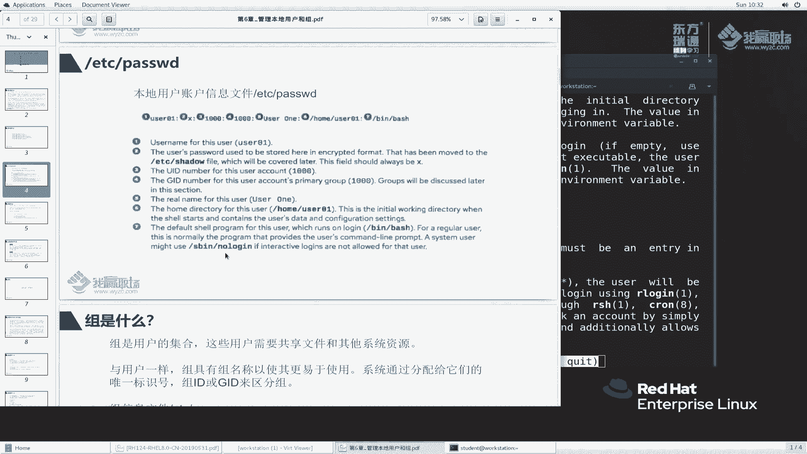
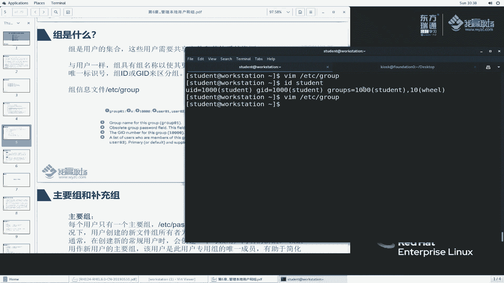

# 红帽RHCE8红帽认证RH124认证课程【全】 - P20：06-1-用户和组介绍 - 北京东方瑞通 - BV1KM4y1M71q

同学们好，欢迎来到我0职场IHCE8课堂，我是马老师。今天呢我们来给大家。讲一下第六章管理本地用户和组。那么这个章节呢，我们主要分五个部分给大家说明。第一个呢，给大家介绍一下用户和组这么一个概念。

以及在操作系统当中承担的角色。第二。那么呃我们正常使用的是是作为普通用户就去登录到操作系统里面去的。那么有时候需要一些做系统管理的任务。那么这个任务呢，只有超级管理员、超级用户才能够执行。

那如何去获取超级管理员呢？在这个章节里面我们会介绍。第三个部分，管理本地用户。第四部分管理本地族。哎，那么。操作系统里面，不同的用户不同的组具有不同的权限，需要执行不同的任务。那么这些用户呢。

我们需要对他进行一些修改啊，添加啊等等等这么一些信息。第五呢，去管理用户的密码啊，用户我们添加成功之后啊，他这个密码需要定期的更新啊，设置一些密码策略啊，以及维护的密码等等等啊。

那么我们来看一下第一个部分。用户是做什么用呢？大家想想啊，在操作系统我们去登录的时候，就拿windows为例。那么我们去登录的时候，正常情况下去使用普通用户去做一些啊办公就够了。

那么对于系统维护的任务呢，我们可能就需要管理员任务啊，也就是说，使用不同的任务去执行不同的程序来来执行相应的管理任务。所以说此时这里面用户是承担什么，提供一个安全边界。安全秘见啊，大家想一想啊。

比如说我们现在有这么一个问题，我这个服务器上呢是一个超级管理员账户root。那么每一个维护人员上去之后呢，都使用这个root用户去维护操作系统。万一万一这个用户不小心啊去做了一些事情啊。

影响了系统的运行。那么我们如何去追究这个事情呢？到底是谁执行的？这个不好追究吧。啊，这是很重要的一个方面啊。用户账户呢是用户是操作系统的一个安全的基础。那系统上的每一个进程啊。

都是以特定身份来运行的那每一个文件呢也会有由特定的用户和组去拥有。那每一个用户对不同的文件也具有相应的权，不同的权限。文件所有权有助于系统对文件用户实施访问控制。好吧。😊。

那么例如说我们给大家看一个东西，以windows为例，windows里大家可以打开什么任务管理器。

任务管理器里面去找一找。啊，这里边看一下有没有显示。当前当前这个地方好像没有给我们显示，是不是啊啊，状态CPU内存磁盘任务管理器。里边好像没有给我们显示，我们看这个吧。这个没有是吧。嗯。这个地方打开来。

好，此时我们发现，那么当前我用户运行的程序是正明线。嗯，他没有显示其他用户是吧，应该说其他用户应该可能应该是没有登录啊。我当前的系统就使用这么一个用户来登录的，好吧。

那么对于links来说，它也有相关的命令啊。例如说我们执行一个命令叫PS杠EF啊，回去。他给我们显示了很多，大家可以看到appache rootot KL can这些呢都是代表用户。

那用户执行相应的程序啊。而且与用户相对应的这边有一个叫什么，叫UIDU IDD。这个用户名叫user name，它是方便我们去记忆的。就像我们登录系统的时候，我说一个用户名啊UID那么我总不能去数字吧。

啊，这个与访问网站类似，我访问百度网站3W点百度点com或者直接输百度点com。那我有必要去记百度百度点com对应的IP地址吗？没有必要啊。那么这个UID呢，这个数字呢只是用于计算机来标识的。

计算机来识别。我们呢这个作为人工呢我们是不需要去记这个ID的。

啊，只是非极少数的情况下，就我们去解，一般来说就给计算机用的。好吗？好，我们来看一下。在操作系统里面，他的用户呢。有这么几类。超级用户。系统管理员对吧？那么用于管理系统任务。

它的名称是rootUID是0，有且只有这么一个账户啊，注意系统用户里面只有一个root用户。第二。System user。这个是超级管理员，这个呢是普通的啊，我们讲普通的系统账户啊。

普系统这个系统账户主要是做什么用呢？刚刚我们给大家去PS杠EF的时候看到一个东西，例个是partache用户。那对于这个apartache用户，他们这个账户呢是专门用来执行什么执行HTBD服务的。

HDBD服务是一个系统进程，是一个服务。那这个服务呢它运行的这个账户呢，我们称之为系统用户，普通的系统用户。啊，操作系统里面有很多服务，那么基本上每一个服务呢，它都会使用一个系统账户来去执行。啊。

这样呢方便我们的权限隔离。你想想，如果使用root，那麻烦大了。万一这个服务这个服务有漏洞，打个比方，这个服务有漏洞，那么他拿到是root权限，那么它就会对我整个操作系统造成了非常大的一个危险。好吧。

而且这种账户一般来说它是不允许登录到操作系统的。你这个用户只能够只能够去执行某一个程序，而不能够。不能够去以交互式的方式登到操作系统里面，就像普通用户一样，登录到操作系统来去查看文件啊，它是不可以的。

啊，他是不能够获取这个登录是shall的啊。普通用户。在我们登录系统的过程当中，例如说student账户KIOSK这个账户，那这些账户呢都是普通用户，用于我们常规的日常工作。好吧。

再来看一看我们有哪些命令会涉及到呢？其实冠春整个links操作系统里面呢，很多地方都会有这些用户的影子。那么我们给大家看一个啊，比如说我首先登录到student艾我们的worktation机器上面来。

在这个地方呢，我们执行ID student。这个命令我们之前也给大家执行过，大家看到的是什么呀？好，说明什么ID student，我来看一下这个用户的身份。ID什么identident啊。

可以这么理解吧啊。鉴别这个用户的身份。那么student身份是什么呀？说这个tudent他的ID啊UID是1001001000。那么它的名称是他同样呢这个student呢他的组组要1000。

然后他的组的名称也是student，老师这个组是什么意思啊？啊，就像我们打个比方，就像你是一个家庭成员，对吧？你是哪一个家庭成员？你诞生之后，那么你肯定属于某一个家庭啊，这属于哪一个家庭成员啊。

家庭的名称啊，属于哪一个组来户人家。Groups。tu呢除了属于这一家啊，那么他还属于额外的一个组，那这什么意思呢？你除了在这个家是作为一个成员，那么你工作之后，你属于某公司里面某一个工作组，对吧。

你是属于某个部门的某一个成员，那属于某一个组。那么当当然它可以属于很多个组。在我们这里边呢，它属于vio组。好，这是我们讲的ID命令给大家看到的东西。那还有一个刚刚我们讲的PS杠EF1样。PS杠EF啊。

可以看到哎，好像变了嘛，这是student用户，root用户啊，studentroot用户操作系统当里面有很多个进程。那这些东西呢我们暂且不说，反正大家记得了，这是我root用户。那这个命令呢。

这个程序呢是我root来执行的。啊，还有LS杠L。LS杠L去给我们显示的时候，那么这一块这块是代表这个文件谁用的？这个student啊，讲的简单一点，就是说这个文件是student当初创建的。

所以说这个这个文件呢归属student来管理啊，就这么一个意思。那么同样这个叫组文件呢是属于student组拥有的。让student组拥有的啊，只要是student的组当中的成员。

那么他就会对这个文件具有相应的权限。啊。这是我们讲的这个文件权限管理的需要，好吧。

那么我来看一下，那么操作系统登录过程当中或者操作系统当中的这些用户都存在哪里呢？是不是啊大家很关心啊，那么对windows里面来说，估计啊估计大部分都不知道哈。

只有极几极不极个别的人可能会知道有一个叫pm是吧？那类似的那么一个文件。那在linux里面它比较简单。😊，用户的账户信息就保存在这个文件里面。这个文件大家看起来应该比较熟悉吧，我们经常见，对吧？

以前我给大家演示文本文件的时候，经常打开这个文件来看。同样的我们再来给大家打开来看一看haide杠N哦，不要杠N了，就haide好吧，haide ETC pass。我们看的是前十行。

前十行里面给我们展示一下啊，大家来看一下这个文件的格式。冒号冒号冒号是不是啊？固定的冒号格式。这个冒号前面是。大家可以看到啊，root好像用户名嘛，X什么意思啊，不知道。零什么意思啊？零什么思？哎。

我们刚刚讲过这个ID哈啊，再看一下。😊，ID rootot啊说明在UID。是不是UID他是UID呢，还是他是GID呢？不清楚啊不清楚啊，以及这又是什么意思呢？不知道。😡，这样啊。

我们不是之前学过慢帮助吗？慢里边是不是有一个慢pass嗦的？那么这个pa说呢，我想看它的配置文件的格式，我们就来卖一个什么漫5去看它的一个格式。往下翻。在这里面去找。有这么一个部分。所如果呢你要。

所以如果你要创建一个新的登录呢，所首先要你要在。兔一个是吧，将这个信号在这个password里面，这个fieldd，然后呢去使用密码去设置它。这样啊，我们看这行关键的在这里。说这个文件啊。

这个文件的每一行呢都描述了一个单个用户，而且呢包含77个什么7个冒号风格的这么一个域feel的域是吧？也就简单一点讲，我冒号风格的这个地方有7个。啊，7个，那每一个都有代表特定的含义。

第一个代表什么意思呢？来看一看。Ne。代表用户的loin name，用户的登录名。说呢应该哈应该不包不包含大写字母是吧？不应该包含大写字母，反正我知道它是个用户名就行了啊。第二个它呢是什么？

我们第二列是代表代表密码加密的密码。哎，其实我们刚刚看到的内容是什么呀？这样我们给大家再来打开。嗯，这样开吧，新的终端好吧，太标签。Worktation。嗯，我们去VRM吧，ETC passport。

因为它有高量显示啊，我们找到什么，找到suddent里边来。找一找啊。Student。在在这好吧，在这啊，我们就把这个拿过来，就放在这儿好吧，来对比一下。😊，第二列。

他说的是一个要么是秒说this is either，要么是一个加密的用户密码，或者是一个什么或者一个星号，或者呢或者是allet X。那么具体是什么呢？我们要参考这个文件来说明。

反正这个地方放的是密码相关的信息，对吧？可以是X，可以是星，也可以说其他的加密的密码。那在这里面我们可以看到当前是什么？当前是X。那么这个X代表什么意思呢？哎，我们能不能去找一找哈。

慢这个慢这个八里面去找一下这个8X代表什么意思，好吗？来，我们先退出。退出一下。慢8，然后这个。好，这里面文件似乎比较多是吧？我们来找关键字，看看在哪个位置。嗯，这里边好像有一个X，我们来看一看啊。

每个程序呢都需要必定的啊，在开始之前啊，PW呢和非常类似。首先呢在这个文件部分呢不要存在文件当中。然后呢。sle呢don't have extra means字没 byupdate啊。嗯，我来找一下啊。

大家稍等一下。啊，其实呢就是这块哈这块啊这块写了这么一大长串。😊，我给大家简单的翻一下。直白的说就是什么呢？用户的密码信息。

存在ETZ password在这个位置是用X代替。原先啊原先我们在list刚出来的这么一个环境里面啊，它的密码是直接写在这个位置的。后来呢后来它的密码啊是用单独的一个文件来写的。

然后后面我会给大家讲叫ETC shadow这个文件。那么这个位置一般来说，我们就使用X代替。X代表这个用户是有密码的。好吧，是有密码的啊，但是呢这个密码是存在ETC shadow里边的。

所以说大家看到这个地方，那密码呢基本上都是X来看一下。

好，XXX啊XX好像没有说其他的标号吧，都是X啊，大家记住是这么一个回事就行，好吗？那么再回到stdent这个位置来。stuuddent位置的第三个列是代表什么意思呢？😡，继续看啊。

第三列代表这个用户的用户的什么，说这个用户的登录账户啊，当户Ssup IDD0好，root账户是0。代表这个用户的UIUID啊，但入用户R是UID是0啊。那么再来看GRD它也是一个number是吧？

但是呢它是代表这个主组。也就是说我们student的这个用户啊是属于哪一个主组的，属于哪一个主组啊？这个吧啊这样我们给大家拿过来，这样大家看的有点眼睛有点晃了，是不是？那么。放到这里面来。嗯，B好。

就放到这个吧好。或者这样吧啊。单独的放在这个位置，大家来看。好。用户的UID这是GID。那么这个又是什么呢？啊，这个是student，它的一个描述信息叫ggraph。也就是说，用于表明这个学生呢。

他是什么一个什么样这么一个账户啊，做什么用呢？他会加一些描述信息在里面。好，再往后看directctor。direct代表这个用户的加目录。你想想我们创一个用户的时候，那么这个用户会给他分配一个加目录。

那就像windows里边的对吧？windows里边我桌面上会有一个会要有这么一个用户的加目录啊，双击。

那是代表你加目录里边存放你自己的文件。是不是啊啊，这叫加目录OK在lin里面也是一样的。那么我们student的用户的加目录在哪？在这个位置。

home student。那么一般来说，我远程登录上来这样啊，大家看我远程登录上来的时候，是不是默认情况打开的，就是这个位置啊。是不是他的家目录？确实是这样吧。好，再来看最后一列。

最后一列是代表晒有程序。说是一个程序啊，那么用户在登录的时候要执行的这么一个程序。如果说是空的，那么他不会使用这个。那么我们student他用的是什么呀？兵办事兵办事是什么程序啊？来，我们退出一下啊。

不保存。我们执行过半是吧？办事说白了就是这么一个程序，这么一个终端窗口提供我们的办事程序。

OK啊，那么关于这个文件内容呢，我给大家解释了一遍啊，其实这个b事程序呢有很多。那么我们刚刚给大家提到了一个bsh，还有一个SH啊，当然还有很多CSHTCHH啊很多嗯。那么对于系统账户呢。

我们一般来说给他分配的一个叫SB no log。这个SB log意味着什么呀？你用户如果想登录操作系统啊，那么你正常情况会给他一个可以登录的，像这种，那么我会给你弹出一个交互式的窗口。

那么这个SB login字面意思就是什么系统的按进制程序，系统过系统相关的进程序。那么no login是什么呀？不允许登录。那么你这个账户一旦连上来，他就不给登录。好，我们找一个账户试一下啊。

例如这里面有一个叫aparache账户啊。

那么我们看一下appartache啊。还是来找一下这个文件吗？嗯，首先退出啊，退出一下。那么连上来去我教一个大家命令，我简单一点啊，这个以后大家看起来会方便一点。

APPAACHE这个其实我们之前也讲过是吧？PASSWD。AAC Aache。好stdent的用户这上面没有part是吧？嗯，那么我们看这个啊，我 up看我们这个物理智商有没有。他用的是什么呀？

是这个账户吧。那这个账户我能不能登录呢？啊，正常情况肯定是不能够登录的啊。那么这样啊，我连接我的本地SSH啊，我们将SB log。这样我直接切换吧啊，我首先切换成root用户。所为起右子。

那么我们再来试一次啊，叫SU杠apart。回去。他提示我们什么这个账户当前是不可用的那我SU杠 studentdent。29杠KIOSK。可以切过来吧，你入的用户切任何一个用户都可以切过来吧。

这个是我是我是按多的哈，再来大家再来看一次。😊，可以切换过来啊。但是呢你刚刚那个appartache用户，它是Sb login呢，它就不可以登录。啊，就是这么一个道理。

好了。这是我们讲那个用户的信息保存的位置。这个文件大家来看一看文件的权限是什么。

啊，默认情况下这个所有的啊ALS杠LETCpass。这个文件默认情况下，所有用户都是能够读取的。大家想一想啊，我们操作系统用户要登录的时候，我要去比对吧，我 student用户去登进来。

那么我 student要比对你这个用户名啊是什么，他是哪一个shall，我必须要读取这个信息，我才能和他对才能和跟他校对，看看你个用户的。登录用户名和密码信息，对不对啊，如果不对，哎，对不起。

那你就没办法读取了。好吧，这个文件是所有的用户都是能够读的。OK那么我们再来看一下主信息啊。组是代表用户的集合。那么这些组呢会根据需要去把我们的用户啊去重新进行一个组织。一般来说啊。

我们用户对用户去付付权的话，那么相对来说比较麻烦。因为我们在一个比较大的项目里边，可能有很多用户，这些用户呢可能具有相同的角色。例如说我们有一个开发人员啊。有一个开发组，这开发组里面有10个成员。

这10个成员呢，对于我们这个目录啊，或或者说对于我们这个门件他都具有编写权限。那如果说我们对于普通用户去赋权的话，那每个用户都要付一次。那怎么办呢？我们把这些用户啊添加到一个组里面去。

那么组添加完成之后呢，我们对于这个组去付钱，这样呢就方便的管理。啊。是这么一个意思啊，组的信息是保存在ATTCgroup里边。当然组呢它也有组ID啊，一般来说要GID来区分。那么看一看主ID在哪呢？

还是以student为例。呃，到我们的这个worktation上面来，打开它的文件ATTCgroup。回车。好，大家可以看到我们这里边，我们找一个啊。找一个什么呢？就找一个vi组。

大家来看一看这个will有组里面给我们提示的什么信息。同时呢我们再来慢一下慢。5group。看他能不能给我们查到一些什么有用的信息。那么这个fe的是如下。首先。第一个显示我们的组名称。

那么我们的will给我们显示的组名称，对吧？第二显示什么显示这个密码加密的密码说呢说这个加密的组密码，如果说这是空的，那么就是说没有密码。

那么我们这个地方是使用XX与我们之前讲的这个ETC password那个地方X是一样的。哎，你用户登录需要密码，那么你这个组为什么需要密码呢？大家想一想这个问题。啊，其实这样啊。用户是需要密码是登录的。

那么主。需要密码是做什么用呢？组我需要管理吧，组我需要把添加用户吧啊删除用户吧。哎，那么组里边的成员的管理的时候，我们也需要这么一个组密码。但是呢往往情况下，我们很少设置这个主密码。啊。

大家知道有这么一个东西就可以了。再来看第三个列。第三个列是什么呀？是GID这个组的ID吧，最后一个user list。us the list说a list of your name他是这个组的成员。

是这个组的成员啊，那么我们来找一下viO组的组成，现在有一个student啊，我们刚刚看过对吧？看过退出来ID student。这个stiel呢确实是属于这个组。好，我们再来看一个东西。对比一下。

那我再往下面去找student。诶，没有是吧，说一下。回车。will有组里边有一个成员叫stden，那我stdent的组里边呢？哎，我tu组里面为什么没有自己呀？😡，好，这里面要说明一点啊。

那么这个是属于student用户的主组。我tudent谁于啊？student我的主组是他，也就是说在这个组的界面里面，他不显示你的。成员。啊，如果说你的用户是他的主组，那么他就不显示了啊。

这个比较比较特殊。反正你记得，那么这个是补充组，补充组会显示他的成员。如果是作为主组，那么他就不显示了。

这个细节大家一定要搞清楚好，搞清楚啊。所以说我们刚我们刚刚提到一个问题叫主组和补充组。啊，补充组的成员资格由他的文件来确定，他确定的是补充组，并不是主组啊，主组啊一定要确定啊，一定要确定啊。好了。

这节课呢我们就给大家讲了一下。😊，主用户啊的概念以及呢他们相关的配置文件。

