# 红帽RHCE8红帽认证RH124认证课程【全】 - P21：06-2-su和sudo-1 - 北京东方瑞通 - BV1KM4y1M71q

同学们好，欢迎来到我音职场HCE8课堂，我是马老师。这节课呢我们来给大家讲一下如何获取超级用户的权限。好，那大多数情况下呢，我们都会使用普通账户去登到系统里面去，只执行一些叫日常的一些任务。

那么有时候呢，我们操作系统当中需要做一些管理任务。那这种管理任务呢，并不是我们普通用户具有的权限，只有超级账户才具有的权限。那例如说。我们现在要安装一个软件包，对操作系统呢去增加一些新的功能。

那服务器上某一个服务我们要把它停止掉。就再里如说我们这个用户的管理，我要想添加一个用户，删除一个用户组的添加设备的添加。那么例如说硬盘的格式化，创建文件系统。等等等这种操作，那普通用户肯定不能这么干。

再理如说，管理员我想强制把某一个用户账户注销，不想让他登录，不给他登录。那你说A用户能去禁用BO户吗？能干这个事吗？肯定不可行啊，只有超级管理员可以做这门事。

那么我们怎么样才去获得这个超级管理员的权限呢？好，这个获得指的是如何去切换成这个用户。并不是说啊我现在只有给你一个普通用户，我来教大家搞个破坏。如何去获得我们管理员账户，不是这么一个意思啊。

指的是我们如何从普通用户的角色切换成超级管理员这么一个账户啊在这里面呢，其实我们之前呀给大家使用过相应的命令。例如说SU命令。那今天呢我们再给大家详细的讲一下这个SU命令开始之前呢。

我们首先做这么一个事情。SU刚刚hel来看一看。

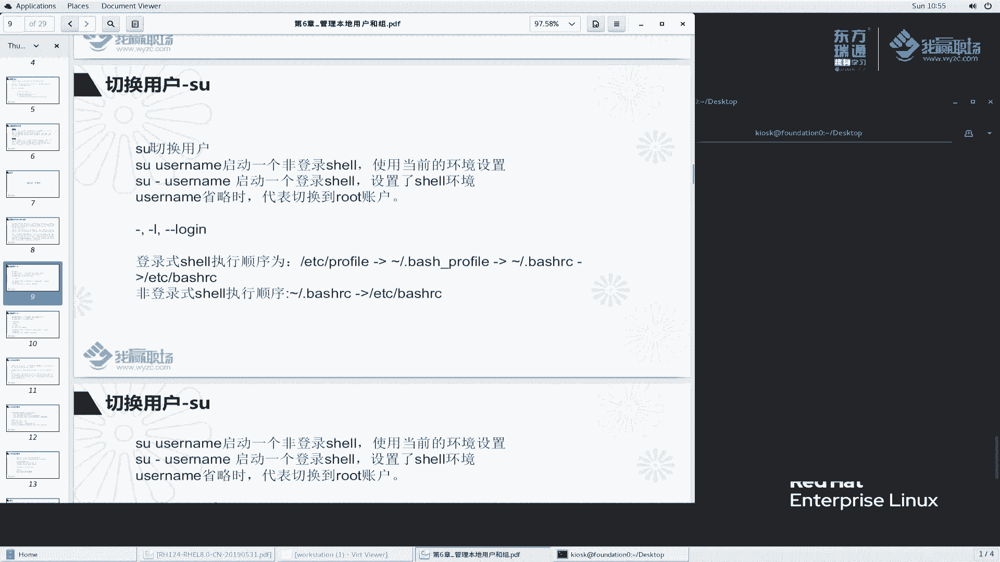

这里面给我们提到说SU切换的时候啊，说加一个选项，加中横杠加user，然后再加上其他一些选项，然后其他一些参数参数啊。呃，命令这么多，这样啊，我给大家先简单的演示常见的几个例子。

然后额外的我再给大家补充一下。

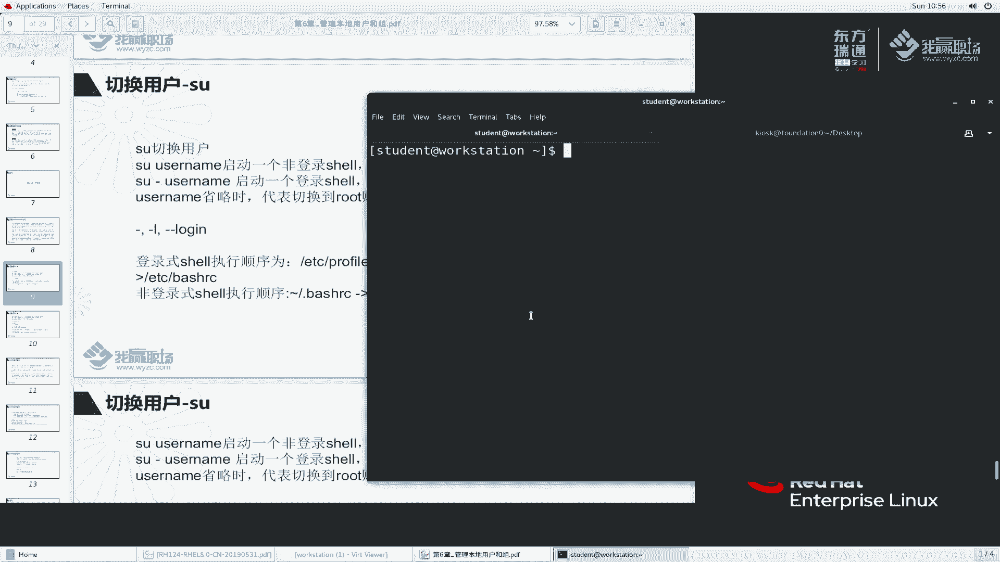

第一种写法叫SUuser name启动一个非登录式shaL，使用当前的环境变量。

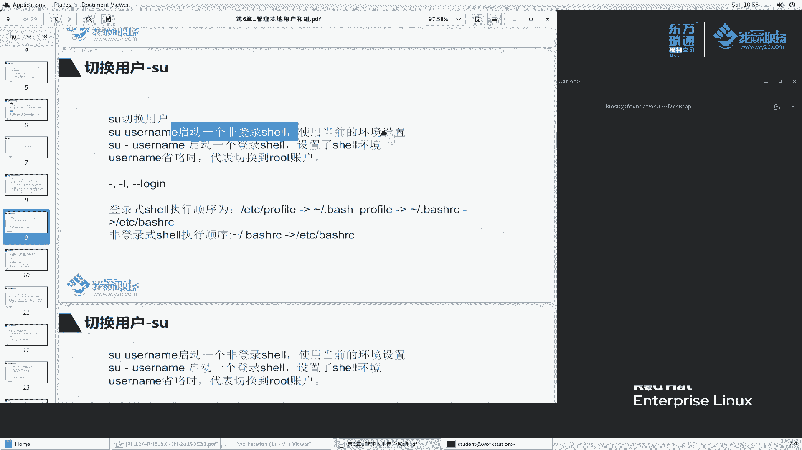

不知道大家还记得哈。我们之前给大家讲环境变量的时候，有一个叫pass啊，是一个home啊等等的hell，这些都是环境变量。那么这些变量是否会继承到exc里边去呢？

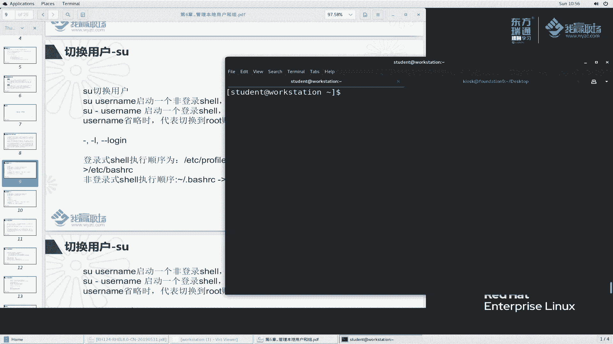

它要取决于你有没有把这些变量做成一个环境变量。如果是环境变量，它就会继承到。如果不是环境变量，那么它就不会继承到子变量里面去。

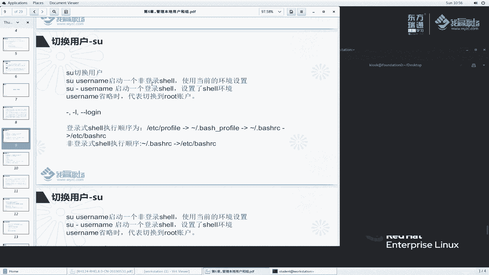

对吧那么我们如何让它去生效呢？首先我们要做一个事情，export，对不对？做了这么一个操作。那如果说我们S就直接加上用户名的话，那么这种切换的用户他默认情况，他是不会把这些环境变量带过去的啊。

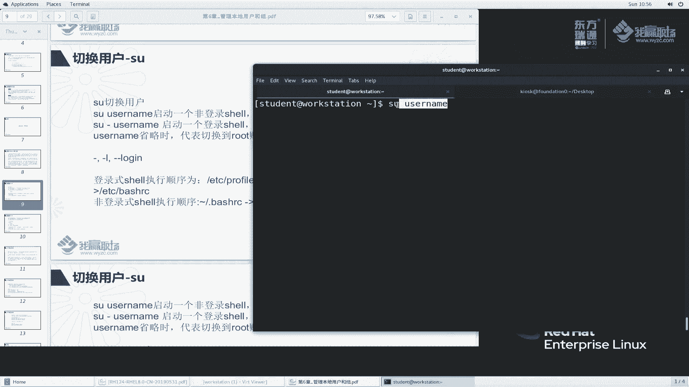

是不会把当前的这个环境变量带过去的。但是呢他自己会设置当前的环境变量。

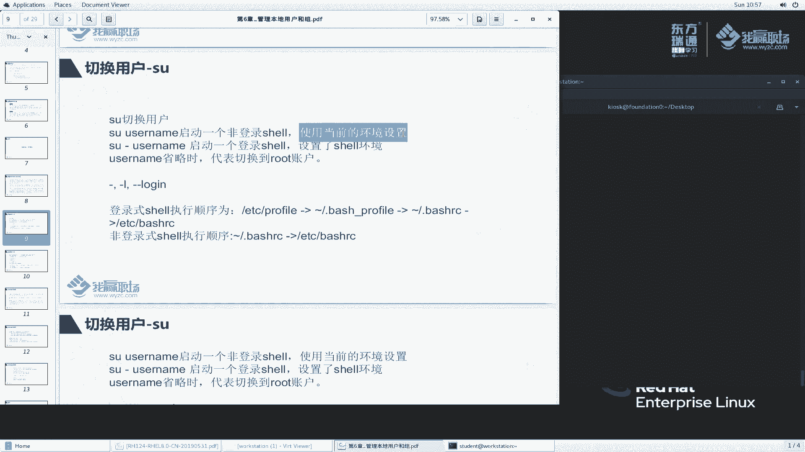

什么意思啊？大家还记得的？我说之前我们用户要登录这个cel程序的时候，我们要默认的每一个cel程序登录它都有这么几个啊ETC profile。还有一个是用户加目路选点bsh。半是 profile。

还有一个加目录下面点点8杀2RC。还有1个ATTC白12岁。

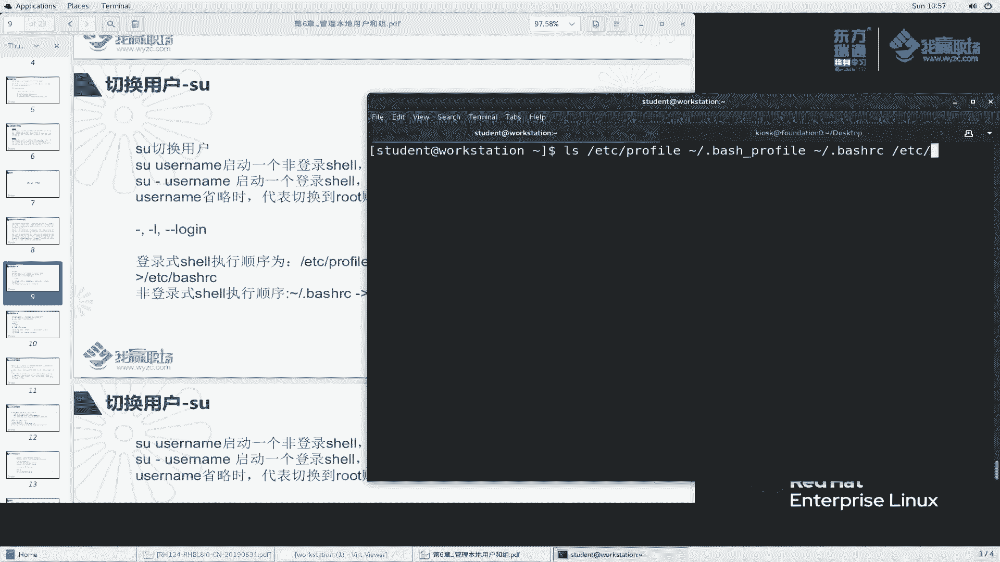

啊，我这么说啊。这里边一共有4个文件。如果说如果说你我们大家采取的是SU加us name去登录的话，那么他会干一个什么事情啊？他只会去执行这个目录当中的一些。变量只会让这些目录当中的变量去生效。

大家还记得我们要ss吧？好，执行这个命令的时候，那么它会s这里边的一个变量。好，那么如果说你只执行的是这个SUuser name。那么他会做为什么呢？他会去继承，他会去把这个变量所有的四个文件都读一下。

把原先的这两个也会读一下。好吧，记住了他的一个有效范围啊，除了这两个，他也会读。总结一下SUuser name只只会读这两个变量里面的一些文件啊，变。如果SU杠user，那么这四个文件它都会读取一次。

啊，多举一次啊，这里面提到一个说啊启动一个登录shall设置shall环境变量啊，那么使用现有的sll盘，这些都会启用啊。如果说你不用了，那么它只是使用一个当前的环境变量啊，当前的环境设置啊。

记住了好吧。

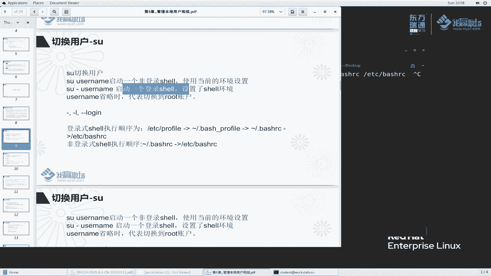

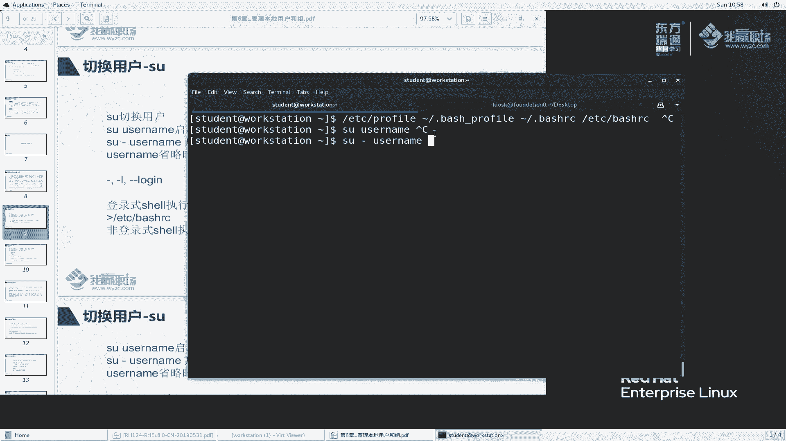

那么SU不加这个user name的时候，那么它就代表什么呀？说user name省略的时候啊，就是说我们这样。

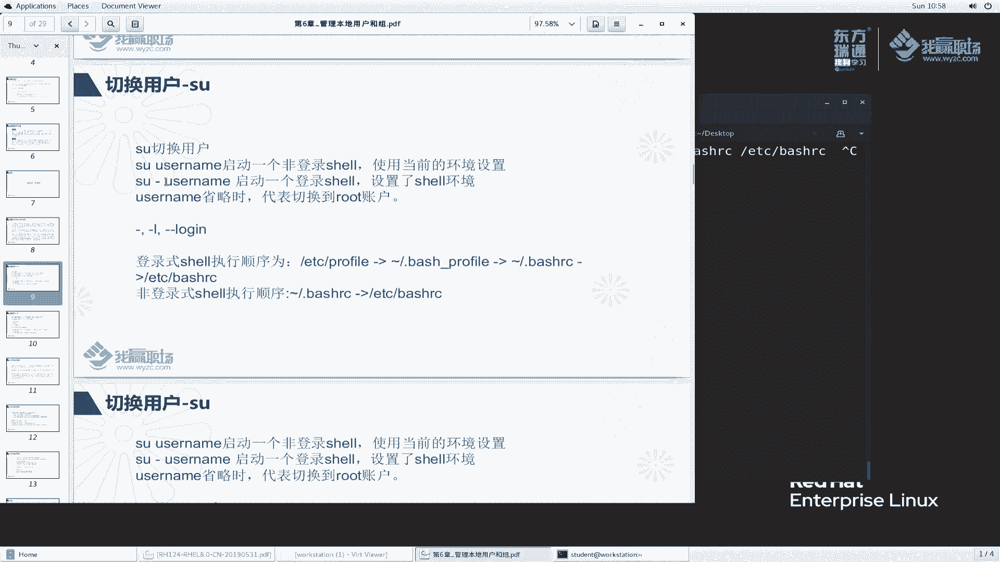

SU啊，对吧？或者说SU杠。那这两种方式默认都是代表切换到root用户。O啊OK啊，那么我们来试一下。😊，第一个哎，看一下我们这个里边有没有一个用户叫老板用户的。那有密码是redhead吗？

密码应该不是啊，没可能没有这个密码。这样啊，我们切换成超级管理员账户。啊，我们先切换成超级光联，看一下回车密码redhead。大家来看一下当前的路径。PWD。此时我没有加中横杠的，没有加中横杠。

那么这个PWD是不是使用之前的呢？好，这样我再给大家退出一下啊，来看一下效果啊，退出。退出。现在呢我在stdent账户下面，我敲1个PWD，他给我显示是这样，或者说ecle一下，到了PPWD。

他给我们显示的是这么一个路径。那么我现在执行了一个SU命令。SU命令回车密码呢是太。那么我们再来看一下e下doll了PWD。他们是是不是继承了原先的？好，继承的原先的啊，那么我们给大家进行一个对比。

推出来我SU中横杠回车密码暂时re害的。然后我们再艾一下PW点。到了PW点，其实我都不用ic call了啊，大家应该看到这个提示符了。我之前是在哪个位置啊，在这个位置吧。现在我通过这种方式登录的时候。

大家看一下我路径有没有变变了吧。

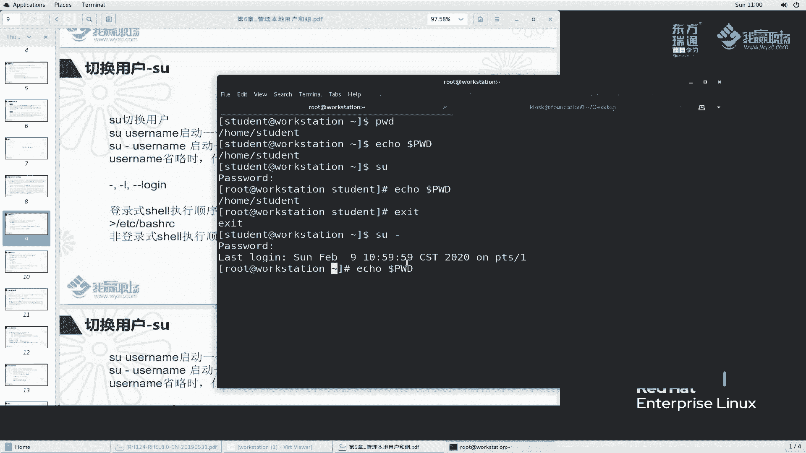

对吧我变成我自己的环境变量了吧。😡，所以说你加中横杠的时候，用户呢会重新设置Cel变量。如果说你不加的话，那么他会使用之前的啊会继承之前的一个Cel环境变量。好，我们讲的这个中部中横杠的作用啊。

这个纵横杠呢也可以理解为杠L杠L和中横杠和杠杠logging，它们都是同一个意思。那为了简单简化写，我就写一个中横杠。其实中横杠大家呃大部分情况下，我们都是使用一个中横杠代替就可以了。好吧。

以及这个登录shall和非登录sha它的执行的一个顺序啊。刚刚我也给大家写了一遍啊，那么为什么要给大家讲这个东西呢？你想想啊，我们用户如果想设置自己的环境面量，例如说张三用户张三用户登录到系统里面。

或者说就以这个老马用户为例啊，那么ID老马。

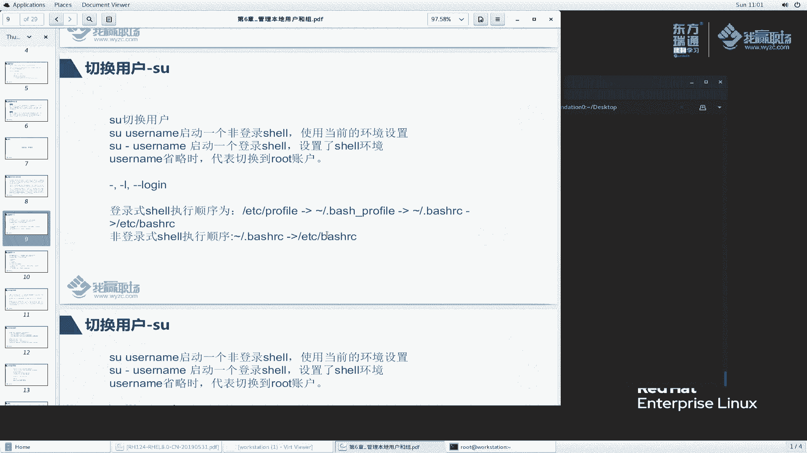

我老马用户如果说登录进来的话，那么我需要我自己的环境变量，这个环境变量是不需要给其他人，那我怎么设置啊？

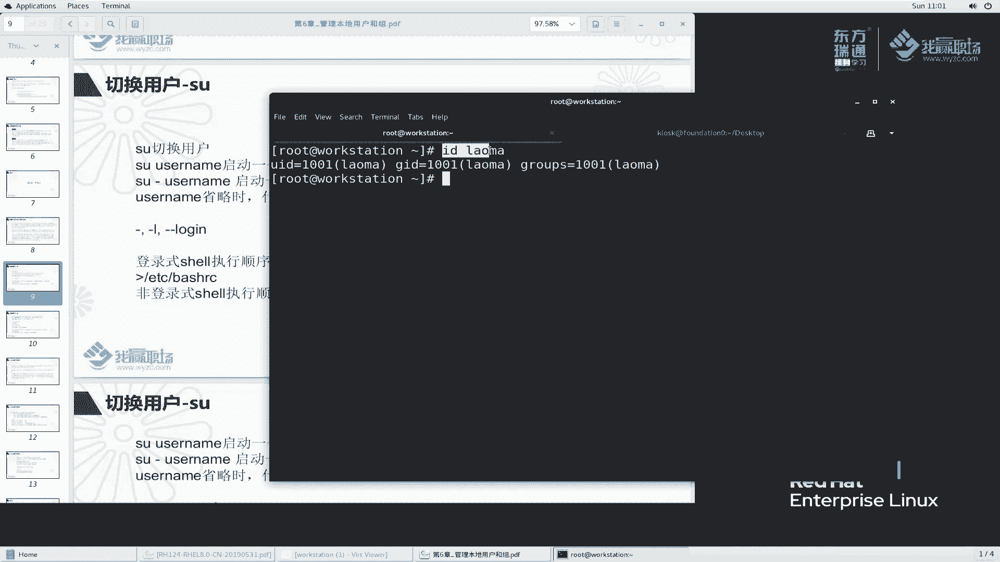

我只需要在这个位置设置就行了，是吧？好，只需要在这个位置设试试。如果说你要想在这个位置设置，你想想这个位置是所有用户都生效的那不行的，是不是？那么建议怎么呢？要么是这个位置，要么是这个位置。

这两者都可以。环境变量是它是针对单个用户的啊，这是针对我当前用户的啊。那么这是针对全局的这两个文件。啊，一定要注意啊，一定要注意啊。

好了，我们刚刚给大家讲了这个SU的命令啊。再来哎还是推出来SU杠杠help。刚刚我们给大家讲的是一个杠L，那么其实还有一个叫杠C。刚C说我们传递一个命令给sll。好，之前我们跟大家演示下。

对比一下SU杠，我们就以root用户为例root密码readhead他给我们切到了root账户。如果说我SU杠root，然后再杠C执行执行个ID命令来看一看，大家看一看这个命令到底是什么个意思啊。ID。

哎，认证失败了是不是SU杠杠C杠C我们加一个单引号啊。看是不是这么一个意思？好。关于这个杠C的命令呢，我们要单引号给它括起来，否则他就他就懵了啊，他就不知道什么意思。好吧，他啊我们再输个密码。来看一下。

我现在当前的提示符是什么呀？提示符还是student。但是我这个ID的命令是以谁的身份来运行呢？我执行ID的时候，他给我返返回的是这个。如果说我执行student的时候，我执行ID。

他给我返回什么返回student说明这个ID是以root身份运运行的。这样能够达到一个什么效果呢？那么我可以使用SU这么一个账户去切到指定账户，以指定用户去执行什么权限啊。

以指定用户去执行指定执行个命令。那么这个命令执行完成之后，又返回给我当前用户了。啊，这个用法非常的啊非常的好。在我们后续学习其他课程的时候，会经常用到这个命令，好吧。再来看一下它的其他的用法。

SU刚刚hel要。杠S这块。这里边呢还有一个杠S杠S呢指的是shall。也就是说我去刚刚以这个为例啊。我们去执行这个ID的时候，那么ID是交给哪一个shall程序来处理呢？是交给B办事呢。

还是说交给BCSH，还是说交给BSHH呢？好，就是说哎我们要使用哪一个shall来执行这个命令。那么其他的话还可以指定什么？

指定主组是不是啊说指定一个primary还可以指定一个补充组使哪使用哪一个补补充组的权限来执行相应的一个命令。啊，因为这个文件啊这个命令，他每个用户啊，每一个组他对应的权限是不一样的。所以说呢。

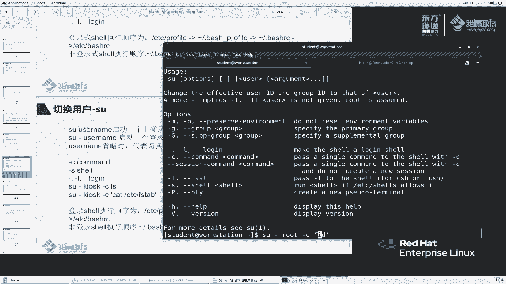

你要是指定不同的用户，不同的组。那么他就获取相不同的权限。OK啊，大家一定要注意啊。那么我们再来看一个。刚刚是加带引号的，如果不加带引号的时候就会出问题啊。ID刚刚我们不加的是候出问题了。

特别如果对于这种啊ATC。ET red这样我们就加个ETC后。那这种方式更应该加引号了。你想想你命令里边有这个分割符。这个分割符是代，但是其实它是代表一个完整的命令。那如果说你不加单引号。

它就变成什么杠C cat，后面又单独加了一个，此时就麻烦了啊。对于它是一个整体的命令，我们一定要用单引号给它加起来，否则我们就无法识别了啊，注意这一点，来read ahead。好，说出出来。

那我不加试一下。rehead。就卡在这了是吧？卡在这了吧。其实相当于什么？其实就相当于我们执行那个cat命令。啊，就相当于只行开庭命令啊啊，注意一下啊。那么后面他就没有识别啊，没有识别。

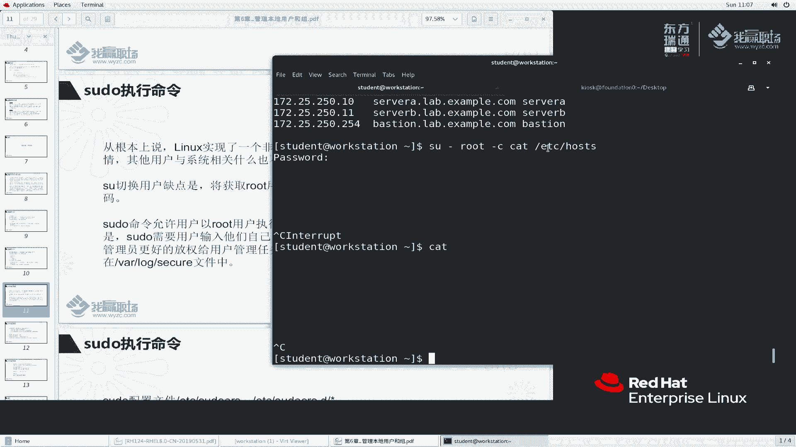

啊，大家有没有发现刚刚我们讲诉有的时候好像存在一个问题。你要切换成别的用户的时候，那么你必须要输入别的用户的密码。

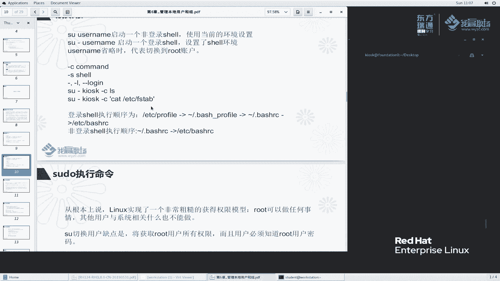

例如说我切换成啊这样我切换成root用户。re hide啊。密码错了。重新来一次。我们给这个老马用户啊设置个密码。rehead。rehead啊。

那么我们作为student的用户去切到这个老马的用户上面来。那么这个密码我们说的是老马啊，密码是redhead。好，我们切过来了。那问题在于什么呀？问题在于。

如果说你想以这个身用户的身份去执行命令的时候，你必须要知道这个用户的密码。有什么不好挺好的吗？不不就是应该这么设计的吗？😡，好，似乎好像没有什么问题啊。那么我给大家举个例子。如果说你是普通用户。

你没有关系。如果是对于root用户呢。我们整个操作系统里面，我的管理员不止一个。可能有两个、3个、4个。那么如果说这些四个管理员都是使用root用户，而且都知道root用户的密码，那么去管理任务。

执行一些系统管理任务。那么我怎么知道谁去执行的任务啊，是张三呢，还是李四呢，还是王五呢，是到底是谁做了，这个就麻烦了。啊，因为你这个张三李四王五都知道这个root密码。啊。

所以说呢我们如何去避免这个问题，如何去实现我们这个地方要提到一个考虑到一个问题，叫审计。

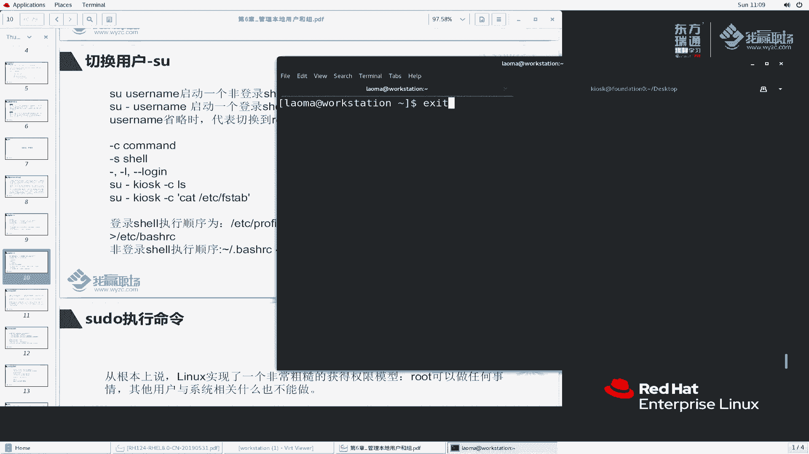

好，审计啊，为了解决这个问题呢，我们这个地方呢又给大家提供了一个获取管理员的这么一个命令。他呢叫苏度来看一下啊来看一下啊。那话说呢，我们修的命令是实现了一个非常粗糙的一个权限模型。

root用户呢可以做任何事情。确实是这样啊，那么HSU切换的时候，那么必须要知道入用户的密码。那为了解决这个问题呢，我们使用速度命令。速度命令呢允许用户以root身份执行一个命令。或者以其他身份去执行。

哎，好像与我们刚刚的SU好像没什么区别呢。大家看这个地方啊，与是又不同的是速度需要用户输入他们自己的密码，而非他们想要访问用户的密码。你A用户想执行这个命令，你输我自己的密码，那有什么意义呢？有异义啊。

非常有意义。大家想一想啊。你在你的电脑上面windows界面，你去办公的时候啊，你办公的时候你在执行自己的事情，对吧？你自己登录自己进行办公。办公完成之后，你离开桌面，离开桌面的时候，你忘记锁屏了。

此时注意啊，你忘记锁屏幕了。

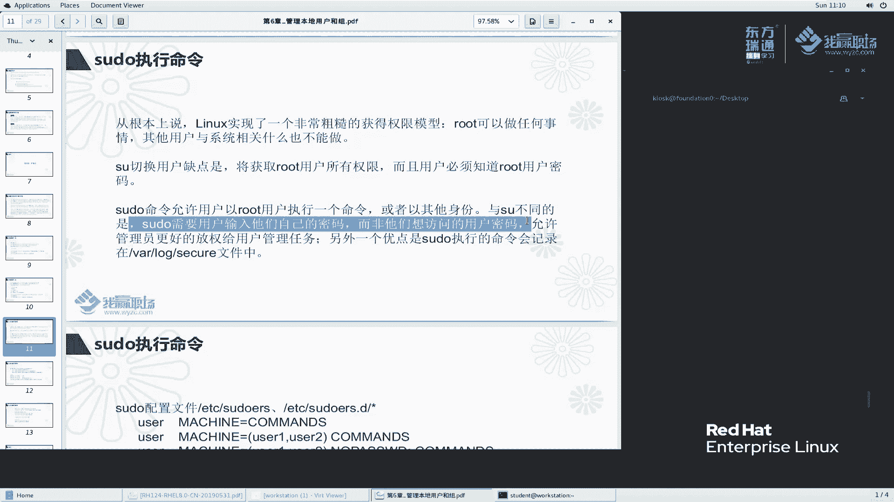

如果说在这种情况下，别人到你的电脑上面来执行一个用户的密码更改操作。我来更改我的密码。如果说不提示你旧的密码啊，直接就让你输入新的密码。是不是存在安全安全隐患？

就像我们之前讲的叫PASSWD我回车的时候，他提示你是不是你当前的密码是多少？验证是不是你这个当前用户自己来操作嘛？因为密码正常情况下只有用户自己能够知道。如果你不输入的话，或者输错的那表明身份不是你。

即使我们这个啊你这个用户当这个用户的所有者离开了，那么别人也是改不了密码的，除非管理员。那对于速度，它也是这么一个思路。也就是说你想使用速度命令去执行管理员的身份，那你要表明你的身份。

使用你的密码来表明你的身份是用户自己的密码啊，而不是超级管理员的密码。

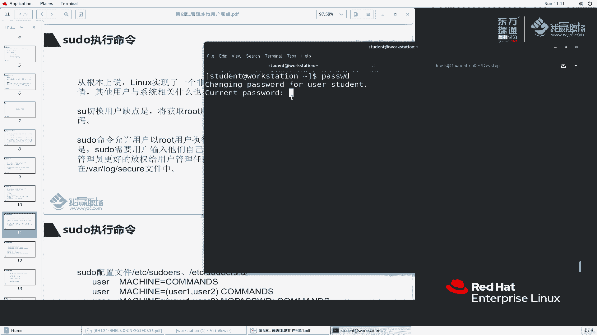

啊，这是第一个优点。第二个优点。速度的执行的命令啊会记录在日志当中。

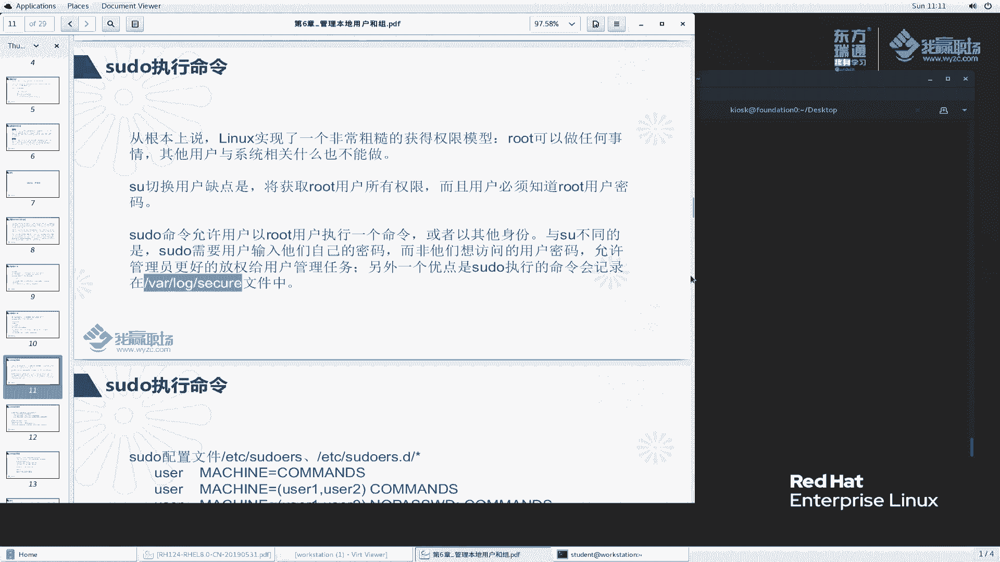

你哪一个用户？啊，一哪一个用，比如说你A用户或者说student用户，student用户，你以什么用户，你以老马用户呢？还是说以root用户去执行了哪些事情？

这些工作都会记录在我们的onelog security这么一个文件当中。好，这是我们讲的第二个优点啊。第三个优点。我针对每一个用户，我可以控制你执行的命令。Com on了。

com我A用户能够执行什么com，我B用户能够执行com，C用户又能够执行什么com，这是可以自定义的。我管理员提前提前给你配置啊，我A用户只能够执行命令去安装软件包维护软件包。我C用户呢。

我作为账户管理员，我只能够作做用户管理的相关。例如说user我给你user delete我给你。好，是这样赋予。

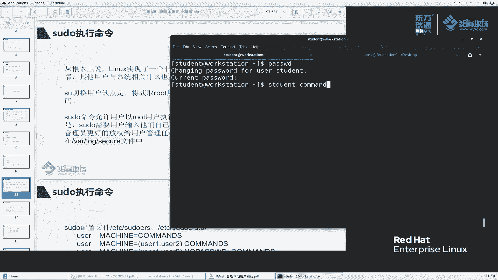

好吧，速度这个工具相对来说更个性化，更好用。好吧，我们首先来看一下这个速度里边给我们提到的一个配置文件，我怎么去配置呢？好吧。来看看速度的配置文件，在ETC速这个主文件里面还有一些辅助文件。

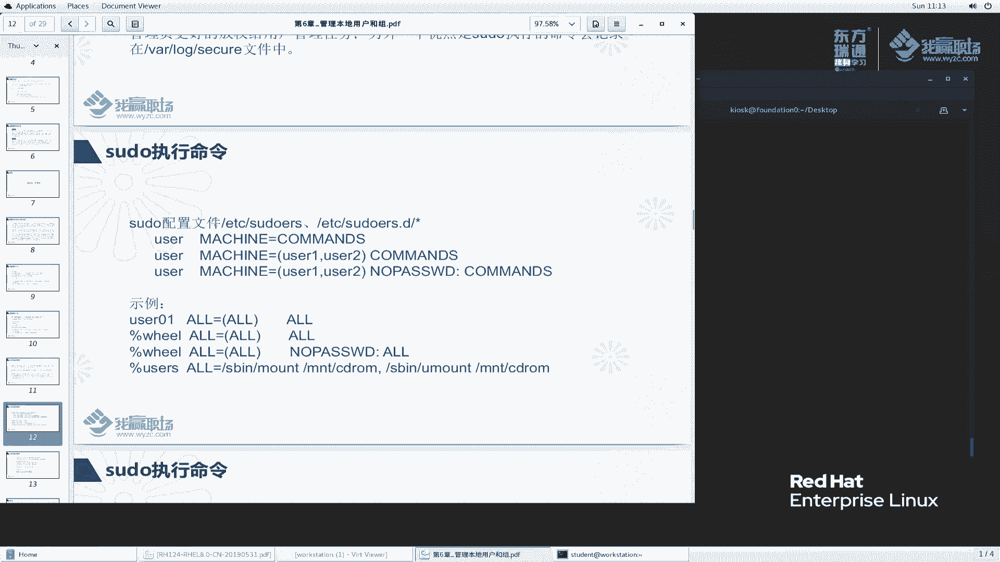

来打开来看一看啊。首先呢这个文件只有超级管理root有权去做。我们切到超级用户rehead。到这里面之后呢，我们去VI啊，VI打开这个文件ATTC速 do us。速都回车。在上面啊上面有很多一些说明。

那么这个呢我们首先不看，我首先带着大家去看我们这里面的规则。在这个位置。好，这是我们讲的这个配置文件里面的一个语法。来看一下到底什么意思。用户。A用户啊某一个用户能够在哪些机器上面。

在哪些之项执行什么命令？这个地方其实还少了一个啊少了一个。好，我们先先给大家讲了这么一个语法啊。那么下面有一些例子来看一看。在这个位置有个ro用户。root用户比较牛。

root用户可以在任何一个机器上面去以任何用户的身份去执行任何命令。老师，你这个感觉说的不对吗？我当前只有在我work上机器上操作，说你这个root用户怎么说可以在任意迹象去操作呢？😡。

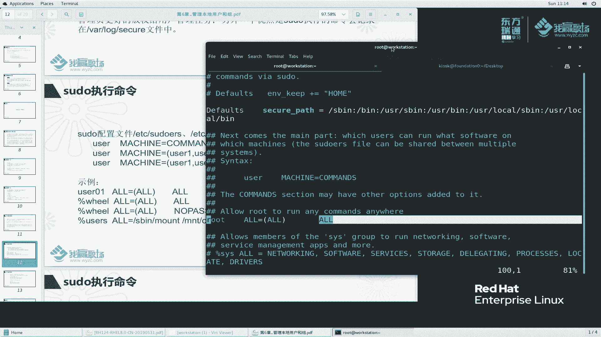

好，我也给大家简单解释一下啊。root用户确实是在当前环境里面，但是在一个比较大的一个集群环境里面啊，在一个比较大的集群环境里面，root用户我们例如说我们讲的域环境。啊，寓环境什么叫预环境啊？

大家应该可能会听过微软里面叫AD域活动目录。所有的机器登录到这个域里面的这些用户啊都会。用户账户信息啊都会集中去保存在我们的用户集中管理服务器上面去。那么这个用户。这个用户呢，你如果说想要登录，那可以。

我要对你授权。那你这个用户能够登录到电脑A上面呢，还是在电脑B上面，还是电脑C。特别是在大的企业里面用的非常多啊，公司确实给你分配一台电脑。那么这个电脑加到域里面去。那么你这个用户账户呢。

能不能登到这登录到这台电脑呢，会对你的权限进行控制。你说我作为A用户普通户，你能不能登录到财务那个机箱面去啊，肯定不可以。那能你能不能登录到某个业务业务的电脑上面去查看业务也不可以。啊。

那对于我们单机版本来说，那就无所谓了啊，你就是在哦哦，其实就代表代表本机，在我本机上面去登录。以任何身份。啊，以任何身份这个任何身份指的什么呀？你想我入住用户，我可以切换成老马用户。

可以切换成student用户，可以切换成等等等。只要你操作系统里面有这么一个用户，我就可以去切换。请问啊2执行任何命令，我root用户当然具有权限去执行任何命令了。好，这里面给我们举了这么一个例子。啊。

非常好啊非常好啊。那么我们再往上面来看啊，刚刚说这个是所有的机器，你在哪个机下面去执行呢？那么这个是代表什么，以什么样的身份，这个是代表所有的命令。二是代表所有的命令。那么再往下看，这都是特殊的写法啊。

二是代表所有命令啊，这个二代表所有机器。哎，你这是代表所有的用户是不是啊？那能不能说我设置一对代表某个组呢？也可以啊。这个will是代表族。如果说你前面使用百分号，那么就意味着这个组当中的所有的成员。

都能够。都符合这条规则。所有的用户当中的成员，不就是哎我们刚刚vi有，好像我刚刚看到一个叫什么student，用好像属于这个组吧，来退出看一下。I D student。student也是属于这个组。好。

说明什么呀？说明我们这个student的权限是超级大吧。跟这个root一样的吧。😡，啊，student很危险很危险啊，在操作系统里面默认情况下，它呢配置了这么一个记录。

willL组是我们H17H118当中具有的这么一个组，它的权也非常大啊。那么我们再来看一下下面的啊。下面的还有一个组，这个是注释的，没有生效。那么如果说你想要的生效可以啊，我们删一下啊。三下。

然后呢把这个地方呢给它注释掉。注释掉，好吧，只要让一个生效就行了。那么此时大家来看啊，好像跟上面没什么区别，唯一的区别在于这个地方多了一个东西。叫no password2。

no password or就意味着这个用户呢能够切换成执行任何一个命令。而且执行命令的时候是不需要使用密码的。哎，我们刚刚说你速度命令执行的时候，不是要表明用户的身份吗？

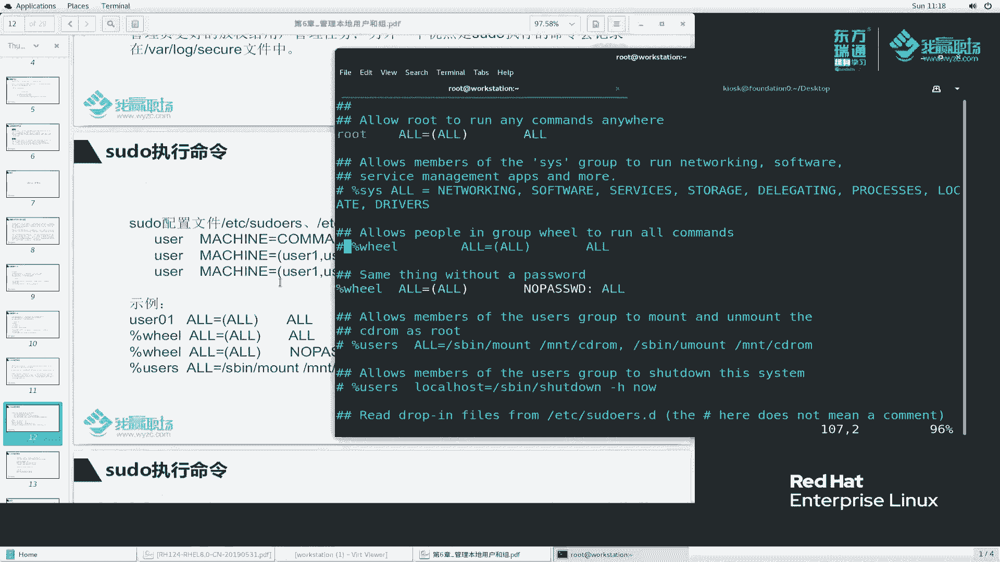

是不是表明你是谁？要输入自己的密码。那么如果加了这个就意味着你执行命令的时候是不需要使用密码来表明身份的，你自己直接可以执行。说明上说明你这个用户比较牛，是VIP用户是超级用户，有特权，不需要指定密码。

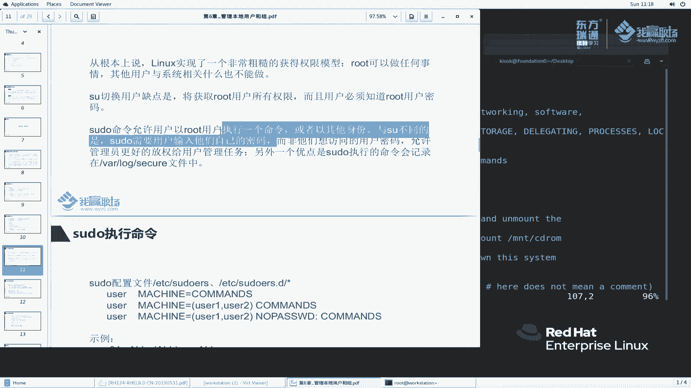

好吧，这是这么一个例子啊，待会呢我会给大家演示啊，我们先把它还是回滚到原来的这个位置啊。😊，啊，这样子。再来一次啊。再往下面看这个例子。好，这个组里边的用户能够在所有的机器上面去执行什么？执行这么命令。

这个命令呢以逗号分割。可以执行S B mount可以执行mountt CD room啊这是一个完整的命令啊。S B mount我可以去挂载这个C光盘，还可以呢还可以卸载光盘。那中间是逗号风格的。

加了一个命令列表，好吧，那么同样的在下面看啊，还有这么一个例子，我只能在我本机上面去，这个是写我们的主机名。啊，写我们的主机名，我只能在本机上面去执行这个命令。啊，这个命令啊。那好，这是我们讲的。

配置文件啊配置文件。配置文件里边又加了一个叫cloud user，cloud user也比较牛是吧？比较能干任何事情。这都是默认设置啊，那么这个配置也很关键。叫incclo EC速度额点D。

他是什么意思啊？好，这个是我们的主目录。它是我们的主配置文件，你执行主动命令的时候，它就会按照这个配置文件来来来执行。那么除了这个主配置文件生效之后，他还会让谁生效啊，再来看一下啊。

那么这个目录下面的文件它也会生效。他这个目录下面的配置文件也会生效。来看一下。好，这个目录下面好像也有一个配置文件吧。那这个配置文件的格式与s度呃这个配置文件格式是一模一样的。来ca一下。

里边有一个lab速度。来找一下找到什么呀，说我们这个组啊这个组是all2哦no passport，我们实验环境里面需要的这么一个组啊，然后他可以干什么事呢？可以执行这么一些命令。

额外的是不是啊额外的执行这明命令。好，我们暂且就记住就可以了啊。它的格式跟我们讲。跟我们讲这个主配置文件的格式是一模一样的，两者都生效。而且大家有没有发现一个问题啊，就是说我这个目录下面的文件。

它好像也没有说没有说是以什么什么特定格式结尾的吧，扩展名称。例如说你是s度，能不能说点速度结尾的，没有随便加一个都行。好吧，随便加一个都行。

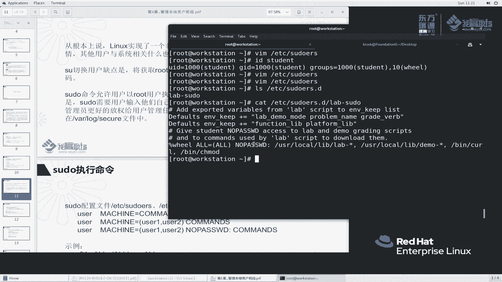

那么在这里呢，我把这个配置文件的格式啊给它简大家简单讲了一下啊，那么。

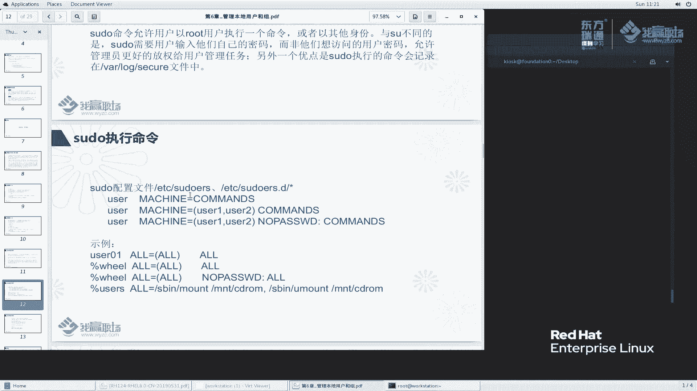

再给大家说一个东西啊，其实我们只是讲了这个语法啊，那么对于这个。哦，怎么写呢？啊，对于这个这个地方有没有一些特殊的写法呢？或者说后面的有什么特殊的写法呢？有啊有啊，那这个地方呢，我们下节课再给大家讲啊。

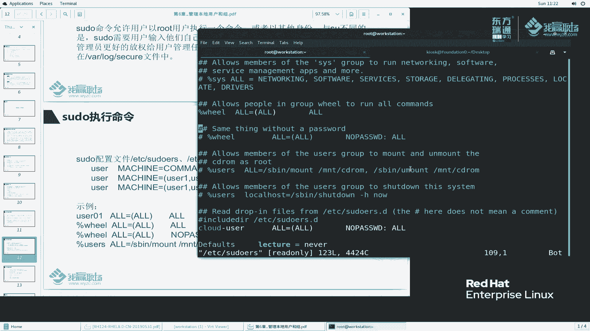