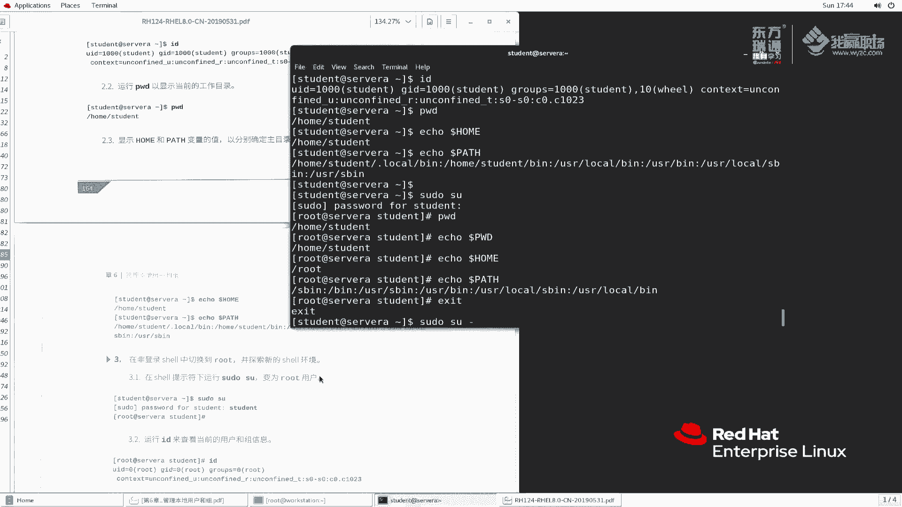

# 红帽RHCE8红帽认证RH124认证课程【全】 - P22：06-2-su和sudo-2 - 北京东方瑞通 - BV1KM4y1M71q

同学们好，这节课呢我们接着刚刚的讲啊，刚刚呢我们给大家讲的是什么呀？来看一下。😊。

S， S student at worktation。写到我们的注册账户。那么VMATC。速都呃。杜是啊。那么刚刚呢我们给大家讲的是这么一个东西啊，就是呃底下的这里面的一些规则。

那么其实在这个地方呢和这个地方，还有这个地方我们都可以做一些变化。那做哪些变化呢？好，我们回到最上面来看啊，他说呢我们可以对这个主机啊做一个别名。那么大家看我们这里面当前的啊，当默认的情况应该是这样啊。

这个这个地方下面是我加的，我刚刚在这里面做了一个实验添加了一些记录，大家来看一看啊，ho host做设置一个主机别名。那么lab service代表什么呢？

代表serv a server和worktation。也就是说，我们想在这个主机上面去执行命令，好吧。那么除了这个我们再来看一下能不能定义用户别名呢？也可以啊，user admitmin。好。

我们加了一个U加了一个addmin这个管理员组啊，注意前面的我们都一定要大写啊，一定要大写。如果是小写的话，那么就会出错，不识别了啊。admin代表呢老马，比如说我们多加几个，再来逗号。老马2。嗯。

老马一吧。逗号老马2随便加几个啊，随便加几个。那么再往下看。叫命令别名。那命令别名里边有什么呢？有这么几个啊command啊，我加了一个software那本身这个地方也是的啊。

也是这个位置呢是一个注释行。那么一样呢，我给它注释取消掉，让它生效。soft是能够执行这么几个命令update to date啊，什么US are bin啊，好加了这么一个啊，我们再往下看。

再加了一个comd line locatecate，能够执行loccate命令。好，再往下看啊。那么当然如果说你想你想对存储这里面的stortorage，你把它注释取消掉，让它生效也行。

那么关于存储管理的这个命令，那么用户就都可以执行了，包括什么？例如说哎s度啊，功能啊，还有程序处理的niceq，对不对？还有什么驱动相关的模块相关的对吧？好，等等等这么一些。好。

刚刚我们给大家讲了关于deosse，我们就不说了啊，我们再回到这边规则来说。😊，我们刚刚定义了一个别名，这个别名对于用户来说是什么呀？好，我们给大家写一下ad means。啊，然后在哪些计算去执行呢。

我们定义了lab service。这个用户在lab service上面可以执行，以哪些用户身份呢？这个不写不写，就代表任意一个用户身份。么la server。然后去执行哪些命令呢？好，我们看一下啊。

那么我们就这么写吧啊。哎，我们就写一个，或者说我们就这样，我就是凹吧，也简单，照猫画虎就画一下。这个我们来加一个命令，刚刚有一个命令叫locate。来往上翻一下，我们搜一下locate啊。好，LK。好。

这是第一个。然后呢，再往上翻第二个再往上查找啊，locate啊，我暂时呢这个soft one没没加给他啊，只是加了一个loccate。到这边来啊，这个命令呢，我现在大家看到我现在还没有执行保存。

还没有执行保存。

好，那么我们来看一下这个地方，我测试啊，没有执行保存之前，他执行的一个结果。SSH老马用户。我们的worktation。来执行一下速度命令，一定要前面加速度啊，速度加完之后，然后我们再加执行的命令。

命令呢我们执行一个叫update DB。locate命令里边，他刚刚用的是什么，再往上翻翻回去。L的命令叫update DB，我们把这个拿过来。

那么现在我以老马用户去执行update DB看看能不能执行回车。他提示我们哎，是否能执行吗？Gethead。哎，好像执行成功了，是不是啊？那么我这个地方要给大家说明一点啊。我首先这样。

我先把它注释掉吧啊。还是注释掉不注释掉。因为之前我这边有影响。这个地方为什么成功啊？这个文件刚刚呢，我是已经有了这条记录啊，已经有了这条记录。我现在呢是把它删掉之后，又重新加进来了。这样大家看啊。

我把这条记录这样做保存退出，保存一下啊，强制保存一下。那么它应该是不在这里面了，再来看一下。直接提示我们说啊说这个用户是吧，老马这个用户不在这个文件里面。所以说呢你你呢是这个没有权限去执行的。好。

此时我们做一个事情，我删除好，删除再保存一下。啊，W感叹号保存一下，那么我们再来执行一下。好，能执行的对吧？那么我们再换一个这个用户，我想去执行一个ym installall命令，去安装一个软件包。

instLRZSZ我打个比方，就安装这个软件包。他提示什么，说你这个用户啊不允许去执行这个命令，以弱的身份去执行。那么我换一个，我给你这个条我加一个不行的逗号。Softva。好。

sft软件相关的再来保存退出一下，保存一下。那么看一下能执行吗？车大家来看一下。能执行吗？没有说没有说报错吧。那这个软件吗？他虽然说已经安装了，但是并没有这里面提到说不允许执行。😡，啊。

当然大家可以看到，我可以在这里边继续去定义啊，你用户呢去这个用户啊的 means这个别名里边可以执行什么事，或者说你也可以直接去指定一个用户名，我不要别名了，我就叫老马用户。对吧老马用户单独去写啊。

那是说候老马再写一个什么哦哦哦也可以啊，根据你的需要你去添加。那么这个地方呢我就不加了啊不加了。我为了保证我们这个环境的干净性呢，我给它还原到这个位置，好吧，还原到这个位置啊。

好，刚刚呢我们给大家演示了一个例子，利用用户的别名啊，主机的别名以及命令的别名去执行一些命令。那么这个位置no passport，我们再来给大家演示一下，就不需要密码的情况去操作啊。

那么还是回到刚刚那个位置来。

这个地方不是有一个。

不需要密码的情况去做吗？我们把这个。先指一新一下啊，我们变成sill的那用户SU杠。Student。STUDNT。🎼好，我们来执行个命啊，速度速度执行什么呢？我们也执行一个yin。首先看一下RDB啊。

Student。ID student。student是属于will这个组，对吧？那么will组里边它现在是设置这个，它可以执行任何命令，但是呢是需要输密码的啊。速度Emint杠YLRZSZ火车。好。

提示是能够执行的对吧？但是呢他让我输了一次密码，然后说了一次密码，那我能不能说不让他输密码呢？可以呀，我们让这个地方生效啊。这样啊，我在更改之前，我再来做一次。其实大家好像好像第二次没有吧。

第二次确实是没有啊。因为说你第一次输过了嘛，那么第二次呢，他就不让你输了。那么如果我退出来再来登录一下呢。那么再来试一下。好，他还是这样，对吧？是因为你输过了啊，那如果说我第一次的密码，我也不想让输。

不想让你输，那可以呀，那你就加这个。好，加这个那我给大家改一下啊，比如说做这么一个事情。我这个呢我我要什么，我要我们的老马用户，老马用户好吧。那么我们使用这SU杠老马这个用户。回车人害的。

然后我们老马用回去数度。把这个命令拷贝过来。回去。

他也不需要密码了吧，首次都不需要密码。啊，通过这种方式呢，我们能实现啊实现。那么好，我们刚刚给大家讲了一下这个我们自定义的这个规则文件。其实在自定义规则文件里面，还有一个啊。

那其实我们刚刚这个位置已经给大家提过了啊，不知道大家有印象呢，就是在这个位置文件的最后一行说有这个东西啊，就是包含它好，包含它也就是说我这个目录下面的文件啊。

那么他这里面的语法跟我参照着我这个文件是一模一样的。它也具有相应的权限。好吗。

好，这个地方呢我们就给大家讲到这儿啊。那么再给大家看一下速度的命令。

速度杠杠help。

他执行的时候啊。速度执行的时候，他是可以以指定用户去执行的。我们之前是没有加用户，没有加用户杠U的时候，他就代表是ro用户来找一找。杠用run command是吧？哦I发作为一个以超级管理用户去执行。

或者说呢以指定用户ID啊以指定用户去执行。那那么我们刚刚都是默认使用入品用户。在往往在生产环境下面，我们入用途用户啊非常的多，好吗？那么这个位置还有一个S share。我要执行一个命令。

那就是我这个执行个命令。那你这个你这个命令到底是用哪一个sll来执行的呢？好，我可以指定一个ss shell啊bebsh啊SH等等都可以啊，都可以啊。说那么read password from标准输入。

我们刚刚不是输密码了吗？那么这个密码是不是也可以从标准输入里面去输啊？这样我什么意思呢？我给大家去说一下啊。例如说例如说我们换成作用户啊。来，我们设置一个密码PASSWD。

PASSWD回车密码呢readheadreadhead。好，用密码设置成功了。那么他也可以这样讲echo red hand。echo red hand啊，然后我们再来设置。

password杠杠STDIN然后呢，我们是针对入途用户回车。他说这个密码也生成这功能。那此时这个password接收管道符我们给大家讲过了，这个命令的输出结果作为SDD out。

那么通过滚道符去接收password会接收这个前面一个命令传过来的，并且作为SDD in传递给password的命令。那么password命令呢会接收到这个readdhead，并且把它设置为这里的密码。

那速度它也是的啊。因为我们速度去执行的时候，速度会提示要要输密码嘛。那么这个地方呢，我们如果说输密码，我们可以通过什么通过刚刚提到的这个在这里面，我们从标准输入里面去获取密码。也是杠杠STD in啊。

或者说杠打S。也可以好吗？也可以啊。😊，嗯，再往下看啊，杠L列出用户的权限，或者说检查这个这个呃检查这个特定的命令，是不是？我们来测试一下嘛。刚刚说有一个。速度杠L啊杠L回车来看一看啊。说莫我们这样啊。

速度杠L杠U，我们找一个student啊student不用啊，student的太多了。But means。啊的面是看看有没有。找一个老马啊。杠U杠L杠U好像不支持是吧，直接直接只能执直接只能执行杠L了。

是不是默认的条目对于root啊匹配的。啊，root呢是这么一个东西啊。杠 youradmin啊杠 your。杠L啊杠L杠UU。杠L杠U老马，他好像。这个语法应该没有问题啊。好，我们这样一个。嗯。

LS看一下。啊，给我们显示了说明这个这个应该是可以执行的，是吧？说明我们这个用户应该是可以执行这么一个命令的，好吧，试一下。杠U不加杠L，我们看一下行不行。权限拒绝是吧？权限拒绝哈。算了吧啊算了吧。

那个这个杠L我再去查一查吧啊，杠L我基本上不用，好吧，基本上不用啊。

啊，这个地方呢我们给大家简单的讲了一下速度的使用方法，以及呢给大家讲了这么一个例子啊。然后呢，这个练习呢我也带着大家一起去看一看，好吧。

好，看一下啊。这个练习我一定给大家讲一下，因为很多一些细节啊，大家这个初次碰到肯定会有一些懵啊。

根据题目要求来说，我们最后呢能够达到一个使用速度去切换root是吧啊，并且以root的身份访问shall啊，然后su和SU这个要理解这两个用法，以及速度运行一些命令。开始之前呢。

用student的用户啊去登录到worktation上面来，并且执行这个脚本来试一下啊lab。

nb users杠速度star。好，创建一个用户环境给我们设置好了。设置好之后呢，我们引ro用户 student的用户。登录到45A。

看清楚了啊，登了servA。然后呢说运行ID来查看当前的身份ID。

那确实查出来了啊，当前是st有这么一些身份。那这个content是S的内容啊，我们后续会给大家讲啊，这个呢大家暂时不用关心，只需要看前面的就可以了。PWD来显示一下，显示我当前stdent的用户。

那么我们再来看一下home和pass的两个值。

ecle一下doller home。home是这个值，同样呢pass是这个值。好，pass这个这个我多了多按了一个回撤啊，应该是这两个值。那么我们现在使用速度来试一下速度速。速度。就回车。

密码student。这样。那么此时大家来看一下我当前的路径。还是这个吧。挨cle一下刀了PAATH。到了1个嗯PWD吧。这个路径还是继承了原先的。那么此时我们在ic一个home。home路径有没有变？

pass有没有变？pass是变掉了对吧？但是。pass是变掉了，但是后home这个home这个。也变掉了，这两个是属于什么？我们讲的这两个是属于环境变量。它呢当你用户当你用户切换的时候。

这个它肯定会变啊。注意了啊，这是我们讲这个与 root用户相关的，它这两个肯定会变啊肯定会变啊。那么但是之前的这种这种变量它不会变。啊，他是继承了之前的sha，反正大家记住这一点了啊。

一般情况下一般情况下，如果说你采取这种速度。啊，退出来啊。如果你采取速度SU带重横杠的，那么这里面的所有的变量都会变量。啊，所有的变量都是。如果说你不带正横杠了，那么它有一部分变量呢就会继承原先的。

好吧，那么此时我们刚刚退出来之后呢，再去是使用SU杠再来测试一下啊。

这里面也跟我们提到说发生了什么情况呢？差别在于没有直接运输。相反，使用速度与身份运动。因为你没有掌握超级功的密码，出于安全考虑呢。

最初是要什么最初覆盖来初始化的pass要覆盖在初始覆盖之后的任何命令都可以更新pass变量。啊，要记住这一点啊记住这一点啊，所以说我们这个地方是发生了变化啊。好，这段话呢，我给大家再来说一遍啊。

我们执行速度命令，加上SU来执行的时候，他做了什么事情？说。在我们之前如果使用s命令的时候啊，不使用速度，我们直接使用s命令的时候，他也发现一个问题啊，就是说不带纵横杠来使用。

那么这个root啊会变s变回的root会导致会保留之前的pass变量。

还记得吗？这样我给大家演示一下啊。我们ele一个看一下最终的效果。e。当前的环境是挨一下。home好吧。ho echo一下pass。填取。那么我执行诉用命令来看一下。那么我们执行1个SU。回车啊。

密码readhead再来艾一下。Doll了 home。I口下ECHO。到了ho。那么再来艾一下pass。大家发现哈大家发现我这个home好像变了是吧？那么这个好像是保留了吧。😊，好保留是。

所以说啊所以说我们讲S6之前执行的时候。他总是会保留一些性保留一些环境面量的啊。这个pass保留了，但是home呢是与我们这个ro用户息息相关的，他确实留的，他他使用新的了啊，新的了啊。

那我们这里面意思是什么？说我们如果说使用速度执行的，那么此时它就是以ro的身份进行，注意它此时以ro的身份运行的。

因为没有掌握超级用户的密码是吧？那出于速度时候是以么以用户自己的密码吗？出于安全方面的考虑，速度的命令最初覆盖来自初始环境里面pass。

也就是说你这个原来的环境的pass会被我们root身份里面的pass给它覆盖掉。好，这是从于安全的考虑的。那么我们推出来再去使用中横杠来替换一下。此时大家再来看一下。那么。速度可能会提数面，也可能不提。

这取决于在超时限制。哎，我们速度执行的过程当中啊，如果说你时间太长的话，那么你这个密码就要输入了。如果说你这个时间比较短啊，那么在这个短很短的时间内呢，一般来说就不会让你去输。好。

他这里面是规定的是5分钟。好，5分钟啊。那么如果。啊，这个时间的时间大家注意一下啊。同样我们再来看一下这个homehome现在是rootpa呢是变新了。好。

root重置了s6环境的pass code这个命令啊已登录运行了sell的登录脚本，并且设置另一个值。如果不带短信的话，就并不会那么做。啊，这个地方要注意一下，好吧，注意一下，我们为什么要这么做啊。

以及s横速速度这两者带不带纵横杠的时候，导致它的环境的变化。那么大家在生产环境去用的时候，一定要注意这一点啊。因为你切换用户的时候，环境变量可能没有跟着变化。啊，变换啊，那么再来看这个operator。

operator他现在写了一个文件啊，我们速度cat的时候能够看到，我直接cat是看不到的。

来拿来试一下啊。退出来。student的速度我们直接ca。或者我不要看看了，我直接LSATC速度呃。点D这个目录没权限看嘛，那么我速度来看一下速度来看一下。速度SQ等等。就能够看到有这么一个文件吗。

同样我速度cat一下。然后operator一。那么这个文件内容也能够看到啊，就是讲我们速度给他赋予了这么一个权限。同样的以下的这几个命令也是这样的。例如说我copy的时候，权限拒绝速度copy的时候。

那么就不拒绝了啊，同样删除的时候拒绝速度IM它就它就不拒绝就有具有权限相应的操作了。

啊，这个实验呢，我们呢就暂且给大家讲到这里啊，我们要把它注销，并且环境清理一下推出来。

然后呢，lab lab是吧？Use the finish。把它清理一下。

好，实验呢到这里面就完成了。好的，这节课呢我们就给大家补充了讲了一下速度的一些配置文件，以及给大家举举了一个例子啊，举了一个例子，自定义的自定义的我们主机别名啊，用户别名，还有什么命令别名。

然后呢又给大家讲一下这个练习啊，这节课就讲到这里。

