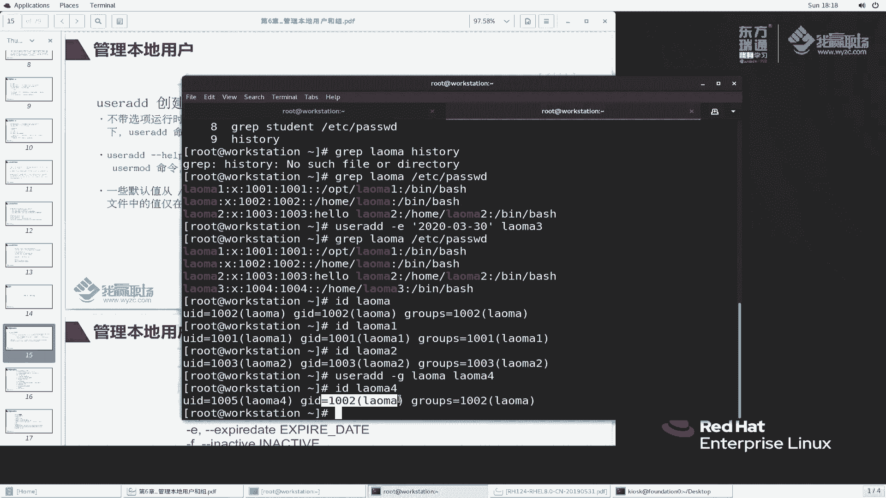
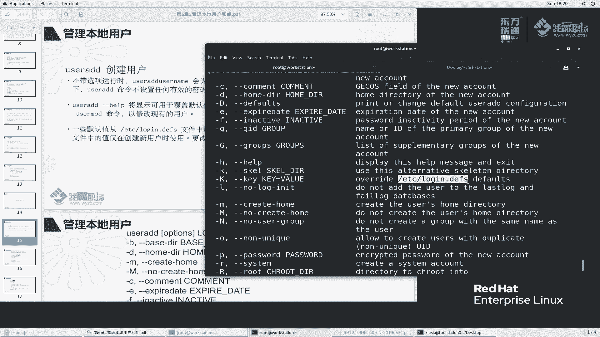

# 红帽RHCE8红帽认证RH124认证课程【全】 - P23：06-3-1-管理本地用户1-添加用户 - 北京东方瑞通 - BV1KM4y1M71q

同学们好，欢迎来到我赢职场HCE8课程。我是马老师。这节课呢我们来讲一下管理本地用户和本地组。那首先看第一个。嗯，其实我们之前给大家讲过一个问题，dodent。

at worktation我们都知道用户的信息是保存在ETC password这么一个文件当中的。好，这里边呢又分的这么一个7个域啊。ID是吧，这样我们来看一下，直接gra student。找这个文件。

student是吧，然后密码root rootot，然后呢它的一个描述信息加目目录以及beb。那么如何说我们通如何通过命令行去添加这么一个。添加一个用户呢啊以及添使用命令行去添加用户的时候。

他又在哪些配置文件里面去添加了一些哪些东西呢？好，我们来看一下第一个。

用户管理相关的命令以由则开头。那么当然我们要切到root用户下面去执行。SU。U子大家此时按什么按t键。此时我们也可以看到关于用户管理的命令有这么一些，例如说添加一个用户，对吧？例如说。删除一个用户。

例如说用户的格式，那这个基本上用的不多，help也不多。use infer查看用户信息的是吧？use mode修改，用户不满意去修改用户的挂载用户的passport users。

那么其实这里面我要给大家讲的命令主要有几个主要3个添加删除和修改其他的命令啊，后面我们或者说大家先自学一下啊，后面我们有机会再给大家讲，好吧。那么。us AD我们来刚刚help去看一下这个命令怎么用呢？

那么往上翻。他这个使用方法有证明一些啊，说useAD增加一个loginlogin是什么呀？就是我们讲用户的登录名啊。那么还有一个杠D还有个杠Dop。那么具体我们来看一看啊。说杠B呀说增加一个用户的时候。

我们指定这个用户的什么base啊b这个base do是什么意思呢？那么我们一步一步来给大家演示好吗？那。这样我们这个窗口服呢放在这儿，我们再开一个标签。这个有点大啊，缩小一点。艾特我们的。嗯。

Worktation。us AD首先来看第一个。杠B去指定一个bister，我们来指定一下吧。首先我们去添加一个用户ADD老马这边一个用户老马一啊，老马一里面要加B，我们给它加一个目录，加一个什么呢？

加一个叫OPT。看一看是什么样一个效果。那么我们来看一下grab老马一这么一个账户ETC passportssport。此时来找一下，那么这个老马一这个用户的加盟路在哪，在这个地方吧。哎。

我们讲如果说你添加用户不指定去告币的话，那么用户默认情况下是在哪？我们g up一下老马来对比一下。他默认是放在什么？哎哎，老马这个用户没有呢啊，这样我们usADD老马用户对比一下。

老马用户默认的加目录是放在哪？放在ho嘛？哎，我们如果杠B表示这个它的加目录放在某一个这个目录下面。啊，就这么一个意思啊这么意思。那么再往下看，这个用户的描述信息，默认我们是没有加用描述信息。

没有加描述信息的话，那这个位置好像就是空的那如果说我们加一个描述信息呢，我们再来加用户老马2。罗马2啊，那后面这个地方我们就不加了，我们要一个一个去看啊，对比它。加上一个C，比如说。嗯hello老马2。

那来看一下这个信息。是不是在这个位置啊啊，来，我们gra一个tudent。sden的描述形是什么呀？是这个吧。大家还记得我们去用户登录的时候，我们看一下啊。

HT杠VMV。Be a build a student。mo stationation啊。

他的登录界面这个地方给我们显示的是什么名字啊，是他的描述信息吧，不是登录名。啊，不是登录名。那如果说我们这个地方点一个notote list，那此时这个地方如果你说写一个什么写我们这里面的一个信息。

就是这个信息，那能登录上去吗？

来看一看。STUDENT studentdent，然后user。回车。密码呢是student。看一下吧，说什么，说sorry然，没不能工作，尝试对吧？其实什么？

其实我们要登录的前面才叫loin name。那么我们前面这个地方列的时候，要是loin name。也就是说我们这个userADD这个命令后面去加的时候，是后面的这个名称啊，一定要搞清楚啊。

这个是起到什么作用啊，杠C。来，我们再来看一下其他的一个说明啊。那么杠D其实它是默认行为啊，说打印或者说更改这个它的一个配置文件。一般来说我们很少去加这个东西。啊，打印单或者说更改这个默认值啊。

我们不用动它啊不用它。那么我们说。加一个过期的时间，对于这个账户啊，我们添加一个用户，那么并且设定这个账户的过期时间。也如说这个账户呢，我们设定三天后过期，或者说几月几号固定的时间过期。那，你想一想。

一般来说我们添加一个用户的时候，在企业里面来讲的话，那么这个它的过去时间我们来看一下吧啊，那么查一下date时间。今天呢是这个2020年这么一个日期是吧，然后是2月2020年2月9号。

那么我们来设置一下，看看他的过期时间我们怎么来设啊。理如说啊。这样啊我们还是到这个窗口来试啊，再来加一个用户。老妈几了呀。一是吧。这样history。嗯，graup养老马啊。那么开始老马2了。

我们再加一个老马3，好吧，user aDD杠1加一个过期时间。过期时间我们这样写看看行不行。2020年杠好吧，杠嗯，3月1号03-。303月30号可以吧，然后站在我们的老马三，看看行不行。好。

也就是说这个账户呢会在这个时间去过期。那这个过期的时间保存在哪里呢？来g一下老马3，还是看这个我们这老马三看看能不能表现出来。好像老马三在这个地方没有什么区别吗。这个记录信息呢。

在我们后续给大家讲用户账户这个密码管理的时候，才会涉及到账户有效期的设定。那这个地方呢，当然它也可以去设定。一般来说呢，我们不会通过这种方式来设定，好吧，就是杠给他讲讲的是杠E的选项让账户什么时候过期。

那么同时还可以指定上这个密码对于我们这个密码呢，密码什么时候过期。

对吧讲密码的非活跃时器。啊，注意哈，密码也可以设置啊。那么从账户的角度来说，这个我们用的也不多。杠G我这个用户的主组是谁呀？此时大家来看一看我们这个刚刚加的那几个账户的主组分别是谁。

好ID老马对吧？ID老马一。老马二竹组好像都是我自己吧。那么我们来做一个事情，我再来添加一个啊，刚刚是老马三，我们加一个老马4。此时我们加一个杠G，指定它的主组，就是说我就给你加一个。老马。

让你这个用户的主组啊就属于老马四。叫ID老马四，大家来看一看我这个老马四属于哪个，就属于我们这个老马二这个组组。啊，你根据自己的需要去改哈。一般来说呢，一般来说呢，我们嗯作为一个普通用户。

那么他是属于自己组的。如果说在你系统需求的时候，那么有些用户的主组呢要统一规划到某一个组里面去。那你根据你的需要去加。

好吧，杠G还有小G小G是补充组。好吧，我们刚刚讲要补充组。我这个用户除了我在我自己组里面，我还有一个补充组。那么再来看一下，我们加一个叫老马五这个账户。如果此时我地方加一个杠大G来看一下。

再来看一下ID老马5。除了我自己的主组在，那么他还会加到这个补充组里面去。好吧，又加了这么一个东西。那么再往下看帮助信息K skill啊 skill。我们添加了一个用户之后嘛。

这个用户的加目录里面会生成一个文件。那么我们来看一下SU杠我们的老马用户都是新加的吧。LS杠A。哎，你这个用户加完之后，你的加目录里面怎么有这么一些文件呢？这么个文件与从哪来呢？LETC1个Q。看一下。

skill啊 skillki杠哦杠A也是杠A啊啊，以我们加目录里面去杠A看一下，对比一下。好像一模一样吗？好，确实是一模一样。那么我们可以通过杠K这个参数去指定用户创建的时候。

他的加目录里面会默认生成一些文件，你可以指向特定的位置，也可以使用系统默认。系统默认的位置呢就会放在这个目录下面去。好。好，我们再往下看啊。说那么我们也可以指定设置它这些值，说覆盖它这里面默认值。好。

那这个默认值是什么呢？也就是说我们添加一个用户的时候，那么这个用户里边会有一些属性，这些属性的值呢会使用这个配置文件里面的值。

啊，大家看一下我们这里面说明啊，说这个文件里面会添加用户的时候，会从它里面去读取一些默认配置。如果如有效ID默认密码过去规则，此文件中仅在创建用户的时候有用。你创建用户的时候。

那么这个用户的账户信息怎么去生效呢？

就这个文件来决定来看一看吧。那么我们推出到管理员账户里面去VMETC logging。点DFS。从上面往下去找。第一个没有字啊，用户创建的时候，那么这个用户呢会在我这个系统里面能够用于收发邮件。

那么这个收发邮件它的一个邮件的位置在哪里呢？在这个目录是不是呢？L来看一看啊。这样我们再开第三个窗口。L Sva。破 arm。vas pro mail里边。大家来看一下。

我们之前增加的这个用户里面好像都有一些文件嘛，以这个用户名命名的。那么如果说我们这个老马用户5老马五这个用户呢，他收邮件，那么这个用文件呢邮件的内容啊就会写在这个里边。啊，这里面定义了他的邮件的位置啊。

那么以及他的密码的一个有效期的一个控制。说你这个用户的密码啊最大有效期4个95个9。5个99万多天。好，在这里面大家想一想啊。呃，一年是365天左右，然后100年是3万多天。想想一个人正常活多少天啊？

能活100岁吧，是不是100岁也就是33万多天。那你这个密码是9万多天，那也就意味着给你添加一个用户。这个用户的密码就是对一个人来说就可以一直用到老了，是不是？就这么一个思啊，最求的天数是零。

没有要求限制。你想想他要求你，你说你密码密码创建了，我要求最密码的有效期是3天。你这个在这三天之内我不能更改。如果说这个地方设置为3，就意味着你这个密码在3天之内创建完成就不能更改，好吧。

零就代表你随时可以更改啊，密码的长度5。那然后呢，告警是什么，这个密码的一个长度是5啊5。然后这个密码的最最小的最小的长度啊，然后密码的告警时间，我密码什么时候过期啊？啊，就如说我还有10天就过期了。

那么10天过期之前我提醒你啊提醒你，那么提前7天去提醒你啊，说密码你这个还有还有7天就过期了啊，第六天再提示你说还有6天就过期了啊。从第七天开始去提醒你啊，一般来说第七天提醒就提醒一次就够了啊。

同样再来看我这个用户你添加的时候，如果说我是一个普通用户啊，普通用户他的有效范围是从这个开始。是这样子吗？来狗陪一下老马。ETC password。哎，我们之前加的老马用户好像都是从这里开始的对吧？

那你这个范围说不是从1000开始吗？那1000账户是在哪？1000。1000，然后我们这样讲啊。0-9。对吧0-9。嗯。试一试好吧，试一试看看行不行啊。可不可以呀？可以过滤出来吧啊。

100101102100是是student，正好student是普通用户，从这里开始加的，我们加的是普通用户。那对于系统用户呢。什么叫系统优化？系统用户就是说运行的一些服务用户。啊。

服务例如说我之前给大家讲的apparache web服务器对吧？啊等等等这些服务来，我们给大家执行一个命令。PS杠1这样啊。看不出来是吧，ETC去password里面去找一些。他的范围从201到999。

我们去找一下。201到999啊，哎，这个这个好像。这个什么no log是吧？这样我给大家找一下，其实我们这里边很多一些no logging呢，no logging。No logging。呃。

978的是这个账户是吧，这个好账户好像用的不多不多啊。嗯，这个是42的，42不在这个范围内啊。992那这个吧这个比较明显啊，SSHDSHD也比较牛了啊，比较它是74。

其实对于系统账户这个地方又可以详细的又可以分了两类。哪两类呢啊？那么对于这种这种就是在我们这个。在我们这个。呃，201之前的201之前呢，他也是系统用户，这个系统用户呢是用于操作系统服务相关的。

属于操作系统级别的一个服务。比就说SSH你远程登录到我的服务器上面这个服务呢是属于一个系统级别的服务啊，当然还有很多。那再里如我们这里面看到了抢饶你，抢饶你是属于对时服务，你操作系统可对时可不对时。

你不运行也不影响。好，不运行也不行，这种服务是可有可无的系统服务。啊，那么他的范围是什么？是我们刚刚讲到的是从201到999啊。

那么同样对于组来说，也是组的ID跟我们这个用户的ID它是范围是一样的，差不多的啊。

那么用户你创建用户的时候，要不要给用户加目录要创建呢？那肯定要创建啊。我们创建用户的时候来看一下RShome一下，那是不是这些加目录都给我们创建了。啊，确实是啊确实是。那么用户的you这个不说。

后面我们给大家讲啊。还有用户的密码，哎，你要是给用户设置密码。那么这个用户的密码的加密方式是采取SHA512加密方式。啊，后面呢我们再给大家讲，反正我要表达的意思就是说你用户创一个用户。

那么用户的值从哪里读啊，就从我们的loin DFS里面去读。啊，从这里面去读啊。那么login dFS里面不是有很多键值对吗？不是有很多K和value吗？这是K，这是value，这是K和value。

那么你也可以手动去指定。它的一个范围指定它的一个值。啊，同样的加目路是否创建呢？杠M是代表创建杠大M代表不创建啊，那么杠大M表示不不创建一个组是吧？不创建一个跟它同名称的组。哎。

我们默认情况是创建了一个作为它的主组，对吧？还可以杠O。杠O是允许去创一个用户具有重复的UID。什么意思啊？啊，具有一个重复的UID。也就是说我一个用户啊，这样我给大家试一下啊。嗯。

这样我们来添加一个user ADD。嗯，ID老马这个用户吧啊，userADD再一个杠O，再来杠U杠U呢1002。然后呢，我们再加一个老马，老马应该6了好，看一下。此时大家有没有发现一个问题啊。

我们ID老马。gra啊 graph1002。大家有没有发现一个问题啊？我老马六和老马他的用户的ID都是100I。为什么会这样子啊，就比较好玩了哈。虽然说这两者都生效的啊，我SU大家来看一下啊，老马6。

好，退出来一次啊，我再来SU一次老马。大家有没有发现我切换老马的时候，好像也是显示老马6嘛。说白了就是给你使用了一个别名。你这个用户呢给你加了一个别名，其实呢这两个还是同一个用户。对于我操作系统来说呢。

他还是同一个用户。PWD。啊，老马是吧，老马，但是呢这个目录不一样啊，此时我们他这两者是具有相同的权限。好，相同的权限啊。OK一定要注意啊。一般来说，我们这个杠O很少去用，好吧，杠O很少去用。

那么再往下看哎，我创建用户的时候，我能不能给他去设置一个密码呢？也可以呀可以呀。那这个密码是加密号的密码。我给大家看一个例子，什么叫加密号的密码？就是这样。

如果说你要想指定这个密码呢，那这码这个密码你只能按照这个加密号来说，并不是说us aDD啊。有时候我想加个密刚批密码叫readdhead。

要说老码7。不是这样子。啊，不是这样的，这个密码是加密号的密码，加密号的密码在哪里面呢？我给大家挑一个。ETC shadow里面这个文件专门保存用户密码相关信息。那这一段是属于加密后的啊。

也是冒号风格的这个属于加密后的密码。那么如果你要加你要非要加密码的话，我们只能这样写啊。戴引浩。单引号，你找一个加密号的密码，例如说我我就找这个哈，我就把这个复制过来。贴一下。回车。

那么这个用户就加好了。啊，这个用户的密码肯定是他来看一下，g up一下，我们过滤一个啊，就过滤什么呢？过滤这个嘛。看一下过滤这个最后这个文件看一下是不是出现两个student用户是这个密码。

是student老马7的用户呢也是这个密码。

嗯，通过这种方式去设置密码，好吧。呃，但基本上啊还有一个选项比较重要的就是。

S选项啊，这我们再给大家看一下。嗯，杠R去指定用户呢，是系统用户。那么我们再来加一个哈。一步一步给大家演示一下usADD杠RR什么呢？老马8这个用户。看一下。老马8这个用户的ID在哪个范围，在975吧。

刚刚我们说在有一个叫201和什么，好像9GG的吧。好，我们来graph一下啊UID。UID那么里面有个范围，对吧？Not给DFUID min和 maxax。这个我们叫ss啊，s999到201。

他这从从我们这个范围里面好像挑了1个975。啊，99啊。那么还有一个再往下看啊，这个基本上呢这个基本上啊这个用户这个不用不用了，好吧，这个基本上不用啊。那么我用户指定的时候还可以指定他的登录sha。

默认情况下，我们是兵b，也可以指定其他的。那么当然还可以指定用户的UID。哎，我刚刚还记得了，我们给大家添加用户的时候，大家看到了一个我我有一个。好，黑s队大家来看一下啊。黑s有一个我加添加用户的。

通过杠O去添加的啊。G。O好，g O吧。还是要嘛history的。也没有多少是吧，这个位置。杠又去指定这个用户的ID。好吗，去指定啊。当然根据你的需要啊，正常情况下，我们一般来说可能不需要。

但是如果说有时候会出现这么一个问题，我让两台机器A机器跟soA和soB。那么两台机器创建这个用户的时候，我想让它保持一致，那就可以啊，你你都是通过这个啊指定使用同一个UID好吗？

那么用户添加呢就这么多命令啊呃，相对来说还是。比较多的，但是呢。我们经常用的并不是太多啊，大家看这个帮助说明呢，一看就明白了好吗？一看就明白，回去之后呢，照着我这个例子啊，自己去练一练啊练一练啊。好。

用户添加好了，但是用户添加好之后，我发现一个问题啊，这个用户的。用户的一个信息啊不满足我的条件。例如说这个用户的描述信息对吧？VMATC passport。

这个用户的描述信息放到最后。这个描述信息我不满意或者没有，我想重新添加一下。重新添加一下用户描述信息，可以啊可以啊。那么关于这些描述信息的，它与。这样我们再来看一下啊，叫user。Moify。

怎么去修改？这个大家看一下，跟我们的U子ADD好像好像选项差不多哈，其实是差不多的。那么我们来看对比一下吧。好，杠C是什么呀？这个描述行吗？杠D是后目录，ho目目录对不对啊？

那么杠E过期时间杠F什么杠小G大G说白了跟我们之前差别不大。哈不大啊，杠L比较好玩，杠L是给他取了一个新的用户名。杠L是取了一个新的用户名啊，新的用户名啊。

杠M我可以将我们的用户加目录呢去迁移到其他的位置。来试一试啊试一试，不我我给大家先演示一下这个杠L好吧，杠L小L啊小。当然这个地方我都给大家演示一下啊。😊。

嗯。算了啊算了啊，那么这样吧啊，我们这节课呢我就先给大家讲us the ADD下节课再给大家讲us the mode。因为user mode里边有一些属性啊，还是需要给大家展开来去演示一下的。好。

这节课呢我们先讲到这里。

