# 红帽RHCE8红帽认证RH124认证课程【全】 - P24：06-3-1-管理本地用户2-修改用户和删除用户 - 北京东方瑞通 - BV1KM4y1M71q

好，各位同学大家好，我是马老师。我们接着讲啊。上一讲呢我们给大家讲了usADD添加用户。那么这节课呢我们来给大家讲一下修改这么一个用户。用户添加好之后呢，发现用户有很多一些信息不满足我们的需求。

我们要进行修改。

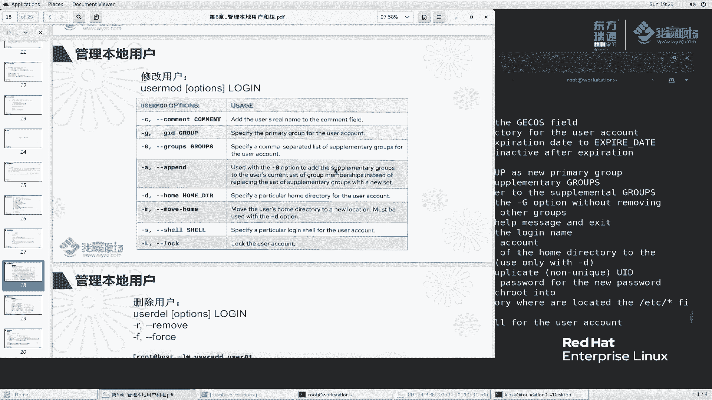

那么我们从以下几个角度来看啊。首先呢我们use the mode杠刚 help看它的一个使用方式。

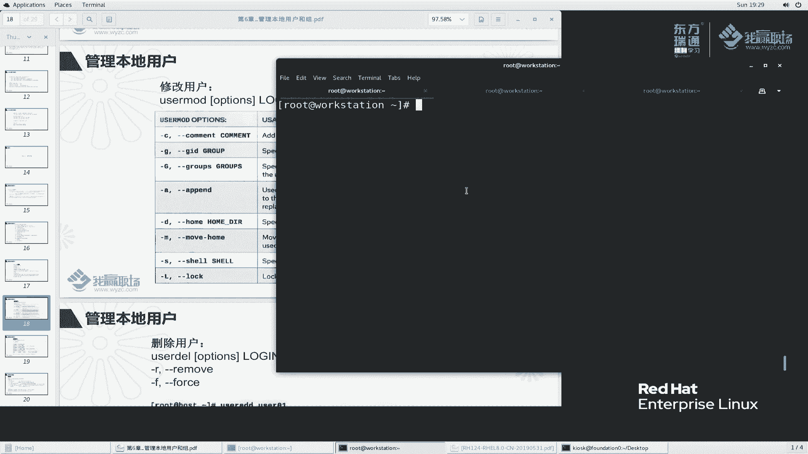

那这个地方的大部分参数与user。ADD很相似的。那么这几个地方呢，我们做一个简单的修改。例如说我们首先g up一个老马来看一下这里面的一个信息。pass word。那么在这里面我们看一下有一个。

这里边有一个叫hello老马2这个地方它是有这么一个信息的。我们对它进行一个修改。例如说我们就给它改成hello world，好吗？user mode杠Cuser mode杠CC里面加上我们的描述信息。

hello world啊word，然后再加上我们的这个老马二用户。仔细来看一看我们这个老马二的用户有没有发生变化，确实是发生变化了。好吧。那当然我们说想改这个组的主组ID。

那么老马2它对应的主组是多少呢？hello world老马2对应的是1003，对吧？那我能不能改成1004呢？好，来试一下。user mode啊。moode杠大G杠小G啊100。100啊。

我们直接写成1002这种数字方式看看可不可以啊。那么老马2老马二他是1003，对吧？主组是1003，我现在给他改成1002这样方式。看一下行不行呢。那么原先的1003是不是也变掉了？啊。

还是还是还是非常灵活的啊。同样这个主组这个地方我要给他额外补充一下啊，我们来看一下ID老马2。老马爱他现在只有自己这么一个主组啊，那么我们给他添加1个ADD啊，我们来给他改一下刚大G。杠大G。

我们里面加一个V总。有老马二来看一下。杠大G老马2。那么现在这个老马2它是属于哪一个组呢？看一下，老马二是这个用户，那么这个用户给他放到大G这个viO组里面去。老马二属于这个组吗？因，他其实说哦。

这个地方我写错了，U theADD是不是U the mode。加进来。再来看一下。看ID呢啊ID老板2，那就多了一个是吧？那么有如果我们再来一个呢，我想给它变成student呢。

我想给他添加一个suddent啊，大来看一下效果。老是犯错呢。MOD啊。那么把这个呃原先的是VO组是吧，然后老马组，我现在执行这个命令，大家认为是怎么是是一个什么样效果？

是是不是额外又增加了一个补充组轮呢？回车我们来看一下老马2。没有吧，只是将这个附属组view变成了student。那如果说你想给他添加一个，我们应该这样做啊，user mode AB杠A有个A的动作哈。

那么我们再加一个。加一个view，把view添加上来。看一下是不是添加了will，原先的这个还在吗？这个A一定要注意啊，小鸡大GA。

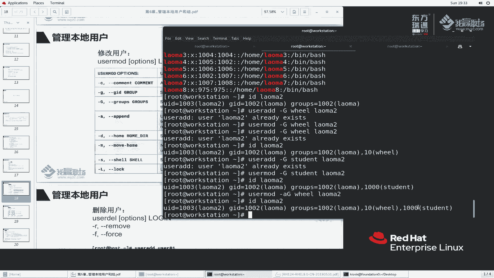

那么加目录我们也想给它移动是吧？指定一个特定的加目录。那么指定这个加目录一般来说，我们要跟D配合起来用。因为你加目录要移动是吧？好。

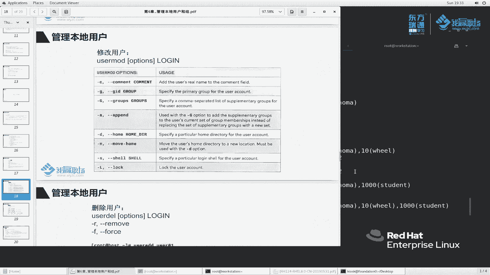

那么我们一样呢啊找一个呃gup OPT吧。Pass word。这里边有一个老马移，我们给它移过来。user mode啊 mode杠D杠M杠DM把它移动到哪里去呢？好，这个杠D指定的时候一定要注意啊。

杠D后面指移动指定的时候，一定要加在home加目录，或者说你这样写啊MD啊，好吧，那么给它放到我们的home的一个老马一里面去。老马一，然后针对我们的老马一这个账户。好。

我们首先来看一下这个这个账户有没有有没有在，有没有老马一的，没有吧，这个命令我没执行啊，税。那么我们来执行一下。此时我们再来看一下他这个加目录有没有移动过来。移动过来的吧。好。

同样这个用户的sll环境不满意呢，我也可以通过杠S去执行。例如说我们这个啊老马一这个账户，我们加一个杠S。杠S。这样啊我们改2之前呢，我们加一个并SH啊，改成这个。那么我暂时也是不执行啊。

首先呢我们要过滤一下老马一。这边一个信息。确保当前的一个信息。当前是兵败事，对吧？我现在给他改成兵SH。看看有没有生效。改过来了吧啊也就是说这里面信息我们好像都可以改啊，确实是这样啊。

那么这里边还有一个杠大L是将我们的账户的锁定啊，那么同样的，我现在把这个老马一账户来锁定一下。

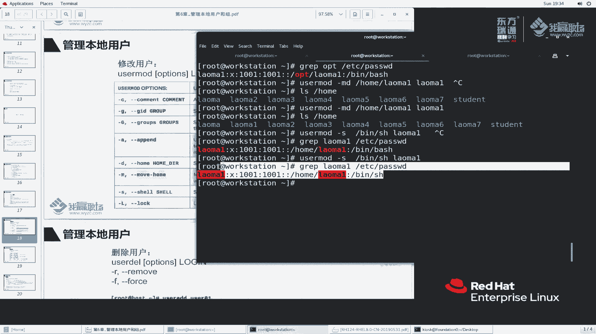

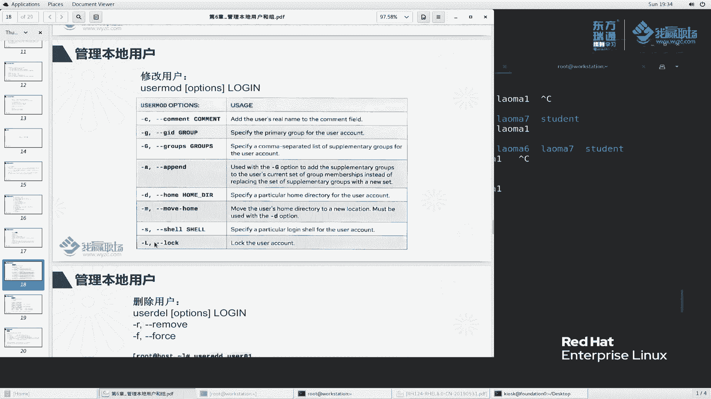

那一下，大家看一下我锁定的时候，他做了什么操作，MOD杠大L加上老马一。再来看一下这个账户。好，这个账户似乎这个地方没什么发生变化啊。那么我给大家看另外一个。sle啊sle。DOW。稍等啊。

那我们graup老马这个账户我来看一下。老马一这个地方它变成什么？我刚刚锁定谁呢？有杠带啊去锁定老马一的老马一这个地方，它它这个地方大家来看一下老马一这个地方有两个感叹号。

是吧老马二老马3老马四老马5老马六老马八好像好像看起来是似乎是没什么区别，是不是啊？

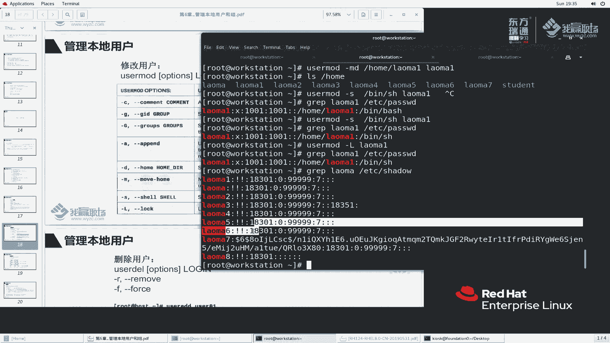

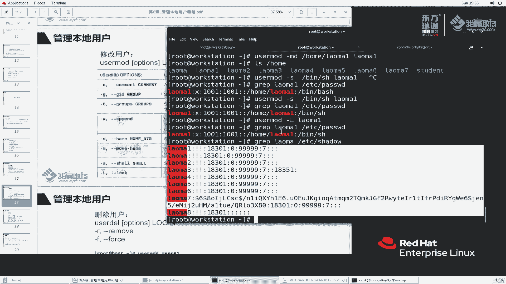

杠大L去锁定老马一。嗯，老马一这个地方确实是没什么区别。这样吧啊，我给大家换一个，我们锁定老马7来看一下效果啊。老马器。再来看一下老马器。来对比一下。锁定之前这个地方是这样子吧？啊。

那锁定之后变成什么了？刀了6前面是不是加了杆叹符号了吧？啊，他其实说白了就是加了一个感叹符号啊，加了感叹符号的意思就是说这个密码不生效了，密码不生效，那么你这个用户就无法登录了。好吧。

用户用户就不怕登录啊，就做了这么一个事情。

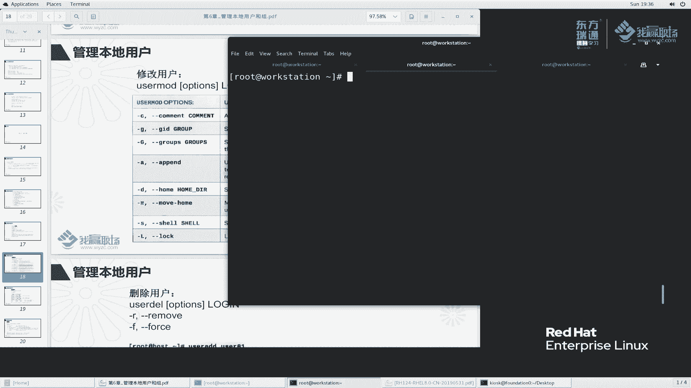

OK啊，我们刚刚给大家讲了一下这个用户的修改啊修改。那么其实啊大家想一下啊。那么我们刚刚执行相应的命令的时候，是说白了就是把相应的配置文件啊，配置文件里里面的记录给他改掉了。那我能不能直接去VI呢。

对吧？VIETC老马啊，老马老马。

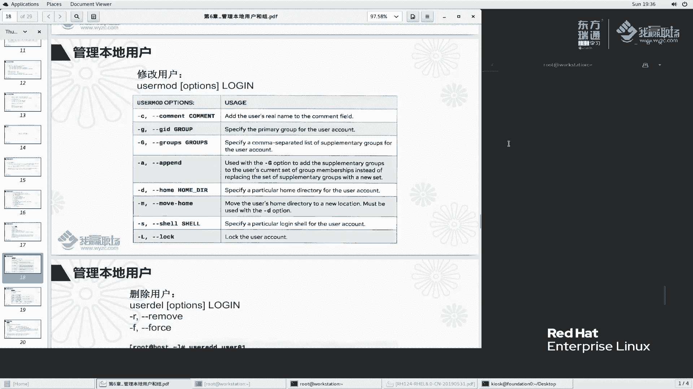

对 pass错的。password例如说我们找最后老。这个老马7老马七用户，我给他改成1002，好吧。保存退出。来ID一下老码器。老某其他UID变成什么了？变成了1002了吧。哎。

我们刚刚是自己手动去改的吧。拉码器。看一看这个条方我手动改的吧。好，所以说我们执行命令的时候，其实就是相当于对某一个配置文件做了一些操作。那么其实从最基础的原始的角度来说。

我们其实就可以通过VI命令去编辑这些文件，能够达到相应的效果。

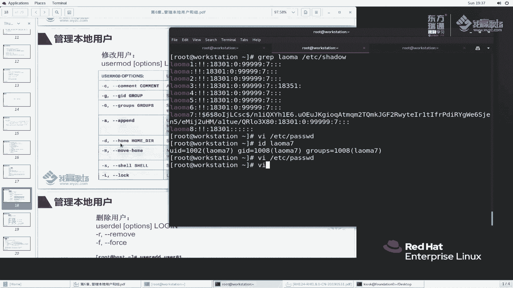

嗯，那我们作为管理员要获得一个要具有一个功能啊，或者具或或者说要达到一个境界。是么呢？就是说你执行一个命令。那么我要知道你这个命令呢，对于我们操作系统里面的文件到底是做了一些什么操作。

对哪一个文件做了哪些修改嗯，我们管理员能够达到这个顺准，那就真的很棒了。

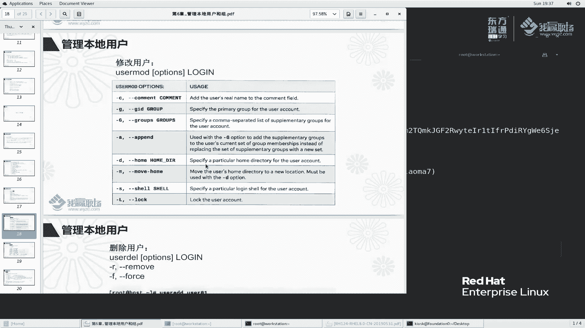

啊，这是修改用户来看一下修改用户还有哪些。好，这里面提到了什么，杠O杠P。好，还有说杠UID什么杠Nlock给它解锁是吧？那么我们把它解锁一下。杠大旧是吧，杠大油漆解锁。No。马器同个账户。好。

解锁了吗？再来看一下有没有解锁掉。老马器。那这个位置感叹符号是不是没有了，解束掉了？那我能不能说直接到这个文件里面去把它到直接到这个文件里面去把这个加给感叹符号，或者是把感叹符号给删掉，也可以吧。好。

就是这么一个作用啊。

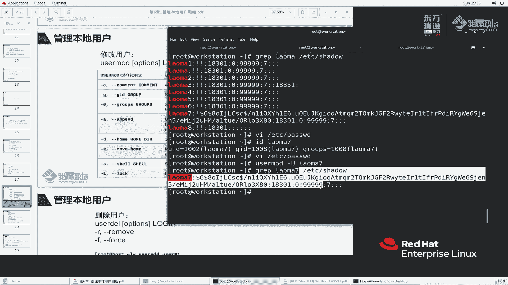

那本地用户现在不想要了，不想要，我们就把它删掉呗。那userDL去删除来删一下。

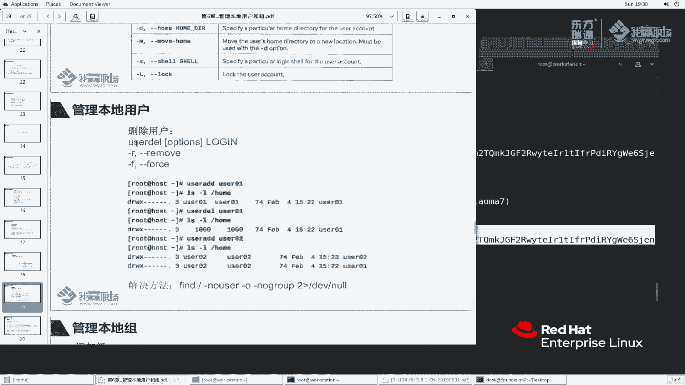

那同样的，我们use着。us DEL啊杠杠 help来看一下，它这里面参数比较少啊，说啊强制删除对吧？杠啊rem说将这个用户的加目录啊以及用户这个邮箱的文件把它删除。

用户的加目录以及这个用户的邮件给它删除。那么还有说什么，其实我们正常情况就这个或者这个其他基本上不要好吧，这基本不要。那么我们来删一下啊，首先我们 up一下老马。这样啊ID老码器。老马器。

这个用户是存在的吧，user DEL这样我们删除之前，我们看一下homehome目录下老码器这个文件存不存在，也存在啊。那我们RM。啊，同样还有他的一个邮箱5啊。sppro里边一个mail。

还有一个老码器。这个文件都在吧，我们来执行一个user dL去删除这个用户啊，删除什么呢？删除杠R好吧，杠R老码器。好。删除之后来看一下，他说诶，这个文件这个文件呢不被他拥有，不被他用，现在不给删了啊。

由于之前我们去做了一些修改，导致这个老马骑的不被他用有，现在不给删了。来看一看S杠L。L杠Lhome里边。大家看到非常有意思的一些问题啊。就是说老马七这个目录本身是被老马七用的。

现在老马七的用户的ID变成1002了。那么原先的1007这个UURD拥有的拥有的这个目录呢，此时此时没有说对应的一个账户名称去给他添加了。啊，大家看清楚了啊，这个老马七的目录拥有者是1007的UID。

但是呢当前没有用户的UID是1007的。所以说你去你再去删的时候，发现我们的用户权限啊就不能够去删了。那么我们来测试一下老某6，好吧。I还是home一下，这个我们主要看老马6啊。老老马六。

老马六是存在的啊，这个目录同样呢。vas pro老马6。没有。老马六啊。那么我们来删一下RM杠RRuseruser d deleteele啊，user delete杠R去删。上我们的老板6。

删完之后看一下这文件还在吗？home一下啊，老马6看看有没有了，没有了吧，同样。这邮件有吗？没有啊老马6。也没有了吧，杠R是将用户的邮件和他对应的这个呃，加目录都给他删掉了，好吧，都给他删掉了。

那么如果说我们再来看一个IOS home。S杠L home，那么我们不加杠R呢，不加杠R的时候，我们看一下这个老马一删的时候什么效果啊，userDEL啊，直接删老马一。来看一下。

再看一下这个目录里面老板一的文件存不存在。这个目这个文件还存在吗，但是这个UID好像没有了。啊，URD好像变成了一个数字啊。如果说此时我们来添加一个们user aDD啊，us杠杠什么呢？

杠一u老老马老马几老马九刚刚是到切的，现在老马8好吧，老马八里边我们加上杠URD那么改成1001啊，来看一下效果。他说老马那酒存在了是吧？9。好，我们来看一下这个目录的权限。大家有没有发现啊？好。

老马九，我创建了成功了啊，是是19点42分。那么这个文件的权限变了，变成谁了？变成老马用户，老马九拥有了吧。之前是他说是被1个1UUIUID是1001的这个用户用有这个文件。此时呢，我创建的一个用户。

他的UIUID是100，那么当当然拥有了这么一个文件了。其实这样好不好，不好吧。啊，不好啊，所以说我们删除用户的时候，一定要把这个用户的加目录也一起删除，一定要加杠R。

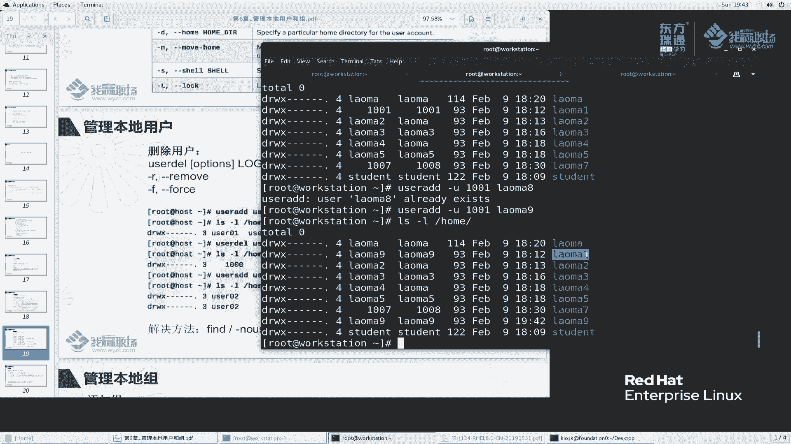

好，一定要加杠啊。那么这个杠F什么时候用呢？来看一下啊，强制去执行一些操作啊，将会。

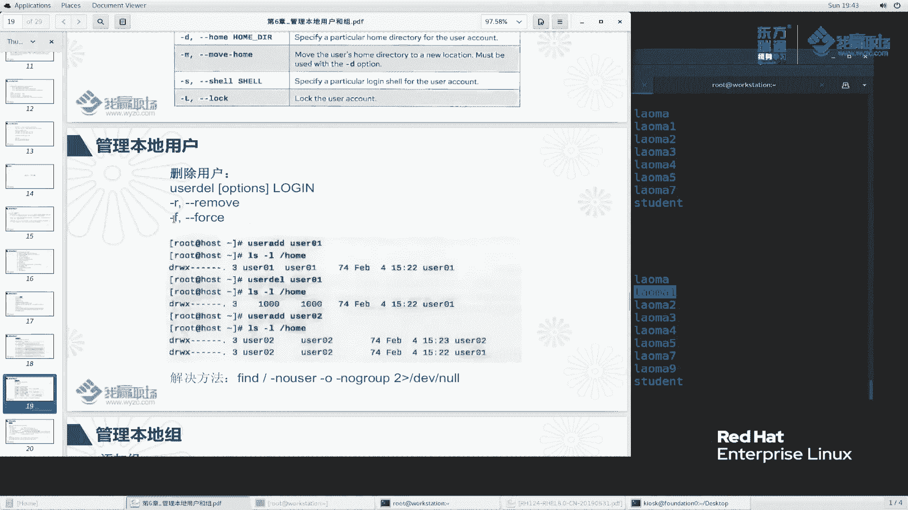

强制一些操作。那么这些操作呢可能会失败啊，例如说删除这个用户，这个用户呢还在登录。你说你一个操作系统用户正登录到这个操作系统里面来，你想把这个用户删掉，那是不是会导致这个系统出错呀？那确实是这样啊。

这个F呢谨慎去用，不要随便去用啊，别上去好，这是我们讲这个用户的删除。

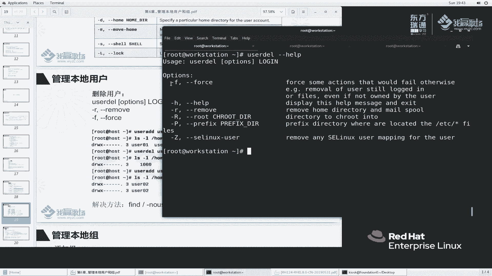

那么。刚刚提到一个问题。

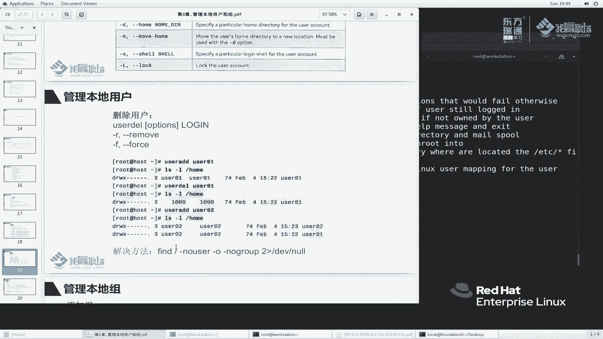

用户删除完成之后啊，发现他这个。这样啊。userDEL我们还是删传一个老马九来看。LS杠Lho来看一下它这个URD都存在是吧？那么对于这种文件，对于这种文件，它的URD是一个数字的文件。

我们称之为这个文件不被任何人拥有。啊，不被任何人用。那这种不被任何人拥有的文件，我们去查找呢，要把它查找到，把它删掉。你想一想，一个文件不被任何人拥有，它在在在硬盘里面是占样我们的空间的。

那么我们要把它删掉，那怎么删呢？下面有一个命令。

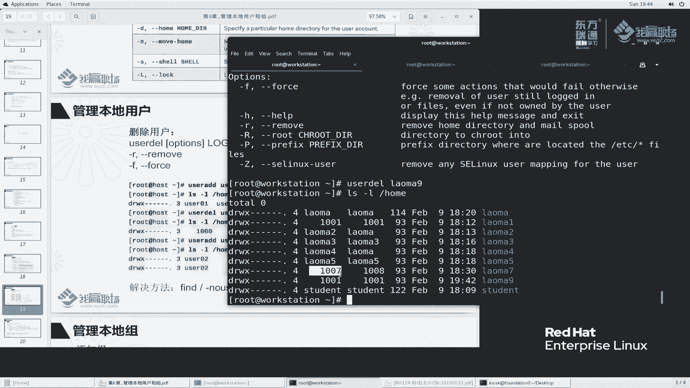

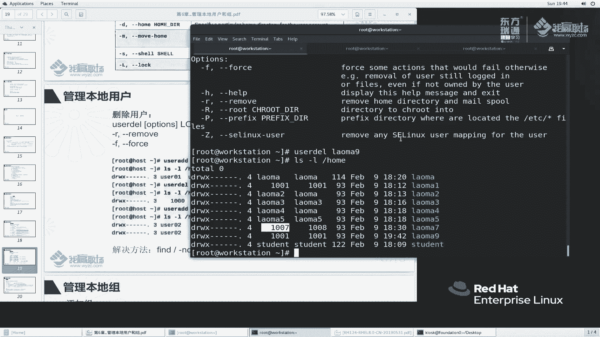

fin find啊在我们操作系统的根目里给它复制过来，大家来看一下。

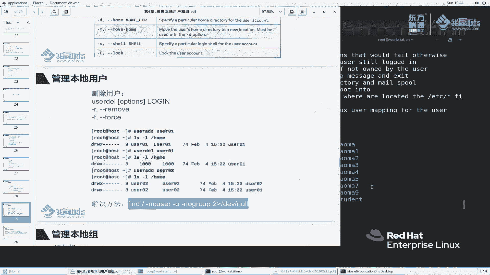

在我们的根目录下面去查找查找这个用户no user，也就是说不属于任何用户的，或者不属于任何组的。来回车。二是什么？二是他可能会有些错误信息，我不看，我只要看我找到的这这么一些文件。找一下。

那肯定这个后目他们肯定会把它搜出来啊。来，我们稍等一下哈。看一下我们这里面文件还是比较多的啊，work stationation这个文件比较机器里面文件比较多啊。

那么大家也给我们发现的vas pro mail里边给我们找出来。由于这个f的命令是从整个硬盘里面啊，整个根里面去找的，所以说它便利的时候会比较慢，一步一去找。那么我们先看这几个是不是的啊。LSsp啊。

s里边一个mail有目录下面的杠大L来看一下。这里面是不是老马一，然后老马七和老马九是不是的，看一下179就能够全部找到了。哦，当然大家来看一下，好像又找到了那么多。

是不是啊老马七的老马一的老马九的确实是这样。啊，确实这样啊，那么包括老马酒里边好像还有这么什么confi之类的对吧？啊，那那我们就不关心了啊，我们呢找到对于找到这些文件呢，我们手动去把它删除掉。

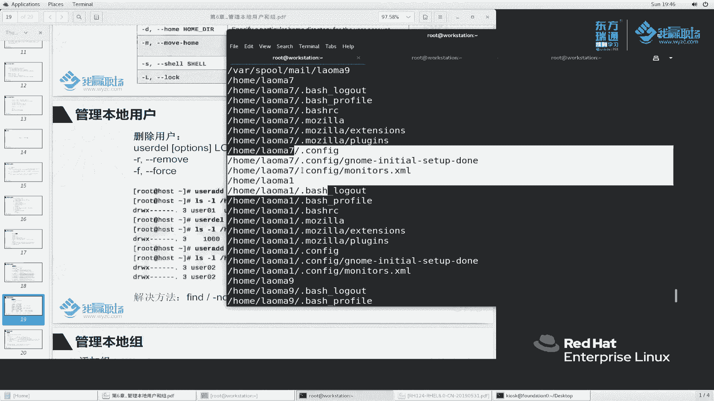

好吧，只能删除掉啊，我们来删一下啊。😊，2M杠FR好吧，然后还是vasmail里边的一个老马，老马用户，这里面是代表什么179。179，大家怎么表达？一、逗号7逗号9。看一下有没有了。179没有了吧。

同样那对于这个老马7账户的，还有老马一的老马九的，我们也采有同样的方法啊。这个地方就使用的是。home里边的一个老马。啊，打括号。一、逗号7逗号9。那么这个地方也删掉了啊。

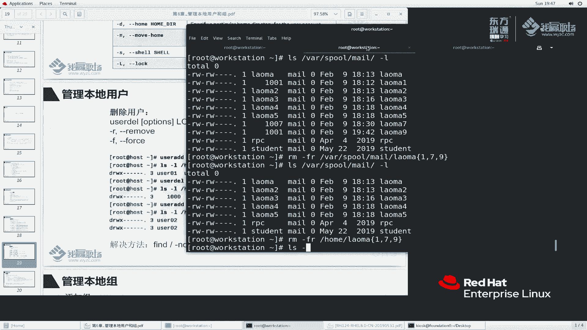

啊，那么刚刚那种类型的没有被任何拥有的，就把它全部给它清理掉了啊，为了防止这个泄密啊，因为说你新增加的新增加的用户，他的他的用户URD可能与之前的某一个文件进行一个匹配。

那么这个用户呢就会对之前的文件呢具有他的一个相应的操作，那就会导致他的一个文件权限呢有一个冲突和泄密。

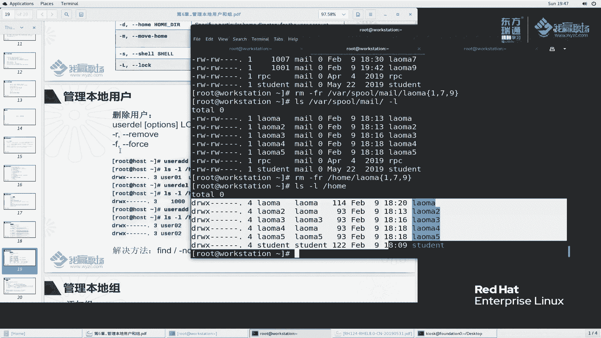

那尽可能的去避免这个问题，好吧。我们再来看一下管理本地族。

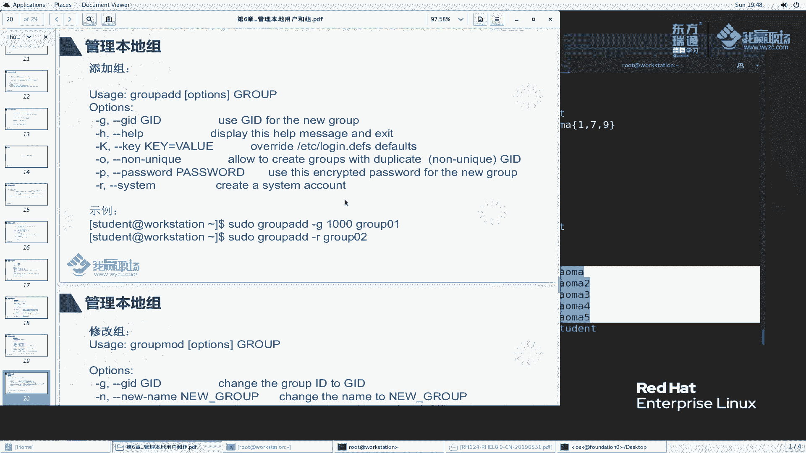

本地组呢相对来说比较简单一点啊，因为它添加的时候没有这么多一些选项。来，我们看一下这个本地组的一些操作。Group。group里边什么ADD添加的DEL删除member管理组成员的。修改组属性啊。

groups这个用的不多啊不多。来，我们首先一个一个看啊，这个5个命令。GROPgroup。Groups。嗯，这样吧，这个g普命令我们嗯下节课再说，好吗。

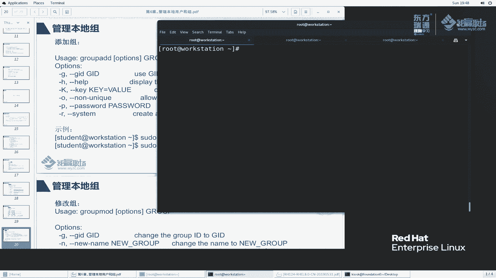