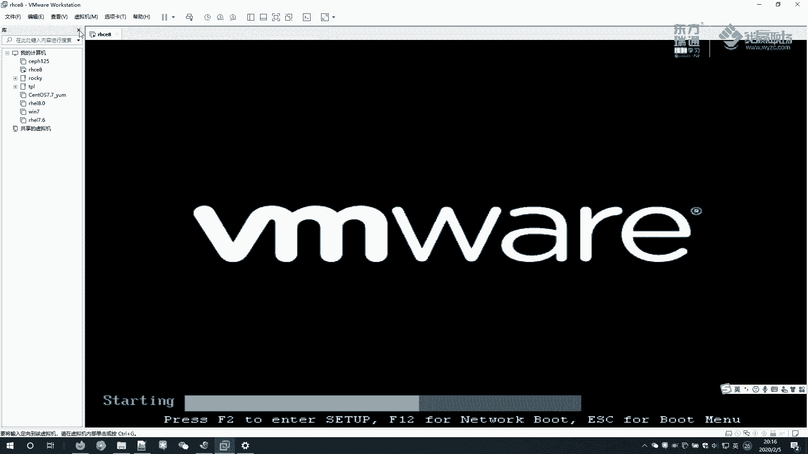
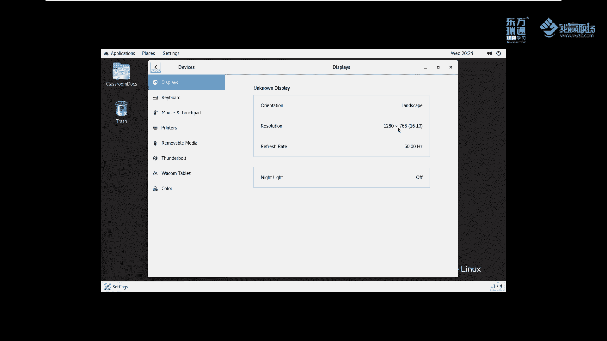

# 红帽RHCE8红帽认证RH124认证课程【全】 - P2：00-2-RH124课程环境虚拟机控制 - 北京东方瑞通 - BV1KM4y1M71q

好，我们接着说这个虚拟机是如何。他是怎么分布在我们这个教学环境里边的？那么要从我们这个虚拟机的配置文件，它的给大家的这么一个虚拟机实验环境说起啊。例如说我给大家的这个虚拟机的文件呢，大家把它存放在什么。

存放在我这个位置。例如说放在一盘。E盘找到我们这个虚拟机呃，readdhead认证。HC8L201908这个位置，我们点这个打开。这个位置有一个密码，密码呢是readdhead。我们刚刚提过了，好吧。

提过了。那此时呢大家给它开机就可以了。开机完成之后，那么这里边会用到会使用一个叫KIOSK这个账户登录。那么这样啊，我为了真实的给大家去演示这个效果呢，我先把我当前的这个虚拟器给它关掉啊。

一定要配布胎啊，否则你这个虚泥打开是非常的慢的那我给它关掉。

这样我们再来打开一次啊。或者我直接在这儿吧，我们刚刚已经打开过了啊，这个是E盘的，E盘是我的普通硬盘啊，它打开的比较慢。那么我还是使用这个固态的硬盘。固态HC18在C盘C盘是固态硬盘的，它开的比较快啊。

rehead输入一下。

在这个里边，我们点开机。

啊，然后我们给它放成全屏效果。首次开机呢要稍微等一会儿啊。

在这个界面里面有1个KIOSK账号，我们单击一下，选中它输入密码readdhead。我们刚刚说过的是吧？然后在这个位置，小齿轮这个地方，我们选择哪一个呢？默认情况下。

这个位置选择的是第一个标准的这个微烂显示方式。那这个方式大家操作起来不太习惯啊，我操作起来也不太习惯。那么建议大家选择这个经典的微烂模式，好吗？经典的微烂模式好，我们选择它。看一下是不是的。

然后选择登录。登录进来之后，大家看这个好像这个分辨率显示有点不舒服。我们简单的对它进行一个调整。

调整出适合你自己的这么一个分辨率啊，我这个分辨率调成调调成这个1920乘1020，相对来说比较清晰一些。

啊，这样效果比较好一些啊。如果说调整到这个位置，左右两侧有黑框框的话，那么大家应该记得这个位置有一个叫自由拉伸啊，选择自由拉伸，不要选择保持纵横比例。那么这个界面我们就调整好了。好吧。

虚拟机就登录进来了。那么我们继续打开我刚刚那个胶片。

这是我们讲的一个实验环境。那这个实验环境里边我刚刚提到了有这么多个虚拟机，这个虚拟机怎么控制呢？啊，他这里边的虚拟机啊是也是相当于嵌套的虚拟机方式去存在我们这里边的。那么我给大家简单的画一幅图，好吧。

大概是这么一个样子。首先这个地方是我们的F0。也就或者说是我们的这样啊，或者说我们的RHCE8，我就简单写叫R8RHCE8是我们的VMY里边给我们模拟的一个软件。好，那么在28里边。

他这里边又存在了几个虚拟机啊，12345，也就是说他欠到又欠到了5个虚拟机。classroom对吧？然后是我们叫bastworktation，然后servve a是吧？

servve a还有一个什么serv B啊，这几个虚拟机以这种方式来存在的。那在我们这个里边，我怎么去控制这个虚拟机呢？好，首先呢我们来打开命令号。

打开好之后呢，我们使用这个工具来控制，叫RHT杠VMCTL好吧。

那么我们这样做啊，首先给它放大一下。啊，这个地方有放大的按钮啊，选择这个zoom in啊去放大，也可以选择这个zoom out去缩小。然后我们执行一个命令叫HT杠VMCTL好。回车。

这个命令大家来看它的字面意思啊，RH代表红帽redhead。T是代表train好帽的培训，redhead training。VMCTL是代表虚拟机。这个CTL是代表控制。也就是说我们这个工具啊。

这个命令啊是专门用于去管理什么呀？管理我们红帽环境给我们提供的这么一个虚拟机的。好，大家知道这么一点就够了啊。那么我们再往下看，那这个工具我们或者说这个命令我们怎么去使用呢？这里面给我们提到一点。

使用方法这是第一个使用方法。那么这是第二个使用方法。那么这是第三个。第三个是用于我们查看帮助的。这两个是用于。交免交互式去这个是免交互式的，这个是强制交互式去一个一个提问的。后续我给大家去演示啊。

我们首先看这个啊，中括号里边的是代表选项，所谓的选项就是可加可不加的。那么。我给大家拿过来，所以可加可不加的，我们可以把它换成这个样子。我们再开一个中端啊。这个终端呢，我们放到它的右边好，给它粘贴过来。

也就是说这个命令我们用的时候，按照这种方式来使用。前面是命令啊，前面是我们将这个工具VMCMD中间有空格哈，至少一个空格，这也是一个空格。VMCMD是代表虚拟机的这个控制命令。那。

这里面提示我们说这个VMCMD啊是以下其中一个啊，其中一个。那么到底是哪一个呢？你可以使用它，也可以使用它，也可以使用它等等等这么多。有这么多个命令，用使用相关的其中某一个命令来替换。

那么我首先使用stateus来替换tus是代表什么代表。显示我们这个虚拟机的状态。那我们来使用tatus来看一看。RT杠VMCTL我们敲一个 statusatus。啊，然后后面VMCMD是什么呢？

这个命令完整，你要想使用完整，必须有这三个啊必须有。那我们包含两个了，后面还有1个VM内。所谓的VM name就是我们之前提给大家提到的这个虚拟5个虚拟机的名称，12345啊。

那么例如说我们敲一个servver a。大家可以看到我们这个so it状态是叫define。啊，dine你们首次拿到虚拟状态，可能应该看到叫missing。叫丢失的状态。所谓的丢失状就是不存在啊。

其实即使是你们看到丢失状态也没有关系。啊，也没有关系啊。那么这样吧啊，我为了保证与你们的一样，我对我这个环境啊，我做一个回滚，好吧，我做一个回滚。回滚到这个状态里边来。

回滚到RH124这个状态。然后呢，我重新开机登录一次。好，正好到这个地方，我刚刚做回滚操作时操作的时候，大家也看到了哈。

我们这个地方我给大家提供了几个快照，1234。那么当我们用1R124这门课的时候，我们就选114点转道。如果说我使用RH134的时候，那么我点这个再点转道。到相应的快照里边去学习相应的内容。

我当前是在RH1S这门课这个快照这个地方啊，那么我就学使用它来做我们R1S的这么一个环境。一样的，还是选择我们readdhead这个密码输入一下。那么这个输入的时候，我们刚刚说默认是是标准的是吧？

我们选择这个微line啊，微line这个经典模式登录。同样它的这个显示设置我们要调整一下。

这样这个分辨率看着就比较舒服啊。那么我再把我们刚刚那个胶片啊传过来。啊，大家稍等一下，我把胶片传一下。大家还记得了，我们之前怎么传胶片的呀？

我之前给大家讲过ex manager里边的excel的使用是吧？啊，那么这样啊呃要想把胶片传进来呢，我们首先去选择这个工具，新建文件传输。然后找到我们刚刚讲的那个课件，好吧。好，看看有没有传过来。

传到这个位置了。那么这个位置呢，我们给它放到哪里去呢？我们这样啊。给他放到默认放到是他的用户的加目录，用户的加目录在哪呢？啊，就是在我们这个目录下面去。就找到了这么一个文件，打开来。

这样又回到了我们刚刚那个初始的那个那个界面了，好吧。此时呢我们这个虚拟机就可以正常的去用了。那接着说我们刚刚讲这个这个字符乱码啊，我们暂且不用理会，好吧，这个是不重要不重要啊。如何避免这个乱码呢？嗯。

我们后续再给大家讲解，好吧。还是打开一个终端。那么一样的RHT杠VMCTL这个命令。同样的，我们再去开一个终端。跟他开在一块，那么这个地方称之为叫标签啊，标签。

我们此时再来刚刚回到刚刚那个命令stateus加上一个，又说servA。这个是初始环境，大家看到的应该是missing。好吗，那么。除了serv a，我能不能说serv B呀。

能不能是work station呢？都可以啊。那么当然我们还有一个叫奥。奥是代表所有。哎，老师，你这个二里面好像只有4台机器嘛，是不是少了一个，确实是少了一个，少了一个classroom。

class room比较特殊。从头到尾啊从头到尾我们在练习过程当中啊都不需要去动它。只有在初始化的时候，我们把classroom给它开机一下就行了。后期我们永远不要动。所以说洪帽在做了一些特殊设计。

这个奥里面是不包括class room的。啊，这是我们讲这个几个机器的一个状态的查看啊，注意2啊，其他每个机器都可以使用加tatus，加上它的一个baation去看。

那么二是一次性看4个classroom是单独看自己的，看虚拟机的状态。当前这有几台机，说明这几个机器还没有开机，那么我们给他开个机。注意这里边我给大家强调一点啊。

开机的时候一定要先启动class room。好，一定要先启动class。然后再启动。其他机器。哎，大家似乎看到一个东西什么东西啊？我们启动其他机器的时候，启动class room的时候。

好像说没有这个下载的过程吧。然后启动其他机器的时候，好像有一个下载的过程。这个是什么意思呢？为什么这样做呢？给大家简单解释一下啊，如果说大家不理解也没有关系啊。

虚拟这里面的虚拟机是以通过KVM虚拟化技术来实现的。那么这每一个虚拟机都是有一个硬盘文件。就像我们我给你们的这个HCE81样的，我给你的时候也是一个目录。这个目录里面也有硬盘文件。

那么对于KVM实现的这个虚拟化，也有硬盘文件。每个虚拟机机的硬盘文件呢都比较大，都是上机的好几个G。那如果说我。此时我去启动的时候，他首次启动的时候会从服务器上面去下载。

从哪从classroom这个服务腔去下载。下载完成之后，它就不需要。下次去启动的时候，就不需要重新启动了。当我们把这个地方下载完成之后，就会导致我们这个H418啊。

整个这个虚拟机啊就会变得超级大啊超级大。那么我为了这个文件呢比较小啊，整个目录比较小。我给大家拷拷贝的时候，或者说我们这个这个虚拟机我们去转移的时候非常的方便。所以说我们我给你的时候。

这个虚拟机相对来说比较精简，没有做这个操作啊。好，所以说我这个地方我告诉大家怎么去做一个初始化的操作。那么此时我们再来看一下。stateatus看一下我们的classroom。

classroom此时虚拟的状态是running。那么out的状态是什么呢？都是装宁的吧，虚拟机都在启动了吧。那么看一下机器有没有启动起来的呢，我们去pin测试pin classroom room。

能够拼通，说明什么，说明我们机器就启动起来了。好，我刚刚按了一个crl C。好，大家再来看一下，我按按钮是按了一个上，然后命令行就给我返回了，按回车，它就给我执行了。那么他会一直去做拼测试。

然后按ctrl C去终止。能够拼通说明我们机器启动完成了。我们再来拼一下其他的机器，比如说soA。so aP好像不通是吧？不通，说明机器没有启动了，起起来。那么我们再来拼一下拼另外一个机器北ation。

他能够拼通了。好，我们再来回头来被拼soA。还没有拼通。那你这个COA什么时候能拼通呢？我能不能看到这个COA的启动界面呢？也可以呀。好，我们有执行一个命令叫RHT杠VMCTL。

有个view叫serv a。他说我们执行这个命令的时候啊，说这个命令呢已经使用新工具替换它了，那我们还是使用这个新的工具吧。HD杠VMV啊，然后再来个viserv a。

此时看一下soA是乎启动完成了吗？启动完成，我们再回头来看一下这个soA有没有通好，通了啊，是我们刚刚太着急了是吧？那么他需要一点时间来启动，启动完成之后，我们再做拼测试就可以了。

那我们什么时候情况下用这个呢？你想一想，如果说服务器我们现在都没有网络的情况下，我通过外界都没法去访问它，那么我只能使用这个虚拟化工具在它的本地去看了这个地方它是不需要看这个界面，它是不需要网络的。

好吧，不需要网络的啊。好，这个效果非常好啊，我们点叉的时候注意啊，我右上角点叉的时候，然后点OK此时我仅仅是关闭了这个虚拟机的一个窗口。那么这个虚拟机呢，其实呢并没有关机，我按一个上再来看一下啊。

再来微一下，大家看到我这个虚泥还是在这个地方吧。好，还是在这个地方。我们为了下次不提示，把这个打勾不提示好吗？

这样我们刚刚给大家讲了好几个啊，一个是什么呀？看状态的。stateus，然后呢把机器起起来，启动完成之后，我们去view看这个虚拟机的一个conl一个界面啊界面啊。那么除了刚刚讲的这个三个。

那其实还有很多命令啊，我们再挑几个重要的给大家讲啊。好，你虚拟机RT杠VMCTLstate去看一下哦。那么这些机器我不想让他开机了，我想对这些机器关机怎么做呢？start是开机对吧？

那我top是不是关机呢？serv a来看一下。那么。是关机了吗？好像确实是在停止，对吧？那看一下我们能不能view了。他说什么，他说我们无法去查看这个soA了吧。因为这个机器啊现在当前没有运行啊。

那么我们再来看一下他的状态。soA现在状态就变成了dine哎，原先是变missing，没有关系没有关系，反正你是无论你只要你是我我主要看到如果你不是running，我就给你st。

如果说你不想让他开机的话，我就给你stop就行了。stop相当于对我们操作系统下一个关指令。啊，除了stop之外，那么我们还有一个指令啊，我们再把这个打开来。

will说B。那么我们来看一下COB这个地方，我对COB进行一个关机。

Stop， so臂。看看他的操作。啊，前面写错了是吧？CTL大家来看一下stop server B回车。

收币是否是否是在关服务啊，做一些关闭的操作。好，我们把soA跟soB给它启动起来啊。Start server B。start server A给它启动起来，我按箭头上啊上翻历史命令啊。启动完成之后。

我们再来去vi一下。没有收收币吧啊。此时我想对这个COB做什么操作呢？我想这个强制断电强制断电是用什么呀？叫power off。P of。强制断电，他这个方就比较暴力了。所以说断电的时候，他问你啊。

我们这个。你是否是确定确实是想把这个A关机吗？好，我们敲个Y，就是确实是这样。那如果说我这个地方我加一个杠Q呢，它就不会提示这个没有这个交互式提示了啊，我加个Q。他就立刻给我关机了，是不是啊？

当然我们还可以怎么办呢？RHT杠VMCTL。还可以做power off我关所有的机器。杠I。再来一次啊。他提示说你想关闭北C什么，例如说我想不关闭啊，不关闭它。

那么想关闭我们的work stationation吗？然后想关闭敲个Y。搜A想国明是搜B吗？no。那么这个I给我们达到一个效果，就是一个交互式的。当我们敲了一个I次符。

就是说它会提示你问你这个哪一个机器要不要关，要关就关，不要关就不关。好，这个杠I作用给大家讲，还有杠Q也给大家讲了。其实我们回到这边来看一下。这个杠Q。就跟我们这个杠Y是同一个意思啊。

杠Y杠Q是同一个意思。好吗？我们再来试一下啊。那么之前有一个杠Q，我们加一杠Y试一下。是不是同样的效果，就不用你再提示你了。非常的方便啊。那么我们再来把所有的机器都给它砌起来吧。开机。

你看这个地方提示错误，但是说这个er是吧，说那个baation没有启动，它已经在运行了啊，没有关系，反正你能够确保我这几台机器它是开机就可以了。那么再回头来看一下这个机器的状态。

Stus up。好，全部记起来，再来看一下我们的classroom啊，classroom不要动，还保持它运行就可以了。好吗？好，这里面大部分的功能我们都给大家讲了，还有两个非常重要的一个命令啊。

HT杠VMC条有一个叫resit命令。reset刘说思为。这个命令是做什么用的呢？当我们的servveA这个服务器出了问题，或者说我想把servA还原到某一时刻。

其实resit我们就可以理解为我这个地方我们HCE81样的HHCE8里边我不是给你提供了相关的快照吗？好，那在这里面我们对COA也提供了一个快照，可以理解为对它提供了一个快照啊。

那例如说我soA里边我之前对系统做了一些更改，我想把它还原到一个初始的状态，我们敲个回车，再敲个Y。那么他会对soA进行关机，并且让他回复到初始的状态。因为在我们后续做实验的过程当中啊。

会对serv AservB做很多一些更改。那么此时我们要把保证实验的干净性呢，会对servA和servB呢一个重置，回滚到最初始的状态。不影响我们下一次实验。所以说我们会用到这个reet这么一个操作。

好吧，那么当然这里面还有一个操作叫fo reset。如果说当我们执行resitesoA不生效的情况下，我们执行fo reset去设置啊，加一个杠Y。此时大家发现它有一个下载的动作。如果说我们之前。

去启动COA的过程当中，因为网络中断导致它文件下载一半。那么下次我去启动的时候，这个COA的硬盘文件肯定是不完整的那启动肯定是失败。那死活你再怎么resite。

它还会使用那个有问题的硬盘去启动我们的soA，它总是启动不起来的那怎么办呢？我们从服务器上面去下载一个从图下载一个干净性的完整性的这么一个soA的相关的文件。下载下来之后，我们重新去启动soA就可以了。

好吧，在迫不得已的情况下，最后的情况实在没有办法的时候，我们再去付 reset。其他基本情况下我们都用不着。啊，这是我们讲的这个虚拟机的控制啊。基本上呢这个RHTVMCTL。就够我们用了。老师。

你给我讲了那么多讲了命令行这个CMD是吧？就是我们这个虚拟机的名称太累了哈，记不住啊，记不住。那这个地方呢，我教大家一个小小的一个什么小的一个技巧HT我敲前三行。

然后杠VM敲t键啊t键AB这个按钮按两次啊，CTL再按两次是吧？或者是我直接回车去看它的帮助啊，或者说我们敲一个6start键是吧，去启动的啊star。那启动哪个机器呢？例如说我在t键按两次。

它会给我们提示啊，是or或者说baation，它都会帮助我们去补全。关于这个tab键呢，我们后续再给大家去讲解。哦，这是虚拟机控制的这么一个例子啊。总结一下，对于我们实验环境来说啊。

我们去启动机器的时候，它的启动顺序首先要启动classroom，然后再star哦，这两步必须做。我给你们的这个环境里面，这两步必须先做，否则我们的实验环境做的时候会有问题。好吧。

那么这里边其实还有一个图化界面的工具。那么我们再给大家看一下，有一个叫what。Manaageger。其实大家可以看到我这个界面里边提供的也是123455个虚拟机。啊。

这5个虚拟机我们一样的可以对它进行一个重启断电啊强制。强制的进行一个reset啊，关机啊，什什么保sale保存状态是吧？那么在这里面也可以做，包括这个地方我可以利用这个虚拟化。

我还我还可以创建一个虚拟机呢。对吧新建个虚拟机。此时这个界面与我们讲外面的这个VMYwork这个软件呢，很多功能都是类似的。啊，只不过这里面是用于管理KVM虚拟化的这么一个平台。哎。

我们外面呢是使用VMY实实现的这这么一个虚拟化。哦，关于这个KVM里边这个如何实现虚拟化呢，我们后续有机会再给大家详细的去讲解好吗？那么关于这个虚拟机的控制，我建议大家使用RHT杠VMCTL这个命令。

不建议大家使用同一化界面。好吧，因为我们管理员基本上都是使用命令行去操作的。OK啊。好，这节课呢我主要给大家讲了一个是RHT杠VMCTL命令。那么额外的又给大家提了一点。

就是what manage这么一个工具去管理我们虚拟机的。好吧，今天我们就讲到这里。好，谢谢大家的一个观看。

