# 红帽RHCE8红帽认证RH124认证课程【全】 - P3：01-RHEL入门1-什么让Linux变得伟大-开源软件介绍-Linux发行版本 - 北京东方瑞通 - BV1KM4y1M71q

同学们好，欢迎来到网银职场H418课堂，我是马老师。啊，今天呢我们来给大家讲H124系统管理员一，这本书的第一章HEL的入门。那这本书呢我们分五个部分。首先呢给大家讲一下是什么让linux变得伟大。

第二部分呢，介绍一下开源软件。第三部分呢是给大家讲一讲redhead是谁。第四部分，linux的发行版本以及最后一个如何去获取红猫的产品，利获取鸿猫的HEL这个产品。

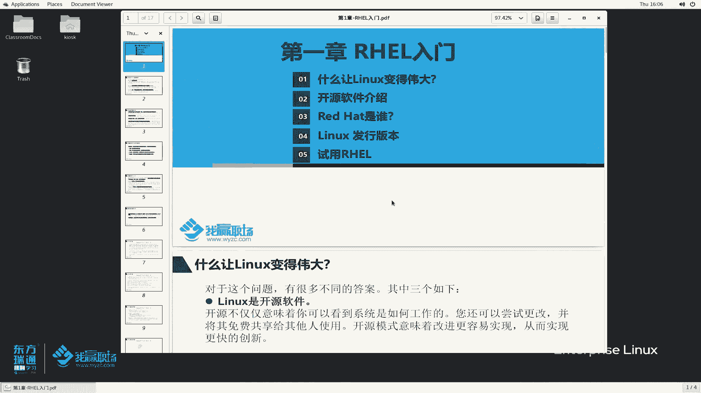

看第一部分，那么是什么让林斯变得伟大呢？其实大家可以啊在我们当今的这个社会发展啊，就是说当今的很多技术上面角度，应该能看到一个问题啊，就是说很多的系统很多地方都是能大家都能够接触到linux。啊。

那到底是什么东西觉得让我们历史能发展到这么厉害的呢？发展这如当今的一个一个。一个情况呢是吧，那么我们从以下三个角度来看一看。首先呢linkux它呢是一个开源的软件，与它当初产生的。

它就自带了这么一个特征啊，那么开源不仅仅意味着我们可以看到系统是如何工作的。开源意味着什么呀？意味着它的语言代码，我们是可以拿到下载下来，自己去用自己去研究的。也可以自己去更改。

更改完成之后可以免费给其他人用。那多个人共同来协作来。维维护这么一个软件的一个发展，促进这个软件的进步，对吧？实现更快的一个创新啊，非常重要的一个特点。开源软件。第二个部分，那linux是一个服务器。

那它创建之初，我们这个系统的服务器啊，它就围绕着什么功能来创建啊？你只要这个服务器给我一个终端，给我一个命令行接口，那么我就能够实现服务器的管理。它自始至终都是围绕着这个命令行界面来构建和设计的。

那么只要你给了这个命令行，我们就可以在这个命令令行里面去做很多事情。例如说我使用s脚本执行自动化。所以对我们系统里面一做一些部署啊，资源的调配等等等，简化了本地和远程的系统的管理。

我们可以通过网络获取一个cll命令行去对机器进行一个配置。与很与其他一些服务器啊，我们知道很多一些服务器在配置过程当中啊，可能会给我们提供一个界面。其实界面是需要我们开发人员去开发出来的。

那么在界面上面去提供这些功能，往往是调用底层这些命令这种接口的。那么其实如果说我们作为管理员直接获取这个命令行，那么去操作的时候是非常的。方便的，而且功能是非常齐全的。

因为你外面你给你的一些UR接口上面啊，用户接口上面，那很有可能这个功能是不全的，只要。同新界面不能够完成的事情，我们命令行界面。都能够完成啊。也不能这么说啊，准确的一点准确的一点讲。

应该说命令行里面能完成的，同一界面不一定完成，图形界面能不能完成的啊，大部分命令行都能完成。好，这个命令行非常厉害啊非常厉害。而且以后我给大家讲课的时候，基本上也是。大部分操作都是在命令行上面去解决。

第三个部分，linux它是一个模块化操作系统。其实我们刚开始说linux它是一个什么呢？其实它是一个内核啊。之前啊我给大家简单的画一幅图啊，例如说这是我们的一个linkux内核，它是一个可no哈。

是一个可no。那么在外面我们会给它加各种功能。例如说我安装同一化界面。例如说我在安装一些其他第三方的工具和软件。它是类似于这么一个模块化进行组装拼装起来的。那么对于后续外界的这些功能呢，你可要可不要。

根据你自己的需要，你对它进行一个添加和删除和更换都可以啊。它是一个模块化的操作系统。那么这个功能就可以让我们我们用户拿到这拿到了这个系统之后，我们更好的对它进行一个个性个性化的设置。那主要从三这个角。

三个角度给大家看啊。再来看一下什么是开源软件。

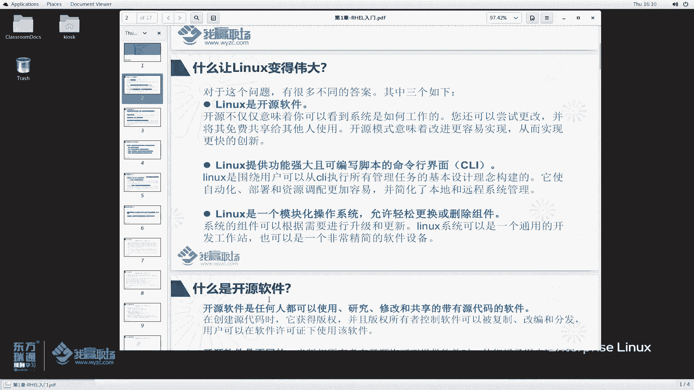

所谓的开源软件是什么？说任何人都可以使用研究、修改和共享的。最重要一点哈，带有源代码的软件。好，这个软件开源了，就意味着我们任何一个人都可以去获取它，去研究它啊，并且啊这个软件创建的时候。

作者获取了他的版权，但是这个版权所有者可以控制着这个软件被复制改变分发。用户可以在许可证下面去继续使用。一般来说啊，我们这个。作者哈作者那么把这个云代码开发好，创建了这么一个软件之后呢。

虽然说版权是属于这个作者。但是呢这个软件是可以。被分享的哈被复制给其他人去用的。要么你这个还还还叫什么开源软件呢，是这个道理吧。第二，开源软件是不同的那不同是什么呢？说当版权所有者在开源许可证下面。

这个软件它要遵循开源许可证，你才能称之为叫开源软件。那么他授予远端用户，或者说授予其他用户呢，他具有查看修改变译，并且。他更改了这个源代码软件之后，他继续可以向他人去免费的重新分发这个源代码的权利。

就像我们如果说下载了linkux内核，那么下载完成之后，我觉得我想在这个现有机上我增加一些东西。那么增加完成之后，我生成了我自己的云代码，加上云代码。那这个东西我可以打包分享给别人去使用。😊，啊。

非常好啊。开源促进了协作、共享、透明和快速的创新。软件开源了，大家都能够对这个开源软件进行使用啊，鼓励着开发人员以及。云代码创作者之外的人员对软件呢进行一个修改。好，并与其他人一起进行分享。

促进的协作和创新啊。原件是开源的，但并不意味着它不能够被商业化使用或提用。这一点要给大家强调一下。那么很多同学说嗯，国内你的历史内核不是免费的吗？开源的吗？那么为什么到了国内之后。

很多人拿过来用封装一下就卖了，做成了商业产品？好，确实是可以这么用啊，可以用啊。开源是许多组织商业化运作非常关键的一部分。那确实是这样啊，那么一些开放源代码许可证是允许在封闭源代码产品中重用代码。

什么意思呢？我们的一些公司，一些企业把开源的源代码这些产品拿获取了之后，然后他会在重用源代码的情况下，然后加入自己。自己编写的新增的一些功能，然后呢对它进行闭免。闭缘完成之后。

然后对这个产品呢进行一个商用化啊。人们呢可以销售开源代码，但真正开源许可的条款，通常正常情况下啊是允许用户继续重新分发源代码。那么这要考虑到开源产品，它遵循的一个license。啊。

后面我们会给大家讲啊，那么到底有哪些license，那这种情况下是允许分发。那有的软件产品是不允许你要想用，对不起？你拿到我的开源产品，你自己增加了新功能之后。

你就不允许把我这个产品作为商用的去实去去去去卖买卖啊，不能这样子。😡，OK啊，那最常见的情况，洪茂就是干这个事情，对吧？说红茂他在供应商在部署支持和扩展基于开源产品的解决方案，他提供了很大的帮助。啊。

社区里面有很多一些开学软件。那么虹茂呢，他会提供。很多的一些支持，包括技术资金实践啊等等上支持。然后去帮助我们开元社区里边软件进行一个改进啊提升。那么软件发展好了，当然红帽呢也可以获益。

那因为很多组织都来参与，是不是啊？参与过之后，软件提升就快了。那么相当于一本万利的这么一个作用是一样的啊，其实其实对开源这个产品啊，对于我们而且对于对于对于我们当今的这个T来说是非常好的一个生态。

你包括微软微软现在也开始拥抱开源的是吧？微人里边power里边自带了一个内核，可以大家让让大家去体验一下这么一个小系统。

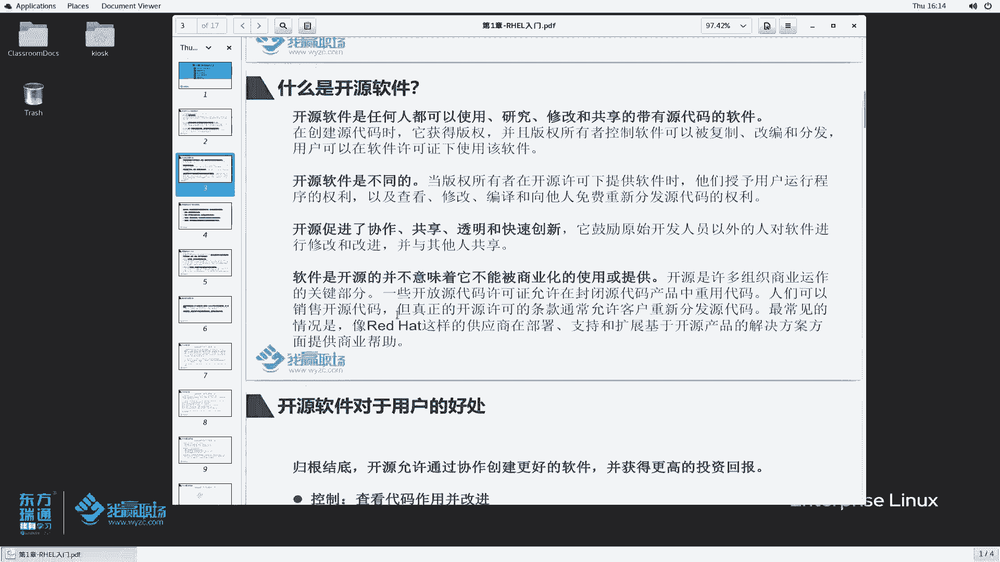

好，我们再来看一下开源软件对于用户的好处。简单的看一下四个方面，啊，说归根结底呢，开源软件呢还说允许通过协作创建更好的软件，并获得更高的回报。例如说控制你软件开源呢，大家都可以看是吧？

可以看到代码是怎么运作的。第二，那么你的源代码开源的软件源代码，你写的好，大家可以用一下借鉴用来学习啊，学习完成之后呢，利用这个源代码里边的一些东西啊，可以开发出更好的一些产品。安全性。

那么原检查一些敏感代码，在原始开发人员帮助下修复或者不修复。说白了跟第一个有点类似啊。这第一个是从控制的角度。第二个呢，从安全的角度来说，源代码的一个问题。第3个，那么即使这个开源软件。

它源代码的一些开发人员不继续提供支持了。那么我们的其他人员还可以对这个开源人员继续进行一个维护下去。啊，得以生存啊，这是开源对用户的好处啊。

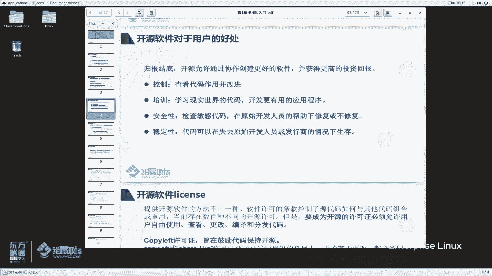

好，刚刚我们提到开源软件啊，提开源软件里面涉及到几个tlicense啊，这里边我们要强调一点啊，提供软件啊软件呢它要作为开源软件，它其实的方法，或者说它的license不止一种有很多种。啊，学那种。

那么。当前的情况下啊，他这个开源软件的license呢大家可以看到存在着数百种不同的开源许可。那么但是有一点是共同的，就是说你这个软件要想成为开源软件许可证，那必须允许用户自由使用查看。

更改编译和分发代码。那不仅你查看使用更改并译，而且还允许分发。我用户改完之后，我还可以自由去分发。啊，这么几个啊，非常关键的这几个特点啊。那么开源软件的license呢主要分为两类啊。

其实分比刚刚我们说过有数百种啊。那么我们从分成两类给大家讲啊。第一个copy left的许可证。他的目的是在鼓励代码保持开源。啊，说什么意思呢？哎，我代码给你了，给你之后呢，那么你拿去之后。

你就不要把它商业化了。你对它加强之后，然后呢，你继续要保持开源给其他人用啊，这是我们讲copy life的这一种类型的许可证啊。那这些许可证的基本优点是他们有助于保证我们这个源代码继续去开放啊。

对代码进行改进，并增加可用的开源代码的数量。原先呢我们只有这么一小块，大家都来改进。那改进完成之后继续开源。那么你我们这个软件呢就是。越来越大哈越来越大。对于这一类许可证里边有两个典型的。

一个是GPL和LGPL。GPL我们会常见的比较多啊，除了GPL，我们经常还会看到什么GNUGPL啊，听到这些词。那么还有另外一类叫彭miss有许可证。这个它的作用是什么？

他说他的目的啊主要是最大限度的去提高源代码的可重用性。我希望我们的云代码能够更多的对被重用。往重用啊。只要版权许可版权和许可声明得到保留，那么用户就可以将源代码用于任何目的，包括。

在更严格的甚至是专有的许可证下面重入该代码。那么这个这个规则确保了我们这个云代码很容易被重用。那在这一类里边主要有这么一些啊，例如说MITX11许可证啊，简化的BSD以及appartache许可证啊。

其实很多一些开源软件啊，确实确实是使用了这么一些许可证进行一个发布的啊发行的。哦，这是开源的license啊。

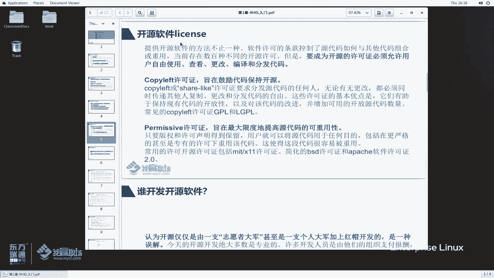

那么我们再来看一下是谁开发的开源软件呢？啊是很多一些志愿者吗？是不是是很多一些志愿者，还是说是由红茂领军的，再加上一些志愿者去组成的啊，不是的啊，不是的啊。除了这么一些志愿者之外。

还有啊今天这些开源的软件绝大部分都是一些专业人士来编写的。哎，这些专业人士。基本上是由他们的组织来支付。例如说英特尔AMD红帽啊等等等。这些公司他来支付一些。报酬给我们这些开发人。

让我们这些开发人员在我们的社区里面为我们社区做贡献。好，是这么样一一种方式。啊，当然你这个开源软件开发好之后呢，由于你继续保持的开源性，那么我们各个组织呢就可以。利用啊就可以使用这些开源软件了。好吧。

除了之前提到的一些专业人士，还有一些在开元社区里面有志愿者，还有一些学术界啊，他也发挥着重要的作用。尤其是在比较新的一些技术领域。那么这种非正式和正式的发展的结合呢。

也提供了一个高度动态和生产性的这么一个生态环境。嗯非常好啊非常好。好，总结一下，这里面有3个，一个是组织里边的一些专业人士，还有一些我们的志愿者，那么还有一些学术界主要3块啊。

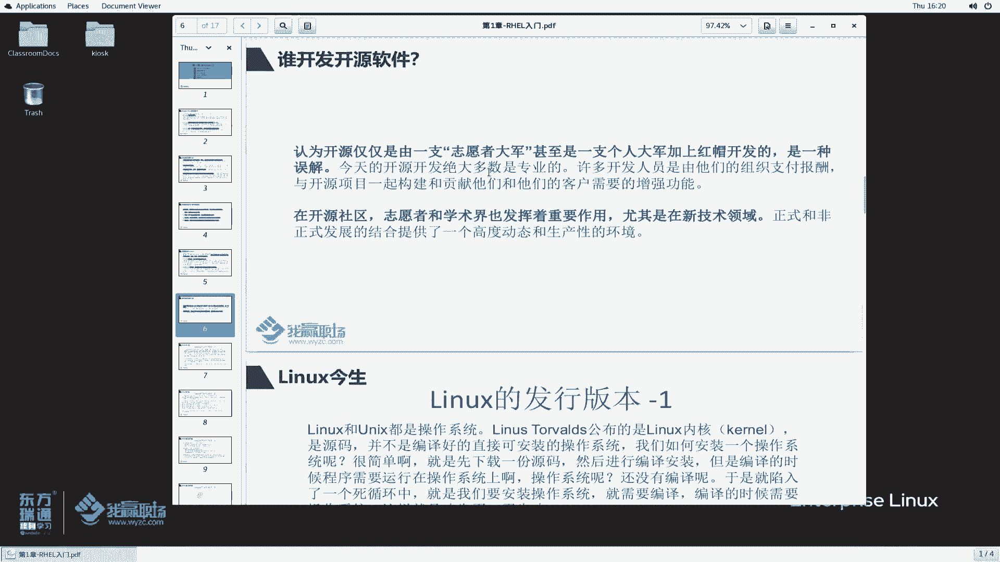

再来看一下。linux的。今生哎，在我们之前给大家介绍HC18的课程的时候，我们给大家讲的叫linux的前世。钱世是什么来的？刚开始计算机出来的时候，后来有了unix系统，后来有了什么。

后来刚开刚开始有了你计算机啊，然后出了什么mal啊，多路系统，然后出了unix系统，没录系统，然后又出了什么呀？出了BSD啊，第6版本的对吧？然后出了我们教授里边的一个minux系统。

然后紧接着出现的lininux系统。那么linux跟unux呢，它都是操作系统，他们公布的都是源码。那，注意他公布的是源码，并不是说我们一个可以直接安装的这么一个操作系统。

那么如果说我们如何去安装这么一个操作系统呢？我拿到这个源码，我怎么能变成一个操作系统呢？很简单啊，那么我首先下载一个源码，然后呢，对它进行一个编译，编译成了一个操作系统之后。

我按然后我这个操作系统就就能用了。但是大家想一想，如果此时我都没有一个操作系统，我怎么对源码进进行编辑呢？哦，这个就导致了出现一个什么问题啊？急生段带声机的这么一个问题。其实我们可以这样做啊。

我自己不是没有这个电脑吗？我可以找我们的朋友嘛？我们朋友肯定是有类似有这么一个电脑，对吧？哎，我把我们这个源码下载下来之后啊，然后把我这个硬盘放到我们朋友那边去。

让它编译一个系统啊放到我们这个硬盘上面来，那么把这个编译好的系统呢，然后这个这块硬盘呢，然后再装回我们的电脑上面去。那么此时我这个系统就可以正常启动了。是不是这么一个道理。😊，好，这个好像有点复杂嘛。

是不是啊？对于我们普通对于我们普通人来说，我这个操作系统都不会玩，还想还想着去编译的，那么难度有点高，对吧？难度有点高。有没有说这么有有没有一些这么专业的人士帮我们去解决这个问题呢？😊，有啊啊。

于是就产生了很多linux版本的一些发行商。他专门拿到这种linux内核源码之后呢，然后帮我们生成一个linux操作系统给我们去使用。

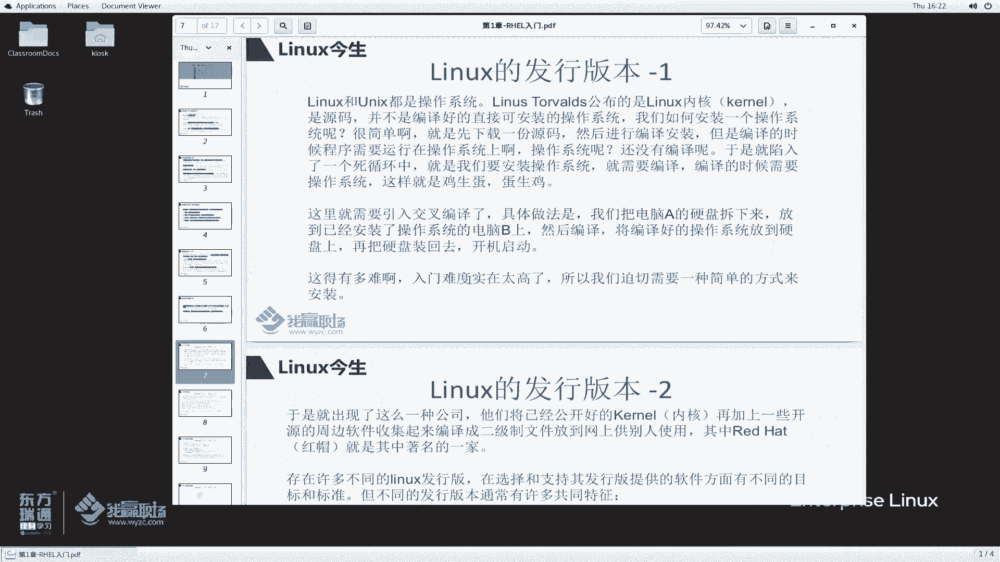

那这里边就提到了一个东西啊。那这些公司把Lux内核拿源码拿过来之后，然后再加上一些。内核在内核基础之上加上一些周边的一些软件，然后呢把这些周边的软件以及liux内核呢整合成一个操作系统。

整合成一个二进制的这么一个文件。啊，然后供别人去使用。那么redhead就是这么一家公司。但然除了rehead还有好多，市面上至少有好几百家这么一个公司做这个事情。当然呢。比较大的哈比较大的公司。

那么redhead是首屈一指的啊。那么存在着许多不同的links版本。那么我们用户在选择和支持其发行版本提供的人，我们用户在选择links发行版本的时候，该怎么选呢？对吧。

那么首先我们要知道到底有哪些linux发行版本以及linux版本有哪些特性。好，来看一下。那不同的linux版本呢，它通常都会有一些共同的特征。例如说我从以下四个方面给大家讲讲。首先。n的发行版本。

刚刚我们提到是由内核，再加上周边的一些软件编译收集起来，组成了一个二进制的文件。也就是我们讲的这个内核加上我们用户空间，或者说红帽周边的，或者说内核周边的一些软件组成的。那么这个发行版本可以是小型的。

可以是单独用，也可以是什么数千种。那如果说大家学过什么，学过什么渗透测试，就知道有一个系统叫卡lyin是吧？那么有的企业里面经常用什么sOS系统，那还有可能用得变啊，susi啊等等等。根据你的需要。

我可以下载内核之后，我比较牛，对不对？我自己去对这个新的内核，我自己去定制我自己的系统可以。啊，根据你的需要，你想怎么改怎么改啊。发行版本必须提供安装和更新发行版及其组件的方法，这个要求就比较高了。

你这个发行版呢必须要告诉我们啊，你这个发行版本里边的软件我怎么安装，以及呢这个软件更新的时候，你提供给我一些更新的一些软件包啊，让我们去安装和使用。啊，最后一条。发行商必须支持该软件。

最好是直接参与开发社区的社区。好，一般来说啊，当然这个必须支持该软件要考虑到一个是免费，一个是商用的。啊，像汕通S里面设区的，他就是。在社区里面提供一些技术支持啊，那么像红帽的操作系统，哎，对不起。

他不提免费提供，它是一个商用的啊。你要想系统出了问题，你想找我对不起啊，对不起，花钱来买我们的订阅，我们才提供技术支持。好，这里面我们提到讲lins版本。

刚刚提到是linux发行版本以及linux内核的版本。所以说当我们去谈论linkux版本的时候，那么我们到底是讲哪一个版本呢？一定要讲清楚。一般来说哈一般来说我们要讲linux版本的时候。

大部分谈到的是。什么谈到发行版本。就是说我们问你你你使用的是哪个lists版本，你们公司的好，我使用赞通S哎，我使用红帽的，我使用无邦图的啊等等等。那么很少会说这个你内核版本是多少？一般来说。

开发人员在我们list内核里面去开发软件的时候，对于内核这块他关注的会比较多一点。

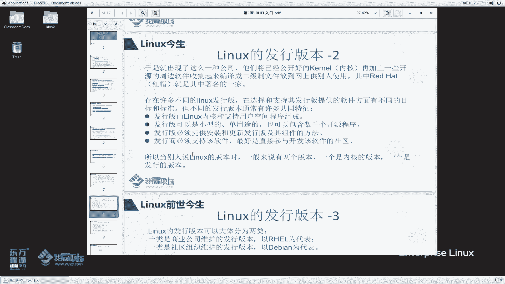

好吧。OK啊，刚刚讲给大家讲了临发行版本。

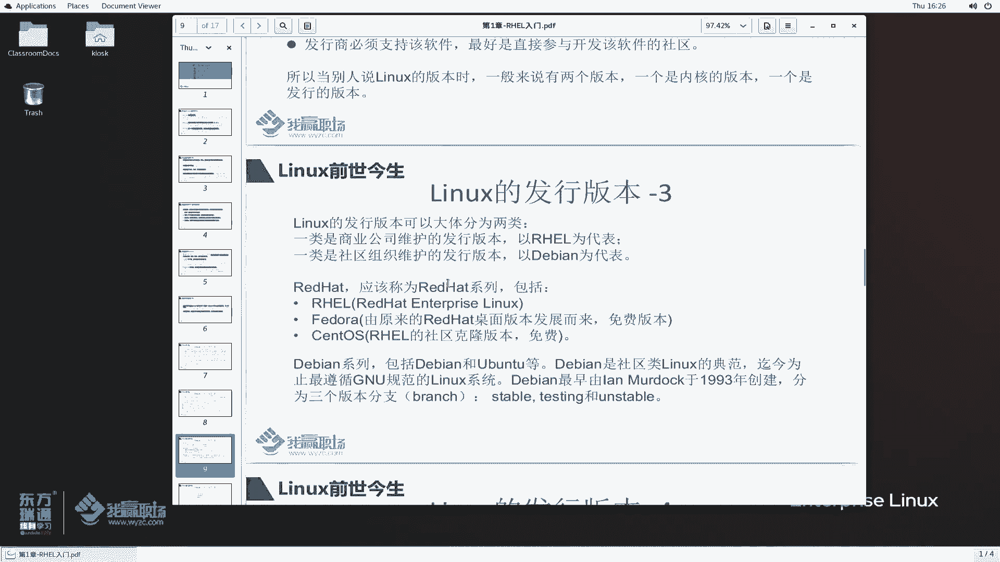

那么类似发音版本这么多。我们可以给它分成两类，一个是商业公司维护的一个发行版本，以猴帽为代表。那么还有一个叫社区组织维护的为代表的，叫德边。啊，这个呢你用系统过程当中啊，洪茂提供技术支识，但是呢它是。

有偿的哎，这个社区呢哎，我你使用我们的得辩那个系统之后啊，那么我们会定期的去更新。在我们社区里边，你可以去自己去下载去修复啊，叫自助的啊自助的。由我们社区提供支持。那么redhead它是一个鸿贸的公司。

它提供的操作系统呢称之为RHEL。啊，red hat underpri红帽企业级的临s系统。其实红帽它系统提供的还是比较多的啊。只不过呢在这个时候啊，我们现在谈论红帽的操作系统啊。

一般都称之为RHEL在之前它还有很多个版本。啊，很多版本啊。那么他还提供什么反刀啊？HEL我们理解为服务器的版本。fi倒尔理解为叫桌面的版本。桌面也就是说我们用的达尔的桌面可以用来办公啊。

它是专门用服务器的啊，服务器版本和桌面版本。汕头S呢是HEL的一个社区克隆版啊，什么叫社区克隆版呢？首先汕头S是红HEL的克隆版本啊，是他是把鸿帽的这个HEL系统呢原的源码拿过来啊。

重新编译生成这么一个汕图S。然后他还干一个事情是吗？那么你虹茂呢虹茂对这个操作系统里面做一些更新啊，做一些bug修复，发布了一些定呃刊物，对吧？那么汕头S会把这个拿过来，再次啊提供给我们那个许用。啊。

但是呢汕头S他发布的比较慢啊，你想想人家这个是花钱花了那么多资金去才才去修复这些软件的问题，不可能啊，随便就是给你用的。但是汕头S确实干了这么一个事情。啊，干了这么一个事情啊。德宾系列。

这是商用的啊商业公司维护的得变呢是我们刚刚说的是社区组织的社区组织呢，例如说得变系统无房毒系统那那得变是社区里边的ux典范啊，迄今为止最遵循GNU也就是说我们之前提到1个GPL对吧？这么一个东西。

德辩最早是有这么一个啊去于1993年创由他去创建的。对于德辩系列的，他这个版本呢？我们分三个分支。稳定版本，当然公司肯定会用稳定版本的是吧？测试版本还有不稳定版本。那不稳定版本可能功能比较多。然后呢。

经过测试之后呢，变成我们的这个稳定版本，再大家去用哦，两类好吧。

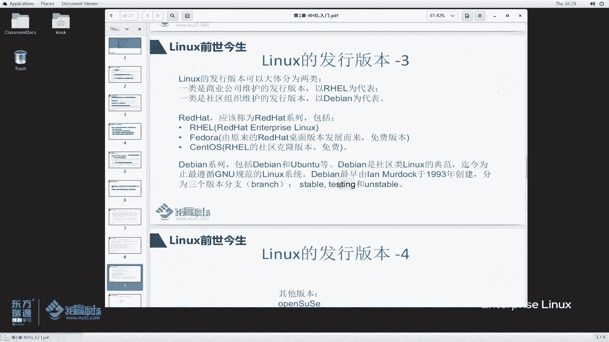

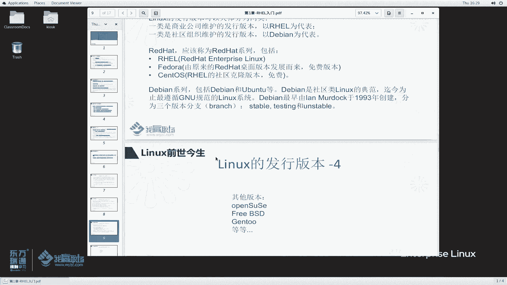

还有一些其他的临s版本。好。那关于这个liux发行版本呢，我们暂且来就讲到这里。下节课呢我们再来聊聊红帽啊红帽。

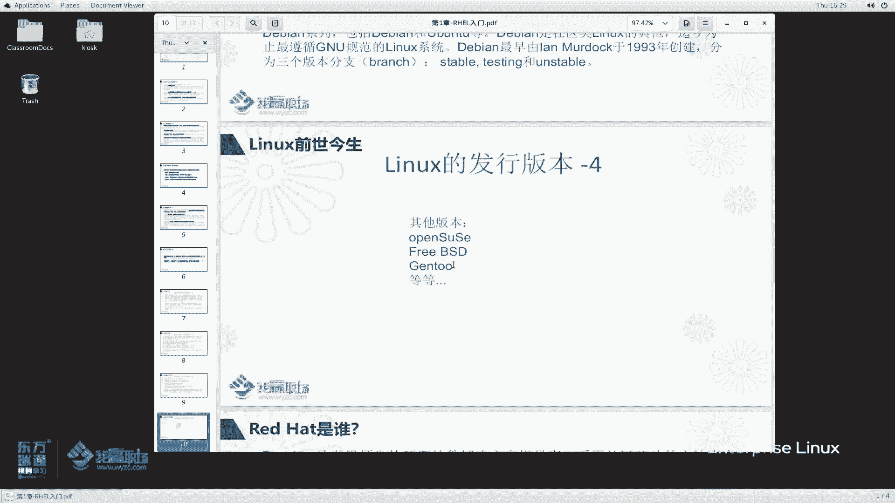

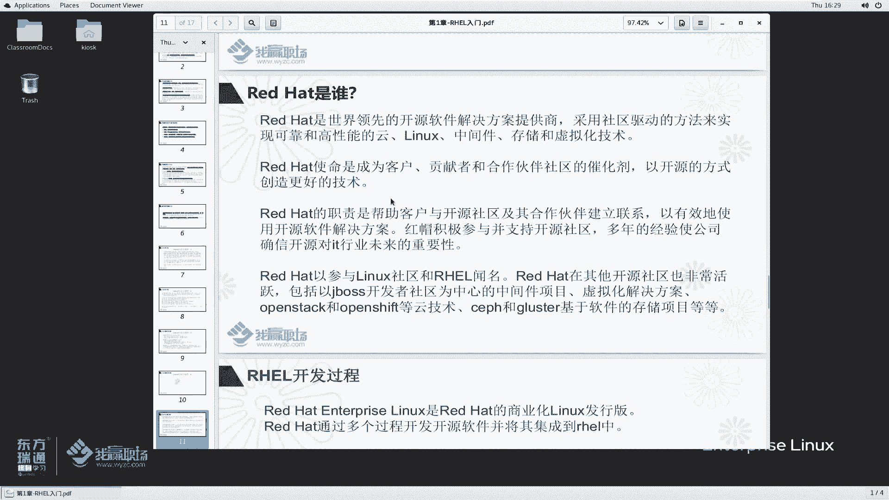