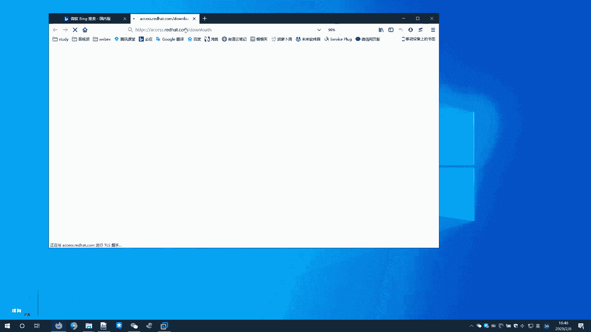

# 红帽RHCE8红帽认证RH124认证课程【全】 - P4：01-RHEL入门2-RedHat是谁-试用RHEL - 北京东方瑞通 - BV1KM4y1M71q

同学们好，欢迎来到我赢职场HC18课堂，我是马老师。我们接着说。red hat是谁？rehead呢是世界领先的一个开源软件解决方案提供商。

它采用社区驱动的方法来实现可靠、高性能的云linux中间件存储和虚拟化的一些技术。哎，这个地方有一个非常关键的叫社区驱动的方法？什么叫社区驱动的方法啊。其实我们刚刚也给大家提了一点点。

那么刚刚讲到什么开源软件是由谁开发的，是由谁呀？是由各个组织，有很多一些组织里边的专业。工程师来参与进来的。哎，这些专业工程师呢有组织来提供他的薪酬。那么洪梦。他积极的参与社区啊。

我们讲这些这些社区里面软件是吧？那么经过了很多一些机构的组织啊，来来来开发出一些新的产品之后呢，那么这个软件会变得越来越好。那同样红帽在这一块投入的非常大。而且随着这个软件的成功，那么洪茂渐渐的会。

可能会把它收边啊收编啊。那么redhead它的使命是成为客户贡献者啊合作伙伴社区的催化剂，以开源的方式创造更好的这么一个技术。其实红茂说白了啊，说白了红茂就想嗯他想成为一个什么样子一个呢？

他让我们的社区软件啊不停的孵化，他也会投入很多资金。那么当社区里面软件已经孵化成功，能作为商用的时候，那能够已经在我们生产环境下面已个已经能够提供非常好的一个商用价值的时候，那么他就会。

有可能会把它锁骗。但是由于你这个语言代码是吧？源代码是共享的对吧？那么红帽呢会积极的参与进来。因为红帽它自始至终它都是一个。他卖服务的啊，他不是卖产品，他主要是卖服务。很多的红帽的产品都是开源的。

但是呢你想用它的产品，那么你可以买它的服务。它产品你去用的时候，他不提供不提供更新啊，不提供这个版本遇到问题的更新。你要想用你你花钱买它的订阅买它的技术支持啊，提供更好的这么一个技术。

洪茂的职责是帮助客户与开源社区啊及合作伙伴建立一个联系。那么有效地使用开源软件解决方案。很多。所以说我们讲红茂提供的一些很多产品里面啊，其实都是社基于社区里边的某些软件进行一个二次开发。

或者说社区里面的软件对它进行一个封装之后产生出来的。当然很多很多红猫的软件，他也要自己的开发出来的也不完全所有的软件都是社区里面的。虹茂呢基予的参与并支持开元社区啊。

那多年的经验呢是虹茂公司啊确信开元对IRT行业未来的忠要性拥抱开元。对吧刚刚我们提到那微人现在也拥貌开源了是吧？rehead已参与临社区和HEL的文明啊，红帽的操作系统你是可以免费下载，免费用啊。

HEL呢rehead在其他社区呢也非常的活跃啊，包括gebo中间建的是吧？那么中间项目虚拟化解决方案，open stack open shift啊，sfe glass等等等。啊，等等。

在我们讲HCA的课程里面，经常会给大家讲啊，HC里边有什么有ser啊，有gla，open shift ，open stack等等等虚拟化啊，都会有这么一个课程，包括中间件。啊，这些课程。好。

给大家简单的讲解了一下红帽啊。😊，那么红帽它的1个HEL这个产品，它是它的开发过程是怎么样的样子？啊，要从虹帽的，刚刚讲到的虹帽的以虹帽为代表的linice发行版本要说起。

刚刚我们提到了它的发行版本有这么三个哈HE汕。那么首先我们要谈到一个叫。啊，为什么提到他呢？啊，我们来看一下。😊，首先，洪茂这个组织这个公司呢，他会参与我们讲开源社区，参与我们的开源代码。

也会贡献代码啊，贡献开发者的时间啊，提供我们开发者的一个新出啊等等等，提供这么一些技术支识，参与到开源社区里面来。以及与其他临时发行版本的一些工作人进行协作啊。

有助于他开发出也助有助于什么有助于开发出更好的一个软件。提高软件的一个总体质量。那么洪茂呢，开元向并江。虹茂赞助看一项，并将其集成到社区驱动的linkux发行版本达尔当中。诶。

刚刚我们说你红茂不是参与了吗？参与这个软件开发出来非常好的一个软件，不是开发出来了吗？那么红帽呢就会把这个开源软件呢。集成到红帽的桌面版本啊，桌面临时发行版本，也就是集成到斐达尔当中。

那这些软件虽然说是开发出来，但是软件呢还需要经过一定的测试，经过一定的磨合，才能集成到我们的鸿帽的HEL系统当中。好，那么新开发出来这个软件呢，它会优先放到斐达尔里面。斐达尔R里面是我们的工作环境。

我们的桌面环境，你个人用的不是企业环境用的。所以说呢斐达尔其实就相当于什么相当于。RHEL的一个前身相当于一个什么一个实验室，一个测试场啊，等这个百达尔这个软件集成到斐达R里面用了几两三年之后，哎。

洪毛觉得哎确实稳定了，没什么问题了。那好了。此时，这些软件呢才会真正的集成到HEL的系统当中，然后提供给。我们的企业用户去用啊，最终呢我们的HEL系统就诞生了。OK啊，这是我们讲的HEL的系统。😊。

那再来看看反道2。斐大尔是一个社区项目，它生成并发布一个完整的免费的基于linux的一个桌面的操作系统啊，其实它的一个桌面非常的花哨啊，非常的一个啊漂亮啊，而且非常的动感啊。那么很多一些功能都支持啊。

就像windows操作系统一样，我们经常用它用来办公。那么斐当然也可以用来办公，非常好啊。斐德尔项目呢为自由和开放源代码贡献了一切，任何人都可以参与其中啊，他也注重创新和卓业。但是我们刚刚讲过。

它不是长期稳定的，6个月有一次重大更新啊，而且呢会带来很大的变化。只支持一年左右的版本啊，那么两次主要更新不太适合企业用啊，也就是说反德然是HEL系统的一个过渡期。好，过东线啊。

那么HHEL是一个企业级的一个商业支持的一个临ux发行版本，它呢也会开放源代码啊。那么拥有一个由合作伙伴硬件软件认证咨询服务培训和多年支持组成的一个大型生态系统的维护支持和保证。简单点讲。

HEL系统比较牛，很多企业组织，包括硬件软件都认可，跟他集成都非常好，就是这么一个意思啊。那HEL的主办们都是基于斐达尔的啊，可以选择可以选择这个可以选择相应的包，那进进行进一步的一个增强。

那么为我们的上游呢也会做一些贡献。那RHEL里面开发出一些好。那么红茂呢开发出好的一些东西呢，也会贡献给我们社区里边，让我们社区呢能够这里面能够更好的发展啊，满足客户的满足做出满足客户需求的配置。

那么我们现场的一些用户啊，他的环境里面可能会遇到各种问题。那么红茂的技术支持呢，会针对这些问题啊提供一些解决方案啊，包括一些开发的新功能或者是bug修复。那这些东西呢。

红帽的证红帽呢也会相应的反馈给我们的上游社区里面项目。红帽呢是基于订阅的分发模式。什么叫订阅的分发模式啊？举给大家举个简单的例子。红包操作系统，你现在用的是7。6的版本，那么7。

6版本里边某一个软件出现了bug，你生产环境要用，那么你要用怎么办呢？好，买红帽的订阅。红帽的订阅的开发人员呢会给你提供这种更新这种修复啊，就是这么一个意思。那红帽呢还提供他的一个门户网站。

在门户网站上面呢，我们能够找到很多一些支持，维护更新补丁。那么前提条件你是买了它的订阅，买了不同的订阅，你会具有不同的权限。啊，不同权限。那客户在需要。需要是支付长期的支持和专业的支持、承诺和帮助啊。

当主要更新可用时，客户可以在方便时候升级升级，哎，无需支付额外的费用，简化了系统更新和经济管理。那这一部分啊大家啊如果说你们公司买了红帽的产品啊，可以跟红帽子红帽的一些。商务代表去谈一下啊。

了解更专业的一些更具体的一些项目。OK啊。再来看一下汕头儿。汕头S是社区驱动的Lux发行版本啊，原大部分源代码啊是来自于虹贸开放的这么一个源代码。当然还有一些其他来源。那么汕头S呢，它是一个免费的。

由一些活跃的志愿者、用户、社区人员。提供支持那独立redhead运营。虽然说三头S现在被红帽收编了是吧，但是它是独立运营的。好，刚刚提到收编的问题，那么红帽又被RBM收编了，是不是啊？

OK我们来比较一下汕同S和HEL。首先来看红包的。HHEL它提供了多级别的支持，包括工作时间和标准的支持。针对一些关键的问题呢，提供7乘24小时的啊这种支持。当然，那么跟取决你花钱买红帽的订阅。

那么你有可能买它是5乘8小时的，你有可能买买它什么买他电话支持的是吧？还有说技术技术支持可以上门服务的那不同的级别取决你的服务。那如果说你系统使用3。OS，对不起，你的技术人员自助，你自己去互联网上面。

各大论坛上面去我们社区里面去找帮助。嗯，当然了，你说我花钱请别人去去给我们提供支持，那也可以，但最终呢还是自助啊。那么你如果使用了鸿帽的系统，你可以找鸿茂的专业团队给我们提供支持。第二。

内部开发人员可以快速的响应问题。在官方HHL发布之前，可能会应该说会提供修复。哎，操作系统里面啊，某一个出现了某一个bug，或者说我们功能需要加强。那么你联系红茂，你买了订阅。

那么红帽的技术人员会负责给你解决这个问题。汕头S没有对吧？你汕头S自助的，你哪来这些刊物呢？那么什么时候才出来呢？洪帽把这个问题修复之后呢，在下一次发布刊物的时候。好，发布刊复的时候，他的源码也发布了。

源码发布之后呢，汕头S一些我们俩。活跃的志选者还是吧，把他这个源码呢，然后编译成编译出来，编译成我们的二进制到我们的汕toS这个里边提供给大家去使用。那这个周期就比较长了，一样的，你花多少钱干什么事。

那么这个免费的那肯定有时间上的一个耽误啊，给你用已经不错了，是不是啊？那么对于EUS软件，旧mini的版本也提供更新。什么意思啊？红帽的系统他你买了他的订院，它对于这个软件支持的周期是比较长的。啊。

社区里边提供的版本的更新呢基本上可能是最多一年啊，一年它就停止更新了。那么对于红帽的软件呢，例如说你买了我这个软件，这个软件在三年内我都给你提供技术支持，提供软件的更新。哦，是这么一个意思啊。

他提供的周期维护的比较长比较长啊。那么红帽这个操作系统呢说来自数百家的这个SV的成千上万认证程序。哎，这个操作系统我们刚刚讲过。REL系统啊，数百家的这么一个软件呢都对它进行一个认可啊，都经过测试的啊。

非常好啊，没有问题，对不对啊，就是这么一个很牛的一个操作系统。哎，汕通S的没有啊，通常未经过sasSASSEPorle等软件的一个认可啊，这么一个平台。所以说大家要用的时候啊，企业里面去用的时候。

虽然说。例如说我们现在装一个数据库软件，orcle那orle rock想装在哪个平台上，想装在装在salS上面，那么出了问题，你找谁呀，找不着了是吧？哎，虹帽的HI系统是经过认证的，没有问题啊。

可以随便装，没关系啊。同样的再来看一下虹茂的文户门户网站上面提供了很多一些文档啊，你其实呢你可以用红贸的操作系统，你可以自己去找一些官方的一些免费资料进行处理啊。当然，虹茂官门户网站有很多一些资料。

是收费的，只有你订阅了，你的账户才有权限。你没有订阅是没有权限的。啊。那么还有一些基于SAS的工具，鸿茂的公方网站提供了这么一个inightinside工具啊。可以帮助我们分析服务器的一个性能啊。

分析服务器的稳定性、安全性等等等啊，对我们服务器呢进行一个性能评估。那么汕头S也没有啊，他的一个支持也是来自于社区，来自于自助。啊，想一想，那么我们优先啊在生产环境里边，如果说企业不再缺钱的话。

那正常情况下，那肯定是用鸿贸系统。如果说你缺钱的话啊，当然考虑到一些成本的话，那么有可能什么有可能。就请一些啊，我们讲所谓的一些专业人士来处理。啊，其实我觉得大部分同学来学红帽这个HE啊HCE的认证啊。

学完之后呢，大很多人可能就回去维护的时候，都是维护汕头S系统啊，也可以理解啊。啊，这赞同S与HEL系统的一些小的区别。大家注意一下。再来看一下洪茂给我们很多一些用户啊也提供了一些他的一些产品。

这个产品我们来访问一下。嗯，这个地方好，我这个虚拟机里面它是访问不了是吧？我们到外边来访问一下。

好，我们来看一下虹茂的官方门户网站，这个地方是有一个产品的下载。Acess点readdhead点com download里边来。

这个页面是不需要登录的啊。啊，大家看到我没有登录啊，那么我们可以看到这里面有好多红猫的产品，它标的是什么呀？infrastructure啊manage基础基础设施啊，基础架构的一些管理的对吧？

红帽的什么什么卫星服务器的更新的软件的采集的什么as引擎 tower号等等这些云计算相关的存储相关的saffer存储glas存储超融合的架构。

以及啊云计算里面有cloud方混合云opentIAAS的哈什么cloud suit啊云套件啊。还有等等等证明些啊，我们首先找到这里啊，并不是所有说并不是红帽的所有的产品都是可以免费试用的。好。

可以免费评估的。那么HEL8，我们打开来看看能不能下载下来。此时大家发现呢啊你要登录一下，那么我们登录一下。随便找个账户就可以了啊，登录一下，你你在自己在我们虹茂的官方网站去注册一下，就可以下载了。

到这里面我们可以看到它的最新版本是8。1啊，那么我们可以用8。0的那红帽的这个产品，它的基数位啊，8。1，它的版本一般来说大家不要用啊，我们用用偶数版本的，偶数版本是稳定的版本。

往下翻，大家可以看到这里面他提供了4个镜像。第一个。是这个操作系统的启动镜像。例如说我系统出问题了，我专门使用这个boSO来修复，可以。二进制的DVD那么这个是操作系统的完整的一个光盘，很大7。3个G。

啊，例如说我们这样啊新建标签也打开，它就会弹出一个页面，让我们去保存，对吧？我们不保存了，大家根据自己需要去下载。在虚拟化环境里边呢，他还提供了一个KM的这么一个虚拟机的gas image。

那么你也可以直接下这个去体验一下去使用。因为很多一些嗯我们现场的用户啊，客户啊，他是虚很多一些应用是跑在虚拟化环境下面的。那么你可以直接使用这个gas image。然后在这个环境里边呢去构建自己的应用。

最后一个什么splementary啊，一些额外的补充的一些软件包啊。

那么红帽的下载呢，就大家在这里面去下载。

OK啊。那么当然了说云供应商他也会提供一些鸿帽的事例，你自己的产品是跑在相关的什么相关的呃云平台上面去的。那么你可以找相关的云平台给你提供一个红帽的一些体验的一个或者红帽的一个镜像。

当然我们刚刚在官方网站上面也找到了一个是吧，他给你提供的是有1个KVM的镜像。那如果你这个地方不是KM虚拟化呢，那你就要找什么？

找云平台供应商给我们提供相关的一个镜像去使用。OK那那这一节课呢我们就给大家简单的聊了一聊红帽是谁以及斐do然汕toS这么一些之间的关系啊，红帽的产品的下载。OK这节课我们就讲到这里，谢谢大家的收听啊。

我们下次再见。😊。

