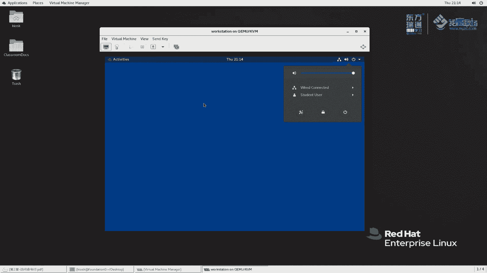
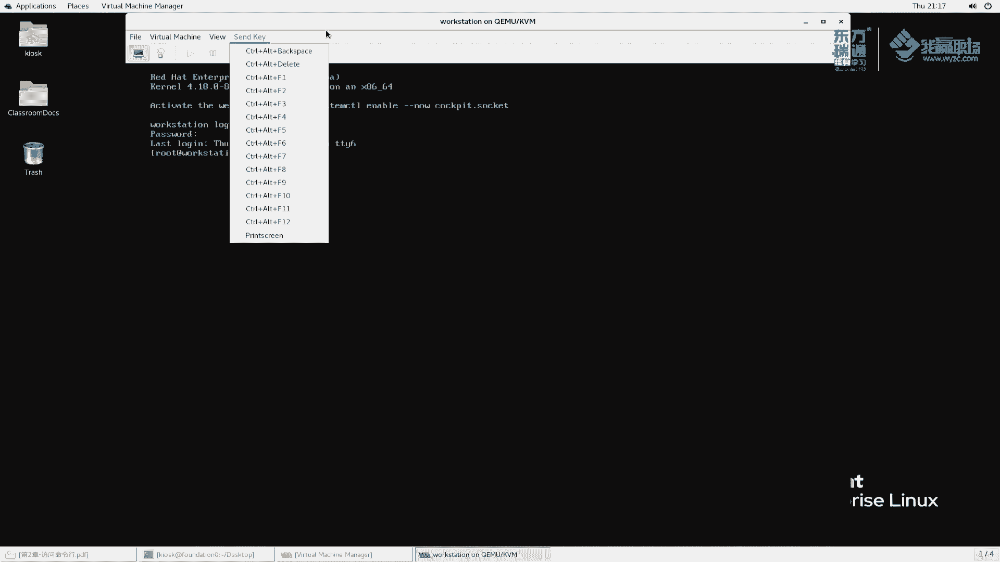
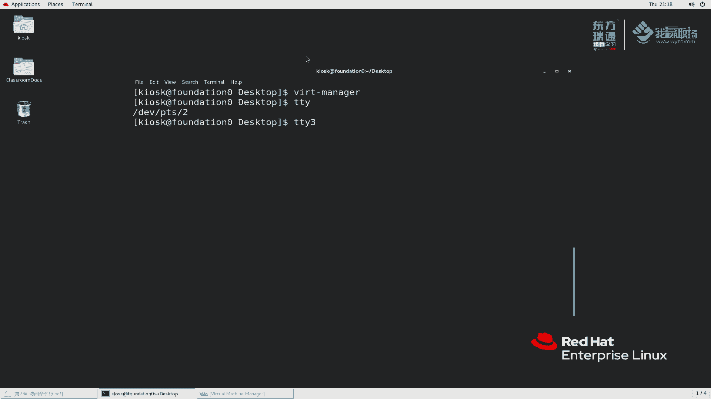
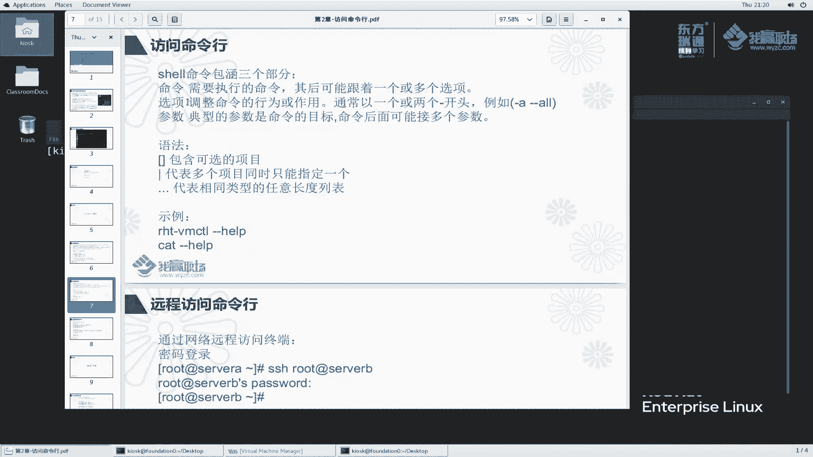
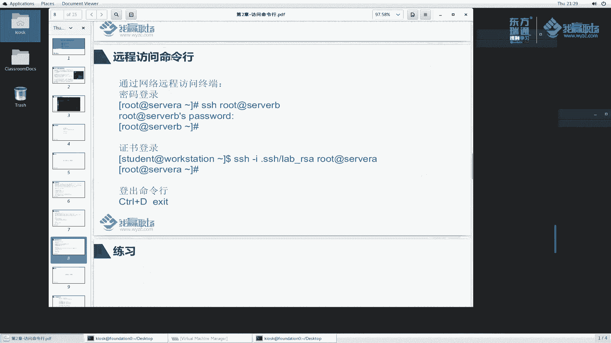

# 红帽RHCE8红帽认证RH124认证课程【全】 - P6：02-2-命令行CLI介绍 - 北京东方瑞通 - BV1KM4y1M71q

同学们好，我是马老师，欢迎来到我赢职场HCE8课程。那么。下面呢我们给大家接着讲第二章里边的第二小节访问命令行。命令行呢它是一个什么呢？A是一个访问接口linux它构建的核心就是围绕着命令行的展开的。

那么我们在这个命令行里边呢去执行很多命令来维护操作系统。

那命令行呢，例如说我给大家打开来，就是这么一个东西啊，它是用于向计算机系统输入指令啊，大家前面也见过啊，我们在这个窗口里面去去干嘛去改密码啊，主要做做了这么一个事情啊。那么我们输入这个东西呢。

这些这些字符称呢叫指令啊，当然你这个指令可能是对的，也可能是错的那计算机要去识别这个指令，那么必须要按照一定的规则来，那你不能随便输，对吧？你随便输入那么乱七八糟一个字符称，它也不识别，对吧？好。

L的命令行呢是由这个shall程序提供的。虽然说大家看到的这是是这么一个什么这么一个。

命令行，但是这个命令行后端的应用程序是哪一个程序来提供的呢？好，我给大家简单的操作一下，我们按一个alt加F2。

他会输入我要求我们说一个min，我们说一个叫gomegome啊，杠min。

回车啊，大家看到了，他给我们弹出来这么一个界面，说明什么呀？说明这个窗口就是由我们刚刚说的那个命令，还记得啦，g杠 terminalmin。min由这么一个程序给我们提供的。注意了。

大家看这名称也能看出来。那么这个应用程序前面有一个叫gno。其实这个程序啊是因为在我们gome桌面下面这个给我们提供的这么一个终端啊，终端如果说我们在字符界面下面去登录操作系统的话。

它打开的终端就不是这么一个终端了。好吧，就是其他的终端了。那么到底是什么终端呢？我们待会再说。

那命令行是有这个shall程序提供的。那么我们都知道linkux里边linkux它发展了多年有那么多个发行版本。那么每一个linkux发行版本里面是不是都有自己的shall呢？啊。

不能说每一个lists发行版本都有。但是呢。这么多个发行版本里面确实产生了很多的sll程序。啊，在我们这个操作系统里边，我们当然也存在很多啊。因为你每一个用户的使用习惯可能不一样。

那在我们这里边红帽它系统默认提供的shall程序是什么shall呢？是GNU里边叫burner again shellll简写BAH叫besh。

besh呢是unix啊是类unix系统当中相对来说是最成功的一个shall，也是呢使用最好的那besh呢也是这个是SH的改进版本。SH也是一个shallbesh呢是的一个改进版本，一个升级版本。啊。

那么shall到底是承担什么一个角色呢？我们刚刚说shall是一个程序用于执行指令的对吧？我们说一个子务证交给他指令啊，他就执行了。其实呢我给大家画一个普图，更准确的一点讲，是要应该是这么来描述。

这是我们的操作系统，我们讲linkux内核叫clenel啊，我简写一下，写个clenel啊。那么最外层我们再来画一层，这一层这一层呢我们可以理解为叫shall层面。啊，我们再画一层。

在这一层里边代表的是什么？代表是我们的各种命令。例如说我们讲的LS命令查看文件列表。例如说我们刚刚讲的PASSWD。那这个是用于设置密码相关的对吧？那么再里例如说CD啊CD那么还有等等等很多这些命令。

那这些命令是作为字符，对吧？我在命令行里面，刚刚我们说我们在命令行里面把这个字符输进来，字符输进来会交给sll去处理。是要会去解析啊解析解析完成之后，其实他他只是作为解析的，他并没有执行。

真正执行肯定交给谁交到我们内核里边去执行。可nel执行完成之后呢，会把返赔结果给在我们的shall里边啊，在我们的sha程序里面给它展示出来。然后简单一点讲，就是这样。

哎，我们切一下啊，我在这个shall程序里面说1个LS，或者说说1个PASSWD。那么这个字误串会由我们这个shall程序来解释，大家解析啊，一大家一定要听清楚我的意思，这个仅仅是一个字误串。

随便你怎么输，你可能输一个对的，也可能说一个错的那我说一个password。password它这个字符证sll解析的时候，就代表去干嘛去给我们设置重新重新设置密码的，对不对啊，是密码的是这么一个意思啊。

那么我执行完成这个命令之后呢，给我们返回的信息，这个呢叫标准输出，标准输出呢显示在我们这个终端里面啊，就是这么一个流程啊，大家虽然说我们执行起来这么简单，但但是呢大家要知道这么一个流程啊。

因为因为如果你不知道这么一个流程的时候，当我们去执行命令的时候，很可能这个命令会出错，那么你要搞清楚到底是哪一步出错的啊，是con的问题呢，还是说我这个字符传的问题呢，还是说我这个sll程序的问题呢。

分三步啊，要搞清楚啊。

好，刚刚我们又提到一个问题。在我们的系统里面啊，有很多sll程序，那到底有哪些sll程序呢？sll程序首先来讲啊，我们系统里面如果你想看sel程序呢，我们执行个执行一个。简单讲，我们执行一个命令啊。

Shell。回车嗯。啊，ss加一个S啊，这是代表文件，这是代表一个命令啊。这个cat呢是用于查看这个文件的内容，我再来回车一次。此时大家看到什么呢？当我们执行这个命令时候，他给我们提示说提示了一个列表。

列表里面给我们显示的说有一个叫并B下面这个目录下面有一个程序叫SH啊，这个是SH的程序，还有bsh，还有什么呢？还有什么BSHbsh还有TMUXTMUX啊，这么一些程序啊。

其实这个这些程序呢都是例如说这这这并目录下面这个程序啊，其实是他们的一些快捷方式啊。后面我再给大家讲啊，怎么是他们的快捷方式呢？你这明明是6个吗？😊，其实这个和这个是同一个。哦，后面我们再给大家讲啊。

那么除了这些shall在临发发这个发展的过程当中啊，例如说还有KSHK shell，对吧？例如说还有什么CSH，还有什么TCHTCSH等等等。那我这个地方为什么没有显示呢？

因为我们这个操作系统里面没有安装这个程序嘛，如果你安装了这个程序呢。那么这个就会在我们刚刚那个文件里面去做一些记录？

啊，就会做一些记录下来。啊，这是给大家简单的解释一下，我们讲这个shall程序它的作用啊。

再来看一下，当我打开这个终端的时候呢，大家应该可以看到东西。老师，你这个前面这是什么意思啊？感觉而且而且这个光标好像一直在跳，感觉怪怪的是吧？那我们给它关掉，我们重新开一次。

好，稍微给它放大一点啊。关于这个终端呢，我操作了，我来给大家讲一下啊。首先首先在这个位置有个vio菜单，vio菜单我们可以让它全屏啊，我们勾一下全屏。大家可以看到全屏是吧？按个F11。F11是快捷键。

对不对啊？那么在这个位置呢，我们点一下这个符号代表给它放大，因为放大大家才能看得清楚是吧？你自己眼睛看的也舒服一些啊，那么下面有一个叫缩小啊缩小。那么这个叫常规的大小。

1到6说我们给大家放多放大几次是吧，多放大几次，然后我们再来试一次常规的大小。变到最初始的位置了吧。啊，那这个位置呢，我们也可以按一下ctrl shift加上加号。

zoom in里面是conttrorl，再加上这个加号，这个加号我们都知道，在键盘的上面，加号和等号在一起。如果说你要按加号的，必须按一下shift吧。好，我们按一下cttrol shift加上加号。

那么这样去放大也是非常的快捷。你鼠标点的话有点麻烦。同样那这个缩小也可以使用快捷键。controrl加上减号，减号和我们这个中横杠是在一块的那减号是在下面，那这个中横杠在上面。

所以说我们直接可以按cttrol加上这个键按钮就行了啊，不用按shiftft啊，就缩小了，这是它的一个窗口的一个缩小啊，右上角最优化，这个是什么最大化。然后这个呢给它关掉。然后我们这个位置还有一个文件。

文件菜单是用于我们新建一个窗口。第一个新建t键。我们现在打开了一个中端，那么我们新new type一下，大家可以看到我们这里面多了一个多了一个t啊。那么这两者之间我们可以非常方便的进行一个切换操作，好。

我们再给大家放大一下啊，再放大一下，左边是一个右边是一个那么它两者之间切换呢我都都一样大小好吧。哎，这个稍微放大一点，再大一点啊，这两个大小一样了，我们可以通过alt键加上数字键来切换，大家看一下。

我当前是在第一个，我按一个alt加上2，它切到第二个上面来了，再按alt一又切到第一个上面来了。那此时切换的就非常的方便。例如说我现在去做服务器的维护，那么这个是维护服务器，一这个维护服务器。

那么这个维护服务器等等等。这样我来回的切换非常的方便。啊，那么这个位置还有一个新建窗口啊，叫new window。好，6位呢新开一个，这个是与它独立的啊，与我们现有的窗口独立的。

那么我们在这个位置右键一下，他说呢可以左右移动是吧，往左移往右移还可以什么？这样我给他去习一下，由于这个不明显是吧？我敲1个LS是第一位是吧？我给它右移一下，看一下是不是到右边来的。

那么当然我们还可以怎么办呢？把它叫detach terminal明，看一下效果。之前是在一块的吧，两者是在一块的，现在给他分离的，是不是好，起到一个分离的作用。这个呢大家都可以自己去尝试啊自己去尝试啊。

那么在这个地方我再给大家讲一个，你这个键盘这个鼠标点呢感觉有点不专业是吧？没水平。那么我用快捷键方式显得就比较专业是吧？我们按一下ctrl shift加上T。好，终端出来了啊，这样非常操作方便是吧？

conttrol shift加上N啊，N好，右新建一个窗口好，给大家写一下cttrol啊CTRL controlttrol。

加上啊cttrol shift啊shift加上一个T表示表示什么新开了一个t键啊，新开了一个tab啊。那么如果是conttrorl加上sshiftft。再加上一个什么加个加个N。

那么就代表是新开一个窗口啊，这个大家也要常记一下，我个人喜欢使用这个快捷键，这样呢开的比较快一点。啊。那么还有一些其他的操作，例如说我们对这个终端呢进行一个设置是吧？例如说设置它的一个标题啊。

当然这个地方它会自动去自动去去修改这个标题啊，我们再不管了，好吧。那么还有一些什么之前的两者之间一个切换的，在这里面也有啊，还有一个是eded是可以设置它的选项。大家可以看到啊，关于这个终端里面。

例如说我这个字体大小想调整啊，颜色的调整啊，以及它的背景色我都可以调整。那这个调整我就不给大家讲啊，什么滚动调是吧？那么大家根据自己的个人爱好去调整就行了。啊，关于这个终端的界面呢。

我给大家简单介绍一下，其实呢我们正常情况打开放大和缩小就行了。它的颜色我觉得个人觉得看到已经相对来说已经很舒服了，不需要再额外的调整了。

OK这是我们讲的一个终端。那么我们接着给大家看一下这个叫命令提示符。

哎，老师，你这个前面刚刚讲的这个命令提示我到底什么意思？一直在闪闪闪是吧？这个呢是。首先我们把这个要分解开来说。要分解开来，为什么分解开来说呢？好，看这部分啊，这个是左括号和右括号，这两个是成对出现的。

它是普通字符，没有什么含义。KROSK这个部分代表我当前登录的账户啊，大家可以看到，那么我这个位置好像确实是KI账户登录这个系统的嘛。所以说当我去新建新打开窗口的时候。

它给我的显示就是这个KIOSK这么一个账户。OK啊。那么艾特符号是分割符啊，这是主这是我们的账户，这是我们的主机主机名称。那么这样就可以让大家一目了然的看到一个什么效果。当前我是KIOSK用户。

在我这个命令行里面。然后以这个用户的身份在我们这个主机上面去操作。这样很舒服了吗？哎，我我当年在哪个机器上面啊，以哪个用户身份来执行什么命令的呀，是不是啊啊，一目了然。😊，这个位置有一个空格啊。

desktop是代表我当前所在的目录啊，什么意思呢？例如说啊我们打开windows里面一样的啊，windows里边例说我中文教材啊。

那么这个位置给我们显示什么呀？我当我们这个位置啊，这个目录就是代表我当前所在的路径。那么与这个就很像，我当前是在桌面这个位置。大大家想一下，我刚前我刚刚打开这个终端的时候是什么呀？

是在在桌面的这个位置打开，所以说他给我们显示什么，在桌面这个位置啊，代表当前路径。

那么还有一个符号叫dolo符号。这个doll了符号呢是代表我是普通用户还是管理员用户。那么这个KIOSK给我们显示的是代表普通用户。啊，普通用户。那么管理员用户这个位置显示的是什么样子呢？

显示的是井号啊，井号。那么我给大家来写。给大家演示一下啊，这个命令大家暂时不用理解啊，我后面我会给大家说。此时大家可以看到我这个符号好变成了井号，当前是root账户。

我们说过root账户是我们系统管理员账户。啊，它是代表具有最高权限，就像windows里边的一个administrator啊，它是最高权限，是井号。所以说我们一看哎，这是管理员账户，这是普通用户啊。

普通用户啊。但然你说老师，我这个一目了然我看看到这个名字就是管理员，确实是这样啊。那有时候我们这个符号，我们没有呢，我看不到这个用户名，那我们就只能通过这个符号来判断是否是管理员账户了。OK啊。

这是我们讲的这个命令提示符。通过命令提示符可以一目了然的看到我当前是在操作哪一个服务器。那么以哪一个用户身份来执行呢？并且呢我当前所在的位置。这是三要素，我们经常会看到这么一个东西。啊。

那么这个命令提示否我能不能自己去改呢？能不能自己去定制呢？例如说这个是主机名，我能不能显示完整的主机名呢？这个好像显示的有点短嘛，对不对？那这个是代表目录。

你这个目录仅仅是显示desktop能不能显示它完整的一个目录呢？可以呀。好，我给大家简单的定制一下啊。这个字符串是保存在哪里边呢？啊，保存在叫PSE。PSE我们理解叫变量。啊。

这个位置如果说大家听不懂也没有关系。后面我们再给大家讲sll程序的时候，还会提到啊，大家先简单的听一下啊。PSE代表变量啊变量是这个字符转是用于。他默认这个地方。

我给大家先首先执行一个命ecle一下do了PSE。大家此时可以看到PSE是代表一个变量，这个变量它的值是这个值。那么e呢是打印一个字符串，ecle一下hello。那么他就给我们输出一个hello啊。

e helllo他就给我打一个hello。那么如果ele这个他为什么不给我打印一个什么，不要打，就是到了PSE呢？好，这个do了符号有特殊含义，是代表取这个变量的值，它是一个变量。

变量里面保存的这个字符称的值。我echo到了，就把这个值给我们打印出来了。好，为了定制这么一个它的显示字符称呢，我给大家简单的演示一下啊，我PS1，我让你呢，我让你不是这个值。我们刚刚不是说这个值吗？

好，这个值拿过来用单引号，注意一定要用单引号啊给它圈起来。中间有空格，因为我们每次输入的时候，大家看到这个位置有空格啊。那么我们这个仅代银号这个边加个空格。大W是什么呢？大W是显示当前目录啊。

当前目录那个短名称，我们用小W。小W大家来看一下是什么效果，对比一下啊，这个是小H，我换一个大H来看一下，好吧，回车。哎，大家发现一个问题。主机名没有变，这个都没有变，前面没有变。那么前面这都没有变。

这个主机名称好像发生了变化。我们之前只是显示房内审零，现在似乎变成了这个样子了嘛，是吧？然后这个目录好像刚刚显示desktop，现在变成了这个波浪线desktop。这个波浪线是代表我用户的加目录。

啥叫用户加目录啊？所有的用户加目录就是他我当前KIOSK这个用户登录的那这个目录所在的位置就是我的加目录。好，我双击一下。啊，在下面是吧？好，当前这个位置就是我用户的加目录。好吧。

那用户加目录下面有一个desktop，也就是我当前的这个位置啊，这个位置他给我们显示出来，他用这个特殊符号来表示。那么我敲一个命令PWD来看一下。PWD代表我当前所在的位置。好。

PW这个字符称我们的shall程序来解析了啊，解析说什么意思呢？好，是用于显示我当前所在的目录位置，那就是这个位置。给我们显示出来了。好吧，那么老师。

你说的这个PSE这个变量后面怎么又杠又杠H杠W到底什么个意思啊？为什么它是普通意思，它是它是有特殊含义呢？

哎，这个确实是这样啊，红帽呢，它linux操作系统呢，它就是这么玩的。啊，这是普通字符，这个字符有特殊含义。那我怎么知道这个字符什么意思？这个字符什么意思呢？好，大家呢这个问题先留着啊。

我们后续再给大家去讲解啊，还有哪些字符以及每个字符代表什么含义？我们先把这个变量给它改回来。刚刚呢这个刚开始是大W，然后呢，这个是小H啊，回车。再来看一下我们这个位置又变回来了吧。对比一下。

这是刚刚的这是现在的好，这是讲PSE提示符它的作用啊作用啊。

那么再接着往下看啊，相信我这么给大家讲一下，大家对于这个济南 shell啊，这个应该是有一个初步的了解了啊，我执行命令，然后这个窗口怎么操作啊，这个是代表什么含义，都明白了吧。下面我们再来看。

这个窗口是在图形界面下面给我们提供的这么一个程序。那如果说我是在字符界面下面，它有没有这么一个类似的这个程序给我们提供一个命令行工具呢？也有啊也有。那么我这样给大家操作一下。

我们首先还是一样的，我以work station为例啊。

在work stationation里边，我为了方便操作我做这么一个事情啊，大家可以看到啊。

在这个位置，我现在没有开任何终端，然后呢，我有这么一个东西啊，叫三K，我给他发一个信号。

发什么信号呢？发一个controrl al信号，control back space。这是重启是吧？这个backspace呢是把我们的同一界面杀死啊，大家自己都可以去尝试一下啊。那么我们先给大家讲这个。

control al F1。ctrol alt F一是代表我们这个虚拟的图形界面，像图形界面和这里面给我们展示的，它就是属于。F1这么一个终端。嘿，你说是F1吗？我换1个F2是什么终端的，点一下。

有没有反应啊？哎，今天怎么这个没有反应了呢？

不太好使了啊，反应迟钝了是吧？这样啊我们再重新点一下F2。😊。

哎，F2怎么变同一界面了？F1呢？好，大家看到了是吧？😊，是这样子是吧，F1变成了它的一个登录界面，用户的登录界面。好，F2呢是给我们展示的是它已经登录好的这个界面是吧？

F3是什么界面呢？来看一下。F3我们输入一下啊，在这个界面里面大家应该看到是吧？说我这个是什么呀？我这个是红帽8。0的这么一个系统。然后呢，我的内核的版本是什么？然后呢。

说激活这个web什么什么什么之类的。说白了这一段呢就是我们讲你登录操作系统的时候给你做一些提示符啊，告诉你一些提示信息。你要登录到work stationation上面来，那么你要输入用户名。

那输入一下，打个比方，我们输入root用户。密码呢是readdhead去登录一下。此时大家可以看到，虽然说这个位置显示的有点小，能不能放大呢？嗯，这样啊，我们给他一个。ress是吧，不能全屏啊。

全屏我万一退不出来就麻烦了啊。这个我们给他一个off看一下啊。

给他放大一下。好，似乎大了一点，对吧？那么这个地方大家看到了命令提示符了吧。好，这个位置跟我们刚刚讲的应该是一模一样的吧。那么我给大家敲一个东西，敲1个TTY这个字符回车。😊。

大家可以看到我们现在在哪一个终端叫DEVTTY3。TTY3啊叫第三个终端啊，那么我们来再来切一个叫。F4再登录我一下root redhead。密码登录一下。好，密码输错了，再来一次。

那么我们说1个TTY，其实我不输TTY的时候，大家也看到了，是不是在这个位置是不是显示了叫TTY3回去。是不是啊好，TTY3。那对于这种终端呢，TTY1TTY2TTY34啊，一直到TTY6。哦。

一直到TTY6root redhead啊。哦，他现在给我显示的是TTY4，虽然说我给他显示的是6，但是还给我们显示四了是吧，我再来5十一下。😊，root red hat再来一次。好，TTY6了，是不是。

我们再来一次7，看看有没有哎，其，他不显示了吧，没有任何反应了。从这里面我们能够总结一个事情是什么呢？他给我们提供的终端是提供了哪些啊？123456啊其中第一个是我们登录界面。

第二个是已经登录上来的是吧？登录后的同一界面，那么F2到F4456是提供的是什么，是我们的字符界面，字符界面就不是挤到我们了啊啊，一定要记清楚了啊，那么这个叫虚拟终端TTY称之为虚拟终端啊。

那么在这个位置，我再给大家执行一个命令，大家再来看一看。那我在这个位置执行TT方案呢？此时大家看到这个终端叫什么PTS2。是属于PTS啊。哎，我们刚刚看的叫TTY3TTY4。这是两种不同的中断。

我们从名字上可以看出来，这是什么tmino啊，tmino也就是字符界面的中断。这个PTS呢是图形界面下给我们打开的这么一个中断。啊，如果记不住也没有关系，反正你给我一个，你给我一个终端，我就能够用了啊。

大家暂时呢也不用区分那么清楚，也不用那么记，反正给我一个终端就行了。

好吧。哦，这是我给大家讲的这么一个。终端。然后我们再来看一下命令行啊，讲了那么多，一直讲这个终端，对吧？我现在有了这么一个终端，我现在想执行命令。

那这个命令到底怎么执行，执行呢要讲究什么规则呢？啊，在这里面我们敲我们敲什么敲了很多字符串啊，例如说杠什么类类，敲了这么一大串，乱七八糟一些东西。那么这个东西我们sll程序到底是怎么解析。

怎么翻译它的呢？对不对？你这个我为什么要这么翻译，对吧？好。😡。

这个字符串对于我们这个sll程序来说啊，sll命令它会把它按照以下方式来解释。首先你这个命令行里面，你这个字符串里面第一个。

第空格第一个空格开头的这个这么一个字符串这个单词呢我们会解释成命令。好，命令啊需要执行的命令，也就是空格开头的第一个单词是代表命令。

其后可能跟一个或多个选项，啥叫选项呢啊？好，说这个选项呢是用于调整命令的行为或作用。什么叫调整命令的行为或作用呢？那我们先给大家讲一下语法，通常会以一个或两个中横杠开头。那么我们给大家重新开一个窗口。

例如说我们执行一个命令，什么命令呢？打个比方啊打个比方，我就敲一个什么LS。L大家来看一下什么意思。L给我列出了当前目录啊，当前目录里边的一个文件名称。那么这个桌面里面是不是只有这么一个文件呢。

来看一看我们刚刚是不是已经打开过了，来打开一下。找到我们的桌面，桌面下面哎，确实似乎只有这么一个。说明什么说明我们L确实是用于列出这么一个文件东西执行这么一个命令。那老师你后面有没有加选项吗？

所谓的选项我们理解为可加可不加的可选择的项目。

啊，例如说在这里面我们加1个LS杠A。好，LS杠A是代表杠A呢是代表调整这个命令的命令的一个行为。我如何去查看当前目录下面的一个文件名呢？杠A是显示所有的A当当当多了两个是不是啊？

那么例如说我杠L来看一下，哎，之前我们只显示名称，那么加了杠L之后呢，它就给我们显示这么一个样子，多了这么一些东西。选项是用于调整这个命令的行为啊。那么linkux里面有很多命令，在后续的命令当中。

我们后悔和我们一个一个给大家介绍每一个命令的选项不一样。例如说我们执行LS到你这个杠L是代表一个意思，杠A是一个意思。那么例如我再执行一个命令，例如说我执行usADD啊。

杠A那么这个杠A跟我们这个杠A一样吗？不一样啊，每一个工具，每一个命令开发的时候，由我们的开发人员来定义这个杠L杠A到底是什么意思？老师，你这个命令太多了吧，选项我太多，记不住。没有关系。

这里面命令我们常用的命令并不多，而且呢每一个命令里面的选项呢也不会太多啊。我们经常用用几次就熟悉了啊。老师当初小白的时候也是这样，也是很非常的担心，结果用了一段时间，感觉啊也没多少啊，常用的就那么几个。

不要担心啊。

还有一个问题，通常选项以一个或两个开头。那么例如我们刚刚给大家看的是杠A。哎，我再来看一个LS杠杠ALL和LS杠A来比较一下，似乎这两个好像是同一个意思，对吧？能够达到相同的效果。

确实是这样的。在这个地方呢，我给大家解释一下为什么这样子啊。那又要从linux是如何诞生的说起了？linux。它诞生的时候，它是开源的，有很多的发行版本。那么每一个发行版本呢，它都有自己的使用习惯。

没有一个统一的标准。所以说呢时间长了，它就会遗留下来很多一些个性个人使用的这么一些习惯性的东西。那么这种选项里边有一个中横杠，还有两个中横杠的。包括后面大家可能会见到还不带纵横杠的，超级恶心啊。

不带纵横杠的。那么更不好记了，是吧？那么大家站起来就记住，有一个中横杠呢或者有两个中横杠呢，都是代表选项。那么这两个是同一个意思啊，即使即使现在记不住也没有关系，反正我以后慢慢用啊。

用用熟练的就知道了啊。记住选项是调整命令的这么一个行为或作用的。

第3个。参数。典型的参数是命令的目标，命令后面接多个参数。哎，我们再来给大家看一下。

刚刚说L的时候，我们加一个叫classroom。哎，我直接想显示什么，我想显示这个目录后面的这个目录下面的一个文件列表。对吧我们刚刚写L的是显示当前目录。那么我加了这么一个是显示。

我想查看我想查看这个目录下面的文件列表嘛，我不想查看当前的。那么此时我们加了就是这么一个。目标对象，也就是我们讲这个命令的参数。当然我还可以加很多，例如说我们按一个上下左右的上啊，箭头上再来按一次上。

那此时给我们翻到历史历史命令了啊，也就是我们讲这个bsh程序，这个有这么一个功能非常的方便。例如说我还想查看查看哪个目录呢，查看呃这个目录下面的1个KIOSK这个目录下面的文件名。好，此时我们。

这个目录下面给我们显示的是他看到了吧。那么这个目录下面给我们显示的是这么一些内容。啊，你可以加多个，对不对啊，有的命令是支持加多个，有的命令呢只支持加一个也是不一样的啊，不能一概而论。啊。

那么我们可以把它联合起来用。例如说刚刚讲的针对这个。好，我加一个杠L。杠L。去查看。杠L呢给我们显示了这个命令，说我要看这个目录下面的文件名。同时呢我加杠L说以这种方式来看。是不是啊选项可以加命令。

这个可以加。那么当然我们可以直接去执行。那么代表我们的参数率是代表我们的当前目录，也可以杠L去调整它的一个行为。

好，一个命令行里边包括3个啊三个我们呢都给大家简单的讲了一下，好吧。

那么到底这个LS这个命令怎么用呢？它的命令语法是什么样子呢？或者说我要看到一个命令的帮助的时候，那么这个命令到底怎么用呢？哎，还记得大家我我给你们讲过一个。这个命令吧。

这个命令它这里面会有一个叫usage使用方法。使用方法里面给我们提到一个东西，说这是我们的命令。那么中括号是代表选项啊，它的包含可选的项目。注意这个说明哈，一定要搞清楚叫选项。

老师，你刚刚给我讲的这个这个地方也有是这个东西嘛？这个你不要你不要跟他弄混淆，他是提示符，你看给你看的那这个选项呢是调整命令的行为的，好吧。可加可不加啊，之前我也给大家演示过了，是不是啊？

那么我再给大家演示一个。比如说我们作为这么一个事情。RHT杠VMCT啊，我去一个杠Y干什么事呢？我去power off。啊，这个地方还还还还还还不能补全的是吧？哎，我手动敲吧，power of。

然后server be回车。是不是给我们直接关闭了呀啊，例如说我现在按个上，然后按方向键左键回来啊，我们我们敲一个回车，我怕我什么，我怕我搜A。他是不是给我们提示了，不加的时候是代表一个含义。

现在我加了之后又代表一个含义，所以说加不加取决于你自己。那么同样杠Y和跟杠杠y，那么达到的效果是一样的。OK中括号以及这个数号，竖下代表这两者取其一啊，两者是同样的意思啊同样的意思。

哎，老师，你这个地方好像还有点点点吗？那这个点点点是代表相同类型的任意长动列表。例如说我刚刚给大家看到这个L命令。

我们当时执行L命令的时候，加了一个叫classroom，还加了一个叫一。home KIOSK这么一个目录对吧？那么其实我们还可以加啊加等等等等。所以说对于LS这个命令来说呢。

那么它后面是可以加很多个参数的。啊，很能阐述的。那么我给大家看一个东西，例如说这个cat命令啊。刚刚help是用于改变这个命令的执行的选项是吗？好，cat刚刚help helpp是查看帮助好回车。

我们来看一下这个help里边给我们提示的。开是用于打印文件的内容。那么打印文件的内容，它到到底怎么去打印文件内容啊？好，fi。可以看第一个文件内容，也可以看第二个文件的，也可以看第三个文件内容等等等。

可以看多个嘛。所以说大家看到这个点号的之后，要知道什么一个意思。同样option这个地方也有点号，那一样的，我去查看这个文件的过程当中，我可以加多个选项吗？你可以使用A选项，可以B选项。

根据你自己需要去使用选项。

好，访问命令行这一块地方呢，给大家总结一下啊。我们敲一个命令的时候，那么这个命令里边会有很多字物串。这个字物串呢包括三个部分。第一个空格前面的是代表命令。那么带中横杠呢是代表选项啊，有可能是一个中横。

有可能两个中横杠。那么还有一个就是它的一个参数，选项是可省的啊，以及它的一个语法。

OK啊，那么这是给大家讲的这个命令行它里面的一些东西。再来看一下我们远程访问命令行啥意思啊？

这个地方大家发现一个问题，我现在访问的时候都是访问本地的吧。我现在是在访内这个机上，以KL是访问我本机吧。那我如何访问去远端服务器呢？其实我之前也给大家提过哈，我之前使用的是exel。

在windows里面给大家演示的对吧？那此时呢我们到这里面来给大家演示一下啊。再来看一下这个呢，我先给他推出掉。例如说SSH。SS是一个工具，专门用来远程的。后面呢我会给大家再去讲这个东西。

我现在呢以student身份去访问哪一个机器呢？访问servver A。好，大家看到这个工具加上它的一个参数，参数里边它是这么一个字符串啊，字符串里边它会解释成什么呢？以这个用户的身份去访问这个机器啊。

然后中间呢是分割符，代表这个是用户，这个是我们的机器的主机名。那么这个是代表分割符回车。此时大家也可以看到，我之前不是在房地产上管理的嘛，那么现在变成什么了，变成这个机器来管理了。好。

此时呢我们就是通过什么呀？通过这种方式来登录到我们的服务器上面去了。老师，你这个地方你随便登录一个服务器的嘛，也没有说提示你用户名和密码嘛啊没有说用密码，用户名指定但密码没有用，对吧？

那么我给大家来再换一种方式啊，SSH我在tudent我登录到另外一台机上面来。回车。好，我们问你是否是接受哈，我们调给yes。关于这个地方为什么出现，我们后续会给大家解释。此时大家看到我。

soA上面student的用户啊要访问我们worktation上面，他给我们提示什么呀？提示让我们输密码了吧，密码tudent胡车。登录上来了吗？登录上来了啊登录上来了，此时是需要密码的。

OK我们退出啊。再将可列给它清空一下我们的界面啊，还是这个。然后呢我们再退出一次。细心的同学发现一个问题，哎，我执行这个命令登录的时候，他没有要密码，为什么没密码呢？这个没有密码。

是因为我们采取的是使用证书登录的SSH远程登录的时候两种验证方式，一个是用户密和密码。第二个呢是使用证书方式来登录。

那么这个证书登录是代表私钥啊，当然有私钥就有公钥，是承兑出现。那关于这个私钥跟公钥的这种方式呢，我们后续在SSH服务器那个章节再给大家详细展开来说啊。

那么关于这个我们登到远程服务器之后，如果说我们维护工作完成了，我们敲EXIT登出就可以了。啊，登就可以了。同样在本地这个地方，我们也可以敲EXIT登出，或者敲一个什么。

或者按快捷键ctrorl加上D两个按钮CTRL加上一个D好吧，我们来给大家按一下试一下哎。

按了一下就退出了吧，登出命令好啊，非常的方便啊，非常的快捷。好，到这里面呢，我们第二小节就给大家讲完了啊，主要是给大家讲一下命令行相关的一些基础知识以及它的一些操作。还给大家举了两三个例子啊。

这小节呢我们就先讲到这儿。下节课呢我们给大家讲一下办事命令行里面去执行执行一些常规的命令，如何去执行命令OK啊。谢谢大家的一个。

嗯，观看。