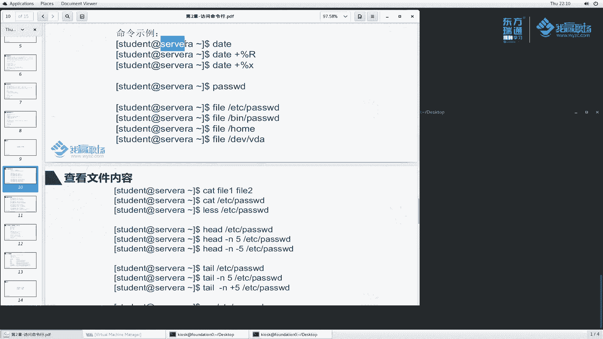

# 红帽RHCE8红帽认证RH124认证课程【全】 - P7：02-3-bash执行命令1-date--passwd--file--cat--less--head--tail--wc - 北京东方瑞通 - BV1KM4y1M71q

同学们好，欢迎来到我们职场HC8课堂，我是马老师。那么上一小节呢，我们给大家讲了一下这个。

sell程序bss命令行啊。那么这一小节呢我们来给大家演示一下这个拜师命令行里面这些常见的命令怎么用。那么在后续的课程当中呢，我们会用到很多些命令。那这一小节呢。

我们先给大家挑一部分经常用的命令给大家讲解一下。在第二小节里面，我们刚刚说过执行命令的时候是敲一个字符串之后按一个回车。那么如果说我们要执行多个命令，那我怎么执行呢？好，例如说我们执行1个PWD命令。

那我想把这两个命令连在一块执行。怎么执行的？中间呢使用封号啊LS封号PWD这样大家来看一下效果。LS呢给我们显示了这个样子PWD呢给我们显示了这么一个结果。所以说这两者命令呢放在这里面。

那么他会按这个命令的先后顺序去给我们执行。这两者两个命令是没有什么优先级的啊，那么封号前面呢，它先执行封号后面的后执行。当然我们还有可能来三个，就如说我再加一个命令。

hot name host name呢是用于显示主机名的。来给我们显示了，那么我们这样执行ho name封号PWD封号L大家来看一下，似乎这个地方确实是啊第一个命令呢显示它的结果。

然后第二个封号后面第一个封号后面呢，这个然后第三个以此类推啊，大家要知道啊，我们这个多个命令呢用封号来代替啊，多个命令之间用封号来代替，用于隔离。那么它会按照封号的这个先后顺序去执行我们的命令。

按回车去执行。啊，这是命令执行的方法。那么再来看一下，这里面给我们提供了一些命令的事例。

好，在第二小节里面我们给大家讲过了。那么看命令的时候有一个看命令的方法，例如说date刚刚help去获取命令的帮助信息。那么现在我要想使用date命令怎么用呢？回车。

好，这个给我们显示了date这么一个命令有点长是吧？我们往上翻翻翻翻，一直翻到这儿，它给我们显示了这么一个命令帮助信息。好，在这里面呢，我们再去开一个窗口。

那么我们使用这个窗口呢去执行。哎，这个窗口呢作为我们这个查看，方便我们看这个命令怎么用的。这个命令的使用方法呢，首先是date，然后加上选项和加上后面这个呃formm格式。那么我们来解释一次date。

然后加上选项，我加哪些选项呢？例如说我加一个杠D，这个D是什么意思呢？他说这个地方这个地方有一些参数啊，是long option啊，这个是有些是必选的，有些是有些是可选的，是不是啊？

那么我们看DD是刚刚对的，它是用于显示这个时间啊。这个描述的根据这个字符串描述的时间来显示。那么如果说我们不加，它默认显示的是当前的时间，那么例如说我给大家显示杠D杠D，然后呢加上一个单引号。

这里面加一个字符串啊，例如说嗯加一个3天。This。好，我们这个命令执行之前呢，我先按一个crl C好吧，date回车，它给我们显示的是这么一个效果。当前的时间是。呃，星期四，然后呢。

2月6号22点06分。那么date杠D，我们把这个复制过来看一下它给我们显示的是什么效果。此时达到的效果是什么呀？是。2月6号了吧，是不是三天后的这么一个时间呢？哎，确实是啊确实。那么三天后。

例如说我们多写几天，我们看看能不能加3个月后呢。MOS看一下。哎，他不识别的是么m子。M1 THS。这识别的是吧，3个月后是5月6号，当前是2月6号，哎，确实非常有意思是吧？根据你描述的时间给我们显示。

哎，我能不能说去加一个加一个3分钟呢？3分钟之后呢？好，22。09分。那么当然我们能不能说去减一个呢？看一下。建一个是04了吧，我现在对一下是不是07呢？确实是这样啊，由于我们想看一下，与当前时间对比。

说几天前的一个时间它是什么样子去查一下我们自己大脑去算的话，可能算的不是那么准确是吧？没有这个计算机算的准确一点啊。好，这是date给我们显示这么一个实践啊，这是D选项啊。那么当然还有很多一些选项。

我就先给大家讲了这么一个D啊。那么我们再来看第二个其他选项，根据自己需要去设置啊。那么再来看这个formmformit是按照什么格式来显示的。往后看说控制着这个输出。那么与这个可以呢。

可以与下面进行一个集成，按顺序进行一个集成。哎，我们来敲一个啊敲一个啊。首先我们把当庭的时间给我们显示一下啊，date一下。那么date这个格式什么formit大家看好了。

formit前面是有一个加号的，所以说我们加号一定要写来吧。写个加号。然后呢，这个位置说是加他加的是加加formit吧，form，那formit是以下其中一个可以替换。那例如说我来替换一下。

加百分号小A来看一下，小A显示的是简短的轴的名称。例如说s啊，我们加一个回车。哎，这个地方是什么？这个地方我我刚刚写的是小A是吧？这个是大A啊，大A是一个完整的名称。那么小A呢是星期几呢？看一下。

是星期四thurrssday啊，一个是名称啊，有时候我们就就想看今天星期几是吧，哎，可以这么看啊。那么我们还想有时候想显示什么，显示这个月当中的第几天来小地一下，看一下。今天是2月6号，对吧？

那么当然还有很多，例如说我想看小时是吧，小时24小时之的，还是说12小时之的。那么以及以什么以及我们这个地方啊，这个003呢啊，还有什么什么这这这个方式的哈等等等。都可以啊都可以啊。那么还有各种方式啊。

例如说我们看这个他说按照这种格式来显示来百分号X呢看一下。2020年2月6号，他以这种格式来显示的那能不能说我只想显示这个零2呢，月份呢也可以呀，能不能显示年份呢也可以呀。

那大家可以看到这里面是否都能给我们展示的吧。年的这个是短的啊，这是按照特定格式给我们显示好，date命令哈用于显示时间的，大家记住了啊。

那么刚刚还给大家讲了一个叫hos啊，额外补充一个host。当我们执行这个字符串，我们理解为叫执行这个命令，回车显示的是主机名啊，主机面。

他说的。

给大家讲过了，是用于设置密码的。其实password除了修改自己的密码呢，还可以做很多的设置。那关于这个设置呢，我给大家先演示一个。我们想也修改什么呢？哦，当然大家看到我这里面例子啊，老师。

你这个地方是stdentserv A给我举的例子，那么现在怎么变成这个样子呢？

没有关系啊没有关系，其实是一样的效果。那么这样啊，为了跟我这个事例一样的，我给大家演示一个，采取这个命令啊，SSH。student at一下我们的server A这个我们刚刚讲过了啊。

叫远程登录到一个服务器上去操作回车。此时大家看到我们这里面是studentserv a了吧。好，我们按一下cl列回来。然后再来看这个passwordPAASSWD修改密码，我们说过了啊。

这个地方我就不给大家演示了啊。那么换一个SU杠，我切成我们的管理员用户。大家暂且记住切成管理员用户就可以了。密码readhead回车。此时，他的符号变成了这个样子。我想使用PASSWD。

我设置设置什么设置一个用户的密码，比如说设置root密码。他说你这个root密码是什么？新的密码，我们输read ahead回车read ahead回车。他说你这个密码太短了是吧，但是太短了。

我们重输重新输入一次之后，它还是更新成功了。root账户就是这么牛，它可以带设置其他用户的密码，对吧？也可以不受密码策略的限制，即使短于8位，我们也能够设置成功，是吧？那么问题来了。

老师这个密码侧流怎么设置啊？问题非常好，我们后续再给大家讲啊，暂时呢先放在这儿。这个呢是属于HHC的内容，我们有机会再给大家聊，好吧。

那么我们再来看一看这几个命令fi和cat之类的。

好，还是一样的EXRT退出。然后呢，执行发要。发有这个命令呢是字面意思，就是文件。他是用于判定文件的类型的，刚刚还要。只时我们往上面翻。那这个说是确定文件的类型，那怎么确定的呢？

说后面跟上我们对应的文件啊，加上对应的选项。这个基本我们不用啊，我们直接加发，加上文件就可以了。那么我们来看一下啊。还是一样的，敲个空格啊，敲个空格，然我们回回到最低行，或者可列一下啊。

其实这个地方啊大家看到我直接按一个ctrl加L。啊，老师，你怎么记住这么多快捷键的是吧？没关系，你们经常用，你们也会记住啊，ctrol加L，我们随便敲，你看随便敲敲敲或者ctlL。

那么你们看我的屏幕是不是很清晰啊，眼光就能够聚焦到这个位置，对吧？发有我们看一个呢password。那这个什么意思呢？他会告诉我们说你这个文件好，我们暂写这个文件这个目录下面的这个文件老师。

你这个目文件怎么表示成这个方式呢？啊，后续我们给大家讲啊，这文件为什么这么表示？反正大家记住了，这是代表一个文件的一个路径。那么他说了哈这个文件的。类型是什么呀？阿斯柯玛task文件啊。

文本文件啊文本文件内容基本上我们是可以读取的，是吧？我们之前讲过有个ca meaning来看一下。他说的回车好，确实能够读取啊阿斯克玛的文件。那么我们再来看一下，除了这个阿斯克玛的文件，大家还记得了。

我们之前好好说了一个命令叫password是吧，我们执行password这个命令的时候，那这个文件是什么类型的文件呢？啊，首先我要知道这个文件在哪个路径下面呢。好，我知道他在并拜事下面去是吧？

对吧老师你怎么记住呢？是你是不是看这个地方的啊，不是啊，我经常用啊经常用。😊，来看一下。他说这个文件类型啊是什么设etetUID这么一个等等等LB的这么一个文文件类型啊，这么一大长串。好，大家记住了。

这是一个可执行的一个二进制程序文件就行了。它是一个二进制程序。好吧，一个程序。那这种刚刚我们看到这种文本文件，二进制程序。那么还有什么呢？还有说刘如说病。他他什么，他说他是一个什么什么软链接是吧。

符号链接连到连到这个这个里边去了啊，不管哪，反正你是一个链接，对吧？那么再来看一个嗯，发1里边一个。什么呢？例如说我们刚刚有一个后目目录。他说它是什么？它是一个目录啊，目录。那文件有很多种类型的文件。

对吧？那linux里边它设计的时候，就是说哎很多东西都用文件来表示。那么我们对文件操作的时候，其实就是对我们系统做一些操作啊，那还有一个D一位里边1个VDA。

他给我们显示这个地方是block special， blocklock是快。special是特殊的意思是吧？然后大家看到老师，你你你学这个红帽的时候，发现这里面英文单词太多了。确实是这样啊。

确实是这样子。因为这个老外的东西啊，很多都是英文的材料啊，所以说我们对英语呢要有一点基础，没有基础呢，初步我们同学去初步去学的时候可能会比较累啊，比较辛苦一点。那么你的系统上面装个单词啊。

装个词典啊遇到不懂的话，查一下，经常见呢就熟悉了啊，就清楚了。好吗？快设备这个快设备呢，我们就暂且就理解为硬盘设备啊，block设备是硬盘，是存储设备，那用来存储数据的，好吧，是用于存储设备。

那么还有当然还有很多啊，这个地方呢我们暂且给大家演示到这里，反正发要是代表查看文件类型的对吧？那么我们再来看一个。cat啊还有还有很多啊，我们再来看这个cat。

cat是用于查看文件的内容的那cat刚刚help。那么我怎么去查看这个文件内容呢？选项文件，那么我们来挑一个啊，那么换一个。

好，我们这两者交换一下。好。cat什么呢？cat一个，例如说我们这里面给我们提到的什么文件一文件二是吧？那么我们cat一下发 you一。他说什么呀，当我执行的时候，他给我出这么一个信息说。

cat冒号 file一冒号no such file director。啊，这个地方给我们提示的是一个报错信息，清楚了啊，是一个报错信息。他说我们执行这个命令的时候，执行这个命令的时候，cat告诉我们啊。

cat这个工具告诉我们说你这个发一啊， file一这个文件不存在啊，所以说我给你们举一个例子的时候，并不是完全正确的啊。那么我们去查看文件内容，肯定要查看一个文件存在的这么一个内容，我才能查看呢。

来看一下。当前目录下面有一个classroom，我在L classroomroom里边看看有什么呢？有很多文件来，我ca一下什么呢？

我ca一下classroom里边有一个文件叫history这么一个文件。好，出来了吧。好，回去。

好，有很多啊很多。那么这个文件内容我们就查看出来了。那cat除了这种查看点，我能不能看的时候，能不能把这个文件的行号也显示出来呀？可以呀，可以啊，来ca一下，我们换一个password文件。

这个文件的内容少一点啊，这个少看另外一个hos。这个文件的内容比较少，我们cat加上一个什么往上翻翻过来之后呢，我们加一个杠N。杠恩看一下什么意思，有没有说number。

number or output flies说我们要把这个所有的输出啊全部加一个什么，加一个字符，带一个给它标记一个number啊，来回车。看一下有没有标出来。哎，第一行是一第二行，第三行。

第四行是空行，空行我也给你标出来了，56789啊，全部标出来了，是不是哎，我们还有一个叫杠B。说也是标行，但是呢空行我不会加数字。来再来一次啊，我们把这个N换成B。A4幅第一行第二行第三行4567。哎。

你刚刚看不是9行吗？怎么现在变成7行呢？哎，这个这个地方第四行是空行，第九行是空行没有显示吧，他没显示了，但是没标吧。哎，这就是我们讲的选项用于控制输出的行为。

其中杠B跟杠N很明显这两者啊控制不同的输出。当然了，还有很多，例是说我输出文件的时候，我看一下这个文件的type符给它打印出来。那么还可以干什么呢？可以把文件的这个末尾符啊看一下。嗯，这里面有一个。

杠大E杠大E显示这个文件的末尾行。那么这个文件的末尾呢用doll了符号来代替来试一下。那么我们就加一个杠B和杠E连在一块。看一下。好，发现每个文件的末尾。

每个行末尾啊都有这个doll符号表示文件末尾换行了是吧？那么当然还有很多种方式啊，这是我们讲给大家讲的这么一个cat命令cat当然也可以显示很多了。例如说cat passwordword哈。

这是第一个文件啊cat ETC后词啊，后次文件。好，显示这么多，这是我们的后四词文件，这是我们的password文件。

根据你的需要去查看。那么大家看到cat文件有一个问题啊，例如说cat EC passwordword。

你这个password文件显示的时候，刷把所有的文件的内容啊都给我打印出来了。这个行数太多了，是不是啊？那么多行，其实我就想看前面几行。那你这个地方给我怎么办？没辙了吧，一下给我翻到最后。

那其实我就想看前面几行，那么有没有办法呢？有我们这样看啊。😊，LESSETC pass错了。回车。大家看这个行给我们显示的就是第一行第二行、第三行。那么他似乎给我们一页一页的显示，我们按个空格，哎。

他就给我们显示下一页，再按个空格又显示下一页，一直显示到最后。那么当然我们在这个方向键里面上下方向键啊，我们按上一行一行的翻页，一行一行的翻页啊，好，可以一行一翻到我们最最上面了，第一页了是吧？这样看。

那么按下一行一行的翻，当然按空格进行一页一页的翻也可以啊也可以啊。老师呢这个地方怎么退出啊，对吧？按回车退出嘛？按什么回车啊，这个按Q英文字母quiit啊，英文英文单词quiit的第一个字母Q啊退出。

好，退出了。老师，你这个太多了，太复杂了，lessice里边怎么又又干Q什么乱七八糟呢？😡，好，大家没有关系啊，你们以后经常见啊，经常。就熟悉了啊，熟悉之后你再去操作起来就方便了。less是一个。

那么more也是一个。好，帽呢也是繁译啊帽也是繁译跟它类似。但是帽我按空格的时候，大家看最后的退出来了吧啊，它是一页一页看的啊，他们都有优点和缺点。那么由于大家是刚学的，我们这个查看呢。

我暂时不给大家讲那么多了。每一个命令呢都有它的一些小技巧。那后续呢我们有机会碰到的时候，我再给大家去讲这些东西。好了。😊，这个是查看文件的内容。哎，我刚刚提到一个问题啊，说我只想查看这个文件的前几行。

对吧？那么怎么看呢？有没有这个命令呢？有叫ha。

had呢是专门用于看文件的前几行呢，来试一下。Hd。ETC passwords。回车。那他此时给我们显示的文件是前几行啊，12345678910哎，这个operator。allplay的是第几行啊。

来ca一下杠N不就行了吗？杠N。

我找一找。有一个我们显示的oper好，oper是第十行。那么这条命令ha加上我们这个文件的内容，它默认给我们达到是什么效果呢？默认是看这个文件的前十行。

好，简在方便了吗？那。OK我不想看这个文件签少，其实我就想看前面一两行两三行，对吧？好，我们来。head杠N比如说2。ATC pass错了。回去。是不是给我们显示了，只有前两行嘛，第一行是ro的。

第二行是B，对吧？啊，非常方便啊非常方便啊。想看前几行就前几行。例如说我给大家再演示一下，我们经常去嗯监控服务器看跑了哪些进程，我们经常会敲一个命令PS杠EF。其实我只想看前面几个。

例我说hi了杠N打个比方，我敲回车。好，显示的行数特别多。其实呢我们只想看什么呢？我们只想看前两行，打个比方head。还是PS杠EF去g up呃，去head杠N。2、好吧。那么此时我们就看到前两行。

老师，你这个前面是什么意思啊？怎么是这样子呢？啊，大家暂时不用担心啊，不用管这一块，反正我害的杠恩啊，确实看到这个前面输出的信息的两行了。是。

那前两行我能不能说我从第一行开始看看倒数第二行或者倒数第几行呢？可以啊可以呀来。😊，再来cat一下杠N把ETC passwordssword给它显示出来。

好，他现在有48行，我们要看一个东西，headide杠N。啊，杠N，然后再加一个杠几呢？杠3。大家来看一下杠3的是什么样效果。回去。KIOSK是倒数第几行的？来找一下。KIOS是倒数第几行。

倒数第四行是吧？这是到最后一行，这是倒数第二行、第三行、第四行。所以说你是杠三的时候，他看到的是。倒数第四行，从第一行开始一直到最后一行，是不是这样子？是吧好。

这个杠3非常有意思啊非常这个负号非常有意思啊，大家可以根据自己需要去看。那么你除了看行首能不能说呃看末尾的呀？有啊。好，我们来看一下，就是说我只想看这个文件的末尾几行。

还是开的杠嗯，我只想看这个文件的末尾几行，那末尾几行呢，有个tailll命令，tailll是尾巴，对吧？ETC pass嗦的。看到的是几行啊，来找一找。RPCus开始一直到最后一行。

找一下RPCus是39行，48行，39到48，大家数一数应该是十行吧。也就是说啊他跟head一样，默认都是看十行。那么ha杠N能不能说我只看末尾的两行呢，对不对？哎，大家来看一下呃。

name D和DHCPD你找一下，确实是。啊，那能不能说我从倒数最后一行看到。前面的正数第二行呢可以来看一下。再来往上翻，那么这个是杠2是吧，我干正I来看一下什么效果。

这是最后一行nameD。那么再看往上翻，你说要看前面第几行的病，那病是第几行呢？来找一下病是前面第二行还是第几行。是不是正数第二行并单门，那是不是来找一找？我们的这个杠N正爱并怠麦。好。

从正数第二行一直看到最后一行tll这个head两者是对应，一个看头，一个看尾巴。那么在大家现在可能觉得这个命令没什么意思。其实啊以后大家就会经常用啊经常用。因为linux操作系统它设计的思想就是什么啊？

给我一个命令行。然后呢，这些命令行里面，我会使用一些很多一些小工具来完成一个复杂的任务。那么像head tail这些看文件的前景啊都是非常小的工具啊，为了满足我们某些工作场景下面一些需求啊需求。

那么后面我们随着我们学习的时候呢，大家就会觉得啊这些命令确实非常有用啊，要综合起来用，要灵活的去用。好嘛。那么再来看一个命令叫WC这个WC是吧？这听起来好像名称怪怪的啊，我们来看一下WC到底什么意思。

嗯，helWC。杠杠help。来往前翻诶，老是往前翻啊，翻翻翻翻，他说这个打印new line word和这个什么字节的数量。为每一行去打印，对吧？而且呢有一个总的是吧？呃total line行数。

如果说more认文件，如果说有多个文件的话，那么会统计这个文件等等等说明的。那么具体我们来看一看到底怎么个用。

好，我们换一个这个放到左边，这个呢放到右边来。Cttrol L。那么我们来看一看。敲一个。交易什么呢？WCETCpa的。那么这个地方给我们显示的是什么呢？这边有30661563。哎。

我刚刚有一个cat杠N是吧，来来对比一下。哎，好像确实是三十行，对吧？所以说大家看到这个地方是代表什么？三十是代表文件，这里面文件有多少行啊，多少行。那这个66是什么意思呢？回到这边来说。

6是6是66是代表统计它的一个单词的数量。我这里面有多少个单词？

嗯。他是怎么统计的？你们不要说哈这个单词的数量，那这个是一个单词，这个是一个单词，这是单词。那算一算好像不止66万啊，不是这么说的啊。那么冒号在这里面它算一个完整的单词。

那么空格隔开的那前面这叫一个单词啊，它是按照这么一个方式统计的，反正给你统计出来，这里有那么多个word。也就是多少个word66。那么这里边有多少个字结束呢？字结束啊，大小。15631563数一数啊。

数一数这里面是不是有1563个单词呢？大家仔细数啊，这一个啊一个字母就代表一个字节数一数是不是这些啊，当然大家有空自己去数一数啊，正常情况肯定不会错的啊，不会错的啊。

那么我们再来看一看能不能说去统计，我只想看这个文件啊。WC杠I杠什么呢？我只想看这个文件里面的一个单词的数量，我只想看文件里面字节数量，我只想看文件里面这个charact数量，是不是都可以啊。

看行数杠L。

是不是30啊？对吧，当然比如说我想我想统计多个文件。是不是好，这是这个文件呢这是这个文件的，然后他还加了一个total，一共44。

啊，非常好用非常好用啊。那么这个小节呢，我们给大家讲了很多一些命令啊，以后这些命令呢经常用经常用啊。那么这个小节我们暂且讲到这里面。下节课呢我们接着给给大家讲一下bs的其他一些功能。

