# 红帽RHCE8红帽认证RH124认证课程【全】 - P8：03-1-文件系统介绍1-文件系统层次结构--文件命名规范 - 北京东方瑞通 - BV1KM4y1M71q

同学们好，欢迎来到我赢职场HC18课堂，我是马老师。啊，今天呢我们给大家讲一下第三章命令行里边去管理文件。在这个章节里面呢，我们给大家讲四个部分。首先从最基础的linkux文件系统讲起，然后呢。

再给大家讲一下命令行里边去咱们管理文件常见的用到的一些命令。第3个。那么文件间的创建links啊，这里面涉及到底层的文件系统层面的一个知识，硬链件和软链接。第4个。使用share扩展匹配文件。

那么我们如何的去管理文件，更高效的去管理呢？好，第四小节呢会使用些。扩展的匹配符去帮助我们去匹配文件。首先看第一个部分。文件系统的层次结构。那么讲这个之前。

我们首先来想一下windows里面的一个文件文件系统结构是什么样子。那我给大家简单画一幅图啊，比如说这是我的一块硬盘。那硬盘的第一部分啊，这是第一部分是C盘对吧？大家正常是系统盘OS盘。

那么再来例如说我还有第二块盘这不是硬盘了，第二个分区啊，那么这个叫D分区D分区呢里面例如说我是专门放我们的平时的一个data数据数据。

那么当然有可能你这里面还有什么E盘啊E盘例如说我放了一些我 study的一些学习资料，对不对？ study学习资料。那么当然还有F盘等等等。你根据你的需要进行一个分好。

此时在window里面大家看到就是CDEDE那么这个路径表示的时候也是非常好表示。如说C盘D盘E盘有一个斜杠那么这样啊我们来打开路径来看一看。

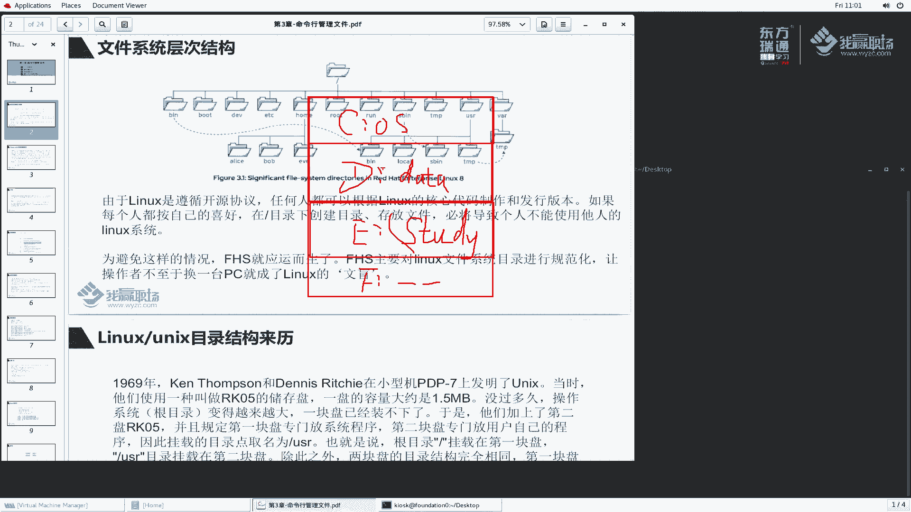

例如说我们挑一个这个啊，我们看一下这个盘，当前是在D盘冒号work work啊这么一个子文件夹，然后这么一个目录，这个目录一直到最后一个目录这是讲我们讲的一个文件路径。

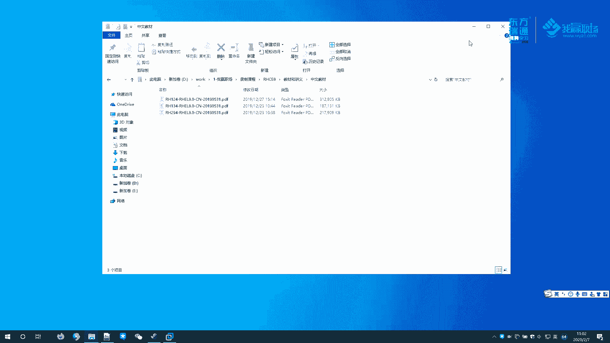

那么在lininux里边，我们去如何去表示这么一个文件路径呢，以及它的结构又是什么样子呢？好。list呢与windows呢还是有一点区别的，它的架构大家可以看一下，它是一个竖形的结构。

是吧是一个反向的竖形结构，我们都知道正常一个竖形的结构是怎么样子的啊，这是一个数啊，一个树，那么这是根部是吧？最底层的根部。那么树上面可以分叉好，我这个地方我分了一个叉啊，分了两个叉。那么这个是主干。

那么那么在这个主干上面我们还可能分叉。那么在这个分叉上面，我们还可以分叉啊，那么在这个分叉的上面，我们还可以分叉，是不是啊？那包括这个叉上面我们还可以继分叉。那么正好呢leux文件系统呢。

大家可以理解为反向的这么一个结构。😊，最上面层面我们可以看到它是一个给我们讲的叫根的结构。在这个根的结构下面有各个文件夹，也就是讲整个文件系统的一个分支，然后有B目录，有bo目录啊，然后这个DV目录。

那么在home目录下面，它还有可能有子目录啊，叫alice什么啊，那么在E下面，它还有可能有一些子目录是吧？这就是我们给大家讲的它的一个目录结构。

所以说这个目录结构看起来呀似乎与windows差别还是比较大的。windows里边它就是C盘D盘一般，好像也没有说什么最顶层来个根，所有的都属于它。这是linux文件系统发展的历史遗留的问题啊。

那么linux呢这它是遵循一个开源协议的，任何一个人都会根据linkux的核心代码，他都是拿到了是吧？那么每个人拿到核linkux核心代码，它可以制作以及发行自己的一个发行版本。

那如果说每个人都会根据自己的爱好去改自己的文件系统，那么这个顶层根目录下面根据自己的习惯去存放不同的目录。也如说我B目录下面我放的是应用程序，A用户是这么干的对吧？

那B用户并程序下面我放的不是的应用程序，我放其他的。那么这个地方就会导致一个什么问题了，就导致乱套了，你发行的按照你的规则来，他发行的按照他的规则来。那么当别人去拿到这个文件系统的时候啊。

拿到这个发行版本的时候去管理去去去使用这么一个操作系统。那么就非常的忙了，是不是啊非常的盲目，不知道这个文件系统怎么分布了，很麻烦。那为了避免这个问题呢，那么产生了这个FHS。啊。

FH正好呢就是为了解决这个问题。他说FHS呢，它是主要针对linux文件系统啊，跟目录进行了一个规范化啊，什么叫规范化呢？他说这个规范化能够实现什么呀，让我们的这个嗯系统的这个操作着。

不至于换了一个PC啊，换了一个linux文件系统他就不知道啊这个文件系统怎么分布的。啊，有这么一个这么一个呃故事在里面啊。那么在这里面我给大家讲一个小插曲。说呢在1969年呢，那么电脑刚出来的时候。

我们讲计算机刚出来king thommpson啊，unix的诞生者是不是啊，他呢和这个deven在小型机PDP7上发明了unix，还记得啦？我们讲这个人本来是在。

多路系统上面去发一个minixix当时有三个大佬合起来是吧，要准备开发这么一个项目。结果呢这个项目觉得比较难夭折了。夭折之后呢，他是属于被实验室的这这么一个这么一号人物是吧？那么他退出来之后没事干。

他之前在开发的时候写了一个小游戏，那么为了让这个小游戏继续运行呢？然后他他们俩是吧这个发明的这么一个ix系统。那么ix当时他发明的时候呢，然后他们用什么来保存系统盘。

说用这个啊用这个K05的这么一个存储栏存储盘它的容量是什么1。5兆币估计现在大家去学习这个接触的时候啊，接触操作系统的时候呢，估计很少遇到一个什么盘软盘。估计很多人都没有听过是吧？

我们以前上学的时候上高中的时候，我们老师让我们每个人花每个人去买了一块小软盘。那时候电脑上面专门有一个软区啊，专门用读软盘的啊，那时候我们去学习什么去学习打握的是吧？考试啊，计算机考试。啊。

容容量非常小。大家现在想一想，现在的硬盘动不动上去啊，GT的容量非常的大了是吧？那么但是计算机刚产生的时候，那么技术呢相对来说比较落后啊，操作系统unux系统就保存在这个上面。

你想一想操作系统的容量才多大，是不是？那没过多久呢，这个操作系统呢里边的东西啊程序啊越来越多了。那么系统之前是放在根目录下面的对吧？那么一块盘现在装不下了怎么办呢？于是我们讲就像你一个文件夹。

一个目录里面放的东西太多了，那么我要对它进行一个分类吧，不能说还是这么这么放下去嘛？于是呢他们就加了第二块盘啊，然后并且规定说第一块第一块盘呢是专门放我们的系统程序，啊，就放我们操作系统运行的系统程序。

那第2块盘呢专门放自己用户自己的程序。哎，用户个人的自己的程序是吧？因此呢挂载的目录点就取名了USR。好，那么这个US啊是什么意思呢？啊，很多同学说US好像是user嘛？USER少了个Euser。

对不对？其实这个US啊我要给大家说一下，它不是user叫。unix啊叫unix的 systemem resource。unix的系统system系统资源。是这么一个意思，好吧。

那么也就是说根目录挂载第一块盘，US目录挂载在第二块盘。虽然说这里面给大家讲的说是专门放用户自己的应用程序啊，其实这样我觉得啊不是user啊。

更更准确的理解应该是unix system resource是系统资源啊。那么除此之外呢，2块盘的目录结构完全相同啊相同啊，用户的应用程序什么什么跟目录的。但是随着时间的发展，那。2块盘本不够用了。

那么可能需要3块盘、4块盘，对吧？那么。就出现了这么一个问题啊，那么加了第三第3块盘取名为home。那么后来并且规定USR用于存放用户程序。那home呢用户存放用户自己的数据，是不是啊？那么从此呢。

这个目录结构就延续下来了。啊，随着硬盘的越来越大，各个目录的含义也进一步得到了明确。也就是说我们啊都要按照HFHFFS这么一个存放我们的文件。好，第一次产生的时候，系统都放在这个。

那么容量随着这个整个数据越多越来越多是么？它放在什么放在US啊这个地方去了，是吧？那后来后来又不够用了。那么就加快硬盘啊，加快我们的软盘专门放用户的啊用户的那随着越来越多。

那么它就会产生各种的啊这么一个目录结构按需要去分类？好，那么我们再看一下FHS到底是什么呢？他说FH是一个文件系统的这么一个层次的一个分层结构，是一个标准规范。它采用的是树形结构来组织文件。

那定义了系统中啊每个区域的用途，或者说每一个目录的用途所需要的最小构成的文件和目录，同时呢还列出了例外处理与矛盾处理啊，这个地方大家知道了。

反正就是给我们讲一个临子文件系统里边这个整个整个从根开始下面各个子目录，它的一个作用啊。那么他定义了两层规范，首先定义了根目录下面每一个目录啊，应该要放什么数据？好，这个地方列表里面给大家列出来了啊。

这个图呢是我从我们的教材上面给大家截出来的。待会呢我一个一个给大家去解示啊。那么ETC该放什么？病SB都应该怎么放啊，那针对USR和Y这两个目录呢指定来定义。例如log怎么放啊，USR是又怎么放。

那么在我们后续给大家讲课的过程当中啊，大家就会发现一个问题啊，老师我需要这个了解的目录太多了，是不是啊？那个记又记不住了，是吧？没有关系啊，你经常用就行了啊。那对于马老师来说，我闭上眼睛。

我从第一个开始数，一直数到最后，我基本上都能数过来。因为你用的多了，是不是你平常接触系统维护的多，那么文件该往哪儿放，对吧？你你就就熟悉起来了。好，在这里面呢，我们来简单看一下到底有哪些。好。

我们首先看第一个US啊。USI我们说的是什么叫unix system resource操作系统呢啊需要的一些系统资源。那linux里面也沿用了这么unix的一个结构。

他说在这里面我们存放了一个安装的一个软件，以及什么共享库啊，文件什么只读的这么一个应用程序，很重要的一些子目录。那么这些子目录包括以下这么一个东西。OK我们来看一下之前呢我教过大家一个命令啊。

我们L斜杠U。大家来看一下我这个下面这个目录下面有哪些呢？并我们的什么用户能够使用的程序叫banary，普通用户使用的。那么同样的，我们再找一下，好像有一个SB。SB里边是代表什么system病。

也就是说系统管理相关的啊，系统管理。那么有时候我们当然我我们普通用户的程序啊，那么系统管理里面并不代表说只有系统管理员能用运行啊，不是的啊，系统管理相关的操作。那普通用户有时候也需要执行这么一个操作。

所以说他也能够执行。那么这个地方还提到一个叫local，local是什么呀？这个B和SB都是系统软件包安装过程产生的这么一些数据。local呢一般是用于用户自己定制的一些程序。例如说我是我一个开发人员。

那开发人员我想在我们系统上面去呃，我自己也开发了一个小程序是吧？那这个小程序呢一般来说我就放在在local里边。啊，属于自己的这么一个东西啊，是用户自定义的么一些相关软件放在这里面去。啊。

那么这里边还有一些啊games是吧？games跟include这个地方都不怎么用了。lab和lab64要说一下lab呢是什么啊？我们得library是库啊，sunsh位的库lab64那64位的库。

我们应用程序在执行过程当中往往需要这些库帮助我们去执行啊。有了库。那么大家去意公共的一些程序都去调用这个库就非常的方便。代码重用啊，非常方便啊。那么还有一些s啊，USRsh是共享的。

很多一些文档会存在这啊。那么还有说sce SRC云代码是不是啊？s。那么t林学目录啊。其实这里面我们主要的大家记以后经常用的就是并SBlo最常见啊。当然USR也会比较常见。啊。

这是我们讲的这个Ua下面存的文件啊。ETC。😊，配置文件啊配置文件。配置文件什么意思呢？我们LSATC来看一看。哇，这里面感觉好多呀好多呀。那么我们挑一个，例如说y。

ym这个工具它是用来管理操作系统里面的一个软件的啊，软件软件的安装啊，软件的升级啊，那么软软件的卸载啊，那么这个ym工具到底怎么去执行呢？我安装软件的时候从哪里去安装呢？好。

有一个ym点com可以根据它的配置文件去做相应的动作。之前我们讲过啊，我们执行命令的时候，一个选项用于调整命令的行为啊，那同样的。这个命令的默认行为，我们就可以写在他的配置文件里面去。对吧啊。

之前我们给他就说我我们后面可能会用到一个就是SSH这个工具。那SS这个工具呢，那命令行里边有一个默认行为。那么如果说我们想更改这个默认行为怎么办呢？那么我们在它的配置文件里面去更改啊，打个比方啊。

有1个ETCSSH。1个SSH confi。那这个文件就是用于更改SSH这个工具，它的一个默认执行的一个选项和参数啊等等等。好，这里面我们给大家提到的这个ETC。

还有一个问题需要注意的就是我们服务器运行过程当中啊，例如说外部服务器外部服务器你怎么运行呢？那么由它的配置文件定义啊，也就是说啊。无论你是软件，还有还有说就是我们讲的一些服务啊。

它常见的一些配置文件啊都放在这个地方里面去啊，ETC。wawa这个wa是什么缩写呢？wa是variever的缩写。vever是什么意思啊？变化的。变化的数据啊，我们操作系统里面变化的数据存在这里面啊。

他说呢，但是呢他是应该永久在保存啊，什么意思啊？就是说我操作系统即使重启了，那么我这个目录下面的文件啊也应该存在吧啊，虽然是变化，但永久保存。那例如说这里边它里面提到说文件呢会动态的发生变化。

例如说数据数据文件什么缓存文件、日志文件。其实我们建的最多的就是日志文件来看一下L5R。里面有个哇log，对吧？还有什么没有啊，那么log是我们系统运行过程当中很多一些服务给我们产生的一些日志。

你想想系统只要运行，那么它就会记录日志，那日志总是不停在变化的。那邮件那别人给我发邮件，那这些邮件也是变化的，放在这里面啊，经常变的一些数据缓存文件是不是啊AFTP这么一些文件啊，什么c啊等等等啊。

也就说哎3W我web站点，它默认的web站点里面那个需要用到的文件都放在这个3W里边。啊、变化的一些文件啊。rung wrong正好跟这个va有点类似啊，但是有点区别。

说这个rung time的 data啊 for process那就是说在我们系统启动好之后啊，那么在系统启动好之后，我们的应用程序在运行过程当中产生了一些数据。这个要注意了啊。是本次启动啊。

就是上一次启动。现在操作系统不是启动了吗？启动好之后呢，它会我们这个运行程序跑起来，跑起来之后呢，它就会产生一些数据。那这个数据有非常重要的一个特点，什么呢？这个数据只只要我下一次重启啊。

我电脑重启之后，这些数据就没了。run里面的数据就没了。哎，你ro里面数据为啥就没了呢？好，由于我们run。他目录里边的数据是存在哪里里面去了？存在内存当中的内存是什么存储介质啊。

大家都知道是一个闪存掉电它就没了，是不是啊？好说。所以说呢我们很多一些开发人员啊，在呃开发一些程序的时候，那么程序运行过程当中会生成一些临时文件，这个临时文件也是变化的。

那么这个临时文件可能是用于监控我们的应用程序的啊，所以说应用程序如果说关闭了，哎，对不起，那么它可能就没了。那么系统重启后，那么整个目录下面文件就全没了。啊，全面了啊。

那这个目录呢与我们这个wa wrong跟wa lock呢啊是属于早期版本的，这两个很相似。那么大家暂时就记住这个目录就行了啊。home目录home是什么啊？加啊加目录来看一下。L S home。

然后这个目录里面好像比较少，就1个KIOSK哎，我们换一个系统啊。SH root at一个 server a。So a。好，登录到COA上面来了啊，我们看一下LS斜杠ho来看一下。

他这里好像似乎也只有一个tudent，是不是啊？那我做一个事情，我们增加一个用户userADD这么一个用户啊，老马这么用户。增加完成之后，我们再来看一下。好，我创建一个用户的时候。

他就给我生成了这么一个目录。

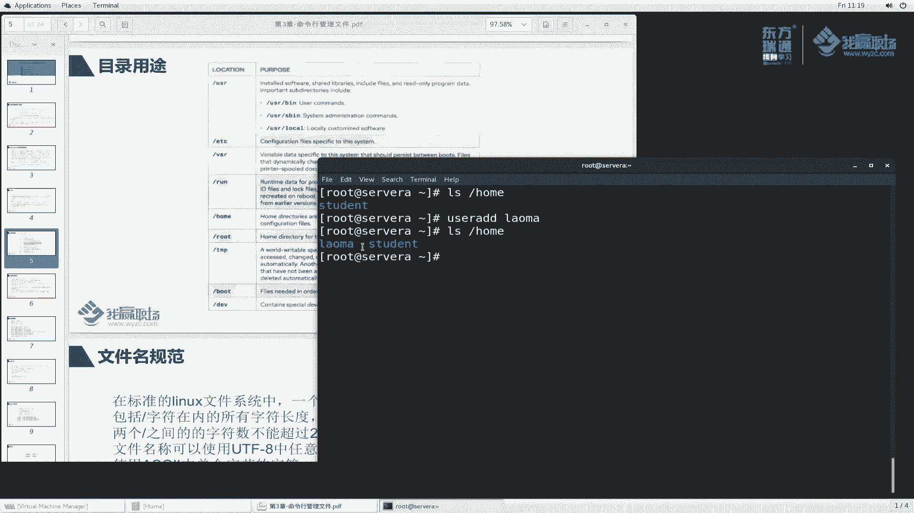

其实这个地方跟我们的windows是不是很相似啊？例如说我们windows里面打开一下。那windows里边它有用户的加目录啊，我们看一下哎它的桌面吧，桌面。那这个目录啊这个这边没有显示是吧？

那么这样啊，我还是找一下啊。用户。就相当于这个目录。好，那么这个呢是我当前的一个一个用户。那么这个是公共的用户。当然了，你在新加用户的话，那么这个地方还会产生一些用户。那么对于另来说呢。

它就是存放在这个位置。

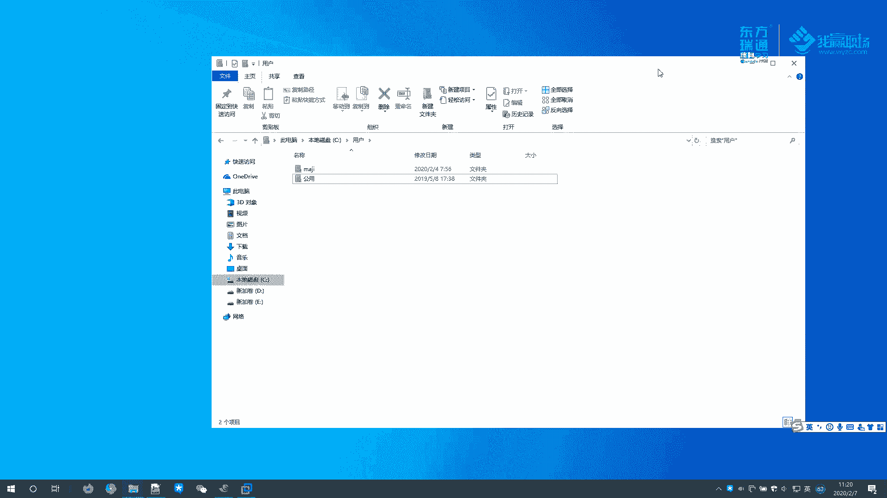

啊，每一个用户呢会在这个加目录下面产生这么一个文件，默认情况是这样的。那当然。我用户创建完成之后，我把他的加盟录能不能放到其他地方上去啊，也可以呀。也可以定制好吧，但是。我们刚刚说了FHS干什么用呢？

就是规定你你这个不要乱放啊，按照规范来，否则你这个系统给别人用了，别人登录上来。我怎么知道你这个目录是什么意思啊？对吧你这个用户加盟了怎么跑其他地方上面去了，就会怪怪的。啊，用户里边的一些数据。

一些配置文件，反正是给你用户去做的那这个目录。操作系统里面，普通用户能够写的目录，他只能针对自己加目录写啊。操作系统里面很多一些位置。那么普通用户是不能够写操作的。你只有对就是说我tudent用户。

他只能对自己进行一个写目录。其他用户对于这个目录，他是不能够写的。哎，老马用户，你说在tudent加目录里面去写一些文件，对不起，不给你创建。只是自己用户能够写。当然管理超管理员比较例外。

那么再来看一下root。root目录也是加目录，这个加目录是只给谁用啊，只给超级管理员用。啊，我超级管理员root它需要单独的一个目录啊，放在root下面。root管理员比较牛啊，它比较例外啊。

必然不要跟普通用户混在一块，这也也是从联s设计的安全角度来考虑的。一般来说，普通用户的加目录啊，它会单独放在一个存储空间里面去。root呢是跟着操作系统去走的，好吧。这个比较特殊啊，带入用户的加目录啊。

那么可以理解什么？这是root用户加目录啊。那么普通用户的加目录是什么呢？例如说针对针对我们老马用户，那么老马用户他的加目录就是home老马。啊，这是root用户加目中，这是老马用户加不中啊。

大家对比一下，哎，他比较牛，我单独放放放一边。再来看一下。探讨目录。time目录是一个什么呀？全局的一个写的是吧？全局的写目的一个空间啊，一个临时的空间。这个临时空间啊，它是永久保存的。好。

永久保存就就意味着你系统重启后，这个目录里面的文件还是存在的。但是呢它是也是属于template临时文件。这个临时文件呢，他这里面说了说啊说你这些文件啊嗯没有被写没有被访问，也没有发生变化。

也没有被修改的。在10天之内没有被修改的。那么这个文件呢就会被删掉，从这个目录里面删掉，自动删除。所以说大家想一想，那么我们一般来说，你用户自己的数据啊，不是临时数据，那肯定要放自己加目录嘛。

对于应用程序运行过程当中产生的数据，临时数据可以放在这个ro目录。那么有些开发人员呢会把它放到t。那我下一次启动的时候，这个临时文件呢，我可能还会用。那么10天之内，如果说没有这个数据没有被访问的。

没有没有被更改，或者说modify老师这个欠你的个modify又是什么一个意思呢？好，我们后续给大家讲欠你跟modify到底是什么个意思。反正你这个文件没有被访问的话，那么10天之内就会被你删掉了啊。

那么当然还有另外一个临时目录哇t哎哇是一个变化的，哇里面存一个t，哎，它跟它很类似啊类似啊。同样这个目录下面它的文件啊如果说30天之内没有被访问的话，那么它也会自动删除。

这个t目录所有的用户都他都可以具有一个写操作啊，在这里面创建文件啊啊删除文件写操作。抱头目录。文件呢需要什么？这些文件呢是在我们按顺序的啊按顺序的在我们操作系统启动过程当中。

按顺序的去启动的这么一个文目录啊目录boat启动吗？你操作系统要启动，那启动过程当中会需要用到一些文件。例如说我们将grab啊等等等这些文件那这些文件呢单独的放在boat目录里面去啊。

例如说我们讲的啊L。bot。大家可以看到bot里边这是什么呀？给大家简单的介绍几个啊VM links z好，这个是操作系统的内核，也就是我们讲le kernel啊，le kernel。

那么这个也是ken啊，这个可呢是专门用于rescue救援的，系统起不来了。哎，我可以使用这个rescue去救援。😊，那么还有一种叫init Ram F啊，这些呢都是操作系统启动的，用到的一些文件。

那么这些是什么？它的一个配置文件啊，grab two方式，还有EFI啊，当然还有其他的一些东西。系统启动的文件。第一位。第一为什么deviceDEVSE设备。linkux里边也有设备呀。

比如说lins你用到鼠标吧，用到键盘吧，用到光驱吧啊等等的这叫我们的设备，用到硬盘。那么来看一下这里面到底有哪些设备啊，回车。哎，我们之前给大家讲过啊，终端终端里面有TTY吧啊。

TTY0TTY1TTY什么10111212，这都是叫什么字符设备。字符设备啊，当然字符设备是是是有我们这种鼠标键盘的啊，那么存储设备叫block设备，用于存数据的啊，这两码事啊两码事。

那么硬盘是哪一个呢？我们来找一下啊，VDA是我们讲的硬盘文件啊，VDA硬盘里面的第一个分区啊，第二个硬盘，第三个硬盘，第四个硬盘，硬盘设备啊，存储的啊设备呢都混在这这里面啊。那么还有一个。

例如说DV里面1个S20，看一下有没有哦，S20没有，对吧？那我退出来看这个DV的S20。那么在我们这个foation上面会提示1个S20。这个S20呢就是我们讲的光驱啊光驱。

看看有没有另外一个名字CD room，这也是光驱，这两个都是代表同一个设备啊，其实就是同一个啊。哎，你这个颜色好像感觉怪怪的，它是黄色是吧？它是这个这个蓝色啊，蓝绿色。啊。

后面我们会给大家讲这个蓝绿色代理到表到底代表什么个意思？好吧，目录设备名称啊，那么在这里面呢，给大家简单的介绍了一下FHS它这个规范里面到底这些目录怎么存放呢存放的啊。那么我们再来看一下这个文件的规范。

那你给我了这么一个文件系统，文件去存的时候，那么对于我们这个文件名有没有要求呢？对不对？文件名里面有没有什么包含一些特殊字符呢？或者说这个文件这个路径里面最长有多长呢，能够放多少个多少级目录吗？对吧？

我A目录里面存BB目录里面存C，那么能够积连多少呢？来看一看它的规定。文件名规范是这样子的，在标准的list文件系统当中啊，那一个文件的名称主要有这么一个要求。

那么这个文件里面包含这个斜杠字符在内的所有字符的长度不超过4096个4095个字间。也就是说啊打个比方，我给大家看一个路径。USR。USRUSUSR啊sha什么dic啊，然后我们叫link words。

也就是说这个路径啊，这个文件的路径啊，你不能超过4095个字间。一个字符就代表一个字简，那么你最多不能超过那么多啊，4000多个，你表示一个文件名哪要4000多个。我觉得正常情况下。

你一两百就不得了了啊，不得了了。好吧，它也包括这个斜杠啊，那么斜杠在这里面有特殊含义，是代表分割符。啊，简单说一下US啊是一个目录。那么中间斜杠分开之后表示这个文件啊是它的一个子目录啊。

中间使用斜杠分开。同样的，这如果说它是一个目录，那么dict又是它的一个子目录，中间呢使用斜杠分开啊。最这个开始最底层的是代表根。

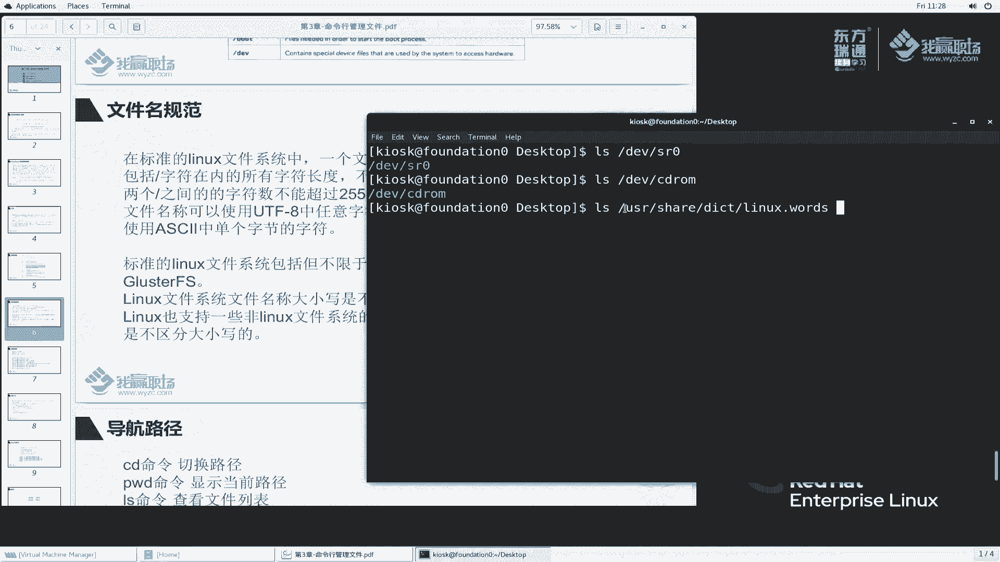

好，我们刚刚说过了，在这个位置啊，最顶层是用一个根表示后面的子目录呢，它会使用一个斜杠用于分隔啊，分隔两者呢虽然说看起来一样，但是呢它代表的意义是不一样的。

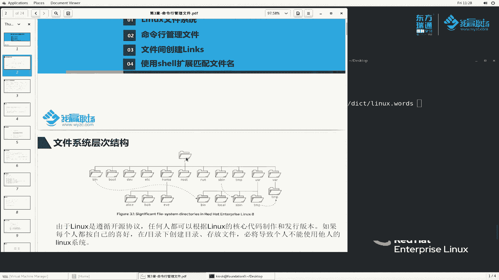

两个根之间的字符数呢不能超过255个字节。啊，大家看到这个啊这也就是说这个之间你不能超过255。你说哪一个文件名的字符能超过255个单词啊，一般很少吧。我觉得大家正常去保存的时候。

或者即使你使用一些UURD这种组称保存的时候，也就最多几十个啊，上百了已经很少很少了啊，除非你特殊的应用场景上面会比较多。我们正常看到的基本上二三十个就不得了了。好吧。

文件名可以使用UTF8当中的任意字符，但不能包含。哎，大家看到了，你不能包含根啊，不能包含non字符。哎，其实我们刚刚讲过，你这个是有分割符，如果说你文件名当中在包含分割符。那么我表示这个路径的时候。

我知道这个地方到底是分割符呢，还是说是文件名呢？哎，就蒙了吧，不知道啥意思了吧？啊，所以说就注意了，不能包含这个符号，也不能包含这个non字符空字符啊，这个我们一般来说很少会碰到这么一个空字符。

可以使用阿斯柯玛中的单个字符啊，也可以使用UTF8等中的字符。那能不能使用中中中文字符呢？也可以呀啊，大家可以看看啊，那么我给大家看一个目录LS点嗯L点点啊。大家来看一下我这地方用的是不是中文的。

也可以啊。哎，老师，你之前看到好像是没有乱码，之前看到是乱码，现在怎么没有乱码了？啊，这个地方我给大家说明一下啊，我当初上传文件的时候，大家看到的乱码是因为我采取的是什么呀？FTP的方式上传的吧。

那么如果说你不想论码的话，你可以采用excel工具去上传。也就是说我给大家使用过之前我给你们用过的这个工具去上传，它就不会乱码了，好吧。

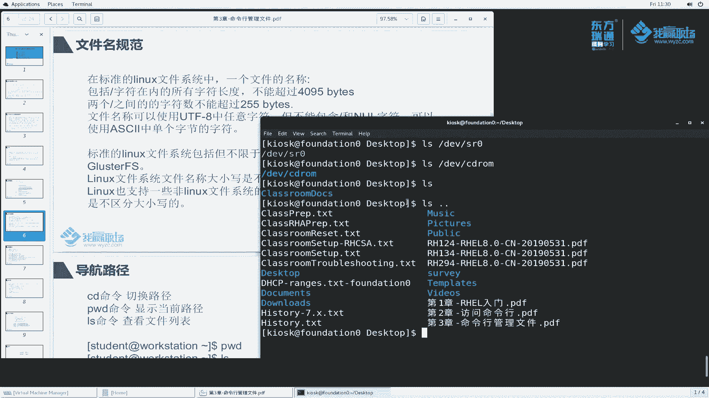

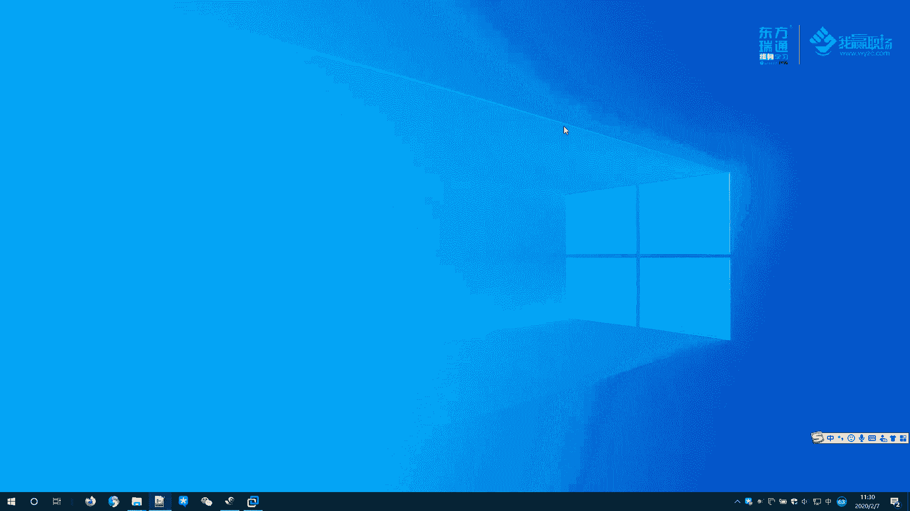

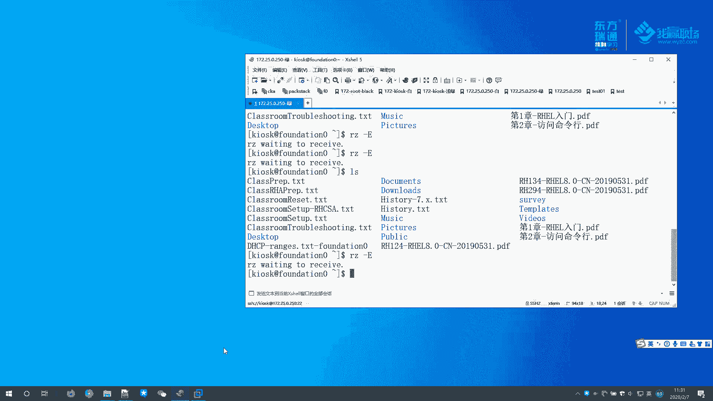

这是我们讲的文件名啊。那么再来看一下Lux文件系统当中啊，它这个文件系统啊包括但不限于这么一些。啊，这是常见的文件系统linkux里边的啊，其实文件系统是什么一个概念呢？

那么后续我们还会给大家展开来说啊，这个地方呢仅仅给大家提一下啊。windows里面我们都知道C盘D盘E盘现在常见的是NTFS的文件系统吧。那么lins里面常见的。是EXT4啊，当前的啊还有一个什么呢？

还有一个XFS文件系统，这是目前最常见的两种啊两种。那么对于EXT2T3都是以前非常老的这么一个文件系统，用的都比较少啊，版本二的版本3呢，当前使用是版本4和XS那么XFS呢其实用的比这个还多一些。

还有这么一些啊文件系统。那么这些文件系统呢都比较特殊。我们呃有机会再给大家讲啊。这个呢我们对于单机版本，我们在HHCE里面学习的内容啊基本上不涉及啊，只到只知道它它有这么一个文件系统就可以了啊。

那还有一些规定，类文件系统的文件名称啊，它大小也是不一样的不一样的啊。例如说我来给大家看一个啊，那么我们来LS一下LS我写一个什么classroom type补全。

那么它能够查到我LS例如说我们再写一个classroom啊。那么这个地方最后一个S小S然写成大S来写上。

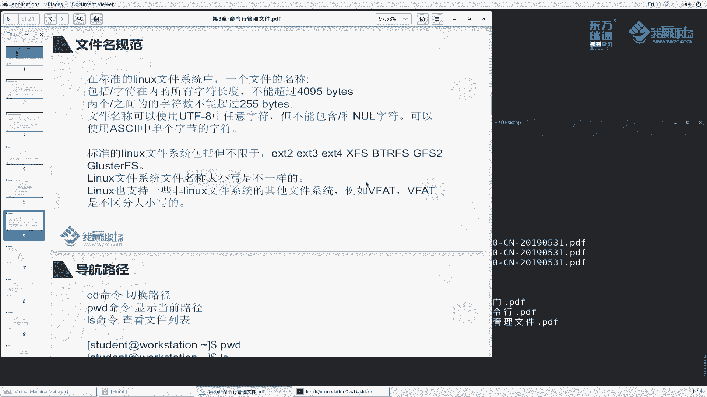

大家来看一看，他说什么，他是就找不到了吧。所以说他是一个大小写敏感的。

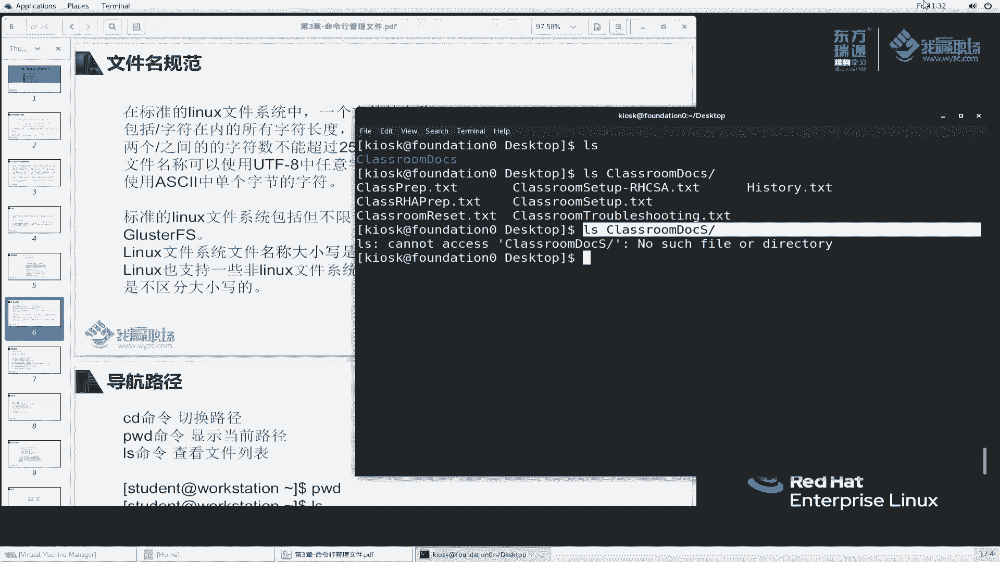

那在windows里边是不是这样子呢？那么我们来看一看windows里面它的一个文件系统啊，我们看一下C盘属性。他用的文件系统是NTFS文件系统。那么同样的我们来做这么一个事情啊。

我就来我刚刚看的是D盘吧，是D盘还是C盘。再来看一下D盘NTFS那么我们到DD盘里面来，我做一个事情啊，来我们新建一个文件。文件呢我们就就以这个为例哈，他的文件名我们写个A。啊，那么我再来新建一个文件。

这个文件呢我给它取名叫什么？叫大A。其实大家就看出来了，说将这个是否将这个新建文本的这个A命名重命名为这个A括号2嘛，大家看到了是吧？A跟这个A点2是重名的啊，重名了。所以说它它不能这么命名，对吧？

不能这么命名啊，那么我们把它删掉。在link里面，它是非常敏感的OK啊。

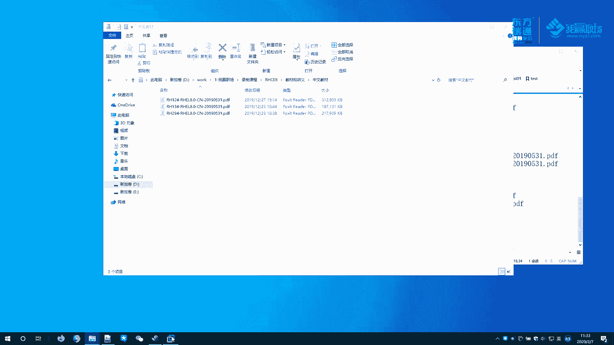

那么lin windows里面大家还会常见一叫fat啊，fat32。经常我们插U盘的时候，大家有时候去拷U把文件往U盘里面拷，拷贝的时候发现拷不进去了。但是呢这个文件U盘里面空间还是很大的。

那么发现一个什么问题啊，他说你这个文件系统啊是f3害，那么单个文件大小啊不能超过4个G啊，怎么办呢？他说你要想拷贝啊，你把它格式化成NDFS是不是会遇到吧啊。

那另s也支持一些finix文件系统当中的其他文件。那叫Vfat虚拟的这个fat。当你windows里面啊，当windows里面，你的这个普通的U盘格式化成fint32了。

那么这个fint32插到linkux上面，它默认是不识别的，是不是啊，你都是linux文件系统，那我不识别怎么办呢？那么。他会把它怎么办？他会把它识别成wifi的格式。

Vfi格式啊fa32的磁盘插到我们类似系统上面，它会把它识别成微fi格式。这样呢我们就可以对这种移动介质呢进行一个读写了。啊，也是非常方便的啊。linkice里面还有一个比较好玩的，就是你U盘插上去啊。

它如果说你你没有开启这个桌面环境里边的一个自动挂载啊，你U盘插上去没有任何反应，它不会给你自动自动挂载。windows里面U盘往一插，它就给你自动打开了，是吧？啊，这个样子。

当然你说这个U盘没有自动挂载的情况下，那我又怎么去把它挂载上去呢？好，后续的内容呢我们会给大家去讲解。OK那这节课呢我简单的给大家总结一下啊，讲了这么几个内容。😊。

首先呢我们给大家讲了一个文件系统的层次结构。到反过来这个树形结构，然后呢给大家讲一下这个这个树形结构里面的目录怎么来的？有这么一个小故事啊。然后呢，这个FFFHS是给我告诉我们啊，他有这么一个规定啊。

规定这个树形结构啊是怎么存放啊存放。以及呢这个文件名的规范目录啊，以及它的一个大秀啊文件系统等等等这么一个规范。好的，这节课呢我们就讲到这里面。

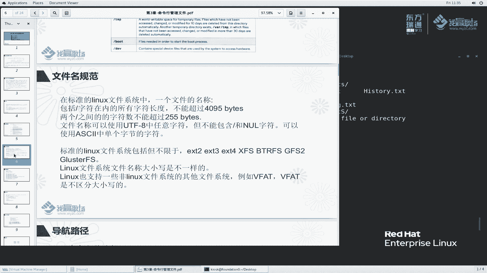

下节课呢我们再接着说。

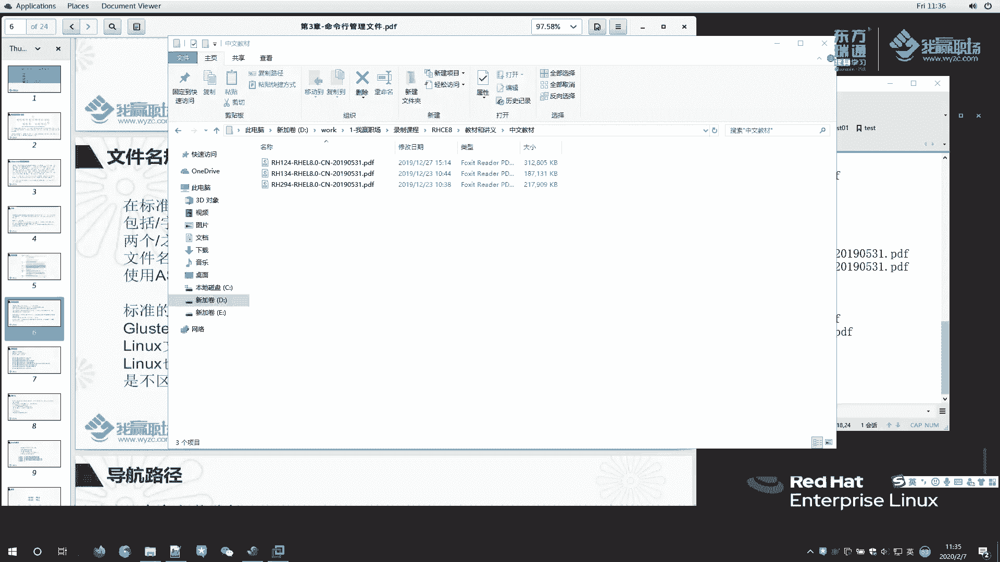